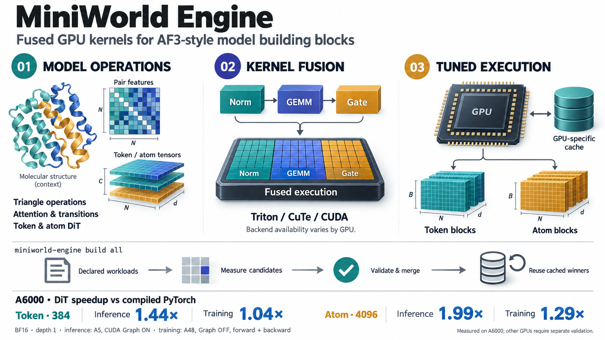

# miniworld-engine



[Figure details and measurement scope](docs/assets/README.md).

GPU kernel library for MiniWorld / AF3-style ops. Each op is cut out of the model and
optimized in isolation: **hand-written CUDA where it exists, a Triton fallback everywhere
else**, and a PyTorch reference that defines what "correct" means.

> **Where this fits.** miniworld-engine is the bottom layer of a three-layer stack: it owns
> the fused kernels and building-block ops; **team-gm** composes them into representative AF3
> blocks; terminal product repos assemble those into full models. Boundary rules live in
> team-gm's `docs/ARCHITECTURE.md`.

**Version 2.2.0** — CUDA + Triton only (CuTe/quack removed), torch 2.13 / cu129,
cuequivariance 0.12. [Changelog](docs/releases/CHANGELOG.md) · [releases](docs/releases/) ·
[attribution](licenses/THIRD_PARTY_NOTICES.md).

| I want to… | go to |
|---|---|
| know what is finished on a GPU, for which shapes | [docs/status/](docs/status/README.md) |
| run on a specific GPU cluster | [docs/gpus/](docs/gpus/README.md) |
| read everything else | [docs/README.md](docs/README.md) |
| work on this repo as an agent | [AGENTS.md](AGENTS.md) |

## Quickstart

Four steps, and the first three need no GPU. Every command in this section is executed by
`tests/layout/test_quickstart_runs.py`, so it cannot drift from what the code does.

**1. Install.** The library is a normal wheel; `[bench]` and `[baselines]` are extras you do not need
to read a number.

```bash
# cpu
python -m pip install -e .
```

**2. Check what you have.** Prints the version and the config set every triton kernel will search
if you do nothing else.

```bash
# cpu
python -c "import miniworld_engine as m; print(m.__version__)"
python -c "from miniworld_engine.autotune import configs; print(configs.default_config_dir())"
```

**3. See what the library declares.** One row per kernel: which backend, which arch it requires,
which tolerance it is held to.

```bash
# cpu
python -c "
import csv, collections, miniworld_engine.kernels as k, pathlib
reg = pathlib.Path(k.__file__).parent / 'registry' / 'registry.csv'
rows = list(csv.DictReader(reg.open()))
print(len(rows), 'kernels;', dict(collections.Counter(r['backend'] for r in rows)))"
```

**4. Run them, on a GPU.** This launches every kernel that has a driver and compares each against
its torch reference. It is the fastest way to find out whether this library works on your card,
and it writes `autotune/manifests/<your card>.csv` recording what it found.

```bash
# gpu
python -m miniworld_engine.autotune.run_all
```

The summary reports `declared`, `driven`, `ok`, `failed`, and `skipped` counts for the
current registry and device. `skipped` distinguishes unsupported architecture/dtype cases;
missing drivers and execution failures are reported separately. See
[docs/getting-started/supported.md](docs/getting-started/supported.md) for what has actually been run, and
[docs/getting-started/troubleshooting.md](docs/getting-started/troubleshooting.md) when a step does not do this.

**Then:** using the kernels means `from miniworld_engine import ops` — eight whole-op entry points
that take the same arguments as their torch equivalents. Getting them *fast* on your card means
building a tuned cache with `miniworld-engine build all`. Its work depends on the GPU,
current source and existing valid measurements; use `dev coverage` to inspect a specific GPU cache.
## Layout

```
src/miniworld_engine/
├── kernels/            fusion units — one folder per family
│   ├── <family>/       reference.py · interface.py · [dispatch.py] · [whole_op.py]
│   │                   cuda/ · triton/ backends · notes/ (dated optimization logs)
│   ├── drivers/  checks/   autotune-capture harness: one module per registry family
│   └── registry/       registry.csv (declared kernels) · registry_module.csv (model shapes)
│                       · registry_kernel.csv (derived plan) · exemption / evidence lists
├── modules/            model ops: connect kernels, no backend folders
├── integrations/       hand-CUDA entry points wired into modules (trimul_h100, token_dit, …)
├── autotune/           tuner, cache reader/builder · configs/{default,grid,ab/} · data/ (per-GPU caches)
├── build/              cache-build matrix and audits
├── ops/                whole-op public API (`from miniworld_engine import ops`)
├── viz/  cli.py  settings.py
benchmarks/             runners/bench.py + {kernels,modules}/<target>/configs · results/<gpu>/
tests/                  CPU contracts; `@pytest.mark.gpu` for device tests
docs/                   see docs/README.md
scripts/                one-off maintenance scripts (anthropic/, hopper/, slurm/, audit/)
third_party/  licenses/ upstream provenance and license texts
```

Every kernel family has the same shape, enforced by `tests/layout/test_kernel_layout.py`:
`reference.py` (the torch definition checks compare against), `interface.py` (the family's one
public door), optional `dispatch.py` (a choice among implementations) and `whole_op.py`
(a whole layer with weights as arguments), and backend packages `cuda/` / `triton/`.

## Benchmarking

One entry point: `benchmarks/runners/bench.py` with a target's `configs/bench.yaml`
(`target=<name> level=module|kernel`). Final numbers are compiled and CUDA-graph timed; the
CSV is the source of truth and plots are rendered from it. Conventions:
[docs/benchmarks/](docs/benchmarks/README.md) · traps: [cautions](docs/benchmarks/cautions.md) ·
cluster commands per GPU: [docs/gpus/](docs/gpus/README.md).

## torch.compile

Every kernel entry point is registered as an opaque `torch.library` op, so a compiled model is
ONE graph rather than one per kernel — a pairformer block traces to 1 graph / 0 breaks instead of
27 / 26. That is `settings.compile_wrap="custom_op"`, the default.

```bash
MINIWORLD_COMPILE_WRAP=disable   # the other mode: a graph break at every kernel entry
```

`disable` is kept for A/B and as the escape hatch: it is the mode that needs no `fake`, so it
still works if one is ever wrong. It has to come from the environment because the value is read
when the kernel modules IMPORT — `settings.configure()` from a parent process is too late.

The default matters beyond fusion. Under `disable`, inductor's cudagraph-trees
(`mode="reduce-overhead"`) bail on the breaks and end up SLOWER than eager, and a manual
`torch.cuda.graph` capture over a compiled module dies with `cudaErrorStreamCaptureInvalidated`.
Numbers, and the scripts that produced them: `benchmarks/compile_wrap/`.

## Supported hardware

Every kernel declares its minimum architecture in `kernels/registry/registry.csv`'s `arch` column, and the
table below is checked against that column by `tests/registry/test_hardware_support.py` — so it cannot drift
from the code.

<!-- BEGIN GENERATED: hardware-support -->
| arch | GPUs | kernels | backends |
|---|---|---|---|
| **sm80+** | A100, A5000, A6000, RTX 4090 | 106 | triton 100, cuda 6 |
| **sm90+** | H100 | 10 | cuda 6, triton 4 |
<!-- END GENERATED: hardware-support -->

**The minimum supported architecture is sm80.** The generated table above states each
registered kernel's minimum architecture; it is not a numerical qualification for every
listed GPU. Portable Triton paths and higher-architecture Triton/CUDA alternatives are
selected by `modules/dispatch.py`. `implementation='triton'` explicitly selects the
Triton backend; native CUDA variants can require a newer architecture.

One extension is **not** in the table because it is not in the registry: `transition_b2b_cuda`,
which the `Transition` module builds on demand, is compiled for `sm_90a` and fails to build on
sm_86 ("Error building extension"). `autotune/builder.py` excludes `cuda` from that case's
implementations for exactly this reason.
## CLI

`miniworld-engine` (installed by the package; `python -m miniworld_engine.cli` works too):

```bash
miniworld-engine build all            # verify the current model plan, then fill its cache gaps
miniworld-engine build all --resume   # default: reuse compatible completed measurements
miniworld-engine dev coverage --arch sm86    # default cache key: NVIDIA RTX A6000 (sm86)
miniworld-engine dev audit            # registry, tuning and build-system contract checks
```

`build all` runs only the configured FoldForge/MiniWorld module shapes, then checks
required cache coverage after merging. Unreachable diagnostic kernels are not appended to
the default build; use explicit `--per-op` for a separate kernel experiment.
[Model shape policy](docs/records/reports/model-shape-cleanup-20260916.md). Declared invocations, selected work and cache keys
are different counts; the command prints them for the current source and GPU.
A claim file alone does not prove completion: resume requires reusable measurement shards
and matching provenance. `--no-resume` disables completed-shard reuse.

`build` writes to the installed package's `autotune/data/` directory
(`src/miniworld_engine/autotune/data/` in a checkout). It requires a writable installation
or checkout and does not automatically commit results. A successful cache build does not
replace module numerical tests or benchmarks. Full policy:
[dispatch-cache.md](docs/autotune/dispatch-cache.md).
## Research history

Research capsules that produced the hand-CUDA paths were removed from the tree in 2.2.0; only
the fastest variant of each lives in `src/`. Where each went, and how to read it back from
git: [docs/records/experiments-archive.md](docs/records/experiments-archive.md).

## Toolchain

One-time, per clone — git will not let a repository point itself at its own hooks:

```bash
git config core.hooksPath .githooks   # refuses to commit tuned cache data with code
```

```bash
pixi run ruff-check     # lint  (src tests benchmarks)
pixi run types          # ty    (src tests benchmarks) -- gates CI, no findings allowed
pixi run test           # all tests not marked gpu, on an allocated CPU node
pixi run test-gpu       # all tests marked gpu, on an allocated GPU node
pixi run ci             # all three, in CI's order
```

`ty`, not pyright: pyright cannot parse jaxtyping shape strings
(`Float[torch.Tensor, "N S 3"]`) and reported 144 parse errors and no real findings, so
`[tool.pyright]` turns it off and exists only to keep an editor quiet.
