# AdaptiveLayerNorm on A100 (sm80)

Kernel-level status of AdaptiveLayerNorm (AF3 Algorithm 26, the conditioning path of the DiT blocks: `y = sigmoid(to_scale(LN(c) w)) * LN(x) + to_bias(LN(c) w)`, LayerNorm of `x` without affine, the
conditioning normalised with its own weight `w`, `to_scale` with a bias, `to_bias` without) on A100; the module-level summary is in [../a100.md](../a100.md), the ConditionedTransition that embeds it is in
[../conditioned_transition/conditioned_transition.md](../conditioned_transition/conditioned_transition.md). Columns are (Length, Dimension) from the shape registry (`adaptive_layernorm`): the atom stream (d_hidden 128, d_cond 128,
N = 1024 k atoms) and the token stream (d_hidden 768 with d_cond 384 or 768, L = 128 k), bf16 and fp32 (TF32 tensor cores), inference and training, a conditioning per sample and one shared by the samples.

Summary (2026-10-04). Before this work the A100 ran the module's Triton kernels (`kernels/adaln/triton`: LayerNorm of the conditioning + two projection GEMMs, the gated epilogue, the backward row passes and
the weight-gradient reductions; the committed cache of `adaln_fwd_triton` was stale on this toolchain, so even those ran a heuristic grid). Everything it does is hand CUDA or cuBLAS now, from `AdaptiveLayerNorm.forward`
through `integrations/adaln_sm80.py`: **a composition** (row kernels around one cuBLAS GEMM, any width, bf16 and fp32) and, for the atom width, **fused tensor-core kernels** (bf16 forward and backward; fp32 inference on TF32 tensor cores) that never write the
`[M, 256]` scale | bias of the composition (the bf16 forward is one kernel moving 768 bytes a row, the fp32 one 1.5 KB; the bf16 backward is one kernel plus the two weight-gradient GEMMs). Against PyTorch compiled (`bench.py`, CUDA graph, A100 80GB PCIe;
there is no cuEquivariance and no Anthropic arm for this module, so the x column is against PyTorch compiled and never against the Triton path): **bf16** inference 1.52-2.19x at the atom width, 1.03-1.11x at the token widths up to L = 384 and 0.92-1.00x at L = 512 .. 768 (see "what was tried": cuBLAS wave quantization), training 1.27-1.59x (atom) and 1.01-1.17x (token);
**fp32** inference 1.29-1.91x (atom: the fused TF32 kernel; N = 1024 runs the Triton path) and 0.93-1.14x (token), training 1.13-1.20x (atom) and 1.07-1.16x (token). The Triton path this replaces is slower than ours at almost every registry row (exceptions: bf16 inference at 768 / 384, L = 512, where ours is 5.8 % slower in the bench -- a same-process GPU-time A/B has ours 15 % faster there -- and fp32 inference at 768 / 384, L = 768, 1 % slower; the fp32 N = 1024 row is the Triton path itself; see Measurements).
The token stream is GEMM-bound -- the three cuBLAS products are 53 % of our training step (88 % of their FLOP floor) and 56 % of PyTorch's -- so there the CUDA path is on par with PyTorch compiled and well ahead of the Triton path. Accuracy
matches the bf16 PyTorch module: the output and every gradient are within 1.00x of its error against the fp32 module (0.90-0.93x for the output, 0.8-0.9x for a conditioning gradient), fp32 within TF32 accuracy (2.9e-4 relative, as the Triton path's).
Speed of light (composite floor of the decomposition): training steps at 83-92 % (token, fp32) and 64 % (bf16 atom), inference at 33-66 % (small M: launch- and wave-bound); see Speed of light.

On A100 the module runs **hand-written CUDA and cuBLAS only** when the call matches the contract below; everything else keeps the module path (the Triton kernels). **Served**: implementation TRITON or MINIWORLD (the engine's
kernel backends, not PYTORCH) with `settings.engine_backend != "triton"`, an A100 (capability exactly 8.0), CUDA tensors, the module's compute dtype bf16 or fp32 (the autocast dtype, else the dtype of `x`; the
fp32 products run on TF32 tensor cores whatever the caller's `allow_tf32`), `d_hidden` and `d_cond` each 128, 384 or 768, the AF3 parameter set (cond norm weight, `to_scale` bias, no `to_bias` bias), and a conditioning per row
of `x` (`cond` has the leading dims of `x`) or -- without gradient -- one conditioning shared by the samples of `x` (first dim expanded: stride 0, or size 1: inference reads an `L`-row table, never `A` copies; a training
call expands the shared conditioning and autograd sums the per-row gradients back, as the Triton path's `expand` does). Any L and any number of samples, except fp32 inference at d = dc = 128 with fewer than 8192 rows (the registry's N = 1024, A = 5), which the module's Triton path serves because it is 10-12 % faster there (`MINIWORLD_ADALN_FP32_ATOM_MIN_ROWS=0` serves it on CUDA; see "what was tried"). `MINIWORLD_ADALN_SM80=0` turns the whole path off (the "Triton path" columns
below); `MINIWORLD_ADALN_ATOM=0` keeps the composition at the atom width (the fused kernels off); `MINIWORLD_ADALN_ATOM_CFG=0|1|2` pins the fused forward's configuration; `MINIWORLD_ADALN_BRANCH=0` runs the weight-gradient GEMM of the composition's backward on the current stream (it runs on a second stream beside the data gradient's GEMM and `cond_ln_bwd` otherwise). A failed extension build warns once and keeps
the module path. Under `torch.compile(fullgraph=True)` the build runs once at trace time (`_loads()` is a process constant) and the op is a node of the graph, bit-identical to eager.

- **Where the code is**: `kernels/adaln/cuda/sm80.py` (loader and wrappers) over `kernels/adaln/cuda/sm80/` (`adaln_rows.cuh`: the row kernels; `adaln_finish.cuh`: the closing pass; `adaln_atom_fwd.cuh`, `adaln_atom_bwd.cuh`: the fused
  atom kernels, `adaln_atom_fwd_tf32.cuh` + `adaln_tf32.cuh`: their fp32 (TF32) twin; `adaln_mma.cuh`, `adaln_common.cuh`, `adaln_launch.cuh`: `mma.sync` / `cp.async` helpers, the f1 weight order, vectors; `ops.cu`: the bindings), the glue in `integrations/adaln_sm80.py`
  (gate `serves`, the opaque ops `adaln_sm80_inference` / `adaln_sm80_train_fwd` / `adaln_sm80_train_bwd`, the autograd Function) and the hook in `modules/adaptive_layernorm/module.py`. The extension is built on first use
  (`load_extension`, never at import) into `~/.cache/torch_extensions` (`adaln_sm80`).
- **Inference** (one opaque op, no autograd). Composition: `cond_ln` (aff = LN(cond) w, one pass over the conditioning rows -- the `L` rows of a shared conditioning) -> one cuBLAS GEMM `[S | B] = aff [Ws; Wb]^T` (the weights packed once per
  parameter version) -> `adaln_epi` (LN(x), the gate sigmoid(S + sb) and the sum in one pass; row r reads table row r % period). Atom width: `adaln_atom_fwd` alone (bf16) or `adaln_atom_fwd_tf32` alone (fp32, TF32 tensor cores).
- **Training** (an autograd Function; forward and backward are each one opaque op, kept as nodes by `torch.compile`). Composition, forward: `cond_ln` (+ the cond statistics) -> cuBLAS GEMM -> `adaln_epi` (+ the x statistics), saving aff, [S | B]
  and the packed weights; backward: `adaln_bwd_x` (recomputes the gate from [S | B]; writes `D = [dscale | dy]` and dx in one pass) -> cuBLAS `dcond_aff = D [Ws; Wb]` (fp32) and `[dWs; dWb] = D^T aff` (fp32) -> `cond_ln_bwd` (dcond, the cond norm's
  weight gradient) -> `finish` (the column sums d sb, d w and the casts of the weight gradients to the parameter dtype: one launch). Atom width, bf16: the forward kernel writes y and the two statistics only; the backward is
  `adaln_atom_bwd` (everything between dy and dx / dcond / dscale / aff in one kernel) + two cuBLAS weight-gradient GEMMs + `finish`.
- **Numerics.** Statistics, sums and accumulators are fp32 whatever the row dtype (`tests/registry/test_layernorm_is_never_bf16.py`); the GEMM operands are bf16 (aff is rounded to bf16 where the framework's GEMM operand is),
  fp32 accumulation. The composition rounds `[S | B]` to bf16 as the cuBLAS output (the Triton path kept the accumulator); the fused kernels never round it (the sigmoid and the sum read the fp32 accumulators), so they are
  slightly *more* accurate than the module. Every column sum is a fixed-order sum of per-block partial rows (no atomics): a training step is bit-reproducible. fp32 (TF32) runs the same code with fp32 rows and TF32 GEMMs (cuBLAS), or, at the atom width in inference, one fused kernel whose `mma.sync m16n8k8` operands are rounded to TF32 (nearest, ties away, as `cvt.rna.tf32.f32` does) with fp32 accumulation: the error against the fp32 module is the cuBLAS TF32 composition's and the Triton TF32 path's (2.9e-4 relative).
- **Tests**: `tests/integrations/test_a100_adaln_gpu.py` (84 tests, one file per process): inference (a conditioning per sample, shared; bf16 L = 50 / 128 / 200 / 384 at the three registry widths, fp32), training (output and every
  gradient: x, cond, norm weight, `to_scale` weight and bias, `to_bias` weight), each held to the bf16 PyTorch module's own error against the fp32 module (fp32: to TF32 accuracy), the gate predicate, the env switch,
  `torch.compile(fullgraph=True)` equal to eager (inference and a training step), CUDA-graph capture and replay, bit-reproducible training, and **no Triton kernel launched on the default path** (every `@triton.jit` launch counted)
  for the registry widths in both dtypes (fp32 at the atom width above the 8192-row gate), a forward + backward step captured in a CUDA graph (the second-stream branch forks and joins inside the capture) replaying bit-identically to eager, `MINIWORLD_ADALN_BRANCH=0` giving the same bits, the fp32 few-rows gate, and the packed weights following an in-place update (an optimizer step; also the casts of fp32 master weights under autocast); `tests/integrations/test_a100_adaln_gate.py` (CPU: the conditioning-period rule, CPU tensors never served, the widths, the atom gate).
- 성능 확인 is the maintainer's column (✗ = not confirmed). cache build ✓: nothing on these paths autotunes -- fixed launch shapes and cuBLAS; the stale `adaln_fwd_triton` cache of the Triton path is not used any more at
  the registry shapes.

## AdaptiveLayerNorm · registry shapes

Three paths cover the registry; every shape of every path runs CUDA (hand kernels and cuBLAS) by default.

### Inference

#### Composition · token stream, bf16 and fp32 · `cond_ln_kernel` -> cuBLAS -> `adaln_epi_kernel` (d_cond 384 and 768)

| (Length, Dimension, dtype) | (128, 768, bf16) | (256, 768, bf16) | (384, 768, bf16) | (512, 768, bf16) | (640, 768, bf16) | (768, 768, bf16) | (128, 768, fp32) | (256, 768, fp32) | (384, 768, fp32) | (512, 768, fp32) | (640, 768, fp32) | (768, 768, fp32) |
|---|---|---|---|---|---|---|---|---|---|---|---|---|
| implementation | CUDA | CUDA | CUDA | CUDA | CUDA | CUDA | CUDA | CUDA | CUDA | CUDA | CUDA | CUDA |
| 성능 확인 | ✗ | ✗ | ✗ | ✗ | ✗ | ✗ | ✗ | ✗ | ✗ | ✗ | ✗ | ✗ |
| cache build | ✓ | ✓ | ✓ | ✓ | ✓ | ✓ | ✓ | ✓ | ✓ | ✓ | ✓ | ✓ |

#### Fused · atom width, fp32 (TF32) · `adaln_atom_fwd_tf32_kernel` (one launch)

| (Length, Dimension, dtype) | (1024, 128, fp32) | (2048, 128, fp32) | (3072, 128, fp32) | (4096, 128, fp32) | (5120, 128, fp32) | (6144, 128, fp32) | (7168, 128, fp32) | (8192, 128, fp32) |
|---|---|---|---|---|---|---|---|---|
| implementation | Triton | CUDA | CUDA | CUDA | CUDA | CUDA | CUDA | CUDA |
| 성능 확인 | ✗ | ✗ | ✗ | ✗ | ✗ | ✗ | ✗ | ✗ |
| cache build | ✗ | ✓ | ✓ | ✓ | ✓ | ✓ | ✓ | ✓ |

(1024, 128, fp32) is the one shape of this page the default dispatch hands to the module's Triton path (fewer than 8192 rows: see the contract); its cache is the stale `adaln_fwd_triton` one (a heuristic grid, `UserWarning` in the log), hence cache build ✗.

#### Fused · atom width, bf16 · `adaln_atom_fwd_kernel` (one launch)

| (Length, Dimension, dtype) | (1024, 128, bf16) | (2048, 128, bf16) | (3072, 128, bf16) | (4096, 128, bf16) | (5120, 128, bf16) | (6144, 128, bf16) | (7168, 128, bf16) | (8192, 128, bf16) |
|---|---|---|---|---|---|---|---|---|
| implementation | CUDA | CUDA | CUDA | CUDA | CUDA | CUDA | CUDA | CUDA |
| 성능 확인 | ✗ | ✗ | ✗ | ✗ | ✗ | ✗ | ✗ | ✗ |
| cache build | ✓ | ✓ | ✓ | ✓ | ✓ | ✓ | ✓ | ✓ |

### Training

#### Composition · token stream, bf16 and fp32 · forward `cond_ln_kernel` -> cuBLAS -> `adaln_epi_kernel`; backward `adaln_bwd_x_kernel` -> cuBLAS (dgrad, wgrad) -> `cond_ln_bwd_kernel` -> `finish_kernel`

| (Length, Dimension, dtype) | (128, 768, bf16) | (256, 768, bf16) | (384, 768, bf16) | (512, 768, bf16) | (640, 768, bf16) | (768, 768, bf16) | (128, 768, fp32) | (256, 768, fp32) | (384, 768, fp32) | (512, 768, fp32) | (640, 768, fp32) | (768, 768, fp32) |
|---|---|---|---|---|---|---|---|---|---|---|---|---|
| implementation | CUDA | CUDA | CUDA | CUDA | CUDA | CUDA | CUDA | CUDA | CUDA | CUDA | CUDA | CUDA |
| 성능 확인 | ✗ | ✗ | ✗ | ✗ | ✗ | ✗ | ✗ | ✗ | ✗ | ✗ | ✗ | ✗ |
| cache build | ✓ | ✓ | ✓ | ✓ | ✓ | ✓ | ✓ | ✓ | ✓ | ✓ | ✓ | ✓ |

#### Composition · atom width, fp32 · the same launches at d = 128

| (Length, Dimension, dtype) | (1024, 128, fp32) | (2048, 128, fp32) | (3072, 128, fp32) | (4096, 128, fp32) | (5120, 128, fp32) | (6144, 128, fp32) | (7168, 128, fp32) | (8192, 128, fp32) |
|---|---|---|---|---|---|---|---|---|
| implementation | CUDA | CUDA | CUDA | CUDA | CUDA | CUDA | CUDA | CUDA |
| 성능 확인 | ✗ | ✗ | ✗ | ✗ | ✗ | ✗ | ✗ | ✗ |
| cache build | ✓ | ✓ | ✓ | ✓ | ✓ | ✓ | ✓ | ✓ |

#### Fused · atom width, bf16 · forward `adaln_atom_fwd_kernel` (+ the statistics), backward `adaln_atom_bwd_kernel` + two cuBLAS weight-gradient GEMMs + `finish_kernel`

| (Length, Dimension, dtype) | (1024, 128, bf16) | (2048, 128, bf16) | (3072, 128, bf16) | (4096, 128, bf16) | (5120, 128, bf16) | (6144, 128, bf16) | (7168, 128, bf16) | (8192, 128, bf16) |
|---|---|---|---|---|---|---|---|---|
| implementation | CUDA | CUDA | CUDA | CUDA | CUDA | CUDA | CUDA | CUDA |
| 성능 확인 | ✗ | ✗ | ✗ | ✗ | ✗ | ✗ | ✗ | ✗ |
| cache build | ✓ | ✓ | ✓ | ✓ | ✓ | ✓ | ✓ | ✓ |

## Kernels

### K1 · `cond_ln_kernel` (aff = LN(cond) w, + the cond statistics; `adaln_rows.cuh`)

One warp per row (four rows per block): lane l holds the 4-element vectors at columns 4 (32 v + l) .. +3, v < d / 128 (an 8-byte bf16 / 16-byte fp32 load, 256 / 512 contiguous bytes a warp-wide), every load of the row issued before the first
sum; the mean and the variance are two warp shuffles reductions (fp32, `rsqrt`), no block barrier. The result is written in the dtype of the GEMM operand (bf16 rounds here: the cond norm's output is what the framework feeds its linear). Training also writes
(mean, rstd) per row. At its byte floor at d_cond 384 (28.5 MB at A = 48, L = 384: 17.2 us, 103 %).

### K2 · `adaln_epi_kernel` (y = sigmoid(S + sb) LN(x) + B, + the x statistics)

Same row mapping; a row reads x, its table row r % P of the GEMM output (S in the first d columns, B in the last d) and the bias vector, and writes y with a single rounding: the composition's last pass, the one place where the
`[M, 2 d]` GEMM output is read. 88 % of its byte floor (113 MB at the token A = 48, L = 384 step: 80 us against 71).

### K3 · `adaln_bwd_x_kernel` (D = [dscale | dy], dx, the column sums of dscale)

Per row, from the saved (mean, rstd): xhat, the gate g = sigmoid(S + sb) recomputed from the saved GEMM output, dscale = dy xhat g (1 - g), dxhat = dy g, dx = rstd (dxhat - mean(dxhat) - xhat mean(dxhat xhat)) (+ the residual
gradient `dres` when the ConditionedTransition feeds one), all in one pass over dy, x and S; it writes the two halves of the GEMM operand D (dscale | dy, so that one cuBLAS GEMM does the data gradient and one the weight
gradients) and dx. The kernel is persistent (4 blocks of 4 warps per SM, rows dealt to the warps of the grid round-robin): each warp accumulates the column sums of dscale (d sb) in registers, the block's four warps are added in order through shared memory
and leave one fp32 partial row (no atomics). 97 % of its byte floor at the token step (109 us for 170 MB).

### K4 · `cond_ln_bwd_kernel` (dcond, the cond norm weight's column sums)

dcond = rstd (dchat - mean(dchat) - chat mean(dchat chat)) (+ `dextra`: the gate's d cond in a ConditionedTransition), dchat = dcond_aff w with dcond_aff the cuBLAS data gradient (fp32); persistent as K3, partial rows of
dcond_aff chat for d w. 70-90 % of its byte floor at the token step (50 us in the profile of job 63233, 40 us in another run, for 57 MB); the same 44-67 % at d = 128 fp32, where one lane has a single vector of the row to keep loads in flight.

### K5 · `finish_kernel` (the closing pass: column sums and casts, one launch)

The backward closes with the column sums of the partial rows (d sb, d w, the gate bias of a ConditionedTransition) and with the casts of the fp32 weight-gradient GEMM outputs (any strides: a transposed result is read through its
strides) to fresh contiguous tensors in the parameters' dtype. Before it these were a dozen small torch kernels per step -- among them two column `reduce_kernel`s at ~30 us each, 60 us of a 660 us step. One launch: a block takes a tile of
32 columns of one sum (16 warps deal the rows round-robin, the 16 partial sums are added in order) or 2048 elements of one cast. 6-7 us a step at the atom width, 9 us at the token AdaLN step (33 us inside a ConditionedTransition: 4.4 M weight-gradient elements to cast).

### K6 · `adaln_atom_fwd_kernel` (the whole forward at d = d_cond = 128, bf16; `adaln_atom_fwd.cuh`)

`aff = rn(LN(cond) w)`; `S | B = aff [Ws | Wb]^T` (two 128 x 128 products on `mma.sync m16n8k16`, fp32 accumulation, **not rounded**); `y = rn(sigmoid(S + sb) (x - mean) rstd + B)`: the three row-sized streams (x, cond in, y out: 768 bytes a row) are
all the kernel moves, the `[M, 256]` of the composition never exists. Persistent CTAs (8 warps, one or two per SM); the weights Ws | Wb (64 KB) stay in shared memory in the **f1 row order** (the weight rows are permuted so that a thread's
accumulators over the four n-tiles of a group of 32 output channels are 8 consecutive channels; those are also the channels of its next A fragment and of its 16-byte global loads and stores, and the lanes of a quad reduce a row's statistics: the cond rows
are loaded as the A fragments of the products, the x rows as the operand of the epilogue, with no shuffle between the stages; the 256-byte weight rows are swizzled `chunk ^ ((row & 1) << 2)` so `ldmatrix`-style 16-byte reads are
conflict-free). A warp owns 16 consecutive rows from the first load to the last store (row r reads conditioning row r % P). Three configurations: 0 = 8 warps x 2 CTAs per SM (the default at 8192 .. 24575 rows),
1 = 16 warps x 1, 2 = 8 warps x 1 whose warps prefetch their next tile's x and cond rows into a per-warp 8 KB staging buffer with `cp.async` while the current tile computes (the default from 24576 rows, 115 against 133 us at 147456 rows, and below 8192 rows, 12.9 against 13.7 us at 5120 rows: the registry's N = 1024, A = 5, where it made the module level with the Triton path).
Training also stores the (mean, rstd) of every x and cond row. 67 % of its byte floor at 147456 rows (107 us for 116 MB: the training forward also writes the statistics), 33 % at 15360 rows (22 us: one tile a warp, launch- and wave-bound; 13.7 us for 5120 rows).

### K7 · `adaln_atom_bwd_kernel` (the whole backward between dy and dx / dcond / dscale / aff, d = 128, bf16; `adaln_atom_bwd.cuh`)

Per 16-row tile: aff = rn(chat w) recomputed from the saved statistics (stored: the operand of both weight-gradient GEMMs), `scale = aff Ws^T` recomputed (same instruction order as the forward, fp32), g, dscale = dy xhat g (1 - g) (stored as bf16: the other
weight-gradient operand, and the A fragments of the next product), dxhat = dy g (spilled to a per-warp shared buffer between the two passes), the row sums, dx = rstd (dxhat - m1 - xhat m2) (+ `dres`), then **dcond_aff = dscale Ws + dy Wb**
as one chain of 32 `mma.sync`s per output tile with Ws^T and Wb^T in shared memory (fp32 accumulators in the f1 order: never rounded, never stored), and the cond LayerNorm backward on them (dcond (+ `dextra`), the column sums of
dcond_aff chat). The three weights (96 KB) are resident; x and cond are read again where needed (they are L2 hits: keeping them in registers made the 255-register kernel spill); d sb and d w leave as per-CTA partial rows.
One CTA of 8 warps per SM. 277 us at 147456 rows: 60 % of the 167 us byte floor (1.77 KB a row: dy, x, cond in; aff, dscale, dx, dcond out) -- and 338 us inside a ConditionedTransition (the residual gradient and the gate's `dcond2` are read too: 64 % of 214 us).

### K8 · `adaln_atom_fwd_tf32_kernel` (the whole forward at d = d_cond = 128, fp32 rows on TF32 tensor cores; `adaln_atom_fwd_tf32.cuh`, `adaln_tf32.cuh`)

The fp32 twin of K6 for inference (nothing is saved for a backward: the fp32 training step keeps the composition, whose backward reads the intermediates): `aff = LN(cond) w`, `S | B = aff [Ws | Wb]^T` on `mma.sync m16n8k8` (tf32 x tf32 -> fp32; the
operands are rounded to nearest, ties away, with `cvt.rna.tf32.f32` -- the bare instruction would truncate), `y = sigmoid(S + sb) (x - mean) rstd + B`, 1.5 KB a row (x, cond in, y out). The row layout is K6's with fp32 elements: lane = 4 g8 + q4 holds rows g8 and
g8 + 8 and, of a row, the 32 channels 32 gq + 8 q4 + 0 .. 7 of group gq as two 16-byte vectors; the A fragment of `m16n8k8` (a0 = A[g8][q4], a1 = A[g8 + 8][q4], a2 = A[g8][q4 + 4], a3 = A[g8 + 8][q4 + 4]) takes element s of the chunk as
"k = q4" and element s + 4 as "k = q4 + 4" of step s, so the fragments are the loaded registers (the k index of a step is free as long as the weights use the same order), and the accumulators of the four n tiles of an output group are again the 8
contiguous channels of the lane's chunk (the weight rows are stored in the `qf_channel` order). Ws | Wb stay in shared memory as fp32 (128 KB, rounded once per CTA at the staging prologue; one persistent CTA of 8 warps per SM, 242 registers, no spills),
the 8 floats a lane reads of a weight row for 32 inputs are stored as the pairs (e0, e4) (e1, e5) | (e2, e6) (e3, e7) so that one `LDS.128` is (b0, b1) of two consecutive k steps, and the four n tiles of both matrices -- eight independent accumulators --
are interleaved step by step: the accumulation of one tile is a dependent chain of 16 MMAs, and the first version (two accumulators interleaved) spent 2.3 stall cycles an instruction in fixed-latency waits (ncu: the largest after global-load latency, 2.4) and ran the tensor pipe at 22 %; the interleaved
loops and the fast `ex2` / `rcp` sigmoid made the kernel 1.16-1.26x faster (same-process A/B, A = 5, L = 1024 .. 8192). Rows: row r reads cond row r % P (a shared conditioning is an `L`-row table); any row count (the last tile is masked). 36 us at 15360 rows (41 % of the 14.7 us byte floor), 73 us at 40960 rows in a 10-step graph (Triton: 95 us).

## Measurements (2026-10-04)

`bench.py target=adaptive_layernorm` (module level, bf16 = the default `bf16-mixed` autocast with fp32 master parameters, fp32 = `precision=32`; a conditioning per sample; inference A = 5 samples, training A = 48; CUDA-graph timing, `cudagraph=manual`), A100 80GB PCIe, torch 2.13.0+cu129,
one frozen snapshot of the work tree (`snap_1004_021842`) and one node per dtype: the PyTorch and ours arms in one process, the Triton arm (`implementations=[triton]` with `MINIWORLD_ADALN_SM80=0 MINIWORLD_CONDTRANS_SM80=0`) in the next process of the same job, so the three columns of a row share a node
(jobs 63189 (bf16) and 63170 (fp32)). Milliseconds, medians of the bench's repeats; × = PyTorch compiled's time / ours -- this module has no cuEquivariance and no Anthropic arm (those columns are empty / `— (not measured)`), and the Triton path is a reference column, never the denominator.
The graph replay of a bench row carries ~10 us of launch latency that a profiled replay does not (a fixed cost of every row: it compresses the ratios of the 20-60 us rows), and the same kernel differs by ~10 % between nodes, so differences of a few percent between two columns are noise. Training is the fresh-gradient step of the bench
(`grad = None` before each step, forward + backward, parameter gradients included). `ours` is the default dispatch: the fused atom kernels at d = dc = 128 (bf16: inference and training; fp32: inference), the cuBLAS + CUDA-row composition elsewhere.

In the fp32 inference table of the atom width the (1024, 128) row of `ours` is the Triton column: the default dispatch hands fp32 inference of fewer than 8192 rows to the module's Triton path (see the contract). The (1024, 128) row of the bf16 atom inference table was re-measured on `snap_1004_085508` (job 63284: PyTorch, ours and the Triton path in one job) after one line of the AdaLN forward's configuration choice changed (the cp.async-prefetch configuration below 8192 rows; the main snapshot had 0.0195 against Triton's 0.0184); no other row is affected.

### Inference · atom, d_hidden 128 / d_cond 128 · bf16

| (Length, Dimension) | PyTorch compiled | cuEquivariance | Anthropic | Triton path | ours | × |
|---|---|---|---|---|---|---|
| (1024, 128) | 0.0276 | — | — (not measured) | 0.0184 | 0.0174 | 1.59 |
| (2048, 128) | 0.0379 | — | — (not measured) | 0.0225 | 0.0225 | 1.68 |
| (3072, 128) | 0.0451 | — | — (not measured) | 0.0348 | 0.0297 | 1.52 |
| (4096, 128) | 0.0543 | — | — (not measured) | 0.0379 | 0.0328 | 1.66 |
| (5120, 128) | 0.0553 | — | — (not measured) | 0.0573 | 0.0328 | 1.69 |
| (6144, 128) | 0.0799 | — | — (not measured) | 0.0625 | 0.0420 | 1.90 |
| (7168, 128) | 0.0840 | — | — (not measured) | 0.0686 | 0.0430 | 1.95 |
| (8192, 128) | 0.0942 | — | — (not measured) | 0.0614 | 0.0430 | 2.19 |

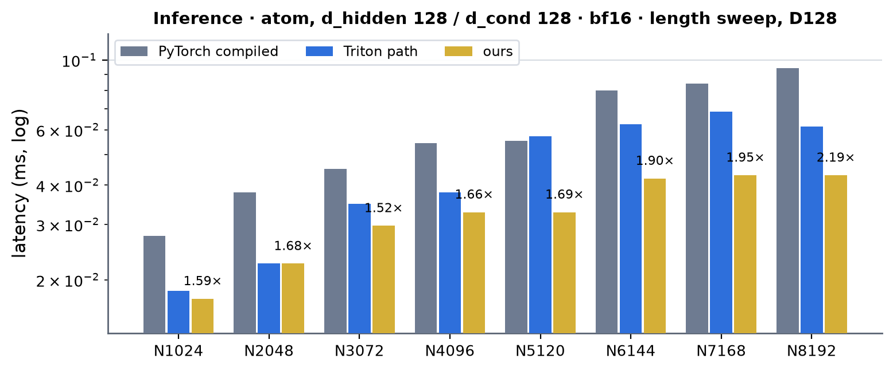 <!-- measure_bars -->

### Inference · atom, d_hidden 128 / d_cond 128 · fp32

| (Length, Dimension) | PyTorch compiled | cuEquivariance | Anthropic | Triton path | ours | × |
|---|---|---|---|---|---|---|
| (1024, 128) | 0.0317 | — | — (not measured) | 0.0246 | 0.0246 | 1.29 |
| (2048, 128) | 0.0461 | — | — (not measured) | 0.0348 | 0.0317 | 1.45 |
| (3072, 128) | 0.0645 | — | — (not measured) | 0.0522 | 0.0492 | 1.31 |
| (4096, 128) | 0.0819 | — | — (not measured) | 0.0573 | 0.0522 | 1.57 |
| (5120, 128) | 0.0973 | — | — (not measured) | 0.0707 | 0.0573 | 1.70 |
| (6144, 128) | 0.1147 | — | — (not measured) | 0.0829 | 0.0717 | 1.60 |
| (7168, 128) | 0.1321 | — | — (not measured) | 0.0922 | 0.0737 | 1.79 |
| (8192, 128) | 0.1485 | — | — (not measured) | 0.1004 | 0.0778 | 1.91 |

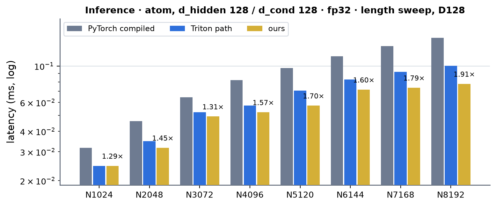 <!-- measure_bars -->

### Inference · token, d_hidden 768 / d_cond 384 · bf16

| (Length, Dimension) | PyTorch compiled | cuEquivariance | Anthropic | Triton path | ours | × |
|---|---|---|---|---|---|---|
| (128, 768) | 0.0266 | — | — (not measured) | 0.0328 | 0.0256 | 1.04 |
| (256, 768) | 0.0358 | — | — (not measured) | 0.0399 | 0.0328 | 1.09 |
| (384, 768) | 0.0410 | — | — (not measured) | 0.0461 | 0.0369 | 1.11 |
| (512, 768) | 0.0522 | — | — (not measured) | 0.0532 | 0.0563 | 0.93 |
| (640, 768) | 0.0553 | — | — (not measured) | 0.0635 | 0.0604 | 0.92 |
| (768, 768) | 0.0604 | — | — (not measured) | 0.0727 | 0.0635 | 0.95 |

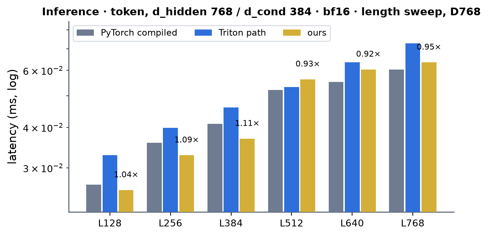 <!-- measure_bars -->

### Inference · token, d_hidden 768 / d_cond 384 · fp32

| (Length, Dimension) | PyTorch compiled | cuEquivariance | Anthropic | Triton path | ours | × |
|---|---|---|---|---|---|---|
| (128, 768) | 0.0348 | — | — (not measured) | 0.0410 | 0.0348 | 1.00 |
| (256, 768) | 0.0471 | — | — (not measured) | 0.0553 | 0.0471 | 1.00 |
| (384, 768) | 0.0543 | — | — (not measured) | 0.0707 | 0.0522 | 1.04 |
| (512, 768) | 0.0788 | — | — (not measured) | 0.0870 | 0.0707 | 1.12 |
| (640, 768) | 0.0860 | — | — (not measured) | 0.0922 | 0.0799 | 1.08 |
| (768, 768) | 0.0922 | — | — (not measured) | 0.0983 | 0.0993 | 0.93 |

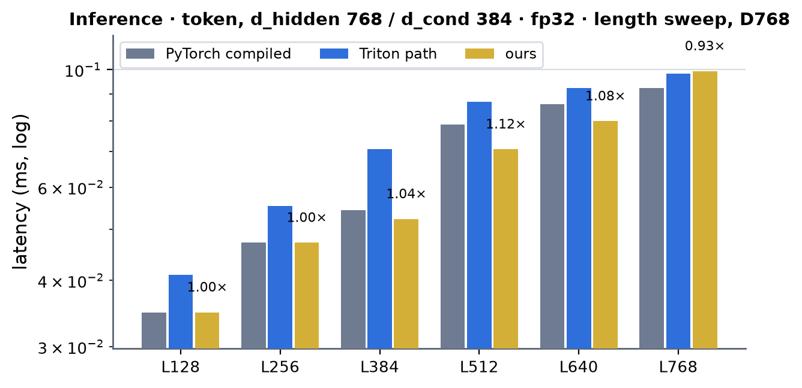 <!-- measure_bars -->

### Inference · token, d_hidden 768 / d_cond 768 · bf16

| (Length, Dimension) | PyTorch compiled | cuEquivariance | Anthropic | Triton path | ours | × |
|---|---|---|---|---|---|---|
| (128, 768) | 0.0317 | — | — (not measured) | 0.0471 | 0.0307 | 1.03 |
| (256, 768) | 0.0471 | — | — (not measured) | 0.0594 | 0.0430 | 1.10 |
| (384, 768) | 0.0512 | — | — (not measured) | 0.0696 | 0.0471 | 1.09 |
| (512, 768) | 0.0727 | — | — (not measured) | 0.0799 | 0.0768 | 0.95 |
| (640, 768) | 0.0758 | — | — (not measured) | 0.0952 | 0.0788 | 0.96 |
| (768, 768) | 0.0809 | — | — (not measured) | 0.1055 | 0.0809 | 1.00 |

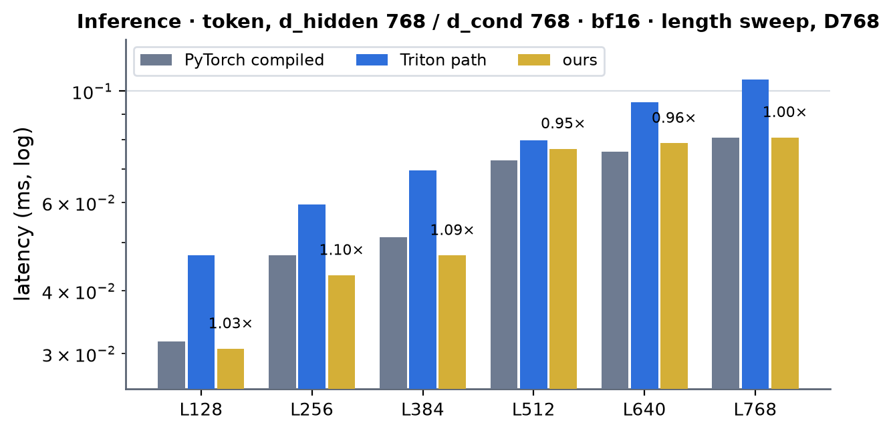 <!-- measure_bars -->

### Inference · token, d_hidden 768 / d_cond 768 · fp32

| (Length, Dimension) | PyTorch compiled | cuEquivariance | Anthropic | Triton path | ours | × |
|---|---|---|---|---|---|---|
| (128, 768) | 0.0471 | — | — (not measured) | 0.0666 | 0.0492 | 0.96 |
| (256, 768) | 0.0686 | — | — (not measured) | 0.0870 | 0.0666 | 1.03 |
| (384, 768) | 0.0758 | — | — (not measured) | 0.1004 | 0.0727 | 1.04 |
| (512, 768) | 0.1219 | — | — (not measured) | 0.1239 | 0.1065 | 1.14 |
| (640, 768) | 0.1290 | — | — (not measured) | 0.1464 | 0.1147 | 1.12 |
| (768, 768) | 0.1362 | — | — (not measured) | 0.1638 | 0.1444 | 0.94 |

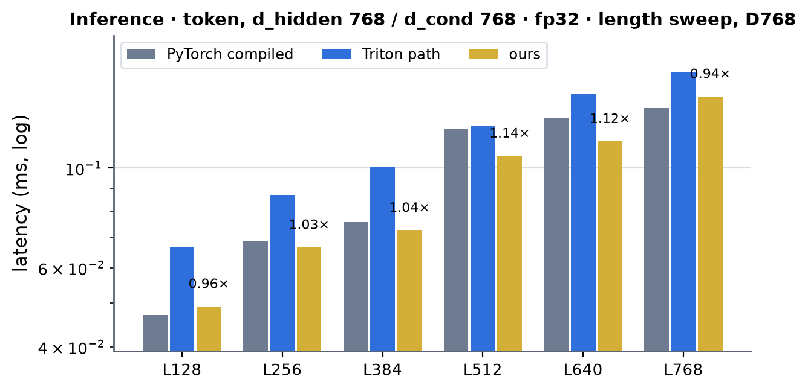 <!-- measure_bars -->

### Training · atom, d_hidden 128 / d_cond 128 · bf16 (CUDA graph)

| (Length, Dimension) | PyTorch compiled | cuEquivariance | Anthropic | Triton path | ours | × |
|---|---|---|---|---|---|---|
| (1024, 128) | 0.2826 | — | — (not measured) | 0.3297 | 0.2232 | 1.27 |
| (2048, 128) | 0.5796 | — | — (not measured) | 0.6216 | 0.3932 | 1.47 |
| (3072, 128) | 0.8202 | — | — (not measured) | 0.8960 | 0.5202 | 1.58 |
| (4096, 128) | 1.0445 | — | — (not measured) | 1.0747 | 0.6728 | 1.55 |
| (5120, 128) | 1.2780 | — | — (not measured) | 1.3158 | 0.8079 | 1.58 |
| (6144, 128) | 1.4920 | — | — (not measured) | 1.5647 | 0.9533 | 1.56 |
| (7168, 128) | 1.7295 | — | — (not measured) | 1.8053 | 1.0865 | 1.59 |
| (8192, 128) | 1.9425 | — | — (not measured) | 2.2154 | 1.2401 | 1.57 |

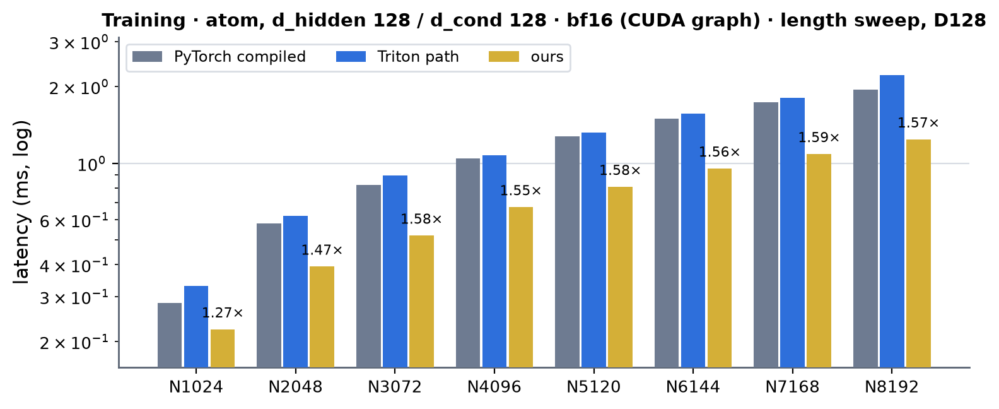 <!-- measure_bars -->

### Training · atom, d_hidden 128 / d_cond 128 · fp32 (CUDA graph)

| (Length, Dimension) | PyTorch compiled | cuEquivariance | Anthropic | Triton path | ours | × |
|---|---|---|---|---|---|---|
| (1024, 128) | 0.5212 | — | — (not measured) | 0.5612 | 0.4332 | 1.20 |
| (2048, 128) | 0.9769 | — | — (not measured) | 1.0409 | 0.8131 | 1.20 |
| (3072, 128) | 1.3957 | — | — (not measured) | 1.5252 | 1.1766 | 1.19 |
| (4096, 128) | 1.8145 | — | — (not measured) | 1.8801 | 1.5657 | 1.16 |
| (5120, 128) | 2.2395 | — | — (not measured) | 2.3849 | 1.9487 | 1.15 |
| (6144, 128) | 2.6491 | — | — (not measured) | 2.7679 | 2.2845 | 1.16 |
| (7168, 128) | 3.0710 | — | — (not measured) | 3.2317 | 2.6542 | 1.16 |
| (8192, 128) | 3.4724 | — | — (not measured) | 3.6378 | 3.0689 | 1.13 |

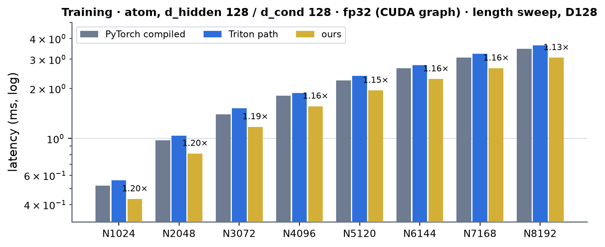 <!-- measure_bars -->

### Training · token, d_hidden 768 / d_cond 384 · bf16 (CUDA graph)

| (Length, Dimension) | PyTorch compiled | cuEquivariance | Anthropic | Triton path | ours | × |
|---|---|---|---|---|---|---|
| (128, 768) | 0.2683 | — | — (not measured) | 0.3174 | 0.2324 | 1.15 |
| (256, 768) | 0.4465 | — | — (not measured) | 0.5929 | 0.4178 | 1.07 |
| (384, 768) | 0.5786 | — | — (not measured) | 0.8038 | 0.5704 | 1.01 |
| (512, 768) | 0.7680 | — | — (not measured) | 1.0947 | 0.7475 | 1.03 |
| (640, 768) | 0.9605 | — | — (not measured) | 1.0701 | 0.9247 | 1.04 |
| (768, 768) | 1.1182 | — | — (not measured) | 1.5821 | 1.0803 | 1.04 |

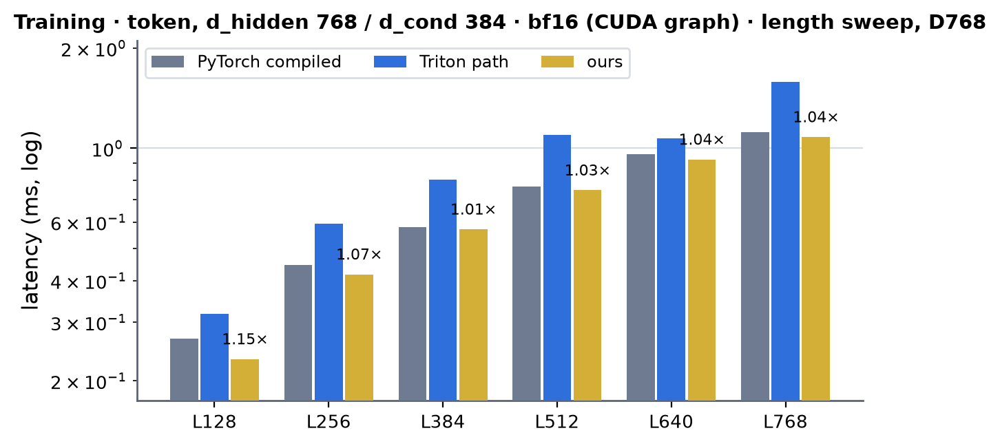 <!-- measure_bars -->

### Training · token, d_hidden 768 / d_cond 384 · fp32 (CUDA graph)

| (Length, Dimension) | PyTorch compiled | cuEquivariance | Anthropic | Triton path | ours | × |
|---|---|---|---|---|---|---|
| (128, 768) | 0.4383 | — | — (not measured) | 0.5724 | 0.3850 | 1.14 |
| (256, 768) | 0.8335 | — | — (not measured) | 0.9288 | 0.7199 | 1.16 |
| (384, 768) | 1.1505 | — | — (not measured) | 1.3783 | 1.0486 | 1.10 |
| (512, 768) | 1.5304 | — | — (not measured) | 1.6568 | 1.3829 | 1.11 |
| (640, 768) | 1.9343 | — | — (not measured) | 1.9866 | 1.7096 | 1.13 |
| (768, 768) | 2.2088 | — | — (not measured) | 2.5037 | 2.0603 | 1.07 |

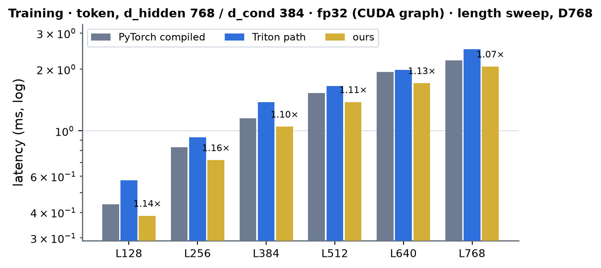 <!-- measure_bars -->

### Training · token, d_hidden 768 / d_cond 768 · bf16 (CUDA graph)

| (Length, Dimension) | PyTorch compiled | cuEquivariance | Anthropic | Triton path | ours | × |
|---|---|---|---|---|---|---|
| (128, 768) | 0.3871 | — | — (not measured) | 0.4905 | 0.3308 | 1.17 |
| (256, 768) | 0.6779 | — | — (not measured) | 0.8141 | 0.5898 | 1.15 |
| (384, 768) | 0.9411 | — | — (not measured) | 1.1018 | 0.8550 | 1.10 |
| (512, 768) | 1.2621 | — | — (not measured) | 1.4971 | 1.1223 | 1.12 |
| (640, 768) | 1.5790 | — | — (not measured) | 1.7111 | 1.3860 | 1.14 |
| (768, 768) | 1.8668 | — | — (not measured) | 2.1668 | 1.6568 | 1.13 |

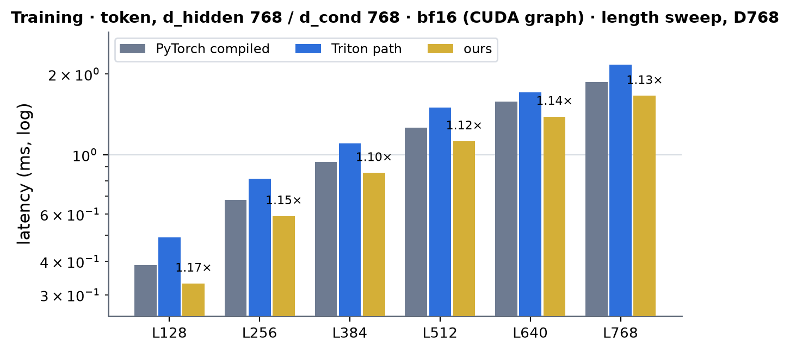 <!-- measure_bars -->

### Training · token, d_hidden 768 / d_cond 768 · fp32 (CUDA graph)

| (Length, Dimension) | PyTorch compiled | cuEquivariance | Anthropic | Triton path | ours | × |
|---|---|---|---|---|---|---|
| (128, 768) | 0.6441 | — | — (not measured) | 0.7895 | 0.5704 | 1.13 |
| (256, 768) | 1.2349 | — | — (not measured) | 1.3650 | 1.1305 | 1.09 |
| (384, 768) | 1.7930 | — | — (not measured) | 2.0521 | 1.6538 | 1.08 |
| (512, 768) | 2.3992 | — | — (not measured) | 2.5487 | 2.1770 | 1.10 |
| (640, 768) | 2.9732 | — | — (not measured) | 3.1334 | 2.6993 | 1.10 |
| (768, 768) | 3.4601 | — | — (not measured) | 3.7350 | 3.2097 | 1.08 |

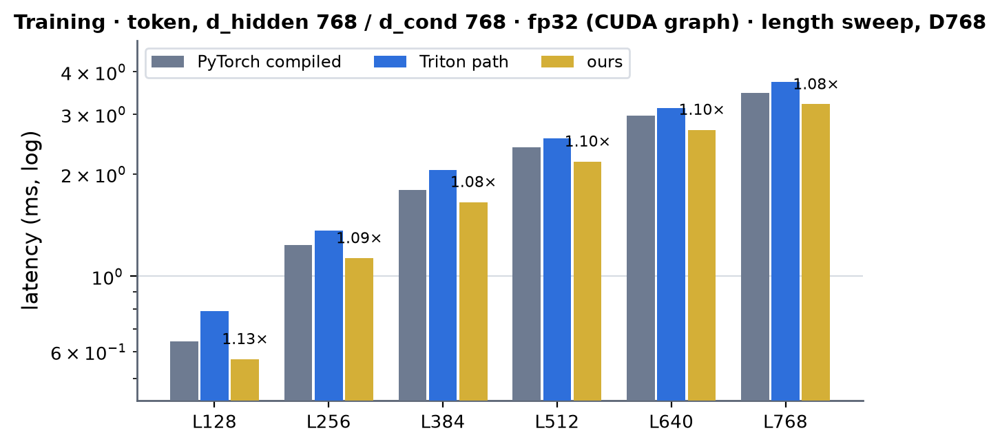 <!-- measure_bars -->

### Speed of light

SoL = the composite floor of the decomposition: per kernel `max(compulsory HBM bytes / 1.60 TB/s, FLOP / ceiling)`, summed (every tensor a kernel reads or writes counts once; the cuBLAS GEMMs by their bytes and FLOP; ceilings measured on this card with `probes/ceilings.py`: 1.70 TB/s streaming copy, 234-258 TFLOP/s bf16 GEMM at 8192^3 / 4096^3,
114-121 TFLOP/s TF32 -- the floors use the 1.60 TB/s, 240 and 115 TFLOP/s ceilings of the A100 page). "ours" is the sum of the CUDA kernel times of one profiled step (`torch.profiler`, CUPTI, one process, job 63233: no launch gaps), the floor is for the same decomposition; PyTorch compiled's own step at the token shape (same job, `PROF_COMPILE=1`) is 580 us -- 327 us of cuBLAS GEMMs, 229 us of Inductor-generated Triton kernels -- against ours 579 us.

| shape (rows M) | mode | dtype | ours (us) | floor (us) | % of SoL |
|---|---|---|---|---|---|
| atom, A = 48, N = 3072 (147456) | training | bf16 | 523.8 | 333.3 | 64 % |
| atom, A = 5, N = 3072 (15360) | inference | bf16 | 22.2 | 7.4 | 33 % |
| token 768 / 384, A = 48, L = 384 (18432) | training | bf16 | 578.6 | 502.2 | 87 % |
| token 768 / 384, A = 5, L = 384 (1920) | inference | bf16 | 28.4 | 18.7 | 66 % |
| atom, A = 48, N = 3072 (147456) | training | fp32 | 1366.3 | 1135.4 | 83 % |
| atom, A = 5, N = 3072 (15360) | inference | fp32 | 36.2 | 14.7 | 41 % |
| token 768 / 384, A = 48, L = 384 (18432) | training | fp32 | 1094.7 | 1010.0 | 92 % |

The token step and the fp32 steps are at 83-92 % of the composite floor: the row passes are at 88-106 % of their byte floors (`cond_ln_bwd` at 44-70 %) and the cuBLAS GEMMs at 75-93 % of their FLOP / byte floors -- what is left is the decomposition itself (the `[M, 2 d]` scale | bias and the `D = [dscale | dy]` operand
are written and read once). The bf16 atom step is at 64 % of its byte floor (the fused kernels at 60-67 %; the cuBLAS weight gradients 75 %) and the small-M inference at 33 % (22 us for 7.4 us of bytes: one tile a warp, launch- and wave-bound).

### Where the time goes (`torch.profiler` CUPTI kernel times, one process, job 63233; us per call)

**d = 128, d_cond = 128, A = 48, L = 3072 (M = 147456 rows), training, bf16** (profile total 523.8 us):

| stage | measured (us) | floor (us) | % of floor |
|---|---|---|---|
| adaln_atom_fwd | 107.2 | 72.3 | 67 % |
| adaln_atom_bwd | 277.4 | 166.6 | 60 % |
| cuBLAS GEMMs (2; 9.7 GFLOP) | 125.6 | 94.4 | 75 % |
| finish_kernel | 6.4 | | |
| torch small kernels (casts, packs) | 7.1 | | |
| **sum** | 523.8 | 333.3 | 64 % |

**d = 128, d_cond = 128, A = 5, L = 3072 (M = 15360 rows), inference, bf16** (profile total 22.2 us):

| stage | measured (us) | floor (us) | % of floor |
|---|---|---|---|
| adaln_atom_fwd | 22.2 | 7.4 | 33 % |
| finish_kernel | — | | |
| torch small kernels (casts, packs) | 0.0 | | |
| **sum** | 22.2 | 7.4 | 33 % |

**d = 768, d_cond = 384, A = 48, L = 384 (M = 18432 rows), training, bf16** (profile total 578.6 us):

| stage | measured (us) | floor (us) | % of floor |
|---|---|---|---|
| cond_ln | 17.2 | 17.8 | 103 % |
| adaln_epi | 80.5 | 70.9 | 88 % |
| adaln_bwd_x | 109.0 | 106.3 | 97 % |
| cond_ln_bwd | 50.4 | 35.5 | 70 % |
| cuBLAS GEMMs (3; 65.2 GFLOP) | 308.0 | 271.8 | 88 % |
| finish_kernel | 9.1 | | |
| torch small kernels (casts, packs) | 4.5 | | |
| **sum** | 578.6 | 502.2 | 87 % |

**d = 768, d_cond = 384, A = 5, L = 384 (M = 1920 rows), inference, bf16** (profile total 28.4 us):

| stage | measured (us) | floor (us) | % of floor |
|---|---|---|---|
| cond_ln | 3.7 | 1.8 | 50 % |
| adaln_epi | 8.1 | 7.4 | 91 % |
| cuBLAS GEMMs (1; 2.3 GFLOP) | 16.5 | 9.4 | 57 % |
| finish_kernel | — | | |
| torch small kernels (casts, packs) | 0.0 | | |
| **sum** | 28.4 | 18.7 | 66 % |

**d = 128, d_cond = 128, A = 48, L = 3072 (M = 147456 rows), training, fp32** (profile total 1366.3 us):

| stage | measured (us) | floor (us) | % of floor |
|---|---|---|---|
| cond_ln | 90.1 | 95.1 | 106 % |
| adaln_epi | 189.7 | 189.5 | 100 % |
| adaln_bwd_x | 291.1 | 283.9 | 98 % |
| cond_ln_bwd | 221.4 | 142.3 | 64 % |
| cuBLAS GEMMs (3; 29.0 GFLOP) | 562.5 | 424.7 | 75 % |
| finish_kernel | 7.3 | | |
| torch small kernels (casts, packs) | 4.2 | | |
| **sum** | 1366.3 | 1135.4 | 83 % |

**d = 128, d_cond = 128, A = 5, L = 3072 (M = 15360 rows), inference, fp32** (profile total 36.2 us):

| stage | measured (us) | floor (us) | % of floor |
|---|---|---|---|
| adaln_atom_fwd_tf32 | 36.2 | 14.7 | 41 % |
| finish_kernel | — | | |
| torch small kernels (casts, packs) | 0.0 | | |
| **sum** | 36.2 | 14.7 | 41 % |

**d = 768, d_cond = 384, A = 48, L = 384 (M = 18432 rows), training, fp32** (profile total 1094.7 us):

| stage | measured (us) | floor (us) | % of floor |
|---|---|---|---|
| cond_ln | 33.6 | 35.5 | 106 % |
| adaln_epi | 142.6 | 141.6 | 99 % |
| adaln_bwd_x | 219.9 | 212.4 | 97 % |
| cond_ln_bwd | 58.4 | 53.2 | 91 % |
| cuBLAS GEMMs (3; 65.2 GFLOP) | 623.4 | 567.2 | 91 % |
| finish_kernel | 9.2 | | |
| torch small kernels (casts, packs) | 7.7 | | |
| **sum** | 1094.7 | 1010.0 | 92 % |

### What was tried and did not pay (2026-10-04)

- **A different cuBLAS formulation of the projection at the small-M token shapes** (CUDA graph, one process): one wide GEMM `[M x 384] x [384 x 1536]` (ours) against two half-width GEMMs (PyTorch's) against the swapped product (`W aff^T`, a different tile mapping): at M = 2560 29.3 / 30.5 / 29.2 us, at M = 3840 29.6 / 31.0 / 30.0 us -- no formulation wins, and the time is flat from M = 2560 to 3840
  because cuBLAS picks the 256 x 128 tile there (120 CTAs at M = 2560, 180 at M = 3840 on 108 SMs: two waves; a 128 x 128 kernel's 240 / 360 CTAs would need three / four). That is why the token-stream inference rows at L >= 512 sit at 0.92-1.00x of PyTorch compiled while L <= 384 (one wave) is 1.03-1.11x. In a same-process GPU-time A/B (10-step graphs, A = 5, 768 / 384) ours is 44.5 / 46.9 / 51.5 us at L = 512 / 640 / 768 against PyTorch compiled 43.7 / 45.6 / 49.8 and the Triton path 51.1 / 60.1 / 68.1 (job 62933): the one bench row where the Triton path is ahead (L = 512, 5.8 %) is the bench's ~10 us of launch latency on a 3-kernel graph against a 5-kernel graph whose independent branches overlap, not GPU time; it is not routed. A cuBLASLt algorithm search found
  1.00-1.04x at the token DiT's M (see [../token_dit/token_dit.md](../token_dit/token_dit.md)): not retried.
- **Closing the backward with torch kernels**: two column `reduce_kernel`s of the partial rows at ~30 us each and a copy per weight gradient, 60-130 us a step -> `finish_kernel`, 6-34 us.
- **One row per block of threads with block reductions** (the first row kernels: 192 threads a row at d = 768, two `__syncthreads` per sum): `adaln_bwd_x` 140 us at the token step; one warp per row with shuffle sums and every load issued before the first sum: 109-110 us (96-97 % of the byte floor); `cond_ln` 22 -> 17 us, `adaln_epi` 85 -> 80 us.
- **Second stream** for the weight-gradient GEMM (`Branch`): 0.7-2.2 % at the token training steps (the dgrad GEMM and `cond_ln_bwd` run beside it); small, kept (CUDA-graph capture forks and joins as eagerly; `MINIWORLD_ADALN_BRANCH=0` turns it off).
- **In-kernel weight gradients at the atom width** (outer-product `mma`s on `movmatrix`-transposed fragments inside `adaln_atom_bwd_kernel`): costed, not built. The kernel would add 2 x 128 MMAs a 16-row tile (+67 % tensor work: ~134 us at the tensor floor against ~112 us for the two cuBLAS GEMMs, which read 1.0 KB a row and run at 173 TFLOP/s): no gain.
- **cuBLAS weight gradients over the whole sample axis** (`[128 x M] x [M x 128]`, K = 147456 at A = 48): with an fp32 result and the smaller dimension first cuBLAS picks a kernel that runs at 12 TFLOP/s (786 us for a 9.7 GFLOP product); putting the larger operand first and transposing the small result (`_wgrad`) gives 56 us.
- **Prefetching the next tile** (`cp.async` into a per-warp staging buffer, `adaln_atom_fwd_kernel` configuration 2): 115 against 133 us at 147456 rows, 33 against 44 us at 40960; at 15360 rows and below one tile a warp needs no prefetch and two CTAs of 8 warps hide the latency better (configuration 0) -- except below 8192 rows: at 5120 rows (the registry's N = 1024, A = 5) configuration 2 is 12.9 against 13.7 us, which turned the bench row from 6 % slower than the Triton path (0.0195 against 0.0184 ms) into 5 % faster (0.0174); 16 warps in one CTA (configuration 1) was slower than both.
- **The first TF32 AdaLN kernel** interleaved two accumulators (as the bf16 kernel does): `m16n8k8` accumulation is a dependent chain, the kernel spent 2.3 of 7.2 stall cycles an instruction in fixed-latency waits and the tensor pipe was 22 % active; eight independent accumulators per step plus the pair-interleaved weight layout and the `ex2` / `rcp` sigmoid: 1.16-1.26x.
- **fp32 inference at few rows**: at N = 1024, A = 5 (5120 rows) the fused TF32 kernel (19.4 us in a 10-step graph, 27.6 us in the bench's single replay) is 10-12 % slower than the Triton path's fused kernel (17.5 / 24.6 us): launch plus the weight-staging prologue (128 KB of fp32 weights rounded and written to shared memory by every CTA) are the cost at 320 tiles. The BRIEF's rule applies: fp32 inference at d = dc = 128 with fewer than 8192 rows
  (`MINIWORLD_ADALN_FP32_ATOM_MIN_ROWS`, default 8192; 0 serves them all) is left to the module's Triton path -- the only shape of this page the default dispatch hands to Triton. Pre-rounded weights copied with `cp.async` (a cached pack as the ConditionedTransition's) would shorten the prologue and might make the CUDA kernel competitive; not built.

### Limits and next

- Not served on A100 (they run the module path, the Triton kernels): fp16 / other dtypes, widths other than 128 / 384 / 768, a `to_bias` bias or no `to_scale` bias, a conditioning that does not describe the rows of `x` (cond broadcast over other dims), CPU tensors, a card that is not an sm_80 A100, `engine_backend="triton"`; fp32 inference at the atom width with fewer than 8192 rows.
- fp32 training at the atom width keeps the composition (the fused TF32 kernel saves nothing for a backward): 1.13-1.20x PyTorch compiled; fused TF32 backward kernels (the bf16 `adaln_atom_bwd_kernel` on `m16n8k8`, 192 KB of fp32 weights would not fit: a streamed weight ring) would cut the traffic by ~3x.
- The token stream is GEMM-bound: fusing the gate / epilogue passes into the GEMMs (what the H100 and B200 do with their `gemm_*` kernels) needs a hand GEMM within ~10 % of cuBLAS (239 TFLOP/s here): the headroom is ~7 % of a ConditionedTransition step and ~10 % of an AdaLN step.
- Training with a shared conditioning materialises the per-sample conditioning (the Triton path did too) and autograd sums the expanded gradient; a table + reduction would save the `A x` expansion.
- Anthropic and cuEquivariance have no arm for this module: those columns stay empty.
