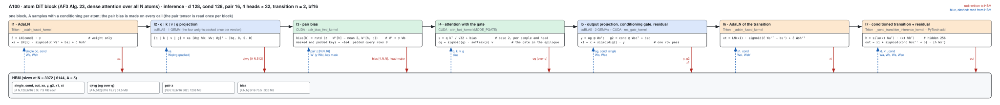
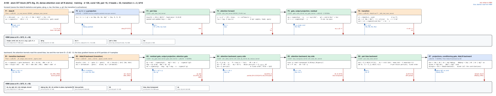
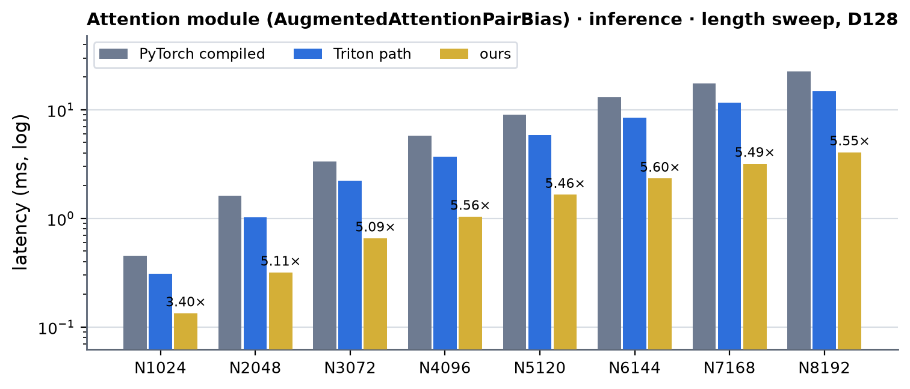
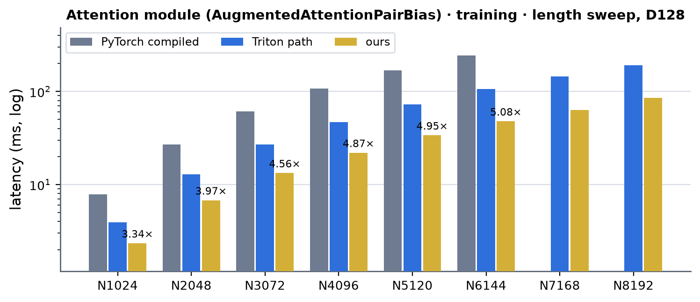
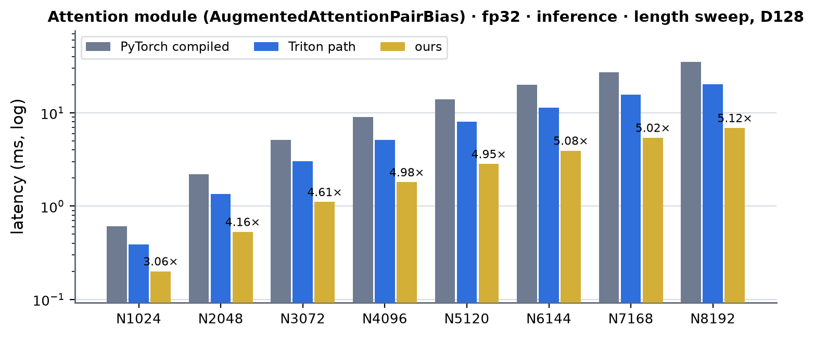
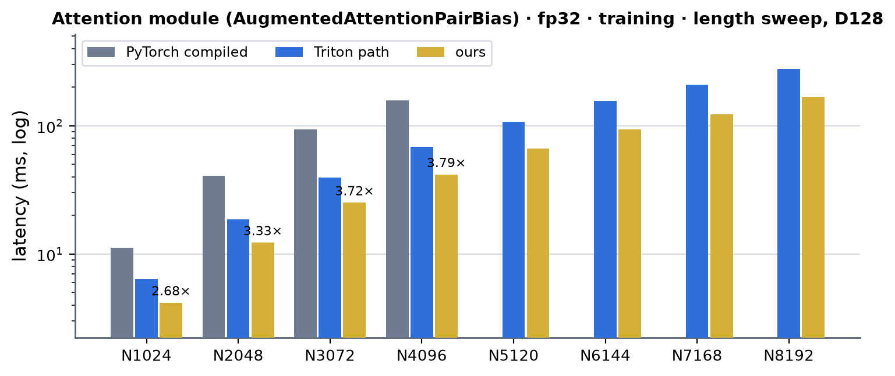
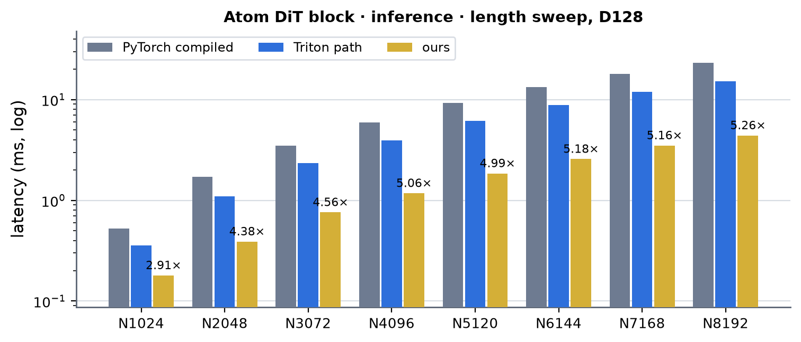
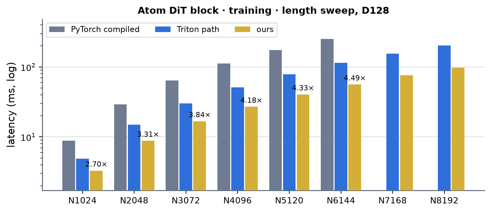

# Atom DiT on A100 (sm80): dense and AF3-like local

The comparison targets distinguish two atom blocks:

| Target | Attention | Pair tensor | Cross AdaLN |
|---|---|---|---|
| `dit_atom` | Dense, all N atoms | `[B, N, N, 16]` | No |
| `dit_atom_local` | AF3-like, 32 queries × 128 keys | `[B, ceil(N/32), 32, 128, 16]` | Yes |

For the local target, query window `w` attends to keys `[32w - 48, 32w + 80)`,
clipped at the sequence boundaries. Both targets use atom/conditioning width
128 and four heads of width 32. The common benchmark interprets `seq_len` as
token count and uses `N = 8 * seq_len`; the standalone A100 comparison's
`--length` is the actual atom count.

As of 2026-10-05, `dit_atom_local` is registered in the CLI diffusion group,
common module benchmark and A100 Anthropic comparison. Its Anthropic inference
adapter calls the unmodified upstream `atom_attention(row="fpf_atom")`, DTK and
LayerNorm entry points with cuBLAS projections. The A100 MiniWorld path still
uses PyTorch local attention with dispatched AdaLN/ConditionedTransition;
the dedicated native local block currently serves B200. Registration does not
mean that an A100 local CUDA block has been implemented. The 25 A100 integration
tests cover shared conditioning, batches/samples, partial windows, masks,
entirely masked windows and CUDA Graph mask mutation/replay.

The historical performance measurements below describe **dense `dit_atom`**.

Kernel-level status of the AF3-style atom DiT block (`modules/dit.DiTBlock` at atom widths: AF3 Alg. 23 -- AdaLN, attention over **all N atoms** with the
pair bias `LN(z) Wb^T` shared by the A samples, gated output projection + residual, AdaLN + SwiGLU transition (hidden 256) + residual; d_single = d_cond = 128,
d_pair = 16, 4 heads × 32) on A100; the module-level summary is in [a100.md](../a100.md). The attention part is `modules/augmented_attention` (`AugmentedAttentionPairBias`, registry
`augmented_attention`, atom axis), bf16 **and fp32**; columns are (Length, Dimension) on the atom axis of the shape registry (`atom_single`, d128): Length is the atom count N. Figures: one box per kernel,
left to right, HBM reads (blue, left) and writes (red, right); generated from `figures/atom_dit.json` by `python -m miniworld_engine.viz.kernel_flow` and embedded as SVG (`cairosvg` and
`rsvg-convert` are not installed on cssb, so there is no PNG).

Summary (2026-10-04). `AugmentedAttentionPairBias` runs **hand CUDA and cuBLAS from the AdaLN's output to the residual**, in bf16 and in fp32 (TF32 tensor cores), for any A and B, any N (padded to a
multiple of 128 inside), and a key mask that is shared by the samples (`[B, N]`) or differs per sample (`[A, B, N]`), in inference and training: one autograd Function whose forward and backward are each one
opaque op. The AdaLN in front of it and the ConditionedTransition behind it are the block's other modules (Triton, cuBLAS: not this page's work). Against PyTorch compiled (`bench.py`, CUDA graph, A = 5
inference / 48 training, N = 1024 ... 8192): bf16 inference 3.4-5.6x, training 3.3-5.1x (PyTorch compiled runs out of memory at N = 7168 / 8192); fp32 inference 3.1-5.1x, training 2.7-3.8x (out of memory from N = 5120);
the block (`dit_atom`, bf16) inference 2.9-5.3x, training 2.7-4.5x; against the Triton path this replaces (the same module with `MINIWORLD_AUGATTN_SM80=0`): bf16 inference 2.3-3.6x, training 1.7-2.3x; fp32 inference 1.9-2.9x,
training 1.5-1.7x; the block 2.0-3.5x and 1.5-2.1x (Measurements; 38-74 % of the module's speed-of-light floor). Accuracy: the output and every gradient no further from an fp64 module than
the bf16 PyTorch module (ratio <= 1.1), fp32 within the Triton TF32 path's own error (ratio <= 1.25).

Before this work the A100 ran the module composition: the attention with the Triton core (`_attn_fwd`, `_attn_bwd`) and a pair bias made by a LayerNorm kernel, a 16 → 4
GEMM and a permute copy to head-major. At N = 3072 that composition was 30 launches in an inference block (2.6 ms of kernel time, 1.9 ms of it in the pair bias:
`layer_norm_fwd_fused` 661 µs, nine cutlass GEMM launches 1009 µs, the permute copy 229 µs) and 138 in a training step (job 61708). The first A100 path (2026-10-03) made two pieces hand CUDA
(`mma.sync`, `ldmatrix`, `cp.async`, plain CUDA for the bias): the **attention core** (head dim 32 for the atom DiT's 4 heads; the same kernels, with head dim 48, are the
token DiT's) and the **fused pair bias** (`LN(z) Wb^T` and its backward as memory-bound passes over the pair tensor), inside the module's composition. This round moved everything between the AdaLN's
output and the residual into one path (the module's four projections, both sigmoid gates and the residual had still been cuBLAS-through-PyTorch plus PyTorch elementwise ops), added fp32, per-sample masks,
B > 1 and any N, and made the module's gradients flow through kernels that write straight into the projection's gradient columns.

- **Where the code is**: `integrations/augattn_sm80.py` (the path: `serves()`, the fused update `_fused_update`, the two opaque ops `augmented_attention_sm80_module_fwd` / `_bwd`, the opt-in pair-bias cache,
  the whole-op entry for `ops.augmented_attention_pair_bias`), which `AugmentedAttentionPairBias.forward` / `.delta` ask first; `kernels/augmented_attention/cuda/sm80/` (`attn_fwd_sm80.cuh`,
  `attn_bwd_dq_sm80.cuh`, `attn_bwd_dkv_sm80.cuh`: the bf16 core; `attn_fwd_tf32_sm80.cuh`, `attn_bwd_dq_tf32_sm80.cuh`, `attn_bwd_dkv_tf32_sm80.cuh`, `ops_tf32.cu`: the fp32 core; `aux_sm80.cuh`: the pair
  bias, its backward and the attention's row term; `glue_sm80.cuh`: the gates and the residual; `ops.cu`, `glue_ops.cu`) and their wrapper `kernels/augmented_attention/cuda/sm80.py`. The kernels are
  built on first use (`load_extension`, never at import: three extensions, the bf16 core + pair bias, the TF32 core, the gates); a failed build warns once and keeps the module path.
- **Served** (`serves()`): implementation TRITON / MINIWORLD, `settings.engine_backend != "triton"`, A100 (sm_80), single / cond / pair and the module's weights **all bf16 or all fp32**
  (`compute_dtype` None or that dtype), no QK-norm, head dim 32 or 48, any A, any B, any N, a key mask `[B, N]` (shared by the samples; a `[A, B, N]` view with stride 0 over A counts as shared) or `[A, B, N]`
  (one per sample) or none, LayerNorm eps 1e-5. At 4 heads × 32 with d_pair 16 (this page) the pair bias is the fused atom pass; at 128 channels and 8 / 12 / 16 heads (bf16) the AttentionPairBias kernel;
  at any other width or dtype the streaming generic kernel (`pair_bias_gen_kernel`, the token page). Anything else keeps the module path. `MINIWORLD_AUGATTN_SM80=0` turns the path off, `MINIWORLD_AUGATTN_SM80_FUSED=0`
  keeps the first path's composition (bf16: the module's own projections and PyTorch gates around the core), `MINIWORLD_AUGATTN_SM80_PBGEN=0` the ATen LayerNorm + cuBLAS pair bias of the generic widths.
- **The call, per block** (inference): `qkvg = x [Wq; Wk; Wv; Wg]^T + [bq, 0, 0, 0]` (one cuBLAS GEMM, the four weights packed once per parameter version: the pack is cached on `(data_ptr, _version)`), the
  pair bias (the atom kernel: one read of the pair, one write of the bias), the attention core with the gate in its epilogue (`MODE_PGATE`: `sigmoid(g) o` written over q), `y = (sigmoid(g) o) Wo^T` (cuBLAS),
  `g2 = cond Ws^T + bs` (cuBLAS), `out = res + sigmoid(g2) y` (`res_gate_kernel`, one row pass). Training saves qkvg, o, the log-sum-exp, og, y, g2 and the bias, runs the plain core
  (bf16: `MODE_PLAIN`, bf16 o and the log-sum-exp; fp32: `attn_fwd_tf32_kernel`, fp32 o and lse) and `gate_rows_kernel`, and its backward is: `res_gate_bwd_kernel` (dy, dg2), the GEMMs dog and dWo, `gate_bwd_kernel` (dob, dg), the core's
  backward with **dq / dk / dv written straight into the columns of the projection's gradient buffer** (strided gradient views: no stack copy), the pair-bias backward, then the GEMMs dx, dW q | k | v | g,
  dcond, dWs. The weight gradients come out of cuBLAS in fp32 (`out_dtype`, for bf16 weights) and are copied once into the parameters' dtype.
- **fp32** is the TF32 recipe the Triton path runs (`tl.dot` on fp32 operands = TF32 tensor cores, fp32 accumulation and softmax): `attn_fwd_tf32_kernel` / `attn_bwd_dq_tf32_kernel` /
  `attn_bwd_dkv_tf32_kernel` (`mma.sync.m16n8k8` TF32, fp32 accumulate; the S accumulator is P's A fragment with a permuted key index, V's B fragment two scalar shared loads; an fp32 bias tile in natural units
  through `cp.async`; the bias gradient as fp32 partials of one or two samples, chunked over the query tiles to 2 GiB and summed in a fixed order). The projections and the pair-bias GEMM follow the caller's
  `allow_tf32` (they are cuBLAS calls), and the fp32 pair-bias kernel is plain fp32 FMAs. Tensor cores see the operands with the low 13 mantissa bits dropped, exactly as in Triton.
- **Masks.** A key mask shared by the samples is folded into the pair bias: a masked or padded key gets -1e4 in natural units (bf16 -9984; the bf16 core's raw units multiply the bias by sqrt(32)), so
  its softmax weight is exactly 0 in any row with a valid key, and the pair-bias backward drops dbias on masked keys; the attention kernels run unmasked, and a sample with no valid key gets the
  uniform softmax (as the PyTorch module's `finfo.min` fill gives). A mask that differs per sample enters the kernels as per-key penalties (0 / -inf, staged with each K | V tile; `KM`
  variants of the three kernels): a sample with no valid key gets a zero output (as the Triton kernel's finite guard) and masked keys get zero dk / dv.
- **Pair-bias cache (opt-in, explicit)**: in a sampling loop the same pair tensor meets the same weights at every step, and the pair-bias pass is a third of an inference call
  at these sizes. `AugmentedAttentionPairBias.cache_pair_bias(pair, mask)` computes the bias into a buffer the module owns (75 MB at N = 3072 in bf16, 302 MB at N = 6144, one
  per block; fp32 twice that), and a later no-grad call with the same tensors (data pointer, shape, strides and version of `pair`, `mask` and the two weights) reads it instead of recomputing;
  `clear_pair_bias()` drops it. Nothing is cached unless asked, and an in-place change PyTorch sees (`pair.add_`, a weight update, another mask) makes the next call
  recompute. A CUDA-graph *replay* does not run that check: the buffer is refreshed **in place** by every `cache_pair_bias`, so after changing the graph's static pair buffer
  the caller refreshes the cache (one eager call) before replaying. One block, A = 5, CUDA graph, one process (jobs 61813 and 61814, two GPUs of gpu09; the first path's block): N = 3072
  809 → 542 µs and 811 → 546 µs (1.49× both), N = 6144 2677 → 1612 µs and 2662 → 1598 µs (1.66×, 1.67×), the outputs bit-identical. Test:
  `test_the_pair_bias_cache_is_explicit_and_never_stale_in_eager_mode`.
- **The attention kernels** are the TriangleAttention kernels' structure with the pair rows replaced by samples: one CTA = (head, 128-query tile) × R samples that
  share a bias tile, K | V through a cp.async ring, 8 warps × 16 queries, the online softmax in registers, shared-memory rows of 80 B (an odd number of 16 B granules:
  every `ldmatrix` is conflict-free without a swizzle at head dim 32). The bias tile ring has as many buffers as key tiles in flight (`(NKV - 1) / R + 1`). The
  backward is the query side (dq, and the bias gradient as bf16 partials of 4 samples, then a fixed-order reduction: a replay is bit-identical) and the key side
  (dk, dv, on the transposed bias). Schedules (samples per CTA, ring stages, CTAs per SM): forward (2, 3, 2) for an even A ≥ 32, else (1, 4, 2); query side (4, 3, 1) for
  A divisible by four, (2, 4, 1) for an even A, else (1, 3, 2); key side 4 stages, 2 CTAs per SM. Two details that paid (kernel times, A = 48, N = 3072): the
  cp.async index arithmetic of a pipeline stage is made once per thread (forward 3.15 → 2.90 ms, query side 4.50 → 3.91, key side 4.14 → 3.92: the loops were more than half
  integer instructions), and the pair bias is stored in **raw units** (`bias_natural · sqrt(32)`, the units of q · k) and enters the score tile through the tensor core --
  an identity `mma` with the bias block as its A operand starts every S tile at the bias, instead of unpacking, scaling and adding it in fp32 (forward 2.90 → 2.59 ms, key
  side 3.84 → 3.50, query side 3.91 → 3.82; the same accuracy). A masked key is therefore a very negative finite bias (-1e4 · sqrt(32)), never -inf (-inf times the
  identity's zeros would be NaN). The TF32 kernels keep one sample per CTA at head dim 48 (shared memory) and two at 32 (see the token page for their rates).
- **Gradients**: the opaque backward returns the module's input gradients and all ten parameters' gradients in the parameters' dtype; the bias gradient (fp32 natural units, summed over the samples) goes from
  the attention backward straight into the pair-bias backward, which writes dz and the per-block partials of dW' (summed in a fixed order). `torch.compile(fullgraph=True)` keeps the two ops (the compiled module takes
  the path and matches eager), and a CUDA graph captures a call and a whole training step.
- **Tests**: `tests/integrations/test_a100_augattn_gpu.py` (65 tests, job 63067: the module's output and every input / parameter gradient against the fp64 PyTorch module, no further than 1.5× the engine's
  own path's error + 3e-3 (bf16) / 2e-4 (fp32): training N128-384, A = 2-5, B = 1-2 at head dim 32 and 48, d_pair 16 / 128 / 256, with no mask, a shared mask and a per-sample mask, N not a multiple of 128; inference
  N200-1024, A = 1-5; the fp32 cases both with and without TF32 GEMMs; a replay is bit-identical except the AdaLN parameter gradients, which the module's Triton AdaLN backward accumulates with atomics (1e-4);
  `torch.compile(fullgraph=True)` matches eager; a captured inference call and training step replay to eager; the whole DiT block at atom widths; the explicit pair-bias cache (bf16 and fp32); the generic pair-bias
  kernels against fp64 autograd; the gate), `tests/integrations/test_a100_augattn_cpu.py` (the staging layouts, the penalties, the gate predicates: no GPU). Against fp32 autograd, the bf16 kernels alone
  (A = 1-5, L = 128-384, 10 % masked keys): the output 1.8e-3 relative, the log-sum-exp within 4e-6, dq 2.8-3.1e-3, dk 2.6-2.8e-3, dv 2.3-2.5e-3, the bias gradient 1.9-2.2e-3 (bf16 P and dS); the pair bias's dz
  1.7e-3 and its weight gradients about 1e-7-7e-7; the TF32 kernels against fp64 (the Triton fp32 path's own error is the yardstick): output 2.5-3e-4, dq / dk / dv / dbias within 1.25x of Triton's.
  At N = 6144 / 8192 (A = 1, inference) the bf16 block's output is within 4.4e-4 / 4.0e-4 of the Triton path's; a training step at N = 6144 (A = 8) and N = 8192 (A = 4) gives finite gradients in 6.3 and 11.1 GiB.
- 성능 확인 is the maintainer's column (✗ = not confirmed). cache build ✓: nothing in the CUDA kernels autotunes (fixed schedules); the Triton kernels of the rows use
  the A100 caches relabeled to this toolchain (see [a100.md](../a100.md)). One exception seen in the probe jobs of this page (not in `dev cache-status`, which lists no
  A100 cache as stale): at run time the autotune layer reports the A100 cache of `adaln_fwd_triton` (bf16 + fp32) as stale -- its recorded config grid differs from the kernel's
  declared one -- and falls back to a heuristic 24 of the 32 configs, so the block's two Triton AdaLN launches (60 µs of the 830 µs inference block at N = 3072) may not run their
  tuned configuration; the Triton path column has the same launches. Rebuilding that cache is not part of this work.

## Atom DiT · d_single = d_cond = 128, d_pair 16, 4 heads × 32

### Inference

#### One block · every N = 1024k

##### I1 · AdaLN, twice per block (Triton `_adaln_fused_kernel`; the second is the transition's)

| (Length, Dimension) | (1024, 128) | (2048, 128) | (3072, 128) | (4096, 128) | (5120, 128) | (6144, 128) | (7168, 128) | (8192, 128) |
|---|---|---|---|---|---|---|---|---|
| implementation | Triton | Triton | Triton | Triton | Triton | Triton | Triton | Triton |
| 성능 확인 | ✗ | ✗ | ✗ | ✗ | ✗ | ✗ | ✗ | ✗ |
| cache build | ✓ | ✓ | ✓ | ✓ | ✓ | ✓ | ✓ | ✓ |

##### I2 · pair bias (`pair_bias_fwd_kernel`: bias = LN(z) Wb^T, head-major [4, N, N] bf16; fp32: the same pass in fp32)

One memory-bound pass over z [N, N, 16] (32 × 64 tiles, 256 threads, no tensor cores); the LayerNorm weight is folded into the projection (bias = rstd (z · W' - mean
Σ W')); the mask and the padding are folded in (see above).

| (Length, Dimension) | (1024, 128) | (2048, 128) | (3072, 128) | (4096, 128) | (5120, 128) | (6144, 128) | (7168, 128) | (8192, 128) |
|---|---|---|---|---|---|---|---|---|
| implementation | CUDA | CUDA | CUDA | CUDA | CUDA | CUDA | CUDA | CUDA |
| 성능 확인 | ✗ | ✗ | ✗ | ✗ | ✗ | ✗ | ✗ | ✗ |
| cache build | ✓ | ✓ | ✓ | ✓ | ✓ | ✓ | ✓ | ✓ |

##### I3 · attention with the gate (`attn_fwd_kernel`, MODE_PGATE: `sigmoid(g) o` as bf16 over q, no lse in inference; fp32: `attn_fwd_tf32_kernel`)

| (Length, Dimension) | (1024, 128) | (2048, 128) | (3072, 128) | (4096, 128) | (5120, 128) | (6144, 128) | (7168, 128) | (8192, 128) |
|---|---|---|---|---|---|---|---|---|
| implementation | CUDA | CUDA | CUDA | CUDA | CUDA | CUDA | CUDA | CUDA |
| 성능 확인 | ✗ | ✗ | ✗ | ✗ | ✗ | ✗ | ✗ | ✗ |
| cache build | ✓ | ✓ | ✓ | ✓ | ✓ | ✓ | ✓ | ✓ |

##### I4 · conditioning gate and residual (`res_gate_kernel`: out = res + sigmoid(g2) y; one row pass over [A N, 128])

| (Length, Dimension) | (1024, 128) | (2048, 128) | (3072, 128) | (4096, 128) | (5120, 128) | (6144, 128) | (7168, 128) | (8192, 128) |
|---|---|---|---|---|---|---|---|---|
| implementation | CUDA | CUDA | CUDA | CUDA | CUDA | CUDA | CUDA | CUDA |
| 성능 확인 | ✗ | ✗ | ✗ | ✗ | ✗ | ✗ | ✗ | ✗ |
| cache build | ✓ | ✓ | ✓ | ✓ | ✓ | ✓ | ✓ | ✓ |

##### I5 · ConditionedTransition (Triton `_cond_transition_inference_kernel`: expand, SwiGLU, squeeze, conditioning gate)

| (Length, Dimension) | (1024, 128) | (2048, 128) | (3072, 128) | (4096, 128) | (5120, 128) | (6144, 128) | (7168, 128) | (8192, 128) |
|---|---|---|---|---|---|---|---|---|
| implementation | Triton | Triton | Triton | Triton | Triton | Triton | Triton | Triton |
| 성능 확인 | ✗ | ✗ | ✗ | ✗ | ✗ | ✗ | ✗ | ✗ |
| cache build | ✓ | ✓ | ✓ | ✓ | ✓ | ✓ | ✓ | ✓ |

(the three GEMMs of the attention part -- the packed q | k | v | g projection, the output projection, the attention's conditioning gate -- are cuBLAS: the figure only; the transition's GEMMs are inside I5 and
the residual of the transition is a PyTorch add.)

### Training

#### Forward and backward · every N = 1024k

##### T1 · AdaLN, forward and backward (Triton `_ln_mat_kernel`, `_epilogue_train_kernel`, `_bwd_x_kernel`, `_dgrad_condln_kernel`; the module's own training AdaLN)

| (Length, Dimension) | (1024, 128) | (2048, 128) | (3072, 128) | (4096, 128) | (5120, 128) | (6144, 128) | (7168, 128) | (8192, 128) |
|---|---|---|---|---|---|---|---|---|
| implementation | Triton | Triton | Triton | Triton | Triton | Triton | Triton | Triton |
| 성능 확인 | ✗ | ✗ | ✗ | ✗ | ✗ | ✗ | ✗ | ✗ |
| cache build | ✓ | ✓ | ✓ | ✓ | ✓ | ✓ | ✓ | ✓ |

##### T2 · pair bias forward (`pair_bias_fwd_kernel`, as I2)

| (Length, Dimension) | (1024, 128) | (2048, 128) | (3072, 128) | (4096, 128) | (5120, 128) | (6144, 128) | (7168, 128) | (8192, 128) |
|---|---|---|---|---|---|---|---|---|
| implementation | CUDA | CUDA | CUDA | CUDA | CUDA | CUDA | CUDA | CUDA |
| 성능 확인 | ✗ | ✗ | ✗ | ✗ | ✗ | ✗ | ✗ | ✗ |
| cache build | ✓ | ✓ | ✓ | ✓ | ✓ | ✓ | ✓ | ✓ |

##### T3 · attention forward (`attn_fwd_kernel`, MODE_PLAIN with the log-sum-exp; fp32: `attn_fwd_tf32_kernel`)

| (Length, Dimension) | (1024, 128) | (2048, 128) | (3072, 128) | (4096, 128) | (5120, 128) | (6144, 128) | (7168, 128) | (8192, 128) |
|---|---|---|---|---|---|---|---|---|
| implementation | CUDA | CUDA | CUDA | CUDA | CUDA | CUDA | CUDA | CUDA |
| 성능 확인 | ✗ | ✗ | ✗ | ✗ | ✗ | ✗ | ✗ | ✗ |
| cache build | ✓ | ✓ | ✓ | ✓ | ✓ | ✓ | ✓ | ✓ |

##### T4 · gates and residual, forward and backward (`gate_rows_kernel`, `res_gate_kernel`, `res_gate_bwd_kernel`, `gate_bwd_kernel`: row passes over [A N, 128])

| (Length, Dimension) | (1024, 128) | (2048, 128) | (3072, 128) | (4096, 128) | (5120, 128) | (6144, 128) | (7168, 128) | (8192, 128) |
|---|---|---|---|---|---|---|---|---|
| implementation | CUDA | CUDA | CUDA | CUDA | CUDA | CUDA | CUDA | CUDA |
| 성능 확인 | ✗ | ✗ | ✗ | ✗ | ✗ | ✗ | ✗ | ✗ |
| cache build | ✓ | ✓ | ✓ | ✓ | ✓ | ✓ | ✓ | ✓ |

##### T5 · attention backward, query side: the row term, dq, the bias-gradient partials and their reduction (`attn_delta_kernel`, `attn_bwd_dq_kernel`, `db_reduce_kernel`; fp32: `attn_bwd_dq_tf32_kernel`)

| (Length, Dimension) | (1024, 128) | (2048, 128) | (3072, 128) | (4096, 128) | (5120, 128) | (6144, 128) | (7168, 128) | (8192, 128) |
|---|---|---|---|---|---|---|---|---|
| implementation | CUDA | CUDA | CUDA | CUDA | CUDA | CUDA | CUDA | CUDA |
| 성능 확인 | ✗ | ✗ | ✗ | ✗ | ✗ | ✗ | ✗ | ✗ |
| cache build | ✓ | ✓ | ✓ | ✓ | ✓ | ✓ | ✓ | ✓ |

##### T6 · attention backward, key side: dk, dv (`bias_transpose_kernel`, `attn_bwd_dkv_kernel`; fp32: `attn_bwd_dkv_tf32_kernel`)

| (Length, Dimension) | (1024, 128) | (2048, 128) | (3072, 128) | (4096, 128) | (5120, 128) | (6144, 128) | (7168, 128) | (8192, 128) |
|---|---|---|---|---|---|---|---|---|
| implementation | CUDA | CUDA | CUDA | CUDA | CUDA | CUDA | CUDA | CUDA |
| 성능 확인 | ✗ | ✗ | ✗ | ✗ | ✗ | ✗ | ✗ | ✗ |
| cache build | ✓ | ✓ | ✓ | ✓ | ✓ | ✓ | ✓ | ✓ |

##### T7 · pair bias backward (`pair_bias_bwd_kernel`: dz and the per-block partials of dW')

| (Length, Dimension) | (1024, 128) | (2048, 128) | (3072, 128) | (4096, 128) | (5120, 128) | (6144, 128) | (7168, 128) | (8192, 128) |
|---|---|---|---|---|---|---|---|---|
| implementation | CUDA | CUDA | CUDA | CUDA | CUDA | CUDA | CUDA | CUDA |
| 성능 확인 | ✗ | ✗ | ✗ | ✗ | ✗ | ✗ | ✗ | ✗ |
| cache build | ✓ | ✓ | ✓ | ✓ | ✓ | ✓ | ✓ | ✓ |

##### T8 · ConditionedTransition forward and backward (Triton `_b2b_fwd_train_kernel`, `_dh_swiglu_bwd_kernel`, `_sigmul_bwd`)

| (Length, Dimension) | (1024, 128) | (2048, 128) | (3072, 128) | (4096, 128) | (5120, 128) | (6144, 128) | (7168, 128) | (8192, 128) |
|---|---|---|---|---|---|---|---|---|
| implementation | Triton | Triton | Triton | Triton | Triton | Triton | Triton | Triton |
| 성능 확인 | ✗ | ✗ | ✗ | ✗ | ✗ | ✗ | ✗ | ✗ |
| cache build | ✓ | ✓ | ✓ | ✓ | ✓ | ✓ | ✓ | ✓ |

(the GEMMs of the attention part -- forward: the packed q | k | v | g projection, the output projection, the conditioning gate; backward: dog, dWo, dx, dWqkvg, dcond, dWs -- are cuBLAS, and so are the transition's:
the figure only.) In every column the kernels ran: the benches (below) took each N for ours; the numerics tests run at N ≤ 1024, the larger N are checked against the Triton path (above).

## Measurements (2026-10-04)

One A100 80GB PCIe (300 W), torch 2.13.0+cu129 / triton 3.7.1, B = 1, no key mask (the bench default), CUDA-graph timing (`cudagraph=manual`), `benchmarks/runners/bench.py target=augmented_attention_atom level=module` (the attention
module alone) and `target=dit_atom` (one DiTBlock at atom widths: d_single = d_cond = 128, d_pair 16, 4 heads × 32, n = 2), N = 8 × seq_len (`seq_len` 128-1024 in steps of 128: the registry's atom axis), the sources of the final
tree frozen in one snapshot (`snap_1004_013704`) for every run of this page. Inference: A = 5 samples, each with its own conditioning; training: A = 48, dropout none. bf16 = `precision=bf16-mixed` (the bench
default), fp32 = `precision=32` with TF32 allowed (`allow_tf32: true`, the module target's config: the cuBLAS GEMMs and the attention's tensor cores both run TF32, as the Triton path does). PyTorch compiled, ours and the
Triton path (the same module / block with `MINIWORLD_AUGATTN_SM80=0`: the composition the A100 ran before this work) of each table came from one job and one node: jobs **63195** (module bf16, block, module fp32;
gpu03). Run-to-run spread is about 2-3 %, up to 10 % between nodes. Times in ms. **×** = PyTorch compiled divided by ours: cuEquivariance has no DiT block or attention-with-pair-bias op at the atom width. **Anthropic: unsupported, and
measured as such** (2026-10-03, job 61901 on gpu08, `bench.py` `anthropic` arm, the release `common/opt_core` pinned f4f62fa from `/home/psk6950/practice/refs/uplifting-biomolecular-modeling`; not re-run): the release's DiT composition (the token
DiT page) refuses this block at d_pair 16 -- `ln_proj: unsupported input (width): c=16 not in (64, 128)` -- and its atom attention (`apb` row `fpf_atom`) is the AF3 32 × 128 *windowed* op, a different function from this dense
block, which the bench does not substitute; the release has no backward either. So the Anthropic column reads "not measured" below. PyTorch compiled materialises the dense [A, 4, N, N] scores: in training it does not fit the 80 GB
card at N = 7168 and 8192 (out of memory, the bench log of job 63195).

### Attention module (AugmentedAttentionPairBias) · inference

| (Length, Dimension) | PyTorch compiled | cuEquivariance | Anthropic | Triton path | ours | × |
|---|---|---|---|---|---|---|
| (1024, 128) | 0.456 | — (none) | — (not measured) | 0.310 | 0.134 | 3.40 |
| (2048, 128) | 1.628 | — (none) | — (not measured) | 1.018 | 0.318 | 5.11 |
| (3072, 128) | 3.342 | — (none) | — (not measured) | 2.216 | 0.656 | 5.09 |
| (4096, 128) | 5.782 | — (none) | — (not measured) | 3.719 | 1.039 | 5.56 |
| (5120, 128) | 9.018 | — (none) | — (not measured) | 5.826 | 1.652 | 5.46 |
| (6144, 128) | 13.052 | — (none) | — (not measured) | 8.468 | 2.330 | 5.60 |
| (7168, 128) | 17.531 | — (none) | — (not measured) | 11.618 | 3.191 | 5.49 |
| (8192, 128) | 22.542 | — (none) | — (not measured) | 14.759 | 4.064 | 5.55 |

 <!-- measure_bars -->

### Attention module (AugmentedAttentionPairBias) · training

| (Length, Dimension) | PyTorch compiled | cuEquivariance | Anthropic | Triton path | ours | × |
|---|---|---|---|---|---|---|
| (1024, 128) | 7.830 | — (none) | — (not measured) | 3.939 | 2.346 | 3.34 |
| (2048, 128) | 26.990 | — (none) | — (not measured) | 12.932 | 6.791 | 3.97 |
| (3072, 128) | 60.694 | — (none) | — (not measured) | 27.035 | 13.306 | 4.56 |
| (4096, 128) | 107.035 | — (none) | — (not measured) | 46.605 | 21.979 | 4.87 |
| (5120, 128) | 167.569 | — (none) | — (not measured) | 72.880 | 33.864 | 4.95 |
| (6144, 128) | 243.314 | — (none) | — (not measured) | 106.372 | 47.877 | 5.08 |
| (7168, 128) | — (out of memory) | — (none) | — (not measured) | 144.462 | 62.930 | — |
| (8192, 128) | — (out of memory) | — (none) | — (not measured) | 190.218 | 85.631 | — |

 <!-- measure_bars -->

### Attention module (AugmentedAttentionPairBias) · fp32 · inference

| (Length, Dimension) | PyTorch compiled | cuEquivariance | Anthropic | Triton path | ours | × |
|---|---|---|---|---|---|---|
| (1024, 128) | 0.611 | — (none) | — (not measured) | 0.388 | 0.200 | 3.06 |
| (2048, 128) | 2.202 | — (none) | — (not measured) | 1.357 | 0.529 | 4.16 |
| (3072, 128) | 5.101 | — (none) | — (not measured) | 3.016 | 1.106 | 4.61 |
| (4096, 128) | 8.974 | — (none) | — (not measured) | 5.118 | 1.801 | 4.98 |
| (5120, 128) | 13.964 | — (none) | — (not measured) | 7.999 | 2.822 | 4.95 |
| (6144, 128) | 19.919 | — (none) | — (not measured) | 11.422 | 3.924 | 5.08 |
| (7168, 128) | 27.118 | — (none) | — (not measured) | 15.555 | 5.398 | 5.02 |
| (8192, 128) | 35.140 | — (none) | — (not measured) | 20.248 | 6.866 | 5.12 |

 <!-- measure_bars -->

### Attention module (AugmentedAttentionPairBias) · fp32 · training

| (Length, Dimension) | PyTorch compiled | cuEquivariance | Anthropic | Triton path | ours | × |
|---|---|---|---|---|---|---|
| (1024, 128) | 11.190 | — (none) | — (not measured) | 6.381 | 4.175 | 2.68 |
| (2048, 128) | 40.940 | — (none) | — (not measured) | 18.741 | 12.299 | 3.33 |
| (3072, 128) | 93.485 | — (none) | — (not measured) | 39.444 | 25.164 | 3.72 |
| (4096, 128) | 158.287 | — (none) | — (not measured) | 68.660 | 41.757 | 3.79 |
| (5120, 128) | — (out of memory) | — (none) | — (not measured) | 106.991 | 66.279 | — |
| (6144, 128) | — (out of memory) | — (none) | — (not measured) | 156.511 | 93.433 | — |
| (7168, 128) | — (out of memory) | — (none) | — (not measured) | 209.956 | 123.558 | — |
| (8192, 128) | — (out of memory) | — (none) | — (not measured) | 277.353 | 168.919 | — |

 <!-- measure_bars -->

The fp32 module runs the TF32 core and the atom pair-bias kernel in fp32; PyTorch compiled in fp32 holds the dense fp32 scores [A, 4, N, N] and runs out of memory from N = 5120 in training.

### Atom DiT block · inference

| (Length, Dimension) | PyTorch compiled | cuEquivariance | Anthropic | Triton path | ours | × |
|---|---|---|---|---|---|---|
| (1024, 128) | 0.524 | — (none) | — (not measured) | 0.359 | 0.180 | 2.91 |
| (2048, 128) | 1.708 | — (none) | — (not measured) | 1.092 | 0.390 | 4.38 |
| (3072, 128) | 3.470 | — (none) | — (not measured) | 2.333 | 0.761 | 4.56 |
| (4096, 128) | 5.951 | — (none) | — (not measured) | 3.920 | 1.177 | 5.06 |
| (5120, 128) | 9.229 | — (none) | — (not measured) | 6.114 | 1.851 | 4.99 |
| (6144, 128) | 13.330 | — (none) | — (not measured) | 8.818 | 2.571 | 5.18 |
| (7168, 128) | 18.095 | — (none) | — (not measured) | 11.953 | 3.507 | 5.16 |
| (8192, 128) | 23.182 | — (none) | — (not measured) | 15.263 | 4.410 | 5.26 |

 <!-- measure_bars -->

### Atom DiT block · training

| (Length, Dimension) | PyTorch compiled | cuEquivariance | Anthropic | Triton path | ours | × |
|---|---|---|---|---|---|---|
| (1024, 128) | 8.872 | — (none) | — (not measured) | 4.875 | 3.288 | 2.70 |
| (2048, 128) | 29.117 | — (none) | — (not measured) | 14.897 | 8.795 | 3.31 |
| (3072, 128) | 64.267 | — (none) | — (not measured) | 30.265 | 16.723 | 3.84 |
| (4096, 128) | 112.538 | — (none) | — (not measured) | 50.873 | 26.946 | 4.18 |
| (5120, 128) | 175.013 | — (none) | — (not measured) | 78.516 | 40.433 | 4.33 |
| (6144, 128) | 251.408 | — (none) | — (not measured) | 114.282 | 56.024 | 4.49 |
| (7168, 128) | — (out of memory) | — (none) | — (not measured) | 154.155 | 75.991 | — |
| (8192, 128) | — (out of memory) | — (none) | — (not measured) | 201.820 | 97.061 | — |

 <!-- measure_bars -->

The block is the module above plus the AdaLN and the ConditionedTransition (Triton / cuBLAS, the block's other modules). For reference the first A100 path of 2026-10-03 (jobs 61783 / 61784, a different node: the node-to-node
spread is 2-10 %) read 0.199 / 0.785 / 4.475 ms for the block in inference at N = 1024 / 3072 / 8192 and 3.314 / 16.784 / 99.814 ms in training (now 0.180 / 0.761 / 4.410 and 3.288 / 16.723 / 97.061).

### Speed of light

SoL = the module's composite floor (a scratch calculator outside the repository): per stage `max(essential bytes / 1.60 TB/s, FLOP / ceiling)`, summed; the stages are the AdaLN's scale / shift projections, the packed q | k | v | g GEMM, the pair bias (one read of
the pair, one write of the bias), the attention (by the FLOP it executes: forward 2 mma sets of 2 A H N² hd, query side 3, key side 4), the output-projection and conditioning-gate GEMMs, the gates and the residual and, in training, the
backward's stages (gate / residual backward, dog / dWo, the bias-gradient partials and their reduction, the bias transpose, the pair-bias backward, dx / dWqkvg, dcond / dWs, the AdaLN's backward); every tensor counted once. Ceilings
measured on this card (job 62796): 240 TFLOP/s bf16 (a large cuBLAS GEMM: 243-259), 115 TFLOP/s TF32 (105-127), 1.6 TB/s copy. The floor is a fused design's; the path measured is cuBLAS GEMMs plus hand kernels around them.

| N | bf16 inference (A = 5): ours (µs) | floor (µs) | % of SoL | bf16 training (A = 48): ours (µs) | floor (µs) | % of SoL |
|---|---|---|---|---|---|---|
| 1024 | 134 | 51 | 38 % | 2346 | 1063 | 45 % |
| 2048 | 318 | 176 | 55 % | 6791 | 3418 | 50 % |
| 3072 | 656 | 376 | 57 % | 13306 | 7064 | 53 % |
| 4096 | 1039 | 651 | 63 % | 21979 | 12001 | 55 % |
| 5120 | 1652 | 1001 | 61 % | 33864 | 18230 | 54 % |
| 6144 | 2330 | 1425 | 61 % | 47877 | 25750 | 54 % |
| 7168 | 3191 | 1924 | 60 % | 62930 | 34561 | 55 % |
| 8192 | 4064 | 2499 | 61 % | 85631 | 44664 | 52 % |

| N | fp32 inference (A = 5): ours (µs) | floor (µs) | % of SoL | fp32 training (A = 48): ours (µs) | floor (µs) | % of SoL |
|---|---|---|---|---|---|---|
| 1024 | 200 | 102 | 51 % | 4175 | 2277 | 55 % |
| 2048 | 529 | 356 | 67 % | 12299 | 7422 | 60 % |
| 3072 | 1106 | 761 | 69 % | 25164 | 15447 | 61 % |
| 4096 | 1801 | 1318 | 73 % | 41757 | 26350 | 63 % |
| 5120 | 2822 | 2026 | 72 % | 66279 | 40128 | 61 % |
| 6144 | 3924 | 2885 | 74 % | 93433 | 56784 | 61 % |
| 7168 | 5398 | 3897 | 72 % | 123558 | 76316 | 62 % |
| 8192 | 6866 | 5059 | 74 % | 168919 | 98724 | 58 % |

The fp32 floors use the TF32 ceiling (115 TFLOP/s) and fp32 tensors (twice the bytes of bf16): the floors double against bf16's while the launch- and latency-bound part of a call does not, which is why the fp32 percentages are higher than bf16's.

### Where the time goes (`torch.profiler` CUPTI kernel times, one process)

The attention module (`AugmentedAttentionPairBias.forward`, the AdaLN included), eager launches of the final sources in one process (a scratch profiler outside the repository, job 63303, gpu03), the kernel times of one call; inference A = 5, training
A = 48; µs, bf16; the launch counts in parentheses. The profiler's kernel sum runs 5-10 % above the CUDA-graph replay the bench reports (CUPTI overhead).

| kernels | N3072 inference | N3072 training | N6144 inference | N6144 training |
|---|---|---|---|---|
| pair bias (`pair_bias_fwd_kernel`; `pair_bias_bwd_kernel`) | 264 | 271 + 531 | 1040 | 1081 + 2229 |
| attention forward (`attn_fwd_kernel`; the gate in the epilogue in inference) | 302 | 2681 | 1077 | 11094 |
| query side (`attn_delta_kernel` + `attn_bwd_dq_kernel` + `db_reduce_kernel`) | | 83 + 3926 + 630 | | 143 + 16215 + 2498 |
| key side (`bias_transpose_kernel` + `attn_bwd_dkv_kernel`) | | 142 + 3160 | | 593 + 14155 |
| gate / residual row passes (`gate_rows`, `res_gate`, `res_gate_bwd`, `gate_bwd`) | 8 (1) | 385 (4) | 14 (1) | 777 (4) |
| cuBLAS GEMMs | 60 (3) | 1178 (11) | 100 (3) | 2258 (11) |
| Triton rows (the AdaLN: `_adaln_fused_kernel`; `_ln_mat`, `_epilogue_train`, `_bwd_x`, `_dgrad_condln`) | 29 (1) | 684 (4) | 55 (1) | 1182 (4) |
| PyTorch adds / reductions (gradient accumulation) | | 519 | | 853 |
| sum of kernel times | 663 | 14189 | 2286 | 53077 |
| bench graph replay (module table above) | 656 | 13306 | 2330 | 47877 |
| floor (SoL table above) | 376 | 7064 | 1425 | 25750 |

The attention kernels and the pair bias are the module: 85 % of an inference call and 81 % of a training step at N = 3072. The attention forward in inference is 3.0x its FLOP floor (302 µs against 101 µs); the training attention kernels
together take 10.6 ms against a floor of 5.2 ms (2.1x: forward 2.8x, query side 2.1x, key side 1.6x). The pair-bias kernels run at 89-91 % of their byte floors (264 µs forward at N = 3072 against 236 µs, 531 µs backward against 472 µs; the
75 MB bias write is a fifth of the forward's traffic, the 302 MB pair read the rest). The glue this round added (the gates, the residual) is 2.7 % of a training step and 1.2 % of an inference call; the Triton AdaLN rows 4.8 % and 4.4 %. The attention kernels' own
limits (latency-bound, 12-25 % resident warps, one CTA per SM in the query side) are as profiled on 2026-10-03 (Nsight Compute, job 61785: tensor pipe 38-56 % active, issue slots 33-55 % busy): this round did not change the kernels.

**fp32** (the TF32 core, N = 3072, A = 48 training; the same job): the capture lost the forward half of the step (CUPTI dropped those events, and the inference capture came back empty), so only the backward's kernels are quoted, µs:
query side `attn_bwd_dq_tf32_kernel` 6812 (two launches: the bias-gradient partials are chunked over the query tiles) + `attn_delta32_kernel` 130 + `db_reduce32_kernel` 2225 (two launches); key side `bias_transpose32_kernel` 211 +
`attn_bwd_dkv_tf32_kernel` 6799; `pair_bias_bwd_kernel<float>` 863; `res_gate_bwd` 287 and `gate_bwd` 286; the TF32 cuBLAS GEMMs (cutlass `s1688`) 1169 (11 launches); the Triton AdaLN backward rows 868. The TF32 attention
backward kernels are 16.2 ms of the 25.2 ms bench step (64 %); their rates (query side 43-51, key side 66-79 TFLOP/s executed) are on the token page.

### What was tried and did not pay

- **The pair bias through the module composition** (the LayerNorm kernel, a 16 → 4 GEMM, the permute copy to head-major) against the fused pass (2026-10-03): the composition spent 1.9 ms of the 2.6 ms of an inference call at N = 3072
  there; the fused pass (one read of z, one write of the bias) is 264 µs.
- **Schedules of the attention kernels at head dim 32** (2026-10-03, interleaved CUDA-graph replays in one process, job 61786; samples per CTA × ring stages × CTAs per SM). N = 3072, A = 48: forward 1 × 3 × 2
  2914 µs, 2 × 3 × 2 2694 (8 % faster: `_fwd_schedule` takes it from A = 32 on), 1 × 4 × 2 2817; query side with its reduction 4 × 3 × 1 4746 µs, 6 × 3 × 1 5032 (slower since the loader change, and
  only for A divisible by six), 2 × 4 × 1 5799, 1 × 3 × 2 7520; key side 3 stages × 2 CTAs 3643 µs, 4 × 2 3575, 4 × 1 4335. A = 5: forward 1 × 3 × 2 352 µs, 1 × 4 × 2 338 (4 % faster: the schedule
  at a handful of samples), key side 3 × 2 424, 4 × 2 416. N = 1024, A = 48: forward 2 × 3 × 2 333 µs vs 345 for 1 × 3 × 2. Four samples per CTA in the query side halve the bias-gradient partials that
  two write and read back; eight samples would need 253 KiB of shared memory at head dim 48.
- **Caching the pair bias between inference calls** (the pair tensor of a sampling loop does not change from step to step) saves the whole pair-bias pass (264 µs of an 800 µs block at N = 3072), but a
  cache that is filled and looked up behind the caller's back is wrong after a CUDA-graph replay whose static input buffer was refilled (the graph does not run the lookup): a silent stale bias. So it
  is not automatic: `cache_pair_bias` is an explicit call that refreshes one buffer in place (see above); the B200 atom block does not cache, and the token DiT's fused runner has its own cache with
  the replay contract documented.
- **A forward kernel software-pipelined across key tiles** (the MMAs of the next tile's S issued before the softmax of the current one, a four-stage ring, S of two tiles in registers): no faster than the
  plain kernel (3.06 vs 3.04 ms at A = 48, 364 vs 359 µs at A = 5, bit-identical) -- ptxas places the MMAs together at the top of the loop, so the warp stalls on the tensor pipe instead of
  overlapping the softmax. Not kept.
- **The module path against the first path's composition** (2026-10-04): moving the four projections, both gates and the residual into the path (one packed qkvg GEMM, the gate in the attention's epilogue, `res_gate_kernel`,
  dq / dk / dv written into the projection's gradient columns) is a few percent on the numbers: the attention module read 0.685 / 2.386 ms in inference (N = 3072 / 6144) and 13.701 / 49.132 ms in training on 2026-10-03 and reads
  0.656 / 2.330 and 13.306 / 47.877 ms now -- different days and nodes, inside the 2-10 % node spread, so the gain of the fusion alone is not resolved; the GEMMs and the attention kernels dominate and the glue was already
  memory-bound. What the path adds is coverage (fp32, any A / B / L, per-sample masks). `MINIWORLD_AUGATTN_SM80_FUSED=0` keeps the old composition for bf16.
- **fp32 with strict fp32 arithmetic** would be 6x slower than TF32 on this card (a large cuBLAS GEMM: 18.8 against 114-127 TFLOP/s, job 62796) and is not what the Triton path computes (`tl.dot` on fp32 operands is TF32): the
  fp32 cases here are TF32 with fp32 accumulation, exactly as before.
- **The pair bias of fp32 and other widths through ATen LayerNorm + cuBLAS** (`MINIWORLD_AUGATTN_SM80_PBGEN=0`) against the streaming kernels: 3.6-6x slower (token page, job 62716); the atom width never used it.

### Limits and next

- Not served on A100 (they run the module path): QK-norm, mixed dtypes (a bf16 pair with fp32 single, or a compute dtype other than the operands'), head dims other than 32 and 48 (the op-level path of the
  projected-attention rows also runs 24); at head dim 32 with another pair width or head count the bias comes from the generic kernels (the token page). An N that is not a multiple of 128 pays the padded rows
  (N = 3000 costs N = 3072); memory at N = 8192 and A = 48 is dominated by the bf16 bias-gradient partials of the bf16 core (12 × [4, N, N] = 6.4 GB) or, in fp32, the fp32 partials of one or two samples
  (chunked over the query tiles to 2 GiB), and the pair tensor and its gradient (2.1 GB each in bf16).
- The next steps by size: (1) the attention kernels (bf16 head dim 32: latency-bound at 12-25 % resident warps, the query side at one CTA per SM; the TF32 core at 41-79 of the card's 105-127 TFLOP/s: Q kept in
  registers and two CTAs per SM at head dim 48 would be the first thing to try); (2) fused row kernels at the atom width (the B200 block's `pre_fwd` / `post_fwd` idea: AdaLN + the four projections, and gate + output projection
  + residual + AdaLN + transition + residual, as sm_80 kernels with the weights streamed from L2) -- the AdaLN and the transition are the block's other modules; (3) a sampling loop that calls
  `cache_pair_bias` once per structure (the model code is not in this repository).
