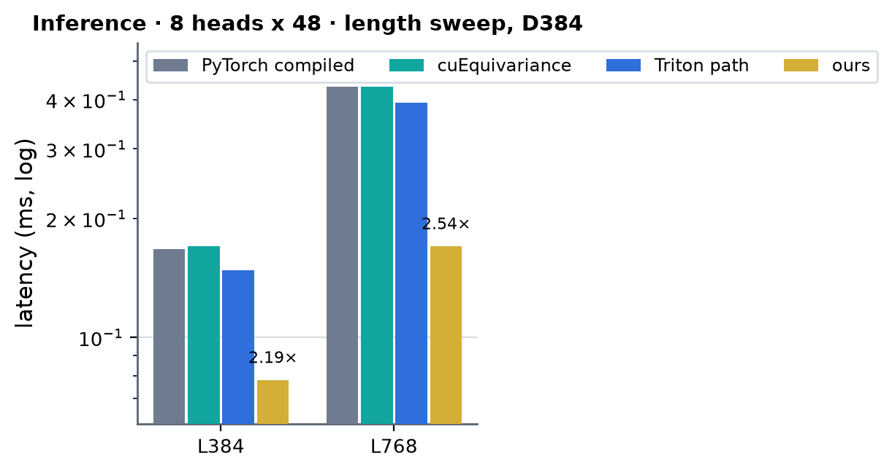
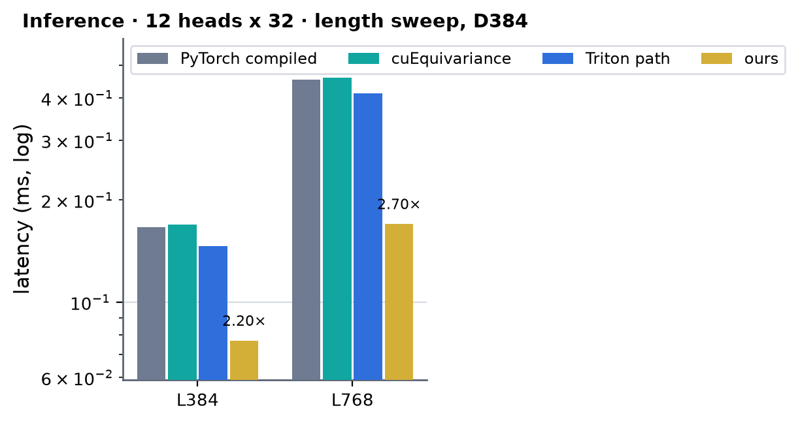
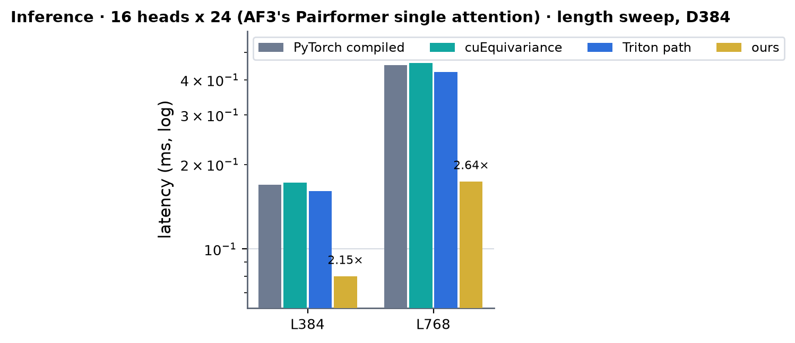
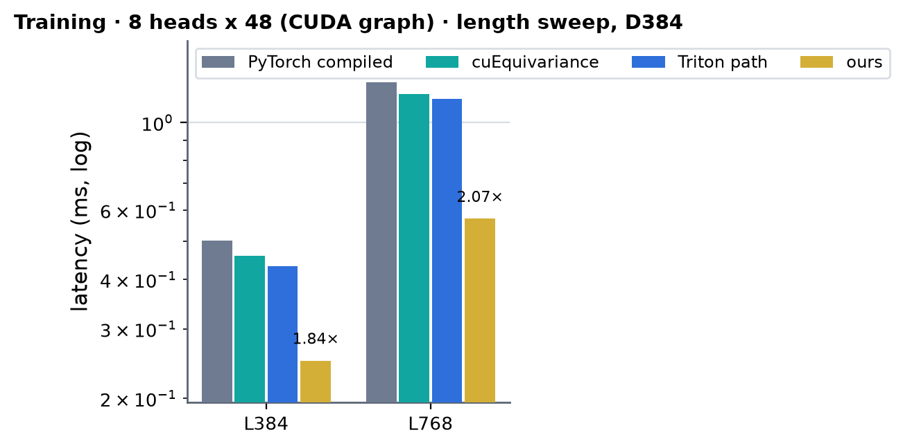
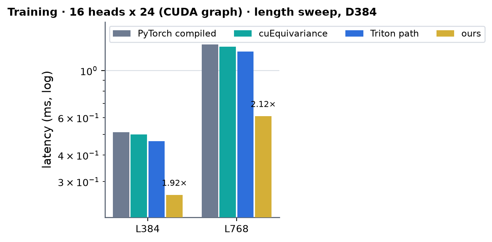

# AttentionPairBias on A100 (sm80)

Kernel-level status of AttentionPairBias (the Pairformer single track: LayerNorm(single) -> q (with bias) / k / v / gate projections, pair bias =
to_bias(LayerNorm(pair)), key mask, softmax, sigmoid gate, to_out, residual; d_pair 128, no QK-norm) on A100; the module-level summary is in
[../a100.md](../a100.md). Columns are (Length, d_single) from the shape registry (`attention_pair_bias`, token stream: d_single 384, d_pair 128, 8 heads
x 48). Four head layouts are served: 8 x 48 (the registry row), 12 x 32 and 16 x 24 (AF3's Pairformer single attention; run 32 wide per head) at d_single
384, and 16 x 32 at d_single 512.

Summary (2026-10-03). Inference and training in bf16, B = 1, any L. The path is the B200 recipe (`integrations/attention_pair_bias_b200.py`) on sm_80
pieces: the B200 row kernels (`kernels/augmented_attention/cuda/apb/apb_rows.cu`, one extension built twice), a new pair -> bias pass and its
backward on `cp.async` tiles (`apb_pair_bias_sm80.cuh`) and this family's A100 attention core (`kernels/augmented_attention/cuda/sm80`, the token DiT's and
atom DiT's kernels at head dim 32 / 48). Against cuEquivariance (`bench.py`, CUDA graph, L384 / L768): inference 2.15-2.20x / 2.54-2.70x in every layout, training 1.84-1.96x / 2.07-2.16x; the Triton
path this replaces was 1.03-1.15x cuEquivariance (see Measurements). Training without CUDA graphs is host-bound (0.83-0.89x of the faster row at L384, 0.98x at L768: the
GPU time is 0.25 / 0.57 ms, the step ~25 launches of Python glue). Accuracy matches the bf16 PyTorch module (output and every gradient within 1.06x its error against the fp32 module, every layout). Time-roofline SoL
(8 x 48): inference 39 % (L384) / 67 % (L768), training 42 % / 67 %; the pair passes run at 79-97 % of their byte floors, the rest is the small kernels of a one-sample problem.

On A100 the module runs **hand-written CUDA and cuBLAS only** from `AttentionPairBias.forward` through `integrations/attention_pair_bias_sm80.py` when the
call matches its contract: implementation MINIWORLD with the engine backend not forced to Triton, bf16 single and pair, B = 1, (heads, d_single) one of
`SHAPES` = (8, 384), (12, 384), (16, 384), (16, 512), d_pair 128, no QK-norm, key mask [1, L] or none, capability 8.0, any L (the core works on tiles of
128: the single is padded with zero rows and the bias written [H, Lp, Lp], the pair is read in place). Everything else keeps the module path
(`MINIWORLD_APB_SM80=0` forces it); a failed extension build warns once and keeps it too.

- **Inference** (no autograd; one opaque op): `ln_rows` (LayerNorm of the single rows, bf16, and a copy of the input as the output's residual seed) ->
  one cuBLAS GEMM for q | k | v | g (the weights packed once per parameter version, q and its bias pre-scaled by log2(e) / sqrt(head dim) so the logits
  come out in exp2 units) -> `pair_bias` (LayerNorm(pair) . Wf, Wf = to_bias.weight x ln_pair.weight x log2(e), masked keys, keys past L and padded query
  rows -1e30) -> the gated attention core (`attn_fwd_kernel`, MODE_GATE: sigmoid(g) o written over the q columns) -> cuBLAS to_out accumulated in place
  onto the residual seed (beta = 1: no separate residual pass, and no copy of the input into the output first as an out-of-place addmm would make).
  Five launches.
- **Training** (one autograd Function; forward and backward each one opaque op, kept as nodes by torch.compile). Forward: `prep` (weight pack, Wf) ->
  `ln_rows` (+ mean / rstd, the residual seed) -> cuBLAS q | k | v | g -> `pair_bias` (the core's raw units, natural x sqrt(head dim)) -> the plain
  core (`MODE_PLAIN`: bf16 o and the log-sum-exp) -> `gate_rows_bf` -> cuBLAS to_out in place onto the seed. Backward: cuBLAS dO and dWo ->
  `gate_bwd_bf` (dO for the core, dg) -> the core's backward (`attn_delta`, `attn_bwd_dq` with the bf16 bias-gradient partial, `db_reduce`, `bias_transpose`,
  `attn_bwd_dkv`) -> `qkv_bwd_bf` (+ dbq) -> cuBLAS dxa and dW q | k | v | g -> `ln_bwd` (+ the residual gradient) -> `pair_bias_bwd` -> `finalize` (every
  parameter gradient into its own tensor, one launch).
- **Layouts.** The pair kernels are templates on the head count (8, 12 as 16 with four zero heads, 16), the row passes on the row width (384 or 512), the
  core on the head dim. 16 x 24 runs 32 wide per head: `prep` packs q | k | v | g with 8 zero rows after each head's 24 (and Wo with 8 zero columns), so
  q, k, v, g, O and their gradients are 512 wide with exact zeros in the pads; the core sees heads of 32 and the softmax scale of 24 (`sm_scale` of
  `plain_forward` / `plain_backward`, and q's pre-scale in the inference pack), and `finalize` gathers the real rows / columns of the weight gradients back.
- ln_pair's bias adds Wb . b to every logit of a head: the softmax cancels it, so the forward drops it, and its gradient (sum_j dbias[h, i, j] = 0 for every
  query) is exactly zero -- returned as 0 (the fp32 module returns rounding noise there, ~1e-5 of ln_pair.weight's gradient).
- The parameter-gradient column sums (dWf, ln weights, dbq) add one block-reduced partial per block atomically into fp32, so those gradients differ by
  rounding from run to run; dx, dz and every other activation gradient are bit-reproducible.
- Masked keys: -1e30 in the inference bias (exp2 units), -1e4 natural in training (the plain kernels' convention, as `augattn_sm80`), where the module uses
  finfo.min: the same softmax whenever a sample has a valid key. A sample with no valid key (not expected in use) gives the uniform softmax, finite in
  both directions (the module's SDPA kernels treat that degenerate row their own way).

성능 확인: ✗. cache build ✓: nothing on these paths autotunes -- the CUDA kernels have fixed launch shapes, the two extensions are built on first use into
`~/.cache/torch_extensions` (`apb_rows_cuda_sm80`, `augmented_attention_sm80`).

## Kernels

### K1 · `pair_bias_fwd80_k` (pair -> bias: LayerNorm + projection, one read of the pair; `apb_pair_bias_sm80.cuh`)

`bias[h, i, j] = Wf[h] . LN(pair[i, j])` over d_pair 128 (the LayerNorm weight is folded into `Wf`), head-major bf16 `[H, Lp, Lp]`; masked keys, keys past L and the padded query rows get the fill value. Persistent,
two CTAs per SM of 8 warps; a tile is 128 consecutive keys of one query row (32 KB of the pair, contiguous), copied by `cp.async` (16-B granules, chunk `c ^ 4 (row & 1)` so that the fragment reads -- eight lanes = two
rows x four granules -- are conflict-free) through a two-stage ring, one barrier per tile (it publishes the landed tile and the previous tile's staged output and frees the stage the next tile goes into). A warp takes
16 rows of the tile and runs `mma.sync m16n8k16` on the raw bf16 words (A = pair rows, B = Wf's fragments, N = 8 heads per mma, the head count a template: 8, 12 as 16 with four zero heads, 16): the LayerNorm is folded into
the projection, `Wf . LN(x) = rstd (Wf . x - mean sum_c Wf)`, and the row statistics come from the tensor cores as well (`X X^T`'s diagonal and `X . 1`: no per-element float work). The fp32 results are staged
head-major and stored as 16-B vectors, one tile later, under the next tile's loads. The B200 kernel's arithmetic with its TMA bulk copies replaced by `cp.async`.

### K2 · `pair_bias_bwd80_k` (dpair, dWf)

`dpair = LN_bwd(Wf^T dbias)` and `dWf = dbias^T LN(pair)` (+ the per-head dbias sums): one more read of the pair, one read of dbias (fp32, the attention backward's, padded keys exactly 0) and one write of dpair. The tiles
arrive by `cp.async` into a ring of (the pair as two 128-B-swizzled halves of 64 channels | dbias `[H][128]`) stages, rows past the real keys zero-filled so that a padded key adds exactly 0 to dWf. 8 heads: two CTAs
per SM; 12 / 16 heads (64 dWf accumulator registers): one CTA per SM, three stages. The three products (`dx^ = Wf^T dbias`, `dWf` over the 16 rows of a warp, the row statistics) are `mma.sync` on the swizzled tile through
`ldmatrix(.trans)`, as on B200.

### K3 · attention cores (`kernels/augmented_attention/cuda/sm80`)

The token DiT's and the atom DiT's kernels (`mma.sync` / `ldmatrix` / `cp.async`, one CTA = (head, 128 queries) x R samples sharing the bias tile). Inference: `attn_fwd_kernel` MODE_GATE (sigmoid(g) o written over q, the bias
read as fp32 fragments in exp2 units; now also instantiated at head dim 32). Training: MODE_PLAIN forward (bf16 o + lse, the bias in the core's raw units added into S through the tensor core) and `attn_delta_kernel`,
`attn_bwd_dq_kernel` (dq and the bf16 bias-gradient partial), `db_reduce_kernel`, `bias_transpose_kernel`, `attn_bwd_dkv_kernel`. One sample: a CTA grid of L / 128 x heads (24 CTAs at L384, 8 heads): the core is
latency-bound there.

### K4 · row passes and glue (`apb_rows.cu`, one source for B200 and A100)

`ln_rows` (LayerNorm of the single rows with its affine, bf16, (mean, rstd), a copy of the input as the residual seed), `prep` (the packed q | k | v | g weights, Wf, the padded Wo), `gate_rows_bf` / `gate_bwd_bf` /
`qkv_bwd_bf` (the sigmoid gate and its backward, the bf16 dq | dk | dv into the projection gradient and dbq), `ln_bwd` (+ the residual gradient and the LayerNorm weight gradients), `finalize` (every parameter gradient
into its own tensor). A warp per row, lane l on 12 or 16 contiguous columns; column sums go block-reduced into one fp32 accumulator with atomics.

## Measurements (2026-10-03)

`bench.py target=attention_pair_bias` (module level, bf16, B = 1, a token key mask, CUDA graph; `+apb_n_head=<h>`, `d_single=512` for 16 x 32), A100 80GB PCIe, torch 2.13.0+cu129. Milliseconds, medians of the
bench's repeats; × = cuEquivariance's time / ours (PyTorch compiled and the Triton path are shown for reference and are never the
denominator). Anthropic: `— (not measured)`: set aside this round (the bench has an `anthropic` arm for this module, inference only; its tree on the cluster is described in [../a100.md](../a100.md)). The Triton path column is the
module's previous A100 path (the same module with `MINIWORLD_APB_SM80=0`'s composition: LayerNorm, a 128 -> H GEMM, a permute copy, the Triton augmented-attention kernel).
Jobs 62130 / 62131 / 62137 / 62138 (snapshot of 2026-10-03 18:33, one node each; the run-to-run spread between nodes is ~10 %).

### Inference · 8 heads x 48

| (Length, Dimension) | PyTorch compiled | cuEquivariance | Anthropic | Triton path | ours | × |
|---|---|---|---|---|---|---|
| (384, 384) | 0.167 | 0.170 | — (not measured) | 0.148 | 0.078 | 2.19 |
| (768, 384) | 0.431 | 0.431 | — (not measured) | 0.393 | 0.170 | 2.54 |

 <!-- measure_bars -->

### Inference · 12 heads x 32

| (Length, Dimension) | PyTorch compiled | cuEquivariance | Anthropic | Triton path | ours | × |
|---|---|---|---|---|---|---|
| (384, 384) | 0.166 | 0.169 | — (not measured) | 0.146 | 0.077 | 2.20 |
| (768, 384) | 0.453 | 0.459 | — (not measured) | 0.413 | 0.170 | 2.70 |

 <!-- measure_bars -->

### Inference · 16 heads x 24 (AF3's Pairformer single attention)

| (Length, Dimension) | PyTorch compiled | cuEquivariance | Anthropic | Triton path | ours | × |
|---|---|---|---|---|---|---|
| (384, 384) | 0.169 | 0.172 | — (not measured) | 0.161 | 0.080 | 2.15 |
| (768, 384) | 0.452 | 0.459 | — (not measured) | 0.427 | 0.174 | 2.64 |

 <!-- measure_bars -->

### Inference · 16 heads x 32 (d_single 512)

| (Length, Dimension) | PyTorch compiled | cuEquivariance | Anthropic | Triton path | ours | × |
|---|---|---|---|---|---|---|
| (384, 512) | 0.171 | 0.174 | — (not measured) | 0.155 | 0.081 | 2.15 |
| (768, 512) | 0.459 | 0.466 | — (not measured) | 0.426 | 0.177 | 2.63 |

### Training · 8 heads x 48 (CUDA graph)

| (Length, Dimension) | PyTorch compiled | cuEquivariance | Anthropic | Triton path | ours | × |
|---|---|---|---|---|---|---|
| (384, 384) | 0.502 | 0.459 | — (the release has no backward) | 0.433 | 0.249 | 1.84 |
| (768, 384) | 1.264 | 1.180 | — (the release has no backward) | 1.145 | 0.570 | 2.07 |

 <!-- measure_bars -->

### Training · 12 heads x 32 (CUDA graph)

| (Length, Dimension) | PyTorch compiled | cuEquivariance | Anthropic | Triton path | ours | × |
|---|---|---|---|---|---|---|
| (384, 384) | 0.501 | 0.484 | — (the release has no backward) | 0.431 | 0.247 | 1.96 |
| (768, 384) | 1.312 | 1.244 | — (the release has no backward) | 1.162 | 0.577 | 2.16 |

 <!-- measure_bars -->

### Training · 16 heads x 24 (CUDA graph)

| (Length, Dimension) | PyTorch compiled | cuEquivariance | Anthropic | Triton path | ours | × |
|---|---|---|---|---|---|---|
| (384, 384) | 0.513 | 0.500 | — (the release has no backward) | 0.466 | 0.260 | 1.92 |
| (768, 384) | 1.328 | 1.297 | — (the release has no backward) | 1.231 | 0.611 | 2.12 |

 <!-- measure_bars -->

### Training · 16 heads x 32 (d_single 512; CUDA graph)

| (Length, Dimension) | PyTorch compiled | cuEquivariance | Anthropic | Triton path | ours | × |
|---|---|---|---|---|---|---|
| (384, 512) | 0.510 | 0.505 | — (the release has no backward) | 0.444 | 0.268 | 1.88 |
| (768, 512) | 1.337 | 1.300 | — (the release has no backward) | 1.205 | 0.623 | 2.09 |

Training without CUDA graphs (the bench's `compile` rows) is host-bound: 8 x 48, L384 / L768: ours 1.253 / 1.266 ms against PyTorch compiled 1.014 / 1.308 and cuEquivariance 1.045 / 1.239 (0.83x / 0.98x of the faster row);
12 x 32: 1.317 / 1.335 against 1.163 / 1.357 and 1.177 / 1.311. The step is about 25 launches and 40 small torch calls of Python glue around them (the A100 GPU time is 0.25 / 0.57 ms); the 16-head rows of that mode
were measured next to other jobs on the node and are noisier (ours 2.06 / 1.77 ms at 16 x 24). Accuracy (bench columns, against the fp32 module): output relative error 1.76-1.78e-3 for ours, 1.79-1.81e-3 for the PyTorch
rows, gradients 2.05-2.07e-3 against 2.12-2.15e-3 (PyTorch) and 2.37-2.41e-3 (cuEquivariance): the path is as accurate as the bf16 module, every layout.

### Speed of light

SoL = the composite floor of the decomposition: per kernel `max(essential bytes / 1.60 TB/s, FLOP / 240 TFLOP/s)`, summed (both ceilings measured on this card, `experiments/a100_trimul_fwd`, tag
`archive/a100-sm80-branch-20260928`); every tensor a kernel reads or writes counts once, the GEMMs by their FLOP, the attention kernels as implemented (the forward 2 mma sets of 2 Lp^2 H hd FLOP, the query side 3, the
key side 4, with the bf16 bias-gradient partial written and read back, the bias transposed for the key side), the pair passes by their bytes (inference: the pair + the bias; the backward: the pair twice + dbias fp32).
Ours is the bench's time (its CUDA-graph replay includes ~10 us of launch latency a profiled replay does not: 67 / 159 us at 8 x 48, L384 / L768 inference).

| layout | mode | L | ours (µs) | SoL floor (µs) | % of SoL |
|---|---|---|---|---|---|
| 8 x 48 | inference | 384 | 78 | 31 | 39 % |
| 8 x 48 | inference | 768 | 170 | 114 | 67 % |
| 8 x 48 | training | 384 | 249 | 104 | 42 % |
| 8 x 48 | training | 768 | 570 | 383 | 67 % |
| 16 x 24 (32 wide) | inference | 384 | 80 | 35 | 43 % |
| 16 x 24 (32 wide) | inference | 768 | 174 | 128 | 74 % |
| 16 x 24 (32 wide) | training | 384 | 260 | 126 | 48 % |
| 16 x 24 (32 wide) | training | 768 | 611 | 462 | 76 % |

### Where the time goes (`torch.profiler` CUPTI kernel times, one process, jobs 62143; 8 x 48, µs per call, bf16)

| kernels | L384 inference | L384 training | L768 inference | L768 training | floor L384 (inference / training) |
|---|---|---|---|---|---|
| pair -> bias (`pair_bias_fwd80_k`) | 31.7 | 38.0 | 103.1 | 113.0 | 25.1 / 25.1 |
| pair bias backward (`pair_bias_bwd80_k`) | | 55.9 | | 206.9 | / 50.1 |
| attention forward (`attn_fwd_kernel`) | 17.5 | 15.7 | 30.2 | 28.6 | 2.4 / 2.4 |
| attention backward (`attn_bwd_dq` 22.9 / 41.2, `attn_bwd_dkv` 21.9 / 39.3, `db_reduce`, `bias_transpose`, `attn_delta`) | | 60.3 | | 124.2 | / 14.0 |
| cuBLAS GEMMs (2 / 6) | 16.2 | 47.3 | 20.7 | 57.3 | 2.6 / 8.2 |
| row passes (`ln_rows`; `prep`, `gate_rows_bf`, `gate_bwd_bf`, `qkv_bwd_bf`, `ln_bwd`, `finalize`) | 3.6 | 29.9 | 4.1 | 35.8 | 0.6 / 3.9 |
| PyTorch small ops (a copy, the zeroed accumulator, two casts) | | 12.0 | | 11.4 | |
| sum of kernel times | 69 (5 launches) | 259 (25) | 158 (5) | 577 (25) | 31 / 104 |
| graph replay | 68 | 247 | 159 | 571 | |

The two pair passes are at 79 % / 97 % (inference forward, L384 / L768) and 90 % / 97 % (backward) of their byte floors: at L768 the pair read is 56 % of the training step and 65 % of inference, so what is left there is HBM. At L384
the step is the small kernels of a one-sample problem: the attention core runs 24 CTAs (3 query tiles x 8 heads) on 108 SMs, the two projection GEMMs are 8 us each for 0.45 / 0.11 GFLOP, and a launch is ~3 us.
The 16 x 24 layout (32 wide per head, H = 16) is the same step with a 1.1x wider pair pass (the 16-head kernel) and a 1.3x wider projection: 70 / 258 us at L384 and 164 / 610 us at L768 (inference / training).

### What was tried and did not pay (2026-10-03)

- The ring depth of the gated attention core at one sample (`_fwd_schedule`): 3 stages 16.3 / 29.0 us (8 x 48, L384 / L768) and 13.2 / 23.6 us (16 x 32) against 15.9 / 28.0 and 12.9 / 22.9 with 4: kept 4 (2-4 %).
- A cuBLASLt algorithm search for the projections (the best of the 8 heuristic algorithms, timed in a C++ loop against the kernel torch.mm launches in the graph): q | k | v | g at M = 384 8.0 us against 8.5, to_out
  6.8 against 7.7, 16 x 24's q | k | v | g 8.8 against 9.1: at most 1.3 us a GEMM, not worth a wrapper (and at the token DiT's M = 1920 the same search finds 1.00-1.04x, see
  [../token_dit/token_dit.md](../token_dit/token_dit.md)).
- Overlapping the pair pass (31.7 us, memory-bound, independent of the projections) with `ln_rows` + the q | k | v | g GEMM (12 us) on a second stream was costed, not built: the persistent pair kernel holds two CTAs of 73 KB per
  SM, so no GEMM CTA can share an SM with it, and its tile assignment is static (a CTA that starts late finishes late); it would need a dynamic tile queue first, for at most 12 of the 68 us.

### Limits and next

- Not served on A100 (they run the module path): fp32 operands, QK-norm, B > 1, a mask other than `[1, L]`, d_single / head layouts other than `SHAPES` (24 x 16 needs a head dim 16 core), d_pair other than 128.
- Training without CUDA graphs is host-bound (see the table note above): fewer, fatter launches (the backward's three small row passes into one, `prep` per parameter version instead of per call) would cut it, the GPU step is
  already 2x cuEquivariance's.
- The attention core at one sample is the largest piece after the pair passes at L384 (17.5 us of 68; 24 CTAs): a 64-query tile variant, or a split over the key range, would fill the GPU; the backward's attention kernels (60 us of 247) have the same shape problem.
- Anthropic's A100 numbers for this module (the bench's `anthropic` arm, inference only) are not measured yet.
