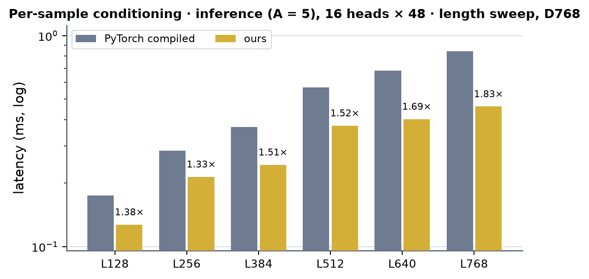
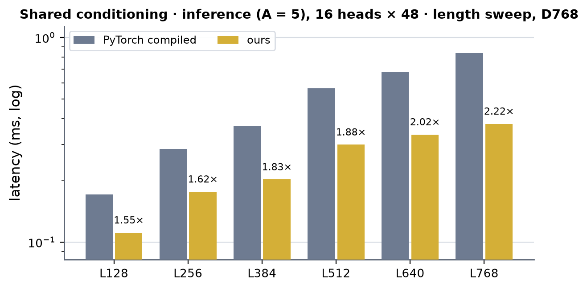
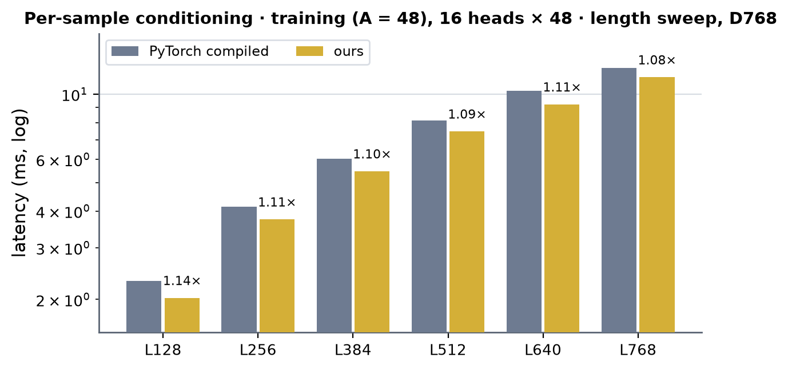
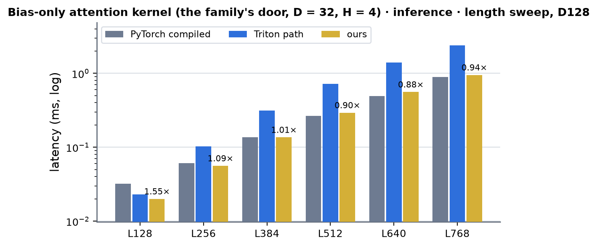
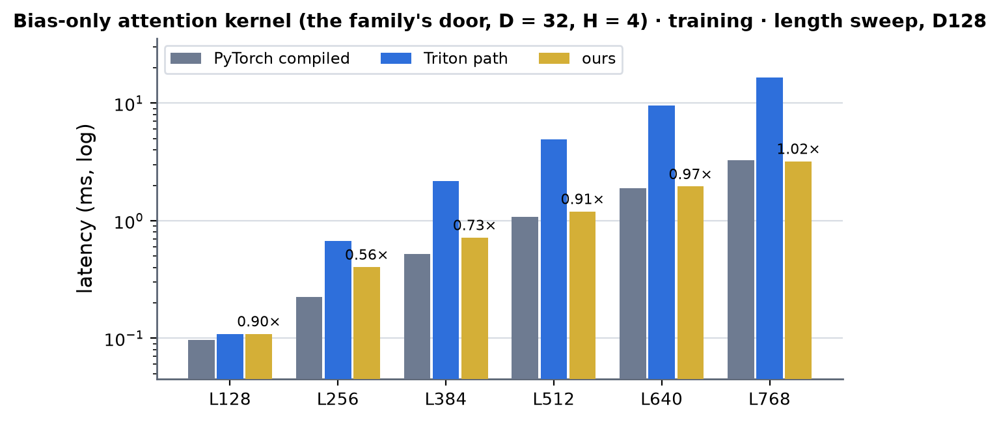

# Bias-only token DiT on A100 (sm80)

Kernel-level status of the bias-only token DiT block on A100; the module-level summary is in [a100.md](../a100.md) and the algorithm is described on the B200 page
([../../b200/bias_only_dit/bias_only_dit.md](../../b200/bias_only_dit/bias_only_dit.md)). The block (`modules/bias_only_dit`, `BiasOnlyDiTBlock`) is the token DiT block with the attention's query-key half
removed: AdaLN + **bias-only attention** (the logits are the pair bias, `softmax(to_bias(LN(pair))) v`, gated by `sigmoid(g)` and by the conditioning scale) + conditioned SwiGLU transition. Widths as the
`dit` target: d_single 768, d_cond 384, d_pair 128, transition n = 2. Columns are (Length, Dimension) with the token width 768 (bf16 only). No other implementation of this op exists (cuEquivariance and
Anthropic have no such block), so every comparison is against the PyTorch module compiled.

With no query and no key the attention weights `P = softmax(bias)` depend on neither the augmented sample nor the single representation, only on the pair, which carries no noise level: one `P` per block serves
every sample and every solver step. The fast path is therefore a different algorithm from the DiT's: `P` is hoisted (once per pair and mask, cached on the tensors' pointer and version), and the per-sample attention is
one GEMM per head (`P_h [L, L] x v_h [L, d_head]`) with the gate in its epilogue -- no online softmax, no running maximum, no rescale.

Before this path the A100 ran the module's PyTorch composition (the `miniworld` arm of the bench *was* the PyTorch module: no A100 kernel existed). The inference path of the B200 block is portable
except for its attention core (a tcgen05 GEMM): the runner (`kernels/bias_only_dit/cuda/runner.py`), the row kernels (`bias_only_dit_rows.cu`, already built for sm_80) and the token DiT's CUDA rows are the same on
A100; the core is new, `kernels/bias_only_dit/cuda/sm80` (`mma.sync`, `ldmatrix`, `cp.async`). **Training** (2026-10-04) is the B200 block's flow too, with the three sm_100a pieces replaced by
cuBLAS / sm_80 ones: the attention's forward and `dV = P^T dO` run the same core, the bias gradient has its own (`dpb_sm80.cuh`), the expand GEMM and its SwiGLU are cuBLAS and the family's row kernel.

## Scope and dispatch

**Inference**: `BiasOnlyDiTBlock.forward` -> `integrations/bias_only_dit.py` (`serves()` is the whole gate) -> `kernels/bias_only_dit/cuda/runner.py` (`FusedBiasOnlyDiT`). Served: implementation MINIWORLD or
TRITON, `settings.engine_backend != "triton"`, an A100 or a B200, bf16, B == 1, d_single 768 / cond 384 / pair 128 / transition n = 2, **L a multiple of 128** (on A100 any such L: the core loops over key chunks;
tested to L = 1024), a key mask [1, L] or none, LayerNorm eps 1e-5; one conditioning per sample or one shared by the samples (sample axis 1 or stride 0), no autograd.
**Training** (autograd on): `integrations/bias_only_dit_train.py` (`serves()`): the same widths and layouts, bf16 operands, B == 1, L a multiple of 128 up to 768, **a conditioning per sample** `[A, 1, L, 384]`, a key mask
[1, L] or none. Everything else runs the module's PyTorch composition. cuBLAS and CUDA only (no Triton): cuBLAS GEMMs, the family's CUDA row kernels and the sm_80 cores.

**Head layouts** (read off the weights; the core is instantiated for head widths 32 / 48 / 64): 16 heads x 48 (default, 768 attention channels), 24 x 32, 12 x 64, 16 x 64 (1024 channels: `BiasOnlyDiTBlock(d_head=64)`);
the bench options are `+n_head=24` / `+n_head=12` / `+d_head=64`.

**Switches** (default on): `MINIWORLD_BIAS_ONLY_DIT` (the inference path), `MINIWORLD_BIAS_ONLY_DIT_TRAIN` (the training block), `MINIWORLD_BIAS_ONLY_DIT_CORE` (the core: off declines the whole inference path on A100).
Experiment knobs of the sm_80 cores: `MINIWORLD_BIAS_ONLY_DIT_SM80_STAGES` (cp.async ring depth, default 2), `MINIWORLD_BIAS_ONLY_DIT_SM80_SG` (samples per CTA, default from `pick_group`),
`MINIWORLD_BIAS_ONLY_DIT_SM80_DPB` (the bias-gradient core's schedule, 0-3, default 0). A failed extension build warns once and keeps the module's composition.

**cache build ✓** everywhere: nothing on this path autotunes; the core and the rows are torch extensions built on first use (`load_extension`, never at import: about 8 min of nvcc for the three of them on a cold
cache, the core 100 s), the shape-dependent choice (samples per CTA) is a closed-form rule, the GEMMs are cuBLAS. **성능 확인** is the maintainer's column (✗ = not confirmed).

**Tests**: `tests/integrations/test_a100_bias_only_dit_gpu.py` (164 tests): the whole block against the PyTorch block in the same bf16 regime and against fp32 for all four layouts, L = 128 / 256 / 384 / 1024, S = 1 / 2 / 3 / 5,
shared and per-sample conditioning, with and without a key mask (no worse than 1.05x the PyTorch bf16 block's own error against fp32; relative difference to it < 1e-2); the attention core against its reference at L = 128-1024,
S = 1-8, every layout, gated and ungated, every schedule (ring depth, samples per CTA, a short last group); the softmax; the caches (weight pack and hoisted `P` follow in-place changes, `torch.compile`); what the gate
declines; CUDA-graph capture, bit-identical replays. `tests/integrations/test_a100_bias_only_dit_train_gpu.py` (90 tests): the training block's output and every gradient (single, cond, pair and all 20 parameters) against an
fp32 PyTorch block, no worse than 1.1x the PyTorch bf16 block's own error + 1e-4, for the four head layouts at L = 128 / 256 / 384 / 640 / 768 with A = 5 / 8 / 16 / 48, masked and unmasked; the two attention backward
kernels (`dV = P^T dO` on the transposed softmax, `dbias = P (sum_a dO v^T - D)`) against einsum at every layout, L = 128-768, A = 1-48 and every schedule of the bias-gradient core; CUDA-graph capture and replay, `torch.compile`,
steady memory over steps; what the gate declines.

## Inference

Per call the runner (1) makes `P` for every block once per pair and mask: a CUDA LayerNorm of the pair rows, one cuBLAS GEMM for the per-head bias (the LayerNorm weight folded into the projection) and the CUDA row softmax
written in place; (2) makes the conditioning tables: a CUDA LayerNorm of the conditioning rows and two cuBLAS GEMMs (AdaLN scale / shift of both halves, the two output gates), over L rows when the samples share one
conditioning, over S L rows otherwise; (3) runs each block: input AdaLN rows -> cuBLAS v|g GEMM -> **core** -> cuBLAS out GEMM -> residual + gate + AdaLN rows -> cuBLAS expand GEMM -> SwiGLU rows -> cuBLAS squeeze GEMM ->
residual + gate rows in the output dtype. The residual stream is fp32: 12 launches per block at A = 5 (the PyTorch composition: 47-51 launches in eager mode).

### I1 · attention core (`pv_gate_kernel`: sigmoid(g) · (P v), per head and sample)

`kernels/bias_only_dit/cuda/sm80/pv_gate_sm80.cuh`. CTA = (128 queries, head, group of SG samples), 8 warps x 16 queries. The keys stream through a two-stage `cp.async` ring of 64-key chunks; a chunk is **one P tile
[128 x 64]** and the SG samples' v tiles [64 x d_head], rows padded to an odd number of 16-byte granules (P 144 B, v 80 / 112 / 144 B) so that every `ldmatrix` is conflict-free without a swizzle. P comes out of shared
memory through `ldmatrix` as the A fragments of `mma.sync.m16n8k16` (bf16 -> fp32), v through `ldmatrix.trans` as the B fragments of d_head / 8 n8 tiles; each warp issues SG x d_head / 8 x 4 MMAs per chunk on one set of
P fragments. The epilogue is `sigmoid(g) * o` and the one rounding to bf16 (the reference `kernels/bias_only_dit/reference.pv_gate`), stores of 4 bytes per fragment pair. SG = the smallest group that fills the card:
`nh (L / 128) ceil(S / SG) <= SMs`, else 4 (`pick_group`: SG = 3 for A = 5 at L = 384, 4 at L = 768).

| (Length, Dimension) | (128, 768) | (256, 768) | (384, 768) | (512, 768) | (640, 768) | (768, 768) |
|---|---|---|---|---|---|---|
| implementation | CUDA | CUDA | CUDA | CUDA | CUDA | CUDA |
| 성능 확인 | ✗ | ✗ | ✗ | ✗ | ✗ | ✗ |
| cache build | ✓ | ✓ | ✓ | ✓ | ✓ | ✓ |

### I2 · row kernels (`ln_rows`, `adaln_in_rows`, `resgate_adaln_rows`, `resgate_out_rows`, `swiglu_rows`, `softmax_rows`)

`kernels/bias_only_dit/cuda/bias_only_dit_rows.cu` (the B200 page's I2; built for sm_80 as well): one warp per row, every load of the row issued before any math, the statistics as warp reductions over registers;
`softmax_rows` takes the key mask (masked keys at the largest negative finite logit: a fully masked row is uniform, as in the PyTorch module). The pair LayerNorm is the token DiT's CUDA `layernorm128_rows`.

| (Length, Dimension) | (128, 768) | (256, 768) | (384, 768) | (512, 768) | (640, 768) | (768, 768) |
|---|---|---|---|---|---|---|
| implementation | CUDA | CUDA | CUDA | CUDA | CUDA | CUDA |
| 성능 확인 | ✗ | ✗ | ✗ | ✗ | ✗ | ✗ |
| cache build | ✓ | ✓ | ✓ | ✓ | ✓ | ✓ |

### I3 · projections and transition GEMMs (cuBLAS: v|g, out, expand, squeeze, the two conditioning tables; the SwiGLU in `swiglu_rows`)

Figure only in the sense of the kernel tables (cuBLAS steps appear in the profile below): the B200's expand GEMM with the SwiGLU epilogue (`gemm_swiglu2_sm100`) does not exist on A100, so the expand output [S L, 3072]
goes through memory once (written by cuBLAS, read by `swiglu_rows`).

## Training

One autograd Function per block call (`integrations/bias_only_dit_train.py`), its forward and backward each one opaque op (`bias_only_dit_train_sm100_fwd` / `_bwd`: the names of the B200 flow it shares), CUDA and cuBLAS only:
bf16 GEMMs with fp32 accumulation (weight gradients in the parameters' dtype), the family's row kernels `bias_only_dit_train_rows.cu` (built for sm_80 as well: the conditioning LayerNorm, AdaLN, residual + gate, their backwards,
the pair bias `LN(pair) Wf^T` on `mma.sync`, the pair-bias backward) and the attention's cores:

- **forward** per block: conditioning LN -> cuBLAS tables G (the AdaLN scale / shift of both halves) and Gg (both output gates) -> AdaLN rows -> cuBLAS v | g -> `pair_bias` (the pair read once: bias = `LN(pair) Wf^T`, head-major,
  `Wf = to_bias.weight x ln_pair.weight`) -> `softmax_t` (P once for every sample, the key mask folded in, **P^T written beside it**) -> the core `pv_gate` (`a = sigmoid(g) (P v)`, as in inference) -> cuBLAS out ->
  `res_adaln_b` (residual + gate + the transition's AdaLN) -> cuBLAS expand (a | b, 2 x 1536 channels) -> `swiglu_rows` -> cuBLAS squeeze -> `res_c`. 14 launches; the B200's expand GEMM with the SwiGLU in its epilogue is replaced by cuBLAS + the row pass.
- **backward**: `res_c_bwd`, the transition's GEMMs and `swiglu_bwd`, `res_adaln_b_bwd`, cuBLAS dog and dWo, **`gate_bwd_rows`** (`do = da sigmoid(g)`, `dg = da a (1 - sigmoid(g))`, `D = sum da a` per row and head:
  a = sigmoid(g) o, so the pre-gate o is never stored), **`dV = P^T do`** (the same core without the gate, on the transposed `P`), **`dbias = P (sum_a do v^T - D)`** (the bias-gradient core below), cuBLAS dx / dW of v | g,
  `adaln_a_bwd`, the conditioning GEMMs, `pair_bias_bwd` (`d pair` and `dWf = dbias LN(pair)` in one kernel, `LN(pair)` rebuilt on chip) and `finalize` (every parameter gradient in its own dtype, one launch). 23 launches.

### T1 · bias-gradient core (`dpb_kernel`: dbias_h = P o (sum_a do v^T - D))

`kernels/bias_only_dit/cuda/sm80/dpb_sm80.cuh`. Per head, the attention weights are shared by the samples, so `dP = sum_a sum_d do[a, i, d] v[a, j, d]` is ONE GEMM over K = A x d_head: the sample loop is the K loop and no per-sample
partial exists. CTA = (head, 128 queries, 128 keys), 8 warps as 4 (queries) x 2 (keys), a warp tile of 32 x 64 (64 fp32 accumulators); a stage of the cp.async ring is one sample's do tile `[128][d_head]` and v tile
`[128][d_head]` (rows padded to an odd number of 16-byte granules: conflict-free `ldmatrix` without a swizzle), both K-contiguous, so `ldmatrix` without `.trans` gives the A fragments (do) and the B fragments (v: rows =
keys) of `mma.m16n8k16`. The prologue sums `D[i] = sum_a dd[a, h, i]` (the row term `gate_bwd_rows` made per sample) into shared memory; the epilogue reads P in the accumulator layout and writes `dbias` as bf16 pairs. A masked key
has P = 0 and so dbias 0. Schedules (`MINIWORLD_BIAS_ONLY_DIT_SM80_DPB`): 0 two stages x one sample with two CTAs per SM (default), 1 three x one, 2 two x two, 3 three x two (not for head widths 48 and 64: shared memory).

| (Length, Dimension) | (128, 768) | (256, 768) | (384, 768) | (512, 768) | (640, 768) | (768, 768) |
|---|---|---|---|---|---|---|
| implementation | CUDA | CUDA | CUDA | CUDA | CUDA | CUDA |
| 성능 확인 | ✗ | ✗ | ✗ | ✗ | ✗ | ✗ |
| cache build | ✓ | ✓ | ✓ | ✓ | ✓ | ✓ |

### T2 · row kernels of the training block (`bias_only_dit_train_rows.cu` and `softmax_t`, `gate_bwd_rows`)

The B200 page's T2: one warp per row (or per tile for the pair bias), forward and backward, 16 kernels; the SwiGLU forward is the inference page's `swiglu_rows`. The expand / squeeze / projection GEMMs of the block (21 of them, forward
and backward) are cuBLAS: the figures only.

| (Length, Dimension) | (128, 768) | (256, 768) | (384, 768) | (512, 768) | (640, 768) | (768, 768) |
|---|---|---|---|---|---|---|
| implementation | CUDA | CUDA | CUDA | CUDA | CUDA | CUDA |
| 성능 확인 | ✗ | ✗ | ✗ | ✗ | ✗ | ✗ |
| cache build | ✓ | ✓ | ✓ | ✓ | ✓ | ✓ |

## Bias-only attention · the kernel family's door (`kernels/bias_only_attention`, 2026-10-04)

`softmax(bias) v` -- the logits are the pair bias, no query and no key -- is a kernel of its own as well: the registry's `bias_only_attention` kernel row (`bench.py target=bias_only_attention level=kernel`; `v`
`[B, H, L, L, D]` and `bias` `[B, H, L, L]`: the second L of v is the "t" axis that shares the weights of one (batch, head) plane; the bench uses D = 32 and H = d_pair / 32). The family's public door
`kernels.bias_only_attention.interface.bias_only_attention(v, bias)` takes the **hand-CUDA path on an A100** (`kernels/bias_only_attention/cuda/sm80.py`) where it serves the call and wins -- bf16 v and bias, D = 32 / 48 / 64, L a
multiple of 128 up to 1024, `settings.engine_backend != "triton"`, `MINIWORLD_BIAS_ONLY_ATTN_SM80 != "0"`, and not a training call at L = 128 (below) -- and the Triton kernels (`triton_bias_only_attention`, `triton/main.py`) otherwise;
`triton_bias_only_attention` itself is always the Triton one (the "Triton path" column below). **Dispatch rule (BRIEF 4.3):** at L = 128 the CUDA backward (five launches: the transposed softmax, two cores, the row term, the bias-gradient
core) takes 0.172 ms against Triton's 0.109 ms, so a training call (autograd on, some input requiring grad) with L < 256 (`MIN_TRAIN_LENGTH`) goes to Triton; inference at every L and training from L = 256 take CUDA;
`MINIWORLD_BIAS_ONLY_ATTN_SM80=all` takes every call the path serves. The module-level user of this kernel (the bias-only triangle attention: LN + projection, `softmax(bias)` einsum, gate-out) is not rewired to it here.

The kernels are the bias-only DiT's own (this page, I1 and T1), generalised to head planes: `P = softmax(bias)` by the family's row softmax (bf16, as the Triton kernel's probabilities), then `pv_planes`, the DiT's
`pv_gate` core with the v / out PLANES `[L (t), L (n), D]` one after the other instead of the DiT's head columns (a CTA = 128 query rows of a plane × a group of t slices that share the P tile; `mma.sync` bf16 → fp32, `cp.async` ring,
no gate). Backward: `softmax_t` (P and P^T), `dv = P^T dout` (the same core on the transposed P), `delta_planes` (`D[t, h, m] = sum_d dout out`) and `dpb_planes` (`dbias = P (sum_t dout v^T - sum_t D)`: the sum over t is the K
loop of one GEMM per plane, so there are no per-t partials). One autograd Function, forward and backward each one opaque op (`bias_only_attention_sm80_fwd` / `_bwd`); `torch.compile(fullgraph=True)` keeps them; a failed
build warns once and keeps Triton.

Tests: `tests/integrations/test_a100_bias_only_attention_gpu.py` (10 tests): the CUDA path's output and both gradients against the fp64 reference, no worse than the Triton kernels', at (B, H, L, D) = (1, 4, 128, 32), (1, 4, 384, 32),
(2, 3, 256, 48), (1, 2, 128, 64), (1, 8, 256, 32), (1, 1, 640, 48); `torch.compile` and CUDA-graph replay equal eager; a replay of the backward is bit-identical; the gate and the switch; the door's rule (a training call at L = 128 keeps Triton).

##### K1 · bias-only attention, forward and backward (`softmax_rows`, `pv_planes`; `softmax_t`, `pv_planes`, `delta_planes`, `dpb_planes`)

| (Length, Dimension) | (128, 128) | (256, 128) | (384, 128) | (512, 128) | (640, 128) | (768, 128) |
|---|---|---|---|---|---|---|
| implementation | CUDA (inference) / Triton (training) | CUDA | CUDA | CUDA | CUDA | CUDA |
| 성능 확인 | ✗ | ✗ | ✗ | ✗ | ✗ | ✗ |
| cache build | ✓ | ✓ | ✓ | ✓ | ✓ | ✓ |

## Measurements (2026-10-04)

One A100 80GB PCIe (300 W), torch 2.13.0+cu129, bf16, B = 1, no masked tokens (the bench default), CUDA-graph timing (`cudagraph=manual`), `benchmarks/runners/bench.py target=bias_only_dit level=module`, the sources frozen in a
snapshot for the run (`snap_1004_084240`, the final sources). Inference: A = 5 samples; training: A = 48. Two conditionings: **per sample** (every sample has its own) and **shared** (`+shared_cond=true`: one conditioning for the A
samples, as a sampling step has it; inference only). Job **63261** (gpu02: per-sample inference and training, then shared inference, PyTorch compiled and ours of each in the same job); the "other head layouts" table is the
2026-10-03 one (jobs 62076 / 62077 / 62078, gpu08 / gpu08 / gpu09: those paths are unchanged); run-to-run spread 2-3 %, up to 10 % between nodes. The 2026-10-03 and 2026-10-04 runs of the 16 × 48 tables agree within 1-2 %.
Times in ms. "PyTorch compiled" = the module with `implementation=pytorch` under `torch.compile`; the A100 `miniworld` arm was this same composition before the path. **×** = PyTorch compiled divided by ours: cuEquivariance and
Anthropic have no such block.

### Per-sample conditioning · inference (A = 5), 16 heads × 48

| (Length, Dimension) | PyTorch compiled | cuEquivariance | Anthropic | ours | × |
|---|---|---|---|---|---|
| (128, 768) | 0.175 | — (none) | — (none) | 0.127 | 1.38 |
| (256, 768) | 0.284 | — (none) | — (none) | 0.214 | 1.33 |
| (384, 768) | 0.369 | — (none) | — (none) | 0.244 | 1.51 |
| (512, 768) | 0.569 | — (none) | — (none) | 0.374 | 1.52 |
| (640, 768) | 0.681 | — (none) | — (none) | 0.402 | 1.69 |
| (768, 768) | 0.843 | — (none) | — (none) | 0.461 | 1.83 |

 <!-- measure_bars -->

### Shared conditioning · inference (A = 5), 16 heads × 48

| (Length, Dimension) | PyTorch compiled | cuEquivariance | Anthropic | ours | × |
|---|---|---|---|---|---|
| (128, 768) | 0.171 | — (none) | — (none) | 0.111 | 1.55 |
| (256, 768) | 0.285 | — (none) | — (none) | 0.176 | 1.62 |
| (384, 768) | 0.370 | — (none) | — (none) | 0.202 | 1.83 |
| (512, 768) | 0.563 | — (none) | — (none) | 0.299 | 1.88 |
| (640, 768) | 0.678 | — (none) | — (none) | 0.335 | 2.02 |
| (768, 768) | 0.838 | — (none) | — (none) | 0.378 | 2.22 |

 <!-- measure_bars -->

### Per-sample conditioning · training (A = 48), 16 heads × 48

`bench.py target=bias_only_dit mode=training` (job 63261, gpu02; A = 48 samples, a conditioning per sample, no dropout, CUDA-graph timing, B = 1, no masked tokens), forward + backward of one block with
the gradients of all inputs and parameters. "PyTorch compiled" = the module's composition under `torch.compile` (what the A100 `miniworld` arm ran before this path).

| (Length, Dimension) | PyTorch compiled | cuEquivariance | Anthropic | ours | × |
|---|---|---|---|---|---|
| (128, 768) | 2.310 | — (none) | — (none) | 2.023 | 1.14 |
| (256, 768) | 4.145 | — (none) | — (none) | 3.746 | 1.11 |
| (384, 768) | 6.034 | — (none) | — (none) | 5.462 | 1.10 |
| (512, 768) | 8.151 | — (none) | — (none) | 7.466 | 1.09 |
| (640, 768) | 10.253 | — (none) | — (none) | 9.230 | 1.11 |
| (768, 768) | 12.282 | — (none) | — (none) | 11.417 | 1.08 |

 <!-- measure_bars -->

The step is **GEMM-bound**: at A = 48, L = 384 it is 816 GFLOP (the forward's GEMMs 261 GFLOP including the two conditioning-table GEMMs over 18432 rows, the backward twice that, the attention's three products 33 GFLOP),
3.4 ms at the 240 TFLOP/s ceiling, against 5.46 ms measured (62 % of that floor; the rest is the memory-bound row kernels, the attention cores and the GEMMs' distance from the ceiling): the fused rows and the sm_80 cores bought 8-14 %
over the compiled composition, which runs the same GEMMs. The FLOP floor at every L (GEMM FLOP 783 × L / 384 GFLOP, attention 33 × (L / 384)² GFLOP, at 240 TFLOP/s; the memory-bound passes are not in it):

| L | 128 | 256 | 384 | 512 | 640 | 768 |
|---|---|---|---|---|---|---|
| FLOP floor (µs) | 1103 | 2236 | 3400 | 4595 | 5819 | 7075 |
| ours (µs) | 2023 | 3746 | 5462 | 7466 | 9230 | 11417 |
| % of the FLOP floor | 55 % | 60 % | 62 % | 62 % | 63 % | 62 % |

The training step's three attention cores in isolation (a scratch micro-benchmark outside the repository, job 63303 on gpu03: CUDA events over 20 launches, P resident in L2; FLOP = 2 A H L² d_head, one GEMM-equivalent each, against the 240 TFLOP/s ceiling):

| shape (A, L, heads × d_head) | `pv_gate` (gated forward) | `dV = P^T dO` (same core, no gate) | `dpb` (bias gradient, schedule 0) |
|---|---|---|---|
| 48, 128, 16 × 48 | 42 µs (29 TFLOP/s) | 30 µs (40) | 73 µs (17) |
| 48, 384, 16 × 48 | 172 µs (63) | 129 µs (84) | 105 µs (104) |
| 48, 768, 16 × 48 | 460 µs (95) | 374 µs (116) | 324 µs (134) |
| 48, 384, 24 × 32 | 162 µs (67) | 121 µs (90) | 93 µs (117) |
| 48, 384, 12 × 64 | 162 µs (67) | 125 µs (87) | 94 µs (116) |
| 8, 384, 16 × 48 | 30 µs (60) | 27 µs (67) | 29 µs (62) |
| 5, 768, 16 × 48 | 65 µs (70) | 55 µs (82) | 68 µs (67) |

Schedule 0 of `dpb` (two stages × one sample, two CTAs per SM) is the fastest at every shape measured: at A = 48, L = 384, 16 × 48 the schedules 1 / 2 take 153 / 141 µs against 105 µs (schedule 3 does not fit shared memory at head width 48 and 64).
From L = 384 up the gated forward core is the slowest of the three per FLOP; at L = 128 the bias-gradient core is (one 128 × 128 tile per head: 16 CTAs on 108 SMs). The three cores are 7-10 % of a training step (0.41 ms of the
5.46 ms step at A = 48, L = 384, 1.16 ms of 11.4 ms at L = 768): the step is the GEMMs.

### Other head layouts · inference (A = 5, shared conditioning)

| layout | (Length, Dimension) | PyTorch compiled | ours | × | ours (µs) / floor (µs) / % of SoL |
|---|---|---|---|---|---|
| 24 heads × 32 | (384, 768) | 0.372 | 0.205 | 1.82 | 205 / 139 / 68 % |
| 24 heads × 32 | (768, 768) | 0.872 | 0.373 | 2.34 | 373 / 284 / 76 % |
| 12 heads × 64 | (384, 768) | 0.365 | 0.201 | 1.82 | 201 / 137 / 68 % |
| 12 heads × 64 | (768, 768) | 0.828 | 0.366 | 2.27 | 366 / 275 / 75 % |
| 16 heads × 64 (1024 channels) | (384, 768) | 0.399 | 0.231 | 1.73 | 231 / 149 / 64 % |
| 16 heads × 64 (1024 channels) | (768, 768) | 0.903 | 0.418 | 2.16 | 418 / 300 / 72 % |

### Bias-only attention kernel (the family's door, D = 32, H = 4) · inference

`bench.py target=bias_only_attention level=kernel` (v `[1, 4, L, L, 32]`, bias `[1, 4, L, L]`, d_pair 128, CUDA-graph timing, bf16): PyTorch compiled = `softmax(bias)` + the `einsum` (cuBLAS batched GEMM); Triton path =
`triton_bias_only_attention`; ours = the door's default dispatch (`bias_only_attention`: CUDA from this page's `kernels/bias_only_attention/cuda/sm80.py`). Inference: job 63196 (gpu03, snapshot `snap_1004_013704`); training rows with
`compile=false` (the harness cannot compile a kernel-level training step; the helper compiles the PyTorch core itself); both tables are job **63342** (gpu02, snapshot `snap_1004_091714`: the final sources, the door's rule included;
the first measurement of 2026-10-04 08:45-09:06, jobs 63196 / 63270, agrees within 5 %). Times in ms; **×** = PyTorch compiled divided by ours.

| (Length, Dimension) | PyTorch compiled | cuEquivariance | Anthropic | Triton path | ours | × |
|---|---|---|---|---|---|---|
| (128, 128) | 0.032 | — (none) | — (not measured) | 0.023 | 0.020 | 1.55 |
| (256, 128) | 0.061 | — (none) | — (not measured) | 0.103 | 0.056 | 1.09 |
| (384, 128) | 0.137 | — (none) | — (not measured) | 0.314 | 0.136 | 1.01 |
| (512, 128) | 0.264 | — (none) | — (not measured) | 0.722 | 0.293 | 0.90 |
| (640, 128) | 0.495 | — (none) | — (not measured) | 1.395 | 0.559 | 0.88 |
| (768, 128) | 0.895 | — (none) | — (not measured) | 2.388 | 0.950 | 0.94 |

 <!-- measure_bars -->

### Bias-only attention kernel (the family's door, D = 32, H = 4) · training

| (Length, Dimension) | PyTorch compiled | cuEquivariance | Anthropic | Triton path | ours | × |
|---|---|---|---|---|---|---|
| (128, 128) | 0.097 | — (none) | — (not measured) | 0.109 | 0.109 | 0.90 |
| (256, 128) | 0.225 | — (none) | — (not measured) | 0.674 | 0.403 | 0.56 |
| (384, 128) | 0.521 | — (none) | — (not measured) | 2.166 | 0.718 | 0.73 |
| (512, 128) | 1.084 | — (none) | — (not measured) | 4.914 | 1.198 | 0.91 |
| (640, 128) | 1.886 | — (none) | — (not measured) | 9.610 | 1.953 | 0.97 |
| (768, 128) | 3.255 | — (none) | — (not measured) | 16.541 | 3.201 | 1.02 |

 <!-- measure_bars -->

Against the **Triton kernel** the door is 1.15-2.5x faster in inference (L = 128: 0.020 against 0.023 ms; L >= 384 2.3-2.5x) and 1.7-5.2x faster in training from L = 256 (training at L = 128 is the Triton kernel by the rule above: equal, 0.109 ms; the
CUDA path measured 0.172 ms there). Against **PyTorch compiled** (the baseline of the × column: cuEquivariance and Anthropic have no such kernel) the CUDA path is at parity at L >= 384 in inference (0.88-1.01x) and **slower in training
below L = 768** (0.56-0.97x): `softmax(bias)` followed by the einsum is one cuBLAS-bound batched GEMM (at L = 768 inference 0.895 ms for 116 GFLOP, 130 TFLOP/s: 54 % of the ceiling) that the hand-CUDA path (softmax + core: 0.95 ms, 122 TFLOP/s, 51 %)
does not beat, and its backward as five launches (the transposed softmax, `dV`, the row term, the bias-gradient core) does not either at the smaller planes. The gain over the previous A100 path (Triton) is real, the gain over
PyTorch compiled is not: the next step would be a fused softmax + P v core with P kept on chip (no P round trip through HBM) rather than more tuning of these.

### Speed of light

SoL = the composite floor of the runner's stages (`bo_sol.py`, scratch): per stage `max(essential bytes / 1.60 TB/s, FLOP / 240 TFLOP/s)` (both ceilings measured on this card, see [../a100.md](../a100.md)), summed; every tensor
a stage reads or writes counts once, the four GEMMs and the core by their FLOP (the GEMMs are compute-bound: 20.4 GFLOP at A = 5, L = 384, 85 µs of the 137 µs floor), the pair hoist is not counted (the timed calls reuse
one pair), the conditioning tables are over L rows (shared) or S L rows (per sample).

| L | per sample: ours (µs) | floor (µs) | % of SoL | shared: ours (µs) | floor (µs) | % of SoL |
|---|---|---|---|---|---|---|
| 128 | 127 | 52 | 41 % | 110 | 48 | 44 % |
| 256 | 214 | 105 | 49 % | 176 | 92 | 52 % |
| 384 | 245 | 159 | 65 % | 204 | 137 | 67 % |
| 512 | 374 | 213 | 57 % | 300 | 183 | 61 % |
| 640 | 402 | 268 | 66 % | 336 | 230 | 68 % |
| 768 | 460 | 323 | 70 % | 377 | 278 | 74 % |

### Where the time goes (`torch.profiler` CUPTI kernel times, one process, job 62082; A = 5, 16 × 48, µs per block)

| kernels | L384 per sample | L384 shared | L768 per sample | L768 shared | floor L384 shared |
|---|---|---|---|---|---|
| cuBLAS GEMMs (v|g, out, expand, squeeze, the two conditioning tables) | 168.5 | 137.6 | 315.1 | 250.7 | 92 |
| core `pv_gate_kernel` | 25.5 | 25.0 | 67.2 | 67.3 | 8.5 |
| row kernels (`adaln_in`, `resgate_adaln`, `resgate_out`, `swiglu`, `ln`) | 53.4 | 43.1 | 99.0 | 76.5 | 36 |
| sum of kernel times | 247 (12 launches) | 206 (12) | 481 (12) | 395 (12) | 137 |
| graph replay | 241 | 200 | 448 | 369 | |

The GEMMs are 63-68 % of the block and run at 67 % of the 240 TFLOP/s ceiling at L384 (92 µs of FLOP floor against 138 µs; M = S L = 1920 rows: whole waves of 128 x 256 / 256 x 128 tiles do not divide the 108 SMs); the row
kernels are within 20 % of their byte floors (43 µs against 36 µs at L384, shared). The core is the part that is far from its floor (3x): it runs 25 µs against 8.5 µs of traffic at L384 (`P` is 4.7 MB per block there, read
once per sample group); the isolated micro-benchmark below, which keeps `P` resident in L2, takes 20.6 µs.

### What was tried and did not pay (2026-10-03)

- The core's cp.async ring (interleaved CUDA-graph replays of 20 launches in one process, S = 5, L = 384, 16 x 48, P resident in L2): 2 / 3 / 4 stages 26.2 / 22.9 / 24.7 µs with one sample per CTA (job 62069), and within 2 % of
  each other (20.6 / 20.2 µs) with three samples per CTA (job 62070); a one-sample CTA alone on an SM moves about 18 GB/s with 16-byte `cp.async` granules, which a deeper ring does not change. Grouping the samples is what
  helps: one P tile feeds SG samples (28.2 -> 20.6 µs at S = 5, L = 384; 72 -> 55-62 µs at L = 768), and `pick_group` takes the group that still fills the card. Two stages are the default (the smaller shared-memory footprint).

### Limits and next

- **Training** is served at L up to 768 (a multiple of 128), B = 1, bf16 and a conditioning per sample; the module's PyTorch composition runs everything else (fp32, B > 1, other L, a mask per sample; a shared conditioning is accepted as an expanded view of the per-sample shape). It is
  10-13 % faster than the compiled composition because the step is GEMM-bound (above): the GEMMs are cuBLAS in both.
- The block's cost in inference is the GEMMs (69 %) at 67 % of the ceiling: a persistent GEMM with the SwiGLU in its epilogue (the expand output is written and re-read: ~12 µs at L384) would have to beat cuBLAS on 1920-row problems.
- The core at 3x its traffic floor, the conditioning tables of a per-sample conditioning (two GEMMs over S L rows: 52 µs at L384).
