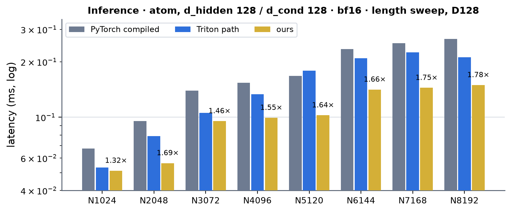
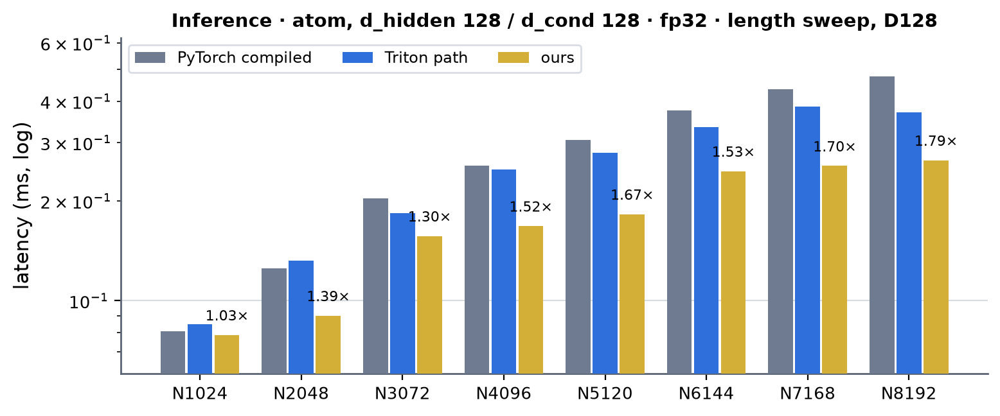
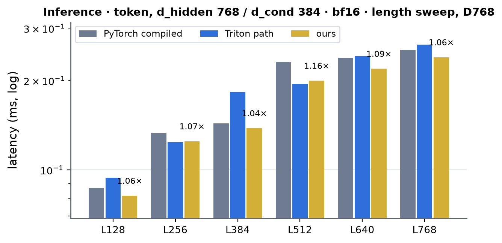
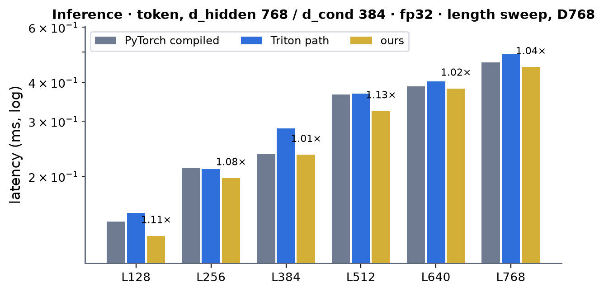
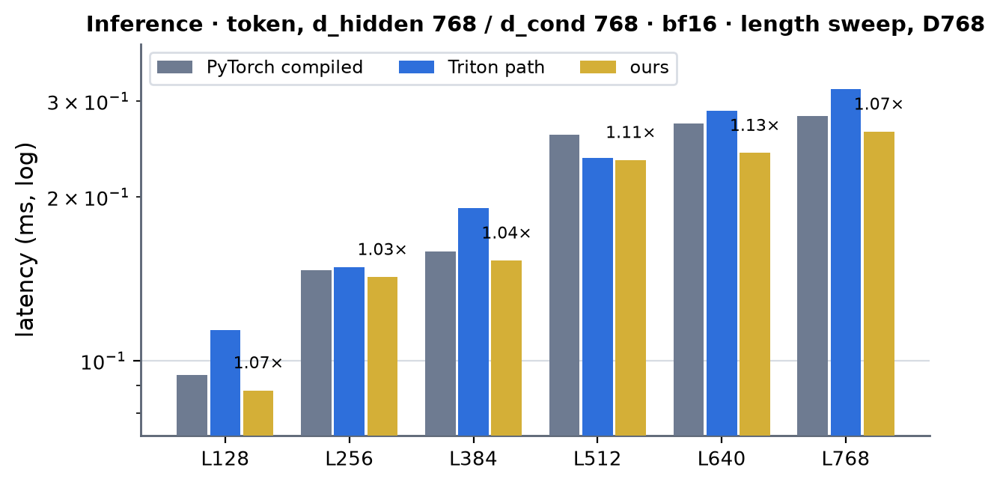
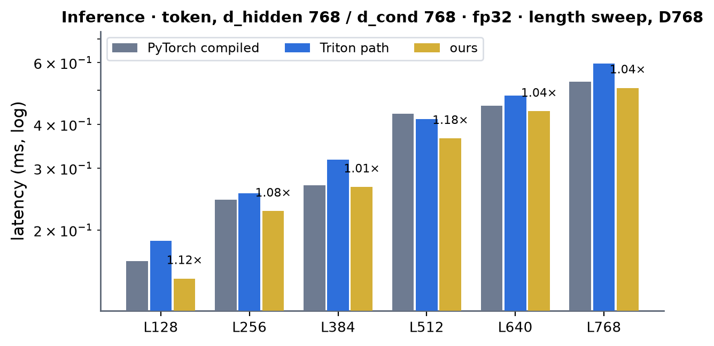
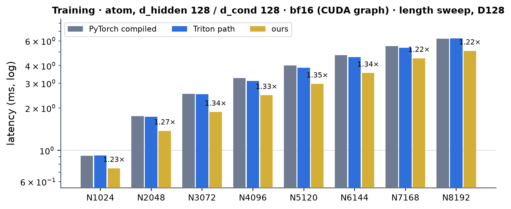
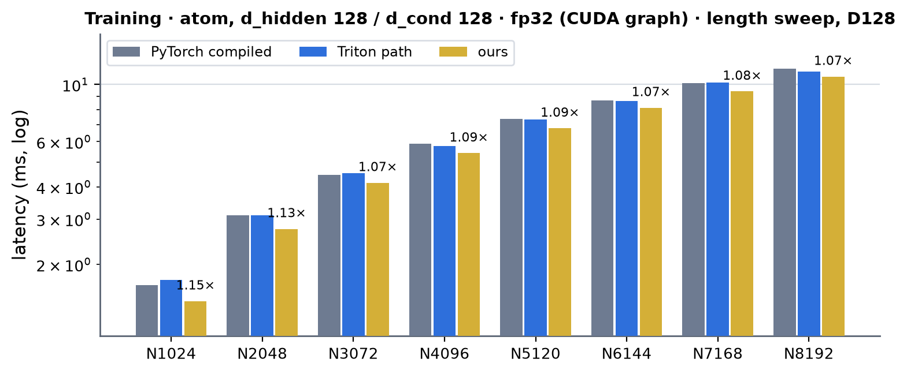
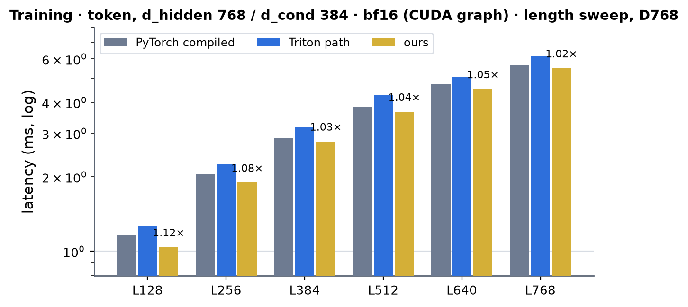
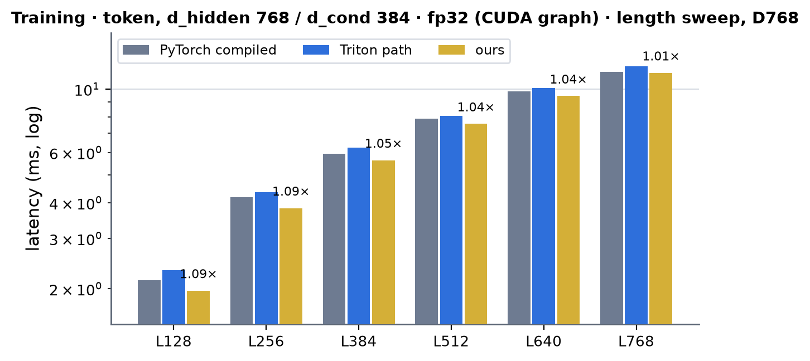

# ConditionedTransition on A100 (sm80)

Kernel-level status of ConditionedTransition (AF3 Algorithm 25, the feed-forward of the DiT blocks: AdaLN of `x` with the conditioning -> `expand_a` | `expand_b` (n = 2: hidden 2 d) -> SwiGLU `silu(a) b` -> `squeeze` ->
sigmoid gate `sigmoid(cond W_g^T + b_g)` -> residual, `y = x + gate * squeeze(swiglu(AdaLN(x, cond)))`; `delta` is the update without the residual) on A100; the module-level summary is in [../a100.md](../a100.md), the AdaLN it embeds is in
[../adaptive_layernorm/adaptive_layernorm.md](../adaptive_layernorm/adaptive_layernorm.md). Columns are (Length, Dimension) from the shape registry (`conditioned_transition`): the atom stream (d_hidden 128, d_cond 128, N = 1024 k atoms) and the
token stream (d_hidden 768 with d_cond 384 or 768, L = 128 k), bf16 and fp32 (TF32 tensor cores), inference and training, a conditioning per sample and one shared by the samples.

Summary (2026-10-04). Before this work the A100 ran the module's Triton tail (`kernels/conditioned_transition/triton`: expand + SwiGLU, the back-to-back and squeeze + gate kernels, their backward twins) behind the AdaLN module's Triton kernels; the caches of
`cond_transition_squeeze_gate_triton` (bf16) and `adaln_fwd_triton` were stale on this toolchain (heuristic grids). Everything is hand CUDA or cuBLAS now, from `ConditionedTransition.forward` / `delta` through
`integrations/conditioned_transition_sm80.py`: **a composition** (the AdaLN row kernels, one cuBLAS GEMM per projection and CUDA row kernels for the SwiGLU and the gate; any width, bf16 and fp32) and, for the atom width, **fused tensor-core
kernels**: in bf16 the AdaLN forward in one kernel and the whole tail (expand, SwiGLU, squeeze, gate, residual) in a second, so the `[M, 512]` pre-activation and the hidden `h` never leave the registers (inference is two launches, 1 KB a row; training adds a backward of two tail kernels, the AdaLN backward kernel and cuBLAS weight gradients), in fp32 (TF32 tensor cores, inference) the AdaLN and the tail in three kernels. Against PyTorch compiled
(`bench.py`, CUDA graph, A100 80GB PCIe; no cuEquivariance and no Anthropic arm exists for this module, so the x column is against PyTorch compiled and never against the Triton path): **bf16** inference 1.32-1.78x at the atom width and 1.03-1.16x at the token widths, training 1.22-1.35x (atom) and 1.02-1.15x (token);
**fp32** inference 1.03-1.79x (atom: the fused TF32 kernels) and 1.01-1.18x (token), training 1.07-1.15x (atom) and 1.01-1.09x (token). The Triton path this replaces is slower than ours at every registry row except two bf16 token inference rows (768 / 384, L = 256 and 512: ours 0.8 % and 2.6 % slower, inside the 5 % rule) and a tie (bf16 atom inference, N = 1024).
The token stream is GEMM-bound -- the twelve cuBLAS products are 72 % of our training step and run at 239 TFLOP/s on average (the card's ceiling) -- so there the path is on par with PyTorch compiled (1.02-1.15x) and ahead of the Triton path. Accuracy matches the bf16
PyTorch module (the output and every gradient within 0.8-0.91x of its error against the fp32 module), fp32 within TF32 accuracy (3.3e-4 relative, as the Triton path's). Speed of light (composite floor of the decomposition): token steps at 90-91 %, the bf16 atom training step at 62 %, small-M inference at 25-72 % (see Speed of light).

On A100 the module runs **hand-written CUDA and cuBLAS only** when the call matches the contract below; everything else keeps the module path. **Served**: kernel backend TRITON or CUEQUIVARIANCE (not PYTORCH) with
`settings.engine_backend != "triton"`, an A100 (capability exactly 8.0), CUDA tensors, compute dtype bf16 or fp32 (the autocast dtype, else the dtype of the weights; fp32 products run on TF32 tensor cores whatever the caller's `allow_tf32`),
`d_hidden` and `d_cond` each 128, 384 or 768, any expansion n (the fused atom tail serves n = 2), no biases on `expand_a`, `expand_b`, `squeeze`, the gate with a bias, the AF3 AdaLN parameter set, and a conditioning per row of `x` or -- without gradient
-- one shared by the samples (the AdaLN table and the gate logits then have the `L` rows of one sample; training expands it and autograd sums the gradient back). Any L and any number of samples. `MINIWORLD_CONDTRANS_SM80=0` turns this path off (the module's
Triton tail runs, behind the AdaLN module's own path: `MINIWORLD_ADALN_SM80=0` too for the all-Triton path of the "Triton path" columns); `MINIWORLD_CONDTRANS_ATOM=0` keeps the composition at the atom width, `MINIWORLD_CONDTRANS_ATOM_TF32=0` at fp32; `MINIWORLD_ADALN_BRANCH=0` runs the composition's second-stream GEMMs (the gate GEMM, the weight gradients) on the current stream; a failed extension build warns once and keeps the
module path. Under `torch.compile(fullgraph=True)` the build runs once at trace time and the ops are nodes of the graph, bit-identical to eager.

- **Where the code is**: `kernels/conditioned_transition/cuda/sm80.py` over `kernels/conditioned_transition/cuda/sm80/` (`ct_rows.cuh`: SwiGLU and gate row kernels; `ct_atom_fwd.cuh`: the fused tail; `ct_atom_bwd.cuh`: its two backward kernels; `ct_atom_fwd_tf32.cuh`: the fp32 (TF32) tail and gate kernels; `ops.cu`), the AdaLN kernels of
  [`kernels/adaln/cuda/sm80/`](../adaptive_layernorm/adaptive_layernorm.md) (one source tree, two extensions: `conditioned_transition_sm80` includes the AdaLN headers), the glue in `integrations/conditioned_transition_sm80.py` (gate `serves`, the opaque ops
  `conditioned_transition_sm80_inference` / `_train_fwd` / `_train_bwd`, the autograd Function) and the hooks in `modules/conditioned_transition/module.py` (`forward` and `delta`).
- **Inference** (one opaque op). Composition: `cond_ln` -> cuBLAS `[S | B]` -> `adaln_epi` (= xa) -> cuBLAS `[a | b] = xa [Wa; Wb]^T` -> `swiglu_fwd` -> cuBLAS `z = h Ws^T` -> cuBLAS `g = cond Wg^T + bg` (bias in the GEMM's epilogue) -> `gate_res_fwd`
  (`y = x + sigmoid(g) z`). Atom width: `adaln_atom_fwd` -> `ct_atom_fwd_kernel` (bf16), or `adaln_atom_fwd_tf32` -> `ct_tail_tf32_kernel` -> `ct_gate_tf32_kernel` (fp32, TF32 tensor cores: three launches, 4.5 KB a row of HBM traffic where the composition moves 14.5).
- **Training** (an autograd Function; forward and backward are each one opaque op). The forward saves what the backward reads (the composition: aff, [S | B], xa, [a | b], z, g and the packed weights; the fused atom path: xa, rn(z) and the statistics
  only, the rest is recomputed). Composition backward: `gate_res_bwd` (dz, dg, the gate bias's partial sums) -> cuBLAS `dh = dz Ws` -> `swiglu_bwd` (da | db, and h again for the squeeze's weight gradient) -> cuBLAS `dxa = dab [Wa; Wb]`, the weight
  gradients `dWs = dz^T h`, `dWab = dab^T xa`, `dWg = dg^T cond` and `dcond2 = dg Wg` -> the AdaLN backward (`adaln_bwd_x` with the residual gradient `dy` as `dres`, cuBLAS, `cond_ln_bwd` with `dcond2` as `dextra`) -> `finish`. Fused atom backward:
  `ct_atom_bwd_gate_kernel` (the gate, the FFN backward through the recomputed pre-activation) -> `ct_atom_bwd_dxa_kernel` -> five cuBLAS weight-gradient GEMMs -> `adaln_atom_bwd_kernel` (+ `dres`, `dextra`) -> two more -> `finish`.
- **Numerics.** As the AdaLN: fp32 statistics / sums / accumulators, bf16 operands, a single rounding where a stage is fused. The fused tail rounds only where the framework's GEMM operands are rounded (xa, h, z); `[a | b]` and the gate logits stay in fp32
  accumulators (the composition rounds them to bf16 as the cuBLAS outputs). Column sums: fixed-order sums of per-block partial rows (no atomics), so a training step is bit-reproducible. fp32 runs the same code with fp32 rows and TF32 GEMMs (cuBLAS), or, at the atom width in inference, the fused TF32 kernels (operands rounded to nearest TF32, fp32 accumulation: the error against the fp32 module is the composition's and the Triton path's, 3.3e-4 relative).
- **Tests**: `tests/integrations/test_a100_conditioned_transition_gpu.py` (135 tests, one file per process): inference (`forward` and `delta`, a conditioning per sample and shared, bf16 L = 50 / 128 / 200 / 384 at the three registry widths, fp32), training
  (the output and every gradient: x, cond, the norm weight, the two AdaLN projections and bias, `expand_a`, `expand_b`, `squeeze`, the gate weight and bias) each against the fp32 module and held to the bf16 PyTorch module's error (fp32: to TF32 accuracy),
  expansion 4 (the composition) and the gate conditions, the env switches, `torch.compile(fullgraph=True)` equal to eager, CUDA-graph capture and replay, bit-reproducible training, **no Triton kernel launched on the default path**, a forward + backward step captured in a CUDA graph (the second-stream branches fork and join inside the capture) replaying bit-identically to eager, `MINIWORLD_ADALN_BRANCH=0` giving the same bits, and the packed weights (also the TF32 packs and the casts of fp32 master weights under autocast) following an in-place update.
- 성능 확인 is the maintainer's column (✗ = not confirmed). cache build ✓: nothing on these paths autotunes (fixed launch shapes and cuBLAS); the stale caches of the Triton path (`cond_transition_squeeze_gate_triton`, `adaln_fwd_triton`) are not used at the registry shapes any more.

## ConditionedTransition · registry shapes

Three paths cover the registry; every shape of every path runs CUDA (hand kernels and cuBLAS) by default.

### Inference

#### Composition · token stream, bf16 and fp32 · AdaLN kernels, cuBLAS, `swiglu_fwd_kernel`, `gate_res_fwd_kernel` (d_cond 384 and 768)

| (Length, Dimension, dtype) | (128, 768, bf16) | (256, 768, bf16) | (384, 768, bf16) | (512, 768, bf16) | (640, 768, bf16) | (768, 768, bf16) | (128, 768, fp32) | (256, 768, fp32) | (384, 768, fp32) | (512, 768, fp32) | (640, 768, fp32) | (768, 768, fp32) |
|---|---|---|---|---|---|---|---|---|---|---|---|---|
| implementation | CUDA | CUDA | CUDA | CUDA | CUDA | CUDA | CUDA | CUDA | CUDA | CUDA | CUDA | CUDA |
| 성능 확인 | ✗ | ✗ | ✗ | ✗ | ✗ | ✗ | ✗ | ✗ | ✗ | ✗ | ✗ | ✗ |
| cache build | ✓ | ✓ | ✓ | ✓ | ✓ | ✓ | ✓ | ✓ | ✓ | ✓ | ✓ | ✓ |

#### Fused · atom width, fp32 (TF32) · `adaln_atom_fwd_tf32_kernel` -> `ct_tail_tf32_kernel` -> `ct_gate_tf32_kernel` (three launches)

| (Length, Dimension, dtype) | (1024, 128, fp32) | (2048, 128, fp32) | (3072, 128, fp32) | (4096, 128, fp32) | (5120, 128, fp32) | (6144, 128, fp32) | (7168, 128, fp32) | (8192, 128, fp32) |
|---|---|---|---|---|---|---|---|---|
| implementation | CUDA | CUDA | CUDA | CUDA | CUDA | CUDA | CUDA | CUDA |
| 성능 확인 | ✗ | ✗ | ✗ | ✗ | ✗ | ✗ | ✗ | ✗ |
| cache build | ✓ | ✓ | ✓ | ✓ | ✓ | ✓ | ✓ | ✓ |

#### Fused · atom width, bf16 · `adaln_atom_fwd_kernel` -> `ct_atom_fwd_kernel` (two launches)

| (Length, Dimension, dtype) | (1024, 128, bf16) | (2048, 128, bf16) | (3072, 128, bf16) | (4096, 128, bf16) | (5120, 128, bf16) | (6144, 128, bf16) | (7168, 128, bf16) | (8192, 128, bf16) |
|---|---|---|---|---|---|---|---|---|
| implementation | CUDA | CUDA | CUDA | CUDA | CUDA | CUDA | CUDA | CUDA |
| 성능 확인 | ✗ | ✗ | ✗ | ✗ | ✗ | ✗ | ✗ | ✗ |
| cache build | ✓ | ✓ | ✓ | ✓ | ✓ | ✓ | ✓ | ✓ |

### Training

#### Composition · token stream, bf16 and fp32 · forward as inference (saving the intermediates); backward `gate_res_bwd_kernel`, `swiglu_bwd_kernel`, the AdaLN backward kernels, cuBLAS, `finish_kernel`

| (Length, Dimension, dtype) | (128, 768, bf16) | (256, 768, bf16) | (384, 768, bf16) | (512, 768, bf16) | (640, 768, bf16) | (768, 768, bf16) | (128, 768, fp32) | (256, 768, fp32) | (384, 768, fp32) | (512, 768, fp32) | (640, 768, fp32) | (768, 768, fp32) |
|---|---|---|---|---|---|---|---|---|---|---|---|---|
| implementation | CUDA | CUDA | CUDA | CUDA | CUDA | CUDA | CUDA | CUDA | CUDA | CUDA | CUDA | CUDA |
| 성능 확인 | ✗ | ✗ | ✗ | ✗ | ✗ | ✗ | ✗ | ✗ | ✗ | ✗ | ✗ | ✗ |
| cache build | ✓ | ✓ | ✓ | ✓ | ✓ | ✓ | ✓ | ✓ | ✓ | ✓ | ✓ | ✓ |

#### Composition · atom width, fp32 · the same launches at d = 128

| (Length, Dimension, dtype) | (1024, 128, fp32) | (2048, 128, fp32) | (3072, 128, fp32) | (4096, 128, fp32) | (5120, 128, fp32) | (6144, 128, fp32) | (7168, 128, fp32) | (8192, 128, fp32) |
|---|---|---|---|---|---|---|---|---|
| implementation | CUDA | CUDA | CUDA | CUDA | CUDA | CUDA | CUDA | CUDA |
| 성능 확인 | ✗ | ✗ | ✗ | ✗ | ✗ | ✗ | ✗ | ✗ |
| cache build | ✓ | ✓ | ✓ | ✓ | ✓ | ✓ | ✓ | ✓ |

#### Fused · atom width, bf16 · forward `adaln_atom_fwd_kernel` + `ct_atom_fwd_kernel` (rn(z) and the statistics saved); backward `ct_atom_bwd_gate_kernel` -> `ct_atom_bwd_dxa_kernel` -> five cuBLAS GEMMs -> `adaln_atom_bwd_kernel` -> two cuBLAS GEMMs -> `finish_kernel`

| (Length, Dimension, dtype) | (1024, 128, bf16) | (2048, 128, bf16) | (3072, 128, bf16) | (4096, 128, bf16) | (5120, 128, bf16) | (6144, 128, bf16) | (7168, 128, bf16) | (8192, 128, bf16) |
|---|---|---|---|---|---|---|---|---|
| implementation | CUDA | CUDA | CUDA | CUDA | CUDA | CUDA | CUDA | CUDA |
| 성능 확인 | ✗ | ✗ | ✗ | ✗ | ✗ | ✗ | ✗ | ✗ |
| cache build | ✓ | ✓ | ✓ | ✓ | ✓ | ✓ | ✓ | ✓ |

## Kernels

The AdaLN kernels (`cond_ln`, `adaln_epi`, `adaln_bwd_x`, `cond_ln_bwd`, `finish`, `adaln_atom_fwd`, `adaln_atom_bwd`) are described in [../adaptive_layernorm/adaptive_layernorm.md](../adaptive_layernorm/adaptive_layernorm.md); here they run with the residual gradient
(`dres` = dy of the block, added to dx) and the gate's data gradient (`dextra` = dcond2, added to dcond) fused into their backward passes.

### K1 · `swiglu_fwd_kernel` / `swiglu_bwd_kernel` (`ct_rows.cuh`)

Flat elementwise passes (a thread owns 4 consecutive columns, a persistent grid-stride loop). Forward: `h = silu(a) b` from `[a | b]` (the expand GEMM's output) in the operand dtype. Backward: from dh = dz Ws (GEMM) and `[a | b]`:
`da = dh b s (1 + a (1 - s))`, `db = dh a s` (`s = sigmoid(a)`) written as the operand `dab = [da | db]` of the data-gradient and weight-gradient GEMMs, and `h` recomputed for the squeeze's weight gradient (saving it in the forward would be one more
`[M, 2 d]` store; the recompute is free inside the pass). Both run at 90-98 % of their byte floors (the token training step: 170 MB in 109 us, 340 MB in 237 us; 217 us in a quieter run): memory-bound, a fusion into the GEMM epilogues would be the only way to
remove them (see "what was tried").

### K2 · `gate_res_fwd_kernel` / `gate_res_bwd_kernel` (`ct_rows.cuh`)

Forward: `y = x + sigmoid(g[r % P]) z` (x absent for `delta`). Backward: `dz = sigmoid(g) dy`, `dg = dy z s (1 - s)` (both in the operand dtype: the operands of the next GEMMs), and the column sums of `dg` (the gate bias's gradient) as per-block
partial rows for `finish`. 97-102 % of the byte floor (73 us for 113 MB and 87 us for 142 MB at the token training step).

### K3 · `ct_atom_fwd_kernel` (the tail in one kernel at d = d_cond = 128, expansion 2, bf16; `ct_atom_fwd.cuh`)

`[a | b] = xa [Wa; Wb]^T` (fp32 accumulation), `h = rn(silu(a) b)` on the accumulators, `z = h Ws^T` (fp32, not rounded; the training forward also stores `rn(z)`), `g = cond Wg^T + bg` (a fourth product on the raw
conditioning), `y = rn(x + sigmoid(g) z)`. A warp owns 16 consecutive rows from the first load to the last store; the thread's 32 channels of a row are four 16-byte vectors that are its A fragments and -- through the f1 weight-row order, see
the AdaLN page -- its accumulators, so the `[M, 512]` pre-activation and `h` never leave the registers (the accumulators of one product are the A fragments of the next: no shuffle, no shared-memory round trip). One CTA of 8 warps per SM; the
gate weight (32 KB) stays in shared memory, the FFN weights stream through a two-stage ring of 64-hidden-unit chunks (Wa | Wb | Ws rows, 48 KB a stage, prefetched with `cp.async` under the previous chunk's products and shared by the 8 warps).
It is the FFN half of the SWA atom DiT's `ffn_fwd_kernel` with this block's prologue and epilogue. 255 registers, no spills. 379 us at 147456 rows with `rn(z)` saved (the tensor floor is 141 us: 37 %; ncu: the tensor pipe is 30 % active, the stalls fixed-latency waits and the `ldmatrix` -> `mma` -> SwiGLU -> `mma` dependencies of a chunk with two warps a scheduler), 65 us at 15360 rows (23 %: two rounds of 8 warps on 108 SMs).

### K4 · `ct_atom_bwd_gate_kernel` (gate, FFN backward; `ct_atom_bwd.cuh`)

With dy: `g` recomputed, `dz = rn(g dy)` (the squeeze's weight-gradient operand and the A operand of `dh`), `dg = rn(dy z g (1 - g))` (the gate weight's operand; its column sums are d bg), `dcond2 = dg Wg` (a fourth product: the gate's share of d cond, which the AdaLN
backward adds), then per chunk of 32 hidden units `a`, `b` recomputed from `xa` (fp32, the forward's bits), `dh = dz Ws`, `h = rn(a s b)` (stored for dWs), `da = rn(dh b s (1 + a (1 - s)))`, `db = rn(dh a s)` stored as `dab`. Weights Wg and Wg^T resident
(64 KB), Wa | Wb | Ws^T through a three-stage ring (72 KB). 3 KB of HBM traffic a row (dy, z, cond, xa in; dz, dg, dcond2, h, dab out): 3.3 KB a row in all (the h and dab it writes are 1.5 KB of it): 453 us at 147456 rows are 68 % of the 307 us byte floor.

### K5 · `ct_atom_bwd_dxa_kernel` (`dxa = rn(dab [Wa; Wb])`)

One product with `[Wa; Wb]^T` resident (128 KB): the gradient of the AdaLN's output, which `adaln_atom_bwd_kernel` takes as its dy. 198 us at 147456 rows: 60 % of the 118 us byte floor (dab in, dxa out: 1.25 KB a row).

### K6 · `ct_tail_tf32_kernel` (expand, SwiGLU, squeeze at d = 128, fp32 rows on TF32 tensor cores; `ct_atom_fwd_tf32.cuh`)

The fp32 twin of K3 for inference, in two kernels because fp32 rows double every register the bf16 kernel keeps (the gate's cond rows and the residual rows do not fit next to the A fragments and the accumulators): `[a | b] = xa [Wa; Wb]^T`, `h = silu(a) b` on the
accumulators (rounded to TF32 as the operand of the squeeze), `z = h Ws^T`, `z` stored in fp32. Layouts as the AdaLN's TF32 kernel (K8 of that page): the expand's accumulators are the squeeze's A fragments with no shuffle -- for k step (s, p) of a chunk
of 32 hidden units the fragment is a0 = h(g8; n tile 2 s; c_p), a1 = h(g8 + 8; ...; c_{2 + p}), a2 / a3 the same of n tile 2 s + 1, i.e. "k = q4" is hidden unit 8 (2 s) + 2 q4 + p and "k = q4 + 4" is unit 8 (2 s + 1) + 2 q4 + p -- and the squeeze weight is packed on the host
(TF32-rounded; rows in the f1 order, the 32 hidden units of a chunk as [q4][idx] so that the 8 units a lane's B fragments need are contiguous: two `LDS.128`). The weights stream through a three-stage `cp.async` ring of 32-hidden-unit chunks (Wa | Wb | Ws rows, 48 KB a stage, prefetched two
chunks ahead, one barrier a chunk), the packs are cached per parameter version, the accumulation loops interleave the 8 expand accumulators and the 4 tiles of an output group (K8), 216 registers, no spills. One CTA of 8 warps per SM. 78 us at 15360 rows (34 % of the 26 us floor); the first version (two expand accumulators interleaved, the squeeze's four MMAs back to back on one accumulator) took 165 us at 40960 rows with the tensor pipe 33 % active, the stalls being fixed-latency waits;
the interleaved loops (and the fast sigmoid) brought the three-kernel step to 1.23-1.33x of it.

### K7 · `ct_gate_tf32_kernel` (gate + residual, fp32 rows on TF32 tensor cores)

`g = cond Wg^T + bg` (a fourth product on the raw conditioning, row r reads cond row r % P), `y = x + sigmoid(g) z` (x absent for `delta`): the AdaLN-kernel structure with the gate weight (fp32, 64 KB) resident, 218 registers, no spills: 29.5 us at 15360 rows (67 % of its 19.7 us byte floor).

## Measurements (2026-10-04)

`bench.py target=conditioned_transition` (module level, bf16 = the default `bf16-mixed` autocast with fp32 master parameters, fp32 = `precision=32`; a conditioning per sample; inference A = 5 samples, training A = 48; CUDA-graph timing, `cudagraph=manual`), A100 80GB PCIe, torch 2.13.0+cu129,
one frozen snapshot of the work tree (`snap_1004_021842`) and one node per dtype: the PyTorch and ours arms in one process, the Triton arm (`implementations=[triton]` with `MINIWORLD_ADALN_SM80=0 MINIWORLD_CONDTRANS_SM80=0`) in the next process of the same job, so the three columns of a row share a node
(jobs 63189 (bf16) and 63170 (fp32)). Milliseconds, medians of the bench's repeats; × = PyTorch compiled's time / ours -- this module has no cuEquivariance and no Anthropic arm (those columns are empty / `— (not measured)`), and the Triton path is a reference column, never the denominator.
The graph replay of a bench row carries ~10 us of launch latency that a profiled replay does not (a fixed cost of every row: it compresses the ratios of the 20-60 us rows), and the same kernel differs by ~10 % between nodes, so differences of a few percent between two columns are noise. Training is the fresh-gradient step of the bench
(`grad = None` before each step, forward + backward, parameter gradients included). `ours` is the default dispatch: the fused atom kernels at d = dc = 128 (bf16: inference and training; fp32: inference), the cuBLAS + CUDA-row composition elsewhere.

The (1024, 128) row of the bf16 atom inference table has `ours` re-measured on `snap_1004_085508` (job 63284, 0.0512; the main snapshot had 0.0532): the AdaLN stage inside it takes the same configuration change (the AdaLN page); PyTorch and Triton columns are the main snapshot's.

### Inference · atom, d_hidden 128 / d_cond 128 · bf16

| (Length, Dimension) | PyTorch compiled | cuEquivariance | Anthropic | Triton path | ours | × |
|---|---|---|---|---|---|---|
| (1024, 128) | 0.0676 | — | — (not measured) | 0.0532 | 0.0512 | 1.32 |
| (2048, 128) | 0.0952 | — | — (not measured) | 0.0788 | 0.0563 | 1.69 |
| (3072, 128) | 0.1393 | — | — (not measured) | 0.1055 | 0.0952 | 1.46 |
| (4096, 128) | 0.1536 | — | — (not measured) | 0.1331 | 0.0993 | 1.55 |
| (5120, 128) | 0.1679 | — | — (not measured) | 0.1792 | 0.1024 | 1.64 |
| (6144, 128) | 0.2345 | — | — (not measured) | 0.2089 | 0.1413 | 1.66 |
| (7168, 128) | 0.2529 | — | — (not measured) | 0.2253 | 0.1444 | 1.75 |
| (8192, 128) | 0.2662 | — | — (not measured) | 0.2120 | 0.1495 | 1.78 |

 <!-- measure_bars -->

### Inference · atom, d_hidden 128 / d_cond 128 · fp32

| (Length, Dimension) | PyTorch compiled | cuEquivariance | Anthropic | Triton path | ours | × |
|---|---|---|---|---|---|---|
| (1024, 128) | 0.0809 | — | — (not measured) | 0.0850 | 0.0788 | 1.03 |
| (2048, 128) | 0.1249 | — | — (not measured) | 0.1321 | 0.0901 | 1.39 |
| (3072, 128) | 0.2038 | — | — (not measured) | 0.1833 | 0.1567 | 1.30 |
| (4096, 128) | 0.2550 | — | — (not measured) | 0.2488 | 0.1679 | 1.52 |
| (5120, 128) | 0.3052 | — | — (not measured) | 0.2796 | 0.1823 | 1.67 |
| (6144, 128) | 0.3758 | — | — (not measured) | 0.3338 | 0.2458 | 1.53 |
| (7168, 128) | 0.4342 | — | — (not measured) | 0.3850 | 0.2550 | 1.70 |
| (8192, 128) | 0.4751 | — | — (not measured) | 0.3697 | 0.2652 | 1.79 |

 <!-- measure_bars -->

### Inference · token, d_hidden 768 / d_cond 384 · bf16

| (Length, Dimension) | PyTorch compiled | cuEquivariance | Anthropic | Triton path | ours | × |
|---|---|---|---|---|---|---|
| (128, 768) | 0.0870 | — | — (not measured) | 0.0942 | 0.0819 | 1.06 |
| (256, 768) | 0.1331 | — | — (not measured) | 0.1239 | 0.1249 | 1.07 |
| (384, 768) | 0.1434 | — | — (not measured) | 0.1833 | 0.1382 | 1.04 |
| (512, 768) | 0.2314 | — | — (not measured) | 0.1946 | 0.1997 | 1.16 |
| (640, 768) | 0.2386 | — | — (not measured) | 0.2417 | 0.2191 | 1.09 |
| (768, 768) | 0.2540 | — | — (not measured) | 0.2642 | 0.2396 | 1.06 |

 <!-- measure_bars -->

### Inference · token, d_hidden 768 / d_cond 384 · fp32

| (Length, Dimension) | PyTorch compiled | cuEquivariance | Anthropic | Triton path | ours | × |
|---|---|---|---|---|---|---|
| (128, 768) | 0.1434 | — | — (not measured) | 0.1526 | 0.1290 | 1.11 |
| (256, 768) | 0.2130 | — | — (not measured) | 0.2109 | 0.1976 | 1.08 |
| (384, 768) | 0.2365 | — | — (not measured) | 0.2847 | 0.2345 | 1.01 |
| (512, 768) | 0.3656 | — | — (not measured) | 0.3676 | 0.3236 | 1.13 |
| (640, 768) | 0.3881 | — | — (not measured) | 0.4024 | 0.3820 | 1.02 |
| (768, 768) | 0.4639 | — | — (not measured) | 0.4936 | 0.4475 | 1.04 |

 <!-- measure_bars -->

### Inference · token, d_hidden 768 / d_cond 768 · bf16

| (Length, Dimension) | PyTorch compiled | cuEquivariance | Anthropic | Triton path | ours | × |
|---|---|---|---|---|---|---|
| (128, 768) | 0.0942 | — | — (not measured) | 0.1137 | 0.0881 | 1.07 |
| (256, 768) | 0.1464 | — | — (not measured) | 0.1485 | 0.1423 | 1.03 |
| (384, 768) | 0.1587 | — | — (not measured) | 0.1905 | 0.1526 | 1.04 |
| (512, 768) | 0.2601 | — | — (not measured) | 0.2355 | 0.2335 | 1.11 |
| (640, 768) | 0.2724 | — | — (not measured) | 0.2877 | 0.2406 | 1.13 |
| (768, 768) | 0.2816 | — | — (not measured) | 0.3154 | 0.2632 | 1.07 |

 <!-- measure_bars -->

### Inference · token, d_hidden 768 / d_cond 768 · fp32

| (Length, Dimension) | PyTorch compiled | cuEquivariance | Anthropic | Triton path | ours | × |
|---|---|---|---|---|---|---|
| (128, 768) | 0.1628 | — | — (not measured) | 0.1864 | 0.1454 | 1.12 |
| (256, 768) | 0.2437 | — | — (not measured) | 0.2540 | 0.2263 | 1.08 |
| (384, 768) | 0.2683 | — | — (not measured) | 0.3174 | 0.2652 | 1.01 |
| (512, 768) | 0.4291 | — | — (not measured) | 0.4137 | 0.3645 | 1.18 |
| (640, 768) | 0.4516 | — | — (not measured) | 0.4823 | 0.4357 | 1.04 |
| (768, 768) | 0.5284 | — | — (not measured) | 0.5960 | 0.5079 | 1.04 |

 <!-- measure_bars -->

### Training · atom, d_hidden 128 / d_cond 128 · bf16 (CUDA graph)

| (Length, Dimension) | PyTorch compiled | cuEquivariance | Anthropic | Triton path | ours | × |
|---|---|---|---|---|---|---|
| (1024, 128) | 0.9149 | — | — (not measured) | 0.9185 | 0.7465 | 1.23 |
| (2048, 128) | 1.7541 | — | — (not measured) | 1.7336 | 1.3763 | 1.27 |
| (3072, 128) | 2.5160 | — | — (not measured) | 2.5068 | 1.8719 | 1.34 |
| (4096, 128) | 3.2635 | — | — (not measured) | 3.1176 | 2.4627 | 1.33 |
| (5120, 128) | 4.0182 | — | — (not measured) | 3.8625 | 2.9676 | 1.35 |
| (6144, 128) | 4.7421 | — | — (not measured) | 4.6019 | 3.5430 | 1.34 |
| (7168, 128) | 5.4917 | — | — (not measured) | 5.3484 | 4.5138 | 1.22 |
| (8192, 128) | 6.2280 | — | — (not measured) | 6.2454 | 5.0903 | 1.22 |

 <!-- measure_bars -->

### Training · atom, d_hidden 128 / d_cond 128 · fp32 (CUDA graph)

| (Length, Dimension) | PyTorch compiled | cuEquivariance | Anthropic | Triton path | ours | × |
|---|---|---|---|---|---|---|
| (1024, 128) | 1.6579 | — | — (not measured) | 1.7449 | 1.4397 | 1.15 |
| (2048, 128) | 3.0991 | — | — (not measured) | 3.1119 | 2.7484 | 1.13 |
| (3072, 128) | 4.4544 | — | — (not measured) | 4.5353 | 4.1513 | 1.07 |
| (4096, 128) | 5.9039 | — | — (not measured) | 5.7713 | 5.4088 | 1.09 |
| (5120, 128) | 7.3431 | — | — (not measured) | 7.3226 | 6.7569 | 1.09 |
| (6144, 128) | 8.6630 | — | — (not measured) | 8.6426 | 8.1213 | 1.07 |
| (7168, 128) | 10.1448 | — | — (not measured) | 10.1847 | 9.4013 | 1.08 |
| (8192, 128) | 11.5261 | — | — (not measured) | 11.2579 | 10.7387 | 1.07 |

 <!-- measure_bars -->

### Training · token, d_hidden 768 / d_cond 384 · bf16 (CUDA graph)

| (Length, Dimension) | PyTorch compiled | cuEquivariance | Anthropic | Triton path | ours | × |
|---|---|---|---|---|---|---|
| (128, 768) | 1.1663 | — | — (not measured) | 1.2616 | 1.0388 | 1.12 |
| (256, 768) | 2.0552 | — | — (not measured) | 2.2538 | 1.8964 | 1.08 |
| (384, 768) | 2.8754 | — | — (not measured) | 3.1744 | 2.7812 | 1.03 |
| (512, 768) | 3.8328 | — | — (not measured) | 4.3039 | 3.6680 | 1.04 |
| (640, 768) | 4.7483 | — | — (not measured) | 5.0586 | 4.5302 | 1.05 |
| (768, 768) | 5.6340 | — | — (not measured) | 6.1404 | 5.5009 | 1.02 |

 <!-- measure_bars -->

### Training · token, d_hidden 768 / d_cond 384 · fp32 (CUDA graph)

| (Length, Dimension) | PyTorch compiled | cuEquivariance | Anthropic | Triton path | ours | × |
|---|---|---|---|---|---|---|
| (128, 768) | 2.1432 | — | — (not measured) | 2.3229 | 1.9671 | 1.09 |
| (256, 768) | 4.1769 | — | — (not measured) | 4.3428 | 3.8282 | 1.09 |
| (384, 768) | 5.9238 | — | — (not measured) | 6.2305 | 5.6320 | 1.05 |
| (512, 768) | 7.8643 | — | — (not measured) | 8.0389 | 7.5520 | 1.04 |
| (640, 768) | 9.8171 | — | — (not measured) | 10.0726 | 9.4520 | 1.04 |
| (768, 768) | 11.4867 | — | — (not measured) | 12.0161 | 11.3900 | 1.01 |

 <!-- measure_bars -->

### Training · token, d_hidden 768 / d_cond 768 · bf16 (CUDA graph)

| (Length, Dimension) | PyTorch compiled | cuEquivariance | Anthropic | Triton path | ours | × |
|---|---|---|---|---|---|---|
| (128, 768) | 1.3476 | — | — (not measured) | 1.4551 | 1.1745 | 1.15 |
| (256, 768) | 2.3839 | — | — (not measured) | 2.6030 | 2.1868 | 1.09 |
| (384, 768) | 3.3966 | — | — (not measured) | 3.6239 | 3.2169 | 1.06 |
| (512, 768) | 4.5240 | — | — (not measured) | 4.9188 | 4.2619 | 1.06 |
| (640, 768) | 5.6340 | — | — (not measured) | 5.8568 | 5.3048 | 1.06 |
| (768, 768) | 6.6488 | — | — (not measured) | 7.0897 | 6.3498 | 1.05 |

 <!-- measure_bars -->

### Training · token, d_hidden 768 / d_cond 768 · fp32 (CUDA graph)

| (Length, Dimension) | PyTorch compiled | cuEquivariance | Anthropic | Triton path | ours | × |
|---|---|---|---|---|---|---|
| (128, 768) | 2.4474 | — | — (not measured) | 2.6440 | 2.2374 | 1.09 |
| (256, 768) | 4.7401 | — | — (not measured) | 4.9695 | 4.4206 | 1.07 |
| (384, 768) | 6.8756 | — | — (not measured) | 7.2899 | 6.4993 | 1.06 |
| (512, 768) | 9.1197 | — | — (not measured) | 9.5186 | 8.6774 | 1.05 |
| (640, 768) | 11.3577 | — | — (not measured) | 11.7166 | 10.8319 | 1.05 |
| (768, 768) | 13.2598 | — | — (not measured) | 13.8865 | 12.8174 | 1.03 |

 <!-- measure_bars -->

### Speed of light

SoL = the composite floor of the decomposition: per kernel `max(compulsory HBM bytes / 1.60 TB/s, FLOP / ceiling)`, summed (every tensor a kernel reads or writes counts once; the cuBLAS GEMMs by their bytes and FLOP; ceilings measured on this card with `probes/ceilings.py`: 1.70 TB/s streaming copy, 234-258 TFLOP/s bf16 GEMM at 8192^3 / 4096^3,
114-121 TFLOP/s TF32 -- the floors use the 1.60 TB/s, 240 and 115 TFLOP/s ceilings of the A100 page). "ours" is the sum of the CUDA kernel times of one profiled step (`torch.profiler`, CUPTI, one process, job 63233: no launch gaps), the floor is for the same decomposition; PyTorch compiled's own step at the token shape (same job, `PROF_COMPILE=1`) is 2894 us (the atom shape 2624 us against ours 1908) --
cuBLAS GEMMs and Inductor-generated Triton kernels --, ours 3059 us of summed kernel time: the second stream (`Branch`) overlaps part of ours, so the summed time overstates its wall time (the bench's graph replays of ours and of PyTorch are 2.78 and 2.88 ms).

| shape (rows M) | mode | dtype | ours (us) | floor (us) | % of SoL |
|---|---|---|---|---|---|
| atom, A = 48, N = 3072 (147456) | training | bf16 | 1907.5 | 1182.0 | 62 % |
| atom, A = 5, N = 3072 (15360) | inference | bf16 | 87.0 | 22.1 | 25 % |
| token 768 / 384, A = 48, L = 384 (18432) | training | bf16 | 3058.8 | 2773.1 | 91 % |
| token 768 / 384, A = 5, L = 384 (1920) | inference | bf16 | 137.1 | 98.4 | 72 % |
| atom, A = 48, N = 3072 (147456) | training | fp32 | 5749.2 | 3919.4 | 68 % |
| atom, A = 5, N = 3072 (15360) | inference | fp32 | 148.6 | 60.7 | 41 % |
| token 768 / 384, A = 48, L = 384 (18432) | training | fp32 | 6331.5 | 5705.5 | 90 % |

The token steps are at 90-91 % of the composite floor: the twelve cuBLAS GEMMs run at 93 % (bf16) / 90 % (TF32) of their FLOP / byte floors (239 TFLOP/s on average in the bf16 step: the card's ceiling), the SwiGLU and gate passes at 90-102 % of their byte floors. The bf16 atom step is at 62 % (the fused kernels 60-68 %, `ct_atom_fwd_kernel` 37 % of its tensor floor,
the cuBLAS weight gradients 82 %), the small-M inference at 25 % (22 us of bytes; the tail kernel's 65 us is two rounds of 8 warps on 108 SMs at 23 % of the tensor floor).

### Where the time goes (`torch.profiler` CUPTI kernel times, one process, job 63233; us per call)

**d = 128, d_cond = 128, A = 48, L = 3072 (M = 147456 rows), training, bf16** (profile total 1907.5 us):

| stage | measured (us) | floor (us) | % of floor |
|---|---|---|---|
| adaln_atom_fwd | 106.5 | 72.3 | 68 % |
| ct_atom_fwd | 379.0 | 140.9 | 37 % |
| ct_atom_bwd_gate | 452.8 | 306.7 | 68 % |
| ct_atom_bwd_dxa | 197.6 | 118.0 | 60 % |
| adaln_atom_bwd | 338.2 | 213.8 | 63 % |
| cuBLAS GEMMs (5; 43.5 GFLOP) | 401.7 | 330.3 | 82 % |
| finish_kernel | 7.4 | | |
| torch small kernels (casts, packs) | 24.2 | | |
| **sum** | 1907.5 | 1182.0 | 62 % |

**d = 128, d_cond = 128, A = 5, L = 3072 (M = 15360 rows), inference, bf16** (profile total 87.0 us):

| stage | measured (us) | floor (us) | % of floor |
|---|---|---|---|
| adaln_atom_fwd | 22.1 | 7.4 | 33 % |
| ct_atom_fwd | 64.9 | 14.7 | 23 % |
| finish_kernel | — | | |
| torch small kernels (casts, packs) | 0.0 | | |
| **sum** | 87.0 | 22.1 | 25 % |

**d = 768, d_cond = 384, A = 48, L = 384 (M = 18432 rows), training, bf16** (profile total 3058.8 us):

| stage | measured (us) | floor (us) | % of floor |
|---|---|---|---|
| cond_ln | 18.4 | 17.8 | 97 % |
| adaln_epi | 80.0 | 70.9 | 89 % |
| swiglu_fwd | 108.7 | 106.2 | 98 % |
| gate_res_fwd | 72.8 | 70.8 | 97 % |
| adaln_bwd_x | 139.4 | 124.0 | 89 % |
| cond_ln_bwd | 78.7 | 44.3 | 56 % |
| swiglu_bwd | 237.1 | 212.3 | 90 % |
| gate_res_bwd | 86.7 | 88.5 | 102 % |
| cuBLAS GEMMs (12; 489.2 GFLOP) | 2189.3 | 2038.4 | 93 % |
| finish_kernel | 33.0 | | |
| torch small kernels (casts, packs) | 14.6 | | |
| **sum** | 3058.8 | 2773.1 | 91 % |

**d = 768, d_cond = 384, A = 5, L = 384 (M = 1920 rows), inference, bf16** (profile total 137.1 us):

| stage | measured (us) | floor (us) | % of floor |
|---|---|---|---|
| cond_ln | 3.9 | 1.8 | 47 % |
| adaln_epi | 8.4 | 7.4 | 88 % |
| swiglu_fwd | 10.6 | 11.1 | 104 % |
| gate_res_fwd | 9.2 | 7.4 | 80 % |
| cuBLAS GEMMs (4; 17.0 GFLOP) | 105.0 | 70.8 | 67 % |
| finish_kernel | — | | |
| torch small kernels (casts, packs) | 0.0 | | |
| **sum** | 137.1 | 98.4 | 72 % |

**d = 128, d_cond = 128, A = 48, L = 3072 (M = 147456 rows), training, fp32** (profile total 5749.2 us):

| stage | measured (us) | floor (us) | % of floor |
|---|---|---|---|
| cond_ln | 90.8 | 95.1 | 105 % |
| adaln_epi | 188.5 | 189.5 | 101 % |
| swiglu_fwd | 278.9 | 283.1 | 102 % |
| gate_res_fwd | 188.7 | 188.7 | 100 % |
| adaln_bwd_x | 669.0 | 331.0 | 49 % |
| cond_ln_bwd | 432.0 | 189.5 | 44 % |
| swiglu_bwd | 649.5 | 566.2 | 87 % |
| gate_res_bwd | 241.6 | 235.9 | 98 % |
| cuBLAS GEMMs (12; 130.5 GFLOP) | 2992.1 | 1840.3 | 62 % |
| finish_kernel | 11.2 | | |
| torch small kernels (casts, packs) | 6.9 | | |
| **sum** | 5749.2 | 3919.4 | 68 % |

**d = 128, d_cond = 128, A = 5, L = 3072 (M = 15360 rows), inference, fp32** (profile total 148.6 us):

| stage | measured (us) | floor (us) | % of floor |
|---|---|---|---|
| adaln_atom_fwd_tf32 | 40.8 | 14.7 | 36 % |
| ct_tail_tf32 | 78.3 | 26.3 | 34 % |
| ct_gate_tf32 | 29.5 | 19.7 | 67 % |
| finish_kernel | — | | |
| torch small kernels (casts, packs) | 0.0 | | |
| **sum** | 148.6 | 60.7 | 41 % |

**d = 768, d_cond = 384, A = 48, L = 384 (M = 18432 rows), training, fp32** (profile total 6331.5 us):

| stage | measured (us) | floor (us) | % of floor |
|---|---|---|---|
| cond_ln | 35.4 | 35.5 | 100 % |
| adaln_epi | 140.8 | 141.6 | 101 % |
| swiglu_fwd | 207.4 | 212.3 | 102 % |
| gate_res_fwd | 138.9 | 141.6 | 102 % |
| adaln_bwd_x | 261.7 | 247.8 | 95 % |
| cond_ln_bwd | 105.7 | 70.9 | 67 % |
| swiglu_bwd | 481.0 | 424.7 | 88 % |
| gate_res_bwd | 178.2 | 176.9 | 99 % |
| cuBLAS GEMMs (12; 489.2 GFLOP) | 4719.6 | 4254.1 | 90 % |
| finish_kernel | 37.6 | | |
| torch small kernels (casts, packs) | 25.1 | | |
| **sum** | 6331.5 | 5705.5 | 90 % |

### What was tried and did not pay (2026-10-04)

The AdaLN kernels' history (row kernels, `finish_kernel`, the cuBLAS weight-gradient orientation, the TF32 accumulator interleaving, the cuBLAS wave quantization at M = 2560 .. 3840) is on [the AdaLN page](../adaptive_layernorm/adaptive_layernorm.md); what is specific to this module:

- **A second stream** (`Branch`): the gate GEMM (inference and the training forward: nothing needs it before the last pass) and, in the composition's backward, the weight-gradient GEMMs and the gate's `dcond2` GEMM run beside the chain of row kernels and data-gradient GEMMs (tensor-bound GEMMs next to memory-bound passes; small-M GEMMs leave SMs idle in their last wave).
  Same-process CUDA-graph A/B (branch on against off), token 768 / 384: inference 73.3 against 75.3 us (L = 128), 134.9 / 141.8 (384), 205.2 / 224.3 (512: -8.5 %, which brought the path level with the Triton path's 205.8), 254.4 / 264.0 (768); training A = 48 1205 / 1310 us (L = 128: -8 %), 3251 / 3346 (384), 4323 / 4524 (512), 6434 / 6588 (768).
  Bit-identical results (`MINIWORLD_ADALN_BRANCH=0` turns it off; the CUDA-graph capture of a training step forks and joins inside the capture: tested). The atom kernels keep one stream: their CTAs fill an SM's shared memory and registers, so a GEMM cannot co-reside.
- **Saving `h` in the training forward** (PyTorch's step does; ours recomputes it in `swiglu_bwd_kernel` for the squeeze's weight gradient): 56.6 MB less written by the backward at the token step, ~35 us of 3.0 ms; costed, not built.
- **Fusing SwiGLU and the gate into the cuBLAS GEMMs**: the SwiGLU (109 + 217 us at the token training step) and gate passes (73 + 85 us) run at 92-106 % of their byte floors, so only a hand GEMM with an epilogue (the H100 / B200 `gemm_swiglu` route) could remove them, and it would have to reach ~95 % of cuBLAS's 239 TFLOP/s (the twelve cuBLAS GEMMs of the step run at 239 TFLOP/s on average): the headroom is ~7 % of the step.
- **More warps for the atom tail** (`ct_atom_fwd_kernel`, 255 registers, 8 warps an SM): two accumulator tiles a warp (MT = 2: halving the shared-memory bytes per MMA) needs ~380 registers; a 64-unit ring chunk with a two-stage ring is what fits. ncu: the tensor pipe is 30 % active, the stalls are fixed-latency waits (2.2 an issue) and the `ldmatrix` -> `mma` -> SwiGLU -> `mma` dependencies of a chunk with two warps a scheduler.
- **fp32**: the first TF32 tail ran the squeeze's four MMAs back to back on one accumulator and the expand's with two accumulators interleaved: the tensor pipe was 33 % active and the kernel 165 us at 40960 rows; interleaved loops, the fast sigmoid and the pair-interleaved weight layout: 1.23-1.33x on the three launches (the CT inference step at L = 1024 .. 8192: 70 -> 270 us in a 10-step graph).

### Limits and next

- Not served on A100 (the module path, the Triton kernels, runs): fp16 / other dtypes, widths other than 128 / 384 / 768, biases on `expand_a` / `expand_b` / `squeeze`, a conditioning that does not describe the rows of `x`, CPU tensors, other cards, `engine_backend="triton"`. The fused atom kernels need expansion 2 (hidden 256); expansion 4 at the atom width runs the composition.
- fp32 training at the atom width keeps the composition (its backward reads the intermediates the fused forward never writes): 1.07-1.15x PyTorch compiled. Fused TF32 backward kernels would cut the traffic ~3x (the `ct_atom_bwd_*` kernels on `m16n8k8` need a streamed weight ring: 192 KB of fp32 weights do not fit).
- The atom bf16 training step is at 63 % of its composite byte / tensor floor; `ct_atom_fwd_kernel` is the least efficient piece (37 % of the tensor floor).
- The token stream is GEMM-bound (see above). Training with a shared conditioning expands it (autograd sums the gradient).
