# Gated projections on A100 (sm80)

Kernel-level status of the gated projections on A100: the registry's `gated_linear` (`Linear(sigmoid(gate) * value)`, d_hidden -> d_out: the output side of the attention blocks, the DiT blocks and
the pair-bias attention), the one-pass `sigmoid_gate_fused` and `gated_residual` ops, and the two triangle-multiplication matmul stages that share the kernels: `tm1` (the four gated input
projections) and `tm2` (the output gate and projection), plus the TriMul output gate's elementwise passes. The module-level summary is in [../a100.md](../a100.md). bf16 (the registry rows are
bf16); columns are (Length, Dimension) = (rows' length, d_hidden). A100 = CUDA where a hand-written sm_80 path exists; the Triton kernels stay as the fallback.

Summary (2026-10-04). All eleven `gated_linear` registry rows (token pair 64 -> 64, 128 -> 64, 128 -> 128, 256 -> 256, 384 -> 384; MSA 64 -> 64, 64 -> 128, 128 -> 128; atom single 128 -> 128, L = 1024-8192; token single 384 -> 384, 768 -> 768), inference and
training, run hand-written CUDA (+ cuBLAS for the weight gradient and the wide output projection) on A100 by default, as do the elementwise gates (`sigmoid_gate_fused`, `gated_residual`), the TriMul stages `tm1` / `tm2` and the TriMul output gate (kernel level).
Against PyTorch compiled (CUDA graph, one process, bf16): inference 1.44-2.00x at the pair 64 -> 64 rows, 1.64-1.81x at 128 -> 64, 1.26-1.73x at 128 -> 128, 1.05-1.28x at 256 -> 256, 0.88-1.06x at 384 -> 384 (cuBLAS-bound: the split route is at 88 % of its
floor there), 1.07-1.68x for the MSA rows, 1.42-1.78x for the atom rows and 1.01-1.11x for the token-single rows; training (forward + backward) 1.02-1.39x (pair 64 -> 64), 1.07-1.37x (128 widths), 1.10-1.17x (256), 1.01-1.05x (384),
1.05-1.20x (atom), 1.01-1.11x (token single), and 0.88-1.16x for the MSA rows (the 17-30 us steps at L128 are launch-bound). The Triton path they replace (the faster of the fused kernel and the one-pass gate + cuBLAS) is matched or beaten in inference in every
shape and within +-4 % in training except five cells of 17-41 us (1.05-1.10x behind: see "Short and mid shapes"). Speed of light (floor of the decomposition): the pair rows 61-98 % (81-98 % except the 256-wide rows, 61-82 %), atom 69-74 %, token single 63-96 %.
The kernel-level targets (`dual_gemm_epilogue`, `gemm_gate`, `gemm_gate_bwd`) are measured against the Triton arms below.

Kernel level (`bench.py`, L384 / L768, d_pair 64-384, CUDA graph): `tm1` (`dual_gemm_epilogue`) is 1.91-3.81x PyTorch and ahead of the Triton kernel in every row (1.06-1.61x); `tm2` (`gemm_gate`) is 1.15-2.02x PyTorch but 13-22 % behind the Triton kernel at d_pair 64 / 128 and 8 % at 256 (L384; level at L768), ahead
from 384 wide (1-5 %); the TriMul output gate's backward (`gemm_gate_bwd`) is 1.89-2.35x PyTorch and at parity with the Triton path (within 3 %). No module calls `tm1` / `tm2` / the gate (see Contract), so nothing is routed on those numbers.

## Contract

`kernels/gated_projection/dispatch.py` (the A100 CUDA kernels where their gate takes the call, the Triton kernels otherwise) is what `ops.gated_linear` (`kernels/gated_projection/whole_op.py`),
`ops.gated_residual` and the attention blocks reach through `kernels.bias_only_attention.interface` / `kernels.gated_projection.interface`. The CUDA path is taken for **bf16** operands
on compute capability (8, 0) with **d_hidden and d_out multiples of 64**, `MINIWORLD_GATED_SM80` not `0`, and the engine backend not forced to Triton; the elementwise gates take any bf16 contiguous tensors of one shape.
`gate_use_fused` (the fused-vs-split choice of the pair-bias dispatch) answers "fused" ahead of its per-GPU calibration whenever the CUDA kernels serve the shape, so no Triton calibration runs; a cache
build's `pin_gate_backend` is still honoured first. `fused_gate_out` routes the CUDA path itself: **output widths below 384 use the fused GEMM** (the gate transform is formed in shared memory), **384 and wider use
the split route** (the one-pass CUDA gate, then cuBLAS), because from that width the fused GEMM is bound by the gate transform that every 128-column output tile redoes on the same A rows (forward, pair L384:
(forward, pair 384 -> 384: split 202 us against 239 fused at L256, 441 against 457 at L384, 778 against 815 at L512; fused 56.6 against 60.3 at L128 -- the short interleaved table below; at 128 and 256 wide the fused GEMM is 1.2-1.6x faster). A failed extension build warns once and keeps the Triton kernels (a `torch.compiler.assume_constant_result` gate,
so `torch.compile(fullgraph=True)` folds it). `tm1`, `tm2` and the TriMul output gate have no production caller (the TriMul modules run the fused front and back half, see [../trimul/trimul.md](../trimul/trimul.md)); their CUDA kernels
are exposed as `kernels.tm1.interface.cuda_tm1`, `kernels.tm2.interface.cuda_tm2`, `kernels.trimul_inproj.cuda.sm80_gate` and as the `cuda_tm1` / `cuda_tm2` / `cuda_gate_elem_bwd` arms of the kernel benchmarks
`dual_gemm_epilogue`, `gemm_gate`, `gemm_gate_bwd`.

Tests: `tests/integrations/test_a100_gated_gpu.py` (numerics of every kernel against the bf16 composition's own error, tails of M, the registry op on every stream layout, dispatch and the switches, the split rule,
compiled and graph-captured calls equal eager) and `tests/integrations/test_a100_gated_gate.py` (the gate, CPU; every registry row is served).

## Kernels

One extension, `gated_sm80` (`kernels/gated_projection/cuda/sm80/gp_ops.cu`, `gp_kernels.cuh`), on the GEMM tile of the wide TriMul (`WTile` in `kernels/trimul_inproj/cuda/sm80/wide_gemm.cuh`: `mma.sync` m16n8k16 bf16 with fp32
accumulation, `ldmatrix`, a `cp.async` ring, K-major 64-byte rows with a pair-of-rows swizzle, 16-byte staged epilogue stores; `run_fast` addresses a whole tile from per-thread bases plus immediates). Every rounding to bf16
is the single one at a store, as in the fused Triton kernels these replace.

### G1 · `gp_fwd_kernel` (`(sigmoid(g) v) W^T`, the registry's `gated_linear`)

CTA tile 128 x 128 or 128 x 64 (BM = 64 when a 128-row tiling would leave SMs idle: a small M, or a grid just past a multiple of the wave size; the choice is the wave-quantisation efficiency of the two tilings, 2 CTAs / SM),
4 warps, a 3-stage ring. The A operand of the GEMM is the *value* tile (`cp.async` from `v`); a hook adds the *gate* tile (`cp.async` from `g`, in the same stage) and, once the thread's granules of the stage have landed, turns them in
place into `bf16(sigmoid(g) v)` (a `tanh.approx`-based sigmoid): the gated activation never touches HBM. The output tile is staged and stored in 16-byte rows.

### G2 · `gp_dgrad_kernel` (backward: `dA = dO W` and the gate backward)

The same tile with a 4-stage ring. The GEMM produces `dA` (fp32), and the epilogue forms, per element, `dv = s dA`, `dg = dA v s (1 - s)` and `a = bf16(s v)` (the activation the weight gradient needs) with `s = sigmoid(g)`: one pass writes the
three gradient-side tensors. `g` and `v` are needed at every accumulator element: their tiles are copied into the (now free) ring with coalesced 16-byte `cp.async` and read from shared memory in the staged layout (a per-element
global load, each followed by its use, serialised one latency per element). `dW = dO^T a` is one cuBLAS GEMM.

### G3 · the split route (`sigmul_fwd_kernel` + cuBLAS) for d_out >= 384

`sigmul_fwd_kernel` (`a = bf16(sigmoid(g) o)`, 16-byte vectors, one pass at the byte floor) followed by a cuBLAS `F.linear`; the backward is `sigmul_bwd_kernel` (`dg`, `do` from `da`, `g`, `o`) after the cuBLAS data and weight gradients.

### G4 · `gres_fwd_kernel` / `gres_bwd_kernel` (`ops.gated_residual`: `x + gate * branch`)

One pass each way with the eager product rounding (`bf16(x + bf16(gate branch))`); the backward writes `dgate` and `dbranch` (`dx = dy` is the incoming gradient itself).

### T1 · `tm1_kernel` (the TriMul front: four gated projections of one input, `kernels/tm1/cuda/sm80.py`)

One GEMM over the four weights packed `[gate | projection]` by 8 channels (rows 16 j + 0..7 are the gate rows, 16 j + 8..15 the projection rows of channels 8 j .. 8 j + 7, left channels first), a 128 x 128 tile (64 channels of one
side per CTA, 4 warps, 2 CTAs / SM), token-major outputs `left = sigmoid(x WLg)(x WL)` and `right`. Backward (recompute): `dLB = dL s_L`, `dLA = dLB (x WL)(1 - s_L)` and the same for the right branch in one pass over the packed tile; the
output-gradient tile is prefetched into the free ring; the dgrad and wgrad GEMMs are cuBLAS, as the Triton path.

### T2 · `tm2_kernel` (the TriMul back half: `sigmoid(x Wg) * (y Wo)`, `kernels/tm2/cuda/sm80.py`)

Two accumulators over one 128 x BN output tile (gate GEMM and projection GEMM, K = N = D), 8 warps, one CTA per SM (2 at BN = 64): the K3w structure of the wide TriMul. Forward: one rounding at the store. Backward (recompute):
`dB = d s`, `dA = dB (y Wo)(1 - s)` with `s = sigmoid(x Wg)`, then four cuBLAS GEMMs for the data and weight gradients.

### E · `gate_elem_fwd_kernel` / `gate_elem_bwd_kernel` (the TriMul output gate, `kernels/trimul_inproj/cuda/sm80_gate.py`)

The elementwise passes of the split back half: forward `y = bf16(residual + ds[m mod L] (proj sigmoid(g)))` and the saved gate; backward `(d_proj, d_glogit) = (dy ds gate, dy ds proj gate (1 - gate))` (also from the saved pre-activation).
The three GEMMs (`x_n Wg`, `d_glogit Wg^T`, `x_n^T d_glogit`) stay cuBLAS.

### Status per registry shape

`gated_linear` rows of the shape registry (bf16; every L of the stream: token pair / MSA / token single 128-768, atom single 1024-8192). Implementation is CUDA for every row; the Triton kernels stay as the fallback.

#### Gated projection · bf16 · inference

| (stream, d_hidden -> d_out) | pair 64 -> 64 | pair 128 -> 64 | pair 128 -> 128 | pair 256 -> 256 | pair 384 -> 384 | MSA 64 -> 64 | MSA 64 -> 128 | MSA 128 -> 128 | atom 128 -> 128 | token 384 -> 384 | token 768 -> 768 |
|---|---|---|---|---|---|---|---|---|---|---|---|
| G1 · gp_fwd_kernel (fused gate + GEMM) | CUDA | CUDA | CUDA | CUDA | — (split) | CUDA | CUDA | CUDA | CUDA | — (split) | — (split) |
| G3 · sigmul_fwd_kernel + cuBLAS (d_out >= 384) | — | — | — | — | CUDA | — | — | — | — | CUDA | CUDA |
| implementation | CUDA | CUDA | CUDA | CUDA | CUDA | CUDA | CUDA | CUDA | CUDA | CUDA | CUDA |
| 성능 확인 | ✗ | ✗ | ✗ | ✗ | ✗ | ✗ | ✗ | ✗ | ✗ | ✗ | ✗ |
| cache build | ✓ | ✓ | ✓ | ✓ | ✓ | ✓ | ✓ | ✓ | ✓ | ✓ | ✓ |

#### Gated projection · bf16 · training

| (stream, d_hidden -> d_out) | pair 64 -> 64 | pair 128 -> 64 | pair 128 -> 128 | pair 256 -> 256 | pair 384 -> 384 | MSA 64 -> 64 | MSA 64 -> 128 | MSA 128 -> 128 | atom 128 -> 128 | token 384 -> 384 | token 768 -> 768 |
|---|---|---|---|---|---|---|---|---|---|---|---|
| G1 · gp_fwd_kernel | CUDA | CUDA | CUDA | CUDA | — (split) | CUDA | CUDA | CUDA | CUDA | — (split) | — (split) |
| G2 · gp_dgrad_kernel (dgrad + gate backward) | CUDA | CUDA | CUDA | CUDA | — (split) | CUDA | CUDA | CUDA | CUDA | — (split) | — (split) |
| G3 · sigmul_fwd / sigmul_bwd + cuBLAS (d_out >= 384) | — | — | — | — | CUDA | — | — | — | — | CUDA | CUDA |
| dW = dO^T a | cuBLAS | cuBLAS | cuBLAS | cuBLAS | cuBLAS | cuBLAS | cuBLAS | cuBLAS | cuBLAS | cuBLAS | cuBLAS |
| implementation | CUDA | CUDA | CUDA | CUDA | CUDA | CUDA | CUDA | CUDA | CUDA | CUDA | CUDA |
| 성능 확인 | ✗ | ✗ | ✗ | ✗ | ✗ | ✗ | ✗ | ✗ | ✗ | ✗ | ✗ |
| cache build | ✓ | ✓ | ✓ | ✓ | ✓ | ✓ | ✓ | ✓ | ✓ | ✓ | ✓ |

The TriMul stages that share the extension (kernel benchmarks, d_pair 64 / 128 / 256 / 384, bf16):

| kernel | Triton path (kept) | implementation | 성능 확인 | cache build |
|---|---|---|---|---|
| T1 · `tm1` forward / backward (`dual_gemm_epilogue`) | `kernels/tm1/triton` | CUDA (+ cuBLAS wgrad) | ✗ | ✓ |
| T2 · `tm2` forward / backward (`gemm_gate`) | `kernels/tm2/triton` | CUDA (+ cuBLAS wgrad) | ✗ | ✓ |
| E · TriMul output gate, forward / backward (`gemm_gate_bwd`) | `trimul_inproj/triton/gate_elem.py` | CUDA (+ cuBLAS GEMMs) | ✗ | ✓ |

## Measurements (2026-10-04)

**Registry rows (`gated_linear`).** `bench.py` has no target for this op (the registry rows are built by `kernels/drivers/gated_projection.py`), so the tables below come from a probe of the same standard: CUDA-graph timing
(median of 5 x 10 replays) of the op as the dispatcher runs it, in one process, next to PyTorch compiled (`F.linear(sigmoid(g) * v, W)` under `torch.compile`) and the Triton path (the faster of the fused Triton kernel and the one-pass Triton gate + cuBLAS
that the per-GPU calibration picks between), on one A100 80GB PCIe (300 W), torch 2.13.0+cu129 / triton 3.7.1, bf16, snapshot of 2026-10-04 (job 63266 on gpu02). Shapes: pair `[1, L, L, d]`, MSA `[1, 8, L, d]` (8 MSA rows), atom / token
single `[A, 1, L, d]` (A = 5 sampled structures; 48 for the training-sized row). Milliseconds; **×** = PyTorch compiled's time over ours (neither cuEquivariance nor Anthropic has this op); the Triton path is a reference column. Inference is the
forward under `no_grad`; training is forward + the gradients of `g`, `v` and `W` (`autograd.grad`).

**Kernel level (`bench.py`).** The kernel targets `dual_gemm_epilogue` (tm1), `gemm_gate` (tm2) and `gemm_gate_bwd` (the TriMul output gate's backward) at d_pair 64 / 128 / 256 / 384, L384 / L768, `cudagraph=manual` (jobs 63332 / 63333 on gpu03 / gpu02; arms
`pytorch`, `triton_tm1` / `triton_tm2` / `gate_elem_bwd`, `cuda_tm1` / `cuda_tm2` / `cuda_gate_elem_bwd`). ×  = PyTorch / ours.

### Token pair · Inference

| (Length, Dimension) | PyTorch compiled | Triton path | ours | × |
|---|---|---|---|---|
| (128, 64) | 0.0118 | 0.0085 | 0.0082 | 1.44 |
| (256, 64) | 0.0358 | 0.0196 | 0.0179 | 2.00 |
| (384, 64) | 0.0713 | 0.0450 | 0.0433 | 1.65 |
| (512, 64) | 0.1189 | 0.0723 | 0.0703 | 1.69 |
| (640, 64) | 0.1776 | 0.1085 | 0.1073 | 1.65 |
| (768, 64) | 0.2474 | 0.1528 | 0.1491 | 1.66 |
| (128, 128) | 0.0181 | 0.0167 | 0.0144 | 1.26 |
| (256, 128) | 0.0703 | 0.0499 | 0.0435 | 1.62 |
| (384, 128) | 0.1425 | 0.0978 | 0.0877 | 1.63 |
| (512, 128) | 0.2454 | 0.1639 | 0.1477 | 1.66 |
| (640, 128) | 0.3765 | 0.3019 | 0.2194 | 1.72 |
| (768, 128) | 0.5393 | 0.4352 | 0.3119 | 1.73 |
| (128, 256) | 0.0397 | 0.0382 | 0.0377 | 1.05 |
| (256, 256) | 0.1244 | 0.1220 | 0.0989 | 1.26 |
| (384, 256) | 0.2701 | 0.2635 | 0.2115 | 1.28 |
| (512, 256) | 0.4773 | 0.4652 | 0.4233 | 1.13 |
| (640, 256) | 0.7456 | 0.7031 | 0.6680 | 1.12 |
| (768, 256) | 1.1056 | 1.0056 | 0.9355 | 1.18 |
| (128, 384) | 0.0616 | 0.0595 | 0.0697 | 0.88 |
| (256, 384) | 0.2011 | 0.1979 | 0.1983 | 1.01 |
| (384, 384) | 0.4662 | 0.4324 | 0.4486 | 1.04 |
| (512, 384) | 0.8121 | 0.7632 | 0.7980 | 1.02 |
| (640, 384) | 1.3111 | 1.1935 | 1.2366 | 1.06 |
| (768, 384) | 1.8990 | 1.7826 | 1.7858 | 1.06 |

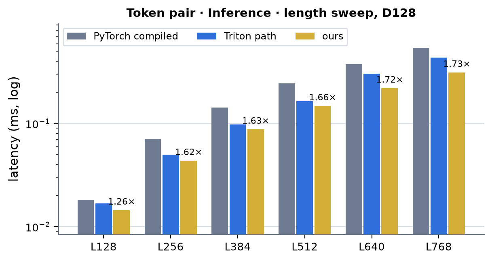 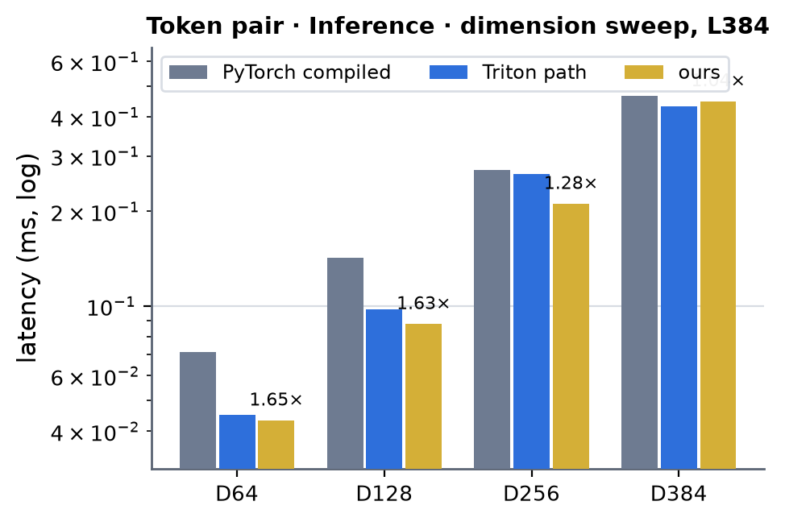 <!-- measure_bars -->

### Token pair 128 -> 64 · Inference

| (Length, Dimension) | PyTorch compiled | Triton path | ours | × |
|---|---|---|---|---|
| (128, 128) | 0.0177 | 0.0125 | 0.0108 | 1.65 |
| (256, 128) | 0.0593 | 0.0366 | 0.0362 | 1.64 |
| (384, 128) | 0.1220 | 0.0697 | 0.0697 | 1.75 |
| (512, 128) | 0.2060 | 0.1178 | 0.1158 | 1.78 |
| (640, 128) | 0.3173 | 0.1809 | 0.1756 | 1.81 |
| (768, 128) | 0.4483 | 0.2588 | 0.2471 | 1.81 |

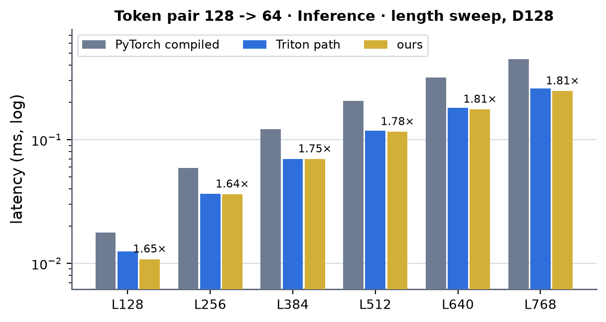 <!-- measure_bars -->

### MSA (8 rows) · Inference

| (Length, Dimension) | PyTorch compiled | Triton path | ours | × |
|---|---|---|---|---|
| (128, 64) | 0.0061 | 0.0069 | 0.0057 | 1.07 |
| (384, 64) | 0.0067 | 0.0059 | 0.0046 | 1.44 |
| (768, 64) | 0.0084 | 0.0068 | 0.0052 | 1.61 |
| (128, 128) | 0.0069 | 0.0083 | 0.0062 | 1.10 |
| (384, 128) | 0.0088 | 0.0090 | 0.0065 | 1.37 |
| (768, 128) | 0.0105 | 0.0133 | 0.0071 | 1.49 |

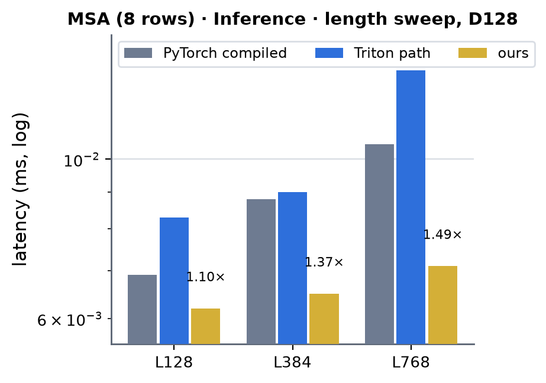 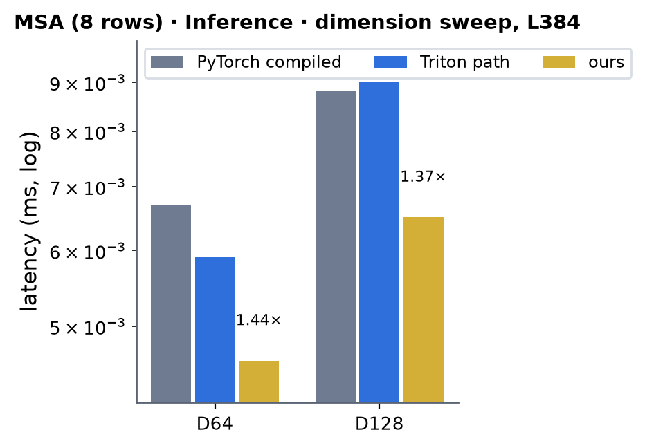 <!-- measure_bars -->

### MSA (8 rows) 64 -> 128 · Inference

| (Length, Dimension) | PyTorch compiled | Triton path | ours | × |
|---|---|---|---|---|
| (128, 64) | 0.0062 | 0.0056 | 0.0050 | 1.24 |
| (384, 64) | 0.0072 | 0.0059 | 0.0050 | 1.43 |
| (768, 64) | 0.0096 | 0.0071 | 0.0057 | 1.68 |

### Atom single (A = 5) · Inference

| (Length, Dimension) | PyTorch compiled | Triton path | ours | × |
|---|---|---|---|---|
| (1024, 128) | 0.0099 | 0.0124 | 0.0069 | 1.45 |
| (2048, 128) | 0.0139 | 0.0152 | 0.0090 | 1.55 |
| (4096, 128) | 0.0195 | 0.0182 | 0.0132 | 1.47 |
| (8192, 128) | 0.0431 | 0.0424 | 0.0242 | 1.78 |

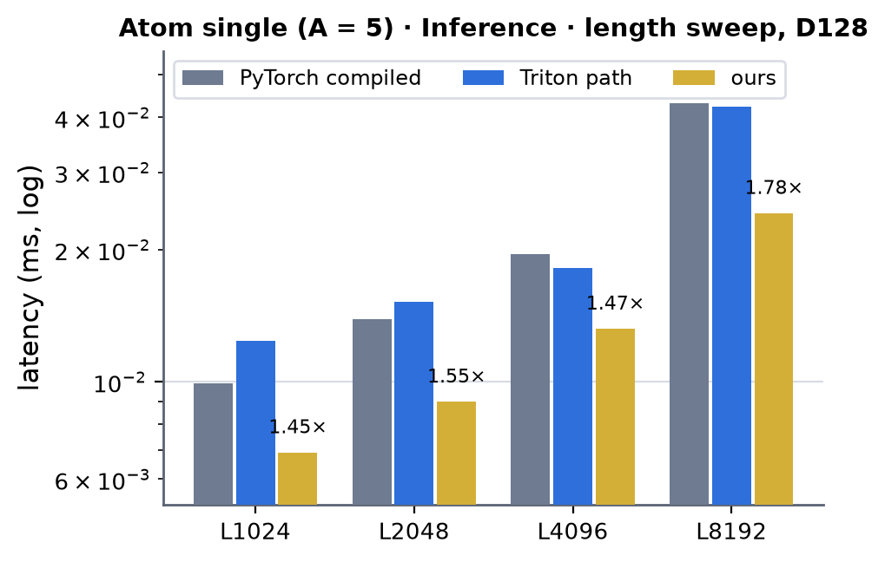 <!-- measure_bars -->

### Atom single (A = 48) · Inference

| (Length, Dimension) | PyTorch compiled | Triton path | ours | × |
|---|---|---|---|---|
| (1024, 128) | 0.0509 | 0.0478 | 0.0359 | 1.42 |

### Token single (A = 5) · Inference

| (Length, Dimension) | PyTorch compiled | Triton path | ours | × |
|---|---|---|---|---|
| (128, 384) | 0.0091 | 0.0099 | 0.0090 | 1.01 |
| (384, 384) | 0.0123 | 0.0195 | 0.0113 | 1.09 |
| (768, 384) | 0.0171 | 0.0184 | 0.0155 | 1.11 |
| (128, 768) | 0.0135 | 0.0150 | 0.0131 | 1.03 |
| (384, 768) | 0.0220 | 0.0360 | 0.0199 | 1.11 |
| (768, 768) | 0.0356 | 0.0380 | 0.0323 | 1.10 |

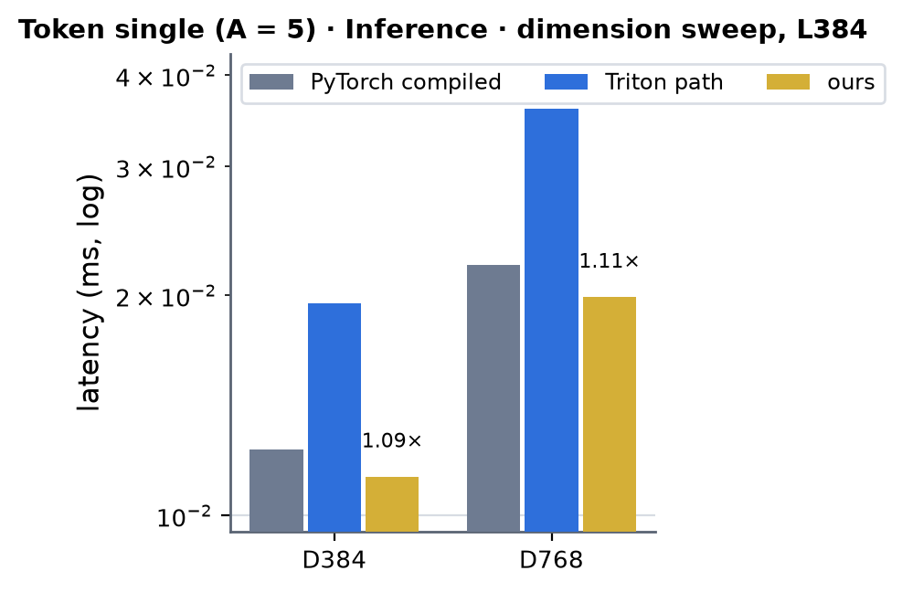 <!-- measure_bars -->

### Token single (A = 48) · Inference

| (Length, Dimension) | PyTorch compiled | Triton path | ours | × |
|---|---|---|---|---|
| (768, 384) | 0.1170 | 0.1146 | 0.1159 | 1.01 |
| (768, 768) | 0.3045 | 0.3018 | 0.2989 | 1.02 |

### Token pair · Training

| (Length, Dimension) | PyTorch compiled | Triton path | ours | × |
|---|---|---|---|---|
| (128, 64) | 0.0330 | 0.0287 | 0.0325 | 1.02 |
| (256, 64) | 0.0957 | 0.0767 | 0.0744 | 1.29 |
| (384, 64) | 0.2044 | 0.1504 | 0.1474 | 1.39 |
| (512, 64) | 0.3369 | 0.2526 | 0.2443 | 1.38 |
| (640, 64) | 0.4947 | 0.3784 | 0.3712 | 1.33 |
| (768, 64) | 0.6886 | 0.5331 | 0.5282 | 1.30 |
| (128, 128) | 0.0515 | 0.0460 | 0.0482 | 1.07 |
| (256, 128) | 0.1844 | 0.1527 | 0.1433 | 1.29 |
| (384, 128) | 0.3868 | 0.3116 | 0.2930 | 1.32 |
| (512, 128) | 0.6564 | 0.5316 | 0.4939 | 1.33 |
| (640, 128) | 1.0175 | 0.8743 | 0.7631 | 1.33 |
| (768, 128) | 1.4551 | 1.2654 | 1.0776 | 1.35 |
| (128, 256) | 0.1084 | 0.1048 | 0.0990 | 1.10 |
| (256, 256) | 0.3464 | 0.3352 | 0.2983 | 1.16 |
| (384, 256) | 0.7405 | 0.7282 | 0.6410 | 1.16 |
| (512, 256) | 1.3083 | 1.2634 | 1.1172 | 1.17 |
| (640, 256) | 2.0320 | 1.9443 | 1.7587 | 1.16 |
| (768, 256) | 2.9421 | 2.8423 | 2.5423 | 1.16 |
| (128, 384) | 0.1664 | 0.1606 | 0.1639 | 1.01 |
| (256, 384) | 0.5727 | 0.5577 | 0.5570 | 1.03 |
| (384, 384) | 1.2823 | 1.2313 | 1.2735 | 1.01 |
| (512, 384) | 2.3239 | 2.2319 | 2.2332 | 1.04 |
| (640, 384) | 3.6042 | 3.4373 | 3.4694 | 1.04 |
| (768, 384) | 5.1955 | 4.9874 | 4.9318 | 1.05 |

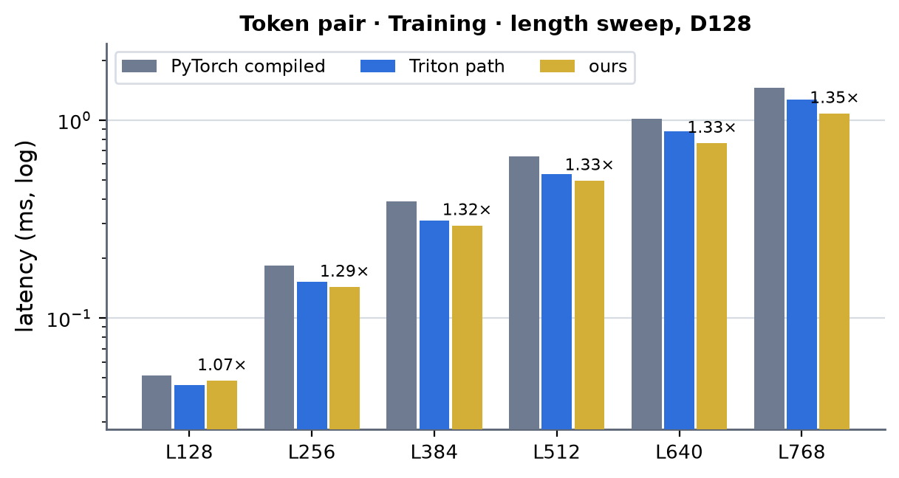 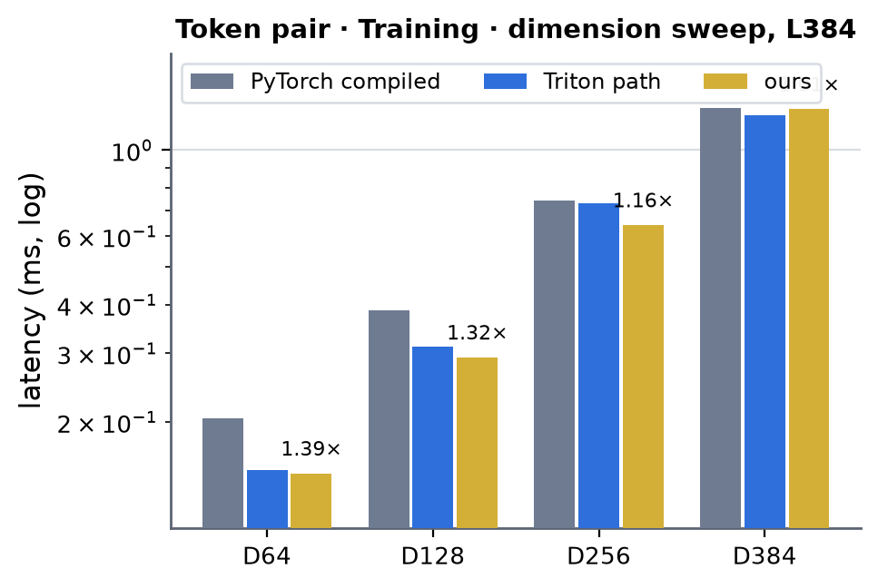 <!-- measure_bars -->

### Token pair 128 -> 64 · Training

| (Length, Dimension) | PyTorch compiled | Triton path | ours | × |
|---|---|---|---|---|
| (128, 128) | 0.0461 | 0.0374 | 0.0411 | 1.12 |
| (256, 128) | 0.1602 | 0.1217 | 0.1232 | 1.30 |
| (384, 128) | 0.3406 | 0.2506 | 0.2480 | 1.37 |
| (512, 128) | 0.5688 | 0.4250 | 0.4157 | 1.37 |
| (640, 128) | 0.8667 | 0.6486 | 0.6506 | 1.33 |
| (768, 128) | 1.2296 | 0.9236 | 0.9218 | 1.33 |

 <!-- measure_bars -->

### MSA (8 rows) · Training

| (Length, Dimension) | PyTorch compiled | Triton path | ours | × |
|---|---|---|---|---|
| (128, 64) | 0.0170 | 0.0167 | 0.0175 | 0.97 |
| (384, 64) | 0.0208 | 0.0195 | 0.0202 | 1.03 |
| (768, 64) | 0.0246 | 0.0221 | 0.0215 | 1.14 |
| (128, 128) | 0.0202 | 0.0217 | 0.0230 | 0.88 |
| (384, 128) | 0.0240 | 0.0259 | 0.0245 | 0.98 |
| (768, 128) | 0.0290 | 0.0341 | 0.0276 | 1.05 |

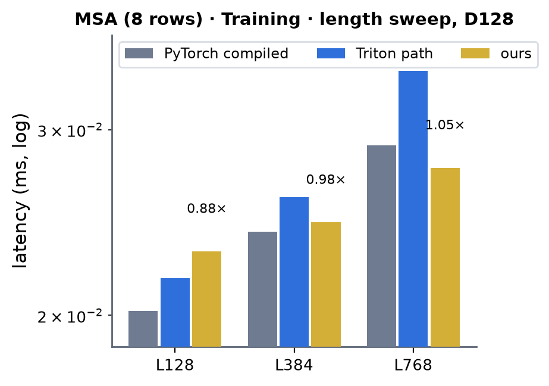 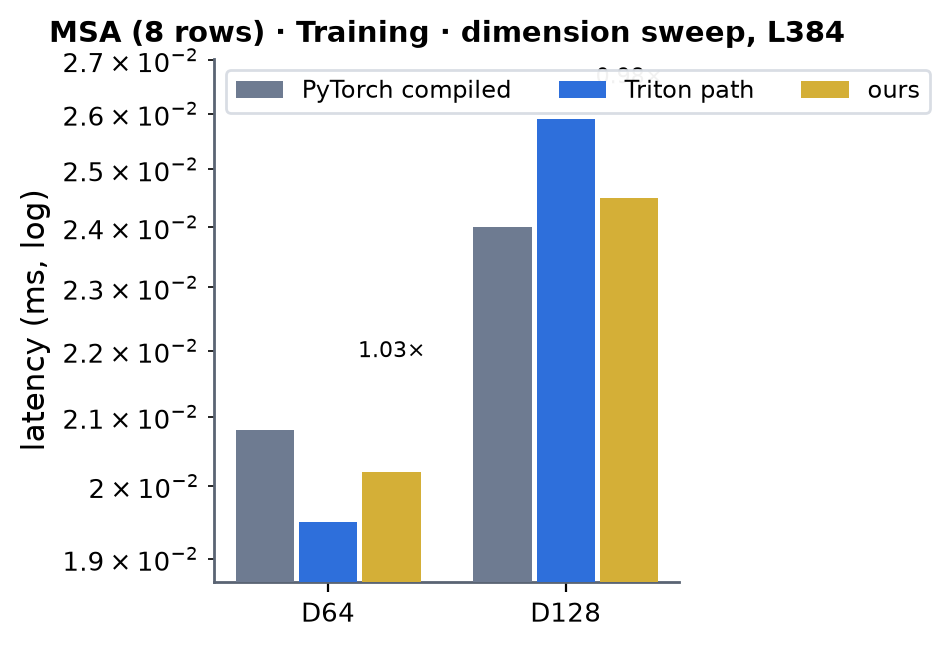 <!-- measure_bars -->

### MSA (8 rows) 64 -> 128 · Training

| (Length, Dimension) | PyTorch compiled | Triton path | ours | × |
|---|---|---|---|---|
| (128, 64) | 0.0177 | 0.0175 | 0.0187 | 0.95 |
| (384, 64) | 0.0217 | 0.0194 | 0.0204 | 1.07 |
| (768, 64) | 0.0256 | 0.0223 | 0.0220 | 1.16 |

### Atom single (A = 5) · Training

| (Length, Dimension) | PyTorch compiled | Triton path | ours | × |
|---|---|---|---|---|
| (1024, 128) | 0.0274 | 0.0322 | 0.0262 | 1.05 |
| (2048, 128) | 0.0376 | 0.0417 | 0.0325 | 1.16 |
| (4096, 128) | 0.0594 | 0.0570 | 0.0523 | 1.14 |
| (8192, 128) | 0.1152 | 0.1123 | 0.0961 | 1.20 |

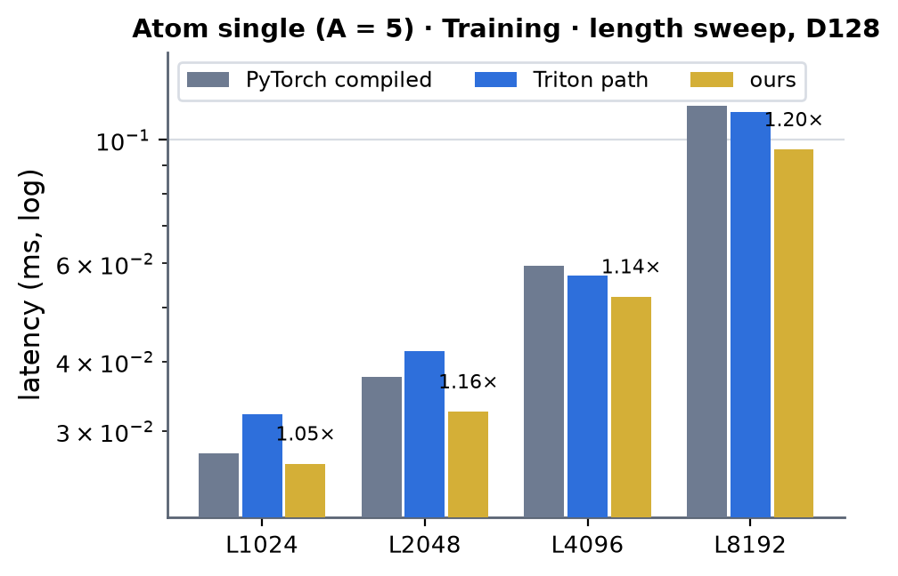 <!-- measure_bars -->

### Atom single (A = 48) · Training

| (Length, Dimension) | PyTorch compiled | Triton path | ours | × |
|---|---|---|---|---|
| (1024, 128) | 0.1322 | 0.1258 | 0.1163 | 1.14 |

### Token single (A = 5) · Training

| (Length, Dimension) | PyTorch compiled | Triton path | ours | × |
|---|---|---|---|---|
| (128, 384) | 0.0240 | 0.0250 | 0.0237 | 1.01 |
| (384, 384) | 0.0361 | 0.0453 | 0.0340 | 1.06 |
| (768, 384) | 0.0512 | 0.0557 | 0.0461 | 1.11 |
| (128, 768) | 0.0354 | 0.0364 | 0.0341 | 1.04 |
| (384, 768) | 0.0612 | 0.0800 | 0.0573 | 1.07 |
| (768, 768) | 0.1054 | 0.1123 | 0.1036 | 1.02 |

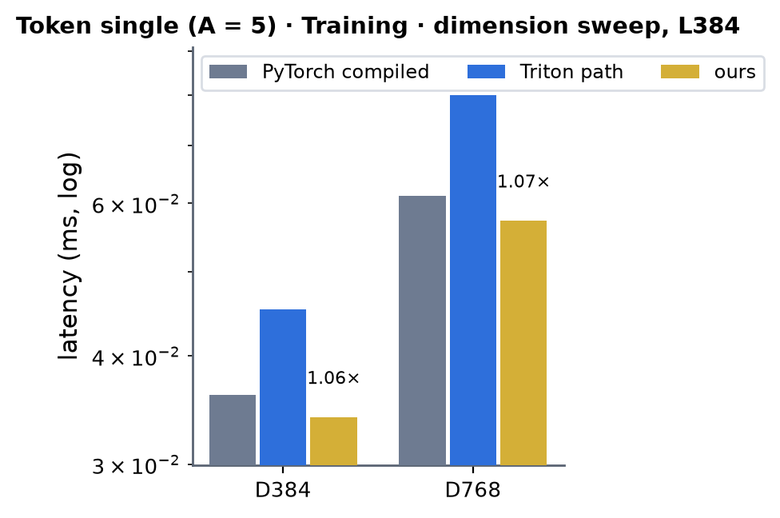 <!-- measure_bars -->

### Token single (A = 48) · Training

| (Length, Dimension) | PyTorch compiled | Triton path | ours | × |
|---|---|---|---|---|
| (768, 384) | 0.3292 | 0.3244 | 0.3258 | 1.01 |
| (768, 768) | 0.9238 | 0.8701 | 0.8872 | 1.04 |

### tm1 (gated input projections) · kernel bench `dual_gemm_epilogue` · bf16

| (Length, Dimension) | PyTorch | Triton | ours (CUDA) | × (PyTorch / ours) |
|---|---|---|---|---|
| (384, 64) | 0.255 | 0.072 | 0.068 | 3.77 |
| (768, 64) | 0.909 | 0.253 | 0.239 | 3.81 |
| (384, 128) | 0.538 | 0.153 | 0.145 | 3.70 |
| (768, 128) | 1.906 | 0.783 | 0.574 | 3.32 |
| (384, 256) | 0.981 | 0.505 | 0.429 | 2.29 |
| (768, 256) | 3.882 | 2.782 | 1.791 | 2.17 |
| (384, 384) | 1.759 | 1.451 | 0.902 | 1.95 |
| (768, 384) | 7.017 | 5.821 | 3.679 | 1.91 |

  <!-- measure_bars -->

### tm2 (output gate and projection) · kernel bench `gemm_gate` · bf16

| (Length, Dimension) | PyTorch | Triton | ours (CUDA) | × (PyTorch / ours) |
|---|---|---|---|---|
| (384, 64) | 0.110 | 0.049 | 0.060 | 1.81 |
| (768, 64) | 0.358 | 0.157 | 0.177 | 2.02 |
| (384, 128) | 0.217 | 0.097 | 0.115 | 1.89 |
| (768, 128) | 0.741 | 0.351 | 0.396 | 1.87 |
| (384, 256) | 0.381 | 0.275 | 0.298 | 1.28 |
| (768, 256) | 1.530 | 1.185 | 1.187 | 1.29 |
| (384, 384) | 0.674 | 0.595 | 0.586 | 1.15 |
| (768, 384) | 2.769 | 2.507 | 2.386 | 1.16 |

  <!-- measure_bars -->

### TriMul output-gate backward · kernel bench `gemm_gate_bwd` · bf16

| (Length, Dimension) | PyTorch | Triton | ours (CUDA) | × (PyTorch / ours) |
|---|---|---|---|---|
| (384, 64) | 0.281 | 0.147 | 0.148 | 1.89 |
| (768, 64) | 0.964 | 0.457 | 0.469 | 2.05 |
| (384, 128) | 0.521 | 0.259 | 0.264 | 1.97 |
| (768, 128) | 1.954 | 0.922 | 0.948 | 2.06 |
| (384, 256) | 1.029 | 0.464 | 0.472 | 2.18 |
| (768, 256) | 4.102 | 1.783 | 1.815 | 2.26 |
| (384, 384) | 1.886 | 0.798 | 0.803 | 2.35 |
| (768, 384) | 6.888 | 3.096 | 3.129 | 2.20 |

  <!-- measure_bars -->

### Short and mid shapes, interleaved (µs per call; job 63301)

The shapes where the first tables differ by microseconds, re-measured with the two implementations interleaved in one process (CUDA graph, each arm best of three medians of 9 x 20 replays): ours as dispatched, ours forced to the fused GEMM and
to the split route, and both Triton variants. The last column is ours over the faster Triton variant (below 1 = ours is faster). (The 0.0697 ms of the first table for pair 384 -> 384, L128, inference was a measurement artifact: 60.3 us here against
60.0 for the Triton path.)

| stream | L | d_hidden -> d_out | mode | ours (dispatch) | ours fused | ours split | Triton fused | Triton split | ours / best Triton |
|---|---|---|---|---|---|---|---|---|---|
| pair | 128 | 64 -> 64 | inference | 8.0 | 8.0 | 10.6 | 8.4 | 11.3 | 0.952 |
| pair | 128 | 64 -> 64 | training | 31.3 | 31.4 | 32.3 | 29.0 | 34.2 | 1.081 |
| pair | 128 | 128 -> 64 | inference | 10.4 | 10.4 | 15.2 | 12.6 | 16.5 | 0.829 |
| pair | 128 | 128 -> 64 | training | 40.7 | 40.6 | 40.4 | 37.0 | 43.4 | 1.100 |
| pair | 128 | 128 -> 128 | inference | 13.0 | 12.9 | 15.6 | 16.5 | 16.9 | 0.783 |
| pair | 128 | 128 -> 128 | training | 47.0 | 47.3 | 45.6 | 45.3 | 49.1 | 1.037 |
| pair | 128 | 256 -> 256 | inference | 32.2 | 32.3 | 35.5 | 48.4 | 37.0 | 0.871 |
| pair | 128 | 256 -> 256 | training | 97.3 | 97.5 | 106.2 | 118.8 | 104.9 | 0.927 |
| pair | 128 | 384 -> 384 | inference | 60.3 | 56.6 | 60.3 | 106.5 | 60.0 | 1.005 |
| pair | 128 | 384 -> 384 | training | 163.1 | 153.7 | 163.4 | 217.8 | 162.1 | 1.006 |
| pair | 256 | 64 -> 64 | inference | 17.9 | 17.8 | 36.4 | 19.3 | 36.4 | 0.928 |
| pair | 256 | 64 -> 64 | training | 77.0 | 77.1 | 94.5 | 77.6 | 95.6 | 0.992 |
| pair | 256 | 128 -> 64 | inference | 37.3 | 37.3 | 56.0 | 35.7 | 55.3 | 1.044 |
| pair | 256 | 128 -> 64 | training | 127.2 | 127.1 | 158.7 | 122.8 | 158.7 | 1.036 |
| pair | 256 | 128 -> 128 | inference | 44.1 | 44.1 | 68.9 | 49.3 | 68.4 | 0.895 |
| pair | 256 | 128 -> 128 | training | 148.1 | 148.1 | 184.3 | 152.0 | 183.9 | 0.974 |
| pair | 256 | 256 -> 256 | inference | 98.7 | 98.7 | 127.9 | 156.2 | 126.2 | 0.782 |
| pair | 256 | 256 -> 256 | training | 311.4 | 312.2 | 358.6 | 382.3 | 353.0 | 0.882 |
| pair | 256 | 384 -> 384 | inference | 202.4 | 239.0 | 202.3 | 382.1 | 197.8 | 1.023 |
| pair | 256 | 384 -> 384 | training | 574.4 | 585.2 | 574.6 | 801.9 | 563.8 | 1.019 |
| pair | 384 | 64 -> 64 | inference | 44.0 | 44.2 | 73.7 | 45.1 | 73.0 | 0.976 |
| pair | 384 | 64 -> 64 | training | 152.8 | 153.2 | 210.0 | 153.0 | 208.0 | 0.999 |
| pair | 384 | 128 -> 64 | inference | 71.6 | 71.6 | 123.4 | 70.1 | 122.5 | 1.021 |
| pair | 384 | 128 -> 64 | training | 257.9 | 257.8 | 350.3 | 254.7 | 346.0 | 1.012 |
| pair | 384 | 128 -> 128 | inference | 87.8 | 87.0 | 142.8 | 97.4 | 141.8 | 0.901 |
| pair | 384 | 128 -> 128 | training | 303.9 | 303.6 | 394.5 | 313.9 | 389.5 | 0.968 |
| pair | 384 | 256 -> 256 | inference | 211.2 | 224.1 | 268.1 | 318.2 | 264.6 | 0.798 |
| pair | 384 | 256 -> 256 | training | 663.8 | 663.9 | 752.3 | 829.6 | 746.1 | 0.890 |
| pair | 384 | 384 -> 384 | inference | 440.4 | 457.2 | 440.6 | 840.6 | 438.5 | 1.004 |
| pair | 384 | 384 -> 384 | training | 1244.3 | 1200.5 | 1243.4 | 1750.7 | 1232.3 | 1.010 |
| pair | 512 | 64 -> 64 | inference | 72.1 | 72.1 | 121.5 | 74.1 | 119.8 | 0.972 |
| pair | 512 | 64 -> 64 | training | 253.9 | 253.7 | 348.4 | 255.4 | 341.6 | 0.994 |
| pair | 512 | 128 -> 64 | inference | 119.0 | 119.0 | 204.7 | 118.3 | 203.1 | 1.006 |
| pair | 512 | 128 -> 64 | training | 431.9 | 432.8 | 584.0 | 435.1 | 571.2 | 0.993 |
| pair | 512 | 128 -> 128 | inference | 147.0 | 149.4 | 240.8 | 164.4 | 238.6 | 0.894 |
| pair | 512 | 128 -> 128 | training | 514.6 | 513.8 | 668.3 | 542.1 | 657.0 | 0.949 |
| pair | 512 | 256 -> 256 | inference | 383.4 | 395.4 | 469.5 | 590.3 | 462.6 | 0.829 |
| pair | 512 | 256 -> 256 | training | 1147.8 | 1144.4 | 1298.9 | 1506.2 | 1286.2 | 0.892 |
| pair | 512 | 384 -> 384 | inference | 781.2 | 815.0 | 778.0 | 1478.5 | 778.5 | 1.003 |
| pair | 512 | 384 -> 384 | training | 2190.5 | 2129.6 | 2191.5 | 3108.0 | 2175.5 | 1.007 |
| msa | 128 | 64 -> 64 | inference | 4.3 | 4.3 | 6.0 | 5.6 | 6.8 | 0.771 |
| msa | 128 | 64 -> 64 | training | 17.2 | 17.1 | 16.6 | 16.5 | 17.5 | 1.040 |
| msa | 128 | 64 -> 128 | inference | 4.8 | 4.8 | 6.0 | 5.3 | 6.7 | 0.904 |
| msa | 128 | 64 -> 128 | training | 18.5 | 18.5 | 17.3 | 17.2 | 18.1 | 1.074 |
| msa | 128 | 128 -> 128 | inference | 6.1 | 6.1 | 6.7 | 10.1 | 8.2 | 0.745 |
| msa | 128 | 128 -> 128 | training | 22.7 | 22.7 | 19.8 | 21.6 | 22.0 | 1.055 |
| msa | 384 | 64 -> 64 | inference | 4.4 | 4.5 | 6.4 | 5.6 | 6.9 | 0.782 |
| msa | 384 | 64 -> 64 | training | 20.0 | 20.0 | 20.2 | 19.3 | 21.8 | 1.037 |
| msa | 384 | 64 -> 128 | inference | 4.9 | 4.9 | 7.0 | 5.9 | 7.5 | 0.835 |
| msa | 384 | 64 -> 128 | training | 20.2 | 20.3 | 21.2 | 19.2 | 22.6 | 1.053 |
| msa | 384 | 128 -> 128 | inference | 6.5 | 6.4 | 8.2 | 12.0 | 9.0 | 0.720 |
| msa | 384 | 128 -> 128 | training | 24.2 | 24.2 | 23.3 | 25.6 | 25.8 | 0.946 |
| token | 128 | 384 -> 384 | inference | 8.9 | 11.7 | 8.8 | 41.9 | 8.9 | 1.000 |
| token | 128 | 384 -> 384 | training | 23.7 | 32.1 | 23.8 | 56.8 | 24.0 | 0.989 |
| token | 128 | 768 -> 768 | inference | 12.6 | 21.0 | 12.6 | 37.1 | 12.8 | 0.984 |
| token | 128 | 768 -> 768 | training | 33.8 | 52.3 | 33.8 | 60.6 | 34.5 | 0.981 |

Inference is at or ahead of the Triton path in every row (0.72-1.04x; the worst, pair L256 128 -> 64, is 1.6 us behind). Training is within +-4 % except five cells: pair L128 64 -> 64 (1.081) and 128 -> 64 (1.100), MSA 64 -> 128 at L128 / L384
(1.074 / 1.053) and MSA 128 -> 128 at L128 (1.055) -- 1-4 us in steps of 17-41 us; the transposed copy of the weight that the backward's dgrad kernel reads is a launch of its own (about 2 us in a graph) that the Triton backward does not have. They are not routed to
Triton: no rule on the shape separates them from their neighbours that are ahead (MSA at L768 is 1-19 % ahead, pair at 256 -> 256 7-12 %), and the whole step of any of them is below 45 us; `MINIWORLD_GATED_SM80=0` selects the Triton kernels. The same table shows
where the fused / split cut sits: at 384 -> 384 the fused GEMM is ahead at L128 (56.6 against 60.3 us) and behind from L256 (239 against 202 us), the dispatcher's rule is on the output width only.

### Speed of light

Floor of the decomposition as implemented, per kernel `max(bytes / 1.60 TB/s, FLOP / 240 TFLOP/s)` summed (ceilings measured on this card, job 63266: 237.6 TFLOP/s bf16 GEMM, 1.71 TB/s copy; the floors keep 240 and 1.60): the fused forward reads `g` and `v` and writes the output
(`2 M K + M N` elements, `2 M K N` FLOP); training adds the dgrad kernel (reads `dO`, `g`, `v`, writes `dv`, `dg`, `a`: `M N + 5 M K` elements) and the `dW` GEMM (`M N + M K`); the split route (`d_out >= 384`) is the one-pass gate (`3 M K`) plus the cuBLAS GEMM
(`M K + M N`), and in training the three further passes of its backward. Ours is the probe's CUDA-graph time. The MSA rows (8 MSA rows: M = 3 072 / 6 144) are launch-latency bound (floors of 1-11 us): their percentages say nothing about the kernels.

| stream | (L, d_hidden -> d_out) | mode | ours (µs) | SoL floor (µs) | % of SoL |
|---|---|---|---|---|---|
| Token pair | (384, 64 -> 64) | inference | 43 | 35 | 82 % |
| Token pair | (768, 64 -> 64) | inference | 149 | 142 | 95 % |
| Token pair | (384, 128 -> 128) | inference | 88 | 71 | 81 % |
| Token pair | (768, 128 -> 128) | inference | 312 | 283 | 91 % |
| Token pair | (384, 256 -> 256) | inference | 212 | 142 | 67 % |
| Token pair | (768, 256 -> 256) | inference | 936 | 566 | 61 % |
| Token pair | (384, 384 -> 384) | inference | 449 | 394 | 88 % |
| Token pair | (768, 384 -> 384) | inference | 1786 | 1574 | 88 % |
| Token pair | (384, 64 -> 64) | training | 147 | 130 | 88 % |
| Token pair | (768, 64 -> 64) | training | 528 | 519 | 98 % |
| Token pair | (384, 128 -> 128) | training | 293 | 260 | 89 % |
| Token pair | (768, 128 -> 128) | training | 1078 | 1038 | 96 % |
| Token pair | (384, 256 -> 256) | training | 641 | 519 | 81 % |
| Token pair | (768, 256 -> 256) | training | 2542 | 2076 | 82 % |
| Token pair | (384, 384 -> 384) | training | 1274 | 1110 | 87 % |
| Token pair | (768, 384 -> 384) | training | 4932 | 4439 | 90 % |
| Token pair 128 -> 64 | (384, 128 -> 64) | inference | 70 | 59 | 85 % |
| Token pair 128 -> 64 | (768, 128 -> 64) | inference | 247 | 236 | 95 % |
| Token pair 128 -> 64 | (384, 128 -> 64) | training | 248 | 224 | 90 % |
| Token pair 128 -> 64 | (768, 128 -> 64) | training | 922 | 897 | 97 % |
| MSA (8 rows) | (384, 64 -> 64) | inference | 5 | 1 | 16 % |
| MSA (8 rows) | (768, 64 -> 64) | inference | 5 | 1 | 28 % |
| MSA (8 rows) | (384, 128 -> 128) | inference | 6 | 1 | 23 % |
| MSA (8 rows) | (768, 128 -> 128) | inference | 7 | 3 | 42 % |
| MSA (8 rows) | (384, 64 -> 64) | training | 20 | 3 | 13 % |
| MSA (8 rows) | (768, 64 -> 64) | training | 22 | 5 | 25 % |
| MSA (8 rows) | (384, 128 -> 128) | training | 24 | 5 | 22 % |
| MSA (8 rows) | (768, 128 -> 128) | training | 28 | 11 | 39 % |
| MSA (8 rows) 64 -> 128 | (384, 64 -> 128) | inference | 5 | 1 | 20 % |
| MSA (8 rows) 64 -> 128 | (768, 64 -> 128) | inference | 6 | 2 | 34 % |
| MSA (8 rows) 64 -> 128 | (384, 64 -> 128) | training | 20 | 3 | 17 % |
| MSA (8 rows) 64 -> 128 | (768, 64 -> 128) | training | 22 | 7 | 31 % |
| Atom single (A = 5) | (4096, 128 -> 128) | inference | 13 | 10 | 74 % |
| Atom single (A = 5) | (4096, 128 -> 128) | training | 52 | 36 | 69 % |
| Token single (A = 5) | (768, 384 -> 384) | inference | 16 | 10 | 66 % |
| Token single (A = 5) | (768, 768 -> 768) | inference | 32 | 30 | 93 % |
| Token single (A = 5) | (768, 384 -> 384) | training | 46 | 29 | 63 % |
| Token single (A = 5) | (768, 768 -> 768) | training | 104 | 86 | 83 % |
| Token single (A = 48) | (768, 384 -> 384) | inference | 116 | 98 | 85 % |
| Token single (A = 48) | (768, 768 -> 768) | inference | 299 | 287 | 96 % |
| Token single (A = 48) | (768, 384 -> 384) | training | 326 | 277 | 85 % |
| Token single (A = 48) | (768, 768 -> 768) | training | 887 | 827 | 93 % |
### What was tried and did not pay (2026-10-03 / 04)

- **The fused GEMM at wide outputs.** From 384 output columns the gate transform that every 128-column output tile redoes on the same A rows bounds the fused kernel (forward, pair 384 -> 384: 202 us for the
  one-pass gate + cuBLAS against 239 fused at L256, 441 against 457 at L384, 778 against 815 at L512; the fused kernel is ahead only at L128, 56.6 against 60.3 us; at 128 and 256 wide it is 1.2-1.6x faster), so `fused_gate_out` splits from `d_out >= 384` (`SPLIT_MIN_N`).
- **Per-element loads in the backward epilogues (kept the fix).** `gp_dgrad`, `tm1` and `tm2` backward need the gate / value / output-gradient element at every accumulator position; the first versions loaded them with 4-byte global loads
  each followed by its use (one latency per element). Their tiles now arrive in the free ring by coalesced 16-byte `cp.async` and the epilogue reads shared memory, with `run_fast` addressing for whole tiles: training step of the
  pair L384 128 -> 128 row 0.292 ms against the Triton fused kernels' 0.337 ms and PyTorch compiled's 0.382 ms (probe, one process).
- **128-row tiles at a small M (kept the fix).** With 2 CTAs / SM a grid of t tiles takes ceil(t / 216) waves; `small_m` picks the 64-row tiling (twice the tiles for the same rows) whenever its last wave is fuller by a margin
  (MSA rows with a short length, a grid just past a multiple of the wave size).
- **Calibrating fused-vs-split on this card.** The pair-bias dispatch (`gate_use_fused`) used a Triton calibration to choose; on an A100 the CUDA kernels' own rule above replaces it (no Triton kernel is built or timed first), a cache
  build's `pin_gate_backend` still wins.
- **Not tried:** a persistent kernel that shares the gated A tile between the n-tiles of one row block (the way out of the split route's two extra passes at 384 / 768 columns), and fp16 / fp32 variants (the registry rows are bf16).

### Limits and next

- Not served on A100 (the Triton kernels or the PyTorch composition run): fp32 / fp16 operands, d_hidden or d_out not a multiple of 64, a tensor that is not CUDA / contiguous in the elementwise gates (the GEMM entry points copy a non-contiguous input once).
- `tm1`, `tm2` and the TriMul output gate have no production caller: the TriMul modules run the fused front and back half (see [../trimul/trimul.md](../trimul/trimul.md)); the kernels are exposed through the kernel benchmarks only.
- The 384 / 768-wide outputs run the split route (five passes over the activation instead of three); a fused kernel that does not redo the gate transform per n-tile is the open item there.
- `tm2` (`gemm_gate`) is 13-22 % behind the Triton kernel at d_pair 64 / 128 (60 us against 49 at D64, L384; 177 against 157 at L768) and 8 % at 256 (L384): it is the one kernel of this page that is behind. No module calls it, so nothing routes on the
  number; `kernels.tm2.interface` offers both implementations and the caller picks.
