# LayerNorm, RMSNorm, RoPE and RMSNorm-modulation on A100 (sm80)

Kernel-level status of the normalisation and rotary row ops on A100; the module-level summary is in [../a100.md](../a100.md). The shape registry (`registry_module.csv`) lists `layernorm_native` -- token_single
(d_norm 384 / 451 / 768 / 831 / 833 / 2560), token_pair (64 / 128 / 256 / 267 / 384 / 512), msa_token (64 / 128), atom_single (128), atom_pair (16) and noise (256), has_bias 0 / 1 -- and `rms_norm_modulation`
(atom_single, d_hidden = d_cond = 128); RMSNorm (the q / k head norms, 32 - 128) and RoPE (the fused Q/K RMSNorm + 3D RoPE of SWA atom attention) are the row ops the attention modules call. Columns are
(Length, Dimension) with Dimension = d_norm: token streams L = 128 - 768, the MSA stream 8 rows of L, the atom streams N = 1024 - 8192 atoms (the chart ticks read L<n>); the atom / noise batches are A = 5 (inference) and
48 (training). bf16 activations with fp32 affine parameters (the registry's contract; `tests/registry/test_layernorm_is_never_bf16.py`), statistics fp32 always.

Summary (2026-10-04). LayerNorm (every registry width, 16 - 2560, the odd widths 267 / 451 / 831 / 833 included), RMSNorm, the fused Q/K RMSNorm + 3D RoPE of SWA atom attention and `rms_norm_modulation` run hand-written CUDA on A100,
inference and training (forward and backward), bf16 first and fp32 rows too. They are memory-bound row kernels that move each tensor once: ours sits at 81 - 106 % of the byte floor on the token pair stream at L384 / L768 (inference and
training; 81 - 90 % for the staged 267-wide rows) and at 87 - 99 % in the profiled training steps of the big streams. Against PyTorch compiled (CUDA graph; × = PyTorch compiled / ours): the LayerNorm backward kernel (`bench.py layernorm_bwd`, pair stream)
1.26 - 2.22x, and 0.98 - 2.2x the faster Triton path; the pair-stream forward 0.97 - 1.16x (a streaming kernel: PyTorch compiled and the Triton kernel run at the same DRAM rate; the odd 267-wide row 1.14 - 1.16x, the Triton kernel 1.7x slower there);
the LayerNorm training step 1.02 - 1.24x on the pair stream, 1.17 - 1.74x on the atom, MSA and batched (A = 5 / 48) token-single streams and 1.3 - 1.45x on the odd widths 451 / 831 / 833 from L384; `rms_norm_modulation` 1.8 - 2.2x in inference and
1.5 - 1.8x in training (from 2048 atoms on 1.3 - 1.7x the Triton path in inference, 1.2 - 1.3x in training); the fused Q/K RMSNorm + RoPE 1.05 - 1.06x in training (1.98x at A = 5 / 4096 atoms) and parity in inference. At the launch-bound end (at most a few thousand rows: inference
2.3 - 4.6 us, training 8 - 14 us) ours is 0.6 - 1.2x PyTorch compiled, and the smallest training steps keep the Triton path (see Limits). Module level (`bench.py`, norms on / off): SWA atom attention is 1 - 2 % faster in inference with the new
qk-norm + RoPE kernel; the A100 Transition normalises inside its fused kernel (no change) and its split path at 64 - 384 wide gains 0.3 - 1.2 % in training.

On A100 the default dispatch (implementation MINIWORLD, capability 8.0, engine backend not forced to Triton) runs **hand-written CUDA** for all four ops, forward and backward, from
`modules/primitives.py` (`LayerNorm`, `RMSNorm`), `kernels/layernorm/interface.py` (`layernorm_kernel`), `modules/swa_atom_attention/module.py` (the fused qk-norm + RoPE) and `ops.rms_norm_modulation`
(`kernels/rmsnorm/interface.py`); `MINIWORLD_NORMS_SM80=0` keeps the Triton kernels and `=force` also runs the CUDA rows for the tiny training steps the Triton path wins and `supports()` declines by default (see Limits); both are read at call time. The Triton kernels stay as the fallback and as the "Triton path" column; an explicit TRITON implementation
request is Triton (the `LayerNorm` module resolves `TRITON` to `triton_layernorm`, `RMSNorm` takes the A100 kernels only for MINIWORLD).

## Contract

| op | entry (module / function) | served by CUDA | falls back (Triton, or PyTorch for fp16 / CPU) |
|---|---|---|---|
| LayerNorm | `LayerNorm.forward` (MINIWORLD) -> `layernorm_kernel` -> `kernels/layernorm/cuda/sm80.py` | bf16 or fp32 rows, widths 1 - 4096 (vector: a multiple of 8 bf16 / 4 fp32 and 16-byte aligned; scalar and staged: any width and alignment, 267 / 451 / 831 / 833 in the registry), fp32 or bf16 weight and bias (one dtype), with or without affine; inference (no grad) and training (autograd function, two opaque ops) | fp16, width > 4096, a CPU tensor, `MINIWORLD_NORMS_SM80=0`, engine backend forced to Triton, capability other than 8.0, empty batch; a training call of width 64 - 768 (multiple of 8) over 20 K - 100 K elements (the Triton path wins those, `=force` serves them) |
| RMSNorm | `RMSNorm.forward` (MINIWORLD) -> `kernels/rmsnorm/cuda/sm80.py` | the same rows without mean / bias: the q / k head norms (32 - 128), the DiT width | as above; an explicit TRITON request; `triangle_attention/whole_op.py` calls `triton_rmsnorm` directly (not routed) |
| fused Q/K RMSNorm + RoPE | `SWA3DRoPEAttention.forward` -> `kernels/rope/cuda/sm80.py` (`qk_norm_rope_3d`) | q, k views [N, S, H, D] of one dtype (bf16 / fp32), D = 32 / 64 / 128, fp32 angle tables [N or 1, S, HALF], HALF a multiple of one 16-byte chunk; forward and backward | other head dims or dtypes, tables that require grad, `MINIWORLD_NORMS_SM80=0` |
| `rms_norm_modulation` | `ops.rms_norm_modulation` -> `kernels/rmsnorm/interface.py` -> `kernels/rmsnorm/cuda/sm80.py` | bf16 q, c [..., 128] over the same rows, three [128, 128] bf16 weights (views of the adaLN projection are fine), an RMSNorm weight of 128 (fp32 / bf16) or none; forward and backward | fp32, other widths, `MINIWORLD_NORMS_SM80=0` |

Every gate is a function of the shapes, dtypes, strides, device capability and the two switches only (`torch.compile` traces it; alignment of a base address is handled inside the op: a misaligned view is copied or takes the
scalar path). Training is an `autograd.Function` whose forward and backward are each one `@opaque` op (names `layernorm_sm80_*`, `rmsnorm_sm80_*`, `qk_norm_rope_sm80_*`, `rope_sm80_rotate`, `rmsnorm_adamod_sm80_*`), so
`torch.compile(fullgraph=True)` keeps them as nodes and a CUDA graph can capture a step; the extensions (`norm_rows_sm80`, `rope_sm80`, `adamod_sm80`) are built on first use through `kernels/_nvcc.load_extension`, a failed build warns
once and keeps the Triton path. The row statistics (`mean`, `rstd`) are saved in fp32; parameter gradients come back in the parameter's dtype (fp32 for the bf16 module). `dx` and the forward are bit-reproducible;
`dw` / `db` agree between runs to fp32 rounding at large M, where the persistent warps take rows from a work counter (K2).

성능 확인: ✗ (the maintainer's). cache build ✓: nothing on these paths autotunes -- the launch shapes are fixed by the width and the row count, the Triton caches of the fallback are untouched.

## Kernels

### K1 · `fwd_vec` (LayerNorm / RMSNorm forward, vector path; `kernels/layernorm/cuda/sm80/norm_rows.cu`)

`y = (x - mean) rstd w + b` (RMSNorm: `y = x rstd w`), `rstd = 1 / sqrt(var + eps)`, statistics in fp32 whatever the activation dtype, one rounding of the result to the activation dtype, an optional per-row scale
(the pair mask folded into the epilogue). A row of N elements is NV = N / 8 (bf16) or N / 4 (fp32) chunks of 16 bytes; G lanes (a power of two dividing NV, at most 32) own it, lane g holding chunks g, g + G, ...
(V of them), so every load and store is one coalesced 16-byte access, a warp serves 32 / G rows and the two row sums (mean, then the centred sum of squares: two passes over registers, not E[x^2] - E[x]^2) are
shuffles over the lane group. The grid is one-shot: a warp per row group, CTAs of 128 threads, no persistent loop (a grid-stride loop with the weight and bias held in registers and the `.cs` / `.nc` cache hints were
4-8 % slower on this streaming kernel in the sandbox). Weight and bias are read per warp from L1 (up front for V <= 4 so the loads overlap the row's, per chunk for wider rows). The training forward saves `mean` and `rstd`
(fp32, 8 bytes a row) for the backward.

A mid-sized problem (a few waves of 128-thread CTAs, one narrow group a warp: 512 bytes of x in flight per warp for a 128-wide row) keeps too few bytes in flight, so `fwd_cfg_bf16` gives a warp two (or at 16 wide four) row
groups at once -- all their loads first, the weight and bias read once for both -- and the 64-wide row a 4-lane group (8 rows a warp) in the middle of the range: 5-20 % off the forwards between ~1.2 and ~12 M elements (L2-resident
inputs, a second wave of CTAs), the same speed at the sizes where HBM is the limit. Measured in the production op (a fresh output tensor each call, CUDA graph; `probes/ln_fwd_knobs.py`): an L2-warm sandbox that wrote into one
preallocated output suggested fatter lane groups for 128 and 256 wide rows, which then lost in the real op (the 4-chunk-per-lane kernels take 128 registers and run at a quarter of the occupancy), so only the groups that won there are built.

### K2 · `bwd_vec` + `reduce_partials4` (backward, vector path)

`dx = rstd (w dy - xhat mean(w dy xhat) - mean(w dy))` per row (two shuffle sums over the same lane group), `dw = sum_rows dy xhat`, `db = sum_rows dy` (RMSNorm: no mean term, no `db`), `dx` rounded once. `dx` is written row by row; the
`dw` / `db` column partials of a lane's chunks stay in registers over a persistent loop, are folded across the warps of the CTA through shared memory into **one fp32 partial row per CTA**, and `reduce_partials4`
(a (8 x 32)-thread block per 32 columns: every thread issues eight independent loads of partial rows before adding any -- the partials sit in L2 and a small reduction pays for load latency, not bandwidth -- and the 32 row
slices fold through warp shuffles) adds the rows in a fixed order into `dw` / `db` in the parameter's dtype. The grid is one wave of persistent CTAs, 128 threads for little work (`groups <= 2048`) and 256 otherwise, and no more
than one CTA per 64 rows: every CTA is a partial row to write and read back, which is what a small M pays for (the reduction took 9-14 us at 3-6 K rows with one CTA per 4 rows, 2.4-3.3 us now). A small M assigns row groups
to CTAs statically (bit-reproducible); a large M (more than 32 groups a warp) lets the persistent warps take chunks of four row groups from a work counter, which balanced the CTAs (10-30 % at wide rows) but makes the
order of the rows inside the partial rows depend on timing: `dx` and the forward stay bit-reproducible, `dw` / `db` agree between runs to fp32 rounding. No atomics on the large reductions (fp32 `atomicAdd` runs ~50 G adds/s whatever
the contention).

### K3 · odd widths: `norm_row_scalar`, `bwd_scalar_reg`, `fwd_stage` / `bwd_stage`

A width that is not a whole number of 16-byte chunks (267, 451, 831, 833 here), or an unaligned view, cannot use the vector loads. **Scalar path** (few rows): a warp per row, lane l on columns l, l + 32, ...; the whole row, the weight and
the bias are loaded into registers before the first use (bucketed to VS = 3 .. 32 registers a lane, N <= 1024; a load placed after a store of the row is serialised behind it, which cost a 27-column row 5 of its 9 us), the backward keeps
the lane's `dw` / `db` partials in registers over its rows and folds them as K2 does. **Staged path** (N <= 1024 and at least 4096 rows): U rows (U = 16 / gcd(16, row bytes): 8 bf16 rows of 267) are contiguous, 16-byte aligned and a
whole number of chunks, so a CTA copies a tile of rows into shared memory with `cp.async` (coalesced, 16 bytes a lane, a two-stage ring in the backward), the warps normalise their rows there (lane l on columns l + 32 k: scalar
shared-memory accesses never miss) and the tile goes back out the same way; the tail rows (M mod U) are the scalar kernel's. **Wide rows** (`bwd_wide`: bf16 rows of 1536 / 2048 / 2560 columns, the registry's 2560 included): a warp per row, lane l owning chunks l + 32 v, the row's x and dy chunks packed in registers; the `dw` / `db` partials of a lane (8 V floats each)
do not fit next to them, so they are accumulated into the warp's own rows of shared memory (a lane touches only its own columns: no atomics, no barrier) and folded across the warps into one partial row per CTA. Other widths above 1024
run the backward with the row re-read from L1 for each pass (`bwd_scalar`).

### K4 · RMSNorm

The RMS mode of K1 / K2 (no mean, no bias): `y = x rstd w`, `rstd` saved, `dx = rstd (w dy - xhat mean(w dy xhat))`, `dw` partials as K2. The q / k head norms of SWA atom attention and TriangleAttention are 32 - 128 wide: every one a vector width.

### K5 · `rope_kernel` (3D RoPE and the fused Q/K RMSNorm + RoPE; `kernels/rope/cuda/sm80/rope_sm80.cu`)

The SWA atom attention normalises q and k per head (RMSNorm over the head dim, no weight) and rotates the leading `2 HALF` channels of each head by the position's angles (`lo' = lo cos - hi sin`, `hi' = hi cos + lo sin`; the tail passes through).
One row is a (position, tensor, head); `D / 8` lanes own it, so a warp serves a position's q **and** k rows at 4 heads x 32 channels and the cos / sin of the position are read once; the partner chunk of the rotation comes through one shuffle.
The forward rounds the normalised row to the activation dtype before it rotates (as the Triton kernel does); the backward is one kernel as well (rotate the gradient back, round, the RMSNorm input gradient `dx = rq (gn - n mean(gn n))`). q and k are
read in place as the strided views of the interleaved QKV projection (unit channel stride, strides in whole chunks; a misaligned base is copied by the op), outputs are contiguous [N, S, H, D]. One-shot grid of 128-thread CTAs with 32-bit index
math (a persistent grid-stride loop was 6-16 % slower on this streaming kernel). The standalone rotation (`rope_3d`: its backward is the same kernel with the angle negated) is the same code at one tensor.

### K6 · `adamod_fwd` / `adamod_bwd` (RMSNorm + adaLN modulation; `kernels/rmsnorm/cuda/sm80/adamod_sm80.cu`)

`y = rmsnorm(q) (1 + c Wsc^T) + c Wsh^T`, `gate = c Wg^T` over rows of 128 (the atom stream, d_hidden = d_cond = 128, bf16; the Triton path ran the three products and the norm as two kernels). **Forward**: a persistent CTA (up to 108,
256 threads) keeps the three weight matrices in shared memory (3 x 32 KB, XOR-swizzled 256-byte rows so `ldmatrix` is conflict-free), streams 64-row tiles of `c` and `q` through a two-stage `cp.async` ring, takes the A fragments of the
tile's `c` rows with `ldmatrix`, the row statistic of `q` with shuffles, and runs the three products on `mma.sync m16n8k16` (bf16, fp32 accumulate; warp (mi, nq) owns 32 rows x 32 columns): scale and shift first, the epilogue
`y = (q rstd w)(1 + scale) + shift` is written over `q`'s tile, then the gate over `c`'s, and both tiles leave as coalesced 16-byte stores. **Backward**: `scale` is recomputed on the tensor cores (the only GEMM of the stage; Wsc
resident), rows are processed by whole warps (lane l holds 4 columns; the row sum of `xhat . w dnormed` is a shuffle), and the kernel writes `dq` and the stacked `[dscale | dy | dgate]` ([M, 384], the shift gradient is `dy`
itself): the weight gradients and `dc` are then two cuBLAS GEMMs over it (`dsd^T c`, `dsd [Wsc; Wsh; Wg]`), as in the Triton function; the RMSNorm weight gradient is 128 fp32 accumulated with a few atomics per CTA.

## Measurements (2026-10-04)

A100 80GB PCIe, torch 2.13.0+cu129, CUDA-graph timing everywhere. Milliseconds; × = PyTorch compiled / ours (the Triton path is a reference column and never the denominator; there is no cuEquivariance or Anthropic LayerNorm / RMSNorm / RoPE
arm, so those columns do not exist: `— (not measured)`). PyTorch compiled = `torch.compile(fullgraph=True)` of the PyTorch formula (fp32 statistics, result rounded to the activation dtype); Triton path = the previous A100 path (the Triton
kernels, what `MINIWORLD_NORMS_SM80=0` runs). Two sources, labelled where they apply: **bench.py** (`level=kernel`, `cudagraph=manual`, a frozen snapshot of the tree taken 2026-10-04 02:14, snapshot jobs 63149 / 63150 / 63224 / 63234;
the kernel-level targets cover the pair stream: `layernorm` forward, `layernorm_bwd` backward) and **probes** (`probes/ln_perf.py`, `rope_perf.py`, `rms_perf.py`, `adamod_perf.py`: the same CUDA-graph timer, one process per row so the three columns see
the same card state; jobs 63191 / 63048 / 63192 / 63238), for the streams no bench target builds (token single, MSA, atom, noise, and the training step of LayerNorm: forward + backward through autograd with x, weight and bias
requiring grad). The run-to-run spread between nodes is ~10 %: compare columns of a row, not rows of different jobs. The probes run every row with a bias (the registry's 267-wide pair rows are bias-free; the kernels differ only by a skipped
parameter read).

### bench.py · LayerNorm forward, token pair stream (1, L, L, D), bias · Inference

`bench.py level=kernel target=layernorm`, arms `pytorch` (compiled), `triton_layernorm`, `layernorm_dispatch` (the shipped entry: the A100 CUDA rows; `MINIWORLD_NORMS_SM80=0` runs Triton through the same arm), bf16 x with bf16 weight and bias
(the target's contract), `sweep_axis=d_pair` at L = 384 and 768; job 63149. 128 / 256 / 384 / 512 are the registry's token-pair widths with bias, 64 the 64-wide one, 267 the odd one (staged path). All six are bandwidth-bound: ours is within 3 % of
PyTorch compiled and the Triton kernel at 64 - 256 and 512 wide (the three kernels move the same bytes at the same DRAM rate), 4 - 6 % ahead of PyTorch compiled at 384 and 512 (L768) and 14 - 16 % ahead at 267 wide, where the Triton kernel is 1.7x slower.

| (Length, Dimension) | PyTorch compiled | Triton path | ours | × |
|---|---|---|---|---|
| (384, 64) | 0.0307 | 0.0307 | 0.0317 | 0.97 |
| (768, 64) | 0.1044 | 0.1024 | 0.1014 | 1.03 |
| (384, 128) | 0.0543 | 0.0543 | 0.0553 | 0.98 |
| (768, 128) | 0.1976 | 0.1935 | 0.1905 | 1.04 |
| (384, 256) | 0.1014 | 0.0993 | 0.1004 | 1.01 |
| (768, 256) | 0.3881 | 0.3840 | 0.3717 | 1.04 |
| (384, 267) | 0.1464 | 0.2222 | 0.1280 | 1.14 |
| (768, 267) | 0.5632 | 0.8520 | 0.4874 | 1.16 |
| (384, 384) | 0.1505 | 0.1741 | 0.1454 | 1.04 |
| (768, 384) | 0.5919 | 0.6656 | 0.5571 | 1.06 |
| (384, 512) | 0.1966 | 0.1894 | 0.1884 | 1.04 |
| (768, 512) | 0.7916 | 0.8540 | 0.7496 | 1.06 |

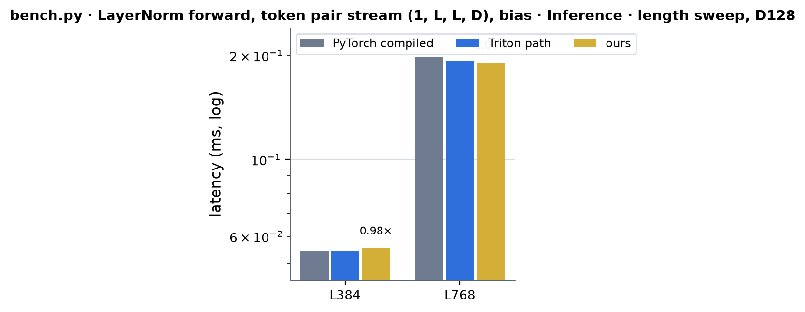 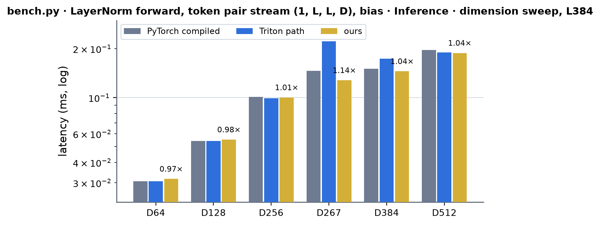 <!-- measure_bars -->

### bench.py · LayerNorm backward (dy, x, w, mean, rstd -> dx, dw, db), token pair stream · Backward

`bench.py level=kernel target=layernorm_bwd`, arms `pytorch` (the formulas, compiled), `triton_atomic`, `triton_persistent` (the Triton column is the faster of the two at each shape), `cuda` (on an A100 the sm_80 backward: the label means the
hand-CUDA backward of the card; elsewhere the older vectorised kernel). Job 63149. The Triton persistent arm is 1.2 - 5.4 ms at 267 wide (L768) and the atomic arm 1.4 ms; ours is 0.64 ms. Ours is at the byte floor of the
three tensors it moves (dy, x, dx: 6 B an element plus 8 B a row of statistics) at 128 - 512 wide (89 - 105 %, 267 wide included), and at 64 wide at L768 (99 %; 77 % at L384, where 150 K short rows are latency-bound).

| (Length, Dimension) | PyTorch compiled | Triton path | ours | × |
|---|---|---|---|---|
| (384, 64) | 0.0932 | 0.0563 | 0.0573 | 1.63 |
| (768, 64) | 0.2355 | 0.1690 | 0.1638 | 1.44 |
| (384, 128) | 0.1331 | 0.1024 | 0.0911 | 1.46 |
| (768, 128) | 0.4250 | 0.3195 | 0.3031 | 1.40 |
| (384, 256) | 0.2273 | 0.1894 | 0.1638 | 1.39 |
| (768, 256) | 0.8038 | 0.7496 | 0.6021 | 1.34 |
| (384, 267) | 0.3901 | 0.3635 | 0.1761 | 2.22 |
| (768, 267) | 1.3164 | 1.4254 | 0.6395 | 2.06 |
| (384, 384) | 0.3348 | 0.3553 | 0.2529 | 1.32 |
| (768, 384) | 1.2032 | 1.3783 | 0.9513 | 1.26 |
| (384, 512) | 0.4198 | 0.3809 | 0.3057 | 1.37 |
| (768, 512) | 1.5555 | 1.8606 | 1.1653 | 1.33 |

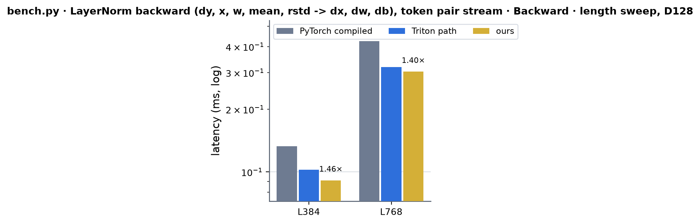 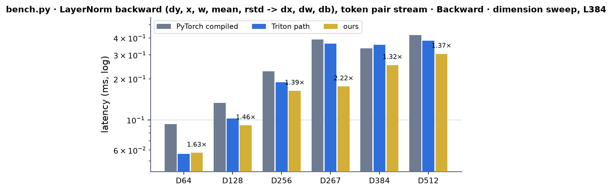 <!-- measure_bars -->

### Module-level effect (bench.py level=module, CUDA graph, A = 5 inference / 48 training; the same frozen snapshot, norms on / off)

The default dispatch (miniworld arm) with the A100 norm kernels (`MINIWORLD_NORMS_SM80` unset) against the same arm with `MINIWORLD_NORMS_SM80=0` (the Triton norm kernels); milliseconds, jobs 63150 (transition, L384 / L768),
63224 (swa_atom_attention, transition width sweep), 63234 (triangle_multiplication). The two runs are separate processes (spread ~1 %): differences below 1 % are noise.

| module (D = 128 unless noted) | mode | shapes | norms on | norms off | on / off |
|---|---|---|---|---|---|
| SWA atom attention (qk-norm + RoPE) | inference | 1024 / 4096 / 7168 atoms | 0.0471 / 0.1147 / 0.1864 | 0.0481 / 0.1167 / 0.1884 | 0.98 / 0.98 / 0.99 |
| SWA atom attention | training | the same | 0.7721 / 2.9399 / 5.0156 | 0.7721 / 2.9399 / 5.0156 | identical (not discriminating) |
| Transition (A100 fused kernel) | inference | L384 / L768 | 0.2765 / 1.0936 | 0.2765 / 1.0936 | 1.00 (the fused kernel normalises inside) |
| Transition | training | L384 / L768 | 1.4438 / 5.6238 | 1.4438 / 5.6238 | 1.00 |
| Transition, split path, D = 64 / 256 / 384 | inference | L384 | 0.2314 / 1.6435 / 3.4826 | 0.2314 / 1.6435 / 3.4826 | 1.00 |
| Transition, split path, D = 64 / 256 / 384 | training | L384 | 0.9308 / 5.8460 / 11.7473 | 0.9334 / 5.8696 / 11.8917 | 1.00 / 1.00 / 0.99 |
| TriangleMultiplication (A100 CUDA front) | inference | L384 / L768 | 0.3441 / 1.6036 | 0.3441 / 1.6036 | 1.00 |
| TriangleMultiplication | training | L384 / L768 | 1.5099 / 6.5219 | 1.4971 / 6.4840 | 1.01 / 1.01 (noise) |

LayerNorm is the first step of Transition and TriangleMultiplication, but their A100 paths do not reach the standalone LayerNorm in inference: the Transition runs `kernels/transition/cuda/fused_sm80.py` (it normalises inside) and the TriMul its CUDA front, so the switch
changes nothing there (identical inference rows) and at most +-1 % in training, where the split Transition (D != 128) and the other `LayerNorm` modules go through the CUDA rows. For reference the same runs' other arms: Transition (L384 / L768) inference PyTorch compiled
0.9595 / 3.7688, Triton 0.2755 / 1.0588, training 2.4402 / 9.3476, 1.4418 / 5.6325; TriangleMultiplication inference 1.3763 / 11.3700, 0.5018 / 2.1309, training 4.2609 / 33.2503, 1.9379 / 7.9048 (PyTorch compiled, Triton). The SWA attention's training rows came
out identical in the two runs and cannot be read as an effect (the fused kernels' training gain in the probes, 23 us of the 772 us step at 1024 atoms, would show as 3 %).

### Token pair stream (1, L, L, D), has_bias = 1 · Inference

| (Length, Dimension) | PyTorch compiled | Triton path | ours | × |
|---|---|---|---|---|
| (384, 64) | 0.0209 | 0.0244 | 0.0236 | 0.89 |
| (768, 64) | 0.0931 | 0.0979 | 0.0933 | 1.00 |
| (384, 128) | 0.0486 | 0.0494 | 0.0488 | 1.00 |
| (768, 128) | 0.1842 | 0.1884 | 0.1819 | 1.01 |
| (384, 256) | 0.0938 | 0.095 | 0.0919 | 1.02 |
| (768, 256) | 0.3644 | 0.3743 | 0.3616 | 1.01 |
| (384, 267) | 0.1321 | 0.2121 | 0.1172 | 1.13 |
| (768, 267) | 0.5165 | 0.8488 | 0.4842 | 1.07 |
| (384, 384) | 0.1389 | 0.1649 | 0.1363 | 1.02 |
| (768, 384) | 0.5425 | 0.6483 | 0.5356 | 1.01 |
| (384, 512) | 0.1843 | 0.1842 | 0.1809 | 1.02 |
| (768, 512) | 0.725 | 0.8174 | 0.715 | 1.01 |

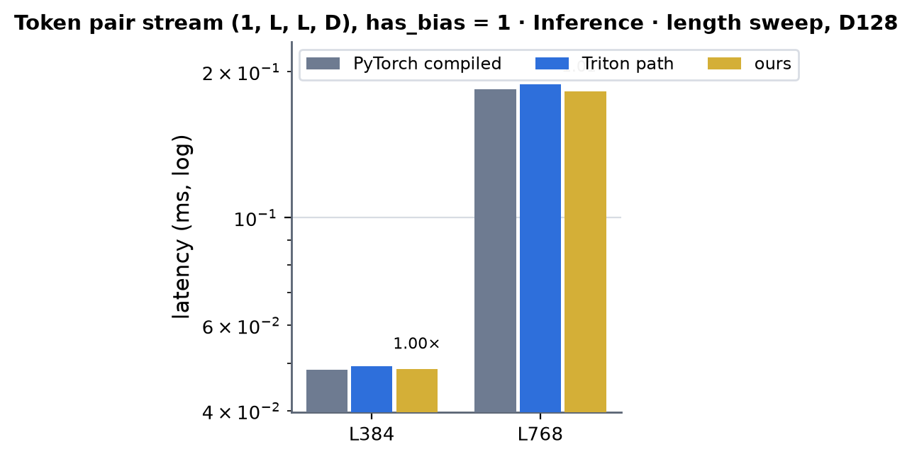 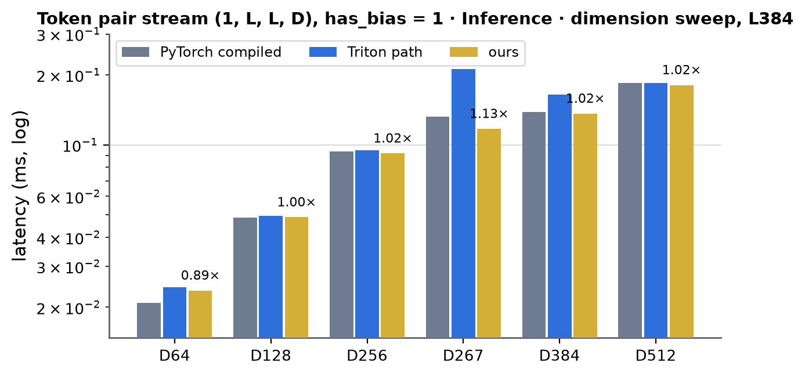 <!-- measure_bars -->

### Token single stream (1, L, D), has_bias = 1 · Inference

| (Length, Dimension) | PyTorch compiled | Triton path | ours | × |
|---|---|---|---|---|
| (128, 384) | 0.0027 | 0.0031 | 0.0033 | 0.82 |
| (384, 384) | 0.0029 | 0.0035 | 0.0033 | 0.88 |
| (768, 384) | 0.0036 | 0.0059 | 0.0037 | 0.97 |
| (128, 451) | 0.0029 | 0.0088 | 0.0031 | 0.94 |
| (384, 451) | 0.0036 | 0.009 | 0.0035 | 1.03 |
| (768, 451) | 0.0041 | 0.0092 | 0.0038 | 1.08 |
| (128, 768) | 0.0029 | 0.0044 | 0.0035 | 0.83 |
| (384, 768) | 0.0035 | 0.0041 | 0.004 | 0.88 |
| (768, 768) | 0.0037 | 0.0095 | 0.0042 | 0.88 |
| (128, 831) | 0.0033 | 0.0132 | 0.0036 | 0.92 |
| (384, 831) | 0.0045 | 0.0137 | 0.004 | 1.12 |
| (768, 831) | 0.0047 | 0.0142 | 0.0045 | 1.04 |
| (128, 833) | 0.0035 | 0.0138 | 0.0036 | 0.97 |
| (384, 833) | 0.0045 | 0.0145 | 0.0038 | 1.18 |
| (768, 833) | 0.0047 | 0.0151 | 0.0046 | 1.02 |
| (128, 2560) | 0.0051 | 0.0266 | 0.0083 | 0.61 |
| (384, 2560) | 0.0082 | 0.027 | 0.0102 | 0.80 |
| (768, 2560) | 0.0128 | 0.0274 | 0.0147 | 0.87 |

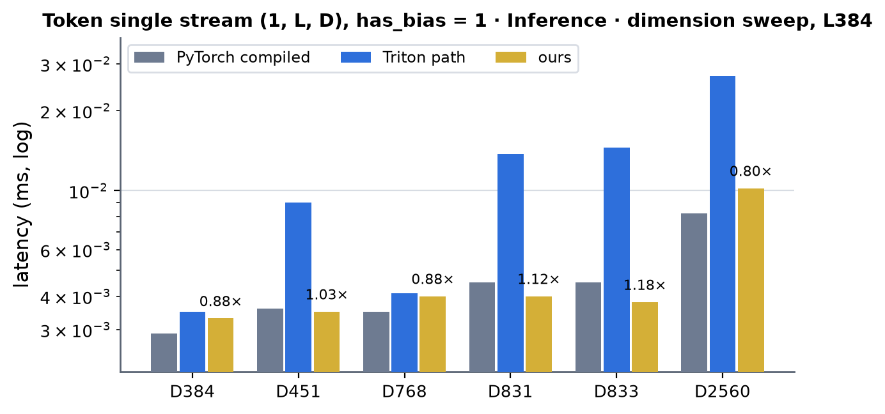 <!-- measure_bars -->

### Token single stream, A = 5 / 48 (A, L, D) · Inference

| (Length, Dimension) | PyTorch compiled | Triton path | ours | × |
|---|---|---|---|---|
| (128, 768) | 0.0037 | 0.0097 | 0.0041 | 0.90 |
| (384, 768) | 0.005 | 0.0102 | 0.0058 | 0.86 |
| (768, 768) | 0.007 | 0.0127 | 0.0084 | 0.83 |

### MSA stream (1, 8, L, D) · Inference

| (Length, Dimension) | PyTorch compiled | Triton path | ours | × |
|---|---|---|---|---|
| (128, 64) | 0.0027 | 0.0031 | 0.0027 | 1.00 |
| (384, 64) | 0.0028 | 0.0031 | 0.0029 | 0.97 |
| (768, 64) | 0.0032 | 0.004 | 0.0033 | 0.97 |
| (128, 128) | 0.0029 | 0.0035 | 0.0029 | 1.00 |
| (384, 128) | 0.0032 | 0.0036 | 0.0033 | 0.97 |
| (768, 128) | 0.0038 | 0.0036 | 0.0041 | 0.93 |

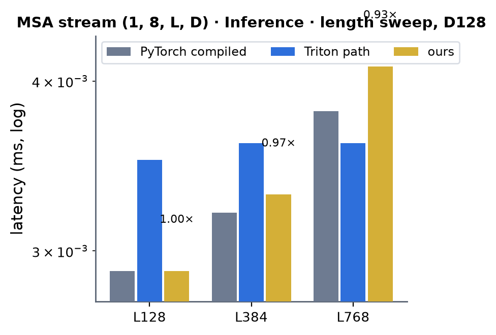 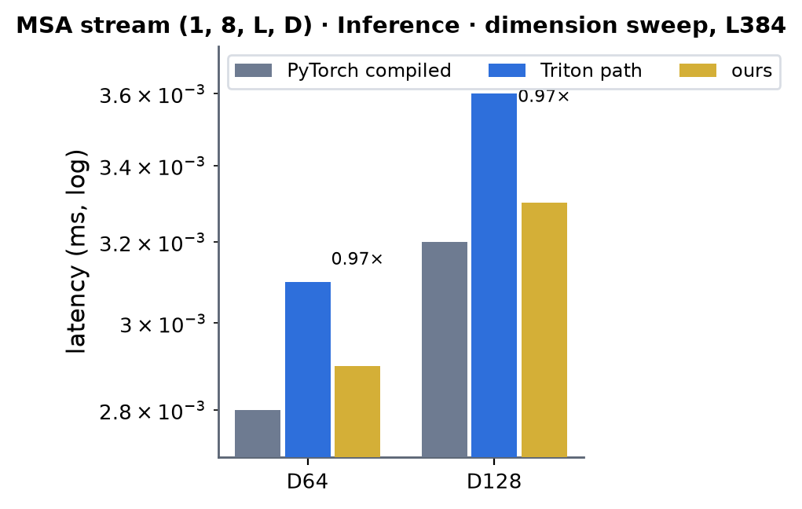 <!-- measure_bars -->

### Atom single stream, A = 5 / 48 (A, N atoms, 128), has_bias = 1 · Inference

| (Length, Dimension) | PyTorch compiled | Triton path | ours | × |
|---|---|---|---|---|
| (1024, 128) | 0.0064 | 0.0035 | 0.0038 | 1.68 |
| (4096, 128) | 0.0079 | 0.0067 | 0.0067 | 1.18 |
| (8192, 128) | 0.0128 | 0.0104 | 0.0102 | 1.25 |

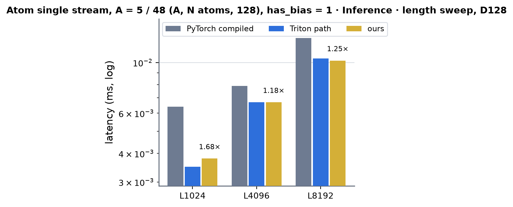 <!-- measure_bars -->

### Atom pair stream (1, N / 32, 32, 128, 16) · Inference

| (Length, Dimension) | PyTorch compiled | Triton path | ours | × |
|---|---|---|---|---|
| (1024, 16) | 0.0058 | 0.0123 | 0.0049 | 1.18 |
| (4096, 16) | 0.0161 | 0.0396 | 0.0178 | 0.90 |
| (8192, 16) | 0.0436 | 0.0746 | 0.0424 | 1.03 |

### Noise embedding (A, 1, 256), A = 5 / 48 · Inference

| (Length, Dimension) | PyTorch compiled | Triton path | ours | × |
|---|---|---|---|---|
| (1, 256) | 0.0024 | 0.0041 | 0.0023 | 1.04 |

### Noise embedding (A, 1, 256), has_bias = 1 · Inference

| (Length, Dimension) | PyTorch compiled | Triton path | ours | × |
|---|---|---|---|---|
| (1, 256) | 0.0023 | 0.0029 | 0.0026 | 0.88 |

### Token pair stream (1, L, L, D), has_bias = 1 · Training

| (Length, Dimension) | PyTorch compiled | Triton path | ours | × |
|---|---|---|---|---|
| (384, 64) | 0.0899 | 0.0714 | 0.0728 | 1.23 |
| (768, 64) | 0.272 | 0.2391 | 0.2414 | 1.13 |
| (384, 128) | 0.1592 | 0.1399 | 0.128 | 1.24 |
| (768, 128) | 0.5431 | 0.4787 | 0.4621 | 1.18 |
| (384, 256) | 0.2975 | 0.2611 | 0.24 | 1.24 |
| (768, 256) | 1.058 | 1.096 | 0.9073 | 1.17 |
| (384, 267) | 0.3505 | 0.5667 | 0.2829 | 1.24 |
| (768, 267) | 1.281 | 2.347 | 1.096 | 1.17 |
| (384, 384) | 0.3887 | 0.4547 | 0.3698 | 1.05 |
| (768, 384) | 1.435 | 1.813 | 1.407 | 1.02 |
| (384, 512) | 0.4973 | 0.5412 | 0.4627 | 1.07 |
| (768, 512) | 1.854 | 2.553 | 1.79 | 1.04 |

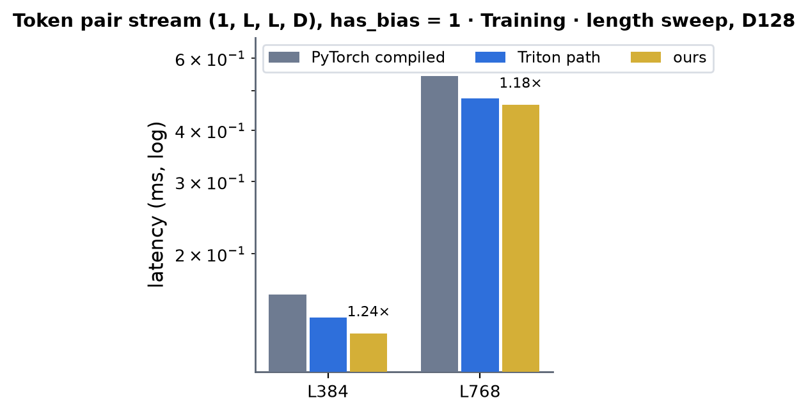 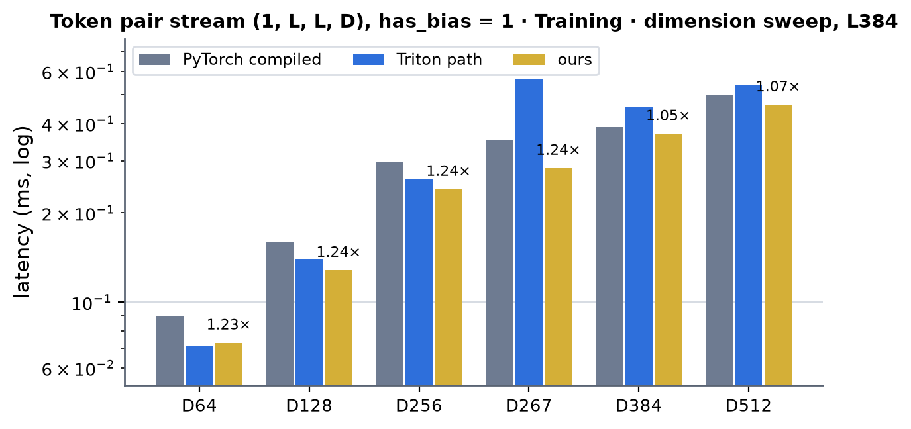 <!-- measure_bars -->

### Token single stream (1, L, D), has_bias = 1 · Training

| (Length, Dimension) | PyTorch compiled | Triton path | ours | × |
|---|---|---|---|---|
| (128, 384) | 0.0078 | 0.0087 | 0.009 | 0.87 |
| (384, 384) | 0.0137 | 0.0109 | 0.012 | 1.14 |
| (768, 384) | 0.0145 | 0.0178 | 0.0131 | 1.11 |
| (128, 451) | 0.0091 | 0.0197 | 0.0096 | 0.95 |
| (384, 451) | 0.0143 | 0.0218 | 0.0102 | 1.40 |
| (768, 451) | 0.0157 | 0.023 | 0.012 | 1.31 |
| (128, 768) | 0.0082 | 0.0113 | 0.0113 | 0.73 |
| (384, 768) | 0.0147 | 0.0142 | 0.0142 | 1.04 |
| (768, 768) | 0.0179 | 0.0307 | 0.0163 | 1.10 |
| (128, 831) | 0.0095 | 0.0282 | 0.0114 | 0.83 |
| (384, 831) | 0.0164 | 0.0317 | 0.012 | 1.37 |
| (768, 831) | 0.0186 | 0.0346 | 0.0141 | 1.32 |
| (128, 833) | 0.0095 | 0.0291 | 0.0115 | 0.83 |
| (384, 833) | 0.0165 | 0.0329 | 0.012 | 1.38 |
| (768, 833) | 0.0186 | 0.0362 | 0.0141 | 1.32 |
| (128, 2560) | 0.0131 | 0.0576 | 0.0218 | 0.60 |
| (384, 2560) | 0.0243 | 0.0676 | 0.0242 | 1.00 |
| (768, 2560) | 0.0357 | 0.0829 | 0.038 | 0.94 |

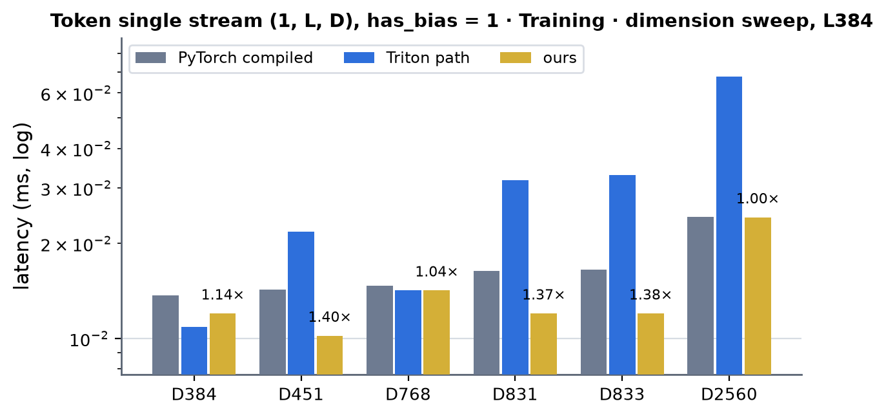 <!-- measure_bars -->

### Token single stream, A = 5 / 48 (A, L, D) · Training

| (Length, Dimension) | PyTorch compiled | Triton path | ours | × |
|---|---|---|---|---|
| (128, 768) | 0.0634 | 0.0561 | 0.0495 | 1.28 |
| (384, 768) | 0.1955 | 0.1612 | 0.1267 | 1.54 |
| (768, 768) | 0.3603 | 0.3057 | 0.2239 | 1.61 |

### MSA stream (1, 8, L, D) · Training

| (Length, Dimension) | PyTorch compiled | Triton path | ours | × |
|---|---|---|---|---|
| (128, 64) | 0.0123 | 0.0077 | 0.0079 | 1.56 |
| (384, 64) | 0.0127 | 0.0095 | 0.0101 | 1.26 |
| (768, 64) | 0.0142 | 0.0108 | 0.0106 | 1.34 |
| (128, 128) | 0.0123 | 0.0097 | 0.01 | 1.23 |
| (384, 128) | 0.0152 | 0.0111 | 0.0106 | 1.43 |
| (768, 128) | 0.0157 | 0.0116 | 0.0127 | 1.24 |

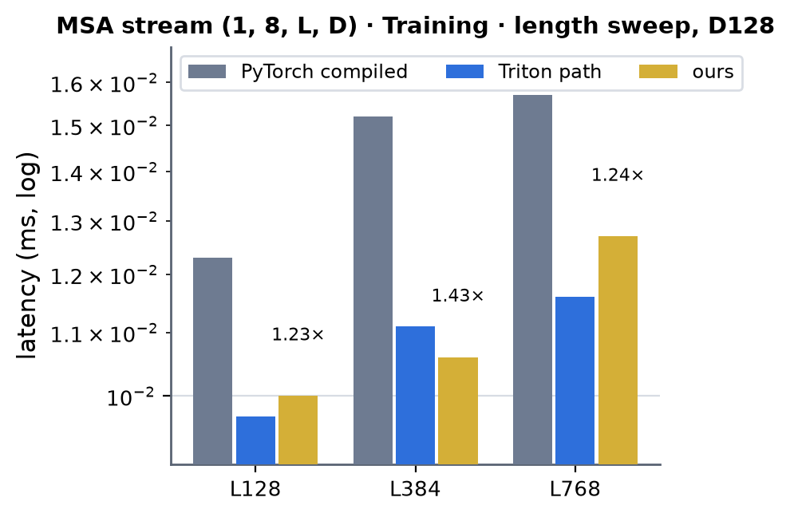 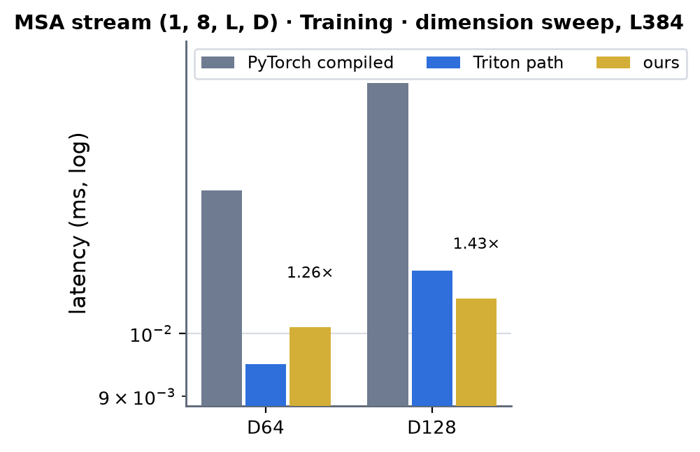 <!-- measure_bars -->

### Atom single stream, A = 5 / 48 (A, N atoms, 128), has_bias = 1 · Training

| (Length, Dimension) | PyTorch compiled | Triton path | ours | × |
|---|---|---|---|---|
| (1024, 128) | 0.0694 | 0.0563 | 0.0475 | 1.46 |
| (4096, 128) | 0.2068 | 0.1807 | 0.1638 | 1.26 |
| (8192, 128) | 0.3653 | 0.3264 | 0.3135 | 1.17 |

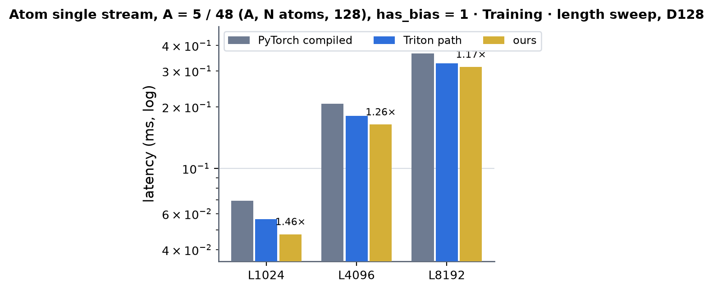 <!-- measure_bars -->

### Atom pair stream (1, N / 32, 32, 128, 16) · Training

| (Length, Dimension) | PyTorch compiled | Triton path | ours | × |
|---|---|---|---|---|
| (1024, 16) | 0.0314 | 0.0398 | 0.018 | 1.74 |
| (4096, 16) | 0.0874 | 0.1388 | 0.0632 | 1.38 |
| (8192, 16) | 0.1567 | 0.2673 | 0.1204 | 1.30 |

### Noise embedding (A, 1, 256), A = 5 / 48 · Training

| (Length, Dimension) | PyTorch compiled | Triton path | ours | × |
|---|---|---|---|---|
| (1, 256) | 0.0065 | 0.0105 | 0.0083 | 0.78 |

### Noise embedding (A, 1, 256), has_bias = 1 · Training

| (Length, Dimension) | PyTorch compiled | Triton path | ours | × |
|---|---|---|---|---|
| (1, 256) | 0.0074 | 0.0095 | 0.0095 | 0.78 |

### RMSNorm + adaLN modulation (`ops.rms_norm_modulation`, atom stream, d_hidden = d_cond = 128) · Inference (A = 5, M = 5 N rows)

`probes/adamod_perf.py` (CUDA graph, one process; the module has no kernel-level bench target). PyTorch compiled = the norm, three `F.linear` and the modulation in one `torch.compile`d function; the Triton path =
`triton_rmsnorm_adamod`; × = PyTorch compiled / ours. Job 63192.

| (Length, Dimension) | PyTorch compiled | Triton path | ours | × |
|---|---|---|---|---|
| (1024, 128) | 0.0224 | 0.0096 | 0.0102 | 2.20 |
| (2048, 128) | 0.0305 | 0.022 | 0.0154 | 1.98 |
| (3072, 128) | 0.0457 | 0.0348 | 0.0206 | 2.22 |
| (4096, 128) | 0.0402 | 0.0305 | 0.0216 | 1.86 |
| (5120, 128) | 0.0474 | 0.0334 | 0.0266 | 1.78 |
| (6144, 128) | 0.0658 | 0.0433 | 0.0328 | 2.01 |
| (7168, 128) | 0.0735 | 0.0506 | 0.0392 | 1.87 |
| (8192, 128) | 0.0771 | 0.0531 | 0.0407 | 1.89 |

 <!-- measure_bars -->

### RMSNorm + adaLN modulation · Training (A = 48, M = 48 N rows; forward + backward through q, c, the three weights)

| (Length, Dimension) | PyTorch compiled | Triton path | ours | × |
|---|---|---|---|---|
| (1024, 128) | 0.3144 | 0.2463 | 0.204 | 1.54 |
| (2048, 128) | 0.6525 | 0.4442 | 0.3726 | 1.75 |
| (3072, 128) | 0.9411 | 0.6356 | 0.5344 | 1.76 |
| (4096, 128) | 1.214 | 0.8539 | 0.6925 | 1.75 |
| (5120, 128) | 1.506 | 1.060 | 0.8684 | 1.73 |
| (6144, 128) | 1.778 | 1.263 | 1.030 | 1.73 |
| (7168, 128) | 2.067 | 1.497 | 1.204 | 1.72 |
| (8192, 128) | 2.336 | 1.720 | 1.370 | 1.70 |

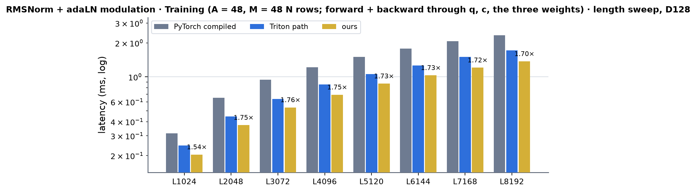 <!-- measure_bars -->

Speed of light (bytes / 1.6 TB/s): inference 32 % (1024 atoms: the 96 KB of weights every persistent CTA fetches outweigh the 5 MB of activations) to 64 % (8192 atoms) of the floor of q, c in and y, gate out; training 78 - 93 % of the floor of
the forward (1 KB a row) plus the backward's operands (~4.2 KB a row), the weight-gradient GEMMs included. At 1024 atoms (5120 rows) inference ours is 6 % behind the Triton path (10.2 vs 9.6 us; 10.5 before the weights were staged one cp.async group
at a time); from 2048 atoms on it is 1.26 - 1.7x ahead in inference.

### Fused Q/K RMSNorm + RoPE, A = 5 (SWA atom attention; q, k views of the interleaved QKV projection, 4 heads x 32) · Inference

`probes/rope_perf.py` (job 63048); the length is the atom count. Triton path = `qk_norm_rope_3d` (Triton); PyTorch compiled = RMSNorm + `apply_rotary_emb_3d` on q and k.

| (Length, Dimension) | PyTorch compiled | Triton path | ours | × |
|---|---|---|---|---|
| (1024, 32) | 0.0047 | 0.0059 | 0.0058 | 0.81 |
| (4096, 32) | 0.0099 | 0.0157 | 0.0161 | 0.61 |
| (8192, 32) | 0.0323 | 0.0338 | 0.0321 | 1.01 |

### Fused Q/K RMSNorm + RoPE, A = 48 · Inference

| (Length, Dimension) | PyTorch compiled | Triton path | ours | × |
|---|---|---|---|---|
| (1024, 32) | 0.0383 | 0.0367 | 0.0366 | 1.05 |
| (4096, 32) | 0.137 | 0.1422 | 0.1407 | 0.97 |
| (8192, 32) | 0.2751 | 0.2701 | 0.2769 | 0.99 |

### Fused Q/K RMSNorm + RoPE, A = 5 · Training (forward + backward through the QKV projection's q, k views)

| (Length, Dimension) | PyTorch compiled | Triton path | ours | × |
|---|---|---|---|---|
| (1024, 32) | 0.0398 | 0.0404 | 0.038 | 1.05 |
| (4096, 32) | 0.2433 | 0.1352 | 0.1228 | 1.98 |
| (8192, 32) | 0.2527 | 0.2595 | 0.2396 | 1.05 |

### Fused Q/K RMSNorm + RoPE, A = 48 · Training

| (Length, Dimension) | PyTorch compiled | Triton path | ours | × |
|---|---|---|---|---|
| (1024, 32) | 0.3013 | 0.3068 | 0.2839 | 1.06 |
| (4096, 32) | 1.162 | 1.162 | 1.098 | 1.06 |
| (8192, 32) | 2.310 | 2.315 | 2.191 | 1.05 |

The fused op moves 1 KB a position (q, k in and out) plus the fp32 angle tables (cos, sin: 128 B a position): at A = 48, 8192 atoms inference is 277 us for 452 MB, the byte floor (283 us); training has the same shape of floor.
Inference is the memory-bound parity case (ours = the Triton kernel within 3 %, PyTorch compiled equal where the tensors fit L2, 0.6x at A = 5, 4096 atoms where PyTorch compiled's single fused kernel is L2-warm); the fused backward
is the gain (1.05 - 1.06x PyTorch compiled and the Triton path; at A = 5 / 4096 atoms PyTorch compiled's backward is 1.8x slower than both kernels). The standalone `rope_3d` rotation (`kernels/rope/cuda/sm80.py`; no module calls it)
is 1.12 - 1.23x faster than the Triton kernel in training and 5 % faster in inference at A = 48, but 3 - 19 % slower in inference at A = 5 (8.2 vs 6.9 us at 4096 atoms, 14.3 vs 12.7 at 8192).

### RMSNorm rows (`RMSNorm.forward`, no weight for the q / k head norms, a weight for the tri-attn rows; bf16) -- probe, no bench target

`probes/rms_perf.py` (job 63048), PyTorch compiled / Triton path / ours in us, rows of the shape's tensor; 1.6 TB/s byte floors of 4 B (inference) and 10 B (training) an element.

| case | rows x width | inference: PyTorch compiled / Triton / ours | training: PyTorch compiled / Triton / ours |
|---|---|---|---|
| q / k head norm, 1024 atoms, A = 5 / 48 | 20480 x 32 | 4.1 / 4.0 / 2.9 | 45.7 / 42.0 / 43.6 |
| q / k head norm, 4096 atoms | 81920 x 32 | 4.9 / 5.1 / 5.6 | 170.0 / 160.9 / 159.5 |
| q / k head norm, 8192 atoms | 163840 x 32 | 8.6 / 8.2 / 8.6 | 308.4 / 309.0 / 309.0 |
| 64-wide head norm, 1024 atoms | 20480 x 64 | 4.5 / 4.6 / 3.6 | 195.3 / 83.2 / 84.5 |
| 64-wide head norm, 8192 atoms | 163840 x 64 | 23.7 / 27.1 / 26.2 | 606.5 / 598.4 / 601.5 |
| width 128 (DiT), 1024 atoms | 5120 x 128 | 3.5 / 3.8 / 3.5 | 56.6 / 46.8 / 44.5 |
| width 128, 4096 atoms | 20480 x 128 | 4.9 / 5.5 / 6.0 | 190.6 / 158.6 / 164.6 |
| width 128, 8192 atoms | 40960 x 128 | 7.3 / 8.1 / 8.3 | 352.4 / 313.9 / 308.2 |
| tri-attn q / k norm, L384, 32 wide, weight | 589824 x 32 | 48.6 / 50.3 / 47.9 | 154.2 / 122.5 / 125.4 |
| tri-attn q / k norm, L384, 128 wide, weight | 589824 x 128 | 184.6 / 186.9 / 180.9 | 519.9 / 454.3 / 455.3 |
| tri-attn q / k norm, L768, 32 wide, weight | 2359296 x 32 | 184.8 / 185.5 / 180.2 | 510.1 / 460.8 / 461.3 |
| tri-attn q / k norm, L768, 128 wide, weight | 2359296 x 128 | 726.3 / 729.6 / 720.8 | 2015 / 1778 / 1778 |

RMSNorm shares K1 / K2, so it is at the byte floor where the tensors exceed L2 (training 88 - 106 % of the floor, above 100 % where inputs stay L2-resident across the graph's repeated calls) and a small-row launch-bound kernel below ~20 K rows; it is not a
registry row, and the mid-size inference rows (4096 atoms at 32 wide, 5.6 us against 5.1 for Triton; 128 wide, 6.0 against 5.5) are the one place it trails the Triton kernel by ~10 % (0.5 us: the policy of K1 was tuned on LayerNorm).

### Speed of light (byte floor: bytes / 1.6 TB/s; 4 B an element forward, 10 B an element forward + backward, plus the row statistics)

Ours is the probe's time (CUDA-graph replay: it includes ~2.7 us of launch latency a profiled replay does not). Above 100 % the operands stay L2-resident across the graph's repeated calls.

#### SoL, Token pair stream (1, L, L, D), has_bias = 1

| (Length, Dimension) | rows (inference / training) | inference ours (µs) | byte floor (µs) | SoL | training ours (µs) | byte floor (µs) | SoL |
|---|---|---|---|---|---|---|---|
| (384, 64) | 147456 | 23.6 | 23.6 | 100 % | 72.8 | 59.0 | 81 % |
| (768, 64) | 589824 | 93.3 | 94.4 | 101 % | 241.4 | 235.9 | 98 % |
| (384, 128) | 147456 | 48.8 | 47.2 | 97 % | 128.0 | 118.0 | 92 % |
| (768, 128) | 589824 | 181.9 | 188.7 | 104 % | 462.1 | 471.9 | 102 % |
| (384, 256) | 147456 | 91.9 | 94.4 | 103 % | 240.0 | 235.9 | 98 % |
| (768, 256) | 589824 | 361.6 | 377.5 | 104 % | 907.3 | 943.7 | 104 % |
| (384, 267) | 147456 | 117.2 | 98.4 | 84 % | 282.9 | 246.1 | 87 % |
| (768, 267) | 589824 | 484.2 | 393.7 | 81 % | 1096.4 | 984.3 | 90 % |
| (384, 384) | 147456 | 136.3 | 141.6 | 104 % | 369.8 | 353.9 | 96 % |
| (768, 384) | 589824 | 535.6 | 566.2 | 106 % | 1406.7 | 1415.6 | 101 % |
| (384, 512) | 147456 | 180.9 | 188.7 | 104 % | 462.7 | 471.9 | 102 % |
| (768, 512) | 589824 | 715.0 | 755.0 | 106 % | 1790.0 | 1887.4 | 105 % |

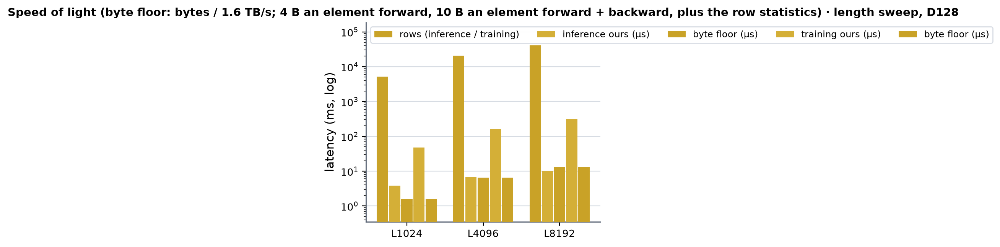 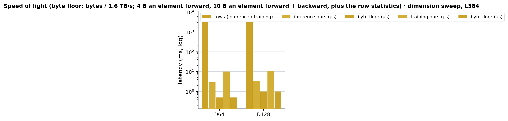 <!-- measure_bars -->

#### SoL, Token single stream (1, L, D), has_bias = 1

| (Length, Dimension) | rows (inference / training) | inference ours (µs) | byte floor (µs) | SoL | training ours (µs) | byte floor (µs) | SoL |
|---|---|---|---|---|---|---|---|
| (128, 384) | 128 | 3.3 | 0.1 | 4 % | 9.0 | 0.3 | 3 % |
| (384, 384) | 384 | 3.3 | 0.4 | 11 % | 12.0 | 0.9 | 8 % |
| (768, 384) | 768 | 3.7 | 0.7 | 20 % | 13.1 | 1.8 | 14 % |
| (128, 451) | 128 | 3.1 | 0.1 | 5 % | 9.6 | 0.4 | 4 % |
| (384, 451) | 384 | 3.5 | 0.4 | 12 % | 10.2 | 1.1 | 11 % |
| (768, 451) | 768 | 3.8 | 0.9 | 23 % | 12.0 | 2.2 | 18 % |
| (128, 768) | 128 | 3.5 | 0.2 | 7 % | 11.3 | 0.6 | 6 % |
| (384, 768) | 384 | 4.0 | 0.7 | 19 % | 14.2 | 1.8 | 13 % |
| (768, 768) | 768 | 4.2 | 1.5 | 35 % | 16.3 | 3.7 | 23 % |
| (128, 831) | 128 | 3.6 | 0.3 | 7 % | 11.4 | 0.7 | 6 % |
| (384, 831) | 384 | 4.0 | 0.8 | 20 % | 12.0 | 2.0 | 17 % |
| (768, 831) | 768 | 4.5 | 1.6 | 36 % | 14.1 | 4.0 | 28 % |
| (128, 833) | 128 | 3.6 | 0.3 | 7 % | 11.5 | 0.7 | 6 % |
| (384, 833) | 384 | 3.8 | 0.8 | 21 % | 12.0 | 2.0 | 17 % |
| (768, 833) | 768 | 4.6 | 1.6 | 35 % | 14.1 | 4.0 | 28 % |
| (128, 2560) | 128 | 8.3 | 0.8 | 10 % | 21.8 | 2.0 | 9 % |
| (384, 2560) | 384 | 10.2 | 2.5 | 24 % | 24.2 | 6.1 | 25 % |
| (768, 2560) | 768 | 14.7 | 4.9 | 33 % | 38.0 | 12.3 | 32 % |

 <!-- measure_bars -->

#### SoL, Token single stream, A = 5 / 48 (A, L, D)

| (Length, Dimension) | rows (inference / training) | inference ours (µs) | byte floor (µs) | SoL | training ours (µs) | byte floor (µs) | SoL |
|---|---|---|---|---|---|---|---|
| (128, 768) | 640 | 4.1 | 1.2 | 30 % | 49.5 | 29.5 | 60 % |
| (384, 768) | 1920 | 5.8 | 3.7 | 64 % | 126.7 | 88.5 | 70 % |
| (768, 768) | 3840 | 8.4 | 7.4 | 87 % | 223.9 | 176.9 | 79 % |

#### SoL, MSA stream (1, 8, L, D)

| (Length, Dimension) | rows (inference / training) | inference ours (µs) | byte floor (µs) | SoL | training ours (µs) | byte floor (µs) | SoL |
|---|---|---|---|---|---|---|---|
| (128, 64) | 1024 | 2.7 | 0.2 | 6 % | 7.9 | 0.4 | 5 % |
| (384, 64) | 3072 | 2.9 | 0.5 | 17 % | 10.1 | 1.2 | 12 % |
| (768, 64) | 6144 | 3.3 | 1.0 | 30 % | 10.6 | 2.5 | 23 % |
| (128, 128) | 1024 | 2.9 | 0.3 | 11 % | 10.0 | 0.8 | 8 % |
| (384, 128) | 3072 | 3.3 | 1.0 | 30 % | 10.6 | 2.5 | 23 % |
| (768, 128) | 6144 | 4.1 | 2.0 | 48 % | 12.7 | 4.9 | 39 % |

  <!-- measure_bars -->

#### SoL, Atom single stream, A = 5 / 48 (A, N atoms, 128), has_bias = 1

| (Length, Dimension) | rows (inference / training) | inference ours (µs) | byte floor (µs) | SoL | training ours (µs) | byte floor (µs) | SoL |
|---|---|---|---|---|---|---|---|
| (1024, 128) | 5120 | 3.8 | 1.6 | 43 % | 47.5 | 39.3 | 83 % |
| (4096, 128) | 20480 | 6.7 | 6.6 | 98 % | 163.8 | 157.3 | 96 % |
| (8192, 128) | 40960 | 10.2 | 13.1 | 128 % | 313.5 | 314.6 | 100 % |

 <!-- measure_bars -->

#### SoL, Atom pair stream (1, N / 32, 32, 128, 16)

| (Length, Dimension) | rows (inference / training) | inference ours (µs) | byte floor (µs) | SoL | training ours (µs) | byte floor (µs) | SoL |
|---|---|---|---|---|---|---|---|
| (1024, 16) | 131072 | 4.9 | 5.2 | 108 % | 18.0 | 13.1 | 73 % |
| (4096, 16) | 524288 | 17.8 | 21.0 | 118 % | 63.2 | 52.4 | 83 % |
| (8192, 16) | 1048576 | 42.4 | 41.9 | 99 % | 120.4 | 104.9 | 87 % |

#### SoL, Noise embedding (A, 1, 256), A = 5 / 48

| (Length, Dimension) | rows (inference / training) | inference ours (µs) | byte floor (µs) | SoL | training ours (µs) | byte floor (µs) | SoL |
|---|---|---|---|---|---|---|---|
| (1, 256) | 5 | 2.3 | 0.0 | 0 % | 8.3 | 0.1 | 1 % |

#### SoL, Noise embedding (A, 1, 256), has_bias = 1

| (Length, Dimension) | rows (inference / training) | inference ours (µs) | byte floor (µs) | SoL | training ours (µs) | byte floor (µs) | SoL |
|---|---|---|---|---|---|---|---|
| (1, 256) | 5 | 2.6 | 0.0 | 0 % | 9.5 | 0.1 | 1 % |

### Where the time goes (`torch.profiler` CUPTI kernel times, one process, microseconds per training step, job 63192; `probes/prof_docs.py`)

Floors = bytes / 1.6 TB/s: forward 4 B an element (x in, y out), backward 6 B an element (dy, x, dx) + 8 B a row of statistics.

| training step | kernels (us) | sum | floor | of floor |
|---|---|---|---|---|
| LayerNorm token pair L384, 128 wide (147456 rows) | `bwd_vec` 77.4 (work counter), `fwd_vec` 44.9 (two groups a warp), `reduce_partials4` 4.0, counter fill 1.8 | 128.1 | 118.7 | 93 % |
| the same, 267 wide (staged path) | `bwd_stage` 156.0, `fwd_stage` 117.8, `reduce_partials` 5.2 | 278.9 | 246.5 | 88 % |
| LayerNorm atom single L4096 A = 48, 128 wide (196608 rows) | `bwd_vec` 100.1, `fwd_vec` 60.4, `reduce_partials4` 4.0, fill 1.8 | 166.3 | 158.3 | 95 % |
| LayerNorm atom pair L4096, 16 wide (524288 rows) | `bwd_vec` 40.4, `fwd_vec` 19.7 (four groups a warp), `reduce_partials4` 3.3 | 63.4 | 55.4 | 87 % |
| LayerNorm token single L384, 768 wide (384 rows) | `bwd_vec` 8.2, `fwd_vec` 3.9, `reduce_partials4` 3.5 | 15.6 | 1.8 | 12 % |
| LayerNorm token single L384, 451 wide (scalar path) | `bwd_scalar_reg` 4.7, `fwd_scalar` 3.5, `reduce_partials` 3.2 | 11.3 | 1.1 | 10 % |
| RMSNorm head 32, A = 48, 4096 atoms (786432 rows) | `bwd_vec` 98.4, `fwd_vec` 58.7, fill 1.8 | 158.9 | 157.2 | 99 % |
| fused Q/K RMSNorm + RoPE, A = 48, 4096 atoms | `rope_kernel` backward 172.0, forward 138.7 (+ torch's cat / elementwise for the q, k, v views' gradient, 460 + 331 us, not ours) | 310.7 | 345 | 111 % (L2) |
| `rms_norm_modulation`, A = 48, 4096 atoms (196608 rows) | `adamod_bwd` 257.5, `adamod_fwd` 163.9, cuBLAS dc 135.1, cuBLAS dW 127.1 (+ split-K reduce 4.3, a cat 4.0) | 691.9 | 584 (kernels 126 + 252, GEMMs 126 + 80) | 84 % |

The big rows are at their byte floors (87 - 99 %; above 100 % where an operand stays L2-resident across the graph's repeated calls); the pair-stream 267-wide staged path runs at 88 % (the tile copy-in and copy-out do not overlap across
CTAs). The token-single rows (384 / 451 / 768 rows) are three launches of 3 - 8 us each: a launch costs ~2.7 us (an empty kernel's CUPTI duration) and the dw / db reduction is its own launch. The modulation step is 40 % GEMMs (cuBLAS over the
stacked gradient: the dc product is memory-bound at 93 %, the dW product runs at 63 % of the 240 TFLOP/s ceiling for its K = 196608).

### What was tried and did not pay (2026-10-04)

- **A persistent forward** (a grid-stride loop with the weight and bias held in registers for the whole loop) against the one-shot grid: 4-8 % slower at every size above ~1 M elements in the sandbox
  (`probes/ln_variants.cu`; the hardware balances a one-shot grid of 128-thread CTAs better than a persistent loop does). The `.cs` / `.nc` cache hints on the loads and stores cost another 2-4 %,
  a software prefetch of the next group's loads inside the persistent loop won back ~3 % of its loss but stayed behind the one-shot grid, and CTAs of 64 / 128 / 256 threads are equal (32 threads: 20 % slower).
- **Fatter lane groups** (4 or 8 lanes a 128-wide row, four 16-byte chunks a lane) won 20 % in a sandbox that wrote every call into one preallocated, L2-warm output and lost in the real op (a fresh output tensor each call):
  those kernels take 128 registers and run at a quarter of the occupancy. What survived the production-harness sweep (`probes/ln_fwd_knobs.py`): two row groups a warp (the second group's loads overlap the first's latency)
  from ~1.2 M elements, four at 16 wide, and the 4-lane group at 64 wide.
- **The backward's reduction**: one CTA per 4 rows (up to 768 partial rows, one reduction CTA reading them 8 at a time) took 9-14 us at 3-6 K rows; a cap of one CTA per 64 rows (at least one per SM) and an (8 x 32)-thread reduction block
  with 8 independent loads a thread brought the 128-wide backward to Triton's atomic path's time (7.9 us at 3 K rows, Triton 7.7) while the atomic path loses 15-35 % at large M. Folding the reduction into the main kernel (the last
  CTA adds the partial rows) was costed, not built: one CTA reading 108 partial rows of a 768-wide layer is 660 KB (~10 us), and at 128 wide it would save ~1 us of 7.
- **Scalar rows**: the first scalar kernels loaded the weight and bias inside the store loop; a load placed after a store is serialised behind it, and a 27-column row spent 5 of its 9 us there. Issuing every load first
  (and keeping the backward's `dw` / `db` partials in registers instead of a shared-memory read-modify-write per element) took the 833-wide forward from 9.0 to 4.5 us and its backward from 8.4 to 5.5 us (M = 384).
- **Parameter prefetch for 2560-wide rows** (`prefetch.global.L1` of every chunk's weight and bias at kernel start): no change (8.2 -> 8.3 us at 128 rows); that row is limited by one warp's ~1400 serial instructions at 11 % occupancy
  (ncu: 7 warps an SM, 17.8 cycles an issued instruction), not by the parameter loads.
- **Modulation grid at small M**: fewer, fatter persistent CTAs are slower (80 -> 40 CTAs at 5120 rows: 10.5 -> 14.6 us; a tile costs ~4 us of a CTA); what helped was starting the scale GEMM when Wsc has landed and letting Wsh / Wg arrive under it
  (5120 rows 10.5 -> 9.9 us, 10240 rows 17.0 -> 15.1 us).

### Limits and next

- **Not served by the A100 kernels** (they keep the Triton path, or PyTorch for fp16 and CPU): fp16; widths above 4096; `rms_norm_modulation` outside bf16 / width 128 / [128, 128] weights; the capability is exactly 8.0 (an RTX A5000 / A6000, sm_86, stays Triton).
- **Tiny training steps keep the Triton path by default**: a vector-width (64 - 768) LayerNorm / RMSNorm training call over 20 K - 100 K elements -- in the registry token_single at L128 with 384 / 768 wide and L256 with 384 wide, and the MSA stream at L128, 64 wide --
  was 3 - 35 % faster on the Triton path in the LayerNorm probes (a forward and one atomic backward kernel, against ours' forward, backward and reduction; the RMSNorm module's calls of the same size follow the rule unmeasured), so `supports()` declines it; `MINIWORLD_NORMS_SM80=force` runs the CUDA rows at every size (the kernels are tested for those shapes).
  The cut-offs are the measured cells' edges (no cell above 100 K or below 20 K elements was slower), not a model; the structural fix is an atomics path (or a last-CTA reduction) for small M, which would take the third launch (~3 us) off
  every tiny step.
- **Launch-bound shapes** (token_single, MSA, noise: 5 - 6144 rows, inference 2.3 - 4.6 us, training 8 - 14 us): ours is 0.8 - 1.2x PyTorch compiled in inference (0.63 - 0.96x at 2560 wide; a launch costs ~2.7 us; PyTorch compiled's fused kernel is the same
  one launch) and 0.7 - 1.45x in training (0.60x at 2560 wide, 128 rows); see the tables. **2560-wide rows at <= 768 rows** (one warp a 5 KB row, 11 % occupancy, 17.8 cycles an issued instruction in ncu): forward 8.3 / 9.9 / 13.3 us against PyTorch compiled's 5.2 / 7.6 / 12.8,
  training 21.6 / 25.9 / 35.6 against 13.2 / 23.9 / 37.2; a block-per-row kernel (the row split over the warps of a CTA) is the fix and was not built.
- **`dw` / `db` are not bit-reproducible at large M** (a work counter hands rows to the persistent warps; the partial rows are added in a fixed order but their contents vary at fp32 rounding); `dx` and the forward are. A deterministic mode
  (static assignment) would cost 10 - 30 % at wide rows.
- **RMSNorm mid-size inference** (20 K - 80 K rows of 32 / 128 wide) is ~10 % behind the Triton kernel (0.5 us): the forward's size policy was tuned on LayerNorm. `kernels/triangle_attention/whole_op.py` calls `triton_rmsnorm` directly and is
  not routed (the TriAttn worker's file; one line: `kernels.rmsnorm.cuda.sm80.supports` / `rmsnorm`).
- **`rms_norm_modulation`'s weight gradients** run through one cuBLAS GEMM over the stacked `[dscale | dy | dgate]` (the Triton function's contract): at 4 K - 10 K rows cuBLAS picks a split-K kernel whose dWsc is 1.2x the bf16 PyTorch error
  (the Triton path has the same); from 20 K rows (every registry training row has >= 49 K) it equals the separate-GEMM error. Inference at 1024 atoms is 6 % behind the Triton path (10.2 vs 9.6 us).
- **Not wired**: the standalone `rope_3d` rotation (no module calls it; the kernel is there and tested), has_bias / fp32 variants beyond the module tests' coverage, the m-major `layer_norm_transpose` layout of the Triton family.
