# layernorm_linear on A100 (sm80)

Kernel-level status of `ops.layer_norm_linear` (the LayerNorm fused into a linear projection to a few outputs: the pair bias `Linear(LayerNorm(pair))` of the token pair stack, the atom-pair window bias and the atom coordinate projection) on A100; the module-level summary is in
[a100.md](../a100.md). bf16 activations; columns are (Length, Dimension) with Dimension = d_norm (the length is L for the token pair stream, the atom count for the atom streams). Registry rows (`layernorm_linear_native`, `layernorm_linear_atom_output`): token_pair
d_norm 64 / 128 / 256 / 384 → n_head 2 / 4 / 8 / 12 / 16 (ten pairs) at L = 128 .. 768, atom_pair d_norm 16 → 4 and 12 heads and atom_output d_norm 128 → 3 at 1024 .. 8192 atoms. Figures: one box per kernel, HBM reads (blue, left) and writes (red, right), generated from
`figures/layernorm_linear.json` by `python -m miniworld_engine.viz.kernel_flow` (SVG: `cairosvg` and `rsvg-convert` are not installed on cssb, so there is no PNG).

    out[..., h] = sum_c ((x[..., c] - mean) · rstd · γ_c) · W[h, c]          (no LayerNorm shift, no bias; W [n_head, d_norm], 1 .. 16 outputs, fp32 statistics and accumulation, bf16 output)

**Contract of the CUDA path** (`kernels/layernorm_linear/cuda/sm80.py`, reached through `kernels/layernorm_linear/dispatch.py` and `ops.layer_norm_linear`): sm_80 exactly; bf16 activations `x` of any shape `[..., d]` with d in 16, 64, 128, 256, 384, 512 (fewer than 2³¹ rows); a bf16 projection weight
`[n_head, d]` with 1 ≤ n_head ≤ 16; the LayerNorm scale `[d]` in fp32 or bf16 (the gradient comes back in its dtype); `settings.engine_backend != "triton"` and `MINIWORLD_LNLINEAR_SM80` not `0`. Everything else (other GPUs, fp32 activations, other widths, more than 16 outputs) runs the Triton op
(`kernels/layernorm_linear/triton/pair_bias.py`) unchanged. fp32 is not a registry dtype of these rows and keeps the Triton path. Inference and training: the backward is one autograd function (the saved tensors: x, the LayerNorm scale, the weight, the fp32 statistics and the fp32 pre-rounding result `u`);
`dx`, the projection weight's gradient and the LayerNorm scale's gradient come back in the parameters' dtypes. The extension is built on first use (`layernorm_linear_sm80`); a failed build warns once and keeps the Triton op. `torch.compile(fullgraph=True)` equals eager (the two launches are opaque ops, the extension
gate a process-level constant), CUDA-graph capture works.

**Forward** (`lnl_fwd_kernel`, `sm80/lnl_sm80.cuh`): one warp per tile of 16 rows. The rows go from global memory straight into the A fragments of `mma.sync.m16n8k16` (a lane of a quad owns 8 or 4 consecutive channels of each 32- or 16-channel group, so every load is 16 bytes), the statistics are quad shuffles
on the registers (two-pass: the mean, then the centred variance, in fp32), `n = bf16((x - mean) · rstd · γ)` is the mma operand and `W^T` the B operand from shared memory (rows swizzled, zero rows past n_head), one n tile of 8 outputs per 8 heads (two for 9-16), fp32 accumulation, bf16 stores. One persistent CTA
per SM walks the tiles; no CTA barrier after the start. Training also writes (mean, rstd) and `u`, the fp32 result before rounding, which the backward's row sums need.

**Backward** (`lnl_bwd_kernel`, then `lnl_reduce_kernel` and `lnl_dgamma_kernel`): everything is slice-local given the saved statistics, so `x` is read once. A warp owns a (slice of 64 channels, tile of 16 rows): `dxn = dout · W` on the tensor cores (A = the dout tile [16 rows × 16 heads], B = W's fragments, which stay in registers),
`dx = rstd · (dxn · γ - s1 / D - x̂ · s2 / D)` with the two row sums `s1 = dout · (W γ)` and `s2 = dout · u` (sums over the channels are sums over the heads: 16 terms, no cross-warp reduction), and `Gn += doutᵀ · x̂` accumulated over the rows on the tensor cores (the x̂ words are transposed with `movmatrix`). The
Gn accumulators of a CTA's warps are summed in shared memory and written once as a partial; `lnl_reduce_kernel` sums the partials in a fixed order (`dW = γ · Gn`, bf16) and `lnl_dgamma_kernel` forms `dγ = Σ_h W · Gn`. No atomics: the weight and scale gradients are bitwise reproducible. At d_norm 16 (the atom pair
windows: 4 / 12 heads over 1M rows) the slices are 16 channels wide and a CTA covers eight row partitions.

Tests: `tests/integrations/test_a100_lnlinear_gpu.py` (the ten token-pair rows, the atom-pair and atom-output rows, larger stacks up to d_norm 512, any output count 1 .. 16 including odd ones, row counts that are not a multiple of the 16-row tile (1, 5, 15, 17, 33, 1000), leading dimensions of any rank, inputs with a non-zero mean,
the LayerNorm scale in bf16: output, `dx`, the scale's and the weight's gradients no further from the fp32 reference than the bf16 PyTorch statements; replays bit-identical, inputs untouched, a non-contiguous view read correctly, only some of the inputs wanting gradients; the op runs the CUDA kernels where it serves and the Triton op
elsewhere, the gate (widths, n_head, dtypes, the env switch, the engine backend); `torch.compile` equal to eager; CUDA-graph capture and replay of the forward and of a training step).

## Kernels

Columns: the token pair stream (d_norm 64 / 128 / 256 / 384 at L = 128 .. 768), then the atom pair windows (d_norm 16) and the atom output projection (d_norm 128) at 1024 .. 8192 atoms; every row has the same status.

### Inference

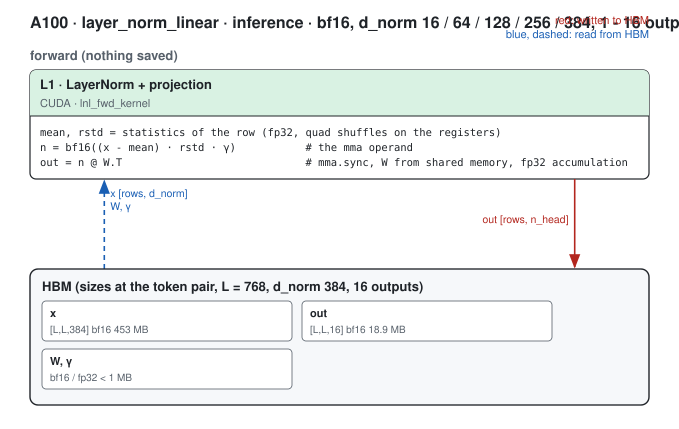

#### L1 · LayerNorm + projection (lnl_fwd_kernel)

| (Length, Dimension) | (128, 64) | (256, 64) | (384, 64) | (512, 64) | (640, 64) | (768, 64) | (128, 128) | (256, 128) | (384, 128) | (512, 128) | (640, 128) | (768, 128) | (128, 256) | (256, 256) | (384, 256) | (512, 256) | (640, 256) | (768, 256) | (128, 384) | (256, 384) | (384, 384) | (512, 384) | (640, 384) | (768, 384) | (1024, 16) | (2048, 16) | (3072, 16) | (4096, 16) | (5120, 16) | (6144, 16) | (7168, 16) | (8192, 16) | (1024, 128) | (2048, 128) | (3072, 128) | (4096, 128) | (5120, 128) | (6144, 128) | (7168, 128) | (8192, 128) |
|---|---|---|---|---|---|---|---|---|---|---|---|---|---|---|---|---|---|---|---|---|---|---|---|---|---|---|---|---|---|---|---|---|---|---|---|---|---|---|---|---|
| implementation | CUDA | CUDA | CUDA | CUDA | CUDA | CUDA | CUDA | CUDA | CUDA | CUDA | CUDA | CUDA | CUDA | CUDA | CUDA | CUDA | CUDA | CUDA | CUDA | CUDA | CUDA | CUDA | CUDA | CUDA | CUDA | CUDA | CUDA | CUDA | CUDA | CUDA | CUDA | CUDA | CUDA | CUDA | CUDA | CUDA | CUDA | CUDA | CUDA | CUDA |
| 성능 확인 | ✗ | ✗ | ✗ | ✗ | ✗ | ✗ | ✗ | ✗ | ✗ | ✗ | ✗ | ✗ | ✗ | ✗ | ✗ | ✗ | ✗ | ✗ | ✗ | ✗ | ✗ | ✗ | ✗ | ✗ | ✗ | ✗ | ✗ | ✗ | ✗ | ✗ | ✗ | ✗ | ✗ | ✗ | ✗ | ✗ | ✗ | ✗ | ✗ | ✗ |
| cache build | ✓ | ✓ | ✓ | ✓ | ✓ | ✓ | ✓ | ✓ | ✓ | ✓ | ✓ | ✓ | ✓ | ✓ | ✓ | ✓ | ✓ | ✓ | ✓ | ✓ | ✓ | ✓ | ✓ | ✓ | ✓ | ✓ | ✓ | ✓ | ✓ | ✓ | ✓ | ✓ | ✓ | ✓ | ✓ | ✓ | ✓ | ✓ | ✓ | ✓ |

### Training

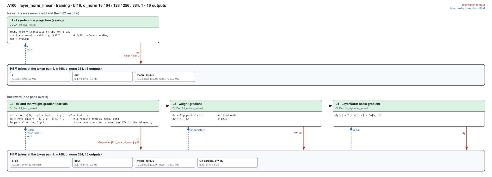

#### L1 · LayerNorm + projection, saving the statistics and u (lnl_fwd_kernel)

| (Length, Dimension) | (128, 64) | (256, 64) | (384, 64) | (512, 64) | (640, 64) | (768, 64) | (128, 128) | (256, 128) | (384, 128) | (512, 128) | (640, 128) | (768, 128) | (128, 256) | (256, 256) | (384, 256) | (512, 256) | (640, 256) | (768, 256) | (128, 384) | (256, 384) | (384, 384) | (512, 384) | (640, 384) | (768, 384) | (1024, 16) | (2048, 16) | (3072, 16) | (4096, 16) | (5120, 16) | (6144, 16) | (7168, 16) | (8192, 16) | (1024, 128) | (2048, 128) | (3072, 128) | (4096, 128) | (5120, 128) | (6144, 128) | (7168, 128) | (8192, 128) |
|---|---|---|---|---|---|---|---|---|---|---|---|---|---|---|---|---|---|---|---|---|---|---|---|---|---|---|---|---|---|---|---|---|---|---|---|---|---|---|---|---|
| implementation | CUDA | CUDA | CUDA | CUDA | CUDA | CUDA | CUDA | CUDA | CUDA | CUDA | CUDA | CUDA | CUDA | CUDA | CUDA | CUDA | CUDA | CUDA | CUDA | CUDA | CUDA | CUDA | CUDA | CUDA | CUDA | CUDA | CUDA | CUDA | CUDA | CUDA | CUDA | CUDA | CUDA | CUDA | CUDA | CUDA | CUDA | CUDA | CUDA | CUDA |
| 성능 확인 | ✗ | ✗ | ✗ | ✗ | ✗ | ✗ | ✗ | ✗ | ✗ | ✗ | ✗ | ✗ | ✗ | ✗ | ✗ | ✗ | ✗ | ✗ | ✗ | ✗ | ✗ | ✗ | ✗ | ✗ | ✗ | ✗ | ✗ | ✗ | ✗ | ✗ | ✗ | ✗ | ✗ | ✗ | ✗ | ✗ | ✗ | ✗ | ✗ | ✗ |
| cache build | ✓ | ✓ | ✓ | ✓ | ✓ | ✓ | ✓ | ✓ | ✓ | ✓ | ✓ | ✓ | ✓ | ✓ | ✓ | ✓ | ✓ | ✓ | ✓ | ✓ | ✓ | ✓ | ✓ | ✓ | ✓ | ✓ | ✓ | ✓ | ✓ | ✓ | ✓ | ✓ | ✓ | ✓ | ✓ | ✓ | ✓ | ✓ | ✓ | ✓ |

#### L2 · dx and the weight-gradient partials (lnl_bwd_kernel)

| (Length, Dimension) | (128, 64) | (256, 64) | (384, 64) | (512, 64) | (640, 64) | (768, 64) | (128, 128) | (256, 128) | (384, 128) | (512, 128) | (640, 128) | (768, 128) | (128, 256) | (256, 256) | (384, 256) | (512, 256) | (640, 256) | (768, 256) | (128, 384) | (256, 384) | (384, 384) | (512, 384) | (640, 384) | (768, 384) | (1024, 16) | (2048, 16) | (3072, 16) | (4096, 16) | (5120, 16) | (6144, 16) | (7168, 16) | (8192, 16) | (1024, 128) | (2048, 128) | (3072, 128) | (4096, 128) | (5120, 128) | (6144, 128) | (7168, 128) | (8192, 128) |
|---|---|---|---|---|---|---|---|---|---|---|---|---|---|---|---|---|---|---|---|---|---|---|---|---|---|---|---|---|---|---|---|---|---|---|---|---|---|---|---|---|
| implementation | CUDA | CUDA | CUDA | CUDA | CUDA | CUDA | CUDA | CUDA | CUDA | CUDA | CUDA | CUDA | CUDA | CUDA | CUDA | CUDA | CUDA | CUDA | CUDA | CUDA | CUDA | CUDA | CUDA | CUDA | CUDA | CUDA | CUDA | CUDA | CUDA | CUDA | CUDA | CUDA | CUDA | CUDA | CUDA | CUDA | CUDA | CUDA | CUDA | CUDA |
| 성능 확인 | ✗ | ✗ | ✗ | ✗ | ✗ | ✗ | ✗ | ✗ | ✗ | ✗ | ✗ | ✗ | ✗ | ✗ | ✗ | ✗ | ✗ | ✗ | ✗ | ✗ | ✗ | ✗ | ✗ | ✗ | ✗ | ✗ | ✗ | ✗ | ✗ | ✗ | ✗ | ✗ | ✗ | ✗ | ✗ | ✗ | ✗ | ✗ | ✗ | ✗ |
| cache build | ✓ | ✓ | ✓ | ✓ | ✓ | ✓ | ✓ | ✓ | ✓ | ✓ | ✓ | ✓ | ✓ | ✓ | ✓ | ✓ | ✓ | ✓ | ✓ | ✓ | ✓ | ✓ | ✓ | ✓ | ✓ | ✓ | ✓ | ✓ | ✓ | ✓ | ✓ | ✓ | ✓ | ✓ | ✓ | ✓ | ✓ | ✓ | ✓ | ✓ |

#### L3 · weight gradient (lnl_reduce_kernel)

| (Length, Dimension) | (128, 64) | (256, 64) | (384, 64) | (512, 64) | (640, 64) | (768, 64) | (128, 128) | (256, 128) | (384, 128) | (512, 128) | (640, 128) | (768, 128) | (128, 256) | (256, 256) | (384, 256) | (512, 256) | (640, 256) | (768, 256) | (128, 384) | (256, 384) | (384, 384) | (512, 384) | (640, 384) | (768, 384) | (1024, 16) | (2048, 16) | (3072, 16) | (4096, 16) | (5120, 16) | (6144, 16) | (7168, 16) | (8192, 16) | (1024, 128) | (2048, 128) | (3072, 128) | (4096, 128) | (5120, 128) | (6144, 128) | (7168, 128) | (8192, 128) |
|---|---|---|---|---|---|---|---|---|---|---|---|---|---|---|---|---|---|---|---|---|---|---|---|---|---|---|---|---|---|---|---|---|---|---|---|---|---|---|---|---|
| implementation | CUDA | CUDA | CUDA | CUDA | CUDA | CUDA | CUDA | CUDA | CUDA | CUDA | CUDA | CUDA | CUDA | CUDA | CUDA | CUDA | CUDA | CUDA | CUDA | CUDA | CUDA | CUDA | CUDA | CUDA | CUDA | CUDA | CUDA | CUDA | CUDA | CUDA | CUDA | CUDA | CUDA | CUDA | CUDA | CUDA | CUDA | CUDA | CUDA | CUDA |
| 성능 확인 | ✗ | ✗ | ✗ | ✗ | ✗ | ✗ | ✗ | ✗ | ✗ | ✗ | ✗ | ✗ | ✗ | ✗ | ✗ | ✗ | ✗ | ✗ | ✗ | ✗ | ✗ | ✗ | ✗ | ✗ | ✗ | ✗ | ✗ | ✗ | ✗ | ✗ | ✗ | ✗ | ✗ | ✗ | ✗ | ✗ | ✗ | ✗ | ✗ | ✗ |
| cache build | ✓ | ✓ | ✓ | ✓ | ✓ | ✓ | ✓ | ✓ | ✓ | ✓ | ✓ | ✓ | ✓ | ✓ | ✓ | ✓ | ✓ | ✓ | ✓ | ✓ | ✓ | ✓ | ✓ | ✓ | ✓ | ✓ | ✓ | ✓ | ✓ | ✓ | ✓ | ✓ | ✓ | ✓ | ✓ | ✓ | ✓ | ✓ | ✓ | ✓ |

#### L4 · LayerNorm-scale gradient (lnl_dgamma_kernel)

| (Length, Dimension) | (128, 64) | (256, 64) | (384, 64) | (512, 64) | (640, 64) | (768, 64) | (128, 128) | (256, 128) | (384, 128) | (512, 128) | (640, 128) | (768, 128) | (128, 256) | (256, 256) | (384, 256) | (512, 256) | (640, 256) | (768, 256) | (128, 384) | (256, 384) | (384, 384) | (512, 384) | (640, 384) | (768, 384) | (1024, 16) | (2048, 16) | (3072, 16) | (4096, 16) | (5120, 16) | (6144, 16) | (7168, 16) | (8192, 16) | (1024, 128) | (2048, 128) | (3072, 128) | (4096, 128) | (5120, 128) | (6144, 128) | (7168, 128) | (8192, 128) |
|---|---|---|---|---|---|---|---|---|---|---|---|---|---|---|---|---|---|---|---|---|---|---|---|---|---|---|---|---|---|---|---|---|---|---|---|---|---|---|---|---|
| implementation | CUDA | CUDA | CUDA | CUDA | CUDA | CUDA | CUDA | CUDA | CUDA | CUDA | CUDA | CUDA | CUDA | CUDA | CUDA | CUDA | CUDA | CUDA | CUDA | CUDA | CUDA | CUDA | CUDA | CUDA | CUDA | CUDA | CUDA | CUDA | CUDA | CUDA | CUDA | CUDA | CUDA | CUDA | CUDA | CUDA | CUDA | CUDA | CUDA | CUDA |
| 성능 확인 | ✗ | ✗ | ✗ | ✗ | ✗ | ✗ | ✗ | ✗ | ✗ | ✗ | ✗ | ✗ | ✗ | ✗ | ✗ | ✗ | ✗ | ✗ | ✗ | ✗ | ✗ | ✗ | ✗ | ✗ | ✗ | ✗ | ✗ | ✗ | ✗ | ✗ | ✗ | ✗ | ✗ | ✗ | ✗ | ✗ | ✗ | ✗ | ✗ | ✗ |
| cache build | ✓ | ✓ | ✓ | ✓ | ✓ | ✓ | ✓ | ✓ | ✓ | ✓ | ✓ | ✓ | ✓ | ✓ | ✓ | ✓ | ✓ | ✓ | ✓ | ✓ | ✓ | ✓ | ✓ | ✓ | ✓ | ✓ | ✓ | ✓ | ✓ | ✓ | ✓ | ✓ | ✓ | ✓ | ✓ | ✓ | ✓ | ✓ | ✓ | ✓ |

## Measurements (2026-10-04)

One A100 80GB PCIe (300 W; job 63251 on gpu03, from the frozen snapshot of the module benches), torch 2.13.0+cu129 / triton 3.7.1, bf16, B = 1, the registry rows' inputs (token pair `[1, L, L, d_norm]`, atom pair `[1, A / 32, 32, 128, 16]`, atom output `[1, A, 128]`), the LayerNorm scale in fp32, CUDA-graph replays (`probes/lnl_bench.py`, mean of
20; the layer has no `bench.py` target). All implementations in one process: **PyTorch compiled** = `F.linear(F.layer_norm(x, γ), W)` in bf16 under `torch.compile(dynamic=False)`; **Triton path** = `triton_layer_norm_linear` (what `ops.layer_norm_linear` ran before and still runs where the CUDA kernels do not
serve); **ours** = `ops.layer_norm_linear` (the default dispatch). Inference runs without autograd; training is the forward plus `torch.autograd.grad` of x, the LayerNorm scale and the weight (no `.grad` accumulation in the timing). Times in ms; **×** = PyTorch compiled divided by ours: cuEquivariance has no
such op and Anthropic is not measured (inference and training alike). Run-to-run and node-to-node spread is about 2 %. The tables are grouped by `n_head` so that a row's first column is unique.

Against PyTorch compiled ours is 1.5-4.0x faster in inference and 1.8-3.3x in training, against the Triton path 2.9-8.4x and 1.8-7.5x: the Triton op computes in fp32 and is 5-9x above the byte floor at L768 (the 64 → 2-head row at L768: 413 µs against ours 61 µs and a floor of 49 µs).

### token_pair · n_head 2 · Inference

| (Length, Dimension) | PyTorch compiled | cuEquivariance | Anthropic | Triton path | ours | × |
|---|---|---|---|---|---|---|
| (128, 64) | 0.0096 | — | — (not measured) | 0.0194 | 0.0056 | 1.71 |
| (256, 64) | 0.0220 | — | — (not measured) | 0.0525 | 0.0078 | 2.82 |
| (384, 64) | 0.0421 | — | — (not measured) | 0.1091 | 0.0131 | 3.21 |
| (512, 64) | 0.0773 | — | — (not measured) | 0.1884 | 0.0259 | 2.98 |
| (640, 64) | 0.1240 | — | — (not measured) | 0.2909 | 0.0447 | 2.77 |
| (768, 64) | 0.1793 | — | — (not measured) | 0.4133 | 0.0611 | 2.93 |

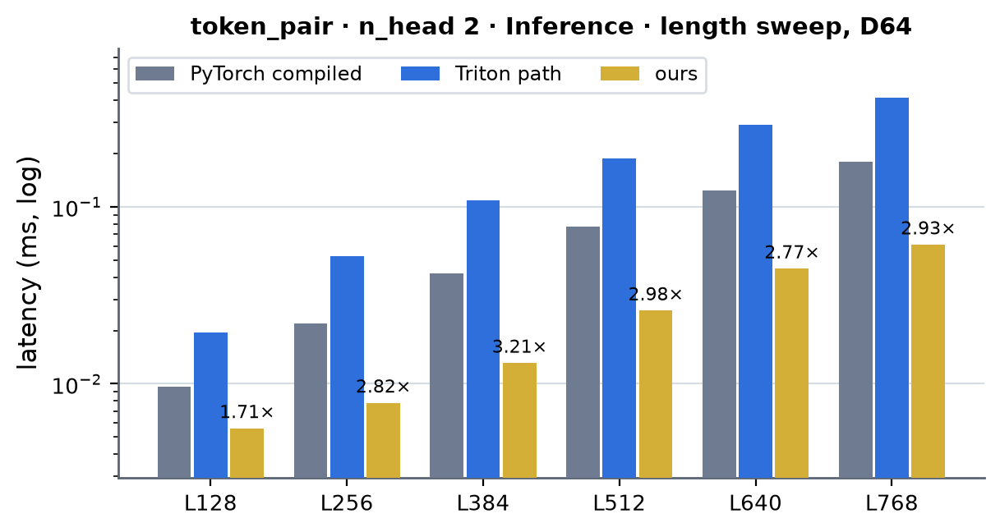 <!-- measure_bars -->

### token_pair · n_head 4 · Inference

| (Length, Dimension) | PyTorch compiled | cuEquivariance | Anthropic | Triton path | ours | × |
|---|---|---|---|---|---|---|
| (128, 64) | 0.0092 | — | — (not measured) | 0.0190 | 0.0060 | 1.53 |
| (256, 64) | 0.0220 | — | — (not measured) | 0.0521 | 0.0078 | 2.82 |
| (384, 64) | 0.0419 | — | — (not measured) | 0.1082 | 0.0129 | 3.25 |
| (512, 64) | 0.0786 | — | — (not measured) | 0.1873 | 0.0289 | 2.72 |
| (640, 64) | 0.1251 | — | — (not measured) | 0.2894 | 0.0458 | 2.73 |
| (768, 64) | 0.1799 | — | — (not measured) | 0.4115 | 0.0629 | 2.86 |
| (128, 128) | 0.0118 | — | — (not measured) | 0.0223 | 0.0071 | 1.66 |
| (256, 128) | 0.0354 | — | — (not measured) | 0.0595 | 0.0120 | 2.95 |
| (384, 128) | 0.0824 | — | — (not measured) | 0.1286 | 0.0322 | 2.56 |
| (512, 128) | 0.1474 | — | — (not measured) | 0.1959 | 0.0549 | 2.68 |
| (640, 128) | 0.2291 | — | — (not measured) | 0.5609 | 0.0819 | 2.80 |
| (768, 128) | 0.3312 | — | — (not measured) | 0.7975 | 0.1144 | 2.90 |

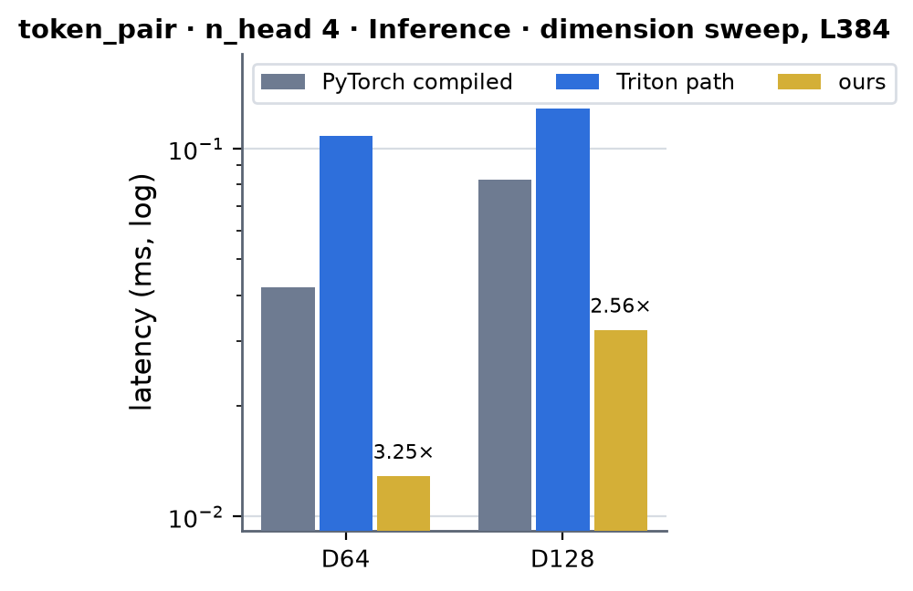 <!-- measure_bars -->

### token_pair · n_head 8 · Inference

| (Length, Dimension) | PyTorch compiled | cuEquivariance | Anthropic | Triton path | ours | × |
|---|---|---|---|---|---|---|
| (128, 128) | 0.0121 | — | — (not measured) | 0.0331 | 0.0069 | 1.75 |
| (256, 128) | 0.0338 | — | — (not measured) | 0.0983 | 0.0122 | 2.77 |
| (384, 128) | 0.0830 | — | — (not measured) | 0.2157 | 0.0335 | 2.48 |
| (512, 128) | 0.1463 | — | — (not measured) | 0.3642 | 0.0560 | 2.61 |
| (640, 128) | 0.2250 | — | — (not measured) | 0.5653 | 0.0848 | 2.65 |
| (768, 128) | 0.3242 | — | — (not measured) | 0.8045 | 0.1160 | 2.79 |
| (128, 256) | 0.0175 | — | — (not measured) | 0.0400 | 0.0097 | 1.80 |
| (256, 256) | 0.0675 | — | — (not measured) | 0.1191 | 0.0275 | 2.45 |
| (384, 256) | 0.1651 | — | — (not measured) | 0.2468 | 0.0632 | 2.61 |
| (512, 256) | 0.2833 | — | — (not measured) | 0.4116 | 0.1035 | 2.74 |
| (640, 256) | 0.4377 | — | — (not measured) | 1.1054 | 0.1564 | 2.80 |
| (768, 256) | 0.6229 | — | — (not measured) | 1.5741 | 0.2206 | 2.82 |
| (128, 384) | 0.0230 | — | — (not measured) | 0.0902 | 0.0137 | 1.68 |
| (256, 384) | 0.1081 | — | — (not measured) | 0.3281 | 0.0449 | 2.41 |
| (384, 384) | 0.2414 | — | — (not measured) | 0.6562 | 0.0918 | 2.63 |
| (512, 384) | 0.4198 | — | — (not measured) | 1.0924 | 0.1529 | 2.75 |
| (640, 384) | 0.6487 | — | — (not measured) | 1.6742 | 0.2355 | 2.75 |
| (768, 384) | 0.9251 | — | — (not measured) | 2.3726 | 0.3335 | 2.77 |

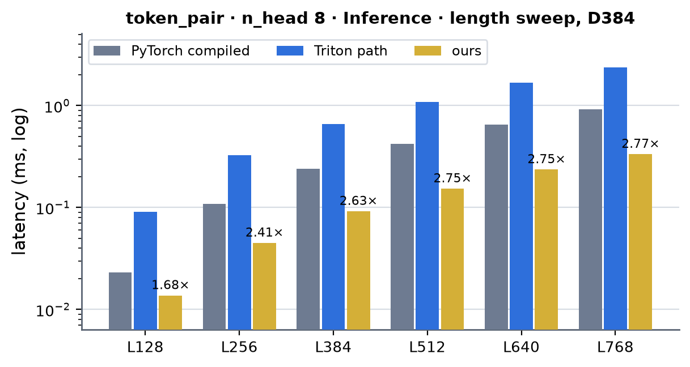 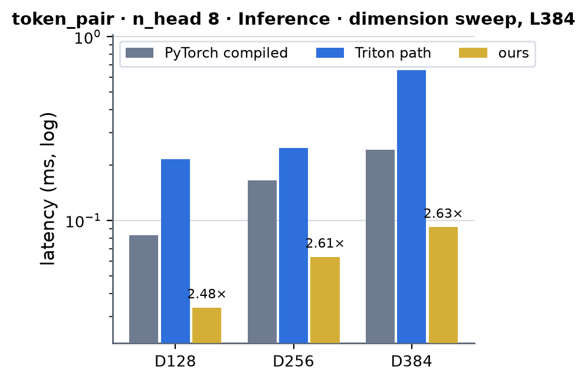 <!-- measure_bars -->

### token_pair · n_head 12 · Inference

| (Length, Dimension) | PyTorch compiled | cuEquivariance | Anthropic | Triton path | ours | × |
|---|---|---|---|---|---|---|
| (128, 384) | 0.0292 | — | — (not measured) | 0.0903 | 0.0148 | 1.97 |
| (256, 384) | 0.1135 | — | — (not measured) | 0.3291 | 0.0476 | 2.38 |
| (384, 384) | 0.2437 | — | — (not measured) | 0.6573 | 0.0933 | 2.61 |
| (512, 384) | 0.4236 | — | — (not measured) | 1.0947 | 0.1523 | 2.78 |
| (640, 384) | 0.6587 | — | — (not measured) | 1.6793 | 0.2301 | 2.86 |
| (768, 384) | 0.9448 | — | — (not measured) | 2.3809 | 0.3269 | 2.89 |

 <!-- measure_bars -->

### token_pair · n_head 16 · Inference

| (Length, Dimension) | PyTorch compiled | cuEquivariance | Anthropic | Triton path | ours | × |
|---|---|---|---|---|---|---|
| (128, 128) | 0.0124 | — | — (not measured) | 0.0332 | 0.0072 | 1.72 |
| (256, 128) | 0.0350 | — | — (not measured) | 0.0990 | 0.0123 | 2.85 |
| (384, 128) | 0.0849 | — | — (not measured) | 0.2180 | 0.0351 | 2.42 |
| (512, 128) | 0.1482 | — | — (not measured) | 0.3690 | 0.0591 | 2.51 |
| (640, 128) | 0.2272 | — | — (not measured) | 0.5756 | 0.0880 | 2.58 |
| (768, 128) | 0.3275 | — | — (not measured) | 0.8201 | 0.1205 | 2.72 |
| (128, 256) | 0.0180 | — | — (not measured) | 0.0622 | 0.0113 | 1.59 |
| (256, 256) | 0.0679 | — | — (not measured) | 0.2041 | 0.0295 | 2.30 |
| (384, 256) | 0.1666 | — | — (not measured) | 0.4234 | 0.0663 | 2.51 |
| (512, 256) | 0.2866 | — | — (not measured) | 0.7166 | 0.1079 | 2.66 |
| (640, 256) | 0.4424 | — | — (not measured) | 1.1126 | 0.1625 | 2.72 |
| (768, 256) | 0.6278 | — | — (not measured) | 1.5866 | 0.2293 | 2.74 |
| (128, 384) | 0.0228 | — | — (not measured) | 0.0904 | 0.0149 | 1.53 |
| (256, 384) | 0.1100 | — | — (not measured) | 0.3304 | 0.0476 | 2.31 |
| (384, 384) | 0.2439 | — | — (not measured) | 0.6579 | 0.0928 | 2.63 |
| (512, 384) | 0.4232 | — | — (not measured) | 1.0957 | 0.1539 | 2.75 |
| (640, 384) | 0.6497 | — | — (not measured) | 1.6807 | 0.2319 | 2.80 |
| (768, 384) | 0.9321 | — | — (not measured) | 2.3815 | 0.3289 | 2.83 |

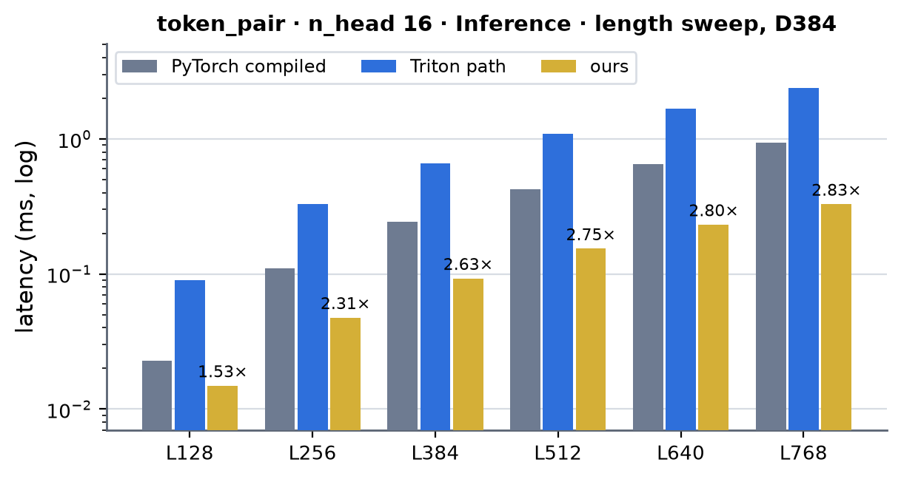 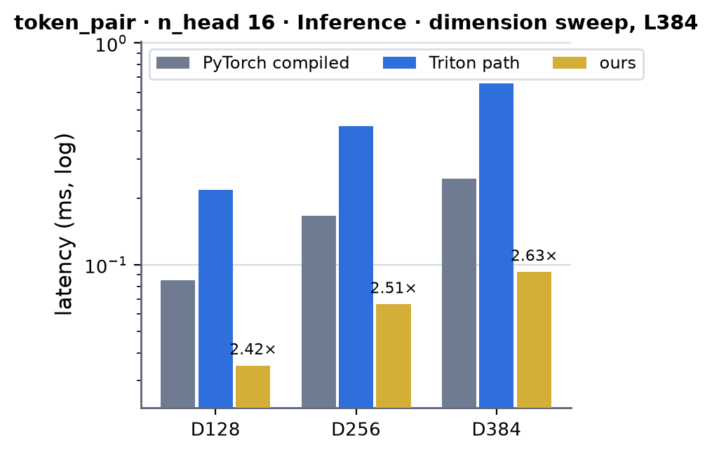 <!-- measure_bars -->

### atom_pair · n_head 4 · Inference

| (Length, Dimension) | PyTorch compiled | cuEquivariance | Anthropic | Triton path | ours | × |
|---|---|---|---|---|---|---|
| (1024, 16) | 0.0214 | — | — (not measured) | 0.0278 | 0.0072 | 2.97 |
| (2048, 16) | 0.0370 | — | — (not measured) | 0.0503 | 0.0111 | 3.33 |
| (3072, 16) | 0.0541 | — | — (not measured) | 0.0728 | 0.0140 | 3.86 |
| (4096, 16) | 0.0712 | — | — (not measured) | 0.0959 | 0.0181 | 3.93 |
| (5120, 16) | 0.0912 | — | — (not measured) | 0.1191 | 0.0226 | 4.04 |
| (6144, 16) | 0.1093 | — | — (not measured) | 0.1418 | 0.0277 | 3.95 |
| (7168, 16) | 0.1247 | — | — (not measured) | 0.1650 | 0.0326 | 3.83 |
| (8192, 16) | 0.1455 | — | — (not measured) | 0.1888 | 0.0361 | 4.03 |

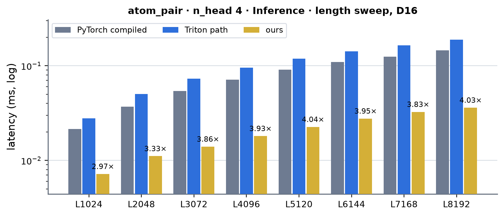 <!-- measure_bars -->

### atom_pair · n_head 12 · Inference

| (Length, Dimension) | PyTorch compiled | cuEquivariance | Anthropic | Triton path | ours | × |
|---|---|---|---|---|---|---|
| (1024, 16) | 0.0218 | — | — (not measured) | 0.0293 | 0.0083 | 2.63 |
| (2048, 16) | 0.0370 | — | — (not measured) | 0.0544 | 0.0127 | 2.91 |
| (3072, 16) | 0.0550 | — | — (not measured) | 0.0802 | 0.0169 | 3.25 |
| (4096, 16) | 0.0744 | — | — (not measured) | 0.1103 | 0.0215 | 3.46 |
| (5120, 16) | 0.0928 | — | — (not measured) | 0.1405 | 0.0283 | 3.28 |
| (6144, 16) | 0.1099 | — | — (not measured) | 0.1696 | 0.0362 | 3.04 |
| (7168, 16) | 0.1279 | — | — (not measured) | 0.1981 | 0.0431 | 2.97 |
| (8192, 16) | 0.1495 | — | — (not measured) | 0.2256 | 0.0473 | 3.16 |

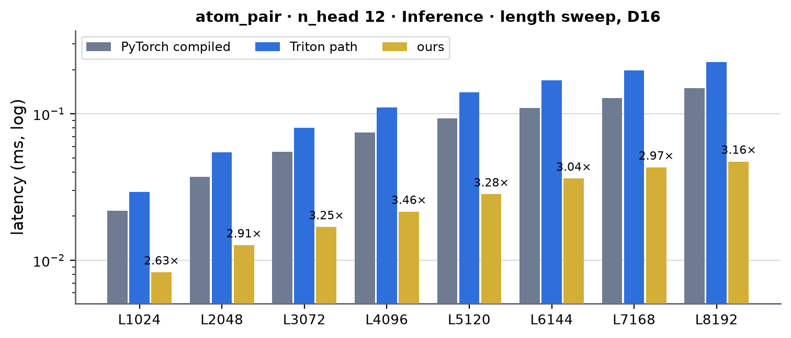 <!-- measure_bars -->

### atom_output · n_head 3 · Inference

| (Length, Dimension) | PyTorch compiled | cuEquivariance | Anthropic | Triton path | ours | × |
|---|---|---|---|---|---|---|
| (1024, 128) | 0.0090 | — | — (not measured) | 0.0145 | 0.0048 | 1.88 |
| (2048, 128) | 0.0092 | — | — (not measured) | 0.0147 | 0.0050 | 1.84 |
| (3072, 128) | 0.0103 | — | — (not measured) | 0.0148 | 0.0050 | 2.06 |
| (4096, 128) | 0.0101 | — | — (not measured) | 0.0163 | 0.0051 | 1.98 |
| (5120, 128) | 0.0126 | — | — (not measured) | 0.0164 | 0.0049 | 2.57 |
| (6144, 128) | 0.0096 | — | — (not measured) | 0.0168 | 0.0050 | 1.92 |
| (7168, 128) | 0.0120 | — | — (not measured) | 0.0248 | 0.0061 | 1.97 |
| (8192, 128) | 0.0120 | — | — (not measured) | 0.0247 | 0.0052 | 2.31 |

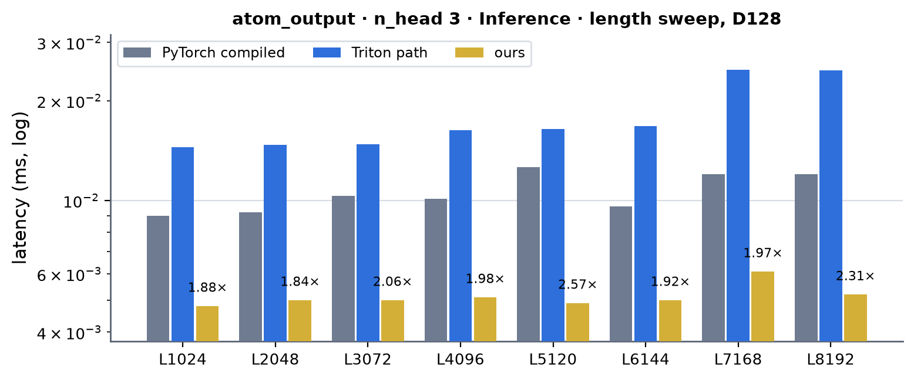 <!-- measure_bars -->

### token_pair · n_head 2 · Training

| (Length, Dimension) | PyTorch compiled | cuEquivariance | Anthropic | Triton path | ours | × |
|---|---|---|---|---|---|---|
| (128, 64) | 0.0376 | — | — (not measured) | 0.0359 | 0.0199 | 1.89 |
| (256, 64) | 0.0865 | — | — (not measured) | 0.0850 | 0.0276 | 3.13 |
| (384, 64) | 0.1511 | — | — (not measured) | 0.1742 | 0.0556 | 2.72 |
| (512, 64) | 0.2424 | — | — (not measured) | 0.2875 | 0.0967 | 2.51 |
| (640, 64) | 0.3976 | — | — (not measured) | 0.4377 | 0.1404 | 2.83 |
| (768, 64) | 0.5537 | — | — (not measured) | 0.6190 | 0.1929 | 2.87 |

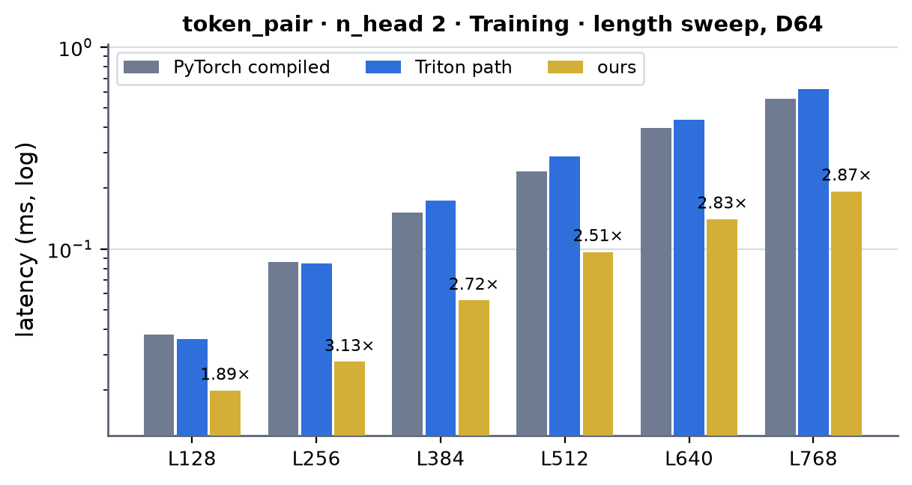 <!-- measure_bars -->

### token_pair · n_head 4 · Training

| (Length, Dimension) | PyTorch compiled | cuEquivariance | Anthropic | Triton path | ours | × |
|---|---|---|---|---|---|---|
| (128, 64) | 0.0374 | — | — (not measured) | 0.0395 | 0.0208 | 1.80 |
| (256, 64) | 0.0871 | — | — (not measured) | 0.0983 | 0.0282 | 3.09 |
| (384, 64) | 0.1516 | — | — (not measured) | 0.2012 | 0.0573 | 2.65 |
| (512, 64) | 0.2453 | — | — (not measured) | 0.3363 | 0.0994 | 2.47 |
| (640, 64) | 0.3984 | — | — (not measured) | 0.5131 | 0.1453 | 2.74 |
| (768, 64) | 0.5108 | — | — (not measured) | 0.7269 | 0.1992 | 2.56 |
| (128, 128) | 0.0529 | — | — (not measured) | 0.0550 | 0.0240 | 2.20 |
| (256, 128) | 0.1420 | — | — (not measured) | 0.1458 | 0.0484 | 2.93 |
| (384, 128) | 0.3128 | — | — (not measured) | 0.3087 | 0.1055 | 2.96 |
| (512, 128) | 0.5228 | — | — (not measured) | 0.4984 | 0.1706 | 3.06 |
| (640, 128) | 0.7933 | — | — (not measured) | 1.0887 | 0.2530 | 3.14 |
| (768, 128) | 0.9869 | — | — (not measured) | 1.5492 | 0.3597 | 2.74 |

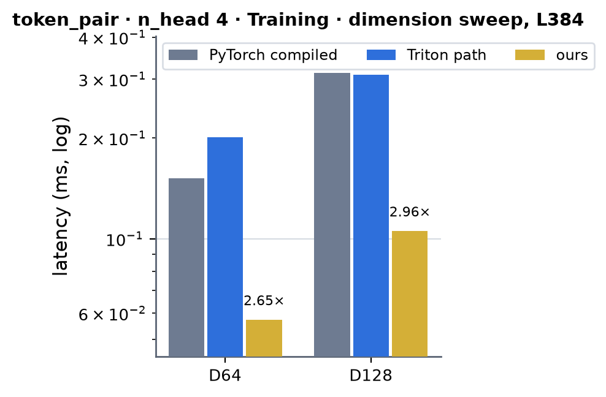 <!-- measure_bars -->

### token_pair · n_head 8 · Training

| (Length, Dimension) | PyTorch compiled | cuEquivariance | Anthropic | Triton path | ours | × |
|---|---|---|---|---|---|---|
| (128, 128) | 0.0523 | — | — (not measured) | 0.0950 | 0.0251 | 2.08 |
| (256, 128) | 0.1294 | — | — (not measured) | 0.2634 | 0.0512 | 2.53 |
| (384, 128) | 0.2827 | — | — (not measured) | 0.5378 | 0.1094 | 2.58 |
| (512, 128) | 0.4636 | — | — (not measured) | 0.9062 | 0.1759 | 2.64 |
| (640, 128) | 0.6943 | — | — (not measured) | 1.4004 | 0.2622 | 2.65 |
| (768, 128) | 0.9663 | — | — (not measured) | 1.9959 | 0.3722 | 2.60 |
| (128, 256) | 0.0804 | — | — (not measured) | 0.1153 | 0.0333 | 2.41 |
| (256, 256) | 0.2572 | — | — (not measured) | 0.3376 | 0.1004 | 2.56 |
| (384, 256) | 0.5500 | — | — (not measured) | 0.7789 | 0.1945 | 2.83 |
| (512, 256) | 0.9132 | — | — (not measured) | 1.2904 | 0.3255 | 2.81 |
| (640, 256) | 1.3810 | — | — (not measured) | 2.7657 | 0.4968 | 2.78 |
| (768, 256) | 1.9275 | — | — (not measured) | 3.9652 | 0.7093 | 2.72 |
| (128, 384) | 0.1065 | — | — (not measured) | 0.2676 | 0.0426 | 2.50 |
| (256, 384) | 0.3740 | — | — (not measured) | 0.8429 | 0.1330 | 2.81 |
| (384, 384) | 0.7556 | — | — (not measured) | 1.6914 | 0.2661 | 2.84 |
| (512, 384) | 1.2440 | — | — (not measured) | 2.8355 | 0.4585 | 2.71 |
| (640, 384) | 1.8953 | — | — (not measured) | 4.3092 | 0.7071 | 2.68 |
| (768, 384) | 2.7012 | — | — (not measured) | 6.2278 | 1.0110 | 2.67 |

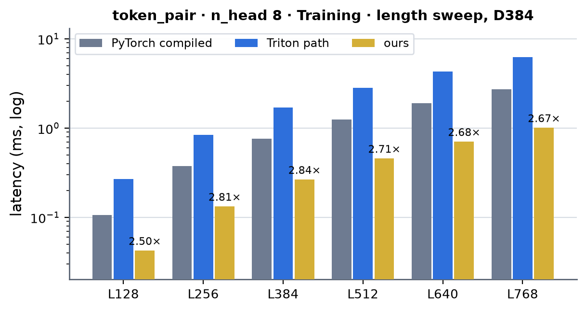 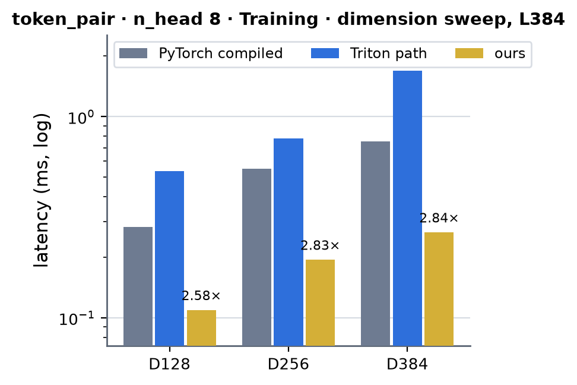 <!-- measure_bars -->

### token_pair · n_head 12 · Training

| (Length, Dimension) | PyTorch compiled | cuEquivariance | Anthropic | Triton path | ours | × |
|---|---|---|---|---|---|---|
| (128, 384) | 0.1241 | — | — (not measured) | 0.3170 | 0.0467 | 2.66 |
| (256, 384) | 0.3860 | — | — (not measured) | 1.0098 | 0.1379 | 2.80 |
| (384, 384) | 0.7774 | — | — (not measured) | 2.0376 | 0.2719 | 2.86 |
| (512, 384) | 1.2922 | — | — (not measured) | 3.3965 | 0.4622 | 2.80 |
| (640, 384) | 1.9678 | — | — (not measured) | 5.1491 | 0.7112 | 2.77 |
| (768, 384) | 2.6763 | — | — (not measured) | 7.4165 | 1.0123 | 2.64 |

 <!-- measure_bars -->

### token_pair · n_head 16 · Training

| (Length, Dimension) | PyTorch compiled | cuEquivariance | Anthropic | Triton path | ours | × |
|---|---|---|---|---|---|---|
| (128, 128) | 0.0533 | — | — (not measured) | 0.0883 | 0.0283 | 1.88 |
| (256, 128) | 0.1314 | — | — (not measured) | 0.2707 | 0.0590 | 2.23 |
| (384, 128) | 0.2870 | — | — (not measured) | 0.5517 | 0.1209 | 2.37 |
| (512, 128) | 0.4670 | — | — (not measured) | 0.9486 | 0.1940 | 2.41 |
| (640, 128) | 0.7021 | — | — (not measured) | 1.4566 | 0.2898 | 2.42 |
| (768, 128) | 0.9743 | — | — (not measured) | 2.0745 | 0.4054 | 2.40 |
| (128, 256) | 0.0831 | — | — (not measured) | 0.1481 | 0.0381 | 2.18 |
| (256, 256) | 0.2612 | — | — (not measured) | 0.4460 | 0.1084 | 2.41 |
| (384, 256) | 0.5565 | — | — (not measured) | 0.9084 | 0.2093 | 2.66 |
| (512, 256) | 0.9186 | — | — (not measured) | 1.5590 | 0.3479 | 2.64 |
| (640, 256) | 1.3813 | — | — (not measured) | 2.4059 | 0.5302 | 2.61 |
| (768, 256) | 1.9460 | — | — (not measured) | 3.4270 | 0.7512 | 2.59 |
| (128, 384) | 0.1087 | — | — (not measured) | 0.2227 | 0.0505 | 2.15 |
| (256, 384) | 0.3759 | — | — (not measured) | 0.6991 | 0.1416 | 2.65 |
| (384, 384) | 0.7630 | — | — (not measured) | 1.4049 | 0.2805 | 2.72 |
| (512, 384) | 1.2663 | — | — (not measured) | 2.3573 | 0.4724 | 2.68 |
| (640, 384) | 1.9112 | — | — (not measured) | 3.6300 | 0.7271 | 2.63 |
| (768, 384) | 2.7234 | — | — (not measured) | 5.1502 | 1.0299 | 2.64 |

 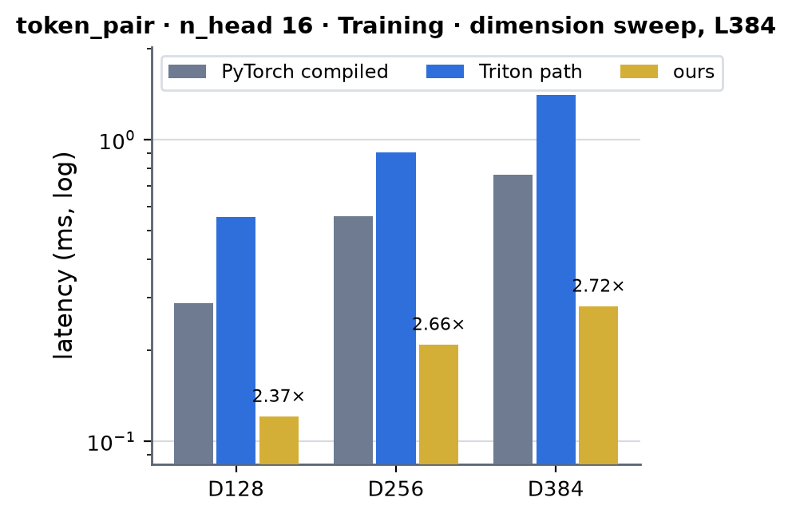 <!-- measure_bars -->

### atom_pair · n_head 4 · Training

| (Length, Dimension) | PyTorch compiled | cuEquivariance | Anthropic | Triton path | ours | × |
|---|---|---|---|---|---|---|
| (1024, 16) | 0.0732 | — | — (not measured) | 0.0668 | 0.0294 | 2.49 |
| (2048, 16) | 0.1410 | — | — (not measured) | 0.1197 | 0.0433 | 3.26 |
| (3072, 16) | 0.1889 | — | — (not measured) | 0.1705 | 0.0607 | 3.11 |
| (4096, 16) | 0.2444 | — | — (not measured) | 0.2226 | 0.0791 | 3.09 |
| (5120, 16) | 0.3023 | — | — (not measured) | 0.2745 | 0.0958 | 3.16 |
| (6144, 16) | 0.3622 | — | — (not measured) | 0.3259 | 0.1119 | 3.24 |
| (7168, 16) | 0.4208 | — | — (not measured) | 0.3795 | 0.1293 | 3.25 |
| (8192, 16) | 0.4618 | — | — (not measured) | 0.4308 | 0.1444 | 3.20 |

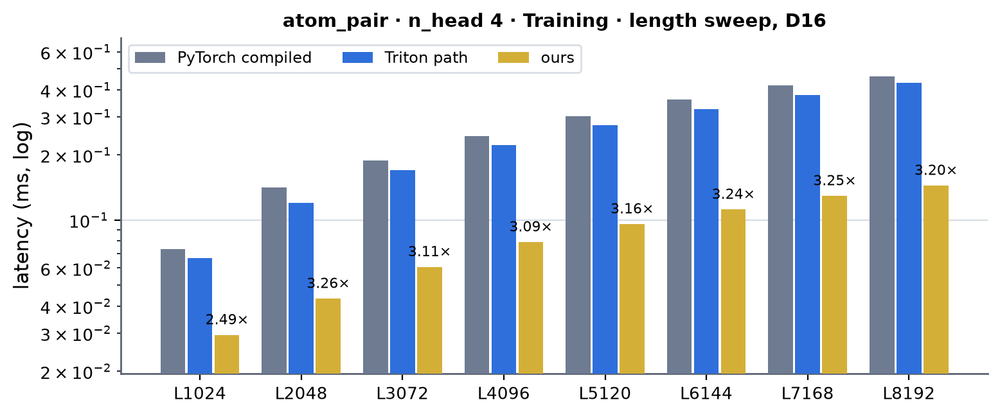 <!-- measure_bars -->

### atom_pair · n_head 12 · Training

| (Length, Dimension) | PyTorch compiled | cuEquivariance | Anthropic | Triton path | ours | × |
|---|---|---|---|---|---|---|
| (1024, 16) | 0.0744 | — | — (not measured) | 0.1134 | 0.0396 | 1.88 |
| (2048, 16) | 0.1340 | — | — (not measured) | 0.2076 | 0.0686 | 1.95 |
| (3072, 16) | 0.1988 | — | — (not measured) | 0.3086 | 0.0983 | 2.02 |
| (4096, 16) | 0.2543 | — | — (not measured) | 0.4069 | 0.1276 | 1.99 |
| (5120, 16) | 0.3148 | — | — (not measured) | 0.5073 | 0.1547 | 2.03 |
| (6144, 16) | 0.3752 | — | — (not measured) | 0.6067 | 0.1788 | 2.10 |
| (7168, 16) | 0.4329 | — | — (not measured) | 0.7054 | 0.2049 | 2.11 |
| (8192, 16) | 0.4766 | — | — (not measured) | 0.8026 | 0.2309 | 2.06 |

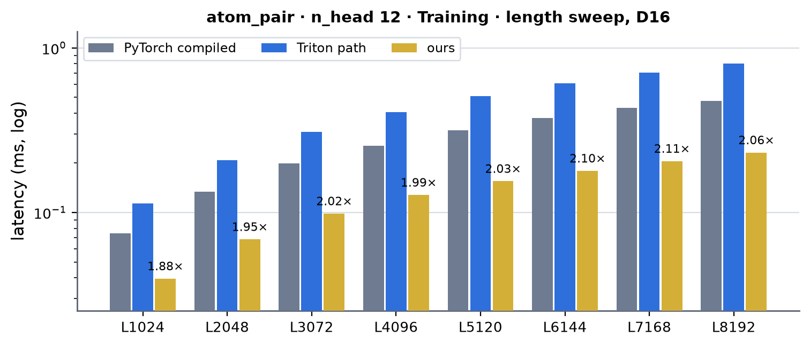 <!-- measure_bars -->

### atom_output · n_head 3 · Training

| (Length, Dimension) | PyTorch compiled | cuEquivariance | Anthropic | Triton path | ours | × |
|---|---|---|---|---|---|---|
| (1024, 128) | 0.0360 | — | — (not measured) | 0.0368 | 0.0147 | 2.45 |
| (2048, 128) | 0.0318 | — | — (not measured) | 0.0366 | 0.0153 | 2.08 |
| (3072, 128) | 0.0340 | — | — (not measured) | 0.0373 | 0.0160 | 2.12 |
| (4096, 128) | 0.0358 | — | — (not measured) | 0.0388 | 0.0167 | 2.14 |
| (5120, 128) | 0.0385 | — | — (not measured) | 0.0393 | 0.0170 | 2.26 |
| (6144, 128) | 0.0397 | — | — (not measured) | 0.0391 | 0.0177 | 2.24 |
| (7168, 128) | 0.0426 | — | — (not measured) | 0.0536 | 0.0204 | 2.09 |
| (8192, 128) | 0.0443 | — | — (not measured) | 0.0536 | 0.0205 | 2.16 |

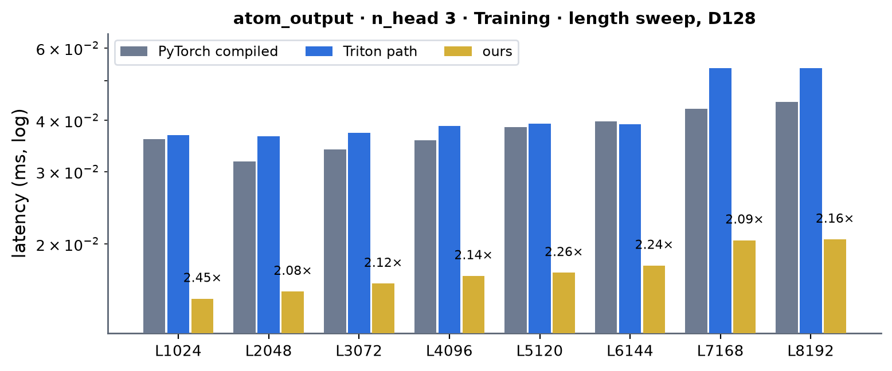 <!-- measure_bars -->

### Speed of light

SoL = `max(essential HBM bytes / 1.60 TB/s, FLOP / 240 TFLOP/s)` (the products are 2 · d_norm · n_head FLOP per row: never the limit): inference reads x and writes the outputs (`2 d + 2 n_head` bytes per row); training reads x twice (the forward and the backward), writes x's gradient, and moves the outputs, their gradient, the
statistics and `u` (`6 d + 12 n_head + 16` bytes per row, the weight-gradient partials excluded). Rows are L² for the token pair, 128 · atoms for the atom pair windows and the atoms for the atom output.

| stream (d_norm, n_head) | mode | length | ours (µs) | SoL floor (µs) | % of SoL |
|---|---|---|---|---|---|
| atom_output (128, 3) | inference | 1024 | 4.8 | 0.2 | 3 % |
| atom_output (128, 3) | inference | 8192 | 5.2 | 1.3 | 26 % |
| atom_output (128, 3) | training | 1024 | 14.7 | 0.5 | 4 % |
| atom_output (128, 3) | training | 8192 | 20.5 | 4.2 | 20 % |
| atom_pair (16, 4) | inference | 1024 | 7.2 | 3.3 | 46 % |
| atom_pair (16, 4) | inference | 8192 | 36.1 | 26.2 | 73 % |
| atom_pair (16, 4) | training | 1024 | 29.4 | 13.1 | 45 % |
| atom_pair (16, 4) | training | 8192 | 144.4 | 104.9 | 73 % |
| atom_pair (16, 12) | inference | 1024 | 8.3 | 4.6 | 55 % |
| atom_pair (16, 12) | inference | 8192 | 47.3 | 36.7 | 78 % |
| atom_pair (16, 12) | training | 1024 | 39.6 | 21.0 | 53 % |
| atom_pair (16, 12) | training | 8192 | 230.9 | 167.8 | 73 % |
| token_pair (64, 2) | inference | 384 | 13.1 | 12.2 | 93 % |
| token_pair (64, 2) | inference | 768 | 61.1 | 48.7 | 80 % |
| token_pair (64, 2) | training | 384 | 55.6 | 39.1 | 70 % |
| token_pair (64, 2) | training | 768 | 192.9 | 156.3 | 81 % |
| token_pair (64, 4) | inference | 384 | 12.9 | 12.5 | 97 % |
| token_pair (64, 4) | inference | 768 | 62.9 | 50.1 | 80 % |
| token_pair (64, 4) | training | 384 | 57.3 | 41.3 | 72 % |
| token_pair (64, 4) | training | 768 | 199.2 | 165.2 | 83 % |
| token_pair (128, 4) | inference | 384 | 32.2 | 24.3 | 76 % |
| token_pair (128, 4) | inference | 768 | 114.4 | 97.3 | 85 % |
| token_pair (128, 4) | training | 384 | 105.5 | 76.7 | 73 % |
| token_pair (128, 4) | training | 768 | 359.7 | 306.7 | 85 % |
| token_pair (128, 8) | inference | 384 | 33.5 | 25.1 | 75 % |
| token_pair (128, 8) | inference | 768 | 116.0 | 100.3 | 86 % |
| token_pair (128, 8) | training | 384 | 109.4 | 81.1 | 74 % |
| token_pair (128, 8) | training | 768 | 372.2 | 324.4 | 87 % |
| token_pair (128, 16) | inference | 384 | 35.1 | 26.5 | 76 % |
| token_pair (128, 16) | inference | 768 | 120.5 | 106.2 | 88 % |
| token_pair (128, 16) | training | 384 | 120.9 | 89.9 | 74 % |
| token_pair (128, 16) | training | 768 | 405.4 | 359.8 | 89 % |
| token_pair (256, 8) | inference | 384 | 63.2 | 48.7 | 77 % |
| token_pair (256, 8) | inference | 768 | 220.6 | 194.6 | 88 % |
| token_pair (256, 8) | training | 384 | 194.5 | 151.9 | 78 % |
| token_pair (256, 8) | training | 768 | 709.3 | 607.5 | 86 % |
| token_pair (256, 16) | inference | 384 | 66.3 | 50.1 | 76 % |
| token_pair (256, 16) | inference | 768 | 229.3 | 200.5 | 87 % |
| token_pair (256, 16) | training | 384 | 209.3 | 160.7 | 77 % |
| token_pair (256, 16) | training | 768 | 751.2 | 642.9 | 86 % |
| token_pair (384, 8) | inference | 384 | 91.8 | 72.3 | 79 % |
| token_pair (384, 8) | inference | 768 | 333.5 | 289.0 | 87 % |
| token_pair (384, 8) | training | 384 | 266.1 | 222.7 | 84 % |
| token_pair (384, 8) | training | 768 | 1011.0 | 890.6 | 88 % |
| token_pair (384, 12) | inference | 384 | 93.3 | 73.0 | 78 % |
| token_pair (384, 12) | inference | 768 | 326.9 | 292.0 | 89 % |
| token_pair (384, 12) | training | 384 | 271.9 | 227.1 | 84 % |
| token_pair (384, 12) | training | 768 | 1012.3 | 908.3 | 90 % |
| token_pair (384, 16) | inference | 384 | 92.8 | 73.7 | 79 % |
| token_pair (384, 16) | inference | 768 | 328.9 | 294.9 | 90 % |
| token_pair (384, 16) | training | 384 | 280.5 | 231.5 | 83 % |
| token_pair (384, 16) | training | 768 | 1029.9 | 926.0 | 90 % |

The token pair rows run at 70-97 % of the byte floor (75-97 % at L384, 80-90 % at L768 where the launch and the tail are amortised), the atom pair windows at 45-78 % (the 16-channel rows of 32 bytes are the smallest accesses: 4-12 outputs over a million rows), and the atom output at 3-26 %: its
largest row is 5 µs, a launch, not a stream (the floor is 1.3 µs at 8192 atoms).

### What was tried and did not pay (2026-10-04)

- **A single finalize kernel for the weight gradients** (the first backward): the per-warp partials of Gn were summed by one kernel with a thread per output channel: 171 µs at d_norm 384, latency-bound (a serial walk over every partial). Split into `lnl_reduce_kernel` (a thread per (head, channel), the
  partials read coalesced along the channel) and `lnl_dgamma_kernel`, then the warps of a CTA are summed in shared memory first (partials per CTA, not per warp): the small cases of the training step halved (token pair 64 → 2 heads at L128: 38.9 → 19.6 µs).
- **The harness**: timing a training step with `torch.autograd.backward` accumulates `.grad` into the leaves (800 µs of bf16 adds in every implementation at the large rows); the numbers here use `torch.autograd.grad`. The "Triton" column calls `triton_layer_norm_linear` itself (`ops.layer_norm_linear` dispatches to the CUDA kernels on this card).
- **Not done**: fp32 activations (not a registry dtype; they keep the Triton op), d_norm other than 16 / 64 / 128 / 256 / 384 / 512 and more than 16 outputs (Triton), the general `layernorm_linear_triton` of the bias-only modules (LayerNorm + a wide value | gate | bias projection: a GEMM, another worker's family).
