# MPNN edge side on A100 (sm80)

Kernel-level status of the ProteinMPNN encoder's **edge side** on A100: the fused edge tail (`kernels/mpnn_edge_tail`: `pre = query + edge W1e + neighbour` -> GELU -> W2 -> GELU -> W3 -> dropout -> residual -> LayerNorm),
the edge MLP (`mpnn_edge_mlp`: the tail's last two products), the edge LayerNorm's compressed-save backward (`mpnn_edge_layernorm`) and the edge dropout's bit-packed mask (`mpnn_edge_dropout`); the module-level summary is in
[../a100.md](../a100.md). The message side (`mpnn_message`, `mpnn_node_message`, `mpnn_relative_position`) is a separate page. There are no registry rows for MPNN: the shapes are those of the repo's MPNN runners
(`benchmarks/runners/mpnn_compare.py`, `mpnn_training.py`; `drivers/mpnn_edge_tail.py`): width 128 (node / edge / hidden), K = 48 neighbours per node, bf16 activations (native bf16 weights with fp32 LayerNorm affine,
or fp32 weights under bf16 autocast), N = B x L nodes: **2048** (the shipped crop, 98,304 edge rows), 8192 and **65,536** (B8 x L8192, 3.1 M edge rows). Columns below are `(Length, Dimension)` = (N nodes, 128).

Summary (2026-10-04). Inference and training in bf16: the edge tail and the edge MLP forward and backward, the edge LayerNorm's backward and the edge dropout's mask pack and backward in hand CUDA (`mma.sync` / `ldmatrix` /
`cp.async`; one extension, `mpnn_edge_sm80`, built on first use; the LayerNorm and dropout forwards are PyTorch's native operations, as on the Triton path). Against PyTorch compiled (the runner's own `pytorch` arm; there is
no cuEquivariance op for MPNN and the Anthropic arm is not measured): the **edge tail** is 2.7-2.9x in inference (0.105 ms at N = 2048) and 2.3x in training with CUDA graphs (0.495 against 1.167 ms at N = 2048, 14.8 against
33.3 ms at N = 65,536), where the Triton path it replaces is 1.3x in both; the tail's recompute policy (`triton`) is 1.6-1.9x (the Triton one is 0.5x: slower than PyTorch compiled); the **edge MLP** is 2.1-2.4x in inference and
1.6-1.7x in training; the **edge LayerNorm** memory policy is 1.1-1.2x and the **bit-packed dropout** 0.96-0.99x (a memory policy: it pays a pack and an unpack pass for a mask 8x smaller), both equal to or a few percent faster than
the Triton kernels they replace. Time-roofline SoL: the tail's training step is at 74 % of the sum of its kernels' byte floors (the saving forward 73 %, the chain backward 81 %, the weight gradients 84 %); its inference at 38-42 %
of the tensor floor (issue / latency bound). In the full model (`mpnn_training`, compiled, no CUDA graph, AdamW included) the edge kernels take the `compute` policy from 14.2 to 12.6 ms (N = 2048) and from 35.6 to 32.4 ms (N = 8192);
the saved activations cost 0.57 GiB more peak memory at N = 8192. Without CUDA graphs a single edge op at N = 2048 is host-bound (see Measurements).

On A100 the four families run **hand-written CUDA** from the family interfaces through `integrations/mpnn_edge_sm80.py` when the call matches the Triton path's contract (see below); `modules/mpnn/module.py` is untouched
and the Triton / PyTorch paths are one switch away (`MINIWORLD_MPNN_EDGE_SM80=0`). 성능 확인: ✗. cache build ✓: nothing on these paths autotunes (fixed launch shapes), the extension is built on first use into
`$MINIWORLD_ENGINE_JIT_ROOT` (`mpnn_edge_sm80_<hash of the sources>`).

## Contract of the CUDA path

On A100 (capability exactly 8.0) the four edge families run **hand-written CUDA** (one extension, `mpnn_edge_sm80`, built on first use from `kernels/mpnn_edge_tail/cuda/sm80/`) when the call matches the
Triton path's contract and the engine backend is not forced to Triton. There is no new backend value in the model: the family interfaces (`kernels/mpnn_edge_*/interface.py`) ask
`integrations/mpnn_edge_sm80.py` whether the call is served, so the Triton **policy names redirect on an A100** and `modules/mpnn/module.py` is untouched:

| family | policy name (model / runner) | on an A100 | other cards, `MINIWORLD_MPNN_EDGE_SM80=0`, `engine_backend="triton"`, failed build |
|---|---|---|---|
| edge tail | `triton_compute` (saved activations) | saving forward + chain backward + weight gradients | Triton `compute` kernels, as before |
| edge tail | `triton` (recompute) | inference forward; the backward replays the saving forward in slices of whole nodes (2^19 rows; same seed and the row offset of the slice: identical activations and dropout decisions) and runs the same backward on each | Triton recompute kernels, as before |
| edge tail | `cuda` (explicit) | as `triton_compute`; raises `ValueError` where it cannot serve the call | |
| edge tail | `off` (the model default) | unchanged: the separate-operation encoder edge update | |
| edge MLP | `triton_compute` / `triton_memory` / `cuda` | saved projection / recompute in the backward / saved projection | Triton, as before |
| edge MLP | `auto` | CUDA from 98,304 rows (the Triton rule's size floor, 2048 x 48), PyTorch below | PyTorch off sm_86, as before |
| edge LayerNorm | `memory` / `cuda` | native forward + bf16 copy, hand-CUDA backward | Triton atomic backward, as before; `auto` and inference stay PyTorch |
| edge dropout | `bitpack` / `cuda` | ATen's `native_dropout` forward, mask packed to one bit per element by a CUDA kernel, CUDA backward | Triton pack / backward, as before; `auto` stays PyTorch |

Served: bf16 activations `[B, T, K, 128]` (tail; any K >= 1, `rows x 128 <= 2^31 - 1`) or `[..., 128]` (the others), weights and biases bf16 or fp32 under bf16 autocast (the tail's edge weight is
a slice of the packed projection, any row stride), LayerNorm affine bf16 or fp32, dropout probability in [0, 1), inference and training, `torch.compile(fullgraph=True)` (every kernel is an
opaque op, `mpnn_edge_*_sm80_*`), CUDA-graph capture and replay. Not served, and unchanged: **fp32 activations** (the Triton contracts reject them too: the registry has no fp32 row for any MPNN op, so there is
nothing for TF32 to do), widths other than 128, non-contiguous activations, other cards. `MINIWORLD_MPNN_EDGE_SM80=0` gives every Triton / PyTorch path back; a failed extension build warns once and keeps them.
`tests/mpnn/conftest.py` sets the switch to 0 so the existing Triton kernel tests keep testing Triton on an A100.

**Numerics.** The tail follows the Triton path's rounding points (bf16 after the edge projection, after each addition of the first layer, after each bias, after the dropout scale and after the residual;
LayerNorm statistics and affine in fp32): the forward intermediates equal a bf16 emulation of the chain to <= 5e-4 of the elements differing by one ulp, and the output and ten gradients of the tail stay
within the bf16 PyTorch chain's own error against an fp64 evaluation (`tests/integrations/test_a100_mpnn_edge_gpu.py`, fp32-autocast weights included). The GELU is the exact erf form (Abramowitz-Stegun 7.1.26,
1.5e-7 absolute, one `ex2` and one `rcp` per element; its derivative shares the exponential). The dropout draw is a counter-based hash (murmur3 finalizer over a Weyl sequence keyed by the seed, one 32-bit
word per pair of elements, 16-bit threshold) instead of the Triton path's Philox: statistics tested (kept share, independence of neighbouring channels / rows / seeds), the same decisions in the forward and
the backward (saved bit-packed). Reproducibility: the forward and every activation gradient are bit-reproducible, the weight gradients too (fixed-order sums); the **neighbour gradient** (`grad_neighbor`) sums the rows of a
node in the order a counter hands them out, so it can differ between runs by one bf16 ulp of an element (the sum is fp32, rounded once); `grad_query` is bit-reproducible.

## Kernels

All kernels are `mma.sync.m16n8k16` (bf16 -> fp32) / `ldmatrix` / `cp.async` code. The tail's chain keeps its three weights (96 KiB) in shared memory in a **row-permuted fragment image** (the "f1 order" of the
SWA / triangle-attention kernels): packed row `r = 32 a + 8 s + 2 q + e` holds logical output channel `32 a + 8 q + 2 s + e`, so that a thread (`g = lane / 4`, `q = lane % 4`) owns, for the rows `g` and `g + 8` of a
16-row tile, the 8 consecutive channels `32 a + 8 q .. +7` of each 32-channel group `a` -- one 16-byte vector per group -- and the accumulators of a product are, as bf16 pairs, the A fragments of the next product.
Activations stay in natural layout in HBM; only the weights are permuted, once per call.

### K1 · `pack_kernel` (weights -> shared-memory image)

One 24-block launch (4 us): the three 128 x 128 matrices (bf16, or fp32 under autocast, rounded to bf16) in the forward image (`tile[r][c] = W[perm(r)][c]`) or the backward image (the transposed weights, rows in the same
order), 256-byte rows with the chunk swizzle `chunk ^ ((row & 1) << 2)` (conflict-free B-fragment loads), plus the fp32 vector table `b2 | b3 | gamma | beta` (the biases rounded through bf16 first, as the Triton path adds them).
The edge weight is read through its own row stride (a slice of the packed projection).

### K2 · `tail_fwd_kernel<12, SAVE, DROP>` (the whole chain, inference and saving forward)

`pre = rn(rn(query + rn(edge W1e^T)) + neighbour)`, `act1 = rn(gelu(pre))`, `hid = rn(act1 W2^T + b2)`, `act2 = rn(gelu(hid))`, `upd = rn(act2 W3^T + b3)`, dropout, `values = rn(edge + dropped)`, LayerNorm
(fp32 statistics over the 128 channels, a quad of lanes holds a row) -- one persistent CTA per SM of 12 warps (168 registers), no CTA barrier after the prologue: every warp loops over 16-row tiles. The edge rows
come straight from HBM into the A fragments (16-byte loads, evict-first), the query row and the gathered neighbour row (`idx`) are loaded one 64-channel half ahead of their use, each product runs in two halves of
64 output channels (32 accumulator registers) and the epilogues store 16-byte vectors from the registers. With `SAVE` the kernel also writes what the backward needs: `act1`, `act2` (bf16, the weight-gradient
operands), `d1`, `d2` (the GELU derivatives, **fp16**: the chain backward multiplies by them, so no GELU is evaluated again), `values`, `(mean, rstd)` and the dropout decisions packed 32 per row and quad lane
(16 bytes per row instead of 128). The inference forward is issue / latency bound (4.2 K instructions per tile, FP32 pipe ~38 % busy; with every load hitting L1 it takes the same time).

### K3 · `tail_bwd_kernel<8, DROP>` (LayerNorm / dropout backward + the three dX products)

Per 16-row tile in registers: `xhat`, `gv = rn(rstd (go gamma - mean(.) - xhat mean(. xhat)))` from the saved statistics, `G3 = rn(keep ? gv / (1 - p) : 0)`, `G2 = rn((G3 W3) d2)`, `G1 = rn((G2 W2) d1)`,
`grad_edge = rn(gv + G1 W1e)` against the **backward image** (the transposed weights chain through registers exactly as the forward's do). `G3`, `G2`, `G1` go to HBM for the weight-gradient kernel; `dgamma` /
`dbeta` accumulate in registers over the CTA's tiles and leave as one `[2][128]` partial per CTA. One CTA of 8 warps per SM (255 registers).

### K4 · `dw_kernel` + `dw_finalize_kernel` (weight gradients)

`dW_l = sum_r G_l[r]^T A_l[r]` for the three layers in one launch (`3 x 36` CTAs = (job, slab of rows)): a CTA walks its slab in stages of 64 rows through a three-stage `cp.async` ring (G tile + A tile, 16 KB each), both operands by
`ldmatrix.trans`, each warp owns a 32 x 64 block of the result, and the warps of the first column half run one extra n-tile against a constant ones fragment whose accumulator is the column sum of `G` (the bias
gradient: no extra pass). Partials (fp32, one per (job, slab)) are summed in a fixed order by `dw_finalize_kernel`, straight into the parameters' dtypes (bias gradients rounded through bf16 first, the autocast `Linear`
boundary; `dgamma` / `dbeta` from K3's partials in the same launch). No atomics. The edge MLP uses the same kernel with the GELU applied to the A tile (`hid`) on its way through registers.

### K5 · the neighbour / query reductions (`csr_*`, `nbr_reduce_kernel`, `query_reduce_kernel`)

`grad_query` is the sum of the K rows of a node's group, `grad_neighbor[n]` the sum of the rows whose index is `n`: a segmented reduction over the reverse graph (counts by atomics -> a one-block scan -> fill with
per-node cursors -> one warp per node, the row list read once and the rows taken by shuffle with 16 loads in flight), not one fp32 atomic per element. The five launches depend on `idx` and `G1` only, so they run on a
pool stream next to K4 (a plain K4 CTA uses 123 registers and 96 KB of shared memory: the 4-warp reduction CTAs and the tiny CSR kernels share its SM), joined before the op returns; events make the fork and the join
part of a CUDA-graph capture.

### K6 · `mlp_fwd_kernel<12, SAVE>`, `mlp_bwd_kernel<8, RECOMP>` (edge MLP)

`rn(rn(gelu(rn(gelu(x) Wh^T + bh))) Wo^T + bo)` -- the tail's last two layers without the gathers, dropout, residual and LayerNorm -- in the same structure as K2 / K3 (resident weight image, a warp = 16 rows, two halves of
64 channels). The saved-projection policy keeps `hid`; the recompute (`memory`) policy keeps only `x` and the backward kernel rebuilds `hid` from it (third weight in the image). Weight gradients by K4.

### K7 · `ln_bwd_kernel` + `ln_finalize_kernel` (edge LayerNorm backward from the bf16 copy)

`dx = rstd (w dy - (xhat mean(w dy xhat) + mean(w dy)))`, `dw = sum dy xhat`, `db = sum dy` from the bf16 copy of the input and the forward's fp32 statistics: a half warp per row (16-byte lanes), 4 rows in flight per
half warp, 4 CTAs of 8 warps per SM, per-CTA partials summed in a fixed order by 8 blocks. The forward is PyTorch's native LayerNorm exactly as in the Triton path.

### K8 · `pack_mask_kernel`, `dropout_bwd_kernel` (edge dropout, bit-packed mask)

ATen's boolean mask (the draw is `native_dropout`'s, as on the Triton path) to one bit per element, and the backward `grad * 1/(1-p)` where the bit is set (bf16 or fp32; the scale is a runtime scalar: the bf16
rounding boundary of `native_dropout_backward`). 16-byte vectors per thread; bandwidth bound.

## Measurements (2026-10-04)

`benchmarks/runners/mpnn_compare.py` (module-level cases of the four families, bf16 native parameters with fp32 norm affine, width 128, K = 48 neighbours of which 24 are consecutive nodes and 24 random, dropout p = 0.25
in the dropout-bearing training cases), A100 80GB PCIe, torch 2.13.0+cu129, milliseconds, medians of the runner's repeats. **×** = PyTorch compiled's time / ours (the PyTorch column is the runner's `pytorch` arm, the
composition `torch.compile`d; there is no cuEquivariance op for MPNN and the Anthropic arm is not measured: both columns are kept for the template). The **Triton path** column is the policy the CUDA column replaces: the
saved-activation policy (`triton_compute`) in the tail's and the MLP's saved tables, the recompute policies (`triton`, `triton_memory`) in their own, and for the MLP's inference the faster of its two Triton kernels (`triton_memory`
0.122 ms at N = 2048; `triton_compute` 0.263); the tail's inference Triton column is `triton_compute` (the `triton` policy: 0.288 ms). Three modes: **inference** (a manual CUDA graph, as the runner measures it),
**training (CUDA graph)** (`--graph-training`: the compiled forward and its backward through `torch.autograd.grad` replayed from a graph: GPU time, nothing else) and **training (compiled, no CUDA graph)** (the runner's default:
host overhead and a 256 MiB flush buffer included). Jobs: 62977 (CUDA-graph training), 62984 (inference, compiled training, memory), 63038 (the tail's `cuda` and `cuda_recompute` columns, run again after the replay slice of the
recompute policy was set to 2^19 rows: the tables show these), snapshots of 2026-10-04 (the kernel sources of all of them are identical; the node-to-node spread of a kernel is ~3 %, ours differs by 1-2 % between the jobs of this
page). The accuracy columns of the runner (forward / gradient relative L2 against the PyTorch arm; gate 0.05) pass in every row: ours 6e-5 / 5e-3 (tail), 5e-5 / 2.6e-3 (MLP, whose weight gradients differ from the cuBLAS bf16 split-K
result of the PyTorch arm by that noise: ours is the closer one to fp64), 0 / 6e-6 (LayerNorm), 0 / 0 (dropout).

### Edge tail · Inference

| (Length, Dimension) | PyTorch compiled | cuEquivariance | Anthropic | Triton path | ours | × |
|---|---|---|---|---|---|---|
| (2048, 128) | 0.288 | — | — (not measured) | 0.217 | 0.105 | 2.73 |
| (8192, 128) | 1.048 | — | — (not measured) | 0.813 | 0.366 | 2.87 |
| (65536, 128) | 8.361 | — | — (not measured) | 6.765 | 2.953 | 2.83 |

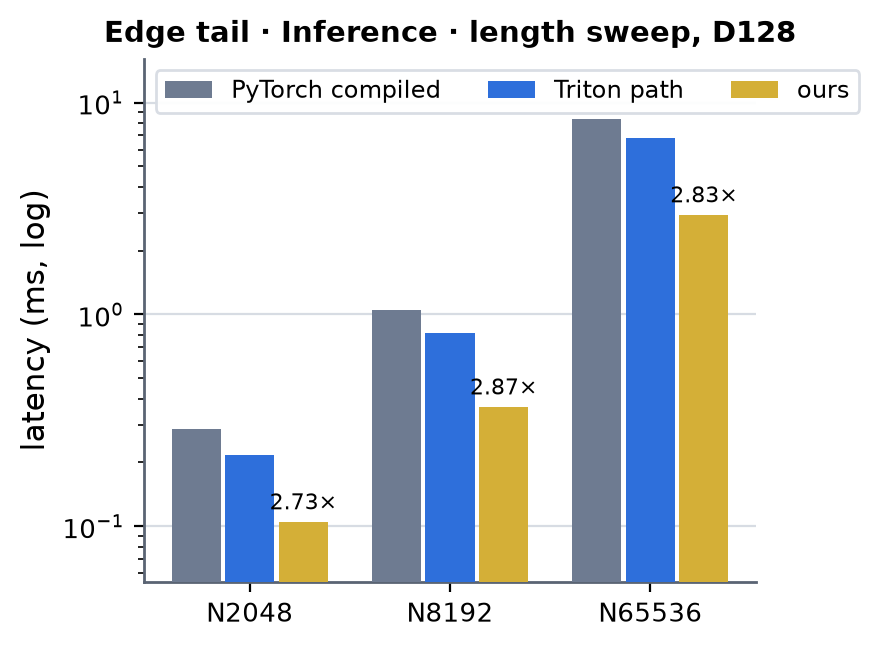 <!-- measure_bars -->

### Edge tail · Training · saved activations (CUDA graph)

| (Length, Dimension) | PyTorch compiled | cuEquivariance | Anthropic | Triton path | ours | × |
|---|---|---|---|---|---|---|
| (2048, 128) | 1.167 | — | — (not measured) | 0.900 | 0.495 | 2.36 |
| (8192, 128) | 4.170 | — | — (not measured) | 3.194 | 1.807 | 2.31 |
| (65536, 128) | 33.263 | — | — (not measured) | 24.984 | 14.779 | 2.25 |

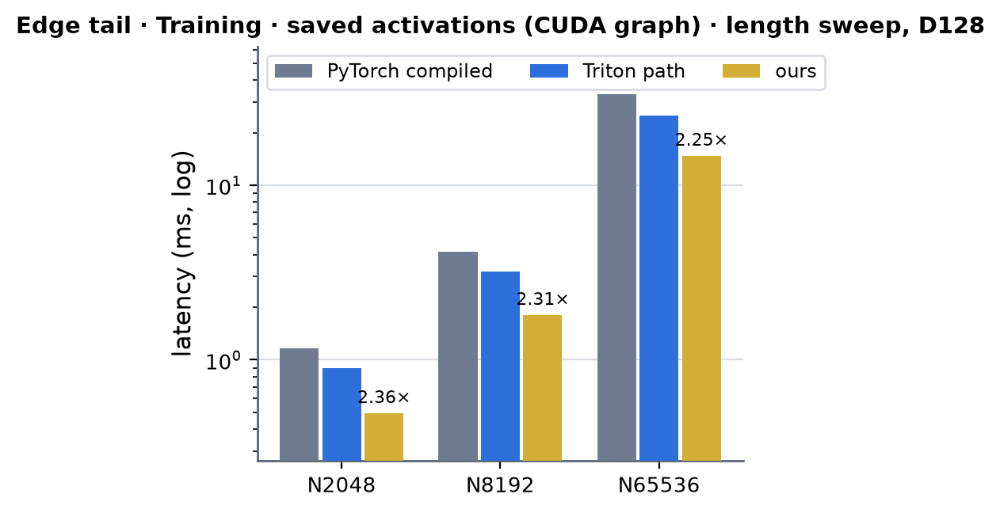 <!-- measure_bars -->

### Edge tail · Training · saved activations (compiled, no CUDA graph)

| (Length, Dimension) | PyTorch compiled | cuEquivariance | Anthropic | Triton path | ours | × |
|---|---|---|---|---|---|---|
| (2048, 128) | 1.221 | — | — (not measured) | 1.405 | 0.778 | 1.57 |
| (8192, 128) | 4.222 | — | — (not measured) | 3.286 | 1.808 | 2.33 |
| (65536, 128) | 33.539 | — | — (not measured) | 25.389 | 14.631 | 2.29 |

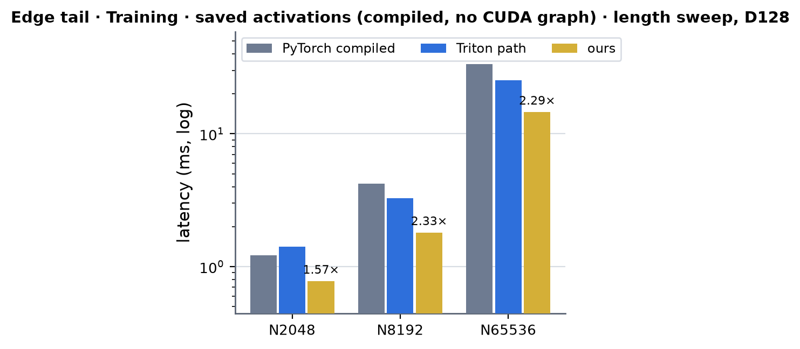 <!-- measure_bars -->

### Edge tail · Training · recompute policy (CUDA graph)

| (Length, Dimension) | PyTorch compiled | cuEquivariance | Anthropic | Triton path | ours | × |
|---|---|---|---|---|---|---|
| (2048, 128) | 1.167 | — | — (not measured) | 2.123 | 0.609 | 1.92 |
| (8192, 128) | 4.170 | — | — (not measured) | 7.878 | 2.249 | 1.85 |
| (65536, 128) | 33.263 | — | — (not measured) | 62.946 | 20.832 | 1.60 |

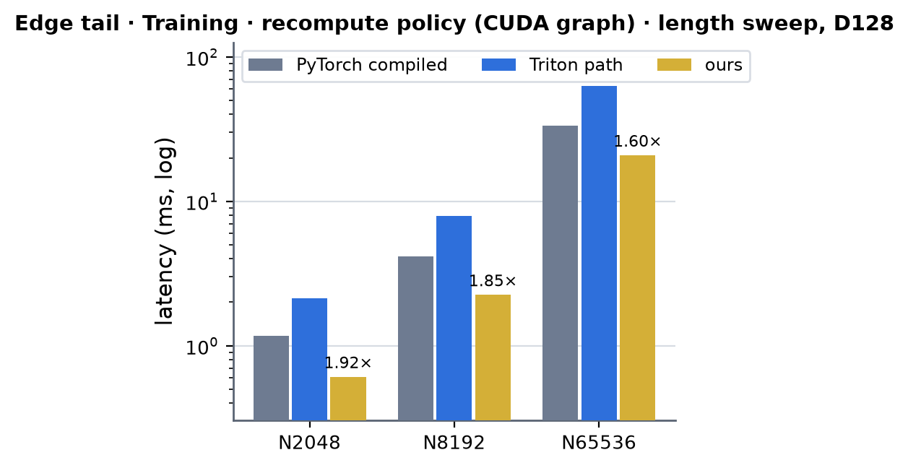 <!-- measure_bars -->

### Edge tail · Training · recompute policy (compiled, no CUDA graph)

| (Length, Dimension) | PyTorch compiled | cuEquivariance | Anthropic | Triton path | ours | × |
|---|---|---|---|---|---|---|
| (2048, 128) | 1.221 | — | — (not measured) | 2.163 | 0.861 | 1.42 |
| (8192, 128) | 4.222 | — | — (not measured) | 7.963 | 2.239 | 1.89 |
| (65536, 128) | 33.539 | — | — (not measured) | 63.078 | 21.058 | 1.59 |

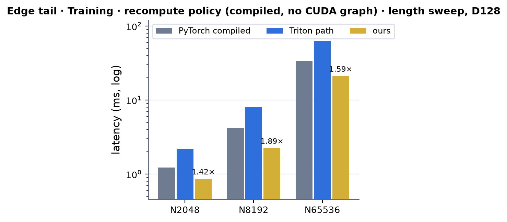 <!-- measure_bars -->

### Edge MLP · Inference

| (Length, Dimension) | PyTorch compiled | cuEquivariance | Anthropic | Triton path | ours | × |
|---|---|---|---|---|---|---|
| (2048, 128) | 0.164 | — | — (not measured) | 0.122 | 0.078 | 2.11 |
| (8192, 128) | 0.634 | — | — (not measured) | 0.424 | 0.267 | 2.37 |
| (65536, 128) | 5.108 | — | — (not measured) | 3.442 | 2.124 | 2.41 |

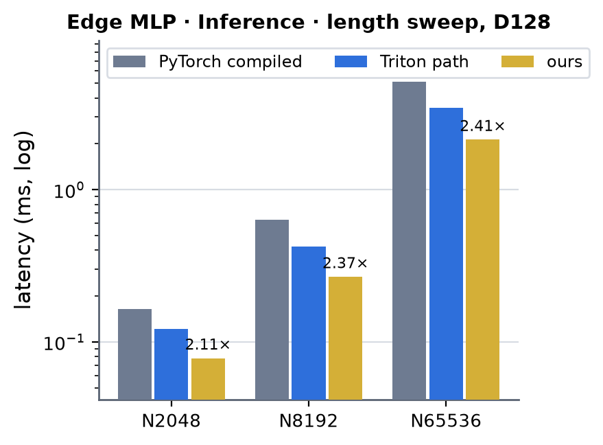 <!-- measure_bars -->

### Edge MLP · Training · saved projection (CUDA graph)

| (Length, Dimension) | PyTorch compiled | cuEquivariance | Anthropic | Triton path | ours | × |
|---|---|---|---|---|---|---|
| (2048, 128) | 0.487 | — | — (not measured) | 0.543 | 0.305 | 1.60 |
| (8192, 128) | 1.774 | — | — (not measured) | 2.099 | 1.071 | 1.66 |
| (65536, 128) | 13.771 | — | — (not measured) | 16.530 | 8.297 | 1.66 |

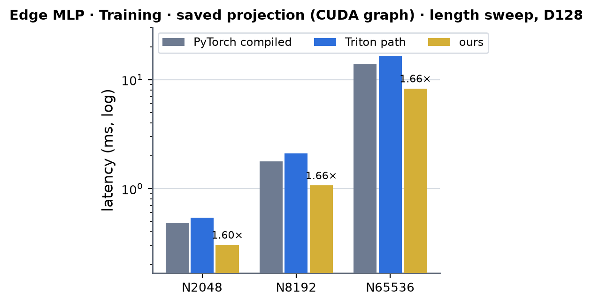 <!-- measure_bars -->

### Edge MLP · Training · saved projection (compiled, no CUDA graph)

| (Length, Dimension) | PyTorch compiled | cuEquivariance | Anthropic | Triton path | ours | × |
|---|---|---|---|---|---|---|
| (2048, 128) | 0.634 | — | — (not measured) | 0.921 | 0.646 | 0.98 |
| (8192, 128) | 1.806 | — | — (not measured) | 2.124 | 1.090 | 1.66 |
| (65536, 128) | 13.989 | — | — (not measured) | 16.758 | 8.454 | 1.65 |

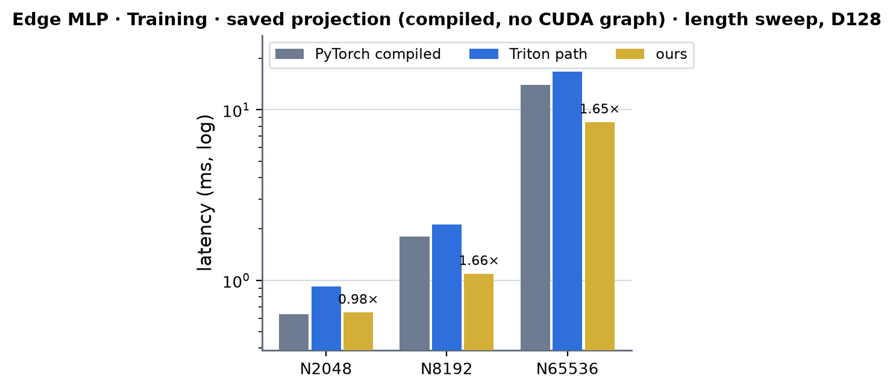 <!-- measure_bars -->

### Edge MLP · Training · recompute policy (CUDA graph)

| (Length, Dimension) | PyTorch compiled | cuEquivariance | Anthropic | Triton path | ours | × |
|---|---|---|---|---|---|---|
| (2048, 128) | 0.487 | — | — (not measured) | 0.558 | 0.327 | 1.49 |
| (8192, 128) | 1.774 | — | — (not measured) | 2.074 | 1.158 | 1.53 |
| (65536, 128) | 13.771 | — | — (not measured) | 16.339 | 9.104 | 1.51 |

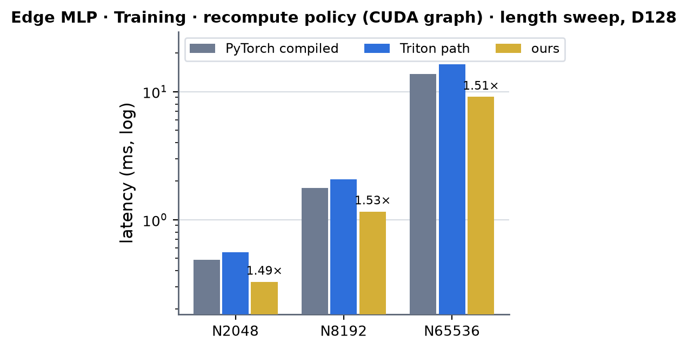 <!-- measure_bars -->

### Edge LayerNorm (memory policy) · Training (CUDA graph)

| (Length, Dimension) | PyTorch compiled | cuEquivariance | Anthropic | Triton path | ours | × |
|---|---|---|---|---|---|---|
| (2048, 128) | 0.109 | — | — (not measured) | 0.100 | 0.092 | 1.18 |
| (8192, 128) | 0.368 | — | — (not measured) | 0.350 | 0.330 | 1.11 |
| (65536, 128) | 2.882 | — | — (not measured) | 2.591 | 2.508 | 1.15 |

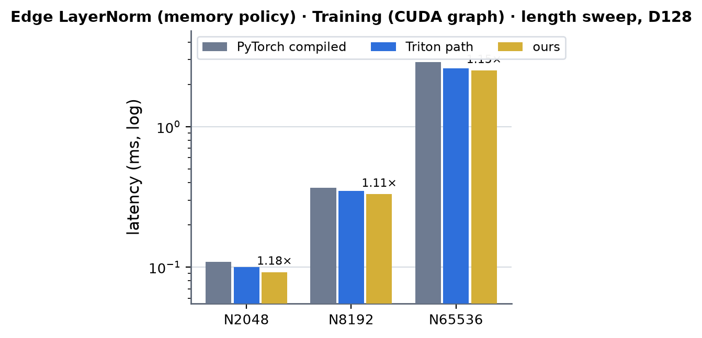 <!-- measure_bars -->

### Edge LayerNorm (memory policy) · Training (compiled, no CUDA graph)

| (Length, Dimension) | PyTorch compiled | cuEquivariance | Anthropic | Triton path | ours | × |
|---|---|---|---|---|---|---|
| (2048, 128) | 0.506 | — | — (not measured) | 0.394 | 0.281 | 1.80 |
| (8192, 128) | 0.445 | — | — (not measured) | 0.638 | 0.335 | 1.33 |
| (65536, 128) | 2.887 | — | — (not measured) | 2.575 | 2.469 | 1.17 |

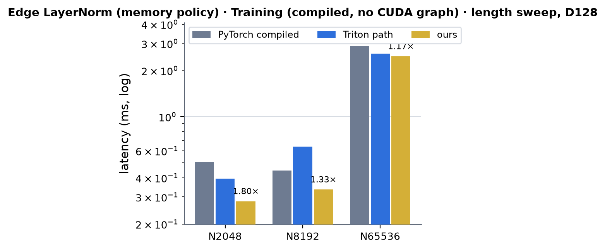 <!-- measure_bars -->

### Edge dropout (bit-packed mask) · Training (CUDA graph)

| (Length, Dimension) | PyTorch compiled | cuEquivariance | Anthropic | Triton path | ours | × |
|---|---|---|---|---|---|---|
| (2048, 128) | 0.090 | — | — (not measured) | 0.095 | 0.092 | 0.98 |
| (8192, 128) | 0.320 | — | — (not measured) | 0.338 | 0.324 | 0.99 |
| (65536, 128) | 2.453 | — | — (not measured) | 2.596 | 2.550 | 0.96 |

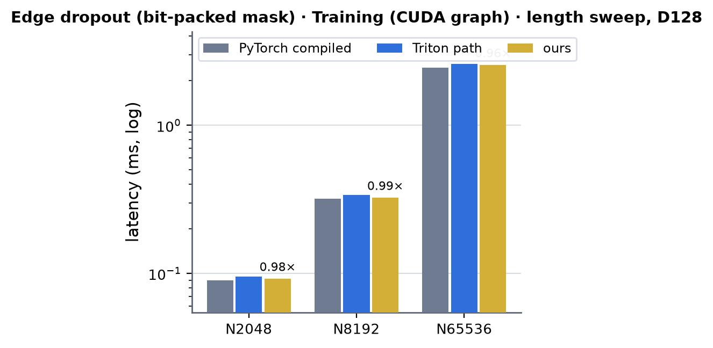 <!-- measure_bars -->

### Edge dropout (bit-packed mask) · Training (compiled, no CUDA graph)

| (Length, Dimension) | PyTorch compiled | cuEquivariance | Anthropic | Triton path | ours | × |
|---|---|---|---|---|---|---|
| (2048, 128) | 0.222 | — | — (not measured) | 0.618 | 0.474 | 0.47 |
| (8192, 128) | 0.360 | — | — (not measured) | 0.621 | 0.452 | 0.80 |
| (65536, 128) | 2.396 | — | — (not measured) | 2.544 | 2.498 | 0.96 |

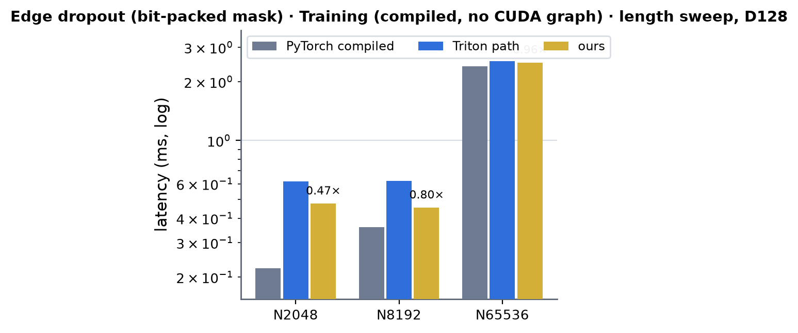 <!-- measure_bars -->

The tail and the MLP are 2.1-2.9x (inference) and 1.6-2.4x (training, CUDA graph) over PyTorch compiled and 1.6-2.1x over the Triton kernels they replace; the Triton recompute policy (`triton`) is slower than PyTorch compiled
(0.5x), the CUDA replay is 1.6-1.9x. The compressed-save LayerNorm and the bit-packed dropout are memory policies: at the byte floor of their design they are 1.1-1.2x PyTorch (LayerNorm) and 0.96-0.99x (the dropout pays a pack and
an unpack pass for a mask 8x smaller than ATen's), and 3-8 % (LayerNorm) and 2-4 % (dropout) faster than the Triton kernels. **Without CUDA graphs a step at N = 2048 is host-bound** (0.78 ms of host time for 0.50 ms of GPU
time, see "Where the time goes"): the tail is still 1.6x (1.22 -> 0.78 ms) but the MLP at 0.98x and the dropout at 0.47x of PyTorch compiled lose to the fixed cost of the compiled graph and an opaque op; from N = 8192 the runner's
numbers equal the replay ones.

**Memory** (the runner's `--metric memory`: peak allocated bytes of one training step beyond its inputs, MB):

| op | implementation | N = 2048 | N = 8192 | N = 65536 |
|---|---|---|---|---|
| edge tail | PyTorch compiled | 207 | 819 | 6,556 |
| edge tail | Triton, saved activations (`triton_compute`) | 250 | 1,001 | 8,006 |
| edge tail | Triton, recompute (`triton`) | 241 | 676 | 1,376 |
| edge tail | ours, saved activations | 226 | 882 | 7,004 |
| edge tail | ours, recompute | 250 | 978 | 2,491 |
| edge MLP | PyTorch compiled | 96 | 384 | 3,072 |
| edge MLP | Triton, saved projection | 72 | 288 | 2,304 |
| edge MLP | Triton, recompute | 72 | 256 | 1,600 |
| edge MLP | ours, saved projection | 79 | 295 | 2,311 |
| edge MLP | ours, recompute | 79 | 295 | 2,311 |
| edge LayerNorm | PyTorch compiled | 29 | 105 | 840 |
| edge LayerNorm | Triton memory policy | 25 | 99 | 792 |
| edge LayerNorm | ours | 25 | 99 | 792 |
| edge dropout | PyTorch compiled | 36 | 144 | 1,152 |
| edge dropout | Triton bitpack | 26 | 102 | 816 |
| edge dropout | ours | 26 | 102 | 816 |

The saved-activation CUDA policy peaks at 7.0 GB at N = 65,536 (PyTorch compiled 6.6 GB, the Triton `compute` policy 8.0 GB: the step keeps 1.3 KB per edge row beyond its inputs). The recompute policy is bounded by its replay slice
(2^19 rows): 2.5 GB at N = 65,536 against 1.4 GB for the Triton recompute kernels, which are 3x slower than the CUDA replay at that size; up to N = 8192 (one slice) it peaks like the saved-activation policy, and its saving is across
layers: one layer's saved set exists at a time instead of every layer's.

**Full model.** `benchmarks/runners/mpnn_training.py` (ProteinMPNN, 3 + 3 layers, native bf16, dropout 0.25, compiled, no CUDA graph, AdamW step included, policy `compute`: the edge tail and the edge MLP take the
`triton_compute` path, the message and node-message kernels stay Triton -- they are the message side's page) on one A100, job 63004, milliseconds per step (peak allocated GiB): B1 x L2048 (N = 2048) PyTorch policy 11.31 (1.36),
Triton `compute` 14.17 (1.02), `compute` with the CUDA edge kernels **12.57** (1.16); B1 x L8192 (N = 8192) 37.54 (4.62), 35.56 (3.22), **32.42** (3.79). So the edge kernels take 11 % (N = 2048) and 9 % (N = 8192) off the step
of the `compute` policy; the rest of the step is the message side, the features, the decoder and the optimizer. The saved activations cost 0.57 GiB at N = 8192 (the saved set is 1.3 KB per edge row against ~0.9 KB of the Triton
`compute` policy, three layers). `--verify` (logits and parameter gradients of every policy against the naive reference at B2 x L128): logit relative L2 0.0080, gradient 0.0042, cosine 0.99999 with the CUDA kernels in the loop
(limits 0.02 / 0.02 / 0.999). The runner's dispatch witness counts Triton launches and therefore asserts after the timing for the CUDA edge kernels (the timing is recorded before): the witness is the Triton path's.

### Speed of light

SoL = `max(compulsory HBM bytes / 1.60 TB/s, FLOP / 240 TFLOP/s)` (both ceilings measured on this card, see [../a100.md](../a100.md)), per kernel from the traffic of its design -- every tensor a kernel reads or writes counts once (the gathered
neighbour / query tables are L2-resident and count once) -- and summed over the kernels of an op. N = 2048 (98,304 edge rows, 25.2 MB per bf16 edge tensor), K = 48, dropout p = 0.25 where a draw is involved. The measured
kernel times are one process's CUPTI times (`torch.profiler`, jobs 62859 / 62725), the step times the runner's CUDA-graph replays of the table below.

| kernel / op | traffic (MB) | floor (µs) | measured (µs) | % of SoL |
|---|---|---|---|---|
| tail inference forward (K2) | 52 (+ 9.7 GFLOP) | 40.3 (tensor) | 95 (p = 0) / 108 (p = 0.25) | 42 % / 37 % |
| tail saving forward (K2 `SAVE`) | 180 | 112.8 | 152 / 158 | 74 % / 71 % |
| tail chain backward (K3) | 204 | 127.3 | 156 / 174 | 81 % / 73 % |
| tail weight gradients (K4; alone / beside K5) | 151 | 94.4 | 113 / 135 | 84 % / 70 % |
| tail reverse graph + reductions (K5, five launches, alone) | 53 | 33.4 | 66 | 51 % |
| **tail training step** (graph replay) | 588 | 367.9 | 495 | **74 %** |
| tail inference op (harness, graph) | 52 | 40.3 | 105 | 38 % |
| MLP inference forward (K6) | 50 | 31.5 | 71 (kernel) / 78 (op) | 44 % / 40 % |
| MLP saving forward | 76 | 47.2 | 80 | 59 % |
| MLP chain backward | 126 | 78.6 | 110 | 72 % |
| MLP weight gradients (GELU on the A tile) | 101 | 62.9 | 94 | 67 % |
| **MLP training step** (graph replay) | 302 | 188.7 | 305 | **62 %** |
| LayerNorm backward kernel (K7) | 75 | 47.2 | 51 | 93 % |
| **LayerNorm memory-policy step** (graph replay) | 126 | 78.6 | 92 | **85 %** |
| **bit-packed dropout step** (graph replay) | 129 | 80.6 | 92 | **88 %** |

The inference forward is not memory bound: it is the tensor floor that matters, and the kernel is issue / latency bound (see K2), at 40 % of it. The training kernels sit at 70-85 % of their byte floors; what is left in the tail's
step is the five small launches of K5 (latency bound) and the 18 us finalize that wait for the weight gradients.

### Where the time goes (tail training step, N = 2048, p = 0.25)

Per-kernel start / end from the profiler's trace of one backward (`torch.profiler` chrome trace, job 62859; times in µs from the chain kernel's start), and the CUDA-graph step they add up to.

| phase | kernels (µs) | span |
|---|---|---|
| forward | `pack_kernel` 4 -> `tail_fwd_kernel<SAVE>` 158 | 162 |
| backward, setup | `pack_kernel` (backward image) 4, zero fill of the counters 2 | 6 |
| backward, chain | `tail_bwd_kernel` 0 -> 171 | 171 |
| backward, main stream | `dw_kernel` 172 -> 313 (141: it shares the GPU), `dw_finalize_kernel` 314 -> 333 (19) | 161 |
| backward, side stream | `csr_count` 30, `csr_scan` 20, `csr_fill` 29, `nbr_reduce` 54, `query_reduce` 19 (173 -> 331) | 158 |
| **step** | forward + setup + chain + max(main, side) | **~500** (graph replay 0.495 ms) |

Both streams end within 2 us of each other: the step is balanced, so a further gain needs fewer bytes (the saved set) rather than a better schedule. MLP training step (N = 2048): forward 80 + chain 110 + weight
gradients 94 + finalize 10 + two packs 8 = 302 us (replay 305).

**Host cost.** The family runner measures training without CUDA graphs, where one tail step at N = 2048 costs 0.78 ms of host time (`torch.profiler`, CPU + CUDA, job 62859: the compiled-graph wrappers, Dynamo guard
evaluation and the ten `AccumulateGrad` nodes take about 0.45 ms, the extension's 20 allocations and 11 launches about 0.1 ms; the PyTorch arm pays 0.91 ms for its own compiled graph) against 0.50 ms of GPU time. The C++ side of
every entry point costs 8 us (`pack`), 14 / 18 us (forward without / with saves), 53 us (tail backward, 11 launches), 24 us (MLP backward), 14 us (LayerNorm backward) and 6-8 us (dropout) per call (`cpu_cost.py`, job 62859).
The runner's numbers therefore understate the kernels at N = 2048 and converge to the replay numbers from N = 8192.

### What was tried and did not pay (2026-10-04)

- **Staggering the warps of the forward** (`__nanosleep` offsets so that the three warps of a scheduler are in different tensor / FP32 phases): inference 94.0 -> 95.0 us. Not kept.
- **Prefetching the forward's loads.** With every load hitting L1 / L2 (a small row set, the stores unchanged) the inference kernel takes 93.0 us instead of 94.0: it is issue / latency bound (4.2 K instructions per
  tile, half of them the two GELUs, FP32 pipe ~38 % busy), not memory bound. The saving forward drops from 152 to 136 us, so a `cp.async` ring for the edge rows could win at most 16 us of 152: not built.
- **The reverse graph in one CTA** (counts, scan and fill in shared memory, 1024 threads): 159 us against 31 us for the three launches (24 of a node's 48 neighbours are consecutive nodes: the shared-memory atomics of a warp hit
  one bank). Not used.
- **A 4 KB shared-memory scan** in the reverse graph's second kernel held it back for 57 us: it runs beside the weight-gradient kernel, whose CTAs leave only 3 KB of the 100 KB carve-out. Found on a per-kernel
  timeline of one backward (start / end of every kernel from the profiler's trace); the scan now uses shuffles and 128 bytes.
- **`dw_finalize` with four threads per output** (200 blocks instead of 50): 9.8 -> 7.5 us alone, but 1.3 % slower inside the tail's backward, where it shares the GPU with the side stream's kernels. Reverted.
- **A whole-tensor replay for the tail's `triton` (recompute) policy** (the first version: the backward re-ran the saving forward over all rows): the forward kept nothing, but the backward still materialised the layer's whole saved
  set (1.3 KB per edge row: 7.0 GB at N = 65,536, the same peak as the saved-activation policy for one op; the Triton recompute path peaks at 1.4 GB there). It now replays and consumes slices of 2^19 rows
  (whole nodes), fp32 sums of the slices rounded once: the peak per op is bounded, the price is the second forward (0.61 against 0.49 ms at N = 2048) and one `row_base` argument of the forward kernel.
- **Packing the weights once per parameter version** (4 us per call, 8 per training step): rejected, a stale pack after an optimizer step is silent corruption and the gain is 1.5 %.
- **Cheaper GELUs** (tanh form, fp16x2 arithmetic) would cut the instruction count of the two activations by half or more but not the exact-erf contract: the error budget of the bf16 chain is spent by the roundings
  the Triton path already has. Not done.
- **A hand-written LayerNorm forward** (cast, statistics, normalise, affine in one kernel): the memory policy's forward is PyTorch's native LayerNorm bit for bit and is fused by Inductor already (the whole
  step is 96 us against a 79 us byte floor). Not done.
- **A shorter MLP backward by saving `act` and the derivative** like the tail does (no GELU in the weight-gradient kernel): estimated -20 us of 293 at N = 2048, not built.

### Limits and next

- Not served (they run the Triton / PyTorch path as before): fp32 activations, widths other than 128, non-contiguous activations, other cards, `MINIWORLD_MPNN_EDGE_SM80=0`, a failed extension build.
- `grad_neighbor` is not bitwise reproducible (the order of a node's rows in the reverse graph comes from an atomic counter; the sums are fp32, rounded to bf16 once, so at most one bf16 ulp of an element differs between runs).
- Training without CUDA graphs (the family runner's mode) is host-bound at N = 2048: the compiled step costs about 0.87 ms of host time (Dynamo guards, the compiled-graph wrappers, ten `AccumulateGrad` nodes, 31
  allocations and 15 launches of the extension, which itself takes ~100 us), against 0.50 ms of GPU time. From N = 8192 on the GPU time dominates and the runner's numbers approach the CUDA-graph ones.
- The edge MLP's weight-gradient kernel applies the GELU to the A tile in registers (67 % of its byte floor): saving the GELU output and the derivative in the forward, as the tail does, is the next step for it.
- The reverse-graph build (count, scan, fill) is latency bound (~50 us of small kernels beside the weight gradients): building it once per graph instead of once per layer needs a cache keyed by the neighbour tensor,
  which the module would have to own (a stale cache would corrupt the gradient silently).
- fp32 (TF32) paths: nothing to do while the Triton contracts and the registry are bf16-only.
