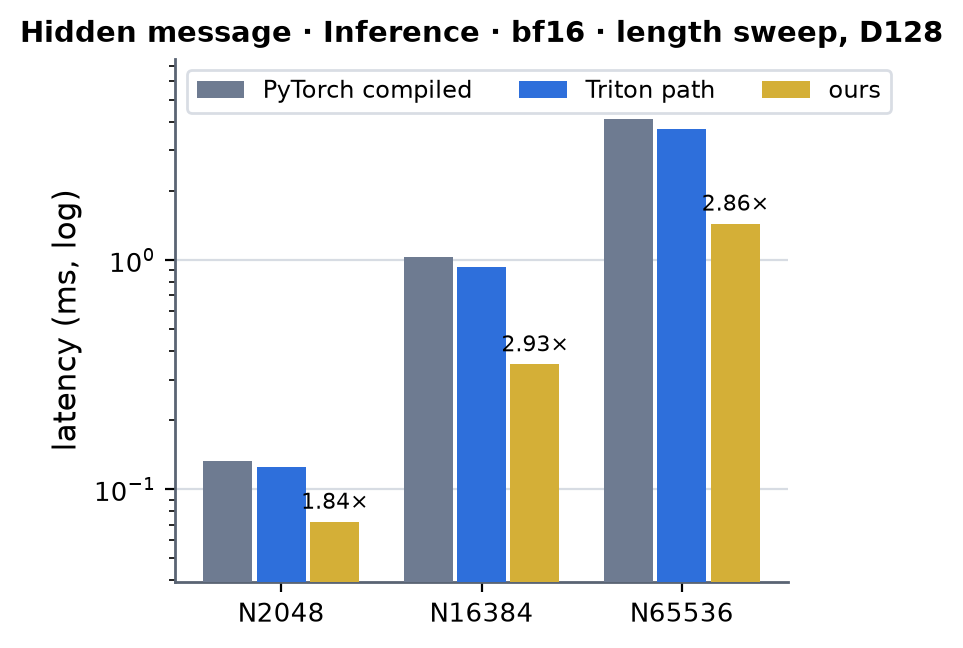
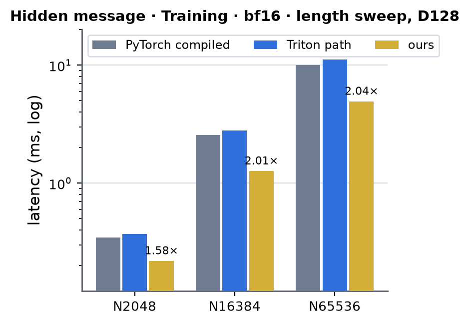
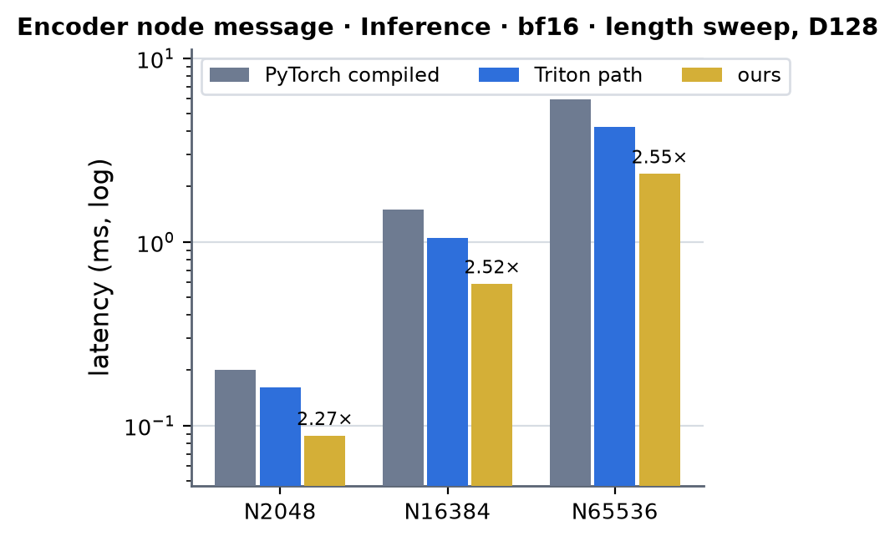
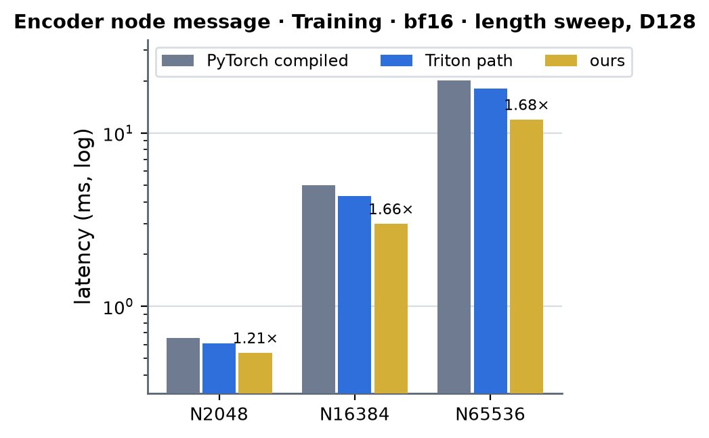
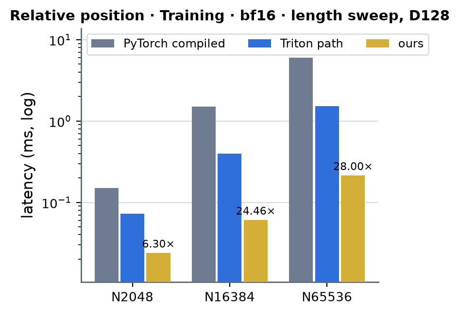

# ProteinMPNN message side on A100 (sm80)

Kernel-level status of the message-side ops of the ProteinMPNN module (`modules/mpnn`) on A100: the hidden-message reduction (`mpnn_message`), the fused encoder node message (`mpnn_node_message`) and
the relative-position embedding's backward (`mpnn_relative_position`); the module-level summary is in [../a100.md](../a100.md). The edge side (`mpnn_edge_*`) is a separate page. There are no registry rows for MPNN: the
shapes are those of the repo's runners (`benchmarks/runners/mpnn_compare.py`, `mpnn_blocks.py`, `mpnn_training.py`) and drivers -- one graph of N query nodes with the batch folded into the length axis, K = 48 neighbours
(the hidden message hard-codes 48; the node message serves K <= 128), width 128 everywhere (hidden / node / edge), a 66 x 16 relative-position table. Columns are `(Length, Dimension)` = (N, 128), N = 2048 (the shipped crop and the
driver default), 16384 (eight crops) and 65536 (B8 x L8192 of the large runs).

Summary (2026-10-04). bf16 (native parameters) and bf16-mixed (fp32 parameters under bf16 autocast), inference and training, forward **and** backward, in hand CUDA on the default A100 dispatch; the Triton paths stay as the
fallback. Against PyTorch compiled (CUDA graph; no cuEquivariance or Anthropic arm exists for these ops), N = 16384: the hidden message 2.93x inference / 2.01x training, the encoder node message 2.52x / 1.66x, the
relative-position backward 24x (3.0-7.1x faster than the Triton reduction it replaces, which is 2.1-4.0x faster than PyTorch's). The Triton path has no A100 autotune cache and is no faster than PyTorch compiled for the hidden message (0.93-1.08x in inference, 0.9x in training) and
1.1-1.4x faster for the node message, so a speed-up "against Triton" would flatter: every x below is against PyTorch compiled. Accuracy: the CUDA paths are as accurate as the bf16 module -- every output and gradient is
within 1.0x of its error against an fp64 evaluation (the dP / dW / db of the hidden message at 0.75 / 0.36-0.45 / 0.17 of it, see Numerics). All reductions are deterministic: there is no atomic anywhere (bit-for-bit repeatable runs,
`torch.compile` and CUDA-graph replay equal eager). Time-roofline SoL at N = 16384 (hidden message 38 % inference / 36 % training, node message 36 % inference / 53 % of the byte floor of its backward): the hidden message and the node message forward are
bound by the two GELUs per element on the FP32 pipe (65 % of that pipe's floor in the hidden-message forward), see Speed of light.

On A100 the three ops run **hand-written CUDA** from the kernel families' `interface.py` through `integrations/mpnn_msg_sm80.py` when the call matches the contract: capability exactly 8.0 (an A100; not the A6000 / A5000, not H100 / B200),
the engine backend not forced to Triton (`settings.configure(engine_backend="triton")`) and `MINIWORLD_MPNN_MSG_SM80` not `0`. Everything else keeps the existing path unchanged; a failed extension build warns once and keeps it too.

- **`message_hidden_reduce`** (`reduced[g] = sum_k mask[g, k] gelu(gelu(P[g, k]) W^T + b) / scale`): P [..., 48, 128] bf16, W [128, 128] and b [128] bf16 -- or fp32 under bf16 autocast -- fp32 mask, fp32 `reduced`. Served for the policies
  `auto`, `triton_compute` and `triton_memory` (all three run the same path: the backward replays the forward and saves only its inputs); `pytorch` keeps the reference. Inference and training.
- **`node_message_reduce`** (`reduced[g] = sum_k mask[g, k] gelu(gelu(q[g] + E[g, k] W1e^T + nb[idx[g, k]]) W2^T + b2) / scale`): bf16 edge states [B, T, K, 128] with K <= 128, bf16 node projections, int64 indices, a bf16 or
  fp32-under-autocast edge block / hidden weight and bias, an fp32 or bf16 mask. Both Triton policies (`triton`, `triton_compute`) run the same path (recompute-only backward). Inference and training.
- **`relative_position_embed`, policy `triton`** (`F.embedding(bucket, table) + bias`): the forward is the plain lookup in every arm; the CUDA kernel replaces the backward's bucket reduction -- a [16-channel, <= 79-bucket] table in bf16 or fp32 (the shipped 66 x 16
  qualifies; everything else keeps the Triton reduction). The model's default policy is `off` (PyTorch), so this is served where a caller selects `triton` -- the benchmark runners do.
- `MINIWORLD_MPNN_MSG_SM80=0` keeps the Triton paths for all three (the existing Triton tests set it). `MINIWORLD_MPNN_MSG_SM80_BWD=split` runs the hidden message's older two-step backward (kernel + cuBLAS dW) for A/B work.
- Nothing here autotunes: the kernels have fixed launch shapes (one CTA per SM, persistent), the three extensions are built on first use into `~/.cache/torch_extensions` (`mpnn_message_sm80`, `mpnn_node_message_sm80`, `mpnn_relpos_sm80`; about 100 s each).

## Completion status

(The module-level rows for [../a100.md](../a100.md) are proposed in the worker's report; the maintainer's 성능 확인 call is not made here.)

| (N, width, dtype) | (2048, 128, bf16) | (16384, 128, bf16) | (65536, 128, bf16) | (16384, 128, bf16-mixed) |
|---|---|---|---|---|
| implementation: hidden message, inference and training | CUDA | CUDA | CUDA | CUDA |
| implementation: encoder node message, inference and training | CUDA | CUDA | CUDA | CUDA |
| implementation: relative-position backward (policy `triton`) | CUDA | CUDA | CUDA | CUDA |
| 성능 확인 | ✗ | ✗ | ✗ | ✗ |
| cache build | ✓ | ✓ | ✓ | ✓ |

## Kernels

All kernels share `mpnn_common.cuh` (`kernels/mpnn_message/cuda/sm80/`): the PTX wrappers (`cp.async` 16-B with the zero-fill form, `ldmatrix(.trans)`, `mma.sync.m16n8k16` bf16 -> fp32, 16-B-granule swizzle of 256-B rows
`granule ^ (row & 7)`), the packed bf16 add (`fma.rn.bf16x2`, one instruction for the 7 of an fp32 add of two rounded values) and the GELU.

### G · the cheap exact GELU (`gelu_f`, `gelu_grad_f`)

The two GELUs per element are the cost of these ops: the forward is bound by the FP32 pipe and the MUFU, not by HBM or the tensor cores (`erff` of libdevice is ~30 FP32 instructions + 1 MUFU: 402 G gelu/s on this card, the form below 878 G/s and
its derivative 3.4 -> 1.2 ps). `gelu(x) = relu(x) - u tail(u)`, `u = |x|`, `tail(u) = 1 - Phi(u) = e R(t)` with `e = exp(-u^2 / 2) = 2^(-v^2)` (v = sqrt(log2(e) / 2) u: ONE `ex2`), `t = 1 / (1 + c u)` (ONE `rcp`) and `R(t)` a polynomial of degree 3
fitted by minimax to the absolute error of gelu and gelu' together (`gelu'(x) = (x >= 0) ? 1 - w : w`, `w = tail(u) - u phi(u)`): 8 FMA-pipe instructions + 1 ALU + 2 MUFU per gelu, 10 + 1 + 2 per derivative; absolute error 1.36e-5 for both over all fp32 inputs (the result is rounded to
bf16 right away: half an ulp at 0.5 is 2e-3). Degrees 4 / 5 (1.1e-6 / 9.8e-8) are `MP_GELU_D=4|5` builds; degree 2 flips 10 % of the bf16 results of N(0, 1) inputs against the correctly rounded exact function (0.7 % at degree 3) and was rejected.
gelu / gelu' are bit-identical wherever they are recomputed (the forward replay in a backward pass).

### M1 · `msg_fwd_kernel` (the hidden message, forward and no-grad inference; `msg_fwd_sm80.cuh`)

`a = bf16(gelu(P)); projected = bf16(a W^T + b); hidden = bf16(gelu(projected)); reduced[g] = sum_k mask hidden / scale`, all rounding points those of the Triton kernel and the bf16 module. One kernel, nothing edge-sized is written. The GEMM runs
TRANSPOSED, `C^T[o][n] = sum_i W[o][i] a[n][i]`: W's row-major `[out, in]` layout is the A-fragment layout (`ldmatrix` from shared memory, the 32 KB weight resident, one swizzled copy per CTA) and the GELU'd activation tile is the B operand straight
from registers (the `ldmatrix`'d P tile through `gelu` -> `pack_bf16`), so the neighbour reduction over the 48 rows of a group is a sum over the columns of C^T: thread-local plus one quad shuffle per group, not a three-level cross-lane
reduction. One warp = one group at a time (three 16-row tiles), no inter-warp traffic: 16 warps per CTA, one CTA per SM (persistent), each warp a single-buffered 4 KB tile (`cp.async`, the next tile requested right after the 8 `ldmatrix`
have consumed it, so the copy overlaps the whole compute of the tile). Two output m-tiles are interleaved: four independent accumulator chains per k step. 128 registers per thread (28 B of spill), FMA pipe 65 % / MUFU 51 % / tensor 26 % busy
(`ncu`).

### M2 · `msg_bwd_fused_kernel` (the hidden message's whole backward: dP, dW, db; `msg_bwd_fused_sm80.cuh`)

Replays the forward per 16-row tile (nothing was saved): `dproj = bf16(g[group, o] mask[n] / scale * gelu'(projected))`, `dX = dproj W`, `dP = bf16(dX gelu'(P))`, `dW = sum dproj^T a`, `db = sum dproj`. The replay GEMM is transposed as in M1; its epilogue (bias, gelu', mask and
group gradient) writes dproj^T [o][n] to a shared tile (STS.32 pairs along n) whose transposed `ldmatrix` are the A fragments of dX (m = n, k = o; B = W through `ldmatrix.trans`), done in two halves of 64 channels. **dW and db never reach HBM**: the
CTA's 8 warps work in stages of one tile each; every warp leaves its `a` tile and dproj^T tile in shared memory, and after a barrier warp w multiplies, for every tile of the stage, ITS 16 rows of dproj^T (already an A fragment) with `a` (`ldmatrix.trans`) into
its 16 x 128 slice of dW -- 16 `mma` and 9 `ldmatrix` per tile, the slice held in 64 fp32 registers for the whole kernel -- and with a B of ones into the same rows of db (one more `mma`: every column of its result is the row sum). The per-CTA slices go to one
`[ctas][128][128]` buffer, summed in CTA order by a small kernel (`dw_reduce_kernel`); dP leaves through a 4 KB shared staging tile as whole 128-byte row segments (a store from the fragment layout is 4 bytes per lane, 8 rows x 16 B per instruction, which
throttled the load-store queue). After the stage barrier warps 0-3 run their dW slice and then the GELU of their next tile, warps 4-7 the other way round, so the two warps of a scheduler keep the tensor pipe and the FP32 pipe busy at the same time; the 16
group-gradient values of a lane are read when the tile starts. 8 warps, 255 registers (no spill), 165 KB of shared memory, one CTA per SM. The older two-step form (`msg_bwd_sm80.cuh`: dP + `a` + dproj to HBM, then one cuBLAS GEMM per chunk) is kept
(`fused=False`).

### N1 · `node_fwd_kernel` (the encoder node message, forward and no-grad inference; `node_fwd_sm80.cuh`)

`pre = bf16(bf16(q + bf16(E W1e^T)) + nb[idx]); act = bf16(gelu(pre)); hid = bf16(act W2^T + b2); reduced[g] = sum_k mask bf16(gelu(hid)) / scale`. Per 16-row tile of a group, one warp, no inter-warp traffic. GEMM 1 runs in the natural orientation (A = the E tile
through `ldmatrix`, B = W1e through `ldmatrix`), in two halves of 64 output channels (32 accumulators live: 168 registers, 12 warps per SM); the epilogue adds the query row (registers) and the gathered neighbour row (the table is small: its rows arrive by
`cp.async` into a shared tile, addressed by the int64 index loaded a tile ahead) with the two **packed** bf16 additions (`fma.rn.bf16x2`: one rounding of the exact sum, 8 % of the kernel), and runs the first GELU; its packed result is exactly the B-fragment
layout of the transposed GEMM 2 `C^T[o'][n] = sum_o W2[o'][o] act[n][o]`, whose epilogue (bias, GELU, mask) sums over the columns n as in M1 -- no shuffles between the GEMMs. Both weights (64 KB) and the bias stay in shared memory, one copy per CTA.
The edge tile of the next tile is requested when GEMM 1 has consumed this one, the gathered neighbour tile once the epilogue has.

### N2 · `node_bwd_kernel` + the glue of `sm80.py` (the node message's backward)

The kernel replays the forward (GEMM 1 in halves, GEMM 2) per tile, then `dh = bf16(gh gelu'(hid))` (dh^T to a shared tile; the bias gradient and `dquery` are reduce-scatters over the quad / over the eight row lanes into persistent registers),
`dact = dh W2` (transposed `ldmatrix` of that tile are its A fragments; two halves), `dpre = bf16(dact gelu'(pre))` (in the layout of `pre`, so `gelu'` needs no reload, and as packed registers it is directly the A fragments of) `dedge = dpre W1e`. Outputs
`dedge`, `dquery` (bf16), `dpre`, `dh`, `act` ([rows, 128] bf16: the operands of the two weight-gradient GEMMs and of the neighbour scatter) and `db2` as one partial row per CTA. The four big outputs leave through shared staging tiles as 16-byte stores of whole 256-byte
rows (`act` through the neighbour tile, whose next gather is requested right after; `dh`, `dpre`, `dedge` through the dh^T tile once its last transposed read is done). Glue: `dW1e = dpre^T E` and `dW2 = dh^T act` are cuBLAS GEMMs
(fp32 outputs, accumulated across row chunks in fp32: no bf16 rounding of the weight gradients); the neighbour gradient `dnb[j] = sum of the dpre rows whose edge points at j` is a deterministic segmented sum -- the edges sorted STABLY by destination
(`argsort` of the int32 keys, ascending edge id inside a node: a fixed summation order), the segment starts from an integer histogram (`scatter_add_` of ones: exact) and a cumulative sum, then `nb_reduce_kernel` (a warp per node, 4 channels per lane, 8 rows in flight) -- instead of
fp32 atomics. 8 warps, 255 registers (100 B of spill), 160 KB of shared memory. The dW GEMMs cannot move into the kernel: the cross-warp tile scheme of M2 needs the act, dh^T, E and neighbour tiles of every warp
(16 KB x 8 + the 64 KB of weights = 192 KB against 163 KB).

### R1 · `relpos_kernel` + `relpos_reduce_kernel` (the relative-position backward; `relpos_sm80.cuh`)

`grad_table[b] = sum of the gradient rows of the edges in bucket b`, `grad_bias = sum of all rows`: 786432 rows at N = 16384 (6.3 M at B16 x T8192), a third of them in the two clamp buckets, where an atomic scatter or `F.embedding`'s sort-and-segment
backward costs 5-30 ms. Here the scatter is a MATMUL against the one-hot of the bucket on the tensor cores: per 16 edges one `mma.m16n8k16` set with A = onehot^T [80 bucket rows x 16 edges] (exact 0 / 1 in bf16) and B = the 16 x 16 gradient tile (a bf16
gradient is an exact operand; an fp32 gradient is split into three bf16 pieces hi + mid + lo that sum to it exactly: three `mma`), fp32 accumulation; the bias gradient rides in the 80th row (an all-ones A row), so it is free. Every warp owns a contiguous chunk of
steps and accumulates it in registers, the warps of a CTA are combined in warp order and the CTAs' partial tables in CTA order by `relpos_reduce_kernel`: bit-reproducible. Each warp streams its rows through a 4-stage `cp.async` ring: an HBM stream at 40 B / edge
(bf16), three CTAs of 8 warps per SM.

### Determinism

No atomic anywhere in these paths: the grid is one CTA per SM, every reduction has a fixed order (registers inside a warp, warp order inside a CTA, CTA order across the grid, a stable sort for the neighbour scatter), so repeated runs are bit-identical; the
order depends on the SM count (108 on this card), so results are repeatable per device type, not across them.

## Numerics

Every output and gradient against an fp64 evaluation of the same operands, relative L2 error, with the bf16 PyTorch module's own error in the same regime in brackets (tests: `tests/integrations/test_a100_mpnn_msg_gpu.py`, the bound is ratio <= 1.1 plus a small floor;
probes `probes/test_msg.py` / `test_node.py`):

| op | output | dP / dedge | dW / dW1e, dW2 | db / db2 | other |
|---|---|---|---|---|---|
| hidden message (2048 groups) | 1.00e-3 (1.01e-3) | 2.65e-3 (3.54e-3) | 1.15e-3 (3.25e-3) | 4.3e-4 (2.46e-3) | |
| node message (2048 nodes) | 9.3e-4 (9.3e-4) | 4.37e-3 / 4.67e-3 = 0.94 | 3.87e-3 / 4.78e-3 = 0.81, dW2 0.64 | 0.69 | dquery 0.99, dnb 0.97 (ratios to the bf16 module's error) |

The CUDA paths keep fp32 where the Triton kernel rounds to bf16 in one place (the group gradient times the mask enters the GELU derivative unrounded; dX stays fp32 into the derivative), so they differ from the Triton / PyTorch arms by about 4e-3 in the gradients
(`grad_rel` of the bench: 4.0e-3 / 3.4e-3 / 2.7e-3 for the hidden message's dP / dW / db at N = 16384, 3.6e-3 .. 3.9e-3 for the node message's, against the runner's own limit of 0.05) while being closer to the exact value. The packed bf16 add of the node message
is the reference's two-step fp32 add whenever the fp32 sum of two rounded values is exact (it rounds once instead of twice otherwise: bit-identical on every test input).

## Measurements (2026-10-04)

The repo runner's own inputs (`benchmarks/runners/mpnn_compare.make_case`: one graph, K = 48 with 24 local + 24 random neighbours, an fp32 mask with 20 % zeros, bf16 native parameters or fp32 under autocast), A100 80GB PCIe, torch 2.13.0+cu129;
each row is the median of the CUDA-graph replays of the `torch.compile(fullgraph=True)` callable (inference: the forward; training: forward + backward, no optimizer), the four arms in ONE process (`probes/bench_final.py`, from the snapshot `snaps/snap_1004_014547`): PyTorch
compiled, the Triton path (`engine_backend` forced to Triton: the best of its two policies where it has two) and ours (the default dispatch). Milliseconds; × = PyTorch compiled's time / ours (cuEquivariance and Anthropic have no arm for these ops: `—`, `— (not measured)`;
the Triton path is a reference column and never the denominator). Jobs 63081 (bf16, N = 2048 / 16384 / 65536) and 63082 (bf16-mixed, N = 16384); the run-to-run spread between nodes is ~10 %, and the power cap makes the sustained clocks lower than a short probe's
(the kernel A/B probes below run 5-10 % faster).

### Hidden message · Inference · bf16

| (Length, Dimension) | PyTorch compiled | cuEquivariance | Anthropic | Triton path | ours | × |
|---|---|---|---|---|---|---|
| (2048, 128) | 0.133 | — | — (not measured) | 0.125 | 0.072 | 1.84 |
| (16384, 128) | 1.026 | — | — (not measured) | 0.927 | 0.350 | 2.93 |
| (65536, 128) | 4.112 | — | — (not measured) | 3.724 | 1.438 | 2.86 |

 <!-- measure_bars -->

### Hidden message · Training · bf16

| (Length, Dimension) | PyTorch compiled | cuEquivariance | Anthropic | Triton path | ours | × |
|---|---|---|---|---|---|---|
| (2048, 128) | 0.345 | — | — (not measured) | 0.371 | 0.219 | 1.58 |
| (16384, 128) | 2.552 | — | — (not measured) | 2.781 | 1.267 | 2.01 |
| (65536, 128) | 10.092 | — | — (not measured) | 11.184 | 4.940 | 2.04 |

 <!-- measure_bars -->

The Triton path's other policy (`triton_memory`, recompute) is 0.513 / 3.873 / 15.526 ms in training; the two policies are the same in inference. bf16-mixed, N = 16384: inference 1.002 / 0.967 / 0.351 (2.85x), training 2.508 / 2.812 / 1.233 (2.03x).

### Encoder node message · Inference · bf16

| (Length, Dimension) | PyTorch compiled | cuEquivariance | Anthropic | Triton path | ours | × |
|---|---|---|---|---|---|---|
| (2048, 128) | 0.200 | — | — (not measured) | 0.161 | 0.088 | 2.27 |
| (16384, 128) | 1.491 | — | — (not measured) | 1.047 | 0.590 | 2.52 |
| (65536, 128) | 5.969 | — | — (not measured) | 4.206 | 2.345 | 2.55 |

 <!-- measure_bars -->

### Encoder node message · Training · bf16

| (Length, Dimension) | PyTorch compiled | cuEquivariance | Anthropic | Triton path | ours | × |
|---|---|---|---|---|---|---|
| (2048, 128) | 0.653 | — | — (not measured) | 0.610 | 0.538 | 1.21 |
| (16384, 128) | 4.968 | — | — (not measured) | 4.316 | 2.992 | 1.66 |
| (65536, 128) | 20.095 | — | — (not measured) | 17.980 | 11.967 | 1.68 |

 <!-- measure_bars -->

The Triton path's recompute policy (`triton`) is 1.039 / 7.139 / 28.225 ms in training; its `triton_compute` policy (saves two projections) is the column above. bf16-mixed, N = 16384: inference 1.435 / 1.072 / 0.577 (2.49x), training 4.817 / 4.328 / 2.927 (1.65x).

### Relative position · Training · bf16

| (Length, Dimension) | PyTorch compiled | cuEquivariance | Anthropic | Triton path | ours | × |
|---|---|---|---|---|---|---|
| (2048, 128) | 0.151 | — | — (not measured) | 0.073 | 0.024 | 6.30 |
| (16384, 128) | 1.495 | — | — (not measured) | 0.400 | 0.061 | 24.46 |
| (65536, 128) | 6.010 | — | — (not measured) | 1.521 | 0.215 | 28.00 |

 <!-- measure_bars -->

The `index_add` policy is 0.151 / 1.488 / 5.981 ms. bf16-mixed, N = 16384: 1.516 / 0.390 / 0.104 (14.6x). The relative-position forward is the plain lookup in every arm (inference 4.3-5.2 us / 14 us / 86 us at the three sizes, equal across the arms: the CUDA path adds nothing and takes nothing).

Kernel-level probes (one process, A/B, no graph; `probes/test_msg.py`, `test_node.py`, `test_relpos.py`; their inputs are random, the runner's are not, and they run at a shorter-burst clock): hidden-message forward 73 / 342 / 1403 us and fused backward 149 / 862 / 3524 us for
2048 / 16384 / 65536 groups (the two-step backward: 213 / 1345 / 5398); node forward 90 / 522 / 2165 us; relative-position backward 45 / 136 us for 0.79 M / 3.1 M edges in bf16 (700 / 929 GB/s), against the Triton reduction's 385 / 1443 us.

### Speed of light

SoL = `max(essential bytes / 1.60 TB/s, FLOP / 240 TFLOP/s)` (both measured on this card, `experiments/a100_trimul_fwd`), every tensor counted once, N = 16384 (786432 edges, 100.7 M elements per stage):

| op | mode | ours (us) | bytes (MB) | FLOP (G) | floor (us) | % of SoL |
|---|---|---|---|---|---|---|
| hidden message | inference | 350 | 213 | 25.8 | 133 | 38 % |
| hidden message | training: forward + fused backward | 342 + 830 | 213 + 421 | 25.8 + 77.3 | 133 + 322 | 36 % |
| node message | inference | 590 | 227 | 51.5 | 215 | 36 % |
| node message | training: backward (kernel 2 x 736, 4 cuBLAS GEMMs 4 x 129, `nb_reduce` 145, sort 119, rest ~60) | 2400 | 2050 | 155 | 1280 | 53 % |
| relative position | backward reduction (0.79 M edges, bf16) | 45 | 31.5 | 0.1 | 20 | 44 % |

The hidden-message and node-message forwards and the hidden-message backward are bound by the GELUs, not by these floors: per element the forward issues ~20 FP32-pipe instructions (two GELUs, the bias add, the mask FMA), 1300 per 16-row tile and warp; at 2 clocks per warp instruction
and the ~1.3 GHz the power cap leaves, that is a **228 us floor for the hidden-message forward (65 % reached: `ncu` FMA pipe 65 %, MUFU 51 %, tensor 26 %)**, and 362 us for the fused backward (2068 FP32-pipe instructions per tile; 44 % reached, at 2 warps per scheduler:
IPC 1.5 of 4). The node message's weight-gradient GEMMs, its four edge-sized temporaries and the neighbour scatter make its backward a bandwidth problem: 2.05 GB of traffic at 1.6 TB/s is 1.28 ms.

### Where the time goes (`torch.profiler` CUPTI kernel times of one runner step, eager, N = 16384, jobs 63111; us per call)

| op / mode | kernels |
|---|---|
| hidden message, inference | `msg_fwd_kernel` 341 (the op: 409 incl. launch) |
| hidden message, training | forward 344; backward `msg_bwd_fused_kernel` 818 + `dw_reduce_kernel` 6 + the db sum 8 + 2 casts 4 = 832 |
| node message, inference | `node_fwd_kernel` 541 |
| node message, training | forward 543; backward: `node_bwd_kernel` 2 x 736 (two row chunks of 8192 nodes), 4 cuBLAS GEMMs 4 x 129 (dW1e, dW2 per chunk), `nb_reduce_kernel` 145, stable sort 119, histogram + cumulative sum ~40: 2346 |
| relative position, training | `relpos_kernel` 35 + `relpos_reduce_kernel` 10 = 45 (eager's `F.embedding` forward is 586: the compiled graph fuses it) |

### What was tried and did not pay (2026-10-03 / 04)

- libdevice `erff` for the GELU: 2.2x (gelu) / 2.8x (gelu') slower than the minimax form; GELU degree 2: 10 % of the bf16 results flip against the exact function (rejected); degrees 4 / 5 cost one / two more FMA per call for accuracy the bf16 rounding cannot show.
- Hidden-message backward, the split form: the three outputs (a, dproj, dP) staged through shared memory as 16-byte stores, 10 instead of 12 warps: +5 % (1383 against 1314 us), so the split form stays on plain stores; the fused kernel has 8 warps and only dP leaves, staged (-9 %).
- gelu and gelu' of P from ONE evaluation of `t` and `e` (13 FMA-pipe + 2 MUFU instead of 18 + 4), gelu' stashed as fp16 in the P tile for the dX epilogue: -1..3 % for one more rounding in dP; not kept.
- Hidden-message backward, bias gradient as per-lane sums and a two-round quad reduce-scatter: the ones-`mma` is 0-4 % faster and needs 16 fewer live registers.
- Node forward: GEMM 1 in two halves with 12 warps per SM (168 registers, no spill, against 255 with a 152 B spill): 0-2 % on its own; the packed bf16 adds are the 8 %.
- Node backward: staged stores + early group-gradient loads + packed adds + halves: -7 % in all; the kernel stays at ~1.5 IPC of 4 (two warps per scheduler, 255 registers, 160 KB of shared memory), and 55 % of the step is outside it (the dW GEMMs, the temporaries' traffic, the scatter).
- Fusing the node message's weight gradients into its backward kernel: needs 192 KB of shared memory (see N2).
- Caching the node message's destination-sorted edge list across the encoder layers (the layers share one index tensor): rejected, a CUDA-graph replay with refreshed index contents would reuse a stale sort. The sort on int32 keys instead of int64 saves 90 us a step.
- An fp32 atomic scatter for the neighbour and bucket gradients: rejected for the reduction order (and ~50 G adds/s).
- A cuBLAS-only path for the hidden message's dW (the split form) costs 0.28 ms and 0.6 GB of HBM traffic at N = 16384; fusing it into the kernel is what the 1.5x of the backward is.

### Limits and next

- The hidden message needs K = 48 and width 128 (as its Triton kernel); the node message K <= 128, width 128; a graph with another K / width, fp32 operands, CPU or another GPU keeps its existing path.
- The relative-position policy `triton` is the one served (the model default is `off`); a table of more than 79 buckets or another width keeps the Triton reduction.
- The two big kernels run at 2 warps per scheduler (255 registers, 160-165 KB of shared memory): the next step is a warp-specialised variant that keeps the weight-gradient accumulators in a separate set of warps (more eligible warps without more registers per math warp), or a node-message backward whose temporaries
  never reach HBM (it needs a smaller per-warp tile footprint than 16 KB).
- Not measured: Anthropic and cuEquivariance (no arm exists for these ops); the 성능 확인 row of every table is the maintainer's.
