# MSAPairWeightedAveraging on A100 (sm80)

Kernel-level status of `MSAPairWeightedAveraging` (MiniWorld's MSA row attention averaged with the pair bias: LayerNorm(pair) -> a bias per head -> softmax over the keys -> the weighted average of the value projections of the MSA rows, a sigmoid gate, the output projection, the module's row
dropout and the MSA residual) on A100; the module-level summary is in [../a100.md](../a100.md). bf16, B = 1, 8 heads. Columns are (Length, MSA depth); the registry rows (`msa_pair_weighted_averaging`) are d_msa 64 / d_pair 128 (MiniWorld: 8 heads of 8, run with 32-wide heads in the bench,
`d_hidden_msa` 32), d_msa 128 / d_pair 256 with 8 x 16 (ESMFold2) and 8 x 8 (Protenix-v2), and d_msa 128 / d_pair 384 with 8 x 8 (OpenDDE), L 128-768; the kernel tables and the first measurement tables are the bench shape (d_msa 64 / d_pair 128 / 32-wide heads), the other rows have their own
measurement tables. A100 = CUDA where a hand-written sm_80 kernel runs a step; the contractions are cuBLAS `bmm` (figures only, no kernel tables). Figures: one box per kernel, left to right, HBM reads (blue) and writes (red); generated from `figures/pwa.json` by
`python -m miniworld_engine.viz.kernel_flow`. Dispatch: `integrations/pwa_sm80.py`; kernels: `kernels/pair_weighted_averaging/cuda/sm80/` (`mma.sync` / `ldmatrix` / `cp.async` / `movmatrix`, one extension, `pwa_sm80`; the host side is `kernels/pair_weighted_averaging/cuda/sm80.py`).

Summary (2026-10-04). Inference and training (dropout fused) in bf16, every registry row (d_msa 64 / d_pair 128 with 8 heads of 8 / 16 / 32, 128 / 256 with 8 x 16 and 8 x 8, 128 / 384 with 8 x 8), any MSA depth, L a multiple of 16 up to 1024. The path is hand CUDA around cuBLAS: the pair softmax weights, LayerNorm + value projection, gate + output projection + dropout + residual and, in training, the output-gradient glue, the MSA tail and the pair backward; the contractions are cuBLAS bmm on a chunked head-major layout. Against PyTorch compiled (`bench.py`, CUDA graph, S1024, the bench shape d_msa 64 / d_pair 128 / 32-wide heads, L384 / L768): inference 2.07x / 1.96x (1.59-2.15x over L and S1024-4096), training 1.51x / 1.46x; against the 2026-09-24 Anthropic record (inference): 1.90x / 2.05x. The other rows: inference 1.56-2.32x, training 1.18-1.78x PyTorch compiled. Against the module's other path (interleaved A/B, the same module with the A100 hook off): ours is 4 % slower than the Triton kernels (32- and 16-wide heads) at L128 inference (a 0.3 ms step) and 3-10 % faster from L256, 12-15 % faster in training at d_pair 128 and 33-36 % at d_pair 256 (24 % in inference); where the Triton kernels refuse d_hidden 8 the module runs PyTorch statements, which ours beats by 2.2-2.8x (inference) and 1.5-2.1x (training). Accuracy matches the bf16 PyTorch module (every quantity within 1.03x of its error against the fp32 module). Time-roofline SoL (bench shape): inference 69 % (L384) / 76 % (L768), training 58 % / 66 %.

On A100 the module runs **hand-written CUDA around cuBLAS** from `MSAPairWeightedAveraging.forward` through `integrations/pwa_sm80.py` when the call matches its contract: implementation MINIWORLD with the engine backend not
forced to Triton, bf16 MSA `[1, S, L, d_msa]` (d_msa 64 or 128, any S) and bf16 pair `[1, L, L, d_pair]` (d_pair 128 / 256 / 384; L a multiple of 16, at most 1024), 8 heads of 8 / 16 / 32 channels (`d_hidden`; d_msa 128 with 32-wide heads would need a
128 x 256 weight-gradient accumulator per CTA and is not built), an optional bool key mask `[1, L]`, the module's residual and row dropout (`drop_msa`, training), capability 8.0. Everything else keeps the module path (Triton, or the statements for
`d_hidden = 8` without a kernel); `MINIWORLD_PWA_SM80=0` forces it, and a failed extension build warns once and keeps it too (`_loads()` is `torch.compiler.assume_constant_result`: `torch.compile(fullgraph=True)` does not trace the nvcc lookup and
its output is bit-identical to eager). A grad-free call that is not a live dropout is the inference step; a grad-enabled call, or a live dropout, is the training step.

- **Inference** (no autograd; one opaque op): `pair_fwd` (LayerNorm(pair), the 8-head bias projection, key mask, softmax over the keys -> `w [8, L, L]` bf16) -> `ln_v` (LayerNorm(msa) . Wv -> `v` head-major) -> one cuBLAS bmm `o = w v` ->
  `gate_out` (sigmoid gate, output projection, residual -> out). Four launches around the bmm, three of them streaming kernels over the MSA.
- **Training** (one autograd Function; forward and backward each one opaque op, kept as nodes by `torch.compile`). Forward: the same steps with the module's row dropout fused into `gate_out` (a `[L, d_msa]` keep mask shared by the MSA rows, drawn from
  the current RNG), keeping `w`, `v`, `o` and the keep mask. Backward: `glue` (the output gradient -> `do`, `dgp`, dWo, dWg; `o` is read, the gate / dropout-backward / LayerNorm tiles never reach memory) -> two cuBLAS bmm (`dv = w^T do`, `dw = do v^T` in fp32) ->
  `dgv_bwd` (`dy = dgp Wg + dv Wv`, the MSA LayerNorm backward, the residual gradient, dWv, dgamma / dbeta) -> `pair_bwd` (softmax backward, the bias-projection backward, the pair LayerNorm backward, dWb, dgamma / dbeta of the pair).
  Every weight-gradient reduction sums fixed-order fp32 partials (`reduce_rows`): no atomics, every gradient is bit-reproducible. The parameter gradients come back in their leaves' dtype (the leaf casts stay in autograd); custom-op outputs never alias.
- **Chunked contractions.** The bmm are plain batched GEMMs on head-major tensors, `o[h] = w[h] v[h]` with `v [8, L, S C]`. cuBLAS runs them 15-20 % faster when the MSA rows are split in ns chunks, one batch each (`v`, `o`, `do`, `dgp`, `dv` are
  `[8 ns, L, S C / ns]`, `w` is repeated per chunk by a small copy), and the weight-gradient product `dw = do v^T` (K = S C = 32768 at S1024: only 72 output tiles for 108 SMs) 20-30 % faster, its ns fp32 partials summed in `pair_bwd`
  (`sm80.pick_split`: ns = 4 when S is a multiple of 512, 2 when a multiple of 256, else 1; `MINIWORLD_PWA_SM80_SPLIT=<n>` forces it, 1 = off; inference and training use the same layout). Kernel probe at L384 / S1024 / C32 (jobs 62924 / 62931): dw
  686 -> 534 us (ns 4), at L768 1957 -> 1654 us; the whole step is 6-9 % faster.
- **Numerics.** The module's bf16 rounding points are kept (the LayerNorm outputs, the bias logits, `w`, `v`, `o`, the gate product, the update before the dropout and the residual add); the sigmoid is one `tanh.approx` MUFU op (error below the bf16
  rounding of its product); the dropout is `bf16(bf16(upd) * keep * 1/(1-p))`. Output and every gradient are within 1.0-1.05x the bf16 PyTorch module's error against the fp32 module (the tests' bar is 1.15x for activations, 1.25x for the parameter
  gradients, which are sums over every token); the pair LayerNorm's bias gradient is zero in exact arithmetic (a softmax cannot see a shift shared by all keys) and comes back as rounding noise, like the fp32 module's.

성능 확인: ✗. cache build ✓: nothing on this path autotunes -- the kernels have fixed launch shapes; the extension (`pwa_sm80`) is built on first use into `TORCH_EXTENSIONS_DIR` (about 115 s).

## Kernels

### F1 · `pwa_pair_fwd_kernel` (pair -> softmax weights; `pwa_pair_fwd_sm80.cuh`)

`zn = bf16(LN(z[i, j, :]))` (fp32 two-pass statistics), `logit[h] = bf16(zn . Wb[h, :])` (fp32 accumulation), `w[h, i, :] = softmax_j(key mask ? logit : -1e30)` in fp32, written bf16 `[8, L, L]`. One CTA per query row i (L CTAs, 8 warps).
A warp takes 16 keys at a time: the `[16][d_pair]` tile arrives by `cp.async` (swizzled rows, the next tile requested as soon as the fragments are read), is read once into the A fragments of the projection (`ldmatrix`), which stay in registers through the
statistics (a row is four lanes: quad shuffles), the normalisation (straight into the A fragments of the product) and the product with Wb^T (N = 8 heads is one n8 tile; its B fragments sit in shared memory, `[ks][lane]` x 8 B: held in registers they spilled 388 B at d_pair 384).
The logits of the whole row are staged in shared memory `[8][L]`, then warp h runs the softmax of head h.

### F2 · `pwa_ln_v_kernel` (LayerNorm + value projection; `pwa_ln_v_sm80.cuh`)

`y = bf16(LN(m[s, j, :]))`, `v = bf16(y . Wv^T)` written head-major: for one (head, j, chunk) the `S / ns x C` values are one contiguous run. Persistent CTAs, a tile = 128 consecutive MSA rows of one token j (8 warps x 16 rows; the rows are
`L d_msa` apart in m, gathered by `cp.async`, double-buffered); the LayerNorm runs on the A fragments (`ldmatrix`, quad shuffles) and y stays in registers as the A fragment of the projection (B = Wv's rows, resident in shared memory), per head a `[16 x C]`
accumulator; the bf16 results are staged as `[128 rows][8 C]` and stored as 16-byte vectors along the (s, c) runs. Training also saves the (mean, rstd) pairs.

### F3 · cuBLAS `o = w v` (not a kernel table)

77 GFLOP at L384 / S1024 / C32 (C16: 39, C8: 19): 8 ns batches of `[L x L] . [L x S C / ns]`; 14-20 % above its 240 TFLOP/s floor.

### F4 · `pwa_gate_out_kernel` (gate, output projection, dropout, residual; `pwa_gate_out_sm80.cuh`)

`g = sigmoid(y Wg^T)` (y recomputed from m: the same arithmetic as F2), `u = bf16(g o)`, `upd = bf16(sum_hc u Wo[:, hc])`, `upd = bf16(bf16(upd) keep dscale)` when the dropout is live, `out = bf16(m + upd)`. A CTA owns one query row i and 128 consecutive MSA rows (8 warps x 16 rows),
loops over tiles (persistent; Wg and Wo, 16-64 KB for the two, stay in shared memory: one CTA per SM) and runs per unit of 16 channels (C = 8, 16, 32 alike): the gate is two n8 tiles of `mma.sync` (K = d_msa), `u = g o` is the A fragment of the unit's slice
of the output projection (the accumulator layout is the A layout), which accumulates over the units in registers. The m tile is requested a whole tile ahead (double-buffered); the stream that decides the speed is `o` (201 MB at L384 / S1024 / C32): it is read by a `cp.async`
ring of 8-KiB stages (`[128 tokens][32 channels]` in 64-byte swizzled rows, 3-4 stages in flight) and `ldmatrix` hands the fragments over in the accumulator layout. The output replaces the m tile in shared memory and goes out as 16-byte row vectors.

### B1 · `pwa_glue_kernel` (output gradient -> do, dgp, dWo, dWg; `pwa_glue_sm80.cuh`)

`drb = bf16(dres keep dscale)` (the dropout backward), `du = drb . Wo[:, hc]`, `g = sigmoid(y . Wg[hc, :])` (y = LN(m) recomputed), `do = bf16(du g)`, `dgp = bf16(du o g (1 - g))`, `dWo += drb^T bf16(g o)`, `dWg += dgp^T y`, written head-major (`do`, `dgp`) -- the cotangent of o,
which the two cuBLAS bmm turn into `dv` and `dw`. A CTA owns one group of 64 channels (all of them when the layer has fewer: C = 8) x tiles of one query row i (persistent; the group's slices of Wo and Wg stay in shared memory, 8 KB each at D 64) and 128 (D 64: 8 warps,
two CTAs per SM) or 64 (D 128: 4 warps) MSA rows; the tile's m, dres and the group's slice of o arrive by `cp.async` (o lands in the slot that `g o` then overwrites in place). Per unit of 16 channels: the LayerNorm output and drb are A fragments in registers (`ldmatrix` + quad
shuffles), `du` and the gate are `mma.sync`, the gate algebra runs on the accumulators; `g o`, `dgp`, drb and y go to shared memory and every warp accumulates its fixed blocks of dWo / dWg in registers across the CTA's tiles (`ldmatrix.trans` operands; 32 / 128 accumulator registers a thread at D 64 / 128);
the CTA's partials are written once at the end. The weight gradients are why this kernel reads dres and m again: they never exist as tensors.

### B2 · cuBLAS `dv = w^T do`, `dw = do v^T` (fp32)

Two bmm of the forward's size (77 GFLOP each at L384 / S1024 / C32): `dv` at the `o` product's rate, `dw` at 1.4-1.6x its floor (the chunked layout lifts it from 125 to 150-165 TFLOP/s).

### B3 · `pwa_dgv_bwd_kernel` (dgp, dv -> dm, dWv, dgamma, dbeta; `pwa_dgv_bwd_sm80.cuh`)

`dy = dgp Wg + dv Wv` (fp32 `mma.sync`, K = 8 C), `dm = bf16(LN_backward(dy; m, gamma) + dres)` (the residual gradient joins here), `dgamma, dbeta += sum dy xhat, dy`, `dWv += dv^T y` (y recomputed). A CTA owns tiles of one position j x 128 MSA rows
(8 warps x 16; persistent, Wg and Wv resident, one CTA per SM). Everything the tile reads besides m arrives as a stream of 16-KiB items (`[128 tokens][64 channels]` in 128-byte swizzled rows: per group of 64 channels the dgp chunk and the dv chunk, then the dres columns) through a
ring of 4 (D128 / C16: 3) `cp.async` slots; an item's slot is refilled with item + ring as soon as the tile has consumed it (a barrier after the last reader), so the loads run one to two groups ahead and no global load sits on the mma chain; m has its own buffer (y over m in place, the next
tile's m requested once the last dWv product has read y). The dy products read their A fragments by `ldmatrix` straight in the accumulator layout and multiply with the unit's rows of Wg / Wv (`ldmatrix.trans`); the dWv contraction over the tokens runs on the dv chunk and y; the LayerNorm backward
runs on dy's accumulator layout (a row = a quad of lanes) and dm replaces dres in its slot; dgamma / dbeta are summed per warp into shared memory (exclusive rows).

### B4 · `pwa_pair_bwd_kernel` (softmax backward -> dz, dWb, dgamma, dbeta; `pwa_pair_bwd_sm80.cuh`)

`sdot[h] = sum_j w dw`, `db[h, j] = bf16(w (dw - sdot))` (0 on masked keys), `dzn[j, :] = sum_h db[h, j] Wb[h, :]`, `dz = bf16(rstd (g - mean(g) - xhat mean(g xhat)))` with `g = dzn gamma` and xhat from the pair re-read once more, `M[h, d] += sum_j db xhat`, `S[h] += sum_j db`
(then `dWb = gamma M + beta S`, `dgamma = sum_h Wb M`, `dbeta = sum_h Wb S`). One CTA (8 warps; two per SM at d_pair 128 within 128 registers, one at 256 / 384) per query row: phase 0 is the softmax backward, one warp per head, 12 keys a lane per load batch (the ns fp32 partials of dw are summed here, in order); phase 1 a warp takes 16 keys
at a time, the tile (`cp.async`, swizzled rows) is read by `ldmatrix` three times (statistics; the row sums of g and g xhat; dz), dzn is recomputed per 64-column chunk (one `mma.sync` per n8 tile, K = 8 heads padded to 16) and never held for the whole row, and M accumulates on the tensor cores:
xhat (bf16, in the A-fragment layout of the tile) is transposed in registers with `movmatrix` into the A^T fragments of `M^T = xhat^T db`, accumulated in registers across the warp's tiles; the eight warps' partials are summed in a fixed order through shared memory and written per row
(the caller sums the L rows).

### R · `reduce_rows_kernel`

As in OuterProductMean: the fixed-association row sums of the fp32 partial buffers (dWo | dWg per glue CTA, dWv | dgamma | dbeta per dgv CTA, M and S per query row).

## Kernel tables

### Inference

#### Fused path · L a multiple of 16 up to 1024, any S

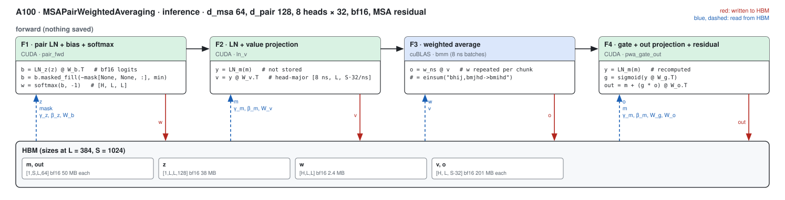

##### F1 · pair LN + bias + softmax (pair_fwd)

| (Length, MSA depth) | (128, 1024) | (256, 1024) | (384, 1024) | (512, 1024) | (640, 1024) | (768, 1024) | (128, 2048) | (256, 2048) | (384, 2048) | (512, 2048) | (640, 2048) | (768, 2048) | (128, 4096) | (256, 4096) | (384, 4096) | (512, 4096) | (640, 4096) | (768, 4096) |
|---|---|---|---|---|---|---|---|---|---|---|---|---|---|---|---|---|---|---|
| implementation | CUDA | CUDA | CUDA | CUDA | CUDA | CUDA | CUDA | CUDA | CUDA | CUDA | CUDA | CUDA | CUDA | CUDA | CUDA | CUDA | CUDA | CUDA |
| 성능 확인 | ✗ | ✗ | ✗ | ✗ | ✗ | ✗ | ✗ | ✗ | ✗ | ✗ | ✗ | ✗ | ✗ | ✗ | ✗ | ✗ | ✗ | ✗ |
| cache build | ✓ | ✓ | ✓ | ✓ | ✓ | ✓ | ✓ | ✓ | ✓ | ✓ | ✓ | ✓ | ✓ | ✓ | ✓ | ✓ | ✓ | ✓ |

##### F2 · LN + value projection (ln_v)

| (Length, MSA depth) | (128, 1024) | (256, 1024) | (384, 1024) | (512, 1024) | (640, 1024) | (768, 1024) | (128, 2048) | (256, 2048) | (384, 2048) | (512, 2048) | (640, 2048) | (768, 2048) | (128, 4096) | (256, 4096) | (384, 4096) | (512, 4096) | (640, 4096) | (768, 4096) |
|---|---|---|---|---|---|---|---|---|---|---|---|---|---|---|---|---|---|---|
| implementation | CUDA | CUDA | CUDA | CUDA | CUDA | CUDA | CUDA | CUDA | CUDA | CUDA | CUDA | CUDA | CUDA | CUDA | CUDA | CUDA | CUDA | CUDA |
| 성능 확인 | ✗ | ✗ | ✗ | ✗ | ✗ | ✗ | ✗ | ✗ | ✗ | ✗ | ✗ | ✗ | ✗ | ✗ | ✗ | ✗ | ✗ | ✗ |
| cache build | ✓ | ✓ | ✓ | ✓ | ✓ | ✓ | ✓ | ✓ | ✓ | ✓ | ✓ | ✓ | ✓ | ✓ | ✓ | ✓ | ✓ | ✓ |

##### F4 · gate + out projection + residual (pwa_gate_out)

| (Length, MSA depth) | (128, 1024) | (256, 1024) | (384, 1024) | (512, 1024) | (640, 1024) | (768, 1024) | (128, 2048) | (256, 2048) | (384, 2048) | (512, 2048) | (640, 2048) | (768, 2048) | (128, 4096) | (256, 4096) | (384, 4096) | (512, 4096) | (640, 4096) | (768, 4096) |
|---|---|---|---|---|---|---|---|---|---|---|---|---|---|---|---|---|---|---|
| implementation | CUDA | CUDA | CUDA | CUDA | CUDA | CUDA | CUDA | CUDA | CUDA | CUDA | CUDA | CUDA | CUDA | CUDA | CUDA | CUDA | CUDA | CUDA |
| 성능 확인 | ✗ | ✗ | ✗ | ✗ | ✗ | ✗ | ✗ | ✗ | ✗ | ✗ | ✗ | ✗ | ✗ | ✗ | ✗ | ✗ | ✗ | ✗ |
| cache build | ✓ | ✓ | ✓ | ✓ | ✓ | ✓ | ✓ | ✓ | ✓ | ✓ | ✓ | ✓ | ✓ | ✓ | ✓ | ✓ | ✓ | ✓ |

### Training

#### Fused path · L a multiple of 16 up to 1024, any S

The forward keeps `w`, `v`, `o` and the dropout keep mask; the contractions run on the chunked layout (see above).

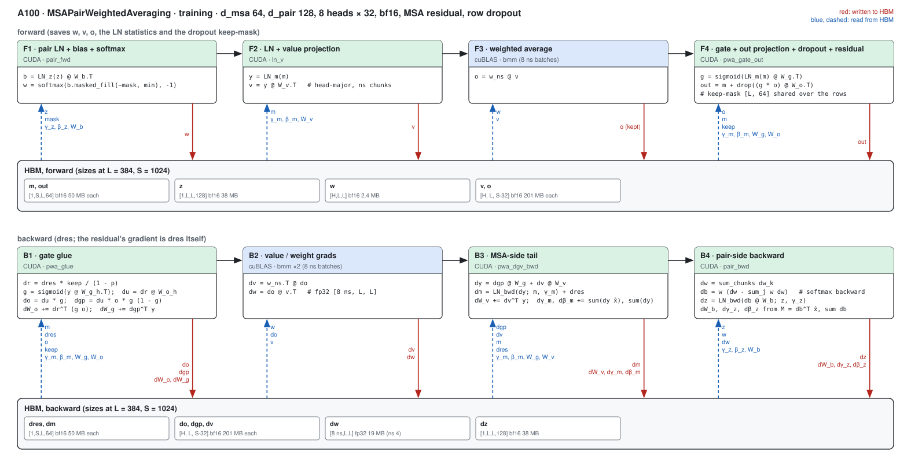

##### F1 · pair LN + bias + softmax (pair_fwd)

| (Length, MSA depth) | (128, 1024) | (256, 1024) | (384, 1024) | (512, 1024) | (640, 1024) | (768, 1024) |
|---|---|---|---|---|---|---|
| implementation | CUDA | CUDA | CUDA | CUDA | CUDA | CUDA |
| 성능 확인 | ✗ | ✗ | ✗ | ✗ | ✗ | ✗ |
| cache build | ✓ | ✓ | ✓ | ✓ | ✓ | ✓ |

##### F2 · LN + value projection (ln_v)

| (Length, MSA depth) | (128, 1024) | (256, 1024) | (384, 1024) | (512, 1024) | (640, 1024) | (768, 1024) |
|---|---|---|---|---|---|---|
| implementation | CUDA | CUDA | CUDA | CUDA | CUDA | CUDA |
| 성능 확인 | ✗ | ✗ | ✗ | ✗ | ✗ | ✗ |
| cache build | ✓ | ✓ | ✓ | ✓ | ✓ | ✓ |

##### F4 · gate + out projection + dropout + residual (pwa_gate_out)

| (Length, MSA depth) | (128, 1024) | (256, 1024) | (384, 1024) | (512, 1024) | (640, 1024) | (768, 1024) |
|---|---|---|---|---|---|---|
| implementation | CUDA | CUDA | CUDA | CUDA | CUDA | CUDA |
| 성능 확인 | ✗ | ✗ | ✗ | ✗ | ✗ | ✗ |
| cache build | ✓ | ✓ | ✓ | ✓ | ✓ | ✓ |

##### B1 · gate glue (pwa_glue)

| (Length, MSA depth) | (128, 1024) | (256, 1024) | (384, 1024) | (512, 1024) | (640, 1024) | (768, 1024) |
|---|---|---|---|---|---|---|
| implementation | CUDA | CUDA | CUDA | CUDA | CUDA | CUDA |
| 성능 확인 | ✗ | ✗ | ✗ | ✗ | ✗ | ✗ |
| cache build | ✓ | ✓ | ✓ | ✓ | ✓ | ✓ |

##### B3 · MSA-side tail (pwa_dgv_bwd)

| (Length, MSA depth) | (128, 1024) | (256, 1024) | (384, 1024) | (512, 1024) | (640, 1024) | (768, 1024) |
|---|---|---|---|---|---|---|
| implementation | CUDA | CUDA | CUDA | CUDA | CUDA | CUDA |
| 성능 확인 | ✗ | ✗ | ✗ | ✗ | ✗ | ✗ |
| cache build | ✓ | ✓ | ✓ | ✓ | ✓ | ✓ |

##### B4 · pair-side backward (pwa_pair_bwd)

| (Length, MSA depth) | (128, 1024) | (256, 1024) | (384, 1024) | (512, 1024) | (640, 1024) | (768, 1024) |
|---|---|---|---|---|---|---|
| implementation | CUDA | CUDA | CUDA | CUDA | CUDA | CUDA |
| 성능 확인 | ✗ | ✗ | ✗ | ✗ | ✗ | ✗ |
| cache build | ✓ | ✓ | ✓ | ✓ | ✓ | ✓ |

##### R · fixed-order partial sums (reduce_rows)

| (Length, MSA depth) | (128, 1024) | (256, 1024) | (384, 1024) | (512, 1024) | (640, 1024) | (768, 1024) |
|---|---|---|---|---|---|---|
| implementation | CUDA | CUDA | CUDA | CUDA | CUDA | CUDA |
| 성능 확인 | ✗ | ✗ | ✗ | ✗ | ✗ | ✗ |
| cache build | ✓ | ✓ | ✓ | ✓ | ✓ | ✓ |

## Measurements (2026-10-04)

- Setup: A100 80GB PCIe (one node of the `A100` partition per job), torch 2.13.0+cu129, triton 3.7.1, B = 1, bf16-mixed, a token key mask (about 10 % masked is not part of the bench: `mask_prob` 0, every key valid), the MSA residual inside the module; training with the module's row dropout (p 0.15) live.
- Harness: `benchmarks/runners/bench.py target=msa_pair_weighted_averaging level=module mode=<inference|training> min_seq_len=128 max_seq_len=768 seq_len_step=128 [+n_msa=<S>] [+msa_d_msa=128 +msa_d_hidden=<8|16> d_pair=<256|384>]`, run from a frozen snapshot of the tree
  (snapshot `snap_1004_082257`, jobs 63230 (the bench shape and the d_hidden 8 variant at d_msa 64, d_msa 128 / d_pair 256 with 16-wide heads) and 63265 (d_pair 384 and 256 with 8-wide heads, S2048 / S4096 inference)); compiled, inference in a CUDA graph, training with and without one; the `triton` arm is the module with `implementation=triton` (the path this one replaces), `pytorch` the module's statements. The bench shape is d_msa 64 /
  d_pair 128 with 32-wide heads (MiniWorld's `d_hidden_msa`); the registry's other rows are the d_msa / d_pair / head-width combinations of their titles.
- The Triton column: the module with `implementation=triton` (its Triton kernels; the path this one replaces on A100). Those kernels need d_hidden a power of two >= 16 (`refusal()` in `kernels/pair_weighted_averaging/triton/main.py`), so the d_hidden 8 rows have no Triton column (`—`: the harness's `triton`
  arm refuses them) and run the module's PyTorch statements when the A100 hook is off; the interleaved A/B tables below compare ours with that same hook-off path (`MINIWORLD_PWA_SM80=0`), Triton where it exists and PyTorch statements for d_hidden 8.
- Tables: latency in ms (median of the harness's repeats); × = PyTorch compiled / ours. cuEquivariance ships no PWA kernel (—); the Triton path is a reference column and never the denominator. Anthropic: the 2026-09-24 branch record of `experiments/a100_anthropic_baseline`
  (torch 2.10, A100 PCIe, `ops.msa_pwa.forward_masked`, the best of its configs, inference only) where it has the shape (L384 and L768 at S1024, the bench shape); this round did not run any `anthropic` arm.
- Accuracy against the harness's fp32 reference (max over every row, inference output): ours 1.77e-3, PyTorch compiled 1.78e-3, Triton path 1.74e-3; the gradients are compared by the tests (every gradient within 1.15x of the bf16 module's error, 1.25x for the parameter gradients,
  `tests/integrations/test_a100_pwa_gpu.py`).
- Spread: the same kernel differs by 10 % and more between runs on different nodes; the interleaved A/B table below (one process, alternating CUDA-graph replays) is the number to trust for "ours against the Triton path".
- Charts: under each table, a length sweep at S1024 and an MSA-depth sweep at L384 (`python -m miniworld_engine.viz.measure_bars docs/gpus/a100/msa_pair_weighted_averaging/msa_pair_weighted_averaging.md --length-d 1024 --dim-l 384`).

### PWA · Inference (CUDA graph) · d_msa 64 / d_pair 128 / 8 wide heads

| (Length, MSA depth) | PyTorch compiled | cuEquivariance | Anthropic | Triton path | ours | × |
|---|---|---|---|---|---|---|
| (128, 1024) | 0.254 | — | — (not measured) | — (refuses d_hidden 8) | 0.163 | 1.56 |
| (256, 1024) | 0.582 | — | — (not measured) | — (refuses d_hidden 8) | 0.255 | 2.28 |
| (384, 1024) | 0.888 | — | — (not measured) | — (refuses d_hidden 8) | 0.382 | 2.32 |
| (512, 1024) | 1.229 | — | — (not measured) | — (refuses d_hidden 8) | 0.554 | 2.22 |
| (640, 1024) | 1.626 | — | — (not measured) | — (refuses d_hidden 8) | 0.756 | 2.15 |
| (768, 1024) | 2.035 | — | — (not measured) | — (refuses d_hidden 8) | 0.980 | 2.08 |

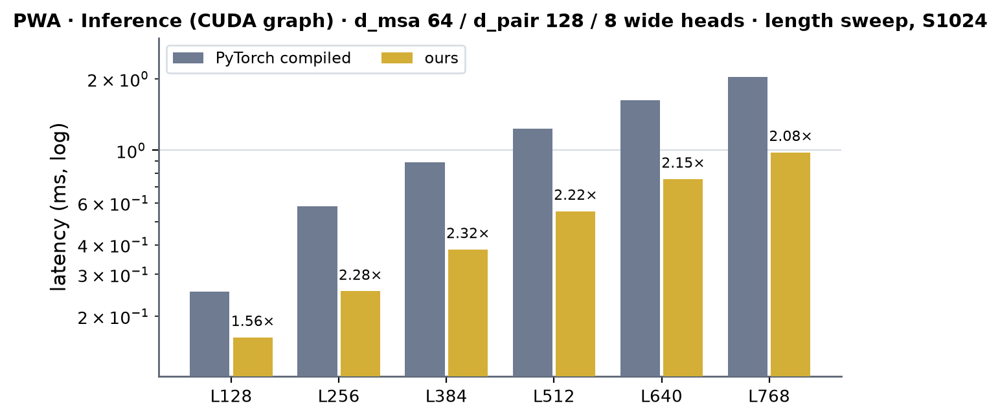 <!-- measure_bars -->

<!-- accuracy miniworld: output rel-Frobenius max 1.765e-03, grad rel-Frobenius max 0.000e+00 -->
<!-- accuracy pytorch: output rel-Frobenius max 1.772e-03, grad rel-Frobenius max 0.000e+00 -->
<!-- ours served by: ['integrations.pwa_sm80.update_inference'] -->

### PWA · Training (CUDA graph) · d_msa 64 / d_pair 128 / 8 wide heads

| (Length, MSA depth) | PyTorch compiled | cuEquivariance | Anthropic | Triton path | ours | × |
|---|---|---|---|---|---|---|
| (128, 1024) | 0.782 | — | — (the release has no backward) | — (refuses d_hidden 8) | 0.553 | 1.41 |
| (256, 1024) | 1.564 | — | — (the release has no backward) | — (refuses d_hidden 8) | 0.881 | 1.78 |
| (384, 1024) | 2.397 | — | — (the release has no backward) | — (refuses d_hidden 8) | 1.343 | 1.78 |
| (512, 1024) | 3.308 | — | — (the release has no backward) | — (refuses d_hidden 8) | 1.934 | 1.71 |
| (640, 1024) | 4.421 | — | — (the release has no backward) | — (refuses d_hidden 8) | 2.673 | 1.65 |
| (768, 1024) | 5.506 | — | — (the release has no backward) | — (refuses d_hidden 8) | 3.397 | 1.62 |

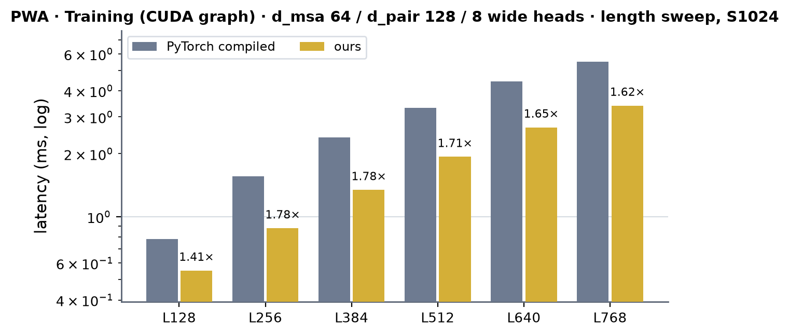 <!-- measure_bars -->

<!-- ours served by: ['integrations.pwa_sm80.update_train'] -->

### PWA · Training (no CUDA graph) · d_msa 64 / d_pair 128 / 8 wide heads

| (Length, MSA depth) | PyTorch compiled | cuEquivariance | Anthropic | Triton path | ours | × |
|---|---|---|---|---|---|---|
| (128, 1024) | 0.927 | — | — (the release has no backward) | — (refuses d_hidden 8) | 1.274 | 0.73 |
| (256, 1024) | 1.590 | — | — (the release has no backward) | — (refuses d_hidden 8) | 1.275 | 1.25 |
| (384, 1024) | 2.431 | — | — (the release has no backward) | — (refuses d_hidden 8) | 1.384 | 1.76 |
| (512, 1024) | 3.361 | — | — (the release has no backward) | — (refuses d_hidden 8) | 1.976 | 1.70 |
| (640, 1024) | 4.462 | — | — (the release has no backward) | — (refuses d_hidden 8) | 2.713 | 1.64 |
| (768, 1024) | 5.541 | — | — (the release has no backward) | — (refuses d_hidden 8) | 3.434 | 1.61 |

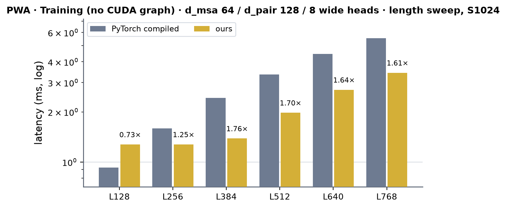 <!-- measure_bars -->

<!-- ours served by: ['integrations.pwa_sm80.update_train'] -->

### PWA · Inference (CUDA graph) · d_msa 64 / d_pair 128 / 32 wide heads

| (Length, MSA depth) | PyTorch compiled | cuEquivariance | Anthropic | Triton path | ours | × |
|---|---|---|---|---|---|---|
| (128, 1024) | 0.634 | — | — (not measured) | 0.303 | 0.309 | 2.05 |
| (256, 1024) | 1.299 | — | — (not measured) | 0.639 | 0.611 | 2.13 |
| (384, 1024) | 2.086 | — | 1.919 | 1.104 | 1.009 | 2.07 |
| (512, 1024) | 3.069 | — | — (not measured) | 1.743 | 1.502 | 2.04 |
| (640, 1024) | 4.246 | — | — (not measured) | 2.504 | 2.097 | 2.02 |
| (768, 1024) | 5.352 | — | 5.618 | 3.348 | 2.734 | 1.96 |
| (128, 2048) | 1.208 | — | — (not measured) | 0.563 | 0.564 | 2.14 |
| (256, 2048) | 2.610 | — | — (not measured) | 1.311 | 1.213 | 2.15 |
| (384, 2048) | 4.183 | — | — (not measured) | 2.229 | 2.019 | 2.07 |
| (512, 2048) | 5.904 | — | — (not measured) | 3.403 | 2.952 | 2.00 |
| (640, 2048) | 8.244 | — | — (not measured) | 4.830 | 4.136 | 1.99 |
| (768, 2048) | 10.299 | — | — (not measured) | 6.435 | 5.475 | 1.88 |
| (128, 4096) | 2.371 | — | — (not measured) | 1.104 | 1.106 | 2.14 |
| (256, 4096) | 5.110 | — | — (not measured) | 2.615 | 2.446 | 2.09 |
| (384, 4096) | 8.330 | — | — (not measured) | 4.451 | 4.238 | 1.97 |
| (512, 4096) | 11.665 | — | — (not measured) | 6.729 | 6.666 | 1.75 |
| (640, 4096) | 16.195 | — | — (not measured) | 9.571 | 9.504 | 1.70 |
| (768, 4096) | 20.183 | — | — (not measured) | 12.674 | 12.686 | 1.59 |

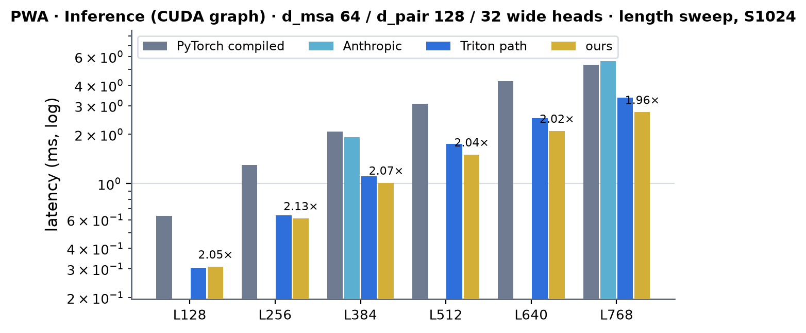 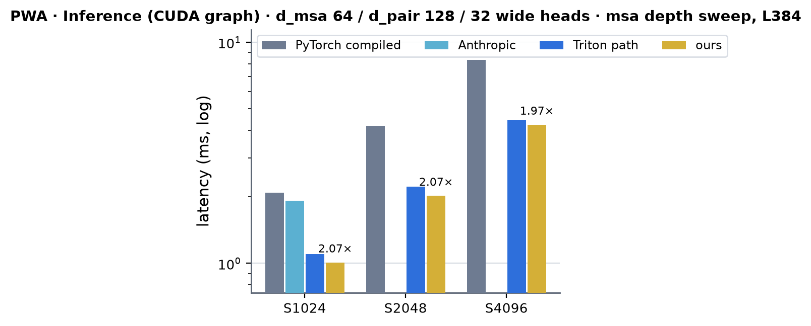 <!-- measure_bars -->

<!-- accuracy miniworld: output rel-Frobenius max 1.764e-03, grad rel-Frobenius max 0.000e+00 -->
<!-- accuracy triton: output rel-Frobenius max 1.731e-03, grad rel-Frobenius max 0.000e+00 -->
<!-- accuracy pytorch: output rel-Frobenius max 1.771e-03, grad rel-Frobenius max 0.000e+00 -->
<!-- ours served by: ['integrations.pwa_sm80.update_inference'] -->

### PWA · Training (CUDA graph) · d_msa 64 / d_pair 128 / 32 wide heads

| (Length, MSA depth) | PyTorch compiled | cuEquivariance | Anthropic | Triton path | ours | × |
|---|---|---|---|---|---|---|
| (128, 1024) | 1.761 | — | — (the release has no backward) | 1.243 | 1.132 | 1.56 |
| (256, 1024) | 3.464 | — | — (the release has no backward) | 2.515 | 2.318 | 1.49 |
| (384, 1024) | 5.714 | — | — (the release has no backward) | 4.303 | 3.773 | 1.51 |
| (512, 1024) | 8.177 | — | — (the release has no backward) | 6.484 | 5.396 | 1.52 |
| (640, 1024) | 11.142 | — | — (the release has no backward) | 8.816 | 7.582 | 1.47 |
| (768, 1024) | 14.304 | — | — (the release has no backward) | 11.656 | 9.766 | 1.46 |

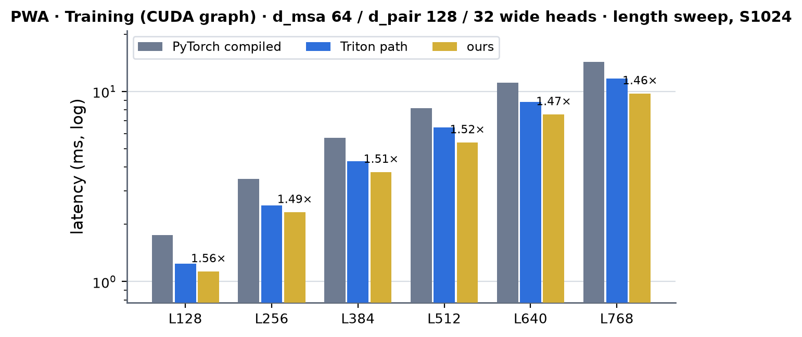 <!-- measure_bars -->

<!-- ours served by: ['integrations.pwa_sm80.update_train'] -->

### PWA · Training (no CUDA graph) · d_msa 64 / d_pair 128 / 32 wide heads

| (Length, MSA depth) | PyTorch compiled | cuEquivariance | Anthropic | Triton path | ours | × |
|---|---|---|---|---|---|---|
| (128, 1024) | 1.814 | — | — (the release has no backward) | 1.724 | 1.297 | 1.40 |
| (256, 1024) | 3.507 | — | — (the release has no backward) | 2.550 | 2.348 | 1.49 |
| (384, 1024) | 5.735 | — | — (the release has no backward) | 4.335 | 3.780 | 1.52 |
| (512, 1024) | 8.182 | — | — (the release has no backward) | 6.499 | 5.484 | 1.49 |
| (640, 1024) | 11.157 | — | — (the release has no backward) | 8.799 | 7.562 | 1.48 |
| (768, 1024) | 14.332 | — | — (the release has no backward) | 11.719 | 9.691 | 1.48 |

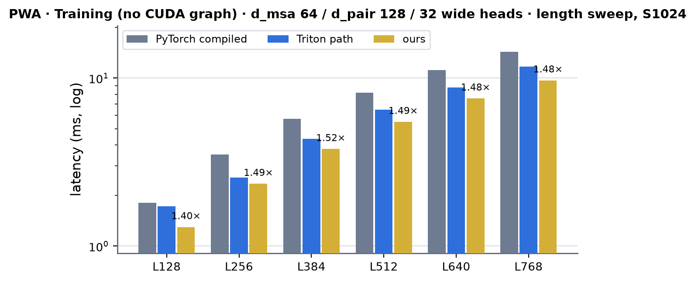 <!-- measure_bars -->

<!-- ours served by: ['integrations.pwa_sm80.update_train'] -->

### PWA · Inference (CUDA graph) · d_msa 128 / d_pair 256 / 8 wide heads

| (Length, MSA depth) | PyTorch compiled | cuEquivariance | Anthropic | Triton path | ours | × |
|---|---|---|---|---|---|---|
| (128, 1024) | 0.409 | — | — (not measured) | — (refuses d_hidden 8) | 0.220 | 1.86 |
| (256, 1024) | 0.777 | — | — (not measured) | — (refuses d_hidden 8) | 0.366 | 2.13 |
| (384, 1024) | 1.230 | — | — (not measured) | — (refuses d_hidden 8) | 0.555 | 2.22 |
| (512, 1024) | 1.714 | — | — (not measured) | — (refuses d_hidden 8) | 0.793 | 2.16 |
| (640, 1024) | 2.273 | — | — (not measured) | — (refuses d_hidden 8) | 1.071 | 2.12 |
| (768, 1024) | 2.890 | — | — (not measured) | — (refuses d_hidden 8) | 1.362 | 2.12 |

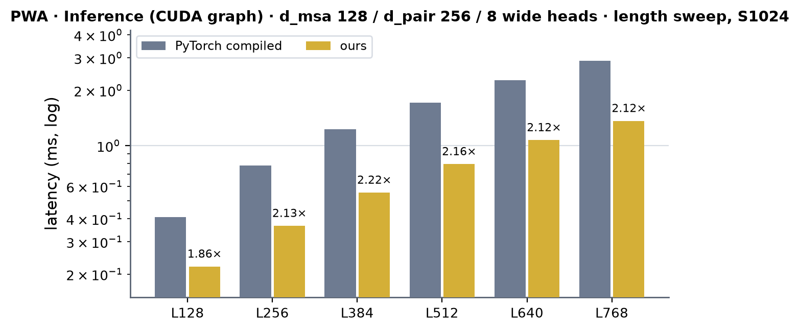 <!-- measure_bars -->

<!-- accuracy miniworld: output rel-Frobenius max 1.770e-03, grad rel-Frobenius max 0.000e+00 -->
<!-- accuracy pytorch: output rel-Frobenius max 1.777e-03, grad rel-Frobenius max 0.000e+00 -->
<!-- ours served by: ['integrations.pwa_sm80.update_inference'] -->

### PWA · Training (CUDA graph) · d_msa 128 / d_pair 256 / 8 wide heads

| (Length, MSA depth) | PyTorch compiled | cuEquivariance | Anthropic | Triton path | ours | × |
|---|---|---|---|---|---|---|
| (128, 1024) | 1.077 | — | — (the release has no backward) | — (refuses d_hidden 8) | 0.772 | 1.40 |
| (256, 1024) | 2.106 | — | — (the release has no backward) | — (refuses d_hidden 8) | 1.299 | 1.62 |
| (384, 1024) | 3.285 | — | — (the release has no backward) | — (refuses d_hidden 8) | 1.987 | 1.65 |
| (512, 1024) | 4.590 | — | — (the release has no backward) | — (refuses d_hidden 8) | 2.833 | 1.62 |
| (640, 1024) | 6.163 | — | — (the release has no backward) | — (refuses d_hidden 8) | 3.864 | 1.60 |
| (768, 1024) | 7.752 | — | — (the release has no backward) | — (refuses d_hidden 8) | 4.898 | 1.58 |

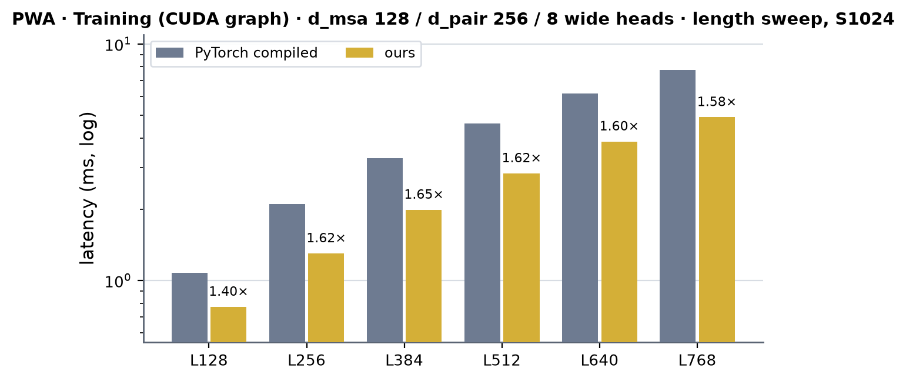 <!-- measure_bars -->

<!-- ours served by: ['integrations.pwa_sm80.update_train'] -->

### PWA · Training (no CUDA graph) · d_msa 128 / d_pair 256 / 8 wide heads

| (Length, MSA depth) | PyTorch compiled | cuEquivariance | Anthropic | Triton path | ours | × |
|---|---|---|---|---|---|---|
| (128, 1024) | 1.117 | — | — (the release has no backward) | — (refuses d_hidden 8) | 1.348 | 0.83 |
| (256, 1024) | 2.140 | — | — (the release has no backward) | — (refuses d_hidden 8) | 1.352 | 1.58 |
| (384, 1024) | 3.342 | — | — (the release has no backward) | — (refuses d_hidden 8) | 2.022 | 1.65 |
| (512, 1024) | 4.592 | — | — (the release has no backward) | — (refuses d_hidden 8) | 2.857 | 1.61 |
| (640, 1024) | 6.098 | — | — (the release has no backward) | — (refuses d_hidden 8) | 3.871 | 1.58 |
| (768, 1024) | 7.823 | — | — (the release has no backward) | — (refuses d_hidden 8) | 4.911 | 1.59 |

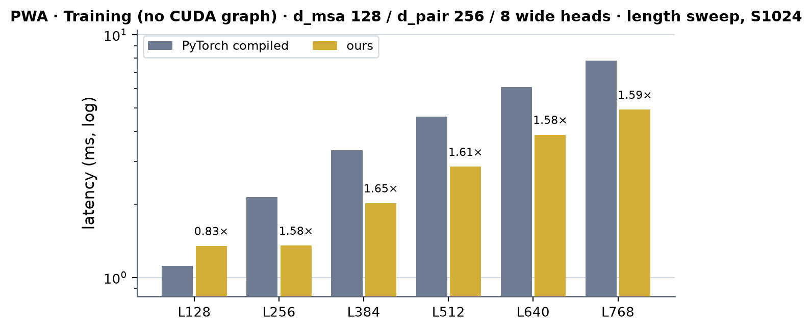 <!-- measure_bars -->

<!-- ours served by: ['integrations.pwa_sm80.update_train'] -->

### PWA · Inference (CUDA graph) · d_msa 128 / d_pair 256 / 16 wide heads

| (Length, MSA depth) | PyTorch compiled | cuEquivariance | Anthropic | Triton path | ours | × |
|---|---|---|---|---|---|---|
| (128, 1024) | 0.498 | — | — (not measured) | 0.312 | 0.318 | 1.56 |
| (256, 1024) | 1.036 | — | — (not measured) | 0.611 | 0.512 | 2.02 |
| (384, 1024) | 1.641 | — | — (not measured) | 0.981 | 0.778 | 2.11 |
| (512, 1024) | 2.295 | — | — (not measured) | 1.431 | 1.122 | 2.04 |
| (640, 1024) | 3.025 | — | — (not measured) | 1.966 | 1.529 | 1.98 |
| (768, 1024) | 3.895 | — | — (not measured) | 2.557 | 1.989 | 1.96 |

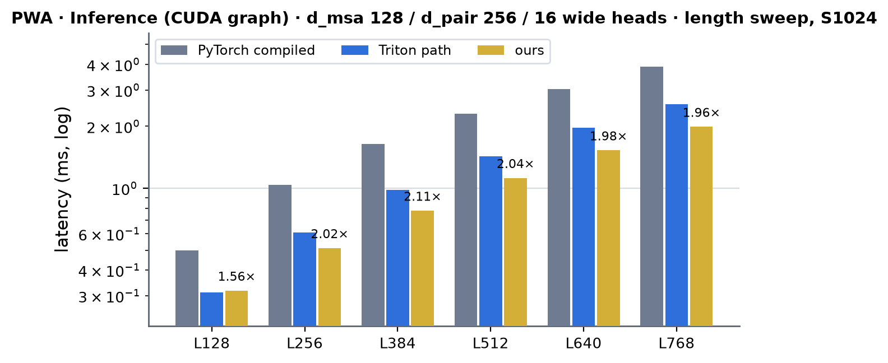 <!-- measure_bars -->

<!-- accuracy miniworld: output rel-Frobenius max 1.773e-03, grad rel-Frobenius max 0.000e+00 -->
<!-- accuracy triton: output rel-Frobenius max 1.735e-03, grad rel-Frobenius max 0.000e+00 -->
<!-- accuracy pytorch: output rel-Frobenius max 1.781e-03, grad rel-Frobenius max 0.000e+00 -->
<!-- ours served by: ['integrations.pwa_sm80.update_inference'] -->

### PWA · Training (CUDA graph) · d_msa 128 / d_pair 256 / 16 wide heads

| (Length, MSA depth) | PyTorch compiled | cuEquivariance | Anthropic | Triton path | ours | × |
|---|---|---|---|---|---|---|
| (128, 1024) | 1.414 | — | — (the release has no backward) | 1.442 | 1.196 | 1.18 |
| (256, 1024) | 2.794 | — | — (the release has no backward) | 2.937 | 2.047 | 1.36 |
| (384, 1024) | 4.415 | — | — (the release has no backward) | 4.639 | 3.132 | 1.41 |
| (512, 1024) | 6.194 | — | — (the release has no backward) | 6.619 | 4.432 | 1.40 |
| (640, 1024) | 8.164 | — | — (the release has no backward) | 8.678 | 6.023 | 1.36 |
| (768, 1024) | 10.314 | — | — (the release has no backward) | 11.139 | 7.658 | 1.35 |

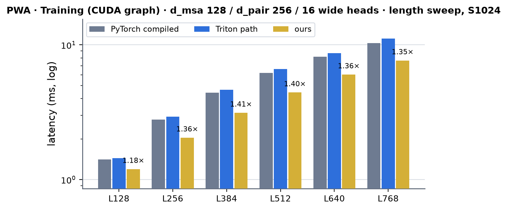 <!-- measure_bars -->

<!-- ours served by: ['integrations.pwa_sm80.update_train'] -->

### PWA · Training (no CUDA graph) · d_msa 128 / d_pair 256 / 16 wide heads

| (Length, MSA depth) | PyTorch compiled | cuEquivariance | Anthropic | Triton path | ours | × |
|---|---|---|---|---|---|---|
| (128, 1024) | 1.467 | — | — (the release has no backward) | 1.631 | 1.498 | 0.98 |
| (256, 1024) | 2.839 | — | — (the release has no backward) | 2.953 | 2.082 | 1.36 |
| (384, 1024) | 4.484 | — | — (the release has no backward) | 4.684 | 3.179 | 1.41 |
| (512, 1024) | 6.170 | — | — (the release has no backward) | 6.565 | 4.484 | 1.38 |
| (640, 1024) | 8.164 | — | — (the release has no backward) | 8.709 | 6.030 | 1.35 |
| (768, 1024) | 10.369 | — | — (the release has no backward) | 11.105 | 7.693 | 1.35 |

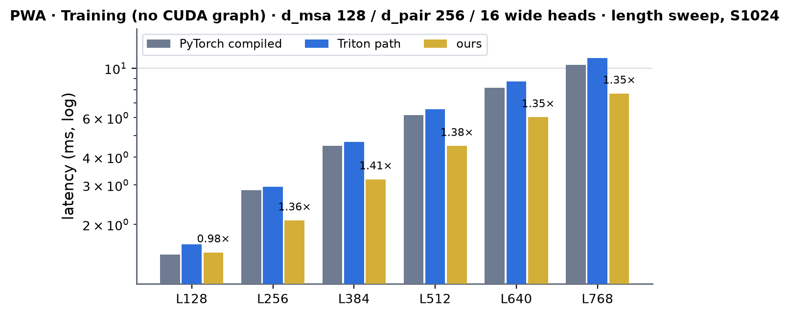 <!-- measure_bars -->

<!-- ours served by: ['integrations.pwa_sm80.update_train'] -->

### PWA · Inference (CUDA graph) · d_msa 128 / d_pair 384 / 8 wide heads

| (Length, MSA depth) | PyTorch compiled | cuEquivariance | Anthropic | Triton path | ours | × |
|---|---|---|---|---|---|---|
| (128, 1024) | 0.385 | — | — (not measured) | — (refuses d_hidden 8) | 0.231 | 1.66 |
| (256, 1024) | 0.831 | — | — (not measured) | — (refuses d_hidden 8) | 0.398 | 2.09 |
| (384, 1024) | 1.310 | — | — (not measured) | — (refuses d_hidden 8) | 0.614 | 2.13 |
| (512, 1024) | 1.844 | — | — (not measured) | — (refuses d_hidden 8) | 0.885 | 2.08 |
| (640, 1024) | 2.525 | — | — (not measured) | — (refuses d_hidden 8) | 1.206 | 2.09 |
| (768, 1024) | 3.203 | — | — (not measured) | — (refuses d_hidden 8) | 1.577 | 2.03 |

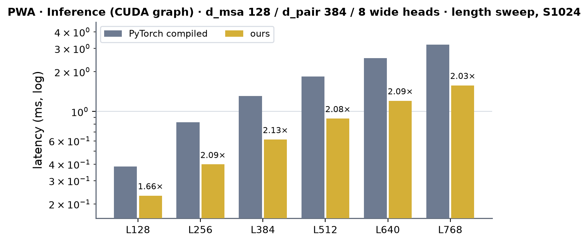 <!-- measure_bars -->

<!-- accuracy miniworld: output rel-Frobenius max 1.769e-03, grad rel-Frobenius max 0.000e+00 -->
<!-- accuracy pytorch: output rel-Frobenius max 1.776e-03, grad rel-Frobenius max 0.000e+00 -->
<!-- ours served by: ['integrations.pwa_sm80.update_inference'] -->

### PWA · Training (CUDA graph) · d_msa 128 / d_pair 384 / 8 wide heads

| (Length, MSA depth) | PyTorch compiled | cuEquivariance | Anthropic | Triton path | ours | × |
|---|---|---|---|---|---|---|
| (128, 1024) | 1.098 | — | — (the release has no backward) | — (refuses d_hidden 8) | 0.835 | 1.32 |
| (256, 1024) | 2.213 | — | — (the release has no backward) | — (refuses d_hidden 8) | 1.500 | 1.48 |
| (384, 1024) | 3.528 | — | — (the release has no backward) | — (refuses d_hidden 8) | 2.339 | 1.51 |
| (512, 1024) | 4.913 | — | — (the release has no backward) | — (refuses d_hidden 8) | 3.455 | 1.42 |
| (640, 1024) | 6.610 | — | — (the release has no backward) | — (refuses d_hidden 8) | 4.769 | 1.39 |
| (768, 1024) | 8.510 | — | — (the release has no backward) | — (refuses d_hidden 8) | 6.185 | 1.38 |

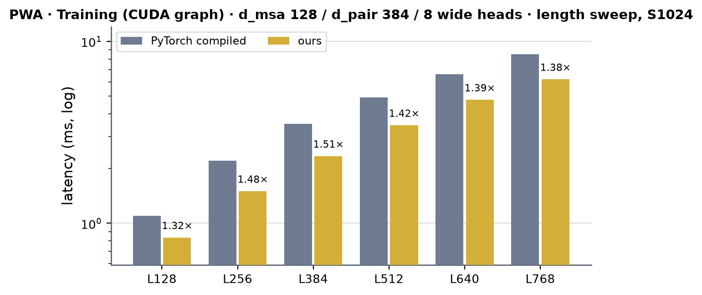 <!-- measure_bars -->

<!-- ours served by: ['integrations.pwa_sm80.update_train'] -->

### PWA · Training (no CUDA graph) · d_msa 128 / d_pair 384 / 8 wide heads

| (Length, MSA depth) | PyTorch compiled | cuEquivariance | Anthropic | Triton path | ours | × |
|---|---|---|---|---|---|---|
| (128, 1024) | 1.145 | — | — (the release has no backward) | — (refuses d_hidden 8) | 1.317 | 0.87 |
| (256, 1024) | 2.231 | — | — (the release has no backward) | — (refuses d_hidden 8) | 1.533 | 1.46 |
| (384, 1024) | 3.533 | — | — (the release has no backward) | — (refuses d_hidden 8) | 2.382 | 1.48 |
| (512, 1024) | 4.950 | — | — (the release has no backward) | — (refuses d_hidden 8) | 3.494 | 1.42 |
| (640, 1024) | 6.661 | — | — (the release has no backward) | — (refuses d_hidden 8) | 4.745 | 1.40 |
| (768, 1024) | 8.509 | — | — (the release has no backward) | — (refuses d_hidden 8) | 6.206 | 1.37 |

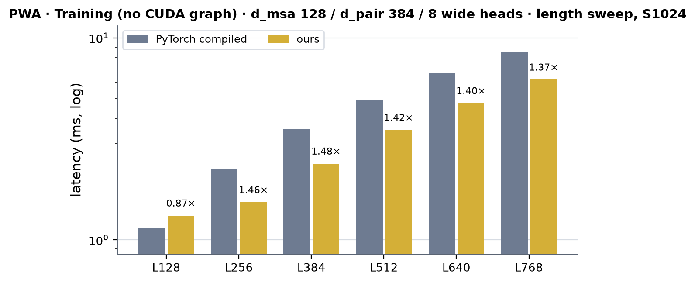 <!-- measure_bars -->

<!-- ours served by: ['integrations.pwa_sm80.update_train'] -->

### Ours against the Triton path (interleaved A/B, job 63280)

The bench columns above come from separate runs of each implementation, and the same kernel differs by 10 % and more between nodes and between runs on one node (clock and power state), so the comparison with the module's other path is taken inside one process: one module, two CUDA graphs captured with the dispatch on and off
(`MINIWORLD_PWA_SM80=1` / `0`), 9 rounds that alternate which of the two is replayed first (4 inference replays or one training step, the module's row dropout live, per measurement). The table has the median of each (ms), their ratio, and the median of the per-round ratios with its range over the rounds. Below 1 ours is faster; MSA depth 1024.
The second column is the Triton path for the 32- and 16-wide heads; the Triton kernels refuse d_hidden 8 (`refusal()`), so for the 8-wide rows it is the module's PyTorch statements (marked in the shape column).

| shape (d_msa / d_pair / heads) | mode | (Length, MSA depth) | Triton path | ours | ours / Triton | per-round ratio, median [range] |
|---|---|---|---|---|---|---|
| 64 / 128 / 32 wide | inference | (128, 1024) | 0.289 | 0.302 | 1.042 | 1.040 [1.039 .. 1.046] |
| 64 / 128 / 32 wide | training | (128, 1024) | 1.260 | 1.107 | 0.878 | 0.878 [0.872 .. 0.886] |
| 64 / 128 / 32 wide | inference | (256, 1024) | 0.612 | 0.587 | 0.960 | 0.969 [0.955 .. 0.995] |
| 64 / 128 / 32 wide | training | (256, 1024) | 2.611 | 2.281 | 0.873 | 0.888 [0.873 .. 0.909] |
| 64 / 128 / 32 wide | inference | (384, 1024) | 1.081 | 1.026 | 0.949 | 0.953 [0.910 .. 0.969] |
| 64 / 128 / 32 wide | training | (384, 1024) | 4.455 | 3.789 | 0.851 | 0.856 [0.831 .. 0.861] |
| 64 / 128 / 32 wide | inference | (512, 1024) | 1.704 | 1.646 | 0.966 | 0.960 [0.859 .. 0.971] |
| 64 / 128 / 32 wide | training | (512, 1024) | 6.590 | 5.580 | 0.847 | 0.845 [0.787 .. 0.851] |
| 64 / 128 / 32 wide | inference | (640, 1024) | 2.445 | 2.247 | 0.919 | 0.919 [0.855 .. 0.927] |
| 64 / 128 / 32 wide | training | (640, 1024) | 8.814 | 7.798 | 0.885 | 0.884 [0.845 .. 0.893] |
| 64 / 128 / 32 wide | inference | (768, 1024) | 3.288 | 2.948 | 0.897 | 0.900 [0.831 .. 0.923] |
| 64 / 128 / 32 wide | training | (768, 1024) | 11.668 | 10.078 | 0.864 | 0.864 [0.843 .. 0.872] |
| 64 / 128 / 8 wide (second column: PyTorch statements) | inference | (384, 1024) | 1.058 | 0.373 | 0.353 | 0.354 [0.351 .. 0.356] |
| 64 / 128 / 8 wide (second column: PyTorch statements) | training | (384, 1024) | 2.917 | 1.371 | 0.470 | 0.470 [0.465 .. 0.473] |
| 64 / 128 / 8 wide (second column: PyTorch statements) | inference | (768, 1024) | 2.383 | 0.959 | 0.402 | 0.402 [0.394 .. 0.412] |
| 64 / 128 / 8 wide (second column: PyTorch statements) | training | (768, 1024) | 6.544 | 3.498 | 0.535 | 0.535 [0.521 .. 0.538] |
| 128 / 256 / 16 wide | inference | (384, 1024) | 0.999 | 0.761 | 0.762 | 0.782 [0.761 .. 0.792] |
| 128 / 256 / 16 wide | training | (384, 1024) | 4.910 | 3.145 | 0.640 | 0.644 [0.640 .. 0.651] |
| 128 / 256 / 16 wide | inference | (768, 1024) | 2.700 | 2.055 | 0.761 | 0.765 [0.737 .. 0.814] |
| 128 / 256 / 16 wide | training | (768, 1024) | 11.440 | 7.656 | 0.669 | 0.672 [0.658 .. 0.673] |
| 128 / 384 / 8 wide (second column: PyTorch statements) | inference | (384, 1024) | 1.501 | 0.623 | 0.415 | 0.415 [0.409 .. 0.421] |
| 128 / 384 / 8 wide (second column: PyTorch statements) | training | (384, 1024) | 4.194 | 2.422 | 0.577 | 0.577 [0.569 .. 0.580] |
| 128 / 384 / 8 wide (second column: PyTorch statements) | inference | (768, 1024) | 3.572 | 1.640 | 0.459 | 0.459 [0.433 .. 0.461] |
| 128 / 384 / 8 wide (second column: PyTorch statements) | training | (768, 1024) | 9.993 | 6.471 | 0.648 | 0.651 [0.636 .. 0.653] |
| 128 / 256 / 8 wide (second column: PyTorch statements) | inference | (384, 1024) | 1.391 | 0.544 | 0.391 | 0.392 [0.389 .. 0.402] |
| 128 / 256 / 8 wide (second column: PyTorch statements) | training | (384, 1024) | 3.943 | 2.025 | 0.514 | 0.514 [0.506 .. 0.517] |
| 128 / 256 / 8 wide (second column: PyTorch statements) | inference | (768, 1024) | 3.206 | 1.377 | 0.430 | 0.429 [0.408 .. 0.430] |
| 128 / 256 / 8 wide (second column: PyTorch statements) | training | (768, 1024) | 9.060 | 5.050 | 0.557 | 0.557 [0.535 .. 0.558] |

Ours is slower than the module's other path in one row: 4.2 % at L128 inference of the bench shape (0.302 against 0.289 ms: a step of four launches where the pair kernel and the MSA kernels cannot fill 108 SMs; below the 5 % bar of the dispatch rule, left on CUDA); it is 3-10 % faster from L256 and 12-15 % faster in training at every length. The 8-wide rows compare against PyTorch statements, not Triton.

### Speed of light

SoL = the composite floor of the decomposition: per step the sum over its kernels of `max(essential bytes / 1.60 TB/s, FLOP / 240 TFLOP/s)` (both ceilings measured on this card, see [../a100.md](../a100.md)); every tensor a kernel reads or writes counts once (the contractions by
`max(bytes of v / o, FLOP)`: 77 GFLOP = 322 us each at L384 / S1024 / 32-wide heads; `pair_bwd` re-reads the fp32 partials of dw); the floors are the kernel probe's (job 63214). Ours is the bench's CUDA-graph time (S1024, snapshot `snap_1004_082257`, jobs 63230 / 63265), including ~10 us of launch latency a profiled replay does not.

| d_msa / d_pair / heads | mode | L | ours (µs) | SoL floor (µs) | % of SoL | floor of the cuBLAS bmm (µs) | the rest's floor (µs) |
|---|---|---|---|---|---|---|---|
| 64 / 128 / 8 x 32 | inference | 384 | 1009 | 693 | 69 % | 322 | 371 |
| 64 / 128 / 8 x 32 | inference | 768 | 2734 | 2081 | 76 % | 1288 | 792 |
| 64 / 128 / 8 x 32 | training | 384 | 3773 | 2175 | 58 % | 966 | 1209 |
| 64 / 128 / 8 x 32 | training | 768 | 9766 | 6437 | 66 % | 3866 | 2572 |
| 64 / 128 / 8 x 8 | inference | 384 | 382 | 263 | 69 % | 80 | 182 |
| 64 / 128 / 8 x 8 | inference | 768 | 980 | 737 | 75 % | 322 | 415 |
| 64 / 128 / 8 x 8 | training | 384 | 1343 | 790 | 59 % | 242 | 549 |
| 64 / 128 / 8 x 8 | training | 768 | 3397 | 2217 | 65 % | 966 | 1250 |
| 128 / 256 / 8 x 16 | inference | 384 | 778 | 524 | 67 % | 161 | 363 |
| 128 / 256 / 8 x 16 | inference | 768 | 1989 | 1468 | 74 % | 644 | 824 |
| 128 / 256 / 8 x 16 | training | 384 | 3132 | 1574 | 50 % | 483 | 1091 |
| 128 / 256 / 8 x 16 | training | 768 | 7658 | 4410 | 58 % | 1933 | 2477 |
| 128 / 256 / 8 x 8 | inference | 384 | 555 | 381 | 69 % | 80 | 300 |
| 128 / 256 / 8 x 8 | inference | 768 | 1362 | 1020 | 75 % | 322 | 698 |
| 128 / 256 / 8 x 8 | training | 384 | 1987 | 1113 | 56 % | 242 | 871 |
| 128 / 256 / 8 x 8 | training | 768 | 4898 | 3003 | 61 % | 966 | 2037 |
| 128 / 384 / 8 x 8 | inference | 384 | 614 | 404 | 66 % | 80 | 324 |
| 128 / 384 / 8 x 8 | inference | 768 | 1577 | 1114 | 71 % | 322 | 792 |
| 128 / 384 / 8 x 8 | training | 384 | 2339 | 1183 | 51 % | 242 | 942 |
| 128 / 384 / 8 x 8 | training | 768 | 6185 | 3286 | 53 % | 966 | 2320 |

The floors of the cuBLAS contractions are 26-47 % of ours at the bench shape and 10-33 % at the 8- and 16-wide rows, so the gap to the composite floor is mostly the custom kernels: in training it is `pwa_glue` (2.1x its floor, 26 % of the step), `pwa_dgv_bwd` and `pair_bwd` (4.2x at d_pair 384); the d_pair 384 / 8-wide row is the farthest from its floor (51-53 % in training).

Per kernel at L384, S1024, d_msa 64 / d_pair 128 / 32-wide heads (the profiler's times of one module step, job 63214; floors from the kernel probe's byte / FLOP counts):

| kernel | time (µs) | floor (µs) | % of floor |
|---|---|---|---|
| `pwa_pair_fwd` | 38.0 | 25 | 66 % |
| `pwa_ln_v` | 188.5 | 157 | 83 % |
| `o = w v` (cuBLAS bmm) | 363.7 | 322 | 89 % |
| `pwa_gate_out` | 329.7 | 189 | 57 % |
| `pwa_glue` | 907.7 | 440 | 49 % |
| `dv = w^T do` (cuBLAS bmm) | 361.3 | 322 | 89 % |
| `dw = do v^T` (cuBLAS bmm, fp32 out) | 461.4 | 322 | 70 % |
| `pwa_dgv_bwd` | 545.2 | 346 | 63 % |
| `pwa_pair_bwd` | 136.4 | 52 | 38 % |

### Where the time goes (`torch.profiler` CUPTI kernel times, one process, job 63214; d_msa 64 / d_pair 128 / 32-wide heads, S1024, µs per call, bf16)

| kernels | L384 inference | L384 training | L768 inference | L768 training | floor L384 (inference / training) |
|---|---|---|---|---|---|
| pair -> softmax weights (`pwa_pair_fwd`) | 38.0 | 40.5 | 113.7 | 118.6 | 25 / 25 |
| LN + value projection (`pwa_ln_v`) | 188.5 | 188.8 | 361.9 | 381.0 | 157 / 157 |
| `o = w v` (cuBLAS bmm) | 363.7 | 362.8 | 1293.4 | 1331.5 | 322 / 322 |
| gate + output projection + dropout + residual (`pwa_gate_out`) | 329.7 | 346.9 | 638.1 | 715.6 | 189 / 189 |
| backward glue (`pwa_glue`) | | 907.7 | | 1921.4 | / 440 |
| `dv = w^T do` (cuBLAS bmm) | | 361.3 | | 1326.7 | / 322 |
| `dw = do v^T` (cuBLAS bmm, fp32 out) | | 461.4 | | 1511.7 | / 322 |
| MSA tail (`pwa_dgv_bwd`) | | 545.2 | | 1158.0 | / 346 |
| pair backward (`pwa_pair_bwd`) | | 136.4 | | 676.0 | / 52 |
| `reduce_rows` (4 launches) | | 28.4 | | 44.4 | / ~2 |
| PyTorch small ops (the `w` repeat copy, adds, casts, fp32 sums) | 22.8 | 119.8 | 71.6 | 232.1 | |
| sum of kernel times | 942.7 | 3499.2 | 2478.7 | 9417.0 | 693 / 2186 |
| graph replay (bench, S1024) | 1009 | 3773 | 2734 | 9766 | |

The cuBLAS contractions run at 1.1x (`o`, `dv`: 208-213 TFLOP/s) and 1.4x (`dw` with its chunked layout: 148-187 TFLOP/s) of their FLOP floors; the custom kernels are at 1.2-1.6x (`ln_v`, `pair_fwd`), 1.6x (`dgv_bwd`), 1.8x (`gate_out`), 2.1x (`glue`) and 2.6x (`pair_bwd`, a small floor) of theirs, i.e. 69 / 58 % of the
composite floor at L384 (inference / training) and 76 / 66 % at L768 (see Speed of light). `glue` is the largest single kernel of the training step (26 %). At the other registry rows (L384, kernel sums): d_msa 128 / d_pair 256 / 16-wide heads 746 us inference and 3074 us training (`glue` 810, `dgv_bwd` 690, `gate_out` 363, `pair_bwd` 244 and the three bmm 602 us of the
training step); d_msa 128 / d_pair 384 / 8-wide heads 608 / 2376 us (`pair_bwd` 557 us and `glue` 449 are the largest; at d_pair 384 the pair side, `pair_fwd` + `pair_bwd`, is 29 % of the training step); with the A100 hook off the d_pair 256 / 16-wide row runs the Triton kernels in 931 / 4608 us and the d_pair 384 / 8-wide row the PyTorch statements in 1532 / 5125 us.

## What was tried and did not pay (2026-10-04)

- **Chunking the contractions** (the opposite of a loss: 8 ns short batches instead of 8 long ones, see the contract above): measured per kernel at L384 / S1024 / C32, ns 1 / 2 / 4 / 8: `o = w v` 445 / 412 / 378 / 378 us, `dv = w^T do` 461 / 416 / 381 / 386, `dw = do v^T` 686 / 531 / 534 / 559
  (jobs 62924); at L768 1876 / 1626 / 1519 / 1546, 1863 / 1614 / 1487 / 1494, 1957 / 1635 / 1654 / 1548. ns 8 doubles the fp32 partials of dw that `pair_bwd` re-reads (151 MB at L768) for no gain over 4; the first version of that sum (a runtime loop of dependent loads per element)
  cost `pair_bwd` +300 us at L768, until the loads were unrolled (+4 % now).
- **A fused LayerNorm + value projection + `w v`** (so that v never reaches HBM): costed, not built. `o^h = w^h (y Wv_h^T)` has 6x the FLOP per byte saved once the value projection is recomputed for every query tile of 128 rows (3 at L384): 116 GFLOP at the 240 TFLOP/s ceiling is
  480 us against the 680 us of `ln_v` + the bmm today, i.e. no gain at the ~70 % a hand-written mma.sync GEMM reaches on A100.
- **Prefetching the o tile into the gate / output kernel's shared memory ring** was the change that paid there (m a tile ahead: `gate_out` -6 % at D64, -11 % at D128 / C16); the same trick in `glue` (o by `cp.async` into the g.o slot instead of per-unit global loads) bought 0-3 %: its tile start waits for m, dres and o
  together, and 80 KB of shared memory (two CTAs per SM) leave no room to double-buffer them. `glue` stays at 2.0-2.6x its byte floor and is the first thing to rebuild (one CTA per SM with a 128 KB double-buffered tile set and a per-unit weight-gradient product would trade the occupancy for the overlap).
- **Two CTAs per SM for `pair_bwd`** (<= 128 registers at d_pair 128): first judged inside the node-to-node spread (single runs gave -16 % to +6 %) and left off; an interleaved sweep (the two schedules alternating round by round in one process, job 63126) shows two CTAs faster at every
  length: 45 / 101 / 157 / 253 / 343 / 490 us against 50 / 106 / 160 / 259 / 357 / 519 us at L 128 ... 768 with one chunk, 46 / 114 / 184 / 302 / 418 / 619 against 51 / 122 / 193 / 327 / 487 / 719 with 8 (+2 to +17 %, most at the long lengths where the dw partials are read). Shipped
  (`MINIWORLD_PWA_SM80_PB=1` selects one CTA per SM); the results are bit-identical. A cooperative `NBUF = 2` at d_pair 256 and the first tile requested before the softmax backward (so its latency hides behind it) were the other pair_bwd changes that stayed.
- **Fewer warps per CTA and more CTAs per SM for `pair_bwd` at d_pair 256 / 384** (development job 63182, kernel probe, ns 8, `dz` and `pS` bit-identical, `pM` equal to 1e-6): 4 warps x two CTAs per SM takes 0.96 / 1.51 of the shipped time at d_pair 256 (L384 / L768; at L768 the shared memory leaves one CTA) and 0.88 / 0.92 at d_pair 384 (499 / 1987 against 570 / 2172 us); 2 warps x four CTAs 1.47 / 1.28 and 0.88 / 1.18.
  Not shipped (a d_pair 384 gain of 5-10 % of that row's training step; the wrap-up allowed no more schedule work): the one-CTA-per-row kernel at 384 is limited by its serial per-warp tile loop (one tile buffer, 8 warps, ~10 K instructions a tile), which a finer decomposition would fix, not the residency.
- **The weight gradients of the gate outside `glue`** (dWg in `dgv_bwd` next to dWv, which has y and dgp's A fragments on hand): costed, not built -- `dgv_bwd` at D128 already carries 64 accumulator registers for dWv, 64 more do not fit; a separate kernel would read dgp, dv and m once more (+0.4 GB at L384).
- **Register-resident Wb fragments in `pair_fwd`** (48 registers a thread at d_pair 384): 388 B of spills and 170 us; in shared memory 140 us (device time 129). The other spill sources of the first version (`dgv_bwd` at D128 / C16: 348 B; `glue` at D128: 112 B) went with their rewrites (`dgv_bwd`) or stay (`glue`, 255 registers at 4 warps).
- A custom split-K GEMM for `dw` was not written: the batched cuBLAS call reaches 150-166 TFLOP/s (a custom mma.sync GEMM would have to beat 200).

## Limits and next

- Not served on A100 (they run the module path): fp32 / fp16 operands, B > 1, L that is not a multiple of 16 or exceeds 1024, a key mask other than bool `[1, L]`, n_head other than 8, d_hidden other than 8 / 16 / 32, d_msa 128 with 32-wide heads, d_msa other than 64 / 128, d_pair other than 128 / 256 / 384.
- The module's dropout RNG: the fused dropout draws its keep mask with `torch.rand` from the current generator (one decision per (token, channel), shared by the MSA rows like `Dropout(broadcast_dim=1)`); the module path draws through its own `Dropout`, so a seeded run differs between the two paths by the draw, not by the statistics.
- The two largest gaps to the floors are `pwa_glue_kernel` (2.0-2.6x) and `pwa_dgv_bwd_kernel` (1.7-2.3x); both are latency-bound at 8-16 warps an SM with ~1900 / ~4600 instructions per warp-tile (Nsight Compute stall sampling: 30-40 % of the samples are waits on loads). `pair_bwd` runs 2.6x its floor at d_pair 128 (two CTAs per SM), 2.9-3.0x at 256 and 4.2x at 384 (one CTA per query row; at 384 one tile buffer per warp, so every tile load is exposed: the largest relative gap, 23 % of that row's training step).
- Anthropic: the 2026-09-24 branch record only (inference, L384 / L768); not re-measured here.
