# OuterProductMean on A100 (sm80)

Kernel-level status of `OuterProductMean` (LayerNorm of the MSA, two 32-wide projections, the outer product of the projected rows averaged over the MSA depth, the 32 x 32 -> d_pair projection with bias and the optional pair residual) on A100; the
module-level summary is in [../a100.md](../a100.md). bf16, B = 1, d_hidden 32. Columns are (Length, MSA depth); the registry rows (`outer_product_mean`) are d_msa 64 / d_pair 128 (MiniWorld), d_msa 128 / d_pair 256 (Protenix-v2, ESMFold2) and d_msa 128 /
d_pair 384 (OpenDDE), L 128-768; the kernel tables and the first measurement tables are the d_msa 64 / d_pair 128 shape, the other two widths have their own measurement tables. A100 = CUDA where a hand-written sm_80 kernel runs a step; the three
outer-product GEMMs are cuBLAS (figures only, no kernel tables). Figures: one box per kernel, left to right, HBM reads (blue) and writes (red); generated from `figures/opm.json` by `python -m miniworld_engine.viz.kernel_flow`. Dispatch:
`integrations/opm_sm80.py`; kernels: `kernels/outer_product_mean/cuda/sm80/` (`mma.sync` / `ldmatrix` / `cp.async`, one extension, `opm_sm80`; the host side is `kernels/outer_product_mean/cuda/sm80.py`).

Summary (2026-10-04). Inference and training in bf16, every registry row (d_msa 64 / d_pair 128, 128 / 256 and 128 / 384; L 128-768), any L and any MSA depth. The path is hand CUDA around cuBLAS: a LayerNorm / projection prologue, the pair-update epilogue (O / n, the 1024 -> d_pair projection, bias, residual) and, in training, a dgrad kernel that writes dO in the grouped layout, a dWo kernel and the prologue backward; the three outer-product GEMMs are cuBLAS and are 74-80 % of the step. Against PyTorch compiled (`bench.py`, CUDA graph, S1024, L384 / L768): inference 1.29x / 1.25x and training 1.19x / 1.17x at d_pair 128 (inference 1.12-1.37x over L and S1024-4096), 1.27x / 1.22x and 1.12x / 1.08x at d_pair 256, 1.26x / 1.20x and 1.06x / 1.04x at d_pair 384; against the 2026-09-24 Anthropic record (inference, d_pair 128, L384 / L768): 3.04x / 2.66x. Against the Triton path this replaces (interleaved A/B, the same module with `MINIWORLD_OPM_SM80=0`): inference 1-5 % faster (the step is the same cuBLAS GEMM in both), training 12-22 % faster, at every width and length measured. Accuracy matches the bf16 PyTorch module (output and activation gradients 1.00x of its error against the fp32 module, parameter gradients <= 1.14x). Time-roofline SoL: d_pair 128 inference 87 % (L384 / L768), training 85 / 87 %; d_pair 256 / 384 inference 80-82 %, training 73-77 %.

On A100 the module runs **hand-written CUDA around cuBLAS** from `OuterProductMean.forward` through `integrations/opm_sm80.py` when the call matches its contract: implementation MINIWORLD with the
engine backend not forced to Triton, bf16 MSA `[1, S, L, d_msa]` with d_msa 64 or 128, d_hidden 32, d_pair 128 / 256 / 384, any S and any L, either normalisation order (`normalize_before_proj`: the AF3 order divides by the mask count
before the bias, ESMFold2's after it), an optional bool mask `[1, S, L]`, an optional bf16 pair residual `[1, L, L, d_pair]` (fused into the epilogue; its gradient is the output's), no interchain mask, capability 8.0. Everything else
keeps the module path (Triton); `MINIWORLD_OPM_SM80=0` forces it, and a failed extension build warns once and keeps it too (`_loads()` is `torch.compiler.assume_constant_result`, so `torch.compile(fullgraph=True)` does not trace the nvcc
lookup and its output is bit-identical to eager).

- **Inference** (no autograd; one opaque op): `opm_prologue` (LayerNorm + both projections + the mask -> A, B `[S, 32 L]` bf16, s-major) -> one cuBLAS GEMM `O = A^T B` (the grouped outer product `O[(i, c), (j, e)] = sum_s a[s, i, c] b[s, j, e]`,
  M = N = 32 L, K = S) -> the mask counts `n = mask^T mask` (a bf16 GEMM with fp32 accumulation: exact; a constant S without a mask) -> `opm_epilogue` (O / n, the 1024 -> d_pair projection, bias, residual). Four launches around the GEMM.
- **Training** (one autograd Function; forward and backward each one opaque op, kept as nodes by `torch.compile`). Forward: the same four steps, saving the LayerNorm statistics, A, B, the counts and O (`MINIWORLD_OPM_SM80_SAVE_O=0` recomputes O in the
  backward instead of keeping 302 MB at L384, 1.2 GB at L768: one more GEMM). Backward: `opm_dgrad` (dz / n -> dO in the grouped layout, dbo partials) -> two cuBLAS GEMMs `dA = B dO^T`, `dB = A dO` ->
  `opm_dwo` (dWo off the kept O, split over rows of i) -> `opm_prologue_bwd` (mask, both projection gradients, the LayerNorm backward -> dmsa, dWl, dWr, dgamma, dbeta). Every weight-gradient reduction sums fixed-order fp32 partials
  (`reduce_rows`): no atomics, every gradient is bit-reproducible. The parameter gradients come back in their leaves' dtype (the leaf casts stay in autograd, so the module's own parameters receive them); custom-op outputs never alias.
- **Numerics.** The module's bf16 rounding points are kept (LayerNorm output, `left` / `right`, masked, the update before the residual add); the division by n happens in the fp32 accumulator (the projection is linear: `(O / n) Wo == (O Wo) / n`),
  which removes one bf16 rounding of the module's `out / norm`. Output and every activation gradient are within 1.00x (dmsa 0.93x), the parameter gradients within 1.03x (the LayerNorm bias 1.14x) of the bf16 PyTorch module's error against the fp32 module (15 configurations, job 63213) (the tests' bar is 1.15x for activations, 1.25x for the parameter
  gradients, which are sums over every token).

성능 확인: ✗. cache build ✓: nothing on this path autotunes -- the kernels have fixed launch shapes; the extension (`opm_sm80`) is built on first use into `TORCH_EXTENSIONS_DIR` (about 100 s).

## Kernels

### F1 · `opm_prologue_kernel` (LayerNorm + left / right projections + mask -> A, B; `opm_prologue_sm80.cuh`)

`y = bf16(LN(m[s, i, :]))` (fp32 two-pass statistics, one rounding), `a[s, i, c] = bf16(y . Wl[c, :]) * mask[s, i]` and `b` with Wr, written s-major: `A[s, i * 32 + c]`, `B[s, j * 32 + e]`, both `[S, 32 L]` (a token's 32 channels are 64 contiguous bytes, a 128-token
tile of one MSA row is 8 KB contiguous in each of A, B and 16-32 KB in m). Persistent CTAs (two per SM at d_msa 64, one at 128), a tile = one MSA row x 128 consecutive tokens, 8 warps x 16 tokens; the tile's rows arrive by `cp.async`
through a three-buffer ring (two tiles ahead; the mask byte of each token is fetched a tile ahead into a register, so no global load sits in front of a barrier). The LayerNorm runs on the A fragments of the projection (`ldmatrix`, quad shuffles for the row
sums), y stays in registers as the A fragment of one `mma.sync m16n8k16` product with the 64 stacked weight rows [Wl; Wr] as the B operand (n = channel), so a warp's accumulators are [16 tokens x 64 channels]; the masked, bf16-rounded results are
staged as 64-byte token rows (XOR-swizzled: the fragment stores are conflict-free) and stored as 16-byte vectors. Training also writes the (mean, rstd) pairs. The operand layout matters more than the kernel: cuBLAS runs the NT-class
128 x 128 x 32 kernel (5 stages) for `A^T B` and the TN 128 x 256 kernel for the K-major layout this path started with, 6-10 % slower at every length (interleaved micro-benchmark, jobs 62613 / 62614).

### F2 · `O = A^T B` (cuBLAS; not a kernel table)

M = N = 32 L, K = S: 309 GFLOP at L384, S1024, 1.29 ms at the 240 TFLOP/s large-GEMM ceiling the floors use (this NT kernel runs at 255-258 TFLOP/s: 1.20 ms); 77-80 % of the inference step, and with the two gradient GEMMs 74-78 % of the training step.

### F3 · `opm_epilogue_kernel` (O -> pair update; `opm_epilogue_sm80.cuh`)

`out[i, j, :] = bf16(bf16(sum_(c, e) O[(i, c), (j, e)] Wo[:, (c, e)] / n_ij + bias) + residual[i, j, :])`: the [i, j, c, e] -> [(i, j), (c, e)] permute, the division by n_ij in the fp32 accumulator, the 1024 -> d_pair projection, the bias and the residual in one pass over
O (the module spends four). A CTA owns 4 i x 32 j = 128 pairs and 128 output channels, K = 1024 in 16 chunks of 64 = two c values: the A tile of a chunk is the pair-major view of O (for one (i, c) the 32 j x 32 e values
are 2 KiB contiguous in O: `cp.async`, one warp = 512 contiguous bytes), B is the chunk's 64 columns of Wo for the CTA's channels (rows of 128 B, L2-resident); 128-byte swizzled rows, `mma.sync m16n8k16`, an 8-warp CTA (2 x 4 warps, warp tile 64 x 32), a two-stage ring, one barrier per chunk,
two CTAs per SM (one's store phase hides under the other's mma). d_pair 128 is one column tile; at 256 / 384 the column tiles (n0 = 0, 128, ..) are the fastest grid axis, so the 2-3 CTAs that share an A tile run together and read it from L2 after the first (the 3 x 302 MB of L2 reads of 384 stay
under what L2 delivers). The first designs for the wide widths gave one CTA all 256 / 384 channels (8 warps / 64 pairs, then 16 warps / 128 pairs, one CTA per SM); the column tiles are 11 % (256) and 23 % (384) faster than the best of them (463 / 703 us against 520 / 918 us at L384, 165 TFLOP/s at both widths).
The accumulators go through a bf16 `[pairs][128]` shared tile and out as 16-byte vectors along the pair rows with the residual added (`out[i, j0.., n0..]` is contiguous). It is the kernel that reads the 302 MB O: 87 % of its byte floor at d_pair 128.

### B1 · `opm_dgrad_kernel` (dz -> dO in the grouped layout; `opm_dgrad_sm80.cuh`)

`dzn = bf16(dz / n)` (kept for dWo) and `dO[(i, c), (j, e)] = bf16(sum_z dzn[i, j, z] Wo[z, (c, e)])`, written in the grouped layout of O: the [N, N, 1024] permute of the module's chain never exists. A CTA owns 4 i x 32 j pairs (128 rows); the converted dzn tile stays in
shared memory and the CTA sweeps the 1024 (c, e) outputs in 8 passes of 128 columns (four c values): per pass K = d_pair in chunks of 32 rows of Wo (cp.async ring), A from the tile through `ldmatrix`, B = Wo through `ldmatrix.trans` (Wo is k-major rows already: no
transposed copy), an 8-warp 2 x 4 grid; a pass ends as a bf16 `[128 pairs][128 columns]` shared tile and 2 KiB contiguous stores per (i, c). The bias-gradient partials (dz, or dz / n in the ESMFold2 order) are summed per CTA. Two CTAs per SM, two stages, at d_pair 128; one CTA, three stages above.

### B2 · `dA = B dO^T`, `dB = A dO` (cuBLAS; not a kernel table)

M = S, N = K = 32 L: 309 GFLOP each at L384, S1024; the NT / NN kernels run at the same rate as the forward product.

### B3 · `opm_dwo_kernel` (dWo off the kept O; `opm_dwo_sm80.cuh`)

`dWo[z, (c, e)] = sum_(i, j) dzn[i, j, z] O[(i, c), (j, e)]`: a GEMM with M = d_pair, N = 1024, K = the L^2 pairs, so the pair axis is split over rows of i and the fp32 partials are summed afterwards in a fixed order. O is read in place. Grid = 8 column tiles of 128 x
d_pair / 128 row tiles x the splits (24 / 12 / 8 at d_pair 128 / 256 / 384); a stage is 32 pairs (one i, 32 consecutive j): A = dzn[pairs][128 z] (8 KiB), B = O[pairs][128 (c, e)] gathered from four O rows (8 KiB); both K-major in shared memory, both fragments through
`ldmatrix.trans`, warp tile 64 x 32 (2 x 4 warps), a four-stage ring, two CTAs per SM.

### B4 · `opm_prologue_bwd_kernel` (dA | dB -> dm, dWl, dWr, dgamma, dbeta; `opm_prologue_bwd_sm80.cuh`)

Everything between the two projection-gradient GEMMs and dm is one pass over the tokens: `da, db` (token (s, i): 32 + 32 contiguous bf16 of the cuBLAS products), zeroed where the mask is 0 (the forward's `* mask`);
`dy = da Wl + db Wr` (fp32 `mma.sync`, M = 16 tokens per warp, K = 64, N = d_msa); `dx = rstd (dxh - mean(dxh) - xhat mean(dxh xhat))` with `dxh = dy gamma` and xhat from the saved (mean, rstd) -> dm; `dW[c | e, :] += [da | db]^T y` with y = bf16(LN(m))
recomputed from the saved statistics (the forward's bits); dgamma += dy xhat, dbeta += dy. Persistent CTAs, a tile = 64 MSA rows x 2 tokens (128 tokens, 8 warps x 16); dA | dB, m and the tile's (mean, rstd) pairs arrive by `cp.async` (the mask byte
a tile ahead in a register), dW lives in registers (a [64][d_msa] fp32 tile), dgamma / dbeta are summed per warp into shared memory (exclusive rows), one fp32 partial row per CTA at the end. At d_msa 64 one tile buffer and two CTAs per SM; at 128 double-buffered tiles and one CTA.

### R · `reduce_rows_kernel`

The rows of an fp32 `[R, W]` partial buffer summed in a fixed association (a 32 x 8 block: eight row groups, then the eight partials in order through shared memory): dWo's 24 partials of 128 K floats, dbo, the prologue's 2 x 66 d_msa-wide partial rows. 7-8 us at L384.

## Kernel tables

### Inference

#### Fused path · any L, any S

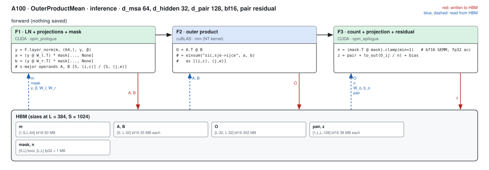

##### F1 · LN + projections + mask (opm_prologue)

| (Length, MSA depth) | (128, 1024) | (256, 1024) | (384, 1024) | (512, 1024) | (640, 1024) | (768, 1024) | (128, 2048) | (256, 2048) | (384, 2048) | (512, 2048) | (640, 2048) | (768, 2048) | (128, 4096) | (256, 4096) | (384, 4096) | (512, 4096) | (640, 4096) | (768, 4096) |
|---|---|---|---|---|---|---|---|---|---|---|---|---|---|---|---|---|---|---|
| implementation | CUDA | CUDA | CUDA | CUDA | CUDA | CUDA | CUDA | CUDA | CUDA | CUDA | CUDA | CUDA | CUDA | CUDA | CUDA | CUDA | CUDA | CUDA |
| 성능 확인 | ✗ | ✗ | ✗ | ✗ | ✗ | ✗ | ✗ | ✗ | ✗ | ✗ | ✗ | ✗ | ✗ | ✗ | ✗ | ✗ | ✗ | ✗ |
| cache build | ✓ | ✓ | ✓ | ✓ | ✓ | ✓ | ✓ | ✓ | ✓ | ✓ | ✓ | ✓ | ✓ | ✓ | ✓ | ✓ | ✓ | ✓ |

##### F3 · count + projection + residual (opm_epilogue)

| (Length, MSA depth) | (128, 1024) | (256, 1024) | (384, 1024) | (512, 1024) | (640, 1024) | (768, 1024) | (128, 2048) | (256, 2048) | (384, 2048) | (512, 2048) | (640, 2048) | (768, 2048) | (128, 4096) | (256, 4096) | (384, 4096) | (512, 4096) | (640, 4096) | (768, 4096) |
|---|---|---|---|---|---|---|---|---|---|---|---|---|---|---|---|---|---|---|
| implementation | CUDA | CUDA | CUDA | CUDA | CUDA | CUDA | CUDA | CUDA | CUDA | CUDA | CUDA | CUDA | CUDA | CUDA | CUDA | CUDA | CUDA | CUDA |
| 성능 확인 | ✗ | ✗ | ✗ | ✗ | ✗ | ✗ | ✗ | ✗ | ✗ | ✗ | ✗ | ✗ | ✗ | ✗ | ✗ | ✗ | ✗ | ✗ |
| cache build | ✓ | ✓ | ✓ | ✓ | ✓ | ✓ | ✓ | ✓ | ✓ | ✓ | ✓ | ✓ | ✓ | ✓ | ✓ | ✓ | ✓ | ✓ |

### Training

#### Fused path · any L, any S

The forward keeps the LayerNorm statistics, A, B, the counts and O (`MINIWORLD_OPM_SM80_SAVE_O=0` recomputes O in the backward instead of keeping 302 MB at L384).

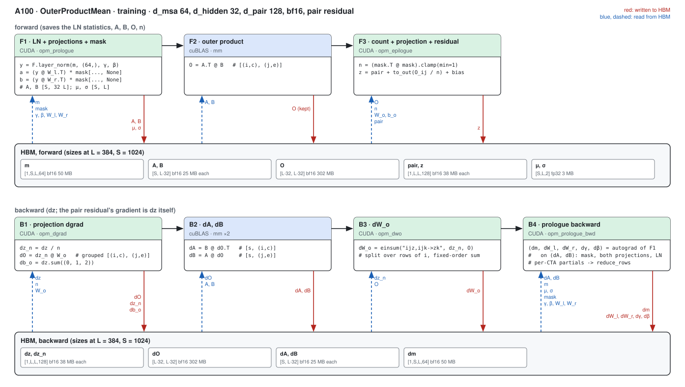

##### F1 · LN + projections + mask (opm_prologue)

| (Length, MSA depth) | (128, 1024) | (256, 1024) | (384, 1024) | (512, 1024) | (640, 1024) | (768, 1024) |
|---|---|---|---|---|---|---|
| implementation | CUDA | CUDA | CUDA | CUDA | CUDA | CUDA |
| 성능 확인 | ✗ | ✗ | ✗ | ✗ | ✗ | ✗ |
| cache build | ✓ | ✓ | ✓ | ✓ | ✓ | ✓ |

##### F3 · count + projection + residual (opm_epilogue)

| (Length, MSA depth) | (128, 1024) | (256, 1024) | (384, 1024) | (512, 1024) | (640, 1024) | (768, 1024) |
|---|---|---|---|---|---|---|
| implementation | CUDA | CUDA | CUDA | CUDA | CUDA | CUDA |
| 성능 확인 | ✗ | ✗ | ✗ | ✗ | ✗ | ✗ |
| cache build | ✓ | ✓ | ✓ | ✓ | ✓ | ✓ |

##### B1 · projection dgrad (opm_dgrad)

| (Length, MSA depth) | (128, 1024) | (256, 1024) | (384, 1024) | (512, 1024) | (640, 1024) | (768, 1024) |
|---|---|---|---|---|---|---|
| implementation | CUDA | CUDA | CUDA | CUDA | CUDA | CUDA |
| 성능 확인 | ✗ | ✗ | ✗ | ✗ | ✗ | ✗ |
| cache build | ✓ | ✓ | ✓ | ✓ | ✓ | ✓ |

##### B3 · dW_o (opm_dwo)

| (Length, MSA depth) | (128, 1024) | (256, 1024) | (384, 1024) | (512, 1024) | (640, 1024) | (768, 1024) |
|---|---|---|---|---|---|---|
| implementation | CUDA | CUDA | CUDA | CUDA | CUDA | CUDA |
| 성능 확인 | ✗ | ✗ | ✗ | ✗ | ✗ | ✗ |
| cache build | ✓ | ✓ | ✓ | ✓ | ✓ | ✓ |

##### B4 · prologue backward (opm_prologue_bwd)

| (Length, MSA depth) | (128, 1024) | (256, 1024) | (384, 1024) | (512, 1024) | (640, 1024) | (768, 1024) |
|---|---|---|---|---|---|---|
| implementation | CUDA | CUDA | CUDA | CUDA | CUDA | CUDA |
| 성능 확인 | ✗ | ✗ | ✗ | ✗ | ✗ | ✗ |
| cache build | ✓ | ✓ | ✓ | ✓ | ✓ | ✓ |

##### R · fixed-order partial sums (reduce_rows)

| (Length, MSA depth) | (128, 1024) | (256, 1024) | (384, 1024) | (512, 1024) | (640, 1024) | (768, 1024) |
|---|---|---|---|---|---|---|
| implementation | CUDA | CUDA | CUDA | CUDA | CUDA | CUDA |
| 성능 확인 | ✗ | ✗ | ✗ | ✗ | ✗ | ✗ |
| cache build | ✓ | ✓ | ✓ | ✓ | ✓ | ✓ |

## Measurements (2026-10-04)

- Setup: A100 80GB PCIe (one node of the `A100` partition per job), torch 2.13.0+cu129, triton 3.7.1, B = 1, bf16-mixed (the module's LayerNorm parameters stay fp32), a mask with every row valid (the bench's `mask_prob` 0), the running pair as the cross-tensor residual
  (`pair = opm(msa, mask, residual=pair)`).
- Harness: `benchmarks/runners/bench.py target=outer_product level=module mode=<inference|training> min_seq_len=128 max_seq_len=768 seq_len_step=128 [+n_msa=<S>] [+msa_d_msa=128 d_pair=<256|384>]`, run from a frozen snapshot of the tree (snapshot `snap_1004_082257`, job
  63225: S1024 at the three widths and S2048 / S4096 inference at d_msa 64 / d_pair 128); compiled, inference in a CUDA graph, training with and without one; the `triton` arm is the module with `implementation=triton` (the path this one replaces), `pytorch` the module's statements.
- Tables: latency in ms (median of the harness's repeats); × = PyTorch compiled / ours. cuEquivariance ships no OuterProductMean kernel (—); the Triton path is a reference column and never the denominator. Anthropic: the 2026-09-24 branch record of
  `experiments/a100_anthropic_baseline` (torch 2.10, A100 PCIe, `ops.msa_opm.forward_mask_norm`, the best of its configs, inference only: the release has no backward) where it has the shape (L384 and L768 at S1024); this round did not run any `anthropic` arm.
- Accuracy against the harness's fp32 reference (max over every row): ours output 1.68e-3, gradient 2.42e-4; PyTorch compiled 1.68e-3 / 2.65e-4; Triton path 1.67e-3 / 2.42e-4: the path is as accurate as the bf16 module, in every layout and width the tests cover (`tests/integrations/test_a100_opm_gpu.py`).
- Spread: the same kernel differs by 10 % and more between runs on different nodes (clock and thermal state), so the Triton column is compared with ours only inside one job, and the interleaved A/B table below (one process, alternating CUDA-graph replays) is the
  number to trust for "ours against the Triton path"; training in the bench's no-graph mode is host-bound at L128 (the step is ~30 launches of Python glue).
- Charts: under each table, a length sweep at S1024 and an MSA-depth sweep at L384 (`python -m miniworld_engine.viz.measure_bars docs/gpus/a100/outer_product/outer_product.md --length-d 1024 --dim-l 384`).

### OPM · Inference (CUDA graph)

| (Length, MSA depth) | PyTorch compiled | cuEquivariance | Anthropic | Triton path | ours | × |
|---|---|---|---|---|---|---|
| (128, 1024) | 0.312 | — | — (not measured) | 0.242 | 0.238 | 1.31 |
| (256, 1024) | 1.110 | — | — (not measured) | 0.844 | 0.816 | 1.36 |
| (384, 1024) | 2.349 | — | 5.540 | 1.835 | 1.820 | 1.29 |
| (512, 1024) | 3.898 | — | — (not measured) | 3.210 | 3.203 | 1.22 |
| (640, 1024) | 6.244 | — | — (not measured) | 4.997 | 5.004 | 1.25 |
| (768, 1024) | 8.959 | — | 19.042 | 7.247 | 7.148 | 1.25 |
| (128, 2048) | 0.549 | — | — (not measured) | 0.403 | 0.400 | 1.37 |
| (256, 2048) | 1.842 | — | — (not measured) | 1.462 | 1.437 | 1.28 |
| (384, 2048) | 3.873 | — | — (not measured) | 3.176 | 3.183 | 1.22 |
| (512, 2048) | 6.665 | — | — (not measured) | 5.650 | 5.535 | 1.20 |
| (640, 2048) | 10.221 | — | — (not measured) | 8.760 | 8.259 | 1.24 |
| (768, 2048) | 14.438 | — | — (not measured) | 12.470 | 12.370 | 1.17 |
| (128, 4096) | 0.991 | — | — (not measured) | 0.751 | 0.731 | 1.36 |
| (256, 4096) | 3.281 | — | — (not measured) | 2.725 | 2.677 | 1.23 |
| (384, 4096) | 6.724 | — | — (not measured) | 5.924 | 5.941 | 1.13 |
| (512, 4096) | 11.795 | — | — (not measured) | 10.409 | 10.228 | 1.15 |
| (640, 4096) | 17.990 | — | — (not measured) | 16.104 | 16.032 | 1.12 |
| (768, 4096) | 25.722 | — | — (not measured) | 22.736 | 22.662 | 1.14 |

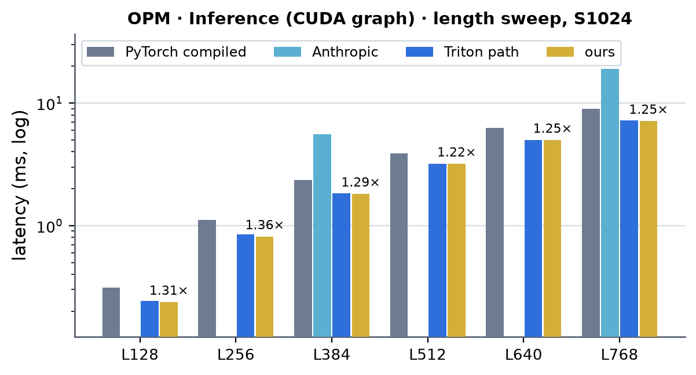 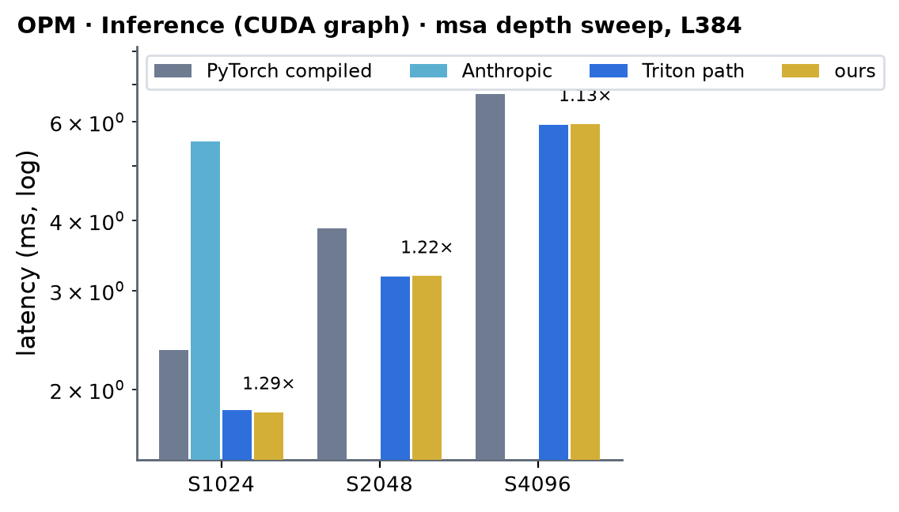 <!-- measure_bars -->

<!-- accuracy miniworld: output rel-Frobenius max 1.673e-03, grad rel-Frobenius max 0.000e+00 -->
<!-- accuracy triton: output rel-Frobenius max 1.670e-03, grad rel-Frobenius max 0.000e+00 -->
<!-- accuracy pytorch: output rel-Frobenius max 1.673e-03, grad rel-Frobenius max 0.000e+00 -->
<!-- ours served by: ['integrations.opm_sm80.update_inference'] -->

### OPM · Training (CUDA graph)

| (Length, MSA depth) | PyTorch compiled | cuEquivariance | Anthropic | Triton path | ours | × |
|---|---|---|---|---|---|---|
| (128, 1024) | 1.074 | — | — (the release has no backward) | 1.011 | 0.859 | 1.25 |
| (256, 1024) | 3.163 | — | — (the release has no backward) | 2.980 | 2.580 | 1.23 |
| (384, 1024) | 6.624 | — | — (the release has no backward) | 6.389 | 5.561 | 1.19 |
| (512, 1024) | 11.429 | — | — (the release has no backward) | 10.774 | 9.543 | 1.20 |
| (640, 1024) | 17.371 | — | — (the release has no backward) | 16.471 | 14.797 | 1.17 |
| (768, 1024) | 25.161 | — | — (the release has no backward) | 23.867 | 21.494 | 1.17 |

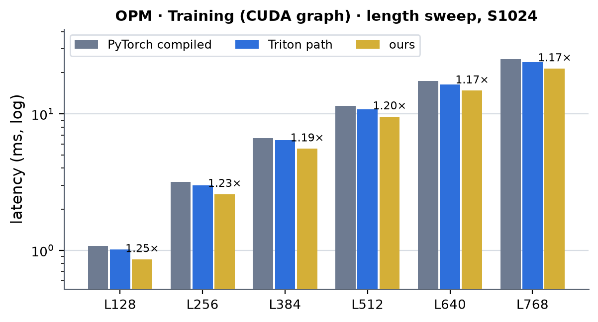 <!-- measure_bars -->

<!-- accuracy miniworld: output rel-Frobenius max 1.673e-03, grad rel-Frobenius max 2.307e-04 -->
<!-- accuracy triton: output rel-Frobenius max 1.670e-03, grad rel-Frobenius max 2.307e-04 -->
<!-- accuracy pytorch: output rel-Frobenius max 1.673e-03, grad rel-Frobenius max 2.517e-04 -->
<!-- ours served by: ['integrations.opm_sm80.update_train'] -->

### OPM · Training (no CUDA graph)

| (Length, MSA depth) | PyTorch compiled | cuEquivariance | Anthropic | Triton path | ours | × |
|---|---|---|---|---|---|---|
| (128, 1024) | 1.104 | — | — (the release has no backward) | 1.480 | 1.109 | 1.00 |
| (256, 1024) | 3.195 | — | — (the release has no backward) | 2.999 | 2.614 | 1.22 |
| (384, 1024) | 6.668 | — | — (the release has no backward) | 6.427 | 5.590 | 1.19 |
| (512, 1024) | 11.471 | — | — (the release has no backward) | 10.320 | 9.569 | 1.20 |
| (640, 1024) | 17.278 | — | — (the release has no backward) | 16.434 | 14.658 | 1.18 |
| (768, 1024) | 24.952 | — | — (the release has no backward) | 24.078 | 21.530 | 1.16 |

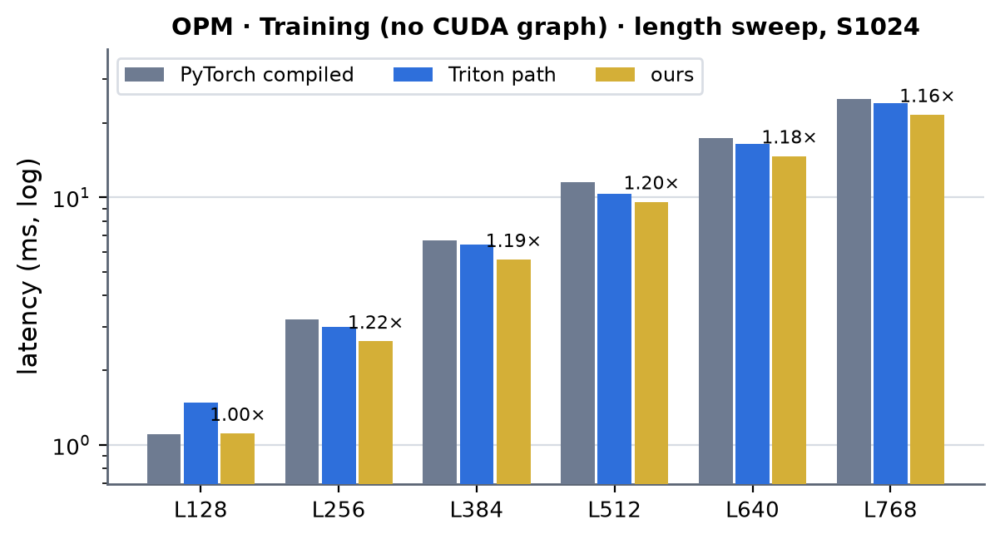 <!-- measure_bars -->

<!-- accuracy miniworld: output rel-Frobenius max 1.673e-03, grad rel-Frobenius max 2.307e-04 -->
<!-- accuracy triton: output rel-Frobenius max 1.670e-03, grad rel-Frobenius max 2.307e-04 -->
<!-- accuracy pytorch: output rel-Frobenius max 1.673e-03, grad rel-Frobenius max 2.517e-04 -->
<!-- ours served by: ['integrations.opm_sm80.update_train'] -->

### OPM · Inference (CUDA graph) · d_msa 128 / d_pair 256

| (Length, MSA depth) | PyTorch compiled | cuEquivariance | Anthropic | Triton path | ours | × |
|---|---|---|---|---|---|---|
| (128, 1024) | 0.403 | — | — (not measured) | 0.294 | 0.275 | 1.46 |
| (256, 1024) | 1.286 | — | — (not measured) | 0.998 | 0.947 | 1.36 |
| (384, 1024) | 2.654 | — | — (not measured) | 2.146 | 2.083 | 1.27 |
| (512, 1024) | 4.589 | — | — (not measured) | 3.771 | 3.632 | 1.26 |
| (640, 1024) | 7.000 | — | — (not measured) | 5.846 | 5.680 | 1.23 |
| (768, 1024) | 9.930 | — | — (not measured) | 8.378 | 8.110 | 1.22 |

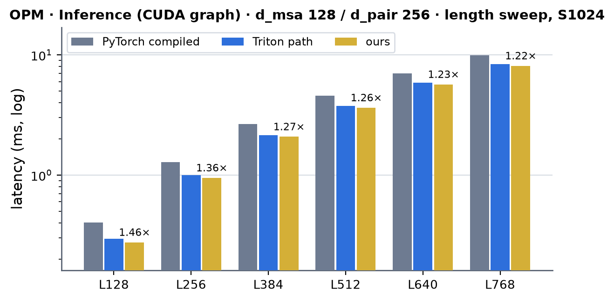 <!-- measure_bars -->

<!-- accuracy miniworld: output rel-Frobenius max 1.675e-03, grad rel-Frobenius max 0.000e+00 -->
<!-- accuracy triton: output rel-Frobenius max 1.672e-03, grad rel-Frobenius max 0.000e+00 -->
<!-- accuracy pytorch: output rel-Frobenius max 1.675e-03, grad rel-Frobenius max 0.000e+00 -->
<!-- ours served by: ['integrations.opm_sm80.update_inference'] -->

### OPM · Training (CUDA graph) · d_msa 128 / d_pair 256

| (Length, MSA depth) | PyTorch compiled | cuEquivariance | Anthropic | Triton path | ours | × |
|---|---|---|---|---|---|---|
| (128, 1024) | 1.279 | — | — (the release has no backward) | 1.327 | 1.054 | 1.21 |
| (256, 1024) | 3.684 | — | — (the release has no backward) | 3.920 | 3.175 | 1.16 |
| (384, 1024) | 7.572 | — | — (the release has no backward) | 8.169 | 6.789 | 1.12 |
| (512, 1024) | 12.833 | — | — (the release has no backward) | 13.665 | 11.635 | 1.10 |
| (640, 1024) | 19.217 | — | — (the release has no backward) | 20.768 | 17.797 | 1.08 |
| (768, 1024) | 28.008 | — | — (the release has no backward) | 30.232 | 25.968 | 1.08 |

 <!-- measure_bars -->

<!-- accuracy miniworld: output rel-Frobenius max 1.675e-03, grad rel-Frobenius max 2.413e-04 -->
<!-- accuracy triton: output rel-Frobenius max 1.672e-03, grad rel-Frobenius max 2.414e-04 -->
<!-- accuracy pytorch: output rel-Frobenius max 1.675e-03, grad rel-Frobenius max 2.640e-04 -->
<!-- ours served by: ['integrations.opm_sm80.update_train'] -->

### OPM · Training (no CUDA graph) · d_msa 128 / d_pair 256

| (Length, MSA depth) | PyTorch compiled | cuEquivariance | Anthropic | Triton path | ours | × |
|---|---|---|---|---|---|---|
| (128, 1024) | 1.297 | — | — (the release has no backward) | 1.530 | 1.072 | 1.21 |
| (256, 1024) | 3.708 | — | — (the release has no backward) | 3.960 | 3.171 | 1.17 |
| (384, 1024) | 7.622 | — | — (the release has no backward) | 8.191 | 6.745 | 1.13 |
| (512, 1024) | 12.909 | — | — (the release has no backward) | 13.570 | 11.246 | 1.15 |
| (640, 1024) | 19.359 | — | — (the release has no backward) | 20.270 | 17.584 | 1.10 |
| (768, 1024) | 27.617 | — | — (the release has no backward) | 29.841 | 26.009 | 1.06 |

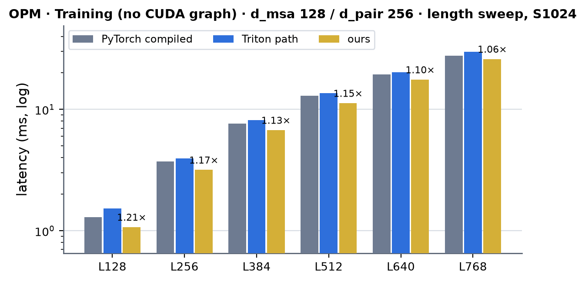 <!-- measure_bars -->

<!-- accuracy miniworld: output rel-Frobenius max 1.675e-03, grad rel-Frobenius max 2.413e-04 -->
<!-- accuracy triton: output rel-Frobenius max 1.672e-03, grad rel-Frobenius max 2.414e-04 -->
<!-- accuracy pytorch: output rel-Frobenius max 1.675e-03, grad rel-Frobenius max 2.640e-04 -->
<!-- ours served by: ['integrations.opm_sm80.update_train'] -->

### OPM · Inference (CUDA graph) · d_msa 128 / d_pair 384

| (Length, MSA depth) | PyTorch compiled | cuEquivariance | Anthropic | Triton path | ours | × |
|---|---|---|---|---|---|---|
| (128, 1024) | 0.417 | — | — (not measured) | 0.314 | 0.296 | 1.41 |
| (256, 1024) | 1.386 | — | — (not measured) | 1.114 | 1.060 | 1.31 |
| (384, 1024) | 2.926 | — | — (not measured) | 2.460 | 2.316 | 1.26 |
| (512, 1024) | 5.005 | — | — (not measured) | 4.269 | 4.079 | 1.23 |
| (640, 1024) | 7.681 | — | — (not measured) | 6.637 | 6.362 | 1.21 |
| (768, 1024) | 10.909 | — | — (not measured) | 9.634 | 9.099 | 1.20 |

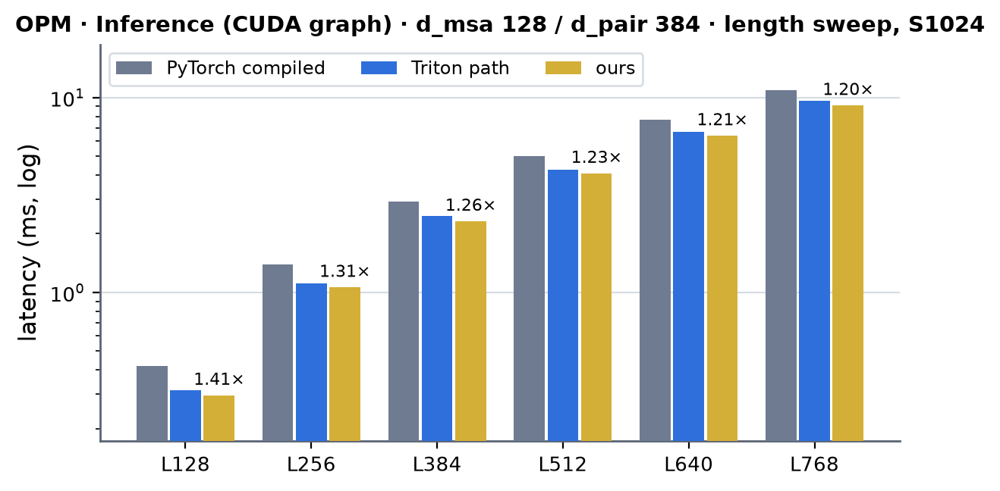 <!-- measure_bars -->

<!-- accuracy miniworld: output rel-Frobenius max 1.675e-03, grad rel-Frobenius max 0.000e+00 -->
<!-- accuracy triton: output rel-Frobenius max 1.671e-03, grad rel-Frobenius max 0.000e+00 -->
<!-- accuracy pytorch: output rel-Frobenius max 1.675e-03, grad rel-Frobenius max 0.000e+00 -->
<!-- ours served by: ['integrations.opm_sm80.update_inference'] -->

### OPM · Training (CUDA graph) · d_msa 128 / d_pair 384

| (Length, MSA depth) | PyTorch compiled | cuEquivariance | Anthropic | Triton path | ours | × |
|---|---|---|---|---|---|---|
| (128, 1024) | 1.319 | — | — (the release has no backward) | 1.456 | 1.171 | 1.13 |
| (256, 1024) | 3.943 | — | — (the release has no backward) | 4.571 | 3.517 | 1.12 |
| (384, 1024) | 8.146 | — | — (the release has no backward) | 9.501 | 7.710 | 1.06 |
| (512, 1024) | 14.003 | — | — (the release has no backward) | 15.929 | 13.326 | 1.05 |
| (640, 1024) | 21.219 | — | — (the release has no backward) | 24.335 | 20.033 | 1.06 |
| (768, 1024) | 30.887 | — | — (the release has no backward) | 34.833 | 29.669 | 1.04 |

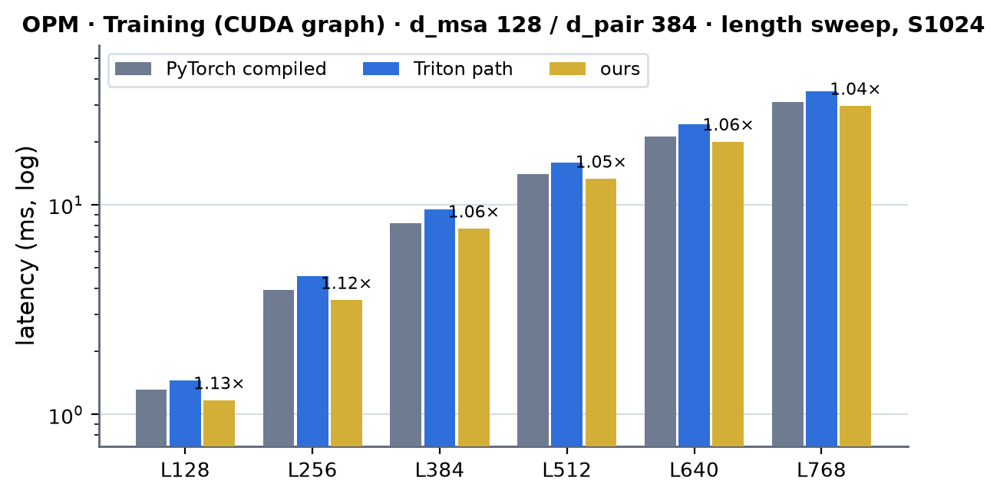 <!-- measure_bars -->

<!-- accuracy miniworld: output rel-Frobenius max 1.675e-03, grad rel-Frobenius max 2.420e-04 -->
<!-- accuracy triton: output rel-Frobenius max 1.671e-03, grad rel-Frobenius max 2.420e-04 -->
<!-- accuracy pytorch: output rel-Frobenius max 1.675e-03, grad rel-Frobenius max 2.647e-04 -->
<!-- ours served by: ['integrations.opm_sm80.update_train'] -->

### OPM · Training (no CUDA graph) · d_msa 128 / d_pair 384

| (Length, MSA depth) | PyTorch compiled | cuEquivariance | Anthropic | Triton path | ours | × |
|---|---|---|---|---|---|---|
| (128, 1024) | 1.354 | — | — (the release has no backward) | 1.716 | 1.196 | 1.13 |
| (256, 1024) | 3.977 | — | — (the release has no backward) | 4.557 | 3.564 | 1.12 |
| (384, 1024) | 8.170 | — | — (the release has no backward) | 9.438 | 7.654 | 1.07 |
| (512, 1024) | 13.847 | — | — (the release has no backward) | 16.037 | 13.196 | 1.05 |
| (640, 1024) | 20.891 | — | — (the release has no backward) | 23.694 | 20.167 | 1.04 |
| (768, 1024) | 30.453 | — | — (the release has no backward) | 34.855 | 29.770 | 1.02 |

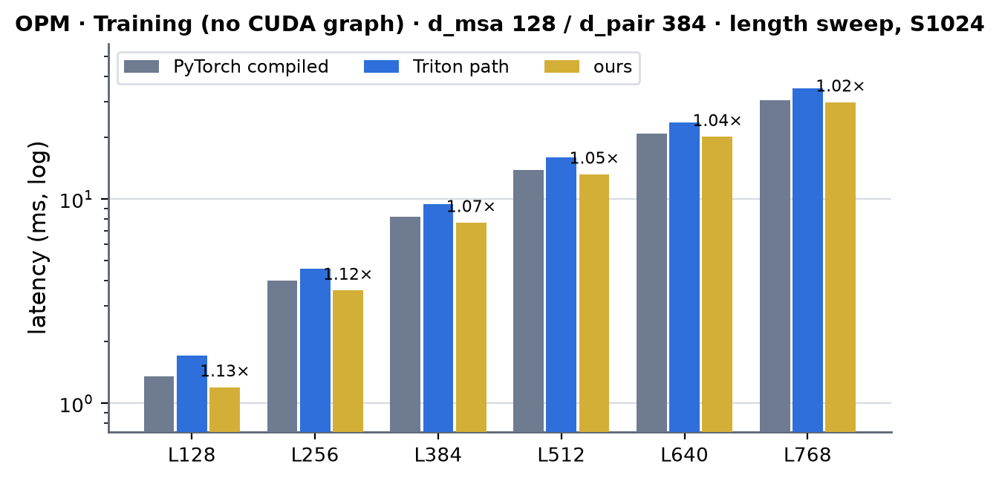 <!-- measure_bars -->

<!-- accuracy miniworld: output rel-Frobenius max 1.675e-03, grad rel-Frobenius max 2.420e-04 -->
<!-- accuracy triton: output rel-Frobenius max 1.671e-03, grad rel-Frobenius max 2.420e-04 -->
<!-- accuracy pytorch: output rel-Frobenius max 1.675e-03, grad rel-Frobenius max 2.647e-04 -->
<!-- ours served by: ['integrations.opm_sm80.update_train'] -->

### Ours against the Triton path (interleaved A/B, job 63280)

The bench columns above come from separate runs of each implementation, and the same kernel differs by 10 % and more between nodes and between runs on one node (clock and power state), so the comparison with the Triton path is taken inside one process: one module, two CUDA graphs captured with the dispatch on and off
(`MINIWORLD_OPM_SM80=1` / `0`), 9 rounds that alternate which of the two is replayed first (4 inference replays or one training step per measurement). The table has the median of each (ms), their ratio, and the median of the per-round ratios with its range over the rounds (a ratio inside one round is not touched by the clock drift between
rounds). Below 1 ours is faster; MSA depth 1024, `bench.py`'s shapes (mask all valid, the running pair as residual).

| shape (d_msa / d_pair / heads) | mode | (Length, MSA depth) | Triton path | ours | ours / Triton | per-round ratio, median [range] |
|---|---|---|---|---|---|---|
| 64 / 128 | inference | (128, 1024) | 0.234 | 0.231 | 0.988 | 0.987 [0.984 .. 0.990] |
| 64 / 128 | training | (128, 1024) | 1.037 | 0.862 | 0.831 | 0.831 [0.817 .. 0.833] |
| 64 / 128 | inference | (256, 1024) | 0.836 | 0.813 | 0.972 | 0.973 [0.967 .. 0.990] |
| 64 / 128 | training | (256, 1024) | 3.106 | 2.566 | 0.826 | 0.826 [0.785 .. 0.855] |
| 64 / 128 | inference | (384, 1024) | 1.872 | 1.827 | 0.976 | 0.976 [0.921 .. 0.982] |
| 64 / 128 | training | (384, 1024) | 6.638 | 5.532 | 0.833 | 0.830 [0.809 .. 0.842] |
| 64 / 128 | inference | (512, 1024) | 3.232 | 3.148 | 0.974 | 0.973 [0.962 .. 0.986] |
| 64 / 128 | training | (512, 1024) | 11.188 | 9.419 | 0.842 | 0.844 [0.822 .. 0.848] |
| 64 / 128 | inference | (640, 1024) | 5.024 | 4.934 | 0.982 | 0.982 [0.919 .. 0.983] |
| 64 / 128 | training | (640, 1024) | 16.890 | 14.536 | 0.861 | 0.861 [0.854 .. 0.890] |
| 64 / 128 | inference | (768, 1024) | 7.276 | 7.073 | 0.972 | 0.973 [0.937 .. 0.979] |
| 64 / 128 | training | (768, 1024) | 24.538 | 21.491 | 0.876 | 0.881 [0.868 .. 0.889] |
| 128 / 256 | inference | (384, 1024) | 2.205 | 2.140 | 0.970 | 0.971 [0.947 .. 1.023] |
| 128 / 256 | training | (384, 1024) | 8.464 | 6.757 | 0.798 | 0.795 [0.760 .. 0.801] |
| 128 / 256 | inference | (768, 1024) | 8.410 | 8.081 | 0.961 | 0.961 [0.920 .. 0.961] |
| 128 / 256 | training | (768, 1024) | 30.135 | 25.861 | 0.858 | 0.863 [0.852 .. 0.878] |
| 128 / 384 | inference | (384, 1024) | 2.478 | 2.348 | 0.947 | 0.952 [0.912 .. 0.952] |
| 128 / 384 | training | (384, 1024) | 9.731 | 7.586 | 0.780 | 0.782 [0.762 .. 0.790] |
| 128 / 384 | inference | (768, 1024) | 9.521 | 9.099 | 0.956 | 0.955 [0.934 .. 0.987] |
| 128 / 384 | training | (768, 1024) | 35.172 | 29.520 | 0.839 | 0.843 [0.825 .. 0.854] |

Ours is faster than the Triton path in every row (ratio < 1); inference is within 1-5 % because both paths run the same cuBLAS `O = A^T B` (77-80 % of the step) and the whole step differs by 1-3 % at d_pair 128 and by 3-5 % at 256 / 384 (the column-tile epilogue: 441 / 629 us against the Triton epilogue's 524 / 804 at L384). Before the column tiles the d_pair 384 inference was 7-8 % slower than Triton (the first A/B, job 63133: 1.072 / 1.078): that row is why the epilogue was rebuilt.

### Speed of light

SoL = the composite floor of the decomposition: per step `max(essential bytes / 1.60 TB/s, FLOP / 240 TFLOP/s)` per kernel, summed (both ceilings measured on this card, see [../a100.md](../a100.md)); every tensor a kernel reads or writes counts once, the three GEMMs by their FLOP (309 GFLOP each at L384, S1024),
the mask-count GEMM by 2 us (L384) / 6 us (L768), the projection kernels by `max(bytes, 2 L^2 1024 d_pair FLOP)` (the 1024 -> d_pair projection is the tensor work of the epilogue, dgrad and dWo). Ours is the bench's CUDA-graph time (S1024, snapshot `snap_1004_082257`, job 63225), including the ~10 us of launch latency a profiled replay does not.

| d_msa / d_pair | mode | L | ours (µs) | SoL floor (µs) | % of SoL | floor of the cuBLAS GEMMs (µs) | the rest's floor (µs) |
|---|---|---|---|---|---|---|---|
| 64 / 128 | inference | 384 | 1820 | 1590 | 87 % | 1288 | 301 |
| 64 / 128 | inference | 768 | 7148 | 6231 | 87 % | 5154 | 1078 |
| 64 / 128 | training | 384 | 5561 | 4748 | 85 % | 3865 | 882 |
| 64 / 128 | training | 768 | 21494 | 18596 | 87 % | 15462 | 3134 |
| 128 / 256 | inference | 384 | 2083 | 1707 | 82 % | 1288 | 419 |
| 128 / 256 | inference | 768 | 8110 | 6638 | 82 % | 5154 | 1484 |
| 128 / 256 | training | 384 | 6789 | 5123 | 75 % | 3865 | 1258 |
| 128 / 256 | training | 768 | 25968 | 19910 | 77 % | 15462 | 4449 |
| 128 / 384 | inference | 384 | 2316 | 1868 | 81 % | 1288 | 580 |
| 128 / 384 | inference | 768 | 9099 | 7282 | 80 % | 5154 | 2128 |
| 128 / 384 | training | 384 | 7710 | 5607 | 73 % | 3865 | 1741 |
| 128 / 384 | training | 768 | 29669 | 21843 | 74 % | 15462 | 6381 |

The floor counts the large-GEMM ceiling of 240 TFLOP/s; the three cuBLAS GEMMs of this step run at 255-258 TFLOP/s (see below), so the "0f SoL" is a conservative statement of how much of the step is the GEMM: at d_pair 128 the GEMMs are 74-80 % of the step and the rest runs at 85-92 % of its floor in inference and 69-70 % in training (dgrad, dWo), at 256 / 384 the projection kernels (epilogue, dgrad, dWo) are the gap.

Per kernel at L384, S1024 (the profiler's times of one module step, job 63213; floors as above, the cuBLAS rows by FLOP):

| kernel | d_msa / d_pair | time (µs) | floor (µs) | % of floor |
|---|---|---|---|---|
| prologue (inference, no statistics) | 64 / 128 | 64.5 | 63 | 98 % |
| `O = A^T B` (cuBLAS) | 64 / 128 | 1197.4 | 1288 | 108 % (255-258 TFLOP/s: above the 240 TFLOP/s ceiling) |
| epilogue | 64 / 128 | 267.4 | 236 | 88 % |
| dgrad | 64 / 128 | 358.5 | 236 | 66 % |
| `dA`, `dB` (cuBLAS x 2) | 64 / 128 | 2452.6 | 2576 | 105 % |
| dWo | 64 / 128 | 272.2 | 212 | 78 % |
| prologue backward | 64 / 128 | 151.3 | 128 | 85 % |
| epilogue | 128 / 256 | 440.7 | 322 | 73 % |
| dgrad | 128 / 256 | 821.3 | 322 | 39 % |
| dWo | 128 / 256 | 539.3 | 322 | 60 % |
| epilogue | 128 / 384 | 629.0 | 483 | 77 % |
| dgrad | 128 / 384 | 1227.1 | 483 | 39 % |
| dWo | 128 / 384 | 814.7 | 483 | 59 % |

### Where the time goes (`torch.profiler` CUPTI kernel times, one process, job 63213; d_msa 64 / d_pair 128, S1024, µs per call, bf16)

| kernels | L384 inference | L384 training | L768 inference | L768 training | floor L384 (inference / training) |
|---|---|---|---|---|---|
| prologue (`opm_prologue`: LayerNorm + both projections + mask; training also writes the statistics) | 64.5 | 68.6 | 133.4 | 136.2 | 63 / 65 |
| `O = A^T B` (cuBLAS, the NT 128 x 128 x 32 kernel) | 1197.4 | 1210.0 | 4812.4 | 5345.1 | 1288 / 1288 |
| mask counts (cuBLAS, `n = mask^T mask`) | 8.8 | 9.0 | 12.4 | 14.2 | 2 / 2 |
| epilogue (`opm_epilogue`) | 267.4 | 267.7 | 1017.7 | 1027.8 | 236 / 236 |
| dgrad (`opm_dgrad`) | | 358.5 | | 1540.1 | / 236 |
| `dA = B dO^T`, `dB = A dO` (cuBLAS x 2) | | 2452.6 | | 10817.9 | / 2576 |
| dWo (`opm_dwo`) | | 272.2 | | 1188.9 | / 212 |
| prologue backward (`opm_prologue_bwd`) | | 151.3 | | 323.0 | / 128 |
| `reduce_rows` (3 launches) | | 40.5 | | 115.8 | / 2 |
| PyTorch small ops (device copies of the small gradients and weights, adds, casts) | 12.4 | 101.1 | 14.2 | 172.9 | |
| sum of kernel times | 1550.5 | 4931.5 | 5990.1 | 20681.9 | 1590 / 4748 |
| graph replay (bench, S1024) | 1820 | 5561 | 7148 | 21494 | |

The three outer-product GEMMs are 77 % of the inference step and 74 % of the training step at L384 (80 % / 78 % at L768) and run at 255-258 TFLOP/s (the NT 128 x 128 x 32 kernel at M = N = 12288, K = 1024: above the 240 TFLOP/s ceiling the floors use); the kernels around them are at 88-98 % of their floors in
inference (prologue 98 %, epilogue 88 %) and 66-95 % in training (dgrad 66 %, dWo 78 %, prologue backward 85 %, prologue 95 %). The profiled kernel times sit 5-15 % under the graph-timed kernel probe's for the small kernels (graph replays carry ~3 us of launch latency each and start cold). At d_pair 256 / 384
(L384, job 63213) the step is 1770 / 1960 us of kernels in inference (GEMM 1204, epilogue 441 / 629, prologue 103) and 6145 / 7050 us in training (the three GEMMs 3710 / 3730, dgrad 821 / 1227, dWo 539 / 815, epilogue 450 / 647, prologue backward 297 / 302, prologue 111 / 112, `reduce_rows` 40 / 39); the Triton path's
epilogue is 524 / 804 us there and its backward epilogues 1875 / 2711 us against ours 1360 / 2042 (dgrad + dWo).

## What was tried and did not pay (2026-10-04)

- **K-major operands (the first version of this path) against s-major**: A2 / BT as `[32 L, SK]` K-contiguous rows (what a per-row transposed store gives for free) made cuBLAS pick the TN 128 x 256 x 64 / 3-stage kernel; the s-major layout the Triton path uses (`mm(A^T, B)`)
  gets the NT 128 x 128 x 32 / 5-stage kernel and is 5.5-10 % faster at every L from 128 to 768 (interleaved medians, S1024: L128 155.5 -> 146.9 us, L384 1597 -> 1458, L768 6312 -> 5818; at S2048 / S4096 the two differ by 1-2 %). Adopted: this one choice was worth more than
  every kernel schedule below, and it is why the prologue and its backward changed shape (the backward already read s-major dA / dB).
- **Epilogue / dgrad schedules** (`MINIWORLD_OPM_SM80_EPI` / `_DG`, kernel probe, L384): at d_pair 128 the epilogue with a 3- or 4-stage ring and one CTA per SM is 17-30 % slower than the shipped two stages x two CTAs per SM (336 / 373 against 284 us), the dgrad likewise (494-558 against 395-440 us):
  two CTAs interleave one's barrier with the other's mma. At d_pair 256 / 384 the epilogue went through three designs (dev jobs 63091 / 63173, one node, bit-identical outputs): all channels in one CTA of 8 warps and 64 pairs (the first version: 631 / 1023 us), in one CTA of 16 warps and 128 pairs (wide, one per SM: 530-556 / 916-946 us; a third ring stage inside
  the node spread), and the d_pair 128 CTA run once per column tile of 128 channels with the tiles the fastest grid axis (463 / 703 us, 165 TFLOP/s at both widths; one CTA per SM with three stages: 717 / 1075). The first design loaded the 32-48 KB Wo chunk once per 64 pairs, the second left one CTA per SM
  with its store phase unhidden; the column tiles pay 2-3 reads of the O tile from L2 (the 3 x 302 MB at 384 are below L2's rate) for two resident CTAs. Shipped: the column tiles; the other two stay as `MINIWORLD_OPM_SM80_EPI=1` (wide) and `=2` (first version). The dgrad at 256 / 384 keeps one CTA of 8 warps per SM (its dz tile is 64 / 96 KB of shared memory).
- **Prefetch depth of the prologue** (`MINIWORLD_OPM_SM80_PL`: 2 / 3 / 4 tile buffers): 93 / 96 / 94 us with and without the statistics, within noise -- the kernel runs at 68 % of the card's DRAM peak (1.33 TB/s, Nsight Compute) and is limited by two CTAs of eight warps per SM,
  not by the bytes in flight; what helped the backward (statistics through `cp.async`: 242 -> 204 us event time) did nothing here. The mask byte of the next tile into a register (a dependent global load in front of the barrier) was the top stall in the sampled profile and
  bought nothing measurable either: kept, it is harmless.
- **Folding the epilogue into the GEMM** (never reading O back): costed, not built. The 285 us epilogue would be replaced by the projection's extra tensor work inside a hand-written mma.sync GEMM (+12 % of the 1.29 ms product at d_pair 128, +37 % at 384) that would have to
  run within 85 % of cuBLAS's rate to break even; A100 has no TMA / wgmma to get there.
- **`MINIWORLD_OPM_SM80_SAVE_O=0`** (recompute O in the backward): 302 MB less at L384 (1.2 GB at L768) for one more 1.29 ms GEMM; off by default.
- A cuBLASLt algorithm search for the three GEMMs was not retried (the program's earlier searches on this card found 1.00-1.04x).

## Limits and next

- Not served on A100 (they run the module path): fp32 / fp16 operands, B > 1, an interchain mask, d_hidden other than 32, d_msa other than 64 / 128 and d_pair other than 128 / 256 / 384, a mask that is not bool `[1, S, L]`, a residual that is not bf16 `[1, L, L, d_pair]`.
- Everything but the three cuBLAS GEMMs runs at 1.2-2.1x its byte floor at d_pair 128 (see Speed of light); the GEMMs are 74-80 % of the step, so the step's headroom is the ~10-20 % in the epilogue, dgrad, dwo and prologue backward, and the 240 TFLOP/s ceiling itself. `opm_dgrad` (395 us at a 236 us
  floor) and `opm_dwo` (324 us at 212) are the largest remaining gaps; both are latency-bound at two CTAs of eight warps per SM.
- At d_pair 256 / 384 the three projection kernels are further from their tensor floors (L384, S1024, kernel probe, floors 322 / 483 us): the epilogue 441-506 / 629-717 us (1.4-1.6x), `opm_dgrad` 820-840 / 1200-1230 (2.5x), `opm_dwo` 540-600 / 815-865 (1.7-1.8x). The dgrad holds one CTA of 8 warps per SM (the dz tile is 64 / 96 KB of shared memory),
  its conversion pass and each 128-column pass epilogue run with no mma behind them, and a 64 x 32 warp tile reads 3 KB of fragments per 16 mma (75 % of the shared-memory rate at the tensor rate); the next steps are a persistent dgrad whose store phase and next-tile load overlap the mma, and 64 x 64 warp tiles in dgrad / dwo (one CTA of 8 warps, 128 accumulators).
  Worth 3-8 % of the training step at these widths, about the size of what the column-tile epilogue bought; the step is the three GEMMs first.
- Anthropic: the 2026-09-24 branch record only (inference, L384 / L768); not re-measured here (the program does not run the `anthropic` arms).
