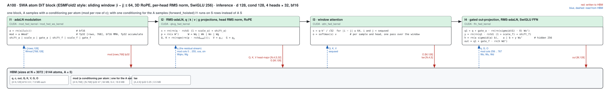
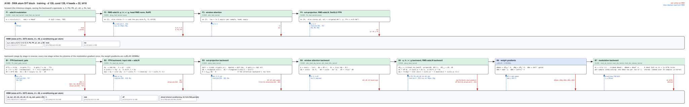
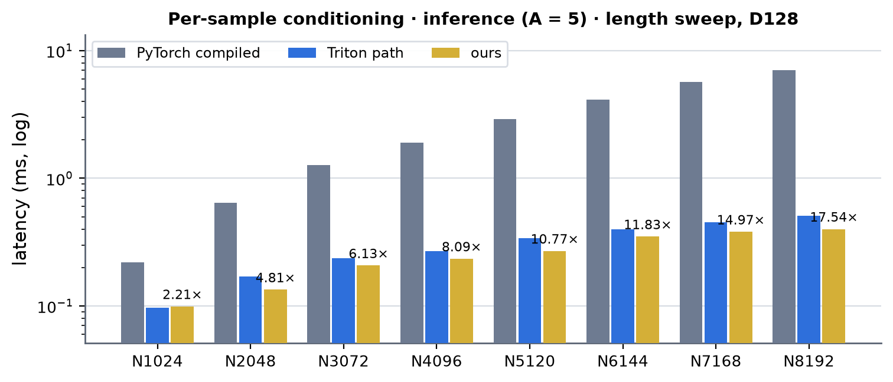
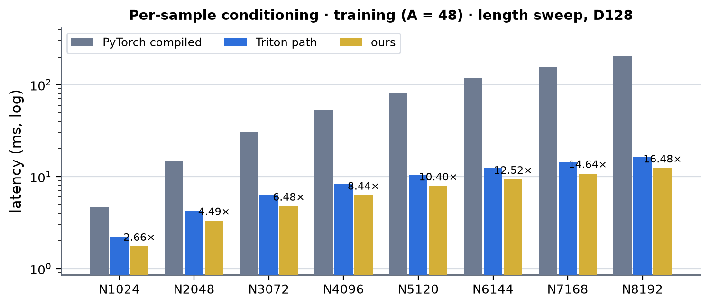
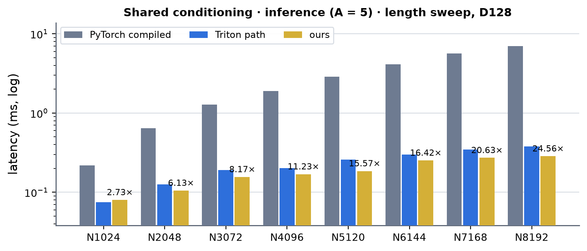
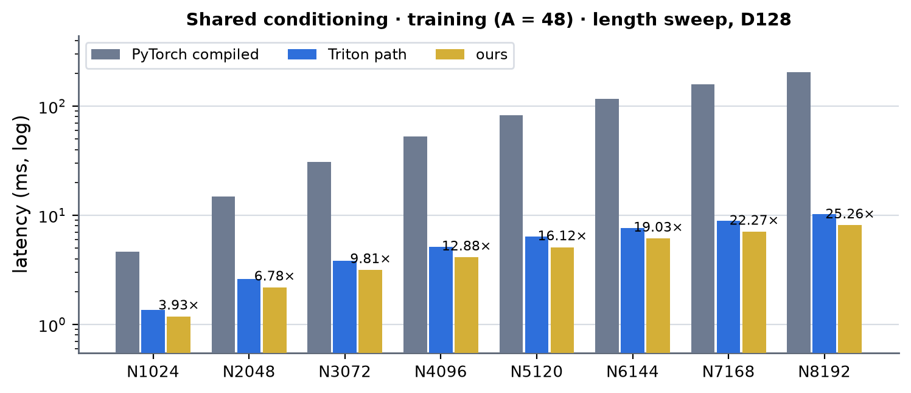
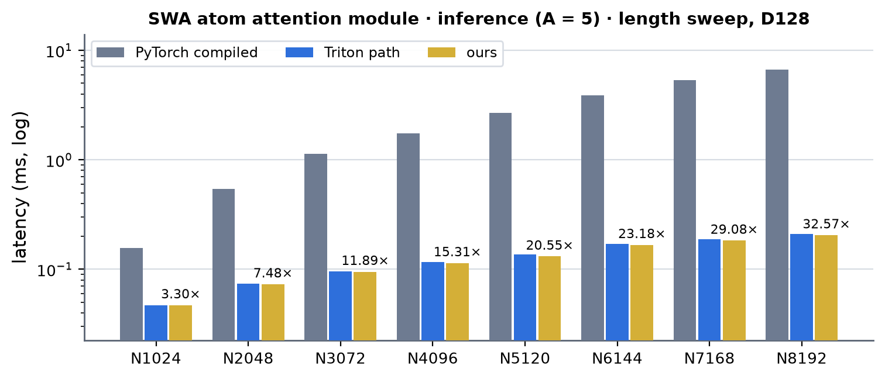
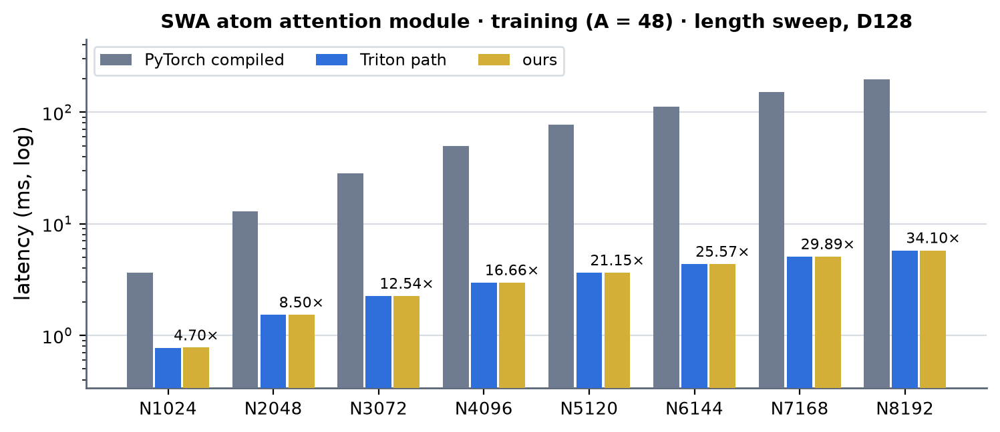

# SWA atom DiT on A100 (sm80)

Kernel-level status of the ESMFold2-style SWA atom DiT block (MiniWorld `block_style: esmfold2`, engine `modules/swa_dit`) on A100: adaLN (RMSNorm, shift / scale / gate from the
conditioning) -> q | k | v | gate projections with per-head RMS norm and RoPE -> sliding-window attention (|i - j| <= 64, 4 heads x 32) -> gated out-projection + residual -> adaLN + SwiGLU
(hidden 256) + residual; d_single = d_cond = 128, bf16. Columns are (Length, Dimension) on the atom axis of the shape registry (`swa_atom_attention`, d128): Length is the atom count N.
The module-level summary is in [a100.md](../a100.md); the B200 twin of this page is [../../b200/swa_atom_dit/swa_atom_dit.md](../../b200/swa_atom_dit/swa_atom_dit.md). Figures: one box per kernel, left to
right, HBM reads (blue, left) and writes (red, right); generated from `figures/swa_atom_dit.json` by `python -m miniworld_engine.viz.kernel_flow` and embedded as SVG (`cairosvg` and `rsvg-convert`
are not installed on cssb, so there is no PNG).

Before this path the A100 ran the Triton stages of the block (`kernels/swa_dit/triton`: `_swa_qkvg_fwd_kernel`, `_swa_attn_fwd_kernel`, `_swa_oproj_ffn_fwd_kernel` and their backward twins) with the
hoisted modulation as a TF32 GEMM (silu, a cast, a cutlass `s1688gemm` over the rows): 7 launches in an inference block, 29 in a training step. Everything the block does is hand CUDA now (`mma.sync`,
`ldmatrix`, `cp.async`) except the five weight-gradient GEMMs of the backward, which stay cuBLAS: the modulation (forward and backward), the three forward stages and the window-attention backward serve
every call; the row stages of the backward (FFN gate and input side, out-projection, qkvg) serve a conditioning per sample (A = 1), one shared by a multiple of 16 samples and -- since 2026-10-04 -- any other A (the modulation is expanded to a row per sample, see **Served**).

- **Where the code is**: `kernels/swa_dit/cuda/sm80/` (`sm80_common.cuh`: PTX helpers and the shared-memory swizzles; `mod_sm80.cuh`: `mod_fwd_kernel`, `mod_fwd_ws_kernel`, `mod_dc_kernel`,
  `mod_dw_kernel`, `mod_dw_reduce_kernel`; `qkvg_fwd_sm80.cuh`, `attn_fwd_sm80.cuh`, `ffn_fwd_sm80.cuh`: the forward stages; `ffn_bwd_sm80.cuh` (`ffn_bwd_gate_kernel`, `ffn_bwd_dy_kernel`),
  `oproj_bwd_sm80.cuh`, `qkvg_bwd_sm80.cuh` (+ `adaln_bwd_sm80.cuh`, `bwd_rows_sm80.cuh`: the tilings and the modulation gradient's path out): the backward row stages;
  `attn_bwd_sm80.cuh`: `attn_bwd_dq_kernel`, `attn_bwd_dkv_kernel`; `ops.cu`), its wrapper `cuda/sm80/__init__.py` and the wiring in `kernels/swa_dit/dispatch.py` (the stage chain of
  `swa_dit_block_fwd` / `_bwd`: `_sm80()` asks first), `kernels/swa_dit/autograd.py` (`SWADiTModulationSm80`) and `kernels/swa_dit/interface.py` (`swa_dit_hoist_modulation` takes `mod_fwd` /
  `mod_bwd`). The kernels are built on first use (`load_extension`, never at import); under `torch.compile` the build runs once at trace time, outside the graph (`_sm80_loads`).
- **Served**: implementation TRITON / MINIWORLD, `settings.engine_backend != "triton"`, an A100 (cc 8.0), bf16 activations and weights, d_atom 128 with 4 heads x 32, SwiGLU hidden 256, half
  window 64, any atom count (the last tile of a sequence is ragged; `seqused` masks the padding), any A. The **forward** (modulation, qkvg, window attention, out-projection + FFN) and the window
  attention **backward** and the **modulation backward** serve every call. The **backward row stages** serve A = N / B equal to 1 (a conditioning per sample: tiles of 16 consecutive atoms), a multiple
  of 16 (the conditioning shared by the A samples, as `forward_hoisted` and `build_attention_params` have it: a tile is one atom of 16 samples) and **any other A**: `swa_dit_block_bwd` then repeats the modulation, cos and sin rows A times
  (sample n = a B + b takes batch element n % B's row), runs the per-sample tiling with one modulation row per sample (N rows) and sums the A gradient rows of each batch element in a fixed order afterwards (a few MB of
  traffic at N = 8192, A = 5; the Triton stages that served those A before are no longer reached), all with the default `swa_dit_ffn_dw="mat"` and `swa_dit_dq1="bf16"`. fp32 operands and other widths keep the Triton path. `MINIWORLD_SWA_DIT_SM80=0` turns the whole
  path off (the "Triton path" columns below).
- **Numerics**: every stage mirrors the rounding points of its Triton twin (`rn` = round to bf16 where the Triton kernel stores a bf16 tensor, fp32 accumulation, `sigmoid = 1 / (1 + e^-x)` with the fast
  exponential, the residuals single-rounded), so the stages mix freely with the Triton ones and the outputs differ only by the order of the accumulations (5 % of the output elements flip one bf16
  ulp; relative difference of a block 8e-4). The adaLN modulation `rn(silu(c)) Wmod^T` is a bf16 tensor-core product with fp32 accumulation: the products of two bf16 numbers are exact in fp32, so it
  equals the fp32 GEMM up to summation order. Its backward feeds the fp32 modulation gradient to the tensor cores as two bf16 terms (hi + lo: 16 significant bits, more than TF32's 11): one term for
  dWmod fails a 2e-3 test on random data, two do not.
- **The stages** (figures below). The forward stages keep their weights in shared memory in the **f1 row order**: the packed weight rows are permuted so that a thread's accumulators over the 4 n-tiles of a
  group of 32 outputs are 8 consecutive channels. Those are also the channels of its next A fragment (the accumulator of one product feeds the next without a shuffle), of its 16-byte global loads and
  stores, the lanes of a quad reduce the RMS statistics of a head and the RoPE partner `d + 16` is the lane two over. `qkvg_fwd_kernel` (persistent, 16 warps, weights 128 KB resident) makes the RMS
  norm and the modulation on the A fragments of the rows straight from global memory; `attn_fwd_kernel` is one CTA of 8 warps x 16 queries = 128 queries of one (sample, head) with the 256-row key / value
  span in shared memory through `cp.async` (80-byte rows: `ldmatrix` is conflict-free), the 144 keys of a warp's window as 18 n8 score tiles in registers and a single-pass softmax (the band mask only cuts the
  first and last two tiles inside the sequence); `ffn_fwd_kernel` holds Wo in shared memory and streams Wu and Wd through a two-stage ring of 64-hidden-unit chunks, the hidden activations going from the
  accumulators straight into the A fragments of the down projection.
- **The backward** runs the stages in reverse; each row stage writes its columns of the modulation gradient dmod [rows, 768] fp32 **once** (no atomics: global fp32 `atomicAdd` runs at 47-54 G adds/s on this
  card whatever the contention, which would cost milliseconds). A conditioning per sample (MODE_SINGLE) stores each row's columns where they belong; a shared conditioning (MODE_HOIST) makes a tile one atom of
  16 samples, reduces the 16 rows' gradient across the lanes of the warp (`reduce_scatter_g8`) and writes one partial row per 16-sample block, which torch adds in a fixed order. The window attention backward
  is two kernels (queries on the rows: dQ; keys on the rows: dK, dV), the modulation backward two (dc: the gradient through `silu`; dWmod: partial sums of 36 row ranges, reduced in order); every result is
  deterministic (a graph replay is bit-identical). The weight gradients are five cuBLAS GEMMs over the rows (dWqkv, dWg, dWo, dWu, dWd).
- **Tests**: `tests/integrations/test_a100_swa_dit_gpu.py` (34 tests): training A = 1-48 x B = 1-4 x S 128-1040 (A = 3, 5, 7, 8 take the expanded modulation; S off the 16 grid), inference, the output and
  every gradient (q, the five block weights, and the conditioning and the adaLN weight through the hoisted modulation) against the fp32 reference, no worse than 1.5x the Triton path's own error + 3e-3
  (measured: worst ratio 1.013, e.g. the gate-weight gradient 6.92e-3 against Triton's 6.85e-3 relative to fp32; inference output 2.4-2.6e-3, as Triton); the modulation forward and backward against the
  fp32 GEMM and autograd and their determinism; the switch that keeps the Triton stages; weights that arrive as non-contiguous views (made contiguous, bit-identical results); CUDA-graph capture; `torch.compile(fullgraph=True)` of the module (per-sample and `forward_hoisted`, forward and
  backward) bit-identical to eager, with the sm_80 stages running.
- 성능 확인 is the maintainer's column (✗ = not confirmed). cache build ✓: nothing in the CUDA kernels autotunes (fixed schedules by row count and A); the stages that stay Triton (the backward row stages at
  other A, fp32) and the Triton columns use the A100 caches relabeled to this toolchain (see [a100.md](../a100.md)); the autotune layer reports no tuned cache for the `swa_dit_*` ops
  (`UserWarning` in the logs of the Triton-path runs: they run a heuristic grid).

## SWA atom DiT · d_single = d_cond = 128, 4 heads x 32, hidden 256, half window 64

### Inference

#### One block · every N = 1024k

Per block: I1 -> I2 -> I3 -> I4 (four launches; the Triton path was seven). With one conditioning for the A samples (`forward_hoisted`) I1 runs on N rows instead of A N.

##### I1 · adaLN modulation (`mod_fwd_ws_kernel`: weight-stationary, `mod_fwd_kernel` from 40960 rows: row-stationary; fp32 out)

| (Length, Dimension) | (1024, 128) | (2048, 128) | (3072, 128) | (4096, 128) | (5120, 128) | (6144, 128) | (7168, 128) | (8192, 128) |
|---|---|---|---|---|---|---|---|---|
| implementation | CUDA | CUDA | CUDA | CUDA | CUDA | CUDA | CUDA | CUDA |
| 성능 확인 | ✗ | ✗ | ✗ | ✗ | ✗ | ✗ | ✗ | ✗ |
| cache build | ✓ | ✓ | ✓ | ✓ | ✓ | ✓ | ✓ | ✓ |

##### I2 · RMS-adaLN + q | k | v | gate projections + head RMS norm + RoPE (`qkvg_fwd_kernel`)

| (Length, Dimension) | (1024, 128) | (2048, 128) | (3072, 128) | (4096, 128) | (5120, 128) | (6144, 128) | (7168, 128) | (8192, 128) |
|---|---|---|---|---|---|---|---|---|
| implementation | CUDA | CUDA | CUDA | CUDA | CUDA | CUDA | CUDA | CUDA |
| 성능 확인 | ✗ | ✗ | ✗ | ✗ | ✗ | ✗ | ✗ | ✗ |
| cache build | ✓ | ✓ | ✓ | ✓ | ✓ | ✓ | ✓ | ✓ |

##### I3 · window attention forward (`attn_fwd_kernel`)

| (Length, Dimension) | (1024, 128) | (2048, 128) | (3072, 128) | (4096, 128) | (5120, 128) | (6144, 128) | (7168, 128) | (8192, 128) |
|---|---|---|---|---|---|---|---|---|
| implementation | CUDA | CUDA | CUDA | CUDA | CUDA | CUDA | CUDA | CUDA |
| 성능 확인 | ✗ | ✗ | ✗ | ✗ | ✗ | ✗ | ✗ | ✗ |
| cache build | ✓ | ✓ | ✓ | ✓ | ✓ | ✓ | ✓ | ✓ |

##### I4 · gated out-projection + residual + RMS-adaLN + SwiGLU + residual (`ffn_fwd_kernel`)

| (Length, Dimension) | (1024, 128) | (2048, 128) | (3072, 128) | (4096, 128) | (5120, 128) | (6144, 128) | (7168, 128) | (8192, 128) |
|---|---|---|---|---|---|---|---|---|
| implementation | CUDA | CUDA | CUDA | CUDA | CUDA | CUDA | CUDA | CUDA |
| 성능 확인 | ✗ | ✗ | ✗ | ✗ | ✗ | ✗ | ✗ | ✗ |
| cache build | ✓ | ✓ | ✓ | ✓ | ✓ | ✓ | ✓ | ✓ |

### Training

#### Forward and backward · every N = 1024k

Forward T1 (the inference kernels, saving a, X, PQ, PK, q1, att, y, ffn and the attention's lse for the backward), backward T5 -> T10 plus five cuBLAS weight-gradient GEMMs (dWqkv, dWg, dWo, dWu,
dWd). T5, T6, T7 and T9 are the backward row stages: CUDA at A = 48 (the bench's training batch) and at every A = 1 or multiple of 16, Triton at other A; T8 and T10 serve every A.

##### T1 · forward: `mod_fwd_kernel` (saves a), `qkvg_fwd_kernel` (saves X, PQ, PK), `attn_fwd_kernel` (lse), `ffn_fwd_kernel` (saves q1, att, y, ffn)

| (Length, Dimension) | (1024, 128) | (2048, 128) | (3072, 128) | (4096, 128) | (5120, 128) | (6144, 128) | (7168, 128) | (8192, 128) |
|---|---|---|---|---|---|---|---|---|
| implementation | CUDA | CUDA | CUDA | CUDA | CUDA | CUDA | CUDA | CUDA |
| 성능 확인 | ✗ | ✗ | ✗ | ✗ | ✗ | ✗ | ✗ | ✗ |
| cache build | ✓ | ✓ | ✓ | ✓ | ✓ | ✓ | ✓ | ✓ |

##### T5 · FFN backward, gate (`ffn_bwd_gate_kernel`: dffn, h, da | db with Wu and Wd^T streamed through a three-deep ring; d gate_f)

| (Length, Dimension) | (1024, 128) | (2048, 128) | (3072, 128) | (4096, 128) | (5120, 128) | (6144, 128) | (7168, 128) | (8192, 128) |
|---|---|---|---|---|---|---|---|---|
| implementation | CUDA | CUDA | CUDA | CUDA | CUDA | CUDA | CUDA | CUDA |
| 성능 확인 | ✗ | ✗ | ✗ | ✗ | ✗ | ✗ | ✗ | ✗ |
| cache build | ✓ | ✓ | ✓ | ✓ | ✓ | ✓ | ✓ | ✓ |

##### T6 · FFN backward, input side + adaLN backward (`ffn_bwd_dy_kernel`: dy = dab Wu with Wu^T resident, dq1, d scale_f, d shift_f)

| (Length, Dimension) | (1024, 128) | (2048, 128) | (3072, 128) | (4096, 128) | (5120, 128) | (6144, 128) | (7168, 128) | (8192, 128) |
|---|---|---|---|---|---|---|---|---|
| implementation | CUDA | CUDA | CUDA | CUDA | CUDA | CUDA | CUDA | CUDA |
| 성능 확인 | ✗ | ✗ | ✗ | ✗ | ✗ | ✗ | ✗ | ✗ |
| cache build | ✓ | ✓ | ✓ | ✓ | ✓ | ✓ | ✓ | ✓ |

##### T7 · out-projection backward (`oproj_bwd_kernel`: dO, dG, the attention's row term D = rowsum(dO o), datt, gated, d gate_a)

| (Length, Dimension) | (1024, 128) | (2048, 128) | (3072, 128) | (4096, 128) | (5120, 128) | (6144, 128) | (7168, 128) | (8192, 128) |
|---|---|---|---|---|---|---|---|---|
| implementation | CUDA | CUDA | CUDA | CUDA | CUDA | CUDA | CUDA | CUDA |
| 성능 확인 | ✗ | ✗ | ✗ | ✗ | ✗ | ✗ | ✗ | ✗ |
| cache build | ✓ | ✓ | ✓ | ✓ | ✓ | ✓ | ✓ | ✓ |

##### T8 · window attention backward (`attn_bwd_dq_kernel`: dQ; `attn_bwd_dkv_kernel`: dK, dV; every A)

| (Length, Dimension) | (1024, 128) | (2048, 128) | (3072, 128) | (4096, 128) | (5120, 128) | (6144, 128) | (7168, 128) | (8192, 128) |
|---|---|---|---|---|---|---|---|---|
| implementation | CUDA | CUDA | CUDA | CUDA | CUDA | CUDA | CUDA | CUDA |
| 성능 확인 | ✗ | ✗ | ✗ | ✗ | ✗ | ✗ | ✗ | ✗ |
| cache build | ✓ | ✓ | ✓ | ✓ | ✓ | ✓ | ✓ | ✓ |

##### T9 · q | k | v | gate backward + RMS-adaLN backward (`qkvg_bwd_kernel`: head RMS + RoPE backward, dx = dP W with W^T resident, dP, d scale_a, d shift_a)

| (Length, Dimension) | (1024, 128) | (2048, 128) | (3072, 128) | (4096, 128) | (5120, 128) | (6144, 128) | (7168, 128) | (8192, 128) |
|---|---|---|---|---|---|---|---|---|
| implementation | CUDA | CUDA | CUDA | CUDA | CUDA | CUDA | CUDA | CUDA |
| 성능 확인 | ✗ | ✗ | ✗ | ✗ | ✗ | ✗ | ✗ | ✗ |
| cache build | ✓ | ✓ | ✓ | ✓ | ✓ | ✓ | ✓ | ✓ |

##### T10 · modulation backward (`mod_dc_kernel`, `mod_dw_kernel` + `mod_dw_reduce_kernel`: dc, dWmod from dmod fp32 as hi + lo bf16 terms; every A)

| (Length, Dimension) | (1024, 128) | (2048, 128) | (3072, 128) | (4096, 128) | (5120, 128) | (6144, 128) | (7168, 128) | (8192, 128) |
|---|---|---|---|---|---|---|---|---|
| implementation | CUDA | CUDA | CUDA | CUDA | CUDA | CUDA | CUDA | CUDA |
| 성능 확인 | ✗ | ✗ | ✗ | ✗ | ✗ | ✗ | ✗ | ✗ |
| cache build | ✓ | ✓ | ✓ | ✓ | ✓ | ✓ | ✓ | ✓ |

(The five weight-gradient GEMMs are cuBLAS, the sum of a shared conditioning's dmod partial buffers and a few copies PyTorch: the figure only.) In every column the kernels ran: the block's bench (below) took
each N for ours; the tests run at S <= 1040 per sample row.

## SWA atom attention module · the block's attention part (`modules/swa_atom_attention`)

`SWA3DRoPEAttention` (ESMFold2 Algorithm 8: Wqkv -> per-head RMS norm + 3D RoPE -> sliding-window attention -> sigmoid gate -> out_proj) is a module of its own (registry `swa_atom_attention`, atom axis,
4 heads x 32, `bench.py target=swa_atom_attention`) and the attention part of the per-op path of `SWADiTBlock`. Its attention core is FlashAttention (FA4 on sm90+, FA2 on sm80); the FA2 extension
does not import in this environment (`flash_attn_2_cuda`: undefined symbol -- the FA2 build does not match torch 2.13), so on this A100 the module's `miniworld` arm **did not run at all** before, and the
per-op comparison tests of the DiT block (`tests/numerics/test_swa_dit_fused_gpu.py`, 4 of them) failed on the same import. It now runs the window attention on the kernels of the fused block:

- **Served** (`kernels/swa_dit/interface.swa_dit_window_attention`, asked first by `SWA3DRoPEAttention.forward` for implementation TRITON / MINIWORLD): an A100, 4 heads x 32, half window 64, floating-point q / k / v
  (cast to bf16 as the flash path does), `engine_backend != "triton"`, `MINIWORLD_SWA_DIT_SM80 != "0"`; otherwise flash as before. Like the FA4 path it needs the valid atoms front-packed in every row
  (`build_attention_params`' precondition). Rows at or past `seqused` are zero in the output and in every gradient.
- **The kernels** are `attn_fwd_kernel` / `attn_bwd_dq_kernel` / `attn_bwd_dkv_kernel` of the fused block, now taking q / k / v / dq / dk / dv with any element strides (sample, row, head; unit channel stride,
  16-byte aligned rows): the module's own [N, S, H, D] tensors and the slice of the fused qkv projection that v is go in without a copy, the fused block passes its head-major planes (a compile-time row stride, so
  its code is unchanged: `attn_fwd_kernel<true>`; the module's row-major layout is `<false>`, which takes about 10 % longer: 26.3 µs in the module against 23.9 µs in the fused block at N = 3072,
  A = 5, jobs 62055 / 62048). The attention's row term D = rowsum(dO o), which the fused
  block gets from its out-projection backward, is one small pass here (`attn_delta_kernel`: 80 µs of a 2.5 ms training step at N = 3072). `autograd.Function` over two opaque ops (`swa_dit_window_attn_fwd_sm80` /
  `swa_dit_window_attn_bwd_sm80`), so `torch.compile(fullgraph=True)` keeps them and the compiled module equals eager bit for bit. The qkv / gate projections and `out_proj` are cuBLAS, the
  `qk_norm_rope_3d` stays Triton (the norms / RoPE kernels are another worker's).
- **The output gate** (2026-10-04) is hand CUDA as well: `integrations/sigmoid_gate_sm80.py`, asked by `SWA3DRoPEAttention.forward` before the Triton gate. `sigmoid(gate_proj(x)) * attn` and its backward are one memory-bound
  pass each (`gate_rows_kernel` forward; `gate_bwd_kernel`: `dx = dout sigmoid(g)` and `dg = dout x sigmoid(g)(1 - sigmoid(g))` in one read of dout, x and g), for any leading shape, a last dimension that is a multiple of 8, bf16 or fp32,
  as an `autograd.Function` over two opaque ops (`sigmoid_gate_sm80_fwd` / `_bwd`), followed by the cuBLAS `out_proj`. It replaces the Triton `swa_gate_out_fwd_kernel` (inference: gate_proj's product and out_proj folded into one
  GEMM kernel, the `swa_gate_out_fwd` of the registry) and `_sigmul_fwd` / `_sigmul_bwd` (training). `MINIWORLD_SIGMOID_GATE_SM80=0` keeps the Triton gate (the "Triton gate" column below); a failed build warns once and does the same.
- **Tests**: `tests/integrations/test_a100_swa_attention_gpu.py` (16 tests): the kernels against a dense fp32 band attention at N = 1-6, S = 64-1040 with ragged, short and empty rows (relative Frobenius error 2.1e-3 in
  the output and 2.2-2.5e-3 in dq / dk / dv: the bf16 P / dS of the flash recipe); strided views, contiguous tensors and the fused block's head-major planes give identical bits; the module's output and the gradients
  of x, Wqkv, the gate and the output projection against the module's PyTorch path, both against the fp32 module (ratio 0.94-0.96: no less accurate than PyTorch's bf16 path); the gate and the fp32 cast; CUDA-graph capture and
  determinism; `torch.compile(fullgraph=True)`; that the A100 path needs no flash install; the CUDA gate pass against `sigmoid(g) x` (output and both gradients, bf16 and fp32, a last dimension that is not a multiple of 8 is declined,
  mixed dtypes are declined) and that the module takes it and the switch keeps the Triton one.

##### M1 · window attention forward (`attn_fwd_kernel`, row-major q / k / v)

| (Length, Dimension) | (1024, 128) | (2048, 128) | (3072, 128) | (4096, 128) | (5120, 128) | (6144, 128) | (7168, 128) | (8192, 128) |
|---|---|---|---|---|---|---|---|---|
| implementation | CUDA | CUDA | CUDA | CUDA | CUDA | CUDA | CUDA | CUDA |
| 성능 확인 | ✗ | ✗ | ✗ | ✗ | ✗ | ✗ | ✗ | ✗ |
| cache build | ✓ | ✓ | ✓ | ✓ | ✓ | ✓ | ✓ | ✓ |

##### M2 · window attention backward (`attn_delta_kernel`, `attn_bwd_dq_kernel`, `attn_bwd_dkv_kernel`)

| (Length, Dimension) | (1024, 128) | (2048, 128) | (3072, 128) | (4096, 128) | (5120, 128) | (6144, 128) | (7168, 128) | (8192, 128) |
|---|---|---|---|---|---|---|---|---|
| implementation | CUDA | CUDA | CUDA | CUDA | CUDA | CUDA | CUDA | CUDA |
| 성능 확인 | ✗ | ✗ | ✗ | ✗ | ✗ | ✗ | ✗ | ✗ |
| cache build | ✓ | ✓ | ✓ | ✓ | ✓ | ✓ | ✓ | ✓ |

##### M3 · output gate (`gate_rows_kernel` forward, `gate_bwd_kernel` backward: `sigmoid(gate_proj(x)) * attn`)

| (Length, Dimension) | (1024, 128) | (2048, 128) | (3072, 128) | (4096, 128) | (5120, 128) | (6144, 128) | (7168, 128) | (8192, 128) |
|---|---|---|---|---|---|---|---|---|
| implementation | CUDA | CUDA | CUDA | CUDA | CUDA | CUDA | CUDA | CUDA |
| 성능 확인 | ✗ | ✗ | ✗ | ✗ | ✗ | ✗ | ✗ | ✗ |
| cache build | ✓ | ✓ | ✓ | ✓ | ✓ | ✓ | ✓ | ✓ |

(The rest of the module is Triton (`qk_norm_rope_fwd_kernel` / `_bwd_kernel`: the norms worker's), cuBLAS (the three projections and their five backward GEMMs) and PyTorch copies:
the module's measurement tables below.)

## Measurements (2026-10-03; the attention-module tables 2026-10-04)

One A100 80GB PCIe (300 W), torch 2.13.0+cu129 / triton 3.7.1, bf16, B = 1, no masked atoms (the bench default), one block (d_single = d_cond = 128, 4 heads x 32), CUDA-graph timing (`cudagraph=manual`),
`benchmarks/runners/bench.py target=swa_dit level=module`, atoms N = 8 seq_len (`seq_len` 128-1024 in steps of 128: the registry's atom axis), the sources frozen in a snapshot for the run. Inference: A = 5
samples; training: A = 48 (forward + backward of every input and parameter). Two conditionings, both measured: **per sample** (every sample has its own conditioning: `forward`, the modulation per
row, A N rows) and **shared** (`+shared_cond=true`: one conditioning [1, N, 128] for the A samples, `forward_hoisted`, the modulation once per atom, as a sampling step has it). Jobs: ours 62030
(per sample) and 62031 (shared) on gpu02; PyTorch compiled in the same jobs; the Triton path 62032 / 62033 on gpu08 (the same sources with `MINIWORLD_SWA_DIT_SM80=0`). Run-to-run spread is about 2-3 %
and up to 10 % between nodes: the Triton column and ours are on different nodes, so a few percent of their ratio is the node. Times in ms. "PyTorch compiled" = the module with `implementation=pytorch`
under `torch.compile` (a dense band-masked SDPA: it computes the full N x N scores, so its time grows with N^2 while the window kernels' grows with N); "Triton path" = what the A100 ran before this
path, for reference. **×** = PyTorch compiled divided by ours: cuEquivariance has no DiT block; Anthropic's SWA atom block (the B200 page measures its fused `SWAAtomBlock`, inference only: the
release ships no backward) was **not measured on A100** (`bench.py` has no Anthropic arm for this block, and the Anthropic measurement on this card is set aside for now).

### Per-sample conditioning · inference (A = 5)

| (Length, Dimension) | PyTorch compiled | cuEquivariance | Anthropic | Triton path | ours | × |
|---|---|---|---|---|---|---|
| (1024, 128) | 0.219 | — (none) | — (not measured) | 0.097 | 0.099 | 2.21 |
| (2048, 128) | 0.645 | — (none) | — (not measured) | 0.170 | 0.134 | 4.81 |
| (3072, 128) | 1.268 | — (none) | — (not measured) | 0.237 | 0.207 | 6.13 |
| (4096, 128) | 1.897 | — (none) | — (not measured) | 0.268 | 0.234 | 8.09 |
| (5120, 128) | 2.902 | — (none) | — (not measured) | 0.340 | 0.269 | 10.77 |
| (6144, 128) | 4.130 | — (none) | — (not measured) | 0.399 | 0.349 | 11.83 |
| (7168, 128) | 5.687 | — (none) | — (not measured) | 0.453 | 0.380 | 14.97 |
| (8192, 128) | 7.024 | — (none) | — (not measured) | 0.507 | 0.400 | 17.54 |

 <!-- measure_bars -->

### Per-sample conditioning · training (A = 48)

| (Length, Dimension) | PyTorch compiled | cuEquivariance | Anthropic | Triton path | ours | × |
|---|---|---|---|---|---|---|
| (1024, 128) | 4.647 | — (none) | — (no bwd) | 2.213 | 1.746 | 2.66 |
| (2048, 128) | 14.861 | — (none) | — (no bwd) | 4.229 | 3.313 | 4.49 |
| (3072, 128) | 30.956 | — (none) | — (no bwd) | 6.219 | 4.777 | 6.48 |
| (4096, 128) | 53.061 | — (none) | — (no bwd) | 8.321 | 6.286 | 8.44 |
| (5120, 128) | 82.182 | — (none) | — (no bwd) | 10.361 | 7.903 | 10.40 |
| (6144, 128) | 116.897 | — (none) | — (no bwd) | 12.356 | 9.334 | 12.52 |
| (7168, 128) | 157.970 | — (none) | — (no bwd) | 14.312 | 10.792 | 14.64 |
| (8192, 128) | 204.022 | — (none) | — (no bwd) | 16.322 | 12.380 | 16.48 |

 <!-- measure_bars -->

### Shared conditioning · inference (A = 5)

| (Length, Dimension) | PyTorch compiled | cuEquivariance | Anthropic | Triton path | ours | × |
|---|---|---|---|---|---|---|
| (1024, 128) | 0.218 | — (none) | — (not measured) | 0.075 | 0.080 | 2.73 |
| (2048, 128) | 0.646 | — (none) | — (not measured) | 0.125 | 0.105 | 6.13 |
| (3072, 128) | 1.272 | — (none) | — (not measured) | 0.191 | 0.156 | 8.17 |
| (4096, 128) | 1.897 | — (none) | — (not measured) | 0.202 | 0.169 | 11.23 |
| (5120, 128) | 2.887 | — (none) | — (not measured) | 0.258 | 0.185 | 15.57 |
| (6144, 128) | 4.136 | — (none) | — (not measured) | 0.299 | 0.252 | 16.42 |
| (7168, 128) | 5.620 | — (none) | — (not measured) | 0.346 | 0.272 | 20.63 |
| (8192, 128) | 6.992 | — (none) | — (not measured) | 0.378 | 0.285 | 24.56 |

 <!-- measure_bars -->

### Shared conditioning · training (A = 48)

| (Length, Dimension) | PyTorch compiled | cuEquivariance | Anthropic | Triton path | ours | × |
|---|---|---|---|---|---|---|
| (1024, 128) | 4.654 | — (none) | — (no bwd) | 1.365 | 1.185 | 3.93 |
| (2048, 128) | 14.838 | — (none) | — (no bwd) | 2.620 | 2.187 | 6.78 |
| (3072, 128) | 30.947 | — (none) | — (no bwd) | 3.855 | 3.156 | 9.81 |
| (4096, 128) | 53.116 | — (none) | — (no bwd) | 5.132 | 4.124 | 12.88 |
| (5120, 128) | 82.366 | — (none) | — (no bwd) | 6.383 | 5.109 | 16.12 |
| (6144, 128) | 116.714 | — (none) | — (no bwd) | 7.603 | 6.134 | 19.03 |
| (7168, 128) | 157.944 | — (none) | — (no bwd) | 8.921 | 7.093 | 22.27 |
| (8192, 128) | 204.869 | — (none) | — (no bwd) | 10.229 | 8.110 | 25.26 |

 <!-- measure_bars -->

### SWA atom attention module · inference (A = 5)

The module (Wqkv -> qk-norm + RoPE -> window attention -> gate, out_proj; no adaLN, no FFN) at the same atom lengths, **2026-10-04, job 63196** (gpu03; `bench.py target=swa_atom_attention`, per-sample inputs,
CUDA graph, N = 8 seq_len, snapshot `snap_1004_013704`: the final sources; ours, PyTorch compiled and the Triton-gate reference ran in the same job). "PyTorch compiled" = `implementation=pytorch`: torch norm, RoPE and gate
and the dense band-masked SDPA. "Triton path" = the same module with the CUDA output gate off (`MINIWORLD_SIGMOID_GATE_SM80=0`: the Triton `swa_gate_out_fwd` in inference, `_sigmul` in training; the window attention is the CUDA
kernels in both). The flash path (FA2 on sm80) **does not run in this environment** (`flash_attn_2_cuda` fails to import), so it has no column of its own; **×** = PyTorch compiled divided by ours. The CUDA gate is as fast as
the Triton gate it replaces (inference 0-4 % faster, training within 0.7 %: the gate is one memory-bound pass in both), so nothing is dispatched back.

| (Length, Dimension) | PyTorch compiled | cuEquivariance | Anthropic | Triton path | ours | × |
|---|---|---|---|---|---|---|
| (1024, 128) | 0.156 | — (none) | — (not measured) | 0.047 | 0.047 | 3.30 |
| (2048, 128) | 0.544 | — (none) | — (not measured) | 0.074 | 0.073 | 7.48 |
| (3072, 128) | 1.133 | — (none) | — (not measured) | 0.096 | 0.095 | 11.89 |
| (4096, 128) | 1.740 | — (none) | — (not measured) | 0.117 | 0.114 | 15.31 |
| (5120, 128) | 2.694 | — (none) | — (not measured) | 0.136 | 0.131 | 20.55 |
| (6144, 128) | 3.869 | — (none) | — (not measured) | 0.170 | 0.167 | 23.18 |
| (7168, 128) | 5.331 | — (none) | — (not measured) | 0.188 | 0.183 | 29.08 |
| (8192, 128) | 6.669 | — (none) | — (not measured) | 0.209 | 0.205 | 32.57 |

 <!-- measure_bars -->

### SWA atom attention module · training (A = 48)

| (Length, Dimension) | PyTorch compiled | cuEquivariance | Anthropic | Triton path | ours | × |
|---|---|---|---|---|---|---|
| (1024, 128) | 3.649 | — (none) | — (not measured) | 0.772 | 0.776 | 4.70 |
| (2048, 128) | 12.982 | — (none) | — (not measured) | 1.540 | 1.528 | 8.50 |
| (3072, 128) | 28.252 | — (none) | — (not measured) | 2.247 | 2.254 | 12.54 |
| (4096, 128) | 49.545 | — (none) | — (not measured) | 2.966 | 2.974 | 16.66 |
| (5120, 128) | 77.068 | — (none) | — (not measured) | 3.661 | 3.644 | 21.15 |
| (6144, 128) | 111.416 | — (none) | — (not measured) | 4.365 | 4.357 | 25.57 |
| (7168, 128) | 152.005 | — (none) | — (not measured) | 5.060 | 5.086 | 29.89 |
| (8192, 128) | 196.838 | — (none) | — (not measured) | 5.757 | 5.772 | 34.10 |

 <!-- measure_bars -->

| N | module inference (A = 5): ours (µs) | floor (µs) | % of SoL | module training (A = 48): ours (µs) | floor (µs) | % of SoL |
|---|---|---|---|---|---|---|
| 1024 | 47 | 16 | 33 % | 776 | 491 | 63 % |
| 2048 | 73 | 31 | 43 % | 1528 | 981 | 64 % |
| 3072 | 95 | 47 | 50 % | 2254 | 1472 | 65 % |
| 4096 | 114 | 63 | 55 % | 2974 | 1962 | 66 % |
| 5120 | 131 | 78 | 60 % | 3644 | 2453 | 67 % |
| 6144 | 167 | 94 | 56 % | 4357 | 2943 | 68 % |
| 7168 | 183 | 110 | 60 % | 5086 | 3434 | 68 % |
| 8192 | 205 | 125 | 61 % | 5772 | 3924 | 68 % |

The module's floor is the composite one (every stage's tensors once at 1.60 TB/s, as above): inference 4.9 KB per row (Wqkv 1.0, qk-norm + RoPE 1.0, attention 1.0, gate_proj 0.5, sigmoid gate 0.75, out_proj 0.5), training
adds 11 KB per row for the backward (all its stages are memory-bound by that measure). `torch.profiler` CUPTI kernel times, N = 3072 | 6144, µs per module call (2026-10-03, job 62055, gpu02, **with the Triton gate**: the CUDA
gate of 2026-10-04 replaces the two Triton gate rows by `gate_rows_kernel` (inference, one pass in place of the fused gate + out_proj kernel, plus a cuBLAS out_proj) and `gate_rows_kernel` + `gate_bwd_kernel` (training); the module
tables above are within 4 % of the Triton gate's):

| kernels | inference N3072 | training N3072 | inference N6144 | training N6144 |
|---|---|---|---|---|
| cuBLAS GEMMs (inference 2: Wqkv, gate_proj; training 9, with 5 split-K reductions) | 34.2 | 783.7 | 63.1 | 1464.3 |
| window attention forward (`attn_fwd_kernel<false>`) | 26.3 | 192.5 | 46.8 | 382.9 |
| window attention backward (`attn_delta_kernel` + `attn_bwd_dq_kernel` + `attn_bwd_dkv_kernel`) | | 80.0 + 199.6 + 294.3 | | 141.2 + 398.8 + 589.6 |
| Triton `qk_norm_rope` forward / backward | 14.8 | 108.6 + 197.2 | 25.3 | 212.4 + 393.9 |
| Triton gate (`swa_gate_out_fwd_kernel` fuses gate_proj's product and out_proj in inference; `_sigmul_fwd` + `_sigmul_bwd` in training) | 18.7 | 71.0 + 114.5 | 31.1 | 137.5 + 222.5 |
| PyTorch copies and adds (the stack / permute of dq, dk, dv into the Wqkv gradient, the dx sum) | | 261.3 + 129.4 + 67.6 | | 524.7 + 263.9 + 132.3 |
| sum of kernel times | 94 (5 launches) | 2500 (23) | 166 (5) | 4864 (23) |
| graph replay | 92 | 2500 | 163 | 4863 |

The cuBLAS GEMMs of this module are 36 % of an inference call and 31 % of a training step, the window attention 31 % of a training step, and the PyTorch copies and adds 18 % of it, **390 µs of them (16 %) the stack of
the three gradients dq, dk, dv into one qkv gradient** (N = 3072): the module splits its fused projection with `permute(...).unbind(0)`, so autograd stacks them again. Writing the three gradients straight into one
[N, S, 3, H, D] buffer (the kernels' output strides allow it) needs the module's forward to hand one qkv tensor to a single autograd Function; the B200 path pays the same copies.

### Speed of light

SoL = the composite floor of the block's decomposition: per kernel `max(essential bytes / 1.60 TB/s, FLOP / 240 TFLOP/s)`, summed (both ceilings measured on this card, `experiments/a100_trimul_fwd`, tag
`archive/a100-sm80-branch-20260928`); every tensor a kernel reads or writes counts once, the GEMMs and attention by their FLOP (the window as 129 keys). Nearly every stage of this block is memory-bound by that
measure, and the largest tensors are the modulation and its gradient: a conditioning per sample is a [A N, 768] fp32 tensor (3 KB per row) written by the modulation, read by the three stages that use it,
written again as dmod by the backward stages and read twice by the modulation backward -- 63 % of the inference floor and 44 % of the training floor in that regime; with one conditioning for the A samples
they shrink to [N, 768] and the floor is about half the per-sample one (46 against 94 µs in inference and 2082 against 3825 µs in training at N = 3072). Counted per stage as `swa_sol.py` (scratch) does:
the stage's activations in and out, its modulation columns, the saves of the training forward, the backward's dmod columns (per row, or per 16 samples in the shared mode), the weight GEMMs' operands, the
modulation backward's dmod reads and its partial sums.

| N | per sample, inference (A = 5): ours (µs) | floor (µs) | % of SoL | per sample, training (A = 48): ours (µs) | floor (µs) | % of SoL |
|---|---|---|---|---|---|---|
| 1024 | 99 | 31 | 31 % | 1746 | 1287 | 74 % |
| 2048 | 134 | 63 | 47 % | 3313 | 2556 | 77 % |
| 3072 | 207 | 94 | 45 % | 4777 | 3825 | 80 % |
| 4096 | 234 | 125 | 53 % | 6286 | 5094 | 81 % |
| 5120 | 269 | 156 | 58 % | 7903 | 6364 | 81 % |
| 6144 | 349 | 188 | 54 % | 9334 | 7633 | 82 % |
| 7168 | 380 | 219 | 58 % | 10792 | 8902 | 82 % |
| 8192 | 400 | 250 | 62 % | 12380 | 10171 | 82 % |

| N | shared, inference (A = 5): ours (µs) | floor (µs) | % of SoL | shared, training (A = 48): ours (µs) | floor (µs) | % of SoL |
|---|---|---|---|---|---|---|
| 1024 | 80 | 15 | 19 % | 1185 | 706 | 60 % |
| 2048 | 105 | 30 | 29 % | 2187 | 1394 | 64 % |
| 3072 | 156 | 46 | 29 % | 3156 | 2082 | 66 % |
| 4096 | 169 | 61 | 36 % | 4124 | 2770 | 67 % |
| 5120 | 185 | 76 | 41 % | 5109 | 3458 | 68 % |
| 6144 | 252 | 91 | 36 % | 6134 | 4146 | 68 % |
| 7168 | 272 | 106 | 39 % | 7093 | 4834 | 68 % |
| 8192 | 285 | 121 | 43 % | 8110 | 5522 | 68 % |

### Where the time goes (`torch.profiler` CUPTI kernel times, one process per conditioning, job 62034 on gpu08)

Inference A = 5, training A = 48; µs per block, bf16, the sources of the checkout of the run (the same as the snapshot). Per-sample conditioning:

| kernels | N3072 inference | N3072 training | N6144 inference | N6144 training | floor N3072 (inference / training) |
|---|---|---|---|---|---|
| modulation forward (`mod_fwd_ws_kernel` / `mod_fwd_kernel`) | 40.6 | 363.9 | 79.8 | 760.2 | 31.9 / 330.3 |
| `qkvg_fwd_kernel` | 47.9 | 368.6 | 90.4 | 719.1 | 22.4 / 283.4 |
| `attn_fwd_kernel` | 22.4 | 172.0 | 41.0 | 342.5 | 10.0 / 95.8 |
| `ffn_fwd_kernel` | 93.7 | 596.2 | 142.0 | 1173.9 | 29.5 / 377.5 |
| `ffn_bwd_gate_kernel` | | 464.5 | | 909.0 | / 330.3 |
| `ffn_bwd_dy_kernel` | | 420.9 | | 822.9 | / 353.9 |
| `oproj_bwd_kernel` | | 313.0 | | 627.0 | / 284.6 |
| `attn_bwd_dq_kernel` | | 211.2 | | 416.6 | / 120.9 |
| `attn_bwd_dkv_kernel` | | 261.2 | | 518.5 | / 144.5 |
| `qkvg_bwd_kernel` | | 538.2 | | 1066.5 | / 495.5 |
| modulation backward (`mod_dc_kernel` + `mod_dw_kernel` + reduce) | | 443.4 + 347.2 + 9.6 | | 873.5 + 692.0 + 9.8 | / 654.7 |
| weight GEMMs (cuBLAS, 5 + 5 split-K reductions) | | 415.2 + 29.7 | | 767.8 + 30.8 | / 353.9 |
| copies | | 24.6 | | 23.4 | |
| sum of kernel times | 205 (4 launches) | 4980 (28) | 353 (4) | 9754 (28) | 94 / 3825 |
| graph replay | 201 | 5045 | 351 | 9859 | |

One conditioning shared by the 5 / 48 samples (`forward_hoisted`), N = 3072:

| kernels | inference | training | floor (inference / training) |
|---|---|---|---|
| modulation forward (`mod_fwd_ws_kernel`) | 15.8 | 15.9 | 6.4 / 6.9 |
| `qkvg_fwd_kernel` | 37.7 | 261.3 | 14.5 / 191.0 |
| `attn_fwd_kernel` | 22.2 | 167.3 | 10.0 / 95.8 |
| `ffn_fwd_kernel` | 78.2 | 480.0 | 14.7 / 192.7 |
| `ffn_bwd_gate_kernel` | | 366.6 | / 239.9 |
| `ffn_bwd_dy_kernel` | | 286.4 | / 173.0 |
| `oproj_bwd_kernel` | | 225.4 | / 194.2 |
| `attn_bwd_dq_kernel` + `attn_bwd_dkv_kernel` | | 206.2 + 253.9 | / 120.9 + 144.5 |
| `qkvg_bwd_kernel` | | 444.5 | / 314.6 |
| modulation backward (`mod_dc_kernel` + `mod_dw_kernel` + reduce; the sum of the partial dmod buffers) | | 28.6 + 16.0 + 6.6; 30.1 | / 54.6 |
| weight GEMMs (cuBLAS, 5 + 5 split-K reductions) | | 400.1 + 28.5 | / 353.9 |
| copies | | 23.1 | |
| sum of kernel times | 154 (4 launches) | 3241 (29) | 46 / 2082 |
| graph replay | 153 | 3282 | |

The row stages of the backward reach 71-92 % of their byte floors (`qkvg_bwd_kernel` 92 %, `oproj_bwd_kernel` 91 %, `ffn_bwd_dy_kernel` 84 %, `mod_dc` + `mod_dw` 82 %, `ffn_bwd_gate_kernel` 71 % at N = 3072, A = 48, a conditioning per
sample): 1.1-1.5 TB/s of essential DRAM traffic against the 1.60 TB/s streaming-copy ceiling. The kernels that are far from their floors are the compute-shaped ones. **`ffn_fwd_kernel`** is the largest kernel of
both modes (46 % of an inference block): 16-24 % of the 240 TFLOP/s ceiling (3.5 GFLOP in 93.7 µs at A = 5, 34 GFLOP in 596 µs at A = 48). Its phases (a `clock64` profile of warp 0 of every CTA, N = 3072, A = 5, job 61954:
42.6 k cycles per tile, of which the MMA phases are 19 k -- 19-23 cycles per MMA per warp against 16 at the tensor core's rate with two warps per scheduler -- and the rest the element-wise phases between
them: gate, norm statistics, `y`, the SwiGLU activation, the epilogue, and a barrier per weight chunk) run in lock-step in the 8 warps of a CTA, so the tensor pipe idles about half of the time. **The attention
kernels** are at 55-57 % of their floors: instruction-bound (the mask, the exponentials); inside the sequence only 4 of the 18 score tiles of a warp need the band mask. At N = 1024 (5120 rows, one 16-row tile
per warp) the latency-bound forward kernels are slower than their Triton twins (`ffn_fwd_kernel` 40 µs against `_swa_oproj_ffn_fwd_kernel` 29, `qkvg_fwd_kernel` 29 against 20: job 62038), which is why the block
is no faster than the Triton path there; from N = 2048 on the whole block is.

### What was tried and did not pay (2026-10-03)

- Accumulating the modulation gradient with `atomicAdd` (as the Triton path does): global fp32 atomics run at 47-54 G adds/s whatever the contention (`atomic_probe`, a scratch probe), the gradient is 3 KB per row;
  the per-row stores (a conditioning per sample) and the lane reduce-scatter plus partial buffers (shared) cost one write per element and are deterministic.
- `prefetch.global.L2` of the next tile's operands in `qkvg_bwd_kernel`: the DRAM reads doubled (L2 does not hold the prefetched lines until they are used: 564 -> 696 µs); a two-block register look-ahead of the
  loads instead took the kernel 24 % faster.
- Contiguous run per row decides the DRAM efficiency of a streamed operand (`store_probe`, a scratch probe): 128-byte runs reach 1.16 TB/s, 512-byte runs 1.76 TB/s, mma-fragment 8-byte stores alone 1.69 TB/s; the
  stages store whole rows of 8 consecutive channels per thread (the f1 order) for this reason.
- One bf16 term of dmod for dWmod (the sum over the rows should average the rounding out): 2.5-2.8e-3 relative against the fp32 GEMM on random data, over the 2e-3 test; two terms (hi + lo) pass and cost nothing
  that shows (the kernel is memory-bound on reading dmod).
- Fusing dWqkv | dWg into one GEMM over the stacked dP: the custom op's outputs may not alias one tensor (the autograd Function returns views of one buffer), so it stays two GEMMs.
- The modulation forward by rows (`mod_fwd_kernel`, tiles of 128 or 64 rows with the weights streamed) against weights resident in registers (`mod_fwd_ws_kernel`, 32-row tiles): the row-stationary kernel loses
  below ~40 K rows (tail and latency) and wins above it; the choice is by row count.

### Limits and next

- The backward row stages serve every A (2026-10-04): a multiple of 16 keeps the shared-conditioning tiles (a tile of 16 rows reads ONE modulation row); any other A takes the per-sample tiling on an expanded
  modulation (A x the modulation rows in fp32: 3 KB per row and sample, summed over the samples afterwards), which costs that traffic and the extra reduction but no Triton stage. The only Triton left in the block is the fp32 path.
- fp32 operands and other widths keep the Triton path; the whole block follows `settings.engine_backend="triton"` and `MINIWORLD_SWA_DIT_SM80=0`.
- The next steps by size: (1) `ffn_fwd_kernel` (46 % of an inference block, 12 % of a training step; 31 % of its byte floor at A = 5): split the 8 warps into two groups with their own barriers and weight
  rings (ping-pong) so the element-wise phases of one overlap the MMAs of the other; (2) `qkvg_fwd_kernel` (47 % of its floor at A = 5, 77 % at A = 48); (3) the per-sample conditioning's modulation traffic
  (a [A N, 768] fp32 tensor written once and read three times in the forward, again in the backward): computing the shift / scale / gate columns inside the stages from c would trade 6 KB of traffic per row
  for 0.2 MFLOP; (4) the five weight-gradient GEMMs (415 µs of 4980 µs at N = 3072, A = 48) as one grouped kernel; (5) the window attention kernels (55-57 % of their floors, instruction-bound).
