# Token DiT on A100 (sm80)

Kernel-level status of the token DiT block (`DiTBlock`: AF3 Alg. 23 -- AdaLN, attention with the pair bias shared by the samples, a conditioned
SwiGLU transition; d_single 768, d_cond 384, d_pair 128, 16 heads × 48, transition n = 2) on A100; the module-level summary is in
[a100.md](../a100.md). bf16 (the kernels' dtype); columns are (Length, Dimension). A100 = CUDA where a hand-written sm_80 kernel runs a step, cuBLAS
for the GEMMs; a shape without a path is 미구현 (it runs the module's Triton composition). Figures: one box per kernel, left to right, HBM reads
(blue, left) and writes (red, right); generated from `figures/token_dit.json` by `python -m miniworld_engine.viz.kernel_flow` and embedded as SVG
(`cairosvg` and `rsvg-convert` are not installed on cssb, so there is no PNG).

Before this path the A100 ran the module composition (`AugmentedAttentionPairBias` with the Triton attention core, `ConditionedTransition`): about
30 launches per block in inference and 120 in a training step. The fused step runner and the training block the H100 / B200 already have now serve
sm_80 too, with one new piece: the attention core is hand CUDA (`mma.sync`, `ldmatrix`, `cp.async`).

- **Inference**: `integrations/token_dit.py` -> `kernels/conditioned_transition/triton/token_dit_runner.py` (`FusedTokenDiT`, shared with H100 /
  B200): cuBLAS GEMMs, the CUDA row kernels `kernels/conditioned_transition/cuda/token_dit_rows.cu` (the source builds for sm_80 / 90 / 100; the
  runner takes them on A100 and B200), the attention core `kernels/augmented_attention/cuda/sm80.py` (`GatedInferenceCore`: sigmoid(g) o written
  over q). The weight pack and the pair bias are made once and reused while the weights / the pair tensor are unchanged, CUDA-graph replays
  included. Served: bf16 or fp32 input, L a multiple of 128, 16 × 48 / 768 / cond 384 / pair 128, no autograd, no QK-norm; the hand-CUDA core
  serves bf16 (`mma.sync` bf16) and, since 2026-10-04, fp32 (`attn_fwd_tf32_kernel`: TF32 tensor cores, fp32 accumulation and softmax -- the recipe of the Triton core it replaces; the runner's
  column order for fp32 on an A100 is q | k | v | g like bf16's; `MINIWORLD_AUGATTN_SM80=0` keeps the Triton TF32 core, with the CUDA rows).
- **Training**: `integrations/token_dit_train.py`: one autograd Function per block (forward and backward are each one opaque op), cuBLAS GEMMs, the
  CUDA row kernels of `token_dit_train_rows.cu` (16 kernels, also built for sm_80), the attention forward / backward of `sm80.py`. Served: autograd
  on, bf16 operands, 16 × 48 / 768 / cond 384 / pair 128, no QK-norm, B = 1, an even A, L a multiple of 128, a key mask `[1, L]` or none; anything
  else keeps the module path. The expand GEMM is cuBLAS followed by the SwiGLU row pass (the epilogue-fused GEMM is B200's).
- Switches (default on): `MINIWORLD_TOKEN_DIT_TRAIN` (the training block), `MINIWORLD_TOKEN_DIT_ROWS_CUDA` (CUDA rows, else Triton rows),
  `MINIWORLD_AUGATTN_SM80` (the hand-CUDA attention, else the Triton core in inference / the module path in training).

The attention kernels are the TriangleAttention kernels' structure with the pair rows replaced by samples (`kernels/augmented_attention/cuda/sm80/`:
`attn_fwd_sm80.cuh`, `attn_bwd_dq_sm80.cuh`, `attn_bwd_dkv_sm80.cuh`, `ops.cu`, `sm80_common.cuh`): one CTA = (head, 128-query tile) × R samples that
share a bias tile, K | V through a cp.async ring, 8 warps × 16 queries, the online softmax in registers; shared-memory rows are 112 B (an odd number of
16 B granules) so every `ldmatrix` is conflict-free without a swizzle at head dim 48. The bias tile ring has as many buffers as key tiles in flight
(`(NKV - 1) / R + 1`). The backward is the query side (dq, and the bias gradient as bf16 partials of 4 samples, then a fixed-order reduction: a replay
is bit-identical) and the key side (dk, dv, on the transposed bias). The cp.async index arithmetic of a pipeline stage is made once per thread (it was more than
half of the loops' instructions): at head dim 32 (the atom width, N = 3072, A = 48) forward 3.16 → 2.87 ms, query side 4.50 → 3.91, key side 4.14 → 3.92; at head dim 48
the block profiles before and after (different nodes) show the forward 283 → 255 µs and the query side 467 → 431 µs at L384, A = 48, and no change in the key side (392 → 399 µs,
inside the node spread). The fused steps here keep their bias as it is (natural or pre-scaled units, `-inf` on masked keys, added in fp32); the module-level core of the
atom / token `AugmentedAttentionPairBias` ([../atom_dit/atom_dit.md](../atom_dit/atom_dit.md)) stores it in raw units and adds it through the tensor core.

Tests: `tests/integrations/test_a100_token_dit_gpu.py` (inference: live inputs / weights / mask, the pair-bias cache, CUDA-graph replay, per-sample
conditioning, S = 1-8 at L128-640, bf16 and fp32, the gate, and that the fp32 step runs the TF32 attention core: 11 tests, job 63040), `tests/integrations/test_a100_token_dit_train_gpu.py` (the output and every input /
parameter gradient no further from the fp32 IEEE block than 1.5x the module path's own error + 3e-3, key mask on / off, A = 4 / 6 / 8 at L128-384;
`torch.compile` matches eager; a replay is bit-identical except the two conditioning-LayerNorm weight gradients, which the shared row kernel
`unfold_lnw_k` accumulates with fp32 atomics), `tests/numerics/test_token_dit_rows_cuda_gpu.py` (the row kernels against the Triton ones).

## Token DiT · d_single 768, d_cond 384, d_pair 128, 16 heads × 48

### Inference

#### Fused step · every L = 128k

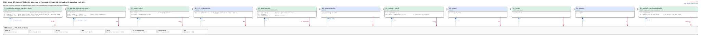

##### I1 · attention core (attn_fwd_kernel, MODE_GATE)

| (Length, Dimension) | (128, 768) | (256, 768) | (384, 768) | (512, 768) | (640, 768) | (768, 768) |
|---|---|---|---|---|---|---|
| implementation | CUDA | CUDA | CUDA | CUDA | CUDA | CUDA |
| 성능 확인 | ✗ | ✗ | ✗ | ✗ | ✗ | ✗ |
| cache build | ✓ | ✓ | ✓ | ✓ | ✓ | ✓ |

##### I2 · row kernels (layernorm_rows, adaln_in_rows, resgate_adaln_rows, resgate_out_rows, swiglu_rows; the pair LayerNorm of the cached bias)

| (Length, Dimension) | (128, 768) | (256, 768) | (384, 768) | (512, 768) | (640, 768) | (768, 768) |
|---|---|---|---|---|---|---|
| implementation | CUDA | CUDA | CUDA | CUDA | CUDA | CUDA |
| 성능 확인 | ✗ | ✗ | ✗ | ✗ | ✗ | ✗ |
| cache build | ✓ | ✓ | ✓ | ✓ | ✓ | ✓ |

##### I3 · the GEMMs (conditioning, q | k | v | g, output, expand, squeeze: cuBLAS)

| (Length, Dimension) | (128, 768) | (256, 768) | (384, 768) | (512, 768) | (640, 768) | (768, 768) |
|---|---|---|---|---|---|---|
| implementation | cuBLAS | cuBLAS | cuBLAS | cuBLAS | cuBLAS | cuBLAS |
| 성능 확인 | ✗ | ✗ | ✗ | ✗ | ✗ | ✗ |
| cache build | ✓ | ✓ | ✓ | ✓ | ✓ | ✓ |

The hand-CUDA core against the fp32 reference (`attn_fwd_kernel`, gate epilogue with the runner's pre-scaled bf16 q and bias): 3.2-3.5e-3 relative
(the bf16 output's rounding); the training epilogue 7e-4, its log-sum-exp within 6e-6. The whole block (S = 5, 10 % masked keys): 3.0e-3 against
the fp32 reference at every L, the same as the module composition's.

### Training

#### Fused block · every L = 128k

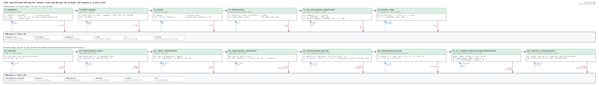

##### T1 · attention forward (attn_fwd_kernel, MODE_TRAIN)

| (Length, Dimension) | (128, 768) | (256, 768) | (384, 768) | (512, 768) | (640, 768) | (768, 768) |
|---|---|---|---|---|---|---|
| implementation | CUDA | CUDA | CUDA | CUDA 미검증 | CUDA 미검증 | CUDA |
| 성능 확인 | ✗ | ✗ | ✗ | ✗ | ✗ | ✗ |
| cache build | ✓ | ✓ | ✓ | ✓ | ✓ | ✓ |

##### T2 · attention backward, query side: dq, dbias partials and their reduction (attn_bwd_dq_kernel, db_reduce_kernel)

| (Length, Dimension) | (128, 768) | (256, 768) | (384, 768) | (512, 768) | (640, 768) | (768, 768) |
|---|---|---|---|---|---|---|
| implementation | CUDA | CUDA | CUDA | CUDA 미검증 | CUDA 미검증 | CUDA |
| 성능 확인 | ✗ | ✗ | ✗ | ✗ | ✗ | ✗ |
| cache build | ✓ | ✓ | ✓ | ✓ | ✓ | ✓ |

##### T3 · attention backward, key side: dk, dv (bias_transpose_kernel, attn_bwd_dkv_kernel)

| (Length, Dimension) | (128, 768) | (256, 768) | (384, 768) | (512, 768) | (640, 768) | (768, 768) |
|---|---|---|---|---|---|---|
| implementation | CUDA | CUDA | CUDA | CUDA 미검증 | CUDA 미검증 | CUDA |
| 성능 확인 | ✗ | ✗ | ✗ | ✗ | ✗ | ✗ |
| cache build | ✓ | ✓ | ✓ | ✓ | ✓ | ✓ |

The three kernels against fp32 autograd (`dq`, `dk`, `dv`, `dbias`; A = 2-6, L = 128-384, 10 % masked keys): 1.7-1.8e-3 relative each (bf16 P and dS).

##### T4 · row kernels (`token_dit_train_rows.cu`: 16 kernels, forward and backward)

| (Length, Dimension) | (128, 768) | (256, 768) | (384, 768) | (512, 768) | (640, 768) | (768, 768) |
|---|---|---|---|---|---|---|
| implementation | CUDA | CUDA | CUDA | CUDA 미검증 | CUDA 미검증 | CUDA |
| 성능 확인 | ✗ | ✗ | ✗ | ✗ | ✗ | ✗ |
| cache build | ✓ | ✓ | ✓ | ✓ | ✓ | ✓ |

(the GEMMs of the block, 21 of them forward and backward, are cuBLAS: the figures only.) 미검증 = the kernels take the shape, no test or measurement ran there.

## AugmentedAttentionPairBias at the token widths · the module path (2026-10-04)

The attention part of the block (`modules/augmented_attention`, registry `augmented_attention`, token stream: d_single 768, **d_cond 384 or 768, d_pair 128 or 256**, 16 heads × 48; bf16 and fp32; `bench.py
target=augmented_attention_token`) is a module of its own and the attention part of `DiTBlock`'s per-op path. It runs the same hand-CUDA path as the atom width ([../atom_dit/atom_dit.md](../atom_dit/atom_dit.md): one autograd
Function, `integrations/augattn_sm80.py`, forward and backward each one opaque op, any A / B / L, a shared or per-sample key mask, bf16 and fp32), so this section covers only what is specific to the token widths:

- **The pair bias at 128 and 256 channels.** bf16 d_pair 128 with 8 / 12 / 16 heads is AttentionPairBias's tensor-core kernel (`apb_rows.cu`: LayerNorm folded into the projection, mma on the raw bf16 words, 115-120 µs at L = 768).
  Every other width and fp32 is `pair_bias_gen_kernel` (`aux_sm80.cuh`): one thread per element (i, j) and two rows, **streaming over the channels** in chunks of 8 so a row never has to fit in registers: the row sum,
  the sum of squares and the H dot products accumulate in registers against W' held channel-major in shared memory (read as warp-uniform float4s, each shared by the thread's two rows); `bias = rstd (z . W' - mean sum W')` in fp32
  FMAs (no tensor cores, so fp32 accuracy does not depend on `allow_tf32`), the key mask and the padding folded in. Its backward is `pair_bias_gen_bwd_kernel`: a block takes a row range of 16 / 32 / 64 / 128 consecutive columns,
  keeps the tile's z and the bias gradient in shared memory, makes `dz = LN_bwd(sum_h db[h] W'[h])` with 2-8 threads per element (statistics by warp shuffles, W' from shared memory, the result staged and stored as coalesced
  vectors) and `dW'[h, c] = sum db[h] xh[c]` with thread (head group, channel slot) owning a 4 × C/64 block of accumulators, one partial `[H, C]` per block summed in a fixed order. Against the ATen LayerNorm + cuBLAS composition
  it replaces (`MINIWORLD_AUGATTN_SM80_PBGEN=0`), forward at L = 768: fp32 d_pair 128 283 vs 1708 µs (6.0x), fp32 d_pair 256 649 vs 2362 µs (3.6x), bf16 d_pair 256 373 vs 1392 µs (3.7x), at 54-71 % of the HBM floor of the pair read (201 /
  403 / 201 µs at 1.6 TB/s; the pair read is the only traffic of its size). (Job 62716.)
- **fp32 attention core** (`attn_*_tf32_sm80.cuh`): at A = 48, head dim 48, L = 384 / 768: forward 536 / 1932 µs (41 / 45 TFLOP/s executed), query side 756 / 2562 µs (43 / 51), key side 660 / 2214 µs (66 / 79) -- against the
  measured 105-127 TFLOP/s of a large cuBLAS TF32 GEMM on this card (job 62796; bf16: 243-259). The kernels keep one sample per CTA at head dim 48 (shared memory), so the bias tile is staged per sample; at A = 5 the
  forward's grid (L / 128 × A × 16 CTAs, one per SM) is 2.2 waves at L = 384: 87 µs for 2.3 GFLOP.
- **The fused DiT step in fp32** (`integrations/token_dit.py`, `FusedTokenDiT`, inference) takes the same TF32 core as `sm80.GatedInferenceCore` now (it ran the Triton gated core before; the runner's column order for fp32 on an
  A100 is q | k | v | g like bf16's, `token_dit_runner.py`); the GEMMs of that path are forced onto TF32 as before.
- **Tests**: as the atom page's (`test_a100_augattn_gpu.py`: TOKEN and TOKEN2 rows in bf16 and fp32, shared and per-sample masks, B = 2, N not a multiple of 128; the generic pair-bias kernels at widths 64-512 and 4-24 heads
  against fp64 autograd; 65 tests, job 63067), `test_a100_token_dit_gpu.py::test_fp32_runs_the_tf32_attention_core`.

##### M1 · pair bias, forward and backward (bf16 d_pair 128: `apb_rows` tensor-core kernel, forward; every other width and fp32: `pair_bias_gen_kernel` / `pair_bias_gen_bwd_kernel`)

| (Length, Dimension) | (128, 768) | (256, 768) | (384, 768) | (512, 768) | (640, 768) | (768, 768) |
|---|---|---|---|---|---|---|
| implementation | CUDA | CUDA | CUDA | CUDA | CUDA | CUDA |
| 성능 확인 | ✗ | ✗ | ✗ | ✗ | ✗ | ✗ |
| cache build | ✓ | ✓ | ✓ | ✓ | ✓ | ✓ |

##### M2 · fp32 attention core (`attn_fwd_tf32_kernel`, `attn_bwd_dq_tf32_kernel`, `attn_bwd_dkv_tf32_kernel`)

| (Length, Dimension) | (128, 768) | (256, 768) | (384, 768) | (512, 768) | (640, 768) | (768, 768) |
|---|---|---|---|---|---|---|
| implementation | CUDA | CUDA | CUDA | CUDA | CUDA | CUDA |
| 성능 확인 | ✗ | ✗ | ✗ | ✗ | ✗ | ✗ |
| cache build | ✓ | ✓ | ✓ | ✓ | ✓ | ✓ |

##### M3 · gates and residual (`gate_rows_kernel`, `res_gate_kernel`, `res_gate_bwd_kernel`, `gate_bwd_kernel`; the module path's, as the atom page's I4 / T4)

| (Length, Dimension) | (128, 768) | (256, 768) | (384, 768) | (512, 768) | (640, 768) | (768, 768) |
|---|---|---|---|---|---|---|
| implementation | CUDA | CUDA | CUDA | CUDA | CUDA | CUDA |
| 성능 확인 | ✗ | ✗ | ✗ | ✗ | ✗ | ✗ |
| cache build | ✓ | ✓ | ✓ | ✓ | ✓ | ✓ |

## Projected attention · the token_single rows (`projected_attention`, 2026-10-04)

The registry's `projected_attention` rows of the token_single stream (`n_head = 16, d_hidden = 768` → head dim 48; `n_head = 8, d_hidden = 384` → 48; `n_head = 16, d_hidden = 384` → 24; L = 128 ... 768, bf16, eval and
train) exercise the **ops-level attention**, `ops.augmented_attention_pair_bias(q, k, v, bias, mask)` (`kernels/augmented_attention/whole_op.py`; the kernel-level bench rows `projected_attention` /
`projected_attention_pytorch` of `bench.py target=augmented_attention level=kernel`): q / k / v are already projected (`[A, B, H, L, D]`), the bias is the caller's head-major `[B, H, L, L]`, the key mask is per sample
(`[A, B, L]`). It is not the module (whose AdaLN, projections and pair bias are the module's); AttentionPairBias covers the 8 × 48 @ 384 module. On an A100 `whole_op.py` asks `integrations/augattn_sm80.serves_ops` first:
bf16 q / k / v / bias, head dim 24 / 32 / 48, any A, B, L, a bool key mask `[A, B, L]` / `[B, L]` or none, the engine backend not forced to Triton, `MINIWORLD_AUGATTN_SM80 != "0"`, **and a call the core wins** (below);
the call then runs the same core as the module path -- the per-sample-mask kernels (`KM`) when the mask differs per sample, the plain kernels otherwise, **head dim 24 run 32 wide with zero columns** -- as one autograd
Function (`_Attention`) over two opaque ops; the layouts are staged (token-major rows, L padded to 128, b-major) and the natural-unit bias is packed into the core's raw units in one CUDA pass (`bias_pack`, masked and
padded keys at the masked fill). Anything else keeps the Triton kernel.

**Dispatch (`MINIWORLD_AUGATTN_SM80_OPS`, default `auto`).** The Triton kernel reads the head-major tensors in place; the CUDA path copies q / k / v / the bias into its layout and the output back, a fixed cost that is
larger than the core's gain at these sizes. Measured (tables below, one job): **inference is 13-71 % slower than Triton at every registry row and L** (16 × 768, A = 5: +13 % at L = 768 to +54 %; 8 × 384, A = 1: +50-70 %; 16 × 384,
head dim 24, A = 1: +13-48 %), and **training is faster than Triton** for 16 × 768 at A = 48 (1.3-1.95x) and for head dim 24 (1.09-1.6x) but 9-13 % slower for 8 × 384 at L <= 384 and A = 1. By the program's rule (more than 5 % slower
than Triton: dispatch back, keep the CUDA path reachable by a switch) the default serves **the calls that need gradients** (autograd on and some input requiring grad) **and have A B H L² >= 2e6 or head dim 24**; everything else
runs the Triton kernel. `MINIWORLD_AUGATTN_SM80_OPS=all` serves every call the core can take (the "CUDA path (forced)" column), `0` none. PyTorch compiled beats both at A = 1 (the dense scores of one sample are small: the
compiled einsum + softmax is one cuBLAS-bound pass), see the ×. Tests: `tests/integrations/test_a100_projected_attention_gpu.py` (11 tests: head dim 48 / 32 / 24, 2-16 heads, A = 1-5, B = 1-3, L = 128-640 (130 and 200 are
off the 128 grid), no mask, a shared mask and a mask per sample, the output and the gradients of q, k, v and the bias against fp64 autograd, no worse than 1.5× the Triton kernel's own error + 2e-3 with the core forced on
(the switch off keeps Triton); `torch.compile` and CUDA-graph replay equal to eager; a training step under compile; the gate declines what the core was not built for; the default dispatch).

##### P1 · projected attention, 16 × 768 (head dim 48, A = 5 inference / 48 training): forward and backward (`attn_fwd_kernel`, `attn_bwd_dq_kernel`, `attn_bwd_dkv_kernel`, `KM` variants)

| (Length, Dimension) | (128, 768) | (256, 768) | (384, 768) | (512, 768) | (640, 768) | (768, 768) |
|---|---|---|---|---|---|---|
| implementation | CUDA (training) / Triton (inference) | CUDA (training) / Triton (inference) | CUDA (training) / Triton (inference) | CUDA (training) / Triton (inference) | CUDA (training) / Triton (inference) | CUDA (training) / Triton (inference) |
| 성능 확인 | ✗ | ✗ | ✗ | ✗ | ✗ | ✗ |
| cache build | ✓ | ✓ | ✓ | ✓ | ✓ | ✓ |

##### P2 · projected attention, 8 × 384 (head dim 48, A = 1)

| (Length, Dimension) | (128, 384) | (256, 384) | (384, 384) | (512, 384) | (640, 384) | (768, 384) |
|---|---|---|---|---|---|---|
| implementation | Triton | Triton | Triton | CUDA (training) / Triton (inference) | CUDA (training) / Triton (inference) | CUDA (training) / Triton (inference) |
| 성능 확인 | ✗ | ✗ | ✗ | ✗ | ✗ | ✗ |
| cache build | ✓ | ✓ | ✓ | ✓ | ✓ | ✓ |

##### P3 · projected attention, 16 × 384 (head dim 24 run as 32, A = 1)

| (Length, Dimension) | (128, 384) | (256, 384) | (384, 384) | (512, 384) | (640, 384) | (768, 384) |
|---|---|---|---|---|---|---|
| implementation | CUDA (training) / Triton (inference) | CUDA (training) / Triton (inference) | CUDA (training) / Triton (inference) | CUDA (training) / Triton (inference) | CUDA (training) / Triton (inference) | CUDA (training) / Triton (inference) |
| 성능 확인 | ✗ | ✗ | ✗ | ✗ | ✗ | ✗ |
| cache build | ✓ | ✓ | ✓ | ✓ | ✓ | ✓ |

## Measurements (2026-10-03; the attention-module and projected-attention tables 2026-10-04)

One A100 80GB PCIe (300 W, gpu09), torch 2.13.0+cu129 / triton 3.7.1, bf16, B = 1, one DiTBlock, d_single 768, d_cond 384, d_pair 128, 16 heads × 48,
CUDA-graph timing (`cudagraph=manual`), `benchmarks/runners/bench.py target=dit level=module` (job 61782 for PyTorch compiled and ours, sources frozen in
a snapshot for the run). Inference: A = 5 samples, each with its own conditioning (the bench default; a sampling step shares one conditioning across the samples, which
the fused step computes once for L rows: 0.247 / 0.479 ms, below), L swept at 384 / 768; training: A = 48, dropout none. Run-to-run and
node-to-node spread is about 2-3 %. Times in ms. "Triton path" = the module composition the A100 ran before this path (job 61597, the same bench, the same
node type; the autotune layer logs a stale or missing tuned entry for a few of its ops in probe runs, e.g. `cond_transition_squeeze_gate_triton`, and falls back to a
heuristic subset: those caches were not rebuilt here). cuEquivariance has no DiT block. **Anthropic** (inference only: the release ships no backward) = the release's DiT
block composed the way its kits compose it (`bench.py`'s `anthropic` arm: torch GEMMs with q | k | v | g as one GEMM, `ln_proj.pair_bias` once per pair tensor, the `dit_fast` row
kernels, an fp32 residual stream; Triton kernels of `common/opt_core`, pinned f4f62fa, taken from the checkout at `/home/psk6950/practice/refs/uplifting-biomolecular-modeling`
without modification) with the attention core its own A100 cells name for 16 × 48 heads, `apb_attn` (`+dit_anthropic_core=apb_attn`; the kits' recipe core `fpf_apb` is slower on
this card, below). Its upstream calls run under `torch.compiler.disable`, so the arm is timed eager under a CUDA graph (`compile=false`), as the 2026-09-24 A100 baseline did.
Table value = the mean of two jobs on different nodes (61913 gpu02, 61915 gpu08), in which PyTorch compiled, ours and both Anthropic cores ran on the same GPU. **×** (inference) =
Anthropic divided by ours; **×** (training) = PyTorch compiled divided by ours (neither Anthropic nor cuEquivariance has a training DiT). The block tables below are of 2026-10-03; a re-run of the bf16 inference block on
2026-10-04 (job 63261, gpu02, the final sources; the Anthropic arm was not re-run) read ours 0.287 / 0.568 ms and PyTorch compiled 0.528 / 1.464 ms at L384 / L768 (0.286 / 0.561 and 0.527 / 1.431 before): this round's changes did not
move the block (the training block was not re-run; its code is unchanged).

### Inference

| (Length, Dimension) | PyTorch compiled | cuEquivariance | Anthropic | Triton path | ours | × |
|---|---|---|---|---|---|---|
| (384, 768) | 0.527 | — (no DiT) | 0.345 | 0.464 | 0.286 | 1.21 |
| (768, 768) | 1.431 | — (no DiT) | 0.644 | 0.994 | 0.561 | 1.15 |

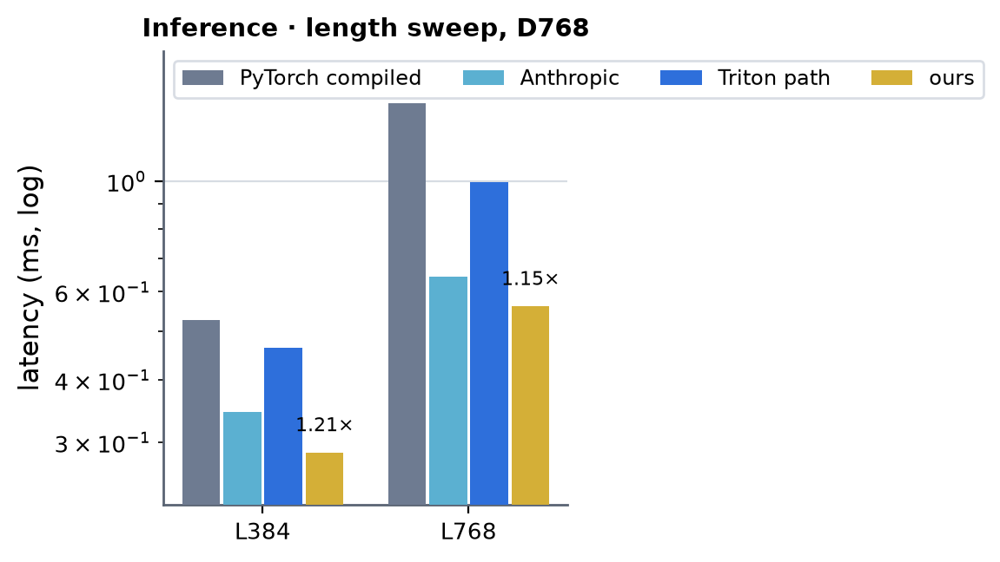 <!-- measure_bars -->

Same-job ratios, per job (ours / PyTorch compiled / Anthropic `apb_attn` / Anthropic `fpf_apb`, ms): gpu02 L384 0.2857 / 0.5274 / 0.3441 / 0.4639 (Anthropic ÷ ours 1.20), L768 0.5632 / 1.4592 /
0.6420 / 1.0056 (1.14); gpu08 L384 0.2867 / 0.5581 / 0.3451 / 0.4659 (1.20), L768 0.5652 / 1.4484 / 0.6461 / 1.0020 (1.14). The kits' recipe core `fpf_apb` is 1.35x / 1.56x slower than
`apb_attn` on the A100, so against the recipe the same blocks read 1.62x / 1.78x. **A sampling step** (one conditioning shared by the 5 samples, `+shared_cond=true`, which the fused step
and Anthropic's conditioning dedup both exploit; jobs 61914 gpu02 / 61916 gpu08): ours 0.2478 / 0.4849 and 0.2478 / 0.4772 ms, Anthropic `apb_attn` 0.2980 / 0.5376 and 0.2970 / 0.5304 (1.20x / 1.11x),
`fpf_apb` 0.4188 / 0.9011 and 0.4188 / 0.8960, PyTorch compiled 0.530 / 1.448 and 0.527 / 1.437. Output error against the fp32 module: ours 3.5e-3, Anthropic 3.4e-3, PyTorch compiled 4.2e-3 (relative Frobenius).

### Training

| (Length, Dimension) | PyTorch compiled | cuEquivariance | Anthropic | Triton path | ours | × |
|---|---|---|---|---|---|---|
| (384, 768) | 10.770 | — (no DiT) | — (no bwd) | 8.960 | 7.338 | 1.47 |
| (768, 768) | 30.259 | — (no DiT) | — (no bwd) | 22.768 | 16.463 | 1.84 |

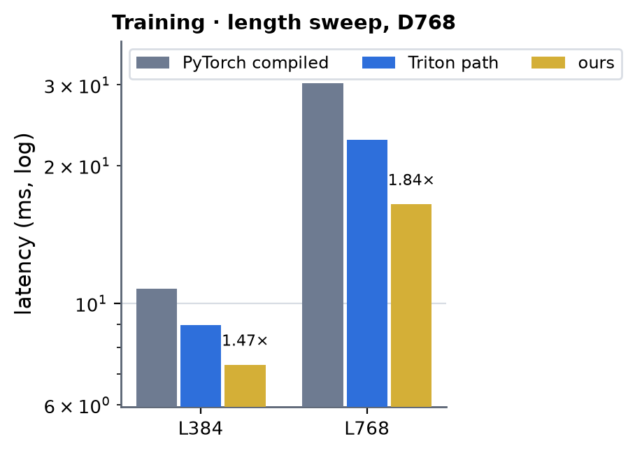 <!-- measure_bars -->

In one process (job 61830), CUDA graph, inference L256 / 384 / 512 / 768 (A = 5 sharing one conditioning, 10 % masked keys): the module composition 358 / 535 / 712 / 1124 µs,
the fused step with the Triton rows and the Triton core 235 / 304 / 409 / 627, with the CUDA rows 219 / 284 / 385 / 596, with the CUDA rows and the
hand-CUDA core 211 / 247 / 336 / 479 (2.3x the composition at L768; the autotune layer logged "no tuned entry for this shape" for six LayerNorm shapes and a stale grid for
`cond_transition_squeeze_gate_triton` in this job, so the two Triton variants ran heuristic configs there). The attention core alone,
16 × 48 (kernel times of the profile below): 41 µs at L384 and 125 µs at L768 in inference (A = 5; the Triton gated core, measured earlier: 78 and 232 µs); the training forward /
backward at A = 48: 255 / 893 µs at L384 and 940 / 3114 µs at L768 (Triton, earlier: 379 / 1554 and 1200 / 6439).

### Attention module (AugmentedAttentionPairBias) · row 1 (d_cond 384, d_pair 128) · bf16 · inference

The module path of the attention part alone (section above): `bench.py target=augmented_attention_token level=module`, one `AugmentedAttentionPairBias` (d_single 768, 16 heads × 48), CUDA-graph timing, B = 1, no key
mask, snapshot `snap_1004_013704` (the final sources). Inference A = 5 samples with a conditioning each, training A = 48. Row 1 = registry row d_cond 384 / d_pair 128, row 2 = d_cond 768 / d_pair 256. Jobs: row 1 bf16
63196 (gpu03: ours, PyTorch compiled and the Triton path from one node), row 1 fp32 63073 (gpu07), row 2 bf16 and fp32 63145 (gpu09); the Triton path = the same module with `MINIWORLD_AUGATTN_SM80=0` (the module
composition the A100 ran before this work); run-to-run spread 2-3 %, up to 10 % between nodes. fp32 = `precision=32`, TF32 allowed (`allow_tf32: true`: the cuBLAS GEMMs and the tensor-core attention both run TF32, as the Triton path
does). Times in ms. cuEquivariance has no such op; Anthropic is not measured. **×** = PyTorch compiled divided by ours.

| (Length, Dimension) | PyTorch compiled | cuEquivariance | Anthropic | Triton path | ours | × |
|---|---|---|---|---|---|---|
| (128, 768) | 0.131 | — (none) | — (not measured) | 0.123 | 0.099 | 1.32 |
| (256, 768) | 0.243 | — (none) | — (not measured) | 0.204 | 0.165 | 1.47 |
| (384, 768) | 0.410 | — (none) | — (not measured) | 0.292 | 0.212 | 1.93 |
| (512, 768) | 0.631 | — (none) | — (not measured) | 0.436 | 0.280 | 2.26 |
| (640, 768) | 0.855 | — (none) | — (not measured) | 0.564 | 0.355 | 2.41 |
| (768, 768) | 1.155 | — (none) | — (not measured) | 0.728 | 0.441 | 2.62 |

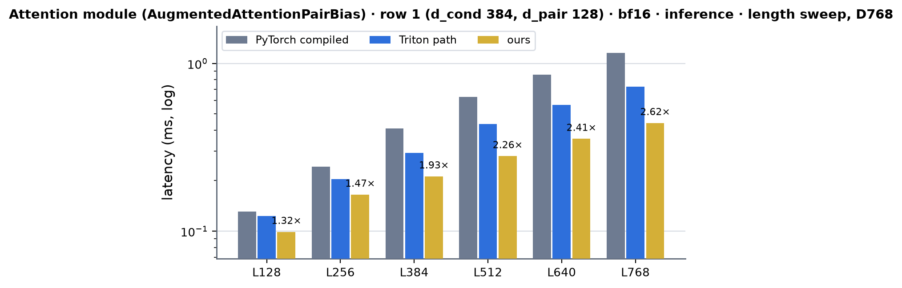 <!-- measure_bars -->

### Attention module (AugmentedAttentionPairBias) · row 1 (d_cond 384, d_pair 128) · bf16 · training

| (Length, Dimension) | PyTorch compiled | cuEquivariance | Anthropic | Triton path | ours | × |
|---|---|---|---|---|---|---|
| (128, 768) | 1.656 | — (none) | — (not measured) | 1.648 | 1.378 | 1.20 |
| (256, 768) | 4.012 | — (none) | — (not measured) | 3.323 | 2.608 | 1.54 |
| (384, 768) | 7.287 | — (none) | — (not measured) | 5.345 | 3.932 | 1.85 |
| (512, 768) | 11.096 | — (none) | — (not measured) | 7.988 | 5.597 | 1.98 |
| (640, 768) | 17.251 | — (none) | — (not measured) | 11.216 | 7.194 | 2.40 |
| (768, 768) | 23.028 | — (none) | — (not measured) | 15.351 | 9.355 | 2.46 |

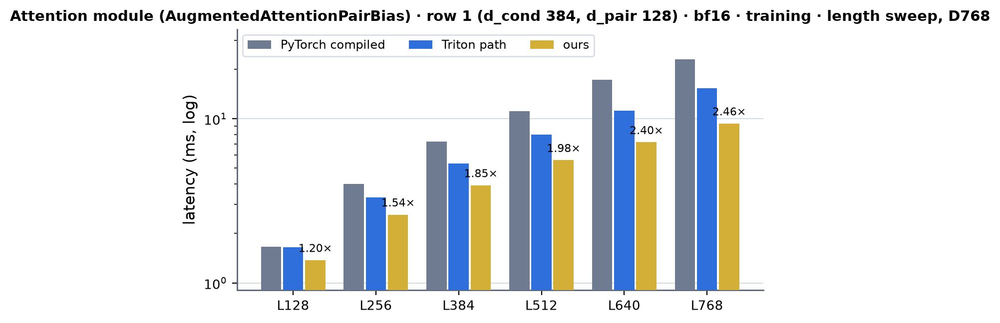 <!-- measure_bars -->

### Attention module (AugmentedAttentionPairBias) · row 1 (d_cond 384, d_pair 128) · fp32 · inference

| (Length, Dimension) | PyTorch compiled | cuEquivariance | Anthropic | Triton path | ours | × |
|---|---|---|---|---|---|---|
| (128, 768) | 0.189 | — (none) | — (not measured) | 0.191 | 0.165 | 1.15 |
| (256, 768) | 0.367 | — (none) | — (not measured) | 0.336 | 0.274 | 1.34 |
| (384, 768) | 0.599 | — (none) | — (not measured) | 0.519 | 0.399 | 1.50 |
| (512, 768) | 1.002 | — (none) | — (not measured) | 0.793 | 0.548 | 1.83 |
| (640, 768) | 1.483 | — (none) | — (not measured) | 1.065 | 0.723 | 2.05 |
| (768, 768) | 1.945 | — (none) | — (not measured) | 1.334 | 0.926 | 2.10 |

 <!-- measure_bars -->

### Attention module (AugmentedAttentionPairBias) · row 1 (d_cond 384, d_pair 128) · fp32 · training

| (Length, Dimension) | PyTorch compiled | cuEquivariance | Anthropic | Triton path | ours | × |
|---|---|---|---|---|---|---|
| (128, 768) | 2.859 | — (none) | — (not measured) | 2.733 | 2.498 | 1.14 |
| (256, 768) | 6.619 | — (none) | — (not measured) | 5.926 | 5.069 | 1.31 |
| (384, 768) | 11.512 | — (none) | — (not measured) | 9.952 | 8.067 | 1.43 |
| (512, 768) | 17.547 | — (none) | — (not measured) | 14.714 | 11.512 | 1.52 |
| (640, 768) | 26.724 | — (none) | — (not measured) | 20.271 | 15.555 | 1.72 |
| (768, 768) | 35.675 | — (none) | — (not measured) | 26.942 | 19.692 | 1.81 |

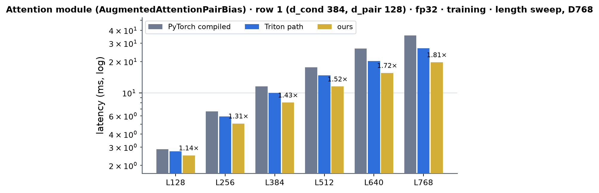 <!-- measure_bars -->

### Attention module (AugmentedAttentionPairBias) · row 2 (d_cond 768, d_pair 256) · bf16 · inference

| (Length, Dimension) | PyTorch compiled | cuEquivariance | Anthropic | Triton path | ours | × |
|---|---|---|---|---|---|---|
| (128, 768) | 0.143 | — (none) | — (not measured) | 0.147 | 0.154 | 0.93 |
| (256, 768) | 0.292 | — (none) | — (not measured) | 0.264 | 0.247 | 1.18 |
| (384, 768) | 0.492 | — (none) | — (not measured) | 0.400 | 0.317 | 1.55 |
| (512, 768) | 0.778 | — (none) | — (not measured) | 0.607 | 0.437 | 1.78 |
| (640, 768) | 1.095 | — (none) | — (not measured) | 0.820 | 0.583 | 1.88 |
| (768, 768) | 1.496 | — (none) | — (not measured) | 1.065 | 0.739 | 2.02 |

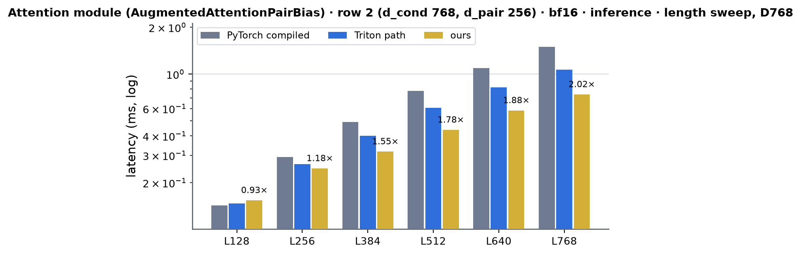 <!-- measure_bars -->

### Attention module (AugmentedAttentionPairBias) · row 2 (d_cond 768, d_pair 256) · bf16 · training

| (Length, Dimension) | PyTorch compiled | cuEquivariance | Anthropic | Triton path | ours | × |
|---|---|---|---|---|---|---|
| (128, 768) | 1.872 | — (none) | — (not measured) | 1.890 | 1.755 | 1.07 |
| (256, 768) | 4.393 | — (none) | — (not measured) | 3.711 | 3.388 | 1.30 |
| (384, 768) | 8.086 | — (none) | — (not measured) | 6.063 | 5.367 | 1.51 |
| (512, 768) | 12.030 | — (none) | — (not measured) | 9.047 | 7.906 | 1.52 |
| (640, 768) | 18.692 | — (none) | — (not measured) | 12.778 | 10.472 | 1.78 |
| (768, 768) | 24.785 | — (none) | — (not measured) | 17.371 | 13.829 | 1.79 |

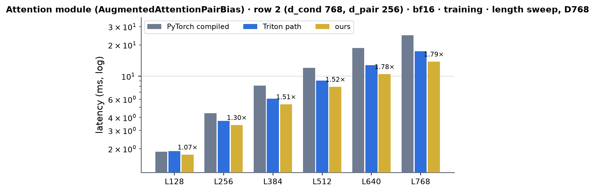 <!-- measure_bars -->

### Attention module (AugmentedAttentionPairBias) · row 2 (d_cond 768, d_pair 256) · fp32 · inference

| (Length, Dimension) | PyTorch compiled | cuEquivariance | Anthropic | Triton path | ours | × |
|---|---|---|---|---|---|---|
| (128, 768) | 0.229 | — (none) | — (not measured) | 0.241 | 0.234 | 0.98 |
| (256, 768) | 0.462 | — (none) | — (not measured) | 0.437 | 0.368 | 1.26 |
| (384, 768) | 0.778 | — (none) | — (not measured) | 0.701 | 0.550 | 1.42 |
| (512, 768) | 1.323 | — (none) | — (not measured) | 1.104 | 0.792 | 1.67 |
| (640, 768) | 1.948 | — (none) | — (not measured) | 1.532 | 1.083 | 1.80 |
| (768, 768) | 2.618 | — (none) | — (not measured) | 2.009 | 1.414 | 1.85 |

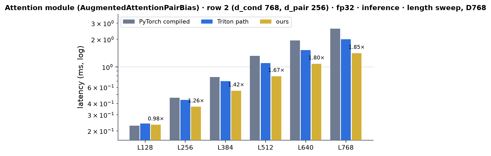 <!-- measure_bars -->

### Attention module (AugmentedAttentionPairBias) · row 2 (d_cond 768, d_pair 256) · fp32 · training

| (Length, Dimension) | PyTorch compiled | cuEquivariance | Anthropic | Triton path | ours | × |
|---|---|---|---|---|---|---|
| (128, 768) | 3.197 | — (none) | — (not measured) | 3.034 | 2.883 | 1.11 |
| (256, 768) | 7.346 | — (none) | — (not measured) | 6.615 | 6.001 | 1.22 |
| (384, 768) | 12.827 | — (none) | — (not measured) | 11.063 | 9.680 | 1.33 |
| (512, 768) | 19.499 | — (none) | — (not measured) | 16.264 | 13.911 | 1.40 |
| (640, 768) | 29.611 | — (none) | — (not measured) | 23.361 | 18.882 | 1.57 |
| (768, 768) | 39.775 | — (none) | — (not measured) | 30.549 | 24.391 | 1.63 |

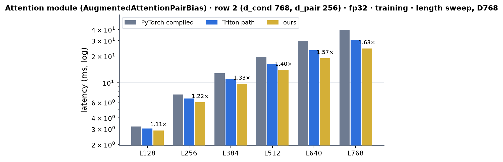 <!-- measure_bars -->

Against the Triton path every cell is faster except one: row 2, bf16, inference, L = 128 (0.154 against 0.147 ms: 4.8 % slower, inside the 5 % dispatch rule and the 2-3 % run-to-run spread, so it stays CUDA). Against PyTorch compiled
(the × column) two L = 128 inference cells of row 2 sit just below 1 (bf16 0.93x, fp32 0.98x): at A = 5 and L = 128 the call is launch- and latency-bound (150-230 µs), and the generic pair-bias kernel's grid is 32 CTAs there
(`MINIWORLD_AUGATTN_SM80_PBGEN_ROWS` sets the rows a thread takes: 1 doubles the grid; not tuned). From L = 256 up the module is 1.2-2.6x PyTorch compiled in inference and 1.2-2.5x in training.

### Projected attention · 16 × 768 (head dim 48, A = 5 inference / 48 training) · inference

`bench.py target=augmented_attention level=kernel` rows `projected_attention` / `projected_attention_pytorch` (CUDA-graph timing; inference with the harness's `torch.compile`, training with `compile=false` because the
harness cannot compile a kernel-level training step: the bench helper compiles the PyTorch reference core itself; no mask, B = 1, q / k / v / bias in bf16). Columns: PyTorch compiled; the Triton kernel
(`MINIWORLD_AUGATTN_SM80=0`); the CUDA path **forced** (`MINIWORLD_AUGATTN_SM80_OPS=all`); **ours = the default dispatch** (`auto`, above). Job **63327** (gpu03, snapshot `snap_1004_090922`: the final sources; the columns of a table ran in that job on that node; run-to-run spread 2-3 %, up to 10 % between nodes: the first measurement of the forced
CUDA path, 2026-10-04 08:36-08:43, jobs 63196 / 63270, agrees within 3 %). Times in ms; **×** = PyTorch compiled divided by ours.

| (Length, Dimension) | PyTorch compiled | cuEquivariance | Anthropic | Triton path | CUDA path (forced) | ours | × |
|---|---|---|---|---|---|---|---|
| (128, 768) | 0.031 | — (none) | — (not measured) | 0.026 | 0.036 | 0.025 | 1.25 |
| (256, 768) | 0.057 | — (none) | — (not measured) | 0.039 | 0.060 | 0.039 | 1.47 |
| (384, 768) | 0.118 | — (none) | — (not measured) | 0.070 | 0.087 | 0.067 | 1.77 |
| (512, 768) | 0.203 | — (none) | — (not measured) | 0.093 | 0.114 | 0.093 | 2.18 |
| (640, 768) | 0.328 | — (none) | — (not measured) | 0.127 | 0.151 | 0.127 | 2.58 |
| (768, 768) | 0.463 | — (none) | — (not measured) | 0.185 | 0.200 | 0.176 | 2.63 |

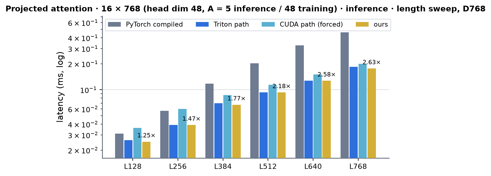 <!-- measure_bars -->

### Projected attention · 16 × 768 (head dim 48, A = 5 inference / 48 training) · training

| (Length, Dimension) | PyTorch compiled | cuEquivariance | Anthropic | Triton path | CUDA path (forced) | ours | × |
|---|---|---|---|---|---|---|---|
| (128, 768) | 0.426 | — (none) | — (not measured) | 0.540 | 0.413 | 0.413 | 1.03 |
| (256, 768) | 1.488 | — (none) | — (not measured) | 1.397 | 0.953 | 0.955 | 1.56 |
| (384, 768) | 3.239 | — (none) | — (not measured) | 2.647 | 1.700 | 1.703 | 1.90 |
| (512, 768) | 5.337 | — (none) | — (not measured) | 4.311 | 2.619 | 2.618 | 2.04 |
| (640, 768) | 8.583 | — (none) | — (not measured) | 6.940 | 3.714 | 3.690 | 2.33 |
| (768, 768) | 12.341 | — (none) | — (not measured) | 9.911 | 5.011 | 4.966 | 2.48 |

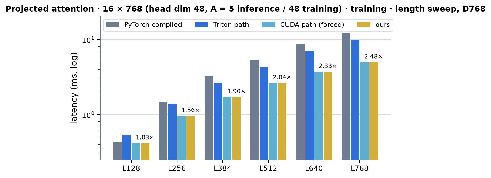 <!-- measure_bars -->

### Projected attention · 8 × 384 (head dim 48, A = 1) · inference

| (Length, Dimension) | PyTorch compiled | cuEquivariance | Anthropic | Triton path | CUDA path (forced) | ours | × |
|---|---|---|---|---|---|---|---|
| (128, 384) | 0.019 | — (none) | — (not measured) | 0.017 | 0.029 | 0.017 | 1.12 |
| (256, 384) | 0.024 | — (none) | — (not measured) | 0.022 | 0.035 | 0.022 | 1.10 |
| (384, 384) | 0.026 | — (none) | — (not measured) | 0.026 | 0.040 | 0.026 | 1.00 |
| (512, 384) | 0.031 | — (none) | — (not measured) | 0.030 | 0.046 | 0.030 | 1.03 |
| (640, 384) | 0.040 | — (none) | — (not measured) | 0.035 | 0.053 | 0.035 | 1.15 |
| (768, 384) | 0.047 | — (none) | — (not measured) | 0.039 | 0.061 | 0.039 | 1.21 |

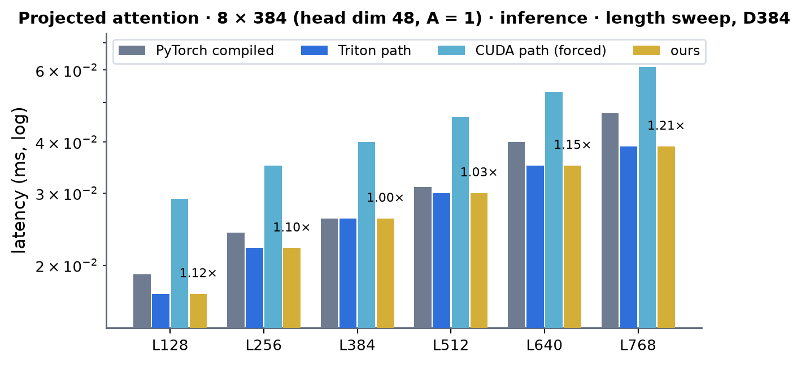 <!-- measure_bars -->

### Projected attention · 8 × 384 (head dim 48, A = 1) · training

| (Length, Dimension) | PyTorch compiled | cuEquivariance | Anthropic | Triton path | CUDA path (forced) | ours | × |
|---|---|---|---|---|---|---|---|
| (128, 384) | 0.042 | — (none) | — (not measured) | 0.065 | 0.071 | 0.065 | 0.65 |
| (256, 384) | 0.059 | — (none) | — (not measured) | 0.082 | 0.091 | 0.083 | 0.72 |
| (384, 384) | 0.060 | — (none) | — (not measured) | 0.103 | 0.116 | 0.103 | 0.58 |
| (512, 384) | 0.072 | — (none) | — (not measured) | 0.142 | 0.140 | 0.140 | 0.51 |
| (640, 384) | 0.095 | — (none) | — (not measured) | 0.182 | 0.179 | 0.179 | 0.53 |
| (768, 384) | 0.115 | — (none) | — (not measured) | 0.266 | 0.219 | 0.219 | 0.52 |

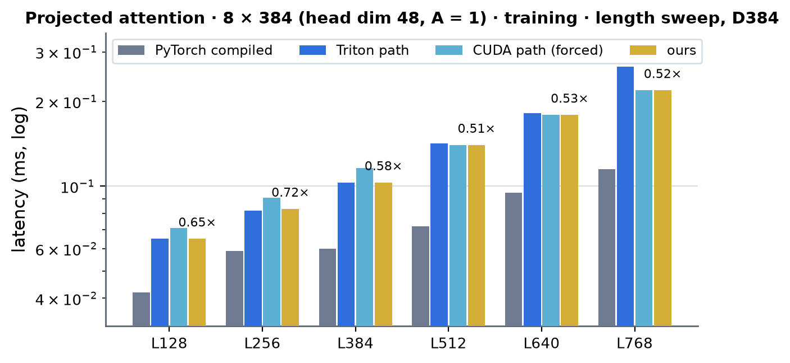 <!-- measure_bars -->

### Projected attention · 16 × 384 (head dim 24, A = 1) · inference

| (Length, Dimension) | PyTorch compiled | cuEquivariance | Anthropic | Triton path | CUDA path (forced) | ours | × |
|---|---|---|---|---|---|---|---|
| (128, 384) | 0.017 | — (none) | — (not measured) | 0.022 | 0.032 | 0.022 | 0.81 |
| (256, 384) | 0.024 | — (none) | — (not measured) | 0.025 | 0.037 | 0.025 | 0.96 |
| (384, 384) | 0.034 | — (none) | — (not measured) | 0.038 | 0.043 | 0.038 | 0.89 |
| (512, 384) | 0.042 | — (none) | — (not measured) | 0.045 | 0.051 | 0.045 | 0.93 |
| (640, 384) | 0.057 | — (none) | — (not measured) | 0.048 | 0.062 | 0.048 | 1.19 |
| (768, 384) | 0.071 | — (none) | — (not measured) | 0.062 | 0.076 | 0.062 | 1.13 |

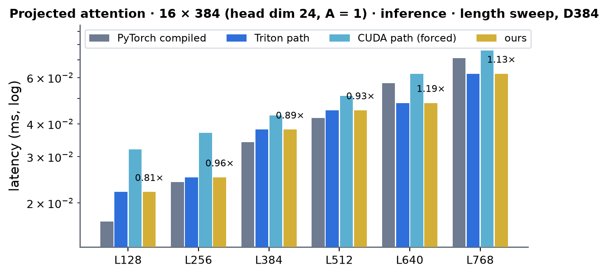 <!-- measure_bars -->

### Projected attention · 16 × 384 (head dim 24, A = 1) · training

| (Length, Dimension) | PyTorch compiled | cuEquivariance | Anthropic | Triton path | CUDA path (forced) | ours | × |
|---|---|---|---|---|---|---|---|
| (128, 384) | 0.041 | — (none) | — (not measured) | 0.076 | 0.070 | 0.070 | 0.59 |
| (256, 384) | 0.060 | — (none) | — (not measured) | 0.106 | 0.091 | 0.090 | 0.67 |
| (384, 384) | 0.081 | — (none) | — (not measured) | 0.159 | 0.121 | 0.120 | 0.68 |
| (512, 384) | 0.104 | — (none) | — (not measured) | 0.231 | 0.162 | 0.164 | 0.64 |
| (640, 384) | 0.140 | — (none) | — (not measured) | 0.317 | 0.217 | 0.216 | 0.65 |
| (768, 384) | 0.195 | — (none) | — (not measured) | 0.436 | 0.274 | 0.273 | 0.71 |

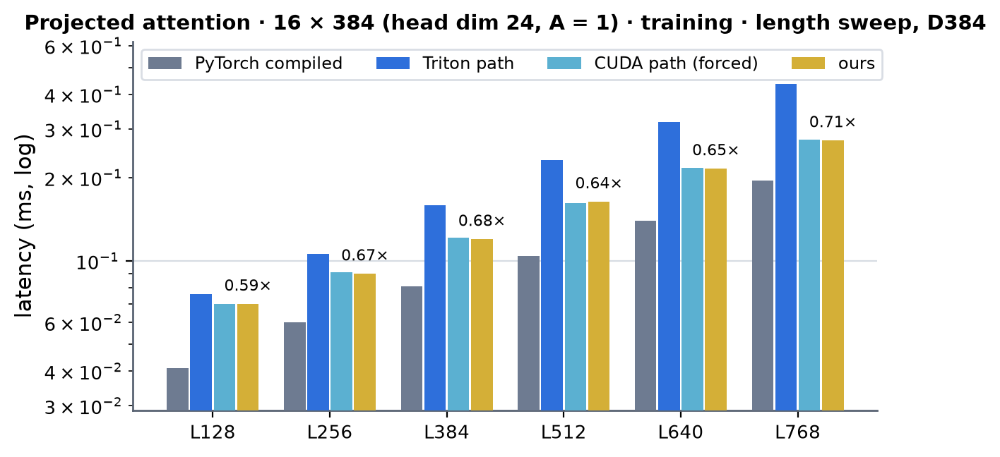 <!-- measure_bars -->

Reading the tables: **ours is the default dispatch**, i.e. the Triton kernel in inference and, in training, the CUDA path where the rule serves it (16 × 768 at A = 48 and 16 × 384 at head dim 24 at every L; 8 × 384 from L = 512), so
ours is never more than 5 % behind the Triton path (the 8 × 384 / L = 256 training cell: 0.083 against 0.082 is noise) and is faster than it in the training rows the CUDA path serves (16 × 768: 1.3-2.0x; head dim 24: 1.1-1.6x; 8 × 384
from L = 512: 1.0-1.2x). Against **PyTorch compiled** the 16 × 768 rows are 1.0-2.6x, and the A = 1 rows are not wins: in training PyTorch compiled (a dense einsum + softmax of one sample, 8 × 768² fp32 scores = 19 MB, one
cuBLAS-bound pass) is 1.4-2.0x faster than both the CUDA and the Triton path (× 0.51-0.72), and at head dim 24 in inference it is ahead up to L = 512 (× 0.81-0.96). Reaching it needs the head-major layout read in place
(no staging copies) and a fused single-sample kernel; neither is in this round.

### Speed of light

SoL = the composite floor of the decomposition: per kernel `max(essential bytes / 1.60 TB/s, FLOP / 240 TFLOP/s)`, summed (both ceilings measured on this card,
`experiments/a100_trimul_fwd`, tag `archive/a100-sm80-branch-20260928`); every tensor a kernel reads or writes counts once, the GEMMs by their FLOP,
the attention kernels as implemented (the forward 2 mma sets of 2 A H L² hd FLOP, the query side 3, the key side 4, with the bf16 bias-gradient
partials written and read back). Inference counts the conditioning of one block (the pair bias is cached).

| mode | L | ours (µs) | SoL floor (µs) | % of SoL |
|---|---|---|---|---|
| inference (A = 5, a conditioning per sample) | 384 | 286 | 194 | 68 % |
| inference (A = 5, a conditioning per sample) | 768 | 561 | 402 | 72 % |
| inference (A = 5, one conditioning shared) | 384 | 247 | 161 | 65 % |
| inference (A = 5, one conditioning shared) | 768 | 479 | 336 | 70 % |
| training (A = 48) | 384 | 7338 | 6099 | 83 % |
| training (A = 48) | 768 | 16463 | 13576 | 82 % |

The training step is GEMM-bound (the cuBLAS GEMMs are 3.9 ms of the 6.1 ms floor at L384 and run at about 225 TFLOP/s, 94 % of the ceiling), so what
is left is the attention (about 2.5x its floor) and the row passes' launch gaps.

The **attention module's** floor (`sol.py`, the same rule: AdaLN's scale / shift projections, the packed q | k | v | g GEMM, the pair bias, the attention, the output and conditioning-gate GEMMs, the gates and the
residual, and in training the backward's stages; each tensor once; ceilings 240 TFLOP/s bf16 and 115 TFLOP/s TF32 -- the measured 105-127 of a large cuBLAS TF32 GEMM, job 62796) against the table above (ours, µs):

| L | row 1 bf16: inference ours / floor / % | training ours / floor / % | row 1 fp32: inference | training | row 2 bf16: inference | training | row 2 fp32: inference | training |
|---|---|---|---|---|---|---|---|---|
| 128 | 99 / 29 / 29 % | 1378 / 815 / 59 % | 165 / 60 / 37 % | 2498 / 1726 / 69 % | 154 / 37 / 24 % | 1755 / 959 / 55 % | 234 / 75 / 32 % | 2883 / 2026 / 70 % |
| 256 | 165 / 65 / 39 % | 2608 / 1668 / 64 % | 274 / 134 / 49 % | 5069 / 3621 / 71 % | 247 / 85 / 34 % | 3388 / 1971 / 58 % | 368 / 174 / 47 % | 6001 / 4251 / 71 % |
| 384 | 212 / 107 / 51 % | 3932 / 2638 / 67 % | 399 / 220 / 55 % | 8067 / 5847 / 72 % | 317 / 145 / 46 % | 5367 / 3117 / 58 % | 550 / 297 / 54 % | 9680 / 6840 / 71 % |
| 512 | 280 / 156 / 56 % | 5597 / 3755 / 67 % | 548 / 320 / 58 % | 11512 / 8379 / 73 % | 437 / 217 / 50 % | 7906 / 4424 / 56 % | 792 / 443 / 56 % | 13911 / 9765 / 70 % |
| 640 | 355 / 214 / 60 % | 7194 / 4991 / 69 % | 723 / 440 / 61 % | 15555 / 11202 / 72 % | 583 / 304 / 52 % | 10472 / 5867 / 56 % | 1083 / 620 / 57 % | 18882 / 13013 / 69 % |
| 768 | 441 / 281 / 64 % | 9355 / 6345 / 68 % | 926 / 577 / 62 % | 19692 / 14316 / 73 % | 739 / 404 / 55 % | 13829 / 7444 / 54 % | 1414 / 824 / 58 % | 24391 / 16583 / 68 % |

Training sits at 54-73 % of the floor at every L (the GEMMs and the attention's dominant FLOP are shared with the floor); inference falls to 24-37 % at L = 128 where the whole call is under 0.25 ms of launches and
small kernels. **Row 2's training is held back by one kernel**: the generic pair-bias backward `pair_bias_gen_bwd_kernel` takes 3.75 ms of the 14.0 ms of kernel time of a bf16 step at L = 768 (fp32: 4.13 of 26.1 ms; job 63303, eager
launches under the profiler) against a byte floor of about 0.4 ms (it reads z and writes dz, 640 MB, and does 2 × 16 heads × 256 channels FMAs per pair element on CUDA cores); the two attention backward kernels together take 2.6 ms
(bf16). Row 1's d_pair = 128 backward is the APB tensor-core kernel (`pair_bias_bwd80_k`, 0.22 ms). A tensor-core formulation of the generic backward would give back about a fifth of row 2's training step: the largest step left
for these rows.

### Where the time goes (`torch.profiler` CUPTI kernel times, one process, job 61782)

Inference with a conditioning per sample (the bench), A = 5; training A = 48; µs per block, bf16.

| kernels | L384 inference | L384 training | L768 inference | L768 training | floor L384 (inference / training) |
|---|---|---|---|---|---|
| cuBLAS GEMMs (6 / 21) | 195 | 4163 | 365 | 8497 | 132 / 3908 |
| attention forward (`attn_fwd_kernel`) | 41 | 255 | 125 | 940 | 12 / 92 |
| attention query side (`attn_bwd_dq_kernel` + `db_reduce_kernel`) | | 431 + 50 | | 1467 + 163 | / 186 |
| attention key side (`bias_transpose_kernel` + `attn_bwd_dkv_kernel`) | | 13 + 399 | | 39 + 1445 | / 187 |
| CUDA row passes | 54 | 1816 | 109 | 3839 | 50 / 1725 |
| PyTorch copies / other | | 161 | | 219 | |
| sum of kernel times | 289 | 7287 | 599 | 16610 | 194 / 6099 |
| graph replay | 282 | 7359 | 548 | 16624 | |

The largest row kernels of the training step at L384: `res_adaln_b_bwd_k` 240 µs, `swiglu_bwd_k` 205, `res_adaln_b_k` 188, `adaln_a_bwd_k` 163, the
dq | dk | dv conversion pass (`qknorm_bwd_k` with QK-norm off) 162, `adaln_a_k` 123, `gate_o_bwd_k` 108, `swiglu_rows_kernel` 106; they run at 0.9-1.4x their byte
floors. The GEMMs run at 94 % of the ceiling. The attention kernels are the part that is far from its floor, 2.5x together (forward 2.8x, query side
2.6x, key side 2.2x): 8 or 16 warps per SM, one barrier per key tile, the same latency / shared-memory plateau as the TriangleAttention kernels; the
forward runs at 85 TFLOP/s equivalent at A = 48, L384 and 92 at L768.

### What was tried and did not pay (2026-10-03)

- The fused runner's Triton row passes against the CUDA ones (the same sources B200 runs, built for sm_80): the CUDA rows are 5-7 % faster at A = 5.
- The hand-CUDA core with two samples per CTA (one bias tile for both): 6-15 % faster at A = 8 and at A = 48, slower at A = 10 (fewer CTAs for
  the waves; A = 5 is odd): `_fwd_schedule` picks two samples from A = 32 up (even), one below. The query-side backward with four samples per CTA writes half the
  bias-gradient partials of two: 12-20 % faster at A = 48 than the two-sample schedule (eight samples would need 253 KiB of shared memory, the limit is 163).
- A bias tile ring of two buffers (the TriangleAttention kernels' choice at two rows per CTA) is wrong at one sample per CTA, where the tile of key
  tile j + 3 is issued while j + 1 still waits: the ring has `(NKV - 1) / R + 1` buffers.

- A cuBLASLt algorithm search for the inference GEMMs (M = 1920, the best of the 8 algorithms the heuristic returns per shape, timed in a C++ loop, job 62145): q | k | v | g and expand 49.0 / 50.1 us against torch.mm's
  49.7 / 50.4, out 16.4 against 17.1, squeeze 26.3 against 26.7, the conditioning-table GEMMs of one block 31.8 / 17.9 against 32.8 / 18.1 -- 1.00-1.04x. cuBLAS already picks (nearly) the best of its own kernels; the 182 /
  132 / 170 TFLOP/s of q | k | v | g, out and squeeze (76 / 55 / 71 % of the 240 TFLOP/s ceiling) are wave quantization of 128 x 128 tiles (360 / 90 / 90 tiles on 108 SMs), which only a stream-K or split-K kernel would move.

### Limits and next

- Not served on A100 (they run the module path): QK-norm blocks, fp32 operands in training, the other head layouts (24 × 32, 12 × 64 at d 768, 16 × 64 at
  d 1024), L not a multiple of 128, a mask other than `[1, L]`, B > 1, an odd sample count in training. The attention kernels take head dim 48 only
  (`HD` is a template parameter: 32 / 64 are instantiations away).
- The fp32 residual stream, the fp32 dq / dk / dv (a bf16 copy pass of 0.16 ms at L384 turns them into the projection's gradient; writing bf16 straight
  into `dqkvg` needs the q-bias column sums elsewhere) and the expand GEMM with the SwiGLU in its epilogue (B200 has one; on A100 it would have to
  compete with cuBLAS at 93 % of the ceiling) are the remaining steps: the copy pass is 2 % of the training step, the SwiGLU row pass 1.4 %.
- The **module path and the projected-attention rows** (2026-10-04): the module accepts any A, B, L, a per-sample key mask and fp32 (the atom page lists the limits: QK-norm, mixed dtypes and other head dims run the module path); the
  largest steps left are (1) a tensor-core formulation of the generic pair-bias backward (`pair_bias_gen_bwd_kernel`: 3.75 ms of the 14.0 ms bf16 training step of row 2 at L = 768, 9x its byte floor), (2) the fp32 attention
  core (41-79 TFLOP/s against the 105-127 of a TF32 GEMM: Q in registers and two CTAs per SM at head dim 48), (3) for the projected rows, kernels that read the head-major `[A, B, H, L, D]` tensors in place (a head stride in the
  three attention kernels' addressing) instead of staging them: the staging is why the CUDA path loses to Triton in inference and why the default dispatch keeps Triton there.
