# Transition on A100 (sm80)

Kernel-level status of the Transition (`modules.Transition`, `y = x + W_s(silu(W_a·LN(x)) · (W_b·LN(x)))`, hidden n·D) and of the bare SwiGLU FFN
(`ops.swiglu_ffn`, `squeeze(silu(expand_a x) · expand_b x)`, no LayerNorm, no residual) on A100; the module-level summary is in [a100.md](../a100.md).
The hand-CUDA paths cover **bf16, D = 64 / 128 / 256 / 384 / 768 (and 512) at n = 2 and n = 4, hidden any multiple of 64, inference and training**,
for activations of any rank (rows = every dimension but the last, any count: the tile tails are predicated): the pair stream `[B, L, L, D]`
(M = L² = 16 k … 590 k rows), the MSA stream `[B, 8, L, D]` (1 k … 6 k rows), the single stream `[B, L, D]` (128 … 768 rows) and the atom stream
`[A, L, D]` of the FFN. fp32 activations (the registry lists bf16 only), other widths and other cards keep the Triton path. Columns are
(Length, Dimension) because the CUDA paths are bf16 only; the completion tables below are for the pair stream, the other streams run the same
kernels on their rows (the small-row regime is described in [Small M](#small-m-single-and-msa-streams)).

Dispatch: `modules/transition/module.py::_residual_forward` and `kernels/transition/whole_op.py` ask `fused_wide_sm80.route()`:

| rows | D = 128, n = 4 | every other (D, n) |
|---|---|---|
| ≥ 8192 | `fused_sm80` (the existing 256-row-tile kernels: forward 1 launch, backward PW + X + partial sums) | wide path |
| < 8192 | wide path | wide path |

The wide path (`kernels/transition/cuda/fused_wide_sm80.py`) is a chain of hand kernels and cuBLAS calls, with the one-kernel forward
(`fused_fwd_sm80.py`) and the PW / X backward (`fused_bwd_sm80.py`) swapped in for D = 64 / 128 above their row thresholds
(measured crossovers, [Small M](#small-m-single-and-msa-streams)): forward from 2048 / 4096 / 10240 / 12288 rows at (D, H) = (64, 128) / (64, 256) /
(128, 256) / (128, 512); backward from 8192 rows (2048 at (64, 256)), rows a multiple of 256. The bare FFN takes the same kernels with the LayerNorm and
the residual flags off (`whole_op.swiglu_ffn`; `ops.swiglu_ffn`).

Gate: A100 (sm_80), bf16 activations and weights, D in {64, 128, 256, 384, 512, 768}, hidden a multiple of 64, `engine_backend != "triton"`, the extension
builds (a failed JIT build warns once and keeps the Triton path). Switches: `MINIWORLD_TRANSITION_FUSED_SM80=0` turns off every A100 Transition path
(the one switch for all widths); `MINIWORLD_TRANSITION_WIDE_SM80=0` turns off the wide path and what is built on it (the D = 128 / n = 4 kernels stay);
`MINIWORLD_TRANSITION_FUSED_FWD_SM80=0` / `MINIWORLD_TRANSITION_FUSED_BWD_SM80=0` send D = 64 / 128 to the chain; `MINIWORLD_TRANSITION_BWD_SM80_NREP`
overrides the PW kernel's replica count. Tests: `tests/integrations/test_a100_transition_gpu.py` (70 cases: every width and stream, output and every
gradient no further from the fp32 module than the bf16 module is, inference forward bit-identical to the training forward, replay bit-identical,
`torch.compile` bit-identical to eager, CUDA-graph capture and replay, routing, switches, the FFN),
`tests/integrations/test_a100_gemm_epilogue_gpu.py` (the kernel-target building blocks), `tests/numerics/test_transition_fused_sm80_gpu.py`.

The residual stays folded into the squeeze epilogue (`rn(rn(h W_sᵀ) + x)`, the rounding order of the Triton path) and into the input-LayerNorm backward
(`dx = dy + LN_bwd(d_xn)`); inference and training run the same forward arithmetic, so a replay and a training forward are bit-identical.

Figures: one box per kernel, left to right, HBM reads (blue, left) and writes (red, right); generated from `figures/transition_pair.json` by
`python -m miniworld_engine.viz.kernel_flow` and embedded as SVG (`cairosvg` and `rsvg-convert` are not installed on cssb, so there is no PNG).
cuBLAS steps appear in the figures only.

## Pair stream, n = 4 and n = 2 (`Transition(d_hidden, n)`)

Every width below is served for every registry length L = 128 … 768 (rows L² = 16384 … 589824); the kernels differ by width and rows, the tables name them.

### Inference

#### Fused forward · D64 / D128, rows ≥ threshold, every L

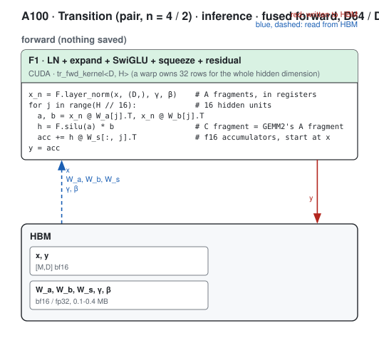

##### F1 · LN + expand + SwiGLU + squeeze + residual (tr_fwd_kernel)

| (Length, Dimension) | (128, 64) | (384, 64) | (768, 64) | (128, 128) | (384, 128) | (768, 128) |
|---|---|---|---|---|---|---|
| implementation | CUDA | CUDA | CUDA | CUDA | CUDA | CUDA |
| 성능 확인 | ✗ | ✗ | ✗ | ✗ | ✗ | ✗ |
| cache build | ✓ | ✓ | ✓ | ✓ | ✓ | ✓ |

D = 128 at n = 4 runs the existing `fused_sm80` kernel (same design, 256-row tiles), at n = 2 and D = 64 (n = 2 and 4) the generalised build
(`fused_fwd_sm80.py`: the same kernel templated on (D, H)).

#### Wide path · D256 / D384 (any n), D64 / D128 below the thresholds, every L

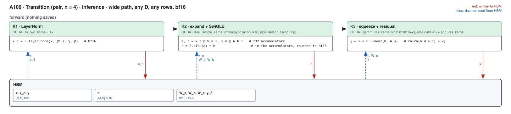

##### K1 · LayerNorm (ln_fwd_kernel)

| (Length, Dimension) | (128, 256) | (384, 256) | (768, 256) | (128, 384) | (384, 384) | (768, 384) |
|---|---|---|---|---|---|---|
| implementation | CUDA | CUDA | CUDA | CUDA | CUDA | CUDA |
| 성능 확인 | ✗ | ✗ | ✗ | ✗ | ✗ | ✗ |
| cache build | ✓ | ✓ | ✓ | ✓ | ✓ | ✓ |

##### K2 · expand + SwiGLU (dual_swiglu_kernel)

| (Length, Dimension) | (128, 256) | (384, 256) | (768, 256) | (128, 384) | (384, 384) | (768, 384) |
|---|---|---|---|---|---|---|
| implementation | CUDA | CUDA | CUDA | CUDA | CUDA | CUDA |
| 성능 확인 | ✗ | ✗ | ✗ | ✗ | ✗ | ✗ |
| cache build | ✓ | ✓ | ✓ | ✓ | ✓ | ✓ |

##### K3 · squeeze + residual (gemm_res_kernel; cuBLAS + add_res_kernel below 8192 rows)

| (Length, Dimension) | (128, 256) | (384, 256) | (768, 256) | (128, 384) | (384, 384) | (768, 384) |
|---|---|---|---|---|---|---|
| implementation | CUDA | CUDA | CUDA | CUDA | CUDA | CUDA |
| 성능 확인 | ✗ | ✗ | ✗ | ✗ | ✗ | ✗ |
| cache build | ✓ | ✓ | ✓ | ✓ | ✓ | ✓ |

### Training

#### Fused forward and backward · D64 / D128, rows ≥ threshold, every L

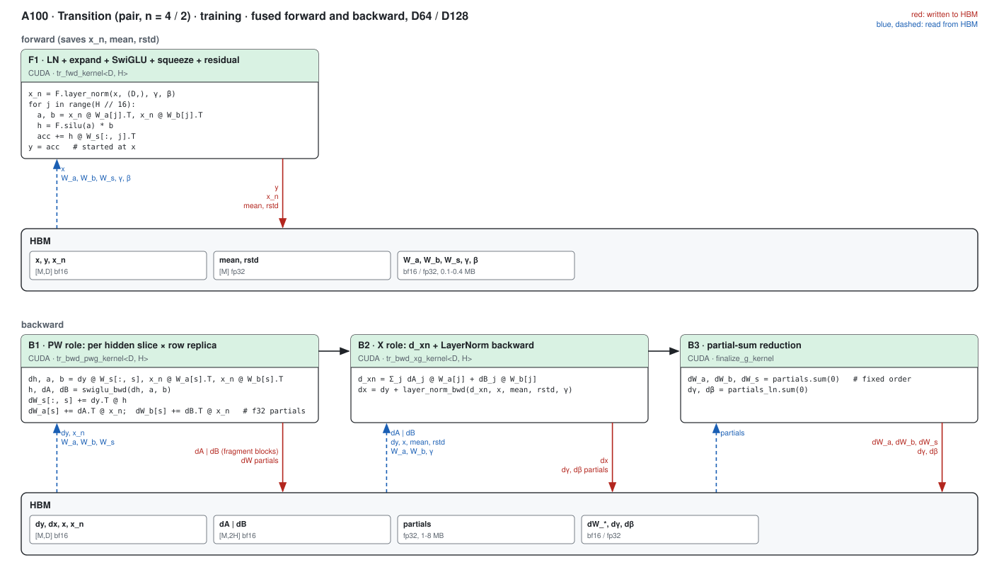

##### F1 · forward, saving x_n and (mean, rstd) (tr_fwd_kernel)

| (Length, Dimension) | (128, 64) | (384, 64) | (768, 64) | (128, 128) | (384, 128) | (768, 128) |
|---|---|---|---|---|---|---|
| implementation | CUDA | CUDA | CUDA | CUDA | CUDA | CUDA |
| 성능 확인 | ✗ | ✗ | ✗ | ✗ | ✗ | ✗ |
| cache build | ✓ | ✓ | ✓ | ✓ | ✓ | ✓ |

##### B1 / B2 / B3 · PW role, X role, partial sums (tr_bwd_pwg_kernel, tr_bwd_xg_kernel, finalize_g_kernel)

| (Length, Dimension) | (128, 64) | (384, 64) | (768, 64) | (128, 128) | (384, 128) | (768, 128) |
|---|---|---|---|---|---|---|
| implementation | CUDA | CUDA | CUDA | CUDA | CUDA | CUDA |
| 성능 확인 | ✗ | ✗ | ✗ | ✗ | ✗ | ✗ |
| cache build | ✓ | ✓ | ✓ | ✓ | ✓ | ✓ |

#### Wide path · D256 / D384 (any n), every L

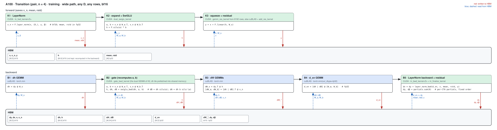

##### K1 / K2 / K3 · forward (as in inference; K1 also writes mean and rstd)

| (Length, Dimension) | (128, 256) | (384, 256) | (768, 256) | (128, 384) | (384, 384) | (768, 384) |
|---|---|---|---|---|---|---|
| implementation | CUDA | CUDA | CUDA | CUDA | CUDA | CUDA |
| 성능 확인 | ✗ | ✗ | ✗ | ✗ | ✗ | ✗ |
| cache build | ✓ | ✓ | ✓ | ✓ | ✓ | ✓ |

##### B2 · gate: recompute a, b, SwiGLU backward (gate_bwd_kernel)

| (Length, Dimension) | (128, 256) | (384, 256) | (768, 256) | (128, 384) | (384, 384) | (768, 384) |
|---|---|---|---|---|---|---|
| implementation | CUDA | CUDA | CUDA | CUDA | CUDA | CUDA |
| 성능 확인 | ✗ | ✗ | ✗ | ✗ | ✗ | ✗ |
| cache build | ✓ | ✓ | ✓ | ✓ | ✓ | ✓ |

##### B5 · LayerNorm backward + residual (ln_bwd_kernel, ln_finalize_kernel)

| (Length, Dimension) | (128, 256) | (384, 256) | (768, 256) | (128, 384) | (384, 384) | (768, 384) |
|---|---|---|---|---|---|---|
| implementation | CUDA | CUDA | CUDA | CUDA | CUDA | CUDA |
| 성능 확인 | ✗ | ✗ | ✗ | ✗ | ✗ | ✗ |
| cache build | ✓ | ✓ | ✓ | ✓ | ✓ | ✓ |

The backward's GEMMs (B1 `dh = dy W_s`, B3 `dW_s`, `[dW_a; dW_b]`, B4 `d_xn`, fp32 output) are cuBLAS: the weight-gradient reductions run over all M rows and
cuBLAS reaches 190-205 TFLOP/s at these shapes; they appear in the figure only.

## Small M (single and MSA streams)

The single stream (128 … 768 rows) and the MSA stream (1024 … 6144 rows) are launch- and latency-bound: the fused kernels' fixed per-tile time (20-55 µs)
leaves most SMs idle below their thresholds, and every kernel of a chain costs 2-8 µs. The forward chain K1 → K2 → K3 takes 11-25 µs at 1-4 k rows
(cuBLAS + `add_res_kernel` for the squeeze: the hand tiles of K3 hold 8-16 CTAs there, cuBLAS splits K), the backward chain 36-90 µs. The dispatch
thresholds are the measured crossovers (CUDA graph, `probes/tiny_graph.py`). Against the Triton path these rows are at parity within the timer's 1 µs resolution
(MSA rows: mean ours / Triton time 1.03 and 1.01 in inference, 1.00 and 1.02 in training at D64 and D128; single rows 0.7-1.0): no registry row is more than 5 % slower
than Triton on average, so none is routed to Triton (the rule applied: a row more than 5 % slower goes to the Triton path, its CUDA kernels staying behind the switches above).

## How the kernels work

- **K1 `ln_fwd_kernel<D>`**: 8 warps per CTA, a row per warp (16-byte chunks spread over the lanes, several rows per warp at D ≤ 128), the two passes (mean, then the
  centred variance) over the row in registers; `x_n = rn(fma((x − mean) · rstd, γ, β))` in bf16, (mean, rstd) in fp32 when training; at the byte floor.
- **K2 `dual_swiglu_kernel`**: the dual-B tile GEMM `[a | b] = x_n [W_a; W_b]ᵀ` on `mma.sync.m16n8k16` (bf16 → fp32): the CTA tile is BM rows × HN hidden units,
  its B tile holds the same HN rows of W_a and of W_b, so each warp owns matching a and b columns and `h = rn(silu(a) · b)` is formed in the accumulators
  (sigmoid by one `tanh.approx`); `h` is staged through the freed pipeline window and stored 16 bytes per lane. Tiles: 128 × (64 + 64), 4 warps of 64 × 64, two
  CTAs per SM above 4096 rows; 64 × (64 + 64) below. All operand copies are `cp.async` through a 4-slice ring, XOR-swizzled so `ldmatrix` and the
  16-byte stores are conflict-free.
  *Mainloop*: the per-thread source pointers are computed once (no predicates on whole tiles; a tail tile runs the generic zero-filling loop), the shared-memory
  offsets are one per-thread term plus immediates, and the ring's barrier sits in the last k step of each slice: the next slice's `cp.async.wait_group`,
  `__syncthreads` and first `ldmatrix` are issued before that step's 32 MMAs, so their latency hides under tensor work instead of idling the pipe at every slice
  boundary (the CUTLASS multistage order; it needs a ring of at least 4 slices to keep two in flight). Measured in one process (CUDA graph, `probes/pipe_cmp.sh`): the
  per-slice barrier at the top of the loop → in the last k step takes the dual GEMM + SwiGLU from 419.7 to 389.8 µs (D256, H1024, 65 k rows), 457.1 → 420.9 µs (D384, 33 k rows),
  59.6 → 51.7 µs (D256, H512, 16 k rows) and the gate backward from 594 to 565 µs; precomputing the source pointers alone changed nothing (the generic loop's ~140 address
  instructions per slice were not the limit: Nsight Compute showed 53.6 % tensor-pipe activity against cuBLAS's 63 % for the same `[a | b]` GEMM). K2 with its SwiGLU epilogue
  runs 3-12 % faster than cuBLAS's plain `[a | b]` GEMM (no epilogue) at the registry shapes (e.g. 870 vs 974 µs at D256 / 147 k rows, 1845 vs 1923 µs at D384).
- **K3 `gemm_res_kernel`**: `y = rn(rn(h W_sᵀ) + x)`, the same mainloop, the residual added on 16-byte vectors after the accumulators are rounded and staged; used from
  8192 rows (128 × 64, 64 × 128 or 128 × 128 tiles by width and rows). Below, cuBLAS `mm` followed by `add_res_kernel` (`y = rn(y + x)` in place).
- **B2 `gate_bwd_kernel`**: K2's GEMM again (`a`, `b` recomputed from `x_n`, which saves storing `[M, 2H]` of activations), with the SwiGLU backward as the epilogue:
  with `s = σ(a)`, `dB = dh · silu(a)`, `dA = dh · b · (s + silu(a)(1 − s))`, `h = silu(a) b`, all rounded to bf16 and stored as `h | dA | dB`; the `dh` tile is prefetched into
  shared memory behind the pipeline window.
- **B5 `ln_bwd_kernel<D>`**: `dx = rstd (g − mean(g) − x̂ mean(g x̂)) + dy` with `g = γ d_xn` (fp32 `d_xn` from cuBLAS), per-CTA dγ / dβ partials in registers and shared
  memory, summed by `ln_finalize_kernel` in a fixed order (no atomics).
- **D64 / D128 fused forward F1** (`sm80/tr_fwd_sm80.cuh`, templated on (D, H)): a warp owns 32 token rows for the whole hidden dimension: `x_n` stays in registers as the
  GEMM1 A fragments; per 16 hidden units `[a | b]` (64 MMAs) → SwiGLU in the C fragments (which are GEMM2's A fragments) → GEMM2 (32 MMAs) into f16 accumulators that start
  at `x`, so the tile ends in a convert-and-store. Weights stream from L2 through a cp.async ring with mbarriers (no CTA barrier); `W_a` is pre-scaled by ½ so
  `silu(a) b = a'b(1 + tanh a')` costs one MUFU.
- **D64 / D128 fused backward** (`sm80/tr_bwd_g_sm80.cuh`, `tr_bwd_sm80.cuh`): **PW**, per hidden slice (SU = 8192 / D units) × row replica: `dh`, `a`, `b` from `x_n` / `dy`, the SwiGLU backward,
  `dW_s | dW_a | dW_b` accumulated in registers over the replica's rows (f32 partials), `dA | dB` handed to **X** as fragment-native blocks; **X**: `d_xn = [dA | dB] [W_a; W_b]`, the
  LayerNorm backward and the residual; **finalize** sums the partials in a fixed order. Every product is computed once (16 M D H in the backward).
- Numerics: every rounding point follows the Triton path (`x_n`, `h`, `dA`, `dB` in bf16, fp32 accumulation, `d_xn` fp32); against the fp32 module every width is at most
  1.1× the bf16 PyTorch module's own error (outputs and all gradients). Reductions run in a fixed order: a replay is bit-identical.

## Measurements (2026-10-04)

A100 80GB PCIe (108 SMs, 300 W limit), torch 2.13 + cu129, nvcc 12.9. `benchmarks/runners/bench.py target=transition level=module` from **one frozen snapshot**
(`snap_1004_015030` of the agent tree; jobs 63076 / 63083 / 63120 / 63156 / 63193 / 63194), bf16, compiled, CUDA-graph replay, **ms** (training: the CUDA-graph regime of a
forward + backward step). PyTorch compiled = `implementation=pytorch`; Triton path = `implementation=triton` with the A100 hand-CUDA switch pinned off
(`MINIWORLD_TRANSITION_FUSED_SM80=0`; the bench does it for the `triton` row); ours = `implementation=miniworld`. × = ours vs PyTorch compiled (there is no cuEquivariance
Transition kernel; Anthropic was not measured on this card: the two values in the first table are quoted from the previous version of this page, its best row `pf`, job 61578, and
only exist where that page measured them). The timer's resolution is 1.0 µs: values below ~40 µs carry ±1 µs, which is the whole difference between ours and the Triton path in the
MSA rows (inference mean 1.03× / 1.01× of Triton's time at D64 / D128, training 1.00× / 1.02×; no row is more than 5 % slower than Triton on average, so none was routed to Triton).
Columns are (Length, Dimension): the pair stream has L² rows, the single stream L, the MSA stream 8 L, the FFN's atom stream A · L (A = 5 inference, 48 training; Length = L).

### Pair stream, n = 4 · Inference

| (Length, Dimension) | PyTorch compiled | cuEquivariance | Anthropic | Triton path | ours | × |
|---|---|---|---|---|---|---|
| (128, 128) | 0.1280 | n/a | — (not measured) | 0.0717 | 0.0604 | 2.12 |
| (256, 128) | 0.4403 | n/a | — (not measured) | 0.2509 | 0.1331 | 3.31 |
| (384, 128) | 0.9615 | n/a | 0.3950 | 0.5458 | 0.2714 | 3.54 |
| (512, 128) | 1.6742 | n/a | — (not measured) | 0.9708 | 0.4782 | 3.50 |
| (640, 128) | 2.6184 | n/a | — (not measured) | 1.5084 | 0.7552 | 3.47 |
| (768, 128) | 3.7806 | n/a | 1.5420 | 2.1955 | 1.1039 | 3.42 |
| (128, 256) | 0.2591 | n/a | — (not measured) | 0.1864 | 0.1659 | 1.56 |
| (256, 256) | 0.9318 | n/a | — (not measured) | 0.7332 | 0.6359 | 1.47 |
| (384, 256) | 2.0910 | n/a | — (not measured) | 1.6686 | 1.4377 | 1.45 |
| (512, 256) | 3.7181 | n/a | — (not measured) | 2.9604 | 2.5615 | 1.45 |
| (640, 256) | 5.8163 | n/a | — (not measured) | 4.7237 | 4.0284 | 1.44 |
| (768, 256) | 8.5504 | n/a | — (not measured) | 6.7077 | 5.8358 | 1.47 |
| (128, 384) | 0.4342 | n/a | — (not measured) | 0.4014 | 0.3308 | 1.31 |
| (256, 384) | 1.7480 | n/a | — (not measured) | 1.5872 | 1.3281 | 1.32 |
| (384, 384) | 3.8574 | n/a | — (not measured) | 3.5937 | 2.9706 | 1.30 |
| (512, 384) | 6.8987 | n/a | — (not measured) | 6.3416 | 5.3084 | 1.30 |
| (640, 384) | 10.7039 | n/a | — (not measured) | 9.8749 | 8.2719 | 1.29 |
| (768, 384) | 15.5617 | n/a | — (not measured) | 14.2039 | 12.0822 | 1.29 |

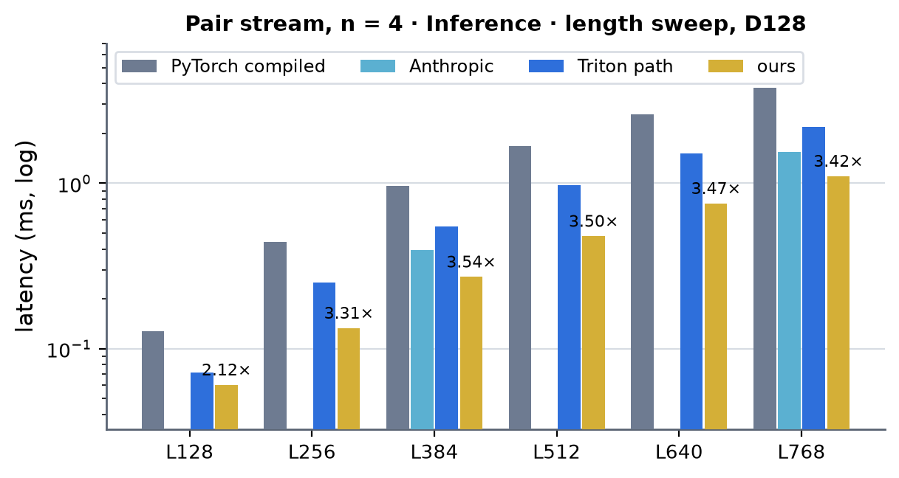 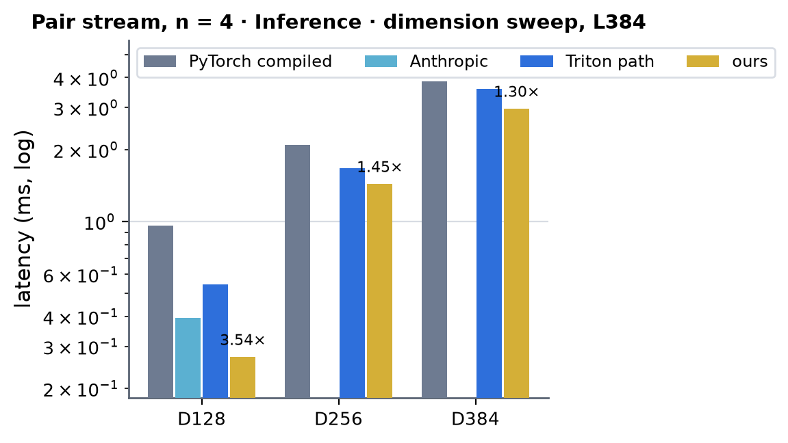 <!-- measure_bars -->

### Pair stream, n = 4 · Training (forward + backward)

| (Length, Dimension) | PyTorch compiled | cuEquivariance | Anthropic | Triton path | ours | × |
|---|---|---|---|---|---|---|
| (128, 128) | 0.3533 | n/a | — (not measured) | 0.2796 | 0.2253 | 1.57 |
| (256, 128) | 1.1653 | n/a | — (not measured) | 0.9595 | 0.6625 | 1.76 |
| (384, 128) | 2.4678 | n/a | — (not measured) | 2.0818 | 1.4172 | 1.74 |
| (512, 128) | 4.2711 | n/a | — (not measured) | 3.6393 | 2.4873 | 1.72 |
| (640, 128) | 6.6130 | n/a | — (not measured) | 5.6443 | 3.8830 | 1.70 |
| (768, 128) | 9.4638 | n/a | — (not measured) | 8.3517 | 5.5465 | 1.71 |
| (128, 256) | 0.7496 | n/a | — (not measured) | 0.7301 | 0.6717 | 1.12 |
| (256, 256) | 2.5508 | n/a | — (not measured) | 2.6317 | 2.4187 | 1.05 |
| (384, 256) | 5.7216 | n/a | — (not measured) | 5.8609 | 5.3463 | 1.07 |
| (512, 256) | 9.8673 | n/a | — (not measured) | 10.3014 | 9.4659 | 1.04 |
| (640, 256) | 15.3492 | n/a | — (not measured) | 16.1244 | 14.7005 | 1.04 |
| (768, 256) | 21.8854 | n/a | — (not measured) | 23.2694 | 21.4277 | 1.02 |
| (128, 384) | 1.2355 | n/a | — (not measured) | 1.3875 | 1.2483 | 0.99 |
| (256, 384) | 4.6822 | n/a | — (not measured) | 5.2480 | 4.7590 | 0.98 |
| (384, 384) | 10.6168 | n/a | — (not measured) | 11.7494 | 10.7540 | 0.99 |
| (512, 384) | 18.5815 | n/a | — (not measured) | 20.9280 | 19.1846 | 0.97 |
| (640, 384) | 29.2485 | n/a | — (not measured) | 32.7977 | 29.8445 | 0.98 |
| (768, 384) | 41.7254 | n/a | — (not measured) | 47.9401 | 42.9210 | 0.97 |

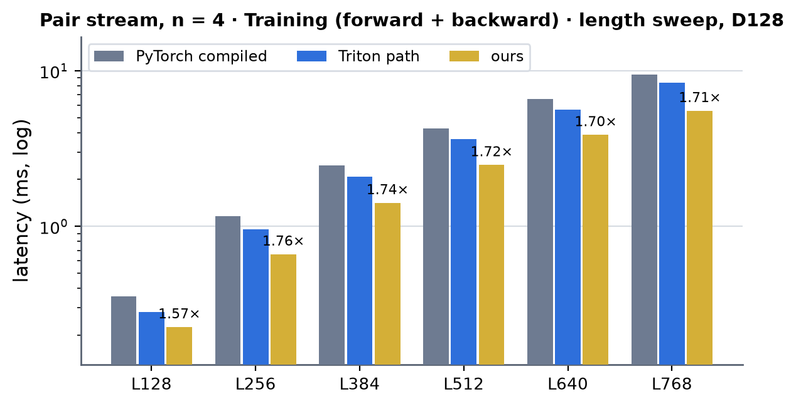 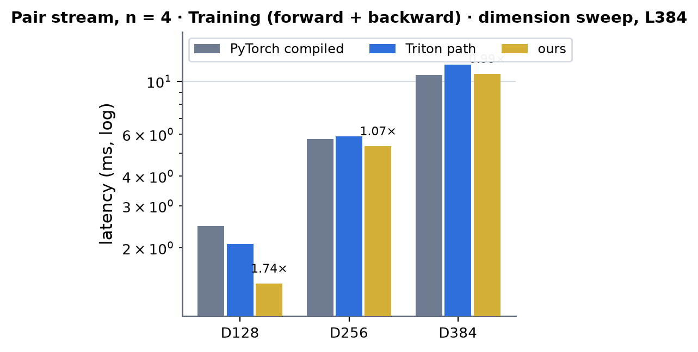 <!-- measure_bars -->

### Pair stream, n = 2 · Inference

| (Length, Dimension) | PyTorch compiled | cuEquivariance | Anthropic | Triton path | ours | × |
|---|---|---|---|---|---|---|
| (128, 64) | 0.0481 | n/a | — (not measured) | 0.0276 | 0.0164 | 2.94 |
| (256, 64) | 0.1290 | n/a | — (not measured) | 0.0666 | 0.0307 | 4.20 |
| (384, 64) | 0.2775 | n/a | — (not measured) | 0.1464 | 0.0573 | 4.84 |
| (512, 64) | 0.4710 | n/a | — (not measured) | 0.2427 | 0.0942 | 5.00 |
| (640, 64) | 0.7096 | n/a | — (not measured) | 0.3676 | 0.1434 | 4.95 |
| (768, 64) | 0.9953 | n/a | — (not measured) | 0.5222 | 0.1997 | 4.98 |
| (128, 128) | 0.0881 | n/a | — (not measured) | 0.0502 | 0.0348 | 2.53 |
| (256, 128) | 0.2529 | n/a | — (not measured) | 0.1556 | 0.0778 | 3.25 |
| (384, 128) | 0.5683 | n/a | — (not measured) | 0.3246 | 0.1536 | 3.70 |
| (512, 128) | 0.9861 | n/a | — (not measured) | 0.5632 | 0.2734 | 3.61 |
| (640, 128) | 1.5283 | n/a | — (not measured) | 0.8929 | 0.4291 | 3.56 |
| (768, 128) | 2.1893 | n/a | — (not measured) | 1.3076 | 0.6216 | 3.52 |
| (128, 256) | 0.1669 | n/a | — (not measured) | 0.1065 | 0.1085 | 1.54 |
| (256, 256) | 0.5458 | n/a | — (not measured) | 0.4014 | 0.3779 | 1.44 |
| (384, 256) | 1.1960 | n/a | — (not measured) | 0.9093 | 0.8387 | 1.43 |
| (512, 256) | 2.1156 | n/a | — (not measured) | 1.6445 | 1.4884 | 1.42 |
| (640, 256) | 3.3162 | n/a | — (not measured) | 2.5948 | 2.3450 | 1.41 |
| (768, 256) | 4.7852 | n/a | — (not measured) | 3.7268 | 3.3894 | 1.41 |

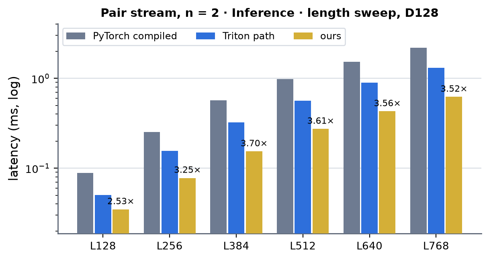 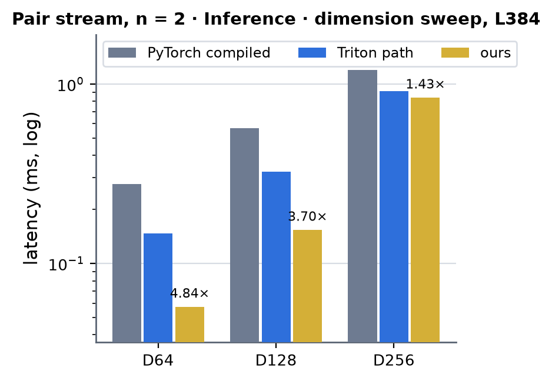 <!-- measure_bars -->

### Pair stream, n = 2 · Training (forward + backward)

| (Length, Dimension) | PyTorch compiled | cuEquivariance | Anthropic | Triton path | ours | × |
|---|---|---|---|---|---|---|
| (128, 64) | 0.1341 | n/a | — (not measured) | 0.0983 | 0.0696 | 1.93 |
| (256, 64) | 0.3809 | n/a | — (not measured) | 0.2734 | 0.1710 | 2.23 |
| (384, 64) | 0.7956 | n/a | — (not measured) | 0.5683 | 0.3123 | 2.55 |
| (512, 64) | 1.2995 | n/a | — (not measured) | 0.9482 | 0.5038 | 2.58 |
| (640, 64) | 1.9569 | n/a | — (not measured) | 1.4387 | 0.7619 | 2.57 |
| (768, 64) | 2.7177 | n/a | — (not measured) | 2.0306 | 1.0675 | 2.55 |
| (128, 128) | 0.2304 | n/a | — (not measured) | 0.1843 | 0.1567 | 1.47 |
| (256, 128) | 0.7265 | n/a | — (not measured) | 0.5719 | 0.3912 | 1.86 |
| (384, 128) | 1.5084 | n/a | — (not measured) | 1.1991 | 0.8161 | 1.85 |
| (512, 128) | 2.5610 | n/a | — (not measured) | 2.0982 | 1.4172 | 1.81 |
| (640, 128) | 3.9291 | n/a | — (not measured) | 3.2215 | 2.1914 | 1.79 |
| (768, 128) | 5.5695 | n/a | — (not measured) | 4.6039 | 3.1483 | 1.77 |
| (128, 256) | 0.4710 | n/a | — (not measured) | 0.4086 | 0.4035 | 1.17 |
| (256, 256) | 1.4899 | n/a | — (not measured) | 1.4500 | 1.3916 | 1.07 |
| (384, 256) | 3.1857 | n/a | — (not measured) | 3.2614 | 3.0751 | 1.04 |
| (512, 256) | 5.5424 | n/a | — (not measured) | 5.7098 | 5.3811 | 1.03 |
| (640, 256) | 8.6600 | n/a | — (not measured) | 8.8392 | 8.3640 | 1.04 |
| (768, 256) | 12.4442 | n/a | — (not measured) | 12.7268 | 12.0243 | 1.03 |

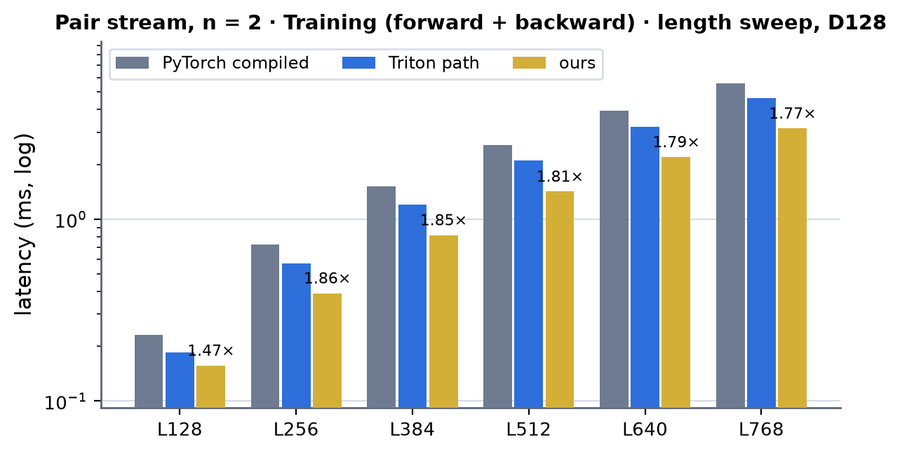 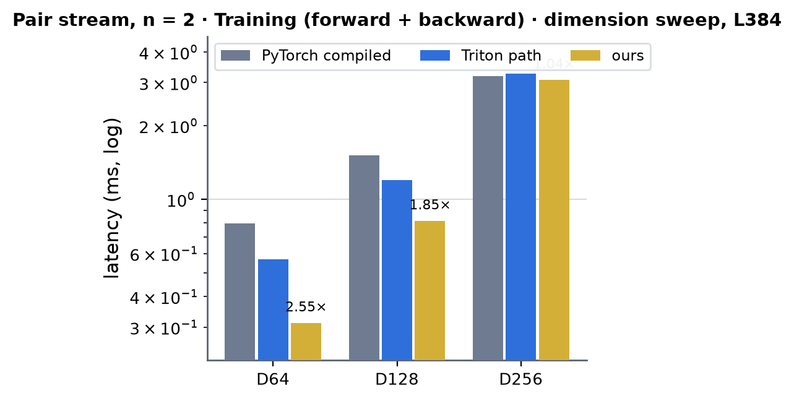 <!-- measure_bars -->

### Single stream, n = 4 · Inference

| (Length, Dimension) | PyTorch compiled | cuEquivariance | Anthropic | Triton path | ours | × |
|---|---|---|---|---|---|---|
| (128, 384) | 0.0307 | n/a | — (not measured) | 0.0307 | 0.0256 | 1.20 |
| (256, 384) | 0.0348 | n/a | — (not measured) | 0.0307 | 0.0276 | 1.26 |
| (384, 384) | 0.0369 | n/a | — (not measured) | 0.0338 | 0.0287 | 1.29 |
| (512, 384) | 0.0389 | n/a | — (not measured) | 0.0348 | 0.0297 | 1.31 |
| (640, 384) | 0.0461 | n/a | — (not measured) | 0.0440 | 0.0338 | 1.36 |
| (768, 384) | 0.0481 | n/a | — (not measured) | 0.0440 | 0.0358 | 1.34 |

### Single stream, n = 4 · Training (forward + backward)

| (Length, Dimension) | PyTorch compiled | cuEquivariance | Anthropic | Triton path | ours | × |
|---|---|---|---|---|---|---|
| (128, 384) | 0.0758 | n/a | — (not measured) | 0.0799 | 0.0717 | 1.06 |
| (256, 384) | 0.0922 | n/a | — (not measured) | 0.0881 | 0.0809 | 1.14 |
| (384, 384) | 0.0993 | n/a | — (not measured) | 0.1024 | 0.0901 | 1.10 |
| (512, 384) | 0.1055 | n/a | — (not measured) | 0.1075 | 0.0952 | 1.11 |
| (640, 384) | 0.1208 | n/a | — (not measured) | 0.1290 | 0.1126 | 1.07 |
| (768, 384) | 0.1280 | n/a | — (not measured) | 0.1321 | 0.1167 | 1.10 |

### Single stream, n = 2 · Inference

| (Length, Dimension) | PyTorch compiled | cuEquivariance | Anthropic | Triton path | ours | × |
|---|---|---|---|---|---|---|
| (128, 384) | 0.0287 | n/a | — (not measured) | 0.0236 | 0.0236 | 1.22 |
| (256, 384) | 0.0297 | n/a | — (not measured) | 0.0246 | 0.0246 | 1.21 |
| (384, 384) | 0.0307 | n/a | — (not measured) | 0.0246 | 0.0246 | 1.25 |
| (512, 384) | 0.0317 | n/a | — (not measured) | 0.0256 | 0.0246 | 1.29 |
| (640, 384) | 0.0338 | n/a | — (not measured) | 0.0328 | 0.0266 | 1.27 |
| (768, 384) | 0.0348 | n/a | — (not measured) | 0.0328 | 0.0276 | 1.26 |
| (128, 768) | 0.0358 | n/a | — (not measured) | 0.0369 | 0.0338 | 1.06 |
| (256, 768) | 0.0410 | n/a | — (not measured) | 0.0369 | 0.0348 | 1.18 |
| (384, 768) | 0.0440 | n/a | — (not measured) | 0.0440 | 0.0369 | 1.19 |
| (512, 768) | 0.0492 | n/a | — (not measured) | 0.0451 | 0.0399 | 1.23 |
| (640, 768) | 0.0604 | n/a | — (not measured) | 0.0686 | 0.0481 | 1.26 |
| (768, 768) | 0.0614 | n/a | — (not measured) | 0.0707 | 0.0492 | 1.25 |

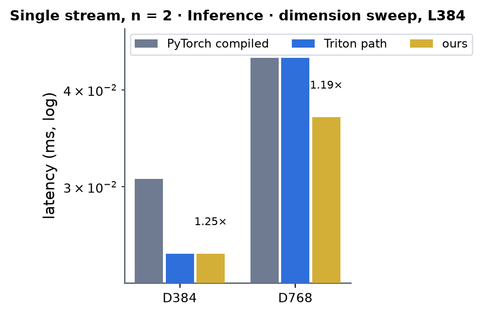 <!-- measure_bars -->

### Single stream, n = 2 · Training (forward + backward)

| (Length, Dimension) | PyTorch compiled | cuEquivariance | Anthropic | Triton path | ours | × |
|---|---|---|---|---|---|---|
| (128, 384) | 0.0696 | n/a | — (not measured) | 0.0686 | 0.0645 | 1.08 |
| (256, 384) | 0.0768 | n/a | — (not measured) | 0.0737 | 0.0686 | 1.12 |
| (384, 384) | 0.0829 | n/a | — (not measured) | 0.0768 | 0.0717 | 1.16 |
| (512, 384) | 0.0870 | n/a | — (not measured) | 0.0799 | 0.0748 | 1.16 |
| (640, 384) | 0.0932 | n/a | — (not measured) | 0.0952 | 0.0840 | 1.11 |
| (768, 384) | 0.0973 | n/a | — (not measured) | 0.0973 | 0.0870 | 1.12 |
| (128, 768) | 0.0911 | n/a | — (not measured) | 0.1106 | 0.0932 | 0.98 |
| (256, 768) | 0.1106 | n/a | — (not measured) | 0.1219 | 0.1044 | 1.06 |
| (384, 768) | 0.1229 | n/a | — (not measured) | 0.1485 | 0.1198 | 1.03 |
| (512, 768) | 0.1393 | n/a | — (not measured) | 0.1597 | 0.1352 | 1.03 |
| (640, 768) | 0.1638 | n/a | — (not measured) | 0.2058 | 0.1638 | 1.00 |
| (768, 768) | 0.1720 | n/a | — (not measured) | 0.2140 | 0.1720 | 1.00 |

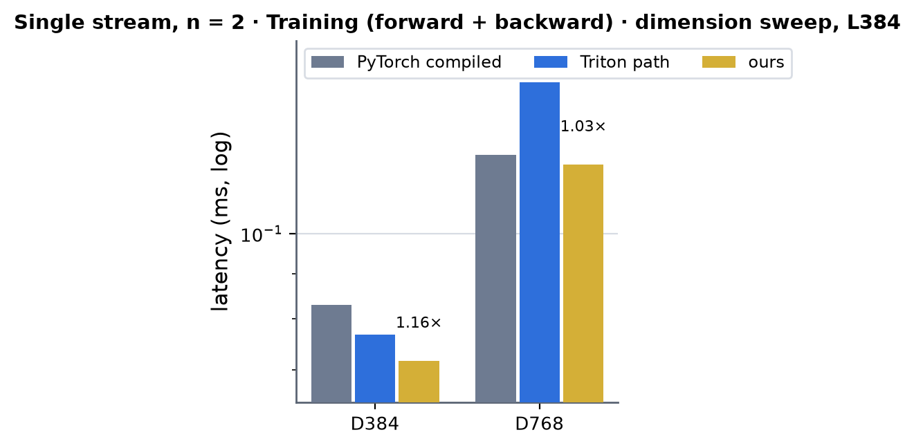 <!-- measure_bars -->

### MSA stream (8 rows), n = 4 · Inference

| (Length, Dimension) | PyTorch compiled | cuEquivariance | Anthropic | Triton path | ours | × |
|---|---|---|---|---|---|---|
| (128, 64) | 0.0236 | n/a | — (not measured) | 0.0164 | 0.0174 | 1.35 |
| (256, 64) | 0.0256 | n/a | — (not measured) | 0.0174 | 0.0184 | 1.39 |
| (384, 64) | 0.0287 | n/a | — (not measured) | 0.0184 | 0.0195 | 1.47 |
| (512, 64) | 0.0317 | n/a | — (not measured) | 0.0205 | 0.0215 | 1.48 |
| (640, 64) | 0.0338 | n/a | — (not measured) | 0.0205 | 0.0215 | 1.57 |
| (768, 64) | 0.0358 | n/a | — (not measured) | 0.0236 | 0.0215 | 1.67 |
| (128, 128) | 0.0287 | n/a | — (not measured) | 0.0215 | 0.0205 | 1.40 |
| (256, 128) | 0.0358 | n/a | — (not measured) | 0.0225 | 0.0246 | 1.46 |
| (384, 128) | 0.0399 | n/a | — (not measured) | 0.0266 | 0.0276 | 1.44 |
| (512, 128) | 0.0492 | n/a | — (not measured) | 0.0307 | 0.0307 | 1.60 |
| (640, 128) | 0.0532 | n/a | — (not measured) | 0.0328 | 0.0328 | 1.62 |
| (768, 128) | 0.0573 | n/a | — (not measured) | 0.0369 | 0.0358 | 1.60 |

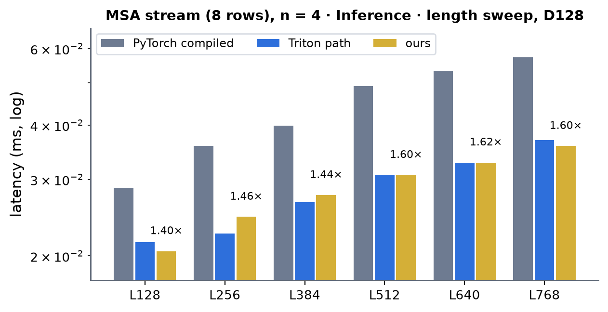 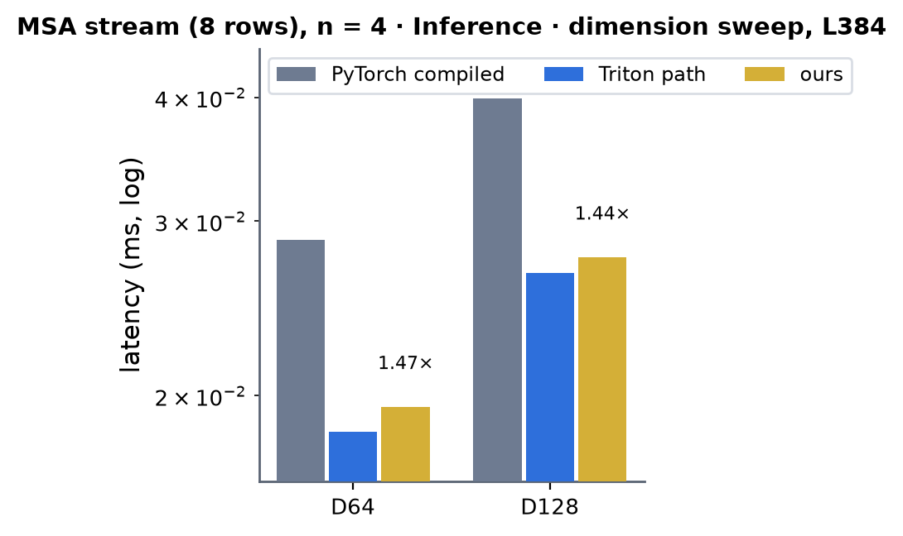 <!-- measure_bars -->

### MSA stream (8 rows), n = 4 · Training (forward + backward)

| (Length, Dimension) | PyTorch compiled | cuEquivariance | Anthropic | Triton path | ours | × |
|---|---|---|---|---|---|---|
| (128, 64) | 0.0686 | n/a | — (not measured) | 0.0512 | 0.0532 | 1.29 |
| (256, 64) | 0.0737 | n/a | — (not measured) | 0.0563 | 0.0594 | 1.24 |
| (384, 64) | 0.0799 | n/a | — (not measured) | 0.0614 | 0.0614 | 1.30 |
| (512, 64) | 0.0870 | n/a | — (not measured) | 0.0645 | 0.0666 | 1.31 |
| (640, 64) | 0.0911 | n/a | — (not measured) | 0.0686 | 0.0686 | 1.33 |
| (768, 64) | 0.0973 | n/a | — (not measured) | 0.0778 | 0.0696 | 1.40 |
| (128, 128) | 0.0819 | n/a | — (not measured) | 0.0666 | 0.0655 | 1.25 |
| (256, 128) | 0.0993 | n/a | — (not measured) | 0.0809 | 0.0840 | 1.18 |
| (384, 128) | 0.1106 | n/a | — (not measured) | 0.0922 | 0.0952 | 1.16 |
| (512, 128) | 0.1311 | n/a | — (not measured) | 0.1065 | 0.1096 | 1.20 |
| (640, 128) | 0.1444 | n/a | — (not measured) | 0.1198 | 0.1219 | 1.18 |
| (768, 128) | 0.1556 | n/a | — (not measured) | 0.1352 | 0.1341 | 1.16 |

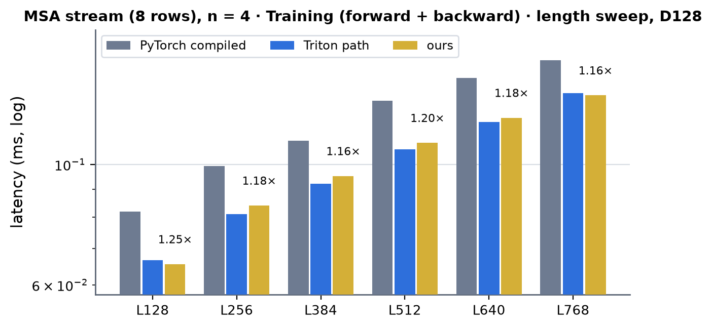 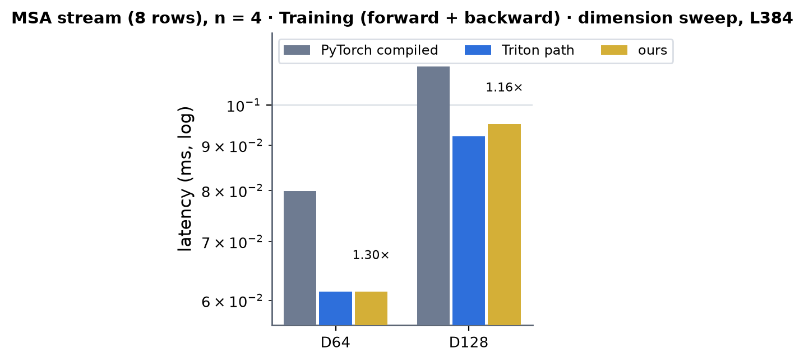 <!-- measure_bars -->

### SwiGLU FFN, pair 128 to 256 and single 384 to 768 · Inference

| (Length, Dimension) | PyTorch compiled | cuEquivariance | Anthropic | Triton path | ours | × |
|---|---|---|---|---|---|---|
| (128, 128) | 0.0748 | n/a | — (not measured) | 0.0430 | 0.0358 | 2.09 |
| (256, 128) | 0.2202 | n/a | — (not measured) | 0.1260 | 0.0840 | 2.62 |
| (384, 128) | 0.4557 | n/a | — (not measured) | 0.2478 | 0.1659 | 2.75 |
| (512, 128) | 0.7834 | n/a | — (not measured) | 0.4280 | 0.2826 | 2.77 |
| (640, 128) | 1.2206 | n/a | — (not measured) | 0.6605 | 0.4465 | 2.73 |
| (768, 128) | 1.7449 | n/a | — (not measured) | 0.9595 | 0.6451 | 2.70 |
| (128, 384) | 0.0246 | n/a | — (not measured) | 0.0184 | 0.0184 | 1.33 |
| (256, 384) | 0.0246 | n/a | — (not measured) | 0.0184 | 0.0184 | 1.33 |
| (384, 384) | 0.0256 | n/a | — (not measured) | 0.0195 | 0.0184 | 1.39 |
| (512, 384) | 0.0266 | n/a | — (not measured) | 0.0195 | 0.0184 | 1.44 |
| (640, 384) | 0.0287 | n/a | — (not measured) | 0.0225 | 0.0205 | 1.40 |
| (768, 384) | 0.0287 | n/a | — (not measured) | 0.0236 | 0.0205 | 1.40 |

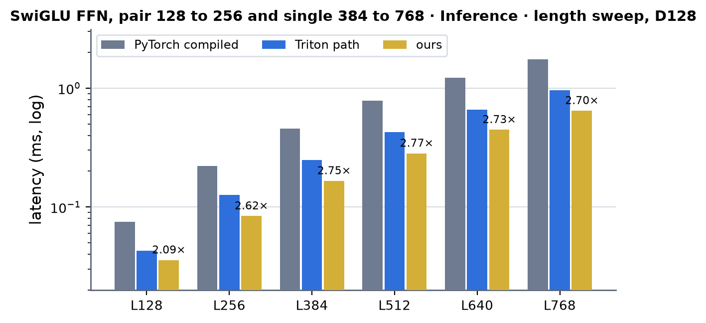 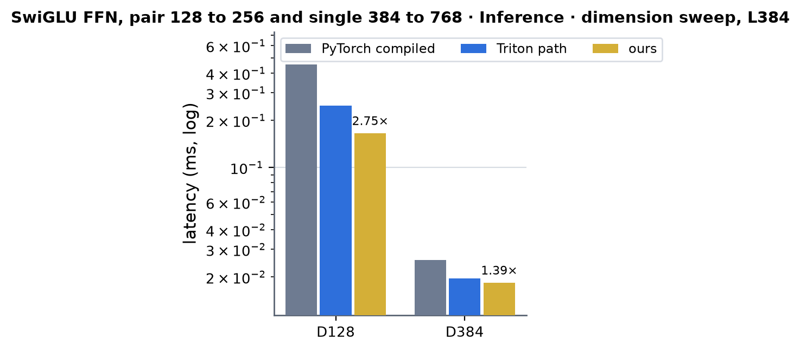 <!-- measure_bars -->

### SwiGLU FFN, pair 128 to 256 and single 384 to 768 · Training (forward + backward)

| (Length, Dimension) | PyTorch compiled | cuEquivariance | Anthropic | Triton path | ours | × |
|---|---|---|---|---|---|---|
| (128, 128) | 0.1925 | n/a | — (not measured) | 0.1618 | 0.1341 | 1.44 |
| (256, 128) | 0.6257 | n/a | — (not measured) | 0.4844 | 0.3441 | 1.82 |
| (384, 128) | 1.3066 | n/a | — (not measured) | 1.0240 | 0.7188 | 1.82 |
| (512, 128) | 2.2298 | n/a | — (not measured) | 1.7572 | 1.2390 | 1.80 |
| (640, 128) | 3.4150 | n/a | — (not measured) | 2.7249 | 1.9333 | 1.77 |
| (768, 128) | 4.8568 | n/a | — (not measured) | 3.9199 | 2.7648 | 1.76 |
| (128, 384) | 0.0604 | n/a | — (not measured) | 0.0543 | 0.0522 | 1.16 |
| (256, 384) | 0.0645 | n/a | — (not measured) | 0.0584 | 0.0553 | 1.17 |
| (384, 384) | 0.0686 | n/a | — (not measured) | 0.0604 | 0.0584 | 1.18 |
| (512, 384) | 0.0717 | n/a | — (not measured) | 0.0625 | 0.0604 | 1.19 |
| (640, 384) | 0.0768 | n/a | — (not measured) | 0.0727 | 0.0676 | 1.14 |
| (768, 384) | 0.0809 | n/a | — (not measured) | 0.0758 | 0.0696 | 1.16 |

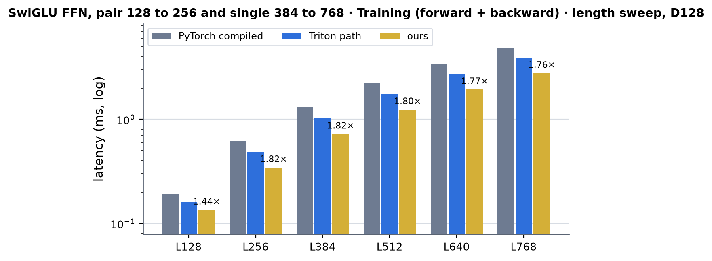 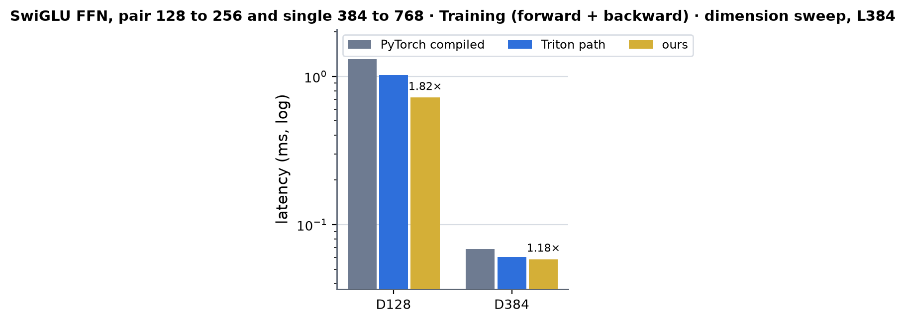 <!-- measure_bars -->

### SwiGLU FFN, atom stream 128 to 256 · Inference

| (Length, Dimension) | PyTorch compiled | cuEquivariance | Anthropic | Triton path | ours | × |
|---|---|---|---|---|---|---|
| (1024, 128) | 0.0338 | n/a | — (not measured) | 0.0215 | 0.0195 | 1.74 |
| (2048, 128) | 0.0492 | n/a | — (not measured) | 0.0307 | 0.0338 | 1.45 |
| (3072, 128) | 0.0737 | n/a | — (not measured) | 0.0389 | 0.0358 | 2.06 |
| (4096, 128) | 0.0799 | n/a | — (not measured) | 0.0471 | 0.0369 | 2.17 |
| (5120, 128) | 0.0891 | n/a | — (not measured) | 0.0532 | 0.0379 | 2.35 |
| (6144, 128) | 0.1188 | n/a | — (not measured) | 0.0707 | 0.0512 | 2.32 |
| (7168, 128) | 0.1260 | n/a | — (not measured) | 0.0778 | 0.0522 | 2.41 |
| (8192, 128) | 0.1341 | n/a | — (not measured) | 0.0778 | 0.0543 | 2.47 |

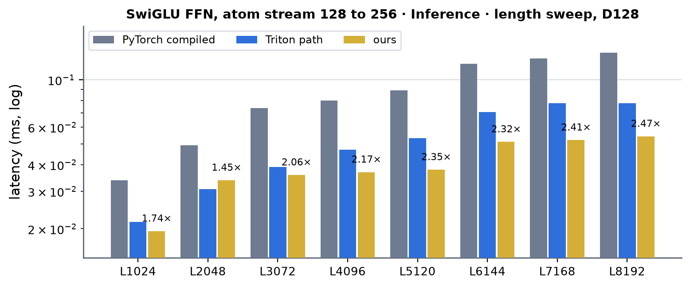 <!-- measure_bars -->

### SwiGLU FFN, atom stream 128 to 256 · Training (forward + backward)

| (Length, Dimension) | PyTorch compiled | cuEquivariance | Anthropic | Triton path | ours | × |
|---|---|---|---|---|---|---|
| (1024, 128) | 0.4818 | n/a | — (not measured) | 0.3671 | 0.2714 | 1.78 |
| (2048, 128) | 0.9226 | n/a | — (not measured) | 0.7035 | 0.5038 | 1.83 |
| (3072, 128) | 1.3046 | n/a | — (not measured) | 1.0214 | 0.7188 | 1.81 |
| (4096, 128) | 1.7157 | n/a | — (not measured) | 1.3450 | 0.9503 | 1.81 |
| (5120, 128) | 2.1120 | n/a | — (not measured) | 1.6671 | 1.1756 | 1.80 |
| (6144, 128) | 2.5016 | n/a | — (not measured) | 1.9661 | 1.3957 | 1.79 |
| (7168, 128) | 2.8826 | n/a | — (not measured) | 2.2948 | 1.6179 | 1.78 |
| (8192, 128) | 3.2850 | n/a | — (not measured) | 2.6030 | 1.8391 | 1.79 |

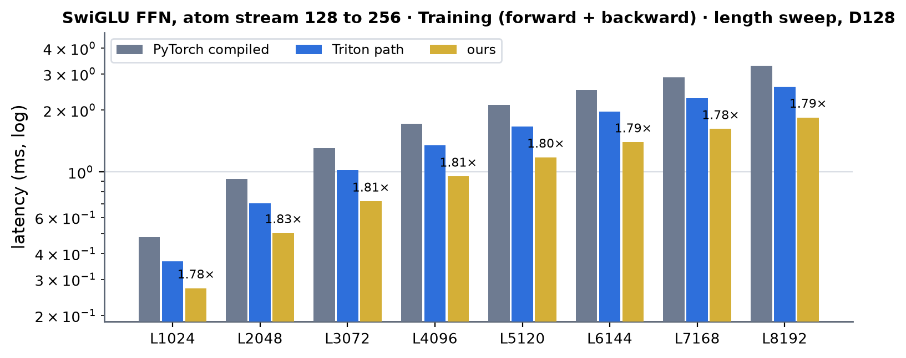 <!-- measure_bars -->

The D128 / n = 4 pair rows run the existing `fused_sm80` kernels (the Anthropic values are from the previous version of this page: best row `pf`, B = 1, job 61578). Single and MSA
rows are launch-bound: a chain of 4-11 launches of 2-8 µs against Triton's 2-5. `graph=disabled` (compiled, no CUDA graph) training numbers are in the job logs; they are host-bound
for the single and MSA rows (ours 0.5-0.9 ms against Triton's 1.2-1.4 ms and PyTorch compiled's 0.45-0.72 ms).

## Kernel-level targets

The six kernel-level bench targets of the GEMM-epilogue family each gained an explicit A100 hand-CUDA row (`benchmarks/runners/bench.py`; the `triton_*` rows stay pure Triton):
`transition_cuda` (`transition_b2b`, `transition_b2b_bwd`: the engine's `ops.transition` dispatch above, forward and backward), `layernorm_linear_cuda` (`gemm_epilogue`,
`gemm_epilogue_bwd`: LayerNorm kernel + the tile GEMM; backward: cuBLAS `d_xn`, LayerNorm backward kernel, cuBLAS `dW`) and `dual_gemm_gate_cuda` (`dual_gemm_epilogue`,
`dual_gemm_epilogue_bwd`: the dual-B GEMM with the `a σ(b)` epilogue once per side; backward: the gate kernel's twin, then cuBLAS), both from
`kernels/transition/cuda/gemm_epilogue_sm80.py` (tests: `tests/integrations/test_a100_gemm_epilogue_gpu.py`). Graph-timed, `[1, L, L, d_pair]` bf16, L = 384, ms
(2026-10-04, jobs 62958 / 62988, snapshot `snap_1004_010450`; the length sweeps at d_pair 128 are in the job logs):

| target | d_pair | PyTorch | Triton row | CUDA row | CUDA vs Triton |
|---|---|---|---|---|---|
| `transition_b2b` (`triton_transition_fused` / `transition_cuda`) | 128 / 256 / 512 | 0.960 / 2.098 / 6.174 | 0.396 / 6.424 / 40.39 | **0.277 / 1.436 / 4.868** | 1.43× / 4.5× / 8.3× |
| `transition_b2b_bwd` | 128 / 256 / 512 | 2.896 / 6.176 / 15.35 | 1.736 / 4.913 / 15.95 | **1.121 / 3.958 / 12.92** | 1.55× / 1.24× / 1.23× |
| `dual_gemm_epilogue` (`triton_tm1` / `dual_gemm_gate_cuda`) | 128 / 256 / 512 | 0.532 / 0.978 / 2.724 | 0.155 / 0.500 / 1.894 | 0.172 / **0.448 / 1.574** | 0.90× / 1.12× / 1.20× |
| `dual_gemm_epilogue_bwd` (`front_bwd_fused`) | 128 / 256 / 512 | 1.973 / 4.361 / 12.12 | **0.510 / 1.193 / 3.593** | 0.643 / 1.529 / 4.976 | 0.79× / 0.78× / 0.72× |
| `gemm_epilogue` (`layernorm_linear_triton` / `layernorm_linear_cuda`) | 128 / 256 / 512 | 0.122 / 0.217 / 0.576 | **0.069 / 0.186** / 0.840 | 0.121 / 0.229 / **0.595** | 0.57× / 0.81× / 1.41× |
| `gemm_epilogue_bwd` (`layernorm_linear_te`) | 128 / 256 / 512 | 0.448 / 0.637 / 1.418 | **0.232** / 0.561 / 1.472 | 0.276 / **0.500 / 1.221** | 0.84× / 1.12× / 1.21× |

Defaults: `transition_b2b` and `transition_b2b_bwd` are the engine's own dispatch, CUDA on an A100 (`transition_cuda` is that default; `triton_transition_fused` is the pinned Triton arm).
The other four CUDA rows are **building blocks assembled from the Transition's kernels, not fused single-pass kernels**: at d_pair 128 the Triton kernels are faster
(the CUDA rows pay a second HBM pass over `x_n`, the dual front launches twice), at 512 the CUDA rows win three of the four (two at 256). The modules that call those Triton kernels
(TriMul front, LN-linear) keep their dispatch; fused CUDA ports of them belong to the TriMul and LN-linear workers, so the A100 default of these four targets stays Triton where the
CUDA row is slower (measured, not flipped).

## Speed of light

Floor = max(FLOP / 240 TFLOP/s, bytes / 1.6 TB/s) (the sustained dense-bf16 rate of this 300 W card, HBM peak): forward 6 M D H FLOP, a training step 3× that; bytes: the activations in
and out (+ the saved and gradient traffic of a step) and the weights. L = 384, CUDA graph, the frozen snapshot of the Measurements section:

| row | mode | rows M | ours (µs) | compute floor (µs) | byte floor (µs) | SoL % | bound |
|---|---|---|---|---|---|---|---|
| pair D128 n4 | inference | 147456 | 271.4 | 241.6 | 47.4 | 89 | compute |
| pair D256 n4 | inference | 147456 | 1437.7 | 966.4 | 95.4 | 67 | compute |
| pair D384 n4 | inference | 147456 | 2970.6 | 2174.3 | 143.8 | 73 | compute |
| pair D128 n4 | training | 147456 | 1417.2 | 724.8 | 118.7 | 51 | compute |
| pair D256 n4 | training | 147456 | 5346.3 | 2899.1 | 238.9 | 54 | compute |
| pair D384 n4 | training | 147456 | 10754.0 | 6523.0 | 360.5 | 61 | compute |
| pair D64 n2 | inference | 147456 | 57.3 | 30.2 | 23.6 | 53 | compute |
| pair D128 n2 | inference | 147456 | 153.6 | 120.8 | 47.3 | 79 | compute |
| pair D256 n2 | inference | 147456 | 838.7 | 483.2 | 94.9 | 58 | compute |
| pair D64 n2 | training | 147456 | 312.3 | 90.6 | 59.1 | 29 | compute |
| pair D128 n2 | training | 147456 | 816.1 | 362.4 | 118.3 | 44 | compute |
| pair D256 n2 | training | 147456 | 3075.1 | 1449.6 | 237.4 | 47 | compute |
| single D384 n4 | inference | 384 | 28.7 | 5.7 | 2.6 | 20 | compute |
| single D384 n4 | training | 384 | 90.1 | 17.0 | 7.6 | 19 | compute |
| single D384 n2 | inference | 384 | 24.6 | 2.8 | 1.5 | 12 | compute |
| single D768 n2 | inference | 384 | 36.9 | 11.3 | 5.2 | 31 | compute |
| single D384 n2 | training | 384 | 71.7 | 8.5 | 4.2 | 12 | compute |
| single D768 n2 | training | 384 | 119.8 | 34.0 | 15.1 | 28 | compute |
| MSA D64 n4 | inference | 3072 | 19.5 | 1.3 | 0.6 | 6 | compute |
| MSA D128 n4 | inference | 3072 | 27.6 | 5.0 | 1.2 | 18 | compute |
| MSA D64 n4 | training | 3072 | 61.4 | 3.8 | 1.4 | 6 | compute |
| MSA D128 n4 | training | 3072 | 95.2 | 15.1 | 3.2 | 16 | compute |
| FFN pair D128 (128 → 256) | inference | 147456 | 165.9 | 120.8 | 23.7 | 73 | compute |
| FFN single D384 (384 → 768) | inference | 384 | 18.4 | 2.8 | 1.3 | 15 | compute |
| FFN pair D128 (128 → 256) | training | 147456 | 718.8 | 362.4 | 47.6 | 50 | compute |
| FFN single D384 (384 → 768) | training | 384 | 58.4 | 8.5 | 3.7 | 15 | compute |

The wide path's GEMMs run at 160-190 TFLOP/s sustained (the dual GEMM + SwiGLU 177-187 TFLOP/s at D256 / D384, cuBLAS's plain GEMM of the same shapes 157-181), so D256 / D384
inference sits at 66-73 % of the compute floor and the D384 training step (which recomputes `a`, `b`: 22 instead of 18 M D H units) at 61 %; D128 inference at 89 % is the
fused kernel's (same value as the previous version of this page). Single and MSA rows are 5-40 µs launch-latency problems: their floors are 1-5 µs.

## Where the time goes

CUDA-graph stage timings in isolation, µs, L = 384 (`probes/tiny_graph.py`, job 63179); the module rows above are within 1-3 % of these sums.

Forward (inference), K1 LayerNorm, K2 expand + SwiGLU, K3 squeeze + residual (hand `gemm_res_kernel` from 8192 rows, else cuBLAS `mm` + `add_res_kernel`), the chain as launched, and the one-kernel F1:

| row (rows M) | K1 | K2 | K3 | chain | F1 (training: saving) | served by | module (Measurements) |
|---|---|---|---|---|---|---|---|
| pair D128 n4 (147456) | 55.0 | 283.7 | 180.2 | 523.9 | 277.0 (308.0) | `fused_sm80` | 271.4 |
| pair D256 n4 (147456) | 101.5 | 873.2 | 477.2 | 1451.9 | - | chain | 1437.7 |
| pair D384 n4 (147456) | 152.1 | 1845.0 | 958.0 | 2952.1 | - | chain | 2970.6 |
| pair D64 n2 (147456) | 25.6 | 56.3 | 60.4 | 136.4 | 55.1 (64.4) | F1 | 57.3 |
| pair D128 n2 (147456) | 56.0 | 142.1 | 121.6 | 320.5 | 161.6 (191.4) | F1 | 153.6 |
| pair D256 n2 (147456) | 100.5 | 450.5 | 313.6 | 860.3 | - | chain | 838.7 |
| single D384 n4 (384) | 2.7 | 9.6 | 11.1 | 23.2 | - | chain | 28.7 |
| single D384 n2 (384) | 2.6 | 6.1 | 8.5 | 17.2 | - | chain | 24.6 |
| single D768 n2 (384) | 3.0 | 15.3 | 12.2 | 30.5 | - | chain | 36.9 |
| MSA D64 n4 (3072) | 2.3 | 5.1 | 6.6 | 14.0 | 16.9 (19.7) | chain | 19.5 |
| MSA D128 n4 (3072) | 2.8 | 10.7 | 9.2 | 22.7 | 47.6 (55.4) | chain | 27.6 |

Backward (training), `dh = dy W_s`, B2 gate, `dW_s`, `[dW_a; dW_b]`, `d_xn` (fp32) are cuBLAS / the gate kernel, B5 the LayerNorm backward + its finalize; the chain as launched, the fused PW + X + finalize:

| row (rows M) | dh | B2 gate | dW_s | dW_ab | d_xn | B5 | chain | fused | served by |
|---|---|---|---|---|---|---|---|---|---|
| pair D128 n4 (147456) | 212.2 | 473.0 | 126.4 | 230.7 | 257.4 | 176.5 | 1142.2 | 1136.6 | `fused_sm80` |
| pair D256 n4 (147456) | 482.5 | 1285.0 | 435.9 | 768.7 | 805.8 | 324.6 | 4063.2 | - | chain |
| pair D384 n4 (147456) | 973.1 | 2408.3 | 858.2 | 1577.3 | 1645.2 | 473.3 | 7932.0 | - | chain |
| pair D64 n2 (147456) | 54.1 | 118.4 | 45.5 | 67.2 | 75.7 | 88.4 | 249.9 | 250.2 | fused |
| pair D128 n2 (147456) | 115.3 | 244.7 | 88.4 | 127.0 | 150.5 | 175.9 | 646.7 | 641.9 | fused |
| pair D256 n2 (147456) | 249.5 | 640.3 | 198.5 | 458.2 | 452.0 | 326.9 | 2296.2 | - | chain |
| single D384 n4 (384) | 8.8 | 13.5 | 8.3 | 13.6 | 13.4 | 9.0 | 62.7 | - | chain |
| single D384 n2 (384) | 6.0 | 7.4 | 6.0 | 7.4 | 9.4 | 8.1 | 47.3 | - | chain |
| single D768 n2 (384) | 9.3 | 18.0 | 10.4 | 15.2 | 16.3 | 9.3 | 82.8 | - | chain |
| MSA D64 n4 (3072) | 4.5 | 6.2 | 6.7 | 7.8 | 6.2 | 7.7 | 41.4 | 41.2 | fused (from 2048 rows) |
| MSA D128 n4 (3072) | 7.6 | 13.4 | 9.1 | 11.8 | 10.5 | 9.6 | 65.2 | 62.9 | chain (fused from 8192 rows) |

At D256 / D384, 45-46 % of a training step is the four cuBLAS GEMMs of the backward (2-4 M D H FLOP each at 190-205 TFLOP/s), 22-23 % the gate kernel (the recompute of `a`, `b` and
its three output streams `h`, `dA`, `dB`), 27 % the forward (K1 + K2 + K3), and 4-6 % the LayerNorm backward (the fp32 `d_xn` read); K1, B5 and the elementwise part of K2 / K3 are at their byte floors.

## What was tried and did not pay

- **Hand squeeze everywhere (generic pointer arithmetic)**: before the lean mainloop the hand GEMM ran at 140-155 TFLOP/s against cuBLAS's 190-205 at D ≥ 256, so the squeeze was cuBLAS +
  `add_res_kernel` (an extra pass over the output: 70-210 µs at 147 k rows). With the lean pipelined loop the hand kernel with the folded residual is 6-20 % faster than that pair from
  8192 rows on, and cuBLAS stays below (K-split wins at 1-5 k rows).
- **Pointer precomputation without the schedule change**: ~1 % (see K2); **BK = 64** tiles (128 × 64, and 8-warp 128 × (128 + 128)): 10-40 % slower (one CTA per SM, a 3-slice ring);
  **8-warp CTAs** (128 or 256 rows): 10-25 % slower than 4 warps × 2 CTAs per SM; **a 5-slice ring** (80 KB, still two CTAs): looked 3-9 % faster at 16 k rows in single measurements and lost
  every one of 9 shapes in an interleaved A/B (7 rounds: the dual kernel by 0.4-13 %, the gate kernel by 14-25 %). The extra tile configs stay in the binding (`dual_swiglu(cfg=6..11)`,
  `gemm_res(cfg=5..10)`; `probes/dual_cfgs.py` sweeps them), unused by the dispatch.
- **Saving `a | b` in the training forward to skip the recompute**: the extra 2 M H bf16 write + read costs about what the 4 M D H FLOP recompute costs at D384 (est. gain ≤ 6 %) and nothing at D256; not built.
- **Fusing `dh = dy W_s` into the gate kernel** (a third accumulator, two A streams): saves one write + read of `dh` (≈ 4 % of the D384 step); not built.
- **LayerNorm in the dual kernel's A prologue at small M** (one launch fewer, est. 3.5 µs of 20-25 µs): needs the row statistics before the first k slice and a bit-exact re-rounding
  of `x_n` in the fragments; not built. **Split-K / hidden-split fused kernels for the single and MSA streams**: the chain's launches are 2-8 µs each; not built.
- **`torch.addmm(residual, h, W_sᵀ)` for the folded residual**: PyTorch copies the residual into the output first and cuBLAS reads it again: the same traffic as `add_res_kernel`.
- **Triton path at tiny M**: parity within the timer's 1 µs resolution at the MSA rows (inference 0.95-1.09×, see the Measurements); no row was routed to Triton.

## Reproduce

`benchmarks/runners/bench.py target=transition level=module mode=inference|training implementations=[pytorch,triton,miniworld] cudagraph=manual d_pair=D +transition_n=N
+transition_stream=pair|single|msa|atom [+transition_ffn=true] min_seq_len=128 max_seq_len=768 seq_len_step=128` (the `triton` row pins `MINIWORLD_TRANSITION_FUSED_SM80=0`);
kernel targets: `level=kernel target=<name> implementations=[pytorch,<triton row>,<cuda row>] sweep_axis=seq_len|d_pair`. Jobs and scripts of this page: `probes/campaign.sh`,
`probes/kernels.sh`, `probes/profile_rows.sh`, `probes/dual_cfgs.py`, `probes/pipe_cmp.sh`, `probes/squeeze_probe.py` (agent scratch tree).
