# TriangleAttention on A100 (sm80)

Kernel-level status of `TriangleAttention` (`use_self_attention=True`) on A100 at every registered width, and of the `projected_attention` token_pair leaf (the same attention core behind
`ops.augmented_attention_pair_bias`); the module-level summary is in [a100.md](../a100.md). bf16 only; columns are (Length, Dimension) with Dimension = d_pair. A100 = CUDA for every registered
geometry: d_pair 64 (hidden 64 with 4 heads of 16 or 2 heads of 32, hidden 128 with 4 heads of 32), 128 (4 × 32), 256 (8 × 32) and 384 (12 × 32), inference and training, starting and ending node, L a multiple of 128
(any B). Other L, fp32 activations, the bias-only variant, `BidirectionalTriangleAttention` and QK-norm run the Triton path unchanged. Figures: one box per kernel, left to right, HBM reads (blue, left) and writes (red, right);
generated from `figures/triattn.json` (D128) and `figures/triattn_widths.json` (the other widths and the leaf) by `python -m miniworld_engine.viz.kernel_flow` and embedded as SVG (`cairosvg` and `rsvg-convert` are not
installed on cssb, so there is no PNG).

Dispatch: `integrations/triattn_sm80.py`, called in `TriangleAttention.forward` after the B200 paths (`serves_module` / `forward` in inference, `serves_train` / `forward_train` with autograd); the leaf is hooked at the top of
`kernels/augmented_attention/whole_op.py` (`sm80_projected.serves`). Kernels: `kernels/triangle_attention/cuda/sm80.py` (the d_pair-128 path: build, ops, autograd function) and `sm80/` (`mma.sync`, `ldmatrix`, `cp.async`):
`f1_sm80.cuh` (front), `attn_fwd_sm80.cuh` (attention core), `f3_sm80.cuh` (back), `b3_sm80.cuh` (gate backward), `attn_bwd_dkv_sm80.cuh` / `attn_bwd_dq_sm80.cuh` (attention backward), `b1_sm80.cuh` (projection dgrad + LayerNorm
backward), `wgrad_sm80.cuh`, `sm80_common.cuh` (PTX helpers); `sm80_wide.py` (every other width: the geometry gate `cfg_for`, packing, the two opaque ops and the autograd function) with `fused_sm80.cuh` (the narrow engine),
`rows_sm80.cuh` (the row engine) and `rows_ops.cu` (their extension); `sm80_core2.py` with `attn2_fwd_sm80.cuh`, `attn2_bwd_sm80.cuh`, `attn2_ops.cu` (the generalised core: head dim 16 or 32, strided operands, per-row key mask);
`sm80_projected.py` (the leaf).

Four paths, picked by the module's geometry (`integrations/triattn_sm80._kind`):

| geometry (d_pair, hidden, heads × head dim) | front / back | attention core |
|---|---|---|
| (128, 128, 4 × 32) | **fused d128**: persistent kernels, weights resident in shared memory (`sm80.py`) | `attn_*_sm80.cuh`, head dim 32 |
| (64, 128, 4 × 32), (64, 64, 2 × 32) (and d_pair 128 with 2 or 4 heads) | **fused narrow**: the same kernels with the widths as template parameters (`fused_sm80.cuh`) | `attn_*_sm80.cuh`, head dim 32 |
| (64, 64, 4 × 16) | fused narrow, 16-channel heads kept as they are (no zero padding) | `attn2_*_sm80.cuh`, head dim 16 |
| (256, 256, 8 × 32), (384, 384, 12 × 32), d_pair 512 (16 × 32), any multiple of 64 up to 512 with 1-16 heads of 16 or 32 channels | **rows**: hand-CUDA row kernels around cuBLAS GEMMs (`rows_sm80.cuh`) | `attn_*_sm80.cuh`, head dim 32, the sigmoid gate fused into the forward epilogue |
| `projected_attention` token_pair: q / k / v `[A = L, B, H, L, D]`, bias `[B, H, L, L]`, per-row key mask | the op's operands are read in place, no projections (`sm80_projected.py`) | `attn2_*_sm80.cuh`, head dim 16 or 32 |

Served when all of these hold, otherwise the module runs its Triton path unchanged:

- the module's backend is TRITON (`implementation=miniworld`, or an explicit `triton`), `module._sm80_cuda` is True (the default; False keeps the Triton kernels, e.g. as a benchmark baseline), `MINIWORLD_TRIATTN_SM80` is not `0`
  and `settings.engine_backend != "triton"`;
- `d_pair` a multiple of 64 in 64 .. 512, `n_head` 1 .. 16 with a head dim of 16 or 32 (`d_hidden = n_head × head dim`), no QK-norm, self-attention;
- `pair` is a bf16 contiguous CUDA tensor `[B, L, L, d_pair]` with L a multiple of 128 (any B), `mask` is None or bool `[B, L]`; the four q / k / v / g weights and the output projection are bf16, the bias weight bf16 `[n_head, d_pair]`, the LayerNorm
  affine bf16 or fp32 (gradients come back in the parameters' dtypes);
- compute capability (8, 0);
- training: gradients wanted by the pair tensor or a parameter; the module's broadcast dropout (`_make_drop_scale`, row-broadcast for the starting node, column-broadcast for the ending node) is applied inside the output kernel and its
  backward. Inference with dropout active (a module in `train()` mode under `no_grad`) keeps the Triton path. The attention backward's bf16 bias-gradient partials (one `[B H, L, L]` plane per four pair rows: cubic in L, 0.9 GB at L768
  with 4 heads, 2.7 GB with 12) must fit 16 GiB, else the Triton path serves the training step.

`MINIWORLD_TRIATTN_SM80_ROWS=1` makes the row engine take the narrow widths too and `MINIWORLD_TRIATTN_SM80_WIDE=1` makes the generic path take d_pair 128 (A/B runs; the tests use them). L not a multiple of 128 falls back to Triton:
padding the pair stack to the next multiple would cost up to 2.4x the work at L129 and the registered lengths are all multiples of 128.

Starting and ending node both run it: the ending node's kernels read and write the transposed positions of the module's tensors (no transposing copies). Masked keys get `finfo(bf16).min` as in the PyTorch module; a query whose keys are all masked
gets a zero output.

**Data flow (the design that made it fast).** The three forward stages are memory streams around the attention core. Each is a persistent kernel (one CTA per SM, a warp walks tiles of 32 or 16 tokens on its own, no CTA barrier after the start) with the weights
resident in shared memory (130 KiB for the front, 32 KiB for the back at d_pair 128), the tokens going from global memory straight into the A fragments of `mma.sync`, and two permutations that cost nothing: the k order of the products (a thread's two k
steps of 16 hold 8 consecutive channels: 16-byte loads) and the n order (the packed weight rows are laid out so that a thread's accumulators are 8 consecutive output channels: 16-byte stores). The LayerNorm affine is folded into the front's bf16 weights
(`W' = bf16(W diag γ)`, shift `b = W β` in fp32); the statistics are a quad shuffle on the registers. A first version of the front (a 128-token CTA tile staged through shared memory with a streamed weight ring) took 417 µs at L384 and was slower than
the unfused LayerNorm + five cuBLAS GEMMs (357 µs); this layout takes 178 µs.

**The narrow widths** (d_pair 64 / 128, 2 or 4 heads) run these kernels with the widths as template parameters (`FusedCfg<D_in, D_hidden, warps, CTAs per SM, head dim>`; the weights of d_pair 64 / hidden 64 are 34 KiB, of d_pair 128 / hidden 128 the 130 KiB above), the
weight pack and the training packs (`fused_pack_kernel`, `fused_bwd_pack_kernel`) and the same permutations. A 16-channel head is a 32-wide head with zero channels in the packed weights (as the B200 path does) except at d_pair 64 with 4 heads, where the
core, the front and the back are instantiated for the real 16 channels: half the q / k / v / g bytes written by the front and read by the core, half the tile bytes and one k step of the score product instead of two (`attn2_*_sm80.cuh`; the core kernels 11-28 %
faster than the padded ones, the module 23-25 % at L768).

**The wide widths** (d_pair 256 and up, whose weights are 528 KiB at d_pair 256) cannot keep the weights resident; the front is a cuBLAS GEMM between two hand-CUDA row kernels. `ln_rows_kernel` writes the normalised input `xh` `[T, D + 8]` (two constant
columns carry the folded LayerNorm shift `b = W β` as two bf16 terms, so one GEMM against `[W diag γ | b_hi | b_lo]` gives q | k | v | g and the bias heads with the shift in fp32 accuracy), `bias_planes_kernel` extracts the bias heads into head planes
(masked keys = bf16 min), the attention core's epilogue writes `bf16(sigmoid(g) · o)` straight into the output projection's operand (the gate loads are issued before the epilogue's stores: after them the volatile stores serialised the loads and the kernel
was 9 % slower), a second GEMM projects, and `out_rows_kernel` applies the dropout scale and the residual (at the transposed positions for the ending node). The two row kernels run at the byte floors of their streams (96-100 % at d_pair 256, L384); the GEMMs run at 130-150 TFLOP/s
(K = 264 and 256, N = 1032 / 256, M = L²). Any width that is a multiple of 64 up to 512 with 1-16 heads of 16 or 32 channels passes the gate; the registered widths and d_pair 512 are tested.

**Training** is one autograd function over two opaque ops on every path (forward and backward each a node under `torch.compile`; CUDA-graph capturable, no host syncs). The forward saves the normalised input (plus the constant columns the weight
gradients read), the statistics, the front's output, the bias, the attention output and the log-sum-exp. The backward is the gate / out-projection backward (`dy`, the gate's gradients and the attention backward's row term Δ), the attention backward (the key
side `dk dv`, the query side `dq` and the bias gradient: the sum over the L pair rows of dS, from bf16 partials of groups of four rows and a fixed-order reduction), the projection dgrad + LayerNorm backward + residual, and the weight gradients
(`G = Dᵀ [x̂ | 1 | 0]` and `dW_o = dyᵀ a` as two GEMMs over the L² tokens, one finalizer kernel that folds the LayerNorm scale and shift in). Parameter gradients come back in the parameters' dtypes; the sums over tokens are bitwise reproducible (no atomics).

**The attention core's generalisation** (`attn2_*_sm80.cuh`): the head dim (16 or 32) is a template parameter (the shared-memory swizzle of a 32- or 64-byte row, one or two k steps of the score product, two or four n tiles of the output), the operands are read through
element strides (a token-major projection output and a head-major `[A, B, H, L, D]` tensor alike) and an optional per-pair-row key mask is applied: the mask bytes of a CTA's rows are turned into one bit word per 32 keys by warp ballots (while the first pipeline
stages are in flight) and each (row, key tile) reads one word; a tile without a masked key (the usual case) skips the masking arithmetic, a branch the whole CTA takes alike (two straight-line copies of the sub-step: the unmasked one is the code of a kernel without
a mask). The arithmetic and the schedules are those of the d_pair-128 core; at head dim 32 and without a mask the generalised forward is bit-identical to it.

**The `projected_attention` leaf** (`ops.augmented_attention_pair_bias` at the registry's inputs: q / k / v `[A = L, 1, H, L, D]`, bias `[1, H, L, L]`, an all-True key mask `[A, 1, L]`): the triangle rows are independent streams sharing one pair bias, which is the
core's problem with the pair rows as the streams. `sm80_projected.py` reads q / k / v in place (any strides with a unit channel stride and 16-byte granules: the model's token-major projection outputs viewed head-major need no copy; the output and the gradients
keep the layout of the operands), runs the core with the per-row mask, and the backward is one row-term kernel (`attn2_delta_kernel`: Δ = Σ_d o · dout) and the core's backward; the bias gradient is the sum over the A pair rows. Gate: bf16, A == L (a multiple of 128 up to
8192), head dim 16 or 32, a bf16 bias `[B, H, L, L]`, a bool mask `[A, B, L]` if any, `kernel_type="compute_efficient"`; every other call keeps the Triton path.

Tests: `tests/numerics/test_triattn_sm80_gpu.py` (the d128 kernels: the core, the front, the back and every backward kernel no further from the fp32 reference than the bf16 PyTorch statements, with and without a key mask and dropout, batches, both nodes; replays
bit-identical; the whole module's output and all nine gradients no further from the fp32 module than the Triton path; `torch.compile` matches eager in inference and training), `tests/integrations/test_a100_triattn_widths_gpu.py` (every registered geometry plus the
d_pair-128 geometry through the generic path: inference and training, starting and ending node, masks, B = 2, LayerNorm affine in bf16 / fp32, dropout, fully masked keys, both engines at d_pair 64, `torch.compile` equal to eager, CUDA-graph capture and replay of an
inference call and of a training step, an optimizer step seen by the next call, the env switches, the gate and its training-memory guard; d_pair 512 inference and training), `tests/integrations/test_a100_projected_gpu.py` (the leaf: five geometries × masks (none, all-True, random with a fully masked row and a masked key tile) × L,
forward and every gradient against the fp32 reference as well as the Triton path, batches, token-major views, unaligned views, the bias as a permuted view, bit-identity of the all-True mask with no mask, compile, CUDA graphs, the gate and the env switch) and
`tests/integrations/test_a100_triattn_gate.py` (the geometry and gate predicates, runs without a GPU).

## Starting / ending node · d_pair 128, 4 heads × 32

### Inference

#### Fused path · D128, every L = 128k

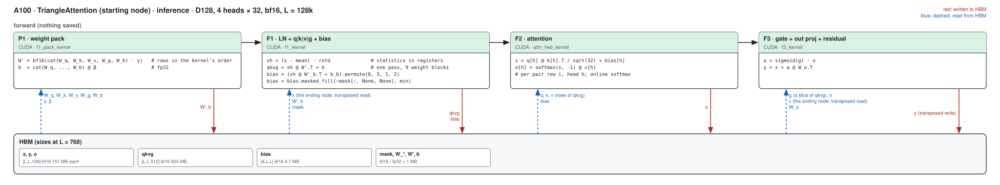

##### P1 · weight pack (f1_pack_kernel)

| (Length, Dimension) | (128, 128) | (256, 128) | (384, 128) | (512, 128) | (640, 128) | (768, 128) |
|---|---|---|---|---|---|---|
| implementation | CUDA | CUDA | CUDA | CUDA | CUDA | CUDA |
| 성능 확인 | ✗ | ✗ | ✗ | ✗ | ✗ | ✗ |
| cache build | ✓ | ✓ | ✓ | ✓ | ✓ | ✓ |

##### F1 · LN + q|k|v|g + bias (f1_kernel)

| (Length, Dimension) | (128, 128) | (256, 128) | (384, 128) | (512, 128) | (640, 128) | (768, 128) |
|---|---|---|---|---|---|---|
| implementation | CUDA | CUDA | CUDA | CUDA | CUDA | CUDA |
| 성능 확인 | ✗ | ✗ | ✗ | ✗ | ✗ | ✗ |
| cache build | ✓ | ✓ | ✓ | ✓ | ✓ | ✓ |

##### F2 · attention (attn_fwd_kernel)

| (Length, Dimension) | (128, 128) | (256, 128) | (384, 128) | (512, 128) | (640, 128) | (768, 128) |
|---|---|---|---|---|---|---|
| implementation | CUDA | CUDA | CUDA | CUDA | CUDA | CUDA |
| 성능 확인 | ✗ | ✗ | ✗ | ✗ | ✗ | ✗ |
| cache build | ✓ | ✓ | ✓ | ✓ | ✓ | ✓ |

##### F3 · gate + out proj + residual (f3_kernel)

| (Length, Dimension) | (128, 128) | (256, 128) | (384, 128) | (512, 128) | (640, 128) | (768, 128) |
|---|---|---|---|---|---|---|
| implementation | CUDA | CUDA | CUDA | CUDA | CUDA | CUDA |
| 성능 확인 | ✗ | ✗ | ✗ | ✗ | ✗ | ✗ |
| cache build | ✓ | ✓ | ✓ | ✓ | ✓ | ✓ |

### Training

#### Fused path · D128, every L = 128k

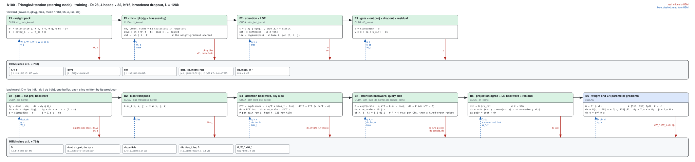

##### P1 · weight pack (f1_pack_kernel)

| (Length, Dimension) | (128, 128) | (256, 128) | (384, 128) | (512, 128) | (640, 128) | (768, 128) |
|---|---|---|---|---|---|---|
| implementation | CUDA | CUDA | CUDA | CUDA | CUDA | CUDA |
| 성능 확인 | ✗ | ✗ | ✗ | ✗ | ✗ | ✗ |
| cache build | ✓ | ✓ | ✓ | ✓ | ✓ | ✓ |

##### F1 · LN + q|k|v|g + bias, saving x̂ and the statistics (f1_kernel)

| (Length, Dimension) | (128, 128) | (256, 128) | (384, 128) | (512, 128) | (640, 128) | (768, 128) |
|---|---|---|---|---|---|---|
| implementation | CUDA | CUDA | CUDA | CUDA | CUDA | CUDA |
| 성능 확인 | ✗ | ✗ | ✗ | ✗ | ✗ | ✗ |
| cache build | ✓ | ✓ | ✓ | ✓ | ✓ | ✓ |

##### F2 · attention + LSE (attn_fwd_kernel)

| (Length, Dimension) | (128, 128) | (256, 128) | (384, 128) | (512, 128) | (640, 128) | (768, 128) |
|---|---|---|---|---|---|---|
| implementation | CUDA | CUDA | CUDA | CUDA | CUDA | CUDA |
| 성능 확인 | ✗ | ✗ | ✗ | ✗ | ✗ | ✗ |
| cache build | ✓ | ✓ | ✓ | ✓ | ✓ | ✓ |

##### F3 · gate + out proj + dropout + residual (f3_kernel)

| (Length, Dimension) | (128, 128) | (256, 128) | (384, 128) | (512, 128) | (640, 128) | (768, 128) |
|---|---|---|---|---|---|---|
| implementation | CUDA | CUDA | CUDA | CUDA | CUDA | CUDA |
| 성능 확인 | ✗ | ✗ | ✗ | ✗ | ✗ | ✗ |
| cache build | ✓ | ✓ | ✓ | ✓ | ✓ | ✓ |

##### B1 · gate + out-projection backward (b3_kernel)

| (Length, Dimension) | (128, 128) | (256, 128) | (384, 128) | (512, 128) | (640, 128) | (768, 128) |
|---|---|---|---|---|---|---|
| implementation | CUDA | CUDA | CUDA | CUDA | CUDA | CUDA |
| 성능 확인 | ✗ | ✗ | ✗ | ✗ | ✗ | ✗ |
| cache build | ✓ | ✓ | ✓ | ✓ | ✓ | ✓ |

##### B2 · bias transpose (bias_transpose_kernel)

| (Length, Dimension) | (128, 128) | (256, 128) | (384, 128) | (512, 128) | (640, 128) | (768, 128) |
|---|---|---|---|---|---|---|
| implementation | CUDA | CUDA | CUDA | CUDA | CUDA | CUDA |
| 성능 확인 | ✗ | ✗ | ✗ | ✗ | ✗ | ✗ |
| cache build | ✓ | ✓ | ✓ | ✓ | ✓ | ✓ |

##### B3 · attention backward, key side: dK, dV (attn_bwd_dkv_kernel)

| (Length, Dimension) | (128, 128) | (256, 128) | (384, 128) | (512, 128) | (640, 128) | (768, 128) |
|---|---|---|---|---|---|---|
| implementation | CUDA | CUDA | CUDA | CUDA | CUDA | CUDA |
| 성능 확인 | ✗ | ✗ | ✗ | ✗ | ✗ | ✗ |
| cache build | ✓ | ✓ | ✓ | ✓ | ✓ | ✓ |

##### B4 · attention backward, query side: dQ, dbias partials (attn_bwd_dq_kernel) and their reduction (db_reduce_kernel)

| (Length, Dimension) | (128, 128) | (256, 128) | (384, 128) | (512, 128) | (640, 128) | (768, 128) |
|---|---|---|---|---|---|---|
| implementation | CUDA | CUDA | CUDA | CUDA | CUDA | CUDA |
| 성능 확인 | ✗ | ✗ | ✗ | ✗ | ✗ | ✗ |
| cache build | ✓ | ✓ | ✓ | ✓ | ✓ | ✓ |

##### B5 · projection dgrad + LayerNorm backward + residual (b1_kernel)

| (Length, Dimension) | (128, 128) | (256, 128) | (384, 128) | (512, 128) | (640, 128) | (768, 128) |
|---|---|---|---|---|---|---|
| implementation | CUDA | CUDA | CUDA | CUDA | CUDA | CUDA |
| 성능 확인 | ✗ | ✗ | ✗ | ✗ | ✗ | ✗ |
| cache build | ✓ | ✓ | ✓ | ✓ | ✓ | ✓ |

##### B6 · weight and LayerNorm-parameter gradients (cuBLAS)

| (Length, Dimension) | (128, 128) | (256, 128) | (384, 128) | (512, 128) | (640, 128) | (768, 128) |
|---|---|---|---|---|---|---|
| implementation | cuBLAS | cuBLAS | cuBLAS | cuBLAS | cuBLAS | cuBLAS |
| 성능 확인 | ✗ | ✗ | ✗ | ✗ | ✗ | ✗ |
| cache build | ✓ | ✓ | ✓ | ✓ | ✓ | ✓ |

## Other widths · fused path · d_pair 64 (hidden 64 / 128, 2 or 4 heads), and d_pair 128 with 2 or 4 heads

The d128 kernels with the widths as template parameters (see above); the tables are for the registered d_pair 64. The attention core is `attn_fwd_kernel` / `attn_bwd_*_kernel` at head dim 32 and `attn2_*_kernel` at the native 16-channel heads (d_pair 64, hidden 64, 4 heads).

### Inference

#### Fused path · D64, every L = 128k

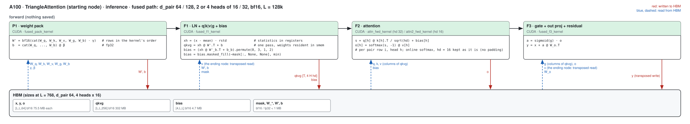

##### P1 · weight pack (fused_pack_kernel)

| (Length, Dimension) | (128, 64) | (256, 64) | (384, 64) | (512, 64) | (640, 64) | (768, 64) |
|---|---|---|---|---|---|---|
| implementation | CUDA | CUDA | CUDA | CUDA | CUDA | CUDA |
| 성능 확인 | ✗ | ✗ | ✗ | ✗ | ✗ | ✗ |
| cache build | ✓ | ✓ | ✓ | ✓ | ✓ | ✓ |

##### F1 · LN + q|k|v|g + bias (fused_f1_kernel)

| (Length, Dimension) | (128, 64) | (256, 64) | (384, 64) | (512, 64) | (640, 64) | (768, 64) |
|---|---|---|---|---|---|---|
| implementation | CUDA | CUDA | CUDA | CUDA | CUDA | CUDA |
| 성능 확인 | ✗ | ✗ | ✗ | ✗ | ✗ | ✗ |
| cache build | ✓ | ✓ | ✓ | ✓ | ✓ | ✓ |

##### F2 · attention (attn_fwd_kernel; attn2_fwd_kernel at 4 heads × 16)

| (Length, Dimension) | (128, 64) | (256, 64) | (384, 64) | (512, 64) | (640, 64) | (768, 64) |
|---|---|---|---|---|---|---|
| implementation | CUDA | CUDA | CUDA | CUDA | CUDA | CUDA |
| 성능 확인 | ✗ | ✗ | ✗ | ✗ | ✗ | ✗ |
| cache build | ✓ | ✓ | ✓ | ✓ | ✓ | ✓ |

##### F3 · gate + out proj + residual (fused_f3_kernel)

| (Length, Dimension) | (128, 64) | (256, 64) | (384, 64) | (512, 64) | (640, 64) | (768, 64) |
|---|---|---|---|---|---|---|
| implementation | CUDA | CUDA | CUDA | CUDA | CUDA | CUDA |
| 성능 확인 | ✗ | ✗ | ✗ | ✗ | ✗ | ✗ |
| cache build | ✓ | ✓ | ✓ | ✓ | ✓ | ✓ |

### Training

#### Fused path · D64, every L = 128k

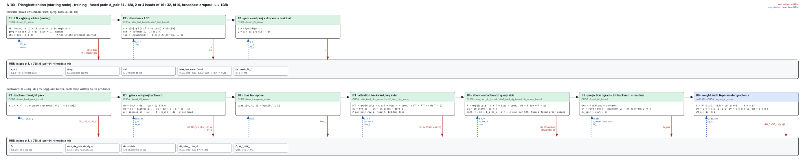

##### P1 · weight pack (fused_pack_kernel)

| (Length, Dimension) | (128, 64) | (256, 64) | (384, 64) | (512, 64) | (640, 64) | (768, 64) |
|---|---|---|---|---|---|---|
| implementation | CUDA | CUDA | CUDA | CUDA | CUDA | CUDA |
| 성능 확인 | ✗ | ✗ | ✗ | ✗ | ✗ | ✗ |
| cache build | ✓ | ✓ | ✓ | ✓ | ✓ | ✓ |

##### P2 · backward weight pack (fused_bwd_pack_kernel)

| (Length, Dimension) | (128, 64) | (256, 64) | (384, 64) | (512, 64) | (640, 64) | (768, 64) |
|---|---|---|---|---|---|---|
| implementation | CUDA | CUDA | CUDA | CUDA | CUDA | CUDA |
| 성능 확인 | ✗ | ✗ | ✗ | ✗ | ✗ | ✗ |
| cache build | ✓ | ✓ | ✓ | ✓ | ✓ | ✓ |

##### F1 · LN + q|k|v|g + bias, saving x̂ and the statistics (fused_f1_kernel)

| (Length, Dimension) | (128, 64) | (256, 64) | (384, 64) | (512, 64) | (640, 64) | (768, 64) |
|---|---|---|---|---|---|---|
| implementation | CUDA | CUDA | CUDA | CUDA | CUDA | CUDA |
| 성능 확인 | ✗ | ✗ | ✗ | ✗ | ✗ | ✗ |
| cache build | ✓ | ✓ | ✓ | ✓ | ✓ | ✓ |

##### F2 · attention + LSE (attn_fwd_kernel; attn2_fwd_kernel at 4 heads × 16)

| (Length, Dimension) | (128, 64) | (256, 64) | (384, 64) | (512, 64) | (640, 64) | (768, 64) |
|---|---|---|---|---|---|---|
| implementation | CUDA | CUDA | CUDA | CUDA | CUDA | CUDA |
| 성능 확인 | ✗ | ✗ | ✗ | ✗ | ✗ | ✗ |
| cache build | ✓ | ✓ | ✓ | ✓ | ✓ | ✓ |

##### F3 · gate + out proj + dropout + residual (fused_f3_kernel)

| (Length, Dimension) | (128, 64) | (256, 64) | (384, 64) | (512, 64) | (640, 64) | (768, 64) |
|---|---|---|---|---|---|---|
| implementation | CUDA | CUDA | CUDA | CUDA | CUDA | CUDA |
| 성능 확인 | ✗ | ✗ | ✗ | ✗ | ✗ | ✗ |
| cache build | ✓ | ✓ | ✓ | ✓ | ✓ | ✓ |

##### B1 · gate + out-projection backward (fused_b3_kernel)

| (Length, Dimension) | (128, 64) | (256, 64) | (384, 64) | (512, 64) | (640, 64) | (768, 64) |
|---|---|---|---|---|---|---|
| implementation | CUDA | CUDA | CUDA | CUDA | CUDA | CUDA |
| 성능 확인 | ✗ | ✗ | ✗ | ✗ | ✗ | ✗ |
| cache build | ✓ | ✓ | ✓ | ✓ | ✓ | ✓ |

##### B2 · bias transpose (bias_transpose_kernel)

| (Length, Dimension) | (128, 64) | (256, 64) | (384, 64) | (512, 64) | (640, 64) | (768, 64) |
|---|---|---|---|---|---|---|
| implementation | CUDA | CUDA | CUDA | CUDA | CUDA | CUDA |
| 성능 확인 | ✗ | ✗ | ✗ | ✗ | ✗ | ✗ |
| cache build | ✓ | ✓ | ✓ | ✓ | ✓ | ✓ |

##### B3 · attention backward, key side: dK, dV (attn_bwd_dkv_kernel; attn2_bwd_dkv_kernel)

| (Length, Dimension) | (128, 64) | (256, 64) | (384, 64) | (512, 64) | (640, 64) | (768, 64) |
|---|---|---|---|---|---|---|
| implementation | CUDA | CUDA | CUDA | CUDA | CUDA | CUDA |
| 성능 확인 | ✗ | ✗ | ✗ | ✗ | ✗ | ✗ |
| cache build | ✓ | ✓ | ✓ | ✓ | ✓ | ✓ |

##### B4 · attention backward, query side: dQ, dbias partials (attn_bwd_dq_kernel; attn2_bwd_dq_kernel) and their reduction (db_reduce_kernel)

| (Length, Dimension) | (128, 64) | (256, 64) | (384, 64) | (512, 64) | (640, 64) | (768, 64) |
|---|---|---|---|---|---|---|
| implementation | CUDA | CUDA | CUDA | CUDA | CUDA | CUDA |
| 성능 확인 | ✗ | ✗ | ✗ | ✗ | ✗ | ✗ |
| cache build | ✓ | ✓ | ✓ | ✓ | ✓ | ✓ |

##### B5 · projection dgrad + LayerNorm backward + residual (fused_b1_kernel)

| (Length, Dimension) | (128, 64) | (256, 64) | (384, 64) | (512, 64) | (640, 64) | (768, 64) |
|---|---|---|---|---|---|---|
| implementation | CUDA | CUDA | CUDA | CUDA | CUDA | CUDA |
| 성능 확인 | ✗ | ✗ | ✗ | ✗ | ✗ | ✗ |
| cache build | ✓ | ✓ | ✓ | ✓ | ✓ | ✓ |

##### B6 · weight and LayerNorm-parameter gradients (cuBLAS, wgrad_w_kernel)

| (Length, Dimension) | (128, 64) | (256, 64) | (384, 64) | (512, 64) | (640, 64) | (768, 64) |
|---|---|---|---|---|---|---|
| implementation | cuBLAS | cuBLAS | cuBLAS | cuBLAS | cuBLAS | cuBLAS |
| 성능 확인 | ✗ | ✗ | ✗ | ✗ | ✗ | ✗ |
| cache build | ✓ | ✓ | ✓ | ✓ | ✓ | ✓ |

## Other widths · row-kernel path · d_pair 256 (8 × 32) and 384 (12 × 32)

Hand-CUDA row kernels around cuBLAS GEMMs (see above); the same kernels serve d_pair 512 (16 × 32), which is not a registry row.

### Inference

#### Row-kernel path · D256, D384, every L = 128k

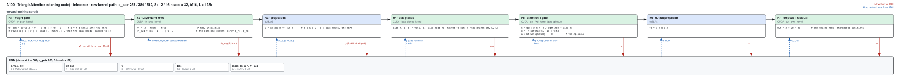

##### R1 · weight pack (w_pack_kernel)

| (Length, Dimension) | (128, 256) | (256, 256) | (384, 256) | (512, 256) | (640, 256) | (768, 256) | (128, 384) | (256, 384) | (384, 384) | (512, 384) | (640, 384) | (768, 384) |
|---|---|---|---|---|---|---|---|---|---|---|---|---|
| implementation | CUDA | CUDA | CUDA | CUDA | CUDA | CUDA | CUDA | CUDA | CUDA | CUDA | CUDA | CUDA |
| 성능 확인 | ✗ | ✗ | ✗ | ✗ | ✗ | ✗ | ✗ | ✗ | ✗ | ✗ | ✗ | ✗ |
| cache build | ✓ | ✓ | ✓ | ✓ | ✓ | ✓ | ✓ | ✓ | ✓ | ✓ | ✓ | ✓ |

##### R2 · LayerNorm rows (ln_rows_kernel)

| (Length, Dimension) | (128, 256) | (256, 256) | (384, 256) | (512, 256) | (640, 256) | (768, 256) | (128, 384) | (256, 384) | (384, 384) | (512, 384) | (640, 384) | (768, 384) |
|---|---|---|---|---|---|---|---|---|---|---|---|---|
| implementation | CUDA | CUDA | CUDA | CUDA | CUDA | CUDA | CUDA | CUDA | CUDA | CUDA | CUDA | CUDA |
| 성능 확인 | ✗ | ✗ | ✗ | ✗ | ✗ | ✗ | ✗ | ✗ | ✗ | ✗ | ✗ | ✗ |
| cache build | ✓ | ✓ | ✓ | ✓ | ✓ | ✓ | ✓ | ✓ | ✓ | ✓ | ✓ | ✓ |

##### R3 · q|k|v|g + bias projection (cuBLAS)

| (Length, Dimension) | (128, 256) | (256, 256) | (384, 256) | (512, 256) | (640, 256) | (768, 256) | (128, 384) | (256, 384) | (384, 384) | (512, 384) | (640, 384) | (768, 384) |
|---|---|---|---|---|---|---|---|---|---|---|---|---|
| implementation | cuBLAS | cuBLAS | cuBLAS | cuBLAS | cuBLAS | cuBLAS | cuBLAS | cuBLAS | cuBLAS | cuBLAS | cuBLAS | cuBLAS |
| 성능 확인 | ✗ | ✗ | ✗ | ✗ | ✗ | ✗ | ✗ | ✗ | ✗ | ✗ | ✗ | ✗ |
| cache build | ✓ | ✓ | ✓ | ✓ | ✓ | ✓ | ✓ | ✓ | ✓ | ✓ | ✓ | ✓ |

##### R4 · bias planes (bias_planes_kernel)

| (Length, Dimension) | (128, 256) | (256, 256) | (384, 256) | (512, 256) | (640, 256) | (768, 256) | (128, 384) | (256, 384) | (384, 384) | (512, 384) | (640, 384) | (768, 384) |
|---|---|---|---|---|---|---|---|---|---|---|---|---|
| implementation | CUDA | CUDA | CUDA | CUDA | CUDA | CUDA | CUDA | CUDA | CUDA | CUDA | CUDA | CUDA |
| 성능 확인 | ✗ | ✗ | ✗ | ✗ | ✗ | ✗ | ✗ | ✗ | ✗ | ✗ | ✗ | ✗ |
| cache build | ✓ | ✓ | ✓ | ✓ | ✓ | ✓ | ✓ | ✓ | ✓ | ✓ | ✓ | ✓ |

##### R5 · attention + gate (attn_fwd_kernel, gate epilogue)

| (Length, Dimension) | (128, 256) | (256, 256) | (384, 256) | (512, 256) | (640, 256) | (768, 256) | (128, 384) | (256, 384) | (384, 384) | (512, 384) | (640, 384) | (768, 384) |
|---|---|---|---|---|---|---|---|---|---|---|---|---|
| implementation | CUDA | CUDA | CUDA | CUDA | CUDA | CUDA | CUDA | CUDA | CUDA | CUDA | CUDA | CUDA |
| 성능 확인 | ✗ | ✗ | ✗ | ✗ | ✗ | ✗ | ✗ | ✗ | ✗ | ✗ | ✗ | ✗ |
| cache build | ✓ | ✓ | ✓ | ✓ | ✓ | ✓ | ✓ | ✓ | ✓ | ✓ | ✓ | ✓ |

##### R6 · output projection (cuBLAS)

| (Length, Dimension) | (128, 256) | (256, 256) | (384, 256) | (512, 256) | (640, 256) | (768, 256) | (128, 384) | (256, 384) | (384, 384) | (512, 384) | (640, 384) | (768, 384) |
|---|---|---|---|---|---|---|---|---|---|---|---|---|
| implementation | cuBLAS | cuBLAS | cuBLAS | cuBLAS | cuBLAS | cuBLAS | cuBLAS | cuBLAS | cuBLAS | cuBLAS | cuBLAS | cuBLAS |
| 성능 확인 | ✗ | ✗ | ✗ | ✗ | ✗ | ✗ | ✗ | ✗ | ✗ | ✗ | ✗ | ✗ |
| cache build | ✓ | ✓ | ✓ | ✓ | ✓ | ✓ | ✓ | ✓ | ✓ | ✓ | ✓ | ✓ |

##### R7 · dropout + residual (out_rows_kernel)

| (Length, Dimension) | (128, 256) | (256, 256) | (384, 256) | (512, 256) | (640, 256) | (768, 256) | (128, 384) | (256, 384) | (384, 384) | (512, 384) | (640, 384) | (768, 384) |
|---|---|---|---|---|---|---|---|---|---|---|---|---|
| implementation | CUDA | CUDA | CUDA | CUDA | CUDA | CUDA | CUDA | CUDA | CUDA | CUDA | CUDA | CUDA |
| 성능 확인 | ✗ | ✗ | ✗ | ✗ | ✗ | ✗ | ✗ | ✗ | ✗ | ✗ | ✗ | ✗ |
| cache build | ✓ | ✓ | ✓ | ✓ | ✓ | ✓ | ✓ | ✓ | ✓ | ✓ | ✓ | ✓ |

### Training

#### Row-kernel path · D256, D384, every L = 128k

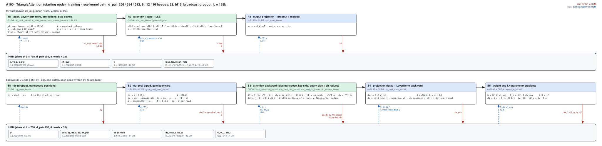

##### R1 · weight pack, LayerNorm rows, bias planes (w_pack_kernel, ln_rows_kernel, bias_planes_kernel)

| (Length, Dimension) | (128, 256) | (256, 256) | (384, 256) | (512, 256) | (640, 256) | (768, 256) | (128, 384) | (256, 384) | (384, 384) | (512, 384) | (640, 384) | (768, 384) |
|---|---|---|---|---|---|---|---|---|---|---|---|---|
| implementation | CUDA | CUDA | CUDA | CUDA | CUDA | CUDA | CUDA | CUDA | CUDA | CUDA | CUDA | CUDA |
| 성능 확인 | ✗ | ✗ | ✗ | ✗ | ✗ | ✗ | ✗ | ✗ | ✗ | ✗ | ✗ | ✗ |
| cache build | ✓ | ✓ | ✓ | ✓ | ✓ | ✓ | ✓ | ✓ | ✓ | ✓ | ✓ | ✓ |

##### R2 · projections and output projection (cuBLAS)

| (Length, Dimension) | (128, 256) | (256, 256) | (384, 256) | (512, 256) | (640, 256) | (768, 256) | (128, 384) | (256, 384) | (384, 384) | (512, 384) | (640, 384) | (768, 384) |
|---|---|---|---|---|---|---|---|---|---|---|---|---|
| implementation | cuBLAS | cuBLAS | cuBLAS | cuBLAS | cuBLAS | cuBLAS | cuBLAS | cuBLAS | cuBLAS | cuBLAS | cuBLAS | cuBLAS |
| 성능 확인 | ✗ | ✗ | ✗ | ✗ | ✗ | ✗ | ✗ | ✗ | ✗ | ✗ | ✗ | ✗ |
| cache build | ✓ | ✓ | ✓ | ✓ | ✓ | ✓ | ✓ | ✓ | ✓ | ✓ | ✓ | ✓ |

##### R3 · attention + gate + LSE (attn_fwd_kernel, gate epilogue)

| (Length, Dimension) | (128, 256) | (256, 256) | (384, 256) | (512, 256) | (640, 256) | (768, 256) | (128, 384) | (256, 384) | (384, 384) | (512, 384) | (640, 384) | (768, 384) |
|---|---|---|---|---|---|---|---|---|---|---|---|---|
| implementation | CUDA | CUDA | CUDA | CUDA | CUDA | CUDA | CUDA | CUDA | CUDA | CUDA | CUDA | CUDA |
| 성능 확인 | ✗ | ✗ | ✗ | ✗ | ✗ | ✗ | ✗ | ✗ | ✗ | ✗ | ✗ | ✗ |
| cache build | ✓ | ✓ | ✓ | ✓ | ✓ | ✓ | ✓ | ✓ | ✓ | ✓ | ✓ | ✓ |

##### R4 · dropout + residual (out_rows_kernel)

| (Length, Dimension) | (128, 256) | (256, 256) | (384, 256) | (512, 256) | (640, 256) | (768, 256) | (128, 384) | (256, 384) | (384, 384) | (512, 384) | (640, 384) | (768, 384) |
|---|---|---|---|---|---|---|---|---|---|---|---|---|
| implementation | CUDA | CUDA | CUDA | CUDA | CUDA | CUDA | CUDA | CUDA | CUDA | CUDA | CUDA | CUDA |
| 성능 확인 | ✗ | ✗ | ✗ | ✗ | ✗ | ✗ | ✗ | ✗ | ✗ | ✗ | ✗ | ✗ |
| cache build | ✓ | ✓ | ✓ | ✓ | ✓ | ✓ | ✓ | ✓ | ✓ | ✓ | ✓ | ✓ |

##### B1 · dy: dropout scale, transposed positions (dy_rows_kernel)

| (Length, Dimension) | (128, 256) | (256, 256) | (384, 256) | (512, 256) | (640, 256) | (768, 256) | (128, 384) | (256, 384) | (384, 384) | (512, 384) | (640, 384) | (768, 384) |
|---|---|---|---|---|---|---|---|---|---|---|---|---|
| implementation | CUDA | CUDA | CUDA | CUDA | CUDA | CUDA | CUDA | CUDA | CUDA | CUDA | CUDA | CUDA |
| 성능 확인 | ✗ | ✗ | ✗ | ✗ | ✗ | ✗ | ✗ | ✗ | ✗ | ✗ | ✗ | ✗ |
| cache build | ✓ | ✓ | ✓ | ✓ | ✓ | ✓ | ✓ | ✓ | ✓ | ✓ | ✓ | ✓ |

##### B2 · out-projection dgrad (cuBLAS) and gate backward (gate_bwd_rows_kernel)

| (Length, Dimension) | (128, 256) | (256, 256) | (384, 256) | (512, 256) | (640, 256) | (768, 256) | (128, 384) | (256, 384) | (384, 384) | (512, 384) | (640, 384) | (768, 384) |
|---|---|---|---|---|---|---|---|---|---|---|---|---|
| implementation | CUDA | CUDA | CUDA | CUDA | CUDA | CUDA | CUDA | CUDA | CUDA | CUDA | CUDA | CUDA |
| 성능 확인 | ✗ | ✗ | ✗ | ✗ | ✗ | ✗ | ✗ | ✗ | ✗ | ✗ | ✗ | ✗ |
| cache build | ✓ | ✓ | ✓ | ✓ | ✓ | ✓ | ✓ | ✓ | ✓ | ✓ | ✓ | ✓ |

##### B3 · attention backward (bias_transpose_kernel, attn_bwd_dkv_kernel, attn_bwd_dq_kernel, db_reduce_kernel)

| (Length, Dimension) | (128, 256) | (256, 256) | (384, 256) | (512, 256) | (640, 256) | (768, 256) | (128, 384) | (256, 384) | (384, 384) | (512, 384) | (640, 384) | (768, 384) |
|---|---|---|---|---|---|---|---|---|---|---|---|---|
| implementation | CUDA | CUDA | CUDA | CUDA | CUDA | CUDA | CUDA | CUDA | CUDA | CUDA | CUDA | CUDA |
| 성능 확인 | ✗ | ✗ | ✗ | ✗ | ✗ | ✗ | ✗ | ✗ | ✗ | ✗ | ✗ | ✗ |
| cache build | ✓ | ✓ | ✓ | ✓ | ✓ | ✓ | ✓ | ✓ | ✓ | ✓ | ✓ | ✓ |

##### B4 · projection dgrad (cuBLAS) and LayerNorm backward + residual (ln_bwd_rows_kernel)

| (Length, Dimension) | (128, 256) | (256, 256) | (384, 256) | (512, 256) | (640, 256) | (768, 256) | (128, 384) | (256, 384) | (384, 384) | (512, 384) | (640, 384) | (768, 384) |
|---|---|---|---|---|---|---|---|---|---|---|---|---|
| implementation | CUDA | CUDA | CUDA | CUDA | CUDA | CUDA | CUDA | CUDA | CUDA | CUDA | CUDA | CUDA |
| 성능 확인 | ✗ | ✗ | ✗ | ✗ | ✗ | ✗ | ✗ | ✗ | ✗ | ✗ | ✗ | ✗ |
| cache build | ✓ | ✓ | ✓ | ✓ | ✓ | ✓ | ✓ | ✓ | ✓ | ✓ | ✓ | ✓ |

##### B5 · weight and LayerNorm-parameter gradients (cuBLAS, wgrad_w_kernel)

| (Length, Dimension) | (128, 256) | (256, 256) | (384, 256) | (512, 256) | (640, 256) | (768, 256) | (128, 384) | (256, 384) | (384, 384) | (512, 384) | (640, 384) | (768, 384) |
|---|---|---|---|---|---|---|---|---|---|---|---|---|
| implementation | cuBLAS | cuBLAS | cuBLAS | cuBLAS | cuBLAS | cuBLAS | cuBLAS | cuBLAS | cuBLAS | cuBLAS | cuBLAS | cuBLAS |
| 성능 확인 | ✗ | ✗ | ✗ | ✗ | ✗ | ✗ | ✗ | ✗ | ✗ | ✗ | ✗ | ✗ |
| cache build | ✓ | ✓ | ✓ | ✓ | ✓ | ✓ | ✓ | ✓ | ✓ | ✓ | ✓ | ✓ |

## projected_attention token_pair · `ops.augmented_attention_pair_bias` at A = L pair rows

The registry's five rows (4 × 16, 4 × 32, 2 × 32, 8 × 32, 12 × 32 heads, `d_hidden` 64 / 128 / 64 / 256 / 384); the tables are for `d_hidden` 128, every other row behaves alike. The leaf has no projections: the op takes the projected q / k / v and the pair bias.

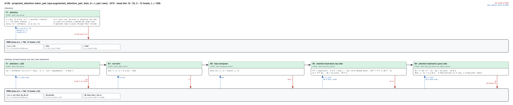

### Inference

##### L1 · attention with the per-row key mask (attn2_fwd_kernel)

| (Length, Dimension) | (128, 128) | (256, 128) | (384, 128) | (512, 128) | (640, 128) | (768, 128) |
|---|---|---|---|---|---|---|
| implementation | CUDA | CUDA | CUDA | CUDA | CUDA | CUDA |
| 성능 확인 | ✗ | ✗ | ✗ | ✗ | ✗ | ✗ |
| cache build | ✓ | ✓ | ✓ | ✓ | ✓ | ✓ |

### Training

##### L1 · attention + LSE (attn2_fwd_kernel)

| (Length, Dimension) | (128, 128) | (256, 128) | (384, 128) | (512, 128) | (640, 128) | (768, 128) |
|---|---|---|---|---|---|---|
| implementation | CUDA | CUDA | CUDA | CUDA | CUDA | CUDA |
| 성능 확인 | ✗ | ✗ | ✗ | ✗ | ✗ | ✗ |
| cache build | ✓ | ✓ | ✓ | ✓ | ✓ | ✓ |

##### L2 · row term Δ = Σ o · dout (attn2_delta_kernel)

| (Length, Dimension) | (128, 128) | (256, 128) | (384, 128) | (512, 128) | (640, 128) | (768, 128) |
|---|---|---|---|---|---|---|
| implementation | CUDA | CUDA | CUDA | CUDA | CUDA | CUDA |
| 성능 확인 | ✗ | ✗ | ✗ | ✗ | ✗ | ✗ |
| cache build | ✓ | ✓ | ✓ | ✓ | ✓ | ✓ |

##### L3 · bias transpose (bias_transpose_kernel)

| (Length, Dimension) | (128, 128) | (256, 128) | (384, 128) | (512, 128) | (640, 128) | (768, 128) |
|---|---|---|---|---|---|---|
| implementation | CUDA | CUDA | CUDA | CUDA | CUDA | CUDA |
| 성능 확인 | ✗ | ✗ | ✗ | ✗ | ✗ | ✗ |
| cache build | ✓ | ✓ | ✓ | ✓ | ✓ | ✓ |

##### L4 · attention backward, key side: dK, dV (attn2_bwd_dkv_kernel)

| (Length, Dimension) | (128, 128) | (256, 128) | (384, 128) | (512, 128) | (640, 128) | (768, 128) |
|---|---|---|---|---|---|---|
| implementation | CUDA | CUDA | CUDA | CUDA | CUDA | CUDA |
| 성능 확인 | ✗ | ✗ | ✗ | ✗ | ✗ | ✗ |
| cache build | ✓ | ✓ | ✓ | ✓ | ✓ | ✓ |

##### L5 · attention backward, query side: dQ, dbias partials (attn2_bwd_dq_kernel) and their reduction (db_reduce_kernel)

| (Length, Dimension) | (128, 128) | (256, 128) | (384, 128) | (512, 128) | (640, 128) | (768, 128) |
|---|---|---|---|---|---|---|
| implementation | CUDA | CUDA | CUDA | CUDA | CUDA | CUDA |
| 성능 확인 | ✗ | ✗ | ✗ | ✗ | ✗ | ✗ |
| cache build | ✓ | ✓ | ✓ | ✓ | ✓ | ✓ |

## Measurements (2026-10-03: D128; 2026-10-04: the other widths and the leaf)

One A100 80GB PCIe (300 W; job 61781 on gpu09: all implementations, then the Triton path, the same bench with `MINIWORLD_TRIATTN_SM80=0`),
torch 2.13.0+cu129 / triton 3.7.1, bf16 with fp32 LayerNorm affine, B = 1, D128, starting node, 10 % masked keys, dropout 0.25 in training, CUDA-graph
timing (`cudagraph=manual`), `benchmarks/runners/bench.py` (module level, `implementation=miniworld`; sources frozen in a snapshot for the run). Run-to-run
and node-to-node spread is about 2 %. Times in ms. **×** = cuEquivariance divided by ours (above 1 = ours is faster). **Anthropic** (inference only: the release ships no backward) =
`integrations.anthropic.module_triangle_attention`: the release's own block surround (the LayerNorm + q | k | v | g + bias prologue, the gate + output-projection epilogue; Triton kernels
of `common/opt_core`, pinned f4f62fa, from the checkout at `/home/psk6950/practice/refs/uplifting-biomolecular-modeling`, unmodified) around a core row, eager under a CUDA graph
(`compile=false`; `bench.py +triattn_anthropic_row=block:k2b`). **The following historical table measured the Triton `k2b` core** (`flash` is 4-5 % slower).
The native sm80 member was initially blocked because its local torch 2.13.0+cu129 build had no checksum entry. This is resolved as of 2026-10-04:
the local ABI directory has its own verified build manifest, the original release manifest and vectors are unchanged, and all three A100 output vectors pass bitwise.
The adapter now propagates refusal instead of allowing `pair_fused` to substitute `flash_triattn` under the requested native name.
See [the reproducible build and validation procedure](../../../kernels/anthropic-integration.md#a100-native-triangleattention-local-build-2026-10-04).

### Native Anthropic comparison (2026-10-04)

Job 63486, gpu07, A100 80GB PCIe, 300 W; two rounds on the same GPU, with each round running PyTorch compiled, cuEquivariance, MiniWorld, then Anthropic.
All timings use warmed CUDA Graph replay; Anthropic uses `compile=false` with the upstream surround and the native `cuda_80` core, strictly selected as
`block:triattn_native`. D128, 4 × 32 heads, B=1, starting attention, 10% masked keys, inference. Means in ms; **× = min(Anthropic, cuEquivariance) / MiniWorld**.

| Length | PyTorch compiled | cuEquivariance | Anthropic native | MiniWorld | × |
|---|---|---|---|---|---|
| 384 | 3.372 | 1.307 | 0.735 | 0.647 | 1.14 |
| 768 | 27.209 | 7.150 | 3.645 | 3.749 | 0.97 |

The native baseline changes the conclusion at L768: Anthropic is about 2.8% faster there; MiniWorld is about 1.14× faster at L384.
Anthropic's two rounds are 0.734208 / 3.644416 and 0.735232 / 3.646464 ms; MiniWorld's are 0.651264 / 3.729408 and 0.643072 / 3.768320 ms.
Anthropic output relative Frobenius error against the FP32 module is 0.001749 / 0.001717, with cosine above 0.999998.
The three original native test vectors match bitwise; 18 additional module tests validate both directions, three mask modes, and graph replay with changed inputs.
This is an unchanged-source local rebuild, not an upstream-certified ABI. Training is unsupported by the upstream member.
[Build provenance and per-round rows](records/anthropic_native_20261004.json).

### Inference (historical Triton-core comparison)

| (Length, Dimension) | PyTorch compiled | cuEquivariance | Anthropic | Triton path | ours | × |
|---|---|---|---|---|---|---|
| (384, 128) | 3.328 | 1.295 | 0.844 | 0.948 | 0.635 | 2.04 |
| (768, 128) | 22.552 | 7.166 | 4.874 | 5.096 | 3.678 | 1.95 |

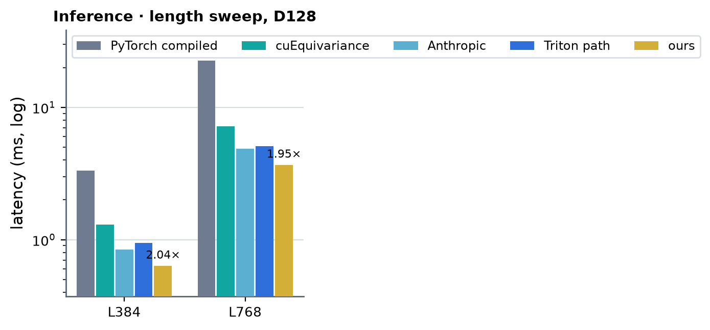 <!-- measure_bars -->

Anthropic = the mean of two jobs on different nodes (61903 gpu02, 61906 gpu08), in which PyTorch compiled, cuEquivariance, ours and the Anthropic rows ran on the same GPU (ms; L384 / L768):
ours 0.6451 / 3.7304 and 0.6369 / 3.6905, cuEquivariance 1.3056 / 7.2356 and 1.2933 / 7.1593, Anthropic `k2b` 0.8499 / 4.9188 and 0.8387 / 4.8292 (1.32x / 1.32x and 1.32x / 1.31x ours), Anthropic
`flash` 0.8837 / 5.1016 and 0.8735 / 5.0668; the Anthropic output is 1.7e-3 from the fp32 module (relative Frobenius).

### Training

| (Length, Dimension) | PyTorch compiled | cuEquivariance | Anthropic | Triton path | ours | × |
|---|---|---|---|---|---|---|
| (384, 128) | 7.806 | 5.586 | — (no bwd) | 3.836 | 2.572 | 2.17 |
| (768, 128) | 50.265 | 32.929 | — (no bwd) | 22.853 | 14.915 | 2.21 |

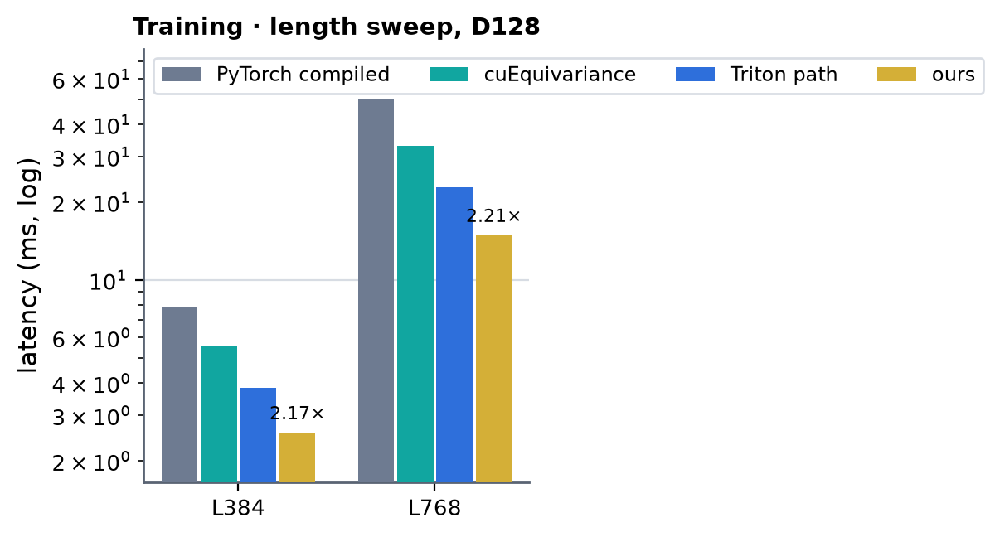 <!-- measure_bars -->

The ending node costs the same within a few percent (one process, CUDA graph, job 61781): inference L384 0.652 ms / L768 3.776 ms, training L384 2.619 ms /
L768 15.078 ms (the Triton path pays 0.2-0.7 ms per call for the transposing copies, ours reads and writes the transposed positions in the kernels).

### Other widths (2026-10-04)

Same card and procedure as above (one A100 80GB PCIe, 300 W; torch 2.13.0+cu129 / triton 3.7.1; B = 1, starting node, bf16 with fp32 LayerNorm affine, dropout 0.25 in training, CUDA-graph timing with `cudagraph=manual`,
`benchmarks/runners/bench.py` at module level with `implementation=miniworld`, sources frozen in a snapshot), with every key valid (`mask_prob=0`: the mask tensor is passed and read, masked keys change no kernel's work). One job per geometry
runs PyTorch compiled, cuEquivariance and ours together and then the Triton path (the same bench with `MINIWORLD_TRIATTN_SM80=0`) on the same card: d_pair 64 / hidden 64 / 4 heads job 62965 (gpu08), hidden 128 job 62990 (gpu08), 2 heads job 63022 (gpu07),
d_pair 256 job 63042 (gpu07), d_pair 384 job 63051 (gpu08), and d_pair 128 (the first path, re-run with the final tree as a check: inference L384 / L768 0.655 / 3.766 ms, training 2.625 / 15.048 ms against the 0.635 / 3.678 and 2.572 / 14.915 above, the +1-3 % being
the node: cuEquivariance moved by the same +1 %) job 63085 (gpu08). Times in ms; **×** = cuEquivariance divided by ours; **Anthropic**: not measured for these additional widths (the native build is now validated at D128; inference only, the release ships no backward). Run-to-run and node-to-node
spread is about 2 %. `Dimension` is d_pair; the head layout and the hidden width are in the table's title.

Against cuEquivariance ours is 1.3-3.2x faster in inference (1.85-2.3x at d_pair 64 with 4 × 32 and 2 × 32 heads, 2.2-3.2x with 4 × 16, 1.35-1.5x at d_pair 256 and 1.3-1.6x at d_pair 384) and 1.4-2.6x in training (1.7-2.6x at d_pair 64,
1.4-2.1x at d_pair 256 and 384), and 1.03-1.17x (d_pair 256 / 384 inference), 1.29-1.77x (d_pair 64 inference) and 1.19-1.60x (training) faster than the Triton path it replaces, at every registered length.

d_pair 512 (16 heads × 32, not a registry row; the gate serves it, the tests cover it) was spot-checked against the Triton path only (job 63282, gpu04, same snapshot, L384 / L768): inference 4.592 / 23.186 ms against 4.642 / 24.508 (1.01x / 1.06x), training 14.564 / 77.367 ms against 17.882 / 106.327 (1.23x / 1.37x).

### d_pair 64 · hidden 64 (4 heads × 16) · Inference

| (Length, Dimension) | PyTorch compiled | cuEquivariance | Anthropic | Triton path | ours | × |
|---|---|---|---|---|---|---|
| (128, 64) | 0.162 | 0.150 | — (not measured) | 0.074 | 0.046 | 3.24 |
| (256, 64) | 0.762 | 0.374 | — (not measured) | 0.252 | 0.160 | 2.34 |
| (384, 64) | 2.978 | 0.953 | — (not measured) | 0.593 | 0.419 | 2.28 |
| (512, 64) | 5.468 | 1.992 | — (not measured) | 1.235 | 0.878 | 2.27 |
| (640, 64) | 14.072 | 3.708 | — (not measured) | 2.160 | 1.604 | 2.31 |
| (768, 64) | 21.386 | 5.873 | — (not measured) | 3.512 | 2.643 | 2.22 |

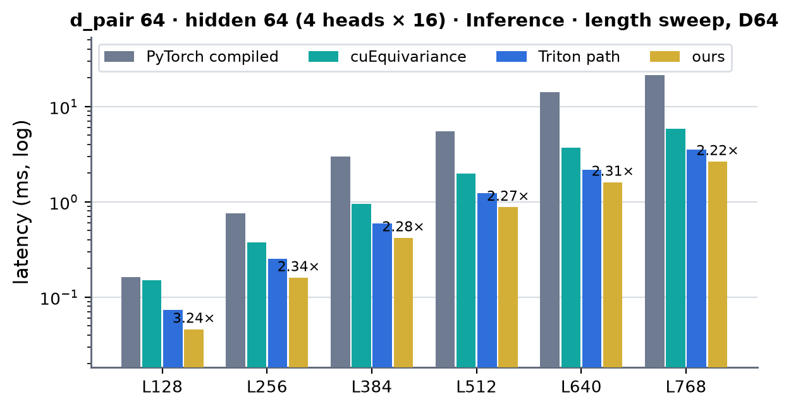 <!-- measure_bars -->

### d_pair 64 · hidden 64 (4 heads × 16) · Training

| (Length, Dimension) | PyTorch compiled | cuEquivariance | Anthropic | Triton path | ours | × |
|---|---|---|---|---|---|---|
| (128, 64) | 0.442 | 0.442 | — (no bwd) | 0.287 | 0.198 | 2.24 |
| (256, 64) | 2.071 | 1.561 | — (no bwd) | 1.042 | 0.650 | 2.40 |
| (384, 64) | 6.635 | 4.276 | — (no bwd) | 2.598 | 1.715 | 2.49 |
| (512, 64) | 13.171 | 9.072 | — (no bwd) | 5.424 | 3.478 | 2.61 |
| (640, 64) | 28.666 | 16.781 | — (no bwd) | 9.818 | 6.345 | 2.64 |
| (768, 64) | 45.558 | 27.254 | — (no bwd) | 15.938 | 10.340 | 2.64 |

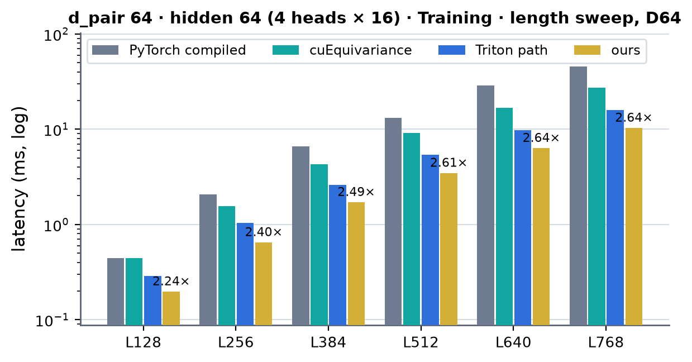 <!-- measure_bars -->

### d_pair 64 · hidden 128 (4 heads × 32) · Inference

| (Length, Dimension) | PyTorch compiled | cuEquivariance | Anthropic | Triton path | ours | × |
|---|---|---|---|---|---|---|
| (128, 64) | 0.179 | 0.123 | — (not measured) | 0.097 | 0.060 | 2.03 |
| (256, 64) | 0.834 | 0.430 | — (not measured) | 0.316 | 0.219 | 1.96 |
| (384, 64) | 3.208 | 1.117 | — (not measured) | 0.766 | 0.572 | 1.95 |
| (512, 64) | 5.630 | 2.272 | — (not measured) | 1.532 | 1.180 | 1.93 |
| (640, 64) | 14.350 | 4.141 | — (not measured) | 2.778 | 2.151 | 1.93 |
| (768, 64) | 22.000 | 6.495 | — (not measured) | 4.516 | 3.511 | 1.85 |

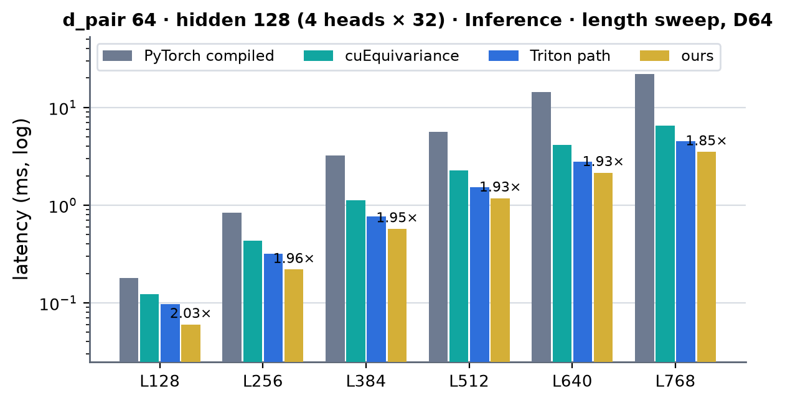 <!-- measure_bars -->

### d_pair 64 · hidden 128 (4 heads × 32) · Training

| (Length, Dimension) | PyTorch compiled | cuEquivariance | Anthropic | Triton path | ours | × |
|---|---|---|---|---|---|---|
| (128, 64) | 0.494 | 0.452 | — (no bwd) | 0.359 | 0.268 | 1.68 |
| (256, 64) | 2.291 | 1.829 | — (no bwd) | 1.304 | 0.912 | 2.00 |
| (384, 64) | 7.188 | 4.980 | — (no bwd) | 3.316 | 2.364 | 2.11 |
| (512, 64) | 13.992 | 10.255 | — (no bwd) | 6.841 | 4.778 | 2.15 |
| (640, 64) | 29.945 | 18.797 | — (no bwd) | 12.831 | 8.697 | 2.16 |
| (768, 64) | 47.684 | 30.953 | — (no bwd) | 21.189 | 14.214 | 2.18 |

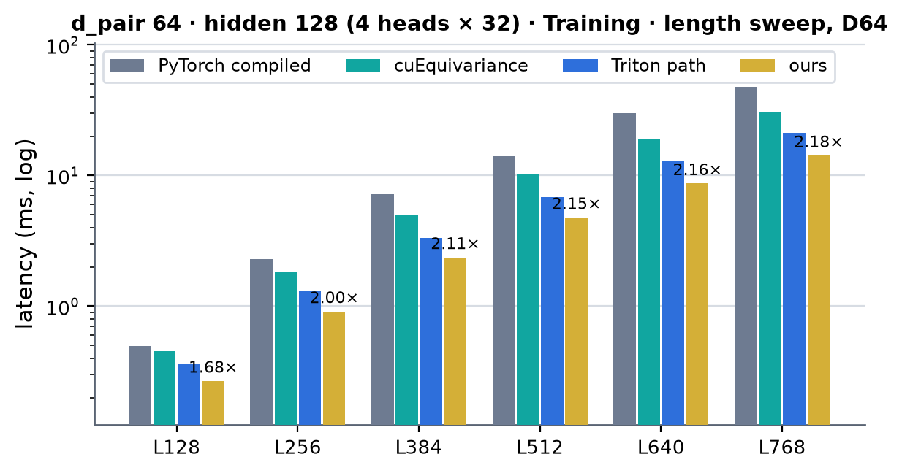 <!-- measure_bars -->

### d_pair 64 · hidden 64 (2 heads × 32) · Inference

| (Length, Dimension) | PyTorch compiled | cuEquivariance | Anthropic | Triton path | ours | × |
|---|---|---|---|---|---|---|
| (128, 64) | 0.114 | 0.087 | — (not measured) | 0.070 | 0.043 | 2.02 |
| (256, 64) | 0.515 | 0.282 | — (not measured) | 0.219 | 0.124 | 2.27 |
| (384, 64) | 1.798 | 0.646 | — (not measured) | 0.481 | 0.307 | 2.10 |
| (512, 64) | 2.903 | 1.285 | — (not measured) | 0.942 | 0.622 | 2.07 |
| (640, 64) | 7.366 | 2.282 | — (not measured) | 1.612 | 1.122 | 2.03 |
| (768, 64) | 11.058 | 3.536 | — (not measured) | 2.563 | 1.830 | 1.93 |

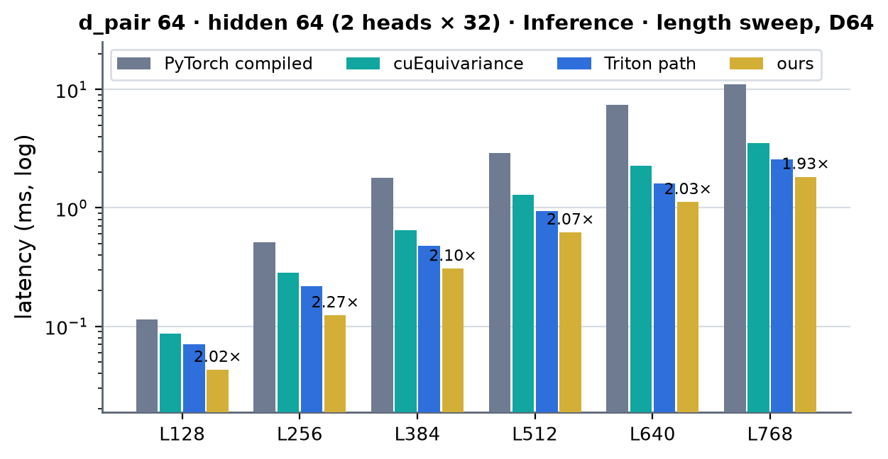 <!-- measure_bars -->

### d_pair 64 · hidden 64 (2 heads × 32) · Training

| (Length, Dimension) | PyTorch compiled | cuEquivariance | Anthropic | Triton path | ours | × |
|---|---|---|---|---|---|---|
| (128, 64) | 0.343 | 0.328 | — (no bwd) | 0.264 | 0.181 | 1.81 |
| (256, 64) | 1.434 | 1.121 | — (no bwd) | 0.863 | 0.539 | 2.08 |
| (384, 64) | 4.171 | 2.836 | — (no bwd) | 1.983 | 1.308 | 2.17 |
| (512, 64) | 7.502 | 5.702 | — (no bwd) | 3.984 | 2.561 | 2.23 |
| (640, 64) | 15.794 | 10.286 | — (no bwd) | 7.151 | 4.623 | 2.22 |
| (768, 64) | 24.689 | 16.526 | — (no bwd) | 11.852 | 7.424 | 2.23 |

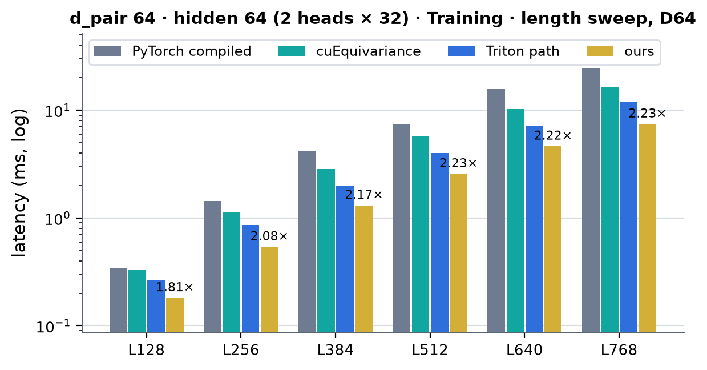 <!-- measure_bars -->

### d_pair 256 · hidden 256 (8 heads × 32) · Inference

| (Length, Dimension) | PyTorch compiled | cuEquivariance | Anthropic | Triton path | ours | × |
|---|---|---|---|---|---|---|
| (128, 256) | 0.372 | 0.259 | — (not measured) | 0.213 | 0.182 | 1.42 |
| (256, 256) | 2.310 | 1.034 | — (not measured) | 0.790 | 0.766 | 1.35 |
| (384, 256) | 7.636 | 2.659 | — (not measured) | 1.989 | 1.912 | 1.39 |
| (512, 256) | 15.699 | 5.241 | — (not measured) | 3.921 | 3.735 | 1.40 |
| (640, 256) | 34.956 | 9.592 | — (not measured) | 6.843 | 6.424 | 1.49 |
| (768, 256) | 55.688 | 15.286 | — (not measured) | 10.966 | 10.110 | 1.51 |

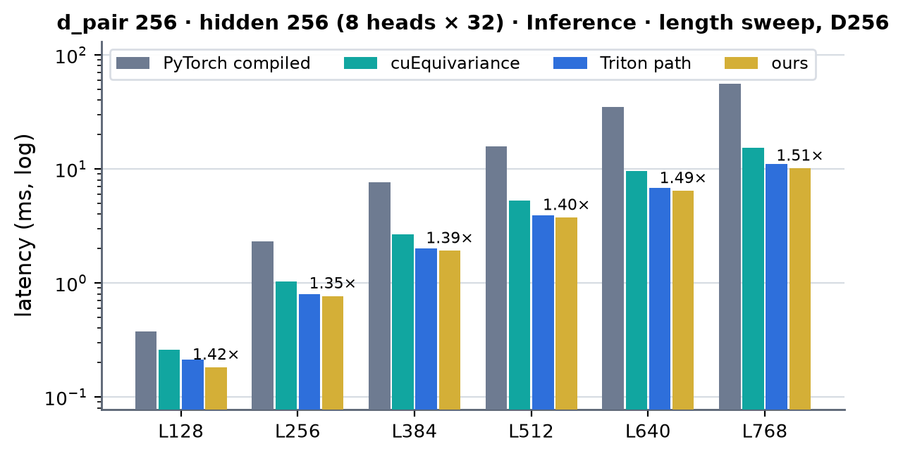 <!-- measure_bars -->

### d_pair 256 · hidden 256 (8 heads × 32) · Training

| (Length, Dimension) | PyTorch compiled | cuEquivariance | Anthropic | Triton path | ours | × |
|---|---|---|---|---|---|---|
| (128, 256) | 1.031 | 0.958 | — (no bwd) | 0.781 | 0.635 | 1.51 |
| (256, 256) | 5.538 | 4.133 | — (no bwd) | 3.081 | 2.532 | 1.63 |
| (384, 256) | 16.170 | 11.079 | — (no bwd) | 7.845 | 6.377 | 1.74 |
| (512, 256) | 33.545 | 22.705 | — (no bwd) | 15.946 | 12.797 | 1.77 |
| (640, 256) | 69.148 | 42.904 | — (no bwd) | 29.792 | 22.967 | 1.87 |
| (768, 256) | 111.129 | 75.513 | — (no bwd) | 48.751 | 36.225 | 2.08 |

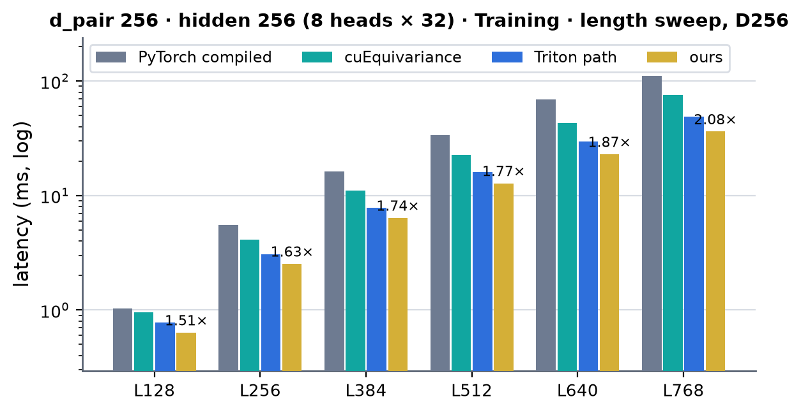 <!-- measure_bars -->

### d_pair 384 · hidden 384 (12 heads × 32) · Inference

| (Length, Dimension) | PyTorch compiled | cuEquivariance | Anthropic | Triton path | ours | × |
|---|---|---|---|---|---|---|
| (128, 384) | 0.544 | 0.369 | — (not measured) | 0.310 | 0.286 | 1.29 |
| (256, 384) | 3.532 | 1.596 | — (not measured) | 1.296 | 1.241 | 1.29 |
| (384, 384) | 11.381 | 4.114 | — (not measured) | 3.247 | 3.081 | 1.34 |
| (512, 384) | 23.674 | 8.211 | — (not measured) | 6.489 | 5.988 | 1.37 |
| (640, 384) | 52.519 | 15.336 | — (not measured) | 11.081 | 10.231 | 1.50 |
| (768, 384) | 82.896 | 26.015 | — (not measured) | 17.733 | 16.023 | 1.62 |

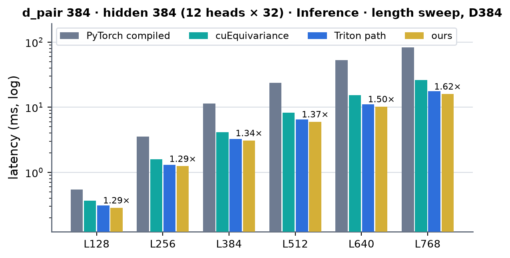 <!-- measure_bars -->

### d_pair 384 · hidden 384 (12 heads × 32) · Training

| (Length, Dimension) | PyTorch compiled | cuEquivariance | Anthropic | Triton path | ours | × |
|---|---|---|---|---|---|---|
| (128, 384) | 1.546 | 1.386 | — (no bwd) | 1.167 | 0.978 | 1.42 |
| (256, 384) | 8.551 | 6.343 | — (no bwd) | 4.995 | 4.119 | 1.54 |
| (384, 384) | 24.718 | 17.144 | — (no bwd) | 12.773 | 10.141 | 1.69 |
| (512, 384) | 51.388 | 35.889 | — (no bwd) | 25.868 | 20.133 | 1.78 |
| (640, 384) | 104.098 | 70.026 | — (no bwd) | 47.941 | 35.281 | 1.98 |
| (768, 384) | 167.041 | 118.494 | — (no bwd) | 76.583 | 55.965 | 2.12 |

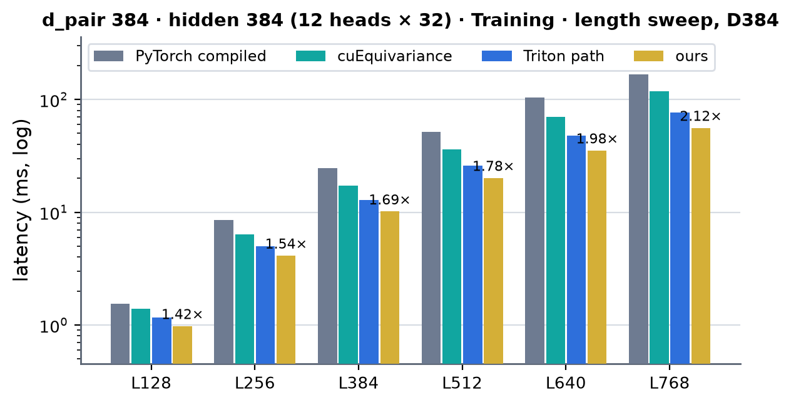 <!-- measure_bars -->

### projected_attention token_pair (2026-10-04)

`ops.augmented_attention_pair_bias` at the registry's inputs (q / k / v `[A = L, 1, H, L, D]` bf16, bias `[1, H, L, L]`, an all-True key mask `[A, 1, L]`), measured by `probes/leaf_bench.py` from the same frozen snapshot as the module benches (the registry's leaf has no `bench.py`
target): one process per mode runs ours (the default dispatch), the Triton path (`MINIWORLD_TRIATTN_SM80=0`, toggled inside the process) and the PyTorch reference compiled (`kernels/augmented_attention/reference.py`: fp32 einsums and softmax), CUDA-graph replays (minimum of three runs of ten),
inference job 63215 (gpu04) and training job 63201 (gpu04; the gradients of q, k, v and the bias by `torch.autograd.grad`). **×** = PyTorch compiled divided by ours: cuEquivariance has no such op and Anthropic is not measured. Against the Triton path it replaces ours is 1.5-3.0x faster in
inference (1.5-1.65x at L768) and 1.9-2.6x in training (2.1-2.5x at L768). The key mask is all True, so the kernels run their masked variants (the cost of the mask is in the last section).

### 4 heads × 16 (d_hidden 64) · Inference

| (Length, Dimension) | PyTorch compiled | cuEquivariance | Anthropic | Triton path | ours | × |
|---|---|---|---|---|---|---|
| (128, 64) | 0.230 | — | — (not measured) | 0.038 | 0.019 | 12.0 |
| (256, 64) | 1.901 | — | — (not measured) | 0.180 | 0.091 | 20.9 |
| (384, 64) | 6.277 | — | — (not measured) | 0.477 | 0.271 | 23.2 |
| (512, 64) | 14.815 | — | — (not measured) | 0.989 | 0.607 | 24.4 |
| (640, 64) | 28.969 | — | — (not measured) | 1.804 | 1.175 | 24.7 |
| (768, 64) | 50.490 | — | — (not measured) | 2.967 | 1.996 | 25.3 |

 <!-- measure_bars -->

### 4 heads × 32 (d_hidden 128) · Inference

| (Length, Dimension) | PyTorch compiled | cuEquivariance | Anthropic | Triton path | ours | × |
|---|---|---|---|---|---|---|
| (128, 128) | 0.475 | — | — (not measured) | 0.064 | 0.024 | 19.8 |
| (256, 128) | 2.621 | — | — (not measured) | 0.275 | 0.116 | 22.6 |
| (384, 128) | 7.873 | — | — (not measured) | 0.719 | 0.352 | 22.4 |
| (512, 128) | 17.897 | — | — (not measured) | 1.473 | 0.780 | 23.0 |
| (640, 128) | 34.335 | — | — (not measured) | 2.617 | 1.509 | 22.8 |
| (768, 128) | 58.575 | — | — (not measured) | 4.276 | 2.598 | 22.5 |

 <!-- measure_bars -->

### 2 heads × 32 (d_hidden 64) · Inference

| (Length, Dimension) | PyTorch compiled | cuEquivariance | Anthropic | Triton path | ours | × |
|---|---|---|---|---|---|---|
| (128, 64) | 0.280 | — | — (not measured) | 0.034 | 0.016 | 17.1 |
| (256, 64) | 1.404 | — | — (not measured) | 0.145 | 0.062 | 22.5 |
| (384, 64) | 4.080 | — | — (not measured) | 0.368 | 0.179 | 22.8 |
| (512, 64) | 9.122 | — | — (not measured) | 0.746 | 0.391 | 23.3 |
| (640, 64) | 17.296 | — | — (not measured) | 1.317 | 0.761 | 22.7 |
| (768, 64) | 29.342 | — | — (not measured) | 2.137 | 1.285 | 22.8 |

 <!-- measure_bars -->

### 8 heads × 32 (d_hidden 256) · Inference

| (Length, Dimension) | PyTorch compiled | cuEquivariance | Anthropic | Triton path | ours | × |
|---|---|---|---|---|---|---|
| (128, 256) | 0.969 | — | — (not measured) | 0.118 | 0.040 | 24.1 |
| (256, 256) | 5.389 | — | — (not measured) | 0.530 | 0.214 | 25.2 |
| (384, 256) | 16.290 | — | — (not measured) | 1.414 | 0.676 | 24.1 |
| (512, 256) | 36.842 | — | — (not measured) | 2.920 | 1.562 | 23.6 |
| (640, 256) | 70.705 | — | — (not measured) | 5.242 | 3.042 | 23.2 |
| (768, 256) | 134.235 | — | — (not measured) | 8.596 | 5.296 | 25.3 |

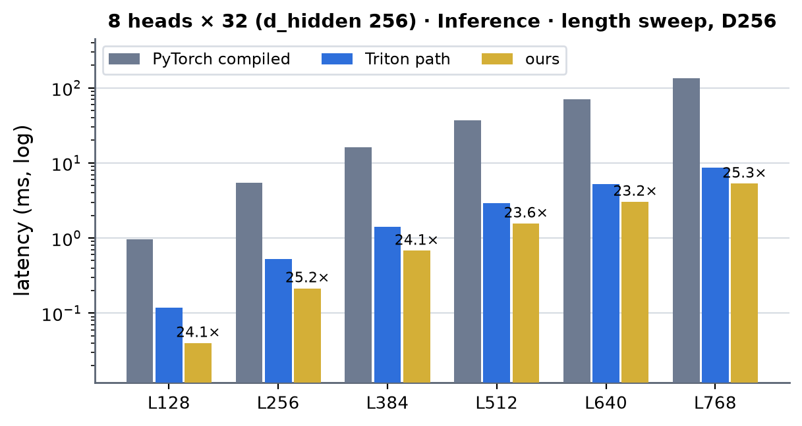 <!-- measure_bars -->

### 12 heads × 32 (d_hidden 384) · Inference

| (Length, Dimension) | PyTorch compiled | cuEquivariance | Anthropic | Triton path | ours | × |
|---|---|---|---|---|---|---|
| (128, 384) | 2.527 | — | — (not measured) | 0.171 | 0.058 | 43.9 |
| (256, 384) | 11.732 | — | — (not measured) | 0.794 | 0.321 | 36.6 |
| (384, 384) | 30.427 | — | — (not measured) | 2.134 | 0.999 | 30.4 |
| (512, 384) | 62.564 | — | — (not measured) | 4.443 | 2.315 | 27.0 |
| (640, 384) | 127.449 | — | — (not measured) | 7.993 | 4.641 | 27.5 |
| (768, 384) | 202.249 | — | — (not measured) | 13.205 | 8.124 | 24.9 |

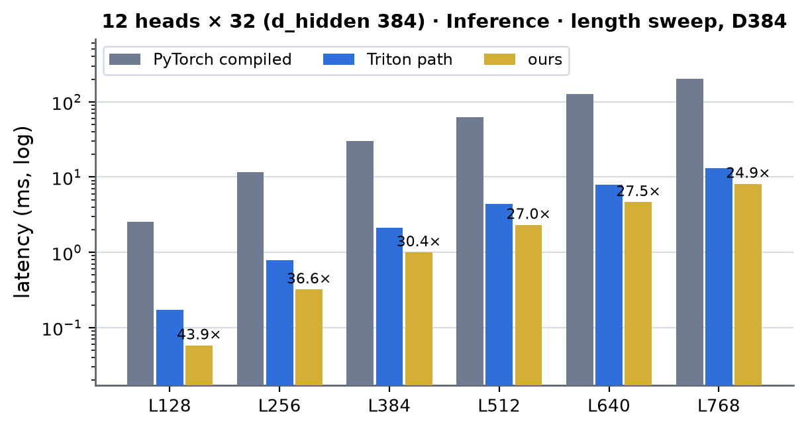 <!-- measure_bars -->

### 4 heads × 16 (d_hidden 64) · Training

| (Length, Dimension) | PyTorch compiled | cuEquivariance | Anthropic | Triton path | ours | × |
|---|---|---|---|---|---|---|
| (128, 64) | 0.808 | — | — (not measured) | 0.162 | 0.077 | 10.5 |
| (256, 64) | 5.943 | — | — (not measured) | 0.776 | 0.362 | 16.4 |
| (384, 64) | 19.525 | — | — (not measured) | 2.285 | 1.100 | 17.8 |
| (512, 64) | 45.952 | — | — (not measured) | 5.419 | 2.406 | 19.1 |
| (640, 64) | 91.225 | — | — (not measured) | 10.801 | 4.781 | 19.1 |
| (768, 64) | 160.289 | — | — (not measured) | 18.762 | 8.255 | 19.4 |

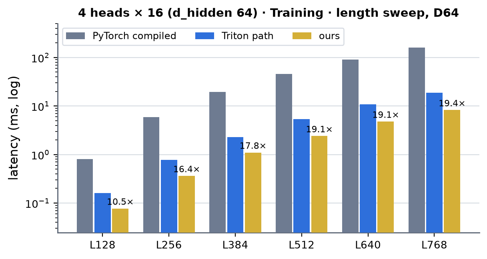 <!-- measure_bars -->

### 4 heads × 32 (d_hidden 128) · Training

| (Length, Dimension) | PyTorch compiled | cuEquivariance | Anthropic | Triton path | ours | × |
|---|---|---|---|---|---|---|
| (128, 128) | 1.268 | — | — (not measured) | 0.219 | 0.107 | 11.8 |
| (256, 128) | 7.412 | — | — (not measured) | 1.046 | 0.499 | 14.8 |
| (384, 128) | 22.936 | — | — (not measured) | 3.017 | 1.488 | 15.4 |
| (512, 128) | 52.432 | — | — (not measured) | 7.151 | 3.258 | 16.1 |
| (640, 128) | 102.578 | — | — (not measured) | 14.634 | 6.503 | 15.8 |
| (768, 128) | 179.343 | — | — (not measured) | 26.379 | 11.197 | 16.0 |

 <!-- measure_bars -->

### 2 heads × 32 (d_hidden 64) · Training

| (Length, Dimension) | PyTorch compiled | cuEquivariance | Anthropic | Triton path | ours | × |
|---|---|---|---|---|---|---|
| (128, 64) | 0.761 | — | — (not measured) | 0.127 | 0.066 | 11.4 |
| (256, 64) | 3.935 | — | — (not measured) | 0.538 | 0.280 | 14.1 |
| (384, 64) | 11.822 | — | — (not measured) | 1.513 | 0.788 | 15.0 |
| (512, 64) | 26.448 | — | — (not measured) | 3.250 | 1.651 | 16.0 |
| (640, 64) | 51.945 | — | — (not measured) | 6.616 | 3.202 | 16.2 |
| (768, 64) | 89.663 | — | — (not measured) | 11.334 | 5.466 | 16.4 |

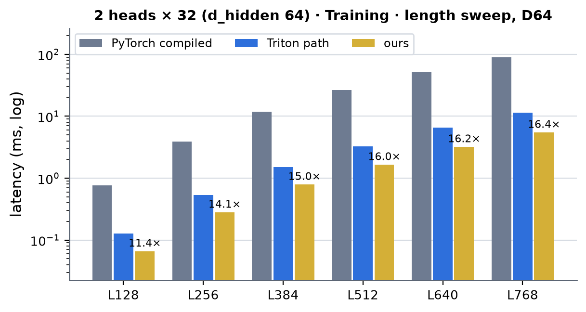 <!-- measure_bars -->

### 8 heads × 32 (d_hidden 256) · Training

| (Length, Dimension) | PyTorch compiled | cuEquivariance | Anthropic | Triton path | ours | × |
|---|---|---|---|---|---|---|
| (128, 256) | 2.567 | — | — (not measured) | 0.405 | 0.180 | 14.3 |
| (256, 256) | 15.118 | — | — (not measured) | 2.063 | 0.934 | 16.2 |
| (384, 256) | 47.093 | — | — (not measured) | 6.831 | 2.864 | 16.4 |
| (512, 256) | 108.112 | — | — (not measured) | 15.505 | 6.674 | 16.2 |
| (640, 256) | 212.663 | — | — (not measured) | 32.575 | 13.272 | 16.0 |
| (768, 256) | 366.567 | — | — (not measured) | 54.641 | 22.399 | 16.4 |

 <!-- measure_bars -->

### 12 heads × 32 (d_hidden 384) · Training

| (Length, Dimension) | PyTorch compiled | cuEquivariance | Anthropic | Triton path | ours | × |
|---|---|---|---|---|---|---|
| (128, 384) | 5.496 | — | — (not measured) | 0.617 | 0.256 | 21.5 |
| (256, 384) | 27.936 | — | — (not measured) | 3.202 | 1.383 | 20.2 |
| (384, 384) | 79.138 | — | — (not measured) | 11.193 | 4.329 | 18.3 |
| (512, 384) | 171.662 | — | — (not measured) | 26.311 | 10.103 | 17.0 |
| (640, 384) | 335.193 | — | — (not measured) | 50.408 | 19.621 | 17.1 |
| (768, 384) | 548.004 | — | — (not measured) | 83.059 | 33.655 | 16.3 |

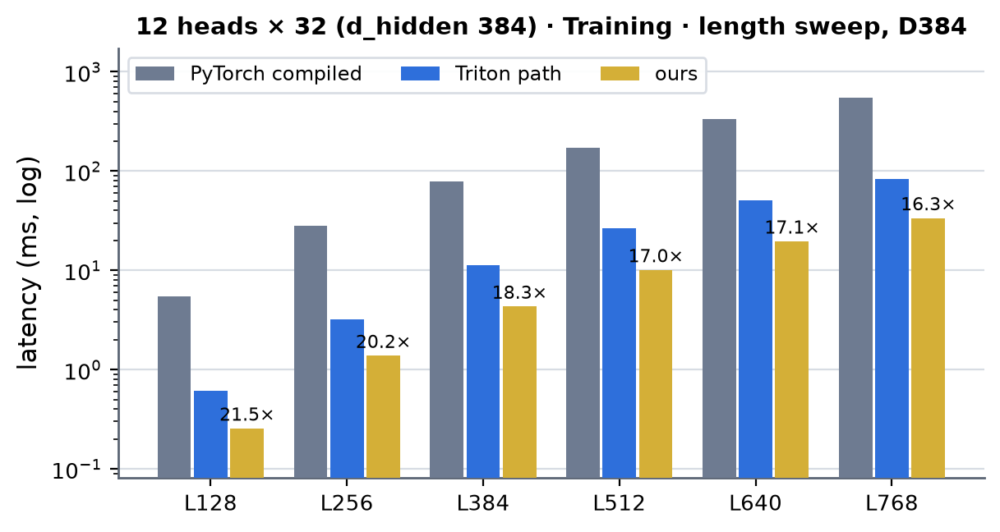 <!-- measure_bars -->

### Speed of light

SoL = the composite floor of the decomposition: per kernel `max(essential bytes / 1.60 TB/s, FLOP / 240 TFLOP/s)`, summed (both ceilings measured on this
card, `experiments/a100_trimul_fwd`); the attention backward is counted as implemented (the query and key sides each recompute S and dP: 3 and 4
mma sets of 2 L³ H 32 FLOP, and the query side writes and the reduction reads the bf16 bias-gradient partials of L / 4 groups of four rows).

| mode | L | ours (µs) | SoL floor (µs) | % of SoL |
|---|---|---|---|---|
| inference | 384 | 635 | 334 | 53 % |
| inference | 768 | 3678 | 1819 | 49 % |
| training | 384 | 2572 | 1368 | 53 % |
| training | 768 | 14915 | 7881 | 53 % |

The training floor is counted as implemented, so it fell (1509 / 8617 µs before) when the query side went from two to four rows per CTA: half the partials
to write and to read back.

**Other widths and the leaf** (2026-10-04). The same floor per stage, `max(essential bytes / 1.60 TB/s, FLOP / 240 TFLOP/s)`, summed (`probes/sol_tri.py`): the front reads x and writes q | k | v | g and the bias heads (in training also x̂ with its eight constant columns),
the attention is counted by its products (4 L³ · hidden FLOP: 3 and 4 mma sets of 2 L³ · hidden in the backward's query and key sides, as above) and the backward's bf16 bias-gradient partials and their reduction, the back reads g, o, x and writes y; in training the gate
backward, the projection backward and the weight gradients are streams over the same tensors. With 16-channel heads the exponentials, one MUFU op per score at 16 per clock and SM (L³ H scores: 743 µs at L768 and 4 heads), cost more than the products (483 µs): the
floor above is the FLOP one, and the forward kernel's 2056 µs is 36 % of the exponential floor.

| geometry | mode | L | ours (µs) | SoL floor (µs) | % of SoL |
|---|---|---|---|---|---|
| d64 / hidden 64 / 4 heads × 16 | inference | 384 | 419 | 167 | 40 % |
| d64 / hidden 64 / 4 heads × 16 | inference | 768 | 2643 | 911 | 34 % |
| d64 / hidden 64 / 4 heads × 16 | training | 384 | 1715 | 720 | 42 % |
| d64 / hidden 64 / 4 heads × 16 | training | 768 | 10340 | 4172 | 40 % |
| d64 / hidden 128 / 4 heads × 32 | inference | 384 | 572 | 298 | 52 % |
| d64 / hidden 128 / 4 heads × 32 | inference | 768 | 3511 | 1677 | 48 % |
| d64 / hidden 128 / 4 heads × 32 | training | 384 | 2364 | 1188 | 50 % |
| d64 / hidden 128 / 4 heads × 32 | training | 768 | 14214 | 7209 | 51 % |
| d64 / hidden 64 / 2 heads × 32 | inference | 384 | 307 | 167 | 54 % |
| d64 / hidden 64 / 2 heads × 32 | inference | 768 | 1830 | 909 | 50 % |
| d64 / hidden 64 / 2 heads × 32 | training | 384 | 1308 | 654 | 50 % |
| d64 / hidden 64 / 2 heads × 32 | training | 768 | 7424 | 3846 | 52 % |
| d256 / hidden 256 / 8 heads × 32 | inference | 384 | 1912 | 755 | 39 % |
| d256 / hidden 256 / 8 heads × 32 | inference | 768 | 10110 | 3986 | 39 % |
| d256 / hidden 256 / 8 heads × 32 | training | 384 | 6377 | 2730 | 43 % |
| d256 / hidden 256 / 8 heads × 32 | training | 768 | 36225 | 15833 | 44 % |
| d384 / hidden 384 / 12 heads × 32 | inference | 384 | 3081 | 1376 | 45 % |
| d384 / hidden 384 / 12 heads × 32 | inference | 768 | 16023 | 6953 | 43 % |
| d384 / hidden 384 / 12 heads × 32 | training | 384 | 10141 | 4879 | 48 % |
| d384 / hidden 384 / 12 heads × 32 | training | 768 | 55965 | 26886 | 48 % |

The leaf (attention only: the same floors; training adds the row-term pass):

| geometry | mode | L | ours (µs) | SoL floor (µs) | % of SoL |
|---|---|---|---|---|---|
| 4 heads × 16 | inference | 384 | 271 | 60 | 22 % |
| 4 heads × 16 | inference | 768 | 1996 | 483 | 24 % |
| 4 heads × 32 | inference | 384 | 352 | 121 | 34 % |
| 4 heads × 32 | inference | 768 | 2598 | 966 | 37 % |
| 2 heads × 32 | inference | 384 | 179 | 60 | 34 % |
| 2 heads × 32 | inference | 768 | 1285 | 483 | 38 % |
| 8 heads × 32 | inference | 384 | 676 | 242 | 36 % |
| 8 heads × 32 | inference | 768 | 5296 | 1933 | 36 % |
| 12 heads × 32 | inference | 384 | 999 | 362 | 36 % |
| 12 heads × 32 | inference | 768 | 8124 | 2899 | 36 % |
| 4 heads × 16 | training | 384 | 1100 | 396 | 36 % |
| 4 heads × 16 | training | 768 | 8255 | 2877 | 35 % |
| 4 heads × 32 | training | 384 | 1488 | 664 | 45 % |
| 4 heads × 32 | training | 768 | 11197 | 5112 | 46 % |
| 2 heads × 32 | training | 384 | 788 | 332 | 42 % |
| 2 heads × 32 | training | 768 | 5466 | 2556 | 47 % |
| 8 heads × 32 | training | 384 | 2864 | 1328 | 46 % |
| 8 heads × 32 | training | 768 | 22399 | 10225 | 46 % |
| 12 heads × 32 | training | 384 | 4329 | 1991 | 46 % |
| 12 heads × 32 | training | 768 | 33655 | 15337 | 46 % |

The 2 × 32 and 4 × 32 geometries reach 48-54 %, the level of the d128 path (the front and the back at 75-100 % of their byte floors, the attention at 2-3x its FLOP floor); the row-kernel path is lower (39-48 %): its two cuBLAS GEMMs run at 130-150 of the 240 TFLOP/s, the
residual pass `out_rows_kernel` is a stream the fused path does not have, and the front's output (q | k | v | g and the bias heads, 1.2 GB at d_pair 256, L768) is written once and read by the core. The leaf's 22-47 % is the attention kernels alone: the same
issue-bound core as above, with the masked variants and, in training, the 0.9-2.7 GB of bias-gradient partials.

### Where the time goes (starting node, `torch.profiler` CUPTI kernel times, one process, job 61781)

| kernel | L384 inference | L384 training | L768 inference | L768 training | floor L384 (µs) |
|---|---|---|---|---|---|
| F1 front (`f1_kernel`) | 190 | 202 | 680 | 793 | 119 / 145 |
| F2 attention (`attn_fwd_kernel`) | 362 | 353 | 2685 | 2636 | 121 |
| F3 back (`f3_kernel`) | 98 | 126 | 379 | 469 | 94 |
| B1 gate backward (`b3_kernel`) | | 194 | | 774 | 167 |
| B3 key side (`attn_bwd_dkv_kernel`) | | 494 | | 3655 | 242 |
| B4 query side (`attn_bwd_dq_kernel`) + `db_reduce_kernel` | | 555 + 77 | | 4040 + 540 | 264 |
| B5 projection dgrad + LN backward (`b1_kernel`) | | 255 | | 1009 | 167 |
| B6 weight gradients (cuBLAS: G = Dᵀ[x̂ \| 1], dW_o) + small kernels | | 246 + 55 | | 898 + 62 | 167 |
| sum of kernel times | 654 | 2555 | 3748 | 14875 | |

The front and the back are streams at 63-96 % of their byte floor (the row kernels F1, F3, B1 and B5 did not change, and run 0-6 % slower on this node, gpu09, than in the
profile of 2026-10-02 on gpu08: the spread between nodes); the attention kernels (the forward, B3, B4) are 2.0-3.0x above their floors
and are latency / shared-memory bound (8-16 warps per SM, one barrier per key tile, 25-30 % tensor pipe; the softmax's exponentials are one MUFU op per score: 119 µs at L384 for
the 226 M scores of one forward).
The bias gradient is the awkward part: it needs the sum over all L pair rows of dS, the query kernel writes bf16 partials for groups of four rows (113 MB at L384,
0.9 GB at L768) and `db_reduce_kernel` adds them (the Triton path writes the per-row dS, four times as much, and reduces it with a PyTorch reduction).

**Other widths** (2026-10-04, starting node, `torch.profiler` CUPTI kernel times of the CUDA path, one process per geometry and length, CUDA-graph replay of the call in the last row; jobs 63094 (gpu02) and 63122 (gpu08); `probes/prof_wide.py`):

#### d_pair 64 · hidden 64 (2 heads × 32) (µs)

| stage | L384 inference | L384 training | L768 inference | L768 training |
|---|---|---|---|---|
| front row kernels (fused_f1 / ln_rows / bias_planes / w_pack) | 78 | 91 | 296 | 358 |
| attention (forward) | 171 | 174 | 1254 | 1330 |
| back row kernels (fused_f3 / out_rows) | 47 | 52 | 178 | 192 |
| gate / out-proj backward (fused_b3 / gate_bwd_rows / dy_rows) |  | 88 |  | 352 |
| attention backward, key side (dkv) |  | 244 |  | 1834 |
| attention backward, query side + db reduce + bias transpose |  | 347 |  | 2338 |
| projection dgrad + LN backward (fused_b1 / ln_bwd_rows) |  | 122 |  | 466 |
| cuBLAS GEMMs |  | 141 |  | 468 |
| other small kernels (packs, finalizers, copies, elementwise) | 4 | 61 | 4 | 125 |
| sum of kernel times | 300 | 1320 | 1732 | 7463 |
| CUDA-graph replay of the call | 299 | 1306 | 1693 | 7367 |

#### d_pair 64 · hidden 64 (4 heads × 16) (µs)

| stage | L384 inference | L384 training | L768 inference | L768 training |
|---|---|---|---|---|
| front row kernels (fused_f1 / ln_rows / bias_planes / w_pack) | 79 | 92 | 299 | 356 |
| attention (forward) | 281 | 286 | 2056 | 2155 |
| back row kernels (fused_f3 / out_rows) | 47 | 52 | 178 | 185 |
| gate / out-proj backward (fused_b3 / gate_bwd_rows / dy_rows) |  | 88 |  | 357 |
| attention backward, key side (dkv) |  | 350 |  | 2633 |
| attention backward, query side + db reduce + bias transpose |  | 488 |  | 3472 |
| projection dgrad + LN backward (fused_b1 / ln_bwd_rows) |  | 127 |  | 480 |
| cuBLAS GEMMs |  | 143 |  | 465 |
| other small kernels (packs, finalizers, copies, elementwise) | 4 | 62 | 4 | 125 |
| sum of kernel times | 410 | 1687 | 2536 | 10228 |
| CUDA-graph replay of the call | 407 | 1674 | 2493 | 10266 |

#### d_pair 64 · hidden 128 (4 heads × 32) (µs)

| stage | L384 inference | L384 training | L768 inference | L768 training |
|---|---|---|---|---|
| front row kernels (fused_f1 / ln_rows / bias_planes / w_pack) | 137 | 154 | 573 | 632 |
| attention (forward) | 335 | 352 | 2624 | 2644 |
| back row kernels (fused_f3 / out_rows) | 75 | 85 | 280 | 314 |
| gate / out-proj backward (fused_b3 / gate_bwd_rows / dy_rows) |  | 160 |  | 647 |
| attention backward, key side (dkv) |  | 493 |  | 3651 |
| attention backward, query side + db reduce + bias transpose |  | 637 |  | 4569 |
| projection dgrad + LN backward (fused_b1 / ln_bwd_rows) |  | 233 |  | 896 |
| cuBLAS GEMMs |  | 195 |  | 655 |
| other small kernels (packs, finalizers, copies, elementwise) | 4 | 70 | 4 | 133 |
| sum of kernel times | 551 | 2379 | 3481 | 14141 |
| CUDA-graph replay of the call | 549 | 2319 | 3382 | 14249 |

#### d_pair 256 · hidden 256 (8 heads × 32) (µs)

| stage | L384 inference | L384 training | L768 inference | L768 training |
|---|---|---|---|---|
| front row kernels (fused_f1 / ln_rows / bias_planes / w_pack) | 125 | 132 | 455 | 473 |
| attention (forward) | 774 | 865 | 5750 | 6008 |
| back row kernels (fused_f3 / out_rows) | 135 | 137 | 526 | 526 |
| gate / out-proj backward (fused_b3 / gate_bwd_rows / dy_rows) |  | 365 |  | 1440 |
| attention backward, key side (dkv) |  | 1102 |  | 7894 |
| attention backward, query side + db reduce + bias transpose |  | 1350 |  | 9733 |
| projection dgrad + LN backward (fused_b1 / ln_bwd_rows) |  | 235 |  | 916 |
| cuBLAS GEMMs | 741 | 1983 | 3048 | 9052 |
| other small kernels (packs, finalizers, copies, elementwise) |  | 132 |  | 379 |
| sum of kernel times | 1775 | 6309 | 9779 | 36435 |
| CUDA-graph replay of the call | 1702 | 6283 | 9918 | 36363 |

#### d_pair 384 · hidden 384 (12 heads × 32) (µs)

| stage | L384 inference | L384 training | L768 inference | L768 training |
|---|---|---|---|---|
| front row kernels (fused_f1 / ln_rows / bias_planes / w_pack) | 178 | 194 | 689 | 706 |
| attention (forward) | 1190 | 1346 | 8898 | 9414 |
| back row kernels (fused_f3 / out_rows) | 200 | 202 | 783 | 785 |
| gate / out-proj backward (fused_b3 / gate_bwd_rows / dy_rows) |  | 541 |  | 2151 |
| attention backward, key side (dkv) |  | 1711 |  | 12281 |
| attention backward, query side + db reduce + bias transpose |  | 2086 |  | 15204 |
| projection dgrad + LN backward (fused_b1 / ln_bwd_rows) |  | 485 |  | 1884 |
| cuBLAS GEMMs | 1460 | 3906 | 6052 | 15099 |
| other small kernels (packs, finalizers, copies, elementwise) |  | 195 |  | 569 |
| sum of kernel times | 3028 | 10679 | 16420 | 58106 |
| CUDA-graph replay of the call | 3024 | 10652 | 16611 | 58210 |

The narrow widths are attention-bound (57-81 % of an inference call, 58-81 % of a training step: the forward at 4 heads × 16 takes 281 µs at L384, 4.7x its FLOP floor and 3x its exponential floor; the gate / output-projection backward, the projection backward and the weight-gradient GEMMs are streams at 55-75 % of
their byte floors). At 4 × 16 the core's work per score (the scale and bias FMA, the running maximum, the subtraction, the exponential and the row sum, about ten instructions) is the same as at 4 × 32 while the products halve, which is why the native 16-channel kernels gain
11-28 % over the padded ones and no more. The row-kernel path spends 40-48 % of an inference call in its two cuBLAS GEMMs (741 µs for 100 GFLOP at d_pair 256, L384; 1460 µs for 223 GFLOP at 384): the row kernels around them are `ln_rows_kernel` 100 µs (the 153 MB it reads and writes at 96 % of
the byte floor), `out_rows_kernel` 135 µs (226 MB, at its byte floor) and `bias_planes_kernel` 18 µs; the attention is 774 µs at d_pair 256 (the 8 heads × 32 forward with the gate in its epilogue).

### What was tried and did not pay (2026-10-02)

- A first front (a 128-token CTA tile through shared memory, a streamed weight ring and 4-byte stores): 417 µs at L384, slower than the unfused path
  (357 µs); the persistent layout above: 178 µs.
- A second attention forward (the bias as fp32 pre-scaled by √32, used as the S accumulators' initial value, one FFMA per exponent argument, the running
  maximum raised only past a margin of 8, the row sums from an extra mma against ones): the FMA pipe went from 47 % to 26 % busy but the kernel got 3-4 %
  slower (more shared-memory traffic for the fp32 bias, the same barrier per key tile): dropped.
- `ex2.approx.f16x2` (two exponentials per MUFU) compiles to two `MUFU.EX2.F16` and a `PRMT` on sm_80; `ex2.approx.bf16x2` needs sm_90.
- Schedule sweeps of the backward kernels (`DQ_*` / `DKV_*` in `sm80.py`): the key side's default (4 stages, 2 CTAs per SM) is within 2 % of the best at
  every L. The query side's kernel alone looked the same (4 rows with 1 CTA per SM only 0-6 % faster) until the reduction was counted: 4 rows write half
  the bias-gradient partials, so the kernel and `db_reduce_kernel` together take 8 % less at L256-L384 and 12 % less at L768 than 2 rows with 2 CTAs per
  SM (the previous default); at L128 they are 2 % (1 µs) slower. 4 rows is the default now (8 rows is not instantiated).

### What changed and what did not pay (2026-10-03)

- **Kept: the cp.async index arithmetic of a pipeline stage is made once per thread** (`KVBiasLoader` in the forward and the query side, `QdLoader` in the key side: the shared-memory
  offsets and the 64-bit global pointers of a thread's 16-byte chunks are computed before the key loop, one add per chunk inside it, as in the AugmentedAttention kernels
  of [../atom_dit/atom_dit.md](../atom_dit/atom_dit.md)). Kernel-only CUDA-graph replays of the old and the new kernels, one after the other on gpu09 (job 61745), L384 / L768: forward 358 → 334 µs / 2822 → 2689
  (7 % / 5 %), query side 593 → 577 / 4175 → 3977 (3 % / 5 %), key side 562 → 523 / 4096 → 3795 (7 % / 7 %); the outputs are bit-identical. The module-level tables above are
  with it.
- **Dropped: the bias in raw units through the tensor core** (what the AugmentedAttention core does, [../atom_dit/atom_dit.md](../atom_dit/atom_dit.md): the bf16 bias stored as
  `bias · sqrt(32)` and added to the score tile by an identity `mma`, the softmax on the raw scores). Here the old and the new kernels in turn on gpu09 (job 61770), L384 / L768:
  forward 337 / 2663 vs 340 / 2687 µs (1-3 % slower), query side 564 / 3933 vs 558 / 3884 (1 % faster), key side 526 / 3785 vs 510 / 3702 (3 % / 2 % faster), all inside the 2-8 %
  spread of those runs and with the forward losing; the sources were reverted to the natural-unit bias.

### What was tried and did not pay (2026-10-04)

- **Kept: native 16-channel heads** (d_pair 64, 4 heads of 16) instead of zero-padding to 32 as the B200 path does: the generalised core (`attn2_*_sm80.cuh`, head dim as a template parameter) and the front, the back and their backward instantiated for 16 channels. Kernel-only CUDA-graph
  replays of the padded and the native kernels in one process (4 heads, L384 / L768, µs): forward 337 → 299 / 2661 → 2211, query side 533 → 424 / 4064 → 2914, key side 474 → 374 / 3763 → 2733 (11-28 % less); module level (inference 3.43 → 2.64 ms, training 13.73 → 10.34 ms at L768,
  jobs 62290 and 62965). The front and the back write and read half the bytes.
- **Kept: the gate in the core's epilogue** (row-kernel path): `bf16(sigmoid(g) · o)` is written straight into the output projection's operand, so no `gate_rows` pass reads o and g and writes a. The first version loaded g inside the epilogue after the volatile output stores: the stores
  serialised the loads and the kernel took 849 µs at d_pair 256, L384 against 778 µs with the loads hoisted ahead of the stores. The module's inference at d_pair 256 / 384 went from 3-5 % slower than the Triton path (L ≥ 256) to 3-17 % faster.
- **Dropped: `torch.addmm` for the output projection and the residual** (`out = x + a W_oᵀ` as one call with `beta = 1`): the output must first receive a copy of x (a 75 MB read and write at d_pair 256, L384) and the GEMM then reads it again as C: three passes over a [T, 256] tensor against `out_rows_kernel`'s one over
  `yo` and x; no gain, reverted.
- **The per-row key mask of the generalised core** (the leaf's contract: a mask `[A, B, L]` of its own for every pair row). First version: every (row, key tile) loaded its mask bytes from global memory inside the loop and selected per score: +34 % in the forward and +40 % in the query side
  over the unmasked kernels with 10 % random masked keys (core microbench, one process, 4 heads). Now: the CTA's rows are turned into bit words once (a warp ballot per 32 keys, issued while the first pipeline stages are in flight), each sub-step reads one word, **one word ahead**, and a tile
  without a masked key branches to the unmasked copy of the sub-step. L768, 4 heads, µs (unmasked → all keys valid / 10 % padded tail / 10 % random keys): hd16 forward 2256 → 2331 / 2372 / 2617 (+3 % / +5 % / +16 %), query side 2978 → 3332 / 3345 / 3419 (+12 % / +12 % / +15 %), key side 2771 → 2752 / 2723 / 2813 (±2 %);
  hd32 forward 2770 → 2931 / 2955 / 3207 (+6 % / +7 % / +16 %), query side 4280 → 4386 / 4381 / 4439 (+2 % / +2 % / +4 %), key side 3782 → 3785 / 3800 / 3856 (≤ +2 %). Where the first all-valid forward's +7 % went (hd16, L768, switches compiled out one at a time, one process): the in-loop word load and branch
  +6 %, the prologue +1-2 % (the global loads of the mask bytes ~1 % of it); reading the next word one sub-step ahead recovered more than half of the former. Two straight-line copies of the sub-step against one copy with a branch around the selects made no measurable difference (the cost is the dependent load and branch, not code size).
  The query side's remaining +12 % at hd16 was not run down (its schedule keeps 8 warps per SM, which hide a dependent branch less: a guess, untested). The all-True mask of the registry rows therefore costs +5 % of the leaf's training step at 4 × 16 (L768: +410 µs of 8255) and +2 % at 4 × 32.
- **Not done: a schedule sweep of the 16-channel kernels** (32 vs 64 keys per tile, ring depth, CTAs per SM): the native kernels run the schedules tuned for head dim 32; an A/B sweep would be the first thing to try for the exponential-bound forward at 4 × 16 (21-36 % of its floors).
