# TriangleMultiplication on A100 (sm80)

Kernel-level status of the TriMul modules on A100; the module-level summary is in [a100.md](../a100.md). Columns are (Length, Dimension) from the shape registry
(`triangle_multiplication`, `triangle_multiplication_bidirectional`, token-pair stream, L = 128-768). A100 = CUDA where a hand-written sm_80 path exists; a shape without one is 미구현 (it
runs the Triton path). Dispatch: `integrations/trimul_sm80.py`; kernels: two sets under `kernels/trimul_inproj/cuda/`, each one extension (`mma.sync`, `ldmatrix`, `cp.async`, cuBLAS for the
contraction and the large backward GEMMs):

| path | widths | dtypes | modules | kernels |
|---|---|---|---|---|
| **fused D128** | D128 | bf16 | one direction, bidirectional | `sm80.py` + `sm80/` (`ops.cu`): literal tile shapes for D128, the on-chip backward |
| **wide** | D64, D128 (fp32), D256, D384 | bf16, fp32 (TF32) | one direction, bidirectional (hidden 2 D) | `sm80_wide.py` + `sm80/wide_*.cuh` (`wide_ops.cu`): LayerNorm-folded GEMM kernels, any width |

Summary (2026-10-04). Every registry row of `triangle_multiplication` (D64 / D128 / D256 / D384, bf16 and fp32 (TF32), inference and training) and of the bidirectional module now runs hand-written CUDA (+ cuBLAS for the contraction and the large
backward GEMMs) on A100 by default; the Triton path stays as the fallback. Against cuEquivariance (`bench.py`, CUDA graph, B = 1, L = 128-768; see Measurements): bf16 inference 1.31-1.60x at D64 / D128 / D256 and 1.66-2.89x at D384, bf16 training
1.36-1.83x at D64 / D128 / D256 and 1.44-2.12x at D384; the bidirectional module at D128 1.53-2.07x in inference and 1.40-1.79x in training (L128 / L384 / L768), and 1.49-2.10x / 1.40-1.61x at the wide widths (D64 / D256 / D384 at L384); fp32 has no valid baseline but
PyTorch compiled (the Triton kernels are bf16 only and cuEquivariance's fp32 arm computes another function): fp32 (TF32) inference 1.8-3.9x, training 1.4-2.9x. Against the Triton path these kernels replace (shown, never the denominator): bf16 inference is
1.03-1.07x faster at D64, 1.26-1.45x at D128, 1.13-1.35x at D256 and 1.20-1.58x at D384; bf16 training 1.02-1.06x (D64), 1.02-1.30x (D128), 0.96-1.04x (D256) and 0.99-1.03x (D384): parity at the wide widths, where the step is dominated by cuBLAS GEMMs (48 % of the D384 L768 step); the one
shape behind is D256 L128 (4 % in-process, see "Routing check"). Accuracy: output, dz and all ten parameter gradients no further from the fp32 module than the bf16 PyTorch module (output relative error 2.6-3.0e-3 in inference, 2.8-3.3e-3 in training, the PyTorch module
3.0-3.2e-3 / 3.2-3.4e-3; fp32: 1.4e-3 / 1.5-1.6e-3 against the TF32 PyTorch composition), with mask and dropout; replays are bit-identical. Speed of light (composite floor of the decomposition, wide path): bf16 inference 53-72 % (the D64 L384 row is the launch-bound one), training 69-79 %; fp32 (TF32) inference 61-71 %, training 67-82 %; the bidirectional wide rows 50-76 %.

Both modules share one kernel family: the bidirectional module is the one-direction module at twice the hidden width (planes P = 4D, contraction output H = 2D), its two contractions taking one half
of the planes each; one direction has P = 2D, H = D. Figures of the D128 fused path: one box per kernel, left to right, HBM reads (blue, left) and writes (red, right); generated from
`figures/trimul.json` by `python -m miniworld_engine.viz.kernel_flow` and embedded as SVG (`cairosvg` and `rsvg-convert` are not installed on cssb, so there is no PNG).

## Contract

Served when `implementation=miniworld`, a contiguous `[B, L, L, D]` bf16 (or fp32 for the wide path) pair (a batch runs plane by plane, `torch.cat` of the per-sample results), `d_hidden = D` with D in {64, 128, 256, 384}
(the bidirectional module's front weights are 2 D wide), both LayerNorm eps equal, the input LayerNorm's weight and bias of one dtype (bf16 or fp32), compute capability (8, 0), L a multiple of 16 and a
`[B, L]` bool mask or none. D128 bf16 takes the fused D128 kernels, every other (width, dtype) the wide kernels. Everything else (and `engine_backend="triton"`) runs the existing path; a failed extension build
warns once and keeps it too (a `torch.compiler.assume_constant_result` gate: `torch.compile(fullgraph=True)` folds it, and a build that fails or times out on its lock disables the path for the process, nothing else).
`MINIWORLD_TRIMUL_SM80=0` turns both CUDA sets off, `MINIWORLD_TRIMUL_SM80_WIDE=0` the wide set alone (the Triton path serves; at fp32 the module's PyTorch composition does: the Triton kernels are bf16 only).
Prebuild before timing: torch builds an extension into `$TORCH_EXTENSIONS_DIR/<name>` whatever the source tree, so two trees (or snapshots) sharing that directory rebuild each other's, and a process that waits more than ten
minutes for the build lock keeps the old path for its whole run, which a benchmark shows as a `miniworld` column equal to the Triton / PyTorch one and a `RuntimeWarning: ... unavailable` in its log (one directory per snapshot, built once, avoids it).
The `tm1` / `tm2` stages and the TriMul output gate have CUDA kernels too, outside this dispatch: see [../gated_projection/gated_projection.md](../gated_projection/gated_projection.md).

Tests: `tests/numerics/test_trimul_sm80_gpu.py` (the fused D128 path) and `tests/integrations/test_a100_trimul_gpu.py` (the wide path: output, dz and all ten parameter gradients no further from the
fp32 module than the bf16 module, fp32 against the TF32 PyTorch composition, with mask and dropout; the module dispatches to it and the switches turn it off; the gate predicate; replays bit-identical; a batch equals its
planes run alone; `torch.compile(fullgraph=True)` matches eager; CUDA-graph capture and replay; the packs match their torch definition; fp32 parameters get fp32 gradients; unaligned views are copied), `tests/integrations/test_a100_trimul_gate.py` (the gate, CPU).

Two layout details of the module boundary: the bidirectional module stores its four front matrices `[in, out]` (strides
`(1, H)`); the pack kernel reads them in place and the backward writes their gradients with the same strides, so neither side copies
them. Measured in one process, CUDA graph, L384 (2026-10-02): the in-place pack saves 13 µs per bidirectional inference call
(631.5 -> 618.2 µs) and 20 µs per training step; `finalize` saves 19 µs (one direction) and 27 µs (bidirectional) per training
step (1.1-1.3 %), 0.1-0.5 % at L768. The residual is the kernel's own (`y = x + ds * (g * o)`), as for every `x = x + f(x)` module.

## Bidirectional (`BidirectionalTriangleMultiplication`)

### Inference

#### Fused path · D128, every L

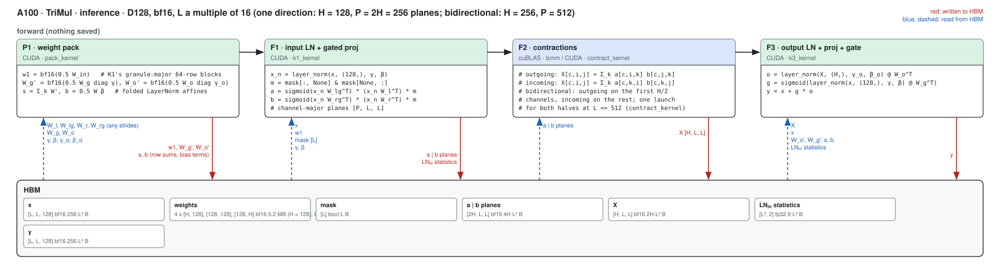

##### P1 · weight pack (pack_kernel)

| (Length, Dimension) | (128, 128) | (256, 128) | (384, 128) | (512, 128) | (640, 128) | (768, 128) |
|---|---|---|---|---|---|---|
| implementation | CUDA | CUDA | CUDA | CUDA | CUDA | CUDA |
| 성능 확인 | ✗ | ✗ | ✗ | ✗ | ✗ | ✗ |
| cache build | ✓ | ✓ | ✓ | ✓ | ✓ | ✓ |

##### F1 · input LN + gated proj (k1_kernel)

| (Length, Dimension) | (128, 128) | (256, 128) | (384, 128) | (512, 128) | (640, 128) | (768, 128) |
|---|---|---|---|---|---|---|
| implementation | CUDA | CUDA | CUDA | CUDA | CUDA | CUDA |
| 성능 확인 | ✗ | ✗ | ✗ | ✗ | ✗ | ✗ |
| cache build | ✓ | ✓ | ✓ | ✓ | ✓ | ✓ |

##### F2 · contractions (contract_kernel up to L = 512, else cuBLAS)

| (Length, Dimension) | (128, 128) | (256, 128) | (384, 128) | (512, 128) | (640, 128) | (768, 128) |
|---|---|---|---|---|---|---|
| implementation | CUDA | CUDA | CUDA | CUDA | cuBLAS | cuBLAS |
| 성능 확인 | ✗ | ✗ | ✗ | ✗ | ✗ | ✗ |
| cache build | ✓ | ✓ | ✓ | ✓ | ✓ | ✓ |

##### F3 · output LN + proj + gate (k3_kernel)

| (Length, Dimension) | (128, 128) | (256, 128) | (384, 128) | (512, 128) | (640, 128) | (768, 128) |
|---|---|---|---|---|---|---|
| implementation | CUDA | CUDA | CUDA | CUDA | CUDA | CUDA |
| 성능 확인 | ✗ | ✗ | ✗ | ✗ | ✗ | ✗ |
| cache build | ✓ | ✓ | ✓ | ✓ | ✓ | ✓ |

### Training

#### Fused path · D128, every L

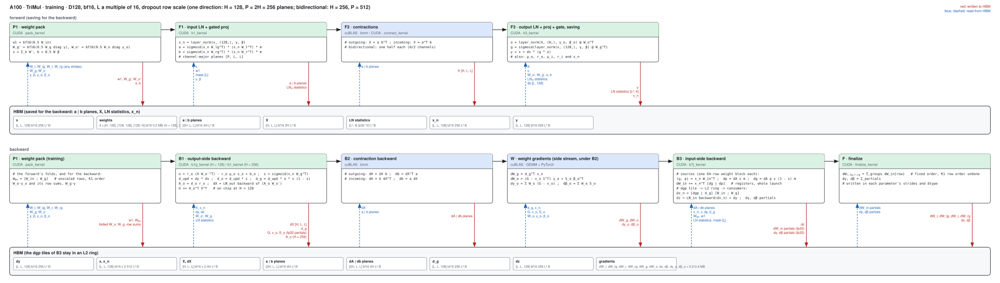

##### P1 · weight pack (pack_kernel, forward and backward)

| (Length, Dimension) | (128, 128) | (256, 128) | (384, 128) | (512, 128) | (640, 128) | (768, 128) |
|---|---|---|---|---|---|---|
| implementation | CUDA | CUDA | CUDA | CUDA | CUDA | CUDA |
| 성능 확인 | ✗ | ✗ | ✗ | ✗ | ✗ | ✗ |
| cache build | ✓ | ✓ | ✓ | ✓ | ✓ | ✓ |

##### F1 · input LN + gated proj (k1_kernel)

| (Length, Dimension) | (128, 128) | (256, 128) | (384, 128) | (512, 128) | (640, 128) | (768, 128) |
|---|---|---|---|---|---|---|
| implementation | CUDA | CUDA | CUDA | CUDA | CUDA | CUDA |
| 성능 확인 | ✗ | ✗ | ✗ | ✗ | ✗ | ✗ |
| cache build | ✓ | ✓ | ✓ | ✓ | ✓ | ✓ |

##### F2 · contractions (contract_kernel up to L = 512, else cuBLAS; the backward is cuBLAS)

| (Length, Dimension) | (128, 128) | (256, 128) | (384, 128) | (512, 128) | (640, 128) | (768, 128) |
|---|---|---|---|---|---|---|
| implementation | CUDA | CUDA | CUDA | CUDA | cuBLAS | cuBLAS |
| 성능 확인 | ✗ | ✗ | ✗ | ✗ | ✗ | ✗ |
| cache build | ✓ | ✓ | ✓ | ✓ | ✓ | ✓ |

##### F3 · output LN + proj + gate, saving (k3_kernel)

| (Length, Dimension) | (128, 128) | (256, 128) | (384, 128) | (512, 128) | (640, 128) | (768, 128) |
|---|---|---|---|---|---|---|
| implementation | CUDA | CUDA | CUDA | CUDA | CUDA | CUDA |
| 성능 확인 | ✗ | ✗ | ✗ | ✗ | ✗ | ✗ |
| cache build | ✓ | ✓ | ✓ | ✓ | ✓ | ✓ |

##### B1 · output-side backward (b1_kernel)

| (Length, Dimension) | (128, 128) | (256, 128) | (384, 128) | (512, 128) | (640, 128) | (768, 128) |
|---|---|---|---|---|---|---|
| implementation | CUDA | CUDA | CUDA | CUDA | CUDA | CUDA |
| 성능 확인 | ✗ | ✗ | ✗ | ✗ | ✗ | ✗ |
| cache build | ✓ | ✓ | ✓ | ✓ | ✓ | ✓ |

##### B3 · input-side backward (b7j_kernel)

| (Length, Dimension) | (128, 128) | (256, 128) | (384, 128) | (512, 128) | (640, 128) | (768, 128) |
|---|---|---|---|---|---|---|
| implementation | CUDA | CUDA | CUDA | CUDA | CUDA | CUDA |
| 성능 확인 | ✗ | ✗ | ✗ | ✗ | ✗ | ✗ |
| cache build | ✓ | ✓ | ✓ | ✓ | ✓ | ✓ |

##### F · finalize (finalize_kernel)

| (Length, Dimension) | (128, 128) | (256, 128) | (384, 128) | (512, 128) | (640, 128) | (768, 128) |
|---|---|---|---|---|---|---|
| implementation | CUDA | CUDA | CUDA | CUDA | CUDA | CUDA |
| 성능 확인 | ✗ | ✗ | ✗ | ✗ | ✗ | ✗ |
| cache build | ✓ | ✓ | ✓ | ✓ | ✓ | ✓ |

## One direction (`TriangleMultiplication`, outgoing or incoming)

The same kernels at H = 128 (P = 256 planes): the contraction is always cuBLAS, B1 is `b1g_kernel` (the W_o gradient
accumulates on chip), and the figures above apply with those widths.

### Inference

| (Length, Dimension) | (128, 128) | (256, 128) | (384, 128) | (512, 128) | (640, 128) | (768, 128) |
|---|---|---|---|---|---|---|
| P1 · pack_kernel | CUDA | CUDA | CUDA | CUDA | CUDA | CUDA |
| F1 · k1_kernel | CUDA | CUDA | CUDA | CUDA | CUDA | CUDA |
| F2 · contraction | cuBLAS | cuBLAS | cuBLAS | cuBLAS | cuBLAS | cuBLAS |
| F3 · k3_kernel | CUDA | CUDA | CUDA | CUDA | CUDA | CUDA |
| 성능 확인 | ✗ | ✗ | ✗ | ✗ | ✗ | ✗ |
| cache build | ✓ | ✓ | ✓ | ✓ | ✓ | ✓ |

### Training

| (Length, Dimension) | (128, 128) | (256, 128) | (384, 128) | (512, 128) | (640, 128) | (768, 128) |
|---|---|---|---|---|---|---|
| P1 · pack_kernel | CUDA | CUDA | CUDA | CUDA | CUDA | CUDA |
| F1 · k1_kernel | CUDA | CUDA | CUDA | CUDA | CUDA | CUDA |
| F2 · contraction | cuBLAS | cuBLAS | cuBLAS | cuBLAS | cuBLAS | cuBLAS |
| F3 · k3_kernel (saving) | CUDA | CUDA | CUDA | CUDA | CUDA | CUDA |
| B1 · b1g_kernel | CUDA | CUDA | CUDA | CUDA | CUDA | CUDA |
| B3 · b7j_kernel | CUDA | CUDA | CUDA | CUDA | CUDA | CUDA |
| F · finalize_kernel | CUDA | CUDA | CUDA | CUDA | CUDA | CUDA |
| 성능 확인 | ✗ | ✗ | ✗ | ✗ | ✗ | ✗ |
| cache build | ✓ | ✓ | ✓ | ✓ | ✓ | ✓ |

## Wide path · D64 / D128 (fp32) / D256 / D384, bf16 and fp32 (TF32), both modules

Every width and dtype the D128 fused path above does not take runs the *wide* kernels (`kernels/trimul_inproj/cuda/sm80_wide.py` and `sm80/wide_*.cuh`, `wide_ops.cu`, extension
`trimul_sm80_wide`): D = 64 / 128 / 256 / 384, one direction (hidden H = D) and bidirectional (H = 2 D), `torch.bfloat16` and `torch.float32` (TF32 tensor cores, fp32 accumulation,
one precision per path: the kernels and the cuBLAS calls of this path run TF32 whatever `torch.backends.cuda.matmul.allow_tf32` says), inference and training. D128 bf16 keeps the fused
D128 kernels (they are tuned for exactly that width); D128 fp32 is the wide path's.

**Served** when `implementation=miniworld`, a contiguous `[B, L, L, D]` pair of bf16 or fp32 (a batch runs plane by plane), `d_hidden = D` with D in {64, 128, 256, 384} (the bidirectional
module's weights are `2 D` wide), L a multiple of 16, a `[B, L]` bool mask or none, both LayerNorm eps equal, the input LayerNorm's weight and bias of one dtype, compute capability (8, 0),
the engine backend not forced to Triton. `MINIWORLD_TRIMUL_SM80=0` turns every CUDA TriMul path off, `MINIWORLD_TRIMUL_SM80_WIDE=0` the wide one alone (the Triton path serves; at fp32 it is the
module's PyTorch composition: the Triton kernels are bf16 only). A failed extension build warns once and keeps the existing path.

### Data flow (one direction; bidirectional = H = 2 D, its two contractions taking one half of the planes each)

```
z [T, D] (T = L^2)
  wpack_kernel            fold both LayerNorm affines into the weights, one launch (inference: forward layouts; training also the backward's)
  statistics              (mean, rstd) of every row of z                      -- ln_stats_rows (or inside k1w, below)
  k1w_kernel   (F1)       z . W1'^T -> sigmoid(g) p -> planes [2 H, T] bf16 / fp32 (channel-major), pair mask applied
  contraction  (F2)       cuBLAS batched GEMM per channel: X[c] = A[c] B[c]^T (outgoing) or A[c]^T B[c] (incoming)  ->  X [H, T]
  statistics              (mean, rstd) over the H channels of every token of X -- ln_stats_cm (or inside k3w)
  k3w_kernel   (F3)       p' = LN_out(X) . Wo'^T,  g' = LN_in(z) . Wg'^T,  y = z + ds (p' (1 + tanh g'))   (+ p', g' saved in training)
```

The LayerNorm is folded into the GEMM so that every MMA reads the *raw* operand: `LN(x) . W^T = r (x . W'^T) - r mu s + b` with `W' = round(0.5 gamma W)` (bf16, or TF32-rounded fp32),
`s` the row sums of the rounded values, `b = 0.5 W beta`, `(mu, r)` the token's statistics (always fp32, two-pass; `tests/registry/test_layernorm_is_never_bf16.py`), so the normalisation is two FMAs per
accumulator in the epilogue and no LayerNorm pass runs. The factor 0.5 makes `sigmoid(g) p = p' (1 + tanh g')` (one `tanh.approx`, one FMA; exact in bf16). A masked pair's plane value is
exactly 0 (the product is rounded to bf16 first, then multiplied by the 0 / 1 pair mask, as the Triton front).

### Kernels (all `mma.sync` bf16 m16n8k16 or TF32 m16n8k8, `ldmatrix`, `cp.async` rings, 16-byte staged epilogue stores)

| id | kernel | what it does |
|---|---|---|
| P | `wpack_kernel` | every folded weight layout of a call in one launch (a warp per row): the four front matrices packed 16 rows per 8 channels (gate rows then projection rows, so that one thread holds both factors of an output), `Wg'`, `Wo'`, their row sums and fold vectors; training adds the backward's unscaled packed weights and the exact `LayerNorm_out` row-sum vector. Never cached (a captured CUDA graph must repack after an optimiser step). |
| S1 | `ln_stats_rows_kernel` | `(mean, rstd)` of the rows of `z`: D / 8 sixteen-byte granules per row, every load of a pass issued before the first reduction, two-pass in registers. Runs at 75-100 % of the byte floor. |
| S2 | `ln_stats_cm_kernel` | `(mean, rstd)` over the H channels of every token of the channel-major `X`: every read covers 512 contiguous bytes of a channel row; pivot-shifted partial sums merged with Chan's formula. |
| F1 | `k1w_kernel` | CTA = 128 tokens x 64 plane channels (128 packed weight rows), 4 warps with 64 x 64 warp tiles, a 4-stage `cp.async` ring, one barrier per 32-deep k-tile; the accumulators of a thread hold `g` and `p` of the same channel, the epilogue forms `bf16(sigmoid(g) p) * mask` and stages the planes channel-major (272-byte rows, conflict-free) for 256-byte coalesced stores. The tokens of every m16 tile are permuted so that a thread's accumulator pair is two adjacent tokens: no shuffle in the transposing store. |
| F2 | cuBLAS `bmm` | one batched GEMM per direction half, bf16 (TF32 for fp32); at 172-220 TFLOP/s (72-92 % of the 240 TFLOP/s GEMM ceiling) it is the one stage already near the cuBLAS ceiling. |
| F3 | `k3w_kernel` | CTA = 128 tokens x 64 / 128 output channels, 8 warps, two accumulator sets (the `X . Wo'^T` GEMM, then the `z . Wg'^T` GEMM) and one epilogue; `o = bf16(p' (1 + tanh g'))` is staged into the shared tile and every thread then adds the residual and the dropout row scale in 16-byte granules with coalesced loads issued four granules ahead (see "what was tried"). Training also stores `p'` and `g'` (bf16, the 0.5-scaled units). |
| B | backward | `gate_bwd` (output-gate gradients, the column sums of the output projection's gradient as per-block partial rows: deterministic, no atomics) -> cuBLAS `dor = Wo'^T dpr^T` -> `lnout_bwd` (LayerNorm_out backward, `dgamma`, `dbeta`) -> cuBLAS `dWo` (long-K GEMM chunked 32 ways: cuBLAS runs K = T unsplit otherwise) -> cuBLAS contraction backward -> `k1wb_kernel` (recomputes k1w's pre-activations, `dg = da p s (1 - s)`, `dp = da s`, written token-major in the packed row order) -> `ln_apply` -> one cuBLAS GEMM for all five input-side weight gradients and one for `dx_n` -> `lnin_bwd` (+ residual gradient, LayerNorm_in gradients) -> `wfin` (every gradient into its own tensor, parameter dtype and strides). Every reduction is a per-block partial row plus a small `colsum` kernel: replays are bit-identical. |

The GEMM tile of F1 / F3 / B is one class (`WTile` in `wide_gemm.cuh`: runtime leading dimensions, a token permutation, K-major 64-byte rows with a pair-of-rows swizzle so that the ldmatrix reads
of plain and permuted rows are both conflict-free, M-major tiles for the channel-major `X`); `run_fast` addresses every `cp.async` granule and every fragment of a stage from a few per-thread
bases plus immediates. **Statistics inside the kernels** (bf16, hidden width <= 128, i.e. D64: one direction (hidden 64) and bidirectional (hidden 128); D128 bf16 runs the fused D128 path): `k1w` computes the rows' statistics from its own tile (every
k-tile is still in its ring slot when the mainloop ends; thread i owns row i, two passes over its granules) and `k3w` those of `X`, so S1 / S2 and their reads of `z` / `X` disappear;
wider hidden dimensions keep the kernels (four or more CTAs would redo the same rows).

**fp32 / TF32.** The same stages with `WTile32` (BK = 16, `mma.m16n8k8`, TF32-rounded folded weights, fp32 activations and planes); the cuBLAS calls run under an `allow_tf32` context of their own.
Accuracy is held to the PyTorch composition with TF32 matmuls (the realistic yardstick of an fp32 run on this card) against the same module in true fp32.

### Kernel status per shape (wide path)

#### Wide path · bf16 · inference (D64 / D256 / D384, both modules)

| (Length, Dimension) | (128, 64) | (256, 64) | (384, 64) | (512, 64) | (640, 64) | (768, 64) | (128, 256) | (256, 256) | (384, 256) | (512, 256) | (640, 256) | (768, 256) | (128, 384) | (256, 384) | (384, 384) | (512, 384) | (640, 384) | (768, 384) |
|---|---|---|---|---|---|---|---|---|---|---|---|---|---|---|---|---|---|---|
| P · wpack_kernel | CUDA | CUDA | CUDA | CUDA | CUDA | CUDA | CUDA | CUDA | CUDA | CUDA | CUDA | CUDA | CUDA | CUDA | CUDA | CUDA | CUDA | CUDA |
| S1 · ln_stats_rows_kernel | in k1w | in k1w | in k1w | in k1w | in k1w | in k1w | CUDA | CUDA | CUDA | CUDA | CUDA | CUDA | CUDA | CUDA | CUDA | CUDA | CUDA | CUDA |
| F1 · k1w_kernel | CUDA | CUDA | CUDA | CUDA | CUDA | CUDA | CUDA | CUDA | CUDA | CUDA | CUDA | CUDA | CUDA | CUDA | CUDA | CUDA | CUDA | CUDA |
| F2 · contraction | cuBLAS | cuBLAS | cuBLAS | cuBLAS | cuBLAS | cuBLAS | cuBLAS | cuBLAS | cuBLAS | cuBLAS | cuBLAS | cuBLAS | cuBLAS | cuBLAS | cuBLAS | cuBLAS | cuBLAS | cuBLAS |
| S2 · ln_stats_cm_kernel | in k3w | in k3w | in k3w | in k3w | in k3w | in k3w | CUDA | CUDA | CUDA | CUDA | CUDA | CUDA | CUDA | CUDA | CUDA | CUDA | CUDA | CUDA |
| F3 · k3w_kernel | CUDA | CUDA | CUDA | CUDA | CUDA | CUDA | CUDA | CUDA | CUDA | CUDA | CUDA | CUDA | CUDA | CUDA | CUDA | CUDA | CUDA | CUDA |
| 성능 확인 | ✗ | ✗ | ✗ | ✗ | ✗ | ✗ | ✗ | ✗ | ✗ | ✗ | ✗ | ✗ | ✗ | ✗ | ✗ | ✗ | ✗ | ✗ |
| cache build | ✓ | ✓ | ✓ | ✓ | ✓ | ✓ | ✓ | ✓ | ✓ | ✓ | ✓ | ✓ | ✓ | ✓ | ✓ | ✓ | ✓ | ✓ |

#### Wide path · bf16 · training (D64 / D256 / D384, both modules)

| (Length, Dimension) | (128, 64) | (256, 64) | (384, 64) | (512, 64) | (640, 64) | (768, 64) | (128, 256) | (256, 256) | (384, 256) | (512, 256) | (640, 256) | (768, 256) | (128, 384) | (256, 384) | (384, 384) | (512, 384) | (640, 384) | (768, 384) |
|---|---|---|---|---|---|---|---|---|---|---|---|---|---|---|---|---|---|---|
| P · wpack_kernel (forward and backward packs) | CUDA | CUDA | CUDA | CUDA | CUDA | CUDA | CUDA | CUDA | CUDA | CUDA | CUDA | CUDA | CUDA | CUDA | CUDA | CUDA | CUDA | CUDA |
| S1 · ln_stats_rows_kernel | in k1w | in k1w | in k1w | in k1w | in k1w | in k1w | CUDA | CUDA | CUDA | CUDA | CUDA | CUDA | CUDA | CUDA | CUDA | CUDA | CUDA | CUDA |
| F1 · k1w_kernel | CUDA | CUDA | CUDA | CUDA | CUDA | CUDA | CUDA | CUDA | CUDA | CUDA | CUDA | CUDA | CUDA | CUDA | CUDA | CUDA | CUDA | CUDA |
| F2 · contraction | cuBLAS | cuBLAS | cuBLAS | cuBLAS | cuBLAS | cuBLAS | cuBLAS | cuBLAS | cuBLAS | cuBLAS | cuBLAS | cuBLAS | cuBLAS | cuBLAS | cuBLAS | cuBLAS | cuBLAS | cuBLAS |
| S2 · ln_stats_cm_kernel | in k3w | in k3w | in k3w | in k3w | in k3w | in k3w | CUDA | CUDA | CUDA | CUDA | CUDA | CUDA | CUDA | CUDA | CUDA | CUDA | CUDA | CUDA |
| F3 · k3w_kernel (saving p', g') | CUDA | CUDA | CUDA | CUDA | CUDA | CUDA | CUDA | CUDA | CUDA | CUDA | CUDA | CUDA | CUDA | CUDA | CUDA | CUDA | CUDA | CUDA |
| B1 · gate_bwd_kernel | CUDA | CUDA | CUDA | CUDA | CUDA | CUDA | CUDA | CUDA | CUDA | CUDA | CUDA | CUDA | CUDA | CUDA | CUDA | CUDA | CUDA | CUDA |
| B2 · output-projection and weight-gradient GEMMs (dor, dWo) | cuBLAS | cuBLAS | cuBLAS | cuBLAS | cuBLAS | cuBLAS | cuBLAS | cuBLAS | cuBLAS | cuBLAS | cuBLAS | cuBLAS | cuBLAS | cuBLAS | cuBLAS | cuBLAS | cuBLAS | cuBLAS |
| B3 · lnout_bwd_kernel | CUDA | CUDA | CUDA | CUDA | CUDA | CUDA | CUDA | CUDA | CUDA | CUDA | CUDA | CUDA | CUDA | CUDA | CUDA | CUDA | CUDA | CUDA |
| B4 · contraction backward | cuBLAS | cuBLAS | cuBLAS | cuBLAS | cuBLAS | cuBLAS | cuBLAS | cuBLAS | cuBLAS | cuBLAS | cuBLAS | cuBLAS | cuBLAS | cuBLAS | cuBLAS | cuBLAS | cuBLAS | cuBLAS |
| B5 · k1wb_kernel | CUDA | CUDA | CUDA | CUDA | CUDA | CUDA | CUDA | CUDA | CUDA | CUDA | CUDA | CUDA | CUDA | CUDA | CUDA | CUDA | CUDA | CUDA |
| B6 · ln_apply_kernel | CUDA | CUDA | CUDA | CUDA | CUDA | CUDA | CUDA | CUDA | CUDA | CUDA | CUDA | CUDA | CUDA | CUDA | CUDA | CUDA | CUDA | CUDA |
| B7 · dW and dx_n GEMMs (one wide GEMM each) | cuBLAS | cuBLAS | cuBLAS | cuBLAS | cuBLAS | cuBLAS | cuBLAS | cuBLAS | cuBLAS | cuBLAS | cuBLAS | cuBLAS | cuBLAS | cuBLAS | cuBLAS | cuBLAS | cuBLAS | cuBLAS |
| B8 · lnin_bwd_kernel | CUDA | CUDA | CUDA | CUDA | CUDA | CUDA | CUDA | CUDA | CUDA | CUDA | CUDA | CUDA | CUDA | CUDA | CUDA | CUDA | CUDA | CUDA |
| F · wfin_kernel (every gradient in its dtype and strides) | CUDA | CUDA | CUDA | CUDA | CUDA | CUDA | CUDA | CUDA | CUDA | CUDA | CUDA | CUDA | CUDA | CUDA | CUDA | CUDA | CUDA | CUDA |
| 성능 확인 | ✗ | ✗ | ✗ | ✗ | ✗ | ✗ | ✗ | ✗ | ✗ | ✗ | ✗ | ✗ | ✗ | ✗ | ✗ | ✗ | ✗ | ✗ |
| cache build | ✓ | ✓ | ✓ | ✓ | ✓ | ✓ | ✓ | ✓ | ✓ | ✓ | ✓ | ✓ | ✓ | ✓ | ✓ | ✓ | ✓ | ✓ |

#### Wide path · fp32 (TF32) · inference (D64 / D128 / D256 / D384, both modules)

| (Length, Dimension) | (128, 64) | (256, 64) | (384, 64) | (512, 64) | (640, 64) | (768, 64) | (128, 128) | (256, 128) | (384, 128) | (512, 128) | (640, 128) | (768, 128) | (128, 256) | (256, 256) | (384, 256) | (512, 256) | (640, 256) | (768, 256) | (128, 384) | (256, 384) | (384, 384) | (512, 384) | (640, 384) | (768, 384) |
|---|---|---|---|---|---|---|---|---|---|---|---|---|---|---|---|---|---|---|---|---|---|---|---|---|
| P · wpack_kernel | CUDA | CUDA | CUDA | CUDA | CUDA | CUDA | CUDA | CUDA | CUDA | CUDA | CUDA | CUDA | CUDA | CUDA | CUDA | CUDA | CUDA | CUDA | CUDA | CUDA | CUDA | CUDA | CUDA | CUDA |
| S1 · ln_stats_rows_kernel | CUDA | CUDA | CUDA | CUDA | CUDA | CUDA | CUDA | CUDA | CUDA | CUDA | CUDA | CUDA | CUDA | CUDA | CUDA | CUDA | CUDA | CUDA | CUDA | CUDA | CUDA | CUDA | CUDA | CUDA |
| F1 · k1w32_kernel | CUDA | CUDA | CUDA | CUDA | CUDA | CUDA | CUDA | CUDA | CUDA | CUDA | CUDA | CUDA | CUDA | CUDA | CUDA | CUDA | CUDA | CUDA | CUDA | CUDA | CUDA | CUDA | CUDA | CUDA |
| F2 · contraction (TF32) | cuBLAS | cuBLAS | cuBLAS | cuBLAS | cuBLAS | cuBLAS | cuBLAS | cuBLAS | cuBLAS | cuBLAS | cuBLAS | cuBLAS | cuBLAS | cuBLAS | cuBLAS | cuBLAS | cuBLAS | cuBLAS | cuBLAS | cuBLAS | cuBLAS | cuBLAS | cuBLAS | cuBLAS |
| S2 · ln_stats_cm_kernel | CUDA | CUDA | CUDA | CUDA | CUDA | CUDA | CUDA | CUDA | CUDA | CUDA | CUDA | CUDA | CUDA | CUDA | CUDA | CUDA | CUDA | CUDA | CUDA | CUDA | CUDA | CUDA | CUDA | CUDA |
| F3 · k3w32_kernel | CUDA | CUDA | CUDA | CUDA | CUDA | CUDA | CUDA | CUDA | CUDA | CUDA | CUDA | CUDA | CUDA | CUDA | CUDA | CUDA | CUDA | CUDA | CUDA | CUDA | CUDA | CUDA | CUDA | CUDA |
| 성능 확인 | ✗ | ✗ | ✗ | ✗ | ✗ | ✗ | ✗ | ✗ | ✗ | ✗ | ✗ | ✗ | ✗ | ✗ | ✗ | ✗ | ✗ | ✗ | ✗ | ✗ | ✗ | ✗ | ✗ | ✗ |
| cache build | ✓ | ✓ | ✓ | ✓ | ✓ | ✓ | ✓ | ✓ | ✓ | ✓ | ✓ | ✓ | ✓ | ✓ | ✓ | ✓ | ✓ | ✓ | ✓ | ✓ | ✓ | ✓ | ✓ | ✓ |

#### Wide path · fp32 (TF32) · training (D64 / D128 / D256 / D384, both modules)

| (Length, Dimension) | (128, 64) | (256, 64) | (384, 64) | (512, 64) | (640, 64) | (768, 64) | (128, 128) | (256, 128) | (384, 128) | (512, 128) | (640, 128) | (768, 128) | (128, 256) | (256, 256) | (384, 256) | (512, 256) | (640, 256) | (768, 256) | (128, 384) | (256, 384) | (384, 384) | (512, 384) | (640, 384) | (768, 384) |
|---|---|---|---|---|---|---|---|---|---|---|---|---|---|---|---|---|---|---|---|---|---|---|---|---|
| P · wpack_kernel | CUDA | CUDA | CUDA | CUDA | CUDA | CUDA | CUDA | CUDA | CUDA | CUDA | CUDA | CUDA | CUDA | CUDA | CUDA | CUDA | CUDA | CUDA | CUDA | CUDA | CUDA | CUDA | CUDA | CUDA |
| S1, S2 · statistics | CUDA | CUDA | CUDA | CUDA | CUDA | CUDA | CUDA | CUDA | CUDA | CUDA | CUDA | CUDA | CUDA | CUDA | CUDA | CUDA | CUDA | CUDA | CUDA | CUDA | CUDA | CUDA | CUDA | CUDA |
| F1 · k1w32_kernel | CUDA | CUDA | CUDA | CUDA | CUDA | CUDA | CUDA | CUDA | CUDA | CUDA | CUDA | CUDA | CUDA | CUDA | CUDA | CUDA | CUDA | CUDA | CUDA | CUDA | CUDA | CUDA | CUDA | CUDA |
| F2 · contraction (TF32) | cuBLAS | cuBLAS | cuBLAS | cuBLAS | cuBLAS | cuBLAS | cuBLAS | cuBLAS | cuBLAS | cuBLAS | cuBLAS | cuBLAS | cuBLAS | cuBLAS | cuBLAS | cuBLAS | cuBLAS | cuBLAS | cuBLAS | cuBLAS | cuBLAS | cuBLAS | cuBLAS | cuBLAS |
| F3 · k3w32_kernel (saving p', g') | CUDA | CUDA | CUDA | CUDA | CUDA | CUDA | CUDA | CUDA | CUDA | CUDA | CUDA | CUDA | CUDA | CUDA | CUDA | CUDA | CUDA | CUDA | CUDA | CUDA | CUDA | CUDA | CUDA | CUDA |
| B · backward: gate_bwd, lnout_bwd, k1wb32_kernel, ln_apply, lnin_bwd, wfin (fp32 instantiations) + TF32 cuBLAS GEMMs | CUDA | CUDA | CUDA | CUDA | CUDA | CUDA | CUDA | CUDA | CUDA | CUDA | CUDA | CUDA | CUDA | CUDA | CUDA | CUDA | CUDA | CUDA | CUDA | CUDA | CUDA | CUDA | CUDA | CUDA |
| 성능 확인 | ✗ | ✗ | ✗ | ✗ | ✗ | ✗ | ✗ | ✗ | ✗ | ✗ | ✗ | ✗ | ✗ | ✗ | ✗ | ✗ | ✗ | ✗ | ✗ | ✗ | ✗ | ✗ | ✗ | ✗ |
| cache build | ✓ | ✓ | ✓ | ✓ | ✓ | ✓ | ✓ | ✓ | ✓ | ✓ | ✓ | ✓ | ✓ | ✓ | ✓ | ✓ | ✓ | ✓ | ✓ | ✓ | ✓ | ✓ | ✓ | ✓ |

## Measurements (2026-10-04)

`bench.py target=triangle_multiplication` and `target=triangle_multiplication_bidirectional` (module level, `implementation=miniworld`), B = 1, 10 % masked tokens, row dropout 0.25 in training, CUDA-graph timing
(`cudagraph=manual`), one A100 80GB PCIe (300 W), torch 2.13.0+cu129 / triton 3.7.1, one frozen snapshot of the sources (2026-10-04, jobs 63207 bf16 inference and 63206 bf16 training on gpu04, 63248 fp32 on gpu02, 63290 bidirectional on gpu04;
the four implementations of a row were measured in the same process, the node-to-node spread of one kernel is up to ~10 %, the in-process run-to-run spread about 1-2 %). Milliseconds. bf16 rows run
`precision=bf16-mixed` (bf16 operands in every implementation, the norm affine parameters stay fp32 as the module pins them); fp32 rows run `precision=32` with `allow_tf32` (TF32 tensor cores for every implementation's GEMMs).
**×** = cuEquivariance's time over ours in bf16, PyTorch compiled's time over ours in fp32, because cuEquivariance's fp32 arm computes another function (its output is ~2 away from the reference in relative error: `— (invalid)`);
the Triton path is shown for reference and is never the denominator. The Triton kernels are bf16 only: in fp32 the module's `implementation=triton` path *is* the PyTorch composition (it warns and falls back), so the fp32 tables have no
separate Triton column; the bench's fp32 reference is that same composition (same TF32 setting), so its own error reads 0 and ours is its distance to it (the tests hold ours to the composition's own distance from true fp32 arithmetic). Anthropic: `— (not measured)` (the parent's measurement; the earlier D128 record is in "Earlier D128 measurements" below). Lengths: the bf16 inference tables carry every registry length (128-768), the other
tables 128 / 384 / 768 only (the in-process comparison with the Triton path at the registry's other training lengths is in "Routing check" below).

### One direction · bf16 · Inference

| (Length, Dimension) | PyTorch compiled | cuEquivariance | Anthropic | Triton path | ours | × |
|---|---|---|---|---|---|---|
| (128, 64) | 0.103 | 0.054 | — (not measured) | 0.044 | 0.041 | 1.33 |
| (256, 64) | 0.300 | 0.135 | — (not measured) | 0.104 | 0.101 | 1.33 |
| (384, 64) | 0.667 | 0.304 | — (not measured) | 0.209 | 0.201 | 1.52 |
| (512, 64) | 1.581 | 0.536 | — (not measured) | 0.357 | 0.341 | 1.57 |
| (640, 64) | 3.566 | 0.848 | — (not measured) | 0.580 | 0.562 | 1.51 |
| (768, 64) | 5.481 | 1.242 | — (not measured) | 0.862 | 0.835 | 1.49 |
| (128, 128) | 0.169 | 0.086 | — (not measured) | 0.083 | 0.066 | 1.31 |
| (256, 128) | 0.597 | 0.253 | — (not measured) | 0.241 | 0.174 | 1.46 |
| (384, 128) | 1.366 | 0.548 | — (not measured) | 0.496 | 0.342 | 1.60 |
| (512, 128) | 3.333 | 0.976 | — (not measured) | 0.890 | 0.630 | 1.55 |
| (640, 128) | 7.560 | 1.572 | — (not measured) | 1.419 | 1.044 | 1.50 |
| (768, 128) | 11.369 | 2.330 | — (not measured) | 2.135 | 1.588 | 1.47 |
| (128, 256) | 0.322 | 0.198 | — (not measured) | 0.195 | 0.144 | 1.37 |
| (256, 256) | 1.198 | 0.715 | — (not measured) | 0.602 | 0.514 | 1.39 |
| (384, 256) | 2.789 | 1.563 | — (not measured) | 1.287 | 1.116 | 1.40 |
| (512, 256) | 7.053 | 2.842 | — (not measured) | 2.346 | 2.051 | 1.39 |
| (640, 256) | 14.909 | 4.560 | — (not measured) | 3.785 | 3.308 | 1.38 |
| (768, 256) | 22.799 | 6.792 | — (not measured) | 5.610 | 4.969 | 1.37 |
| (128, 384) | 0.461 | 0.392 | — (not measured) | 0.374 | 0.237 | 1.66 |
| (256, 384) | 1.966 | 2.630 | — (not measured) | 1.151 | 0.909 | 2.89 |
| (384, 384) | 5.066 | 5.833 | — (not measured) | 2.486 | 2.025 | 2.88 |
| (512, 384) | 11.655 | 10.454 | — (not measured) | 4.453 | 3.682 | 2.84 |
| (640, 384) | 26.710 | 16.456 | — (not measured) | 7.157 | 5.965 | 2.76 |
| (768, 384) | 40.508 | 23.900 | — (not measured) | 10.601 | 8.832 | 2.71 |

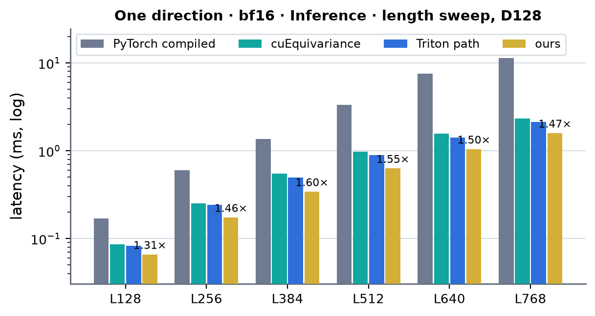 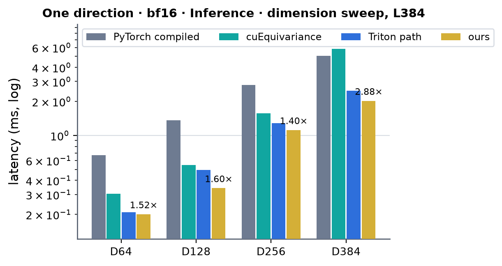 <!-- measure_bars -->

accuracy against the fp32 PyTorch reference (bench columns, min - max over the rows): output relative error cuEquivariance 2.83e-03 - 3.19e-03; ours 2.59e-03 - 2.98e-03; PyTorch compiled 2.96e-03 - 3.19e-03; Triton path 2.67e-03 - 2.88e-03

### One direction · bf16 · Training

| (Length, Dimension) | PyTorch compiled | cuEquivariance | Anthropic | Triton path | ours | × |
|---|---|---|---|---|---|---|
| (128, 64) | 0.355 | 0.244 | — (not measured) | 0.183 | 0.179 | 1.36 |
| (384, 64) | 2.120 | 1.361 | — (not measured) | 0.976 | 0.942 | 1.44 |
| (768, 64) | 16.080 | 5.193 | — (not measured) | 3.735 | 3.619 | 1.43 |
| (128, 128) | 0.542 | 0.420 | — (not measured) | 0.291 | 0.286 | 1.47 |
| (384, 128) | 4.228 | 2.594 | — (not measured) | 1.944 | 1.494 | 1.74 |
| (768, 128) | 33.244 | 10.494 | — (not measured) | 7.894 | 6.485 | 1.62 |
| (128, 256) | 1.065 | 0.884 | — (not measured) | 0.597 | 0.629 | 1.41 |
| (384, 256) | 8.591 | 6.247 | — (not measured) | 4.435 | 4.418 | 1.41 |
| (768, 256) | 66.385 | 34.046 | — (not measured) | 19.453 | 18.639 | 1.83 |
| (128, 384) | 1.560 | 1.501 | — (not measured) | 1.015 | 1.044 | 1.44 |
| (384, 384) | 15.123 | 16.986 | — (not measured) | 8.068 | 7.995 | 2.12 |
| (768, 384) | 122.9 | 67.336 | — (not measured) | 34.846 | 33.833 | 1.99 |

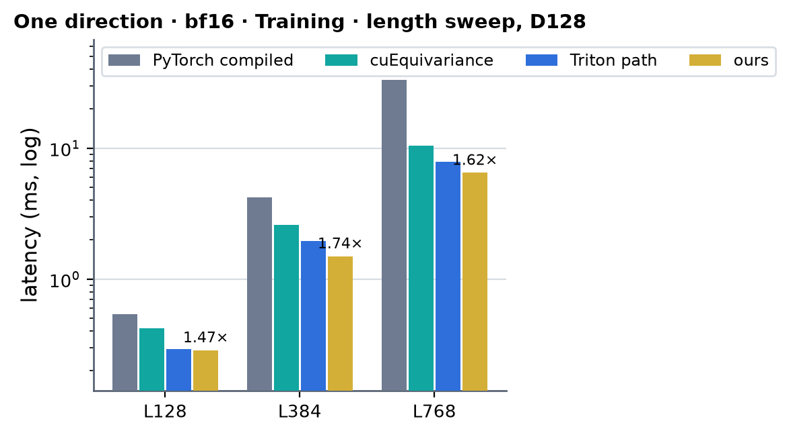 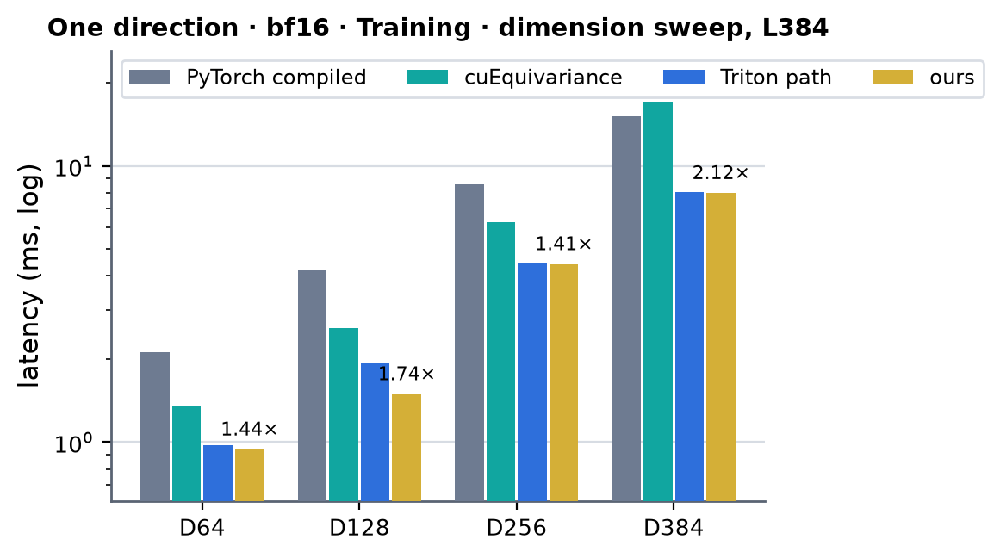 <!-- measure_bars -->

accuracy against the fp32 PyTorch reference (bench columns, min - max over the rows): output relative error cuEquivariance 3.02e-03 - 3.36e-03; ours 2.83e-03 - 3.25e-03; PyTorch compiled 3.18e-03 - 3.36e-03; Triton path 2.96e-03 - 3.13e-03; gradient relative error cuEquivariance 4.30e-03 - 4.75e-03; ours 3.85e-03 - 4.05e-03; PyTorch compiled 4.30e-03 - 4.51e-03; Triton path 4.45e-03 - 4.67e-03

### One direction · fp32 (TF32) · Inference

| (Length, Dimension) | PyTorch compiled | cuEquivariance | Anthropic | Triton path | ours | × |
|---|---|---|---|---|---|---|
| (128, 64) | 0.118 | — (invalid) | — (not measured) | — (PyTorch composition) | 0.065 | 1.83 |
| (384, 64) | 1.046 | — (invalid) | — (not measured) | — (PyTorch composition) | 0.406 | 2.58 |
| (768, 64) | 6.860 | — (invalid) | — (not measured) | — (PyTorch composition) | 1.756 | 3.91 |
| (128, 128) | 0.244 | — (invalid) | — (not measured) | — (PyTorch composition) | 0.110 | 2.22 |
| (384, 128) | 2.191 | — (invalid) | — (not measured) | — (PyTorch composition) | 0.871 | 2.51 |
| (768, 128) | 13.787 | — (invalid) | — (not measured) | — (PyTorch composition) | 3.862 | 3.57 |
| (128, 256) | 0.525 | — (invalid) | — (not measured) | — (PyTorch composition) | 0.247 | 2.13 |
| (384, 256) | 5.095 | — (invalid) | — (not measured) | — (PyTorch composition) | 2.213 | 2.30 |
| (768, 256) | 30.904 | — (invalid) | — (not measured) | — (PyTorch composition) | 9.678 | 3.19 |
| (128, 384) | 0.807 | — (invalid) | — (not measured) | — (PyTorch composition) | 0.446 | 1.81 |
| (384, 384) | 8.647 | — (invalid) | — (not measured) | — (PyTorch composition) | 4.096 | 2.11 |
| (768, 384) | 49.294 | — (invalid) | — (not measured) | — (PyTorch composition) | 17.558 | 2.81 |

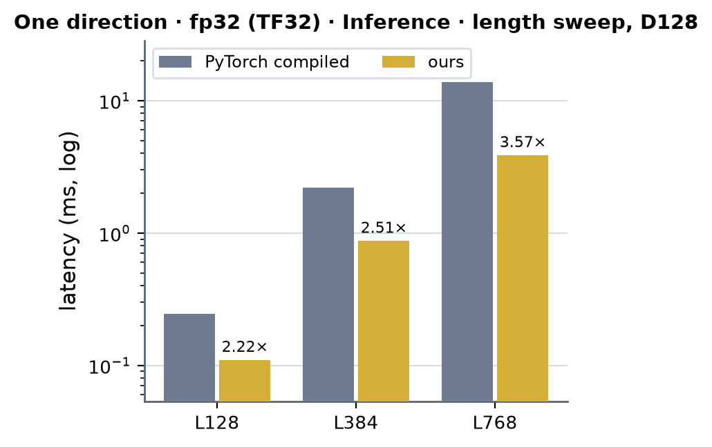 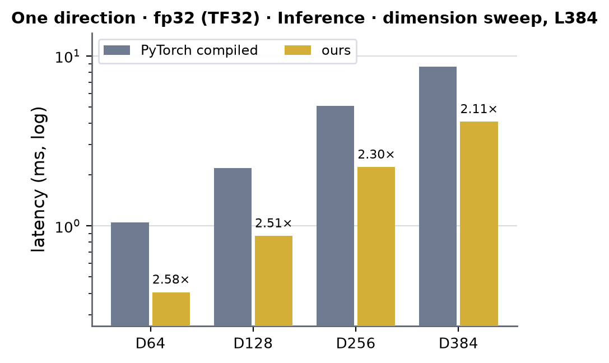 <!-- measure_bars -->

accuracy against the fp32 PyTorch reference (bench columns, min - max over the rows): output relative error ours 1.37e-03 - 1.45e-03; PyTorch compiled 0.00e+00 - 0.00e+00

### One direction · fp32 (TF32) · Training

| (Length, Dimension) | PyTorch compiled | cuEquivariance | Anthropic | Triton path | ours | × |
|---|---|---|---|---|---|---|
| (128, 64) | 0.423 | — (invalid) | — (not measured) | — (PyTorch composition) | 0.263 | 1.61 |
| (384, 64) | 3.332 | — (invalid) | — (not measured) | — (PyTorch composition) | 1.743 | 1.91 |
| (768, 64) | 20.458 | — (invalid) | — (not measured) | — (PyTorch composition) | 7.117 | 2.87 |
| (128, 128) | 0.820 | — (invalid) | — (not measured) | — (PyTorch composition) | 0.473 | 1.73 |
| (384, 128) | 6.737 | — (invalid) | — (not measured) | — (PyTorch composition) | 3.669 | 1.84 |
| (768, 128) | 41.163 | — (invalid) | — (not measured) | — (PyTorch composition) | 15.610 | 2.64 |
| (128, 256) | 1.687 | — (invalid) | — (not measured) | — (PyTorch composition) | 1.083 | 1.56 |
| (384, 256) | 15.417 | — (invalid) | — (not measured) | — (PyTorch composition) | 8.747 | 1.76 |
| (768, 256) | 94.973 | — (invalid) | — (not measured) | — (PyTorch composition) | 37.199 | 2.55 |
| (128, 384) | 2.753 | — (invalid) | — (not measured) | — (PyTorch composition) | 1.978 | 1.39 |
| (384, 384) | 26.684 | — (invalid) | — (not measured) | — (PyTorch composition) | 17.179 | 1.55 |
| (768, 384) | 151.2 | — (invalid) | — (not measured) | — (PyTorch composition) | 70.151 | 2.16 |

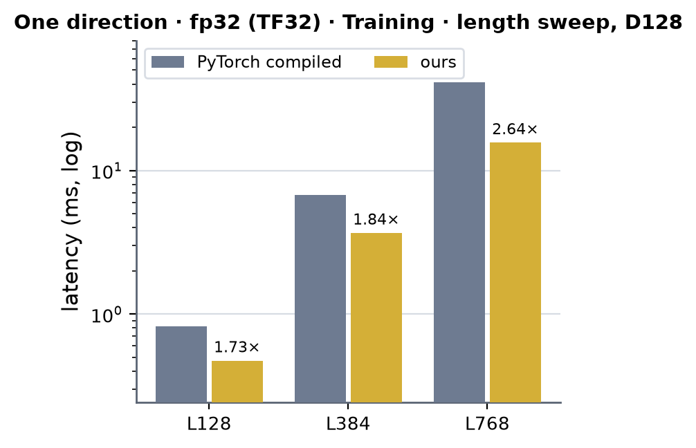 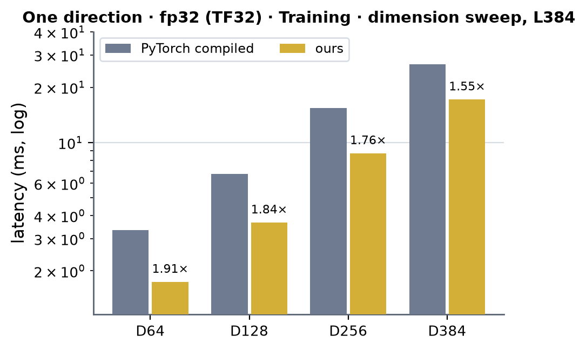 <!-- measure_bars -->

accuracy against the fp32 PyTorch reference (bench columns, min - max over the rows): output relative error ours 1.54e-03 - 1.62e-03; PyTorch compiled 0.00e+00 - 2.28e-05; gradient relative error ours 2.14e-03 - 2.26e-03; PyTorch compiled 0.00e+00 - 5.46e-05

### Bidirectional · bf16 · Inference

| (Length, Dimension) | PyTorch compiled | cuEquivariance | Anthropic | Triton path | ours | × |
|---|---|---|---|---|---|---|
| (384, 64) | 1.221 | 0.524 | — (not measured) | 0.356 | 0.351 | 1.49 |
| (128, 128) | 0.287 | 0.145 | — (not measured) | 0.129 | 0.095 | 1.53 |
| (384, 128) | 2.549 | 1.223 | — (not measured) | 0.854 | 0.591 | 2.07 |
| (768, 128) | 21.861 | 5.118 | — (not measured) | 3.657 | 2.794 | 1.83 |
| (384, 256) | 6.097 | 3.323 | — (not measured) | 2.214 | 1.948 | 1.71 |
| (384, 384) | 10.476 | 7.312 | — (not measured) | 4.275 | 3.480 | 2.10 |

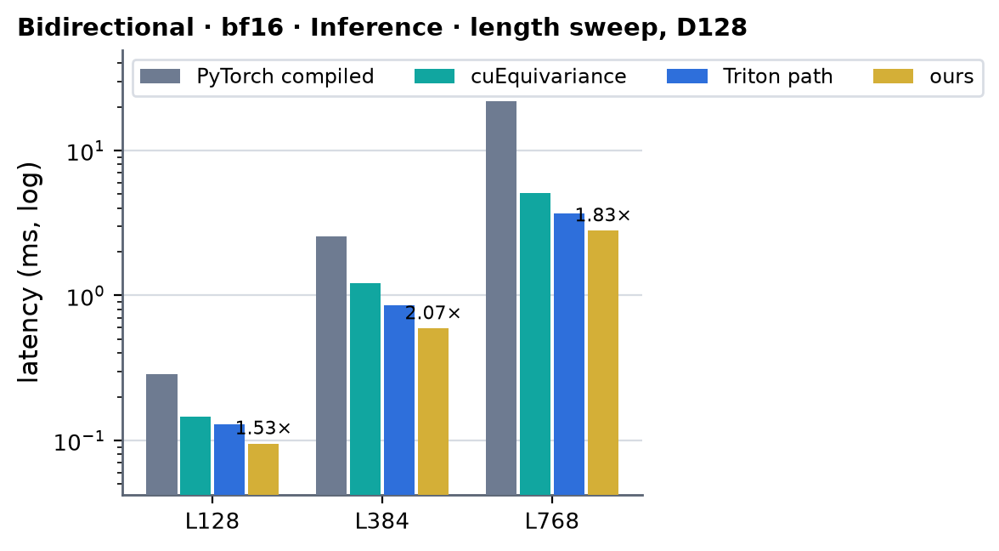 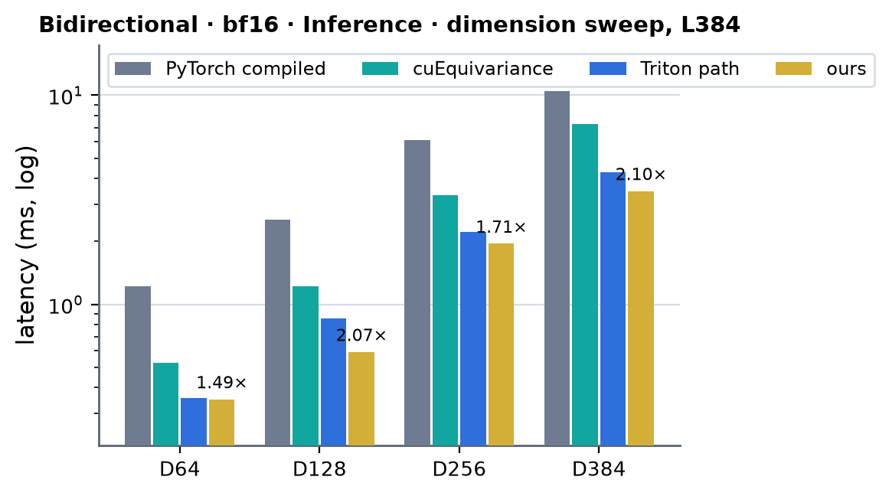 <!-- measure_bars -->

accuracy against the fp32 PyTorch reference (bench columns, min - max over the rows): output relative error cuEquivariance 3.50e-03 - 3.59e-03; ours 3.23e-03 - 3.61e-03; PyTorch compiled 3.76e-03 - 3.86e-03; Triton path 3.36e-03 - 3.44e-03

### Bidirectional · bf16 · Training

| (Length, Dimension) | PyTorch compiled | cuEquivariance | Anthropic | Triton path | ours | × |
|---|---|---|---|---|---|---|
| (384, 64) | 3.396 | 2.087 | — (not measured) | 1.551 | 1.496 | 1.40 |
| (128, 128) | 0.876 | 0.584 | — (not measured) | 0.463 | 0.417 | 1.40 |
| (384, 128) | 7.407 | 4.478 | — (not measured) | 3.131 | 2.498 | 1.79 |
| (768, 128) | 62.584 | 18.427 | — (not measured) | 13.982 | 11.141 | 1.65 |
| (384, 256) | 17.725 | 11.128 | — (not measured) | 7.581 | 7.404 | 1.50 |
| (384, 384) | 33.381 | 22.033 | — (not measured) | 14.361 | 13.689 | 1.61 |

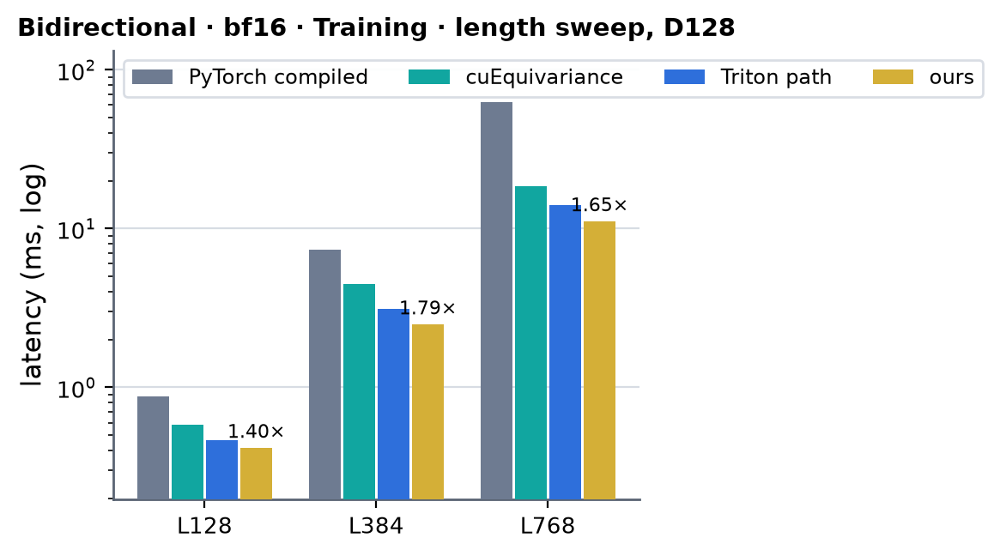 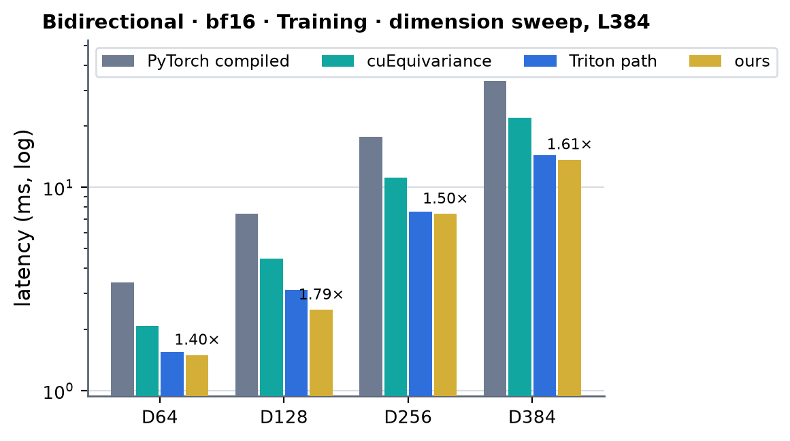 <!-- measure_bars -->

accuracy against the fp32 PyTorch reference (bench columns, min - max over the rows): output relative error cuEquivariance 3.73e-03 - 3.82e-03; ours 3.56e-03 - 3.96e-03; PyTorch compiled 4.02e-03 - 4.12e-03; Triton path 3.73e-03 - 3.82e-03; gradient relative error cuEquivariance 5.24e-03 - 5.32e-03; ours 4.48e-03 - 4.62e-03; PyTorch compiled 5.10e-03 - 5.18e-03; Triton path 5.27e-03 - 5.35e-03

### Routing check: ours against the Triton path at every registry length (bf16, one direction)

The rule for the dispatch is that a shape more than 5 % slower than the Triton path would go back to it. The table is Triton time / our time of the module's step (CUDA graph, both modules in one process, interleaved, best of two repeats; job 63266 for the
unmarked entries; † = the bench rows above, which come from separate processes). Inference (bench, every length) is 1.03-1.07x at D64, 1.26-1.45x at D128, 1.13-1.35x at D256 and 1.20-1.58x at D384. Training:

| training step, Triton / ours | L128 | L256 | L384 | L512 | L640 | L768 |
|---|---|---|---|---|---|---|
| D64 | 1.02 † | 1.06 | 1.04 † | 1.02 | 1.05 | 1.03 † |
| D128 (fused D128 path) | 1.02 † | 1.24 | 1.30 † | 1.20 | 1.23 | 1.22 † |
| D256 | **0.96** | 1.03 | 1.01 | 1.01 | 1.04 | 1.04 † |
| D384 | 0.99 | 0.99 | 1.01 | 1.01 | 1.03 | 1.03 † |

No shape is more than 5 % slower in the in-process comparison, so none is routed to Triton. The closest is D256 L128 training (0.629 ms against 0.604 in the same process, 4.1 % slower; the bench rows 0.629 against 0.597, 5.4 %): a 0.6 ms step that is
launch- and latency-bound (about 25 launches in the backward). A shape-keyed rule for 25 us was not worth the dispatch complexity; if the maintainer wants it, it is one condition in `integrations/trimul_sm80.serves` (width 256, L <= 128, grad enabled).

### Speed of light (wide path: D64 / D256 / D384 bf16, all widths fp32)

SoL = the composite floor of the decomposition: per kernel `max(essential bytes / 1.60 TB/s, FLOP / peak)`, summed. The ceilings were measured on this card in the same session (job 63266): a 8192^3 cuBLAS GEMM runs at **237.6 TFLOP/s in bf16**
and **122.3 TFLOP/s in TF32** (the floors use 240 and 122; fp32 without TF32 is 19 TFLOP/s), a 1 GiB device copy at 1.71 TB/s (the floors keep the 1.60 TB/s of the other pages). Every tensor a kernel reads or writes counts once: inference is S1 (read `z`; none
where the statistics are inside `k1w`), F1 (read `z`, write the planes; 8 T D H FLOP for the four projections), F2 (read the planes, write `X`; 2 L^3 H FLOP), S2 (read `X`; none where inside `k3w`), F3 (read `X` and `z`, write `y`, plus `p'` and `g'` in training; 2 T D H + 2 T D^2
FLOP); the training backward adds the nine stages of the table above the same way (gate backward, `dor` GEMM, `lnout_bwd`, `dWo` GEMM, contraction backward, `k1wb` with its recomputed projections, `ln_apply`, the two wide GEMMs, `lnin_bwd`).
Ours is the bench's module time (the CUDA-graph replay carries ~10 us of launch latency and the weight pack, which the floor does not). The fused D128 path is in the table of its own decomposition under "Earlier D128 measurements".


| module | dtype | mode | (L, D) | ours (µs) | SoL floor (µs) | % of SoL |
|---|---|---|---|---|---|---|
| One direction | bf16 | inference | (384, 64) | 201 | 106 | 53 % |
| One direction | bf16 | inference | (768, 64) | 835 | 525 | 63 % |
| One direction | bf16 | inference | (384, 256) | 1116 | 719 | 64 % |
| One direction | bf16 | inference | (768, 256) | 4969 | 3277 | 66 % |
| One direction | bf16 | inference | (384, 384) | 2025 | 1441 | 71 % |
| One direction | bf16 | inference | (768, 384) | 8832 | 6364 | 72 % |
| One direction | bf16 | training | (384, 64) | 942 | 649 | 69 % |
| One direction | bf16 | training | (768, 64) | 3619 | 2848 | 79 % |
| One direction | bf16 | training | (384, 256) | 4418 | 3109 | 70 % |
| One direction | bf16 | training | (768, 256) | 18639 | 13449 | 72 % |
| One direction | bf16 | training | (384, 384) | 7995 | 5827 | 73 % |
| One direction | bf16 | training | (768, 384) | 33833 | 24824 | 73 % |
| One direction | fp32 (TF32) | inference | (384, 64) | 406 | 260 | 64 % |
| One direction | fp32 (TF32) | inference | (768, 64) | 1756 | 1230 | 70 % |
| One direction | fp32 (TF32) | inference | (384, 128) | 871 | 536 | 61 % |
| One direction | fp32 (TF32) | inference | (768, 128) | 3862 | 2528 | 65 % |
| One direction | fp32 (TF32) | inference | (384, 256) | 2213 | 1422 | 64 % |
| One direction | fp32 (TF32) | inference | (768, 256) | 9678 | 6458 | 67 % |
| One direction | fp32 (TF32) | inference | (384, 384) | 4096 | 2846 | 69 % |
| One direction | fp32 (TF32) | inference | (768, 384) | 17558 | 12539 | 71 % |
| One direction | fp32 (TF32) | training | (384, 64) | 1743 | 1345 | 77 % |
| One direction | fp32 (TF32) | training | (768, 64) | 7117 | 5861 | 82 % |
| One direction | fp32 (TF32) | training | (384, 128) | 3669 | 2706 | 74 % |
| One direction | fp32 (TF32) | training | (768, 128) | 15610 | 11790 | 76 % |
| One direction | fp32 (TF32) | training | (384, 256) | 8747 | 6182 | 71 % |
| One direction | fp32 (TF32) | training | (768, 256) | 37199 | 26654 | 72 % |
| One direction | fp32 (TF32) | training | (384, 384) | 17179 | 11522 | 67 % |
| One direction | fp32 (TF32) | training | (768, 384) | 70151 | 48982 | 70 % |
| Bidirectional | bf16 | inference | (384, 64) | 351 | 177 | 50 % |
| Bidirectional | bf16 | inference | (384, 256) | 1948 | 1311 | 67 % |
| Bidirectional | bf16 | inference | (384, 384) | 3480 | 2630 | 76 % |
| Bidirectional | bf16 | training | (384, 64) | 1496 | 1026 | 69 % |
| Bidirectional | bf16 | training | (384, 256) | 7404 | 5231 | 71 % |
| Bidirectional | bf16 | training | (384, 384) | 13689 | 10260 | 75 % |

### Where the time goes (`torch.profiler` CUPTI kernel times of the wide path's own entry point, one process, job 63266; one direction, microseconds per call)

| kernels | D64 L384 bf16 inference | D64 L384 bf16 training | D256 L384 bf16 inference | D256 L384 bf16 training | D384 L768 bf16 inference | D384 L768 bf16 training | D256 L384 fp32 inference | D256 L384 fp32 training |
|---|---|---|---|---|---|---|---|---|
| F1 · `k1w_kernel` (`k1w32_kernel` at fp32) | 88 | 92 | 491 | 499 | 3561 | 3824 | 949 | 890 |
| F3 · `k3w_kernel` (`k3w32_kernel`), training saving `p'`, `g'` | 58 | 86 | 337 | 436 | 2450 | 3285 | 564 | 734 |
| S1 + S2 · statistics kernels (inside `k1w` / `k3w` where `—`) | — | — | 115 | 114 | 567 | 577 | 198 | 197 |
| B1 · `gate_bwd_kernel` | | 71 | | 253 | | 1426 | | 475 |
| B3 · `lnout_bwd_kernel` | | 45 | | 163 | | 877 | | 280 |
| B5 · `k1wb_kernel` (`k1wb32_kernel`) | | 136 | | 756 | | 5369 | | 1221 |
| B6 · `ln_apply_kernel` | | 26 | | 96 | | 552 | | 183 |
| B8 · `lnin_bwd_kernel` | | 59 | | 204 | | 1138 | | 355 |
| cuBLAS GEMMs (inference 1: the contraction; training 7: contraction, `dor`, `dWo`, contraction backward, `dW`, `dx_n`) | 49 | 383 | 168 | 1704 | 1584 | 15767 | 454 | 3731 |
| small kernels (`wpack`, `colsum`, `wfin`, two reductions) | 4 | 48 | 10 | 99 | 14 | 168 | 11 | 103 |
| sum of kernel times | 200 | 947 | 1120 | 4324 | 8175 | 32982 | 2175 | 8173 |
| graph replay of the same call | 196 | 910 | 1123 | 4496 | 8938 | 34074 | 2253 | 8809 |
| floor (SoL table) | 106 | 649 | 719 | 3109 | 6364 | 24824 | 1438 | 6218 |

Per stage, D384 L768 inference (bf16): `k1w` 696 GFLOP in 3.56 ms = 195 TFLOP/s (81 % of the 240 TFLOP/s GEMM ceiling), `k3w` 348 GFLOP in 2.45 ms = 142 TFLOP/s (59 %), the cuBLAS contraction 348 GFLOP in 1.58 ms = 220 TFLOP/s (92 %), each statistics kernel
453 MB in 0.28 ms = 1.6 TB/s (at the byte floor). At D256 L384: `k1w` 77 GFLOP in 0.49 ms = 157 TFLOP/s (66 %), `k3w` 39 GFLOP in 0.34 ms = 115 TFLOP/s (48 %), the contraction 172 TFLOP/s (72 %), statistics 1.3 TB/s (83 %). The widths are GEMM
bound: `k1w`, `k3w` and the contraction are 89-93 % of the inference time at D256 / D384, the statistics kernels 7-10 %; `k3w` is the stage with the most left in it (its epilogue reads `z` and the dropout scale and writes `y` after two
GEMMs on two accumulator sets). At D64 the step is the small kernels of a 0.2 ms problem. In training at D384 L768 the cuBLAS GEMMs are 48 % of the step (seven launches: the contraction, its two backward GEMMs, `dor`, `dWo`, `dW` and
`dx_n`), `k1wb` (the recomputed front with the gradient epilogue) 16 %.

### What was tried and did not pay (2026-10-03 / 04)

- **Epilogue loads of the output stage (kept the fix).** The first `k3w` loaded `z` and the dropout scale with one scattered 4-byte load per accumulator pair, each followed by its use: about half of the kernel's
  time was those serialised latencies. `o` is now staged into the shared tile and the residual is added in 16-byte granules with coalesced loads
  issued four granules ahead (`k3_residual_pass`; the same in `k3w32`): bit-identical results.
- **Address arithmetic of the tile loop (kept the fix).** `WTile::run` executed ~160 integer instructions per warp and k-tile next to 64 HMMA (SASS instruction counts); `WTile::run_fast` (addresses from per-thread bases plus
  immediates, whole tiles only) is bit-identical and took `k1w` 994 -> 849 us, `k3w` 679 -> 567 us and `k1wb` 1.28 -> 1.18 ms at D384, L384 (together with the item above for `k3w`).
- **D64 (kept).** `k3w<64>` at 2 CTAs / SM (`__launch_bounds__(256, 2)`, 120 registers, no spill) and the row statistics inside `k1w` / `k3w` (no `ln_stats_*` kernels, no re-read of `z` / `X`): D64 L384 inference
  0.225 -> 0.198 ms in one process. The same statistics fusion at hidden width >= 256 would redo each token tile's rows in four or more CTAs, so those widths keep the two kernels.
- **`k3x` (removed).** One accumulator set (the `X Wo'^T` GEMM, a shared stash of `p'`, then the `z Wg'^T` GEMM on the same accumulators) to fit two CTAs / SM at every width. The first version was 3x slower (255 registers, spills,
  re-materialised addressing); with explicit addressing the instruction blow-up went away but it was no faster than `k3w` once `k3w`'s epilogue was fixed. Not in the patch (kept in the scratch copy).
- **`k1w` with gate tiles and a one-GEMM `k3s` (removed).** Putting the gate GEMM into `k1w`'s accumulators (so that `g'` comes out of the front) and a single `k3` GEMM with a concatenated K: no faster than the two-accumulator kernels.
- **A custom contraction at the wide widths.** The cuBLAS batched GEMM runs at 177-222 TFLOP/s on these shapes (74-92 % of the 240 TFLOP/s large-GEMM ceiling): not worth a kernel for H >= 256; the fused D128 path keeps its own contraction for the
  bidirectional module up to L = 512.
- **Not tried:** a cuBLASLt algorithm search for the contraction / backward GEMMs (the other A100 pages measured 1.00-1.04x at these sizes), and warp-level ping-pong between the epilogue and the next tile's MMAs.
- **fp32.** The Triton kernels have no fp32 path (bf16 only), so before this work an fp32 module ran the PyTorch composition; cuEquivariance's fp32 arm computes another function (output relative error ~2 against the reference),
  so neither is a baseline for the TF32 path other than PyTorch compiled.

### Limits and next

- Not served on A100 (they run the Triton path, or the PyTorch composition at fp32): L not a multiple of 16, widths other than 64 / 128 / 256 / 384, a non-contiguous pair, a mask that is not a `[B, L]` bool tensor, dtypes other than bf16 / fp32,
  `engine_backend="triton"`. A batch runs plane by plane (B launch sets, no batched kernels).
- The short training steps (D256 / D384 at L128: 0.6 / 1.0 ms, ~25 launches in the backward) are launch- and latency-bound and sit at 0.96-0.99x of the Triton path's step (see "Routing check"); a fused backward front (fewer launches) is
  the lever there.
- The in-kernel statistics only exist for hidden width <= 128 (four or more CTAs share a token tile above that); at D256 / D384 the two statistics kernels are 7-10 % of the inference time (at the byte floor each), so folding them into the
  GEMM kernels another way (partial sums per n-tile CTA merged by a tiny kernel, or recomputed rows) is the open item there.
- `k3w` runs at 48-59 % of the GEMM ceiling against `k1w`'s 66-81 % (inference, D256 L384 / D384 L768): its epilogue (the residual pass) and two accumulator sets are what is left; at D384 L768 it is 2.45 of 8.18 ms.
- The cuBLAS contraction runs at 72-92 % of the GEMM ceiling: any further gain there is a custom batched triangle GEMM that fuses the planes' production (`k1w`) into its operand loads.
- Anthropic's A100 TriMul numbers at D64 / D256 / D384 are not measured; the D128 record is in "Earlier D128 measurements".

## Earlier D128 measurements (2026-10-02; with the Anthropic record)

One A100 80GB PCIe (300 W; job 61446 on gpu08, all four implementations of a row measured in the same job), torch 2.13.0+cu129 /
triton 3.7.1, bf16, B = 1, D128, 10 % masked tokens, dropout row scale 0.25 in training, CUDA-graph timing (median of 7 x 20
replays), `benchmarks/runners/bench.py` (module level, `implementation=miniworld`; the Triton path is the same module with
`MINIWORLD_TRIMUL_SM80=0`). Run-to-run and node-to-node spread is about 2 %. Times in ms. **×** = the faster of Anthropic and
cuEquivariance divided by ours (above 1 = ours is faster): Anthropic for inference, cuEquivariance for training, because
Anthropic ships no backward. The Anthropic column is the branch record of
`experiments/a100_anthropic_baseline` (tag `archive/a100-sm80-branch-20260928`; torch 2.10, best row per shape, not re-measured
on this toolchain: the payload is not on the cssb cluster).

### Bidirectional · Inference

| (Length, Dimension) | PyTorch compiled | cuEquivariance | Anthropic | Triton path | ours | × |
|---|---|---|---|---|---|---|
| (384, 128) | 2.552 | 1.191 | 0.790 | 0.854 | 0.598 | 1.32 |
| (768, 128) | 20.369 | 5.100 | 3.417 | 3.705 | 2.835 | 1.21 |

 <!-- measure_bars -->

### Bidirectional · Training

| (Length, Dimension) | PyTorch compiled | cuEquivariance | Anthropic | Triton path | ours | × |
|---|---|---|---|---|---|---|
| (384, 128) | 7.334 | 4.388 | — (no bwd) | 3.137 | 2.533 | 1.73 |
| (768, 128) | 59.131 | 18.084 | — (no bwd) | 14.152 | 11.379 | 1.59 |

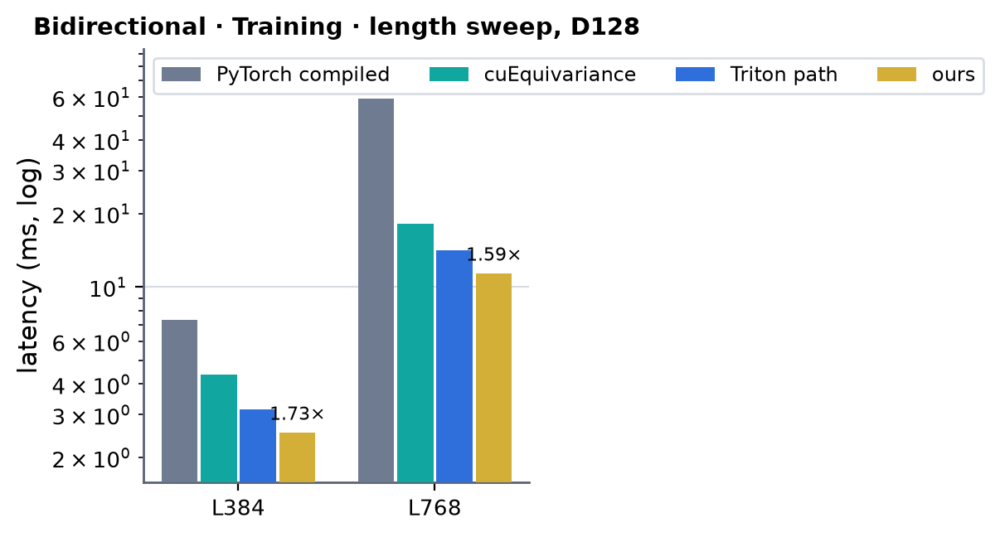 <!-- measure_bars -->

### One direction · Inference

| (Length, Dimension) | PyTorch compiled | cuEquivariance | Anthropic | Triton path | ours | × |
|---|---|---|---|---|---|---|
| (384, 128) | 1.358 | 0.545 | 0.407 | 0.494 | 0.345 | 1.18 |
| (768, 128) | 10.727 | 2.340 | 1.776 | 2.156 | 1.607 | 1.11 |

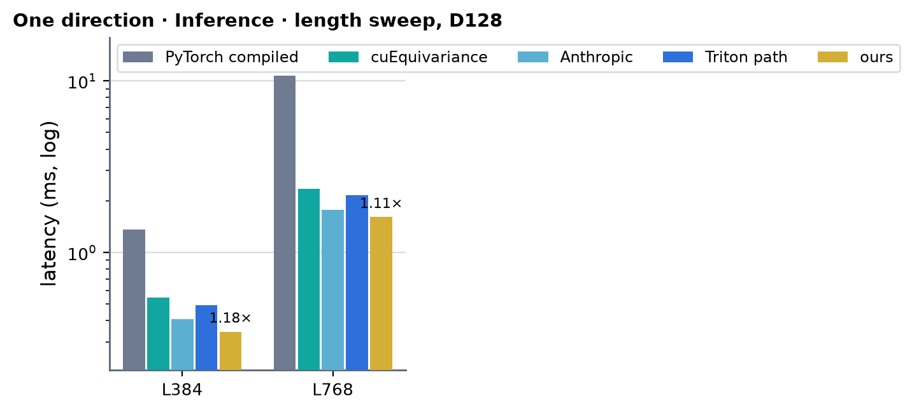 <!-- measure_bars -->

### One direction · Training

| (Length, Dimension) | PyTorch compiled | cuEquivariance | Anthropic | Triton path | ours | × |
|---|---|---|---|---|---|---|
| (384, 128) | 4.229 | 2.577 | — (no bwd) | 1.919 | 1.526 | 1.69 |
| (768, 128) | 31.872 | 10.486 | — (no bwd) | 7.950 | 6.611 | 1.59 |

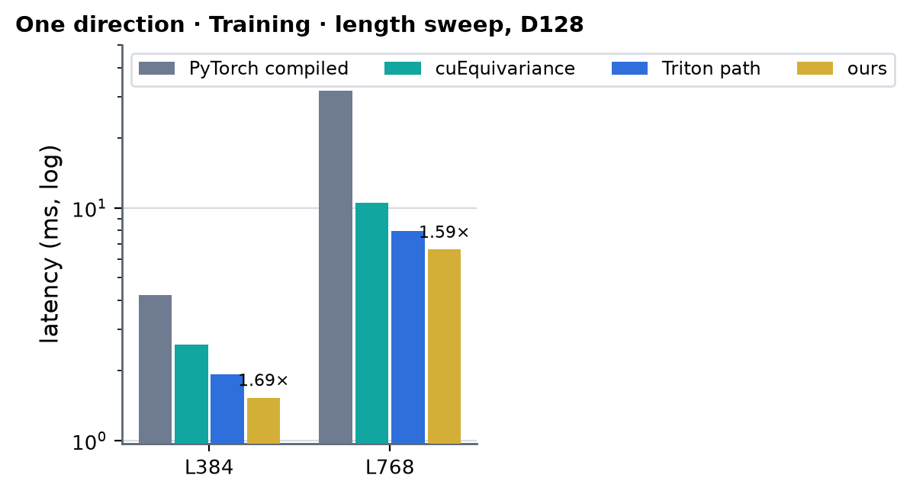 <!-- measure_bars -->

### Speed of light (fused D128 path, 2026-10-02)

SoL = the composite floor of the decomposition: per kernel `max(essential bytes / 1.60 TB/s, FLOP / 240 TFLOP/s)`, summed
(both ceilings measured on this card, `experiments/a100_trimul_fwd`).

| mode | variant | L | ours (µs) | SoL floor (µs) | % of SoL |
|---|---|---|---|---|---|
| inference | bidirectional | 384 | 598 | 397 | 66 % |
| inference | bidirectional | 768 | 2835 | 1988 | 70 % |
| inference | one direction | 384 | 345 | 222 | 64 % |
| inference | one direction | 768 | 1607 | 1088 | 68 % |
| training | bidirectional | 384 | 2533 | 1640 | 65 % |
| training | bidirectional | 768 | 11379 | 7770 | 68 % |
| training | one direction | 384 | 1526 | 1000 | 66 % |
| training | one direction | 768 | 6611 | 4610 | 70 % |

Where the training step goes (one direction, L384, Nsight Compute, 2026-10-02): `b7j` 512 µs (34 %), `b1g` 260 µs (17 %),
`k3` 187 µs (12 %), `k1` 125 µs (8 %), three cuBLAS GEMMs about 260 µs; all four custom kernels run 8-12 warps per SM
(250 registers per thread) and are latency-bound (tensor pipe active: k1 53 %, b7j 42 %, b1g 25 %, k3 20 %; stalls: fixed-latency
dependencies, barriers, long scoreboard), not bandwidth-bound (DRAM 37-41 %).
