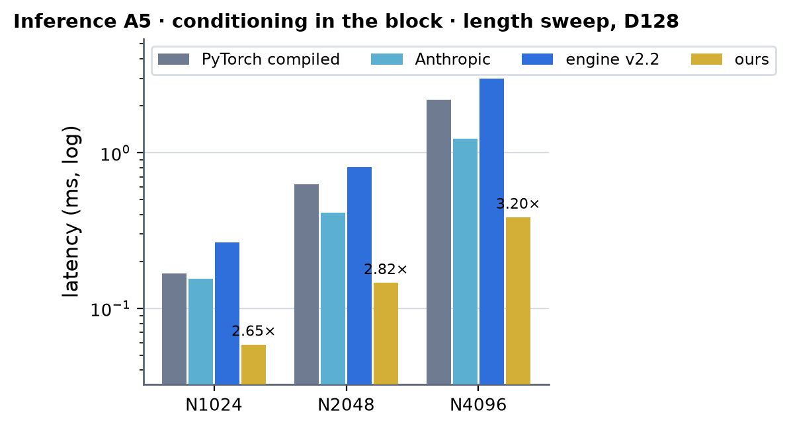
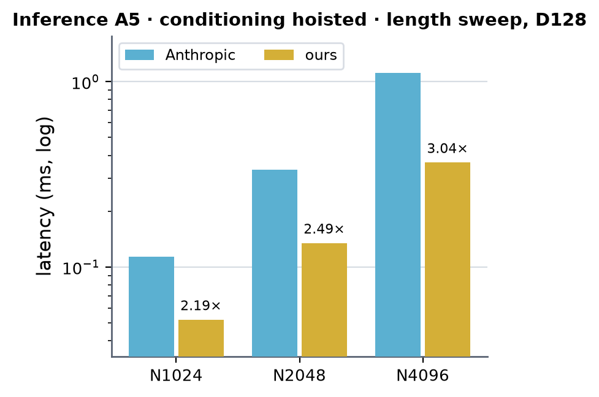
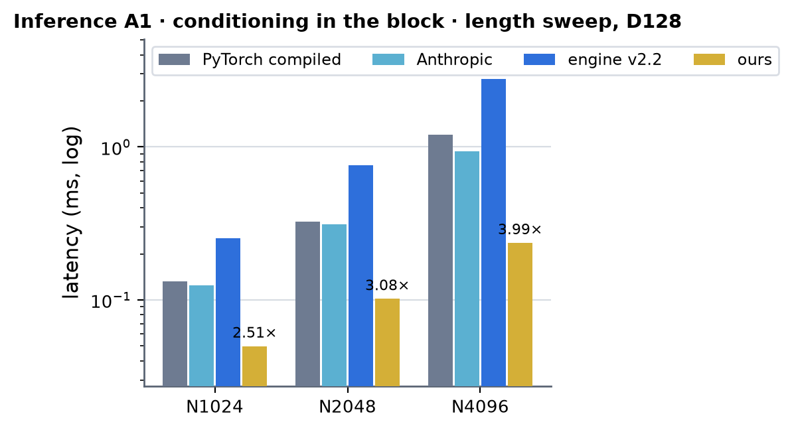
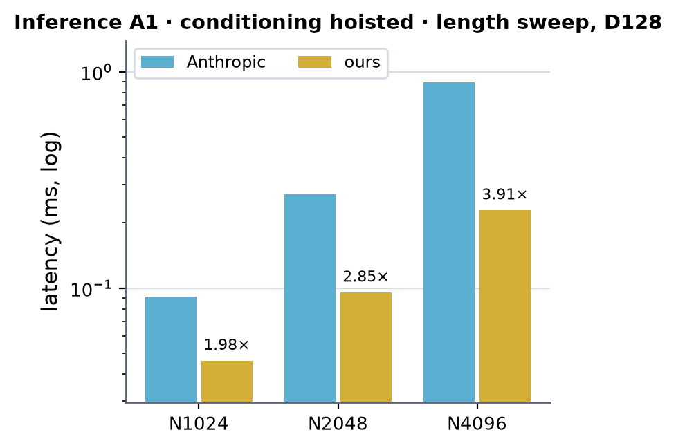
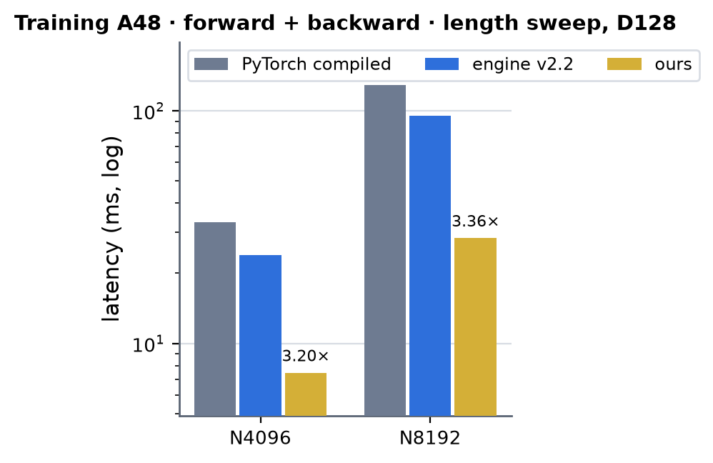

# Atom DiT (AF3-style) on B200 (sm100)

Kernel-level status of the AF3-style atom DiT block (engine `modules/dit.DiTBlock` at atom widths: AF3 Alg. 23 with
AdaLN -> q | k | v | gate -> attention over **all N atoms** with the pair bias `LN(z) Wb^T` shared by the A samples -> gated
out-projection + residual -> AdaLN + SwiGLU transition (hidden 256) + residual; d_single = d_cond = 128, d_pair = 16, 4 heads x 32)
on B200. Columns are (Length, Dimension) on the atom axis of the shape registry (`atom_single`, d128, bf16 only); Length is the
atom count N. The module-level summary is in [b200.md](../b200.md).

**Where the code is.** The kernels are `src/miniworld_engine/kernels/augmented_attention/cuda/sm100_atom/` (the sources of the B200 research
capsule `experiments/atomdit_sm100`, unchanged, built on first use by the newest nvcc on the machine that knows sm_100a: 13.1 on
the B200 box). The engine's `DiTBlock` dispatches them through `integrations/atom_dit.py` (an autograd Function over the whole
block for training, a kernel chain for inference) when `serves()` accepts the call: B200, `implementation` MINIWORLD / TRITON,
bf16 single / cond / pair, the atom widths below, B = 1, any N, a [B, N] bool key mask or none, no QK-norm; anything else
keeps the Triton path, and `MINIWORLD_ATOM_DIT_SM100=0` turns it off. The block is two opaque ops (`atom_dit_block_fwd` / `atom_dit_block_bwd`), so it is served under `torch.compile` and in CUDA graphs too (compiled training no longer falls back to the module path). N that is not a multiple of 128 is padded inside the call
(zero single / cond rows, the padded keys masked, the pair tensor read in place) and the first N rows come back. The key mask
(MiniWorld always passes the structure's `atom_mask`) is folded into the pair bias by `pair_bias_fwd` -- masked and padded keys
get -1e4 (bf16 -9984), so their softmax weight is exactly 0 in any row with a valid key -- and `pair_bias_bwd` drops dbias on
them, so the attention kernels run unmasked. (In a row whose keys are all masked the weights are the softmax of the scores,
where the module's finfo.min fill makes them uniform; forward and backward agree with each other there.)
`tests/integrations/test_b200_atom_dit_gpu.py` checks the output and every gradient against an fp64 PyTorch block, with and
without a key mask, at N100-1024 including N not a multiple of 128 (no worse than the Triton path's: inference 4.3e-3 vs
3.8-3.9e-3, worst gradient ratio 1.69 on `ln_pair.weight`); a profile of a masked, padded call (A5 N300) shows no Triton
kernel. The
measurements below were taken in the capsule on the same sources and the engine's own `DiTBlock` parameters; "CUDA" in the
kernel tables means the kernel ran at that shape there.

- Everything is hand CUDA (tcgen05 / TMEM / TMA) except the weight-gradient GEMMs (cuBLAS). No Triton, no quack. What is left in
  PyTorch is glue: the stacked / transposed weight packs (made once per parameter version), zero fills of the fp32 bias /
  LayerNorm-weight gradient accumulators, the pair-bias weight gradient's partial sum ([N/64 N/32, 4, 16] -> [4, 16]) and the
  bf16 casts of the parameter gradients.
- Shapes: A = samples (rows = A N), B = 1. Inference A = 5 and A = 1 at N = 1024 / 2048 / 4096; training A = 48 at N = 4096 /
  8192, no key mask (the measurements below). The kernels themselves take N a multiple of 128; the engine path pads.
- Dtypes: activations, weights and their gradients bf16; the pair bias bf16 (both layouts); dbias, LSE, the attention D term and
  the bias / LayerNorm-weight gradient sums fp32; every MMA accumulates in fp32 (TMEM).
- Rounding points follow the eager bf16 module (LayerNorm and Linear outputs, every elementwise product rounded to bf16 where
  the module rounds; torch's bf16 sigmoid backward `rn(rn(g rn(1 - y)) y)`, autograd's summation order of x1's four gradients):
  stage outputs match the module / autograd bit for bit or to <= 1e-4 (see Measurements).
- cache build ✓ everywhere: nothing autotunes (cubins with fixed launch shapes).
- 성능 확인 follows the rule set on 2026-09-30: **✓** = the block is the fastest of every measured implementation at that shape
  **and** the kernel reaches >= 70 % of its measured floor (time SoL, Speed of light section); **△** = the block is the fastest,
  the kernel below 70 %; **✗** = not measured at that shape (CUDA 미검증: the kernel accepts it, nothing ran there).

## Inference

Per block: I1 -> I2 -> I3 -> I4 -> I5 with PDL between the row kernels. The module uses the four conditioning scales and the
attention gate only through their sigmoids, so I1 and I2 emit rn(sigmoid(rn(...))) directly (same rounding points); I5 then
has only the SwiGLU's sigmoids left.

### I1 · conditioning projections `cond_fwd` (mod = s1 | bi1 | so | s2 | bi2 | st, [A N, 768] bf16)

Persistent, 32-row tiles transposed (M = 128 output channels, N = 32 rows); grid.y splits the six 128 x 128 blocks in halves so
each CTA keeps its three weights in TMEM; the two LayerNorms (weight only) eight threads per row; epilogue from the
mma-fragment layout (`tcgen05.ld 16x256b`), bias, sigmoid in fp32 pairs, `stmatrix.trans` into row-major tiles, TMA stores.

| (Length, Dimension) | (1024, 128) | (2048, 128) | (3072, 128) | (4096, 128) | (5120, 128) | (6144, 128) | (7168, 128) | (8192, 128) |
|---|---|---|---|---|---|---|---|---|
| implementation | CUDA | CUDA | CUDA 미검증 | CUDA | CUDA 미검증 | CUDA 미검증 | CUDA 미검증 | CUDA 미검증 |
| 성능 확인 | △ | △ | ✗ | △ | ✗ | ✗ | ✗ | ✗ |
| cache build | ✓ | ✓ | ✓ | ✓ | ✓ | ✓ | ✓ | ✓ |

### I2 · AdaLN + q | k | v | gate projections `pre_fwd`

Persistent, 32-row transposed tiles, [Wq; Wk; Wv; Wg] resident in TMEM as the A operand; separate rings for the inputs (freed as
soon as the AdaLN read them), x1 and the outputs, so the loads run four tiles ahead; the gate leaves as rn(sigmoid).

| (Length, Dimension) | (1024, 128) | (2048, 128) | (3072, 128) | (4096, 128) | (5120, 128) | (6144, 128) | (7168, 128) | (8192, 128) |
|---|---|---|---|---|---|---|---|---|
| implementation | CUDA | CUDA | CUDA 미검증 | CUDA | CUDA 미검증 | CUDA 미검증 | CUDA 미검증 | CUDA 미검증 |
| 성능 확인 | △ | △ | ✗ | △ | ✗ | ✗ | ✗ | ✗ |
| cache build | ✓ | ✓ | ✓ | ✓ | ✓ | ✓ | ✓ | ✓ |

### I3 · pair bias `pair_bias_fwd` (bias = LN(z) Wb^T, [4, N, N] bf16)

One memory-bound pass over z [N, N, 16] (32 x 64 tiles, 256 threads); gamma folded into the projection (bias = rstd (z . W' -
mean sum W')). Training also writes the transposed copy [4, N(key), N(query)] the dK / dV pass reads, staged through shared memory
so both stores coalesce.

| (Length, Dimension) | (1024, 128) | (2048, 128) | (3072, 128) | (4096, 128) | (5120, 128) | (6144, 128) | (7168, 128) | (8192, 128) |
|---|---|---|---|---|---|---|---|---|
| implementation | CUDA | CUDA | CUDA 미검증 | CUDA | CUDA 미검증 | CUDA 미검증 | CUDA 미검증 | CUDA 미검증 |
| 성능 확인 | △ | △ | ✗ | △ | ✗ | ✗ | ✗ | ✗ |
| cache build | ✓ | ✓ | ✓ | ✓ | ✓ | ✓ | ✓ | ✓ |

### I4 · attention forward `attn_fwd` (O = softmax(q k^T / sqrt 32 + bias) v, bf16 O + fp32 LSE)

Items (sample pair, head, 128-query block) so the two samples share each bias tile; q / K / V tiles as dense 64-B rows (SW64)
in a five-stage ring; the two softmax warpgroups' P phases take turns (named barriers) so the MUFU stays busy; O through SW64
staging and a TMA store.

| (Length, Dimension) | (1024, 128) | (2048, 128) | (3072, 128) | (4096, 128) | (5120, 128) | (6144, 128) | (7168, 128) | (8192, 128) |
|---|---|---|---|---|---|---|---|---|
| implementation | CUDA | CUDA | CUDA 미검증 | CUDA | CUDA 미검증 | CUDA 미검증 | CUDA 미검증 | CUDA 미검증 |
| 성능 확인 | △ | △ | ✗ | △ | ✗ | ✗ | ✗ | ✗ |
| cache build | ✓ | ✓ | ✓ | ✓ | ✓ | ✓ | ✓ | ✓ |

### I5 · gate + out projection + residual + AdaLN + SwiGLU + residual `post_fwd`

Transposed 16-row tiles; Wa | Wb and Ws resident in TMEM (384 columns), Wo in shared memory; the two compute warpgroups take
alternate tiles, each with its own TMA producer warp, MMA warp, 3-stage ring and 64 accumulator columns, so one warpgroup's math
runs under the other's MMAs; row stages eight threads per row (bf16x2 products where the module rounds after one op),
accumulator stages in the fragment layout (`ldmatrix` / `stmatrix .trans` against the row-major tiles).

| (Length, Dimension) | (1024, 128) | (2048, 128) | (3072, 128) | (4096, 128) | (5120, 128) | (6144, 128) | (7168, 128) | (8192, 128) |
|---|---|---|---|---|---|---|---|---|
| implementation | CUDA | CUDA | CUDA 미검증 | CUDA | CUDA 미검증 | CUDA 미검증 | CUDA 미검증 | CUDA 미검증 |
| 성능 확인 | △ | △ | ✗ | △ | ✗ | ✗ | ✗ | ✗ |
| cache build | ✓ | ✓ | ✓ | ✓ | ✓ | ✓ | ✓ | ✓ |

## Training

Forward T1 -> T5 (the inference kernels; T2 saves x1, T3 writes both bias layouts, T5 saves u, a2, x2, t), backward T6 -> T13
plus seven cuBLAS weight-gradient GEMMs (dWs = DT^T HH, dWu = DAB^T x2, dWo = DU^T GATED, dWqkvg = dP^T x1, dWmod from dmod
and cn1 / cn2 / c). dQ / dK / dV leave the attention kernels as bf16 straight into dP = [dq | dk | dv | dg]. Bias and
LayerNorm-weight gradients are per-thread register sums in the row stages, one fp32 `red.add` per CTA and channel.

### T1 · `cond_fwd`

| (Length, Dimension) | (1024, 128) | (2048, 128) | (3072, 128) | (4096, 128) | (5120, 128) | (6144, 128) | (7168, 128) | (8192, 128) |
|---|---|---|---|---|---|---|---|---|
| implementation | CUDA 미검증 | CUDA 미검증 | CUDA 미검증 | CUDA | CUDA 미검증 | CUDA 미검증 | CUDA 미검증 | CUDA |
| 성능 확인 | ✗ | ✗ | ✗ | △ | ✗ | ✗ | ✗ | △ |
| cache build | ✓ | ✓ | ✓ | ✓ | ✓ | ✓ | ✓ | ✓ |

### T2 · `pre_fwd` (saves x1)

| (Length, Dimension) | (1024, 128) | (2048, 128) | (3072, 128) | (4096, 128) | (5120, 128) | (6144, 128) | (7168, 128) | (8192, 128) |
|---|---|---|---|---|---|---|---|---|
| implementation | CUDA 미검증 | CUDA 미검증 | CUDA 미검증 | CUDA | CUDA 미검증 | CUDA 미검증 | CUDA 미검증 | CUDA |
| 성능 확인 | ✗ | ✗ | ✗ | ✓ | ✗ | ✗ | ✗ | ✓ |
| cache build | ✓ | ✓ | ✓ | ✓ | ✓ | ✓ | ✓ | ✓ |

### T3 · `pair_bias_fwd` (both layouts)

| (Length, Dimension) | (1024, 128) | (2048, 128) | (3072, 128) | (4096, 128) | (5120, 128) | (6144, 128) | (7168, 128) | (8192, 128) |
|---|---|---|---|---|---|---|---|---|
| implementation | CUDA 미검증 | CUDA 미검증 | CUDA 미검증 | CUDA | CUDA 미검증 | CUDA 미검증 | CUDA 미검증 | CUDA |
| 성능 확인 | ✗ | ✗ | ✗ | ✓ | ✗ | ✗ | ✗ | ✓ |
| cache build | ✓ | ✓ | ✓ | ✓ | ✓ | ✓ | ✓ | ✓ |

### T4 · `attn_fwd`

| (Length, Dimension) | (1024, 128) | (2048, 128) | (3072, 128) | (4096, 128) | (5120, 128) | (6144, 128) | (7168, 128) | (8192, 128) |
|---|---|---|---|---|---|---|---|---|
| implementation | CUDA 미검증 | CUDA 미검증 | CUDA 미검증 | CUDA | CUDA 미검증 | CUDA 미검증 | CUDA 미검증 | CUDA |
| 성능 확인 | ✗ | ✗ | ✗ | △ | ✗ | ✗ | ✗ | △ |
| cache build | ✓ | ✓ | ✓ | ✓ | ✓ | ✓ | ✓ | ✓ |

### T5 · `post_fwd` (saves u, a2, x2, t)

| (Length, Dimension) | (1024, 128) | (2048, 128) | (3072, 128) | (4096, 128) | (5120, 128) | (6144, 128) | (7168, 128) | (8192, 128) |
|---|---|---|---|---|---|---|---|---|
| implementation | CUDA 미검증 | CUDA 미검증 | CUDA 미검증 | CUDA | CUDA 미검증 | CUDA 미검증 | CUDA 미검증 | CUDA |
| 성능 확인 | ✗ | ✗ | ✗ | ✓ | ✗ | ✗ | ✗ | ✓ |
| cache build | ✓ | ✓ | ✓ | ✓ | ✓ | ✓ | ✓ | ✓ |

### T6 · transition backward, gate side `tr_bwd_gate` (dt, dts, a / b recomputed, dh = dt Ws, SwiGLU backward -> DT, HH, DAB)

post_fwd's frame: Wa | Wb and Ws^T in TMEM, the two 128-hidden chunks reuse 48 accumulator columns per warpgroup; the SwiGLU
backward in bf16x2 / fp32x2 pairs. dt, h, da, db, dts are bit-identical to autograd.

| (Length, Dimension) | (1024, 128) | (2048, 128) | (3072, 128) | (4096, 128) | (5120, 128) | (6144, 128) | (7168, 128) | (8192, 128) |
|---|---|---|---|---|---|---|---|---|
| implementation | CUDA 미검증 | CUDA 미검증 | CUDA 미검증 | CUDA | CUDA 미검증 | CUDA 미검증 | CUDA 미검증 | CUDA |
| 성능 확인 | ✗ | ✗ | ✗ | ✓ | ✗ | ✗ | ✗ | ✓ |
| cache build | ✓ | ✓ | ✓ | ✓ | ✓ | ✓ | ✓ | ✓ |

### T7 · post-attention backward `post_bwd` (dx2 = DAB Wu, AdaLN + LayerNorm backward, residual, output gate, du Wo, attention gate, dO, D)

Wu^T and Wo^T in TMEM; dx2 as autograd forms it (two accumulators, each rounded, then the bf16 sum); D = rowsum(dO o) per head
from the fragment layout (warp = head), written for the attention backward; dg into dP's block 3.

| (Length, Dimension) | (1024, 128) | (2048, 128) | (3072, 128) | (4096, 128) | (5120, 128) | (6144, 128) | (7168, 128) | (8192, 128) |
|---|---|---|---|---|---|---|---|---|
| implementation | CUDA 미검증 | CUDA 미검증 | CUDA 미검증 | CUDA | CUDA 미검증 | CUDA 미검증 | CUDA 미검증 | CUDA |
| 성능 확인 | ✗ | ✗ | ✗ | ✓ | ✗ | ✗ | ✗ | ✓ |
| cache build | ✓ | ✓ | ✓ | ✓ | ✓ | ✓ | ✓ | ✓ |

### T8 · attention backward, dK / dV `attn_dkv`

A CTA owns (sample, head, 128 keys) and streams the query blocks (transposed: S^T = K q^T, dP^T = V dO^T); the bias arrives
transposed (T3) so each thread reads its key row contiguously; bf16 dK / dV through SW64 staging.

| (Length, Dimension) | (1024, 128) | (2048, 128) | (3072, 128) | (4096, 128) | (5120, 128) | (6144, 128) | (7168, 128) | (8192, 128) |
|---|---|---|---|---|---|---|---|---|
| implementation | CUDA 미검증 | CUDA 미검증 | CUDA 미검증 | CUDA | CUDA 미검증 | CUDA 미검증 | CUDA 미검증 | CUDA |
| 성능 확인 | ✗ | ✗ | ✗ | △ | ✗ | ✗ | ✗ | △ |
| cache build | ✓ | ✓ | ✓ | ✓ | ✓ | ✓ | ✓ | ✓ |

### T9 · attention backward, dQ `attn_dq`

A CTA owns (sample, head, 128 queries), dQ resident in TMEM across the whole key range (no partials, no reductions); two MMA
issuers (one per warpgroup); bf16 dQ through SW32 staging.

| (Length, Dimension) | (1024, 128) | (2048, 128) | (3072, 128) | (4096, 128) | (5120, 128) | (6144, 128) | (7168, 128) | (8192, 128) |
|---|---|---|---|---|---|---|---|---|
| implementation | CUDA 미검증 | CUDA 미검증 | CUDA 미검증 | CUDA | CUDA 미검증 | CUDA 미검증 | CUDA 미검증 | CUDA |
| 성능 확인 | ✗ | ✗ | ✗ | △ | ✗ | ✗ | ✗ | △ |
| cache build | ✓ | ✓ | ✓ | ✓ | ✓ | ✓ | ✓ | ✓ |

### T10 · attention backward, dbias `attn_dbias`

A pass of its own (dbias is shared by the A samples; folding it into the dQ pass would cost ~2 GB of atomics or dQ partials at
these lengths): a CTA owns (head, 128 queries, 128-key chunk), walks every sample recomputing S, P and dP, sums P (dP - D) in
registers and writes its 128 x 128 fp32 tile once; dbias goes into T11 without a bf16 rounding.

| (Length, Dimension) | (1024, 128) | (2048, 128) | (3072, 128) | (4096, 128) | (5120, 128) | (6144, 128) | (7168, 128) | (8192, 128) |
|---|---|---|---|---|---|---|---|---|
| implementation | CUDA 미검증 | CUDA 미검증 | CUDA 미검증 | CUDA | CUDA 미검증 | CUDA 미검증 | CUDA 미검증 | CUDA |
| 성능 확인 | ✗ | ✗ | ✗ | △ | ✗ | ✗ | ✗ | △ |
| cache build | ✓ | ✓ | ✓ | ✓ | ✓ | ✓ | ✓ | ✓ |

### T11 · pair-bias backward `pair_bias_bwd` (dz, and the dgamma / dWb partials)

| (Length, Dimension) | (1024, 128) | (2048, 128) | (3072, 128) | (4096, 128) | (5120, 128) | (6144, 128) | (7168, 128) | (8192, 128) |
|---|---|---|---|---|---|---|---|---|
| implementation | CUDA 미검증 | CUDA 미검증 | CUDA 미검증 | CUDA | CUDA 미검증 | CUDA 미검증 | CUDA 미검증 | CUDA |
| 성능 확인 | ✗ | ✗ | ✗ | △ | ✗ | ✗ | ✗ | △ |
| cache build | ✓ | ✓ | ✓ | ✓ | ✓ | ✓ | ✓ | ✓ |

### T12 · attention-input backward `pre_bwd` (dx1 = dP Wqkvg, AdaLN + LayerNorm backward -> d single, dsc1, dbi1)

[Wq; Wk; Wv; Wg]^T in TMEM, four accumulators summed in bf16 in autograd's order ((g + v) + k) + q; d bq summed from dP.

| (Length, Dimension) | (1024, 128) | (2048, 128) | (3072, 128) | (4096, 128) | (5120, 128) | (6144, 128) | (7168, 128) | (8192, 128) |
|---|---|---|---|---|---|---|---|---|
| implementation | CUDA 미검증 | CUDA 미검증 | CUDA 미검증 | CUDA | CUDA 미검증 | CUDA 미검증 | CUDA 미검증 | CUDA |
| 성능 확인 | ✗ | ✗ | ✗ | ✓ | ✗ | ✗ | ✗ | ✓ |
| cache build | ✓ | ✓ | ✓ | ✓ | ✓ | ✓ | ✓ | ✓ |

### T13 · conditioning backward `cond_bwd` (d cond through both LayerNorms, cn1 / cn2 for dWmod, d g1 / d g2)

Wmod^T in TMEM (384 columns) and four accumulators per warpgroup (dcn1, dcn2, the two raw-c paths); each LayerNorm input's
gradient is one fp32 accumulation (eager bf16 rounds the two projections' gradients before adding them): closer to fp64 than the
eager module (d cond 3.40e-3 vs 3.69e-3, d g1 1.76e-3 vs 2.83e-3 at A5 N1024), not bitwise to it.

| (Length, Dimension) | (1024, 128) | (2048, 128) | (3072, 128) | (4096, 128) | (5120, 128) | (6144, 128) | (7168, 128) | (8192, 128) |
|---|---|---|---|---|---|---|---|---|
| implementation | CUDA 미검증 | CUDA 미검증 | CUDA 미검증 | CUDA | CUDA 미검증 | CUDA 미검증 | CUDA 미검증 | CUDA |
| 성능 확인 | ✗ | ✗ | ✗ | ✓ | ✗ | ✗ | ✗ | ✓ |
| cache build | ✓ | ✓ | ✓ | ✓ | ✓ | ✓ | ✓ | ✓ |

## Measurements (2026-10-01)

- Setup: B200 (148 SMs, 1000 W power cap), GPU 0 through `gpuq` with no other process on it; the capsule's uv venv
  (torch 2.10 cu130, triton 3.6.0) for ours, PyTorch compiled and Anthropic; the v2.2.0 pixi env (torch 2.13.0+cu129, triton
  3.7.1) on engine main 627c0891 for the engine row; the capsule's cubins built by nvcc 13.1. B = 1, bf16. One run
  (`run_doc.sh`); run-to-run spread +-3-5 % (power cap).
- Harness: inference in a CUDA graph (median of 5 x 10 replays); training = forward + `torch.autograd.grad` of every input
  (single, cond, pair) and every parameter, without a graph, CUDA events. Tables in ms; × = ours against the fastest of the other
  columns.
- Columns: **PyTorch compiled** = `torch.compile` of the engine's `DiTBlock` (implementation pytorch, bf16); **Anthropic** = its
  kernels for this op from the reference release (`common/opt_core/kernels/apb`): `fpf_apb.dit_apb` (flash attention, pair bias
  shared across samples, fused sigmoid gate), `fpf_apb.pf_bias` (the pair-bias producer) and `ditfast.atom_kernels` (adaln2 /
  resgate_adaln2 / swiglu2d), assembled as its `atom_fused` lever does (fp32 residual stream, cuBLAS GEMMs, pre-sigmoided
  conditioning from LayerNorm + cuBLAS + sigmoid). They are Triton and run on sm_100a unmodified; their tile cells are H100
  defaults, so each shape takes the best of six cells. Forward only (no backward members): inference only. Its `dit_exact` is an
  fp32, sm_90a-only kernel (not this op). **engine v2.2** = the engine's `DiTBlock` (implementation miniworld: Triton attention
  and row kernels + cuBLAS). cuEquivariance has no such block (—).
- "conditioning hoisted": Anthropic's kits compute the sample-invariant conditioning once per item; the second inference table
  leaves it out of both sides (ours: `cond_fwd` out of the step).
- Accuracy against the fp64 block (A4 N1024): ours output 3.51e-3, d single 3.09e-3, d cond 7.25e-3, d pair 9.11e-3, worst
  parameter gradient (`to_bias.weight`) 1.05e-2; Anthropic output 2.82e-3 (fp32 residual stream). Stage tests against the bf16
  module / autograd (`test_rows.py`, `test_bwd_rows.py`): forward outputs 100 % bit-equal or rel <= 1e-4; backward rel <= 5e-5
  except d cond (T13).
- Charts: under each table, a length sweep at D128 (`python -m miniworld_engine.viz.measure_bars docs/gpus/b200/atom_dit/atom_dit.md
  --length-prefix N`).

### Inference A5 · conditioning in the block

| (Length, Dimension) | PyTorch compiled | cuEquivariance | Anthropic | engine v2.2 | ours | × |
|---|---|---|---|---|---|---|
| (1024, 128) | 0.1669 | — | 0.1547 | 0.2656 | 0.0584 | 2.65 |
| (2048, 128) | 0.6283 | — | 0.4106 | 0.8046 | 0.1458 | 2.82 |
| (4096, 128) | 2.1901 | — | 1.2307 | 2.9934 | 0.3840 | 3.20 |

 <!-- measure_bars -->

### Inference A5 · conditioning hoisted

| (Length, Dimension) | PyTorch compiled | cuEquivariance | Anthropic | engine v2.2 | ours | × |
|---|---|---|---|---|---|---|
| (1024, 128) | — | — | 0.1140 | — | 0.0520 | 2.19 |
| (2048, 128) | — | — | 0.3355 | — | 0.1347 | 2.49 |
| (4096, 128) | — | — | 1.1139 | — | 0.3662 | 3.04 |

 <!-- measure_bars -->

### Inference A1 · conditioning in the block

| (Length, Dimension) | PyTorch compiled | cuEquivariance | Anthropic | engine v2.2 | ours | × |
|---|---|---|---|---|---|---|
| (1024, 128) | 0.1323 | — | 0.1249 | 0.2539 | 0.0498 | 2.51 |
| (2048, 128) | 0.3233 | — | 0.3130 | 0.7618 | 0.1016 | 3.08 |
| (4096, 128) | 1.2043 | — | 0.9402 | 2.7793 | 0.2357 | 3.99 |

 <!-- measure_bars -->

### Inference A1 · conditioning hoisted

| (Length, Dimension) | PyTorch compiled | cuEquivariance | Anthropic | engine v2.2 | ours | × |
|---|---|---|---|---|---|---|
| (1024, 128) | — | — | 0.0917 | — | 0.0462 | 1.98 |
| (2048, 128) | — | — | 0.2717 | — | 0.0954 | 2.85 |
| (4096, 128) | — | — | 0.8931 | — | 0.2287 | 3.91 |

 <!-- measure_bars -->

Where the inference gap comes from (A5 N4096, µs): pair-bias producer 144.9 vs Anthropic's `pf_bias` 779.3 (5.4x); attention
core 185.9 vs `dit_apb` 261.3 (1.4x; A1 N4096 65.1 vs 68.4, 1.05x); the rest (row kernels + GEMMs) ~53 vs ~190.

### Training A48 · forward + backward

| (Length, Dimension) | PyTorch compiled | cuEquivariance | Anthropic | engine v2.2 | ours | × |
|---|---|---|---|---|---|---|
| (4096, 128) | 33.130 | — | — | 23.904 | 7.471 | 3.20 |
| (8192, 128) | 128.812 | — | — | 95.247 | 28.327 | 3.36 |

 <!-- measure_bars -->

(Anthropic has no backward for this op.)

## Speed of light (measured, 2026-10-01)

`sol_measure.py` in the capsule, same run. Every kernel of a block step is recorded at the driver and replayed alone in a CUDA
graph for 2 s after a 1-s settle; time from the wall clock, energy from the NVML counter. Ceilings measured in the same run and
regime: idle 250 W, sustained maximum 1000 W, HBM 6.77 TB/s, read 113 pJ/B, write 77 pJ/B, bf16 MMA 0.565 pJ/FLOP (cuBLAS 8192^3,
1.34 PFLOP/s sustained). A kernel's floor = max(bytes / HBM, FLOPs / 2.38 PF, exps / 4.65 T/s, (R e_r + W e_w + F e_f) / (1000 -
250 W)) over its compulsory bytes read / written (R, W), FLOPs (F) and exponentials (the attention kernels: one per score, so
their floor is the MUFU's); **SoL = floor / measured time**; energy SoL = floor dynamic energy / measured dynamic energy.

### Training A48 (µs; SoL time / energy)

| kernel | N4096 µs | SoL | energy SoL | N8192 µs | SoL | energy SoL | 성능 확인 |
|---|---:|---:|---:|---:|---:|---:|---|
| T1 `cond_fwd` | 113.3 | 59.4 % | 62.6 % | 221.3 | 60.9 % | 65.2 % | △ |
| T2 `pre_fwd` (saves) | 72.8 | 92.9 % | 97.6 % | 144.6 | 93.5 % | 93.5 % | ✓ |
| T3 `pair_bias_fwd` (both layouts) | 169.2 | 70.3 % | 66.0 % | 677.2 | 70.3 % | 65.8 % | ✓ |
| T4 `attn_fwd` | 1264.1 | 54.8 % | 31.1 % | 5039.8 | 55.0 % | 26.7 % | △ |
| T5 `post_fwd` (saves) | 153.3 | 73.3 % | 76.6 % | 298.1 | 75.3 % | 78.6 % | ✓ |
| T6 `tr_bwd_gate` | 122.3 | 82.0 % | 79.4 % | 238.7 | 84.0 % | 83.0 % | ✓ |
| T7 `post_bwd` | 180.0 | 82.5 % | 81.3 % | 348.7 | 85.2 % | 85.5 % | ✓ |
| T8 `attn_dkv` | 1713.0 | 40.4 % | 41.7 % | 7060.3 | 39.2 % | 35.7 % | △ |
| T9 `attn_dq` | 1421.8 | 48.7 % | 38.0 % | 5977.8 | 46.4 % | 33.3 % | △ |
| T10 `attn_dbias` | 1466.0 | 47.3 % | 29.6 % | 6015.7 | 46.1 % | 24.8 % | △ |
| T11 `pair_bias_bwd` | 359.2 | 55.2 % | 53.7 % | 1415.7 | 56.0 % | 56.0 % | △ |
| T12 `pre_bwd` | 84.3 | 104 % | 106 % | 170.5 | 103 % | 100 % | ✓ |
| T13 `cond_bwd` | 102.2 | 95.1 % | 101 % | 198.0 | 98.2 % | 101 % | ✓ |
| weight GEMMs (cuBLAS, 7) | 273.6 | 96.2 % | 101 % | 441.4 | 119 % | 121 % | — |
| sum of the kernels | 7495.1 | 53.8 % | | 28247.6 | 50.4 % | | |

The block takes 7471.2 / 28326.6 µs. The model counts every byte from HBM, so kernels that get part of their operands from L2
(T12, T13, the GEMMs) land at or above 100 %. The four attention passes are 78 / 85 % of the kernel time and sit at 39-55 % of
the MUFU floor (one exponential per score per pass: the dK / dV, dQ and dbias passes each recompute P).

### Inference (µs; SoL time / energy)

| kernel | A5 N1024 | A5 N2048 | A5 N4096 | A1 N1024 | A1 N2048 | A1 N4096 |
|---|---|---|---|---|---|---|
| I1 `cond_fwd` | 7.1 · 25 % / 63 % | 10.0 · 35 % / 73 % | 15.6 · 45 % / 79 % | 3.5 · 11 % / 54 % | 5.5 · 13 % / 49 % | 6.6 · 22 % / 59 % |
| I2 `pre_fwd` | 6.8 · 24 % / 74 % | 7.9 · 41 % / 93 % | 10.6 · 62 % / 107 % | 3.6 · 10 % / 74 % | 3.6 · 19 % / 69 % | 6.1 · 22 % / 71 % |
| I3 `pair_bias_fwd` | 11.1 · 56 % / 108 % | 39.0 · 64 % / 62 % | 144.1 · 69 % / 64 % | 11.1 · 56 % / 108 % | 39.1 · 63 % / 62 % | 143.8 · 69 % / 67 % |
| I4 `attn_fwd` | 18.9 · 24 % / 53 % | 63.7 · 28 % / 51 % | 184.9 · 39 % / 40 % | 18.4 · 10 % / 74 % | 33.1 · 21 % / 74 % | 64.0 · 42 % / 47 % |
| I5 `post_fwd` | 9.2 · 26 % / 73 % | 12.3 · 39 % / 91 % | 18.7 · 51 % / 104 % | 4.1 · 13 % / 55 % | 7.5 · 13 % / 53 % | 8.7 · 22 % / 68 % |
| sum of the kernels | 53.0 · 31 % | 132.9 · 41 % | 373.8 · 52 % | 40.6 · 23 % | 88.7 · 38 % | 229.2 · 57 % |

At A = 1 and small N a row kernel's compulsory work is 0.3-2 µs against ~3-4 µs for one launch of a persistent tcgen05 kernel
(TMEM allocation, weight prologue, one tile's latency chain). The attention forward at small A has few work items (A5 N4096: 384
items of a sample pair over 148 SMs, the third sample pair half empty; A1: one sample per item).

## What was tried and not kept

| attempt | result |
|---|---|
| the backward attention passes with alternating P phases (as the forward) | 5221 -> 5638 µs (A48 N4096): their loads are pipelined inside the loop already; turns only serialise |
| polynomial exp2 on the FMA pipe for 1-3 of 4 score pairs (forward) | slower: the softmax phase is issue- and latency-bound, not MUFU-bound |
| forward items as (head, sample) slot pairs (no duplicated sample at odd A) | same time; 1.6 % slower at A48 (four ring stages instead of five) |
| pair-bias kernels with every row's loads hoisted | forward 141 -> 140 µs, backward 360 -> 484 µs (registers) |
| `cond_fwd` as one CTA per (128 rows, output block), not persistent | 176 µs (A48 N4096), 516 µs once the sigmoids moved in; persistent halves: 130 -> 114 µs |
| transposed epilogues storing one channel per thread (2-byte stores) | `pre_fwd` 109.5 µs vs 63.8 with `tcgen05.ld 16x256b` + `stmatrix.trans` |
| the gate's sigmoid in `pre_fwd` with the projections split between the warpgroups | 83 µs (one warpgroup did all sigmoids) vs 64 with the rows split |
| the warpgroup-alternating kernels freeing a stage after the *next* tile's stores | no prefetch with two stages: `tr_bwd_gate` 227, `post_bwd` 236, `cond_bwd` 148 µs vs 180 / 181 / 92 freeing it after the tile's own store reads |
| fp32 dQ / dK / dV from the attention kernels, cast into dP by PyTorch | 185 µs of casts; the kernels now write bf16 into dP |

## Limits and next

- In the engine since 2026-10-01 (`DiTBlock` -> `integrations/atom_dit.py`), key mask and any N since the same day. The timings
  above are the capsule's and were not re-taken through `DiTBlock`. team-gm's `DiffusionTransformerBlock` (af2bda75) calls
  `DiTBlock.forward` when it gets the pair tensor and a [B, L] mask or none -- MiniWorld's atom transformer does -- and so reaches
  this path; its hoisted pair-bias form (`hoist_pair_bias`) and an [A, B, L] mask do not.
- B = 1; a per-sample ([A, B, N]) key mask is not served. Measured only at the shapes above, without a key mask (the mask
  changes only the pair-bias kernels' writes).
- Bias / LayerNorm-weight gradients accumulate with fp32 atomics: not bitwise deterministic across runs.
- The attention passes (78 / 85 % of a training step at N4096 / N8192) are at 39-55 % SoL: fusing dQ into the dK / dV pass (one P recomputation fewer)
  and sharing dbias' sample walk are the next levers; for small-A inference, a key split for more work items. The pair-bias
  backward (55 %) and `cond_fwd` (59-61 %) are the other kernels below 70 %.
