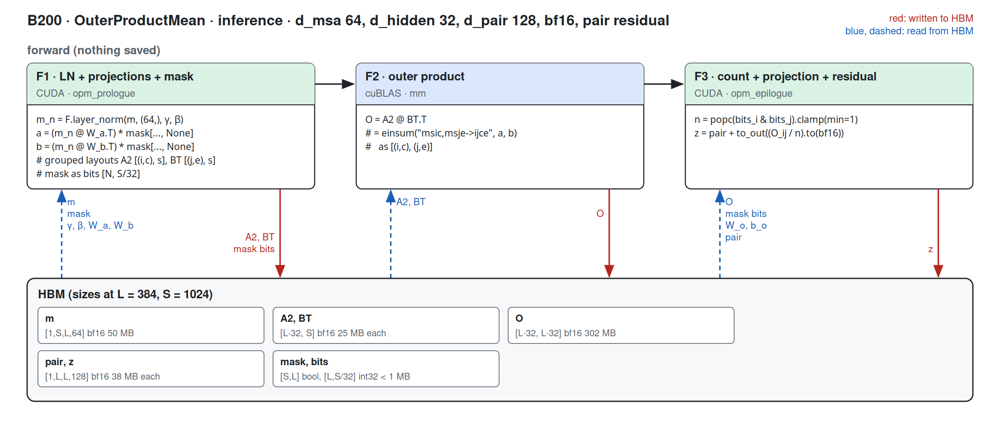
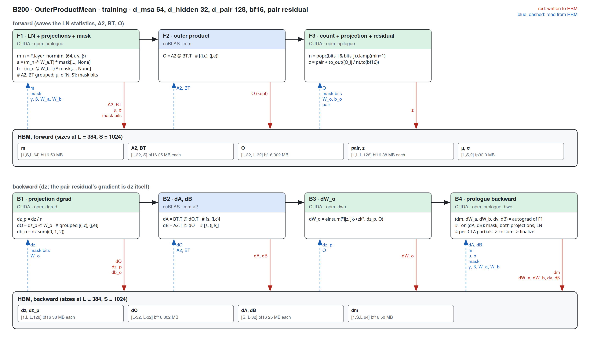
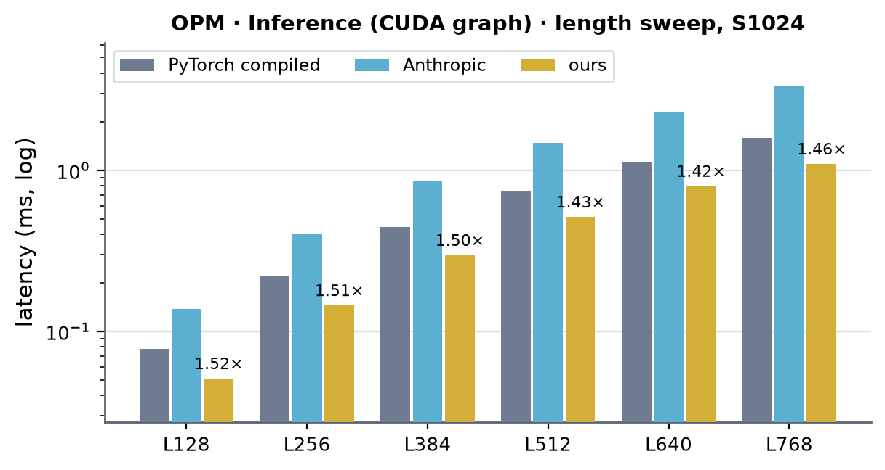
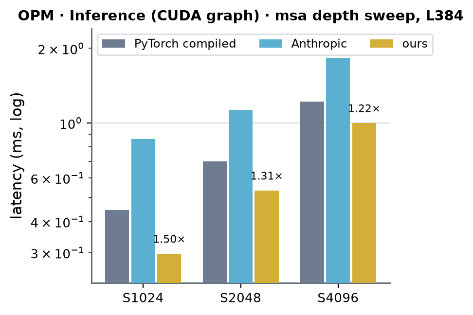
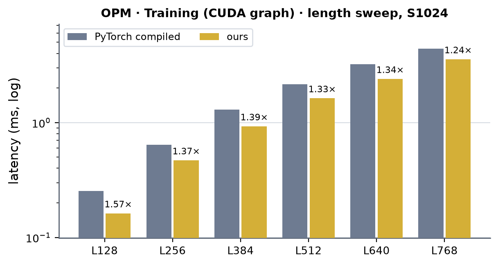
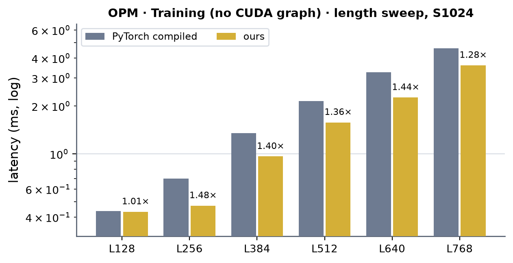

# OuterProductMean on B200 (sm100)

Kernel-level status of `OuterProductMean` on B200; the module-level summary is in [b200.md](../b200.md). bf16; the
module's shape is fixed (d_msa 64, d_hidden 32, d_pair 128), so the columns are (Length, MSA depth). B200 = CUDA where a
hand-written sm_100a kernel runs a step; the outer-product and gradient GEMMs are cuBLAS (figures only, no kernel tables).
Figures: one box per kernel, left to right, HBM reads (blue, left) and writes (red, right); generated from
`figures/opm.json` by `python -m miniworld_engine.viz.kernel_flow`, then converted to PNG (`cairosvg -s 2 -b white`).
Dispatch: `integrations/opm_train.py` (the H100 integration; compute capability (10, 0) selects the sm_100a extension);
kernels: `integrations/csrc/sm100/opm_sm100.cu` (tcgen05 / TMEM / TMA), one extension.

Served when `implementation=miniworld` (or `anthropic`), bf16, batch 1, `normalize_before_proj` (the AF3 order), no
interchain masking, N (length) a multiple of 64 and S (MSA depth) a multiple of 256, inference and training alike. The pair residual is added in
the epilogue (its gradient is `dz` itself). Every other call runs the portable Triton path.

## OuterProductMean (`OuterProductMean`)

### Inference

#### Fused path · N a multiple of 64, S a multiple of 256

##### F1 · LN + projections + mask (opm_prologue)

| (Length, MSA depth) | (128, 1024) | (256, 1024) | (384, 1024) | (512, 1024) | (640, 1024) | (768, 1024) | (128, 2048) | (256, 2048) | (384, 2048) | (512, 2048) | (640, 2048) | (768, 2048) | (128, 4096) | (256, 4096) | (384, 4096) | (512, 4096) | (640, 4096) | (768, 4096) |
|---|---|---|---|---|---|---|---|---|---|---|---|---|---|---|---|---|---|---|
| implementation | CUDA | CUDA | CUDA | CUDA | CUDA | CUDA | CUDA | CUDA | CUDA | CUDA | CUDA | CUDA | CUDA | CUDA | CUDA | CUDA | CUDA | CUDA |
| 성능 확인 | ✗ | ✗ | ✗ | ✗ | ✗ | ✗ | ✗ | ✗ | ✗ | ✗ | ✗ | ✗ | ✗ | ✗ | ✗ | ✗ | ✗ | ✗ |
| cache build | ✓ | ✓ | ✓ | ✓ | ✓ | ✓ | ✓ | ✓ | ✓ | ✓ | ✓ | ✓ | ✓ | ✓ | ✓ | ✓ | ✓ | ✓ |

##### F3 · count + projection + residual (opm_epilogue)

| (Length, MSA depth) | (128, 1024) | (256, 1024) | (384, 1024) | (512, 1024) | (640, 1024) | (768, 1024) | (128, 2048) | (256, 2048) | (384, 2048) | (512, 2048) | (640, 2048) | (768, 2048) | (128, 4096) | (256, 4096) | (384, 4096) | (512, 4096) | (640, 4096) | (768, 4096) |
|---|---|---|---|---|---|---|---|---|---|---|---|---|---|---|---|---|---|---|
| implementation | CUDA | CUDA | CUDA | CUDA | CUDA | CUDA | CUDA | CUDA | CUDA | CUDA | CUDA | CUDA | CUDA | CUDA | CUDA | CUDA | CUDA | CUDA |
| 성능 확인 | ✗ | ✗ | ✗ | ✗ | ✗ | ✗ | ✗ | ✗ | ✗ | ✗ | ✗ | ✗ | ✗ | ✗ | ✗ | ✗ | ✗ | ✗ |
| cache build | ✓ | ✓ | ✓ | ✓ | ✓ | ✓ | ✓ | ✓ | ✓ | ✓ | ✓ | ✓ | ✓ | ✓ | ✓ | ✓ | ✓ | ✓ |

### Training

#### Fused path · N a multiple of 64, S a multiple of 256

The forward keeps the LayerNorm statistics, A2 / BT and O (`MINIWORLD_OPM_TRAIN_SAVE_O=0` recomputes O in the backward
instead of keeping 302 MB at L384).

##### F1 · LN + projections + mask (opm_prologue)

| (Length, MSA depth) | (128, 1024) | (256, 1024) | (384, 1024) | (512, 1024) | (640, 1024) | (768, 1024) |
|---|---|---|---|---|---|---|
| implementation | CUDA | CUDA | CUDA | CUDA | CUDA | CUDA |
| 성능 확인 | ✗ | ✗ | ✗ | ✗ | ✗ | ✗ |
| cache build | ✓ | ✓ | ✓ | ✓ | ✓ | ✓ |

##### F3 · count + projection + residual (opm_epilogue)

| (Length, MSA depth) | (128, 1024) | (256, 1024) | (384, 1024) | (512, 1024) | (640, 1024) | (768, 1024) |
|---|---|---|---|---|---|---|
| implementation | CUDA | CUDA | CUDA | CUDA | CUDA | CUDA |
| 성능 확인 | ✗ | ✗ | ✗ | ✗ | ✗ | ✗ |
| cache build | ✓ | ✓ | ✓ | ✓ | ✓ | ✓ |

##### B1 · projection dgrad (opm_dgrad)

| (Length, MSA depth) | (128, 1024) | (256, 1024) | (384, 1024) | (512, 1024) | (640, 1024) | (768, 1024) |
|---|---|---|---|---|---|---|
| implementation | CUDA | CUDA | CUDA | CUDA | CUDA | CUDA |
| 성능 확인 | ✗ | ✗ | ✗ | ✗ | ✗ | ✗ |
| cache build | ✓ | ✓ | ✓ | ✓ | ✓ | ✓ |

##### B3 · dW_o (opm_dwo)

| (Length, MSA depth) | (128, 1024) | (256, 1024) | (384, 1024) | (512, 1024) | (640, 1024) | (768, 1024) |
|---|---|---|---|---|---|---|
| implementation | CUDA | CUDA | CUDA | CUDA | CUDA | CUDA |
| 성능 확인 | ✗ | ✗ | ✗ | ✗ | ✗ | ✗ |
| cache build | ✓ | ✓ | ✓ | ✓ | ✓ | ✓ |

##### B4 · prologue backward (opm_prologue_bwd)

| (Length, MSA depth) | (128, 1024) | (256, 1024) | (384, 1024) | (512, 1024) | (640, 1024) | (768, 1024) |
|---|---|---|---|---|---|---|
| implementation | CUDA | CUDA | CUDA | CUDA | CUDA | CUDA |
| 성능 확인 | ✗ | ✗ | ✗ | ✗ | ✗ | ✗ |
| cache build | ✓ | ✓ | ✓ | ✓ | ✓ | ✓ |

## Measurements (2026-09-30)

- Setup: B200 (148 SMs), torch 2.13.0+cu129, triton 3.7.1, B = 1, bf16-mixed (the module's LayerNorm parameters stay fp32).
- Harness: `benchmarks/runners/bench.py target=outer_product level=module mode=<inference|training> min_seq_len=128
  max_seq_len=768 seq_len_step=128 +n_msa=<S>`; compiled, inference in a CUDA graph, training with and without one.
- Tables: latency in ms (median); × = ours against the fastest of the others. cuEquivariance ships no OuterProductMean
  kernel (—).
- Anthropic: the harness's `anthropic` row -- `opt_core.ops.msa_opm.forward_mask_norm` as shipped (its fused LN / projection
  / mask prologue and one Triton outer-product / projection kernel with the release's default tile config), on this module's
  weights; the engine adds the residual. Triton, so it runs on sm_100 unmodified; forward-only, so the training tables have no
  Anthropic column (—).
- Accuracy against the harness's fp32 reference, max over every row: ours out 1.7e-3, grad 2.4e-4; PyTorch compiled 1.7e-3 / 2.5e-4; Anthropic 1.7e-3 (inference).
- Where the time goes: the O GEMM and the two gradient GEMMs (dA, dB) are cuBLAS at its sustained rate on this power-capped
  card; in the inference sweep the path runs at 68-88 % of its energy floor. Folding the epilogue into the O GEMM does not fit
  B200: re-streaming W_o per tile exceeds the SM's TMA intake; the dgrad kernel is bound by the same intake (a 2-CTA version
  is what is left).
- Charts: under each table, a length sweep at S1024 and an MSA-depth sweep at L384
  (`python -m miniworld_engine.viz.measure_bars docs/gpus/b200/opm/opm.md --length-d 1024`).

### OPM · Inference (CUDA graph)

| (Length, MSA depth) | PyTorch compiled | cuEquivariance | Anthropic | ours | × |
|---|---|---|---|---|---|
| (128, 1024) | 0.078 | — | 0.137 | 0.051 | 1.52 |
| (256, 1024) | 0.219 | — | 0.401 | 0.145 | 1.51 |
| (384, 1024) | 0.446 | — | 0.862 | 0.297 | 1.50 |
| (512, 1024) | 0.737 | — | 1.473 | 0.514 | 1.43 |
| (640, 1024) | 1.134 | — | 2.278 | 0.797 | 1.42 |
| (768, 1024) | 1.596 | — | 3.317 | 1.096 | 1.46 |
| (128, 2048) | 0.119 | — | 0.180 | 0.076 | 1.57 |
| (256, 2048) | 0.342 | — | 0.521 | 0.242 | 1.41 |
| (384, 2048) | 0.698 | — | 1.128 | 0.534 | 1.31 |
| (512, 2048) | 1.167 | — | 2.086 | 0.921 | 1.27 |
| (640, 2048) | 1.796 | — | 3.229 | 1.390 | 1.29 |
| (768, 2048) | 2.471 | — | 4.589 | 1.880 | 1.31 |
| (128, 4096) | 0.192 | — | 0.276 | 0.133 | 1.45 |
| (256, 4096) | 0.602 | — | 0.876 | 0.465 | 1.30 |
| (384, 4096) | 1.220 | — | 1.830 | 0.999 | 1.22 |
| (512, 4096) | 1.951 | — | 3.133 | 1.585 | 1.23 |
| (640, 4096) | 3.130 | — | 4.800 | 2.364 | 1.32 |
| (768, 4096) | 4.407 | — | 6.881 | 3.803 | 1.16 |

  <!-- measure_bars -->

### OPM · Training (CUDA graph)

| (Length, MSA depth) | PyTorch compiled | cuEquivariance | Anthropic | ours | × |
|---|---|---|---|---|---|
| (128, 1024) | 0.254 | — | — | 0.162 | 1.57 |
| (256, 1024) | 0.643 | — | — | 0.469 | 1.37 |
| (384, 1024) | 1.292 | — | — | 0.927 | 1.39 |
| (512, 1024) | 2.163 | — | — | 1.628 | 1.33 |
| (640, 1024) | 3.209 | — | — | 2.396 | 1.34 |
| (768, 1024) | 4.400 | — | — | 3.557 | 1.24 |

 <!-- measure_bars -->

### OPM · Training (no CUDA graph)

| (Length, MSA depth) | PyTorch compiled | cuEquivariance | Anthropic | ours | × |
|---|---|---|---|---|---|
| (128, 1024) | 0.436 | — | — | 0.432 | 1.01 |
| (256, 1024) | 0.697 | — | — | 0.472 | 1.48 |
| (384, 1024) | 1.349 | — | — | 0.962 | 1.40 |
| (512, 1024) | 2.148 | — | — | 1.575 | 1.36 |
| (640, 1024) | 3.258 | — | — | 2.258 | 1.44 |
| (768, 1024) | 4.602 | — | — | 3.598 | 1.28 |

 <!-- measure_bars -->
