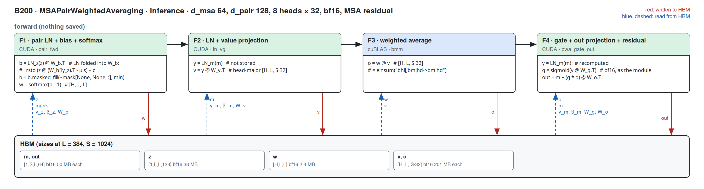
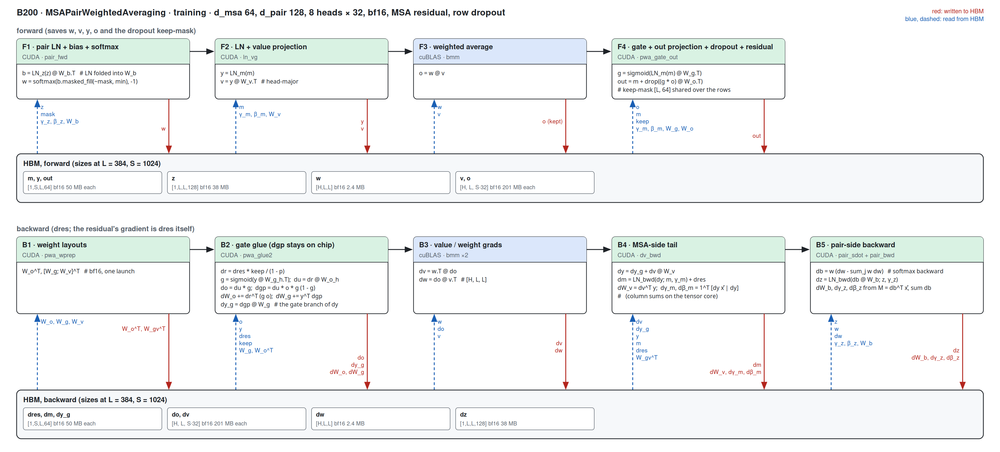
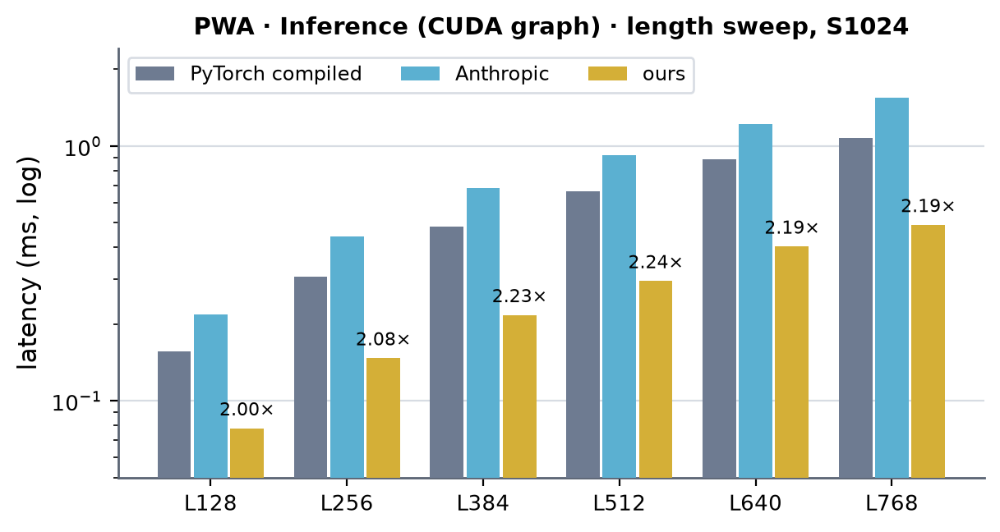
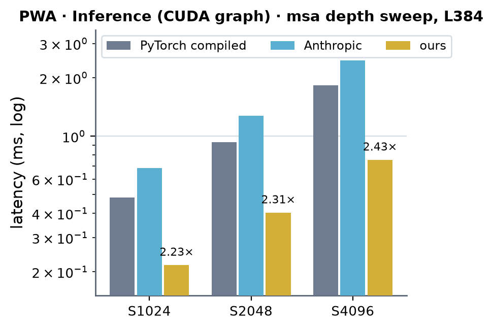
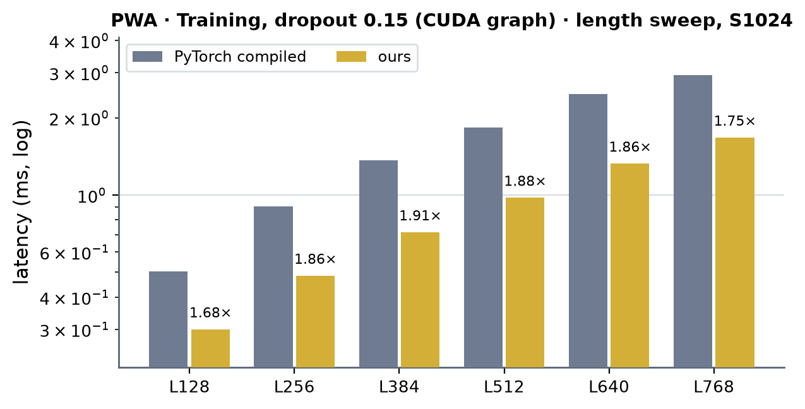
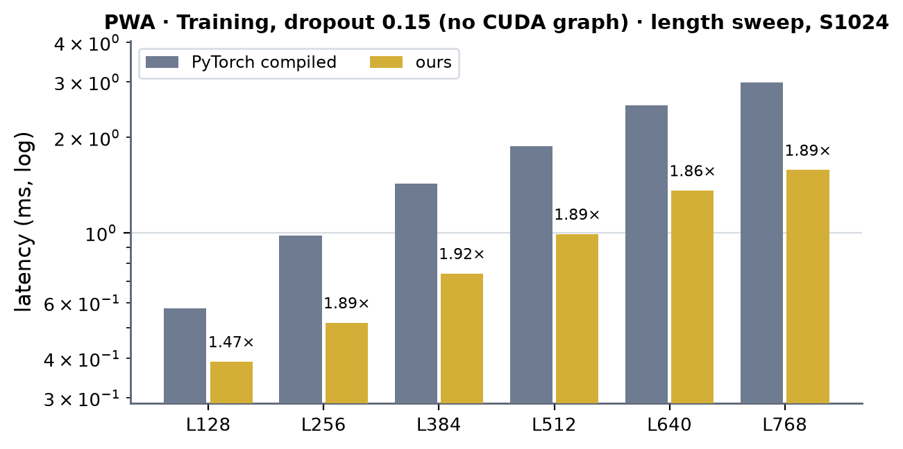

# MSAPairWeightedAveraging on B200 (sm100)

Kernel-level status of `MSAPairWeightedAveraging` on B200; the module-level summary is in [b200.md](../b200.md). bf16; the
module's shape is fixed (d_msa 64, d_pair 128, 8 heads x 32), so the columns are (Length, MSA depth). B200 = CUDA where a
hand-written sm_100a kernel runs a step; the two contractions and the weight gradient are cuBLAS `bmm` (figures only).
Figures: one box per kernel, left to right, HBM reads (blue, left) and writes (red, right); generated from
`figures/pwa.json` by `python -m miniworld_engine.viz.kernel_flow`, then converted to PNG (`cairosvg -s 2 -b white`).
Dispatch: `integrations/pwa_train.py` (the H100 integration; compute capability (10, 0) selects the sm_100a extension);
kernels: `integrations/csrc/sm100/pwa_sm100.cu` (tcgen05 / TMEM / TMA), one extension.

Served when `implementation=miniworld` (or `anthropic`), bf16, batch 1, a token key mask (or none), N (length) a multiple of 128 up
to 1024 and S (MSA depth) a multiple of 128, inference and training alike. The MSA residual and the module's row-broadcast dropout
(`drop_msa`, training) are applied in the gate / out-projection pass. Every other call runs the portable Triton path.

Design notes:
- The contractions o = w · v and dv = wᵀ · do run on cuBLAS `bmm`: 5-15 % faster than a tcgen05 kernel of ours at L256-1024,
  same bits. The gate / out pass reads o back; that round trip is the structural gap to the energy floor (the inference sweep
  runs at 44-65 % of it). A token-major gate / out tile (o read in 8 KB runs) scattered the output rows and was 5-12 % slower.
- The pair-side forward folds LN_z into proj_z (the tensor core reads raw z): same error against fp32 as rounding
  bf16(LN_z(z)) first, 1.5x faster than that form.
- The backward glue keeps dgp on chip: it forms dW_g = yᵀ dgp and the gate branch of dy (dgp · W_g) itself, and the MSA-side
  tail adds dv · W_v; dgamma / dbeta and the pair side's parameter gradients come from tensor-core sums (per-head
  M = dbᵀ x̂, 1ᵀ [dy x̂ | dy]) instead of per-tile warp reduce-scatters.

## MSAPairWeightedAveraging (`MSAPairWeightedAveraging`)

### Inference

#### Fused path · N a multiple of 128 up to 1024, S a multiple of 128

##### F1 · pair LN + bias + softmax (pair_fwd)

| (Length, MSA depth) | (128, 1024) | (256, 1024) | (384, 1024) | (512, 1024) | (640, 1024) | (768, 1024) | (128, 2048) | (256, 2048) | (384, 2048) | (512, 2048) | (640, 2048) | (768, 2048) | (128, 4096) | (256, 4096) | (384, 4096) | (512, 4096) | (640, 4096) | (768, 4096) |
|---|---|---|---|---|---|---|---|---|---|---|---|---|---|---|---|---|---|---|
| implementation | CUDA | CUDA | CUDA | CUDA | CUDA | CUDA | CUDA | CUDA | CUDA | CUDA | CUDA | CUDA | CUDA | CUDA | CUDA | CUDA | CUDA | CUDA |
| 성능 확인 | ✗ | ✗ | ✗ | ✗ | ✗ | ✗ | ✗ | ✗ | ✗ | ✗ | ✗ | ✗ | ✗ | ✗ | ✗ | ✗ | ✗ | ✗ |
| cache build | ✓ | ✓ | ✓ | ✓ | ✓ | ✓ | ✓ | ✓ | ✓ | ✓ | ✓ | ✓ | ✓ | ✓ | ✓ | ✓ | ✓ | ✓ |

##### F2 · LN + value projection (ln_vg)

| (Length, MSA depth) | (128, 1024) | (256, 1024) | (384, 1024) | (512, 1024) | (640, 1024) | (768, 1024) | (128, 2048) | (256, 2048) | (384, 2048) | (512, 2048) | (640, 2048) | (768, 2048) | (128, 4096) | (256, 4096) | (384, 4096) | (512, 4096) | (640, 4096) | (768, 4096) |
|---|---|---|---|---|---|---|---|---|---|---|---|---|---|---|---|---|---|---|
| implementation | CUDA | CUDA | CUDA | CUDA | CUDA | CUDA | CUDA | CUDA | CUDA | CUDA | CUDA | CUDA | CUDA | CUDA | CUDA | CUDA | CUDA | CUDA |
| 성능 확인 | ✗ | ✗ | ✗ | ✗ | ✗ | ✗ | ✗ | ✗ | ✗ | ✗ | ✗ | ✗ | ✗ | ✗ | ✗ | ✗ | ✗ | ✗ |
| cache build | ✓ | ✓ | ✓ | ✓ | ✓ | ✓ | ✓ | ✓ | ✓ | ✓ | ✓ | ✓ | ✓ | ✓ | ✓ | ✓ | ✓ | ✓ |

##### F4 · gate + out projection + residual (pwa_gate_out)

| (Length, MSA depth) | (128, 1024) | (256, 1024) | (384, 1024) | (512, 1024) | (640, 1024) | (768, 1024) | (128, 2048) | (256, 2048) | (384, 2048) | (512, 2048) | (640, 2048) | (768, 2048) | (128, 4096) | (256, 4096) | (384, 4096) | (512, 4096) | (640, 4096) | (768, 4096) |
|---|---|---|---|---|---|---|---|---|---|---|---|---|---|---|---|---|---|---|
| implementation | CUDA | CUDA | CUDA | CUDA | CUDA | CUDA | CUDA | CUDA | CUDA | CUDA | CUDA | CUDA | CUDA | CUDA | CUDA | CUDA | CUDA | CUDA |
| 성능 확인 | ✗ | ✗ | ✗ | ✗ | ✗ | ✗ | ✗ | ✗ | ✗ | ✗ | ✗ | ✗ | ✗ | ✗ | ✗ | ✗ | ✗ | ✗ |
| cache build | ✓ | ✓ | ✓ | ✓ | ✓ | ✓ | ✓ | ✓ | ✓ | ✓ | ✓ | ✓ | ✓ | ✓ | ✓ | ✓ | ✓ | ✓ |

### Training

#### Fused path · N a multiple of 128 up to 1024, S a multiple of 128

##### F1 · pair LN + bias + softmax (pair_fwd)

| (Length, MSA depth) | (128, 1024) | (256, 1024) | (384, 1024) | (512, 1024) | (640, 1024) | (768, 1024) |
|---|---|---|---|---|---|---|
| implementation | CUDA | CUDA | CUDA | CUDA | CUDA | CUDA |
| 성능 확인 | ✗ | ✗ | ✗ | ✗ | ✗ | ✗ |
| cache build | ✓ | ✓ | ✓ | ✓ | ✓ | ✓ |

##### F2 · LN + value projection (ln_vg)

| (Length, MSA depth) | (128, 1024) | (256, 1024) | (384, 1024) | (512, 1024) | (640, 1024) | (768, 1024) |
|---|---|---|---|---|---|---|
| implementation | CUDA | CUDA | CUDA | CUDA | CUDA | CUDA |
| 성능 확인 | ✗ | ✗ | ✗ | ✗ | ✗ | ✗ |
| cache build | ✓ | ✓ | ✓ | ✓ | ✓ | ✓ |

##### F4 · gate + out projection + dropout + residual (pwa_gate_out)

| (Length, MSA depth) | (128, 1024) | (256, 1024) | (384, 1024) | (512, 1024) | (640, 1024) | (768, 1024) |
|---|---|---|---|---|---|---|
| implementation | CUDA | CUDA | CUDA | CUDA | CUDA | CUDA |
| 성능 확인 | ✗ | ✗ | ✗ | ✗ | ✗ | ✗ |
| cache build | ✓ | ✓ | ✓ | ✓ | ✓ | ✓ |

##### B1 · weight layouts (pwa_wprep)

| (Length, MSA depth) | (128, 1024) | (256, 1024) | (384, 1024) | (512, 1024) | (640, 1024) | (768, 1024) |
|---|---|---|---|---|---|---|
| implementation | CUDA | CUDA | CUDA | CUDA | CUDA | CUDA |
| 성능 확인 | ✗ | ✗ | ✗ | ✗ | ✗ | ✗ |
| cache build | ✓ | ✓ | ✓ | ✓ | ✓ | ✓ |

##### B2 · gate glue (pwa_glue2)

| (Length, MSA depth) | (128, 1024) | (256, 1024) | (384, 1024) | (512, 1024) | (640, 1024) | (768, 1024) |
|---|---|---|---|---|---|---|
| implementation | CUDA | CUDA | CUDA | CUDA | CUDA | CUDA |
| 성능 확인 | ✗ | ✗ | ✗ | ✗ | ✗ | ✗ |
| cache build | ✓ | ✓ | ✓ | ✓ | ✓ | ✓ |

##### B4 · MSA-side tail (dv_bwd)

| (Length, MSA depth) | (128, 1024) | (256, 1024) | (384, 1024) | (512, 1024) | (640, 1024) | (768, 1024) |
|---|---|---|---|---|---|---|
| implementation | CUDA | CUDA | CUDA | CUDA | CUDA | CUDA |
| 성능 확인 | ✗ | ✗ | ✗ | ✗ | ✗ | ✗ |
| cache build | ✓ | ✓ | ✓ | ✓ | ✓ | ✓ |

##### B5 · pair-side backward (pair_sdot + pair_bwd)

| (Length, MSA depth) | (128, 1024) | (256, 1024) | (384, 1024) | (512, 1024) | (640, 1024) | (768, 1024) |
|---|---|---|---|---|---|---|
| implementation | CUDA | CUDA | CUDA | CUDA | CUDA | CUDA |
| 성능 확인 | ✗ | ✗ | ✗ | ✗ | ✗ | ✗ |
| cache build | ✓ | ✓ | ✓ | ✓ | ✓ | ✓ |

## Measurements (2026-09-30)

- Setup: B200 (148 SMs), torch 2.13.0+cu129, triton 3.7.1, B = 1, bf16-mixed (the module's LayerNorm parameters stay fp32).
- Harness: `benchmarks/runners/bench.py target=msa_pair_weighted_averaging level=module mode=<inference|training>
  min_seq_len=128 max_seq_len=768 seq_len_step=128 +n_msa=<S>`; compiled, inference in a CUDA graph, training with and
  without one, training with MiniWorld's p_drop_msa = 0.15.
- Tables: latency in ms (median); × = ours against the fastest of the others. cuEquivariance ships no pair-weighted-averaging
  kernel (—).
- Anthropic: the harness's `anthropic` row -- `opt_core.ops.msa_pwa.forward_masked` as shipped (its default fo kernel with the
  fused LN_m / projection prologue), stock LayerNorms on this module's parameters; the engine adds the residual. Triton, so it
  runs on sm_100 unmodified; forward-only, so the training tables have no Anthropic column (—).
- Accuracy against the harness's fp32 reference, max over every row: ours, PyTorch compiled and Anthropic out 1.8e-3 (inference; training with dropout
  leaves the harness's accuracy columns blank). `tests/integrations/test_pwa_train_gpu.py` checks the training output and every
  gradient, and the inference update, within 1.15x of the module's own bf16 statements' error against an fp32 copy.
- Charts: under each table, a length sweep at S1024 and an MSA-depth sweep at L384
  (`python -m miniworld_engine.viz.measure_bars docs/gpus/b200/pwa/pwa.md --length-d 1024`).

### PWA · Inference (CUDA graph)

| (Length, MSA depth) | PyTorch compiled | cuEquivariance | Anthropic | ours | × |
|---|---|---|---|---|---|
| (128, 1024) | 0.156 | — | 0.219 | 0.078 | 2.00 |
| (256, 1024) | 0.307 | — | 0.440 | 0.147 | 2.08 |
| (384, 1024) | 0.483 | — | 0.684 | 0.217 | 2.23 |
| (512, 1024) | 0.662 | — | 0.919 | 0.295 | 2.24 |
| (640, 1024) | 0.885 | — | 1.218 | 0.403 | 2.19 |
| (768, 1024) | 1.073 | — | 1.547 | 0.490 | 2.19 |
| (128, 2048) | 0.298 | — | 0.406 | 0.145 | 2.05 |
| (256, 2048) | 0.614 | — | 0.803 | 0.262 | 2.34 |
| (384, 2048) | 0.933 | — | 1.276 | 0.404 | 2.31 |
| (512, 2048) | 1.271 | — | 1.767 | 0.551 | 2.31 |
| (640, 2048) | 1.679 | — | 2.332 | 0.771 | 2.18 |
| (768, 2048) | 2.080 | — | 2.897 | 0.927 | 2.24 |
| (128, 4096) | 0.603 | — | 0.749 | 0.256 | 2.36 |
| (256, 4096) | 1.192 | — | 1.570 | 0.489 | 2.44 |
| (384, 4096) | 1.833 | — | 2.456 | 0.756 | 2.43 |
| (512, 4096) | 2.477 | — | 3.461 | 1.062 | 2.33 |
| (640, 4096) | 3.299 | — | 4.503 | 1.482 | 2.23 |
| (768, 4096) | 4.014 | — | 5.645 | 1.804 | 2.22 |

  <!-- measure_bars -->

### PWA · Training, dropout 0.15 (CUDA graph)

| (Length, MSA depth) | PyTorch compiled | cuEquivariance | Anthropic | ours | × |
|---|---|---|---|---|---|
| (128, 1024) | 0.503 | — | — | 0.300 | 1.68 |
| (256, 1024) | 0.903 | — | — | 0.485 | 1.86 |
| (384, 1024) | 1.364 | — | — | 0.716 | 1.91 |
| (512, 1024) | 1.830 | — | — | 0.976 | 1.88 |
| (640, 1024) | 2.467 | — | — | 1.326 | 1.86 |
| (768, 1024) | 2.932 | — | — | 1.674 | 1.75 |

 <!-- measure_bars -->

### PWA · Training, dropout 0.15 (no CUDA graph)

| (Length, MSA depth) | PyTorch compiled | cuEquivariance | Anthropic | ours | × |
|---|---|---|---|---|---|
| (128, 1024) | 0.576 | — | — | 0.391 | 1.47 |
| (256, 1024) | 0.980 | — | — | 0.519 | 1.89 |
| (384, 1024) | 1.427 | — | — | 0.743 | 1.92 |
| (512, 1024) | 1.875 | — | — | 0.990 | 1.89 |
| (640, 1024) | 2.523 | — | — | 1.359 | 1.86 |
| (768, 1024) | 2.985 | — | — | 1.578 | 1.89 |

 <!-- measure_bars -->
