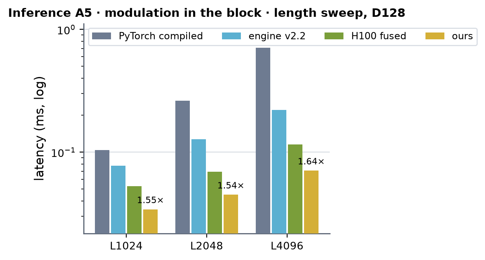
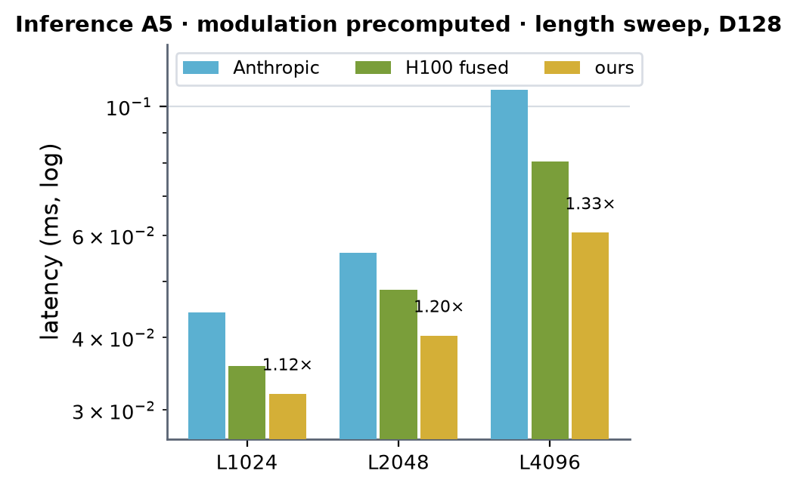
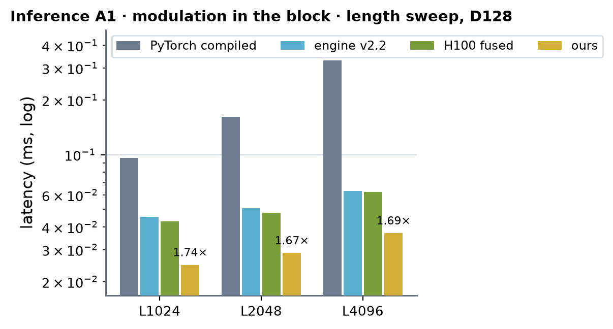
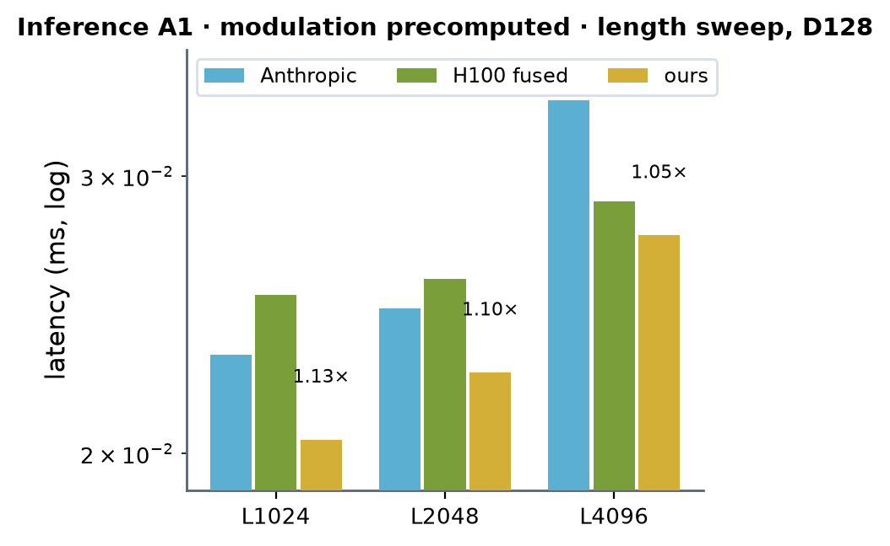
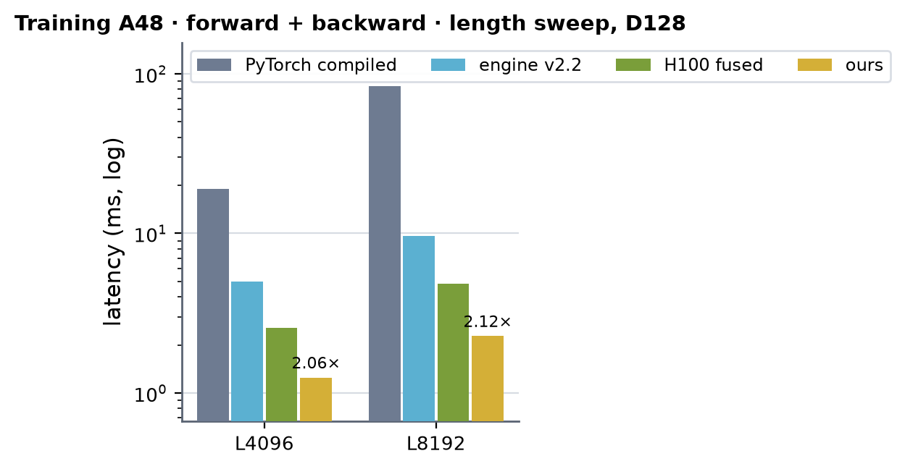

# SWA atom DiT on B200 (sm100)

Kernel-level status of the ESMFold2-style SWA atom DiT block (MiniWorld `block_style: esmfold2`, engine `modules/swa_dit`) on
B200: adaLN (RMSNorm, shift / scale / gate from the conditioning) -> q | k | v | gate projection with per-head RMS norm and RoPE ->
sliding-window attention (|i - j| <= 64, 4 heads x 32) -> gated out-projection + residual -> adaLN + SwiGLU (hidden 256) + residual;
d_single = d_cond = 128. Columns are (Length, Dimension) from the shape registry (`swa_atom_attention`, atom axis, bf16 only);
Length is the atom count S. The module-level summary is in [b200.md](../b200.md).

**Where the code is.** The kernels are `src/miniworld_engine/kernels/swa_dit/cuda/sm100/` (the sources of the B200 research
capsule `experiments/swaatom_sm100`, unchanged, built on first use by the newest nvcc on the machine that knows sm_100a: 13.1 on
the B200 box). The engine's fused block (`kernels/swa_dit/dispatch.py`, which `SWADiTBlock` takes) runs every stage on them on
B200 in bf16 at the served widths, and the hoisted modulation (`swa_dit_hoist_modulation`) on `mod_fwd` / `mod_bwd`;
`MINIWORLD_SWA_DIT_SM100=0` keeps the Triton path. `tests/integrations/test_b200_swa_dit_gpu.py` checks the output and every
gradient against the fp32 reference (no worse than the Triton path: worst ratio 1.006; inference 2.4-2.6e-3, as Triton) at
A = 1 / 3 / 5 / 8 / 48. The measurements below were taken in the capsule on the same sources; "CUDA" in the kernel tables means
the kernel ran at that shape there.

- Everything is hand CUDA (tcgen05 / TMEM / TMA) except the four weight-gradient GEMMs (cuBLAS). No Triton, no quack.
- Shapes: A = augments per sample (rows = A S). Inference A = 5 and A = 1 at S = 1024 / 2048 / 4096; training A = 48 at
  S = 4096 / 8192. **S must be a multiple of 128**: callers pad the atoms (seqused masks the padding); anything else raises
  `ValueError` -- there is no fallback path.
- Dtypes: activations, weights and their gradients bf16; the modulation (shift / scale / gate, [B S, 768]) and its gradient
  fp32; RoPE tables and the attention LSE fp32; every MMA accumulates in fp32 (TMEM). The fp32 block has its own TF32 kernels:
  section "fp32 (TF32) path" below.
- cache build ✓ everywhere: nothing autotunes (cubins with fixed launch shapes; dispatch by fixed size rules).
- 성능 확인 in this page follows the rule set on 2026-09-30: **✓** = the block is the fastest of every measured
  implementation at that shape **and** the kernel reaches >= 70 % of its measured floor (SoL section); **△** = the block is the
  fastest, the kernel below 70 %; **✗** = not measured at that shape (CUDA 미검증: the kernel accepts it, nothing ran there).

## Inference

Per block: I1 -> I2 -> I3 -> I4, with PDL between them (the next kernel's launch and weight prologue run under the previous one).
With the modulation precomputed (hoisted per fold, as Anthropic's driver takes it) I1 drops out.

### I1 · adaLN modulation `mod_fwd` (silu(c) Wmod^T, fp32 out; bf16 MMA with exact products)

| (Length, Dimension) | (1024, 128) | (2048, 128) | (3072, 128) | (4096, 128) | (5120, 128) | (6144, 128) | (7168, 128) | (8192, 128) |
|---|---|---|---|---|---|---|---|---|
| implementation | CUDA | CUDA | CUDA 미검증 | CUDA | CUDA 미검증 | CUDA 미검증 | CUDA 미검증 | CUDA 미검증 |
| 성능 확인 | △ | △ | ✗ | △ | ✗ | ✗ | ✗ | ✗ |
| cache build | ✓ | ✓ | ✓ | ✓ | ✓ | ✓ | ✓ | ✓ |

### I2 · RMS-adaLN + q | k | v | gate projections + head RMS + RoPE `qkvg_fwd2` / `qkvg_fwd`

`qkvg_fwd2` (transposed: 32-row tiles, the 4 x 128 x 128 weights resident in TMEM as the A operand) when A < 5 or A S <= 9472
(A = 1: its ATM = 32 build, one tile's 32 atoms of modulation); else `qkvg_fwd` (128-row tiles).

| (Length, Dimension) | (1024, 128) | (2048, 128) | (3072, 128) | (4096, 128) | (5120, 128) | (6144, 128) | (7168, 128) | (8192, 128) |
|---|---|---|---|---|---|---|---|---|
| implementation | CUDA | CUDA | CUDA 미검증 | CUDA | CUDA 미검증 | CUDA 미검증 | CUDA 미검증 | CUDA 미검증 |
| 성능 확인 | △ | △ | ✗ | △ | ✗ | ✗ | ✗ | ✗ |
| cache build | ✓ | ✓ | ✓ | ✓ | ✓ | ✓ | ✓ | ✓ |

### I3 · window attention forward `attn_fwd3` / `attn_fwd1h`

`attn_fwd3`: items (sample, 128-query tile, head pair), both 128-key blocks' scores in TMEM, the row maximum over both before any
exponential; the two heads' P phases take turns. `attn_fwd1h` (one head per item, the two warpgroups splitting its keys) when its
items fit in one wave (N (S / 128) 4 <= 148: A = 1).

| (Length, Dimension) | (1024, 128) | (2048, 128) | (3072, 128) | (4096, 128) | (5120, 128) | (6144, 128) | (7168, 128) | (8192, 128) |
|---|---|---|---|---|---|---|---|---|
| implementation | CUDA | CUDA | CUDA 미검증 | CUDA | CUDA 미검증 | CUDA 미검증 | CUDA 미검증 | CUDA 미검증 |
| 성능 확인 | △ | △ | ✗ | △ | ✗ | ✗ | ✗ | ✗ |
| cache build | ✓ | ✓ | ✓ | ✓ | ✓ | ✓ | ✓ | ✓ |

### I4 · gated out-projection + residual + RMS-adaLN + SwiGLU + residual `ffn_fwd2`

Transposed, 32-row tiles; Wu and Wd resident in TMEM, Wo in shared memory; double-buffered tile stages (A >= 4) or its ATM = 32,
single-stage build (A = 1 - 3).

| (Length, Dimension) | (1024, 128) | (2048, 128) | (3072, 128) | (4096, 128) | (5120, 128) | (6144, 128) | (7168, 128) | (8192, 128) |
|---|---|---|---|---|---|---|---|---|
| implementation | CUDA | CUDA | CUDA 미검증 | CUDA | CUDA 미검증 | CUDA 미검증 | CUDA 미검증 | CUDA 미검증 |
| 성능 확인 | △ | △ | ✗ | △ | ✗ | ✗ | ✗ | ✗ |
| cache build | ✓ | ✓ | ✓ | ✓ | ✓ | ✓ | ✓ | ✓ |

## Training

Forward T1 -> T4 (the inference kernels, saving q1 / att / y / ffn and x / rn(p_q) / rn(p_k) for the backward), backward T5 -> T10
plus four cuBLAS weight-gradient GEMMs (dWqkv | dWg as one GEMM over dP, dWo, dWu, dWd). The modulation gradient accumulates in
fp32 across T6, T7, T9 (atomics per atom and channel) before T10.

### T1 · `mod_fwd` · T2 · `qkvg_fwd` (saves) · T3 · `attn_fwd3` · T4 · `ffn_fwd2` (saves)

| (Length, Dimension) | (1024, 128) | (2048, 128) | (3072, 128) | (4096, 128) | (5120, 128) | (6144, 128) | (7168, 128) | (8192, 128) |
|---|---|---|---|---|---|---|---|---|
| implementation | CUDA 미검증 | CUDA 미검증 | CUDA 미검증 | CUDA | CUDA 미검증 | CUDA 미검증 | CUDA 미검증 | CUDA |
| 성능 확인 | ✗ | ✗ | ✗ | △ | ✗ | ✗ | ✗ | △ |
| cache build | ✓ | ✓ | ✓ | ✓ | ✓ | ✓ | ✓ | ✓ |

### T5 · FFN backward, gate `ffn_bwd_gate` (dffn, h, dA | dB with Wu and Wd^T resident in TMEM)

| (Length, Dimension) | (1024, 128) | (2048, 128) | (3072, 128) | (4096, 128) | (5120, 128) | (6144, 128) | (7168, 128) | (8192, 128) |
|---|---|---|---|---|---|---|---|---|
| implementation | CUDA 미검증 | CUDA 미검증 | CUDA 미검증 | CUDA | CUDA 미검증 | CUDA 미검증 | CUDA 미검증 | CUDA |
| 성능 확인 | ✗ | ✗ | ✗ | ✓ | ✗ | ✗ | ✗ | ✓ |
| cache build | ✓ | ✓ | ✓ | ✓ | ✓ | ✓ | ✓ | ✓ |

### T6 · FFN backward, input side `ffn_bwd_dy` (dy = dAB Wu, the adaLN backward, dq1, dmod)

| (Length, Dimension) | (1024, 128) | (2048, 128) | (3072, 128) | (4096, 128) | (5120, 128) | (6144, 128) | (7168, 128) | (8192, 128) |
|---|---|---|---|---|---|---|---|---|
| implementation | CUDA 미검증 | CUDA 미검증 | CUDA 미검증 | CUDA | CUDA 미검증 | CUDA 미검증 | CUDA 미검증 | CUDA |
| 성능 확인 | ✗ | ✗ | ✗ | ✓ | ✗ | ✗ | ✗ | ✓ |
| cache build | ✓ | ✓ | ✓ | ✓ | ✓ | ✓ | ✓ | ✓ |

### T7 · out-projection backward `oproj_bwd` (dO, dG, the attention D = rowsum(dO o), dmod)

| (Length, Dimension) | (1024, 128) | (2048, 128) | (3072, 128) | (4096, 128) | (5120, 128) | (6144, 128) | (7168, 128) | (8192, 128) |
|---|---|---|---|---|---|---|---|---|
| implementation | CUDA 미검증 | CUDA 미검증 | CUDA 미검증 | CUDA | CUDA 미검증 | CUDA 미검증 | CUDA 미검증 | CUDA |
| 성능 확인 | ✗ | ✗ | ✗ | ✓ | ✗ | ✗ | ✗ | ✓ |
| cache build | ✓ | ✓ | ✓ | ✓ | ✓ | ✓ | ✓ | ✓ |

### T8 · window attention backward, dQ + dK + dV in one pass `attn_dkvq`

dS^T written once to shared memory is the K-major A of dK and the MN-major A of dQ (M = 64). A 64-query block's dQ comes from
exactly two key tiles; CTAs walk contiguous runs of key tiles, so the pair meets inside a CTA (fp32 carry in shared memory) or,
at a run's ends, through a global slot and a counter (the second to arrive sums: deterministic). No fp32 dQ buffer. Used when
every CTA gets >= 2 items; else `attn_dq` + `attn_dkv`.

| (Length, Dimension) | (1024, 128) | (2048, 128) | (3072, 128) | (4096, 128) | (5120, 128) | (6144, 128) | (7168, 128) | (8192, 128) |
|---|---|---|---|---|---|---|---|---|
| implementation | CUDA 미검증 | CUDA 미검증 | CUDA 미검증 | CUDA | CUDA 미검증 | CUDA 미검증 | CUDA 미검증 | CUDA |
| 성능 확인 | ✗ | ✗ | ✗ | △ | ✗ | ✗ | ✗ | △ |
| cache build | ✓ | ✓ | ✓ | ✓ | ✓ | ✓ | ✓ | ✓ |

### T9 · q | k | v | gate backward `qkvg_bwd` (head RMS + RoPE backward, dx = W^T dP^T with W^T resident in TMEM, dmod)

| (Length, Dimension) | (1024, 128) | (2048, 128) | (3072, 128) | (4096, 128) | (5120, 128) | (6144, 128) | (7168, 128) | (8192, 128) |
|---|---|---|---|---|---|---|---|---|
| implementation | CUDA 미검증 | CUDA 미검증 | CUDA 미검증 | CUDA | CUDA 미검증 | CUDA 미검증 | CUDA 미검증 | CUDA |
| 성능 확인 | ✗ | ✗ | ✗ | ✓ | ✗ | ✗ | ✗ | ✓ |
| cache build | ✓ | ✓ | ✓ | ✓ | ✓ | ✓ | ✓ | ✓ |

### T10 · modulation backward `mod_bwd` (dc, dWmod; dmod fp32 split into three bf16 terms)

Two kernels, each reducing over a cluster (dc: 4 CTAs over the 768 channels; dW: up to 16 CTAs over the rows) through
bulk shared::cluster copies, summed in rank order.

| (Length, Dimension) | (1024, 128) | (2048, 128) | (3072, 128) | (4096, 128) | (5120, 128) | (6144, 128) | (7168, 128) | (8192, 128) |
|---|---|---|---|---|---|---|---|---|
| implementation | CUDA 미검증 | CUDA 미검증 | CUDA 미검증 | CUDA | CUDA 미검증 | CUDA 미검증 | CUDA 미검증 | CUDA |
| 성능 확인 | ✗ | ✗ | ✗ | △ | ✗ | ✗ | ✗ | △ |
| cache build | ✓ | ✓ | ✓ | ✓ | ✓ | ✓ | ✓ | ✓ |

## Measurements (2026-09-30)

- Setup: B200 (148 SMs, 1000 W power cap), GPU 2 through `gpuq` with no other process on it, old uv venv of the capsule
  (torch 2.10 cu130) for the capsule, H100 fused, PyTorch and Anthropic rows; the v2.2.0 pixi env (torch 2.13.0+cu129) for the
  engine row; the capsule's cubins built by nvcc 13.1 (`/usr/local/cuda-13.1`). B = 1, bf16. Run-to-run spread +-3-5 % (power cap).
- Harness (capsule, one run: `run_doc.sh`): inference in a CUDA graph (median of 5 x 10 replays); training = forward +
  `torch.autograd.grad` of every input (q, conditioning, all weights) without a graph, CUDA events. Tables in ms; × = ours
  against the fastest of the other columns.
- Columns: **PyTorch compiled** = `torch.compile` of the block's reference math in bf16 (dense banded mask SDPA; not the engine
  module); **Anthropic** = its fused `SWAAtomBlock` (esmfold2 `ef2_atom.py` fast tier, bf16 GEMMs; fp32 residual stream, modulation
  / RoPE per row: inference only, modulation precomputed); **engine v2.2** = the engine's `SWADiTBlock` (FA4 window attention +
  Triton + cuBLAS, the modulation computed per row inside); **H100 fused** = the H100 fused Triton block (team-gm `swa_fused_triton`
  algorithm, its Triton path: the sm_90a kernels do not build for sm_100); **ours** = the same block with the sm_100a kernels.
  cuEquivariance has no such block (—).
- Accuracy against the fp64 block (A8 S1024): ours output 2.58e-3, dq 2.78e-3, dc 4.60-4.62e-3, worst weight gradient
  7.4-7.6e-3; the H100 fused Triton path 2.58e-3 / 2.78e-3 / 4.91e-3 / 7.4-7.6e-3 (bf16 rounding points of the same algorithm).
  Anthropic 7.4e-4 (A4 S1024: its residual stream stays fp32).
- Charts: under each table, a length sweep at D128 (`python -m miniworld_engine.viz.measure_bars docs/gpus/b200/swa_atom_dit/swa_atom_dit.md`).

### Inference A5 · modulation in the block

| (Length, Dimension) | PyTorch compiled | cuEquivariance | Anthropic | engine v2.2 | H100 fused | ours | × |
|---|---|---|---|---|---|---|---|
| (1024, 128) | 0.1037 | — | — | 0.0773 | 0.0529 | 0.0342 | 1.55 |
| (2048, 128) | 0.2617 | — | — | 0.1270 | 0.0695 | 0.0450 | 1.54 |
| (4096, 128) | 0.7093 | — | — | 0.2204 | 0.1158 | 0.0707 | 1.64 |

 <!-- measure_bars -->

### Inference A5 · modulation precomputed

| (Length, Dimension) | PyTorch compiled | cuEquivariance | Anthropic | engine v2.2 | H100 fused | ours | × |
|---|---|---|---|---|---|---|---|
| (1024, 128) | — | — | 0.0442 | — | 0.0357 | 0.0320 | 1.12 |
| (2048, 128) | — | — | 0.0559 | — | 0.0483 | 0.0403 | 1.20 |
| (4096, 128) | — | — | 0.1068 | — | 0.0803 | 0.0606 | 1.33 |

 <!-- measure_bars -->

### Inference A1 · modulation in the block

| (Length, Dimension) | PyTorch compiled | cuEquivariance | Anthropic | engine v2.2 | H100 fused | ours | × |
|---|---|---|---|---|---|---|---|
| (1024, 128) | 0.0959 | — | — | 0.0455 | 0.0430 | 0.0247 | 1.74 |
| (2048, 128) | 0.1618 | — | — | 0.0506 | 0.0480 | 0.0287 | 1.67 |
| (4096, 128) | 0.3302 | — | — | 0.0632 | 0.0625 | 0.0369 | 1.69 |

 <!-- measure_bars -->

### Inference A1 · modulation precomputed

| (Length, Dimension) | PyTorch compiled | cuEquivariance | Anthropic | engine v2.2 | H100 fused | ours | × |
|---|---|---|---|---|---|---|---|
| (1024, 128) | — | — | 0.0231 | — | 0.0252 | 0.0204 | 1.13 |
| (2048, 128) | — | — | 0.0247 | — | 0.0258 | 0.0225 | 1.10 |
| (4096, 128) | — | — | 0.0335 | — | 0.0289 | 0.0275 | 1.05 |

 <!-- measure_bars -->

### Training A48 · forward + backward

| (Length, Dimension) | PyTorch compiled | cuEquivariance | Anthropic | engine v2.2 | H100 fused | ours | × |
|---|---|---|---|---|---|---|---|
| (4096, 128) | 19.028 | — | — | 5.009 | 2.565 | 1.248 | 2.06 |
| (8192, 128) | 83.761 | — | — | 9.662 | 4.815 | 2.270 | 2.12 |

 <!-- measure_bars -->

(Anthropic's block has no backward.)

## Speed of light (measured, 2026-09-30)

`sol_measure.py` in the capsule, one run. Every kernel of a block step is recorded at the driver and replayed alone in a CUDA
graph for 2 s after a 1-s settle; time from the wall clock, energy from the NVML counter. Ceilings measured in the same run and
regime: idle 248 W, sustained maximum 985 W, HBM 6.78 TB/s, read 123 pJ/B, write 78 pJ/B, bf16 MMA 0.53 pJ/FLOP (cuBLAS 8192^3,
1.36 PFLOP/s sustained). A kernel's floor = max(bytes / HBM, FLOPs / 2.38 PF, exps / 4.65 T/s, (R e_r + W e_w + F e_f) / (985 - 248 W))
over its compulsory bytes read / written (R, W), FLOPs (F) and exponentials; **SoL = floor / measured time**; energy SoL = floor
dynamic energy / measured dynamic energy (energy minus idle x time).

### Training A48 (µs; SoL time / energy)

| kernel | S4096 µs | SoL | energy SoL | S8192 µs | SoL | energy SoL | 성능 확인 |
|---|---:|---:|---:|---:|---:|---:|---|
| T1 `mod_fwd` | 10.7 | 19.7 % | 85.1 % | 16.5 | 25.5 % | 84.4 % | △ |
| T2 `qkvg_fwd` (saves) | 144.8 | 44.8 % | 53.1 % | 280.1 | 46.3 % | 51.5 % | △ |
| T3 `attn_fwd3` | 84.5 | 47.4 % | 51.8 % | 161.3 | 49.7 % | 51.5 % | △ |
| T4 `ffn_fwd2` (saves) | 168.9 | 50.6 % | 62.9 % | 334.2 | 51.1 % | 60.5 % | △ |
| T5 `ffn_bwd_gate` | 112.6 | 72.8 % | 70.4 % | 218.7 | 75.0 % | 75.3 % | ✓ |
| T6 `ffn_bwd_dy` | 100.6 | 83.6 % | 84.5 % | 199.2 | 84.4 % | 85.7 % | ✓ |
| T7 `oproj_bwd` | 78.8 | 76.8 % | 78.0 % | 155.0 | 78.0 % | 78.2 % | ✓ |
| T8 `attn_dkvq` | 165.3 | 44.6 % | 46.5 % | 315.0 | 46.8 % | 48.4 % | △ |
| T9 `qkvg_bwd` | 137.3 | 82.4 % | 83.3 % | 267.1 | 84.7 % | 80.8 % | ✓ |
| T10 `mod_bwd` dc | 11.7 | 25.4 % | 73.2 % | 23.0 | 25.8 % | 79.6 % | △ |
| T10 `mod_bwd` dW | 15.8 | 18.1 % | 67.4 % | 22.5 | 25.4 % | 74.9 % | △ |
| weight GEMMs (cuBLAS, 4) | 162.5 | 109 % | 103 % | 272.8 | 129 % | 129 % | — |
| sum of the kernels | 1193.4 | 66.0 % | | 2265.3 | 69.6 % | | |

The block takes 1247.8 / 2269.9 µs (kernels back to back plus one fill). The model counts every byte from HBM, so the cuBLAS
GEMMs, which get part of their operands from L2, land above 100 %. Against one fully fused block (every activation read and
written once, weights, the essential FLOPs; `sol_swa.py`) the floor is 199.6 / 399.1 µs (energy): the block is at 16 / 18 % of
it -- the rest is the kernel boundaries' HBM traffic, not the kernels.

### Inference (µs; SoL time / energy)

| kernel | A5 S1024 | A5 S2048 | A5 S4096 | A1 S1024 | A1 S2048 | A1 S4096 |
|---|---|---|---|---|---|---|
| I1 `mod_fwd` | 5.3 · 11 % / 82 % | 5.5 · 20 % / 86 % | 10.7 · 20 % / 85 % | 5.2 · 11 % / 80 % | 5.5 · 20 % / 85 % | 10.7 · 20 % / 85 % |
| I2 `qkvg_fwd2` / `qkvg_fwd` | 9.0 · 16 % / 48 % | 11.0 · 27 % / 76 % | 19.1 · 31 % / 78 % | 6.0 · 8 % / 65 % | 6.2 · 15 % / 70 % | 8.3 · 22 % / 71 % |
| I3 `attn_fwd3` / `attn_fwd1h` | 6.8 · 15 % / 71 % | 11.1 · 19 % / 72 % | 14.7 · 28 % / 71 % | 4.7 · 4 % / 47 % | 4.7 · 9 % / 65 % | 5.0 · 17 % / 66 % |
| I4 `ffn_fwd2` | 10.5 · 19 % / 55 % | 14.9 · 27 % / 67 % | 23.7 · 34 % / 78 % | 6.1 · 12 % / 85 % | 6.5 · 22 % / 87 % | 9.4 · 29 % / 79 % |
| sum of the kernels | 31.6 · 16 % | 42.5 · 24 % | 68.2 · 29 % | 22.1 · 9 % | 22.9 · 17 % | 33.4 · 22 % |

At these sizes a kernel's compulsory work is 0.2-8 µs while one launch of a persistent tcgen05 kernel costs ~4-5 µs end to end
(TMEM allocation, weight prologue, one tile's latency chain), so time SoL stays low even where the energy is near its floor. The
remaining lever is fewer kernels (fusing I1-I4), not faster ones.

## FlashAttention-4 attention and the global variant (2026-10-02)

Two additions around the block, both for MiniWorld's input embedder (SWA atom blocks at A = 1 with a global window):

- **The FlashAttention-4 forward saves its lse** (`modules/swa_atom_attention`, `settings.swa_flash_saves_lse`, default on).
  `flash_window_fa4` saves the output and the log-sum-exp in the forward and the backward reads them; the legacy
  `flash_window_seqused` re-ran the flash forward in its backward and cleaned q / k / v / dq / dk / dv with about 11 eager elementwise
  launches per block. Same numbers either way (`tests/integrations/test_swa_fa4_attention_gpu.py`). In the embedder (three blocks, 4096 atoms
  / 384 tokens, forward + backward, CUDA graph, one B200) this step takes 1.84 ms to 1.41 ms; the other steps are in
  [../token_pair_init/token_pair_init.md](../token_pair_init/token_pair_init.md).
- **Global-attention variant of the fused block** (`kernels/swa_dit`, `interface.is_global(half_window)`: `< 0` or `>= 65536`). The
  window-attention stage (I3 / T3 / T8) is replaced by FlashAttention-4 (`attn_global_fwd` / `attn_global_bwd`); every other stage is
  the kernels above. bf16 and B200 only, `refusal()` says why a call is not served, and the output and every gradient match the
  windowed block at a window that covers the sequence (`tests/integrations/test_b200_swa_dit_global_gpu.py`). **At A = 1 it is slower than
  the per-op path**: 1.25 ms against 1.08 ms for the same embedder (opt-in switches of team-gm,
  `MINIWORLD_SWA_FUSED=1` and `MINIWORLD_SWA_GLOBAL_BF16=1`; the stream runs in bf16, a precision change for an fp32 caller), so
  MiniWorld keeps it opt-in.

The weight-pack cache (`kernels/swa_dit/cuda/sm100._cached`) is keyed on the tensor objects (weak references) and their versions since
2026-10-02. The old key (data_ptr, version, shape) served the old tensor's packed copy to a new weight placed at a freed one's address; the
cache is also bypassed while a CUDA graph is captured, so that the pack kernels are recorded into the graph and every replay repacks the
weights an optimizer step changed (`tests/integrations/test_swa_dit_pack_cache.py`).

## fp32 (TF32) path (2026-10-06)

The fp32 block (MiniWorld's fp32 atom transformer: fp32 parameters, no autocast) on B200 runs every stage on hand-written sm_100a
kernels with TF32 tensor-core MMAs (`tcgen05.mma kind::tf32`, fp32 accumulation in TMEM) instead of the Triton fp32 kernels
(`triton/forward_fp32.py`, `backward_fp32.py`). Residual stream, modulation, RoPE tables, softmax and every elementwise step stay
fp32. Host side: `kernels/swa_dit/cuda/sm100/tf32_fwd.py` (forward, `block_fwd_tf32`, `mod_fwd_tf32`) and `tf32_bwd.py` (backward);
`dispatch._tf32` picks them for fp32 q on B200 at the served widths with S a multiple of 128 (else the Triton fp32 path, which takes
any S). A training forward takes them only when the TF32 backward loads (its fp32 saves are what only that backward reads);
`MINIWORLD_SWA_DIT_TF32=0` (or `MINIWORLD_SWA_DIT_SM100=0`, `engine_backend="triton"`) keeps the Triton fp32 path, and a build or
load failure warns once and keeps it too. The hoisted modulation (`swa_dit_hoist_modulation`, fp32 c and Wmod) runs on
`mod_fwd_tf32` (+ `tf32_bwd.mod_bwd_tf32` when a gradient is recorded).

Precision against the Triton fp32 path: the window attention runs on TF32 Q / K / V / P instead of bf16 (the Triton path rounds the
attention operands to bf16, as FlashAttention-4 does), and every GEMM is single-pass TF32 with operands **rounded** to the nearest
TF32 (`cvt.rna` in the kernels for activations; the weights once per weight version on the host, `tf32_fwd._round_tf32`, cached like
the bf16 weight packs) -- the tensor core alone truncates the low 13 mantissa bits, a bias toward zero that does not average out over
K and is why the Triton path pays for "tf32x3" in its FFN.

Saves for the backward, all fp32: Qh / Kh / Vh head-major [N, 4, S, 32] (TF32-valued, exactly the attention operands), G (raw gate),
O (attention output, pre-gate), lse [N, 4, S] (natural log), q1, X (the TF32-rounded qkvg operand), PQ / PK (raw, pre head RMS), Att,
Y, FF -- the meanings of the bf16 saves.

Why not the bf16 kernels' layouts: in fp32 the weights do not stay on chip. The qkvg weights are 256 KB (bf16: 128 KB resident in
shared memory, or the TMEM A operand), Wu + Wd are 384 KB (bf16 ffn_fwd2: resident in TMEM as the A operand -- in fp32 that would be
768 columns). So the activations are the A operand (in TMEM, one column per TF32 element, written by the row threads with
`tcgen05.st`) and the weights stream from L2 as the B operand through a ring of 8-KB `[64 output rows][32 inputs]` slots (one slot =
four M128 N64 K8 MMAs).

| kernel | role | tiles, threads | shared memory | TMEM (512 columns) |
|---|---|---|---|---|
| `mod_fwd_tf32` | silu(c) Wmod^T, [R, 768] fp32 | persistent (<= #SMs) over items (128-row tile, group of 6 / NG channel blocks; NG = 1 / 2 / 3 / 6 picked so that small R fills the GPU and large R computes each row's silu once or a few times); 512 threads: 0 c TMA, 1 MMA, 2 Wmod TMA, 4-7 epilogue, 8-15 silu (a 128-B row per step, ex2 / rcp approx) | c tiles 2 x 64 KB (silu in place) + Wmod ring 4 x 16 KB + out staging 2 x 16 KB = 224.5 KB | acc[2] 2 x 128 |
| `qkvg_fwd_tf32` | RMS-adaLN, q / k / v / gate projections, head RMS, RoPE | persistent; items (tile of SP = min(A, 16) augments x 128 / SP atoms, projection group); NG = 1 / 2 / 4 groups split the four projections when tiles are few (A = 1: 8 tiles at S = 1024); warp 0 q TMA, 1 MMA, 3 weight TMA, 4-11 row threads (thread = row, two warpgroups split columns / heads) | ring 8 x 16 KB carrying q, shift_a / scale_a (TMA boxes of the modulation) + weight ring 10 x 8 KB + cos / sin 16 KB (64-B swizzle) = 224 KB | x[2] 2 x 128 + acc[2] 2 x 128 |
| `attn_fwd_tf32` | window attention, fp32 softmax, lse | persistent; items (sample, 128 queries, head); S = q K^T as 4 SS MMAs M128 N256 K8; P in place over S (fp32, one column per element); PV 2 x 16 TS MMAs M128 N32 K8 with V MN-major (128-B swizzle, 32-B atoms); warpgroup kb = key block kb | item stage (q 16 + K 32 + V 32 KB) x 2 = 160 KB + 2 KB row exchange | S / P 256 (single) + O[2] 2 x 32 |
| `ffn_fwd_tf32` | gated out-projection, residual, RMS-adaLN, SwiGLU (8 chunks of 32 hidden units), residual | persistent; tiles as qkvg; warp 0 g / o / q TMA, 1 MMA, 3 weight TMA, 4-11 row threads | ring 8 x 16 KB carrying g, o, q and the four modulation columns (gate_a, shift_f, scale_f, gate_f; TMA boxes) + weight ring 12 x 8 KB + 2 KB = 226.5 KB | gated / y 128, att / ffn 128, q1 128, a / b [2] 2 x 64 (h over a) |

Every kernel keeps the shared-memory base 1024-B aligned (dynamic only), issues MMAs from a whole warp with `elect_one()`, and is
designed for <= 128 registers per thread (launch bound 384 x 1). The single S / P buffer of the attention and the shared a / b buffer
of hidden chunks j and j + 2 in the FFN wait on the previous MMA's commit before they are overwritten; `-DMMA_INORDER=1` drops that
wait (relying on in-order `tcgen05.mma` execution) for a measurement.

Tests: `tests/integrations/test_b200_swa_dit_tf32_gpu.py` (`-k fwd`: the output against an fp64 reference and the Triton fp32 path at
A = 1 / 5 / 48, S = 1024 / 4096 -- no worse than Triton; every training save against its fp64 meaning; the kernels that ran, by the
profiler; spills; the fake; CUDA-graph capture; `test_bwd_*`: forward + backward with `tf32_bwd`).

`swa_wprep_tf32_sm100` (`wprep_tf32.cu`) builds the four rounded weight forms ([Wqkv; Wg], Wo, the chunked Wu, Wd) in one launch
and `swa_round_tf32_sm100` rounds Wmod: inside a CUDA graph the weight cache is scoped to the capture, so the forms are rebuilt in
every replay unless the caller declares static weights -- as torch ops that was ten small kernels per block call, ~15-25 us.

### Measurements (2026-10-06)

One block, 5 samples, inference, CUDA-graph replay (min of 9 x 60), B200; the bench script is `t6_fp32.py`. Anthropic = its ESMFold2
fused block (`ef2_atom._fused_block`) on fp32 activations with TF32 GEMMs (`gemm="tf32"`), and with its shipped fast tier (bf16
GEMMs, fp32 residual stream). Accuracy against an IEEE fp32 PyTorch block: ours 4.1e-4, Anthropic tf32 1.6e-3, Anthropic bf16 2.6e-3.

| atoms | modulation in the call: ours / Anthropic tf32 / bf16 (us) | x tf32 | modulation precomputed: ours / Anthropic tf32 / bf16 | x tf32 | x bf16 |
|---|---|---|---|---|---|
| 1024 | 57.4 / 78.7 / 55.4 | 1.37 | 48.9 / 69.7 / 45.2 | 1.43 | 0.92 |
| 2048 | 73.9 / 127.3 / 70.9 | 1.72 | 59.9 / 110.7 / 56.3 | 1.85 | 0.94 |
| 3072 | 86.4 / 148.0 / 84.6 | 1.71 | 69.4 / 127.0 / 67.7 | 1.83 | 0.98 |
| 4096 | 135.3 / 210.9 / 125.4 | 1.56 | 113.7 / 190.5 / 105.7 | 1.68 | 0.93 |
| 6144 | 152.7 / 283.8 / 161.5 | 1.86 | 126.7 / 257.7 / 135.3 | 2.03 | 1.07 |

Per kernel (us per launch, 20 back to back in a graph) at 1024 / 2048 / 3072 / 4096 / 6144 atoms: mod 7.9 / 11.5 / 14.7 / 19.2 / 24.6
(Anthropic's silu + Linear 10.4 / 15.3 / 18.5 / 22.6 / 30.4), qkvg 13.3 / 20.4 / 20.4 / 37.1 / 40.7, attn 9.4 / 12.9 / 16.7 / 20.5 / 28.0,
ffn 21.2 / 21.6 / 21.9 / 42.6 / 47.6, weight forms 2.2. The step at 4096 atoms (qkvg, ffn) is the second wave: 5 x 4096 rows = 160
tiles of 128 rows over 148 SMs. Against PyTorch compiled fp32 (TF32 on), bench harness, L 128-768: inference 2.2-14x, training
2.4-15x (the training numbers predate the forward work above).

How it got there (in this order): the weight forms as one kernel (above); `mod_fwd_tf32` rebuilt as a persistent, warp-specialised
store stream (it was one serial CTA per tile, 27-141 us); its silu on 8 warps with whole-row loads and approximate reciprocals; the
FFN sigmoids with `rcp.approx`; and -- found with Nsight Compute: SM 7 % busy, the row threads stalled on `long_scoreboard` -- the
per-row modulation and RoPE values brought in by TMA boxes through the existing rings instead of strided 16-B global loads per
thread (each warp load touched 32 sectors with a ~24 KB L1).

## What was tried and not kept

| attempt | result |
|---|---|
| FFN forward with one tile per warpgroup, two in flight (`ffn_fwd3`) | 170 -> 212 µs (A48 S4096): the per-tile thread phases double when a warpgroup owns a tile |
| attention forward with two threads per query row (16 softmax warps, TMEM `.16x32bx2`) | 85 -> 104 µs: more masked chunk pairs and warps; the softmax phases are issue-bound per SM sub-partition |
| sm_100 three-input max and paired fp32 FMA in the softmax | same values, 85 -> 92 µs |
| mask-free 8-column chunks in the separate dq / dkv kernels | dq 100 -> 108 µs |
| dQ into an fp32 buffer by TMA reduce-add | kernel 176.7 µs, but zeroing + converting the buffer cost 83 µs; replaced by the two-tile pairing |
| issuing the dQ TMEM load before the P / dS writes | 56 B of spills, 165 -> 175 µs |
| modulation backward: TMA reduce-add into a work buffer + last-CTA conversion; DSMEM pulls | 59 / 33 µs vs 28.7 with bulk pushes |
| cluster multicast of the weights (ffn_fwd2 CL = 2 / 4, qkvg_fwd2 CL = 2) | no gain (per-SM intake), CL = 4 broke wave fitting |
| fewer CTAs, two tiles each, for A1 qkvg | 9.1 -> 9.4 / 13.5 µs |

## Limits and next

- In the engine since 2026-10-01 (`kernels/swa_dit/cuda/sm100`); the timings above are the capsule's and were not re-taken
  through `SWADiTBlock`. The atom-count rule holds there too: S % 128 != 0 raises `ValueError` on B200.
- Measured only at B = 1 and at the lengths above; A = 2 - 4 inference ran the kernels' accuracy check only.
- The modulation gradient accumulates with atomics (as the Triton path): not bitwise deterministic.
- Forward kernels and `attn_dkvq` sit near 45-50 % SoL (one tile at a time through serial thread phases); the block is at 16-18 %
  of the fully fused floor, so the large remaining gain is fewer kernel boundaries.
