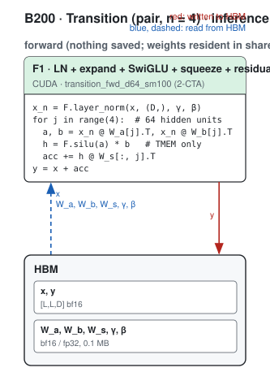
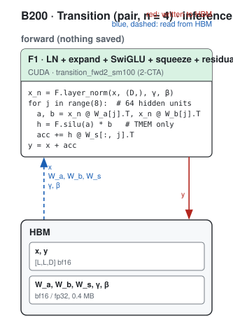
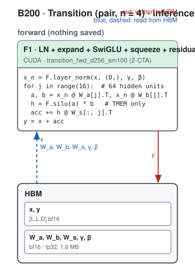
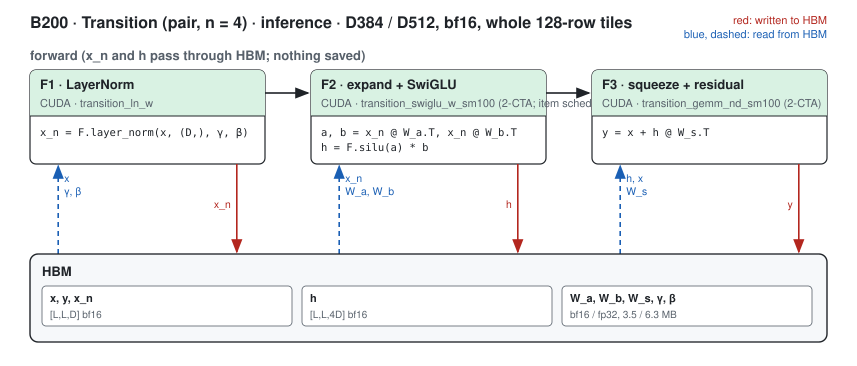
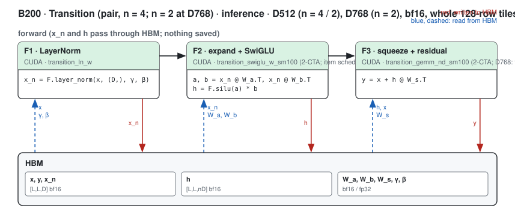
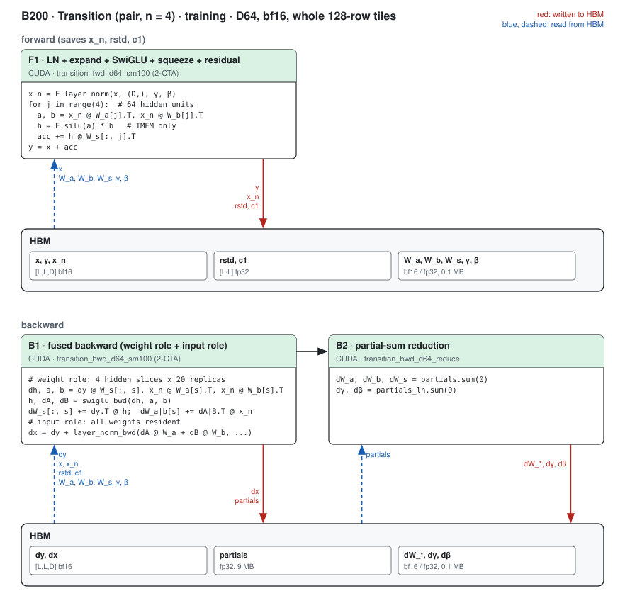
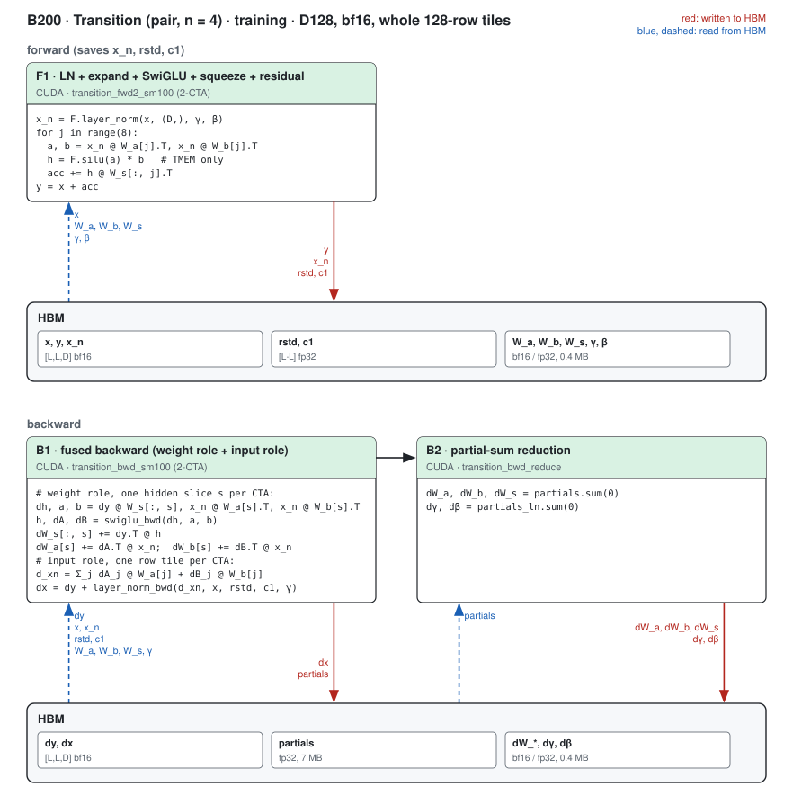
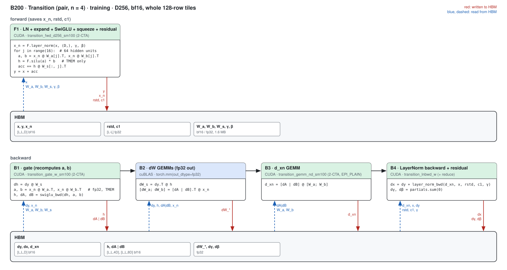
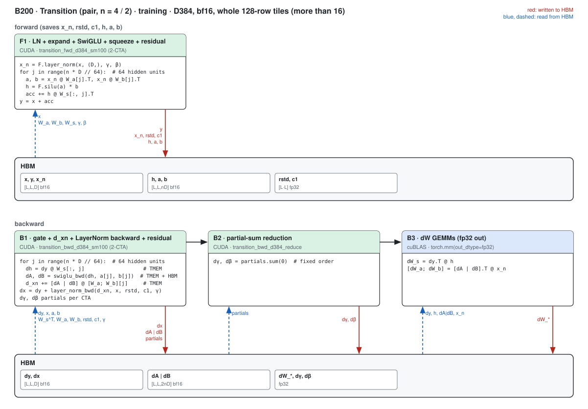
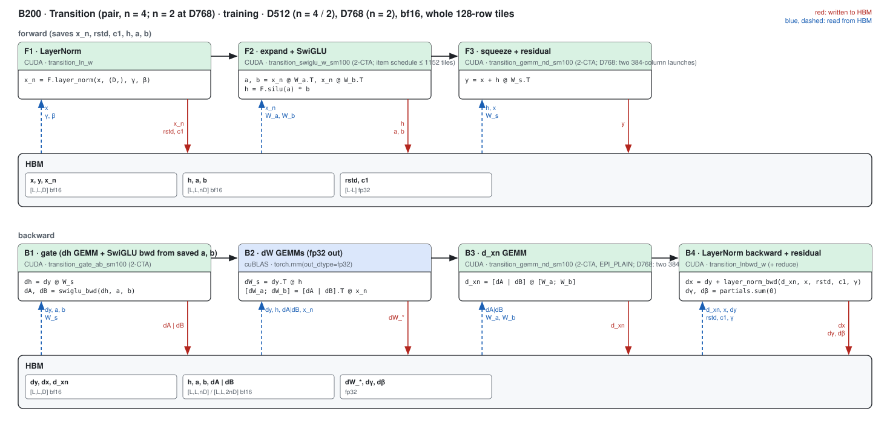

# Transition on B200 (sm100)

Kernel-level status of the Transition (`modules.Transition`, `y = x + W_s(silu(W_a·LN(x)) · (W_b·LN(x)))`, hidden n·D) on B200; the
module-level summary is in [b200.md](../b200.md). The hand-CUDA paths cover **bf16, n = 4 at D = 64 / 128 / 256 / 384 / 512 and
n = 2 at D = 64 / 128 / 256 / 384 / 512 / 768**, for any activation whose rows (every dimension but the last) are a whole number of
128-row tiles: the pair stream [B, L, L, D] (every registry length: L² is a multiple of 128 for L = 128 … 768), the MSA stream
[B, N, L, D] and a single stream [B, L, D]. Other (D, n) and fp32 keep the Triton residual path. Columns are (Length, Dimension)
because the CUDA paths are bf16 only; the tables below are for the pair stream, the other streams run the same kernels on their
rows (the single stream at D = 384 below 17 tiles excepted, see [Small M](#small-m-d384-at-most-16-tiles)).

Dispatch: `modules/transition/module.py::_residual_forward` and `kernels/transition/whole_op.py` try
`kernels/transition/cuda/fused_sm100a.available()` (D = 128, n = 4) and then `fused_wide_sm100a.available()` (every other (D, n) in
its `SHAPES`) before the Triton path: sm_100 with an even SM count, bf16 activations and weights, hidden = n D, rows a multiple of
128 (the two-role backwards also need enough SMs for both roles). Opt out of both with `MINIWORLD_TRANSITION_FUSED_SM100A=0`. The
two-role backwards' weight-role replica counts are `DW_REPL = 9` (D128 n = 4; `MINIWORLD_TRANSITION_SM100_REPL` overrides it) and
`REPL` = 20 / 30 / 14 for (64, 4) / (64, 2) / (128, 2) (`MINIWORLD_TRANSITION_WIDE_REPL`). At D = 384 the small-M paths take calls of
at most 16 tiles (`SMALL_FWD_TILES`, `SMALL_TILES`; `MINIWORLD_TRANSITION_WIDE_SMALL_FWD_TILES`, `MINIWORLD_TRANSITION_WIDE_SMALL_TILES`).

**Build.** The kernels are compiled into cubins by the newest nvcc on the machine that knows sm_100a (`/usr/local/cuda*/bin/nvcc`
or the torch-matched one; `MINIWORLD_TRANSITION_SM100_NVCC` overrides), one cubin group per (width, n) built on first use (each
kernel with `-DHID=<n D>`) and cached under `MINIWORLD_ENGINE_JIT_ROOT/transition_sm100a/`, and launched through the driver API from
the torch extension (`sm100/transition_sm100.cu`: the D128 entry points, plus a generic cubin / tensor-map / launch surface the other
widths are assembled on in Python). The reason is measured: the same D128 backward through CUDA 12.9's ptxas (the toolkit torch
cu129 pins) runs ~8 % slower than through 13.1's (L384 backward 250 vs 230 µs, L768 990 vs 885 µs). On the B200 box CUDA 13.1 is at
`/usr/local/cuda-13.1` and is picked automatically. The sources under `sm100/` are generated from the research capsule by its
`export_engine.py` (experiment switches resolved to the adopted build; each generated file's SASS equals the capsule cubin's).

Figures: one box per kernel, left to right, HBM reads (blue, left) and writes (red, right); generated from
`figures/transition_pair.json` by `python -m miniworld_engine.viz.kernel_flow`. (No `rsvg-convert` on the B200 box or the cssb login
node, so the pages embed the SVG until the PNGs are rendered.) The dW GEMMs of the D ≥ 256 backward are cuBLAS (fp32 output) and
appear in the figures only. The n = 2 builds run the kernels of the same width's figure (D768 as D512).

## Pair Transition, n = 4 (`Transition(d_hidden, n=4)`)

### Inference

#### D64 path · every L

##### F1 · LN + expand + SwiGLU + squeeze + residual

| (Length, Dimension) | (128, 64) | (256, 64) | (384, 64) | (512, 64) | (640, 64) | (768, 64) |
|---|---|---|---|---|---|---|
| implementation | CUDA | CUDA | CUDA | CUDA | CUDA | CUDA |
| 성능 확인 | ✗ | ✗ | ✗ | ✗ | ✗ | ✗ |
| cache build | ✓ | ✓ | ✓ | ✓ | ✓ | ✓ |
#### D128 path · every L

##### F1 · LN + expand + SwiGLU + squeeze + residual

| (Length, Dimension) | (128, 128) | (256, 128) | (384, 128) | (512, 128) | (640, 128) | (768, 128) |
|---|---|---|---|---|---|---|
| implementation | CUDA | CUDA | CUDA | CUDA | CUDA | CUDA |
| 성능 확인 | ✗ | ✗ | ✗ | ✗ | ✗ | ✗ |
| cache build | ✓ | ✓ | ✓ | ✓ | ✓ | ✓ |
#### D256 path · every L

##### F1 · LN + expand + SwiGLU + squeeze + residual

| (Length, Dimension) | (128, 256) | (256, 256) | (384, 256) | (512, 256) | (640, 256) | (768, 256) |
|---|---|---|---|---|---|---|
| implementation | CUDA | CUDA | CUDA | CUDA | CUDA | CUDA |
| 성능 확인 | ✗ | ✗ | ✗ | ✗ | ✗ | ✗ |
| cache build | ✓ | ✓ | ✓ | ✓ | ✓ | ✓ |
#### D384 path · every L

##### F1 · LN + expand + SwiGLU + squeeze + residual

| (Length, Dimension) | (128, 384) | (256, 384) | (384, 384) | (512, 384) | (640, 384) | (768, 384) |
|---|---|---|---|---|---|---|
| implementation | CUDA | CUDA | CUDA | CUDA | CUDA | CUDA |
| 성능 확인 | ✗ | ✗ | ✗ | ✗ | ✗ | ✗ |
| cache build | ✓ | ✓ | ✓ | ✓ | ✓ | ✓ |
#### D512 path · every L

##### F1 · LayerNorm

| (Length, Dimension) | (128, 512) | (256, 512) | (384, 512) | (512, 512) | (640, 512) | (768, 512) |
|---|---|---|---|---|---|---|
| implementation | CUDA | CUDA | CUDA | CUDA | CUDA | CUDA |
| 성능 확인 | ✗ | ✗ | ✗ | ✗ | ✗ | ✗ |
| cache build | ✓ | ✓ | ✓ | ✓ | ✓ | ✓ |

##### F2 · expand + SwiGLU

| (Length, Dimension) | (128, 512) | (256, 512) | (384, 512) | (512, 512) | (640, 512) | (768, 512) |
|---|---|---|---|---|---|---|
| implementation | CUDA | CUDA | CUDA | CUDA | CUDA | CUDA |
| 성능 확인 | ✗ | ✗ | ✗ | ✗ | ✗ | ✗ |
| cache build | ✓ | ✓ | ✓ | ✓ | ✓ | ✓ |

##### F3 · squeeze + residual

| (Length, Dimension) | (128, 512) | (256, 512) | (384, 512) | (512, 512) | (640, 512) | (768, 512) |
|---|---|---|---|---|---|---|
| implementation | CUDA | CUDA | CUDA | CUDA | CUDA | CUDA |
| 성능 확인 | ✗ | ✗ | ✗ | ✗ | ✗ | ✗ |
| cache build | ✓ | ✓ | ✓ | ✓ | ✓ | ✓ |

### Training

#### D64 path · every L

##### F1 · LN + expand + SwiGLU + squeeze + residual (saves x_n, rstd, c1)

| (Length, Dimension) | (128, 64) | (256, 64) | (384, 64) | (512, 64) | (640, 64) | (768, 64) |
|---|---|---|---|---|---|---|
| implementation | CUDA | CUDA | CUDA | CUDA | CUDA | CUDA |
| 성능 확인 | ✗ | ✗ | ✗ | ✗ | ✗ | ✗ |
| cache build | ✓ | ✓ | ✓ | ✓ | ✓ | ✓ |

##### B1 · fused backward (weight role + input role)

| (Length, Dimension) | (128, 64) | (256, 64) | (384, 64) | (512, 64) | (640, 64) | (768, 64) |
|---|---|---|---|---|---|---|
| implementation | CUDA | CUDA | CUDA | CUDA | CUDA | CUDA |
| 성능 확인 | ✗ | ✗ | ✗ | ✗ | ✗ | ✗ |
| cache build | ✓ | ✓ | ✓ | ✓ | ✓ | ✓ |

##### B2 · partial-sum reduction

| (Length, Dimension) | (128, 64) | (256, 64) | (384, 64) | (512, 64) | (640, 64) | (768, 64) |
|---|---|---|---|---|---|---|
| implementation | CUDA | CUDA | CUDA | CUDA | CUDA | CUDA |
| 성능 확인 | ✗ | ✗ | ✗ | ✗ | ✗ | ✗ |
| cache build | ✓ | ✓ | ✓ | ✓ | ✓ | ✓ |
#### D128 path · every L

##### F1 · LN + expand + SwiGLU + squeeze + residual (saves x_n, rstd, c1)

| (Length, Dimension) | (128, 128) | (256, 128) | (384, 128) | (512, 128) | (640, 128) | (768, 128) |
|---|---|---|---|---|---|---|
| implementation | CUDA | CUDA | CUDA | CUDA | CUDA | CUDA |
| 성능 확인 | ✗ | ✗ | ✗ | ✗ | ✗ | ✗ |
| cache build | ✓ | ✓ | ✓ | ✓ | ✓ | ✓ |

##### B1 · fused backward (weight role + input role)

| (Length, Dimension) | (128, 128) | (256, 128) | (384, 128) | (512, 128) | (640, 128) | (768, 128) |
|---|---|---|---|---|---|---|
| implementation | CUDA | CUDA | CUDA | CUDA | CUDA | CUDA |
| 성능 확인 | ✗ | ✗ | ✗ | ✗ | ✗ | ✗ |
| cache build | ✓ | ✓ | ✓ | ✓ | ✓ | ✓ |

##### B2 · partial-sum reduction

| (Length, Dimension) | (128, 128) | (256, 128) | (384, 128) | (512, 128) | (640, 128) | (768, 128) |
|---|---|---|---|---|---|---|
| implementation | CUDA | CUDA | CUDA | CUDA | CUDA | CUDA |
| 성능 확인 | ✗ | ✗ | ✗ | ✗ | ✗ | ✗ |
| cache build | ✓ | ✓ | ✓ | ✓ | ✓ | ✓ |
#### D256 path · every L

##### F1 · LN + expand + SwiGLU + squeeze + residual (saves x_n, rstd, c1)

| (Length, Dimension) | (128, 256) | (256, 256) | (384, 256) | (512, 256) | (640, 256) | (768, 256) |
|---|---|---|---|---|---|---|
| implementation | CUDA | CUDA | CUDA | CUDA | CUDA | CUDA |
| 성능 확인 | ✗ | ✗ | ✗ | ✗ | ✗ | ✗ |
| cache build | ✓ | ✓ | ✓ | ✓ | ✓ | ✓ |

##### B1 · gate (recomputes a, b; writes h, dA | dB)

| (Length, Dimension) | (128, 256) | (256, 256) | (384, 256) | (512, 256) | (640, 256) | (768, 256) |
|---|---|---|---|---|---|---|
| implementation | CUDA | CUDA | CUDA | CUDA | CUDA | CUDA |
| 성능 확인 | ✗ | ✗ | ✗ | ✗ | ✗ | ✗ |
| cache build | ✓ | ✓ | ✓ | ✓ | ✓ | ✓ |

##### B3 · d_xn GEMM

| (Length, Dimension) | (128, 256) | (256, 256) | (384, 256) | (512, 256) | (640, 256) | (768, 256) |
|---|---|---|---|---|---|---|
| implementation | CUDA | CUDA | CUDA | CUDA | CUDA | CUDA |
| 성능 확인 | ✗ | ✗ | ✗ | ✗ | ✗ | ✗ |
| cache build | ✓ | ✓ | ✓ | ✓ | ✓ | ✓ |

##### B4 · LayerNorm backward + residual (+ reduction)

| (Length, Dimension) | (128, 256) | (256, 256) | (384, 256) | (512, 256) | (640, 256) | (768, 256) |
|---|---|---|---|---|---|---|
| implementation | CUDA | CUDA | CUDA | CUDA | CUDA | CUDA |
| 성능 확인 | ✗ | ✗ | ✗ | ✗ | ✗ | ✗ |
| cache build | ✓ | ✓ | ✓ | ✓ | ✓ | ✓ |
#### D384 path · every L

##### F1 · LN + expand + SwiGLU + squeeze + residual (saves x_n, rstd, c1, h, a, b)

| (Length, Dimension) | (128, 384) | (256, 384) | (384, 384) | (512, 384) | (640, 384) | (768, 384) |
|---|---|---|---|---|---|---|
| implementation | CUDA | CUDA | CUDA | CUDA | CUDA | CUDA |
| 성능 확인 | ✗ | ✗ | ✗ | ✗ | ✗ | ✗ |
| cache build | ✓ | ✓ | ✓ | ✓ | ✓ | ✓ |

##### B1 · gate + d_xn + LayerNorm backward + residual (writes dA | dB, dγ / dβ partials)

| (Length, Dimension) | (128, 384) | (256, 384) | (384, 384) | (512, 384) | (640, 384) | (768, 384) |
|---|---|---|---|---|---|---|
| implementation | CUDA | CUDA | CUDA | CUDA | CUDA | CUDA |
| 성능 확인 | ✗ | ✗ | ✗ | ✗ | ✗ | ✗ |
| cache build | ✓ | ✓ | ✓ | ✓ | ✓ | ✓ |

##### B2 · partial-sum reduction

| (Length, Dimension) | (128, 384) | (256, 384) | (384, 384) | (512, 384) | (640, 384) | (768, 384) |
|---|---|---|---|---|---|---|
| implementation | CUDA | CUDA | CUDA | CUDA | CUDA | CUDA |
| 성능 확인 | ✗ | ✗ | ✗ | ✗ | ✗ | ✗ |
| cache build | ✓ | ✓ | ✓ | ✓ | ✓ | ✓ |
#### D512 path · every L

##### F1 · LayerNorm (saves rstd, c1)

| (Length, Dimension) | (128, 512) | (256, 512) | (384, 512) | (512, 512) | (640, 512) | (768, 512) |
|---|---|---|---|---|---|---|
| implementation | CUDA | CUDA | CUDA | CUDA | CUDA | CUDA |
| 성능 확인 | ✗ | ✗ | ✗ | ✗ | ✗ | ✗ |
| cache build | ✓ | ✓ | ✓ | ✓ | ✓ | ✓ |

##### F2 · expand + SwiGLU (saves h, a, b)

| (Length, Dimension) | (128, 512) | (256, 512) | (384, 512) | (512, 512) | (640, 512) | (768, 512) |
|---|---|---|---|---|---|---|
| implementation | CUDA | CUDA | CUDA | CUDA | CUDA | CUDA |
| 성능 확인 | ✗ | ✗ | ✗ | ✗ | ✗ | ✗ |
| cache build | ✓ | ✓ | ✓ | ✓ | ✓ | ✓ |

##### F3 · squeeze + residual

| (Length, Dimension) | (128, 512) | (256, 512) | (384, 512) | (512, 512) | (640, 512) | (768, 512) |
|---|---|---|---|---|---|---|
| implementation | CUDA | CUDA | CUDA | CUDA | CUDA | CUDA |
| 성능 확인 | ✗ | ✗ | ✗ | ✗ | ✗ | ✗ |
| cache build | ✓ | ✓ | ✓ | ✓ | ✓ | ✓ |

##### B1 · gate (dh GEMM + SwiGLU backward from the saved a, b)

| (Length, Dimension) | (128, 512) | (256, 512) | (384, 512) | (512, 512) | (640, 512) | (768, 512) |
|---|---|---|---|---|---|---|
| implementation | CUDA | CUDA | CUDA | CUDA | CUDA | CUDA |
| 성능 확인 | ✗ | ✗ | ✗ | ✗ | ✗ | ✗ |
| cache build | ✓ | ✓ | ✓ | ✓ | ✓ | ✓ |

##### B3 · d_xn GEMM

| (Length, Dimension) | (128, 512) | (256, 512) | (384, 512) | (512, 512) | (640, 512) | (768, 512) |
|---|---|---|---|---|---|---|
| implementation | CUDA | CUDA | CUDA | CUDA | CUDA | CUDA |
| 성능 확인 | ✗ | ✗ | ✗ | ✗ | ✗ | ✗ |
| cache build | ✓ | ✓ | ✓ | ✓ | ✓ | ✓ |

##### B4 · LayerNorm backward + residual (+ reduction)

| (Length, Dimension) | (128, 512) | (256, 512) | (384, 512) | (512, 512) | (640, 512) | (768, 512) |
|---|---|---|---|---|---|---|
| implementation | CUDA | CUDA | CUDA | CUDA | CUDA | CUDA |
| 성능 확인 | ✗ | ✗ | ✗ | ✗ | ✗ | ✗ |
| cache build | ✓ | ✓ | ✓ | ✓ | ✓ | ✓ |

## Transition, n = 2 (`Transition(d, n=2)`)

The same kernel sources built with `-DHID=2D`. In MiniWorld (origin/main) n = 2 is the diffusion conditioning's pair (D128) and
single (D384) Transition; the per-width paths are the n = 4 ones (D128 through `fused_wide_sm100a` with the D128 fused kernels at
hidden 256), plus D768, which runs the D512 path with the squeeze and d_xn GEMMs as two 384-column launches (one launch's accumulator
must fit 512 tensor-memory columns).

### Inference

##### F1 · D64 / D128 / D256 / D384: LN + expand + SwiGLU + squeeze + residual (one kernel)

| (Length, Dimension) | (128, 64) | (256, 64) | (384, 64) | (512, 64) | (640, 64) | (768, 64) | (128, 128) | (256, 128) | (384, 128) | (512, 128) | (640, 128) | (768, 128) | (128, 256) | (256, 256) | (384, 256) | (512, 256) | (640, 256) | (768, 256) | (128, 384) | (256, 384) | (384, 384) | (512, 384) | (640, 384) | (768, 384) |
|---|---|---|---|---|---|---|---|---|---|---|---|---|---|---|---|---|---|---|---|---|---|---|---|---|
| implementation | CUDA | CUDA | CUDA | CUDA | CUDA | CUDA | CUDA | CUDA | CUDA | CUDA | CUDA | CUDA | CUDA | CUDA | CUDA | CUDA | CUDA | CUDA | CUDA | CUDA | CUDA | CUDA | CUDA | CUDA |
| 성능 확인 | ✗ | ✗ | ✗ | ✗ | ✗ | ✗ | ✗ | ✗ | ✗ | ✗ | ✗ | ✗ | ✗ | ✗ | ✗ | ✗ | ✗ | ✗ | ✗ | ✗ | ✗ | ✗ | ✗ | ✗ |
| cache build | ✓ | ✓ | ✓ | ✓ | ✓ | ✓ | ✓ | ✓ | ✓ | ✓ | ✓ | ✓ | ✓ | ✓ | ✓ | ✓ | ✓ | ✓ | ✓ | ✓ | ✓ | ✓ | ✓ | ✓ |

##### F1 · D512 / D768: LayerNorm

| (Length, Dimension) | (128, 512) | (256, 512) | (384, 512) | (512, 512) | (640, 512) | (768, 512) | (128, 768) | (256, 768) | (384, 768) | (512, 768) | (640, 768) | (768, 768) |
|---|---|---|---|---|---|---|---|---|---|---|---|---|
| implementation | CUDA | CUDA | CUDA | CUDA | CUDA | CUDA | CUDA | CUDA | CUDA | CUDA | CUDA | CUDA |
| 성능 확인 | ✗ | ✗ | ✗ | ✗ | ✗ | ✗ | ✗ | ✗ | ✗ | ✗ | ✗ | ✗ |
| cache build | ✓ | ✓ | ✓ | ✓ | ✓ | ✓ | ✓ | ✓ | ✓ | ✓ | ✓ | ✓ |

##### F2 · D512 / D768: expand + SwiGLU

| (Length, Dimension) | (128, 512) | (256, 512) | (384, 512) | (512, 512) | (640, 512) | (768, 512) | (128, 768) | (256, 768) | (384, 768) | (512, 768) | (640, 768) | (768, 768) |
|---|---|---|---|---|---|---|---|---|---|---|---|---|
| implementation | CUDA | CUDA | CUDA | CUDA | CUDA | CUDA | CUDA | CUDA | CUDA | CUDA | CUDA | CUDA |
| 성능 확인 | ✗ | ✗ | ✗ | ✗ | ✗ | ✗ | ✗ | ✗ | ✗ | ✗ | ✗ | ✗ |
| cache build | ✓ | ✓ | ✓ | ✓ | ✓ | ✓ | ✓ | ✓ | ✓ | ✓ | ✓ | ✓ |

##### F3 · D512 / D768: squeeze + residual (D768: two 384-column launches)

| (Length, Dimension) | (128, 512) | (256, 512) | (384, 512) | (512, 512) | (640, 512) | (768, 512) | (128, 768) | (256, 768) | (384, 768) | (512, 768) | (640, 768) | (768, 768) |
|---|---|---|---|---|---|---|---|---|---|---|---|---|
| implementation | CUDA | CUDA | CUDA | CUDA | CUDA | CUDA | CUDA | CUDA | CUDA | CUDA | CUDA | CUDA |
| 성능 확인 | ✗ | ✗ | ✗ | ✗ | ✗ | ✗ | ✗ | ✗ | ✗ | ✗ | ✗ | ✗ |
| cache build | ✓ | ✓ | ✓ | ✓ | ✓ | ✓ | ✓ | ✓ | ✓ | ✓ | ✓ | ✓ |

### Training

##### F1 · D64 / D128 / D256 / D384: one fused kernel (saves x_n, rstd, c1; at D384 also h, a, b)

| (Length, Dimension) | (128, 64) | (256, 64) | (384, 64) | (512, 64) | (640, 64) | (768, 64) | (128, 128) | (256, 128) | (384, 128) | (512, 128) | (640, 128) | (768, 128) | (128, 256) | (256, 256) | (384, 256) | (512, 256) | (640, 256) | (768, 256) | (128, 384) | (256, 384) | (384, 384) | (512, 384) | (640, 384) | (768, 384) |
|---|---|---|---|---|---|---|---|---|---|---|---|---|---|---|---|---|---|---|---|---|---|---|---|---|
| implementation | CUDA | CUDA | CUDA | CUDA | CUDA | CUDA | CUDA | CUDA | CUDA | CUDA | CUDA | CUDA | CUDA | CUDA | CUDA | CUDA | CUDA | CUDA | CUDA | CUDA | CUDA | CUDA | CUDA | CUDA |
| 성능 확인 | ✗ | ✗ | ✗ | ✗ | ✗ | ✗ | ✗ | ✗ | ✗ | ✗ | ✗ | ✗ | ✗ | ✗ | ✗ | ✗ | ✗ | ✗ | ✗ | ✗ | ✗ | ✗ | ✗ | ✗ |
| cache build | ✓ | ✓ | ✓ | ✓ | ✓ | ✓ | ✓ | ✓ | ✓ | ✓ | ✓ | ✓ | ✓ | ✓ | ✓ | ✓ | ✓ | ✓ | ✓ | ✓ | ✓ | ✓ | ✓ | ✓ |

##### B1 · D64 / D128: fused two-role backward

| (Length, Dimension) | (128, 64) | (256, 64) | (384, 64) | (512, 64) | (640, 64) | (768, 64) | (128, 128) | (256, 128) | (384, 128) | (512, 128) | (640, 128) | (768, 128) |
|---|---|---|---|---|---|---|---|---|---|---|---|---|
| implementation | CUDA | CUDA | CUDA | CUDA | CUDA | CUDA | CUDA | CUDA | CUDA | CUDA | CUDA | CUDA |
| 성능 확인 | ✗ | ✗ | ✗ | ✗ | ✗ | ✗ | ✗ | ✗ | ✗ | ✗ | ✗ | ✗ |
| cache build | ✓ | ✓ | ✓ | ✓ | ✓ | ✓ | ✓ | ✓ | ✓ | ✓ | ✓ | ✓ |

##### B2 · D64 / D128: partial-sum reduction

| (Length, Dimension) | (128, 64) | (256, 64) | (384, 64) | (512, 64) | (640, 64) | (768, 64) | (128, 128) | (256, 128) | (384, 128) | (512, 128) | (640, 128) | (768, 128) |
|---|---|---|---|---|---|---|---|---|---|---|---|---|
| implementation | CUDA | CUDA | CUDA | CUDA | CUDA | CUDA | CUDA | CUDA | CUDA | CUDA | CUDA | CUDA |
| 성능 확인 | ✗ | ✗ | ✗ | ✗ | ✗ | ✗ | ✗ | ✗ | ✗ | ✗ | ✗ | ✗ |
| cache build | ✓ | ✓ | ✓ | ✓ | ✓ | ✓ | ✓ | ✓ | ✓ | ✓ | ✓ | ✓ |

##### B1 · D256: gate (recomputes a, b; writes h, dA | dB)

| (Length, Dimension) | (128, 256) | (256, 256) | (384, 256) | (512, 256) | (640, 256) | (768, 256) |
|---|---|---|---|---|---|---|
| implementation | CUDA | CUDA | CUDA | CUDA | CUDA | CUDA |
| 성능 확인 | ✗ | ✗ | ✗ | ✗ | ✗ | ✗ |
| cache build | ✓ | ✓ | ✓ | ✓ | ✓ | ✓ |

##### B1 · D384: gate + d_xn + LayerNorm backward + residual

| (Length, Dimension) | (128, 384) | (256, 384) | (384, 384) | (512, 384) | (640, 384) | (768, 384) |
|---|---|---|---|---|---|---|
| implementation | CUDA | CUDA | CUDA | CUDA | CUDA | CUDA |
| 성능 확인 | ✗ | ✗ | ✗ | ✗ | ✗ | ✗ |
| cache build | ✓ | ✓ | ✓ | ✓ | ✓ | ✓ |

##### B2 · D384: partial-sum reduction

| (Length, Dimension) | (128, 384) | (256, 384) | (384, 384) | (512, 384) | (640, 384) | (768, 384) |
|---|---|---|---|---|---|---|
| implementation | CUDA | CUDA | CUDA | CUDA | CUDA | CUDA |
| 성능 확인 | ✗ | ✗ | ✗ | ✗ | ✗ | ✗ |
| cache build | ✓ | ✓ | ✓ | ✓ | ✓ | ✓ |

##### F1-F3 · D512 / D768: LayerNorm (saves rstd, c1), expand + SwiGLU (saves h, a, b), squeeze + residual

| (Length, Dimension) | (128, 512) | (256, 512) | (384, 512) | (512, 512) | (640, 512) | (768, 512) | (128, 768) | (256, 768) | (384, 768) | (512, 768) | (640, 768) | (768, 768) |
|---|---|---|---|---|---|---|---|---|---|---|---|---|
| implementation | CUDA | CUDA | CUDA | CUDA | CUDA | CUDA | CUDA | CUDA | CUDA | CUDA | CUDA | CUDA |
| 성능 확인 | ✗ | ✗ | ✗ | ✗ | ✗ | ✗ | ✗ | ✗ | ✗ | ✗ | ✗ | ✗ |
| cache build | ✓ | ✓ | ✓ | ✓ | ✓ | ✓ | ✓ | ✓ | ✓ | ✓ | ✓ | ✓ |

##### B1 · D512 / D768: gate (dh GEMM + SwiGLU backward from the saved a, b)

| (Length, Dimension) | (128, 512) | (256, 512) | (384, 512) | (512, 512) | (640, 512) | (768, 512) | (128, 768) | (256, 768) | (384, 768) | (512, 768) | (640, 768) | (768, 768) |
|---|---|---|---|---|---|---|---|---|---|---|---|---|
| implementation | CUDA | CUDA | CUDA | CUDA | CUDA | CUDA | CUDA | CUDA | CUDA | CUDA | CUDA | CUDA |
| 성능 확인 | ✗ | ✗ | ✗ | ✗ | ✗ | ✗ | ✗ | ✗ | ✗ | ✗ | ✗ | ✗ |
| cache build | ✓ | ✓ | ✓ | ✓ | ✓ | ✓ | ✓ | ✓ | ✓ | ✓ | ✓ | ✓ |

##### B3 · D256 / D512 / D768: d_xn GEMM (D768: two 384-column launches)

| (Length, Dimension) | (128, 256) | (256, 256) | (384, 256) | (512, 256) | (640, 256) | (768, 256) | (128, 512) | (256, 512) | (384, 512) | (512, 512) | (640, 512) | (768, 512) | (128, 768) | (256, 768) | (384, 768) | (512, 768) | (640, 768) | (768, 768) |
|---|---|---|---|---|---|---|---|---|---|---|---|---|---|---|---|---|---|---|
| implementation | CUDA | CUDA | CUDA | CUDA | CUDA | CUDA | CUDA | CUDA | CUDA | CUDA | CUDA | CUDA | CUDA | CUDA | CUDA | CUDA | CUDA | CUDA |
| 성능 확인 | ✗ | ✗ | ✗ | ✗ | ✗ | ✗ | ✗ | ✗ | ✗ | ✗ | ✗ | ✗ | ✗ | ✗ | ✗ | ✗ | ✗ | ✗ |
| cache build | ✓ | ✓ | ✓ | ✓ | ✓ | ✓ | ✓ | ✓ | ✓ | ✓ | ✓ | ✓ | ✓ | ✓ | ✓ | ✓ | ✓ | ✓ |

##### B4 · D256 / D512 / D768: LayerNorm backward + residual (+ reduction)

| (Length, Dimension) | (128, 256) | (256, 256) | (384, 256) | (512, 256) | (640, 256) | (768, 256) | (128, 512) | (256, 512) | (384, 512) | (512, 512) | (640, 512) | (768, 512) | (128, 768) | (256, 768) | (384, 768) | (512, 768) | (640, 768) | (768, 768) |
|---|---|---|---|---|---|---|---|---|---|---|---|---|---|---|---|---|---|---|
| implementation | CUDA | CUDA | CUDA | CUDA | CUDA | CUDA | CUDA | CUDA | CUDA | CUDA | CUDA | CUDA | CUDA | CUDA | CUDA | CUDA | CUDA | CUDA |
| 성능 확인 | ✗ | ✗ | ✗ | ✗ | ✗ | ✗ | ✗ | ✗ | ✗ | ✗ | ✗ | ✗ | ✗ | ✗ | ✗ | ✗ | ✗ | ✗ |
| cache build | ✓ | ✓ | ✓ | ✓ | ✓ | ✓ | ✓ | ✓ | ✓ | ✓ | ✓ | ✓ | ✓ | ✓ | ✓ | ✓ | ✓ | ✓ |

## Small M (D384, at most 16 tiles)

A single-stream activation [1, L, 384] is L / 128 ≤ 6 tiles (the diffusion conditioning at inference); per-tile kernels would keep
one SM pair per tile busy. Up to 16 tiles the forward is one kernel per cluster of CL CTAs that split the hidden units and sum their
partial accumulators through an fp32 L2 scratch (CL the largest of 12 / 6 / 4 / 2 whose clusters are all resident at once, by the
driver's `cuOccupancyMaxActiveClusters`), and the backward gate deals (tile pair, 256-unit block) items over all SMs. Columns below
are (L, D) of [1, L, 384], n = 2 or 4. Larger calls (the training batch [48, L, 384]) run the per-tile D384 path above.

### Inference and training

##### F1 · LN + expand + SwiGLU + squeeze + residual, cluster hidden split (training: saves x_n, rstd, c1, h, a, b)

| (Length, Dimension) | (128, 384) | (256, 384) | (384, 384) | (512, 384) | (640, 384) | (768, 384) |
|---|---|---|---|---|---|---|
| implementation | CUDA | CUDA | CUDA | CUDA | CUDA | CUDA |
| 성능 확인 | ✗ | ✗ | ✗ | ✗ | ✗ | ✗ |
| cache build | ✓ | ✓ | ✓ | ✓ | ✓ | ✓ |

##### B1 · gate (dh GEMM + SwiGLU backward from the saved a, b; item schedule)

| (Length, Dimension) | (128, 384) | (256, 384) | (384, 384) | (512, 384) | (640, 384) | (768, 384) |
|---|---|---|---|---|---|---|
| implementation | CUDA | CUDA | CUDA | CUDA | CUDA | CUDA |
| 성능 확인 | ✗ | ✗ | ✗ | ✗ | ✗ | ✗ |
| cache build | ✓ | ✓ | ✓ | ✓ | ✓ | ✓ |

##### B3 · d_xn GEMM

| (Length, Dimension) | (128, 384) | (256, 384) | (384, 384) | (512, 384) | (640, 384) | (768, 384) |
|---|---|---|---|---|---|---|
| implementation | CUDA | CUDA | CUDA | CUDA | CUDA | CUDA |
| 성능 확인 | ✗ | ✗ | ✗ | ✗ | ✗ | ✗ |
| cache build | ✓ | ✓ | ✓ | ✓ | ✓ | ✓ |

##### B4 · LayerNorm backward + residual (+ reduction)

| (Length, Dimension) | (128, 384) | (256, 384) | (384, 384) | (512, 384) | (640, 384) | (768, 384) |
|---|---|---|---|---|---|---|
| implementation | CUDA | CUDA | CUDA | CUDA | CUDA | CUDA |
| 성능 확인 | ✗ | ✗ | ✗ | ✗ | ✗ | ✗ |
| cache build | ✓ | ✓ | ✓ | ✓ | ✓ | ✓ |

No kernel on these paths is autotuned, so nothing needs a cache (✓).

## How the kernels work

- **D128 F1** (`sm100/tr_fwd_sm100.cu`): persistent, 128-row tiles, the two CTAs of a 2-CTA cluster in lockstep. Per 64-unit hidden
  chunk the leader issues the expand `[a|b] = x_n [W_a; W_b]_j^T` as one M = 256 `cta_group::2` product (the leader holds `W_a,j`,
  the peer `W_b,j`, so each SM streams half of the weights) into tensor memory; two SwiGLU warpgroups form `h = bf16(silu(a) b)` and
  write it back to tensor memory, where the squeeze reads it as the A operand. `h` never reaches shared or global memory. LayerNorm
  of the next tile runs on its own warpgroup. Inference skips the `x_n` / statistics stores at run time.
- **D128 B1** (`sm100/tr_bwd_sm100.cu`): 8 × `DW_REPL` weight-role CTAs keep one hidden slice's `W_s / W_a / W_b` resident, recompute
  `dh / a / b`, run the gate, and accumulate `dW_a | dW_b | dW_s` in tensor memory; the other CTAs stream the weight chunks
  (multicast over the pair), form `d_xn`, and run the LayerNorm backward and the residual. **B2** sums the partials in a fixed order.
- **D64** (`sm100/widths/tfwd_d64.cu`, `tbwd_d64.cu`): D128's design with all weights resident in shared memory (48 KB per CTA in
  the forward, 96 KB in the backward's input role); the backward's weight role is 4 hidden slices × 20 replicas.
- **D256 F1** (`widths/tfwd_d256.cu`): one fused kernel; the output accumulator takes 256 tensor-memory columns and the two `[a|b]`
  buffers the rest, so `h` is written in place over its own `[a|b]` buffer. The backward is split: **B1** (`widths/tgate_w.cu`)
  recomputes `a, b` in fp32 from `x_n`, forms `dh = dy W_s` and the SwiGLU backward, and writes `h` and `[dA | dB]`; cuBLAS forms the
  weight gradients in fp32; **B3** (`widths/tgemm_nd.cu`) `d_xn = [dA | dB][W_a; W_b]`; **B4** (`widths/tlnbwd_w.cu`) the LayerNorm
  backward and the residual.
- **D384 F1** (`widths/tfwd_d384.cu`): one fused kernel. The output accumulator takes 384 tensor-memory columns, so there is one
  128-column `[a|b]` buffer (a 64-unit hidden chunk); the two SwiGLU warpgroups read their half of it with one 64-column load, hand it
  back at once and write `h` to shared memory, where the squeeze reads it. The weights stream through a 2-stage ring of 3 K-blocks
  (12 MMAs per wait) and a single W_s stage; the LayerNorm runs on 12 warps (three threads per row) and the epilogue of tile i
  (residual by TMA, `x + acc` in place, TMA store) overlaps the LayerNorm of tile i + 1. Training stores `h, a, b` from registers with
  a quad transpose (each store 8 rows × 64 B).
- **D384 B1** (`widths/tbwd_d384.cu`): gate, d_xn and the LayerNorm backward in one kernel. Per 64-unit chunk: `dh = dy W_s` (the dy
  tile resident as the A operand, `W_s^T` K-major) into one of two 64-column tensor-memory buffers; the gate reads `dh` and the saved
  `a, b` (TMA) and writes `[dA | dB]` back over `dh` as bf16 (half by half); `d_xn += [dA | dB][W_a; W_b]` takes A from tensor memory
  and B in the weights' own layout (MN-major, a 4-slot ring of 16 KB atoms, one N = 128 product per atom). Warps 8-11 copy `[dA | dB]`
  to HBM for the dW GEMMs; after the tile's last chunk its x is loaded over the weight region and 12 warps run the LayerNorm backward
  from `d_xn` in tensor memory, writing dx over dy. dγ / dβ are per-CTA partials summed by **B2** in a fixed order. The dW GEMMs stay
  cuBLAS (fp32 output); the host makes `W_s^T` per call.
- **D512 / D768**: the output accumulator alone is 512 (768) tensor-memory columns, so the forward is three kernels: **F1** LayerNorm
  (`widths/tln_w.cu`), **F2** expand + SwiGLU (`widths/tswiglu_w.cu`, writes `h`, and in training `a` and `b`), **F3** squeeze +
  residual (`widths/tgemm_nd.cu`; D768 as two 384-column launches). F2 deals (tile pair, 128-unit chunk) items over all SMs up to
  1152 tiles and whole tile pairs above. The backward's **B1** (`widths/tgate_ab.cu`) fuses `dh = dy W_s` with the SwiGLU backward
  from the saved `a, b`, then B3 / B4 as at D256.
- **Small M, D384** (`widths/tsmall_w.cu`): see [Small M](#small-m-d384-at-most-16-tiles); the backward is the D512-style chain with the
  gate's item schedule.
- Numerics are the sm_90a contract (same rounding points; `x_n`, `h`, `dA`, `dB`, `d_xn` in bf16, fp32 accumulation; at D ≥ 384 `a, b`
  saved in bf16); vs the fp32 module every (D, n) is at least as close as the Triton path
  (`tests/numerics/test_transition_fused_sm100a_gpu.py`, `tests/numerics/test_transition_fused_wide_sm100a_gpu.py`: 1 / 3 / 15 / 1152
  tiles, 1200 at D ≥ 384, the MSA and single-stream shapes). Reductions run in a fixed order (no atomics): a replay is bit-identical.
- Research record (rounds v1-v23 for D128, w1-w6, s1 and n2 for the other widths, n = 2 and D384, with profiles and rejected
  variants): `experiments/transition_fused_sm100/` on branch `perf/transition-sm100-b200`.

## Measurements

### Pair, n = 4 (2026-09-29; D384 *ours* 2026-09-30)

B200 (148 SMs, 1000 W limit), torch 2.13 + cu129, kernels built by CUDA 13.1; `benchmarks/runners/bench.py target=transition
level=module d_pair=D`, compiled, CUDA-graph replay, µs. *ours* = `modules.Transition` through `fused_sm100a` / `fused_wide_sm100a`;
the Triton row is the same module with `MINIWORLD_TRANSITION_FUSED_SM100A=0` (the path B200 ran before; D ≠ 128 values from the
research capsule's module run of the same bench, round w1). × = ours vs the fastest other row. The D384 *ours* values are the fused
D384 kernels, re-measured 2026-09-30 with the same command (before: inference 457.2 / 1940.4, training 1734.5 / 6850.0 µs at
L384 / L768); the other columns are unchanged. At these sizes (1152 / 4608 tiles) the training step barely moves: at L384 the fused
forward with its h / a / b stores is ~40 µs slower than the three-kernel forward (kernels alone: 363 vs 322 µs) and the fused
backward ~70 µs faster (648 vs 720 µs); inference gains 1.25x.

#### Inference

| (Length, Dimension) | PyTorch compiled | cuEquivariance | Anthropic | Triton (engine) | ours | × |
|---|---|---|---|---|---|---|
| (384, 64) | 130.9 | n/a | 48.4 * | 85.8 | **36.7** | 1.32 |
| (768, 64) | 370.6 | n/a | 189.9 * | 313.2 | **114.6** | 1.66 |
| (384, 128) | 200.5 | n/a | 108.4 * | 205.8 | **63.3** | 1.71 |
| (768, 128) | 745.2 | n/a | 479.8 * | 755.7 | **227.1** | 2.11 |
| (384, 256) | 407.5 | n/a | 504.8 * | 530.2 | **192.4** | 2.12 |
| (768, 256) | 1604.6 | n/a | 2004.2 * | 2087.8 | **798.5** | 2.01 |
| (384, 384) | 686.1 | n/a | 4444.5 * | 1059.8 | **364.5** | 1.88 |
| (768, 384) | 2912.1 | n/a | 17669.6 * | 4179.5 | **1569.5** | 1.86 |
| (384, 512) | 1004.4 | n/a | n/a (no row) | 1670.0 | **749.3** | 1.34 |
| (768, 512) | 4336.4 | n/a | n/a (no row) | 6732.8 | **3202.8** | 1.35 |

#### Training (forward + backward)

| (Length, Dimension) | PyTorch compiled | cuEquivariance | Anthropic | Triton (engine) | ours | × |
|---|---|---|---|---|---|---|
| (384, 64) | 335.7 | n/a | n/a (no backward) | 329.6 | **132.9** | 2.48 |
| (768, 64) | 1063.8 | n/a | n/a (no backward) | 1182.7 | **448.1** | 2.37 |
| (384, 128) | 588.8 | n/a | n/a (no backward) | 715.8 | **290.6** | 2.03 |
| (768, 128) | 2073.4 | n/a | n/a (no backward) | 2654.0 | **1098.6** | 1.89 |
| (384, 256) | 1210.4 | n/a | n/a (no backward) | 1764.3 | **954.1** | 1.27 |
| (768, 256) | 4393.0 | n/a | n/a (no backward) | 6839.3 | **3833.7** | 1.15 |
| (384, 384) | 1972.1 | n/a | n/a (no backward) | 3360.3 | **1716.6** | 1.15 |
| (768, 384) | 8666.1 | n/a | n/a (no backward) | 13429.8 | **6844.3** | 1.27 |
| (384, 512) | 2894.7 | n/a | n/a (no backward) | 5210.0 | **2671.5** | 1.08 |
| (768, 512) | 12775.4 | n/a | n/a (no backward) | 21585.4 | **11183.1** | 1.14 |

\* Anthropic: the module-level runner refuses its rows on cc 10.0; the numbers are Anthropic's best Transition row at the kernel level
from the research capsule (`records/infer-all-s1.json`: `lnl` at D64, `v2` at D128, `pf` at D256 / D384; no row runs at D512).

Accuracy: every width passes "no further from fp32 than the Triton path" on 1 / 3 / 15 / 1152 tiles (and 1200 tiles at D ≥ 384,
the tile schedule), gradients included. Separate processes vary by up to ±10 % on this power-capped card (e.g. torch.compile D384
L768 training 7939 µs without / 8666 µs with CUDA graphs in the same run).

Host side: a training call through the autograd Function and the custom ops costs ~160 µs of CPU at D128 and ~210-300 µs at the
other widths (µs per forward + backward, measured with the GPU kept busy). Everywhere but D64 the GPU work is longer; D64 at L384
(133 µs of GPU work) is host-bound without CUDA graphs (210 µs).

The module-level forward is ~5-9 µs above the kernels alone (D128 L384: 63.3 vs 55.8 µs): the module casts its fp32 parameters to
bf16 on every call under `bf16-mixed`. Against the power-capped ceiling of this card (dense bf16 cuBLAS sustains 1.30 PFLOP/s at the
1000 W limit), the D128 training step reaches ~67 % (L384) / ~72 % (L768) of the design's tensor work at that rate; the research
record explains why the fusion cannot reach 90 % on this card with the bf16 contract.

### n = 2, MSA and single streams (2026-09-30)

Same card and toolchain; module level with bf16 parameters, one eager call captured in a CUDA graph and replayed, µs (the research
capsule's `bench_n2.py`, round n2; `bench.py` has no n = 2 / MSA / single-stream Transition case). *ours* = `modules.Transition` on
this path; Triton = the same module with `MINIWORLD_TRANSITION_FUSED_SM100A=0`; compiled = `torch.compile(dynamic=False)` of the
PyTorch implementation. × = ours vs the faster other column. The D64 / D128 / D256 and MSA rows were measured before the D384 fused
kernels landed (those widths' kernels are unchanged since).

| shape (n) | compiled inf. | Triton inf. | ours inf. | × | compiled train | Triton train | ours train | × |
|---|---|---|---|---|---|---|---|---|
| pair [1, 384, 384, 64] (2) | 61.7 | 51.6 | **24.8** | 2.08 | 243 | 221 | **115** | 1.92 |
| pair [1, 384, 384, 128] (2) | 150.7 | 121.1 | **44.1** | 2.75 | 435 | 454 | **230** | 1.89 |
| pair [1, 384, 384, 256] (2) | 241 | 298 | **125** | 1.93 | 750 | 988 | **615** | 1.22 |
| pair [1, 384, 384, 384] (2) | 403.8 | 578.3 | **220.3** | 1.83 | 1181.2 | 1771.6 | **977.3** | 1.21 |
| pair [1, 768, 768, 384] (2) | 1680.1 | 2368.8 | **839.5** | 2.00 | 4625.3 | 7309.5 | **4077.7** | 1.13 |
| MSA [1, 1024, 768, 64] (4) | 486 | 404 | **143** | 2.83 | 1436 | 1605 | **634** | 2.26 |
| MSA [1, 1024, 384, 128] (4) | 500.2 | 515.4 | **140.5** | 3.56 | 1487.8 | 1846.3 | **722.2** | 2.06 |
| MSA [1, 1024, 768, 128] (4) | 981.5 | 1034.7 | **275.2** | 3.57 | 2817.7 | 3602.1 | **1504.8** | 1.87 |
| [48, 384, 384] (2) | 57.7 | 81.3 | **34.7** | 1.66 | 228.1 | 279.3 | **174.2** | 1.31 |
| [48, 768, 384] (2) | 106.8 | 154.1 | **61.7** | 1.73 | 370.5 | 499.4 | **296.8** | 1.25 |
| [48, 384, 384] (4) | 94.9 | 144.4 | **51.5** | 1.84 | 330.2 | 459.7 | **262.9** | 1.26 |
| [48, 768, 384] (4) | 182.5 | 274.5 | **95.5** | 1.91 | 572.6 | 845.7 | **449.7** | 1.27 |
| single [1, 384, 384] (2) | 14.7 | 16.7 | **16.8** | 0.87 | 55.7 | 53.9 | **88.3** | 0.61 |
| single [1, 768, 384] (2) | 16.7 | 17.8 | **18.6** | 0.90 | 59.6 | 61.7 | **90.3** | 0.66 |

At ≤ 6 tiles (the single stream [1, L, 384]) the cluster forward is on par with Triton and ~12 % behind torch.compile at inference,
and training is 1.5-1.6x slower than both (the small-M backward is a four-kernel chain on a few tiles); every other shape above is
faster than both.
The diffusion conditioning's training batch [48, L, 384] n = 2 went from 220.7 / 328.9 µs (L384 / L768, three-kernel forward and
backward chain) to 174.2 / 296.8 µs with the fused D384 kernels.
