# TriangleAttention on B200 (sm100)

Kernel-level status of `TriangleAttention` (`use_self_attention=True`) on B200; the module-level summary belongs in
[b200.md](../b200.md). bf16 only; columns are (Length, Dimension). B200 = CUDA where a hand-written sm_100a path
exists; a shape without one is 미구현 (it runs the Triton path). Figures: one box per kernel, left to right, HBM reads
(blue, left) and writes (red, right); generated from `figures/triattn.json` by `python -m miniworld_engine.viz.kernel_flow`,
then converted to PNG with `cairosvg` (scale 2, white background).

Dispatch: `integrations/triattn_b200.py`, called first in `TriangleAttention.forward`. Kernels:
`kernels/triangle_attention/cuda/b200_triattn.py` (build + autograd) and `b200_sources/` (tcgen05 / TMEM / TMA:
`triattn_sm100.cu` = attention core, `triattn_mod_sm100.cu` = the d_pair 128 kernels around it, `triattn_wide_sm100.cu` = the
other widths' kernels around it, `sm100.cuh` = shared helpers). d_pair 128 / 4 × 32 is covered for inference and training
below; the other registered widths (d_pair 64-512), inference and training, in
[Other widths](#other-widths--d_pair-64-512-2026-09-30).
The kernels were developed for sm_100a on the H100 path's kernel boundaries (LN + projections | attention | gate +
out-projection, and the matching backward); they are not ports of the WGMMA kernels.

The d_pair 128 path is served when all of these hold, otherwise the module runs its Triton path unchanged:

- the module's backend is TRITON (`implementation=miniworld`, or an explicit `triton`), `module._b200_cuda` is True
  (the default; False keeps the Triton kernels, e.g. as a benchmark baseline) and `settings.engine_backend != "triton"`;
- `d_pair = d_hidden = 128`, `n_head = 4`, no QK-norm;
- `pair` is a bf16 CUDA tensor `[B, L, L, 128]` with L a multiple of 128 (any B), `mask` is None or bool `[B, L]`;
- compute capability (10, 0).

Starting and ending node both run it (the ending node transposes in and out, two `[L, L, 128]` copies). Dropout is the
module's own broadcast draw (`_make_drop_scale`, row-broadcast for the starting node, column for the ending node), applied
inside the output kernel and its backward. Parameters may be bf16 or fp32 (master weights): one pack kernel stages them
and the gradients come back in the parameters' dtype. Keys whose bias is masked get `finfo(bf16).min`, as in the
PyTorch module; a pair row whose first 32 keys are all masked is handled (the softmax offset falls back to 0).

## Starting / ending node · d_pair 128, 4 heads × 32

### Inference

#### Fused path · D128, L = 128 k

##### P1 · parameter pack

| (Length, Dimension) | (128, 128) | (256, 128) | (384, 128) | (512, 128) | (640, 128) | (768, 128) |
|---|---|---|---|---|---|---|
| implementation | CUDA | CUDA | CUDA | CUDA | CUDA | CUDA |
| 성능 확인 | ✗ | ✗ | ✗ | ✗ | ✗ | ✗ |
| cache build | ✓ | ✓ | ✓ | ✓ | ✓ | ✓ |

##### F1 · LN + q|k|v|g + bias

| (Length, Dimension) | (128, 128) | (256, 128) | (384, 128) | (512, 128) | (640, 128) | (768, 128) |
|---|---|---|---|---|---|---|
| implementation | CUDA | CUDA | CUDA | CUDA | CUDA | CUDA |
| 성능 확인 | ✗ | ✗ | ✗ | ✗ | ✗ | ✗ |
| cache build | ✓ | ✓ | ✓ | ✓ | ✓ | ✓ |

##### F2 · attention

| (Length, Dimension) | (128, 128) | (256, 128) | (384, 128) | (512, 128) | (640, 128) | (768, 128) |
|---|---|---|---|---|---|---|
| implementation | CUDA | CUDA | CUDA | CUDA | CUDA | CUDA |
| 성능 확인 | ✗ | ✗ | ✗ | ✗ | ✗ | ✗ |
| cache build | ✓ | ✓ | ✓ | ✓ | ✓ | ✓ |

##### F3 · gate + out proj + residual

| (Length, Dimension) | (128, 128) | (256, 128) | (384, 128) | (512, 128) | (640, 128) | (768, 128) |
|---|---|---|---|---|---|---|
| implementation | CUDA | CUDA | CUDA | CUDA | CUDA | CUDA |
| 성능 확인 | ✗ | ✗ | ✗ | ✗ | ✗ | ✗ |
| cache build | ✓ | ✓ | ✓ | ✓ | ✓ | ✓ |

### Training

#### Fused path · D128, L = 128 k

Forward P1, F1, F3 as in inference; F2 also writes the base-2 LSE for the backward.

##### F2 · attention + LSE

| (Length, Dimension) | (128, 128) | (256, 128) | (384, 128) | (512, 128) | (640, 128) | (768, 128) |
|---|---|---|---|---|---|---|
| implementation | CUDA | CUDA | CUDA | CUDA | CUDA | CUDA |
| 성능 확인 | ✗ | ✗ | ✗ | ✗ | ✗ | ✗ |
| cache build | ✓ | ✓ | ✓ | ✓ | ✓ | ✓ |

##### B1 · gate backward

| (Length, Dimension) | (128, 128) | (256, 128) | (384, 128) | (512, 128) | (640, 128) | (768, 128) |
|---|---|---|---|---|---|---|
| implementation | CUDA | CUDA | CUDA | CUDA | CUDA | CUDA |
| 성능 확인 | ✗ | ✗ | ✗ | ✗ | ✗ | ✗ |
| cache build | ✓ | ✓ | ✓ | ✓ | ✓ | ✓ |

##### B2 · bias transpose

| (Length, Dimension) | (128, 128) | (256, 128) | (384, 128) | (512, 128) | (640, 128) | (768, 128) |
|---|---|---|---|---|---|---|
| implementation | CUDA | CUDA | CUDA | CUDA | CUDA | CUDA |
| 성능 확인 | ✗ | ✗ | ✗ | ✗ | ✗ | ✗ |
| cache build | ✓ | ✓ | ✓ | ✓ | ✓ | ✓ |

##### B3 · attention backward, key side (dK, dV)

| (Length, Dimension) | (128, 128) | (256, 128) | (384, 128) | (512, 128) | (640, 128) | (768, 128) |
|---|---|---|---|---|---|---|
| implementation | CUDA | CUDA | CUDA | CUDA | CUDA | CUDA |
| 성능 확인 | ✗ | ✗ | ✗ | ✗ | ✗ | ✗ |
| cache build | ✓ | ✓ | ✓ | ✓ | ✓ | ✓ |

##### B4 · attention backward, query side (dQ, dbias)

| (Length, Dimension) | (128, 128) | (256, 128) | (384, 128) | (512, 128) | (640, 128) | (768, 128) |
|---|---|---|---|---|---|---|
| implementation | CUDA | CUDA | CUDA | CUDA | CUDA | CUDA |
| 성능 확인 | ✗ | ✗ | ✗ | ✗ | ✗ | ✗ |
| cache build | ✓ | ✓ | ✓ | ✓ | ✓ | ✓ |

##### B5 · projection dgrad + LN backward

| (Length, Dimension) | (128, 128) | (256, 128) | (384, 128) | (512, 128) | (640, 128) | (768, 128) |
|---|---|---|---|---|---|---|
| implementation | CUDA | CUDA | CUDA | CUDA | CUDA | CUDA |
| 성능 확인 | ✗ | ✗ | ✗ | ✗ | ✗ | ✗ |
| cache build | ✓ | ✓ | ✓ | ✓ | ✓ | ✓ |

##### B6 · weight / LN-parameter grads

| (Length, Dimension) | (128, 128) | (256, 128) | (384, 128) | (512, 128) | (640, 128) | (768, 128) |
|---|---|---|---|---|---|---|
| implementation | CUDA | CUDA | CUDA | CUDA | CUDA | CUDA |
| 성능 확인 | ✗ | ✗ | ✗ | ✗ | ✗ | ✗ |
| cache build | ✓ | ✓ | ✓ | ✓ | ✓ | ✓ |

## Other widths · d_pair 64-512 (2026-09-30)

The registered model shapes other than d_pair 128 / 4 × 32 (from the models' own code: Protenix-v2 and OpenDDE scale
heads at 32 channels with `hidden_scale_up`, AF3 keeps 4 heads at c_z / 4; ESMFold2 has no triangle attention; d_pair 512
has no model and follows the 32-channel rule):

| d_pair | d_hidden | heads × channels | where |
|---|---|---|---|
| 64 | 64 | 4 × 16 | AF3 template stack |
| 64 | 128 | 4 × 32 | OpenFold3 / Boltz-2 / Protenix-v1 template stack |
| 64 | 64 | 2 × 32 | Protenix-v2 / OpenDDE template stack |
| 256 | 256 | 8 × 32 | Protenix-v2 trunk |
| 384 | 384 | 12 × 32 | OpenDDE trunk |
| 512 | 512 | 16 × 32 | none (benchmark width) |

Served by `integrations/triattn_b200.serves_wide` / `forward_wide` (called after the d_pair 128 check), for inference and for
training with the module's dropout, when `d_pair` is a multiple of 64 in 64 .. 512, heads have 16 or 32 channels (at most 16
heads), and the other conditions of the d_pair 128 path hold. A 16-channel head is zero-padded to 32 in the packed weights (its
padded q / k / v / g channels are 0 and meet zero columns of Wo; the softmax scale stays 1/√16), so every width runs the
head-dim-32 core. The packed weights are cached on the module until a parameter changes (data pointer or version: an
optimizer step re-packs); parameters may be bf16 or fp32 and the gradients come back in their dtype.

### Inference

#### Fused path · d_pair 64-512, L = 128 k

- `tri_wfront<C, ND>` (W1): 2-CTA clusters. The pair works on two 128-row tiles and the leader issues M = 256
  `cta_group::2` products whose B, the output block's rows of the packed `[Wq; Wk; Wv; Wg; Wb]` (≤ 256), is split by N across
  the pair, so each SM streams half of the weights. The LayerNorm runs in shared memory: up to C = 256 on two x buffers, a
  tile's LN under the previous tile's GEMMs; at C ≥ 384 (one buffer) the row statistics are computed a tile ahead from
  global memory and the tile is loaded and normalised in 64-column chunks, each released to the MMA on its own barrier.
  Drain: ND = 8 warps (two a TMEM lane quarter, alternate 64-column rounds) at C ≤ 256 with blocks of ≥ 128 columns, else 4;
  per-warp 32 × 32 staging and TMA stores; the bias block head-major and masked.
- `triattn_fwd` (W2): the head-dim-32 core with the head count as a parameter.
- `tri_wtail<C>` (W3): u = sigmoid(g) ∘ o computed over g in shared memory as the MMA's A operand, Wo streamed in K chunks.
  A work item is a (128-row tile, output-column block); C > 256 runs two blocks per tile so the two TMEM accumulators
  alternate. Without dropout the residual enters the accumulator as an MMA (the item's x chunks against a resident 64 × 64
  identity), so the drain reads nothing from global memory.

##### d_pair 64 (4 × 16, 4 × 32 with d_hidden 128, 2 × 32) · W1–W3

| (Length, Dimension) | (128, 64) | (256, 64) | (384, 64) | (512, 64) | (640, 64) | (768, 64) |
|---|---|---|---|---|---|---|
| implementation | CUDA | CUDA | CUDA | CUDA | CUDA | CUDA |
| 성능 확인 | ✗ | ✗ | ✗ | ✗ | ✗ | ✗ |
| cache build | ✓ | ✓ | ✓ | ✓ | ✓ | ✓ |

##### d_pair 256 (8 × 32) · W1–W3

| (Length, Dimension) | (128, 256) | (256, 256) | (384, 256) | (512, 256) | (640, 256) | (768, 256) |
|---|---|---|---|---|---|---|
| implementation | CUDA | CUDA | CUDA | CUDA | CUDA | CUDA |
| 성능 확인 | ✗ | ✗ | ✗ | ✗ | ✗ | ✗ |
| cache build | ✓ | ✓ | ✓ | ✓ | ✓ | ✓ |

##### d_pair 384 (12 × 32) · W1–W3

| (Length, Dimension) | (128, 384) | (256, 384) | (384, 384) | (512, 384) | (640, 384) | (768, 384) |
|---|---|---|---|---|---|---|
| implementation | CUDA | CUDA | CUDA | CUDA | CUDA | CUDA |
| 성능 확인 | ✗ | ✗ | ✗ | ✗ | ✗ | ✗ |
| cache build | ✓ | ✓ | ✓ | ✓ | ✓ | ✓ |

##### d_pair 512 (16 × 32) · W1–W3

| (Length, Dimension) | (128, 512) | (256, 512) | (384, 512) | (512, 512) | (640, 512) | (768, 512) |
|---|---|---|---|---|---|---|
| implementation | CUDA | CUDA | CUDA | CUDA | CUDA | CUDA |
| 성능 확인 | ✗ | ✗ | ✗ | ✗ | ✗ | ✗ |
| cache build | ✓ | ✓ | ✓ | ✓ | ✓ | ✓ |

### Training

#### Fused path · d_pair 64-512, L = 128 k

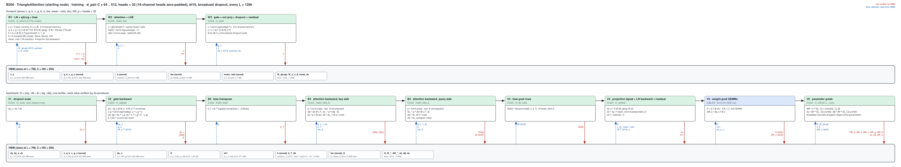

Forward W1–W3 as in inference; W1 also writes each row's (mean, rstd) for the backward, W2 the base-2 LSE, and W3 applies
the dropout scale before adding the residual (its drain then reads x).

- `tri_scale_rows` (V1, dropout only): dy_s = dy ∘ ds, bandwidth-bound (~80 % of HBM). Folding it into V2 (four warps
  scaling each landed dy chunk before the MMA) put an elementwise pass on the MMA's critical path with two stages in flight
  and made V2 1.8–2.6× slower; not kept.
- `tri_wgbwd<C>` (V2): du = dy_s · Wo, dy_s and the Woᵀ rows streaming together in 64-column K chunks per output block of
  ≤ 128 columns. Eight drain warps (two a TMEM lane quarter, alternate 32-column slices, one head each) prefetch their next
  g | o slice by TMA into a three-slot ring and overwrite it in place with do | dg | u; dg lands in D, delta per head.
- B2–B4: the core's backward as for d_pair 128, dq / dk / dv written into D (row-strided output views).
- `tri_db_rows` (V3): the dbias rows into D.
- `tri_whbwd<C>` (V4): g_y = D · [Wq; Wk; Wv; Wg; Wb] on tcgen05, the LayerNorm backward and the residual in the drain from
  the forward's (mean, rstd), with x (first pass: the two row sums) and x | dy (second pass: dx, x̂) arriving as TMA slices;
  writes dx and [x̂ | 1]. C > 256 has one 512-column accumulator (the drain and the next tile's MMAs run in series): eight
  drain warps there, the first pass's row sums combined through shared memory, and stages of one W half.
- cuBLAS (V5): G = Dᵀ [x̂ | 1] (one GEMM, K = L²) and dWo = dy_sᵀ u, fp32 out.
- `tri_wfinish` (V6): dW = γ ∘ G[:, :C] + G[:, C] ⊗ β, dγ = Σ W ∘ G[:, :C], dβ = Σ W G[:, C] (per-chunk partials summed in
  a fixed order), dWb and dWo, padded channels dropped, in the parameters' dtype.

##### d_pair 64 (4 × 16, 4 × 32 with d_hidden 128, 2 × 32) · W1–W3, V1–V6

| (Length, Dimension) | (128, 64) | (256, 64) | (384, 64) | (512, 64) | (640, 64) | (768, 64) |
|---|---|---|---|---|---|---|
| implementation | CUDA | CUDA | CUDA | CUDA | CUDA | CUDA |
| 성능 확인 | ✗ | ✗ | ✗ | ✗ | ✗ | ✗ |
| cache build | ✓ | ✓ | ✓ | ✓ | ✓ | ✓ |

##### d_pair 256 (8 × 32) · W1–W3, V1–V6

| (Length, Dimension) | (128, 256) | (256, 256) | (384, 256) | (512, 256) | (640, 256) | (768, 256) |
|---|---|---|---|---|---|---|
| implementation | CUDA | CUDA | CUDA | CUDA | CUDA | CUDA |
| 성능 확인 | ✗ | ✗ | ✗ | ✗ | ✗ | ✗ |
| cache build | ✓ | ✓ | ✓ | ✓ | ✓ | ✓ |

##### d_pair 384 (12 × 32) · W1–W3, V1–V6

| (Length, Dimension) | (128, 384) | (256, 384) | (384, 384) | (512, 384) | (640, 384) | (768, 384) |
|---|---|---|---|---|---|---|
| implementation | CUDA | CUDA | CUDA | CUDA | CUDA | CUDA |
| 성능 확인 | ✗ | ✗ | ✗ | ✗ | ✗ | ✗ |
| cache build | ✓ | ✓ | ✓ | ✓ | ✓ | ✓ |

##### d_pair 512 (16 × 32) · W1–W3, V1–V6

| (Length, Dimension) | (128, 512) | (256, 512) | (384, 512) | (512, 512) | (640, 512) | (768, 512) |
|---|---|---|---|---|---|---|
| implementation | CUDA | CUDA | CUDA | CUDA | CUDA | CUDA |
| 성능 확인 | ✗ | ✗ | ✗ | ✗ | ✗ | ✗ |
| cache build | ✓ | ✓ | ✓ | ✓ | ✓ | ✓ |

The bias-only variant (`use_self_attention=False`), heads of 64 / 96 / 128 channels (the module's default of 4 heads at
d_pair ≥ 256) and `BidirectionalTriangleAttention` are not served.

## Measurements (2026-09-30)

B200 (148 SMs), torch 2.13.0+cu129, triton 3.7.1, cuEquivariance 0.12.0, B=1, bf16, starting node, mask all-true,
`benchmarks/runners/bench.py target=triangle_attention level=module min_seq_len=128 max_seq_len=768` (compiled), with
`d_pair=<C> +tri_d_hidden=<HD> +tri_n_head=<heads>`. Latency in ms, median. × = ours vs the fastest of PyTorch compiled /
cuEquivariance / Anthropic; "Triton path" is the same module with `+tri_b200_cuda=false` (the repository's Triton kernels, the
B200 default before this path), reported separately. Anthropic: `integrations.anthropic` row `block:triattn_native`,
inference only; on B200 the payload refuses its native cell (measured on sm_90 / sm_80 only) and serves the `k2b` /
cuEquivariance fallbacks for 4-head calls, so this column is not the H100 payload's speed; other head counts are —. No B200
Triton autotune cache exists; none of the columns use one (ours is CUDA end to end). The 32-channel-head rows are one family:
d_pair 64 is 2 × 32, d_pair 128 the fused 4 × 32 path above, 256 / 384 / 512 are 8 / 12 / 16 × 32.

### Heads × 32 · Inference (CUDA graph)

| (Length, Dimension) | PyTorch compiled | cuEquivariance | Anthropic | Triton path | ours | × | × vs Triton path |
|---|---|---|---|---|---|---|---|
| (128, 64) | 0.055 | 0.047 | — | 0.037 | 0.026 | 1.78 | 1.39× |
| (256, 64) | 0.174 | 0.094 | — | 0.092 | 0.053 | 1.77 | 1.73× |
| (384, 64) | 0.584 | 0.186 | — | 0.182 | 0.102 | 1.82 | 1.78× |
| (512, 64) | 1.454 | 0.276 | — | 0.330 | 0.190 | 1.45 | 1.73× |
| (640, 64) | 3.145 | 0.495 | — | 0.571 | 0.318 | 1.56 | 1.79× |
| (768, 64) | 5.002 | 0.723 | — | 0.921 | 0.501 | 1.44 | 1.84× |
| (128, 128) | 0.080 | 0.061 | 0.049 | 0.049 | 0.035 | 1.41 | 1.41× |
| (256, 128) | 0.320 | 0.137 | 0.143 | 0.135 | 0.080 | 1.72 | 1.69× |
| (384, 128) | 1.305 | 0.315 | 0.322 | 0.325 | 0.176 | 1.79 | 1.85× |
| (512, 128) | 2.874 | 0.532 | 0.631 | 0.666 | 0.332 | 1.61 | 2.01× |
| (640, 128) | 6.260 | 0.975 | 1.097 | 1.158 | 0.571 | 1.71 | 2.03× |
| (768, 128) | 9.944 | 1.379 | 1.748 | 1.858 | 0.911 | 1.51 | 2.04× |
| (128, 256) | 0.127 | 0.088 | 0.084 | 0.070 | 0.047 | 1.78 | 1.48× |
| (256, 256) | 0.801 | 0.231 | 0.307 | 0.225 | 0.140 | 1.65 | 1.61× |
| (384, 256) | 2.589 | 0.603 | 0.729 | 0.600 | 0.323 | 1.86 | 1.85× |
| (512, 256) | 5.698 | 1.029 | 1.418 | 1.236 | 0.645 | 1.60 | 1.92× |
| (640, 256) | 12.452 | 1.879 | 2.458 | 2.172 | 1.136 | 1.65 | 1.91× |
| (768, 256) | 19.776 | 2.654 | 3.896 | 3.499 | 1.844 | 1.44 | 1.90× |
| (128, 384) | 0.182 | 0.127 | — | 0.098 | 0.070 | 1.83 | 1.41× |
| (256, 384) | 1.212 | 0.354 | — | 0.346 | 0.236 | 1.50 | 1.47× |
| (384, 384) | 4.277 | 0.955 | — | 0.939 | 0.556 | 1.72 | 1.69× |
| (512, 384) | 8.762 | 1.618 | — | 1.899 | 1.076 | 1.50 | 1.77× |
| (640, 384) | 21.381 | 2.990 | — | 3.430 | 1.961 | 1.52 | 1.75× |
| (768, 384) | 35.063 | 4.206 | — | 5.430 | 2.985 | 1.41 | 1.82× |
| (128, 512) | 0.278 | 0.155 | — | 0.117 | 0.090 | 1.73 | 1.30× |
| (256, 512) | 1.604 | 0.466 | — | 0.472 | 0.327 | 1.42 | 1.44× |
| (384, 512) | 5.666 | 1.236 | — | 1.260 | 0.809 | 1.53 | 1.56× |
| (512, 512) | 11.647 | 2.192 | — | 2.568 | 1.559 | 1.41 | 1.65× |
| (640, 512) | 28.450 | 3.979 | — | 4.530 | 2.669 | 1.49 | 1.70× |
| (768, 512) | 46.682 | 5.705 | — | 7.353 | 4.326 | 1.32 | 1.70× |

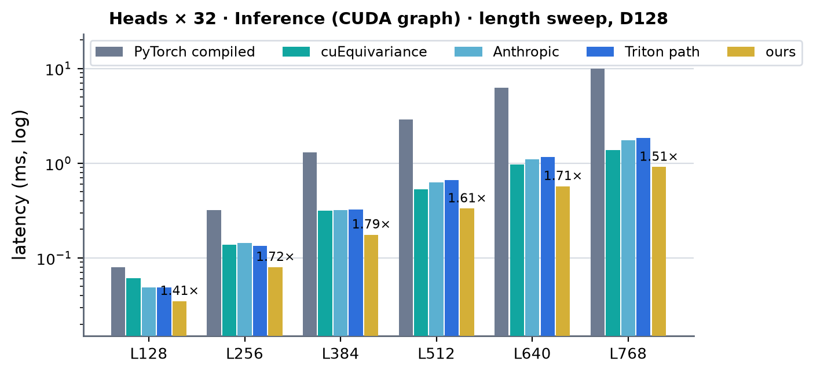 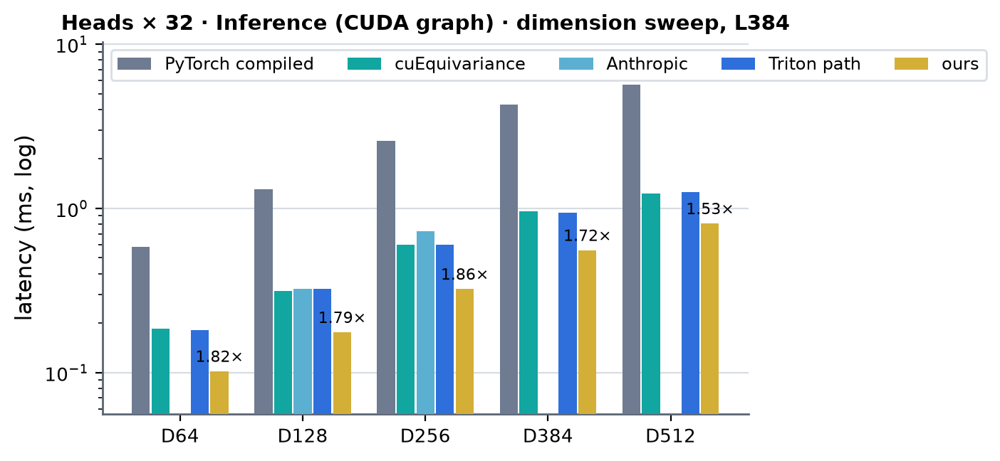 <!-- measure_bars -->

### Heads × 32 · Training, dropout 0.25 (CUDA graph)

| (Length, Dimension) | PyTorch compiled | cuEquivariance | Anthropic | Triton path | ours | × | × vs Triton path |
|---|---|---|---|---|---|---|---|
| (128, 64) | 0.175 | — | — | 0.144 | 0.095 | 1.84 | 1.52× |
| (256, 64) | 0.458 | 0.445 | — | 0.356 | 0.199 | 2.23 | 1.79× |
| (384, 64) | 1.242 | 1.023 | — | 0.761 | 0.392 | 2.61 | 1.94× |
| (512, 64) | 2.729 | 1.940 | — | 1.420 | 0.724 | 2.68 | 1.96× |
| (640, 64) | 5.395 | 3.428 | — | 2.469 | 1.210 | 2.83 | 2.04× |
| (768, 64) | 8.616 | 5.470 | — | 3.946 | 1.897 | 2.88 | 2.08× |
| (128, 128) | 0.239 | 0.245 | — | 0.191 | 0.119 | 2.01 | 1.61× |
| (256, 128) | 0.815 | 0.747 | — | 0.574 | 0.304 | 2.46 | 1.89× |
| (384, 128) | 2.475 | 1.842 | — | 1.369 | 0.673 | 2.74 | 2.04× |
| (512, 128) | 5.249 | 3.669 | — | 2.745 | 1.273 | 2.88 | 2.16× |
| (640, 128) | 10.543 | 6.628 | — | 4.823 | 2.188 | 3.03 | 2.20× |
| (768, 128) | 16.906 | 10.636 | — | 7.760 | 3.484 | 3.05 | 2.23× |
| (128, 256) | 0.339 | 0.361 | — | 0.278 | 0.179 | 1.89 | 1.55× |
| (256, 256) | 1.656 | 1.331 | — | 1.000 | 0.548 | 2.43 | 1.82× |
| (384, 256) | 4.823 | 3.535 | — | 2.614 | 1.323 | 2.67 | 1.98× |
| (512, 256) | 10.250 | 7.146 | — | 5.190 | 2.637 | 2.71 | 1.97× |
| (640, 256) | 20.815 | 13.025 | — | 9.264 | 4.671 | 2.79 | 1.98× |
| (768, 256) | 33.449 | 20.889 | — | 15.021 | 7.350 | 2.84 | 2.04× |
| (128, 384) | 0.489 | 0.514 | — | 0.392 | 0.253 | 1.93 | 1.55× |
| (256, 384) | 2.465 | 1.971 | — | 1.492 | 0.876 | 2.25 | 1.70× |
| (384, 384) | 7.595 | 5.320 | — | 3.920 | 2.162 | 2.46 | 1.81× |
| (512, 384) | 15.629 | 10.819 | — | 7.992 | 4.219 | 2.56 | 1.89× |
| (640, 384) | 34.270 | 19.594 | — | 14.161 | 7.517 | 2.61 | 1.88× |
| (768, 384) | 56.010 | 31.694 | — | 22.964 | 11.981 | 2.65 | 1.92× |
| (128, 512) | 0.646 | 0.640 | — | 0.485 | 0.329 | 1.95 | 1.48× |
| (256, 512) | 3.224 | 2.577 | — | 1.945 | 1.254 | 2.05 | 1.55× |
| (384, 512) | 10.006 | 6.983 | — | 5.155 | 3.046 | 2.29 | 1.69× |
| (512, 512) | 20.757 | 14.327 | — | 10.681 | 6.014 | 2.38 | 1.78× |
| (640, 512) | 46.280 | 26.262 | — | 18.959 | 10.555 | 2.49 | 1.80× |
| (768, 512) | 74.967 | 42.463 | — | 31.598 | 16.738 | 2.54 | 1.89× |

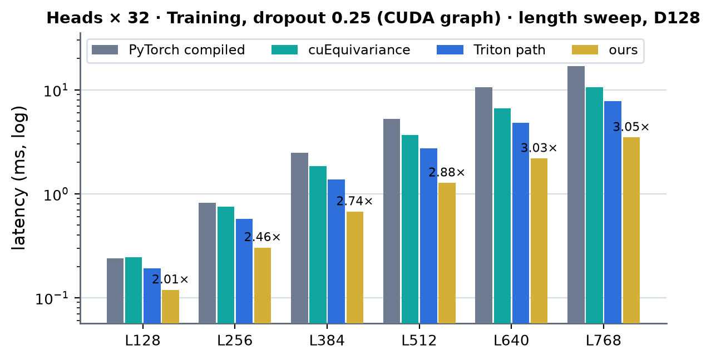 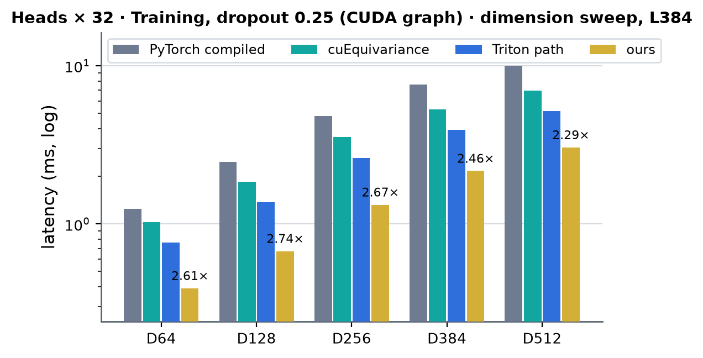 <!-- measure_bars -->

cuEquivariance at (128, 64) is — here: the harness refuses it, reproducibly, because its graph-replayed gradients differ between
timed runs by 1.2e-4 relative (the check is 1e-4); without a graph it measured normally.

### Heads × 32 · Training, dropout 0.25 (no CUDA graph)

| (Length, Dimension) | PyTorch compiled | cuEquivariance | Anthropic | Triton path | ours | × | × vs Triton path |
|---|---|---|---|---|---|---|---|
| (128, 64) | 0.528 | 0.816 | — | 0.779 | 0.382 | 1.38 | 2.04× |
| (256, 64) | 0.560 | 0.818 | — | 0.689 | 0.471 | 1.19 | 1.46× |
| (384, 64) | 1.344 | 1.129 | — | 1.137 | 0.477 | 2.37 | 2.38× |
| (512, 64) | 2.824 | 2.051 | — | 1.496 | 0.763 | 2.69 | 1.96× |
| (640, 64) | 5.502 | 3.543 | — | 2.553 | 1.246 | 2.84 | 2.05× |
| (768, 64) | 8.731 | 5.589 | — | 4.032 | 1.934 | 2.89 | 2.08× |
| (128, 128) | 0.502 | 0.799 | — | 0.843 | 0.445 | 1.13 | 1.89× |
| (256, 128) | 0.912 | 0.851 | — | 0.720 | 0.384 | 2.22 | 1.88× |
| (384, 128) | 2.588 | 1.958 | — | 1.461 | 0.708 | 2.77 | 2.07× |
| (512, 128) | 5.351 | 3.783 | — | 2.831 | 1.303 | 2.90 | 2.17× |
| (640, 128) | 10.651 | 6.753 | — | 4.912 | 2.217 | 3.05 | 2.22× |
| (768, 128) | 17.013 | 10.726 | — | 7.851 | 3.502 | 3.06 | 2.24× |
| (128, 256) | 0.583 | 0.890 | — | 0.660 | 0.475 | 1.23 | 1.39× |
| (256, 256) | 1.754 | 1.440 | — | 1.079 | 0.586 | 2.46 | 1.84× |
| (384, 256) | 4.928 | 3.641 | — | 2.704 | 1.318 | 2.76 | 2.05× |
| (512, 256) | 10.366 | 7.228 | — | 5.281 | 2.629 | 2.75 | 2.01× |
| (640, 256) | 20.903 | 13.124 | — | 9.356 | 4.567 | 2.87 | 2.05× |
| (768, 256) | 33.567 | 20.999 | — | 15.110 | 7.245 | 2.90 | 2.09× |
| (128, 384) | 0.587 | 0.714 | — | 0.937 | 0.486 | 1.21 | 1.93× |
| (256, 384) | 2.563 | 2.082 | — | 1.574 | 0.907 | 2.29 | 1.73× |
| (384, 384) | 7.693 | 5.431 | — | 4.007 | 2.190 | 2.48 | 1.83× |
| (512, 384) | 15.724 | 10.931 | — | 8.016 | 4.362 | 2.51 | 1.84× |
| (640, 384) | 34.046 | 19.763 | — | 14.246 | 7.492 | 2.64 | 1.90× |
| (768, 384) | 55.801 | 31.819 | — | 23.043 | 11.886 | 2.68 | 1.94× |
| (128, 512) | 0.745 | 0.751 | — | 0.915 | 0.383 | 1.95 | 2.39× |
| (256, 512) | 3.335 | 2.695 | — | 2.024 | 1.241 | 2.17 | 1.63× |
| (384, 512) | 10.104 | 7.088 | — | 5.226 | 3.005 | 2.36 | 1.74× |
| (512, 512) | 20.860 | 14.409 | — | 10.634 | 6.215 | 2.32 | 1.71× |
| (640, 512) | 45.344 | 26.308 | — | 19.072 | 10.479 | 2.51 | 1.82× |
| (768, 512) | 76.020 | 42.532 | — | 31.159 | 16.670 | 2.55 | 1.87× |

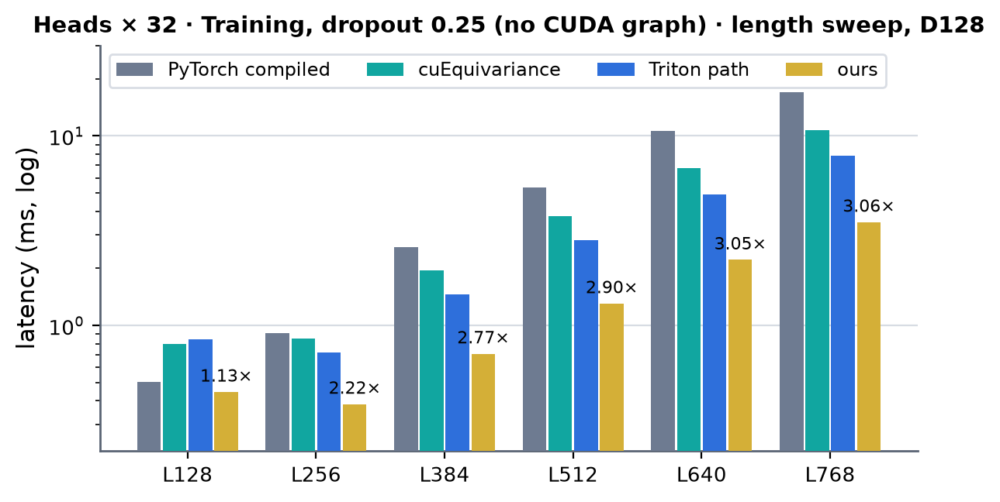 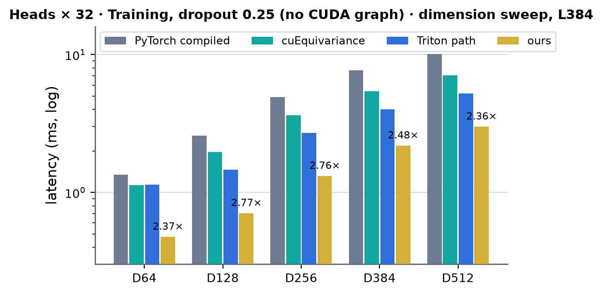 <!-- measure_bars -->

Without a graph ours pays host-side time (tensor-map encoding, the autograd function, a dozen launches, ~0.4–0.5 ms a step)
above the GPU work at L128 / L256, so its lead is smallest there (1.13–1.95× at L128); these host-bound rows also move with
the load on the shared host.

### d_pair 64, 4 × 16 · Inference (CUDA graph)

| (Length, Dimension) | PyTorch compiled | cuEquivariance | Anthropic | Triton path | ours | × | × vs Triton path |
|---|---|---|---|---|---|---|---|
| (128, 64) | 0.071 | 0.071 | 0.037 | 0.041 | 0.029 | 1.28 | 1.43× |
| (256, 64) | 0.293 | 0.112 | 0.096 | 0.115 | 0.071 | 1.34 | 1.60× |
| (384, 64) | 1.230 | 0.244 | 0.231 | 0.242 | 0.162 | 1.43 | 1.49× |
| (512, 64) | 2.717 | 0.399 | 0.475 | 0.491 | 0.313 | 1.27 | 1.57× |
| (640, 64) | 6.026 | 0.754 | 0.863 | 0.881 | 0.542 | 1.39 | 1.62× |
| (768, 64) | 9.640 | 1.072 | 1.408 | 1.451 | 0.869 | 1.23 | 1.67× |

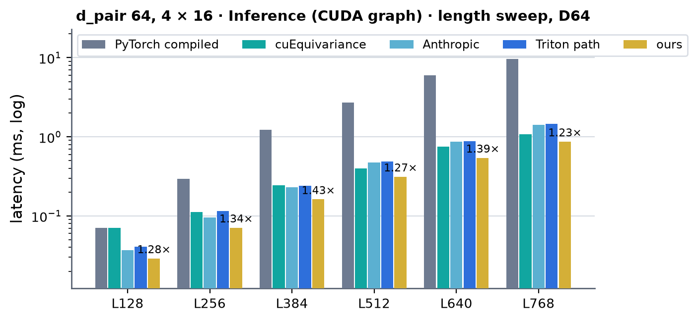 <!-- measure_bars -->

### d_pair 64, 4 × 16 · Training, dropout 0.25 (CUDA graph)

| (Length, Dimension) | PyTorch compiled | cuEquivariance | Anthropic | Triton path | ours | × | × vs Triton path |
|---|---|---|---|---|---|---|---|
| (128, 64) | 0.209 | 0.208 | — | 0.155 | 0.108 | 1.93 | 1.44× |
| (256, 64) | 0.705 | 0.614 | — | 0.456 | 0.276 | 2.22 | 1.65× |
| (384, 64) | 2.246 | 1.568 | — | 1.063 | 0.628 | 2.50 | 1.69× |
| (512, 64) | 4.805 | 3.169 | — | 2.160 | 1.208 | 2.62 | 1.79× |
| (640, 64) | 9.872 | 5.822 | — | 3.879 | 2.086 | 2.79 | 1.86× |
| (768, 64) | 16.002 | 9.527 | — | 6.350 | 3.335 | 2.86 | 1.90× |

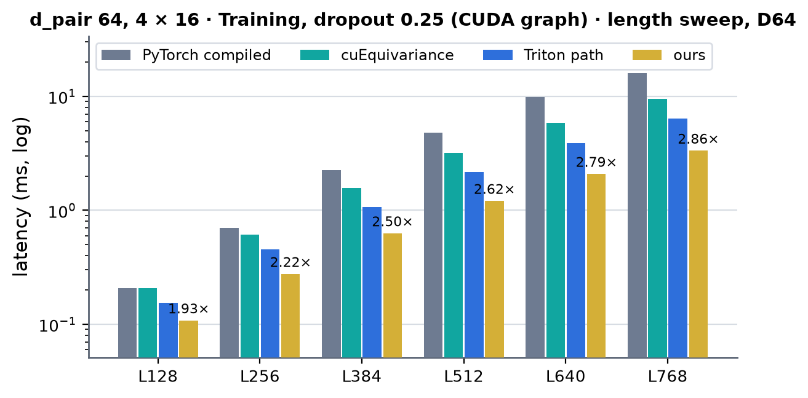 <!-- measure_bars -->

### d_pair 64, 4 × 32 (d_hidden 128) · Inference (CUDA graph)

| (Length, Dimension) | PyTorch compiled | cuEquivariance | Anthropic | Triton path | ours | × | × vs Triton path |
|---|---|---|---|---|---|---|---|
| (128, 64) | 0.076 | 0.057 | 0.047 | 0.045 | 0.031 | 1.54 | 1.47× |
| (256, 64) | 0.309 | 0.127 | 0.141 | 0.125 | 0.072 | 1.77 | 1.74× |
| (384, 64) | 1.276 | 0.291 | 0.323 | 0.282 | 0.164 | 1.78 | 1.72× |
| (512, 64) | 2.817 | 0.475 | 0.633 | 0.571 | 0.313 | 1.52 | 1.82× |
| (640, 64) | 6.165 | 0.876 | 1.100 | 1.014 | 0.545 | 1.61 | 1.86× |
| (768, 64) | 9.811 | 1.242 | 1.748 | 1.654 | 0.872 | 1.42 | 1.90× |

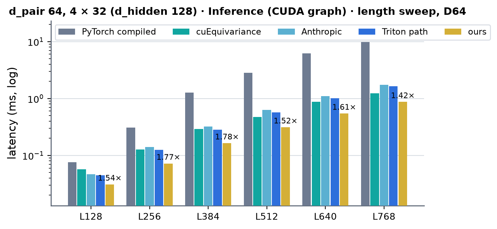 <!-- measure_bars -->

### d_pair 64, 4 × 32 (d_hidden 128) · Training, dropout 0.25 (CUDA graph)

| (Length, Dimension) | PyTorch compiled | cuEquivariance | Anthropic | Triton path | ours | × | × vs Triton path |
|---|---|---|---|---|---|---|---|
| (128, 64) | 0.224 | 0.230 | — | 0.175 | 0.108 | 2.08 | 1.63× |
| (256, 64) | 0.755 | 0.687 | — | 0.517 | 0.278 | 2.48 | 1.86× |
| (384, 64) | 2.371 | 1.740 | — | 1.229 | 0.630 | 2.76 | 1.95× |
| (512, 64) | 5.045 | 3.465 | — | 2.473 | 1.214 | 2.85 | 2.04× |
| (640, 64) | 10.204 | 6.299 | — | 4.395 | 2.094 | 3.01 | 2.10× |
| (768, 64) | 16.464 | 10.190 | — | 7.169 | 3.343 | 3.05 | 2.14× |

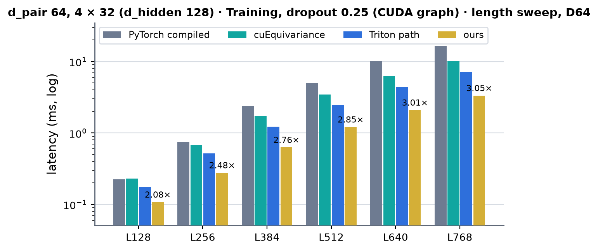 <!-- measure_bars -->

Range of × over these tables: 32-channel heads inference 1.32–1.86×, training 1.84–3.05×; 4 × 16 inference
1.23–1.43×, training 1.93–2.86×; 4 × 32 at d_pair 64 inference 1.42–1.78×, training 2.08–3.05×.

Accuracy (`tests/integrations/test_triattn_b200_gpu.py`, 57 cases. d_pair 128: L128–768 inference and training, ending node,
B=2, mask layouts, dropout on both nodes, fp32 master parameters, CUDA-graph capture. Other widths: the six shapes at L128 /
L256 for inference and training (output, input and every parameter gradient), dropout at 4 × 16 and 8 × 32 on both nodes,
fp32 master parameters, ending node with the first keys masked, re-packing after a weight update): against an fp32 autograd
reference, the output and every gradient stay within 1.25× the bf16 PyTorch module's own error (+1e-3 output, +2e-3
gradients). Outside the harness, at (384, 128): worst parameter / input gradient rel. Frobenius 6.4e-3 (PyTorch bf16
1.0e-2, cuEquivariance 6.7e-3); at (768, 128) 6.5e-3 (1.1e-2, 6.8e-3).

## d_pair 128 · schedule per length (2026-09-29)

Every kernel keeps one schedule for all L except the attention forward, whose pair rows per CTA task (`TA_R`) are chosen
by L in `b200_triattn.py` (two builds of `triattn_sm100.cu`). The knobs were swept at every registered L with each kernel
alone (CUDA graph, µs; differences under ~3 % are within run-to-run noise):

| knob | (128, 128) | (256, 128) | (384, 128) | (512, 128) | (640, 128) | (768, 128) | chosen |
|---|---|---|---|---|---|---|---|
| forward, rows / task 4 → 2 | 10.6 → 10.3 | 38.2 → 32.5 | 98.7 → 96.3 | 208.5 → 212.4 | 389.4 → 392.6 | 655.4 → 654.1 | 2 for L ≤ 384, else 4 |
| forward, K / V ring 5 → 6 / 7 (rows 2) | 10.3 / 10.3 | 32.7 / 32.8 | 96.3 / 96.5 | 212.2 / 213.2 | 392.9 / 394.9 | 654.3 / 655.8 | 5 |
| backward query side, rows / task 4 → 2 | 10.6 → 12.7 | 51.1 → 54.7 | 138.8 → 162.4 | 313.1 → 347.4 | 584.8 → 695.9 | 988.0 → 1156.5 | 4 |

The backward key side has two rows per task by construction (one per gradient group); the module kernels (front, tail,
gate backward, head backward, weight grads) have 128-row tiles fixed by the tensor-core M and no length-dependent knob.
Small L stays furthest from the floors (inference 3.3× at L128, 2.0× at L256 against 1.5× at L768): at L128 the
forward has 256 tasks and every row-tile kernel 128 tiles for 148 SMs, one or two per CTA, so each CTA's pipeline
latency and each kernel's fixed cost are exposed. Closing that needs smaller tiles (M = 64) or fewer, fused launches at
small L, not a different setting of these knobs. "cache build ✓" above means only that the path needs no autotune cache.

## d_pair 128 · kernel times and floors (2026-09-29)

Per-kernel device time of one module call (dropout 0, CUDA-graph step profiled with `torch.profiler` outside the
repository's harness, before the per-length schedule, i.e. four rows per forward task at every L), against each kernel's
floor: the larger of max(HBM bytes / 6.9 TB/s, FLOPs / 1.73 PF/s, ex2 count / MUFU rate) and the power-capped energy
floor (reads 115 pJ/B, writes 72 pJ/B, MMA 0.47 pJ/FLOP at 750 W dynamic). The MUFU term is optimistic for the attention
kernels: their softmax warps are bound by FMA-pipe issue, not by ex2 (moving half the exponentials to an FMA polynomial
made them 6–16 % slower).

| kernel | (384, 128) µs | floor | (768, 128) µs | floor |
|---|---|---|---|---|
| F1 · tri_front | 39.8 | 32.6 | 148.7 | 130.4 |
| F2 · triattn_fwd | 100.8 | 50.3 | 679.8 | 402.7 |
| F3 · tri_tail | 28.7 | 24.0 | 98.4 | 96.1 |
| B1 · tri_gate_bwd | 46.8 | 34.5 | 167.3 | 138.1 |
| B3 · triattn_bwd_kv | 140.0 | 67.8 | 937.3 | 416.6 |
| B4 · triattn_bwd_q | 136.0 | 55.2 | 946.8 | 402.7 |
| B5 · tri_head_bwd | 56.1 | 50.9 | 204.1 | 203.7 |
| B6 · tri_wgrad (+ finish) | 60.0 | 41.5 | 180.5 | 166.0 |
| module, inference (graph) | 174.6 | | 906.8 | |
| module, training (graph) | 624.5 | | 3449.8 | |

The attention core (F2, B3, B4) is 60 % of the training step at L384 and 74 % at L768. Measured facts that shape it:

- The backward keeps the H100 split (key-owned dK/dV kernel, query-owned dQ/dbias kernel, each recomputing P). Removing
  the softmax math from B3 only saves 17–19 %; the rest is the MMA / TMEM / hand-off skeleton. A single-pass backward
  would have to send the dbias partials (a sum over pair rows) and the dQ partials through L2: injecting that traffic into
  B3 raised it from 138 to 182 µs (L384) and 965 to 1342 µs (L768), so the estimated gain is at most 8–14 % of the
  training step for a new TMEM layout; not pursued.
- F2 reads q / k / v in the projection layout `[B, N, S, H, 32]`, which costs 6.8 % against a head-major layout at L384
  (2.3 % at L768) but removes three `[L, L, 128]` transposes around the kernel.
- L2 bulk reduce-add (`cp.reduce.async.bulk .add.f32`) sustains 5.8 TB/s into an L2-resident target (≤ 150 MB) and
  2.9 TB/s beyond it.

What the module kernels changed on 2026-09-29 (each A/B'd alone at L384 / L768, accuracy tests unchanged):

- B6 weight grads 90 → 60 µs (L384), 262 → 181 µs (L768): the column sums (Σd_t, B_h, Σdb) had run on 2-byte scalar
  shared loads, a channel per thread; now 16-byte loads, an (8-column, 8-row) block per thread with register
  accumulation, the four warps' partials summed in shared memory before one atomic per address, and the per-CTA M_t
  leaves through 128B-swizzled staging and TMA reduce-adds instead of per-row `red.global.add.v4`.
- F1 front 53 → 43 µs, 188 → 150 µs: the drain passed two 128-thread barriers per 32-column chunk; each drain warp now
  stages its own 32 rows in a 3-deep ring and issues its own TMA store.
- B1 gate backward 56 → 51.5 µs, 184 → 169 µs: dy and o double-buffered (224 KiB), so the next tile's pair loads during
  this one.
- Host glue: one pack launch for all parameters (was a concat and several small casts per call), one zero-fill for every gradient
  accumulator (was four), the overflow counter accumulates instead of a memset per call, and fp32 master parameters get
  fp32 gradients straight from the finish kernel.

## Other widths · kernel times (2026-09-30)

Per-kernel device time of one module call (`torch.profiler`, µs, dropout 0.25 in training; the columns are (Length,
Dimension) and heads), module = the CUDA-graph time of the same call.

Inference:

| kernel | (384, 64) 4 × 16 | (384, 256) 8 × 32 | (384, 512) 16 × 32 | (768, 256) 8 × 32 | (768, 512) 16 × 32 |
|---|---|---|---|---|---|
| W1 · tri_wfront | 38.4 | 83.3 | 284.0 | 310.8 | 1128.3 |
| W2 · triattn_fwd | 101.9 | 195.1 | 387.5 | 1370.6 | 2697.7 |
| W3 · tri_wtail | 21.1 | 51.7 | 133.8 | 182.0 | 488.0 |
| module (CUDA graph) | 158.2 | 323.2 | 800.8 | 1866.6 | 4375.3 |

Training step:

| kernel | (384, 64) 4 × 16 | (384, 256) 8 × 32 | (384, 512) 16 × 32 | (768, 256) 8 × 32 | (768, 512) 16 × 32 |
|---|---|---|---|---|---|
| W1 · tri_wfront | 37.4 | 80.1 | 271.4 | 299.4 | 1080.4 |
| W2 · triattn_fwd | 101.1 | 191.4 | 371.4 | 1293.3 | 2532.9 |
| W3 · tri_wtail | 28.7 | 88.8 | 190.0 | 322.1 | 710.2 |
| V1 · tri_scale_rows | 9.4 | 30.8 | 60.2 | 116.7 | 231.8 |
| V2 · tri_wgbwd | 35.3 | 82.2 | 227.5 | 310.5 | 897.4 |
| B2 · triattn_biasT | 2.7 | 3.2 | 5.2 | 8.9 | 15.9 |
| B3 · triattn_bwd_kv | 140.8 | 266.0 | 526.8 | 1801.7 | 3615.7 |
| B4 · triattn_bwd_q | 135.9 | 262.1 | 511.3 | 1807.4 | 3574.5 |
| V3 · tri_db_rows | 16.5 | 13.4 | 15.2 | 36.7 | 41.7 |
| V4 · tri_whbwd | 45.5 | 117.1 | 382.4 | 427.1 | 1500.5 |
| V5 · cuBLAS (G, dWo) | 55.4 | 128.4 | 287.2 | 450.2 | 1073.1 |
| V6 · tri_wfinish | 6.7 | 7.8 | 13.8 | 8.0 | 15.6 |
| other (dropout draw, casts, copies) | 16.5 | 20.2 | 28.5 | 25.6 | 34.5 |
| module (CUDA graph) | 635.9 | 1296.3 | 2861.6 | 6908.0 | 15432.6 |

What shaped these kernels (each change A/B'd alone; accuracy tests unchanged):

- First find the pacing stage, with probe builds that remove one part (the weight TMA loads, the drain's global loads, the
  whole drain). Removing the weight loads left W3 unchanged and W1 8–18 % faster before the changes below; the drains paced
  W1, W3, V2 and V4.
- W3: the drain read the residual row-per-thread from global and, at C > 256, one accumulator put the drain and the next
  tile's MMAs in series. The residual now enters through the MMA and C > 256 runs two column blocks per tile (d_pair 512,
  L384: 168 → 131 µs, 70–87 % of the HBM floor across widths).
- W1: the next tile's x prefetch waited for the previous tile's GEMMs before this tile's LayerNorm (the LN ran in series with
  the MMAs: 18 % of a tile); a lane-0 MMA loop with a descriptor build per call spent 400–700 clk issuing four MMAs (a
  converged loop, one elected lane, precomputed descriptors: 70–110 clk); the drain indexed a local array of map pointers
  (local memory). With those fixed the weight inflow paced it (removing the weight loads: −18 % at d_pair 256, −40 % at 512),
  hence the 2-CTA products; then the drain at C ≤ 256 (8 drain warps) and the one-buffer LN at C ≥ 384 (23 % of a tile at
  d_pair 512; chunked). d_pair 256 L384 126 → 85 µs, d_pair 512 436 → 279 µs.
- Folding the LayerNorm into the weights (γ ∘ W with per-column terms applied in the drain) takes the LN off the MMA path
  but adds two FMAs per element to the drain, the pacing stage: 1.4× slower at d_pair 256; not kept.
- V2 / V4: the drains' row-per-thread global loads (g, o; x, dy and a statistics pass over x) were about half of each
  kernel. TMA slices, the forward's statistics and eight drain warps: V2 d_pair 256 L384 121 → 87 µs, V4 172 → 122 µs,
  d_pair 512 501 → 387 µs.
- Weight gradients: dq / dk / dv / dg / db written by their producers into one buffer D, one cuBLAS GEMM for G and one finish
  kernel (was five GEMMs and a dozen torch elementwise / reduce launches): d_pair 64 / 4 × 16 L128 training step 247 → 99 µs.
