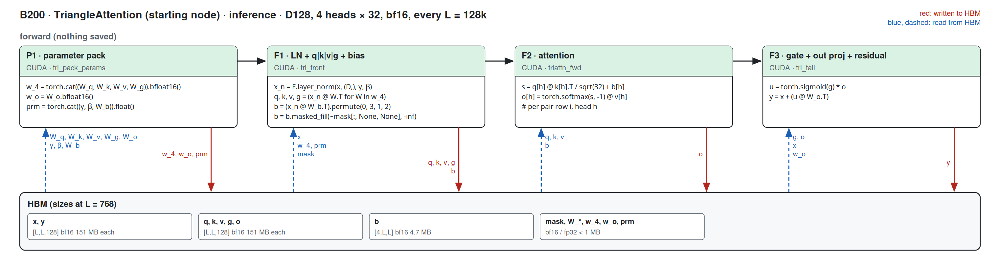
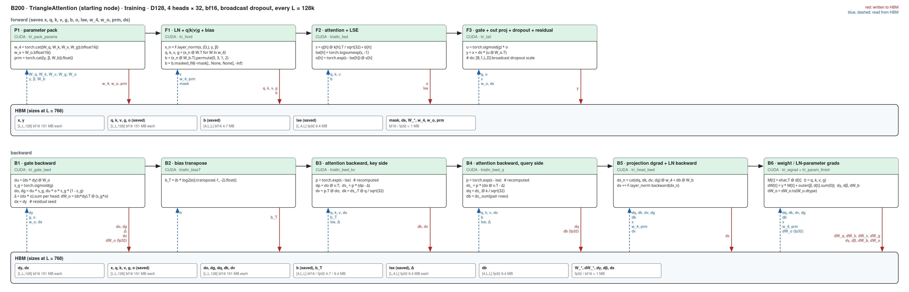
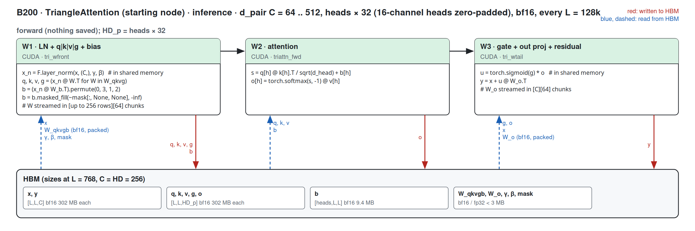

# TriangleAttention on B200 (sm100)

Kernel-level status of `TriangleAttention` (`use_self_attention=True`) on B200; the module-level summary belongs in
[b200.md](../b200.md). bf16 only; columns are (Length, Dimension). B200 = CUDA where a hand-written sm_100a path
exists; a shape without one is 미구현 (it runs the Triton path). Figures: one box per kernel, left to right, HBM reads
(blue, left) and writes (red, right); generated from `figures/triattn.json` by `python -m miniworld_engine.viz.kernel_flow`,
then converted to PNG with `cairosvg` (scale 2, white background).

Dispatch: `integrations/triattn_b200.py`, called first in `TriangleAttention.forward`. Kernels:
`kernels/triangle_attention/cuda/b200_triattn.py` (build + autograd) and `b200_sources/` (tcgen05 / TMEM / TMA:
`triattn_sm100.cu` = attention core, `triattn_mod_sm100.cu` = the d_pair 128 kernels around it, `triattn_wide_sm100.cu` = the
other widths' kernels around it, `sm100.cuh` = shared helpers). d_pair 128 / 4 × 32 is covered for inference and training
below; the other registered widths for inference in [Other widths](#other-widths--inference-2026-09-29).
The kernels were developed for sm_100a on the H100 path's kernel boundaries (LN + projections | attention | gate +
out-projection, and the matching backward); they are not ports of the WGMMA kernels.

The d_pair 128 path is served when all of these hold, otherwise the module runs its Triton path unchanged:

- the module's backend is TRITON (`implementation=miniworld`, or an explicit `triton`), `module._b200_cuda` is True
  (the default; False keeps the Triton kernels, e.g. as a benchmark baseline) and `settings.engine_backend != "triton"`;
- `d_pair = d_hidden = 128`, `n_head = 4`, no QK-norm;
- `pair` is a bf16 CUDA tensor `[B, L, L, 128]` with L a multiple of 128 (any B), `mask` is None or bool `[B, L]`;
- compute capability (10, 0).

Starting and ending node both run it (the ending node transposes in and out, two `[L, L, 128]` copies). Dropout is the
module's own broadcast draw (`_make_drop_scale`, row-broadcast for the starting node, column for the ending node), applied
inside the output kernel and its backward. Parameters may be bf16 or fp32 (master weights): one pack kernel stages them
and the gradients come back in the parameters' dtype. Keys whose bias is masked get `finfo(bf16).min`, as in the
PyTorch module; a pair row whose first 32 keys are all masked is handled (the softmax offset falls back to 0).

## Starting / ending node · d_pair 128, 4 heads × 32

### Inference

#### Fused path · D128, L = 128 k

##### P1 · parameter pack

| (Length, Dimension) | (128, 128) | (256, 128) | (384, 128) | (512, 128) | (640, 128) | (768, 128) |
|---|---|---|---|---|---|---|
| implementation | CUDA | CUDA | CUDA | CUDA | CUDA | CUDA |
| 성능 확인 | ✗ | ✗ | ✗ | ✗ | ✗ | ✗ |
| cache build | ✓ | ✓ | ✓ | ✓ | ✓ | ✓ |

##### F1 · LN + q|k|v|g + bias

| (Length, Dimension) | (128, 128) | (256, 128) | (384, 128) | (512, 128) | (640, 128) | (768, 128) |
|---|---|---|---|---|---|---|
| implementation | CUDA | CUDA | CUDA | CUDA | CUDA | CUDA |
| 성능 확인 | ✗ | ✗ | ✗ | ✗ | ✗ | ✗ |
| cache build | ✓ | ✓ | ✓ | ✓ | ✓ | ✓ |

##### F2 · attention

| (Length, Dimension) | (128, 128) | (256, 128) | (384, 128) | (512, 128) | (640, 128) | (768, 128) |
|---|---|---|---|---|---|---|
| implementation | CUDA | CUDA | CUDA | CUDA | CUDA | CUDA |
| 성능 확인 | ✗ | ✗ | ✗ | ✗ | ✗ | ✗ |
| cache build | ✓ | ✓ | ✓ | ✓ | ✓ | ✓ |

##### F3 · gate + out proj + residual

| (Length, Dimension) | (128, 128) | (256, 128) | (384, 128) | (512, 128) | (640, 128) | (768, 128) |
|---|---|---|---|---|---|---|
| implementation | CUDA | CUDA | CUDA | CUDA | CUDA | CUDA |
| 성능 확인 | ✗ | ✗ | ✗ | ✗ | ✗ | ✗ |
| cache build | ✓ | ✓ | ✓ | ✓ | ✓ | ✓ |

### Training

#### Fused path · D128, L = 128 k

Forward P1, F1, F3 as in inference; F2 also writes the base-2 LSE for the backward.

##### F2 · attention + LSE

| (Length, Dimension) | (128, 128) | (256, 128) | (384, 128) | (512, 128) | (640, 128) | (768, 128) |
|---|---|---|---|---|---|---|
| implementation | CUDA | CUDA | CUDA | CUDA | CUDA | CUDA |
| 성능 확인 | ✗ | ✗ | ✗ | ✗ | ✗ | ✗ |
| cache build | ✓ | ✓ | ✓ | ✓ | ✓ | ✓ |

##### B1 · gate backward

| (Length, Dimension) | (128, 128) | (256, 128) | (384, 128) | (512, 128) | (640, 128) | (768, 128) |
|---|---|---|---|---|---|---|
| implementation | CUDA | CUDA | CUDA | CUDA | CUDA | CUDA |
| 성능 확인 | ✗ | ✗ | ✗ | ✗ | ✗ | ✗ |
| cache build | ✓ | ✓ | ✓ | ✓ | ✓ | ✓ |

##### B2 · bias transpose

| (Length, Dimension) | (128, 128) | (256, 128) | (384, 128) | (512, 128) | (640, 128) | (768, 128) |
|---|---|---|---|---|---|---|
| implementation | CUDA | CUDA | CUDA | CUDA | CUDA | CUDA |
| 성능 확인 | ✗ | ✗ | ✗ | ✗ | ✗ | ✗ |
| cache build | ✓ | ✓ | ✓ | ✓ | ✓ | ✓ |

##### B3 · attention backward, key side (dK, dV)

| (Length, Dimension) | (128, 128) | (256, 128) | (384, 128) | (512, 128) | (640, 128) | (768, 128) |
|---|---|---|---|---|---|---|
| implementation | CUDA | CUDA | CUDA | CUDA | CUDA | CUDA |
| 성능 확인 | ✗ | ✗ | ✗ | ✗ | ✗ | ✗ |
| cache build | ✓ | ✓ | ✓ | ✓ | ✓ | ✓ |

##### B4 · attention backward, query side (dQ, dbias)

| (Length, Dimension) | (128, 128) | (256, 128) | (384, 128) | (512, 128) | (640, 128) | (768, 128) |
|---|---|---|---|---|---|---|
| implementation | CUDA | CUDA | CUDA | CUDA | CUDA | CUDA |
| 성능 확인 | ✗ | ✗ | ✗ | ✗ | ✗ | ✗ |
| cache build | ✓ | ✓ | ✓ | ✓ | ✓ | ✓ |

##### B5 · projection dgrad + LN backward

| (Length, Dimension) | (128, 128) | (256, 128) | (384, 128) | (512, 128) | (640, 128) | (768, 128) |
|---|---|---|---|---|---|---|
| implementation | CUDA | CUDA | CUDA | CUDA | CUDA | CUDA |
| 성능 확인 | ✗ | ✗ | ✗ | ✗ | ✗ | ✗ |
| cache build | ✓ | ✓ | ✓ | ✓ | ✓ | ✓ |

##### B6 · weight / LN-parameter grads

| (Length, Dimension) | (128, 128) | (256, 128) | (384, 128) | (512, 128) | (640, 128) | (768, 128) |
|---|---|---|---|---|---|---|
| implementation | CUDA | CUDA | CUDA | CUDA | CUDA | CUDA |
| 성능 확인 | ✗ | ✗ | ✗ | ✗ | ✗ | ✗ |
| cache build | ✓ | ✓ | ✓ | ✓ | ✓ | ✓ |

## Other widths · inference (2026-09-29)

The registered model shapes other than d_pair 128 / 4 × 32 (from the models' own code: Protenix-v2 and OpenDDE scale
heads at 32 channels with `hidden_scale_up`, AF3 keeps 4 heads at c_z / 4; ESMFold2 has no triangle attention; d_pair 512
has no model and follows the 32-channel rule):

| d_pair | d_hidden | heads × channels | where |
|---|---|---|---|
| 64 | 64 | 4 × 16 | AF3 template stack |
| 64 | 128 | 4 × 32 | OpenFold3 / Boltz-2 / Protenix-v1 template stack |
| 64 | 64 | 2 × 32 | Protenix-v2 / OpenDDE template stack |
| 256 | 256 | 8 × 32 | Protenix-v2 trunk |
| 384 | 384 | 12 × 32 | OpenDDE trunk |
| 512 | 512 | 16 × 32 | none (benchmark width) |

Served by `integrations/triattn_b200.serves_wide` / `forward_wide` (called after the d_pair 128 check) when there is no
grad and no training dropout, `d_pair` is a multiple of 64 in 64 .. 512, heads have 16 or 32 channels (at most 16 heads),
and the other conditions of the d_pair 128 path hold. Three launches, all tcgen05 / TMEM / TMA CUDA:

- `tri_wfront<C>` (`triattn_wide_sm100.cu`): the x tile's LayerNorm in shared memory, then the four projections and the bias
  projection as output blocks of up to 256 rows (128 at C ≥ 384) over two alternating TMEM accumulators, the packed
  weights `[Wq; Wk; Wv; Wg; Wb]` streamed in 64-column K chunks; q / k / v / g by TMA, the bias block head-major and masked.
- `triattn_fwd`: the head-dim-32 core with the head count as a parameter. A 16-channel head is zero-padded to 32 in the
  packed weights (its padded q / k / v / g channels are 0 and meet zero columns of Wo), the softmax scale stays 1/√16.
- `tri_wtail<C>`: u = sigmoid(g) ∘ o computed over g in shared memory as the MMA's A operand, Wo streamed in K chunks, the
  residual added in the drain; one output write.

The packed weights are cached on the module until a parameter changes (data pointer or version). Training at these widths
is 미구현 (Triton path).

##### d_pair 64 (4 × 16, 4 × 32 with d_hidden 128, 2 × 32) · W1–W3

| (Length, Dimension) | (128, 64) | (256, 64) | (384, 64) | (512, 64) | (640, 64) | (768, 64) |
|---|---|---|---|---|---|---|
| implementation | CUDA | CUDA | CUDA | CUDA | CUDA | CUDA |
| 성능 확인 | ✗ | ✗ | ✗ | ✗ | ✗ | ✗ |
| cache build | ✓ | ✓ | ✓ | ✓ | ✓ | ✓ |

##### d_pair 256 (8 × 32) · W1–W3

| (Length, Dimension) | (128, 256) | (256, 256) | (384, 256) | (512, 256) | (640, 256) | (768, 256) |
|---|---|---|---|---|---|---|
| implementation | CUDA | CUDA | CUDA | CUDA | CUDA | CUDA |
| 성능 확인 | ✗ | ✗ | ✗ | ✗ | ✗ | ✗ |
| cache build | ✓ | ✓ | ✓ | ✓ | ✓ | ✓ |

##### d_pair 384 (12 × 32) · W1–W3

| (Length, Dimension) | (128, 384) | (256, 384) | (384, 384) | (512, 384) | (640, 384) | (768, 384) |
|---|---|---|---|---|---|---|
| implementation | CUDA | CUDA | CUDA | CUDA | CUDA | CUDA |
| 성능 확인 | ✗ | ✗ | ✗ | ✗ | ✗ | ✗ |
| cache build | ✓ | ✓ | ✓ | ✓ | ✓ | ✓ |

##### d_pair 512 (16 × 32) · W1–W3

| (Length, Dimension) | (128, 512) | (256, 512) | (384, 512) | (512, 512) | (640, 512) | (768, 512) |
|---|---|---|---|---|---|---|
| implementation | CUDA | CUDA | CUDA | CUDA | CUDA | CUDA |
| 성능 확인 | ✗ | ✗ | ✗ | ✗ | ✗ | ✗ |
| cache build | ✓ | ✓ | ✓ | ✓ | ✓ | ✓ |

The bias-only variant (`use_self_attention=False`), heads of 64 / 96 / 128 channels (the module's default of 4 heads at
d_pair ≥ 256) and `BidirectionalTriangleAttention` are not served.

## Measurements (2026-09-29)

B200 (148 SMs), torch 2.13.0+cu129, triton 3.7.1, cuEquivariance 0.12.0, B=1, bf16, starting node, mask all-true,
`benchmarks/runners/bench.py target=triangle_attention level=module min_seq_len=128 max_seq_len=768` (compiled).
Latency in ms, median. × = ours vs the fastest of the others. Anthropic: `integrations.anthropic` row
`block:triattn_native`, inference only; on B200 the payload refuses its native cell (measured on sm_90 / sm_80 only) and
serves the `k2b` / cuEquivariance fallbacks, so this column is not the H100 payload's speed. No B200 Triton autotune cache
exists; none of the columns use one (ours is CUDA end to end).

### d_pair 128 · Inference (CUDA graph)

| (Length, Dimension) | PyTorch compiled | cuEquivariance | Anthropic | ours | × |
|---|---|---|---|---|---|
| (128, 128) | 0.080 | 0.061 | 0.049 | 0.035 | 1.41 |
| (256, 128) | 0.319 | 0.135 | 0.143 | 0.080 | 1.70 |
| (384, 128) | 1.304 | 0.313 | 0.321 | 0.176 | 1.78 |
| (512, 128) | 2.875 | 0.532 | 0.630 | 0.331 | 1.61 |
| (640, 128) | 6.259 | 0.975 | 1.097 | 0.571 | 1.71 |
| (768, 128) | 9.946 | 1.378 | 1.746 | 0.911 | 1.51 |

### d_pair 128 · Training, dropout 0.25 (CUDA graph)

| (Length, Dimension) | PyTorch compiled | cuEquivariance | Anthropic | ours | × |
|---|---|---|---|---|---|
| (128, 128) | 0.239 | 0.245 | — | 0.119 | 2.01 |
| (256, 128) | 0.815 | 0.748 | — | 0.304 | 2.46 |
| (384, 128) | 2.475 | 1.842 | — | 0.673 | 2.74 |
| (512, 128) | 5.249 | 3.672 | — | 1.274 | 2.88 |
| (640, 128) | 10.548 | 6.628 | — | 2.186 | 3.03 |
| (768, 128) | 16.902 | 10.632 | — | 3.474 | 3.06 |

### d_pair 128 · Training, dropout 0.25 (no CUDA graph)

| (Length, Dimension) | PyTorch compiled | cuEquivariance | Anthropic | ours | × |
|---|---|---|---|---|---|
| (128, 128) | 0.418 | 0.984 | — | 0.526 | 0.79 |
| (256, 128) | 0.917 | 1.018 | — | 0.539 | 1.70 |
| (384, 128) | 2.592 | 1.962 | — | 0.705 | 2.78 |
| (512, 128) | 5.352 | 3.809 | — | 1.308 | 2.91 |
| (640, 128) | 10.659 | 6.740 | — | 2.217 | 3.04 |
| (768, 128) | 17.009 | 10.743 | — | 3.507 | 3.06 |

Without a graph, ours costs ~0.5 ms per step at L128 / L256 regardless of L: host-side time (tensor-map encoding, the
autograd function, a dozen launches) above the ~0.12 / 0.30 ms of GPU work; it is the one row where ours loses (L128, to
PyTorch compiled). These host-bound rows also move with the load on the (shared) host: an earlier run of the same
build measured ours at 0.467 / 0.396 ms and cuEquivariance at 0.838 / 0.854 ms.

### Other widths · Inference (CUDA graph)

Same harness, `d_pair=<C> +tri_d_hidden=<HD> +tri_n_head=<heads>`; "Triton path" = the same module with `+tri_b200_cuda=false`
(the default at these widths before this path); × = ours vs the fastest of PyTorch compiled / cuEquivariance / Anthropic.
Anthropic's payload serves only 4-head calls on B200 (its fallback cells); other head counts are —.

#### d_pair 64, 4 × 16

| (Length, Dimension) | PyTorch compiled | cuEquivariance | Anthropic | Triton path | ours | × | × vs Triton path |
|---|---|---|---|---|---|---|---|
| (128, 64) | 0.072 | 0.072 | 0.037 | 0.041 | 0.029 | 1.28 | 1.42 |
| (256, 64) | 0.294 | 0.112 | 0.096 | 0.114 | 0.076 | 1.27 | 1.51 |
| (384, 64) | 1.230 | 0.244 | 0.231 | 0.241 | 0.174 | 1.33 | 1.39 |
| (512, 64) | 2.717 | 0.399 | 0.477 | 0.491 | 0.332 | 1.20 | 1.48 |
| (640, 64) | 6.026 | 0.754 | 0.861 | 0.880 | 0.573 | 1.31 | 1.54 |
| (768, 64) | 9.643 | 1.069 | 1.407 | 1.451 | 0.915 | 1.17 | 1.58 |

#### d_pair 64, 4 × 32 (d_hidden 128)

| (Length, Dimension) | PyTorch compiled | cuEquivariance | Anthropic | Triton path | ours | × | × vs Triton path |
|---|---|---|---|---|---|---|---|
| (128, 64) | 0.076 | 0.057 | 0.047 | 0.045 | 0.030 | 1.54 | 1.47 |
| (256, 64) | 0.309 | 0.127 | 0.141 | 0.125 | 0.076 | 1.68 | 1.65 |
| (384, 64) | 1.277 | 0.290 | 0.323 | 0.282 | 0.174 | 1.67 | 1.62 |
| (512, 64) | 2.817 | 0.475 | 0.631 | 0.572 | 0.334 | 1.42 | 1.72 |
| (640, 64) | 6.161 | 0.876 | 1.102 | 1.014 | 0.576 | 1.52 | 1.76 |
| (768, 64) | 9.810 | 1.242 | 1.748 | 1.654 | 0.918 | 1.35 | 1.80 |

#### d_pair 64, 2 × 32

| (Length, Dimension) | PyTorch compiled | cuEquivariance | Anthropic | Triton path | ours | × | × vs Triton path |
|---|---|---|---|---|---|---|---|
| (128, 64) | 0.053 | 0.047 | — | 0.037 | 0.024 | 1.93 | 1.50 |
| (256, 64) | 0.174 | 0.094 | — | 0.092 | 0.053 | 1.77 | 1.73 |
| (384, 64) | 0.670 | 0.176 | — | 0.172 | 0.106 | 1.65 | 1.62 |
| (512, 64) | 1.455 | 0.276 | — | 0.330 | 0.198 | 1.39 | 1.66 |
| (640, 64) | 3.143 | 0.495 | — | 0.571 | 0.334 | 1.48 | 1.71 |
| (768, 64) | 5.002 | 0.723 | — | 0.922 | 0.524 | 1.38 | 1.76 |

#### d_pair 256, 8 × 32

| (Length, Dimension) | PyTorch compiled | cuEquivariance | Anthropic | Triton path | ours | × | × vs Triton path |
|---|---|---|---|---|---|---|---|
| (128, 256) | 0.127 | 0.088 | 0.084 | 0.069 | 0.051 | 1.64 | 1.36 |
| (256, 256) | 0.800 | 0.231 | 0.307 | 0.225 | 0.162 | 1.43 | 1.39 |
| (384, 256) | 2.588 | 0.603 | 0.729 | 0.599 | 0.377 | 1.60 | 1.59 |
| (512, 256) | 5.698 | 1.028 | 1.418 | 1.237 | 0.726 | 1.42 | 1.70 |
| (640, 256) | 12.451 | 1.879 | 2.460 | 2.172 | 1.257 | 1.49 | 1.73 |
| (768, 256) | 19.770 | 2.645 | 3.893 | 3.498 | 1.996 | 1.33 | 1.75 |

#### d_pair 384, 12 × 32

| (Length, Dimension) | PyTorch compiled | cuEquivariance | Anthropic | Triton path | ours | × | × vs Triton path |
|---|---|---|---|---|---|---|---|
| (128, 384) | 0.182 | 0.127 | — | 0.098 | 0.079 | 1.61 | 1.24 |
| (256, 384) | 1.212 | 0.353 | — | 0.346 | 0.290 | 1.22 | 1.19 |
| (384, 384) | 4.276 | 0.955 | — | 0.938 | 0.645 | 1.48 | 1.45 |
| (512, 384) | 8.763 | 1.650 | — | 1.905 | 1.244 | 1.33 | 1.53 |
| (640, 384) | 21.378 | 3.003 | — | 3.349 | 2.145 | 1.40 | 1.56 |
| (768, 384) | 35.063 | 4.305 | — | 5.392 | 3.359 | 1.28 | 1.61 |

#### d_pair 512, 16 × 32

| (Length, Dimension) | PyTorch compiled | cuEquivariance | Anthropic | Triton path | ours | × | × vs Triton path |
|---|---|---|---|---|---|---|---|
| (128, 512) | 0.278 | 0.155 | — | 0.117 | 0.108 | 1.43 | 1.08 |
| (256, 512) | 1.604 | 0.467 | — | 0.468 | 0.426 | 1.10 | 1.10 |
| (384, 512) | 5.665 | 1.271 | — | 1.268 | 0.958 | 1.33 | 1.32 |
| (512, 512) | 11.645 | 2.172 | — | 2.607 | 1.840 | 1.18 | 1.42 |
| (640, 512) | 28.451 | 4.015 | — | 4.544 | 3.120 | 1.29 | 1.46 |
| (768, 512) | 46.704 | 5.534 | — | 7.356 | 4.887 | 1.13 | 1.51 |

Where the time goes (one call, CUDA graph, µs): d_pair 256 / 8 × 32 at L384 — tri_wfront 124, triattn_fwd 189, tri_wtail 62
(375 total; 439 with cuBLAS for the two GEMMs and separate LN / bias / gate kernels); d_pair 512 / 16 × 32 at L384 —
tri_wfront 423, triattn_fwd 361, tri_wtail 165 (951; 966 with cuBLAS). The fused kernels win at every width up to 384 (1.03–1.19×
over the cuBLAS composition) and tie at 512: each 128-row tile streams the whole weight matrix (2 MiB at d_pair 512), and the
per-SM TMA inflow (~65 B/clk) then paces the tile like the tensor core does. A two-CTA (M = 256, `cta_group::2`) version
of the front and tail would halve that inflow; not done.

The repository's Triton path (the B200 default before this path) on the same module, measured outside the repository's
harness (CUDA graph, eager PyTorch reference module, dropout 0): (384, 128) 0.347 ms inference / 1.415 ms training, (768, 128) 1.900 /
7.932 ms.

Accuracy (`tests/integrations/test_triattn_b200_gpu.py`, 40 cases. d_pair 128: L128–768 inference and training, ending node,
B=2, mask layouts, dropout on both nodes, fp32 master parameters, CUDA-graph capture. Other widths: the six shapes at L128 /
L256, ending node with the first keys masked, re-packing after a weight update): against an fp32 autograd reference, the
output and every gradient stay within 1.25× the bf16 PyTorch module's own error (+2e-3). Outside the harness, at
(384, 128): worst parameter / input gradient rel. Frobenius 6.4e-3 (PyTorch bf16 1.0e-2, cuEquivariance 6.7e-3); at
(768, 128) 6.5e-3 (1.1e-2, 6.8e-3).

## Schedule per length (2026-09-29)

Every kernel keeps one schedule for all L except the attention forward, whose pair rows per CTA task (`TA_R`) are chosen
by L in `b200_triattn.py` (two builds of `triattn_sm100.cu`). The knobs were swept at every registered L with each kernel
alone (CUDA graph, µs; differences under ~3 % are within run-to-run noise):

| knob | (128, 128) | (256, 128) | (384, 128) | (512, 128) | (640, 128) | (768, 128) | chosen |
|---|---|---|---|---|---|---|---|
| forward, rows / task 4 → 2 | 10.6 → 10.3 | 38.2 → 32.5 | 98.7 → 96.3 | 208.5 → 212.4 | 389.4 → 392.6 | 655.4 → 654.1 | 2 for L ≤ 384, else 4 |
| forward, K / V ring 5 → 6 / 7 (rows 2) | 10.3 / 10.3 | 32.7 / 32.8 | 96.3 / 96.5 | 212.2 / 213.2 | 392.9 / 394.9 | 654.3 / 655.8 | 5 |
| backward query side, rows / task 4 → 2 | 10.6 → 12.7 | 51.1 → 54.7 | 138.8 → 162.4 | 313.1 → 347.4 | 584.8 → 695.9 | 988.0 → 1156.5 | 4 |

The backward key side has two rows per task by construction (one per gradient group); the module kernels (front, tail,
gate backward, head backward, weight grads) have 128-row tiles fixed by the tensor-core M and no length-dependent knob.
Small L stays furthest from the floors (inference 3.3× at L128, 2.0× at L256 against 1.5× at L768): at L128 the
forward has 256 tasks and every row-tile kernel 128 tiles for 148 SMs, one or two per CTA, so each CTA's pipeline
latency and each kernel's fixed cost are exposed. Closing that needs smaller tiles (M = 64) or fewer, fused launches at
small L, not a different setting of these knobs. "cache build ✓" above means only that the path needs no autotune cache.

## Kernel times and floors (2026-09-29)

Per-kernel device time of one module call (dropout 0, CUDA-graph step profiled with `torch.profiler` outside the
repository's harness, before the per-length schedule, i.e. four rows per forward task at every L), against each kernel's
floor: the larger of max(HBM bytes / 6.9 TB/s, FLOPs / 1.73 PF/s, ex2 count / MUFU rate) and the power-capped energy
floor (reads 115 pJ/B, writes 72 pJ/B, MMA 0.47 pJ/FLOP at 750 W dynamic). The MUFU term is optimistic for the attention
kernels: their softmax warps are bound by FMA-pipe issue, not by ex2 (moving half the exponentials to an FMA polynomial
made them 6–16 % slower).

| kernel | (384, 128) µs | floor | (768, 128) µs | floor |
|---|---|---|---|---|
| F1 · tri_front | 39.8 | 32.6 | 148.7 | 130.4 |
| F2 · triattn_fwd | 100.8 | 50.3 | 679.8 | 402.7 |
| F3 · tri_tail | 28.7 | 24.0 | 98.4 | 96.1 |
| B1 · tri_gate_bwd | 46.8 | 34.5 | 167.3 | 138.1 |
| B3 · triattn_bwd_kv | 140.0 | 67.8 | 937.3 | 416.6 |
| B4 · triattn_bwd_q | 136.0 | 55.2 | 946.8 | 402.7 |
| B5 · tri_head_bwd | 56.1 | 50.9 | 204.1 | 203.7 |
| B6 · tri_wgrad (+ finish) | 60.0 | 41.5 | 180.5 | 166.0 |
| module, inference (graph) | 174.6 | | 906.8 | |
| module, training (graph) | 624.5 | | 3449.8 | |

The attention core (F2, B3, B4) is 60 % of the training step at L384 and 74 % at L768. Measured facts that shape it:

- The backward keeps the H100 split (key-owned dK/dV kernel, query-owned dQ/dbias kernel, each recomputing P). Removing
  the softmax math from B3 only saves 17–19 %; the rest is the MMA / TMEM / hand-off skeleton. A single-pass backward
  would have to send the dbias partials (a sum over pair rows) and the dQ partials through L2: injecting that traffic into
  B3 raised it from 138 to 182 µs (L384) and 965 to 1342 µs (L768), so the estimated gain is at most 8–14 % of the
  training step for a new TMEM layout; not pursued.
- F2 reads q / k / v in the projection layout `[B, N, S, H, 32]`, which costs 6.8 % against a head-major layout at L384
  (2.3 % at L768) but removes three `[L, L, 128]` transposes around the kernel.
- L2 bulk reduce-add (`cp.reduce.async.bulk .add.f32`) sustains 5.8 TB/s into an L2-resident target (≤ 150 MB) and
  2.9 TB/s beyond it.

What the module kernels changed on 2026-09-29 (each A/B'd alone at L384 / L768, accuracy tests unchanged):

- B6 weight grads 90 → 60 µs (L384), 262 → 181 µs (L768): the column sums (Σd_t, B_h, Σdb) had run on 2-byte scalar
  shared loads, a channel per thread; now 16-byte loads, an (8-column, 8-row) block per thread with register
  accumulation, the four warps' partials summed in shared memory before one atomic per address, and the per-CTA M_t
  leaves through 128B-swizzled staging and TMA reduce-adds instead of per-row `red.global.add.v4`.
- F1 front 53 → 43 µs, 188 → 150 µs: the drain passed two 128-thread barriers per 32-column chunk; each drain warp now
  stages its own 32 rows in a 3-deep ring and issues its own TMA store.
- B1 gate backward 56 → 51.5 µs, 184 → 169 µs: dy and o double-buffered (224 KiB), so the next tile's pair loads during
  this one.
- Host glue: one pack launch for all parameters (was a concat and several small casts per call), one zero-fill for every gradient
  accumulator (was four), the overflow counter accumulates instead of a memset per call, and fp32 master parameters get
  fp32 gradients straight from the finish kernel.
