# TriangleMultiplication on B200 (sm100)

Kernel-level status of the TriMul modules on B200; the module-level summary is in
[b200.md](../b200.md). bf16 only; columns are (Length, Dimension). B200 = CUDA where a
hand-written sm_100a path exists; a shape without one is 미구현 (Triton path). Figures: one box
per kernel, left to right, HBM reads (blue, left) and writes (red, right); generated from
`figures/trimul.json` by `python -m miniworld_engine.viz.kernel_flow`,
then converted to PNG (`cairosvg -s 2 -b white`; `rsvg-convert` is not installed on the B200 host).
Dispatch: `integrations/trimul_b200.py`; kernels: `kernels/trimul_inproj/cuda/`
(`b200_infer.py`, `b200_train.py`) and `b200_sources/` (tcgen05 / TMEM / TMA), one extension.

Both modules share one kernel family: the bidirectional module is the one-direction module at twice
the hidden width (planes P = 4D, contraction output H = 2D), its two contractions taking one half of
the planes each; one direction has P = 2D, H = D.

Served when `implementation=miniworld`, bf16 contiguous `[1, L, L, D]` input, `d_hidden = D`, LayerNorm
eps 1e-5, compute capability (10, 0), and:
- inference: L a multiple of 16 (with a dropout scale at D <= 128: a multiple of 128);
- training: D64 / D128 either direction: L a multiple of 128 (L <= 10240); D256 / D384 / D512: L a multiple of 16.
Every other shape runs the Triton path.

## Batched samples (D64, B <= 8)

The D64 native path takes B samples in one call: tokens b-major, one launch per stage instead of B calls (MiniWorld's template
embedder runs its templates as the B samples of one pair stack). `k3g` / `b1s` take a per-sample token mask and a per-sample
row-dropout scale (a tile reloads it when its sample changes), `k1w` the per-sample mask, and the plane bmm batches over d x B.
Wider D keeps one sample per call (`serves_*` refuse B > 1 there) and B > 8 is refused; the limit is
`integrations.trimul_b200.MAX_BATCH`, which a caller that folds samples into the batch asks (an engine without batched samples has no
such name, and a B > 1 call there takes the slow path). Tests:
`tests/integrations/test_b200_trimul_batch_gpu.py` compares B samples in one call with B calls of one sample, inference and
training; every sample draws its own dropout scale and mask, so an index mix-up between samples is a large error.

Measured 2026-10-02 on one B200 (sm_100a, 1000 W cap), torch 2.13.0+cu129, bf16, D64, a mask and a dropout scale per sample, CUDA-graph
timing (30 replays after warm-up); the incoming direction matches the outgoing one to within 2 %:

| L | B | direction | inference: one call / B calls (ms) | × | training fwd + bwd: one call / B calls (ms) | × |
|---|---|---|---|---|---|---|
| 128 | 2 | bidirectional | 0.031 / 0.048 | 1.54 | 0.145 / 0.234 | 1.61 |
| 128 | 2 | outgoing | 0.026 / 0.037 | 1.44 | 0.115 / 0.198 | 1.73 |
| 128 | 4 | bidirectional | 0.045 / 0.093 | 2.06 | 0.208 / 0.465 | 2.23 |
| 128 | 4 | outgoing | 0.036 / 0.073 | 2.02 | 0.152 / 0.393 | 2.58 |
| 256 | 2 | bidirectional | 0.072 / 0.091 | 1.26 | 0.292 / 0.412 | 1.41 |
| 256 | 2 | outgoing | 0.052 / 0.065 | 1.26 | 0.222 / 0.306 | 1.37 |
| 256 | 4 | bidirectional | 0.127 / 0.180 | 1.41 | 0.483 / 0.827 | 1.71 |
| 256 | 4 | outgoing | 0.089 / 0.130 | 1.45 | 0.355 / 0.615 | 1.73 |
| 384 | 2 | bidirectional | 0.145 / 0.164 | 1.13 | 0.538 / 0.656 | 1.22 |
| 384 | 2 | outgoing | 0.101 / 0.113 | 1.12 | 0.394 / 0.480 | 1.22 |
| 384 | 4 | bidirectional | 0.261 / 0.325 | 1.24 | 0.952 / 1.308 | 1.37 |
| 384 | 4 | outgoing | 0.184 / 0.224 | 1.22 | 0.701 / 0.957 | 1.37 |

## Bidirectional (`BidirectionalTriangleMultiplication`)

### Inference

#### Fused path · D64 / D128, every L

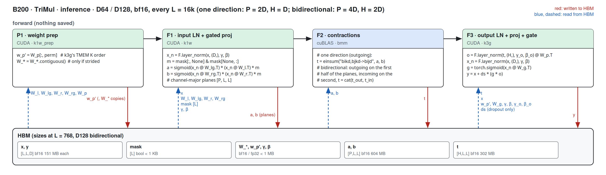

##### P1 · weight prep (k1w_prep)

| (Length, Dimension) | (128, 64) | (256, 64) | (384, 64) | (512, 64) | (640, 64) | (768, 64) | (128, 128) | (256, 128) | (384, 128) | (512, 128) | (640, 128) | (768, 128) |
|---|---|---|---|---|---|---|---|---|---|---|---|---|
| implementation | CUDA | CUDA | CUDA | CUDA | CUDA | CUDA | CUDA | CUDA | CUDA | CUDA | CUDA | CUDA |
| 성능 확인 | ✓ | ✓ | ✓ | ✓ | ✓ | ✓ | ✓ | ✓ | ✓ | ✓ | ✓ | ✓ |
| cache build | ✓ | ✓ | ✓ | ✓ | ✓ | ✓ | ✓ | ✓ | ✓ | ✓ | ✓ | ✓ |

##### F1 · input LN + gated proj (k1w)

| (Length, Dimension) | (128, 64) | (256, 64) | (384, 64) | (512, 64) | (640, 64) | (768, 64) | (128, 128) | (256, 128) | (384, 128) | (512, 128) | (640, 128) | (768, 128) |
|---|---|---|---|---|---|---|---|---|---|---|---|---|
| implementation | CUDA | CUDA | CUDA | CUDA | CUDA | CUDA | CUDA | CUDA | CUDA | CUDA | CUDA | CUDA |
| 성능 확인 | △ | △ | △ | ✓ | ✓ | ✓ | △ | △ | ✓ | ✓ | ✓ | ✓ |
| cache build | ✓ | ✓ | ✓ | ✓ | ✓ | ✓ | ✓ | ✓ | ✓ | ✓ | ✓ | ✓ |

##### F3 · output LN + proj + gate (k3g)

| (Length, Dimension) | (128, 64) | (256, 64) | (384, 64) | (512, 64) | (640, 64) | (768, 64) | (128, 128) | (256, 128) | (384, 128) | (512, 128) | (640, 128) | (768, 128) |
|---|---|---|---|---|---|---|---|---|---|---|---|---|
| implementation | CUDA | CUDA | CUDA | CUDA | CUDA | CUDA | CUDA | CUDA | CUDA | CUDA | CUDA | CUDA |
| 성능 확인 | △ | △ | △ | △ | △ | △ | △ | △ | △ | △ | △ | △ |
| cache build | ✓ | ✓ | ✓ | ✓ | ✓ | ✓ | ✓ | ✓ | ✓ | ✓ | ✓ | ✓ |

#### Wide path · D256 / D384 / D512, every L

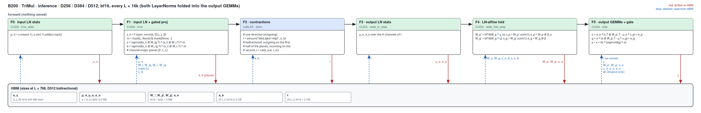

##### F0 · input LN stats (k1w_stats)

| (Length, Dimension) | (128, 256) | (256, 256) | (384, 256) | (512, 256) | (640, 256) | (768, 256) | (128, 384) | (256, 384) | (384, 384) | (512, 384) | (640, 384) | (768, 384) | (128, 512) | (256, 512) | (384, 512) | (512, 512) | (640, 512) | (768, 512) |
|---|---|---|---|---|---|---|---|---|---|---|---|---|---|---|---|---|---|---|
| implementation | CUDA | CUDA | CUDA | CUDA | CUDA | CUDA | CUDA | CUDA | CUDA | CUDA | CUDA | CUDA | CUDA | CUDA | CUDA | CUDA | CUDA | CUDA |
| 성능 확인 | △ | △ | △ | △ | △ | △ | △ | △ | △ | △ | △ | △ | △ | △ | ✓ | ✓ | ✓ | ✓ |
| cache build | ✓ | ✓ | ✓ | ✓ | ✓ | ✓ | ✓ | ✓ | ✓ | ✓ | ✓ | ✓ | ✓ | ✓ | ✓ | ✓ | ✓ | ✓ |

##### F1 · input LN + gated proj (k1w)

| (Length, Dimension) | (128, 256) | (256, 256) | (384, 256) | (512, 256) | (640, 256) | (768, 256) | (128, 384) | (256, 384) | (384, 384) | (512, 384) | (640, 384) | (768, 384) | (128, 512) | (256, 512) | (384, 512) | (512, 512) | (640, 512) | (768, 512) |
|---|---|---|---|---|---|---|---|---|---|---|---|---|---|---|---|---|---|---|
| implementation | CUDA | CUDA | CUDA | CUDA | CUDA | CUDA | CUDA | CUDA | CUDA | CUDA | CUDA | CUDA | CUDA | CUDA | CUDA | CUDA | CUDA | CUDA |
| 성능 확인 | △ | △ | ✓ | ✓ | ✓ | ✓ | △ | △ | ✓ | ✓ | ✓ | ✓ | △ | ✓ | ✓ | ✓ | ✓ | ✓ |
| cache build | ✓ | ✓ | ✓ | ✓ | ✓ | ✓ | ✓ | ✓ | ✓ | ✓ | ✓ | ✓ | ✓ | ✓ | ✓ | ✓ | ✓ | ✓ |

##### F3 · output LN stats (wide_ln_stats)

| (Length, Dimension) | (128, 256) | (256, 256) | (384, 256) | (512, 256) | (640, 256) | (768, 256) | (128, 384) | (256, 384) | (384, 384) | (512, 384) | (640, 384) | (768, 384) | (128, 512) | (256, 512) | (384, 512) | (512, 512) | (640, 512) | (768, 512) |
|---|---|---|---|---|---|---|---|---|---|---|---|---|---|---|---|---|---|---|
| implementation | CUDA | CUDA | CUDA | CUDA | CUDA | CUDA | CUDA | CUDA | CUDA | CUDA | CUDA | CUDA | CUDA | CUDA | CUDA | CUDA | CUDA | CUDA |
| 성능 확인 | △ | ✓ | ✓ | ✓ | ✓ | ✓ | △ | ✓ | ✓ | ✓ | ✓ | ✓ | △ | ✓ | ✓ | ✓ | ✓ | ✓ |
| cache build | ✓ | ✓ | ✓ | ✓ | ✓ | ✓ | ✓ | ✓ | ✓ | ✓ | ✓ | ✓ | ✓ | ✓ | ✓ | ✓ | ✓ | ✓ |

##### F4 · LN-affine fold (wide_fold_prep)

| (Length, Dimension) | (128, 256) | (256, 256) | (384, 256) | (512, 256) | (640, 256) | (768, 256) | (128, 384) | (256, 384) | (384, 384) | (512, 384) | (640, 384) | (768, 384) | (128, 512) | (256, 512) | (384, 512) | (512, 512) | (640, 512) | (768, 512) |
|---|---|---|---|---|---|---|---|---|---|---|---|---|---|---|---|---|---|---|
| implementation | CUDA | CUDA | CUDA | CUDA | CUDA | CUDA | CUDA | CUDA | CUDA | CUDA | CUDA | CUDA | CUDA | CUDA | CUDA | CUDA | CUDA | CUDA |
| 성능 확인 | ✓ | ✓ | ✓ | ✓ | ✓ | ✓ | ✓ | ✓ | ✓ | ✓ | ✓ | ✓ | ✓ | ✓ | ✓ | ✓ | ✓ | ✓ |
| cache build | ✓ | ✓ | ✓ | ✓ | ✓ | ✓ | ✓ | ✓ | ✓ | ✓ | ✓ | ✓ | ✓ | ✓ | ✓ | ✓ | ✓ | ✓ |

##### F5 · output GEMMs + gate (k3w)

| (Length, Dimension) | (128, 256) | (256, 256) | (384, 256) | (512, 256) | (640, 256) | (768, 256) | (128, 384) | (256, 384) | (384, 384) | (512, 384) | (640, 384) | (768, 384) | (128, 512) | (256, 512) | (384, 512) | (512, 512) | (640, 512) | (768, 512) |
|---|---|---|---|---|---|---|---|---|---|---|---|---|---|---|---|---|---|---|
| implementation | CUDA | CUDA | CUDA | CUDA | CUDA | CUDA | CUDA | CUDA | CUDA | CUDA | CUDA | CUDA | CUDA | CUDA | CUDA | CUDA | CUDA | CUDA |
| 성능 확인 | △ | △ | △ | △ | △ | △ | △ | △ | △ | △ | △ | △ | △ | △ | △ | △ | △ | △ |
| cache build | ✓ | ✓ | ✓ | ✓ | ✓ | ✓ | ✓ | ✓ | ✓ | ✓ | ✓ | ✓ | ✓ | ✓ | ✓ | ✓ | ✓ | ✓ |

### Training

#### Fused path · D64 / D128, L = 128 k

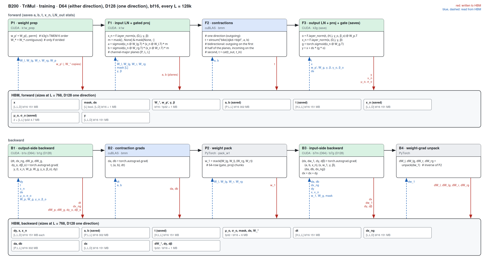

##### P1 · weight prep (k1w_prep)

| (Length, Dimension) | (128, 64) | (256, 64) | (384, 64) | (512, 64) | (640, 64) | (768, 64) | (128, 128) | (256, 128) | (384, 128) | (512, 128) | (640, 128) | (768, 128) |
|---|---|---|---|---|---|---|---|---|---|---|---|---|
| implementation | CUDA | CUDA | CUDA | CUDA | CUDA | CUDA | CUDA | CUDA | CUDA | CUDA | CUDA | CUDA |
| 성능 확인 | ✓ | ✓ | ✓ | ✓ | ✓ | ✓ | ✓ | ✓ | ✓ | ✓ | ✓ | ✓ |
| cache build | ✓ | ✓ | ✓ | ✓ | ✓ | ✓ | ✓ | ✓ | ✓ | ✓ | ✓ | ✓ |

##### F1 · input LN + gated proj (k1w)

| (Length, Dimension) | (128, 64) | (256, 64) | (384, 64) | (512, 64) | (640, 64) | (768, 64) | (128, 128) | (256, 128) | (384, 128) | (512, 128) | (640, 128) | (768, 128) |
|---|---|---|---|---|---|---|---|---|---|---|---|---|
| implementation | CUDA | CUDA | CUDA | CUDA | CUDA | CUDA | CUDA | CUDA | CUDA | CUDA | CUDA | CUDA |
| 성능 확인 | △ | △ | △ | ✓ | ✓ | ✓ | △ | △ | △ | ✓ | ✓ | ✓ |
| cache build | ✓ | ✓ | ✓ | ✓ | ✓ | ✓ | ✓ | ✓ | ✓ | ✓ | ✓ | ✓ |

##### F3 · output LN + proj + gate, saving (k3g)

| (Length, Dimension) | (128, 64) | (256, 64) | (384, 64) | (512, 64) | (640, 64) | (768, 64) | (128, 128) | (256, 128) | (384, 128) | (512, 128) | (640, 128) | (768, 128) |
|---|---|---|---|---|---|---|---|---|---|---|---|---|
| implementation | CUDA | CUDA | CUDA | CUDA | CUDA | CUDA | CUDA | CUDA | CUDA | CUDA | CUDA | CUDA |
| 성능 확인 | △ | △ | △ | △ | △ | △ | △ | △ | △ | △ | △ | △ |
| cache build | ✓ | ✓ | ✓ | ✓ | ✓ | ✓ | ✓ | ✓ | ✓ | ✓ | ✓ | ✓ |

##### B1 · output-side backward (b1s D64 / b1g D128)

| (Length, Dimension) | (128, 64) | (256, 64) | (384, 64) | (512, 64) | (640, 64) | (768, 64) | (128, 128) | (256, 128) | (384, 128) | (512, 128) | (640, 128) | (768, 128) |
|---|---|---|---|---|---|---|---|---|---|---|---|---|
| implementation | CUDA | CUDA | CUDA | CUDA | CUDA | CUDA | CUDA | CUDA | CUDA | CUDA | CUDA | CUDA |
| 성능 확인 | △ | △ | △ | △ | △ | △ | △ | △ | △ | △ | △ | △ |
| cache build | ✓ | ✓ | ✓ | ✓ | ✓ | ✓ | ✓ | ✓ | ✓ | ✓ | ✓ | ✓ |

##### B3 · input-side backward (b7m D64 / b7g D128)

| (Length, Dimension) | (128, 64) | (256, 64) | (384, 64) | (512, 64) | (640, 64) | (768, 64) | (128, 128) | (256, 128) | (384, 128) | (512, 128) | (640, 128) | (768, 128) |
|---|---|---|---|---|---|---|---|---|---|---|---|---|
| implementation | CUDA | CUDA | CUDA | CUDA | CUDA | CUDA | CUDA | CUDA | CUDA | CUDA | CUDA | CUDA |
| 성능 확인 | △ | △ | △ | △ | △ | △ | △ | △ | △ | △ | △ | △ |
| cache build | ✓ | ✓ | ✓ | ✓ | ✓ | ✓ | ✓ | ✓ | ✓ | ✓ | ✓ | ✓ |

#### Wide path · D256 / D384 / D512, every L

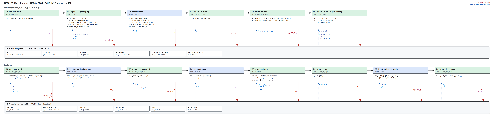

##### F0 · input LN stats (k1w_stats)

| (Length, Dimension) | (128, 256) | (256, 256) | (384, 256) | (512, 256) | (640, 256) | (768, 256) | (128, 384) | (256, 384) | (384, 384) | (512, 384) | (640, 384) | (768, 384) | (128, 512) | (256, 512) | (384, 512) | (512, 512) | (640, 512) | (768, 512) |
|---|---|---|---|---|---|---|---|---|---|---|---|---|---|---|---|---|---|---|
| implementation | CUDA | CUDA | CUDA | CUDA | CUDA | CUDA | CUDA | CUDA | CUDA | CUDA | CUDA | CUDA | CUDA | CUDA | CUDA | CUDA | CUDA | CUDA |
| 성능 확인 | △ | △ | △ | △ | △ | △ | △ | △ | △ | △ | △ | △ | △ | △ | ✓ | ✓ | ✓ | ✓ |
| cache build | ✓ | ✓ | ✓ | ✓ | ✓ | ✓ | ✓ | ✓ | ✓ | ✓ | ✓ | ✓ | ✓ | ✓ | ✓ | ✓ | ✓ | ✓ |

##### F1 · input LN + gated proj (k1w)

| (Length, Dimension) | (128, 256) | (256, 256) | (384, 256) | (512, 256) | (640, 256) | (768, 256) | (128, 384) | (256, 384) | (384, 384) | (512, 384) | (640, 384) | (768, 384) | (128, 512) | (256, 512) | (384, 512) | (512, 512) | (640, 512) | (768, 512) |
|---|---|---|---|---|---|---|---|---|---|---|---|---|---|---|---|---|---|---|
| implementation | CUDA | CUDA | CUDA | CUDA | CUDA | CUDA | CUDA | CUDA | CUDA | CUDA | CUDA | CUDA | CUDA | CUDA | CUDA | CUDA | CUDA | CUDA |
| 성능 확인 | △ | △ | ✓ | ✓ | ✓ | ✓ | △ | △ | ✓ | ✓ | ✓ | ✓ | △ | △ | ✓ | ✓ | ✓ | ✓ |
| cache build | ✓ | ✓ | ✓ | ✓ | ✓ | ✓ | ✓ | ✓ | ✓ | ✓ | ✓ | ✓ | ✓ | ✓ | ✓ | ✓ | ✓ | ✓ |

##### F3 · output LN stats (wide_ln_stats)

| (Length, Dimension) | (128, 256) | (256, 256) | (384, 256) | (512, 256) | (640, 256) | (768, 256) | (128, 384) | (256, 384) | (384, 384) | (512, 384) | (640, 384) | (768, 384) | (128, 512) | (256, 512) | (384, 512) | (512, 512) | (640, 512) | (768, 512) |
|---|---|---|---|---|---|---|---|---|---|---|---|---|---|---|---|---|---|---|
| implementation | CUDA | CUDA | CUDA | CUDA | CUDA | CUDA | CUDA | CUDA | CUDA | CUDA | CUDA | CUDA | CUDA | CUDA | CUDA | CUDA | CUDA | CUDA |
| 성능 확인 | △ | ✓ | ✓ | ✓ | ✓ | ✓ | △ | ✓ | ✓ | ✓ | ✓ | ✓ | △ | ✓ | ✓ | ✓ | ✓ | ✓ |
| cache build | ✓ | ✓ | ✓ | ✓ | ✓ | ✓ | ✓ | ✓ | ✓ | ✓ | ✓ | ✓ | ✓ | ✓ | ✓ | ✓ | ✓ | ✓ |

##### F4 · LN-affine fold (wide_fold_prep)

| (Length, Dimension) | (128, 256) | (256, 256) | (384, 256) | (512, 256) | (640, 256) | (768, 256) | (128, 384) | (256, 384) | (384, 384) | (512, 384) | (640, 384) | (768, 384) | (128, 512) | (256, 512) | (384, 512) | (512, 512) | (640, 512) | (768, 512) |
|---|---|---|---|---|---|---|---|---|---|---|---|---|---|---|---|---|---|---|
| implementation | CUDA | CUDA | CUDA | CUDA | CUDA | CUDA | CUDA | CUDA | CUDA | CUDA | CUDA | CUDA | CUDA | CUDA | CUDA | CUDA | CUDA | CUDA |
| 성능 확인 | ✓ | ✓ | ✓ | ✓ | ✓ | ✓ | ✓ | ✓ | ✓ | ✓ | ✓ | ✓ | ✓ | ✓ | ✓ | ✓ | ✓ | ✓ |
| cache build | ✓ | ✓ | ✓ | ✓ | ✓ | ✓ | ✓ | ✓ | ✓ | ✓ | ✓ | ✓ | ✓ | ✓ | ✓ | ✓ | ✓ | ✓ |

##### F5 · output GEMMs + gate, saving (k3w)

| (Length, Dimension) | (128, 256) | (256, 256) | (384, 256) | (512, 256) | (640, 256) | (768, 256) | (128, 384) | (256, 384) | (384, 384) | (512, 384) | (640, 384) | (768, 384) | (128, 512) | (256, 512) | (384, 512) | (512, 512) | (640, 512) | (768, 512) |
|---|---|---|---|---|---|---|---|---|---|---|---|---|---|---|---|---|---|---|
| implementation | CUDA | CUDA | CUDA | CUDA | CUDA | CUDA | CUDA | CUDA | CUDA | CUDA | CUDA | CUDA | CUDA | CUDA | CUDA | CUDA | CUDA | CUDA |
| 성능 확인 | △ | △ | △ | △ | △ | △ | △ | △ | △ | △ | △ | △ | △ | △ | △ | △ | △ | △ |
| cache build | ✓ | ✓ | ✓ | ✓ | ✓ | ✓ | ✓ | ✓ | ✓ | ✓ | ✓ | ✓ | ✓ | ✓ | ✓ | ✓ | ✓ | ✓ |

##### B1 · gate backward (wide_gate_bwd)

| (Length, Dimension) | (128, 256) | (256, 256) | (384, 256) | (512, 256) | (640, 256) | (768, 256) | (128, 384) | (256, 384) | (384, 384) | (512, 384) | (640, 384) | (768, 384) | (128, 512) | (256, 512) | (384, 512) | (512, 512) | (640, 512) | (768, 512) |
|---|---|---|---|---|---|---|---|---|---|---|---|---|---|---|---|---|---|---|
| implementation | CUDA | CUDA | CUDA | CUDA | CUDA | CUDA | CUDA | CUDA | CUDA | CUDA | CUDA | CUDA | CUDA | CUDA | CUDA | CUDA | CUDA | CUDA |
| 성능 확인 | △ | △ | △ | △ | △ | △ | △ | △ | △ | △ | △ | △ | △ | △ | △ | △ | △ | △ |
| cache build | ✓ | ✓ | ✓ | ✓ | ✓ | ✓ | ✓ | ✓ | ✓ | ✓ | ✓ | ✓ | ✓ | ✓ | ✓ | ✓ | ✓ | ✓ |

##### B3 · output-LN backward (wide_lnout_bwd)

| (Length, Dimension) | (128, 256) | (256, 256) | (384, 256) | (512, 256) | (640, 256) | (768, 256) | (128, 384) | (256, 384) | (384, 384) | (512, 384) | (640, 384) | (768, 384) | (128, 512) | (256, 512) | (384, 512) | (512, 512) | (640, 512) | (768, 512) |
|---|---|---|---|---|---|---|---|---|---|---|---|---|---|---|---|---|---|---|
| implementation | CUDA | CUDA | CUDA | CUDA | CUDA | CUDA | CUDA | CUDA | CUDA | CUDA | CUDA | CUDA | CUDA | CUDA | CUDA | CUDA | CUDA | CUDA |
| 성능 확인 | △ | △ | △ | △ | △ | △ | △ | △ | △ | △ | △ | △ | △ | △ | △ | △ | △ | △ |
| cache build | ✓ | ✓ | ✓ | ✓ | ✓ | ✓ | ✓ | ✓ | ✓ | ✓ | ✓ | ✓ | ✓ | ✓ | ✓ | ✓ | ✓ | ✓ |

##### B5 · front backward (k1wb)

| (Length, Dimension) | (128, 256) | (256, 256) | (384, 256) | (512, 256) | (640, 256) | (768, 256) | (128, 384) | (256, 384) | (384, 384) | (512, 384) | (640, 384) | (768, 384) | (128, 512) | (256, 512) | (384, 512) | (512, 512) | (640, 512) | (768, 512) |
|---|---|---|---|---|---|---|---|---|---|---|---|---|---|---|---|---|---|---|
| implementation | CUDA | CUDA | CUDA | CUDA | CUDA | CUDA | CUDA | CUDA | CUDA | CUDA | CUDA | CUDA | CUDA | CUDA | CUDA | CUDA | CUDA | CUDA |
| 성능 확인 | △ | △ | △ | △ | △ | △ | △ | △ | △ | △ | △ | △ | △ | △ | △ | △ | △ | △ |
| cache build | ✓ | ✓ | ✓ | ✓ | ✓ | ✓ | ✓ | ✓ | ✓ | ✓ | ✓ | ✓ | ✓ | ✓ | ✓ | ✓ | ✓ | ✓ |

##### B6 · input LN apply (wide_ln_apply)

| (Length, Dimension) | (128, 256) | (256, 256) | (384, 256) | (512, 256) | (640, 256) | (768, 256) | (128, 384) | (256, 384) | (384, 384) | (512, 384) | (640, 384) | (768, 384) | (128, 512) | (256, 512) | (384, 512) | (512, 512) | (640, 512) | (768, 512) |
|---|---|---|---|---|---|---|---|---|---|---|---|---|---|---|---|---|---|---|
| implementation | CUDA | CUDA | CUDA | CUDA | CUDA | CUDA | CUDA | CUDA | CUDA | CUDA | CUDA | CUDA | CUDA | CUDA | CUDA | CUDA | CUDA | CUDA |
| 성능 확인 | △ | △ | ✓ | ✓ | ✓ | ✓ | △ | ✓ | ✓ | ✓ | ✓ | ✓ | △ | ✓ | ✓ | ✓ | ✓ | ✓ |
| cache build | ✓ | ✓ | ✓ | ✓ | ✓ | ✓ | ✓ | ✓ | ✓ | ✓ | ✓ | ✓ | ✓ | ✓ | ✓ | ✓ | ✓ | ✓ |

##### B8 · input-LN backward (wide_lnin_bwd)

| (Length, Dimension) | (128, 256) | (256, 256) | (384, 256) | (512, 256) | (640, 256) | (768, 256) | (128, 384) | (256, 384) | (384, 384) | (512, 384) | (640, 384) | (768, 384) | (128, 512) | (256, 512) | (384, 512) | (512, 512) | (640, 512) | (768, 512) |
|---|---|---|---|---|---|---|---|---|---|---|---|---|---|---|---|---|---|---|
| implementation | CUDA | CUDA | CUDA | CUDA | CUDA | CUDA | CUDA | CUDA | CUDA | CUDA | CUDA | CUDA | CUDA | CUDA | CUDA | CUDA | CUDA | CUDA |
| 성능 확인 | △ | △ | ✓ | ✓ | ✓ | ✓ | △ | △ | △ | △ | △ | △ | △ | △ | ✓ | ✓ | ✓ | ✓ |
| cache build | ✓ | ✓ | ✓ | ✓ | ✓ | ✓ | ✓ | ✓ | ✓ | ✓ | ✓ | ✓ | ✓ | ✓ | ✓ | ✓ | ✓ | ✓ |

## Single direction (`TriangleMultiplication`)

Outgoing and incoming run the same kernels (the contraction's operand order differs); the tables
cover both.

### Inference

#### Fused path · D64 / D128, every L

##### P1 · weight prep (k1w_prep)

| (Length, Dimension) | (128, 64) | (256, 64) | (384, 64) | (512, 64) | (640, 64) | (768, 64) | (128, 128) | (256, 128) | (384, 128) | (512, 128) | (640, 128) | (768, 128) |
|---|---|---|---|---|---|---|---|---|---|---|---|---|
| implementation | CUDA | CUDA | CUDA | CUDA | CUDA | CUDA | CUDA | CUDA | CUDA | CUDA | CUDA | CUDA |
| 성능 확인 | ✓ | ✓ | ✓ | ✓ | ✓ | ✓ | ✓ | ✓ | ✓ | ✓ | ✓ | ✓ |
| cache build | ✓ | ✓ | ✓ | ✓ | ✓ | ✓ | ✓ | ✓ | ✓ | ✓ | ✓ | ✓ |

##### F1 · input LN + gated proj (k1w)

| (Length, Dimension) | (128, 64) | (256, 64) | (384, 64) | (512, 64) | (640, 64) | (768, 64) | (128, 128) | (256, 128) | (384, 128) | (512, 128) | (640, 128) | (768, 128) |
|---|---|---|---|---|---|---|---|---|---|---|---|---|
| implementation | CUDA | CUDA | CUDA | CUDA | CUDA | CUDA | CUDA | CUDA | CUDA | CUDA | CUDA | CUDA |
| 성능 확인 | △ | △ | △ | △ | ✓ | ✓ | △ | △ | △ | ✓ | ✓ | ✓ |
| cache build | ✓ | ✓ | ✓ | ✓ | ✓ | ✓ | ✓ | ✓ | ✓ | ✓ | ✓ | ✓ |

##### F3 · output LN + proj + gate (k3g)

| (Length, Dimension) | (128, 64) | (256, 64) | (384, 64) | (512, 64) | (640, 64) | (768, 64) | (128, 128) | (256, 128) | (384, 128) | (512, 128) | (640, 128) | (768, 128) |
|---|---|---|---|---|---|---|---|---|---|---|---|---|
| implementation | CUDA | CUDA | CUDA | CUDA | CUDA | CUDA | CUDA | CUDA | CUDA | CUDA | CUDA | CUDA |
| 성능 확인 | △ | △ | △ | △ | △ | △ | △ | △ | △ | △ | △ | △ |
| cache build | ✓ | ✓ | ✓ | ✓ | ✓ | ✓ | ✓ | ✓ | ✓ | ✓ | ✓ | ✓ |

#### Wide path · D256 / D384 / D512, every L

D512 is not a registered single-direction shape; the path serves it anyway.

##### F0 · input LN stats (k1w_stats)

| (Length, Dimension) | (128, 256) | (256, 256) | (384, 256) | (512, 256) | (640, 256) | (768, 256) | (128, 384) | (256, 384) | (384, 384) | (512, 384) | (640, 384) | (768, 384) | (128, 512) | (256, 512) | (384, 512) | (512, 512) | (640, 512) | (768, 512) |
|---|---|---|---|---|---|---|---|---|---|---|---|---|---|---|---|---|---|---|
| implementation | CUDA | CUDA | CUDA | CUDA | CUDA | CUDA | CUDA | CUDA | CUDA | CUDA | CUDA | CUDA | CUDA | CUDA | CUDA | CUDA | CUDA | CUDA |
| 성능 확인 | △ | △ | △ | △ | △ | △ | △ | △ | △ | △ | △ | △ | △ | △ | ✓ | ✓ | ✓ | ✓ |
| cache build | ✓ | ✓ | ✓ | ✓ | ✓ | ✓ | ✓ | ✓ | ✓ | ✓ | ✓ | ✓ | ✓ | ✓ | ✓ | ✓ | ✓ | ✓ |

##### F1 · input LN + gated proj (k1w)

| (Length, Dimension) | (128, 256) | (256, 256) | (384, 256) | (512, 256) | (640, 256) | (768, 256) | (128, 384) | (256, 384) | (384, 384) | (512, 384) | (640, 384) | (768, 384) | (128, 512) | (256, 512) | (384, 512) | (512, 512) | (640, 512) | (768, 512) |
|---|---|---|---|---|---|---|---|---|---|---|---|---|---|---|---|---|---|---|
| implementation | CUDA | CUDA | CUDA | CUDA | CUDA | CUDA | CUDA | CUDA | CUDA | CUDA | CUDA | CUDA | CUDA | CUDA | CUDA | CUDA | CUDA | CUDA |
| 성능 확인 | △ | △ | △ | ✓ | ✓ | △ | △ | △ | △ | ✓ | ✓ | △ | △ | △ | ✓ | ✓ | ✓ | ✓ |
| cache build | ✓ | ✓ | ✓ | ✓ | ✓ | ✓ | ✓ | ✓ | ✓ | ✓ | ✓ | ✓ | ✓ | ✓ | ✓ | ✓ | ✓ | ✓ |

##### F3 · output LN stats (wide_ln_stats)

| (Length, Dimension) | (128, 256) | (256, 256) | (384, 256) | (512, 256) | (640, 256) | (768, 256) | (128, 384) | (256, 384) | (384, 384) | (512, 384) | (640, 384) | (768, 384) | (128, 512) | (256, 512) | (384, 512) | (512, 512) | (640, 512) | (768, 512) |
|---|---|---|---|---|---|---|---|---|---|---|---|---|---|---|---|---|---|---|
| implementation | CUDA | CUDA | CUDA | CUDA | CUDA | CUDA | CUDA | CUDA | CUDA | CUDA | CUDA | CUDA | CUDA | CUDA | CUDA | CUDA | CUDA | CUDA |
| 성능 확인 | △ | ✓ | ✓ | ✓ | ✓ | ✓ | △ | ✓ | ✓ | ✓ | ✓ | ✓ | △ | ✓ | ✓ | ✓ | ✓ | ✓ |
| cache build | ✓ | ✓ | ✓ | ✓ | ✓ | ✓ | ✓ | ✓ | ✓ | ✓ | ✓ | ✓ | ✓ | ✓ | ✓ | ✓ | ✓ | ✓ |

##### F4 · LN-affine fold (wide_fold_prep)

| (Length, Dimension) | (128, 256) | (256, 256) | (384, 256) | (512, 256) | (640, 256) | (768, 256) | (128, 384) | (256, 384) | (384, 384) | (512, 384) | (640, 384) | (768, 384) | (128, 512) | (256, 512) | (384, 512) | (512, 512) | (640, 512) | (768, 512) |
|---|---|---|---|---|---|---|---|---|---|---|---|---|---|---|---|---|---|---|
| implementation | CUDA | CUDA | CUDA | CUDA | CUDA | CUDA | CUDA | CUDA | CUDA | CUDA | CUDA | CUDA | CUDA | CUDA | CUDA | CUDA | CUDA | CUDA |
| 성능 확인 | ✓ | ✓ | ✓ | ✓ | ✓ | ✓ | ✓ | ✓ | ✓ | ✓ | ✓ | ✓ | ✓ | ✓ | ✓ | ✓ | ✓ | ✓ |
| cache build | ✓ | ✓ | ✓ | ✓ | ✓ | ✓ | ✓ | ✓ | ✓ | ✓ | ✓ | ✓ | ✓ | ✓ | ✓ | ✓ | ✓ | ✓ |

##### F5 · output GEMMs + gate (k3w)

| (Length, Dimension) | (128, 256) | (256, 256) | (384, 256) | (512, 256) | (640, 256) | (768, 256) | (128, 384) | (256, 384) | (384, 384) | (512, 384) | (640, 384) | (768, 384) | (128, 512) | (256, 512) | (384, 512) | (512, 512) | (640, 512) | (768, 512) |
|---|---|---|---|---|---|---|---|---|---|---|---|---|---|---|---|---|---|---|
| implementation | CUDA | CUDA | CUDA | CUDA | CUDA | CUDA | CUDA | CUDA | CUDA | CUDA | CUDA | CUDA | CUDA | CUDA | CUDA | CUDA | CUDA | CUDA |
| 성능 확인 | △ | △ | △ | △ | △ | △ | △ | △ | △ | △ | △ | △ | △ | △ | △ | △ | △ | △ |
| cache build | ✓ | ✓ | ✓ | ✓ | ✓ | ✓ | ✓ | ✓ | ✓ | ✓ | ✓ | ✓ | ✓ | ✓ | ✓ | ✓ | ✓ | ✓ |

### Training

#### Fused path · D64 / D128, L = 128 k

##### P1 · weight prep (k1w_prep)

| (Length, Dimension) | (128, 64) | (256, 64) | (384, 64) | (512, 64) | (640, 64) | (768, 64) | (128, 128) | (256, 128) | (384, 128) | (512, 128) | (640, 128) | (768, 128) |
|---|---|---|---|---|---|---|---|---|---|---|---|---|
| implementation | CUDA | CUDA | CUDA | CUDA | CUDA | CUDA | CUDA | CUDA | CUDA | CUDA | CUDA | CUDA |
| 성능 확인 | ✓ | ✓ | ✓ | ✓ | ✓ | ✓ | ✓ | ✓ | ✓ | ✓ | ✓ | ✓ |
| cache build | ✓ | ✓ | ✓ | ✓ | ✓ | ✓ | ✓ | ✓ | ✓ | ✓ | ✓ | ✓ |

##### F1 · input LN + gated proj (k1w)

| (Length, Dimension) | (128, 64) | (256, 64) | (384, 64) | (512, 64) | (640, 64) | (768, 64) | (128, 128) | (256, 128) | (384, 128) | (512, 128) | (640, 128) | (768, 128) |
|---|---|---|---|---|---|---|---|---|---|---|---|---|
| implementation | CUDA | CUDA | CUDA | CUDA | CUDA | CUDA | CUDA | CUDA | CUDA | CUDA | CUDA | CUDA |
| 성능 확인 | △ | △ | △ | △ | ✓ | ✓ | △ | △ | △ | ✓ | ✓ | ✓ |
| cache build | ✓ | ✓ | ✓ | ✓ | ✓ | ✓ | ✓ | ✓ | ✓ | ✓ | ✓ | ✓ |

##### F3 · output LN + proj + gate, saving (k3g)

| (Length, Dimension) | (128, 64) | (256, 64) | (384, 64) | (512, 64) | (640, 64) | (768, 64) | (128, 128) | (256, 128) | (384, 128) | (512, 128) | (640, 128) | (768, 128) |
|---|---|---|---|---|---|---|---|---|---|---|---|---|
| implementation | CUDA | CUDA | CUDA | CUDA | CUDA | CUDA | CUDA | CUDA | CUDA | CUDA | CUDA | CUDA |
| 성능 확인 | △ | △ | △ | △ | △ | △ | △ | △ | △ | △ | △ | △ |
| cache build | ✓ | ✓ | ✓ | ✓ | ✓ | ✓ | ✓ | ✓ | ✓ | ✓ | ✓ | ✓ |

##### B1 · output-side backward (b1s D64 / b1g D128)

| (Length, Dimension) | (128, 64) | (256, 64) | (384, 64) | (512, 64) | (640, 64) | (768, 64) | (128, 128) | (256, 128) | (384, 128) | (512, 128) | (640, 128) | (768, 128) |
|---|---|---|---|---|---|---|---|---|---|---|---|---|
| implementation | CUDA | CUDA | CUDA | CUDA | CUDA | CUDA | CUDA | CUDA | CUDA | CUDA | CUDA | CUDA |
| 성능 확인 | △ | △ | △ | △ | △ | △ | △ | △ | △ | △ | △ | △ |
| cache build | ✓ | ✓ | ✓ | ✓ | ✓ | ✓ | ✓ | ✓ | ✓ | ✓ | ✓ | ✓ |

##### B3 · input-side backward (b7m D64 / b7g D128)

| (Length, Dimension) | (128, 64) | (256, 64) | (384, 64) | (512, 64) | (640, 64) | (768, 64) | (128, 128) | (256, 128) | (384, 128) | (512, 128) | (640, 128) | (768, 128) |
|---|---|---|---|---|---|---|---|---|---|---|---|---|
| implementation | CUDA | CUDA | CUDA | CUDA | CUDA | CUDA | CUDA | CUDA | CUDA | CUDA | CUDA | CUDA |
| 성능 확인 | △ | △ | △ | △ | △ | △ | △ | △ | △ | △ | △ | △ |
| cache build | ✓ | ✓ | ✓ | ✓ | ✓ | ✓ | ✓ | ✓ | ✓ | ✓ | ✓ | ✓ |

#### Wide path · D256 / D384 / D512, every L

##### F0 · input LN stats (k1w_stats)

| (Length, Dimension) | (128, 256) | (256, 256) | (384, 256) | (512, 256) | (640, 256) | (768, 256) | (128, 384) | (256, 384) | (384, 384) | (512, 384) | (640, 384) | (768, 384) | (128, 512) | (256, 512) | (384, 512) | (512, 512) | (640, 512) | (768, 512) |
|---|---|---|---|---|---|---|---|---|---|---|---|---|---|---|---|---|---|---|
| implementation | CUDA | CUDA | CUDA | CUDA | CUDA | CUDA | CUDA | CUDA | CUDA | CUDA | CUDA | CUDA | CUDA | CUDA | CUDA | CUDA | CUDA | CUDA |
| 성능 확인 | △ | △ | △ | △ | △ | △ | △ | △ | △ | △ | △ | △ | △ | △ | ✓ | ✓ | ✓ | ✓ |
| cache build | ✓ | ✓ | ✓ | ✓ | ✓ | ✓ | ✓ | ✓ | ✓ | ✓ | ✓ | ✓ | ✓ | ✓ | ✓ | ✓ | ✓ | ✓ |

##### F1 · input LN + gated proj (k1w)

| (Length, Dimension) | (128, 256) | (256, 256) | (384, 256) | (512, 256) | (640, 256) | (768, 256) | (128, 384) | (256, 384) | (384, 384) | (512, 384) | (640, 384) | (768, 384) | (128, 512) | (256, 512) | (384, 512) | (512, 512) | (640, 512) | (768, 512) |
|---|---|---|---|---|---|---|---|---|---|---|---|---|---|---|---|---|---|---|
| implementation | CUDA | CUDA | CUDA | CUDA | CUDA | CUDA | CUDA | CUDA | CUDA | CUDA | CUDA | CUDA | CUDA | CUDA | CUDA | CUDA | CUDA | CUDA |
| 성능 확인 | △ | △ | △ | △ | △ | △ | △ | △ | △ | △ | △ | △ | △ | △ | ✓ | ✓ | ✓ | ✓ |
| cache build | ✓ | ✓ | ✓ | ✓ | ✓ | ✓ | ✓ | ✓ | ✓ | ✓ | ✓ | ✓ | ✓ | ✓ | ✓ | ✓ | ✓ | ✓ |

##### F3 · output LN stats (wide_ln_stats)

| (Length, Dimension) | (128, 256) | (256, 256) | (384, 256) | (512, 256) | (640, 256) | (768, 256) | (128, 384) | (256, 384) | (384, 384) | (512, 384) | (640, 384) | (768, 384) | (128, 512) | (256, 512) | (384, 512) | (512, 512) | (640, 512) | (768, 512) |
|---|---|---|---|---|---|---|---|---|---|---|---|---|---|---|---|---|---|---|
| implementation | CUDA | CUDA | CUDA | CUDA | CUDA | CUDA | CUDA | CUDA | CUDA | CUDA | CUDA | CUDA | CUDA | CUDA | CUDA | CUDA | CUDA | CUDA |
| 성능 확인 | △ | ✓ | ✓ | ✓ | ✓ | ✓ | △ | ✓ | ✓ | ✓ | ✓ | ✓ | △ | ✓ | ✓ | ✓ | ✓ | ✓ |
| cache build | ✓ | ✓ | ✓ | ✓ | ✓ | ✓ | ✓ | ✓ | ✓ | ✓ | ✓ | ✓ | ✓ | ✓ | ✓ | ✓ | ✓ | ✓ |

##### F4 · LN-affine fold (wide_fold_prep)

| (Length, Dimension) | (128, 256) | (256, 256) | (384, 256) | (512, 256) | (640, 256) | (768, 256) | (128, 384) | (256, 384) | (384, 384) | (512, 384) | (640, 384) | (768, 384) | (128, 512) | (256, 512) | (384, 512) | (512, 512) | (640, 512) | (768, 512) |
|---|---|---|---|---|---|---|---|---|---|---|---|---|---|---|---|---|---|---|
| implementation | CUDA | CUDA | CUDA | CUDA | CUDA | CUDA | CUDA | CUDA | CUDA | CUDA | CUDA | CUDA | CUDA | CUDA | CUDA | CUDA | CUDA | CUDA |
| 성능 확인 | ✓ | ✓ | ✓ | ✓ | ✓ | ✓ | ✓ | ✓ | ✓ | ✓ | ✓ | ✓ | ✓ | ✓ | ✓ | ✓ | ✓ | ✓ |
| cache build | ✓ | ✓ | ✓ | ✓ | ✓ | ✓ | ✓ | ✓ | ✓ | ✓ | ✓ | ✓ | ✓ | ✓ | ✓ | ✓ | ✓ | ✓ |

##### F5 · output GEMMs + gate, saving (k3w)

| (Length, Dimension) | (128, 256) | (256, 256) | (384, 256) | (512, 256) | (640, 256) | (768, 256) | (128, 384) | (256, 384) | (384, 384) | (512, 384) | (640, 384) | (768, 384) | (128, 512) | (256, 512) | (384, 512) | (512, 512) | (640, 512) | (768, 512) |
|---|---|---|---|---|---|---|---|---|---|---|---|---|---|---|---|---|---|---|
| implementation | CUDA | CUDA | CUDA | CUDA | CUDA | CUDA | CUDA | CUDA | CUDA | CUDA | CUDA | CUDA | CUDA | CUDA | CUDA | CUDA | CUDA | CUDA |
| 성능 확인 | △ | △ | △ | △ | △ | △ | △ | △ | △ | △ | △ | △ | △ | △ | △ | △ | △ | △ |
| cache build | ✓ | ✓ | ✓ | ✓ | ✓ | ✓ | ✓ | ✓ | ✓ | ✓ | ✓ | ✓ | ✓ | ✓ | ✓ | ✓ | ✓ | ✓ |

##### B1 · gate backward (wide_gate_bwd)

| (Length, Dimension) | (128, 256) | (256, 256) | (384, 256) | (512, 256) | (640, 256) | (768, 256) | (128, 384) | (256, 384) | (384, 384) | (512, 384) | (640, 384) | (768, 384) | (128, 512) | (256, 512) | (384, 512) | (512, 512) | (640, 512) | (768, 512) |
|---|---|---|---|---|---|---|---|---|---|---|---|---|---|---|---|---|---|---|
| implementation | CUDA | CUDA | CUDA | CUDA | CUDA | CUDA | CUDA | CUDA | CUDA | CUDA | CUDA | CUDA | CUDA | CUDA | CUDA | CUDA | CUDA | CUDA |
| 성능 확인 | △ | △ | △ | △ | △ | △ | △ | △ | △ | △ | △ | △ | △ | △ | △ | △ | △ | △ |
| cache build | ✓ | ✓ | ✓ | ✓ | ✓ | ✓ | ✓ | ✓ | ✓ | ✓ | ✓ | ✓ | ✓ | ✓ | ✓ | ✓ | ✓ | ✓ |

##### B3 · output-LN backward (wide_lnout_bwd)

| (Length, Dimension) | (128, 256) | (256, 256) | (384, 256) | (512, 256) | (640, 256) | (768, 256) | (128, 384) | (256, 384) | (384, 384) | (512, 384) | (640, 384) | (768, 384) | (128, 512) | (256, 512) | (384, 512) | (512, 512) | (640, 512) | (768, 512) |
|---|---|---|---|---|---|---|---|---|---|---|---|---|---|---|---|---|---|---|
| implementation | CUDA | CUDA | CUDA | CUDA | CUDA | CUDA | CUDA | CUDA | CUDA | CUDA | CUDA | CUDA | CUDA | CUDA | CUDA | CUDA | CUDA | CUDA |
| 성능 확인 | △ | △ | △ | △ | △ | △ | △ | △ | △ | △ | △ | △ | △ | △ | △ | △ | △ | △ |
| cache build | ✓ | ✓ | ✓ | ✓ | ✓ | ✓ | ✓ | ✓ | ✓ | ✓ | ✓ | ✓ | ✓ | ✓ | ✓ | ✓ | ✓ | ✓ |

##### B5 · front backward (k1wb)

| (Length, Dimension) | (128, 256) | (256, 256) | (384, 256) | (512, 256) | (640, 256) | (768, 256) | (128, 384) | (256, 384) | (384, 384) | (512, 384) | (640, 384) | (768, 384) | (128, 512) | (256, 512) | (384, 512) | (512, 512) | (640, 512) | (768, 512) |
|---|---|---|---|---|---|---|---|---|---|---|---|---|---|---|---|---|---|---|
| implementation | CUDA | CUDA | CUDA | CUDA | CUDA | CUDA | CUDA | CUDA | CUDA | CUDA | CUDA | CUDA | CUDA | CUDA | CUDA | CUDA | CUDA | CUDA |
| 성능 확인 | △ | △ | △ | △ | △ | △ | △ | △ | △ | △ | △ | △ | △ | △ | △ | △ | △ | △ |
| cache build | ✓ | ✓ | ✓ | ✓ | ✓ | ✓ | ✓ | ✓ | ✓ | ✓ | ✓ | ✓ | ✓ | ✓ | ✓ | ✓ | ✓ | ✓ |

##### B6 · input LN apply (wide_ln_apply)

| (Length, Dimension) | (128, 256) | (256, 256) | (384, 256) | (512, 256) | (640, 256) | (768, 256) | (128, 384) | (256, 384) | (384, 384) | (512, 384) | (640, 384) | (768, 384) | (128, 512) | (256, 512) | (384, 512) | (512, 512) | (640, 512) | (768, 512) |
|---|---|---|---|---|---|---|---|---|---|---|---|---|---|---|---|---|---|---|
| implementation | CUDA | CUDA | CUDA | CUDA | CUDA | CUDA | CUDA | CUDA | CUDA | CUDA | CUDA | CUDA | CUDA | CUDA | CUDA | CUDA | CUDA | CUDA |
| 성능 확인 | △ | ✓ | ✓ | ✓ | ✓ | ✓ | △ | ✓ | ✓ | ✓ | ✓ | ✓ | △ | ✓ | ✓ | ✓ | ✓ | ✓ |
| cache build | ✓ | ✓ | ✓ | ✓ | ✓ | ✓ | ✓ | ✓ | ✓ | ✓ | ✓ | ✓ | ✓ | ✓ | ✓ | ✓ | ✓ | ✓ |

##### B8 · input-LN backward (wide_lnin_bwd)

| (Length, Dimension) | (128, 256) | (256, 256) | (384, 256) | (512, 256) | (640, 256) | (768, 256) | (128, 384) | (256, 384) | (384, 384) | (512, 384) | (640, 384) | (768, 384) | (128, 512) | (256, 512) | (384, 512) | (512, 512) | (640, 512) | (768, 512) |
|---|---|---|---|---|---|---|---|---|---|---|---|---|---|---|---|---|---|---|
| implementation | CUDA | CUDA | CUDA | CUDA | CUDA | CUDA | CUDA | CUDA | CUDA | CUDA | CUDA | CUDA | CUDA | CUDA | CUDA | CUDA | CUDA | CUDA |
| 성능 확인 | △ | △ | ✓ | ✓ | ✓ | ✓ | △ | △ | △ | △ | △ | △ | △ | △ | ✓ | ✓ | ✓ | ✓ |
| cache build | ✓ | ✓ | ✓ | ✓ | ✓ | ✓ | ✓ | ✓ | ✓ | ✓ | ✓ | ✓ | ✓ | ✓ | ✓ | ✓ | ✓ | ✓ |

## Measurements

2026-09-29. Re-measured 2026-09-30: the D128 bidirectional training rows (its training moved to the shared D64 / D128
kernels) and both inference tables, all four implementations in one harness run per width.

- Setup: B200 (148 SMs), torch 2.13.0+cu129, triton 3.7.1, cuEquivariance 0.12.0, B = 1, bf16-mixed (the module's
  LayerNorm parameters stay fp32).
- Harness: `benchmarks/runners/bench.py target=<module> level=module mode=<inference|training> d_pair=<D>
  min_seq_len=128 max_seq_len=768 seq_len_step=128`; compiled, inference in a CUDA graph, training with and without one.
- Tables: latency in ms (median); × = ours against the fastest of the others. Single direction = outgoing (incoming
  runs the same kernels).
- Anthropic: the harness's `anthropic` row -- Anthropic's trimul_native v5 from its unmodified sources. No binary for sm_100
  ships with the release, so the payload named by `ANTHROPIC_TRIMUL_BUILD_DIR` carries the release's sm_80 member built for
  sm_100a (`miniworld-engine dev build-anthropic-sm100a`, [anthropic-trimul-payload.md](../../../kernels/anthropic-trimul-payload.md#b200-sm_100)).
  Served where the release has a unit: one direction D64-D384, bidirectional D64 / D128 (one unit at twice the hidden width);
  bidirectional D256+ and D512 have none (—). Forward-only, so the training tables have no Anthropic column (—).
- Accuracy against the harness's fp32 reference, max over every row: inference output rel. Frobenius 3.8e-3
  (PyTorch compiled 4.1e-3, cuEquivariance 3.8e-3, Anthropic 3.8e-3); training output 4.0e-3, gradients 5.4e-3 (PyTorch compiled
  4.3e-3 / 5.4e-3, cuEquivariance 4.0e-3 / 5.5e-3).
- Charts: under each table, a length sweep at D128 and a dimension sweep at L384, drawn from the table
  (`python -m miniworld_engine.viz.measure_bars docs/gpus/b200/trimul/trimul.md`).

### Bidirectional · Inference (CUDA graph)

| (Length, Dimension) | PyTorch compiled | cuEquivariance | Anthropic | ours | × |
|---|---|---|---|---|---|
| (128, 64) | 0.070 | 0.045 | 0.031 | 0.026 | 1.15 |
| (256, 64) | 0.176 | 0.100 | 0.061 | 0.047 | 1.31 |
| (384, 64) | 0.358 | 0.199 | 0.117 | 0.078 | 1.50 |
| (512, 64) | 0.567 | 0.342 | 0.201 | 0.125 | 1.61 |
| (640, 64) | 0.978 | 0.532 | 0.313 | 0.195 | 1.60 |
| (768, 64) | 1.621 | 0.739 | 0.424 | 0.264 | 1.61 |
| (128, 128) | 0.107 | 0.065 | 0.068 | 0.039 | 1.68 |
| (256, 128) | 0.309 | 0.190 | 0.158 | 0.078 | 2.03 |
| (384, 128) | 0.623 | 0.401 | 0.307 | 0.141 | 2.17 |
| (512, 128) | 1.081 | 0.682 | 0.517 | 0.236 | 2.19 |
| (640, 128) | 1.787 | 1.117 | 0.823 | 0.420 | 1.96 |
| (768, 128) | 2.952 | 1.568 | 1.145 | 0.569 | 2.01 |
| (128, 256) | 0.182 | 0.121 | — | 0.059 | 2.03 |
| (256, 256) | 0.616 | 0.410 | — | 0.164 | 2.50 |
| (384, 256) | 1.226 | 0.886 | — | 0.346 | 2.56 |
| (512, 256) | 2.151 | 1.678 | — | 0.637 | 2.64 |
| (640, 256) | 3.823 | 2.655 | — | 1.081 | 2.46 |
| (768, 256) | 6.399 | 3.842 | — | 1.479 | 2.60 |
| (128, 384) | 0.262 | 0.203 | — | 0.086 | 2.36 |
| (256, 384) | 0.958 | 0.735 | — | 0.274 | 2.68 |
| (384, 384) | 2.037 | 1.777 | — | 0.613 | 2.90 |
| (512, 384) | 3.851 | 3.232 | — | 1.091 | 2.96 |
| (640, 384) | 6.697 | 5.281 | — | 1.880 | 2.81 |
| (768, 384) | 11.384 | 7.513 | — | 2.632 | 2.85 |
| (128, 512) | 0.342 | 0.299 | — | 0.121 | 2.48 |
| (256, 512) | 1.163 | 1.121 | — | 0.416 | 2.70 |
| (384, 512) | 2.864 | 2.805 | — | 0.943 | 2.98 |
| (512, 512) | 5.577 | 5.006 | — | 1.662 | 3.01 |
| (640, 512) | 9.407 | 8.195 | — | 2.608 | 3.14 |
| (768, 512) | 15.327 | 11.805 | — | 3.758 | 3.14 |

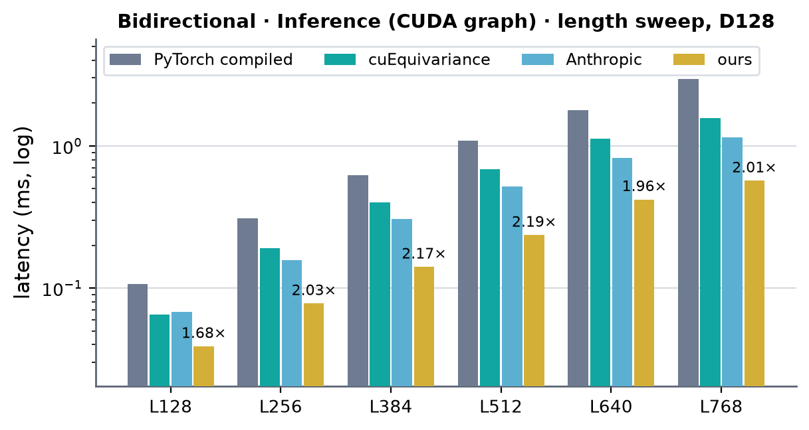 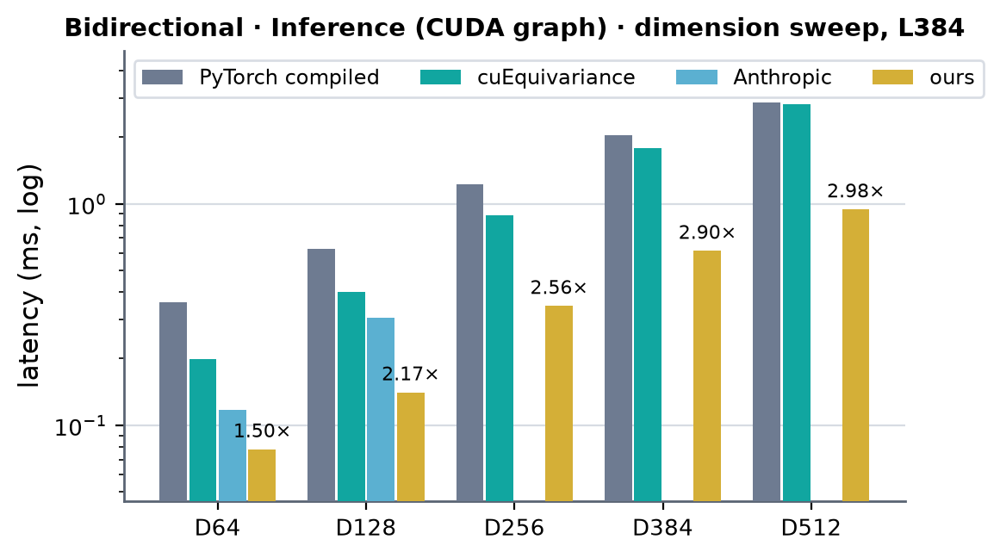 <!-- measure_bars -->

### Bidirectional · Training, dropout 0.25 (CUDA graph)

| (Length, Dimension) | PyTorch compiled | cuEquivariance | Anthropic | ours | × |
|---|---|---|---|---|---|
| (128, 64) | 0.232 | 0.179 | — | 0.120 | 1.50 |
| (256, 64) | 0.587 | 0.402 | — | 0.194 | 2.08 |
| (384, 64) | 1.094 | 0.783 | — | 0.298 | 2.63 |
| (512, 64) | 1.841 | 1.320 | — | 0.476 | 2.77 |
| (640, 64) | 2.817 | 2.045 | — | 0.703 | 2.91 |
| (768, 64) | 4.199 | 2.845 | — | 0.960 | 2.96 |
| (128, 128) | 0.358 | 0.260 | — | 0.172 | 1.51 |
| (256, 128) | 0.979 | 0.730 | — | 0.320 | 2.28 |
| (384, 128) | 2.049 | 1.543 | — | 0.575 | 2.69 |
| (512, 128) | 3.516 | 2.627 | — | 0.969 | 2.71 |
| (640, 128) | 5.582 | 4.143 | — | 1.662 | 2.49 |
| (768, 128) | 9.109 | 5.847 | — | 2.307 | 2.53 |
| (128, 256) | 0.585 | 0.460 | — | 0.300 | 1.53 |
| (256, 256) | 1.865 | 1.485 | — | 0.800 | 1.86 |
| (384, 256) | 3.959 | 3.264 | — | 1.568 | 2.08 |
| (512, 256) | 6.976 | 5.647 | — | 2.734 | 2.07 |
| (640, 256) | 11.826 | 9.209 | — | 4.377 | 2.10 |
| (768, 256) | 20.651 | 13.209 | — | 6.157 | 2.15 |
| (128, 384) | 0.874 | 0.722 | — | 0.431 | 1.67 |
| (256, 384) | 2.962 | 2.506 | — | 1.292 | 1.94 |
| (384, 384) | 6.638 | 5.626 | — | 2.722 | 2.07 |
| (512, 384) | 13.787 | 10.481 | — | 4.605 | 2.28 |
| (640, 384) | 22.928 | 16.636 | — | 7.561 | 2.20 |
| (768, 384) | 39.051 | 23.883 | — | 11.043 | 2.16 |
| (128, 512) | 1.108 | 1.020 | — | 0.549 | 1.86 |
| (256, 512) | 3.867 | 3.772 | — | 1.803 | 2.09 |
| (384, 512) | 9.226 | 8.823 | — | 3.939 | 2.24 |
| (512, 512) | 19.584 | 15.752 | — | 6.680 | 2.36 |
| (640, 512) | 31.952 | 25.537 | — | 11.551 | 2.21 |
| (768, 512) | 53.310 | 35.812 | — | 16.300 | 2.20 |

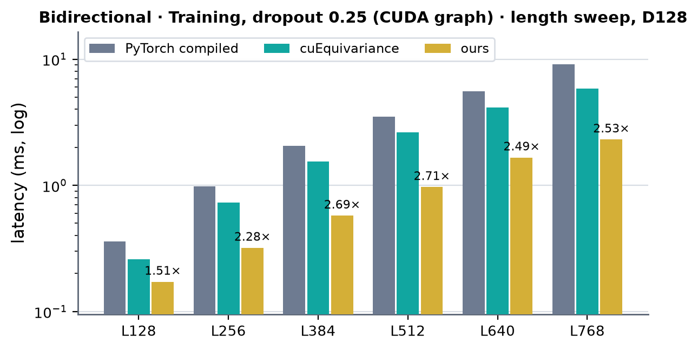 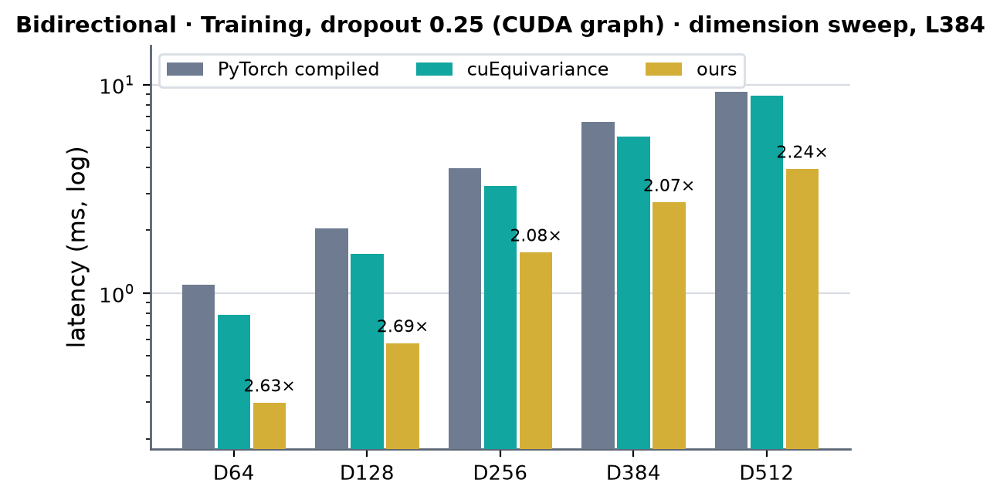 <!-- measure_bars -->

### Bidirectional · Training, dropout 0.25 (no CUDA graph)

| (Length, Dimension) | PyTorch compiled | cuEquivariance | Anthropic | ours | × |
|---|---|---|---|---|---|
| (128, 64) | 0.586 | 0.829 | — | 0.758 | 0.77 |
| (256, 64) | 0.697 | 1.027 | — | 0.625 | 1.12 |
| (384, 64) | 1.211 | 0.887 | — | 0.607 | 1.46 |
| (512, 64) | 1.957 | 1.427 | — | 0.775 | 1.84 |
| (640, 64) | 2.934 | 2.145 | — | 0.759 | 2.83 |
| (768, 64) | 4.280 | 2.949 | — | 1.001 | 2.95 |
| (128, 128) | 0.585 | 1.011 | — | 0.639 | 0.92 |
| (256, 128) | 1.090 | 0.836 | — | 0.774 | 1.08 |
| (384, 128) | 2.172 | 1.647 | — | 0.803 | 2.05 |
| (512, 128) | 3.625 | 2.737 | — | 1.045 | 2.62 |
| (640, 128) | 5.696 | 4.241 | — | 1.606 | 2.64 |
| (768, 128) | 9.157 | 5.929 | — | 2.302 | 2.58 |
| (128, 256) | 0.690 | 0.843 | — | 0.870 | 0.79 |
| (256, 256) | 1.984 | 1.591 | — | 0.876 | 1.82 |
| (384, 256) | 4.089 | 3.329 | — | 1.621 | 2.05 |
| (512, 256) | 7.097 | 5.729 | — | 2.747 | 2.09 |
| (640, 256) | 11.922 | 9.175 | — | 4.320 | 2.12 |
| (768, 256) | 20.287 | 13.294 | — | 6.182 | 2.15 |
| (128, 384) | 0.995 | 1.061 | — | 0.892 | 1.12 |
| (256, 384) | 3.080 | 2.605 | — | 1.334 | 1.95 |
| (384, 384) | 6.721 | 5.957 | — | 2.664 | 2.24 |
| (512, 384) | 14.039 | 10.370 | — | 4.762 | 2.18 |
| (640, 384) | 23.129 | 16.697 | — | 7.780 | 2.15 |
| (768, 384) | 39.144 | 24.135 | — | 11.161 | 2.16 |
| (128, 512) | 1.219 | 1.113 | — | 0.876 | 1.27 |
| (256, 512) | 3.987 | 3.771 | — | 1.939 | 1.95 |
| (384, 512) | 9.280 | 8.819 | — | 3.791 | 2.33 |
| (512, 512) | 19.756 | 15.581 | — | 7.225 | 2.16 |
| (640, 512) | 32.228 | 25.294 | — | 11.586 | 2.18 |
| (768, 512) | 53.520 | 35.464 | — | 16.116 | 2.20 |

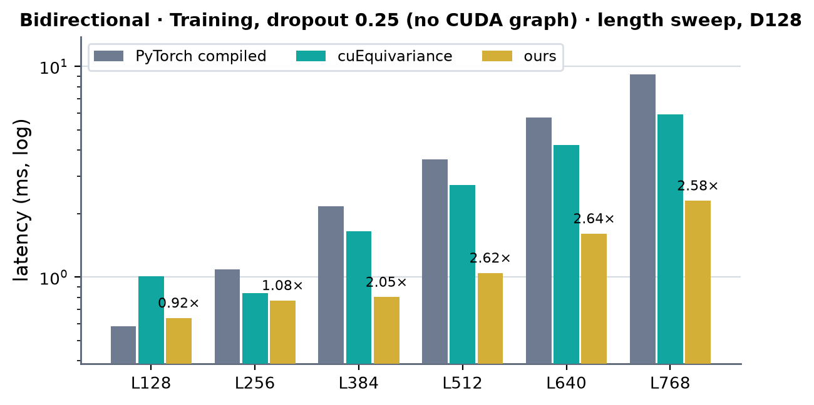 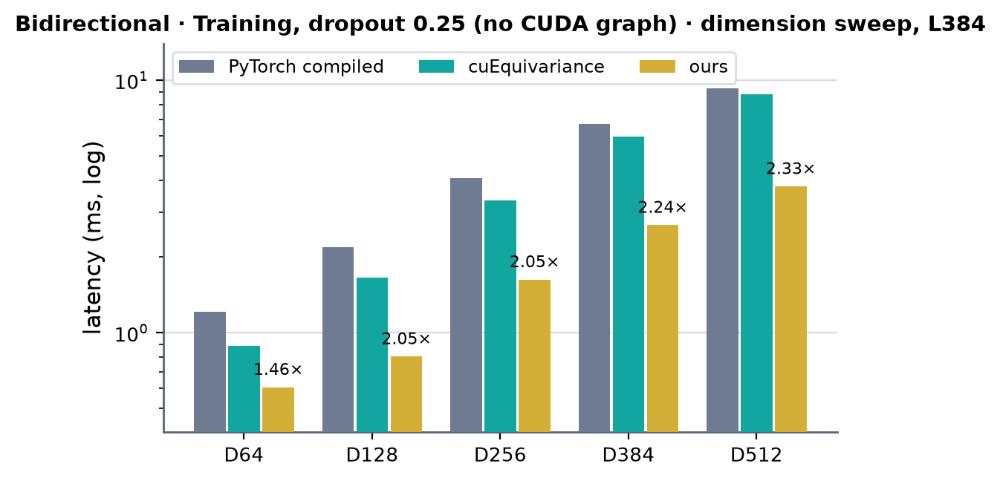 <!-- measure_bars -->

### Single direction (outgoing) · Inference (CUDA graph)

| (Length, Dimension) | PyTorch compiled | cuEquivariance | Anthropic | ours | × |
|---|---|---|---|---|---|
| (128, 64) | 0.049 | 0.035 | 0.022 | 0.022 | 1.00 |
| (256, 64) | 0.117 | 0.068 | 0.041 | 0.035 | 1.18 |
| (384, 64) | 0.211 | 0.127 | 0.070 | 0.051 | 1.36 |
| (512, 64) | 0.336 | 0.213 | 0.119 | 0.082 | 1.45 |
| (640, 64) | 0.530 | 0.330 | 0.188 | 0.125 | 1.51 |
| (768, 64) | 0.848 | 0.453 | 0.254 | 0.166 | 1.53 |
| (128, 128) | 0.070 | 0.043 | 0.039 | 0.029 | 1.36 |
| (256, 128) | 0.168 | 0.090 | 0.088 | 0.053 | 1.66 |
| (384, 128) | 0.381 | 0.176 | 0.170 | 0.092 | 1.84 |
| (512, 128) | 0.606 | 0.309 | 0.294 | 0.153 | 1.91 |
| (640, 128) | 1.056 | 0.483 | 0.467 | 0.250 | 1.87 |
| (768, 128) | 1.678 | 0.670 | 0.647 | 0.354 | 1.83 |
| (128, 256) | 0.108 | 0.059 | 0.082 | 0.045 | 1.32 |
| (256, 256) | 0.330 | 0.162 | 0.254 | 0.109 | 1.49 |
| (384, 256) | 0.668 | 0.365 | 0.512 | 0.231 | 1.58 |
| (512, 256) | 1.176 | 0.631 | 0.878 | 0.416 | 1.52 |
| (640, 256) | 1.955 | 0.986 | 1.391 | 0.675 | 1.46 |
| (768, 256) | 3.129 | 1.459 | 1.957 | 0.954 | 1.53 |
| (128, 384) | 0.149 | 0.147 | 0.180 | 0.063 | 2.33 |
| (256, 384) | 0.522 | 0.535 | 0.579 | 0.184 | 2.83 |
| (384, 384) | 1.060 | 1.288 | 1.260 | 0.414 | 2.56 |
| (512, 384) | 1.924 | 2.331 | 2.180 | 0.710 | 2.71 |
| (640, 384) | 3.138 | 3.599 | 3.437 | 1.197 | 2.62 |
| (768, 384) | 5.098 | 5.152 | 4.868 | 1.537 | 3.17 |
| (128, 512) | 0.190 | 0.215 | — | 0.082 | 2.33 |
| (256, 512) | 0.684 | 0.862 | — | 0.264 | 2.59 |
| (384, 512) | 1.392 | 2.024 | — | 0.588 | 2.37 |
| (512, 512) | 2.495 | 3.558 | — | 1.069 | 2.33 |
| (640, 512) | 4.337 | 5.856 | — | 1.788 | 2.43 |
| (768, 512) | 7.178 | 8.489 | — | 2.396 | 3.00 |

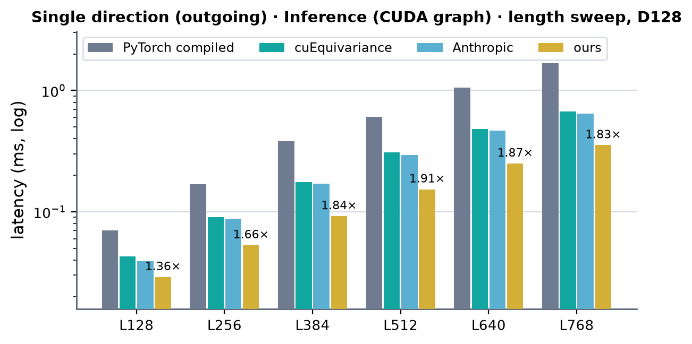 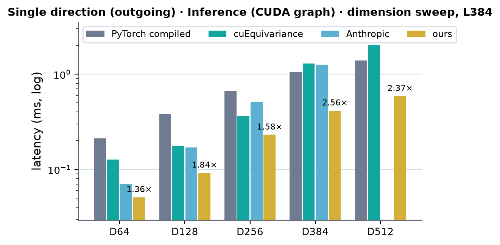 <!-- measure_bars -->

### Single direction (outgoing) · Training, dropout 0.25 (CUDA graph)

| (Length, Dimension) | PyTorch compiled | cuEquivariance | Anthropic | ours | × |
|---|---|---|---|---|---|
| (128, 64) | 0.175 | 0.142 | — | 0.099 | 1.43 |
| (256, 64) | 0.388 | 0.292 | — | 0.145 | 2.01 |
| (384, 64) | 0.693 | 0.525 | — | 0.221 | 2.37 |
| (512, 64) | 1.154 | 0.860 | — | 0.347 | 2.48 |
| (640, 64) | 1.761 | 1.304 | — | 0.514 | 2.54 |
| (768, 64) | 2.536 | 1.804 | — | 0.693 | 2.60 |
| (128, 128) | 0.241 | 0.194 | — | 0.132 | 1.46 |
| (256, 128) | 0.602 | 0.447 | — | 0.239 | 1.88 |
| (384, 128) | 1.221 | 0.970 | — | 0.402 | 2.41 |
| (512, 128) | 2.063 | 1.633 | — | 0.634 | 2.58 |
| (640, 128) | 3.321 | 2.561 | — | 0.992 | 2.58 |
| (768, 128) | 5.054 | 3.559 | — | 1.373 | 2.59 |
| (128, 256) | 0.358 | 0.295 | — | 0.238 | 1.24 |
| (256, 256) | 1.065 | 0.800 | — | 0.543 | 1.47 |
| (384, 256) | 2.248 | 1.646 | — | 1.033 | 1.59 |
| (512, 256) | 3.867 | 2.792 | — | 1.777 | 1.57 |
| (640, 256) | 6.287 | 4.558 | — | 2.713 | 1.68 |
| (768, 256) | 10.163 | 6.793 | — | 3.967 | 1.71 |
| (128, 384) | 0.495 | 0.524 | — | 0.318 | 1.55 |
| (256, 384) | 1.644 | 1.876 | — | 0.833 | 1.98 |
| (384, 384) | 3.459 | 4.266 | — | 1.760 | 1.97 |
| (512, 384) | 6.133 | 7.585 | — | 2.934 | 2.09 |
| (640, 384) | 10.094 | 11.712 | — | 4.782 | 2.11 |
| (768, 384) | 16.469 | 16.203 | — | 6.678 | 2.43 |
| (128, 512) | 0.628 | 0.727 | — | 0.396 | 1.58 |
| (256, 512) | 2.102 | 2.778 | — | 1.180 | 1.78 |
| (384, 512) | 4.575 | 6.307 | — | 2.401 | 1.91 |
| (512, 512) | 8.256 | 11.399 | — | 4.433 | 1.86 |
| (640, 512) | 13.815 | 18.246 | — | 6.957 | 1.99 |
| (768, 512) | 23.348 | 26.028 | — | 9.553 | 2.44 |

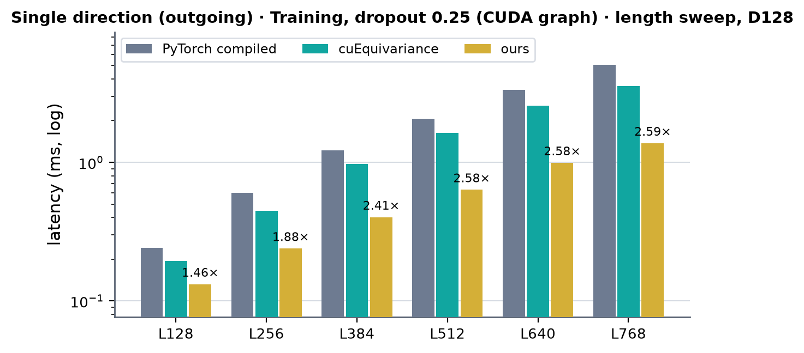 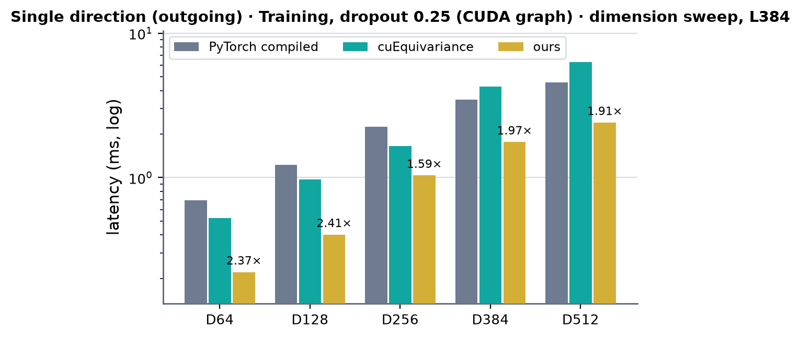 <!-- measure_bars -->

### Single direction (outgoing) · Training, dropout 0.25 (no CUDA graph)

| (Length, Dimension) | PyTorch compiled | cuEquivariance | Anthropic | ours | × |
|---|---|---|---|---|---|
| (128, 64) | 0.549 | 0.907 | — | 0.589 | 0.93 |
| (256, 64) | 0.494 | 0.911 | — | 0.583 | 0.85 |
| (384, 64) | 0.792 | 1.131 | — | 0.713 | 1.11 |
| (512, 64) | 1.252 | 1.110 | — | 0.703 | 1.58 |
| (640, 64) | 1.861 | 1.402 | — | 0.731 | 1.92 |
| (768, 64) | 2.657 | 1.902 | — | 0.753 | 2.53 |
| (128, 128) | 0.460 | 1.161 | — | 0.600 | 0.77 |
| (256, 128) | 0.702 | 1.132 | — | 0.740 | 0.95 |
| (384, 128) | 1.323 | 1.324 | — | 0.847 | 1.56 |
| (512, 128) | 2.163 | 1.728 | — | 0.887 | 1.95 |
| (640, 128) | 3.437 | 2.659 | — | 1.034 | 2.57 |
| (768, 128) | 5.147 | 3.653 | — | 1.421 | 2.57 |
| (128, 256) | 0.612 | 0.598 | — | 0.877 | 0.68 |
| (256, 256) | 1.167 | 0.910 | — | 0.866 | 1.05 |
| (384, 256) | 2.350 | 1.748 | — | 1.125 | 1.55 |
| (512, 256) | 3.977 | 2.906 | — | 1.815 | 1.60 |
| (640, 256) | 6.344 | 4.563 | — | 2.895 | 1.58 |
| (768, 256) | 10.245 | 6.958 | — | 3.875 | 1.80 |
| (128, 384) | 0.603 | 1.102 | — | 0.835 | 0.72 |
| (256, 384) | 1.719 | 1.971 | — | 1.007 | 1.71 |
| (384, 384) | 3.560 | 4.286 | — | 1.797 | 1.98 |
| (512, 384) | 6.233 | 7.386 | — | 3.069 | 2.03 |
| (640, 384) | 9.977 | 12.010 | — | 4.848 | 2.06 |
| (768, 384) | 16.378 | 16.555 | — | 6.851 | 2.39 |
| (128, 512) | 0.734 | 1.135 | — | 0.826 | 0.89 |
| (256, 512) | 2.215 | 2.850 | — | 1.220 | 1.82 |
| (384, 512) | 4.609 | 6.391 | — | 2.572 | 1.79 |
| (512, 512) | 8.283 | 11.480 | — | 4.045 | 2.05 |
| (640, 512) | 14.046 | 18.193 | — | 7.052 | 1.99 |
| (768, 512) | 22.818 | 25.956 | — | 9.548 | 2.39 |

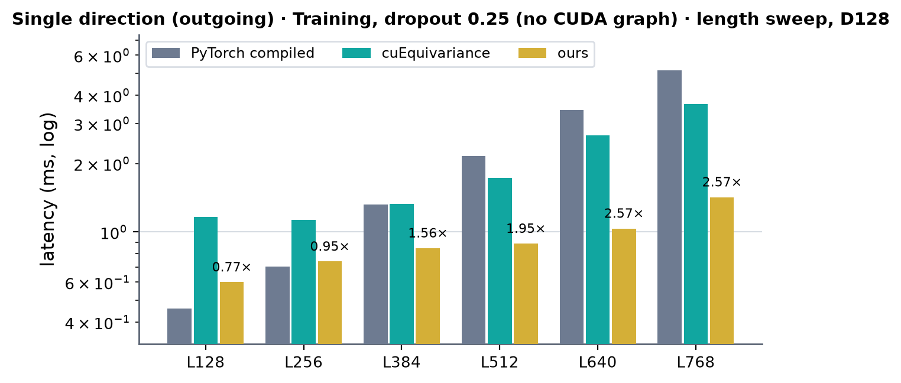 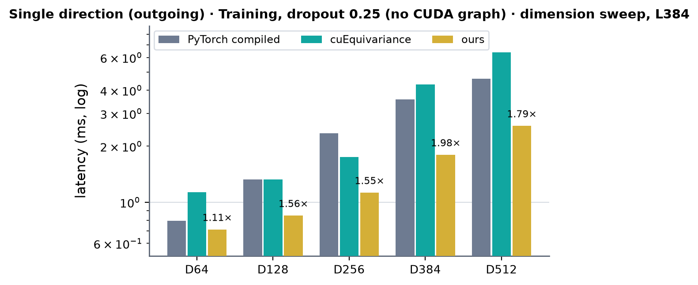 <!-- measure_bars -->

Without a graph, ours costs about 0.6-0.9 ms per training step at L128 (and D64 / D128 one
direction at L256) whatever the width: host-side time (tensor-map encoding, custom-op dispatch,
weight packs, small launches) above the GPU work. Those are the rows where ours loses (× < 1, to
PyTorch compiled or cuEquivariance); from L256-L384 on the GPU work dominates. Reducing the host
path is open.

### Hardware limit (SoL) per kernel

2026-09-30, time roofline (no power readings). Ceilings: HBM 6.75 TB/s (the highest of an elementwise read + write kernel
measured next to every run; 5.8-6.75 run to run) and tensor 2.23 PF/s (resident-operand bf16 MMA; spec 2.25). The sustained
cuBLAS 8192^3 GEMM reaches only 1.42-1.47 PF/s under the card's 1000 W cap and is not the limit: k1w runs above it. Floor =
max(minimum HBM bytes / BW, FLOPs / tensor rate) from each kernel's inputs, outputs and GEMM work; SoL = floor / measured, the
median over 40 CUDA-graph replays of the module step (bf16, masked, dropout 0.25 in training), both modules, every width of the
path. The weight-side kernels (k1w_prep, wide_fold_prep: 2-3 µs, fixed) have no data floor. Script: `sol.py` (B200 scratch).

| path | kernel | bound | L128 | L256 | L384-L768 |
|---|---|---|---|---|---|
| D64 / D128 | k1w | HBM | 18-33 % | 38-55 % | 53-81 % |
| D64 / D128 | k3g (inference / saving) | HBM | 15-23 % | 30-35 % | 39-53 % |
| D64 / D128 | b1s (D64) | HBM | 14-16 % | 29-29 % | 33-40 % |
| D64 / D128 | b1g (D128) | HBM | 17-17 % | 29-32 % | 35-42 % |
| D64 / D128 | b7m (D64) | HBM | 15-17 % | 33-39 % | 44-57 % |
| D64 / D128 | b7g (D128) | HBM | 18-21 % | 26-32 % | 28-43 % |
| D256-D512 | k1w_stats | HBM | 36-59 % | 44-68 % | 48-89 % |
| D256-D512 | k1w | tensor | 34-66 % | 53-70 % | 65-80 % |
| D256-D512 | wide_ln_stats | HBM | 38-56 % | 71-82 % | 73-92 % |
| D256-D512 | k3w (inference / saving) | HBM / tensor | 26-37 % | 32-47 % | 34-50 % |
| D256-D512 | wide_gate_bwd | HBM | 13-24 % | 33-45 % | 45-65 % |
| D256-D512 | wide_lnout_bwd | HBM | 44-55 % | 53-61 % | 56-65 % |
| D256-D512 | k1wb | HBM | 46-53 % | 44-56 % | 52-64 % |
| D256-D512 | wide_ln_apply | HBM | 46-57 % | 68-79 % | 81-93 % |
| D256-D512 | wide_lnin_bwd | HBM | 39-53 % | 51-68 % | 56-87 % |

성능 확인 (kernel tables above, 2026-09-30): ✓ = the fastest measured and SoL >= 70 % (the weight-side prep kernels: ✓);
△ = the fastest measured, SoL below 70 %; ✗ = slower than another implementation (none in the current tables; one direction,
D64, L128 inference ties Anthropic v5 at 22.46 µs, 1.00×). A module cell in [../b200.md](../b200.md) takes the lowest of its
kernels.
