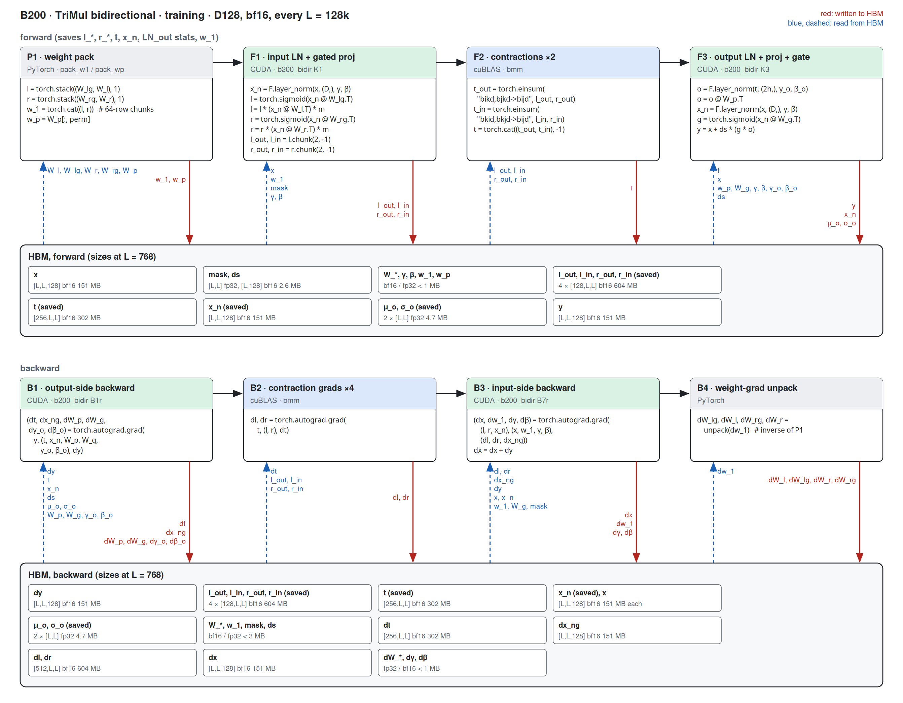

# TriangleMultiplication on B200 (sm100)

Kernel-level status of the TriMul modules on B200; the module-level summary is in
[b200.md](../b200.md). bf16 only; columns are (Length, Dimension). B200 = CUDA where a
hand-written sm_100a path exists; a shape without one is 미구현 (Triton path). Figures: one box
per kernel, left to right, HBM reads (blue, left) and writes (red, right); generated from
`figures/trimul.json` / `figures/trimul_bidir.json` by `python -m miniworld_engine.viz.kernel_flow`,
then converted to PNG (`cairosvg -s 2 -b white`; `rsvg-convert` is not installed on the B200 host).
Dispatch: `integrations/trimul_b200.py`; kernels: `kernels/trimul_inproj/cuda/`
(`b200_infer.py`, `b200_train.py`, `b200_bidir.py`) and `b200_sources/` (tcgen05 / TMEM / TMA).

Both modules share one kernel family: the bidirectional module is the one-direction module at twice
the hidden width (planes P = 4D, contraction output H = 2D), its two contractions taking one half of
the planes each; one direction has P = 2D, H = D. Only D128 bidirectional training keeps its own
kernels (`b200_bidir`: K1 / K3 / B1r / B7r).

Served when `implementation=miniworld`, bf16 contiguous `[1, L, L, D]` input, `d_hidden = D`, LayerNorm
eps 1e-5, compute capability (10, 0), and:
- inference: L a multiple of 16 (with a dropout scale at D <= 128: a multiple of 128);
- training: D64 either direction and D128 one direction: L a multiple of 128 (L <= 10240);
  D128 bidirectional: L a multiple of 128, 148 SMs; D256 / D384 / D512: L a multiple of 16.
Every other shape runs the Triton path.

## Bidirectional (`BidirectionalTriangleMultiplication`)

### Inference

#### Fused path · D64 / D128, every L

##### P1 · weight prep (k1w_prep)

| (Length, Dimension) | (128, 64) | (256, 64) | (384, 64) | (512, 64) | (640, 64) | (768, 64) | (128, 128) | (256, 128) | (384, 128) | (512, 128) | (640, 128) | (768, 128) |
|---|---|---|---|---|---|---|---|---|---|---|---|---|
| implementation | CUDA | CUDA | CUDA | CUDA | CUDA | CUDA | CUDA | CUDA | CUDA | CUDA | CUDA | CUDA |
| 성능 확인 | ✗ | ✗ | ✗ | ✗ | ✗ | ✗ | ✗ | ✗ | ✗ | ✗ | ✗ | ✗ |
| cache build | ✓ | ✓ | ✓ | ✓ | ✓ | ✓ | ✓ | ✓ | ✓ | ✓ | ✓ | ✓ |

##### F1 · input LN + gated proj (k1w)

| (Length, Dimension) | (128, 64) | (256, 64) | (384, 64) | (512, 64) | (640, 64) | (768, 64) | (128, 128) | (256, 128) | (384, 128) | (512, 128) | (640, 128) | (768, 128) |
|---|---|---|---|---|---|---|---|---|---|---|---|---|
| implementation | CUDA | CUDA | CUDA | CUDA | CUDA | CUDA | CUDA | CUDA | CUDA | CUDA | CUDA | CUDA |
| 성능 확인 | ✗ | ✗ | ✗ | ✗ | ✗ | ✗ | ✗ | ✗ | ✗ | ✗ | ✗ | ✗ |
| cache build | ✓ | ✓ | ✓ | ✓ | ✓ | ✓ | ✓ | ✓ | ✓ | ✓ | ✓ | ✓ |

##### F3 · output LN + proj + gate (k3g)

| (Length, Dimension) | (128, 64) | (256, 64) | (384, 64) | (512, 64) | (640, 64) | (768, 64) | (128, 128) | (256, 128) | (384, 128) | (512, 128) | (640, 128) | (768, 128) |
|---|---|---|---|---|---|---|---|---|---|---|---|---|
| implementation | CUDA | CUDA | CUDA | CUDA | CUDA | CUDA | CUDA | CUDA | CUDA | CUDA | CUDA | CUDA |
| 성능 확인 | ✗ | ✗ | ✗ | ✗ | ✗ | ✗ | ✗ | ✗ | ✗ | ✗ | ✗ | ✗ |
| cache build | ✓ | ✓ | ✓ | ✓ | ✓ | ✓ | ✓ | ✓ | ✓ | ✓ | ✓ | ✓ |

#### Wide path · D256 / D384 / D512, every L

##### F0 · input LN stats (k1w_stats)

| (Length, Dimension) | (128, 256) | (256, 256) | (384, 256) | (512, 256) | (640, 256) | (768, 256) | (128, 384) | (256, 384) | (384, 384) | (512, 384) | (640, 384) | (768, 384) | (128, 512) | (256, 512) | (384, 512) | (512, 512) | (640, 512) | (768, 512) |
|---|---|---|---|---|---|---|---|---|---|---|---|---|---|---|---|---|---|---|
| implementation | CUDA | CUDA | CUDA | CUDA | CUDA | CUDA | CUDA | CUDA | CUDA | CUDA | CUDA | CUDA | CUDA | CUDA | CUDA | CUDA | CUDA | CUDA |
| 성능 확인 | ✗ | ✗ | ✗ | ✗ | ✗ | ✗ | ✗ | ✗ | ✗ | ✗ | ✗ | ✗ | ✗ | ✗ | ✗ | ✗ | ✗ | ✗ |
| cache build | ✓ | ✓ | ✓ | ✓ | ✓ | ✓ | ✓ | ✓ | ✓ | ✓ | ✓ | ✓ | ✓ | ✓ | ✓ | ✓ | ✓ | ✓ |

##### F1 · input LN + gated proj (k1w)

| (Length, Dimension) | (128, 256) | (256, 256) | (384, 256) | (512, 256) | (640, 256) | (768, 256) | (128, 384) | (256, 384) | (384, 384) | (512, 384) | (640, 384) | (768, 384) | (128, 512) | (256, 512) | (384, 512) | (512, 512) | (640, 512) | (768, 512) |
|---|---|---|---|---|---|---|---|---|---|---|---|---|---|---|---|---|---|---|
| implementation | CUDA | CUDA | CUDA | CUDA | CUDA | CUDA | CUDA | CUDA | CUDA | CUDA | CUDA | CUDA | CUDA | CUDA | CUDA | CUDA | CUDA | CUDA |
| 성능 확인 | ✗ | ✗ | ✗ | ✗ | ✗ | ✗ | ✗ | ✗ | ✗ | ✗ | ✗ | ✗ | ✗ | ✗ | ✗ | ✗ | ✗ | ✗ |
| cache build | ✓ | ✓ | ✓ | ✓ | ✓ | ✓ | ✓ | ✓ | ✓ | ✓ | ✓ | ✓ | ✓ | ✓ | ✓ | ✓ | ✓ | ✓ |

##### F3 · output LN stats (wide_ln_stats)

| (Length, Dimension) | (128, 256) | (256, 256) | (384, 256) | (512, 256) | (640, 256) | (768, 256) | (128, 384) | (256, 384) | (384, 384) | (512, 384) | (640, 384) | (768, 384) | (128, 512) | (256, 512) | (384, 512) | (512, 512) | (640, 512) | (768, 512) |
|---|---|---|---|---|---|---|---|---|---|---|---|---|---|---|---|---|---|---|
| implementation | CUDA | CUDA | CUDA | CUDA | CUDA | CUDA | CUDA | CUDA | CUDA | CUDA | CUDA | CUDA | CUDA | CUDA | CUDA | CUDA | CUDA | CUDA |
| 성능 확인 | ✗ | ✗ | ✗ | ✗ | ✗ | ✗ | ✗ | ✗ | ✗ | ✗ | ✗ | ✗ | ✗ | ✗ | ✗ | ✗ | ✗ | ✗ |
| cache build | ✓ | ✓ | ✓ | ✓ | ✓ | ✓ | ✓ | ✓ | ✓ | ✓ | ✓ | ✓ | ✓ | ✓ | ✓ | ✓ | ✓ | ✓ |

##### F4 · LN-affine fold (wide_fold_prep)

| (Length, Dimension) | (128, 256) | (256, 256) | (384, 256) | (512, 256) | (640, 256) | (768, 256) | (128, 384) | (256, 384) | (384, 384) | (512, 384) | (640, 384) | (768, 384) | (128, 512) | (256, 512) | (384, 512) | (512, 512) | (640, 512) | (768, 512) |
|---|---|---|---|---|---|---|---|---|---|---|---|---|---|---|---|---|---|---|
| implementation | CUDA | CUDA | CUDA | CUDA | CUDA | CUDA | CUDA | CUDA | CUDA | CUDA | CUDA | CUDA | CUDA | CUDA | CUDA | CUDA | CUDA | CUDA |
| 성능 확인 | ✗ | ✗ | ✗ | ✗ | ✗ | ✗ | ✗ | ✗ | ✗ | ✗ | ✗ | ✗ | ✗ | ✗ | ✗ | ✗ | ✗ | ✗ |
| cache build | ✓ | ✓ | ✓ | ✓ | ✓ | ✓ | ✓ | ✓ | ✓ | ✓ | ✓ | ✓ | ✓ | ✓ | ✓ | ✓ | ✓ | ✓ |

##### F5 · output GEMMs + gate (k3w)

| (Length, Dimension) | (128, 256) | (256, 256) | (384, 256) | (512, 256) | (640, 256) | (768, 256) | (128, 384) | (256, 384) | (384, 384) | (512, 384) | (640, 384) | (768, 384) | (128, 512) | (256, 512) | (384, 512) | (512, 512) | (640, 512) | (768, 512) |
|---|---|---|---|---|---|---|---|---|---|---|---|---|---|---|---|---|---|---|
| implementation | CUDA | CUDA | CUDA | CUDA | CUDA | CUDA | CUDA | CUDA | CUDA | CUDA | CUDA | CUDA | CUDA | CUDA | CUDA | CUDA | CUDA | CUDA |
| 성능 확인 | ✗ | ✗ | ✗ | ✗ | ✗ | ✗ | ✗ | ✗ | ✗ | ✗ | ✗ | ✗ | ✗ | ✗ | ✗ | ✗ | ✗ | ✗ |
| cache build | ✓ | ✓ | ✓ | ✓ | ✓ | ✓ | ✓ | ✓ | ✓ | ✓ | ✓ | ✓ | ✓ | ✓ | ✓ | ✓ | ✓ | ✓ |

### Training

#### Fused path · D64, L = 128 k

##### P1 · weight prep (k1w_prep)

| (Length, Dimension) | (128, 64) | (256, 64) | (384, 64) | (512, 64) | (640, 64) | (768, 64) |
|---|---|---|---|---|---|---|
| implementation | CUDA | CUDA | CUDA | CUDA | CUDA | CUDA |
| 성능 확인 | ✗ | ✗ | ✗ | ✗ | ✗ | ✗ |
| cache build | ✓ | ✓ | ✓ | ✓ | ✓ | ✓ |

##### F1 · input LN + gated proj (k1w)

| (Length, Dimension) | (128, 64) | (256, 64) | (384, 64) | (512, 64) | (640, 64) | (768, 64) |
|---|---|---|---|---|---|---|
| implementation | CUDA | CUDA | CUDA | CUDA | CUDA | CUDA |
| 성능 확인 | ✗ | ✗ | ✗ | ✗ | ✗ | ✗ |
| cache build | ✓ | ✓ | ✓ | ✓ | ✓ | ✓ |

##### F3 · output LN + proj + gate, saving (k3g)

| (Length, Dimension) | (128, 64) | (256, 64) | (384, 64) | (512, 64) | (640, 64) | (768, 64) |
|---|---|---|---|---|---|---|
| implementation | CUDA | CUDA | CUDA | CUDA | CUDA | CUDA |
| 성능 확인 | ✗ | ✗ | ✗ | ✗ | ✗ | ✗ |
| cache build | ✓ | ✓ | ✓ | ✓ | ✓ | ✓ |

##### B1 · output-side backward (b1s D64 / b1g D128)

| (Length, Dimension) | (128, 64) | (256, 64) | (384, 64) | (512, 64) | (640, 64) | (768, 64) |
|---|---|---|---|---|---|---|
| implementation | CUDA | CUDA | CUDA | CUDA | CUDA | CUDA |
| 성능 확인 | ✗ | ✗ | ✗ | ✗ | ✗ | ✗ |
| cache build | ✓ | ✓ | ✓ | ✓ | ✓ | ✓ |

##### B3 · input-side backward (b7m D64 / b7g D128)

| (Length, Dimension) | (128, 64) | (256, 64) | (384, 64) | (512, 64) | (640, 64) | (768, 64) |
|---|---|---|---|---|---|---|
| implementation | CUDA | CUDA | CUDA | CUDA | CUDA | CUDA |
| 성능 확인 | ✗ | ✗ | ✗ | ✗ | ✗ | ✗ |
| cache build | ✓ | ✓ | ✓ | ✓ | ✓ | ✓ |

#### D128 path · L = 128 k

##### F1 · input LN + gated proj (K1)

| (Length, Dimension) | (128, 128) | (256, 128) | (384, 128) | (512, 128) | (640, 128) | (768, 128) |
|---|---|---|---|---|---|---|
| implementation | CUDA | CUDA | CUDA | CUDA | CUDA | CUDA |
| 성능 확인 | ✗ | ✗ | ✗ | ✗ | ✗ | ✗ |
| cache build | ✓ | ✓ | ✓ | ✓ | ✓ | ✓ |

##### F3 · output LN + proj + gate, saving (K3)

| (Length, Dimension) | (128, 128) | (256, 128) | (384, 128) | (512, 128) | (640, 128) | (768, 128) |
|---|---|---|---|---|---|---|
| implementation | CUDA | CUDA | CUDA | CUDA | CUDA | CUDA |
| 성능 확인 | ✗ | ✗ | ✗ | ✗ | ✗ | ✗ |
| cache build | ✓ | ✓ | ✓ | ✓ | ✓ | ✓ |

##### B1 · output-side backward (B1r)

| (Length, Dimension) | (128, 128) | (256, 128) | (384, 128) | (512, 128) | (640, 128) | (768, 128) |
|---|---|---|---|---|---|---|
| implementation | CUDA | CUDA | CUDA | CUDA | CUDA | CUDA |
| 성능 확인 | ✗ | ✗ | ✗ | ✗ | ✗ | ✗ |
| cache build | ✓ | ✓ | ✓ | ✓ | ✓ | ✓ |

##### B3 · input-side backward (B7r)

| (Length, Dimension) | (128, 128) | (256, 128) | (384, 128) | (512, 128) | (640, 128) | (768, 128) |
|---|---|---|---|---|---|---|
| implementation | CUDA | CUDA | CUDA | CUDA | CUDA | CUDA |
| 성능 확인 | ✗ | ✗ | ✗ | ✗ | ✗ | ✗ |
| cache build | ✓ | ✓ | ✓ | ✓ | ✓ | ✓ |

#### Wide path · D256 / D384 / D512, every L

##### F0 · input LN stats (k1w_stats)

| (Length, Dimension) | (128, 256) | (256, 256) | (384, 256) | (512, 256) | (640, 256) | (768, 256) | (128, 384) | (256, 384) | (384, 384) | (512, 384) | (640, 384) | (768, 384) | (128, 512) | (256, 512) | (384, 512) | (512, 512) | (640, 512) | (768, 512) |
|---|---|---|---|---|---|---|---|---|---|---|---|---|---|---|---|---|---|---|
| implementation | CUDA | CUDA | CUDA | CUDA | CUDA | CUDA | CUDA | CUDA | CUDA | CUDA | CUDA | CUDA | CUDA | CUDA | CUDA | CUDA | CUDA | CUDA |
| 성능 확인 | ✗ | ✗ | ✗ | ✗ | ✗ | ✗ | ✗ | ✗ | ✗ | ✗ | ✗ | ✗ | ✗ | ✗ | ✗ | ✗ | ✗ | ✗ |
| cache build | ✓ | ✓ | ✓ | ✓ | ✓ | ✓ | ✓ | ✓ | ✓ | ✓ | ✓ | ✓ | ✓ | ✓ | ✓ | ✓ | ✓ | ✓ |

##### F1 · input LN + gated proj (k1w)

| (Length, Dimension) | (128, 256) | (256, 256) | (384, 256) | (512, 256) | (640, 256) | (768, 256) | (128, 384) | (256, 384) | (384, 384) | (512, 384) | (640, 384) | (768, 384) | (128, 512) | (256, 512) | (384, 512) | (512, 512) | (640, 512) | (768, 512) |
|---|---|---|---|---|---|---|---|---|---|---|---|---|---|---|---|---|---|---|
| implementation | CUDA | CUDA | CUDA | CUDA | CUDA | CUDA | CUDA | CUDA | CUDA | CUDA | CUDA | CUDA | CUDA | CUDA | CUDA | CUDA | CUDA | CUDA |
| 성능 확인 | ✗ | ✗ | ✗ | ✗ | ✗ | ✗ | ✗ | ✗ | ✗ | ✗ | ✗ | ✗ | ✗ | ✗ | ✗ | ✗ | ✗ | ✗ |
| cache build | ✓ | ✓ | ✓ | ✓ | ✓ | ✓ | ✓ | ✓ | ✓ | ✓ | ✓ | ✓ | ✓ | ✓ | ✓ | ✓ | ✓ | ✓ |

##### F3 · output LN stats (wide_ln_stats)

| (Length, Dimension) | (128, 256) | (256, 256) | (384, 256) | (512, 256) | (640, 256) | (768, 256) | (128, 384) | (256, 384) | (384, 384) | (512, 384) | (640, 384) | (768, 384) | (128, 512) | (256, 512) | (384, 512) | (512, 512) | (640, 512) | (768, 512) |
|---|---|---|---|---|---|---|---|---|---|---|---|---|---|---|---|---|---|---|
| implementation | CUDA | CUDA | CUDA | CUDA | CUDA | CUDA | CUDA | CUDA | CUDA | CUDA | CUDA | CUDA | CUDA | CUDA | CUDA | CUDA | CUDA | CUDA |
| 성능 확인 | ✗ | ✗ | ✗ | ✗ | ✗ | ✗ | ✗ | ✗ | ✗ | ✗ | ✗ | ✗ | ✗ | ✗ | ✗ | ✗ | ✗ | ✗ |
| cache build | ✓ | ✓ | ✓ | ✓ | ✓ | ✓ | ✓ | ✓ | ✓ | ✓ | ✓ | ✓ | ✓ | ✓ | ✓ | ✓ | ✓ | ✓ |

##### F4 · LN-affine fold (wide_fold_prep)

| (Length, Dimension) | (128, 256) | (256, 256) | (384, 256) | (512, 256) | (640, 256) | (768, 256) | (128, 384) | (256, 384) | (384, 384) | (512, 384) | (640, 384) | (768, 384) | (128, 512) | (256, 512) | (384, 512) | (512, 512) | (640, 512) | (768, 512) |
|---|---|---|---|---|---|---|---|---|---|---|---|---|---|---|---|---|---|---|
| implementation | CUDA | CUDA | CUDA | CUDA | CUDA | CUDA | CUDA | CUDA | CUDA | CUDA | CUDA | CUDA | CUDA | CUDA | CUDA | CUDA | CUDA | CUDA |
| 성능 확인 | ✗ | ✗ | ✗ | ✗ | ✗ | ✗ | ✗ | ✗ | ✗ | ✗ | ✗ | ✗ | ✗ | ✗ | ✗ | ✗ | ✗ | ✗ |
| cache build | ✓ | ✓ | ✓ | ✓ | ✓ | ✓ | ✓ | ✓ | ✓ | ✓ | ✓ | ✓ | ✓ | ✓ | ✓ | ✓ | ✓ | ✓ |

##### F5 · output GEMMs + gate, saving (k3w)

| (Length, Dimension) | (128, 256) | (256, 256) | (384, 256) | (512, 256) | (640, 256) | (768, 256) | (128, 384) | (256, 384) | (384, 384) | (512, 384) | (640, 384) | (768, 384) | (128, 512) | (256, 512) | (384, 512) | (512, 512) | (640, 512) | (768, 512) |
|---|---|---|---|---|---|---|---|---|---|---|---|---|---|---|---|---|---|---|
| implementation | CUDA | CUDA | CUDA | CUDA | CUDA | CUDA | CUDA | CUDA | CUDA | CUDA | CUDA | CUDA | CUDA | CUDA | CUDA | CUDA | CUDA | CUDA |
| 성능 확인 | ✗ | ✗ | ✗ | ✗ | ✗ | ✗ | ✗ | ✗ | ✗ | ✗ | ✗ | ✗ | ✗ | ✗ | ✗ | ✗ | ✗ | ✗ |
| cache build | ✓ | ✓ | ✓ | ✓ | ✓ | ✓ | ✓ | ✓ | ✓ | ✓ | ✓ | ✓ | ✓ | ✓ | ✓ | ✓ | ✓ | ✓ |

##### B1 · gate backward (wide_gate_bwd)

| (Length, Dimension) | (128, 256) | (256, 256) | (384, 256) | (512, 256) | (640, 256) | (768, 256) | (128, 384) | (256, 384) | (384, 384) | (512, 384) | (640, 384) | (768, 384) | (128, 512) | (256, 512) | (384, 512) | (512, 512) | (640, 512) | (768, 512) |
|---|---|---|---|---|---|---|---|---|---|---|---|---|---|---|---|---|---|---|
| implementation | CUDA | CUDA | CUDA | CUDA | CUDA | CUDA | CUDA | CUDA | CUDA | CUDA | CUDA | CUDA | CUDA | CUDA | CUDA | CUDA | CUDA | CUDA |
| 성능 확인 | ✗ | ✗ | ✗ | ✗ | ✗ | ✗ | ✗ | ✗ | ✗ | ✗ | ✗ | ✗ | ✗ | ✗ | ✗ | ✗ | ✗ | ✗ |
| cache build | ✓ | ✓ | ✓ | ✓ | ✓ | ✓ | ✓ | ✓ | ✓ | ✓ | ✓ | ✓ | ✓ | ✓ | ✓ | ✓ | ✓ | ✓ |

##### B3 · output-LN backward (wide_lnout_bwd)

| (Length, Dimension) | (128, 256) | (256, 256) | (384, 256) | (512, 256) | (640, 256) | (768, 256) | (128, 384) | (256, 384) | (384, 384) | (512, 384) | (640, 384) | (768, 384) | (128, 512) | (256, 512) | (384, 512) | (512, 512) | (640, 512) | (768, 512) |
|---|---|---|---|---|---|---|---|---|---|---|---|---|---|---|---|---|---|---|
| implementation | CUDA | CUDA | CUDA | CUDA | CUDA | CUDA | CUDA | CUDA | CUDA | CUDA | CUDA | CUDA | CUDA | CUDA | CUDA | CUDA | CUDA | CUDA |
| 성능 확인 | ✗ | ✗ | ✗ | ✗ | ✗ | ✗ | ✗ | ✗ | ✗ | ✗ | ✗ | ✗ | ✗ | ✗ | ✗ | ✗ | ✗ | ✗ |
| cache build | ✓ | ✓ | ✓ | ✓ | ✓ | ✓ | ✓ | ✓ | ✓ | ✓ | ✓ | ✓ | ✓ | ✓ | ✓ | ✓ | ✓ | ✓ |

##### B5 · front backward (k1wb)

| (Length, Dimension) | (128, 256) | (256, 256) | (384, 256) | (512, 256) | (640, 256) | (768, 256) | (128, 384) | (256, 384) | (384, 384) | (512, 384) | (640, 384) | (768, 384) | (128, 512) | (256, 512) | (384, 512) | (512, 512) | (640, 512) | (768, 512) |
|---|---|---|---|---|---|---|---|---|---|---|---|---|---|---|---|---|---|---|
| implementation | CUDA | CUDA | CUDA | CUDA | CUDA | CUDA | CUDA | CUDA | CUDA | CUDA | CUDA | CUDA | CUDA | CUDA | CUDA | CUDA | CUDA | CUDA |
| 성능 확인 | ✗ | ✗ | ✗ | ✗ | ✗ | ✗ | ✗ | ✗ | ✗ | ✗ | ✗ | ✗ | ✗ | ✗ | ✗ | ✗ | ✗ | ✗ |
| cache build | ✓ | ✓ | ✓ | ✓ | ✓ | ✓ | ✓ | ✓ | ✓ | ✓ | ✓ | ✓ | ✓ | ✓ | ✓ | ✓ | ✓ | ✓ |

##### B6 · input LN apply (wide_ln_apply)

| (Length, Dimension) | (128, 256) | (256, 256) | (384, 256) | (512, 256) | (640, 256) | (768, 256) | (128, 384) | (256, 384) | (384, 384) | (512, 384) | (640, 384) | (768, 384) | (128, 512) | (256, 512) | (384, 512) | (512, 512) | (640, 512) | (768, 512) |
|---|---|---|---|---|---|---|---|---|---|---|---|---|---|---|---|---|---|---|
| implementation | CUDA | CUDA | CUDA | CUDA | CUDA | CUDA | CUDA | CUDA | CUDA | CUDA | CUDA | CUDA | CUDA | CUDA | CUDA | CUDA | CUDA | CUDA |
| 성능 확인 | ✗ | ✗ | ✗ | ✗ | ✗ | ✗ | ✗ | ✗ | ✗ | ✗ | ✗ | ✗ | ✗ | ✗ | ✗ | ✗ | ✗ | ✗ |
| cache build | ✓ | ✓ | ✓ | ✓ | ✓ | ✓ | ✓ | ✓ | ✓ | ✓ | ✓ | ✓ | ✓ | ✓ | ✓ | ✓ | ✓ | ✓ |

##### B8 · input-LN backward (wide_lnin_bwd)

| (Length, Dimension) | (128, 256) | (256, 256) | (384, 256) | (512, 256) | (640, 256) | (768, 256) | (128, 384) | (256, 384) | (384, 384) | (512, 384) | (640, 384) | (768, 384) | (128, 512) | (256, 512) | (384, 512) | (512, 512) | (640, 512) | (768, 512) |
|---|---|---|---|---|---|---|---|---|---|---|---|---|---|---|---|---|---|---|
| implementation | CUDA | CUDA | CUDA | CUDA | CUDA | CUDA | CUDA | CUDA | CUDA | CUDA | CUDA | CUDA | CUDA | CUDA | CUDA | CUDA | CUDA | CUDA |
| 성능 확인 | ✗ | ✗ | ✗ | ✗ | ✗ | ✗ | ✗ | ✗ | ✗ | ✗ | ✗ | ✗ | ✗ | ✗ | ✗ | ✗ | ✗ | ✗ |
| cache build | ✓ | ✓ | ✓ | ✓ | ✓ | ✓ | ✓ | ✓ | ✓ | ✓ | ✓ | ✓ | ✓ | ✓ | ✓ | ✓ | ✓ | ✓ |

## Single direction (`TriangleMultiplication`)

Outgoing and incoming run the same kernels (the contraction's operand order differs); the tables
cover both.

### Inference

#### Fused path · D64 / D128, every L

##### P1 · weight prep (k1w_prep)

| (Length, Dimension) | (128, 64) | (256, 64) | (384, 64) | (512, 64) | (640, 64) | (768, 64) | (128, 128) | (256, 128) | (384, 128) | (512, 128) | (640, 128) | (768, 128) |
|---|---|---|---|---|---|---|---|---|---|---|---|---|
| implementation | CUDA | CUDA | CUDA | CUDA | CUDA | CUDA | CUDA | CUDA | CUDA | CUDA | CUDA | CUDA |
| 성능 확인 | ✗ | ✗ | ✗ | ✗ | ✗ | ✗ | ✗ | ✗ | ✗ | ✗ | ✗ | ✗ |
| cache build | ✓ | ✓ | ✓ | ✓ | ✓ | ✓ | ✓ | ✓ | ✓ | ✓ | ✓ | ✓ |

##### F1 · input LN + gated proj (k1w)

| (Length, Dimension) | (128, 64) | (256, 64) | (384, 64) | (512, 64) | (640, 64) | (768, 64) | (128, 128) | (256, 128) | (384, 128) | (512, 128) | (640, 128) | (768, 128) |
|---|---|---|---|---|---|---|---|---|---|---|---|---|
| implementation | CUDA | CUDA | CUDA | CUDA | CUDA | CUDA | CUDA | CUDA | CUDA | CUDA | CUDA | CUDA |
| 성능 확인 | ✗ | ✗ | ✗ | ✗ | ✗ | ✗ | ✗ | ✗ | ✗ | ✗ | ✗ | ✗ |
| cache build | ✓ | ✓ | ✓ | ✓ | ✓ | ✓ | ✓ | ✓ | ✓ | ✓ | ✓ | ✓ |

##### F3 · output LN + proj + gate (k3g)

| (Length, Dimension) | (128, 64) | (256, 64) | (384, 64) | (512, 64) | (640, 64) | (768, 64) | (128, 128) | (256, 128) | (384, 128) | (512, 128) | (640, 128) | (768, 128) |
|---|---|---|---|---|---|---|---|---|---|---|---|---|
| implementation | CUDA | CUDA | CUDA | CUDA | CUDA | CUDA | CUDA | CUDA | CUDA | CUDA | CUDA | CUDA |
| 성능 확인 | ✗ | ✗ | ✗ | ✗ | ✗ | ✗ | ✗ | ✗ | ✗ | ✗ | ✗ | ✗ |
| cache build | ✓ | ✓ | ✓ | ✓ | ✓ | ✓ | ✓ | ✓ | ✓ | ✓ | ✓ | ✓ |

#### Wide path · D256 / D384 / D512, every L

D512 is not a registered single-direction shape; the path serves it anyway.

##### F0 · input LN stats (k1w_stats)

| (Length, Dimension) | (128, 256) | (256, 256) | (384, 256) | (512, 256) | (640, 256) | (768, 256) | (128, 384) | (256, 384) | (384, 384) | (512, 384) | (640, 384) | (768, 384) | (128, 512) | (256, 512) | (384, 512) | (512, 512) | (640, 512) | (768, 512) |
|---|---|---|---|---|---|---|---|---|---|---|---|---|---|---|---|---|---|---|
| implementation | CUDA | CUDA | CUDA | CUDA | CUDA | CUDA | CUDA | CUDA | CUDA | CUDA | CUDA | CUDA | CUDA | CUDA | CUDA | CUDA | CUDA | CUDA |
| 성능 확인 | ✗ | ✗ | ✗ | ✗ | ✗ | ✗ | ✗ | ✗ | ✗ | ✗ | ✗ | ✗ | ✗ | ✗ | ✗ | ✗ | ✗ | ✗ |
| cache build | ✓ | ✓ | ✓ | ✓ | ✓ | ✓ | ✓ | ✓ | ✓ | ✓ | ✓ | ✓ | ✓ | ✓ | ✓ | ✓ | ✓ | ✓ |

##### F1 · input LN + gated proj (k1w)

| (Length, Dimension) | (128, 256) | (256, 256) | (384, 256) | (512, 256) | (640, 256) | (768, 256) | (128, 384) | (256, 384) | (384, 384) | (512, 384) | (640, 384) | (768, 384) | (128, 512) | (256, 512) | (384, 512) | (512, 512) | (640, 512) | (768, 512) |
|---|---|---|---|---|---|---|---|---|---|---|---|---|---|---|---|---|---|---|
| implementation | CUDA | CUDA | CUDA | CUDA | CUDA | CUDA | CUDA | CUDA | CUDA | CUDA | CUDA | CUDA | CUDA | CUDA | CUDA | CUDA | CUDA | CUDA |
| 성능 확인 | ✗ | ✗ | ✗ | ✗ | ✗ | ✗ | ✗ | ✗ | ✗ | ✗ | ✗ | ✗ | ✗ | ✗ | ✗ | ✗ | ✗ | ✗ |
| cache build | ✓ | ✓ | ✓ | ✓ | ✓ | ✓ | ✓ | ✓ | ✓ | ✓ | ✓ | ✓ | ✓ | ✓ | ✓ | ✓ | ✓ | ✓ |

##### F3 · output LN stats (wide_ln_stats)

| (Length, Dimension) | (128, 256) | (256, 256) | (384, 256) | (512, 256) | (640, 256) | (768, 256) | (128, 384) | (256, 384) | (384, 384) | (512, 384) | (640, 384) | (768, 384) | (128, 512) | (256, 512) | (384, 512) | (512, 512) | (640, 512) | (768, 512) |
|---|---|---|---|---|---|---|---|---|---|---|---|---|---|---|---|---|---|---|
| implementation | CUDA | CUDA | CUDA | CUDA | CUDA | CUDA | CUDA | CUDA | CUDA | CUDA | CUDA | CUDA | CUDA | CUDA | CUDA | CUDA | CUDA | CUDA |
| 성능 확인 | ✗ | ✗ | ✗ | ✗ | ✗ | ✗ | ✗ | ✗ | ✗ | ✗ | ✗ | ✗ | ✗ | ✗ | ✗ | ✗ | ✗ | ✗ |
| cache build | ✓ | ✓ | ✓ | ✓ | ✓ | ✓ | ✓ | ✓ | ✓ | ✓ | ✓ | ✓ | ✓ | ✓ | ✓ | ✓ | ✓ | ✓ |

##### F4 · LN-affine fold (wide_fold_prep)

| (Length, Dimension) | (128, 256) | (256, 256) | (384, 256) | (512, 256) | (640, 256) | (768, 256) | (128, 384) | (256, 384) | (384, 384) | (512, 384) | (640, 384) | (768, 384) | (128, 512) | (256, 512) | (384, 512) | (512, 512) | (640, 512) | (768, 512) |
|---|---|---|---|---|---|---|---|---|---|---|---|---|---|---|---|---|---|---|
| implementation | CUDA | CUDA | CUDA | CUDA | CUDA | CUDA | CUDA | CUDA | CUDA | CUDA | CUDA | CUDA | CUDA | CUDA | CUDA | CUDA | CUDA | CUDA |
| 성능 확인 | ✗ | ✗ | ✗ | ✗ | ✗ | ✗ | ✗ | ✗ | ✗ | ✗ | ✗ | ✗ | ✗ | ✗ | ✗ | ✗ | ✗ | ✗ |
| cache build | ✓ | ✓ | ✓ | ✓ | ✓ | ✓ | ✓ | ✓ | ✓ | ✓ | ✓ | ✓ | ✓ | ✓ | ✓ | ✓ | ✓ | ✓ |

##### F5 · output GEMMs + gate (k3w)

| (Length, Dimension) | (128, 256) | (256, 256) | (384, 256) | (512, 256) | (640, 256) | (768, 256) | (128, 384) | (256, 384) | (384, 384) | (512, 384) | (640, 384) | (768, 384) | (128, 512) | (256, 512) | (384, 512) | (512, 512) | (640, 512) | (768, 512) |
|---|---|---|---|---|---|---|---|---|---|---|---|---|---|---|---|---|---|---|
| implementation | CUDA | CUDA | CUDA | CUDA | CUDA | CUDA | CUDA | CUDA | CUDA | CUDA | CUDA | CUDA | CUDA | CUDA | CUDA | CUDA | CUDA | CUDA |
| 성능 확인 | ✗ | ✗ | ✗ | ✗ | ✗ | ✗ | ✗ | ✗ | ✗ | ✗ | ✗ | ✗ | ✗ | ✗ | ✗ | ✗ | ✗ | ✗ |
| cache build | ✓ | ✓ | ✓ | ✓ | ✓ | ✓ | ✓ | ✓ | ✓ | ✓ | ✓ | ✓ | ✓ | ✓ | ✓ | ✓ | ✓ | ✓ |

### Training

#### Fused path · D64 / D128, L = 128 k

##### P1 · weight prep (k1w_prep)

| (Length, Dimension) | (128, 64) | (256, 64) | (384, 64) | (512, 64) | (640, 64) | (768, 64) | (128, 128) | (256, 128) | (384, 128) | (512, 128) | (640, 128) | (768, 128) |
|---|---|---|---|---|---|---|---|---|---|---|---|---|
| implementation | CUDA | CUDA | CUDA | CUDA | CUDA | CUDA | CUDA | CUDA | CUDA | CUDA | CUDA | CUDA |
| 성능 확인 | ✗ | ✗ | ✗ | ✗ | ✗ | ✗ | ✗ | ✗ | ✗ | ✗ | ✗ | ✗ |
| cache build | ✓ | ✓ | ✓ | ✓ | ✓ | ✓ | ✓ | ✓ | ✓ | ✓ | ✓ | ✓ |

##### F1 · input LN + gated proj (k1w)

| (Length, Dimension) | (128, 64) | (256, 64) | (384, 64) | (512, 64) | (640, 64) | (768, 64) | (128, 128) | (256, 128) | (384, 128) | (512, 128) | (640, 128) | (768, 128) |
|---|---|---|---|---|---|---|---|---|---|---|---|---|
| implementation | CUDA | CUDA | CUDA | CUDA | CUDA | CUDA | CUDA | CUDA | CUDA | CUDA | CUDA | CUDA |
| 성능 확인 | ✗ | ✗ | ✗ | ✗ | ✗ | ✗ | ✗ | ✗ | ✗ | ✗ | ✗ | ✗ |
| cache build | ✓ | ✓ | ✓ | ✓ | ✓ | ✓ | ✓ | ✓ | ✓ | ✓ | ✓ | ✓ |

##### F3 · output LN + proj + gate, saving (k3g)

| (Length, Dimension) | (128, 64) | (256, 64) | (384, 64) | (512, 64) | (640, 64) | (768, 64) | (128, 128) | (256, 128) | (384, 128) | (512, 128) | (640, 128) | (768, 128) |
|---|---|---|---|---|---|---|---|---|---|---|---|---|
| implementation | CUDA | CUDA | CUDA | CUDA | CUDA | CUDA | CUDA | CUDA | CUDA | CUDA | CUDA | CUDA |
| 성능 확인 | ✗ | ✗ | ✗ | ✗ | ✗ | ✗ | ✗ | ✗ | ✗ | ✗ | ✗ | ✗ |
| cache build | ✓ | ✓ | ✓ | ✓ | ✓ | ✓ | ✓ | ✓ | ✓ | ✓ | ✓ | ✓ |

##### B1 · output-side backward (b1s D64 / b1g D128)

| (Length, Dimension) | (128, 64) | (256, 64) | (384, 64) | (512, 64) | (640, 64) | (768, 64) | (128, 128) | (256, 128) | (384, 128) | (512, 128) | (640, 128) | (768, 128) |
|---|---|---|---|---|---|---|---|---|---|---|---|---|
| implementation | CUDA | CUDA | CUDA | CUDA | CUDA | CUDA | CUDA | CUDA | CUDA | CUDA | CUDA | CUDA |
| 성능 확인 | ✗ | ✗ | ✗ | ✗ | ✗ | ✗ | ✗ | ✗ | ✗ | ✗ | ✗ | ✗ |
| cache build | ✓ | ✓ | ✓ | ✓ | ✓ | ✓ | ✓ | ✓ | ✓ | ✓ | ✓ | ✓ |

##### B3 · input-side backward (b7m D64 / b7g D128)

| (Length, Dimension) | (128, 64) | (256, 64) | (384, 64) | (512, 64) | (640, 64) | (768, 64) | (128, 128) | (256, 128) | (384, 128) | (512, 128) | (640, 128) | (768, 128) |
|---|---|---|---|---|---|---|---|---|---|---|---|---|
| implementation | CUDA | CUDA | CUDA | CUDA | CUDA | CUDA | CUDA | CUDA | CUDA | CUDA | CUDA | CUDA |
| 성능 확인 | ✗ | ✗ | ✗ | ✗ | ✗ | ✗ | ✗ | ✗ | ✗ | ✗ | ✗ | ✗ |
| cache build | ✓ | ✓ | ✓ | ✓ | ✓ | ✓ | ✓ | ✓ | ✓ | ✓ | ✓ | ✓ |

#### Wide path · D256 / D384 / D512, every L

##### F0 · input LN stats (k1w_stats)

| (Length, Dimension) | (128, 256) | (256, 256) | (384, 256) | (512, 256) | (640, 256) | (768, 256) | (128, 384) | (256, 384) | (384, 384) | (512, 384) | (640, 384) | (768, 384) | (128, 512) | (256, 512) | (384, 512) | (512, 512) | (640, 512) | (768, 512) |
|---|---|---|---|---|---|---|---|---|---|---|---|---|---|---|---|---|---|---|
| implementation | CUDA | CUDA | CUDA | CUDA | CUDA | CUDA | CUDA | CUDA | CUDA | CUDA | CUDA | CUDA | CUDA | CUDA | CUDA | CUDA | CUDA | CUDA |
| 성능 확인 | ✗ | ✗ | ✗ | ✗ | ✗ | ✗ | ✗ | ✗ | ✗ | ✗ | ✗ | ✗ | ✗ | ✗ | ✗ | ✗ | ✗ | ✗ |
| cache build | ✓ | ✓ | ✓ | ✓ | ✓ | ✓ | ✓ | ✓ | ✓ | ✓ | ✓ | ✓ | ✓ | ✓ | ✓ | ✓ | ✓ | ✓ |

##### F1 · input LN + gated proj (k1w)

| (Length, Dimension) | (128, 256) | (256, 256) | (384, 256) | (512, 256) | (640, 256) | (768, 256) | (128, 384) | (256, 384) | (384, 384) | (512, 384) | (640, 384) | (768, 384) | (128, 512) | (256, 512) | (384, 512) | (512, 512) | (640, 512) | (768, 512) |
|---|---|---|---|---|---|---|---|---|---|---|---|---|---|---|---|---|---|---|
| implementation | CUDA | CUDA | CUDA | CUDA | CUDA | CUDA | CUDA | CUDA | CUDA | CUDA | CUDA | CUDA | CUDA | CUDA | CUDA | CUDA | CUDA | CUDA |
| 성능 확인 | ✗ | ✗ | ✗ | ✗ | ✗ | ✗ | ✗ | ✗ | ✗ | ✗ | ✗ | ✗ | ✗ | ✗ | ✗ | ✗ | ✗ | ✗ |
| cache build | ✓ | ✓ | ✓ | ✓ | ✓ | ✓ | ✓ | ✓ | ✓ | ✓ | ✓ | ✓ | ✓ | ✓ | ✓ | ✓ | ✓ | ✓ |

##### F3 · output LN stats (wide_ln_stats)

| (Length, Dimension) | (128, 256) | (256, 256) | (384, 256) | (512, 256) | (640, 256) | (768, 256) | (128, 384) | (256, 384) | (384, 384) | (512, 384) | (640, 384) | (768, 384) | (128, 512) | (256, 512) | (384, 512) | (512, 512) | (640, 512) | (768, 512) |
|---|---|---|---|---|---|---|---|---|---|---|---|---|---|---|---|---|---|---|
| implementation | CUDA | CUDA | CUDA | CUDA | CUDA | CUDA | CUDA | CUDA | CUDA | CUDA | CUDA | CUDA | CUDA | CUDA | CUDA | CUDA | CUDA | CUDA |
| 성능 확인 | ✗ | ✗ | ✗ | ✗ | ✗ | ✗ | ✗ | ✗ | ✗ | ✗ | ✗ | ✗ | ✗ | ✗ | ✗ | ✗ | ✗ | ✗ |
| cache build | ✓ | ✓ | ✓ | ✓ | ✓ | ✓ | ✓ | ✓ | ✓ | ✓ | ✓ | ✓ | ✓ | ✓ | ✓ | ✓ | ✓ | ✓ |

##### F4 · LN-affine fold (wide_fold_prep)

| (Length, Dimension) | (128, 256) | (256, 256) | (384, 256) | (512, 256) | (640, 256) | (768, 256) | (128, 384) | (256, 384) | (384, 384) | (512, 384) | (640, 384) | (768, 384) | (128, 512) | (256, 512) | (384, 512) | (512, 512) | (640, 512) | (768, 512) |
|---|---|---|---|---|---|---|---|---|---|---|---|---|---|---|---|---|---|---|
| implementation | CUDA | CUDA | CUDA | CUDA | CUDA | CUDA | CUDA | CUDA | CUDA | CUDA | CUDA | CUDA | CUDA | CUDA | CUDA | CUDA | CUDA | CUDA |
| 성능 확인 | ✗ | ✗ | ✗ | ✗ | ✗ | ✗ | ✗ | ✗ | ✗ | ✗ | ✗ | ✗ | ✗ | ✗ | ✗ | ✗ | ✗ | ✗ |
| cache build | ✓ | ✓ | ✓ | ✓ | ✓ | ✓ | ✓ | ✓ | ✓ | ✓ | ✓ | ✓ | ✓ | ✓ | ✓ | ✓ | ✓ | ✓ |

##### F5 · output GEMMs + gate, saving (k3w)

| (Length, Dimension) | (128, 256) | (256, 256) | (384, 256) | (512, 256) | (640, 256) | (768, 256) | (128, 384) | (256, 384) | (384, 384) | (512, 384) | (640, 384) | (768, 384) | (128, 512) | (256, 512) | (384, 512) | (512, 512) | (640, 512) | (768, 512) |
|---|---|---|---|---|---|---|---|---|---|---|---|---|---|---|---|---|---|---|
| implementation | CUDA | CUDA | CUDA | CUDA | CUDA | CUDA | CUDA | CUDA | CUDA | CUDA | CUDA | CUDA | CUDA | CUDA | CUDA | CUDA | CUDA | CUDA |
| 성능 확인 | ✗ | ✗ | ✗ | ✗ | ✗ | ✗ | ✗ | ✗ | ✗ | ✗ | ✗ | ✗ | ✗ | ✗ | ✗ | ✗ | ✗ | ✗ |
| cache build | ✓ | ✓ | ✓ | ✓ | ✓ | ✓ | ✓ | ✓ | ✓ | ✓ | ✓ | ✓ | ✓ | ✓ | ✓ | ✓ | ✓ | ✓ |

##### B1 · gate backward (wide_gate_bwd)

| (Length, Dimension) | (128, 256) | (256, 256) | (384, 256) | (512, 256) | (640, 256) | (768, 256) | (128, 384) | (256, 384) | (384, 384) | (512, 384) | (640, 384) | (768, 384) | (128, 512) | (256, 512) | (384, 512) | (512, 512) | (640, 512) | (768, 512) |
|---|---|---|---|---|---|---|---|---|---|---|---|---|---|---|---|---|---|---|
| implementation | CUDA | CUDA | CUDA | CUDA | CUDA | CUDA | CUDA | CUDA | CUDA | CUDA | CUDA | CUDA | CUDA | CUDA | CUDA | CUDA | CUDA | CUDA |
| 성능 확인 | ✗ | ✗ | ✗ | ✗ | ✗ | ✗ | ✗ | ✗ | ✗ | ✗ | ✗ | ✗ | ✗ | ✗ | ✗ | ✗ | ✗ | ✗ |
| cache build | ✓ | ✓ | ✓ | ✓ | ✓ | ✓ | ✓ | ✓ | ✓ | ✓ | ✓ | ✓ | ✓ | ✓ | ✓ | ✓ | ✓ | ✓ |

##### B3 · output-LN backward (wide_lnout_bwd)

| (Length, Dimension) | (128, 256) | (256, 256) | (384, 256) | (512, 256) | (640, 256) | (768, 256) | (128, 384) | (256, 384) | (384, 384) | (512, 384) | (640, 384) | (768, 384) | (128, 512) | (256, 512) | (384, 512) | (512, 512) | (640, 512) | (768, 512) |
|---|---|---|---|---|---|---|---|---|---|---|---|---|---|---|---|---|---|---|
| implementation | CUDA | CUDA | CUDA | CUDA | CUDA | CUDA | CUDA | CUDA | CUDA | CUDA | CUDA | CUDA | CUDA | CUDA | CUDA | CUDA | CUDA | CUDA |
| 성능 확인 | ✗ | ✗ | ✗ | ✗ | ✗ | ✗ | ✗ | ✗ | ✗ | ✗ | ✗ | ✗ | ✗ | ✗ | ✗ | ✗ | ✗ | ✗ |
| cache build | ✓ | ✓ | ✓ | ✓ | ✓ | ✓ | ✓ | ✓ | ✓ | ✓ | ✓ | ✓ | ✓ | ✓ | ✓ | ✓ | ✓ | ✓ |

##### B5 · front backward (k1wb)

| (Length, Dimension) | (128, 256) | (256, 256) | (384, 256) | (512, 256) | (640, 256) | (768, 256) | (128, 384) | (256, 384) | (384, 384) | (512, 384) | (640, 384) | (768, 384) | (128, 512) | (256, 512) | (384, 512) | (512, 512) | (640, 512) | (768, 512) |
|---|---|---|---|---|---|---|---|---|---|---|---|---|---|---|---|---|---|---|
| implementation | CUDA | CUDA | CUDA | CUDA | CUDA | CUDA | CUDA | CUDA | CUDA | CUDA | CUDA | CUDA | CUDA | CUDA | CUDA | CUDA | CUDA | CUDA |
| 성능 확인 | ✗ | ✗ | ✗ | ✗ | ✗ | ✗ | ✗ | ✗ | ✗ | ✗ | ✗ | ✗ | ✗ | ✗ | ✗ | ✗ | ✗ | ✗ |
| cache build | ✓ | ✓ | ✓ | ✓ | ✓ | ✓ | ✓ | ✓ | ✓ | ✓ | ✓ | ✓ | ✓ | ✓ | ✓ | ✓ | ✓ | ✓ |

##### B6 · input LN apply (wide_ln_apply)

| (Length, Dimension) | (128, 256) | (256, 256) | (384, 256) | (512, 256) | (640, 256) | (768, 256) | (128, 384) | (256, 384) | (384, 384) | (512, 384) | (640, 384) | (768, 384) | (128, 512) | (256, 512) | (384, 512) | (512, 512) | (640, 512) | (768, 512) |
|---|---|---|---|---|---|---|---|---|---|---|---|---|---|---|---|---|---|---|
| implementation | CUDA | CUDA | CUDA | CUDA | CUDA | CUDA | CUDA | CUDA | CUDA | CUDA | CUDA | CUDA | CUDA | CUDA | CUDA | CUDA | CUDA | CUDA |
| 성능 확인 | ✗ | ✗ | ✗ | ✗ | ✗ | ✗ | ✗ | ✗ | ✗ | ✗ | ✗ | ✗ | ✗ | ✗ | ✗ | ✗ | ✗ | ✗ |
| cache build | ✓ | ✓ | ✓ | ✓ | ✓ | ✓ | ✓ | ✓ | ✓ | ✓ | ✓ | ✓ | ✓ | ✓ | ✓ | ✓ | ✓ | ✓ |

##### B8 · input-LN backward (wide_lnin_bwd)

| (Length, Dimension) | (128, 256) | (256, 256) | (384, 256) | (512, 256) | (640, 256) | (768, 256) | (128, 384) | (256, 384) | (384, 384) | (512, 384) | (640, 384) | (768, 384) | (128, 512) | (256, 512) | (384, 512) | (512, 512) | (640, 512) | (768, 512) |
|---|---|---|---|---|---|---|---|---|---|---|---|---|---|---|---|---|---|---|
| implementation | CUDA | CUDA | CUDA | CUDA | CUDA | CUDA | CUDA | CUDA | CUDA | CUDA | CUDA | CUDA | CUDA | CUDA | CUDA | CUDA | CUDA | CUDA |
| 성능 확인 | ✗ | ✗ | ✗ | ✗ | ✗ | ✗ | ✗ | ✗ | ✗ | ✗ | ✗ | ✗ | ✗ | ✗ | ✗ | ✗ | ✗ | ✗ |
| cache build | ✓ | ✓ | ✓ | ✓ | ✓ | ✓ | ✓ | ✓ | ✓ | ✓ | ✓ | ✓ | ✓ | ✓ | ✓ | ✓ | ✓ | ✓ |

## Measurements (2026-09-29)

B200 (148 SMs), torch 2.13.0+cu129, triton 3.7.1, cuEquivariance 0.12.0, B=1, bf16-mixed (the
module's LayerNorm parameters stay fp32), `benchmarks/runners/bench.py target=<module> d_pair=<D>
min_seq_len=128 max_seq_len=768` (compiled; inference CUDA graph; training with and without a
graph). Latency in ms, median. × = ours vs the fastest of the others. Anthropic: the shipped
payload is sm_90 only and is not run by the harness on B200 (—; a rebuild for sm_100a is compared
separately below). The single-direction rows are outgoing (incoming runs the same kernels). The
D128 bidirectional rows are from the day's first run (its kernels have not changed since); the
other rows are from the final code (training re-measured after the deterministic LayerNorm-gradient
change). Accuracy against the harness's fp32 reference, max over every row:
inference output rel. Frobenius 3.8e-3 (PyTorch compiled 4.1e-3, cuEquivariance 3.8e-3);
training output 4.0e-3, gradients 5.4e-3 (PyTorch compiled 4.3e-3 / 5.4e-3, cuEquivariance
4.0e-3 / 5.5e-3).

### Bidirectional · Inference (CUDA graph)

| (Length, Dimension) | PyTorch compiled | cuEquivariance | Anthropic | ours | × |
|---|---|---|---|---|---|
| (128, 64) | 0.070 | 0.045 | — | 0.026 | 1.70 |
| (256, 64) | 0.176 | 0.100 | — | 0.047 | 2.13 |
| (384, 64) | 0.358 | 0.199 | — | 0.078 | 2.56 |
| (512, 64) | 0.565 | 0.342 | — | 0.125 | 2.74 |
| (640, 64) | 0.979 | 0.532 | — | 0.197 | 2.71 |
| (768, 64) | 1.627 | 0.739 | — | 0.258 | 2.87 |
| (128, 128) | 0.102 | 0.066 | — | 0.047 | 1.40 |
| (256, 128) | 0.289 | 0.188 | — | 0.084 | 2.24 |
| (384, 128) | 0.688 | 0.401 | — | 0.151 | 2.66 |
| (512, 128) | 1.080 | 0.681 | — | 0.246 | 2.77 |
| (640, 128) | 1.785 | 1.093 | — | 0.424 | 2.58 |
| (768, 128) | 2.946 | 1.518 | — | 0.546 | 2.78 |
| (128, 256) | 0.182 | 0.121 | — | 0.059 | 2.04 |
| (256, 256) | 0.617 | 0.410 | — | 0.171 | 2.40 |
| (384, 256) | 1.225 | 0.889 | — | 0.356 | 2.49 |
| (512, 256) | 2.153 | 1.605 | — | 0.623 | 2.57 |
| (640, 256) | 3.821 | 2.655 | — | 1.045 | 2.54 |
| (768, 256) | 6.544 | 3.649 | — | 1.491 | 2.45 |
| (128, 384) | 0.261 | 0.203 | — | 0.086 | 2.36 |
| (256, 384) | 0.961 | 0.732 | — | 0.290 | 2.52 |
| (384, 384) | 2.039 | 1.843 | — | 0.587 | 3.14 |
| (512, 384) | 3.856 | 3.138 | — | 1.095 | 2.87 |
| (640, 384) | 6.704 | 5.227 | — | 1.873 | 2.79 |
| (768, 384) | 11.456 | 7.066 | — | 2.471 | 2.86 |
| (128, 512) | 0.342 | 0.299 | — | 0.123 | 2.43 |
| (256, 512) | 1.164 | 1.100 | — | 0.429 | 2.56 |
| (384, 512) | 2.868 | 2.821 | — | 0.942 | 3.00 |
| (512, 512) | 5.583 | 4.899 | — | 1.748 | 2.80 |
| (640, 512) | 9.391 | 7.748 | — | 2.851 | 2.72 |
| (768, 512) | 15.346 | 11.953 | — | 4.331 | 2.76 |

### Bidirectional · Training, dropout 0.25 (CUDA graph)

| (Length, Dimension) | PyTorch compiled | cuEquivariance | Anthropic | ours | × |
|---|---|---|---|---|---|
| (128, 64) | 0.232 | 0.179 | — | 0.120 | 1.50 |
| (256, 64) | 0.587 | 0.402 | — | 0.194 | 2.08 |
| (384, 64) | 1.094 | 0.783 | — | 0.298 | 2.63 |
| (512, 64) | 1.841 | 1.320 | — | 0.476 | 2.77 |
| (640, 64) | 2.817 | 2.045 | — | 0.703 | 2.91 |
| (768, 64) | 4.199 | 2.845 | — | 0.960 | 2.96 |
| (128, 128) | 0.358 | 0.260 | — | 0.162 | 1.60 |
| (256, 128) | 0.979 | 0.730 | — | 0.324 | 2.25 |
| (384, 128) | 2.051 | 1.545 | — | 0.558 | 2.77 |
| (512, 128) | 3.514 | 2.627 | — | 0.952 | 2.76 |
| (640, 128) | 5.581 | 4.143 | — | 1.574 | 2.63 |
| (768, 128) | 9.095 | 5.844 | — | 2.192 | 2.67 |
| (128, 256) | 0.585 | 0.460 | — | 0.300 | 1.53 |
| (256, 256) | 1.865 | 1.485 | — | 0.800 | 1.86 |
| (384, 256) | 3.959 | 3.264 | — | 1.568 | 2.08 |
| (512, 256) | 6.976 | 5.647 | — | 2.734 | 2.07 |
| (640, 256) | 11.826 | 9.209 | — | 4.377 | 2.10 |
| (768, 256) | 20.651 | 13.209 | — | 6.157 | 2.15 |
| (128, 384) | 0.874 | 0.722 | — | 0.431 | 1.67 |
| (256, 384) | 2.962 | 2.506 | — | 1.292 | 1.94 |
| (384, 384) | 6.638 | 5.626 | — | 2.722 | 2.07 |
| (512, 384) | 13.787 | 10.481 | — | 4.605 | 2.28 |
| (640, 384) | 22.928 | 16.636 | — | 7.561 | 2.20 |
| (768, 384) | 39.051 | 23.883 | — | 11.043 | 2.16 |
| (128, 512) | 1.108 | 1.020 | — | 0.549 | 1.86 |
| (256, 512) | 3.867 | 3.772 | — | 1.803 | 2.09 |
| (384, 512) | 9.226 | 8.823 | — | 3.939 | 2.24 |
| (512, 512) | 19.584 | 15.752 | — | 6.680 | 2.36 |
| (640, 512) | 31.952 | 25.537 | — | 11.551 | 2.21 |
| (768, 512) | 53.310 | 35.812 | — | 16.300 | 2.20 |

### Bidirectional · Training, dropout 0.25 (no CUDA graph)

| (Length, Dimension) | PyTorch compiled | cuEquivariance | Anthropic | ours | × |
|---|---|---|---|---|---|
| (128, 64) | 0.586 | 0.829 | — | 0.758 | 0.77 |
| (256, 64) | 0.697 | 1.027 | — | 0.625 | 1.12 |
| (384, 64) | 1.211 | 0.887 | — | 0.607 | 1.46 |
| (512, 64) | 1.957 | 1.427 | — | 0.775 | 1.84 |
| (640, 64) | 2.934 | 2.145 | — | 0.759 | 2.83 |
| (768, 64) | 4.280 | 2.949 | — | 1.001 | 2.95 |
| (128, 128) | 0.481 | 0.928 | — | 0.669 | 0.72 |
| (256, 128) | 1.089 | 0.936 | — | 0.685 | 1.37 |
| (384, 128) | 2.168 | 1.648 | — | 0.823 | 2.00 |
| (512, 128) | 3.633 | 2.729 | — | 1.069 | 2.55 |
| (640, 128) | 5.705 | 4.251 | — | 1.559 | 2.73 |
| (768, 128) | 9.187 | 5.912 | — | 2.186 | 2.70 |
| (128, 256) | 0.690 | 0.843 | — | 0.870 | 0.79 |
| (256, 256) | 1.984 | 1.591 | — | 0.876 | 1.82 |
| (384, 256) | 4.089 | 3.329 | — | 1.621 | 2.05 |
| (512, 256) | 7.097 | 5.729 | — | 2.747 | 2.09 |
| (640, 256) | 11.922 | 9.175 | — | 4.320 | 2.12 |
| (768, 256) | 20.287 | 13.294 | — | 6.182 | 2.15 |
| (128, 384) | 0.995 | 1.061 | — | 0.892 | 1.12 |
| (256, 384) | 3.080 | 2.605 | — | 1.334 | 1.95 |
| (384, 384) | 6.721 | 5.957 | — | 2.664 | 2.24 |
| (512, 384) | 14.039 | 10.370 | — | 4.762 | 2.18 |
| (640, 384) | 23.129 | 16.697 | — | 7.780 | 2.15 |
| (768, 384) | 39.144 | 24.135 | — | 11.161 | 2.16 |
| (128, 512) | 1.219 | 1.113 | — | 0.876 | 1.27 |
| (256, 512) | 3.987 | 3.771 | — | 1.939 | 1.95 |
| (384, 512) | 9.280 | 8.819 | — | 3.791 | 2.33 |
| (512, 512) | 19.756 | 15.581 | — | 7.225 | 2.16 |
| (640, 512) | 32.228 | 25.294 | — | 11.586 | 2.18 |
| (768, 512) | 53.520 | 35.464 | — | 16.116 | 2.20 |

### Single direction (outgoing) · Inference (CUDA graph)

| (Length, Dimension) | PyTorch compiled | cuEquivariance | Anthropic | ours | × |
|---|---|---|---|---|---|
| (128, 64) | 0.049 | 0.035 | — | 0.022 | 1.55 |
| (256, 64) | 0.117 | 0.067 | — | 0.035 | 1.94 |
| (384, 64) | 0.211 | 0.125 | — | 0.053 | 2.35 |
| (512, 64) | 0.336 | 0.213 | — | 0.082 | 2.60 |
| (640, 64) | 0.529 | 0.330 | — | 0.125 | 2.64 |
| (768, 64) | 0.864 | 0.454 | — | 0.166 | 2.73 |
| (128, 128) | 0.070 | 0.043 | — | 0.029 | 1.50 |
| (256, 128) | 0.168 | 0.088 | — | 0.053 | 1.66 |
| (384, 128) | 0.380 | 0.176 | — | 0.092 | 1.91 |
| (512, 128) | 0.606 | 0.310 | — | 0.153 | 2.03 |
| (640, 128) | 1.055 | 0.483 | — | 0.252 | 1.92 |
| (768, 128) | 1.682 | 0.672 | — | 0.352 | 1.91 |
| (128, 256) | 0.108 | 0.059 | — | 0.045 | 1.32 |
| (256, 256) | 0.332 | 0.162 | — | 0.109 | 1.49 |
| (384, 256) | 0.668 | 0.358 | — | 0.246 | 1.46 |
| (512, 256) | 1.174 | 0.608 | — | 0.419 | 1.45 |
| (640, 256) | 1.934 | 0.963 | — | 0.675 | 1.43 |
| (768, 256) | 3.134 | 1.432 | — | 0.979 | 1.46 |
| (128, 384) | 0.149 | 0.147 | — | 0.063 | 2.32 |
| (256, 384) | 0.522 | 0.534 | — | 0.184 | 2.83 |
| (384, 384) | 1.061 | 1.287 | — | 0.411 | 2.58 |
| (512, 384) | 1.898 | 2.256 | — | 0.696 | 2.73 |
| (640, 384) | 3.115 | 3.664 | — | 1.142 | 2.73 |
| (768, 384) | 5.142 | 5.295 | — | 1.691 | 3.04 |
| (128, 512) | 0.190 | 0.215 | — | 0.082 | 2.32 |
| (256, 512) | 0.684 | 0.850 | — | 0.268 | 2.55 |
| (384, 512) | 1.419 | 2.021 | — | 0.602 | 2.36 |
| (512, 512) | 2.502 | 3.743 | — | 1.059 | 2.36 |
| (640, 512) | 4.383 | 5.829 | — | 1.657 | 2.65 |
| (768, 512) | 7.226 | 8.347 | — | 2.515 | 2.87 |

### Single direction (outgoing) · Training, dropout 0.25 (CUDA graph)

| (Length, Dimension) | PyTorch compiled | cuEquivariance | Anthropic | ours | × |
|---|---|---|---|---|---|
| (128, 64) | 0.175 | 0.142 | — | 0.099 | 1.43 |
| (256, 64) | 0.388 | 0.292 | — | 0.145 | 2.01 |
| (384, 64) | 0.693 | 0.525 | — | 0.221 | 2.37 |
| (512, 64) | 1.154 | 0.860 | — | 0.347 | 2.48 |
| (640, 64) | 1.761 | 1.304 | — | 0.514 | 2.54 |
| (768, 64) | 2.536 | 1.804 | — | 0.693 | 2.60 |
| (128, 128) | 0.241 | 0.194 | — | 0.132 | 1.46 |
| (256, 128) | 0.602 | 0.447 | — | 0.239 | 1.88 |
| (384, 128) | 1.221 | 0.970 | — | 0.402 | 2.41 |
| (512, 128) | 2.063 | 1.633 | — | 0.634 | 2.58 |
| (640, 128) | 3.321 | 2.561 | — | 0.992 | 2.58 |
| (768, 128) | 5.054 | 3.559 | — | 1.373 | 2.59 |
| (128, 256) | 0.358 | 0.295 | — | 0.238 | 1.24 |
| (256, 256) | 1.065 | 0.800 | — | 0.543 | 1.47 |
| (384, 256) | 2.248 | 1.646 | — | 1.033 | 1.59 |
| (512, 256) | 3.867 | 2.792 | — | 1.777 | 1.57 |
| (640, 256) | 6.287 | 4.558 | — | 2.713 | 1.68 |
| (768, 256) | 10.163 | 6.793 | — | 3.967 | 1.71 |
| (128, 384) | 0.495 | 0.524 | — | 0.318 | 1.55 |
| (256, 384) | 1.644 | 1.876 | — | 0.833 | 1.98 |
| (384, 384) | 3.459 | 4.266 | — | 1.760 | 1.97 |
| (512, 384) | 6.133 | 7.585 | — | 2.934 | 2.09 |
| (640, 384) | 10.094 | 11.712 | — | 4.782 | 2.11 |
| (768, 384) | 16.469 | 16.203 | — | 6.678 | 2.43 |
| (128, 512) | 0.628 | 0.727 | — | 0.396 | 1.58 |
| (256, 512) | 2.102 | 2.778 | — | 1.180 | 1.78 |
| (384, 512) | 4.575 | 6.307 | — | 2.401 | 1.91 |
| (512, 512) | 8.256 | 11.399 | — | 4.433 | 1.86 |
| (640, 512) | 13.815 | 18.246 | — | 6.957 | 1.99 |
| (768, 512) | 23.348 | 26.028 | — | 9.553 | 2.44 |

### Single direction (outgoing) · Training, dropout 0.25 (no CUDA graph)

| (Length, Dimension) | PyTorch compiled | cuEquivariance | Anthropic | ours | × |
|---|---|---|---|---|---|
| (128, 64) | 0.549 | 0.907 | — | 0.589 | 0.93 |
| (256, 64) | 0.494 | 0.911 | — | 0.583 | 0.85 |
| (384, 64) | 0.792 | 1.131 | — | 0.713 | 1.11 |
| (512, 64) | 1.252 | 1.110 | — | 0.703 | 1.58 |
| (640, 64) | 1.861 | 1.402 | — | 0.731 | 1.92 |
| (768, 64) | 2.657 | 1.902 | — | 0.753 | 2.53 |
| (128, 128) | 0.460 | 1.161 | — | 0.600 | 0.77 |
| (256, 128) | 0.702 | 1.132 | — | 0.740 | 0.95 |
| (384, 128) | 1.323 | 1.324 | — | 0.847 | 1.56 |
| (512, 128) | 2.163 | 1.728 | — | 0.887 | 1.95 |
| (640, 128) | 3.437 | 2.659 | — | 1.034 | 2.57 |
| (768, 128) | 5.147 | 3.653 | — | 1.421 | 2.57 |
| (128, 256) | 0.612 | 0.598 | — | 0.877 | 0.68 |
| (256, 256) | 1.167 | 0.910 | — | 0.866 | 1.05 |
| (384, 256) | 2.350 | 1.748 | — | 1.125 | 1.55 |
| (512, 256) | 3.977 | 2.906 | — | 1.815 | 1.60 |
| (640, 256) | 6.344 | 4.563 | — | 2.895 | 1.58 |
| (768, 256) | 10.245 | 6.958 | — | 3.875 | 1.80 |
| (128, 384) | 0.603 | 1.102 | — | 0.835 | 0.72 |
| (256, 384) | 1.719 | 1.971 | — | 1.007 | 1.71 |
| (384, 384) | 3.560 | 4.286 | — | 1.797 | 1.98 |
| (512, 384) | 6.233 | 7.386 | — | 3.069 | 2.03 |
| (640, 384) | 9.977 | 12.010 | — | 4.848 | 2.06 |
| (768, 384) | 16.378 | 16.555 | — | 6.851 | 2.39 |
| (128, 512) | 0.734 | 1.135 | — | 0.826 | 0.89 |
| (256, 512) | 2.215 | 2.850 | — | 1.220 | 1.82 |
| (384, 512) | 4.609 | 6.391 | — | 2.572 | 1.79 |
| (512, 512) | 8.283 | 11.480 | — | 4.045 | 2.05 |
| (640, 512) | 14.046 | 18.193 | — | 7.052 | 1.99 |
| (768, 512) | 22.818 | 25.956 | — | 9.548 | 2.39 |

Without a graph, ours costs about 0.6-0.9 ms per training step at L128 (and D64 / D128 one
direction at L256) whatever the width: host-side time (tensor-map encoding, custom-op dispatch,
weight packs, small launches) above the GPU work. Those are the rows where ours loses (× < 1, to
PyTorch compiled or cuEquivariance); from L256-L384 on the GPU work dominates. Reducing the host
path is open.

### Inference against Anthropic v5 rebuilt for sm_100a

Anthropic's trimul_native v5, sm80 member rebuilt unmodified for sm_100a (the shipped payload has
no B200 image), same weights, module forward in a CUDA graph (`experiments/trimul_b200` loader,
not the repo runner). Native where the payload has the unit (hidden = D one direction, 2D
bidirectional up to D128); bidirectional D256 / D384 composed from its K1 / K3 like the
cuEquivariance composition; no unit for D512. Output rel. Frobenius vs fp32: ours ≤ 3.0e-3,
Anthropic ≤ 3.2e-3.

| module · D | Anthropic unit | ours vs Anthropic, L128-L768 |
|---|---|---|
| bidirectional · D64 | native | 1.18-1.33× |
| bidirectional · D128 | native | 1.70-2.06× |
| bidirectional · D256 | composed (K1 + 2 bmm + K3) | 2.27-6.90× |
| bidirectional · D384 | composed (K1 + 2 bmm + K3) | 2.66-6.07× |
| one direction · D64 | native | 0.93-1.40× |
| one direction · D128 | native | 1.40-1.81× |
| one direction · D256 | native | 1.78-2.21× |
| one direction · D384 | native | 2.73-3.28× |

The one row below 1: one direction D64 at L128 (19.1 vs 17.8 µs).
