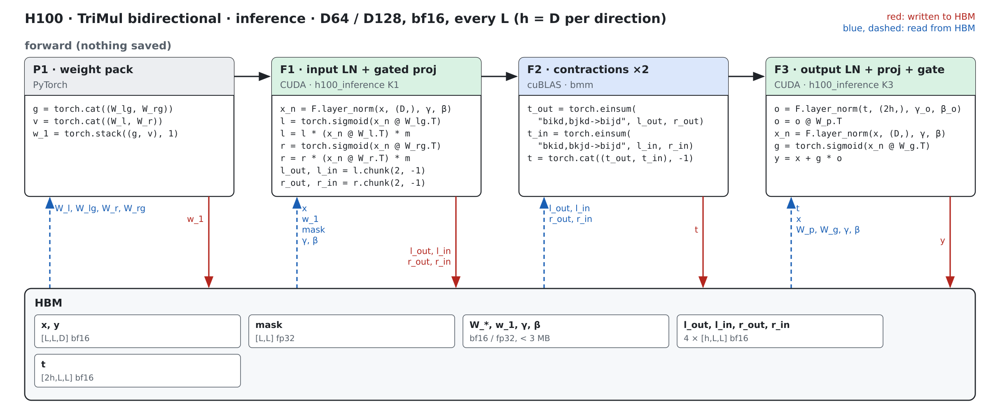
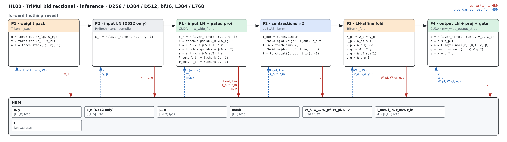
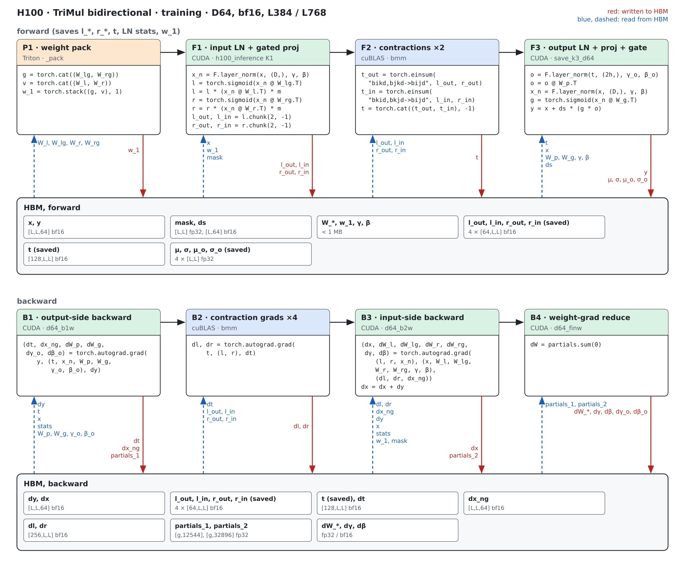
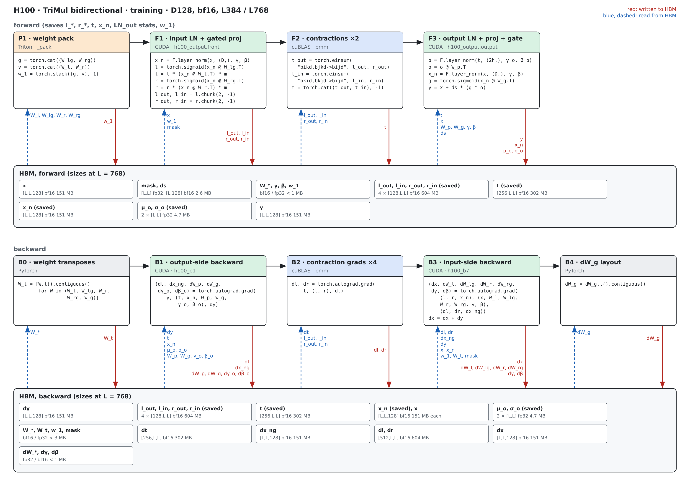
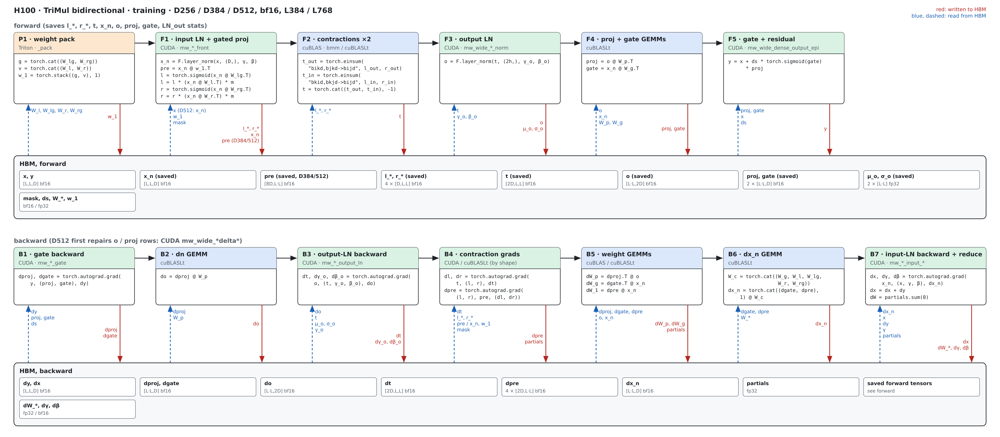

# TriangleMultiplication on H100 (sm90)

Kernel-level status of the TriMul modules on H100; the module-level summary is in
[h100.md](../h100.md). bf16 only; columns are (Length, Dimension). H100 = CUDA; a shape
without a CUDA path is 미구현. Figures: one box per kernel, left to right, HBM reads (blue,
left) and writes (red, right); generated from `figures/trimul_bidir.json` by
`python -m miniworld_engine.viz.kernel_flow`, then `rsvg-convert -z 2 -b white` to PNG.
Dispatch: `integrations/trimul_h100.py`.

## Bidirectional (`BidirectionalTriangleMultiplication`)

Outgoing + incoming in one module (h = D per direction), one output LayerNorm over 2h.

### Inference

#### K1/K3 path · D64 / D128, every L

##### F1 · input LN + gated proj

| (Length, Dimension) | (128, 64) | (256, 64) | (384, 64) | (512, 64) | (640, 64) | (768, 64) | (128, 128) | (256, 128) | (384, 128) | (512, 128) | (640, 128) | (768, 128) |
|---|---|---|---|---|---|---|---|---|---|---|---|---|
| implementation | CUDA | CUDA | CUDA | CUDA | CUDA | CUDA | CUDA | CUDA | CUDA | CUDA | CUDA | CUDA |
| 성능 확인 | ✗ | ✗ | ✗ | ✗ | ✗ | ✗ | ✗ | ✗ | ✗ | ✗ | ✗ | ✗ |
| cache build | ✗ | ✗ | ✗ | ✗ | ✗ | ✗ | ✗ | ✗ | ✗ | ✗ | ✗ | ✗ |

##### F3 · output LN + proj + gate

| (Length, Dimension) | (128, 64) | (256, 64) | (384, 64) | (512, 64) | (640, 64) | (768, 64) | (128, 128) | (256, 128) | (384, 128) | (512, 128) | (640, 128) | (768, 128) |
|---|---|---|---|---|---|---|---|---|---|---|---|---|
| implementation | CUDA | CUDA | CUDA | CUDA | CUDA | CUDA | CUDA | CUDA | CUDA | CUDA | CUDA | CUDA |
| 성능 확인 | ✗ | ✗ | ✗ | ✗ | ✗ | ✗ | ✗ | ✗ | ✗ | ✗ | ✗ | ✗ |
| cache build | ✗ | ✗ | ✗ | ✗ | ✗ | ✗ | ✗ | ✗ | ✗ | ✗ | ✗ | ✗ |

#### Wide path · D256 / D384 / D512, L384 / L768

##### P1 · weight pack

| (Length, Dimension) | (384, 256) | (768, 256) | (384, 384) | (768, 384) | (384, 512) | (768, 512) |
|---|---|---|---|---|---|---|
| implementation | Triton | Triton | Triton | Triton | Triton | Triton |
| 성능 확인 | ✗ | ✗ | ✗ | ✗ | ✗ | ✗ |
| cache build | ✓ | ✓ | ✓ | ✓ | ✓ | ✓ |

##### F1 · input LN + gated proj

| (Length, Dimension) | (384, 256) | (768, 256) | (384, 384) | (768, 384) | (384, 512) | (768, 512) |
|---|---|---|---|---|---|---|
| implementation | CUDA | CUDA | CUDA | CUDA | CUDA | CUDA |
| 성능 확인 | ✗ | ✗ | ✗ | ✗ | ✗ | ✗ |
| cache build | ✓ | ✓ | ✓ | ✓ | ✓ | ✓ |

##### F3 · LN-affine fold

| (Length, Dimension) | (384, 256) | (768, 256) | (384, 384) | (768, 384) | (384, 512) | (768, 512) |
|---|---|---|---|---|---|---|
| implementation | Triton | Triton | Triton | Triton | Triton | Triton |
| 성능 확인 | ✗ | ✗ | ✗ | ✗ | ✗ | ✗ |
| cache build | ✓ | ✓ | ✓ | ✓ | ✓ | ✓ |

##### F4 · output LN + proj + gate

| (Length, Dimension) | (384, 256) | (768, 256) | (384, 384) | (768, 384) | (384, 512) | (768, 512) |
|---|---|---|---|---|---|---|
| implementation | CUDA | CUDA | CUDA | CUDA | CUDA | CUDA |
| 성능 확인 | ✗ | ✗ | ✗ | ✗ | ✗ | ✗ |
| cache build | ✓ | ✓ | ✓ | ✓ | ✓ | ✓ |

### Training

#### D64 path · L384 / L768

##### P1 · weight pack

| (Length, Dimension) | (384, 64) | (768, 64) |
|---|---|---|
| implementation | Triton | Triton |
| 성능 확인 | ✗ | ✗ |
| cache build | ✓ | ✓ |

##### F1 · input LN + gated proj

| (Length, Dimension) | (384, 64) | (768, 64) |
|---|---|---|
| implementation | CUDA | CUDA |
| 성능 확인 | ✗ | ✗ |
| cache build | ✓ | ✓ |

##### F3 · output LN + proj + gate

| (Length, Dimension) | (384, 64) | (768, 64) |
|---|---|---|
| implementation | CUDA | CUDA |
| 성능 확인 | ✗ | ✗ |
| cache build | ✓ | ✓ |

##### B1 · output-side backward

| (Length, Dimension) | (384, 64) | (768, 64) |
|---|---|---|
| implementation | CUDA | CUDA |
| 성능 확인 | ✗ | ✗ |
| cache build | ✓ | ✓ |

##### B3 · input-side backward

| (Length, Dimension) | (384, 64) | (768, 64) |
|---|---|---|
| implementation | CUDA | CUDA |
| 성능 확인 | ✗ | ✗ |
| cache build | ✓ | ✓ |

##### B4 · weight-grad reduce

| (Length, Dimension) | (384, 64) | (768, 64) |
|---|---|---|
| implementation | CUDA | CUDA |
| 성능 확인 | ✗ | ✗ |
| cache build | ✓ | ✓ |

#### D128 path · L384 / L768

##### P1 · weight pack

| (Length, Dimension) | (384, 128) | (768, 128) |
|---|---|---|
| implementation | Triton | Triton |
| 성능 확인 | ✗ | ✗ |
| cache build | ✓ | ✓ |

##### F1 · input LN + gated proj

| (Length, Dimension) | (384, 128) | (768, 128) |
|---|---|---|
| implementation | CUDA | CUDA |
| 성능 확인 | ✗ | ✗ |
| cache build | ✓ | ✓ |

##### F3 · output LN + proj + gate

| (Length, Dimension) | (384, 128) | (768, 128) |
|---|---|---|
| implementation | CUDA | CUDA |
| 성능 확인 | ✗ | ✗ |
| cache build | ✓ | ✓ |

##### B1 · output-side backward

| (Length, Dimension) | (384, 128) | (768, 128) |
|---|---|---|
| implementation | CUDA | CUDA |
| 성능 확인 | ✗ | ✗ |
| cache build | ✓ | ✓ |

##### B3 · input-side backward

| (Length, Dimension) | (384, 128) | (768, 128) |
|---|---|---|
| implementation | CUDA | CUDA |
| 성능 확인 | ✗ | ✗ |
| cache build | ✓ | ✓ |

#### Wide path · D256 / D384 / D512, L384 / L768

##### P1 · weight pack

| (Length, Dimension) | (384, 256) | (768, 256) | (384, 384) | (768, 384) | (384, 512) | (768, 512) |
|---|---|---|---|---|---|---|
| implementation | Triton | Triton | Triton | Triton | Triton | Triton |
| 성능 확인 | ✗ | ✗ | ✗ | ✗ | ✗ | ✗ |
| cache build | ✓ | ✓ | ✓ | ✓ | ✓ | ✓ |

##### F1 · input LN + gated proj

| (Length, Dimension) | (384, 256) | (768, 256) | (384, 384) | (768, 384) | (384, 512) | (768, 512) |
|---|---|---|---|---|---|---|
| implementation | CUDA | CUDA | CUDA | CUDA | CUDA | CUDA |
| 성능 확인 | ✗ | ✗ | ✗ | ✗ | ✗ | ✗ |
| cache build | ✓ | ✓ | ✓ | ✓ | ✓ | ✓ |

##### F3 · output LN

| (Length, Dimension) | (384, 256) | (768, 256) | (384, 384) | (768, 384) | (384, 512) | (768, 512) |
|---|---|---|---|---|---|---|
| implementation | CUDA | CUDA | CUDA | CUDA | CUDA | CUDA |
| 성능 확인 | ✗ | ✗ | ✗ | ✗ | ✗ | ✗ |
| cache build | ✓ | ✓ | ✓ | ✓ | ✓ | ✓ |

##### F5 · gate + residual

| (Length, Dimension) | (384, 256) | (768, 256) | (384, 384) | (768, 384) | (384, 512) | (768, 512) |
|---|---|---|---|---|---|---|
| implementation | CUDA | CUDA | CUDA | CUDA | CUDA | CUDA |
| 성능 확인 | ✗ | ✗ | ✗ | ✗ | ✗ | ✗ |
| cache build | ✓ | ✓ | ✓ | ✓ | ✓ | ✓ |

##### B1 · gate backward

| (Length, Dimension) | (384, 256) | (768, 256) | (384, 384) | (768, 384) | (384, 512) | (768, 512) |
|---|---|---|---|---|---|---|
| implementation | CUDA | CUDA | CUDA | CUDA | CUDA | CUDA |
| 성능 확인 | ✗ | ✗ | ✗ | ✗ | ✗ | ✗ |
| cache build | ✓ | ✓ | ✓ | ✓ | ✓ | ✓ |

##### B3 · output-LN backward

| (Length, Dimension) | (384, 256) | (768, 256) | (384, 384) | (768, 384) | (384, 512) | (768, 512) |
|---|---|---|---|---|---|---|
| implementation | CUDA | CUDA | CUDA | CUDA | CUDA | CUDA |
| 성능 확인 | ✗ | ✗ | ✗ | ✗ | ✗ | ✗ |
| cache build | ✓ | ✓ | ✓ | ✓ | ✓ | ✓ |

##### B4 · contraction grads

| (Length, Dimension) | (384, 256) | (768, 256) | (384, 384) | (768, 384) | (384, 512) | (768, 512) |
|---|---|---|---|---|---|---|
| implementation | CUDA | cuBLAS + CUDA | CUDA | CUDA | CUDA | CUDA |
| 성능 확인 | ✗ | ✗ | ✗ | ✗ | ✗ | ✗ |
| cache build | ✓ | ✓ | ✓ | ✓ | ✓ | ✓ |

##### B7 · input-LN backward + reduce

| (Length, Dimension) | (384, 256) | (768, 256) | (384, 384) | (768, 384) | (384, 512) | (768, 512) |
|---|---|---|---|---|---|---|
| implementation | CUDA | CUDA | CUDA | CUDA | CUDA | CUDA |
| 성능 확인 | ✗ | ✗ | ✗ | ✗ | ✗ | ✗ |
| cache build | ✓ | ✓ | ✓ | ✓ | ✓ | ✓ |

## Measurements (2026-09-29)

H100 80GB HBM3 (132 SMs), torch 2.13.0+cu129, triton 3.7.1, B=1, `benchmarks/runners/bench.py`
(compiled; inference CUDA graph). Latency in ms, median. × = ours vs the fastest of the others.

### Bidirectional · Inference

| (Length, Dimension) | PyTorch compiled | cuEquivariance | Anthropic | ours | × |
|---|---|---|---|---|---|

### Bidirectional · Training

| (Length, Dimension) | PyTorch compiled | cuEquivariance | Anthropic | ours | × |
|---|---|---|---|---|---|
