# NVIDIA RTX A6000 module benchmark report

> SWA DiT values in this historical sweep used the former hybrid block. See the [corrected ESMFold2 rerun](swa-dit-esmfold2-a6000-20260915.md) for current measurements.

Generated by `benchmarks/runners/report_gpu.py a6000` from the tracked tables under `benchmarks/modules/<target>/results/a6000/tables/`. Every number here is a `measurement_schema=2` measurement of the `torch.compile`d path; tables that predate that schema are excluded below rather than plotted.

## Workload

- Device: NVIDIA RTX A6000; torch 2.10.0+cu128, CUDA 12.8; benchmark source hash(es) `a61af16b6c86`, `fd7941400d38` (a table measured after a later benchmark-harness commit carries its own hash; the tables name theirs in the `source_hash` column).
- Precision bf16-mixed, TF32 off, mask probability 0.125, depth 1, compile wrap `custom_op`.
- Inference: augmentation A5, manual CUDA Graph capture of the measured call, dropout 0. Training: A48, no graph, forward+backward without optimizer, dropout 0.25 where the module has dropout (triangle modules).
- Pair modules sweep L at d_pair=128 and d_pair at L=384; token modules use d_single=768; atom modules use 8xL atoms with d_single_atom=128. Sweep ranges are each target's `configs/bench.yaml`.
- Each cell is the median of three independent benchmark processes; error bars are the min-max across those processes. Speedup is compiled PyTorch time divided by the implementation's time at the same point. cuEquivariance appears only for the modules it implements (triangle multiplication and triangle attention).
- Rows from different modules may come from different physical cards; all implementations within one table share a card and a process. Do not sum rows into a whole-model claim.
- Tables were measured on 8 physical cards, so absolute latencies are comparable within a table and speedup ratios across tables. Card by table (each figure caption repeats its card as `[uuid@host]`):
  - `13b61e95@gpu01` (reports 44.43 GiB total): Trimul outgoing inference d_pair, Trimul outgoing inference L, Triangle attention training d_pair, Triangle attention training L, ConditionedTransition training L, Atom attention training L, SWA DiT inference d_pair, SWA DiT inference L, SWA DiT training d_pair, SWA DiT training L
  - `20dbc787@gpu01` (reports 47.41 GiB total): AdaLN inference d_pair, AdaLN inference L, Bidirectional trimul inference d_pair, Bidirectional trimul inference L, Transition training d_pair, Transition training L, SWA attention inference L, SWA attention training L, Atom DiT training L
  - `5330224f@gpu03`: DiT training d_pair, DiT training L
  - `74069384@gpu03`: Atom DiT inference L
  - `8216929f@gpu01`: AdaLN training d_pair, AdaLN training L, Bidirectional trimul training d_pair, Bidirectional trimul training L, ConditionedTransition inference L, Token attention training d_pair, Token attention training L
  - `87fa4e48@gpu03`: Trimul incoming training d_pair, Trimul incoming training L, Transition inference d_pair, Transition inference L, Token attention inference d_pair, Token attention inference L, DiT inference d_pair, DiT inference L
  - `c6b0efd9@gpu01`: Trimul incoming inference d_pair, Trimul incoming inference L, Triangle attention inference d_pair, Triangle attention inference L
  - `ecfb7c52@gpu01`: Trimul outgoing training d_pair, Trimul outgoing training L, Atom attention inference L
- Cards of this model reported different total capacities in their out-of-memory errors (`13b61e95` 44.43 GiB, `20dbc787` 47.41 GiB); a smaller reported capacity is consistent with ECC being enabled on that card, which also costs bandwidth, so its absolute latencies are not interchangeable with the other cards'.
## Summary

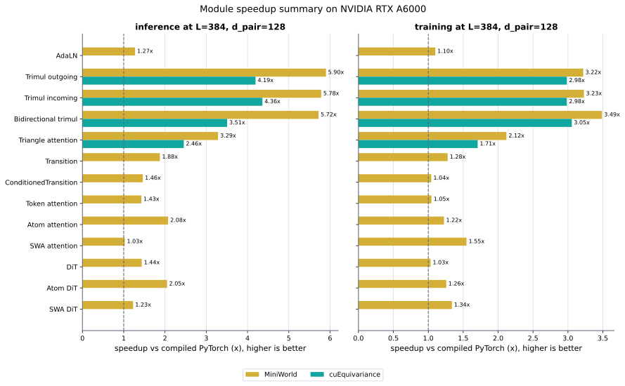

Latency in ms at L=384, d_pair=128 (atom modules: 3072 atoms). The last column is the MiniWorld speedup range over the whole L sweep.

| Module | Mode | PyTorch | cuEquivariance | MiniWorld | MiniWorld speedup | L-sweep range |
|---|---|---:|---:|---:|---:|---:|
| AdaLN | inference | 0.067 | — | 0.052 | 1.27x | 1.17-1.58x |
| AdaLN | training | 1.235 | — | 1.122 | 1.10x | 0.89-1.10x |
| Trimul outgoing | inference | 5.783 | 1.379 | 0.980 | 5.90x | 5.63-6.83x |
| Trimul outgoing | training | 14.126 | 4.734 | 4.389 | 3.22x | 3.22-3.55x |
| Trimul incoming | inference | 4.917 | 1.127 | 0.850 | 5.78x | 5.02-6.35x |
| Trimul incoming | training | 14.113 | 4.730 | 4.371 | 3.23x | 3.23-3.58x |
| Bidirectional trimul | inference | 9.683 | 2.762 | 1.693 | 5.72x | 4.88-6.22x |
| Bidirectional trimul | training | 27.020 | 8.845 | 7.748 | 3.49x | 3.20-3.84x |
| Triangle attention | inference | 5.084 | 2.071 | 1.547 | 3.29x | 3.29-6.33x |
| Triangle attention | training | 16.063 | 9.410 | 7.580 | 2.12x | 2.12-3.25x |
| Transition | inference | 1.793 | — | 0.955 | 1.88x | 1.77-1.90x |
| Transition | training | 4.830 | — | 3.782 | 1.28x | 1.24-1.29x |
| ConditionedTransition | inference | 0.321 | — | 0.219 | 1.46x | 1.13-1.49x |
| ConditionedTransition | training | 6.530 | — | 6.262 | 1.04x | 1.00-1.06x |
| Token attention | inference | 0.706 | — | 0.495 | 1.43x | 1.43-1.68x |
| Token attention | training | 12.264 | — | 11.735 | 1.05x | 1.02-1.08x |
| Atom attention | inference | 5.469 | — | 2.635 | 2.08x | 1.96-2.08x |
| Atom attention | training | 109.670 | — | 89.559 | 1.22x | 1.22-1.22x |
| SWA attention | inference | 0.369 | — | 0.359 | 1.03x | 1.03-1.04x |
| SWA attention | training | 14.603 | — | 9.438 | 1.55x | 1.40-1.55x |
| DiT | inference | 1.030 | — | 0.717 | 1.44x | 1.44-1.60x |
| DiT | training | 18.070 | — | 17.493 | 1.03x | 1.02-1.07x |
| Atom DiT | inference | 5.640 | — | 2.751 | 2.05x | 1.96-2.05x |
| Atom DiT | training | 97.751 | — | 77.749 | 1.26x | 1.26-1.28x |
| SWA DiT (legacy hybrid) | inference | 0.713 | — | 0.581 | 1.23x | 1.21-1.23x |
| SWA DiT (legacy hybrid) | training | 25.729 | — | 19.222 | 1.34x | 1.34-1.35x |

## Per-module sweeps

Top row: latency (lower is better). Bottom row: speedup versus compiled PyTorch (higher is better). Missing bars are points the implementation could not run; the reason is recorded in the table's `status`/`error` columns.

### AdaLN

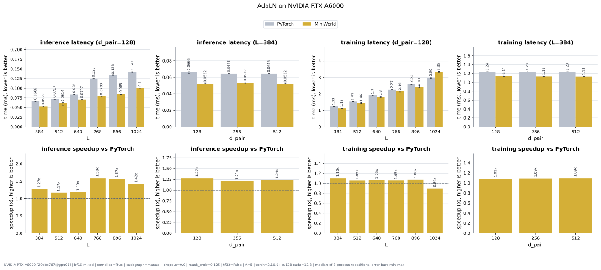

### Trimul outgoing

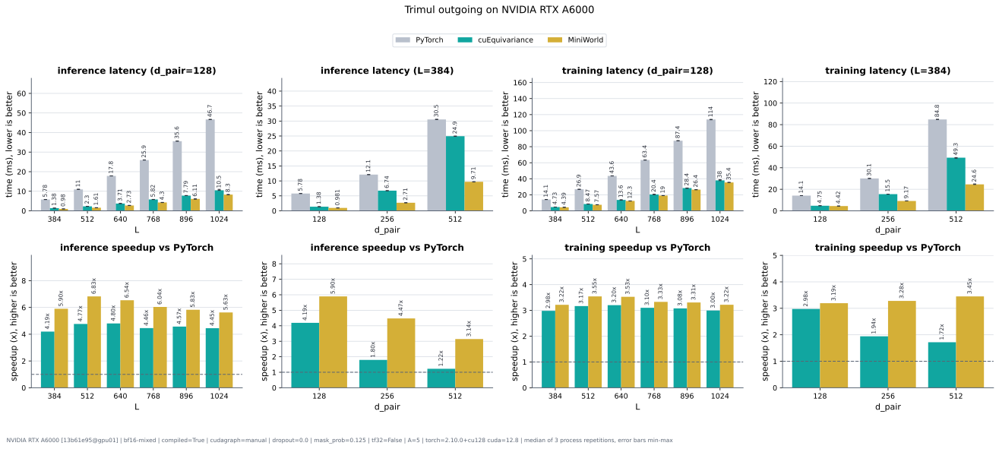

### Trimul incoming

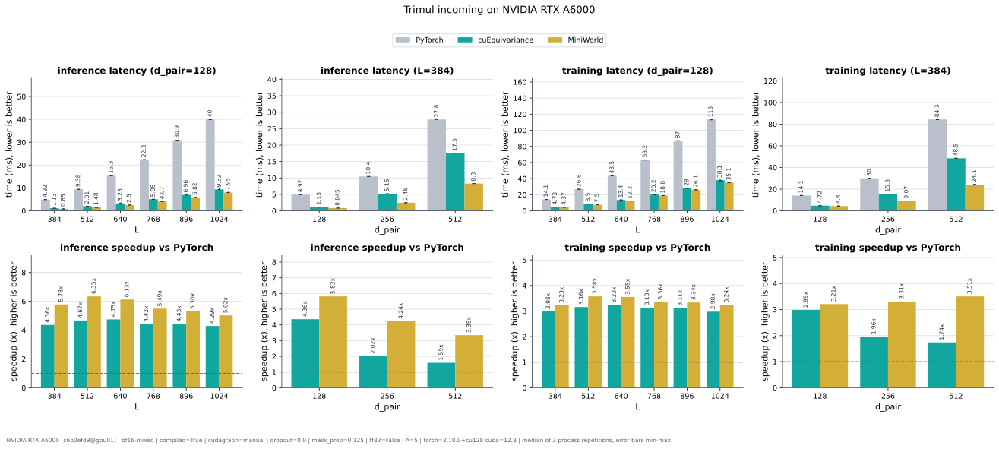

### Bidirectional trimul

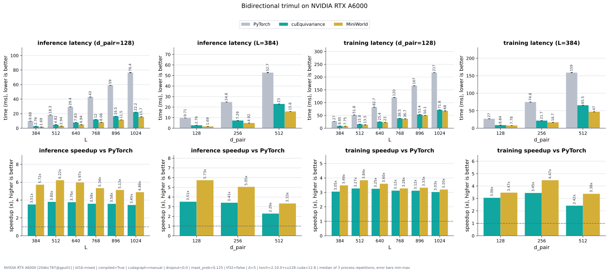

### Triangle attention

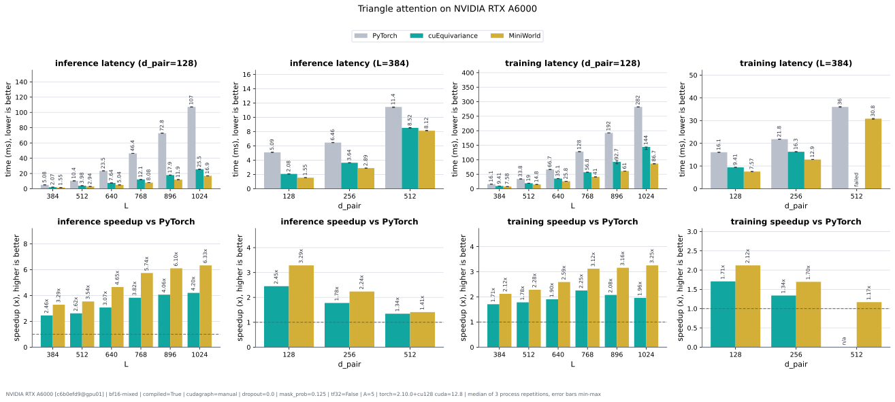

### Transition

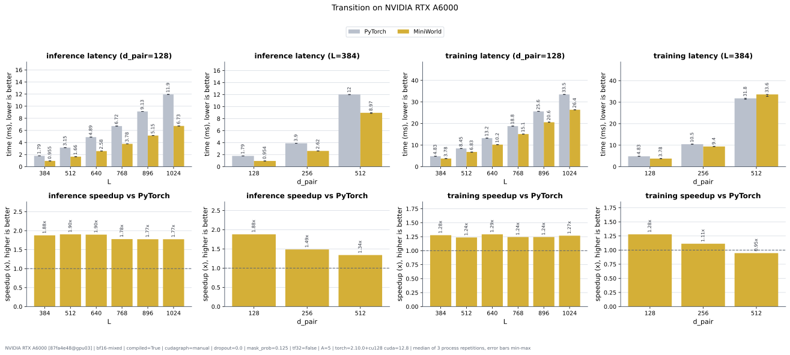

### ConditionedTransition

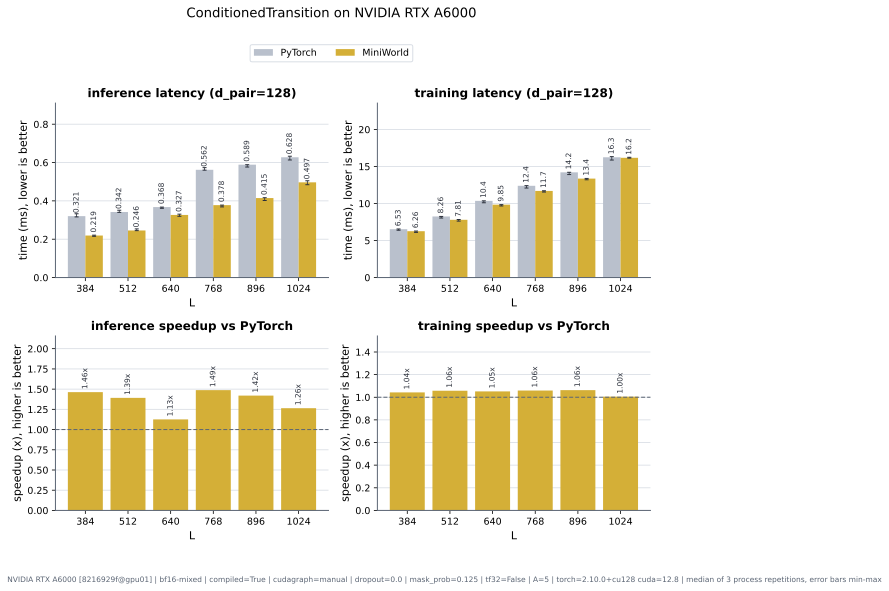

### Token attention

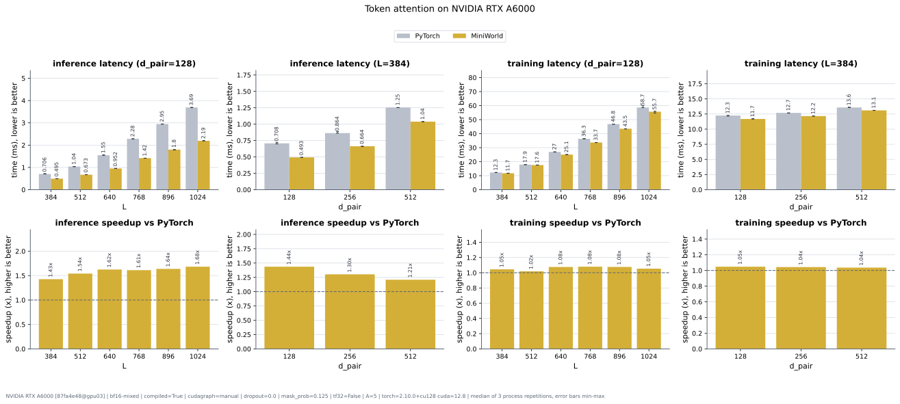

### Atom attention

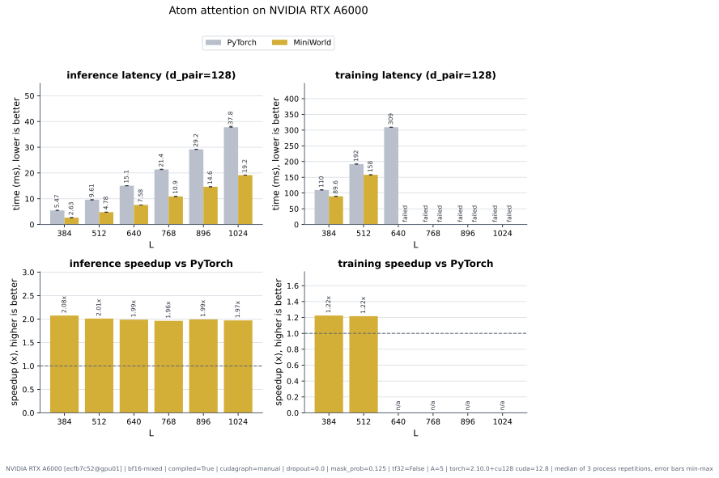

### SWA attention

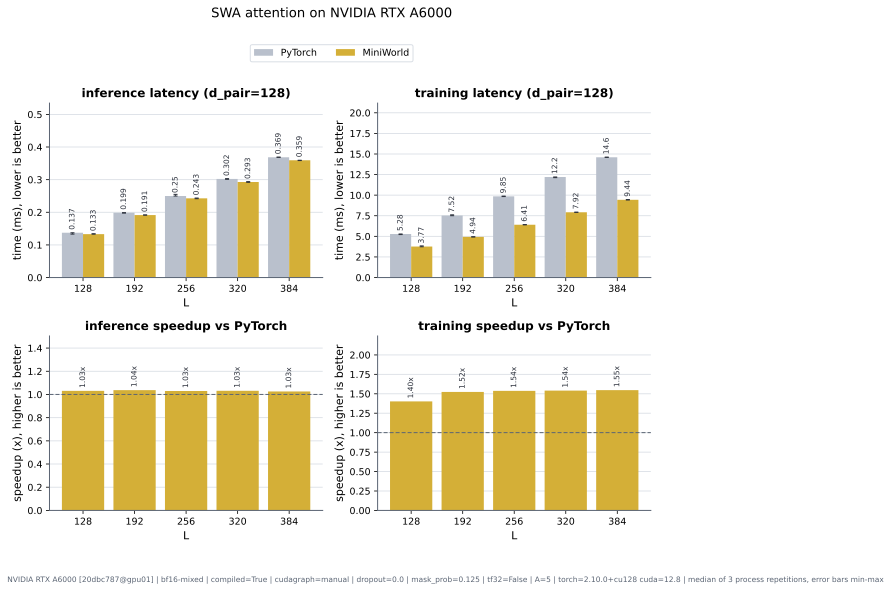

### DiT

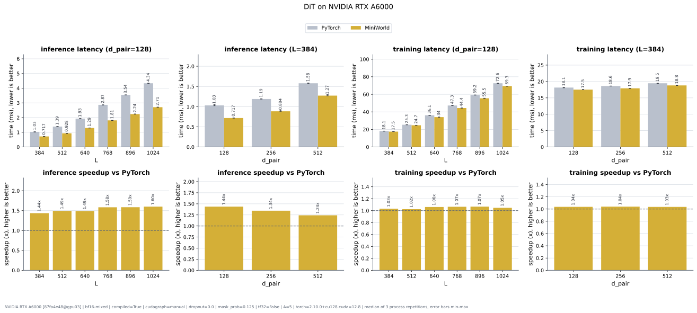

### Atom DiT

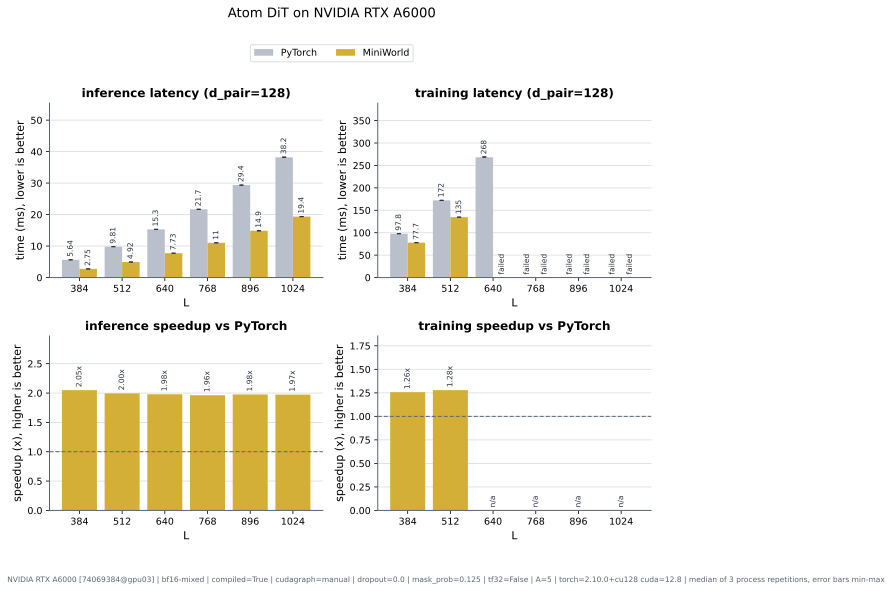

### SWA DiT (legacy hybrid; superseded)

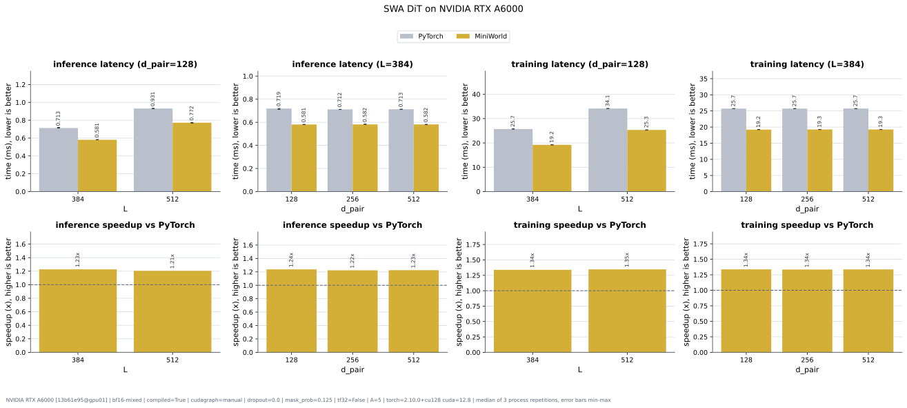

## Disclosures

- AdaLN inference L sweep, MiniWorld at L=1024: 3 tuned-cache miss(es) fell back to the bounded heuristic search (adaln_gemm_gate_triton, layernorm_fwd_strided_triton, layernorm_stats_triton).
- AdaLN training L sweep, MiniWorld at L=1024: 3 tuned-cache miss(es) fell back to the bounded heuristic search (adaln_bwd_pre_dx_triton, adaln_fwd_gate_triton, layernorm_stats_triton).
- Triangle attention inference d_pair sweep, MiniWorld at d_pair=512: 1 tuned-cache miss(es) fell back to the bounded heuristic search (triangle_attention_fwd_triton).
- Triangle attention training d_pair sweep: not measured at cuEquivariance d_pair=512 (failed: RuntimeError: CUDA error: "invalid argument" at bwd_fmha.cu:198 Failed call: cudaFuncSetAt).
- Triangle attention training d_pair sweep, MiniWorld at d_pair=512: 4 tuned-cache miss(es) fell back to the bounded heuristic search (triangle_attention_bwd_dkdv_triton, triangle_attention_bwd_dq_triton, triangle_attention_bwd_pre_triton, triangle_attention_fwd_triton).
- Transition inference d_pair sweep, MiniWorld at d_pair=512: 1 tuned-cache miss(es) fell back to the bounded heuristic search (transition_expand_swiglu_triton).
- Transition training d_pair sweep, MiniWorld at d_pair=512: 2 tuned-cache miss(es) fell back to the bounded heuristic search (transition_bwd_swiglu_recompute_triton, transition_expand_swiglu_triton).
- ConditionedTransition inference L sweep, MiniWorld at L=1024: 5 tuned-cache miss(es) fell back to the bounded heuristic search (adaln_gemm_gate_triton, cond_transition_expand_swiglu_triton, cond_transition_squeeze_gate_triton, layernorm_fwd_strided_triton, layernorm_stats_triton).
- ConditionedTransition training L sweep, MiniWorld at L=1024: 5 tuned-cache miss(es) fell back to the bounded heuristic search (adaln_bwd_pre_dx_triton, adaln_fwd_gate_triton, cond_transition_bwd_gemm_swiglu_triton, cond_transition_swiglu_triton, layernorm_stats_triton).
- Token attention inference L sweep, MiniWorld at L=1024: 4 tuned-cache miss(es) fell back to the bounded heuristic search (adaln_gemm_gate_triton, augmented_attention_fwd_triton, layernorm_fwd_strided_triton, layernorm_stats_triton).
- Token attention training L sweep, MiniWorld at L=1024: 6 tuned-cache miss(es) fell back to the bounded heuristic search (adaln_bwd_pre_dx_triton, adaln_fwd_gate_triton, augmented_attention_bwd_pre_triton, augmented_attention_bwd_split_triton, augmented_attention_fwd_triton, layernorm_stats_triton).
- Atom attention training L sweep: not measured at MiniWorld L=640 (out of memory: tried to allocate 18.75 GiB, 44.43 GiB card), PyTorch L=768 (out of memory: tried to allocate 13.50 GiB, 44.43 GiB card), MiniWorld L=768 (out of memory: tried to allocate 27.00 GiB, 44.43 GiB card), PyTorch L=896 (out of memory: tried to allocate 18.38 GiB, 44.43 GiB card), MiniWorld L=896 (out of memory: tried to allocate 36.75 GiB, 44.43 GiB card), PyTorch L=1024 (out of memory: tried to allocate 24.00 GiB, 44.43 GiB card), MiniWorld L=1024 (out of memory: tried to allocate 48.00 GiB, 44.43 GiB card).
- SWA attention training L sweep, MiniWorld at L=320: 2 tuned-cache miss(es) fell back to the bounded heuristic search (qk_norm_rope_bwd_triton, qk_norm_rope_fwd_triton).
- DiT inference L sweep, MiniWorld at L=1024: 6 tuned-cache miss(es) fell back to the bounded heuristic search (adaln_gemm_gate_triton, augmented_attention_fwd_triton, cond_transition_expand_swiglu_triton, cond_transition_squeeze_gate_triton, layernorm_fwd_strided_triton, layernorm_stats_triton).
- DiT training L sweep, MiniWorld at L=1024: 8 tuned-cache miss(es) fell back to the bounded heuristic search (adaln_bwd_pre_dx_triton, adaln_fwd_gate_triton, augmented_attention_bwd_pre_triton, augmented_attention_bwd_split_triton, augmented_attention_fwd_triton, cond_transition_bwd_gemm_swiglu_triton, cond_transition_swiglu_triton, layernorm_stats_triton).
- Atom DiT training L sweep: not measured at MiniWorld L=640 (out of memory: tried to allocate 18.75 GiB, 47.41 GiB card), PyTorch L=768 (out of memory: tried to allocate 13.50 GiB, 47.41 GiB card), MiniWorld L=768 (out of memory: tried to allocate 27.00 GiB, 47.41 GiB card), PyTorch L=896 (out of memory: tried to allocate 18.38 GiB, 47.41 GiB card), MiniWorld L=896 (out of memory: tried to allocate 36.75 GiB, 47.41 GiB card), PyTorch L=1024 (out of memory: tried to allocate 24.00 GiB, 47.41 GiB card), MiniWorld L=1024 (out of memory: tried to allocate 48.00 GiB, 47.41 GiB card).
