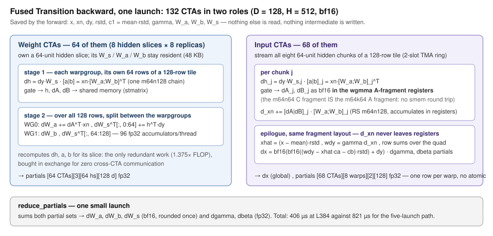

# Fused Transition backward on H100

The pair Transition backward (`y = x + W_s(silu(W_a·LN(x)) · (W_b·LN(x)))`, D = 128, H = 4D = 512, bf16) runs today as five
launches: a cuBLAS `dh`, a Triton gate backward, two cuBLAS weight-gradient GEMMs, a cuBLAS `d_xn` and a LayerNorm backward.
Two thirds of that time is intermediate tensors going to HBM and coming back — the backward moves about 1.66 GB where the
essential inputs and outputs are 120 MB. This experiment replaces the whole thing with **one CUDA kernel** (plus a small
partial-sum reduction) that keeps `dh`, `h`, `dA` and `dB` in registers and shared memory and never writes them out.

It is an experiment, not a dispatch change: nothing in `miniworld_engine` calls it. See "Wiring it up" for what that needs.



## Result

node02 H100 80 GB, CUDA 12.9, PyTorch 2.10 cu128, same session, CUDA-graph replay median (`records/bench-L{384,768}.json`):

| | L384 (M = 147 456) | L768 (M = 589 824) |
|---|---:|---:|
| engine backward (5 launches) | 821 µs | 3113 µs |
| **this kernel** (1 launch + reduction) | **406 µs** | **1530 µs** |
| speed-up | **2.02×** | **2.03×** |
| tensor floor of this design (22·M·D·H) | 224 µs | 897 µs |
| absolute tensor floor (16·M·D·H) | 163 µs | 652 µs |

132 CTAs × 256 threads, 231 KB shared memory, 255 registers, no spill, no cooperative launch and no cluster.

At the module level — `miniworld_engine.modules.Transition(128, 4)` in bf16 training, forward + backward, with only the
backward swapped (`bench_module.py`, `records/module-L{384,768}.json`) — the forward is unchanged, so the op's 2.0× becomes:

| | L384 | L768 |
|---|---:|---:|
| engine module fwd + bwd | 1107 µs | 4118 µs |
| **with this backward** | **743 µs** | **2759 µs** |
| | **1.49×** | **1.49×** |

Gradients through the real module agree with the engine path to 4.2e-5 (`dgamma`) … 5.9e-4 (`dW*`), against an engine
run-to-run noise of 0 … 1.3e-6. Note that the module zero-initialises the squeeze weight, which makes the backward
degenerate (`dh = 0`, so four of the five parameter gradients are exactly zero in *both* paths); `bench_module.py` gives it a
trained-looking value first, or the comparison would be comparing zeros.

Numerics: all six gradients carry the same relative RMS error against an fp32 autograd reference as the engine's own backward
does — `dx` 3.07e-3, `dWa` 3.88e-3, `dWs` 3.42e-3 at L384, and the engine's row is printed next to it by `bench.py --engine`.
Against the engine directly the difference is accumulation order only: `dx` 5.4e-5 (0.02 % of elements differ), `dW*` 2.0-2.5e-4.
The bf16 rounding points and the multiplication order of the contract are unchanged. **All six outputs are bit-reproducible**
run to run: there is no atomic anywhere in the kernel.

## How it works

Two CTA roles in one launch, following the split the B1-B4 TriMul training kernel uses.

**Weight CTAs** (8 hidden slices × `DW_REPL` replicas, 64 CTAs at the default) own a 64-unit hidden slice and keep its
`W_s`, `W_a`, `W_b` resident in shared memory, so no weight streaming. Both warpgroups run the gate stage on their own 64 rows
of a 128-row tile and write `h`, `dA`, `dB` to shared memory; then they split the weight gradients over the whole tile — WG0
takes `dW_a` and the left half of `dW_s^T`, WG1 takes `dW_b` and the right half — as 96 fp32 accumulators per thread.

**Input CTAs** (the remaining 68) stream all eight 64-unit hidden chunks of their 128-row tile through a two-slot TMA weight
ring. Per chunk each warpgroup computes `dh` and the packed `[a|b]`, forms `dA` and `dB` as bf16 **directly in the wgmma
A-fragment registers** — the m64n64 C fragment is exactly the m64k64 A fragment, so there is no shared-memory round trip and
no `stmatrix` — and accumulates `d_xn` with an RS m64n128 over the same packed `[W_a; W_b]` operand. `d_xn` never leaves
registers: the LayerNorm backward, the residual, `dx` and the `dgamma` / `dbeta` partials all run in that fragment layout.

Only `dh`, `a` and `b` are recomputed, by the weight role, so the kernel executes 22·M·D·H FLOP against a 16·M·D·H minimum.
That 1.375× is the price of having no cross-CTA communication at all, and it is a bargain: the first design avoided the
recomputation by splitting the hidden axis over a cluster and reduce-scattering the `d_xn` partial sums through distributed
shared memory, and was 2.5× slower because the two cluster barriers and the remote stores a tile needs cost 572 µs of its
1017 (`records/progression.md`).

`DW_REPL` is the only tuning knob and it is compiled in. At 8 the two roles are within 5 % of each other and 1152 tiles divide
exactly; the sweep is in `records/ratio-r*-L384.json`.

## Layout

| | |
|---|---|
| `src/transition_bwd.cu` | the kernel and the partial-sum reduction; the only include is the Anthropic v5 device header set |
| `build.sh` | `[OUT=<name>] ./build.sh [-DDW_REPL=<R>]` → `build/<OUT>.cubin` (nvcc, sm_90a, compute node only) |
| `bench.py` | correctness against an fp32 autograd reference, bit-reproducibility, CUDA-graph timing, `--engine` for the baseline, `--save` for a record |
| `drv.py` | minimal `cuda.bindings` launcher: TMA descriptors, cubin load, by-value argument packing |
| `bench_module.py` | the same, at the module level: times `modules.Transition` fwd + bwd with and without this backward, and checks the gradients agree |
| `verify_package.py` | CPU-only integrity checks (vendored-header hashes, portable paths, recorded measurements) |
| `records/` | the measurements above, the ratio sweep, and `progression.md` — how it got here and the eleven things that did not work |

The Anthropic v5 device primitives (`tmn_ptx.cuh`, `tmn_kernels.cuh`, `common/tmn_math.cuh`, Apache-2.0, upstream revision
`f4f62fa`) are not duplicated here: the build includes the copy vendored for the sibling experiment at
`../trimul_b7b12/vendor/anthropic_v5/csrc`, and `verify_package.py` pins their hashes.

```
OUT=transition_bwd_r8 ./build.sh -DDW_REPL=8
python bench.py --length 384 --dw-repl 8 --engine
```

Needs a compute node (nvcc and the GPU), torch with CUDA and `cuda.bindings`.

## Wiring it up

`bench.py` shows the op-level call and `bench_module.py` a working module-level substitution (a local autograd Function that
calls the engine's own LayerNorm, expand-SwiGLU and squeeze-residual forward kernels and this kernel for the backward): the kernel consumes exactly what the forward already saves (`x`, `xn`, `dy`, `rstd`,
`c1 = mean·rstd`, `gamma`, and the three weights) and produces the six gradients the autograd function returns, so the change
is confined to the backward of the Transition autograd function. Three things are needed first.

1. **Shape coverage.** The kernel is compiled for D = 128, H = 512 and needs M to be a multiple of 128. Other widths need
   their own instantiation; the dispatch has to keep the current path for everything else.
2. **A build path.** It is loaded here as a raw cubin through `drv.py`. In the engine it should go through the same
   mechanism the other hand-CUDA kernels use, with `DW_REPL` fixed at 8.
3. **A numerics decision.** `dgamma` and `dbeta` are summed in a different order than the current path, so they differ by
   about 4e-5 relative. That is far inside the bf16 tolerance the op already has, but it is a change to recorded outputs and
   the parity tests should be re-baselined deliberately rather than by accident.

## Headroom

The tensor pipe is 58.1 % active (NCU `--set full`, L384). Since this design must execute 22·M·D·H FLOP, that *is* 406 µs;
330 µs would need 70 %. The stall profile is flat — the largest single SASS line is 4.5 % — so there is no hotspot left, and
five structural attempts in a row were neutral or worse. The two remaining levers are both blocked by a hard limit (registers
at 255, shared memory at the effective 231424-byte ceiling); `records/progression.md` has the details and the traps.
