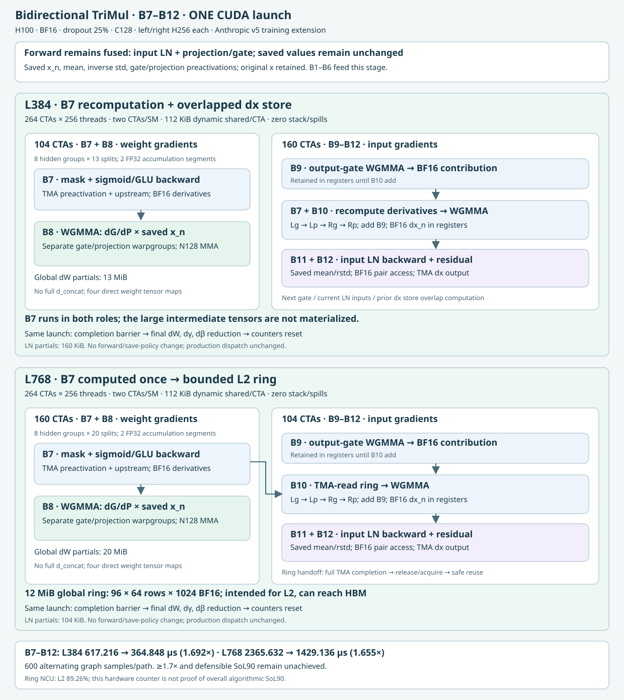

# H100 bidirectional TriMul B7–B12 checkpoint

This is an explicit experimental runner, not an installed engine dispatch path.
It preserves the fused-input-LN forward, saved values, dropout, residual and
BF16 rounding boundaries while replacing B7–B12 with one cooperative CUDA launch.
The B1–B6 prefix stays identical in whole-backward and training comparisons.

We previously developed inference kernels, but Anthropic's published implementation
achieved better results. This work builds on that implementation and adds training
support. It is not a claim of independent superior inference development.

## Implementations and wiring



| Shape | Source | Launch | Workspace |
|---|---|---|---|
| L384 | `front_prefetch_lnpair_storepipe.cu` | 264 CTAs, 256 threads, 13 dW splits | dW/LN partials; no derivative ring |
| L768 | `front_ring96_cache3.cu` | 264 CTAs, 256 threads, 20 dW splits | dW/LN partials and a 12 MiB global ring |

Both use explicit TMA and WGMMA. The L384 path recomputes B7 in the dX/dW roles,
overlapping LN input loads and residual output stores with GEMMs. The L768 path
computes B7 once and passes rounded derivatives through a bounded ring, with
release/acquire generation counters and full TMA-store completion before publication.
The ring is global memory with an L2 retention hint, not guaranteed on-chip storage.
Four live weight tensor maps avoid a packed-weight concatenation.

Supported checkpoint: H100 SM90a, B=1, C=128, packed hidden width=256,
BF16 activations/weights and FP32 LN parameters/statistics. Training buckets are
L384 and L768; L64 is used for validation. A plan owns its scratch and output
buffers and is single-stream/non-reentrant. Use independent plans for concurrent
invocations. Cooperative launch is required; ordinary oversubscribed launches
can deadlock. The loader refuses nonzero ptxas stack or register spills.

## Measured performance

Node02 H100 80 GB, PyTorch 2.10/cu128, CUDA compiler 12.9, row dropout25%,
600 alternating CUDA Graph samples per path, median GPU time. Baseline is
the existing Triton/cuBLAS training backward. Compilation, weight packing,
RNG, CPU/autograd dispatch and optimizer work are outside timing.

| Scope | L | Baseline µs | CUDA µs | Speedup |
|---|---:|---:|---:|---:|
| B7–B12 |384|617.216|364.848|1.692×|
| B7–B12 |768|2365.632|1429.136|1.655×|
| Full backward |384|1092.304|843.104|1.296×|
| Full backward |768|4338.912|3405.008|1.274×|
| Forward + full backward |384|1530.240|1273.920|1.201×|
| Forward + full backward |768|6068.656|5146.272|1.179×|

The training totals are directly captured forward+backward calls, not sums of
isolated timings. Forward is identical on both sides and is derived from
Anthropic native v5, with the original saved-value policy. These totals exclude
the separate B1–B4 CUDA project and are not full MiniWorld model-step timings.

**The ≥1.7× B7–B12 target and independently justified SoL90 are not achieved.**
The frozen baseline remains615.008/2361.056µs (targets361.769/1388.857µs).
The baseline input-dual backward uses its existing3-config heuristic fallback
on a cache miss, not an exhaustive retuning. See the raw samples in
[`records/`](records/) and the long-form [performance CSV](records/performance.csv);
original records are retained separately from repackaged runs.
Historical candidate timing keys such as `kindprefetch` refer to the selected
source identified by that record's filename, not an additional implementation.

NCU on the L768 ring reports L2 throughput89.26%, SM38.43% and2.648GB DRAM
traffic. This is a bottleneck observation, not proof that the algorithm is at
90% of a hardware lower bound. See [traffic accounting](SOL_TRAFFIC_MODEL.md).

## Validation

Each selected source passed six shape/dropout cases (L64/384/768 ×0/.25),
24 initial/replay/changed-input/changed-weight comparisons, six scoped
memcheck/racecheck/synccheck runs atL64/384, and independent unfiltered
host-initialized initcheck atL64. CUDA Graph replays reset cooperative counters.
All11 whole-backward gradients and direct training replay outputs pass.

Fixed relative-L2 limits: dx2e-5, weight gradients5e-4, LN gradients5e-6.
These are not bitwise-identical dW reductions. The forward/save and B1–B6 setup
has a separate unresolved initcheck diagnostic; the scoped checks and independent
fixture do not certify whole-model initcheck cleanliness.

The repository-local package was rechecked against main`09196265`: both sources
passed another24 comparisons, and direct forward+backward reproduced1.202×/1.179×.
The kernel/config checksums match the original checkpoint. Existing repository
CI issues and the available-tool limitations are recorded separately in
[`records/packaging-validation.json`](records/packaging-validation.json).

## Reproduce from this repository

Use an allocated H100 and an environment with the engine's dependencies,
PyTorch CUDA, nvcc supporting sm90a, and compute-sanitizer on PATH.
No MiniWorld workspace, private absolute path, downloaded binary or external
experiment directory is required. The small pinned upstream source subset is
included under `vendor/anthropic_v5/`.

```bash
export PYTHONPATH="$PWD/src${PYTHONPATH:+:$PYTHONPATH}"
experiment=experiments/trimul_b7b12
python "$experiment/verify_package.py"
python "$experiment/bench_region.py" --length 384
python "$experiment/bench_region.py" --length 768
python "$experiment/bench_train_total.py" --length 384
python "$experiment/bench_train_total.py" --length 768
python "$experiment/check_twocta.py" --source front_prefetch_lnpair_storepipe --counts 264 --parts 2 --splits 13 --output new-storepipe-validation.json
python "$experiment/check_ring.py" --source front_ring96_cache3 --counts 264 --parts 2 --splits 20 --output new-ring-validation.json
python "$experiment/run_newfront_sanitizers.py" --source front_prefetch_lnpair_storepipe --label new-storepipe
python "$experiment/run_newfront_sanitizers.py" --source front_ring96_cache3 --label new-ring --ring
compute-sanitizer --tool initcheck --error-exitcode 86 python "$experiment/initcheck_storepipe.py"
compute-sanitizer --tool initcheck --error-exitcode 86 python "$experiment/initcheck_ring96cache3.py"
```

For two GPUs, run one process with `CUDA_VISIBLE_DEVICES=0` and the other with
`CUDA_VISIBLE_DEVICES=1`. Tensor-map creation/weight packing happens before
replay; fresh forward saves are produced inside every captured training call.
This package selects the validated schedules; it does not include hundreds of
rejected tuning variants, compiled binaries or raw NCU reports.

## Attribution and source integrity

Anthropic [`uplifting-biomolecular-modeling`](https://github.com/anthropics/uplifting-biomolecular-modeling)
revision`f4f62fa6592ae4938d49b1757bea0cfeff9f468e`, native v5, supplies
the TMA/mbarrier, WGMMA, shared-layout and BF16 primitives and CUDA driver bindings.
The upstream subset is byte-identical with per-file SHA-256 in
[`vendor/anthropic_v5/UPSTREAM.json`](vendor/anthropic_v5/UPSTREAM.json), retaining
its Apache-2.0 LICENSE and NOTICE. A minimal local package initializer replaces
the unrelated inference API initializer; this change is documented in the manifest.
The new backward schedule and training-save wrappers are Miniworld extensions.

`records/source-provenance.json` records original checkpoint hashes. Packaging
only makes imports and fixture dependencies repository-local and removes obsolete
runners; the selected CUDA sources, headers and launch configurations are unchanged.
Production registration, broader dtype/shape support and default dispatch integration
remain separate work.
