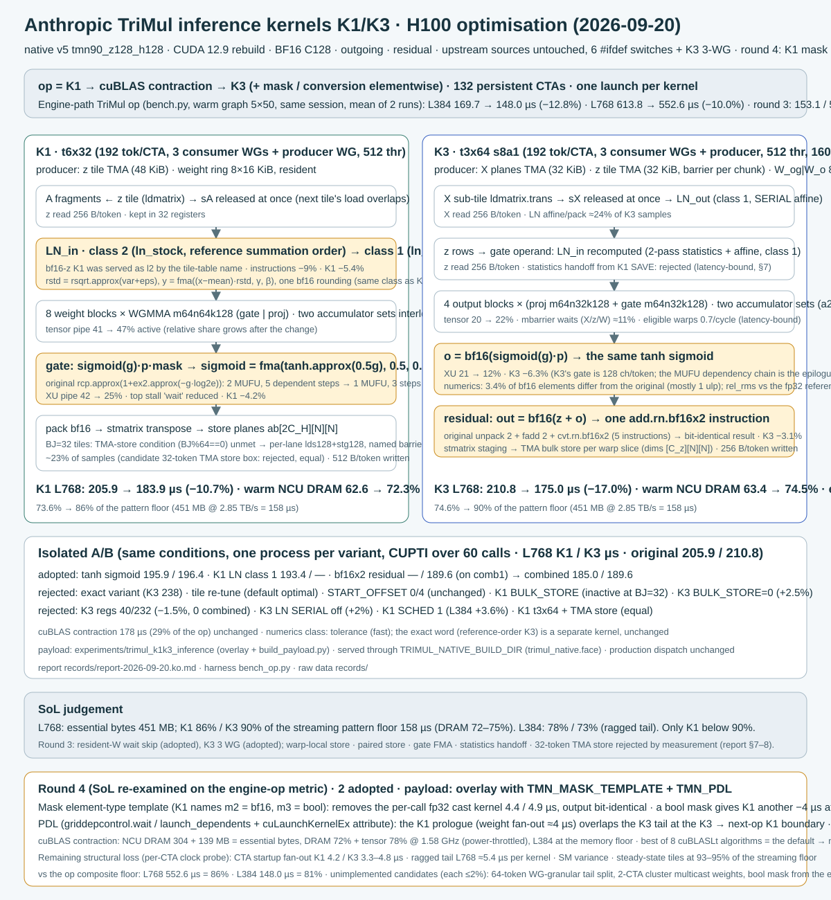

# H100 TriMul K1/K3 inference optimisation

Anthropic's published native v5 TriMul (`trimul_native`, three launches: K1 input-LayerNorm + gated projections → cuBLAS
contraction → K3 output-LayerNorm + gate/projection + residual) was already faster than our own inference kernels. This
experiment keeps that implementation and its contracts (bf16 tolerance class, one serve face, manifest and test-vector gates) and
rebuilds the C128 unit with a small overlay of compile switches and host-package extensions. It is an explicit experiment
served through `TRIMUL_NATIVE_BUILD_DIR`; installing the engine does not select it, and production dispatch is unchanged.



## Result

Engine-path TriMul op (the adoption benchmark `bench.py --family trimul --row native_rebuilt`: warm CUDA graph, 5 × 50 replays,
outgoing, residual, C128, bf16 pair mask), node02 H100 80 GB, CUDA 12.9, PyTorch 2.10 cu128, same session, mean of two runs
(`records/engine-bench/`):

| L | Anthropic v5 rebuild | round 3 (final2) | **this payload** | change |
|---:|---:|---:|---:|---:|
| 384 | 169.7 µs | 152.9 µs | **148.0 µs** | **−12.8 %** |
| 768 | 613.8 µs | 566.9 µs | **552.6 µs** | **−10.0 %** |

Per kernel (CUPTI device time, 60 eager calls, µs; `records/kernel-times/`):

| kernel | L | v5 rebuild | this payload, bf16 mask | this payload, bool mask |
|---|---:|---:|---:|---:|
| K1 `tmn_k1_z128_h128_b_t6x32_s8k2_m{1,2,3}_l2_v0` | 384 / 768 | 56.4 / 205.9 | 49.9 / 183.9 | 48.2 / 179.9 |
| cuBLAS `nvjet_tst_192x192_64x4_2x1_v_bz_coopB_TNN` | 384 / 768 | 39.3 / 178.0 | 39.4 / 178.4 | 39.3 / 178.5 |
| K3 `tmn_k3_z128_h128_b_t3x64_s8a1_l1` | 384 / 768 | 61.5 / 210.8 | 52.2 / 175.4 | 52.2 / 175.5 |
| other (mask cast + cuBLAS memset) | 384 / 768 | 5.6 / 6.0 | 1.0 / 1.0 | 1.0 / 1.0 |

Numerics: rel-RMS against the fp32 module 2.587e-3 at both lengths, unchanged from the v5 rebuild; the round-2 changes (tanh sigmoid,
K1 LayerNorm class) move about 3 % of bf16 output elements by one ulp, every later change (bf16x2 residual, wait skip, K3 3 WG, mask
template, PDL) is bit-identical to its predecessor (`bench_op.py --save` outputs compared with `torch.equal`).

## What the overlay changes

`overlay/` holds the eight files that differ from upstream (`k1k3-inference.patch` is the same as a unified diff; `OVERLAY.json`
carries the base and overlay SHA-256 and the recorded build). Every kernel change sits behind a `TMN_*` switch whose default
reproduces the upstream bytes; `build_payload.py` turns them on:

| switch | kernel change | evidence |
|---|---|---|
| `TMN_SIGMOID_TANH` | gate sigmoid `rcp(1+ex2(-g·log2e))` → `fma(tanh.approx(g/2), .5, .5)`: one MUFU op, three dependent steps | K1 −4.2 %, K3 −6.3 % (XU pipe 42 → 25 %, 21 → 12 %) |
| `TMN_K1_FORCE_LNM` | K1 LayerNorm class 1 (`ln_fragment`) instead of the reference-order class 2 the tile table named for bf16 z | K1 −5.4 %, instructions −9 % |
| `TMN_RESIDUAL_BF16X2_NATIVE` | K3 residual `bf16(z + o)` as one `add.rn.bf16x2` (5 instructions before), bit-identical | K3 −3.1 % |
| `TMN_WSKIP` | resident weight ring: skip `mbar_wait(barW_full)` after tile 0 in K1 and K3 | K1 −0.7…2.5 %, K3 −1…2 % |
| K3 three consumer warpgroups | `K3Cfg` generalised to `NCWG`; `t3x64` (192 tokens per CTA, 512 threads, 160 registers) instantiated and tabled as the K3 default for N ≤ 1536 | K3 L768 190.1 → 175.0 µs, eligible warps 0.71 → 1.00 |
| `TMN_MASK_TEMPLATE` | K1 mask element type is a template parameter (`m2` = bf16, `m3` = bool/uint8 instantiations); the host package hands bf16 / bool masks straight to K1 (`MASK_CODE`, fp32-cast fallback where the unit lacks the instantiation) | removes the per-call fp32 mask cast kernel, 4.4 / 4.9 µs; a bool mask is a further K1 −4 µs at L768 |
| `TMN_PDL` | programmatic dependent launch: `griddepcontrol.wait` before the first dependent global access (producer and consumers), `griddepcontrol.launch_dependents` at the last tile; host `cuLaunchKernelEx` with the programmatic-stream-serialisation attribute (`TRIMUL_NATIVE_PDL`, default on) | K1 prologue overlaps the previous op's K3 tail: 2-op chain −1.9 µs at L384 |

Rejected on the same harness (details in the report): the `exact` variant, tile re-tuning, K1 start offsets, K1 and K3 bulk-store
switches, the K3 24/240 register split, K3 LayerNorm serial-affine off, K1 schedule 1, a 32-token TMA store box for K1, K1 → K3
LayerNorm statistics handoff (bit-identical but K3 +3 %, latency-bound), warp-local plane stores (2.3× slower), paired stores, gate
FMA fusion, a runtime mask-type branch (K1 +3 µs), a one-tile-ahead mask prefetch, and every cuBLAS form (NN layout, split batches on
two streams, all eight cuBLASLt heuristic algorithms).

## Where the remaining time is

* **The cuBLAS contraction is at its ceiling.** NCU at L768: DRAM read 304 MB + write 139 MB, exactly the essential bytes, DRAM 72 %
  of peak and tensor pipe 78 % active at the same time, with the SM clock power-throttled to 1.58 GHz; at L384 it is at the memory floor
  (74 %). The heuristic's first algorithm is the fastest of the eight (`probes/cublaslt-algos-L*.json`, `records/ncu-summary.md`).
* **K1 and K3 tiles stream at 93–95 % of the pattern floor** (2.85 TB/s, measured for this access pattern in the B1–B4 work): 12.5–12.7 K
  cycles per 192-token tile of 144 KB. What remains is structural: CTA startup (K1 4.2, K3 3.3–4.8 µs, 132 CTAs pulling their resident
  weights through L2 at once), the ragged last wave (3072 tiles / 132 CTAs = 23.27 at L768, ≈5.4 µs per kernel), and SM-to-SM speed
  variance (`probes/cta-timeline-L*.json`).
* Against a composite floor that keeps the three-kernel decomposition (K1 158 + contraction ≈159 + K3 158 µs at L768; ≈120 µs at L384)
  the payload sits at **86 % (L768) and 81 % (L384)**. Candidates not implemented, each worth ≤ 2 %: splitting the last wave into
  64-token warpgroup units (L768 −5 µs per kernel), 2-CTA cluster TMA multicast of the weight fill (K3 startup −2 µs), and handing the
  face a bool pair mask from the engine (K1 −4 µs at L768, one line at the call site).

## Reproduce

Needs an allocated H100 (sm_90a), nvcc 12.x, PyTorch CUDA with `cuda.bindings` or `libcuda.so.1` for the driver binding, and the
upstream package `common/opt_core/opt_core/kernels/trimul/native/pkg/v5` of
[anthropics/uplifting-biomolecular-modeling](https://github.com/anthropics/uplifting-biomolecular-modeling) at revision
`f4f62fa6592ae4938d49b1757bea0cfeff9f468e` (the engine's `scripts/import_anthropic.py` on the `perf/trimul-sm90-parity` line fetches it
and sets `MINIWORLD_ANTHROPIC_ROOT`). Build and test-vector generation compile and run kernels: do them on a compute node.

```bash
export PYTHONPATH="$PWD/src${PYTHONPATH:+:$PYTHONPATH}"
e=experiments/trimul_k1k3_inference
python $e/verify_package.py                                   # CPU: hashes, patch coverage, records
python $e/build_payload.py --upstream <pkg/v5> --out $e/payload --jobs 4   # nvcc → payload/build, then `vectors make --grid r2` (H100)
export TRIMUL_NATIVE_BUILD_DIR=$PWD/$e/payload/build
python $e/bench_op.py --length 384 --iters 60 --output op-L384.json                  # per-kernel CUPTI + one-call graph; --mask-dtype bool|fp32
python $e/bench_chain.py --length 384 --iters 60 --output chain-L384.json            # outgoing → incoming chain in one graph
python $e/bench_pdl.py --length 384 --output pdl-L384.json                           # PDL on/off, alternating replays, bitwise output check
python $e/bench_contraction.py --length 768 --output contraction-L768.json           # cuBLAS forms of the contraction (no payload needed)
python $e/build_payload.py --upstream <pkg/v5> --out $e/payload-probe --probe --grid smoke
TRIMUL_NATIVE_BUILD_DIR=$PWD/$e/payload-probe/build python $e/probe_cta_timeline.py --length 384 --output cta-L384.json
```

Serving from the engine: the `native_rebuilt` row of `miniworld_engine.integrations.anthropic.triangle_multiplication` (parity line) imports
`trimul_native.face` from `$TRIMUL_NATIVE_BUILD_DIR/../python`, runs `face.check()` and calls `face.serve(z, mask, direction=..., weights=...,
residual=..., cache=...)`; the same call works without the integration. The face refuses a payload whose test vectors or source digests
do not match its manifest, so a rebuilt payload always re-runs `vectors make`. `TRIMUL_NATIVE_PDL=0` disables the programmatic launch
attribute without rebuilding.

## Validation performed for this package

On node02 H100 (2026-09-20): `build_payload.py` from the pinned upstream reproduced the recorded unit (62 kernels, K1 `t6x32` m1/m2/m3
at 128 registers with zero spills), `vectors make --grid r2` produced 216 cases, and `bench_op.py` (bf16 and bool masks) /
`bench_pdl.py` / `bench_chain.py` at L384 reproduced the recorded kernel times (op 142.3 µs, other 0.9 µs, rel-RMS 2.587e-3 before and
after replay), the chain gain (+2.5 µs) and bitwise-equal PDL on/off outputs; the `--probe` build reproduced the per-CTA timeline and
`bench_contraction.py` the cuBLAS forms.
The engine-path numbers in `records/engine-bench/` were measured with the adoption benchmark of the parity line, not re-run from this
directory. `verify_package.py` is CPU-only. No CI claim is made for `experiments/`.

## Measurement caveats

* With PDL on, CUPTI's K1 duration includes the time its CTAs spend in `griddepcontrol.wait` behind the previous kernel's tail (L384
  +3.7 µs, L768 +7 µs as "kernel time"); judge PDL by graph wall time (`bench_pdl.py` alternates the two graphs in one process).
* L768 graph wall times on node02 varied by ±5–50 µs between rounds on the measurement day (dedicated GPUs; clock and power state); the
  per-kernel CUPTI times were stable to ±0.6 µs. Compare payloads only within one session, interleaved.
* The pattern floor (2.85 TB/s) is a measured streaming floor for this access pattern, not the 3.35 TB/s HBM peak; against the peak the
  kernels are at 73–77 %.

## Attribution and source integrity

Anthropic `uplifting-biomolecular-modeling` revision `f4f62fa6592ae4938d49b1757bea0cfeff9f468e`, native v5 (`pkg/v5`, version
`v5 1.2.2`, Apache-2.0), supplies the kernels, the host package, the build and vector tooling and the driver binding. `OVERLAY.json`
records the SHA-256 of each upstream file this overlay replaces (they agree with the subset vendored in
`../trimul_b7b12/vendor/anthropic_v5/UPSTREAM.json`) and of each overlay file; `build_payload.py` refuses an upstream tree whose base
files differ. Only the `tmn90_z128_h128` unit is built; other widths take the upstream defaults and were not measured.

## Files

`overlay/` (3 kernel headers, 5 host modules), `k1k3-inference.patch`, `OVERLAY.json`, `build_payload.py`, `fixture.py`, `bench_op.py`,
`bench_chain.py`, `bench_pdl.py`, `bench_contraction.py`, `lt_search.cu` (cuBLASLt algorithm sweep), `probe_cta_timeline.py`,
`verify_package.py`, `wiring.svg` (`wiring.ko.svg`: Korean original), `records/` (engine and kernel timings, probes, cuBLASLt sweep,
payload manifest, NCU summary, the full Korean report `report-2026-09-20.ko.md` with the per-round rejection tables).
