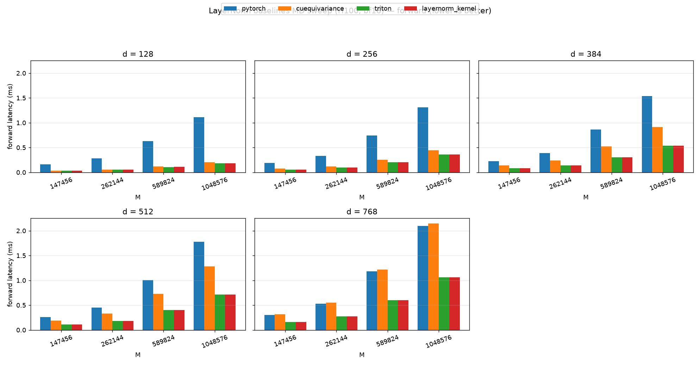
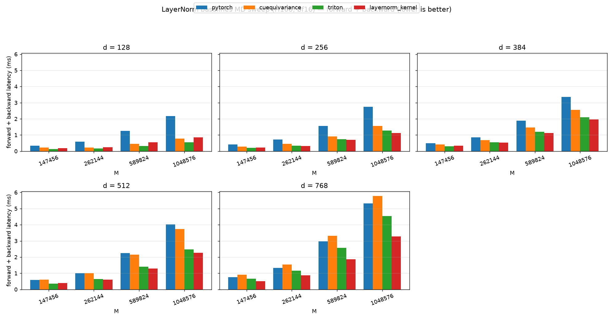

# LayerNorm baselines MD sweep (H100, bf16)

_Source: `src/miniworld_kernels/kernels/layernorm/benchmark/bench_layernorm.out`_

## forward latency (ms)

_table: rows = d, columns = M, cells = backend latencies_

_backends: pytorch / cuequivariance / triton / layernorm_kernel (bold = fastest)_

| d (=d_in=d_out) | M=147456 | M=262144 | M=589824 | M=1048576 |
|---|---|---|---|---|
| 128 | 0.1626 / 0.0369 / **0.0324** / 0.0328 | 0.2840 / 0.0581 / 0.0524 / **0.0521** | 0.6301 / 0.1182 / **0.1077** / 0.1083 | 1.1147 / 0.2033 / 0.1862 / **0.1861** |
| 256 | 0.1907 / 0.0747 / 0.0579 / **0.0577** | 0.3336 / 0.1212 / 0.0971 / **0.0966** | 0.7420 / 0.2550 / 0.2073 / **0.2070** | 1.3139 / 0.4417 / 0.3628 / **0.3625** |
| 384 | 0.2219 / 0.1406 / **0.0829** / 0.0832 | 0.3886 / 0.2425 / 0.1406 / **0.1399** | 0.8663 / 0.5242 / **0.3060** / 0.3064 | 1.5343 / 0.9133 / **0.5372** / 0.5376 |
| 512 | 0.2567 / 0.1903 / **0.1073** / 0.1075 | 0.4505 / 0.3319 / **0.1837** / 0.1839 | 1.0042 / 0.7292 / **0.4038** / **0.4038** | 1.7802 / 1.2828 / 0.7135 / **0.7117** |
| 768 | 0.3016 / 0.3176 / 0.1570 / **0.1568** | 0.5294 / 0.5528 / 0.2723 / **0.2715** | 1.1818 / 1.2165 / **0.5997** / 0.6007 | 2.0948 / 2.1462 / **1.0596** / 1.0618 |

_plot: grouped bar chart with x = M and one subplot per d_

## forward + backward latency (ms)

_table: rows = d, columns = M, cells = backend latencies_

_backends: pytorch / cuequivariance / triton / layernorm_kernel (bold = fastest)_

| d (=d_in=d_out) | M=147456 | M=262144 | M=589824 | M=1048576 |
|---|---|---|---|---|
| 128 | 0.3448 / 0.2198 / **0.1359** / 0.1771 | 0.5828 / 0.2320 / **0.1590** / 0.2467 | 1.2489 / 0.4565 / **0.3175** / 0.5437 | 2.1814 / 0.7713 / **0.5412** / 0.8591 |
| 256 | 0.4186 / 0.2860 / **0.2092** / 0.2216 | 0.7142 / 0.4496 / 0.3469 / **0.3126** | 1.5526 / 0.9136 / 0.7368 / **0.7040** | 2.7485 / 1.5638 / 1.2840 / **1.1245** |
| 384 | 0.4971 / 0.4204 / **0.3085** / 0.3396 | 0.8529 / 0.6911 / 0.5482 / **0.5346** | 1.8821 / 1.4682 / 1.1957 / **1.1230** | 3.3575 / 2.5532 / 2.1035 / **1.9541** |
| 512 | 0.5842 / 0.6097 / **0.3506** / 0.3879 | 1.0070 / 1.0142 / 0.6428 / **0.6076** | 2.2473 / 2.1521 / 1.4076 / **1.2966** | 4.0225 / 3.7302 / 2.4831 / **2.2619** |
| 768 | 0.7564 / 0.9172 / 0.6644 / **0.5050** | 1.3232 / 1.5417 / 1.1585 / **0.8793** | 2.9786 / 3.3092 / 2.5679 / **1.8705** | 5.3259 / 5.7793 / 4.5416 / **3.2778** |

_plot: grouped bar chart with x = M and one subplot per d_

## Correctness summary

_cells show relative Frobenius error / cosine similarity_

| d (=d_in=d_out) | M | backend | fwd rel/cos | dx rel/cos | dw rel/cos | db rel/cos |
|---|---:|---|---|---|---|---|
| 128 | 147456 | pytorch | 0.000e+00 / 1.000000 | 0.000e+00 / 1.000000 | 0.000e+00 / 1.000000 | 0.000e+00 / 1.000000 |
| 256 | 147456 | pytorch | 0.000e+00 / 1.000000 | 0.000e+00 / 1.000000 | 0.000e+00 / 1.000000 | 0.000e+00 / 1.000000 |
| 384 | 147456 | pytorch | 0.000e+00 / 1.000000 | 0.000e+00 / 1.000000 | 0.000e+00 / 1.000000 | 0.000e+00 / 1.000000 |
| 512 | 147456 | pytorch | 0.000e+00 / 1.000000 | 0.000e+00 / 1.000000 | 0.000e+00 / 1.000000 | 0.000e+00 / 1.000000 |
| 768 | 147456 | pytorch | 0.000e+00 / 1.000000 | 0.000e+00 / 1.000000 | 0.000e+00 / 1.000000 | 0.000e+00 / 1.000000 |
| 128 | 262144 | pytorch | 0.000e+00 / 1.000000 | 0.000e+00 / 1.000000 | 0.000e+00 / 1.000000 | 0.000e+00 / 1.000000 |
| 256 | 262144 | pytorch | 0.000e+00 / 1.000000 | 0.000e+00 / 1.000000 | 0.000e+00 / 1.000000 | 0.000e+00 / 1.000000 |
| 384 | 262144 | pytorch | 0.000e+00 / 1.000000 | 0.000e+00 / 1.000000 | 0.000e+00 / 1.000000 | 0.000e+00 / 1.000000 |
| 512 | 262144 | pytorch | 0.000e+00 / 1.000000 | 0.000e+00 / 1.000000 | 0.000e+00 / 1.000000 | 0.000e+00 / 1.000000 |
| 768 | 262144 | pytorch | 0.000e+00 / 1.000000 | 0.000e+00 / 1.000000 | 0.000e+00 / 1.000000 | 0.000e+00 / 1.000000 |
| 128 | 589824 | pytorch | 0.000e+00 / 1.000000 | 0.000e+00 / 1.000000 | 0.000e+00 / 1.000000 | 0.000e+00 / 1.000000 |
| 256 | 589824 | pytorch | 0.000e+00 / 1.000000 | 0.000e+00 / 1.000000 | 0.000e+00 / 1.000000 | 0.000e+00 / 1.000000 |
| 384 | 589824 | pytorch | 0.000e+00 / 1.000000 | 0.000e+00 / 1.000000 | 0.000e+00 / 1.000000 | 0.000e+00 / 1.000000 |
| 512 | 589824 | pytorch | 0.000e+00 / 1.000000 | 0.000e+00 / 1.000000 | 0.000e+00 / 1.000000 | 0.000e+00 / 1.000000 |
| 768 | 589824 | pytorch | 0.000e+00 / 1.000000 | 0.000e+00 / 1.000000 | 0.000e+00 / 1.000000 | 0.000e+00 / 1.000000 |
| 128 | 1048576 | pytorch | 0.000e+00 / 1.000000 | 0.000e+00 / 1.000000 | 0.000e+00 / 1.000000 | 0.000e+00 / 1.000000 |
| 256 | 1048576 | pytorch | 0.000e+00 / 1.000000 | 0.000e+00 / 1.000000 | 0.000e+00 / 1.000000 | 0.000e+00 / 1.000000 |
| 384 | 1048576 | pytorch | 0.000e+00 / 1.000000 | 0.000e+00 / 1.000000 | 0.000e+00 / 1.000000 | 0.000e+00 / 1.000000 |
| 512 | 1048576 | pytorch | 0.000e+00 / 1.000000 | 0.000e+00 / 1.000000 | 0.000e+00 / 1.000000 | 0.000e+00 / 1.000000 |
| 768 | 1048576 | pytorch | 0.000e+00 / 1.000000 | 0.000e+00 / 1.000000 | 0.000e+00 / 1.000000 | 0.000e+00 / 1.000000 |
