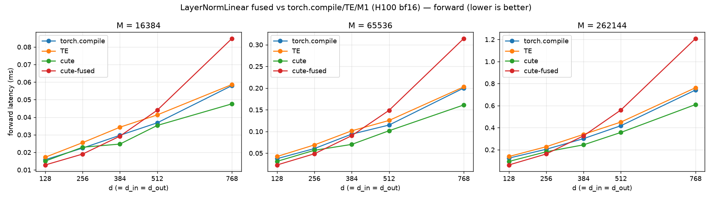
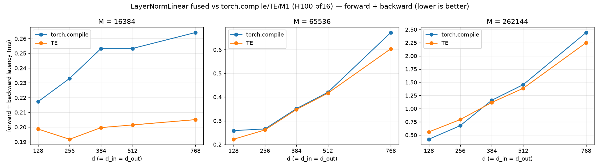

# LayerNormLinear fused vs torch.compile/TE/M1 (H100 bf16)

_Source: `src/miniworld_kernels/kernels/layernorm_linear/benchmark/bench_layernorm_linear.out`_

## forward latency (ms) — `torch.compile` / **TE** (bold = faster)

_backends: torch.compile / TE / cute / cute-fused (bold = fastest)_

| d (=d_in=d_out) | M=16384 | M=65536 | M=262144 |
|---|---|---|---|
| 128 | 0.0158 / 0.0172 / 0.0150 / **0.0128** | 0.0373 / 0.0423 / 0.0311 / **0.0228** | 0.1239 / 0.1385 / 0.0937 / **0.0620** |
| 256 | 0.0224 / 0.0255 / 0.0229 / **0.0190** | 0.0606 / 0.0690 / 0.0566 / **0.0486** | 0.2043 / 0.2274 / 0.1815 / **0.1616** |
| 384 | 0.0297 / 0.0343 / **0.0247** / 0.0292 | 0.0939 / 0.1015 / **0.0702** / 0.0903 | 0.3007 / 0.3393 / **0.2444** / 0.3260 |
| 512 | 0.0368 / 0.0413 / **0.0353** / 0.0440 | 0.1148 / 0.1254 / **0.1017** / 0.1487 | 0.4179 / 0.4509 / **0.3570** / 0.5603 |
| 768 | 0.0580 / 0.0586 / **0.0476** / 0.0848 | 0.2001 / 0.2028 / **0.1611** / 0.3142 | 0.7418 / 0.7627 / **0.6099** / 1.2084 |

## forward + backward latency (ms) — `torch.compile` / **TE** (bold = faster)

_backends: torch.compile / TE (bold = fastest)_

| d (=d_in=d_out) | M=16384 | M=65536 | M=262144 |
|---|---|---|---|
| 128 | 0.2173 / **0.1987** | 0.2585 / **0.2221** | **0.4195** / 0.5582 |
| 256 | 0.2330 / **0.1918** | 0.2657 / **0.2613** | **0.6784** / 0.7935 |
| 384 | 0.2533 / **0.1997** | 0.3511 / **0.3474** | 1.1585 / **1.1163** |
| 512 | 0.2533 / **0.2015** | 0.4201 / **0.4164** | 1.4546 / **1.3858** |
| 768 | 0.2641 / **0.2051** | 0.6721 / **0.6036** | 2.4432 / **2.2511** |

