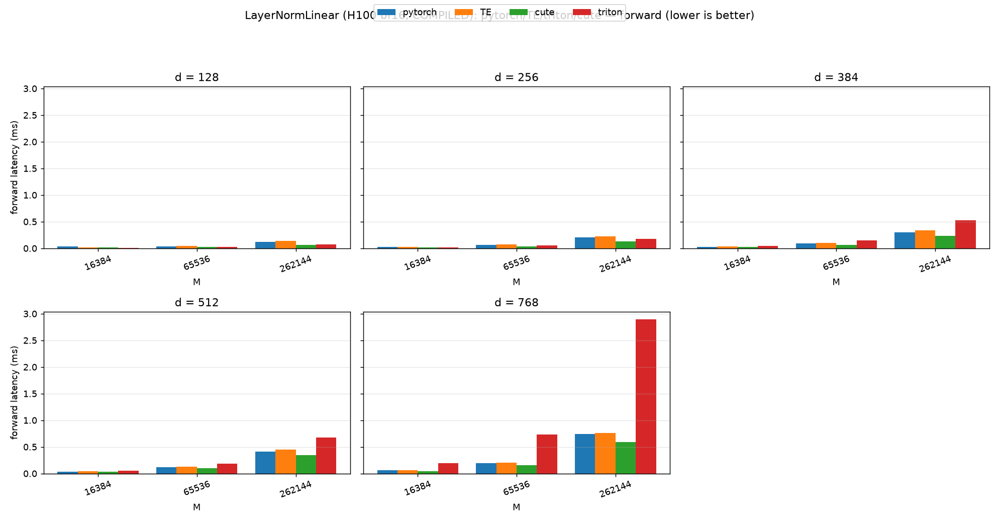
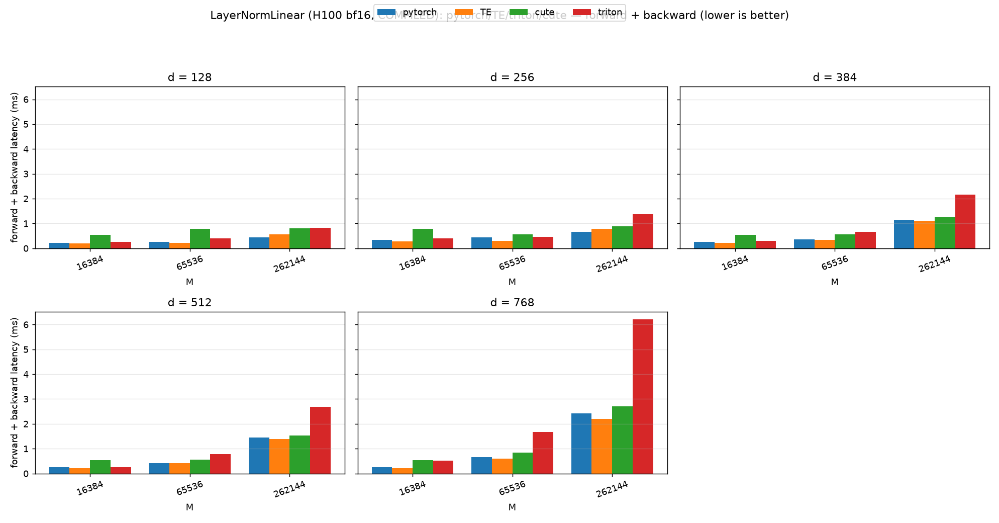

# LayerNormLinear (H100 bf16, COMPILED): pytorch/TE/triton/cute

_Source: `src/miniworld_kernels/kernels/layernorm_linear/benchmark/layernorm_linear.out`_

## forward latency (ms)

_table: rows = d, columns = M, cells = backend latencies_

_backends: pytorch / TE / cute / triton (bold = fastest)_

| d (=d_in=d_out) | M=16384 | M=65536 | M=262144 |
|---|---|---|---|
| 128 | 0.0383 / 0.0177 / 0.0124 / **0.0116** | 0.0374 / 0.0429 / **0.0229** / 0.0268 | 0.1248 / 0.1392 / **0.0614** / 0.0734 |
| 256 | 0.0227 / 0.0255 / **0.0170** / 0.0189 | 0.0608 / 0.0692 / **0.0391** / 0.0578 | 0.2050 / 0.2278 / **0.1287** / 0.1813 |
| 384 | 0.0296 / 0.0346 / **0.0244** / 0.0450 | 0.0934 / 0.1023 / **0.0684** / 0.1483 | 0.2979 / 0.3387 / **0.2378** / 0.5288 |
| 512 | 0.0368 / 0.0414 / **0.0317** / 0.0565 | 0.1149 / 0.1255 / **0.0981** / 0.1892 | 0.4129 / 0.4499 / **0.3464** / 0.6716 |
| 768 | 0.0583 / 0.0589 / **0.0474** / 0.1950 | 0.1970 / 0.2007 / **0.1583** / 0.7337 | 0.7427 / 0.7647 / **0.5947** / 2.8930 |

_plot: grouped bar chart with x = M and one subplot per d_

## forward + backward latency (ms)

_table: rows = d, columns = M, cells = backend latencies_

_backends: pytorch / TE / cute / triton (bold = fastest)_

| d (=d_in=d_out) | M=16384 | M=65536 | M=262144 |
|---|---|---|---|
| 128 | 0.2111 / **0.2028** / 0.5364 / 0.2596 | 0.2555 / **0.2219** / 0.7898 / 0.4028 | **0.4420** / 0.5589 / 0.8059 / 0.8172 |
| 256 | 0.3369 / **0.2838** / 0.7950 / 0.3986 | 0.4405 / **0.3038** / 0.5656 / 0.4530 | **0.6724** / 0.7852 / 0.8904 / 1.3628 |
| 384 | 0.2582 / **0.2097** / 0.5414 / 0.2913 | 0.3515 / **0.3481** / 0.5550 / 0.6557 | 1.1567 / **1.1124** / 1.2542 / 2.1665 |
| 512 | 0.2561 / **0.2117** / 0.5421 / 0.2643 | 0.4188 / **0.4180** / 0.5616 / 0.7902 | 1.4483 / **1.3794** / 1.5393 / 2.6813 |
| 768 | 0.2636 / **0.2117** / 0.5431 / 0.5172 | 0.6638 / **0.5975** / 0.8401 / 1.6797 | 2.4241 / **2.2078** / 2.7149 / 6.2056 |

_plot: grouped bar chart with x = M and one subplot per d_

