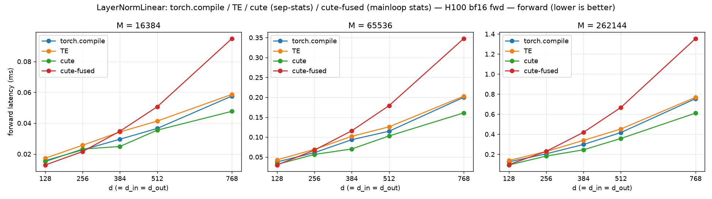
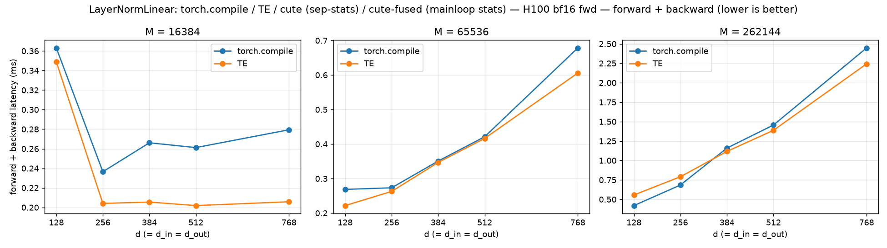

# LayerNormLinear: torch.compile / TE / cute (sep-stats) / cute-fused (mainloop stats) — H100 bf16 fwd

_Source: `src/miniworld_kernels/kernels/layernorm_linear/benchmark/layernorm_linear_cute_sweep.out`_

## forward latency (ms) — `torch.compile` / **TE** (bold = faster)

_backends: torch.compile / TE / cute / cute-fused (bold = fastest)_

| d (=d_in=d_out) | M=16384 | M=65536 | M=262144 |
|---|---|---|---|
| 128 | 0.0157 / 0.0173 / 0.0151 / **0.0129** | 0.0375 / 0.0427 / 0.0313 / **0.0299** | 0.1244 / 0.1390 / **0.0938** / 0.0973 |
| 256 | 0.0227 / 0.0257 / 0.0232 / **0.0216** | 0.0608 / 0.0692 / **0.0564** / 0.0671 | 0.2049 / 0.2282 / **0.1823** / 0.2297 |
| 384 | 0.0296 / 0.0343 / **0.0249** / 0.0348 | 0.0934 / 0.1019 / **0.0701** / 0.1159 | 0.2983 / 0.3396 / **0.2453** / 0.4198 |
| 512 | 0.0366 / 0.0414 / **0.0355** / 0.0507 | 0.1147 / 0.1258 / **0.1029** / 0.1791 | 0.4170 / 0.4525 / **0.3580** / 0.6676 |
| 768 | 0.0576 / 0.0587 / **0.0477** / 0.0949 | 0.2000 / 0.2029 / **0.1608** / 0.3477 | 0.7550 / 0.7688 / **0.6112** / 1.3546 |

## forward + backward latency (ms) — `torch.compile` / **TE** (bold = faster)

_backends: torch.compile / TE (bold = fastest)_

| d (=d_in=d_out) | M=16384 | M=65536 | M=262144 |
|---|---|---|---|
| 128 | 0.3630 / **0.3488** | 0.2687 / **0.2218** | **0.4201** / 0.5567 |
| 256 | 0.2365 / **0.2041** | 0.2733 / **0.2628** | **0.6847** / 0.7913 |
| 384 | 0.2661 / **0.2055** | 0.3507 / **0.3468** | 1.1599 / **1.1170** |
| 512 | 0.2612 / **0.2019** | 0.4212 / **0.4164** | 1.4562 / **1.3882** |
| 768 | 0.2794 / **0.2058** | 0.6781 / **0.6055** | 2.4465 / **2.2421** |

