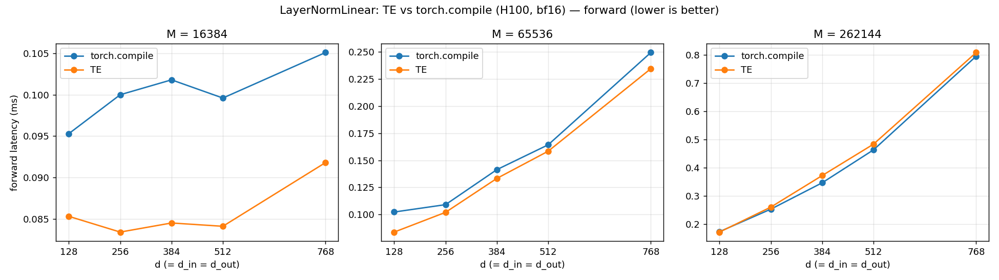
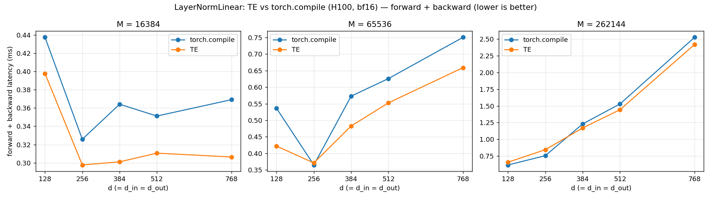

# LayerNormLinear: TE vs torch.compile (H100, bf16)

_Source: `src/miniworld_kernels/kernels/layernorm_linear/benchmark/layernorm_linear_square_sweep.out`_

## forward latency (ms) — `torch.compile` / **TE** (bold = faster)

| d (=d_in=d_out) | M=16384 | M=65536 | M=262144 |
|---|---|---|---|
| 128 | 0.0953 / **0.0853** | 0.1023 / **0.0838** | 0.1740 / **0.1725** |
| 256 | 0.1000 / **0.0834** | 0.1091 / **0.1020** | **0.2537** / 0.2610 |
| 384 | 0.1018 / **0.0845** | 0.1414 / **0.1333** | **0.3470** / 0.3726 |
| 512 | 0.0996 / **0.0841** | 0.1643 / **0.1584** | **0.4636** / 0.4838 |
| 768 | 0.1051 / **0.0918** | 0.2494 / **0.2345** | **0.7951** / 0.8081 |

## forward + backward latency (ms) — `torch.compile` / **TE** (bold = faster)

| d (=d_in=d_out) | M=16384 | M=65536 | M=262144 |
|---|---|---|---|
| 128 | 0.4373 / **0.3977** | 0.5360 / **0.4219** | **0.6166** / 0.6575 |
| 256 | 0.3258 / **0.2977** | **0.3651** / 0.3712 | **0.7556** / 0.8455 |
| 384 | 0.3641 / **0.3011** | 0.5729 / **0.4827** | 1.2310 / **1.1707** |
| 512 | 0.3512 / **0.3106** | 0.6260 / **0.5526** | 1.5297 / **1.4430** |
| 768 | 0.3691 / **0.3064** | 0.7506 / **0.6590** | 2.5271 / **2.4198** |

