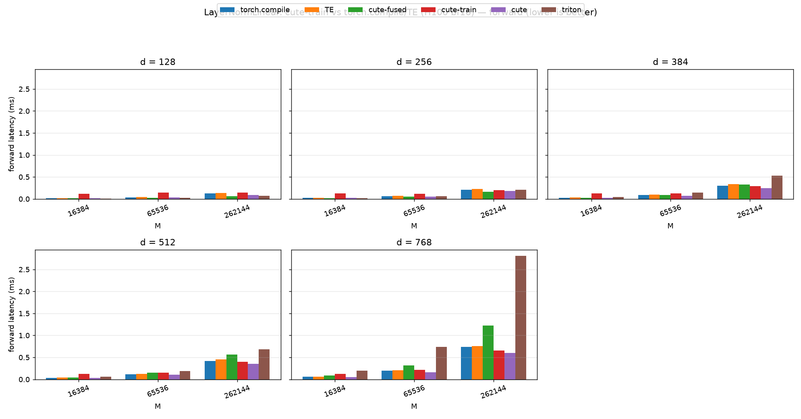
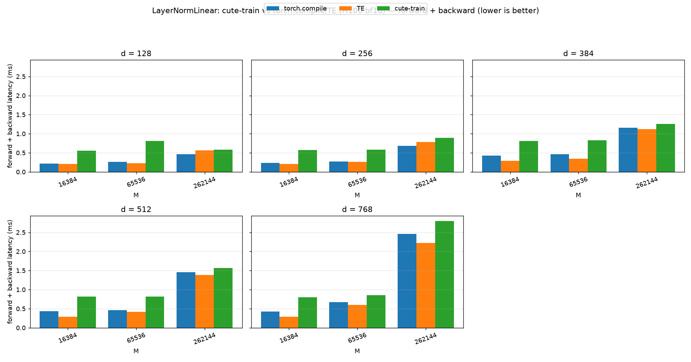

# LayerNormLinear: cute-train vs torch.compile/TE (H100 bf16)

_Source: `src/miniworld_kernels/kernels/layernorm_linear/benchmark/bench_fwd_bwd.out`_

## forward latency (ms)

_table: rows = d, columns = M, cells = backend latencies_

_backends: torch.compile / TE / cute-fused / cute-train / cute / triton (bold = fastest)_

| d (=d_in=d_out) | M=16384 | M=65536 | M=262144 |
|---|---|---|---|
| 128 | 0.0170 / 0.0174 / 0.0130 / 0.1213 / 0.0153 / **0.0114** | 0.0375 / 0.0428 / **0.0228** / 0.1420 / 0.0315 / 0.0262 | 0.1244 / 0.1390 / **0.0620** / 0.1481 / 0.0939 / 0.0741 |
| 256 | 0.0252 / 0.0257 / 0.0194 / 0.1224 / 0.0227 / **0.0187** | 0.0611 / 0.0692 / **0.0485** / 0.1207 / 0.0562 / 0.0582 | 0.2050 / 0.2283 / **0.1656** / 0.1973 / 0.1804 / 0.2061 |
| 384 | 0.0295 / 0.0344 / 0.0294 / 0.1255 / **0.0251** / 0.0450 | 0.0936 / 0.1023 / 0.0909 / 0.1247 / **0.0699** / 0.1483 | 0.2973 / 0.3390 / 0.3301 / 0.2892 / **0.2433** / 0.5313 |
| 512 | 0.0367 / 0.0415 / 0.0437 / 0.1209 / **0.0357** / 0.0562 | 0.1144 / 0.1259 / 0.1492 / 0.1498 / **0.1024** / 0.1903 | 0.4141 / 0.4516 / 0.5611 / 0.3973 / **0.3567** / 0.6794 |
| 768 | 0.0579 / 0.0587 / 0.0849 / 0.1284 / **0.0477** / 0.1957 | 0.1979 / 0.2029 / 0.3154 / 0.2127 / **0.1579** / 0.7375 | 0.7357 / 0.7534 / 1.2236 / 0.6536 / **0.6006** / 2.8073 |

_plot: grouped bar chart with x = M and one subplot per d_

## forward + backward latency (ms)

_table: rows = d, columns = M, cells = backend latencies_

_backends: torch.compile / TE / cute-train (bold = fastest)_

| d (=d_in=d_out) | M=16384 | M=65536 | M=262144 |
|---|---|---|---|
| 128 | 0.2139 / **0.2052** / 0.5551 | 0.2642 / **0.2230** / 0.8114 | **0.4618** / 0.5590 / 0.5780 |
| 256 | 0.2359 / **0.2040** / 0.5704 | 0.2721 / **0.2627** / 0.5821 | **0.6859** / 0.7862 / 0.8900 |
| 384 | 0.4304 / **0.2939** / 0.8103 | 0.4662 / **0.3472** / 0.8248 | 1.1571 / **1.1171** / 1.2544 |
| 512 | 0.4352 / **0.2874** / 0.8171 | 0.4658 / **0.4172** / 0.8211 | 1.4516 / **1.3839** / 1.5636 |
| 768 | 0.4263 / **0.2883** / 0.8036 | 0.6701 / **0.6018** / 0.8554 | 2.4582 / **2.2254** / 2.7950 |

_plot: grouped bar chart with x = M and one subplot per d_

