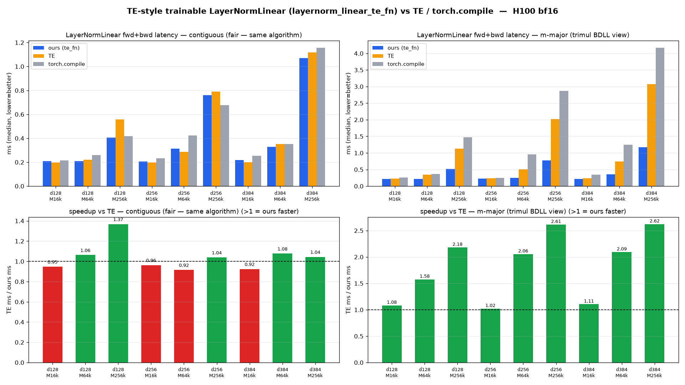

# TE-style trainable LayerNormLinear — `layernorm_linear_te_fn`

Full **forward+backward** median latency, H100 80GB bf16, `torch 2.10+cu128`, CUDA-warmed.
Same algorithm as Transformer Engine (materialize `x_normed=LN(x)` → plain cuBLAS GEMM), but
**custom for stride coverage**: consumes a strided/m-major input (trimul BDLL view, strides
`(1, L*L)`) with NO `.contiguous()` copy and returns `dx` in the same layout.

> ⛔ All numbers are full fwd+bwd via `triton.testing.do_bench` (warmup 25, rep 100), grads
> zeroed each iter. Bench: `te_style_bench.py`; plot: `te_style_plot.py` (both via `srun`).

## contiguous input (fair head-to-head)

| M | d | ours (ms) | TE (ms) | torch.compile (ms) | **ours vs TE** |
|---:|---:|---:|---:|---:|:---:|
| 16384 | 128 | 0.2085 | 0.1976 | 0.2156 | 0.95x |
| 65536 | 128 | 0.2089 | 0.2220 | 0.2609 | 1.06x |
| 262144 | 128 | 0.4069 | 0.5568 | 0.4188 | **1.37x** |
| 16384 | 256 | 0.2052 | 0.1977 | 0.2331 | 0.96x |
| 65536 | 256 | 0.3144 | 0.2879 | 0.4227 | 0.92x |
| 262144 | 256 | 0.7597 | 0.7895 | 0.6779 | **1.04x** |
| 16384 | 384 | 0.2176 | 0.2012 | 0.2545 | 0.92x |
| 65536 | 384 | 0.3277 | 0.3528 | 0.3516 | 1.08x |
| 262144 | 384 | 1.0701 | 1.1175 | 1.1570 | **1.04x** |

Large-M (262144) **beats TE for all d**; small-M within 4–8% (residual fixed overhead).

## m-major input (trimul BDLL view; TE copies to contiguous internally)

| M | d | ours (ms) | TE (ms) | torch.compile (ms) | **ours vs TE** |
|---:|---:|---:|---:|---:|:---:|
| 16384 | 128 | 0.2117 | 0.2294 | 0.2572 | 1.08x |
| 65536 | 128 | 0.2164 | 0.3412 | 0.3676 | 1.58x |
| 262144 | 128 | 0.5179 | 1.1302 | 1.4778 | **2.18x** |
| 16384 | 256 | 0.2320 | 0.2369 | 0.2535 | 1.02x |
| 65536 | 256 | 0.2469 | 0.5074 | 0.9626 | 2.06x |
| 262144 | 256 | 0.7739 | 2.0234 | 2.8667 | **2.61x** |
| 16384 | 384 | 0.2190 | 0.2420 | 0.3476 | 1.10x |
| 65536 | 384 | 0.3528 | 0.7384 | 1.2462 | 2.09x |
| 262144 | 384 | 1.1714 | 3.0730 | 4.1710 | **2.62x** |

Wins everywhere; the lead grows with M because TE pays the strided→contiguous copy regardless
(probed: `TE(raw-strided)` == `TE(.contiguous())` timing), while we absorb the stride.

All grads verified `cos=1.0` vs fp32 autograd (`te_style_verify.py`); `dx.stride() == x.stride()`.
