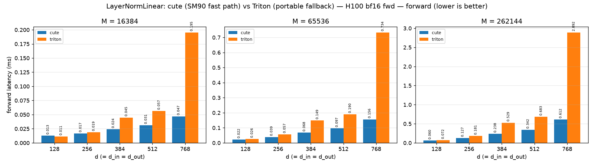

# LayerNormLinear: cute (SM90 fast path) vs Triton (portable fallback) — H100 bf16 fwd

_Source: `src/miniworld_kernels/kernels/layernorm_linear/benchmark/triton_vs_cute.out`_

## forward latency (ms) — `torch.compile` / **TE** (bold = faster)

_backends: cute / triton (bold = fastest)_

| d (=d_in=d_out) | M=16384 | M=65536 | M=262144 |
|---|---|---|---|
| 128 | 0.0127 / **0.0112** | **0.0224** / 0.0259 | **0.0602** / 0.0717 |
| 256 | **0.0167** / 0.0188 | **0.0387** / 0.0568 | **0.1269** / 0.1814 |
| 384 | **0.0240** / 0.0448 | **0.0678** / 0.1487 | **0.2380** / 0.5286 |
| 512 | **0.0313** / 0.0565 | **0.0966** / 0.1903 | **0.3422** / 0.6832 |
| 768 | **0.0469** / 0.1954 | **0.1557** / 0.7335 | **0.6116** / 2.8918 |

