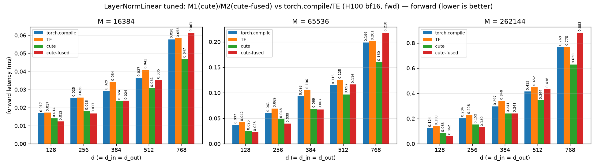

# LayerNormLinear tuned: M1(cute)/M2(cute-fused) vs torch.compile/TE (H100 bf16, fwd)

_Source: `src/miniworld_kernels/kernels/layernorm_linear/benchmark/tuned_lnl.out`_

## forward latency (ms) — `torch.compile` / **TE** (bold = faster)

_backends: torch.compile / TE / cute / cute-fused (bold = fastest)_

| d (=d_in=d_out) | M=16384 | M=65536 | M=262144 |
|---|---|---|---|
| 128 | 0.0170 / 0.0173 / 0.0141 / **0.0123** | 0.0373 / 0.0423 / 0.0247 / **0.0226** | 0.1244 / 0.1379 / 0.0847 / **0.0623** |
| 256 | 0.0254 / 0.0256 / 0.0181 / **0.0167** | 0.0606 / 0.0692 / 0.0483 / **0.0394** | 0.2045 / 0.2280 / 0.1518 / **0.1300** |
| 384 | 0.0293 / 0.0342 / **0.0237** / 0.0238 | 0.0932 / 0.1057 / 0.0685 / **0.0672** | 0.2974 / 0.3404 / 0.2414 / **0.2411** |
| 512 | 0.0366 / 0.0410 / **0.0308** / 0.0353 | 0.1146 / 0.1254 / **0.0968** / 0.1163 | 0.4155 / 0.4519 / **0.3444** / 0.4377 |
| 768 | 0.0577 / 0.0583 / **0.0470** / 0.0615 | 0.1987 / 0.2007 / **0.1603** / 0.2180 | 0.7695 / 0.7700 / **0.6302** / 0.8828 |

