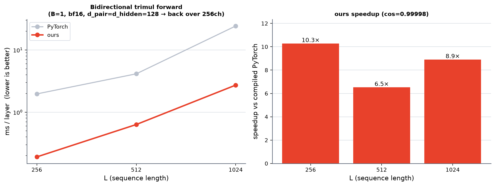

# Bidirectional trimul forward — ours vs PyTorch

`BidirectionalTriangleMultiplication` (outgoing + incoming in one block): shares one
LN_in, projects the pair to `2·d_hidden` channels, splits them (first half →
outgoing `bikd,bjkd→bijd`, second half → incoming `bkid,bkjd→bijd`), concatenates to
`2·d_hidden`, LN_out, projects down to `d_pair`, gates.

**ours** reuses the trimul_inproj fusion with bidirectional dims (no new algorithm,
just wider/rectangular GEMMs + a 2-way bmm):

```
LN_in (triton) → trimul_inproj front (ONE gated GEMM, left/right each 2h wide, bdll)
  → outgoing einsum on [:h] + incoming einsum on [h:] → cat [B,2h,L,L]
  → SPLIT back: ① cute LayerNormLinear (K=2h → N=d_pair)  ② triton GateElem (d_pair)
```

The back runs over `2·d_hidden = 256` channels (d_pair=d_hidden=128), exactly the
regime where the *single* fused back fails to compile (regs/shared) — so the
**split back** (cute LayerNormLinear + triton GateElem) is what makes it viable.

**Regime (BENCHMARKING.md HARD RULE):** pytorch = `torch.compile(reduce-overhead)`,
no eager. ours = manual CUDA-graph. B=1, bf16, no mask. H100 80GB. `bidir_bench.py`.

## Result (forward, ms/layer; lower is better)

| L | pytorch (compiled) | ours | speedup | cos(ours, pytorch) |
|----:|-----------------:|--------:|--------:|:------------------:|
| 256 | 1.965 | **0.191** | 10.3× | 0.99998 |
| 512 | 4.131 | **0.633** | 6.5× | 0.99998 |
| 1024 | 24.248 | **2.722** | 8.9× | 0.99998 |



## Findings

- ours is **correct** (cos 0.99998 vs pytorch at every L) and **6.5–10× faster**
  than compiled PyTorch.
- The whole win comes from reusing the existing fusion with only dim changes:
  - front: `out_hidden=2h` on `trimul_inproj_cute_forward` (one wider gated GEMM).
  - bmm: two einsums (outgoing/incoming) on the channel halves, then concat.
  - back: the **split** path (cute LayerNormLinear K=2h→d_pair + triton GateElem),
    which is the only back that compiles at the 256-channel width.
- d_pair=512 (i.e. 2h=1024) would still hit the GateElem/LNL full-N limit — same
  N-tiling work tracked for the single-direction kernel.

## Next

- dtv1-like / cuequivariance-like fused kernels for bidirectional (planned), to
  compare against this ours baseline (and against those libs' own bidirectional, if any).
- Backward (training) path: the split back's bwd + the two-direction bmm bwd.

## Reproduce

```bash
# bench (GPU)
srun --partition=h100 --account=cssb --qos=cssb_h100 --gres=gpu:h100:1 \
     --cpus-per-task=8 --mem=80G --time=00:30:00 \
     bash -c 'export LD_LIBRARY_PATH=$CONDA_PREFIX/lib:$LD_LIBRARY_PATH && export QUACK_CACHE_DIR=<fresh> && \
       PYTHONPATH=src pixi run --frozen python \
       src/miniworld_kernels/kernels/trimul_inproj/cute/bidir_bench.py' > .../benchmark/bidir.out 2>&1
# render (CPU only, NO --gres)
srun --partition=h100 --account=cssb --qos=cssb_h100 --cpus-per-task=4 --mem=16G --time=00:08:00 \
     bash -c 'export LD_LIBRARY_PATH=$CONDA_PREFIX/lib:$LD_LIBRARY_PATH && \
       PYTHONPATH=src pixi run --frozen python \
       src/miniworld_kernels/kernels/trimul_inproj/cute/bidir_plot.py'
```
