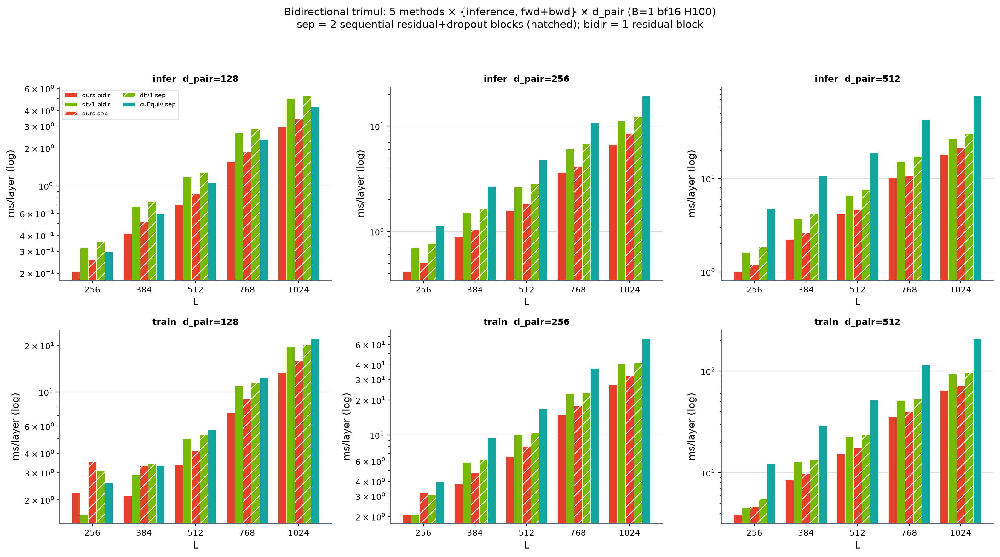

# Bidirectional trimul — full matrix (5 methods × {inference, fwd+bwd} × d × L)

ms / layer, B=1 bf16 H100. **sep** = faithful pairformer (2 sequential single-dir residual blocks, incoming sees the outgoing-updated pair, rowwise dropout p=0.25). **bidir** = one fused bidirectional update in one residual block. inference = forward no_grad, CUDA-graph (ours uses dedicated inference path). train = fwd+bwd, dropout on, torch.compile, event-timed. cuequiv = vendor op, sep only (can't fuse). cos 0.99998+ vs fp32 ref. **bold = fastest in row.**

# INFER
## d_pair=128

| L | ours bidir | dtv1 bidir | ours sep | dtv1 sep | cuEquiv sep |
|---|---|---|---|---|---|
| 256 | **0.207** | 0.317 | 0.254 | 0.361 | 0.296 |
| 384 | **0.416** | 0.685 | 0.514 | 0.753 | 0.598 |
| 512 | **0.707** | 1.176 | 0.859 | 1.284 | 1.060 |
| 768 | **1.569** | 2.643 | 1.867 | 2.852 | 2.348 |
| 1024 | **2.948** | 5.000 | 3.418 | 5.238 | 4.301 |

## d_pair=256

| L | ours bidir | dtv1 bidir | ours sep | dtv1 sep | cuEquiv sep |
|---|---|---|---|---|---|
| 256 | **0.419** | 0.697 | 0.508 | 0.772 | 1.128 |
| 384 | **0.893** | 1.510 | 1.042 | 1.632 | 2.688 |
| 512 | **1.581** | 2.635 | 1.841 | 2.853 | 4.753 |
| 768 | **3.636** | 6.049 | 4.157 | 6.795 | 10.730 |
| 1024 | **6.702** | 11.126 | 8.541 | 12.369 | 19.393 |

## d_pair=512

| L | ours bidir | dtv1 bidir | ours sep | dtv1 sep | cuEquiv sep |
|---|---|---|---|---|---|
| 256 | **1.015** | 1.628 | 1.188 | 1.854 | 4.785 |
| 384 | **2.230** | 3.713 | 2.613 | 4.215 | 10.751 |
| 512 | **4.186** | 6.616 | 4.675 | 7.692 | 19.095 |
| 768 | **10.209** | 15.337 | 10.611 | 17.397 | 43.101 |
| 1024 | **18.119** | 26.764 | 21.158 | 30.360 | 77.200 |

# TRAIN
## d_pair=128

| L | ours bidir | dtv1 bidir | ours sep | dtv1 sep | cuEquiv sep |
|---|---|---|---|---|---|
| 256 | 2.214 | **1.606** | 3.534 | 3.085 | 2.575 |
| 384 | **2.126** | 2.892 | 3.320 | 3.433 | 3.328 |
| 512 | **3.372** | 4.961 | 4.146 | 5.252 | 5.698 |
| 768 | **7.388** | 10.936 | 8.968 | 11.436 | 12.450 |
| 1024 | **13.342** | 19.602 | 15.965 | 20.305 | 22.105 |

## d_pair=256

| L | ours bidir | dtv1 bidir | ours sep | dtv1 sep | cuEquiv sep |
|---|---|---|---|---|---|
| 256 | 2.086 | **2.085** | 3.217 | 3.058 | 3.933 |
| 384 | **3.804** | 5.851 | 4.714 | 6.144 | 9.518 |
| 512 | **6.555** | 10.176 | 8.023 | 10.473 | 16.686 |
| 768 | **15.016** | 22.761 | 17.898 | 23.290 | 37.448 |
| 1024 | **27.161** | 40.946 | 32.412 | 41.889 | 66.973 |

## d_pair=512

| L | ours bidir | dtv1 bidir | ours sep | dtv1 sep | cuEquiv sep |
|---|---|---|---|---|---|
| 256 | **3.892** | 4.547 | 4.624 | 5.593 | 12.303 |
| 384 | **8.512** | 12.871 | 9.805 | 13.435 | 29.422 |
| 512 | **15.282** | 22.726 | 17.441 | 23.621 | 51.897 |
| 768 | **35.292** | 51.562 | 39.774 | 53.212 | 116.578 |
| 1024 | **64.731** | 93.522 | 72.184 | 96.204 | 207.824 |

