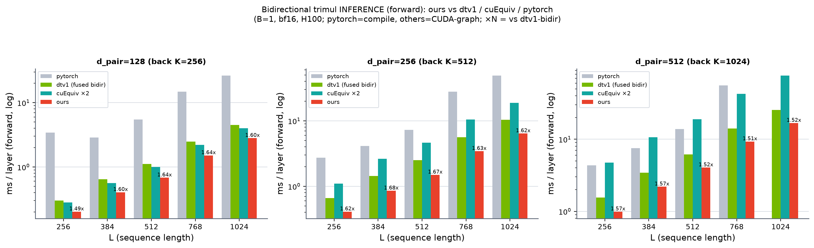

# Bidirectional trimul INFERENCE (forward) — ours vs dtv1 / cuEquiv / pytorch

B=1, bf16, H100. Forward only, no_grad. pytorch=`torch.compile`; dtv1-bidir / cuequiv / ours = manual CUDA-graph (deployment regime). ms / layer. ours uses the dedicated inference path `bidirectional_trimul_ours`. Correctness: ours & dtv1_bidir cos 0.99998 vs fp32 ref (all L).

## d_pair=128 (back K=256)

| L | pytorch | dtv1-bidir | cuEquiv×2 | ours | vs dtv1 | vs cuEquiv |
|---|---|---|---|---|---|---|
| 256 | 3.434 | 0.301 | 0.282 | 0.202 | 1.49x | 1.40x |
| 384 | 2.878 | 0.646 | 0.563 | 0.404 | 1.60x | 1.39x |
| 512 | 5.491 | 1.115 | 1.001 | 0.680 | 1.64x | 1.47x |
| 768 | 14.836 | 2.473 | 2.211 | 1.511 | 1.64x | 1.46x |
| 1024 | 26.483 | 4.480 | 4.018 | 2.807 | 1.60x | 1.43x |

## d_pair=256 (back K=512)

| L | pytorch | dtv1-bidir | cuEquiv×2 | ours | vs dtv1 | vs cuEquiv |
|---|---|---|---|---|---|---|
| 256 | 2.744 | 0.661 | 1.099 | 0.409 | 1.62x | 2.69x |
| 384 | 4.113 | 1.433 | 2.625 | 0.853 | 1.68x | 3.08x |
| 512 | 7.253 | 2.498 | 4.635 | 1.496 | 1.67x | 3.10x |
| 768 | 27.853 | 5.607 | 10.447 | 3.439 | 1.63x | 3.04x |
| 1024 | 49.338 | 10.405 | 18.864 | 6.408 | 1.62x | 2.94x |

## d_pair=512 (back K=1024)

| L | pytorch | dtv1-bidir | cuEquiv×2 | ours | vs dtv1 | vs cuEquiv |
|---|---|---|---|---|---|---|
| 256 | 4.342 | 1.551 | 4.755 | 0.989 | 1.57x | 4.81x |
| 384 | 7.547 | 3.446 | 10.626 | 2.192 | 1.57x | 4.85x |
| 512 | 13.784 | 6.144 | 18.864 | 4.044 | 1.52x | 4.67x |
| 768 | 55.866 | 14.061 | 42.603 | 9.296 | 1.51x | 4.58x |
| 1024 | OOM | 25.558 | 76.615 | 16.764 | 1.52x | 4.57x |

