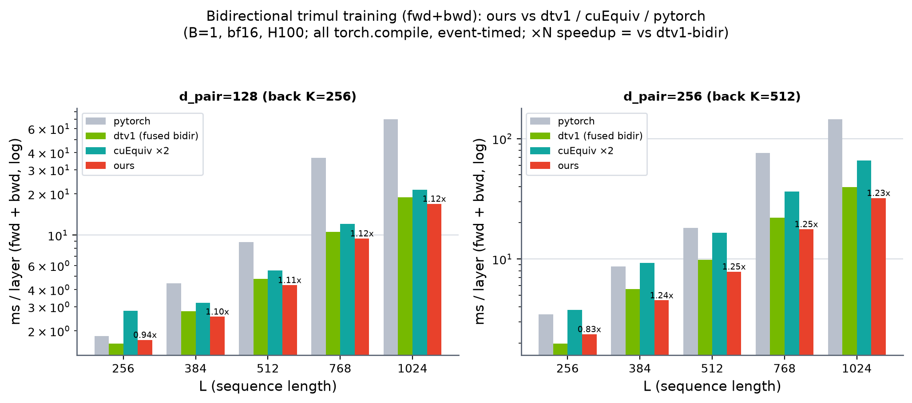

# Bidirectional trimul training (fwd+bwd) — ours vs dtv1 / cuEquiv / pytorch

B=1, bf16, H100. All methods `torch.compile` (default), params require grad (exact training), event-timed. ms / layer. Correctness: all grads cos 0.99997+ vs fp32 ref (PASS all L).

`dtv1_bidir` = a FUSED bidirectional dt-v1 built from dt-v1's OWN kernels with the SAME architecture as ours (apples-to-apples). `cuequiv_x2` = the cuequiv vendor op run for both directions (a black-box op can't be re-fused). `pytorch_bmm` (efficient matmul contraction) is reference-only — just slow at large L.

## d_pair=128 (back K=256)

| L | pytorch | dtv1-bidir | cuEquiv×2 | ours | vs dtv1 | vs cuEquiv |
|---|---|---|---|---|---|---|
| 256 | 1.829 | 1.608 | 2.802 | 1.717 | 0.94x | 1.63x |
| 384 | 4.453 | 2.780 | 3.194 | 2.538 | 1.10x | 1.26x |
| 512 | 8.911 | 4.790 | 5.538 | 4.315 | 1.11x | 1.28x |
| 768 | 36.686 | 10.562 | 12.056 | 9.451 | 1.12x | 1.28x |
| 1024 | 70.241 | 18.945 | 21.436 | 16.947 | 1.12x | 1.26x |

## d_pair=256 (back K=512)

| L | pytorch | dtv1-bidir | cuEquiv×2 | ours | vs dtv1 | vs cuEquiv |
|---|---|---|---|---|---|---|
| 256 | 3.477 | 1.977 | 3.788 | 2.374 | 0.83x | 1.60x |
| 384 | 8.666 | 5.639 | 9.292 | 4.536 | 1.24x | 2.05x |
| 512 | 18.133 | 9.815 | 16.550 | 7.863 | 1.25x | 2.10x |
| 768 | 76.226 | 22.036 | 36.437 | 17.688 | 1.25x | 2.06x |
| 1024 | 144.860 | 39.545 | 65.648 | 32.127 | 1.23x | 2.04x |

