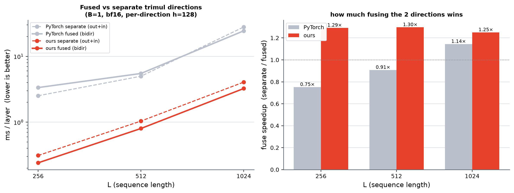

# Is fusing the two trimul directions actually faster? (bidirectional vs separate)

team-gm pairformer (`src/team_gm/modules/blocks/pairformer.py`) applies trimul as TWO
**sequential** residual blocks, each with rowwise dropout:

```python
pair = pair + drop_row(tri_multi_outgoing(pair))
pair = pair + drop_row(tri_multi_incoming(pair))   # incoming sees the UPDATED pair
```

The two directions are **sequentially dependent** — incoming reads the
outgoing-updated pair. (An earlier version of this bench wrongly computed both from
the same `pair` and summed; fixed here to the faithful sequential-residual+dropout
block.) The **fused** alternative is the bidirectional block — both directions from
ONE shared input, ONE residual:

```python
pair = pair + drop_row(bidirectional(pair))
```

> Semantic caveat: bidirectional CANNOT see the outgoing-updated pair (both come from
> the same input), so it is a **different model**, not a drop-in replacement. This
> bench answers the SPEED question only. Equal per-direction hidden h = d_pair = 128.

**Regime (BENCHMARKING.md):** pytorch = `torch.compile`; ours = manual CUDA-graph; no
eager. **Timed in train mode** (dropout p=0.25 active — the training-forward regime).
cos checked in eval mode (dropout off). B=1, bf16, no mask. H100 80GB.

## Result (ms/layer; `fuse↑` = separate / fused)

| L | ours_sep | ours_bidir | **ours fuse↑** | py_sep | py_bidir | py fuse↑ |
|----:|---------:|-----------:|:--------------:|-------:|---------:|:--------:|
| 256 | 0.312 | **0.241** | **1.29×** | 2.520 | 3.351 | 0.75× |
| 512 | 1.039 | **0.801** | **1.30×** | 4.985 | 5.490 | 0.91× |
| 1024 | 4.058 | **3.245** | **1.25×** | 27.916 | 24.400 | 1.14× |

cos(ours, pytorch), eval: ours_sep 0.99998, ours_bidir 0.99999 at every L.



## Findings

- **ours: fusing is consistently ~1.25–1.30× faster** than the faithful
  sequential-residual separate block, across L. The L³ contraction is identical
  either way; the win is saved 2nd LN_in + single pair-read (one wider front GEMM) +
  one back + one residual/dropout instead of two. It does not grow with L (launch/LN/
  traffic, not FLOPs).
- **pytorch fuse↑ is unreliable** (0.75–1.14×, even <1 at small L). The compiled
  baseline's CUDA-graph capture under `reduce-overhead` is unstable — e.g.
  pytorch_bidir@L256 measures 3.351 ms here vs 0.704 ms in another run. Do **not**
  read the pytorch fuse↑ as a real trend; only the ours numbers (both manual
  CUDA-graph, stable) are trustworthy here.
- **Fusing changes the model** (incoming no longer sees the outgoing update), so the
  ~1.3× is the speed of *switching to* a bidirectional block, not a free speedup on
  the existing pairformer. Model-quality impact must be evaluated separately.

## Reproduce

```bash
srun --partition=h100 --account=cssb --qos=cssb_h100 --gres=gpu:h100:1 \
     --cpus-per-task=8 --mem=80G --time=00:30:00 \
     bash -c 'export LD_LIBRARY_PATH=$CONDA_PREFIX/lib:$LD_LIBRARY_PATH && export QUACK_CACHE_DIR=<fresh> && \
       PYTHONPATH=src pixi run --frozen python \
       src/miniworld_kernels/kernels/trimul_inproj/cute/bidir_vs_separate_bench.py' > .../benchmark/bidir_vs_sep.out 2>&1
srun --partition=h100 --account=cssb --qos=cssb_h100 --cpus-per-task=4 --mem=16G --time=00:08:00 \
     bash -c 'export LD_LIBRARY_PATH=$CONDA_PREFIX/lib:$LD_LIBRARY_PATH && \
       PYTHONPATH=src pixi run --frozen python \
       src/miniworld_kernels/kernels/trimul_inproj/cute/bidir_vs_sep_plot.py'
```
