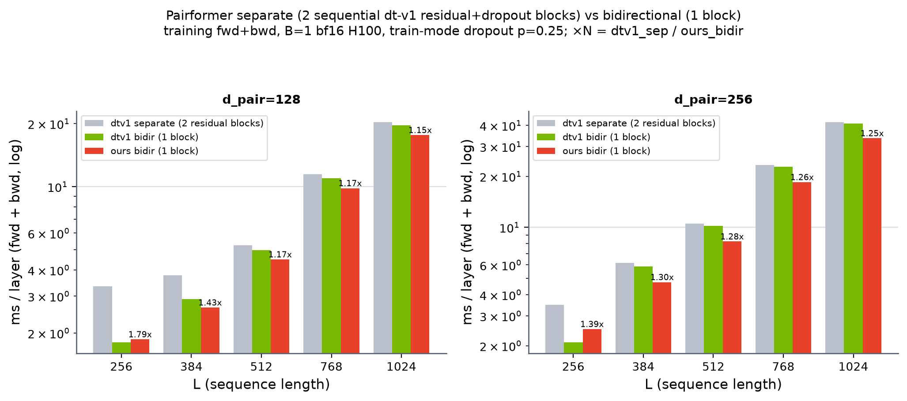

# Separate (dt-v1 out+in, sequential residual+dropout) vs Bidirectional — training

B=1, bf16, H100. `torch.compile`, params require grad, train-mode rowwise dropout p=0.25, event-timed. ms / layer (fwd+bwd). Correctness (eval, dropout off) vs fp32 ref: all cos 0.99999.

`dtv1_sep` = the faithful pairformer block — `pair += drop(dtv1_out(pair)); pair += drop(dtv1_in(pair))` (incoming sees the outgoing-updated pair). `dtv1_bidir` / `ours_bidir` = one fused bidirectional update in a single residual. **NOTE: bidirectional is a DIFFERENT model** (both directions from the same input, cannot see the outgoing update) — this is the speed comparison only.

`fuse↑` = dtv1_sep / bidir (how much one fused block beats two separate blocks).

## d_pair=128

| L | dtv1_sep | dtv1_bidir | ours_bidir | dtv1 fuse↑ | ours fuse↑ |
|---|---|---|---|---|---|
| 256 | 3.335 | 1.806 | 1.864 | 1.85x | 1.79x |
| 384 | 3.777 | 2.908 | 2.645 | 1.30x | 1.43x |
| 512 | 5.257 | 4.974 | 4.490 | 1.06x | 1.17x |
| 768 | 11.465 | 10.951 | 9.836 | 1.05x | 1.17x |
| 1024 | 20.365 | 19.662 | 17.632 | 1.04x | 1.15x |

## d_pair=256

| L | dtv1_sep | dtv1_bidir | ours_bidir | dtv1 fuse↑ | ours fuse↑ |
|---|---|---|---|---|---|
| 256 | 3.476 | 2.095 | 2.505 | 1.66x | 1.39x |
| 384 | 6.147 | 5.860 | 4.743 | 1.05x | 1.30x |
| 512 | 10.522 | 10.206 | 8.244 | 1.03x | 1.28x |
| 768 | 23.323 | 22.801 | 18.474 | 1.02x | 1.26x |
| 1024 | 41.883 | 41.066 | 33.570 | 1.02x | 1.25x |

