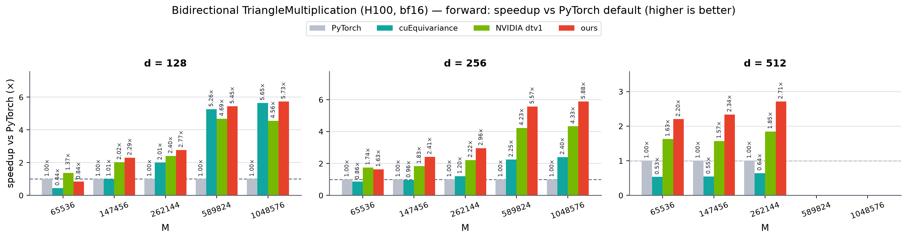
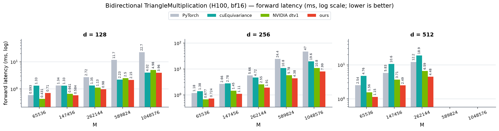
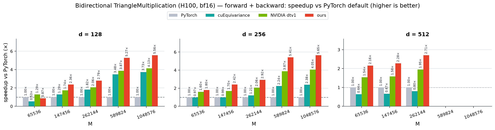
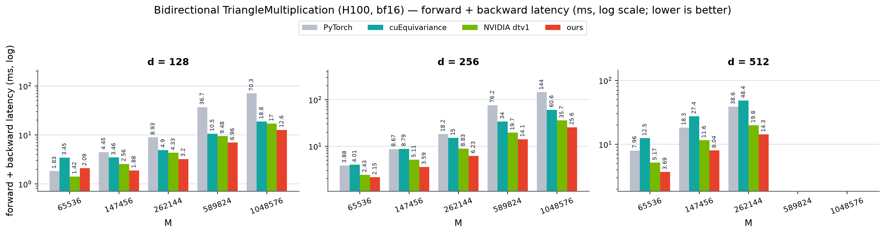

# Bidirectional TriangleMultiplication (H100, bf16)

_Source: `src/miniworld_kernels/kernels/trimul_inproj/benchmark/bidirectional.out`_

## forward: speedup vs PyTorch default (×)

_higher is better; table rows = d, columns = M, bold = fastest. See `bidirectional_fwd_speedup.png`._

_speedup of cuEquivariance / NVIDIA dtv1 / ours vs PyTorch (bold = best)_

| d (=d_in=d_out) | M=65536 | M=147456 | M=262144 | M=589824 | M=1048576 |
|---|---|---|---|---|---|
| 128 | 0.44× / **1.37×** / 0.84× | 1.01× / 2.02× / **2.29×** | 2.01× / 2.40× / **2.77×** | 5.26× / 4.69× / **5.45×** | 5.65× / 4.56× / **5.73×** |
| 256 | 0.86× / **1.74×** / 1.63× | 0.96× / 1.83× / **2.41×** | 1.20× / 2.22× / **2.96×** | 2.25× / 4.23× / **5.57×** | 2.40× / 4.33× / **5.88×** |
| 512 | 0.53× / 1.63× / **2.20×** | 0.55× / 1.57× / **2.34×** | 0.64× / 1.85× / **2.71×** | — | — |

### forward latency (ms)

_absolute latency, log scale, lower is better; rows = d, columns = M_

_backends: pytorch / cuequivariance / dtv1 / ours (bold = fastest)_

| d (=d_in=d_out) | M=65536 | M=147456 | M=262144 | M=589824 | M=1048576 |
|---|---|---|---|---|---|
| 128 | 0.5930 / 1.3337 / **0.4315** / 0.7098 | 1.3380 / 1.3257 / 0.6612 / **0.5836** | 2.7154 / 1.3510 / 1.1294 / **0.9800** | 11.7145 / 2.2253 / 2.4984 / **2.1504** | 22.6909 / 4.0195 / 4.9789 / **3.9569** |
| 256 | 1.1821 / 1.3807 / **0.6775** / 0.7244 | 2.6626 / 2.7798 / 1.4527 / **1.1055** | 5.6572 / 4.7209 / 2.5520 / **1.9106** | 24.4177 / 10.8498 / 5.7771 / **4.3819** | 46.9785 / 19.5754 / 10.8372 / **7.9888** |
| 512 | 2.5369 / 4.7618 / 1.5591 / **1.1524** | 5.8264 / 10.6402 / 3.7056 / **2.4942** | 12.1601 / 18.8865 / 6.5869 / **4.4842** | — | — |

## forward + backward: speedup vs PyTorch default (×)

_higher is better; table rows = d, columns = M, bold = fastest. See `bidirectional_fwd_bwd_speedup.png`._

_speedup of cuEquivariance / NVIDIA dtv1 / ours vs PyTorch (bold = best)_

| d (=d_in=d_out) | M=65536 | M=147456 | M=262144 | M=589824 | M=1048576 |
|---|---|---|---|---|---|
| 128 | 0.53× / **1.29×** / 0.87× | 1.29× / 1.74× / **2.36×** | 1.82× / 2.06× / **2.79×** | 3.48× / 3.87× / **5.27×** | 3.73× / 4.13× / **5.56×** |
| 256 | 0.97× / 1.60× / **1.80×** | 0.99× / 1.70× / **2.42×** | 1.21× / 2.06× / **2.92×** | 2.24× / 3.87× / **5.41×** | 2.38× / 4.05× / **5.65×** |
| 512 | 0.64× / 1.54× / **2.16×** | 0.67× / 1.58× / **2.28×** | 0.80× / 1.95× / **2.71×** | — | — |

### forward + backward latency (ms)

_absolute latency, log scale, lower is better; rows = d, columns = M_

_backends: pytorch / cuequivariance / dtv1 / ours (bold = fastest)_

| d (=d_in=d_out) | M=65536 | M=147456 | M=262144 | M=589824 | M=1048576 |
|---|---|---|---|---|---|
| 128 | 1.8275 / 3.4481 / **1.4163** / 2.0918 | 4.4511 / 3.4610 / 2.5592 / **1.8833** | 8.9259 / 4.8952 / 4.3263 / **3.1992** | 36.7218 / 10.5451 / 9.4803 / **6.9615** | 70.2565 / 18.8187 / 16.9908 / **12.6353** |
| 256 | 3.8770 / 4.0051 / 2.4307 / **2.1546** | 8.6745 / 8.7866 / 5.1138 / **3.5901** | 18.1807 / 15.0471 / 8.8304 / **6.2252** | 76.2412 / 34.0418 / 19.6798 / **14.0859** | 144.3336 / 60.6001 / 35.6639 / **25.5534** |
| 512 | 7.9609 / 12.4646 / 5.1715 / **3.6871** | 18.2985 / 27.4040 / 11.5553 / **8.0356** | 38.6305 / 48.3695 / 19.8254 / **14.2804** | — | — |

