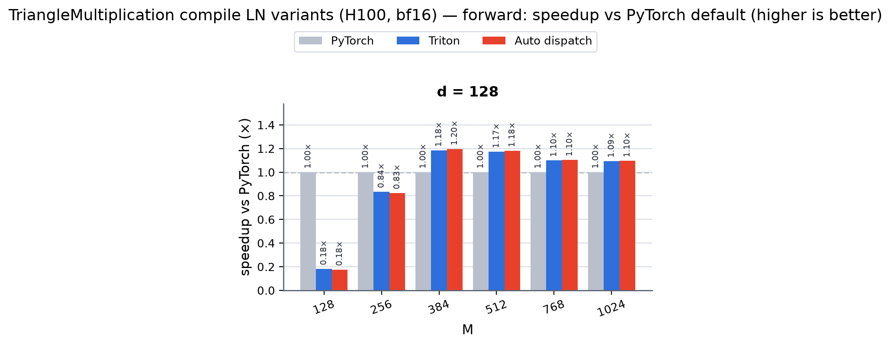
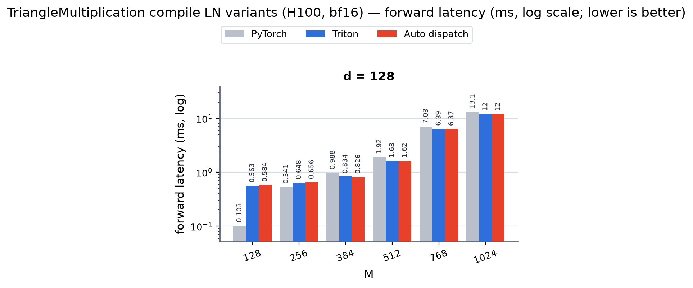
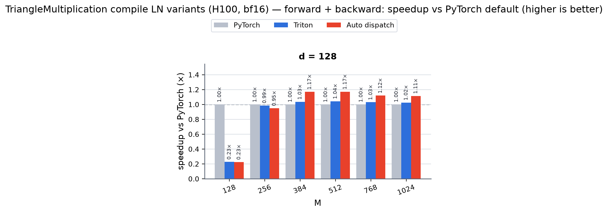
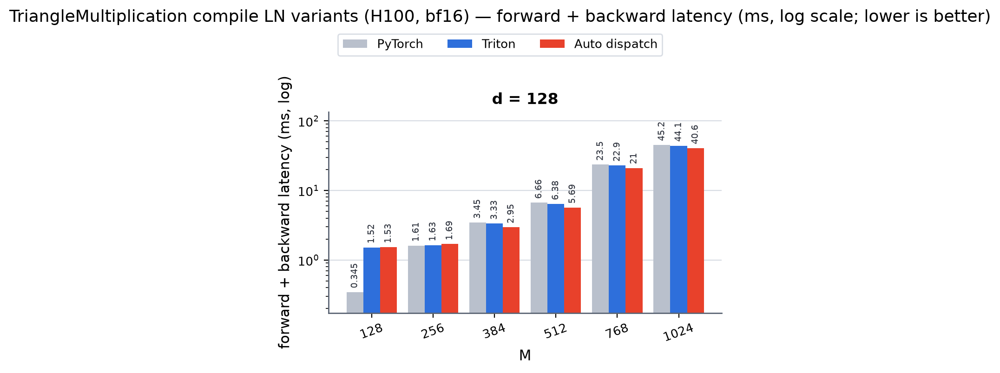

# TriangleMultiplication compile LN variants (H100, bf16)

_Source: `/home/psk6950/miniworld-kernels/src/miniworld_kernels/modules/triangle_multiplication/benchmark/trimul_layernorm_compile.out`_

## forward: speedup vs PyTorch default (×)

_higher is better; table rows = d, columns = M, bold = fastest. See `trimul_layernorm_compile_fwd_speedup.png`._

_speedup of Triton / Auto dispatch vs PyTorch (bold = best)_

| d (=d_in=d_out) | M=128 | M=256 | M=384 | M=512 | M=768 | M=1024 |
|---|---|---|---|---|---|---|
| 128 | **0.18×** / 0.18× | **0.84×** / 0.83× | 1.18× / **1.20×** | 1.17× / **1.18×** | 1.10× / **1.10×** | 1.09× / **1.10×** |

### forward latency (ms)

_absolute latency, log scale, lower is better; rows = d, columns = M_

_backends: pytorch / triton / layernorm_dispatch (bold = fastest)_

| d (=d_in=d_out) | M=128 | M=256 | M=384 | M=512 | M=768 | M=1024 |
|---|---|---|---|---|---|---|
| 128 | **0.1028** / 0.5628 / 0.5836 | **0.5409** / 0.6476 / 0.6556 | 0.9879 / 0.8341 / **0.8255** | 1.9173 / 1.6345 / **1.6228** | 7.0260 / 6.3946 / **6.3686** | 13.1299 / 12.0139 / **11.9860** |

## forward + backward: speedup vs PyTorch default (×)

_higher is better; table rows = d, columns = M, bold = fastest. See `trimul_layernorm_compile_fwd_bwd_speedup.png`._

_speedup of Triton / Auto dispatch vs PyTorch (bold = best)_

| d (=d_in=d_out) | M=128 | M=256 | M=384 | M=512 | M=768 | M=1024 |
|---|---|---|---|---|---|---|
| 128 | **0.23×** / 0.23× | **0.99×** / 0.95× | 1.03× / **1.17×** | 1.04× / **1.17×** | 1.03× / **1.12×** | 1.02× / **1.11×** |

### forward + backward latency (ms)

_absolute latency, log scale, lower is better; rows = d, columns = M_

_backends: pytorch / triton / layernorm_dispatch (bold = fastest)_

| d (=d_in=d_out) | M=128 | M=256 | M=384 | M=512 | M=768 | M=1024 |
|---|---|---|---|---|---|---|
| 128 | **0.3451** / 1.5158 / 1.5332 | **1.6051** / 1.6289 / 1.6915 | 3.4505 / 3.3340 / **2.9490** | 6.6605 / 6.3849 / **5.6852** | 23.5261 / 22.8560 / **21.0209** | 45.1612 / 44.0645 / **40.5513** |

## Correctness summary

_cells show relative Frobenius error / cosine similarity_

| d (=d_in=d_out) | M | backend | fwd rel/cos | dx rel/cos | dw rel/cos | db rel/cos |
|---|---:|---|---|---|---|---|
| 128 | 128 | pytorch | 0.000e+00 / 0.000000 | 0.000e+00 / 0.000000 | 0.000e+00 / 0.000000 | 0.000e+00 / 0.000000 |
| 128 | 128 | triton | 0.000e+00 / 0.000000 | 0.000e+00 / 0.000000 | 0.000e+00 / 0.000000 | 0.000e+00 / 0.000000 |
| 128 | 128 | layernorm_dispatch | 0.000e+00 / 0.000000 | 0.000e+00 / 0.000000 | 0.000e+00 / 0.000000 | 0.000e+00 / 0.000000 |
| 128 | 256 | pytorch | 0.000e+00 / 0.000000 | 0.000e+00 / 0.000000 | 0.000e+00 / 0.000000 | 0.000e+00 / 0.000000 |
| 128 | 256 | triton | 0.000e+00 / 0.000000 | 0.000e+00 / 0.000000 | 0.000e+00 / 0.000000 | 0.000e+00 / 0.000000 |
| 128 | 256 | layernorm_dispatch | 0.000e+00 / 0.000000 | 0.000e+00 / 0.000000 | 0.000e+00 / 0.000000 | 0.000e+00 / 0.000000 |
| 128 | 384 | pytorch | 0.000e+00 / 0.000000 | 0.000e+00 / 0.000000 | 0.000e+00 / 0.000000 | 0.000e+00 / 0.000000 |
| 128 | 384 | triton | 0.000e+00 / 0.000000 | 0.000e+00 / 0.000000 | 0.000e+00 / 0.000000 | 0.000e+00 / 0.000000 |
| 128 | 384 | layernorm_dispatch | 0.000e+00 / 0.000000 | 0.000e+00 / 0.000000 | 0.000e+00 / 0.000000 | 0.000e+00 / 0.000000 |
| 128 | 512 | pytorch | 0.000e+00 / 0.000000 | 0.000e+00 / 0.000000 | 0.000e+00 / 0.000000 | 0.000e+00 / 0.000000 |
| 128 | 512 | triton | 0.000e+00 / 0.000000 | 0.000e+00 / 0.000000 | 0.000e+00 / 0.000000 | 0.000e+00 / 0.000000 |
| 128 | 512 | layernorm_dispatch | 0.000e+00 / 0.000000 | 0.000e+00 / 0.000000 | 0.000e+00 / 0.000000 | 0.000e+00 / 0.000000 |
| 128 | 768 | pytorch | 0.000e+00 / 0.000000 | 0.000e+00 / 0.000000 | 0.000e+00 / 0.000000 | 0.000e+00 / 0.000000 |
| 128 | 768 | triton | 0.000e+00 / 0.000000 | 0.000e+00 / 0.000000 | 0.000e+00 / 0.000000 | 0.000e+00 / 0.000000 |
| 128 | 768 | layernorm_dispatch | 0.000e+00 / 0.000000 | 0.000e+00 / 0.000000 | 0.000e+00 / 0.000000 | 0.000e+00 / 0.000000 |
| 128 | 1024 | pytorch | 0.000e+00 / 0.000000 | 0.000e+00 / 0.000000 | 0.000e+00 / 0.000000 | 0.000e+00 / 0.000000 |
| 128 | 1024 | triton | 0.000e+00 / 0.000000 | 0.000e+00 / 0.000000 | 0.000e+00 / 0.000000 | 0.000e+00 / 0.000000 |
| 128 | 1024 | layernorm_dispatch | 0.000e+00 / 0.000000 | 0.000e+00 / 0.000000 | 0.000e+00 / 0.000000 | 0.000e+00 / 0.000000 |
